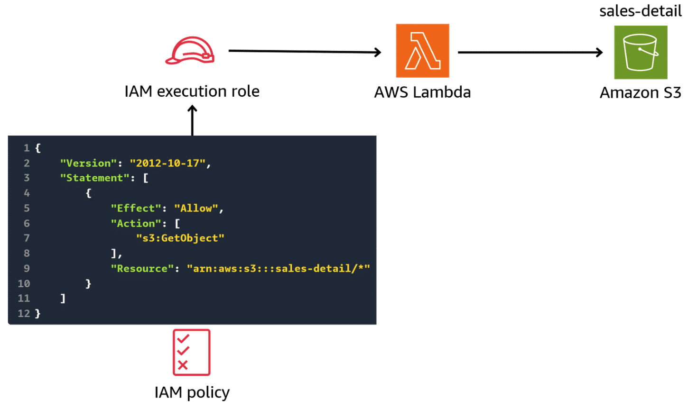
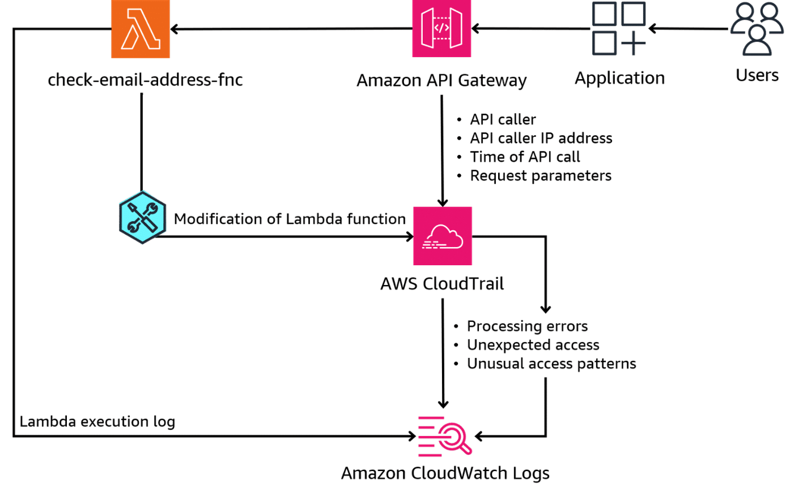
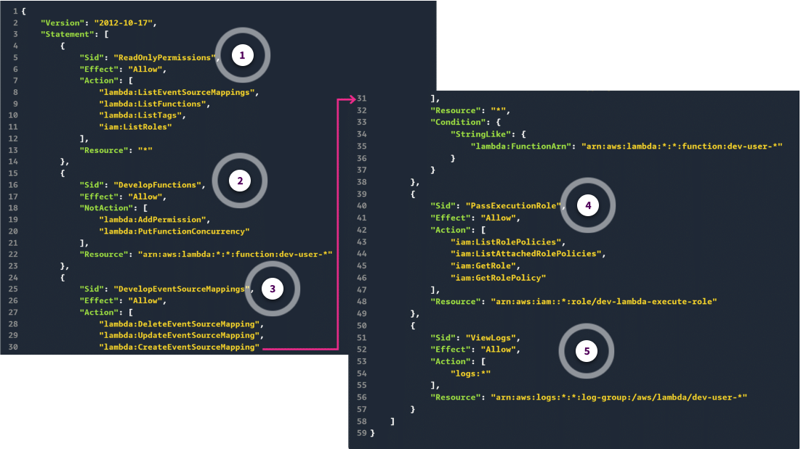
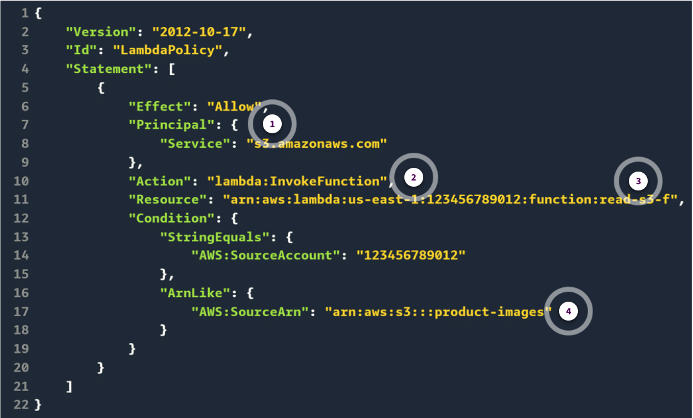

# Week 1: Security 3 Part 1: Security with AWS Lambda

* back to AWS Cloud Institute repo's root [aci.md](../aci.md)
* back to [AWS Cloud Fundamentals 2](./aws-cloud-fundamentals-2.md)
* back to repo's main [README.md](../../../README.md)

## AWS Lambda Security Best Practices

As with all aspects of security in the AWS Cloud, the approach to security with AWS Lambda functions should adhere to the principles of least privilege.

### Review of least privilege concepts

The security principle of least privilege means giving a user or system only those privileges that are essential to perform their intended function, and nothing more. Furthermore, those privileges should only be made available where and when they are needed. This approach is supported through the use of temporary credentials and the dynamic assumption of IAM roles. Avoiding the use of long-term credentials can also reduce potential risk.

With IAM, you can manage access to AWS services and resources securely. Using IAM, you are able to implement the principle of least privilege and enforce separation of duties with appropriate authorization for each interaction with your AWS resources. IAM also gives you the ability to centralize privilege management and reduce or even eliminate reliance on long-term credentials.

### Least privilege with Lambda

IAM plays a crucial role in implementing the principle of least privilege for Lambda functions. When creating a Lambda function, you can assign an IAM role to it. This defines the permissions and access levels the function has to interact with other AWS services and resources.

By following the least privilege principle, you can grant the Lambda function only the minimum permissions required to perform its intended tasks.

For example, suppose your Lambda function needs to read data from an Amazon Simple Storage Service (Amazon S3) bucket. You can create an IAM policy that allows the function to perform the s3:GetObject action on that specific bucket, but denies any other actions or access to other AWS resources.

This approach helps to minimize the potential impact of a security breach or a compromised function, because the function's permissions are limited to only what is necessary.

#### Controlling permissions with execution roles

When creating a Lambda function, you must assign an execution role to it. Lambda execution roles are an important component in implementing the principle of least privilege for Lambda functions. Execution roles define the permissions and access levels that a Lambda function has when interacting with other AWS services and resources. By carefully configuring an execution role, you can ensure that your Lambda function operates within the boundaries of the least privilege principle. This reduces the risk of unauthorized access or unintended actions.

AWS provides a set of predefined AWS managed policies that you can attach to the execution role, granting specific permissions based on common use cases. Alternatively, you can create custom IAM policies tailored to your specific requirements, so you can fine-tune the permissions granted to your Lambda functions.

This image shows a Lambda function that has been assigned an IAM role whose IAM policy grants read access to an S3 bucket called **sales-detail**.



Lambda functions use an execution role to access Amazon resources.

Lambda execution roles can also be used to grant temporary permissions to functions, which can be useful in situations where a function needs to perform a one-time task that requires additional permissions.

For example, a function that is designed to perform a one-time backup of a critical dataset will need access to the dataset and the AWS services required to perform the backup. But, the function does not require ongoing access to the dataset or services. By creating an execution role that grants only the necessary permissions for the one-time task, users can help to reduce the risk of over-privileged access. This ensures that the function only has access to the resources it needs, when it needs them.

This table summarizes how the principles of least privilege and Lambda execution roles can be used together to ensure application security.

| Least privilege recommendation | Security benefit |
| ------------------------------ | ---------------- |
| Start by granting Lambda functions the minimum necessary permissions and gradually expand them as needed. | Avoids over-allocation of permissions that might not be needed to perform the required action. |
| Avoid granting overly broad, wildcard permissions in Lambda execution roles.| Decreases the attack surface and potential damage if a Lambda function is compromised |
| Regularly review and audit the permissions granted to your Lambda execution roles. | Ensures the execution roles remain aligned with the least privilege principle and your evolving application requirements |
| Consider using AWS managed policies instead of custom policies for Lambda functions. | Provides predefined permissions for common application use cases |
| Consider using resource-based policies in conjunction with managed policies for Lambda functions. | Explicitly denies access to certain IAM roles or principals, even if they have been granted permissions through their execution role |

---

#### Creating and assigning an execution role

You can use the AWS Management Console, AWS command line interface (AWS CLI), or AWS SDK to create Lambda execution roles. When creating an execution role, you will need to define a set of permissions for the role. You can define permissions that are required by any AWS service.

This example shows you how to create a Lambda execution role that provides access to CloudWatch Logs. This type of access is helpful for a Lambda function that will be used to search CloudWatch Logs for specific events.

We will assign an AWS IAM policy, called **Lambda-CloudWatch-Reader**, to an AWS Lambda function.

```json
{
    "Version": "2012-10-17",
    "Statement": [
        {
            "Effect": "Allow",
            "Action": [
                "logs:DescribeLogGroups",
                "logs:DescribeLogStreams",
                "logs:GetLogEvents"
            ],
            "Resource": "arn:aws:logs:*:*:*•"
        }
    ]
}
```

This policy grants the DescribeLogGroups privilege, which is needed to view CloudWatch Log groups associated with the AWS account. It also grants the DescribeLogStreams privilege, which is needed to view all Amazon CloudWatch Log streams associated with a CloudWatch Log group. Lastly, the policy grants the GetEventLogs privilege, which is needed to retrieve CloudWatch Log events from a CloudWatch Log stream.

Assume the Lambda-CloudWatchLog-Reader AWS IAM policy exists, and has already been assigned to an AWS IAM role called Lambda-CloudWatchLogs-Reader-Role. That role will be assigned to a new Lambda function called CloudWatchLog-Reader-Lambda as the function’s execution role. The role will allow the function to access entries in CloudWatch Logs.

1. To associate the Lambda function with the policy and role, begin by searching for Lambda in the AWS Management Console. On the AWS Lambda page, choose Functions and then choose Create function.
2. On the **Create functio**n page, for the function option, choose **Use a blueprint**. For the Blueprint name, enter **Process CloudWatch log data**, and for the function name, enter **CloudWatchLog-Reader-Lambda**.  Lastly, choose **Existing role** and assign the **Lambda-CloudWatchLog-Reader-Role**. This is the role that has to  be assigned the AWS IAM policy that provides access to CloudWatch Logs.
3. On the **Create function** page, scroll to the **CloudWatch Logs trigger** section. Choose a log group to search for events, and assign a **Filter name**. Here we use **CloudWatchLogs AWS STS Filter**. This example includes an optional Filter pattern, which is used to search for occurrences of **sts.amazonaws.com** events in the CloudWatch logs.
4. After you complete the AWS Lambda function definition, the new function will be displayed on the **Functions** page. Choose the function, and then the **Function overview** page appears. To see the privileges that the function has been granted through the execution role, choose the **Configuration** tab, and then the **Permissions** tab.
5. On the **By action** tab of the **Resource summary** page, you can see the three CloudWatch Log privileges that were included in the **Lambda-CloudWatch-Reader** AWS IAM policy that was assigned to the **Lambda-CloudWatchLogs-Reader-Role** Because this role is the function’s execution role, the privileges are also available to the function.
6. The **By resource** tab of the **Resource summary** page shows which resources are available to the function. It also shows the actions that the function can perform on those resources. This example shows that the function can access any CloudWatch Log, and it has read access on those logs, based on the privileges that were included in the **Lambda-CloudWatch-Reader** AWS IAM policy.

---

#### Execution roles to connect to a VPC

Two permissions are required to interact with resources that are in a VPC. Execution role permissions are needed to interact with the Lambda function, and the Lambda function must be connected to the VPC. Therefore, your execution role permissions must include the ability to work with network interfaces. This is because, when you connect a function to a VPC, Lambda creates an elastic network interface for each combination of security group and subnet in your function's VPC configuration. A managed policy includes the permissions that you need. The Lambda console has an option to connect to the VPC.

---

### Data protection in Lambda

Least privilege principles and role-based access controls can be used for Lambda security. Data protection is another important aspect of Lambda security that you should consider in your serverless application architecture. This includes encrypting data accessed by Lambda functions while it is in transit and at rest.

#### Protecting data in transit

Encryption is the method used to protect data in transit. By default, Lambda API endpoints only support secure connections over HTTPS. Any calls made to Lambda resources using the AWS Management Console, AWS CLI, AWS SDK, or the Lambda API will be encrypted using Transport Layer Security (TLS).  Furthermore, Lambda functions that are connected to a Amazon Elastic File System (Amazon EFS) also use encryption in transit for those connections.

#### Protecting data at rest

As with data in transit, data at rest is also protected through data encryption. Lambda always encrypts files that you upload to Lambda.

For Lambda functions that rely on environment variables, client-side encryption can be used to protect the data stored in those variables by turning on console encryption. With console encryption, you can encrypt the values of your environment variables using the Lambda console or the AWS CLI. The encrypted values are then stored securely in Lambda, and the function can access and decrypt them at runtime using the Lambda function's execution role permissions.

By default, Lambda uses an AWS Key Management Service (AWS KMS) key called **aws/lambda** to encrypt your environment variables. Alternatively, on a function-by function-basis, you can also configure Lambda to use a customer managed key instead of the default AWS managed key.

---

### Auditing Lambda

CloudTrail and CloudWatch Logs can be used to audit Lambda function activity for changes, unexpected access, unusual patterns, or errors. This diagram provides a conceptual representation of how these two services can be used for auditing of Lambda functions.



Lambda functions can be audited using CloudTrail and CloudWatch Logs.

This diagram shows that CloudTrail records API calls made to the check-email-address Lambda function made using the API Gateway. CloudTrail captures the identity of the API caller, the caller's source IP address, the time of the API call, and the request parameters. Additionally, any API calls to modify the function itself are also captured to CloudTrail. These modifications can include the creation, modification, or deletion of a Lambda functions. This audit trail can help you identify any unauthorized or unexpected changes to your Lambda functions, in addition to detecting any unusual patterns of invocations.

CloudWatch Logs can collect and store log data from Lambda. When you create a Lambda function, you can configure it to send execution logs to CloudWatch Logs. These logs contain valuable information about the function's execution, such as the input event data, the output response, and any errors or exceptions that occurred during the execution. By analyzing these logs, you can identify and troubleshoot any issues or errors that might have occurred with your Lambda functions. You can also detect any unusual patterns or behaviors.

By using CloudTrail and CloudWatch Logs, you can effectively audit your Lambda functions for changes, unexpected access, unusual patterns, or errors. This helps you maintain the security and integrity of your Lambda functions. It can also help you proactively identify and resolve any issues or potential threats to your AWS environment.

---

CloudTrail and CloudWatch Logs data from Lambda functions can be integrated with Amazon Athena and Amazon QuickSight to perform advanced analytics and visualizations on the audit data.

---

## Common AWS Managed Policies for AWS Lambda

AWS provides over 1,200 managed policies designed to provide the required access permissions for many common application use cases. These policies make it faster for you to get started with assigning permissions to users, groups, and roles than if you had to write the policies yourself.

Some of these policies can be used to control permissions used with Lambda functions. To meet your application requirements, these policies might be individually granted to Lambda functions, or combined with other policies.

### AWS managed policies for Lambda functions

The following table lists some of the AWS managed policies for Lambda functions that are used to support common application requirements. These activities include logging, accessing virtual private clouds (VPCs), invoking other services, and accessing specific AWS resources like DynamoDB and Amazon S3.

| Managed policy | Policy permissions |
| -------------- | ------------------ |
| AWSLambda_FullAccess | *Full access* to Lambda actions, and permissions to other AWS services that are used to develop and maintain Lambda resources, including CloudFormation, CloudWatch and CloudWatch Logs, Amazon EC2, and IAM |
| AWSLambda_ReadOnlyAccess | *Read-only* access to Lambda resources and to other AWS services that are used to develop and maintain Lambda resources, including CloudFormation, CloudWatch and CloudWatch Logs, Amazon EC2, and IAM |
| AWSLambdaBasicExecutionRole | Upload logs to CloudWatch Logs |
| AWSLambdaDynamoDBExecutionRole | Read records from a DynamoDB stream and write to CloudWatch Logs |
| AWSLambdaExecute | PUT and GET access to Amazon S3 and full access to CloudWatch Logs |
| AWSLambdaInvocation-DynamoDB | Read access to DynamoDB Streams |
| AWSLambdaRole | Invoke Lambda functions |
| AWSLambdaSQSQueueExecutionRole | Read and delete messages from an Amazon Simple Queue Service (Amazon SQS) queue, and grant write permissions to CloudWatch Logs |

A full list of all the available AWS managed policies for Lambda functions is available in the Additional Resources section.

If AWS updates the permissions defined in any of these AWS managed policies, the update affects all users, groups, and roles that the policy is attached to. It's possible that managed policy changes could lead to unexpected access errors.

However, AWS generally only updates AWS managed policies when a new AWS service is launched, or a new API operation is made available for an existing service.

### Example of a managed policy

Just like the custom IAM policies that you can create, AWS managed policies use JSON policy documents to define their access permissions.

You cannot modify the JSON or change the permissions defined in AWS managed policies. However, reviewing managed policy code can be helpful when creating your own custom AWS IAM policies. The source code for each AWS managed policy is available in the Additional Resources section.

This example shows the 14 lines of JSON code for the **AWSLambdaRole** policy. This policy grants the principal access to invoke any Lambda function.

```json
{  
    "Version": "2012-10-17",
    "Statement" : [
        {
            "Effect" : "Allow",
            "Action" : [
                "lambda:InvokeFunction"
                ],
                "Resource" : [
                    "*"
                ]
        }
    ]
}
```

---

It's important to note that in some cases, managed policies grant broad permissions. However, the principle of least privilege still applies. In some cases, rather than use a managed policy, it might be best to create a custom policy with fewer permissions to meet your specific requirements.

---

## AWS Lambda Function Invocation with IAM

AWS offers identity-based and resource-based IAM policies to define permissions for controlling who can invoke, update, or delete Lambda functions. Additionally, restrictions can be included within the policies themselves to provide even more granular control over what actions a user can perform using a function.

### Restricting Lambda policies

You can restrict the scope of a user's permissions within a Lambda function by specifying conditions and resources within the function's IAM policy.

#### Restricting policies using conditions

Conditions are an optional policy element that applies additional logic to determine whether or not a specific action should be allowed. In addition to common conditions that all actions support, Lambda defines condition types that you can use to restrict the values of additional parameters on some actions. For example, with the lambda:Principal condition, you can restrict the service or account to which a user can grant invocation access.

Policy using Conditions section to restrict privileges:

```json
{
  "Version": "2012-10-17",
   "Statement" : [
    {
        "Sid" : "ManageFunctionPolicy",
        "Effect": "Allow",
        "Action" : [
            "lambda:AddPermission"
            "lambda:RemovePermission"
        ],
        "Resource": "arn:aws:lambda:us-east-1:123456789012:function:DEV:*",
        "Condition": {
            "StringEquals": {
                "lambda:Principal": "sns.amazonaws.com"
                }
        }
    }
   ]
}
```

This condition-based policy grants permissions to manage permissions for Lambda functions with a specific naming pattern. However, this is only when the principal requesting the permissions is the Amazon Simple Notification Service (Amazon SNS).

Specifically, the **"Condition"** section of the policy allows the Amazon SNS service to add or remove permissions from Lambda functions in the us-east-1 Region, within the specified AWS account **123456789012**, with a function name of **DEV**.

---

#### Restricting policies by function resource name

By default, if the policy's action doesn't specify a named resource, then permission is granted to perform the action on all resources. Alternatively,  permission can be explicitly granted to perform the action on all resources. In either case, the value of the resource in the policy is denoted by the * *wildcard* character.

For many actions, you can restrict the resources that a user can modify by specifying the *Amazon Resource Name (ARN)* of the resource, or an ARN pattern that matches multiple resources.

Policy with resource condition based on ARN:

```json
{
    "Version": "2012-10-17",
    "Statement" : [
        {
            "Sid" : "Invoke",
            "Effect": "Allow",
            "Action" : [
                "lambda:InvokeFunction"
            ],
            "Resource": "arn:aws:lambda:us-east-1:123456789012:function:fcn"
        }
     ]
}
```

In the example shown here, the policy only allows a user in AWS account **123456789012** to invoke a function named **fcn** in the **us-east-1** Region.

The format of a function ARN depends on whether you are referencing the whole function, the function by version number, or using an alias.

Referencing the whole function is called an *unqualified reference*. Using a version or alias in the reference is known as a *qualified reference*. Examples of the policy syntax for specifying each reference type is shown in the following table.

| Reference type | Sample syntax | Description |
| -------------- | ------------- | ----------- |
| Unqualified reference, not specifying a version or alias | "Resource": "arn:aws:lambda:us-east-2:123456789012:**function:Fnc**" | Permissions for specified ARN apply to the current version of the function |
| Qualified reference using version | "Resource": "arn:aws:lambda:us-west-2:123456789012:**function:Fnc:1**" | Permissions for specified ARN only apply to version 1 of the function |
| Qualified reference using alias | "Resource": "arn:aws:lambda:us-west-2:123456789012:**function:Fnc:DEV**" | Permissions for specified ARN only apply to the DEV alias for the function |

---

#### Restricting policies by function actions

Another way to achieve granular control over Lambda function permissions is by using *function actions* as conditions in IAM policies. Function actions refer to specific operations that can be performed on a Lambda function, such as invoking, updating, or deleting the function. With some function actions, you can also use the function version or alias when referring to the function.

For example the *AddPermission* function action can use *lambda:Principal* to restrict which principals are allowed to add permissions to functions. There are over 40 functions available for use in policies. For a complete list of these function actions and their associated conditions, see [Resources and Conditions for Lambda Actions](https://docs.aws.amazon.com/lambda/latest/dg/lambda-api-permissions-ref.html) in the *AWS Lambda Developer Guide*.

---

#### Restricting policies using event source mapping actions

Using event source mappings actions, you can restrict delete and update permissions to a specific event source. With the *lambda:FunctionArn* condition, you can restrict which functions can be configured to be invoked by an event. For these actions, the resource is the event source mapping. Lambda provides a condition that gives you the ability to restrict permission based on the function invoked by an event source.

The following table summarizes the action, resources, and condition that can be used to implement event source mappings actions.

| Action | Resource | Condition |
| ------ | -------- | --------- |
| DeleteEventSourceMapping | Event source mapping | lambda:FunctionArn |
| UpdateEventSourceMapping | Event source mapping | lambda:FunctionArn |
| CreateEventSourceMapping | Wildcard (*) | lambda:FunctionArn |
| GetEventSourceMapping | Wildcard (*) | lambda:FunctionArn |
| ListEventSourceMappings | Wildcard (*) | None |

For example, suppose you have a Lambda function that is invoked by events from a specific source, like an Amazon Kinesis Data Stream. To manage this event source mapping (the connection between the event source and your Lambda function), you need specific permissions. Next, assume you want to give someone the ability to delete or update this event source mapping, but only for a specific event source.

The following is an example policy that uses a wildcard to restrict, delete, and update permissions to the event source mapping to a specific Kinesis Data Stream.

Policy using event source mapping as a restriction condition

```json
{
    "Version": "2012-10-17",
    "Statement": [
        {
            "Effect": "Allow",
            "Action": [
                "lambda:DeleteEventSourceMapping",
                "lambda:UpdateEventSourceMapping"
            ],
            "Resource": "arn:aws:lambda:us-east-1:123456789012:event-source-mapping:a1b2c3d4e5f6*",
            "Condition": {
                "StringEquals": {
                    "lambda:FunctionArn": "arn:aws:lambda:us-east-1:123456789012:function:LoadSalesData"
                }
            }
        }
    ]
}
```

In this policy, the **Resource field** uses the * **wildcard** at the end of the event source mapping ARN. This means that the permissions will apply to any event source mapping ARN that starts with **arn:aws:lambda:us-east-1:123456789012:event-source-mapping:a1b2c3d4e5f6**. Additionally, the **Condition block** ensures that these permissions are only granted for the event source mapping associated with the **LoadSalesData** Lambda function.

So, in basic terms, the wildcard acts as a placeholder. You can match and grant permissions to resources that follow a specific pattern, without having to specify the entire resource ARN. This way, you can restrict permissions to a specific event source mapping without giving too much access.

---

#### Restricting policies using layers

Lambda functions can have additional software or libraries installed, which are called layers. Layers usually contain library dependencies, a custom runtime, or configuration files.

You can take actions on the different layers, so you can restrict which layers can be managed or used with a Lambda function. Layers are like specific permissions that you can grant or deny for different operations related to Lambda functions. For example, you might want to allow developers to list the available layer versions, but not necessarily create or delete layers. Some layers grant permissions to act on a specific layer version. Other actions grant permissions to act on the most recent layer. Wildcards can also be used when working with Lambda layers.

The following table summarizes the action and resources related to Lambda layers. Unlike event source mapping actions, layers do not have any conditions.  

| Action | Resource |
| ------ | -------- |
| AddLayerVersionPermission | Layer version |
| RemoveLayerVersionPermission | Layer version |
| GetLayerVersion | Layer version |
| GetLayerVersionPolicy | Layer version |
| DeleteLayerVersion | Layer |
| ListLayerVersions | Layer |
| PublishLayerVersion | Layer |
| ListLayers | Wildcard (*) |

This is an example policy that has a layer called **LL-dev** that you and your development team are using for your application. The policy defines which actions you and the other members of the development team can perform on this LL-dev layer. The policy also specifies that this permission only applies to the LL-dev layer in the us-east-1 Region and for the specified AWS account ID, 123456789012.

Policy using a layer as a restriction condition

```json
{
    "Version": "2012-10-17",
    "Statement": [
        {
            "Effect": "Allow",
            "Action": "lambda:ListLayerVersions",
            "Resource": "arn:aws:lambda:us-east-1:123456789012:layer:LL-dev",
            "Condition": {
                "StringEquals": {
                    "aws:PrincipalAccount": "123456789012"
                }
            }
        }
    ]
}
```

With this policy, you or anyone else from the AWS account can perform the **lambda:ListLayerVersions** action on the LL-dev layer. This action is like being able to see a list of all the different versions of the LL-dev layer that are available. This might be useful for keeping track of changes and ensuring that everyone is working with the correct version of the layer for your application. However, the policy does not allow you to make any changes to the function, like creating new versions, updating existing versions, or deleting versions.

---

### Identity-based IAM policies for Lambda

You can use identity-based policies in IAM to grant users in your account access to Lambda resources. Identity-based policies can apply to users directly, or to groups and roles that are associated with a user. You can also grant users in another account permission to assume a role in your account and access your Lambda resources. Lambda provides AWS managed policies that grant access to Lambda API actions, but you can also create your own custom policies, as well.

#### Example of an identity-based policy

The following is a basic identity-based policy example. This policy is designed to provide a controlled set of permissions for managing and developing Lambda functions whose names start with **dev-user-**. It allows read-only access to various Lambda resources, function development and management, event source mapping management, passing a specific execution role, and viewing logs associated with dev-user-* functions.



```json
{
    "Version": "2012-10-17",
    "Statement": [
        {
            "Sid": "ReadOnlyPermissions",
            "Effect": "Allow", 
            "Action": [
                "lambda:ListEventSourceMappings",
                "lambda:ListFunctions",      
                "lambda:ListTags",
                "iam:ListRoles"
            ],
            "Resource": "*"
        },
        {
            "Sid": "DevelopFunctions",
            "Effect": "Allow", 
            "NotAction": [
                "lambda:AddPermission",
                "lambda:PutFunctionConcurrency"
            ],
            "Resource": "arn:aws:lambda:*:*:function:dev-user-*"
        },
        {
            "Sid": "DevelopEventSourceMappings",
            "Effect": "Allow", 
            "Action": [
                "lambda:DeleteEventSourceMapping",
                "lambda:UpdateEventSourceMapping",
                "lambda:CreateEventSourceMapping"
            ],
            "Resource": "*",
            "Condition": {
                "StringLike": {
                    "lambda:FunctionArn": "arn:aws:lambda:*:*:function:dev-user-*"
                }
            }
        },
        {
            "Sid": "PassExecutionRole",
            "Effect": "Allow", 
            "Action": [
                "iam:ListRolePolicies",
                "iam:ListAttachedRolePolicies",
                "iam:GetRole",
                "iam:GetRolePolicy"
            ],
            "Resource": "arn:aws:iam::*:role/dev-lambda-execute-role"
        },
        {
            "Sid": "ViewLogs",
            "Effect": "Allow", 
            "Action": [
                "logs:*"
            ],
            "Resource": "arn:aws:logs:*:*:log-group:/aws/lambda/dev-user-*"
        }
    ]
}
```

1. **ReadOnlyPermissions**

    This statement allows read-only actions related to Lambda functions, event source mappings, and IAM roles. It grants permissions to retrieve information about Lambda account settings, functions, function configurations, code signing configs, concurrency settings, event source mappings, tags, and IAM roles. The Resource field is set to the * wildcard. This means these read-only permissions apply to all resources in the account.

2. **DevelopFunctions**

    This statement allows the development and management of Lambda functions with names starting with name **dev-user-**. It grants permissions to perform actions like getting, creating, updating, and deleting Lambda functions. The  Amazon Resource Name (ARN) **arn:aws:lambda:*:*:function:dev-user-*** limits these permissions to functions with names starting with **dev-user-**, but in any Regions or account.

3. **DevelopEventSourceMappings**

    This statement allows the management of event source mappings for Lambda functions with names that begin with **dev-user-**. It grants permissions to create, update, and delete event source mappings. The Resource field is set to the * **wildcard**. However, the condition block restricts these permissions to event source mappings associated with functions whose ARN matches the pattern **arn:aws:lambda:*:*:function:dev-user-***.

4. **PassExecutionRole**

    This statement allows the principal to pass a specific execution role called **dev-lambda-execute-role** to Lambda functions. It grants permissions to list role policies, attach policies, get role details, get role policies, pass roles, and simulate principal policies. The Resource field specifies the ARN of the **dev-lambda-execute-role** role.

5. **ViewLogs**

    This statement allows the principal to view and manage CloudWatch Logs log groups associated with Lambda functions whose names start with **dev-user-**. The **logs:*** notation grants permissions to perform all actions on log groups with names matching the pattern **/aws/lambda/dev-user-***.

    The Resource field specifies the ARN pattern **arn:aws:logs:*:*:log-group:/aws/lambda/dev-user-***. This limits these permissions to log groups associated with dev-user- functions, but in any Region or account.

---

### Resource-based policies for Lambda

A resource-based policy tells the Lambda service which principals have permission to invoke the Lambda function. An AWS principal might be a user, role, another AWS service, or another AWS account.

Resource policies make it convenient to grant access to Lambda functions across separate AWS accounts. For example, suppose you need an Amazon S3 bucket in a development account to invoke a Lambda function in a test environment account. Two options you could consider to achieve this include the following:

* Create a new IAM role in the test account. Allow the development account to assume the role in the test account, and then invoke the function.
* Create a resource-based policy that allows the development account to invoke the function in the test account. 

The resource-based policy is a more convenient option. Not only does it involve less complexity, you can also see and modify the policy from the Lambda console, if needed.

#### Example of a resource-based policy

The following is a basic resource-based policy example. This policy allows the Amazon S3 service to invoke the **read-s3-f** Lambda function in the **us-east-1** Region. However the conditions clause only allows the request if it originates from the AWS account with the ID **123456789012**. The request must also be for access to the **product-images** Amazon S3 bucket.

This type of policy is used to configure an event notification that invokes a Lambda function whenever an object is created, updated, or deleted in a specific S3 bucket. By attaching this policy to the Lambda function's resource policy, you ensure that only the Amazon S3 service from the specified account and bucket can invoke the function. This provides a secure and controlled access mechanism.



```json
{
    "Version": "2012-10-17",
    "Id": "LambdaPolicy",
    "Statement": [
        {
            "Effect": "Allow",
            "Principal": {
                "Service": "s3.amazonaws.com"
            },
            "Action": "lambda:InvokeFunction",
            "Resource": "arn:aws:lambda:us-east-1:123456789012:function:read-s3-f",
            "Condition": {
                "StringEquals": {
                    "AWS:SourceAccount": "123456789012"
                },
                "ArnLike": {
                    "AWS:SourceArn": "arn:aws:s3:::product-images"
                }
            }
        }
    ]
}
```

1. **Principal**

    Specifies that the s3.amazonaws.com service is allowed to perform the actions.

2. **Action**

    Defines the action that the Amazon S3 service is given the ability to perform. In this case, invoke a Lambda function using **lambda:InvokeFunction**.

3. **Resource**

    The Lambda function the policy can invoke is called **read-s3-f**.

4. **Condition**

    The request to invoke the function must originate from an AWS account ID **123456789012**. The request will only be allowed to access the Amazon S3 bucket associated with the ARN, which is called **product-images**.

---

#### Debugging resource-based access issues

When integrating API Gateway with an Lambda function, proper configuration of the resource-based policy on the Lambda function is crucial to ensure successful function invocation. If the policy is not configured correctly, API Gateway might encounter issues invoking the Lambda function, leading to errors and failed requests.

One common problem arises when the resource-based policy on the Lambda function does not grant the necessary permissions for API Gateway to invoke the function. This can happen if the policy is too restrictive or if it does not include the correct principal or source ARN conditions.

Consider the following resource-based policy attached to a Lambda function. In this policy, the Principal is set to **apigateway.amazonaws.com**, which allows API Gateway to invoke the Lambda function called **Fnc-L**. However, the Condition block specifies that the source account must be **210987654321**, which is different from the account ID **123456789012** where the Lambda function is deployed.


```json
{
    "Version": "2012-10-17",
    "Id": "LambdaPolicy"
    "Statement" : [
        {
            "Effect": "Allow",
            "Principal" : {
                "Service": "apigateway.amazonaws.com"
            },
            "Action": "lambda.InvokeFunction",
            "Resource": "arn:aws:lambda:us-east-1:123456789012:function:Fnc-L",
            "Condition": {
                "StringEquals": {
                    "AWS:SourceAccount": "210987654321"
                }
            }
         }
     ]
}
```

If API Gateway attempts to invoke the Fnc-L Lambda function with this policy in place, it will encounter an error similar to the following:

```json
{
    "message": "User: arn.aws.sts::123456789012:assumed-role/AWS_APIGateway_Access_Role/api-gateway/execute-api is not authorized to perform: lambda:InvokeFunction on resource arn:aws:lambda:us-east-1:123456789012:function:MyLambdaFunction because no identity-based policy allows the lambda.InvokeFunction action"
}
```

This error indicates that API Gateway, which assumes the role **AWS_APIGateway_Access_Role**, is not authorized to invoke the Lambda function due to the resource-based policy restrictions.

Using this example, there are two options for resolving the issue. The first is to update the resource-based policy on the Lambda function to include the correct source account condition. The other option is to remove the condition altogether if you want to allow API Gateway to invoke the function from any account. The following is an example of a corrected policy, which grants API Gateway the permission to invoke the **Fnc-L** Lambda function without any additional conditions. This ensures the successful invocation of the function from API Gateway.

Corrected IAM policy with the condition clause specifying the AWS account ID removed.

```json
{
    "Version": "2012-10-17",
    "Id": "LambdaPolicy"
    "Statement" : [
        {
            "Effect": "Allow",
            "Principal" : {
                "Service": "apigateway.amazonaws.com"
            },
            "Action": "lambda.InvokeFunction",
            "Resource": "arn:aws:lambda:us-east-1:123456789012:function:Fnc-L"
        }
    ]
}
```

---

### Activity: Identifying Restrictions for AWS Lambda Invocations

The AnyCompany team has decided to use an IAM resource-based policy to restrict access to an AWS Lambda function in their application. This function performs a critical customer credit approval operation.

The team will use an AWS IAM policy to protect this function, and is considering some of the criteria that should be included in the policy's Conditions clause.

#### I think we should include a restriction that invocations of the AWS Lambda function can only come from within our own AWS account. How can we do that?

* Include the aws:SourceAccount in the Condition clause, and specify the AnyCompany AWS account ID.

Wrong answers:

* Include the aws:PrincipalOrgID in the Condition clause, and specify the AnyCompany AWS Organization ID.
* Include the aws:PrincipalArn in the Condition clause, and specify the ARN for the AWS Lambda function.

##### Explanation

Specifying the account ID in the Conditions clause of the IAM policy will allow the application in the AnyCompany AWS account to access the function, but blocks access to all others AWS accounts.

Using aws:PrincipalOrgID in the Condition clause will allow all accounts within that organization to access the function.

#### To further enhance security, the team has decided to require administrative users to use MFA to be granted temporary credentials. Which AWS STS API request should the team look for in CloudTrail to identify these MFA credential requests?

* Requests to GetSessionToken

Wrong answers:

* Requests to AssumeRoleWithSAML
* Requests to AssumeRole

##### Explanation

A request to GetSessionToken passes two parameters to the API: The **SerialNumber** and **TokenCode** of the user's MFA device.

---

## Code Signing for AWS Lambda

Code signing is a security practice that involves digitally signing AWS Lambda function code to ensure its integrity and authenticity. Code signing helps verify that the deployed function code has not been tampered with and originates from a trusted source.

### Understanding code signing

By enabling code signing, AWS Lambda ensures that only authorized and unmodified code is run, providing an additional layer of security and trust. This feature is particularly important when dealing with sensitive data or critical applications, because it helps prevent running malicious or unauthorized code. Overall, code signing with AWS Lambda functions enhances the overall security posture of serverless applications by ensuring the integrity and origin of the deployed code.

When you deploy a signed Lambda function, AWS Lambda verifies the digital signature using the corresponding public key from your code-signing certificate. If the signature is valid and the code artifact hasn't been modified since signing, AWS Lambda allows the deployment to proceed. If the signature is invalid or the code has been tampered with, AWS Lambda rejects the deployment, preventing the execution of untrusted or modified code. Because code signing validation checks run at deployment time, there is no performance impact on function execution.

### Using AWS Signer

AWS Signer is a service provided by AWS that facilitates code signing for AWS Lambda functions and other AWS resources. With Signer, you can securely sign code artifacts, such as Lambda deployment packages, using private code-signing certificates managed by AWS Certificate Manager (ACM).

Signer provides additional features to enhance the code-signing process. For example, it supports code source control integration, so you can automatically sign code artifacts as part of your continuous integration and delivery (CI/CD) pipeline. It also offers rotation policies for code-signing certificates, ensuring that your certificates are regularly rotated and remain secure over time. Additionally, Signer provides detailed logging and auditing capabilities, so you can track and monitor code-signing activities for compliance and security purposes.

### Setting up Lambda code signing

Code signing for Lambda uses Signer to create signing profiles. The steps for creating and using a code-signed Lambda function include the following:

1. Using the AWS Signer console to create a signing profile
2. Using the AWS Management Console, AWS CLI, or AWS SDK to create a code-signing configuration
3. Assigning the code-signing configuration to a new or existing Lambda function
4. Creating a signed code package and publishing it to the Lambda function

---

The following description is the process of using AWS Signer to create a signing profile, and then assign that profile to an existing Lambda function called **check-email-address-fnc**. This function is used to confirm the format of customer email addresses when they place orders with AnyCompany.

1. Access the AWS Signer console by searching for “**signer**” in AWS Management Console, and then choosing **AWS Signer** service from the search results.
2. On the AWS Signer main page, choose the **Create signing profile** button.
3. On the create signing profile page, enter the profile name, and the platform type to which the profile will be applied. In this example, the profile name **lambda_production_profile**, and **AWS Lambda** as the signing platform.
4. Optionally, you can also specify how long the signed profile will be valid, and add tags to help identify the profile. The validation period for signatures generated by a Signing Profile can be between **1 day** and **135 months**.
5. Choose the **Create profile** button.
6. Now that you have defined a **Signing Profile**, you can configure your functions to use **Code Signing**. This is accomplished through the AWS Lambda console, AWS Command-line Interface, or by using APIs to create and attach a resource called a Code Signing Configuration to the function.
7. In this example, go to the Lambda page in the AWS Management Console, and locate the **Code Signing Configurations** menu item under the **Additional Resources** menu. Then, choose the **Create Configuration** button.
8. On the Create Code Signing Configuration page, enter **production-code-signing** for the **Description**. Next, choose your signing profile using the Amazon Resource Name, or ARN. Choose the **lambda_production_profile** signing profile that you created earlier.
9. Finally, choose the **Signature Validation Policy** type, either **Warn** or **Enforce**. With **‘Warn’**, Lambda logs a Cloudwatch metric if there is a signature check failure but accepts the deployment. With **‘Enforce’**, Lambda rejects the deployment if there is a signature check failure.

    The signature check fails if the signature signing profile does not match one of the allowed signing profiles in the **Code Signing Configuration**, if the signature is expired, or if the signature has been revoked. Additionally, the deployment is always rejected, regardless of the signature validation policy, If the code package is tampered or altered since signing.

    You can choose the **Warn** option for this example, and then finish the creation of the **production-code-signing** configuration by choosing the **Create Configuration** button.

10. After the signing job has completed, you can find the signed source code packages in the destination S3 bucket. Navigate to the S3 page in the AWS Management Console to view the signed version of the **check-email-address-fnc** function that was created by the code signing job. Take a moment to copy the S3 URI for the signed zip file for use in the next step.
11. Next, return to the Lambda page in the AWS Management Console. Here you will attach the signed code package to the **check-email-address-fnc** Lambda function. Begin by choosing the **check-email-address-fnc** function, and then the **Upload From** button from the **Code source** section of the **Code** tab. You can use Amazon S3 location to specify the location of the signed code file by pasting the Amazon S3 URL you copied previously. Finish by choosing the **Save** button.
12. After performing these steps, Lambda will perform signature checks on the **check-email-address-fnc** function. These signature checks verify that the function code has not been altered since signing, and that the code has been signed by one of the valid signing profiles. This ensures that the function code has not been altered as it moves through any deployment pipelines that run outside AWS.

---

The “Your function has signed code and can’t be edited inline” message shown on the function page is an indicator that this is a signed function. Additionally, details of the signing profile and the signing job are also displayed in the Code properties section of this page.

---

In addition to the process described above, you can also use the *CreateFunction* or *PutFunctionCodeSigningConfig* APIs to attach a code signing configuration to a function and enable code signing by . You can also use the AWS Serverless Application Model (AWS SAM) CLI to sign code packages by specifying the signing profiles at the packaging or deployment stages. The SAM CLI will automatically start the signing workflow for you before deploying the code to Lambda.

---

Code Signing is also supported by AWS CloudFormation.

---

### Knowledge Check

#### Which AWS managed policies can be used to support commonly used application access privileges for AWS Lambda functions? (Select TWO.)

* AWSLambda_FullAccess
* AWSLambdaBasicExecutionRole

Wrong answers:

* DeleteEventSourceMapping
* ListEventSourceMappings
* GetLayerVersion

##### Explanation

**AWSLambda_FullAccess grants full access to Lambda actions and permissions to other AWS services that are used to develop and maintain Lambda resources. AWSLambdaBasicExecutionRole provides permissions to upload logs to CloudWatch Logs.** The other items are access controls used with Lamdba functions for event source or layer actions.

#### An AWS Identity and Access Management (IAM) policy assigned to an AWS Lambda function includes the line "Resource": "arn:aws:lambda:us-east-2:123456789012:function:MyFunction" in the policy's Condition clause.

* Unqualified reference

Wrong answers:

* Which type of Lambda function reference is this?
* Qualified reference using version
* Qualified reference using alias
* Wildcard reference

##### Explanation

**Unqualified function references do not include a version number or alias name. Permissions for the specified Amazon Resource Name (ARN) apply to the most recent version of the function.** Qualified references using version include a version number at the end of the ARN. Qualified references using alias include an alias at the end of the ARN. Wildcards are used in condition statements, but are not a type of reference.

#### How do identity-based and resource-based AWS Lambda policies DIFFER?

* Identity-based policies are used to grant users, groups, or roles in your AWS account access to a Lambda function. Resource-based policies determine which users, roles, AWS services, or AWS accounts have permission to invoke the Lambda function.

Wrong answers:

* Resource-based policies are formatted as JSON code. Identity-based policies are formatted as XLM code.
* Resource-based policies are used to grant users, groups, or roles in your AWS account access to a Lambda function. Identity-based policies determine which users, roles, AWS services, or AWS accounts have permission to invoke the Lambda function.
* Resource-based policies are written in Python code. Identity-based policies are written in Node.js code.

##### Explanation

**Identity-based policies are JSON policy documents that you attach to a user, role, or group. Resource-based policies are JSON policy documents that you attach to a user, role, AWS service, or AWS account.** Policies are not written using a programming language. They consist of AWS Identity and Access Management (IAM) statements formatted in JSON, not XML.

#### An application developer is testing a new AWS Lambda function that places messages into an Amazon Simple Queue Service (Amazon SQS) queue. When they invoke the function using AWS API Gateway, an error is returned. In part, the error messages says "assumed-role/AWS_APIGateway_Access_Role/api-gateway/execute-api is not authorized to perform". What is most likely the cause of this issue?

* The AWS API Gateway has not been granted access to the Lambda function being invoked.

Wrong answers:

* The Lambda function being invoked has not been granted access to the AWS API Gateway.
* The AWS API Gateway is not configured for in-transit data encryption when invoking the Lambda function.
* The Lambda function is using the wrong username and password when accessing the AWS API Gateway.

##### Explanation

**This error indicates that the AWS API Gateway cannot access the specified Lambda function due to policy restrictions, a bad Amazon Resource Name (ARN), or some other issue.** All API calls to and from the gateway to the function are automatically encrypted. The Lambda function does not need to access the AWS API Gateway because the gateway is invoking the function.

#### What are reasons a development team should consider using code-signed AWS Lambda functions in their application? (Select TWO.)

* Code-signing the Lambda functions ensures that only authorized and unmodified code is included in the application.
* If a function's signature is invalid, this will indicate that the function code has been tampered with, and Lambda will reject the deployment.

Wrong answers:

* Code-signing Lambda functions enhances the overall security posture of serverless applications by ensuring the function code is error-free.
* AWS Signer provides an all-in-one tool for creating, modifying, deploying, and digitally signing Lambda functions.
* If a function's signature is valid, then the developer knows the functional application requirements delivered by a Lambda function have been met.

##### Explanation

The correct responses are:

* Code-signing the Lambda functions ensures that only authorized and unmodified code is included in the application. 
* If a function's signature is invalid, this will indicate that the function code has been tampered with, and Lambda will reject the deployment.

By digitally signing the code, AWS can verify that the code being executed is the same as the code that was originally signed and authorized. This helps prevent unauthorized or tampered code from being executed within the Lambda environment. Additionally, if the code signature is invalid or cannot be verified, it indicates that the code has been modified or tampered with since it was signed. In this case, AWS Lambda will reject the deployment and prevent the execution of the potentially compromised code.

The other responses are incorrect because:

* Code-signing does not ensure that the code is error-free. It verifies the integrity and authenticity of the code.
* AWS Signer is a service that allows you to digitally sign code, but it does not provide functionality for creating, modifying, or deploying Lambda functions.
* A valid code signature does not guarantee that the functional application requirements have been met. The code signature does not provide any information about the functionality or requirements delivered by the Lambda function.

---

### Summary

* Lambda functions should follow the best practice of least privilege, and grant the Lambda function only the minimum permissions required to perform its intended tasks.
* Lambda execution roles define the permissions and access levels that a Lambda function has when interacting with other AWS services and resources. Lambda execution roles can also be used to grant temporary permissions to functions. This can be useful in situations where a function needs to perform a one-time task that requires additional permissions.
* Invocations of Lambda functions automatically protect data in transit using Transport Layer Security (TLS). To protect data at rest, Lambda functions can use client-side encryption or console encryption.
* CloudTrail and CloudWatch Logs can be used to audit AWS Lambda function activity. By enabling CloudTrail for your AWS account, you can track API calls made to Lambda. CloudWatch Logs is a service that can collect and store log data from Lambda. When you create a Lambda function, you can configure it to send invocation logs to CloudWatch Logs.
* AWS provides many AWS managed IAM policies for Lambda functions. These managed policies can be used to support common application requirements. Alternatively, custom policies can also be used when AWS managed policies are too permissive or not aligned to the required use case.
* IAM privileges AWSLambda_FullAccess and AWSLambda_ReadOnlyAccess provide full or read-only access to Lambda actions, and permissions to other AWS services that are used to develop and maintain Lambda resources.
* You can restrict the scope of a user's permissions within a Lambda function by specifying conditions and resources within the function's IAM policy. The Condition clause of an IAM policy is used for this purpose. Restrictions can also be enforced by resource name, function action, the function's event source, or layers.
* You can use identity-based policies in IAM to grant users access to Lambda functions. Identity-based policies can apply to users directly, or to groups and roles that are associated with a user.
* You can use resource-based policies in IAM to determine which principals have permission to invoke a Lambda function. An AWS principal might be a user, role, another AWS service, or another AWS account.
* The error "execute-api is not authorized to perform: lambda:InvokeFunction" can be a common issue with serverless applications that use the API Gateway to invoke Lambda functions. This error indicates that API Gateway, which assumes the role AWS_APIGateway_Access_Role, is not authorized to invoke the Lambda function due to the resource-based policy restrictions.
* By enabling code signing, Lambda ensures that only authorized and unmodified code is run. Signer is a service provided by AWS that facilitates code signing for Lambda functions and other AWS resources.
* To code-sign a Lambda function, you need to perform four steps. First, create a signing profile in Signer. Then, create a code-signing configuration using the AWS Management Console, AWS CLI, or AWS SDK. Next, assign the CSC to a Lambda function. Finally, create a code-signed package and publish it to the Lambda function.

---

### Additional Resources

* [IAM Tutorial: Define Permissions to Access AWS Resources Based on Tags](https://docs.aws.amazon.com/IAM/latest/UserGuide/tutorial_attribute-based-access-control.html)
* [ABAC for AWS](https://docs.aws.amazon.com/IAM/latest/UserGuide/introduction_attribute-based-access-control.html)
* [Sending Events to CloudWatch Logs](https://docs.aws.amazon.com/awscloudtrail/latest/userguide/send-cloudtrail-events-to-cloudwatch-logs.html)
* [IAM JSON Policy Elements: Condition Operators](https://docs.aws.amazon.com/IAM/latest/UserGuide/reference_policies_elements_condition_operators.html)
* [Create a CloudWatch Alarm Based on a Static Threshold](https://docs.aws.amazon.com/AmazonCloudWatch/latest/monitoring/ConsoleAlarms.html)
* [Troubleshooting Amazon API Gateway Identity and Access](https://docs.aws.amazon.com/apigateway/latest/developerguide/security_iam_troubleshoot.html)
* [AWS Managed Policies for Job Functions](https://docs.aws.amazon.com/IAM/latest/UserGuide/access_policies_job-functions.html)
* [AWS Managed Policies for AWS Lambda](https://docs.aws.amazon.com/lambda/latest/dg/security-iam-awsmanpol.html)
* [Alarming on Logs](https://docs.aws.amazon.com/AmazonCloudWatch/latest/monitoring/Alarm-On-Logs.html)
* [All AWS managed policies](https://docs.aws.amazon.com/aws-managed-policy/latest/reference/policy-list.html)
* [Actions, Resources, and Condition Keys for AWS Lambda](https://docs.aws.amazon.com/service-authorization/latest/reference/list_awslambda.html)
* [Types of Access Control](https://docs.aws.amazon.com/prescriptive-guidance/latest/saas-multitenant-api-access-authorization/access-control-types.html)

---
