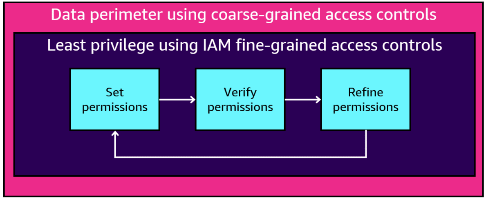
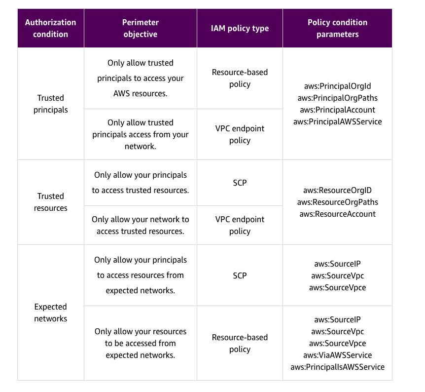
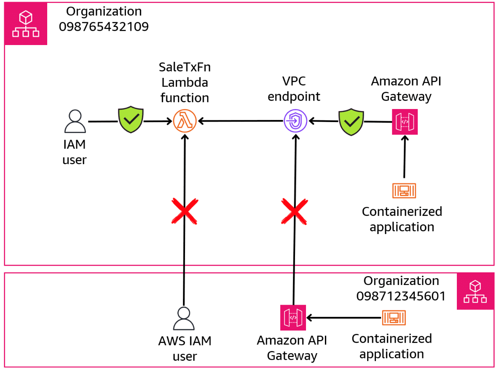
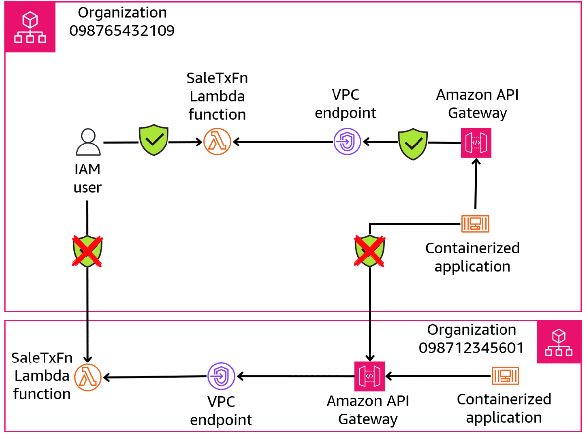
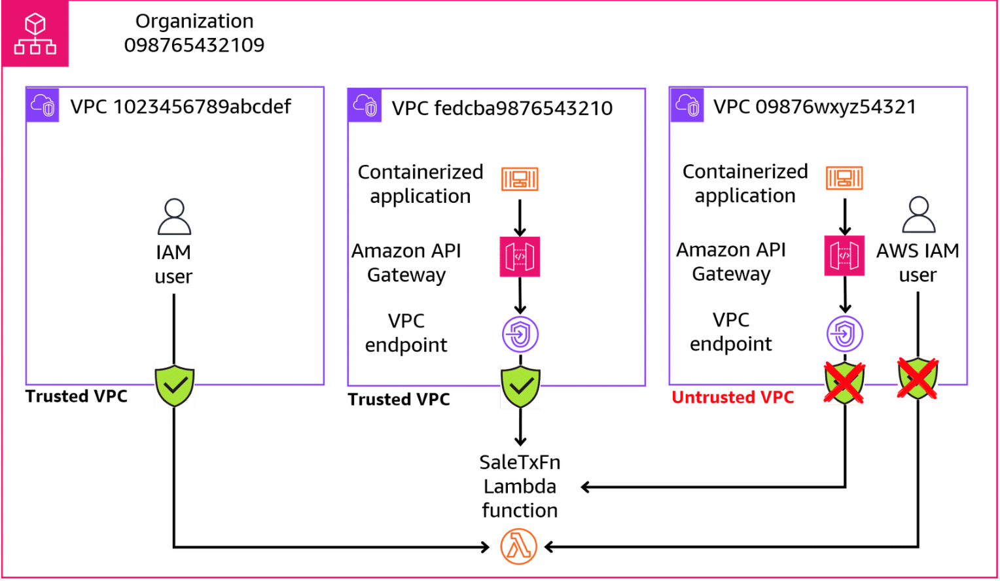

# Week 2: Security 3 Part 2: Data Perimeters on AWS

* back to AWS Cloud Institute repo's root [aci.md](../aci.md)
* back to [AWS Cloud Fundamentals 2](./aws-cloud-fundamentals-2.md)
* back to repo's main [README.md](../../../README.md)

## Data Classification

### Introduction

Data classification and perimeter controls are crucial aspects of cloud security in the AWS Cloud. Proper data classification ensures that sensitive information is identified and handled with appropriate safeguards. Perimeter controls establish boundaries and access controls to protect against unauthorized access. Understanding and applying these measures will help you maintain your application's data privacy, regulatory compliance, and overall security posture.

### Overview of data classification

Data classification is a foundational step in security risk management. It involves identifying the types of data being processed and stored in your applications. And it also involves determining the sensitivity of that data. Assessing the potential impact due to the compromise, loss, or misuse of that application data is also considered.

Generally, there is no single data classification model or scheme that you have to follow when developing your applications. However, your organization should have its own clearly defined data classification model that all application development teams and cloud architects will follow.

One way to develop your own data classification model is to explore some existing data classification models, and then adopt all or part of those models for your organization. Most existing data classification models can be broadly split into two categories: government data classification schemes and commercial data classification schemes.

### Government data classification models

Government classification schemes usually provide a standardized set of guidelines that are based on laws, policies, and executive directives. Some models, like the Health Insurance Portability and Accountability Act (HIPAA), spell out data classification rules related to health records. Others, like the Federal Risk and Authorization Management Program (FedRAMP) and the Family Educational Rights and Privacy Act (FERPA), specify how data for federal government agencies and colleges and universities should be protected.

#### US national data classification scheme

The US government uses a three-tier classification scheme for national security. This scheme focuses on the potential impact to national security if the data were to be accidentally disclosed.

* **Confidential**: Information whose unauthorized disclosure could reasonably be expected to cause damage to national security
* **Secret**: Information whose unauthorized disclosure could reasonably be expected to cause serious damage to national security
* **Top Secret**: Information whose unauthorized disclosure could reasonably be expected to cause exceptionally grave damage to national security

#### United Kingdom (UK) government data classification model

In 2014, the UK simplified its data classification scheme to three levels.

* **Official**: Data resulting from routine business operations and services, some of which could have damaging consequences if lost, stolen, or published in the media, but none of which is subject to a heightened threat profile
* **Secret**: Very sensitive information that justifies heightened protective measures to defend against determined and highly capable threats
* **Top Secret**: The most sensitive information requiring the highest levels of protection from the most serious threats

### Commercial data classification models

Commercial classification schemes are less standardized than government classification models. Commercial classification schemes describe how your organization will need to protect sensitive data to meet compliance requirements that are tied to contractual obligations of your company. For example, the Payment Card Industry Data Security Standard (PCI DSS) data classification model is not based on legal or regulatory requirements. Instead, PCI DSS compliance is part of the contractual obligation between your company and the payment card processors.

#### Commercial data classification five-tier model

The Certified Information Systems Security Professional (CISSP) credential is an information security certification that was developed by the International Information System Security Certification Consortium. The CISSP Security Management Practices recommends guidelines for a data classification scheme that consists of up to five tiers:

* **Public**: Public data is the least sensitive data used by your company and would cause the least harm if disclosed.
* **Proprietary**: Proprietary data is data that is disclosed outside your company on a limited basis or contains information that could reduce the company's competitive advantage.
* **Private**: Private data is usually data that might not damage your company if disclosed but must be keep private for other reasons.
* **Confidential**: This is data that might be less restrictive within your company, but which might cause damage if disclosed.
* **Sensitive**: This data should have the most limited access and requires a high degree of integrity. Disclosure of this data will do the most damage to your company if it were disclosed.

#### Data classification schemes for businesses

Businesses of all sizes should have defined data classification schemes to protect their important internal business data, and the data of their customers, clients, or members. Here is an example of the type of data classification scheme that might be adopted by a business:

* **Public data**: Business data that is made available to the public by your company. This includes marketing data, financial reporting information (if publicly traded), and product specification, pricing, and description data.
* **Tier 1 protected data**:  Business data that is used internally by your company. Examples include customer relationship management (CRM) data and financial data related to customer accounts, payment methods, and credit limits. This can also include data that is only available to a specific group of employees for the purpose of conducting business, such as discount and profit margin information.
* **Tier 2 restricted**: Detailed operational business data such as emails, sales and marketing account data, signed contracts, payment receipts, and invoices. This tier can also include data that is required by law to be protected from unauthorized disclosure, such as human resources or benefits management data.
* **Tier 3 highly strategic**: Highly sensitive and confidential business information such as trade secrets, merger and acquisition information, new product designs, and pre-patent inventions. Public disclosure of tier 3 data could cause severe or catastrophic legal, financial or reputational damage to your company.

### Data classification model recommended by AWS

As a starting point, AWS recommends a three-tiered data classification approach consisting of the following: 

* **Unclassified data**: This data requires low to high security controls. This classification of data might consist of your company's public marketing data, product specifications, retail pricing, location maps, or public financial statements.
* **Official data**: This data requires moderate to high security controls. This classification of data can include of some internal emails, product design and pricing information, departmental reports, sales forecasts, and sales metrics.
* **Secret data and above**: This data requires moderate to high security controls. This data classification is reserved for your company's most critical data, such as trade secrets, unpatented inventions, promotional campaigns, and detailed financial statements.

This three-tier model has been shown to sufficiently meet the data classification requirements of most public and commercial AWS customers.

It will be up to your company to determine who within your organization will determine which data should be assigned to each classification. This task is typically performed by a non-technical resource with a good understanding of the business value of each category of data. After this is assigned, the data classification model should be clearly documented. Then cloud architects, developers, and managers can refer to the classification documentation when building and maintaining applications.

Additionally, for each of the three data classification tiers, your company should define the specific AWS security controls that will be used to protect the data. This task is typically performed by a technical resource with a deep understanding of the available security controls in the AWS Cloud.

This diagram shows how the data classification and security access control information might align using the AWS data classification model.

| Data classification | Security control requirements |
| ------------------- | ----------------------------- |
| Secret data and above	| * Data encryption at rest and in transit is required.<br>* Data must be stored within the United States.<br>* Strict IAM policies are applied to each AWS service storing this data.<br>* Data is not accessible from the internet. |
| Official data | * Data encryption at rest, or in transit, or both, may be required.<br>* Some data may not need to be stored within the United States.<br>* General IAM roles and policies can be used to protect this data.<br>* Some data should not be accessible from the internet. |
| Unclassified data	| * No data encryption is required.<br>* Data can reside anywhere it is needed by customers.<br>* Broad categories of IAM roles are used to protect this data.<br>* Data is accessible from the internet. |

For example, the nontechnical resource assigning the data classifications might indicate that unclassified data does not have to be encrypted, but official and secret data does require encryption. Based on this requirement, the technical resource would then define which AWS encryption method will be used for the data.

---

## Establishing and Implementing Data Perimeters

### Introduction

A data perimeter is a set of preventive, organization-wide guardrails. These guardrails serve as always-on boundaries to help protect your data across a broad set of AWS accounts and resources. 

#### Components of an AWS data perimeter.



These guardrails do not replace existing coarse-grained access controls like virtual private clouds (VPCs), access control lists (ACLs), and security groups. Nor do they replace fine-grained access controls like AWS Identity and Access Management (IAM) roles and policies. Instead, the guardrails help improve your security strategy by ensuring that all IAM users, roles, and resources adhere to a set of defined security standards.

After data perimeter controls are set, they should be verified. Following verification, the perimeter controls should be refined as needed to ensure that the desired boundaries remain in place.

### Trusted identities, resources, and networks

The goal of the data perimeter is to establish guardrails in your AWS environment to help ensure that only trusted identities are accessing trusted resources from expected networks. Principals, resources, and networks are the key elements to consider when designing a data perimeter. These three elements are defined as follows:

* **Trusted principals**: These are IAM roles or users within your AWS accounts, or AWS services acting on your behalf.
* **Trusted resources**: These are resources owned by your AWS accounts or by AWS services acting on your behalf.
* **Expected networks**: These are typically your on-premises data center networks and VPCs, or networks used by AWS services acting on your behalf.

#### Meeting data perimeter objectives

You can establish a data perimeter by using permissions guardrails that restrict access outside of an organization boundary. This is achieved using three primary IAM capabilities:

* AWS Organizations service control policies (SCPs)
* Resource-based policies
* VPC endpoint policies

The following table outlines how these three IAM capabilities can be used to meet the guardrail objectives.

| **Authorization condition** | **Perimeter objective** | **IAM policy type** | **Policy condition parameters** |
|------------------------------|--------------------------|---------------------|---------------------------------|
| **Trusted principals** | Only allow trusted principals to access your AWS resources. | Resource-based policy | aws:PrincipalOrgId<br>aws:PrincipalOrgPaths<br>aws:PrincipalAccount<br>aws:PrincipalAWSService |
|  | Only allow trusted principals access from your network. | VPC endpoint policy |  |
| **Trusted resources** | Only allow your principals to access trusted resources. | SCP | aws:ResourceOrgID<br>aws:ResourceOrgPaths<br>aws:ResourceAccount |
|  | Only allow your network to access trusted resources. | VPC endpoint policy |  |
| **Expected networks** | Only allow your principals to access resources from expected networks. | SCP | aws:SourceIP<br>aws:SourceVpc<br>aws:SourceVpce |
|  | Only allow your resources to be accessed from expected networks. | Resource-based policy | aws:SourceIP<br>aws:SourceVpc<br>aws:SourceVpce<br>aws:ViaAWSService<br>aws:PrincipalIsAWSService |



---

An endpoint policy is a resource-based policy that you attach to a VPC endpoint to control which AWS principals can use the endpoint to access an AWS service.|

---

### Examples of data perimeter controls

#### Trusted principals example

The primary way to ensure that IAM principals can be trusted to access your AWS resources is to include the **aws:PrincipalOrgId** policy condition in the policies that comprise the data perimeter. The 12-digit principal organization ID is used to identify the organization that the principal belongs to, which can be different from the account ID that created the principal.

Sample resource-based trusted principal policy: `"StringEquals": { "aws:PrincipalOrgID": “098765432109" }"`

```json
{
    "Version": "2012-10-17",
    "Statement": [
        {
            "Effect": "Allow",
            "Principal": {
                "AWS": "*"
            },
            "Action": "lambda:InvokeFunction",
            "Resource": "arn:aws:lambda:us-east-1:123456789012:function:SaleTxFn",
            "Condition": {
                "StringEquals": {
                    "aws:PrincipalOrgID": “098765432109"
                }
            }
        }
    ]
}
```

The **aws:PrincipalOrgId** policy condition can be used to require that the principal belong to your organization when being considered for access authorization of access to a resource that you own, or when originating from a network that you own.

The resource-based policy shown here allows principals who are members of the organization with ID 098765432109 to access an AWS Lambda function called SaleTaxFn.

Attaching this policy to the SaleTaxFn function will establish the first part of the data perimeter by only allowing principals who are part of the specified organization to invoke the function.

---

In addition to the resource-based policy, you can also add a VPC endpoint policy to the SaleTaxFn Lambda function to further define the data perimeter for this resource.

Sample VPC endpoint trusted principal policy.

```json
{
    "Statement": [
        {
            "Effect": "Allow",
            "Principal": "*",
            "Action": [
                "lambda:InvokeFunction"
            ],
            "Resource": [
                "arn:aws:lambda:us-east-1:123456789012:function:SaleTxFn"
            ],
            "Condition": {
                "StringEquals": {
                    "aws:PrincipalOrgID": "098765432109"
                }
            }
        }
    ]
}
```

The VPC endpoint policy shown here will only apply to principals that belong to the organization with the ID 098765432109.

To use this policy, you need to first attach it to the Lambda function that is the target for the VPC endpoint. Then you need to make sure that you have configured the necessary VPC, subnets, and security groups to allow traffic to the Lambda function through the VPC endpoint.

---

This diagram shows how the combination of the resource-based policy, and the VPC endpoint policy, provide a data perimeter that protects the SaleTaxFn Lambda function from unauthorized access by principals and services that are outside of the organization with ID 098765432109.



Resource-based and VPC endpoint policies create a principal data perimeter for the SaleTxFn function.

The diagram shows that the IAM user that is part of the organization ID 098765432109 is able to invoke the SaleTaxFn function. Similarly, the containerized application in that same organization is also able to invoke the Lambda function using the VPC endpoint. However, the IAM user and the containerized application with organization ID 098712345601 are unable to invoke the SaleTaxFn. The data perimeter policies deny access because the organization ID for this user and the Amazon API Gateway service is not 098765432109.

---

#### Trusted resources example

Including the **aws:ResourceOrgId** policy condition in the policies that comprise the data perimeter is the primary way to establish trust with AWS resources from outside your account. The 12-digit AWS resource organization ID is used to identify the organization that the resource belongs to, which can be different from the account ID that created the resource.

Sample SCP trusted resource policy.

```json
{
    "Version": "2012-10-17",
    "Statement": [
        {
            "Effect": "Allow",
            "Action": "lambda:InvokeFunction",
            "Resource": [
                "arn:aws:lambda:*:*:function:SaleTxFnc"
            ],
            "Condition": {
                "StringEquals": {
                    "aws:ResourceOrgID": "098765432109"
                }
            }
        },
        {
            "Effect": "Deny",
            "Action": "lambda:InvokeFunction",
            "Resource": "*",
            "Condition": {
                "StringNotEquals": {
                    "aws:ResourceOrgID": "098765432109"
                }
            }
        }
    ]
}
```

The combination of the two statements shown in this SCP implements a trusted resource policy. Only resources within the specified organization are trusted and can be accessed by principals. Specifically, the SCP ensures that principals can only invoke the SaleTxFn Lambda function if the function belongs to the organization with ID 098765432109. All other Lambda functions that do not belong to this organization are denied access.

To use this SCP, you need to attach it to the appropriate organizational unit (OU) or the entire organization in your AWS Organizations setup. Attaching this policy will establish the first part of the data perimeter by only allowing resources that are part of the specified AWS resource organization to invoke the function.

---

Recall that SCPs are designed to restrict permissions, not grant them. This SCP restricts access to Lambda functions that do not belong to the specified organization, while allowing access to the SaleTxFnc function if it does belong to the organization.

---

In addition to the SCP, you can also add a VPC endpoint policy to further define the resource-based data perimeter.

The policy shown ensures that resources can only invoke the SaleTxFn Lambda function if the request is made through the specified VPC endpoint and the Lambda function belongs to the organization with ID 098765432109.

After this is created, you need to attach this endpoint policy to the VPC endpoint for which the Lambda function is the target.

Sample VPC endpoint trusted resource policy.

```json
{
    "Statement": [
        {
            "Effect": "Allow",
            "Principal": "*",
            "Action": "lambda:InvokeFunction",
            "Resource": [
                "arn:aws:lambda:*:*:function:SalesTxFn"
            ],
            "Condition": {
                "StringEquals": {
                    "aws:ResourceOrgID": "098765432109",
                    "aws:SourceVpce": "vpce-654321"
                }
            }
        }
    ]
}
```

This diagram shows how the combination of the SCP and the VPC endpoint policy provides a data perimeter that protects identities and resources from unauthorized accessing by resources that are outside of the organization ID 098765432109.



SCP and VPC endpoint policies create a trusted resource data perimeter for the SaleTxFn function.

The diagram shows that the IAM user, who is part of the organization ID 098765432109, is able to access the SaleTxFn function within its organization. Similarly, the application is also able to access the SaleTxFn function using the function's VPC endpoint in the organization. However, the IAM user in organization 098765432109 is not able to access the same function that resides in organization 098712345601. The application in organization 098765432109 is also not able to access the function in organization 098712345601 because the VPC endpoint for the function is in the wrong organization. The data perimeter policies deny access whenever the organization ID for the user or service is not 098765432109.

---

#### Expected networks example

The primary way to ensure that only expected networks can access resources in your organization is by including the **aws:SourceIp** IAM policy condition, or the **aws:SourceVpc** IAM policy condition in policies that comprise the data perimeter for those networks.

Sample SCP expected networks policy.

```json
{
    "Version": "2012-10-17",
    "Statement": [
        {
            "Effect": "Deny",
            "Action": "*",
            "Resource": "*",
            "Condition": {
                "StringNotEquals": {
                    "aws:PrincipalOrgID": "098765432109"
                }
            }
        },
        {
            "Effect": "Allow",
            "Action": "*",
            "Resource": "*",
            "Condition": {
                "StringEquals": {
                    "aws:PrincipalOrgID": "098765432109"
                },
                "ForAllValues:StringEquals": {
                    "aws:SourceVpc": [
                        "vpc-0123456789abcdef",
                        "vpc-fedcba9876543210"
                    ]
                }
            }
        }
    ]
}
```

For example, this SCP uses a combination of two statements to ensure that principals who are members of the organization with ID 098765432109 are allowed to access resources, but only if the requests originate from the specified VPCs within the organization. All other principals and requests from outside the expected VPCs are denied access.

This SCP effectively creates a network data perimeter by restricting access to resources based on the source VPC within the organization. Only principals within the organization and accessing resources from the expected VPCs are allowed, while all other access is denied.

To use this SCP, you need to attach it to the appropriate OU or the entire organization.

---

In addition to the SCP policy, you can also add a resource-based policy to further define the data perimeter for the Lambda function.

The policy shown here uses a combination of two statements to ensure that principals can only invoke the SaleTxFn Lambda function if the function belongs to the organization with ID 098765432109.

This effectively creates a network data perimeter by restricting access to the function based on the source VPC within the organization. Only principals accessing the function from the expected VPCs are allowed, while access to all others is denied.

To use this policy, you need to attach it as a resource-based policy to the SaleTxFn Lambda function.

Sample VPC endpoint expected network policy.

```json
{
    "Version": "2012-10-17",
    "Statement": [
        {
            "Effect": "Deny",
            "Principal": "*",
            "Action": "lambda:InvokeFunction",
            "Resource": "arn:aws:lambda:us-east-1:123456789012:function:SalesTxFn",
            "Condition": {
                "StringNotEquals": {
                    "aws:ResourceOrgID": "098765432109"
                }
            }
        },
        {
            "Effect": "Allow",
            "Principal": "*",
            "Action": "lambda:InvokeFunction",
            "Resource": "arn:aws:lambda:us-east-1:123456789012:function:SalesTxFn",
            "Condition": {
                "StringEquals": {
                    "aws:ResourceOrgID": "098765432109"
                },
                "ForAllValues:StringEquals": {
                    "aws:SourceVpc": [
                        "vpc-0123456789abcdef",
                        "vpc-fedcba9876543210"
                    ]
                }
            }
        }
    ]
}
```

This diagram shows how the combination of the SCP and the VPC endpoint policy provides a data perimeter that only allows identities and resources to access trusted VPCs.



SCP and VPC endpoint policies create an expected network data perimeter for the SaleTxFn function.

The diagram shows that the IAM user that is part of the organization ID 098765432109 can access the SaleTxFn function from the VPN 1023456789abcfed. Similarly, the containerized application is also able to access the SaleTxFn function from the VPC fedcba9876543210. However, the IAM user in VPC 09876wxyz54321 is not able to access the same function, nor can the containerized application in the same VPC. The data perimeter policies deny access to any VPC that is not 1023456789abcdef or fedcba98976543210.

---

### [Lab: Zero Trust Architecture for Service-To-Service Workloads](./labs/W020Lab1ZaroTrustArchitecture.md)

This lab is intended to explain the principles of the Zero Trust model. The lab also shows how various AWS services and features can be used to implement a data perimeter using these principles. The lab focuses on applying Zero Trust principles to the service-to-service architectures used in many micro-architecture or distributed environments today.

In this lab, you perform the following tasks:

* Review existing security controls.
* Run an assessment to evaluate your current security posture.
* Improve your security posture using IAM authorization on the API Gateway, API Gateway resource policies, VPC endpoint policy, and VPC endpoint security groups.

---

### Knowledge Check

#### A security team is analyzing the AWS security controls that must be in place for a new application. The security team has recommended that a data classification approach be used to help determine the security requirements. What should the security team consider for the purposes of their analysis? (Select TWO.)

* The team should consider whether there are any contractual obligations that must be met for the type of data that the application will use.
* The team should consider whether there are any federal, state, or local regulations that apply to the type of data that the application will use.

Wrong answers:

* The team should consider which data types will be used to store the application data, and recommend the appropriate databases to use for the application.
* The team should estimate how much storage will be required to store the initial application data, as well as the application's expected data growth over time.
* The team should consider where the application data will be stored, and whether the data will have to be replicated to multiple locations for recovery purposes.

##### Explanation

The security team should consider regulatory and contractual requirements when performing a data classification exercise. Then they should determine how they can use AWS security controls to comply with each requirement. Application data types and storage requirements are important for architectural decisions, but not for data classification purposes.

#### Which of these are part of the data classification approach recommended by AWS? (Select THREE.)

* Unclassified data
* Official data
* Secret data and above

Wrong answers:

* Confidential data
* Public data
* Classified data

##### Explanation

For customers who do not have a defined data classification policy, AWS recommends a three-tier model: Unclassified data, official data, and secret data and above.

#### A cloud architect is preparing a presentation for a development team. The presentation shows which AWS services will be used to deploy a new application. The proposed architecture includes a data perimeter. The architect thinks they might be asked what part of the application architecture the data perimeter refers to, and what does it do? How should the architect respond to this question?

* A data perimeter is a set of preventive, organization-wide guardrails that are meant to serve as always-on boundaries to help protect your data across a broad set of AWS accounts and resources.

Wrong answers:

* A data perimeter is a set of reactive, organization-wide guardrails that are meant to alert you to data breaches across a broad set of AWS accounts and resources.
* A data perimeter is a set of automated, organization-wide guardrails that are meant to log data access requests across a broad set of AWS accounts and resources.
* A data perimeter is a set of customized, organization-wide guardrails that help protect your data from access by users or services that are outside the Region where the application is deployed.

##### Explanation

Data perimeter controls provide always-on boundaries to help protect your data across a broad set of AWS accounts and resources. Controls can be implemented as trusted principals, trusted resources, and expected networks.

#### A cloud developer needs to establish a data perimeter for the application that they are building. Which policy conditions is the developer likely to use if they want to implement a data perimeter based on trusted principals?

* The developer should use resource-based and virtual private cloud (VPC) endpoint-based policies, with aws:PrincipalOrgId, aws:PrincipalOrgPaths, aws:PrincipalAccount, and aws:PrincipalAWSService as possible policy conditions.

Wrong answers:

* The developer should use principal-based and resource-based endpoint-based policies, with aws:PrincipalOrgId, aws:PrincipalOrgPaths, aws:PrincipalAccount, and aws:PrincipalAWSService as possible policy conditions.
* The developer should use service control policy (SCP) and virtual private cloud (VPC) endpoint-based policies, with aws:PrincipalOrgId, aws:PrincipalOrgPaths, aws:PrincipalAccount, and aws:PrincipalAWSService as possible policy conditions.
* The developer should use service control policy (SCP) and resource-based endpoint-based policies, with aws:PrincipalOrgId, aws:PrincipalOrgPaths, aws:PrincipalAccount, and aws:PrincipalAWSService as possible policy conditions.

##### Explanation

Principal-based data perimeter controls are implemented using resource-based and VPC endpoint-based policy conditions. Policy conditions use aws:PrincipalOrgId, aws:PrincipalOrgPaths, aws:PrincipalAccount, and aws:PrincipalAWSService to define the boundaries of the perimeter.

#### A cloud architect has been given two requirements for a new application environment in the AWS Cloud. First, the environment should only allowed trusted principals to access application resources. Second, only trusted principals should be allowed to access the environment over the network. Which data perimeter type is this an example of?

* Trusted principals

Wrong answers:

* Shared responsibility
* Trusted resources
* Expected networks

##### Explanation

This scenario is an example of a trusted principals data perimeter. Under this model, the goal is to ensure that all AWS Identity and Access Management (IAM) roles or users within an AWS account, or AWS services in an AWS account, are acting on behalf of the AWS account at all times.

---

### Summary

* Data classification involves identifying the types of data being processed and stored in your applications, determining the sensitivity of that data, and assessing the potential impact of the compromise, loss, or misuse of that application data.
* Government classification schemes usually provide a standardized set of guidelines that are based on laws, policies, and executive directives. Commercial classification schemes are less standardized and depend on your organization's need to protect sensitive data to meet compliance requirements that your company is subject to.
* Based on other customer experiences, AWS recommends a three-tier data classification scheme consisting of unclassified data, official data, and secret data and above.
* A data perimeter is a set of preventive, organization-wide guardrails that are meant to serve as always-on boundaries to help protect your data across a broad set of AWS accounts and resources.
* Three elements can be considered when designing a data perimeter model: trusted principals, trusted resources, and expected networks.
* A data perimeter based on trusted principals only allows trusted principals to access your AWS resources, and only allows trusted principals access from your network.
* A data perimeter based on trusted resources only allows your principals to access trusted resources, and only allows your network to access trusted resources.
* A data perimeter based on expected networks only allows your principals to access resources from expected networks, and only allows your resources to be accessed from expected networks.
* Policies used for implementing data perimeters are resource-policy based, service control policy-based, or VPC endpoint-based.

---
