# Week 2: Security 3 Part 2: Data Encrypting at Rest and Data in Transit

* back to AWS Cloud Institute repo's root [aci.md](../aci.md)
* back to [AWS Cloud Fundamentals 2](./aws-cloud-fundamentals-2.md)
* back to repo's main [README.md](../../../README.md)

## Encrypting Data at Rest and Data in Transit

### Introduction

Encrypting data protects sensitive information from unauthorized access, supports data confidentiality, and helps to deliver compliance with data privacy regulations. When architecting cloud-based applications, it is important to protect application data both at rest and in transit. By enabling encryption for key AWS services, you can ensure the confidentiality and integrity of data as it moves between different components, and enhance your application's overall security posture.

### Review of encryption concepts

Recall that encryption refers to the process of using cryptographic algorithms, along with keys, to transform your data into a form that can only be read using the encryption key. Even if a malicious actor were to gain access to your encrypted data, it would be nearly impossible for the bad actor to decrypt your data without also accessing the corresponding encryption key. Encryption can be symmetric or asymmetric. The following table compares these two types of encryption.

| Symmetric encryption | Asymmetric encryption |
| -------------------- | --------------------- |
| The same encryption key is used to both encrypt and decrypt data. | One key is used to encrypt the data, and a second, but mathematically related, key is used to decrypt the data. |
| All users who want to access the data must have access to the shared encryption key. | One key is distributed broadly for public use, and the other key is kept secret and secure.  Together, the keys are referred to as a key pair. |
| This is also known as private key, or secret key, encryption.| This is also known as public key encryption. |
| This is commonly used to encrypt data at rest. | This is commonly used to encrypt data in transit. |

### Understanding public and private keys

Public and private keys are cryptographic keys used to encrypt and decrypt data. They are essential components of data encryption. A public key is used to generate data encryption keys and to verify digital signatures. Public keys are available to anyone. The public key is used to encrypt data so that only the intended recipient can decrypt it. A private key is used to generate and encrypt data encryption keys and to sign digital documents. It is a key that is kept secret and only known to the intended recipient.

The public-private key data encryption process involves two steps. First, plaintext data is converted into an encrypted form using a symmetric encryption algorithm. The algorithm uses the public key to generate a unique encryption key that is then used to encrypt the data. Next, the data is sent to the recipient, who decrypts the data using the private key. The private key is used to generate the same encryption key that was used to encrypt the data, which can then be used to decrypt the data.

---

Data encryption security depends on the strength of the encryption algorithm and the security of the private and public keys. The most commonly used encryption algorithms are Advanced Encryption Standard (AES) and Rivest-Shamir-Adleman (RSA).

---

### Understanding envelope encryption

The key used to encrypt data is called a data key. One way to protect data keys is to encrypt the data key with a separate key, called a wrapping key, or key encryption key. The process of encrypting the data key with another key is called envelope encryption.

Envelope encryption is a process that provides end-to-end security for data that must be accessed by multiple parties. It works by encrypting data with a symmetric data encryption key, then encrypting that data encryption key asymmetrically with the public keys of the recipients who need to access the data. Envelope encryption is commonly used when the contents of a message is encrypted, but also contains the recipients' public keys.

The encrypted data and encrypted data key are sent to the recipients. Each recipient can decrypt the data encryption key using their private key, then use the decrypted data encryption key to decrypt the data. Envelope encryption allows sensitive data to be securely accessed by multiple authorized parties without exposing the unencrypted data to intermediaries.

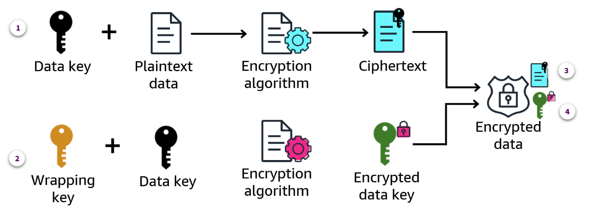

1. **Data key**.

    To protect customer data from compromise, a financial institution has decided to encrypt each customer's account transactions. The financial institution implements encryption in their application by encrypting the plaintext records using a symmetric key (data key). The resulting encrypted data are called ciphertext files.

2. **Wrapping key**

    If the unencrypted data key is stored with the ciphertext data, this might result in a security vulnerability. To mitigate this concern, the financial institution also encrypts the data key with a symmetric wrapping key.

3. **Stored ciphertext**

    The encrypted ciphertext version of the data is stored in the chosen storage solution.

4. **Stored encrypted data key**

    The encrypted data key is stored in its chosen storage solution. This storage location will use stringent security controls to minimize potential compromise of the encrypted data key.

When these mechanisms are complete, the financial institution's application will have to perform two steps to access a customer's financial data. First, the application will use the wrapping key to decrypt the encrypted data key. Then the data key will be used to decrypt the encrypted ciphertext data that contains the customer data.

---

### Understanding the role of certificates

In the context of data encryption, a **certificate** is a digital document that serves as proof of identity and ownership for either an individual or a business.

Certificates are used to establish a secure encryption key between two parties and to ensure that the data transmitted between them remains confidential and protected from unauthorized access.

Certificates are essential components of **public key infrastructure (PKI)**, which is a framework for secure communication and data exchange over the internet. PKI relies on a combination of **public keys**, **private keys**, and **certificates** to authenticate and authorize users and devices, and to verify the integrity and authenticity of data.

A certificate contains crucial information such as the identity of the certificate holder, the certificate expiration date, the cryptographic algorithms used for encryption, and the digital signature of the certificate authority who issued the certificate. A **certificate authority (CA)** is an entity that issues and, if necessary, revokes digital certificates to parties communicating across networks. Certificate authorities can be publicly or privately trusted.

The process for requesting a digital certificate varies, depending on whether you need a public or private certificate.

#### Publicly trusted certificate authority

A publicly trusted CA, or public CA, earns public trust by working with major browsers, operating systems, and device manufacturers to satisfy rigorous security requirements. You might think of this as similar to a business passing audits to be considered trustworthy or compliant. If a CA earns their trust, these organizations will configure their products to trust that CA at the root level.

This inherent trust adds a layer of security to the encryption process used over the public internet.

**Verisign** and **DigiCert** are two examples of public certificate authorities.

#### Privately trusted certificate authority

A privately trusted CA, or private CA, secures communication among internal devices and web systems from within an organization or group. These CAs do not build public trust by meeting requirements from external stakeholders. Therefore, private CAs do not issue public certificates.

You might use a private CA to create private certificates for internal resources to authenticate and communicate with each other.

---

Secure Sockets Layer (SSL) and Transport Layer Security (TLS) encryption works because of the authentication offered by digital certificates. If a client trusts the CA who issued the certificate for a web server, and the certificate is legitimate, the client can trust that server. After the two parties establish trust, they agree on a session key to symmetrically encrypt the data being transferred back and forth. Parties often use a combination of asymmetric and symmetric encryption to exchange keys for encrypting data in transit.

---

Most modern digital certificates follow the x.509 standard. This standard binds the certificate's identifying information to a public-private key pair. You can use these certificates for a range of purposes, including facilitating encryption of data in transit.

---

### Encrypting data in transit

Any data that gets transmitted from one system to another is considered data in transit. Because that data frequently traverses many locations as it passes over public and private networks, encrypting data in transit has become a standard data protection practice.

AWS recommends the following solutions and best practices to help you provide the appropriate level of protection for your data in transit:

* AWS services provide HTTPS endpoints using TLS for communication, thus providing end-to-end encryption when communicating with the AWS APIs.
* AWS can be used to generate, deploy, and manage public and private certificates used for TLS encryption in web-based workloads.
* Facilitate encryption of data in transit by using the IPsec group of secure connection protocols with a virtual private network (VPN) connection when connecting to the AWS Cloud.

The following table summarizes the data encryption in transit capabilities of AWS services that are often part of an application architecture.

| Service name | In-transit data encryption options |
| ------------ | ---------------------------------- |
| Amazon Virtual Private Cloud (Amazon VPC) | TLS encrypts data in transit between Amazon Elastic Compute Cloud (Amazon EC2) instances and AWS services. |
| Amazon API Gateway | TLS encrypts data in transit between applications and Amazon API Gateway. This protects API requests and responses from unauthorized access or interception. |
| Amazon Simple Notification Service (Amazon SNS) and Amazon Simple Queue Service (Amazon SQS) | TLS encrypts data in transit between applications or AWS services and Amazon SQS and Amazon SNS. This protects sensitive data, such as messages, notifications, and metadata, from unauthorized access or interception. |
| Amazon Simple Storage Service (Amazon S3) | Amazon S3 supports TLS connections for encrypting data in transit to Amazon S3 buckets. This protects data from unauthorized access or interception. |
| Amazon Relational Database Service (Amazon RDS) and Amazon DynamoDB | TLS encrypts data in transit between applications and Amazon RDS and DynamoDB databases. This protects table data and queries from unauthorized access or interception. |
| AWS Lambda | TLS encrypts data in transit between applications or AWS services and Lambda functions. This protects sensitive data, such as function code, invocation payloads, and responses, from unauthorized access or interception while in transit. Lambda functions can also be configured to run within a VPC - whose traffic is also automatically encrypted using TLS. |

---

#### Using policies to enforce secure connections to Amazon S3

HTTPS requests use TLS to encrypt data over the connection. To protect data in transit to Amazon S3 buckets, use a bucket policy to force the use of HTTPS requests. Doing this ensures the integrity of the data and denies any request that comes in over standard HTTP. To enforce the use of HTTPS on the buckets, use the **aws:SecureTransport** condition in your Amazon S3 **bucket policies**.

The following bucket policy allows access to Amazon S3 objects only through HTTPS. To read more about what the elements are doing, choose each of the numbered markers next to the code line.

```json
{
    "Id": "Secure S3 data in-transit",
    "Version": "2012-10-17",
    "Statement": [
        {
            "Sid": "AllowOnlySSLRequestsToBucket",
            "Action": "s3:*",
            "Effect": "Deny",
            "Principal": "*",
            "Resource": [
                "arn:aws:s3:::customer-account-info",
                "arn:aws:s3:::customer-account-info/*"
            ],
            "Condition": {
                "Bool": {
                    "aws:SecureTransport": "false"
                }
            }
        }
    ]
}
```

1. **Action**

    The Action element defines the actions that the policy allows or denies. Here the action is **`s3:*`** indicating that the policy applies to all Amazon S3 actions.

2. **Effect**

    The Effect element specifies whether the statement actions are allowed or denied.

3. **Principal**

    The Principal element defines which user or role is denied access to a resource. Here a wildcard **(`*`)** indicates all principals are denied access to the specified resource when the principal also meets the condition specified in the Condition clause.

4. **Resource**

    The Resource element specifies the resources that the policy applies to. In this example, the resource is an S3 bucket called **`customer-account-info`**. The **`/*`** indicates that the policy also applies to the contents of the bucket.

5. **Condition**

    The Condition element is used to specify the conditions under which the policy is in effect. In this case, if **aws:SecureTransport** is **false** — meaning the user is connecting to the bucket without using TLS encryption — then access to the bucket and its contents will be denied.

---

#### Using AWS Config to monitor secure connections to Amazon S3

AWS Config is a service that you can use to assess, audit, and evaluate the configurations of your AWS resources. AWS Config continuously monitors and records your AWS resource configurations and allows you to automate the evaluation of recorded configurations against desired configurations.

You can use AWS Config rules to implement ongoing detective controls against your S3 buckets using the **s3-bucket-ssl-requests-only** AWS Config **managed rule**. This rule verifies whether your bucket policies require encrypted TLS requests using the **aws:SecureTransport** condition. This ensures that your existing buckets are secure and any new buckets that you create have encryption turned on.

---

### Encrypting data at rest

Encrypting data at rest is also referred to as server-side encryption. Under server-side encryption, AWS encrypts the data on your behalf, after it has been received by the storage service.

The encryption option that you choose depends on who will be providing and managing the keys used for encryption. You can have AWS supply the encryption keys for server-side encryption using AWS Key Management Service (AWS KMS), or you can manage your own encryption keys using a custom solution.

---

### Client-side encryption

In addition to the in-transit and at-rest server-side encryption methods, some AWS services can also be used with client-side encryption. With client-side encryption, you first encrypt your data locally, on the client, and then upload the encrypted data to the appropriate AWS storage service.

Because the data is encrypted before it leaves the client, the data is encrypted both in transit and at rest. For this reason, client-side encryption is sometimes referred to as **end-to-end encryption**, or **application-level encryption**.

Client-side encryption is typically used with highly sensitive workloads. Encrypting data at the application level can help meet regulatory requirements and provide the highest level of protection.

Under the client-side encryption model, you need to manage the encryption process, encryption keys, and related tools. In addition to this management overhead, client-side encryption also comes with some performance overhead and increased complexity related to encryption key management. Therefore, AWS recommends evaluating the trade-offs between your specific security requirements and your application's performance needs when evaluating the use of client-side encryption.

#### Client-side encryption tools

To help reduce the management overhead associated with client-side encryption, AWS provides several tools to support its implementation. The choice between these options depends on your specific requirements, such as the programming languages used, the level of control needed over key management, and the performance and scalability needs of your application.

1. **AWS Encryption SDK**

    AWS Encryption SDK is a client-side encryption library that helps you encrypt data within your applications before sending it to AWS services. The SDK supports multiple data encryption algorithms and key management strategies, and is available for Java, Python, C, C#, .Net, JavaScript, and Node.js. This SDK also integrates with AWS KMS for secure key management and key rotation.

2. **Amazon S3 Encryption Client**

    Amazon S3 Encryption Client works as an intermediary between you and Amazon S3. Your objects are automatically encrypted and decrypted with each Amazon S3 **PutObject** and **GetObject** request. This tool is best if your use case is limited to working with Amazon S3, and you need advanced Amazon S3 functionality, like multipart uploads.

3. **AWS Database Encryption SDK**

    AWS Database Encryption SDK is a set of software libraries that you can use to include client-side encryption in your database design. The AWS Database Encryption SDK provides record-level encryption solutions. You specify which fields are encrypted and which fields are included in the signatures that ensure the authenticity of your data.

---

### Services supporting encryption

Whether client-side or server-side, AWS provides several services to support data encryption for applications running in the AWS Cloud. The following provides a summary of these services to provide a complete picture of the AWS resources involved in implementing a complete encryption solution for your applications.

#### AWS Certificate Manager

Encrypting data in transit across the public internet requires the use of digital certificates. Managing these certificates can be labor-intensive. Tasks like purchasing certificates, uploading and installing them on your web resources, and regularly renewing them tend to occupy a lot of overhead.

AWS Certificate Manager (ACM) handles the complexity of creating and managing public SSL/TLS certificates for your AWS based websites and applications. ACM can also be used to issue private SSL/TLS certificates that identify users, computers, applications, services, servers, and other devices internally.

#### AWS Key Management Service

AWS KMS is a managed service that you use to create and control the keys used in data encryption. AWS KMS keys are the primary resource in AWS KMS. You can use a KMS key to encrypt, decrypt, and re-encrypt data. It can also generate data keys that you can use outside of AWS KMS. Typically, you will use symmetric encryption KMS keys, but you can create and use asymmetric KMS keys for encryption or signing. AWS KMS makes it easier to use cryptographic features directly in your applications or through other AWS services that are integrated with AWS KMS.

#### AWS CloudHSM

AWS CloudHSM processes cryptographic operations and provides secure storage for cryptographic keys.

CloudHSM requires setup, configuration, and ongoing management of the hardware security module (HSM) appliances. This makes it more complex than other AWS encryption options like AWS KMS or the AWS Encryption SDK. Therefore, you typically use CloudHSM in situations where your application's regulatory compliance requirements cannot be met by AWS KMS, or when you require strict control over your encryption keys.

---

### Activity: Choosing Encryption Tools

The AnyCompany team has decided to use data encryption to protect the data in their new application. Encryption will help prevent unauthorized access of the data at rest and in transit. However, they are not sure which AWS services to choose to help support their encryption plans.

#### Our application is going to use several AWS services to process and store data. Which AWS service should we consider if we want to reduce the burden of managing encryption keys, and need to provide keys to multiple AWS services?

* AWS Key Management System (AWS KMS)

Wrong answers:

* AWS Certificate Manager (ACM)
* AWS CloudHSM

##### Explanation

AWS KMS is a managed service that makes it easy for you to create and control the cryptographic keys that are used to protect your data across many AWS services.

#### The application will also include public-facing web pages. Because the pages will make API calls to AWS Lambda functions, communication between the pages and the API should be encrypted. How can we make sure the data is protected?

* Data is protected by default, so no extra steps are required.

Wrong answers:

* Use client-side encryption tools to encrypt the data before it is sent to AWS Lambda.
* Use server-side encryption tools to encrypt the data before it is sent to AWS Lambda.

##### Explanation

Communication between the end users, API, and AWS Lambda functions are protected by default using SSL/TLS encryption.

---

## Encrypting Data at Rest in Amazon S3

### Introduction

Server-side encryption is the encryption of data at its destination by the application or service that receives it. For data at rest, Amazon S3 provides you with two options: server-side encryption and client-side encryption. When you use server-side encryption, Amazon S3 encrypts an object before saving it to disk and decrypts it when you download it. If you authenticate and have access permissions, there is no difference in how you access encrypted or unencrypted objects.

### Server-side encryption options

There are four mutually exclusive server-side data encryption options, depending on how you choose to manage the encryption keys. Specifically, the encryption option depends on who will be providing and managing the keys used for encryption. You can have AWS supply the encryption keys for server-side encryption using AWS KMS, or your can manage your own encryption keys using a custom solution.

#### Server-side encryption with Amazon S3 managed keys (SSE-S3)

When you use server-side encryption with Amazon S3 managed keys (SSE-S3), each object encrypts with a unique key, which is then encrypted with a primary key. Amazon S3 manages the keys and automatically rotates them. Amazon S3 server-side encryption uses one of the strongest block ciphers available, 256-bit Advanced Encryption Standard (AES-256), to encrypt your data.

#### Server-side encryption with AWS KMS keys (SSE-KMS)

An AWS KMS key is a logical representation of a master key. The KMS contains the key material used to encrypt and decrypt data. You can choose a customer managed key that you create and manage, or you can choose an AWS managed key that Amazon S3 creates in your AWS account and manages for you. Only Amazon S3 has permission to use this managed key on your behalf.

Benefits of using SSE-KMS include the following:

* Ability to control the rotation of the keys
* Ease of management for a few primary keys as opposed to billions of data keys
* Centralized access and auditing
* Better performance for large datasets

#### Dual-layer server-side encryption with AWS KMS keys (DSSE-KMS)

Using DSSE-KMS applies two layers of encryption to objects when they are uploaded to Amazon S3. DSSE-KMS helps you more easily fulfill compliance standards that require you to apply multilayer encryption to your data and have full control of your encryption keys. When you use DSSE-KMS with an Amazon S3 bucket, the AWS KMS keys **must be in the same Region** as the bucket.

#### Server-side encryption with customer-provided keys (SSE-C)

With server-side encryption with customer-provided keys (SSE-C), you manage the encryption keys. Amazon S3 manages the encryption, as it writes to disks, and decryption, when you access your objects. With this option, you are responsible for managing and rotating the keys. Amazon S3 data can be decrypted only with these keys. If you lose your keys, there will be no way to decrypt the data stored in Amazon S3.

---

**kms:GenerateDataKey** permissions on the key is needed to upload an object encrypted with an AWS KMS key to Amazon S3.

---

### Flashcard exercise

#### Who owns the encryption keys?

The encryption keys can be owned by AWS or by you.

#### Where will the encryption keys be stored?

Keys can be stored by AWS in AWS KMS, AWS Secrets Manager, Parameter Store, a capability of AWS Systems Manager, or CloudHSM. The key can also be held by you outside of the AWS Cloud.

#### Who will perform the encryption process?

AWS always performs the encryption process, even when you use your own key. AWS never exposes the encrypted version of the data to you.

#### Which keys can have a policy attached?

Policies are used with KMS keys. The policy statements will determine who has permission to use the key and how they can use it. Every KMS key has one key policy.

#### What is the default encryption for Amazon S3?

**SSE-S3** is the default encryption method for S3 buckets, adding the header **"x-amz-server-side-encryption": "AES256"** when a **PUT** operation loads objects in a bucket.

---

#### Amazon S3 bucket keys

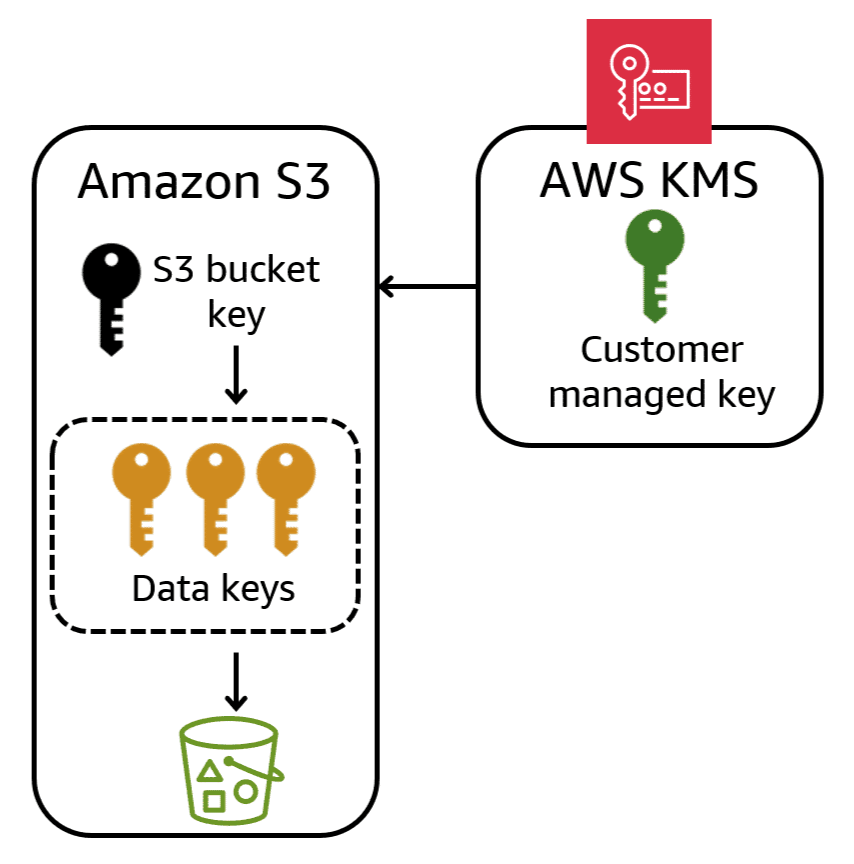

Amazon S3 bucket keys reduce calls to AWS KMS.

Workloads that access millions or billions of objects encrypted with SSE-KMS can generate large volumes of requests to AWS KMS. When you configure your bucket to use an S3 bucket key for SSE-KMS, AWS KMS generates a bucket-level key that is used to create unique data keys for new objects that you add to the bucket.

The S3 bucket key is used for a time-limited period within Amazon S3, reducing the need for Amazon S3 to make requests to AWS KMS to complete encryption operations.

This reduces traffic from Amazon S3 to AWS KMS, and reduces the cost associated with using AWS KMS to access encrypted objects in Amazon S3.

Amazon S3 shares an S3 bucket key only for objects encrypted by the same AWS KMS key.

---

### Default encryption at rest for Amazon S3

Amazon S3 applies server-side encryption with Amazon S3 managed keys (SSE-S3) as the base level of encryption for every bucket that you create in Amazon S3. All new object uploads to Amazon S3 are automatically encrypted at no additional cost and with no impact on performance.

You can observe this behavior when creating an Amazon S3 bucket from the AWS Management Console. As shown here, server-side encryption with Amazon S3 managed keys (SSE-S3) is the default configuration for a new Amazon S3 bucket in the AWS Management Console. Additionally, the use of an S3 bucket key for SSE-KMS is also enabled by default.

S3 buckets created using the AWS Management Console use SSE-S3 encryption with bucket keys enabled.

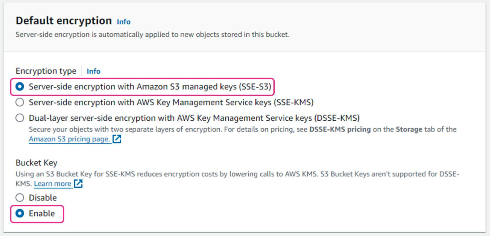

Similarly, Amazon S3 buckets created using the AWS Command Line Interface (AWS CLI) also have SSE-S3 encryption enabled by default, as shown here.

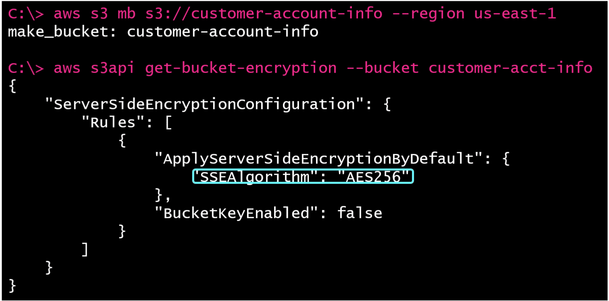

Default SSE-S3 encryption is enabled for S3 buckets created using the AWS CLI.

The **`aws s3 mb`** command creates a new bucket called customer-account-info in the us-east-1 Region. No encryption method is specified, but when the `aws s3api get-bucket-encryption` command is issued against the new bucket, the output shows that **SSE AES256 (SSE-S3)** encryption is enabled. However, the output also shows that unlike the Management Console, the AWS CLI **does not** enable the bucket keys by default.

If desired, you can override the default console settings and choose either the SSE-KMS or DSSE-KMS encryption options. When either of these encryption options is selected, you must also specify the AWS KMS key to use for encryption. An existing AWS KMS key can be specified by name, or by its Amazon Resource Name (ARN). As with SSE-S3 encryption, bucket keys are also enabled for buckets created with a default encryption type of SSE-KMS. Amazon S3 bucket keys are not supported for DSSE-KMS.

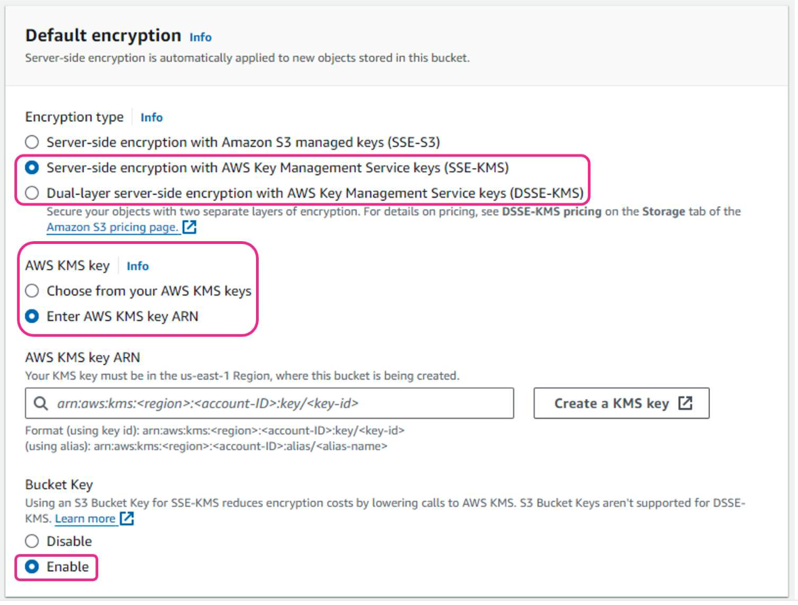

S3 buckets can also use SSE-KMS or DSSE-KMS encryption using an existing AWS KMS key.

---

### Headers and encryption in Amazon S3

When you make requests to Amazon S3, such as uploading or downloading objects, the requests are sent over HTTPS using TLS. To encrypt at-rest data in Amazon S3, an HTTPS header called **`x-amz-server-side-encryption`** can be included in the HTTPS PUT request. This custom header is specific to the Amazon S3 API, and it is used to instruct Amazon S3 to perform server-side encryption on the object being uploaded or copied.

For example, when you include the `x-amz-server-side-encryption` header with the value AES256 in an HTTPS request to Amazon S3, you are telling Amazon S3 to encrypt the object data at rest using AES-256 encryption with keys managed by Amazon S3 (SSE-S3). Specifically, the format of the HTTPS header would be **`"x-amz-server-side-encryption": "AES256"`** when using SSE-S3 encryption to perform a PUT operation in Amazon S3.

If you want to enable SSE-KMS encryption, you need to include the `x-amz-server-side-encryption` header with the value `aws:kms` and also provide the `x-amz-server-side-encryption-aws-kms-key-id` header with the KMS key ID or ARN.

If you want to enable SSE-C encryption, you need to include the `x-amz-server-side-encryption-customer-algorithm `header with the value `AES256`, the `x-amz-server-side-encryption-customer-key` header with your base64-encoded encryption key, and the `x-amz-server-side-encryption-customer-key-MD5` header with the base64-encoded MD5 digest of your encryption key.

The following table summarizes the HTTPS header formats used for each Amazon S3 encryption method.

| Encryption method | HTTPS header format |
| ----------------- | ------------------- |
| SSE-S3 | x-amz-server-side-encryption: AES256 |
| SSE-KMS | x-amz-server-side-encryption: aws:kms<br>x-amz-server-side-encryption-aws-kms-key-id: ARNofKMSKey |
| SSE-C | x-amz-server-side-encryption-customer-algorithm: AES256<br>x-amz-server-side-encryption-customer-key: your-base64-encoded-encryption-key<br>x-amz-server-side-encryption-customer-key-MD5: your-base64-encoded-key-md5 |
| DSSE-KMS | x-amz-server-side-encryption: aws:kms:dsse<br>x-amz-server-side-encryption-aws-kms-key-id: ARN-of-your-KMS-eyk |

---

The IAM `kms:GenerateDataKey` permission is needed on the AWS KMS key used for encryption to upload an object encrypted with an AWS KMS key to Amazon S3.

---

This diagram shows how these HTTPS headers are used to encrypt the object stored in an Amazon S3 bucket using the Amazon S3 data keys.

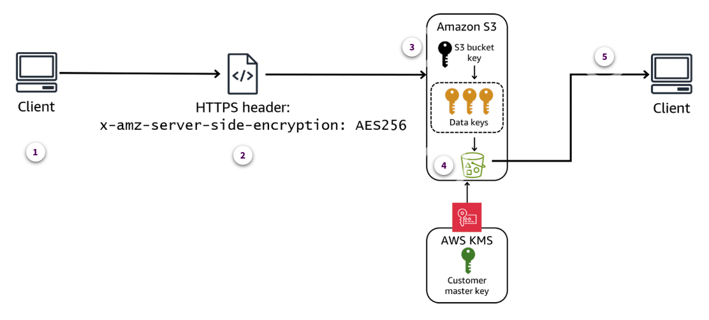

1. **Client request**

    When you send a PUT, POST, or COPY request to upload or copy an object to an S3 bucket, you can include the **`x-amz-server-side-encryption`** header in the request with the value **AES256**.

2. **Server-side encryption**

    By including this header, you're instructing Amazon S3 to encrypt the object data at rest using AES-256 encryption with keys managed by Amazon S3 (SSE-S3).

3. **Key management**

    Amazon S3 generates a unique data encryption key for each object and uses it to encrypt the object data. The data encryption key itself is then encrypted with a root key managed by Amazon S3.

4. **Object stored**

    The encrypted object data is then stored in the S3 bucket, while the encrypted data encryption key is stored separately by Amazon S3.

5. **Data retrieval**

    When you retrieve the object from the S3 bucket, Amazon S3 transparently decrypts the data using the stored encrypted data encryption key and the root key.

---

In addition to HTTPS headers, the desired encryption method for storing an object in an Amazon S3 bucket can also be specified at the command line using the AWS CLI. Here's an example of how you might include the `x-amz-server-side-encryption` header when uploading an object using the AWS CLI.

#### AWS CLI command using SSE-S3 encryption to copy a file.

```bash
aws s3 cp credit_report.pdf s3://customer-acct-info/credit_report.pdf --sse AES256
```

In the example shown here, the **`--sse AES256`** option sets the `x-amz-server-side-encryption` header to `AES256`. This instructs the Amazon S3 copy command to encrypt the `credit_report.pdf` object when copying the PDF to an Amazon S3 bucket called `customer-acct-info`.

---

### Potential for unencrypted older objects

Older Amazon S3 buckets, created before AWS made SSE-S3 encryption the default, automatically had encryption turned on when the new default went into effect in 2023. However, it's possible that some of the objects in those buckets might still be unencrypted. Enabling encryption on an existing S3 bucket does not retroactively encrypt any existing objects stored in that bucket. Objects must be copied or reuploaded before the new bucket encryption policy will be applied.

This example shows the AWS CLI command being used to encrypt an existing object called `credit_report.pdf` that is stored in an S3 bucket called `customer-acct-info`. By specifying the `--sse AWS256` parameter for the copy command, the `credit_report.pdf` file is encrypted when it is written to the S3 bucket.

#### AWS CLI command to encrypt an unencrypted object by copying it using the `--sse AES256` parameter.

```bash
aws s3 cp s3://customer-acct-info/credit_report.pdf s3://customer-acct-info/credit_report.pdf --sse AES256
```

---

### [Lab: Implementing Amazon S3 Bucket Policies to Enforce Encryption](./labs/W022Lab2AmazonS3BucketPolicyToEnforceEncryption.md)

In this lab, you explore the various ways to secure data stored in Amazon Simple Storage Service (Amazon S3).

In this lab, you perform the following tasks:

* Create AWS KMS keys in primary and secondary Regions.
* Encrypt data in your S3 bucket with an AWS KMS key.
* Prevent upload of an Amazon S3 object using unapproved encryption method or key.
* Replicate data to the disaster recovery Region bucket.
* Identify personally identifiable information (PII) stored in objects in an S3 bucket using Amazon Macie.

---

## Encrypting Database Data at Rest

### Introduction

Server-side encryption is the encryption of data at its destination by the application or service that receives it. For data at rest, Amazon RDS and DynamoDB provide you with two options: server-side encryption and client-side encryption. When you use server-side encryption, the database service encrypts your data when saving it to the database, and decrypts the data when the data is accessed. If you authenticate and have access permissions, there is no difference in how you access encrypted or unencrypted objects.

### At-rest data encryption with Amazon RDS

When considering the use of at-rest encryption in an Amazon RDS database, it's important to evaluate several factors. These factors include your application compliance and regulatory requirements, sensitivity of the application data, performance and cost implications, and key management strategies. You should carefully evaluate these factors and weigh the benefits of encryption against its potential performance, cost, and operational implications. Additionally, you should consider implementing additional security controls, such as network security, IAM access controls, and auditing, to complement encryption and provide a comprehensive security strategy for your RDS databases.

#### Creating an Amazon RDS database with at-rest encryption

Server-side, at-rest data encryption for Amazon RDS can be turned on at database creation, using either the AWS Management Console or the AWS CLI.

The credentials section of the Amazon RDS page of the console is shown here. In this example, the selected encryption key for the database is a KMS key that AWS Secrets Manager creates for you during database deployment. Alternatively, a customer-managed KMS key can also be specified.

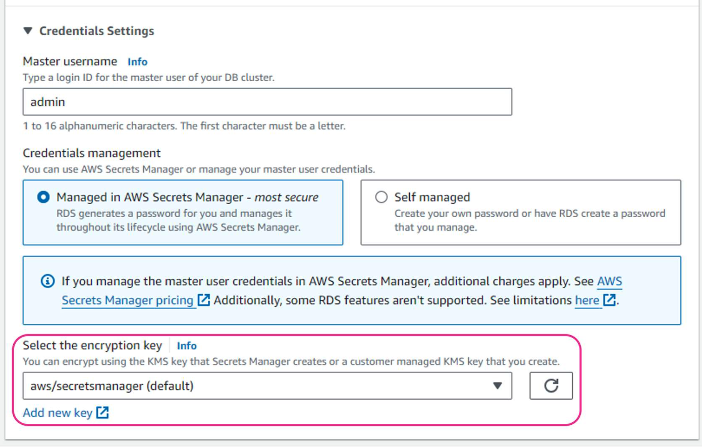

At-rest data encryption can be enabled for an Amazon RDS database using the AWS CLI too. This example creates an Amazon RDS for MySQL version 8.0.35 database called `my-encrypted-db` with storage encryption enabled.

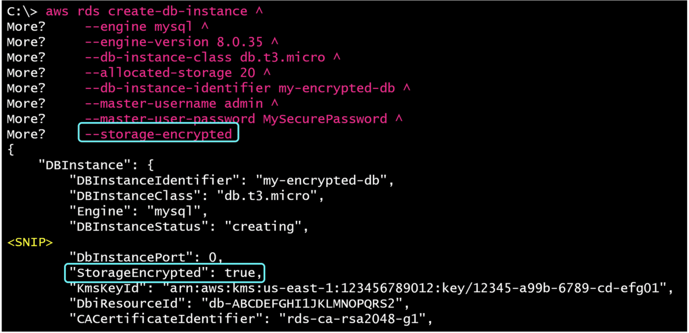

```bash
C:\> aws rds create-db-instance ^
More?     --engine mysql ^
More?     --engine-version 8.0.35 ^
More?     --db-instance-class db.t3.micro ^
More?     --allocated-storage 20 ^
More?     --db-instance-identifier my-encrypted-db ^
More?     --master-username admin ^
More?     --master-user-password MySecurePassword ^
More?     --storage-encrypted
{
    "DBInstance": {
        "DBInstanceIdentifier": "my-encrypted-db",
        "DBInstanceClass": "db.t3.micro",
        "Engine": "mysql",
        "DBInstanceStatus": "creating",
<SNIP>
        "DbInstancePort": 0,
        "StorageEncrypted": true,
        "KmsKeyId": "arn:aws:kms:us-east-1:123456789012:key/12345-a99b-6789-cd-efg01",
        "DbiResourceId": "db-ABCDEFGHI1JKLMNOPQRS2",
        "CACertificateIdentifier": "rds-ca-rsa2048-g1",
```

---

#### Checking encryption status of an existing Amazon RDS database

Suppose you have inherited an Amazon RDS database, or had one created as a result of an AWS CloudFormation stack pulled from code repository. How can you determine if the database has encryption enabled?

##### Amazon RDS console

You can view the encryption status of an Amazon RDS database by choosing RDS from the AWS Management Console, and choosing **Databases** from the left navigation menu. Next, choose the database that you want to examine, and on the details page, choose the **Configuration** tab.

The following screenshots compare the configuration details for two databases, `customer-credit-db` and `customer-sales-db`. The **Configuration** tab shows that encryption is enabled for `customer-credit-db` and not enabled for `customer-sales-db`.

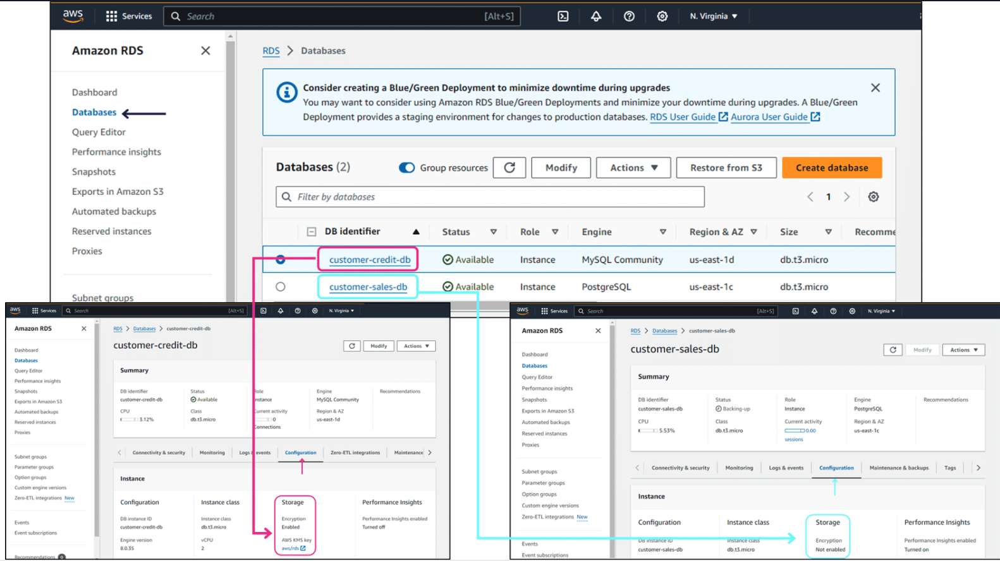

##### AWS CLI

The AWS CLI can also be used to determine whether encryption is enabled for an Amazon RDS database.

The following two AWS CLI screenshots compare the details for two databases, `customer-credit-db` and `customer-sales-db`. The **StorageEncrypted** value shows that encryption is `enabled` (`true`) for `customer-credit-db`, and `disabled` (`false`) for `customer-sales-db`. The encrypted database also displays the ARN of the AWS KMS key used to encrypt the data.


---

#### Encrypting an existing Amazon RDS database

Encryption for Amazon RDS databases must be enabled at the time of database creation. You cannot enable encryption on an existing Amazon RDS database that was originally created unencrypted. However, you can use the Amazon RDS snapshot feature to copy data from an unencrypted database to a new encrypted database. Here are the general steps to do this:

1. **Take a final snapshot of the unencrypted database**. This snapshot is of the original, unencrypted database, and will be used to migrate data to the new encrypted instance.
2. **Create an encrypted copy of the unencrypted snapshot**. On the RDS console, go to the **Snapshots** page and create an encrypted copy of the unencrypted snapshot of the database.
3. **Restore the encrypted snapshot to a new encrypted instance**. On the Amazon RDS console, choose **Snapshots**. Select the encrypted snapshot that you created. For **Actions**, choose **Restore Snapshot.** For **DB Instance Identifier**, use a unique name for the new encrypted database instance. Review the instance details, and then choose **Restore DB Instance**. A new, encrypted DB instance will be created from your snapshot.
4. **Update application connections**. When the snapshot is restored, update your application connection strings and credentials to point to the new encrypted RDS instance.
5. **Delete the original, unencrypted database**. After verifying that everything is working correctly with the new encrypted instance, you can optionally delete the old, unencrypted database instance.

---

#### Using the AWS Management Console to encrypt an existing, unencrypted, Amazon RDS for PostgreSQL database called `customer-sales-db`.

1. Go to the AWS Management Console and navigate to the **Amazon RDS** page. Then select the database you want to encrypt. In this example, the existing, unencrypted database is called `customer-sales-db`.

    * 1.1. On the **Actions** menu, choose **Take snapshot**.
    * 1.2. On the **Take DB Snapshot** page, for **Snapshot type**, select **DB instance**. Enter a name for the snapshot that will be created. In this example, the snapshot name is `customer-sales-pre-encrypt-snapshot`.
    * 1.3. To finish creating the snapshot, choose **Take snapshot**.
    * 1.4. This will return you to the **Snapshots** page of the **Amazon RDS** console. Depending on the size of the database, you may need to wait for a few minutes for the snapshot process to complete.
    * 1.5. Once the process is complete, the snapshot name will appear on this page.
    * 1.6. The first of the five steps to encrypt the database is now complete.

2. Create an encrypted copy of the unencrypted snapshot called `customer-sales-pre-encrypt-snapshot`, which you just created.

    * 2.1. From the **Amazon RDS** console menu, choose Snapshots. On the **Snapshots** page, select `customer-sales-pre-encrypt-snapshot`.
    * 2.2. From the **Actions** menu, choose **Copy snapshot**.
    * 2.3. On the **Copy snapshot** page, enter a name for the encrypted copy of the snapshot. In this example, the snapshot is called `customer-sales-pre-encrypt-snapshot-encrypted`.
    * 2.4. You can also specify the **destination Region** into which the snapshot will be copied.
    * 2.5. Scroll down to the **Encryption** section. Select **Enable Encryption**, and then choose **Copy snapshot**.

3. Restore the encrypted snapshot to a new encrypted instance.

    * 3.1. From the **Snapshots** page, select the snapshot you want to restore. From the **Actions** menu, choose **Restore snapshot**.
    * 3.2. There are several options on the **Restore snapshot** page. For this example, most of the default values are acceptable. Begin by verifying the DB engine name and the database type, then scroll down the page.
    * 3.3. In the **Settings** section, for **DB instance identifier**, enter a name for the new, encrypted database that will be created from the encrypted snapshot. This example uses `customer-sales-db-encrypted` for the new database instance name.
    * 3.4. Accept the default settings in the **Storage** and **Connectivity** sections.
    * 3.5. Continue scrolling past the **DB subnet group**, **Public access**, and **VPC security group** sections, leaving these settings at their default values.
    * 3.6. Scroll past the **Database authentication** and **Encryption** sections, and leave these settings at their default values.
    * 3.7. At the bottom of the **Restore snapshot** page, choose the **Restore DB instance** button to begin the restoration process.
    * 3.8. This returns you to the Databases page of the Amazon RDS console. The new `customer-sales-db-encrypted` database will show a status of **Creating** while the snapshot is being restored.
    * 3.9. The snapshot restoration process can take anywhere from several minutes to several hours, depending on the size of the database.
    * 3.10. When the snapshot restoration is complete, the new database, `customer-sales-db-encrypted`, will show a status of **Available**.

4. Connect the new, encrypted database to the application instead of the old, unencrypted database.

    * 4.1. To view the connection information for the new, encrypted database, choose the `customer-sales-db-encrypted` link from the Databases page.
    * 4.2. Select the **Connectivity & security** tab. This is where the database endpoint and port number appears.
    * 4.3. To confirm that the database is encrypted, choose the **Configuration** tab on this page. Here in the **Storage** section, it shows that encryption is enabled.

5. Delete the original, unencrypted database. This is an optional step, but if the old, encrypted database is no longer needed, this can help reduce costs.

    * 5.1. Go to the **Databases** page on the **Amazon RDS** console, and select the database.
    * 5.2. From the **Actions** menu, choose **Delete**. This starts the process of deleting the old database.

---

#### Reducing downtime when using snapshots to encrypt a database

Following the previous process, the creation of a new encrypted instance will result in some downtime for your application. How much downtime depends on the size of your database and the time that it takes to restore the snapshot. If you want to minimize downtime as much as possible, the following steps can be taken after the encrypted database has been created using the encrypted snapshot:

1. Use the AWS Management Console to configure the AWS Database Migration Service (AWS DMS). Use the **Migrate existing data** feature to replicate ongoing changes between the source unencrypted database and the new encrypted database.
2. After the data load is complete, verify the data on the new encrypted database to see if it matches the source data from the source, unencrypted database.
3. When you are ready to cut over to the new encrypted database, stop any write activity on the source unencrypted database. Wait for AWS DMS to catch up to the final data changes that were made on the source database.
4. Redirect the application to the new encrypted database as described in the previous section.

By adding AWS DMS to the migration process, the application downtime to perform the cutover is no longer dependent on the size of the database. Instead, downtime will be limited to the time that it takes for the new encrypted database to finalize the transactions from the source unencrypted database. This is typically measured in seconds or minutes, depending on how much write activity occurs in the application.

---

### At-rest data encryption with DynamoDB

Server-side encryption at rest is enabled on all your DynamoDB table data and cannot be disabled.

By default, the AWS KMS encryption key is owned and managed by DynamoDB. You are not charged an additional fee for using this key.

Alternatively, you can use an AWS managed key or a customer managed key. If you use an AWS managed key, the key will have an alias name of aws/dynamodb. Under this option, the key is stored in your account and is managed by AWS KMS, and AWS KMS charges will apply.

If you use a customer managed key, the encryption key is stored in your account and is owned and managed by you, and AWS KMS charges will apply.

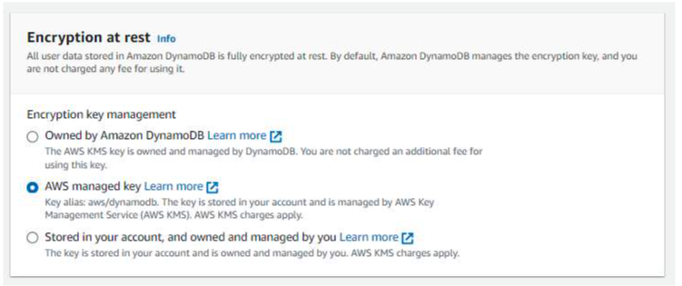

Three encryption options for Amazon DynamoDB tables.

The encryption key type to use for a new DynamoDB table can also be specified using the AWS CLI by including the `--sse-specification` option for the aws dynamodb create-table command. In the first example shown here, the **`--sse-specification Enabled=true, SSEType=KMS`** syntax creates an encrypted table called **Customer**, with an encryption key managed by AWS KMS. The second example uses the **`--sse-specification Enabled=true,SSEType=KMS,KMSMasterKeyId=abcd1234-abcd-1234-ab1234a1b234`** syntax to create a DynamoDB table, with a customer managed encryption key.

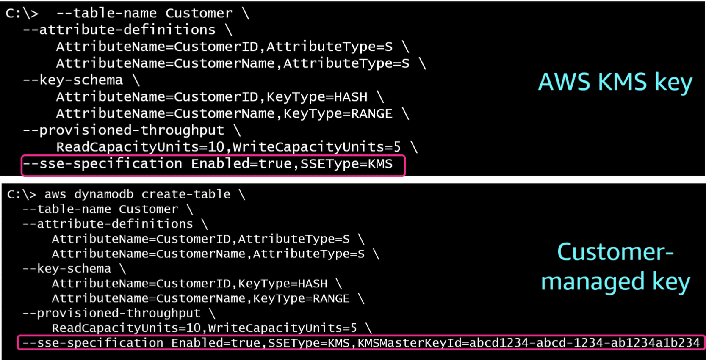

Amazon DynamoDB create table commands with AWS-KMS and customer-managed encryption keys

```bash
# AWS KMS key example
  --table-name Customer \
  --attribute-definitions \
      AttributeName=CustomerID,AttributeType=S \
      AttributeName=CustomerName,AttributeType=S \
  --key-schema \
      AttributeName=CustomerID,KeyType=HASH \
      AttributeName=CustomerName,KeyType=RANGE \
  --provisioned-throughput \
      ReadCapacityUnits=10,WriteCapacityUnits=5 \
  --sse-specification Enabled=true,SSEType=KMS  

# Customer-managed key example
aws dynamodb create-table \
  --table-name Music \
  --attribute-definitions \
      AttributeName=CustomerID,AttributeType=S \
      AttributeName=CustomerName,AttributeType=S \
  --key-schema \
      AttributeName=CustomerID,KeyType=HASH \
      AttributeName=CustomerName,KeyType=RANGE \
  --provisioned-throughput \
      ReadCapacityUnits=10,WriteCapacityUnits=5 \
  --sse-specification Enabled=true,SSEType=KMS,KMSMasterKeyId=abcd1234-abcd-1234-ab1234a1b234
```

---

Using the AWS CLI to create a DynamoDB table without an sse-specification clause will create an encrypted table that uses the default AWS KMS encryption key owned and managed by DynamoDB.

---

#### Amazon DynamoDB table keys

Whichever key management method is selected for the DynamoDB encryption key, DynamoDB will use the table's KMS key to generate and encrypt a unique data key for the table, known as the table key.

The table key persists for the lifetime of the encrypted table. The table key is used as the key encryption key. DynamoDB uses this table key to protect data encryption keys that are used to encrypt the table data.

DynamoDB generates a unique data encryption key for each underlying structure in a table. But multiple table items might be protected by the same data encryption key.

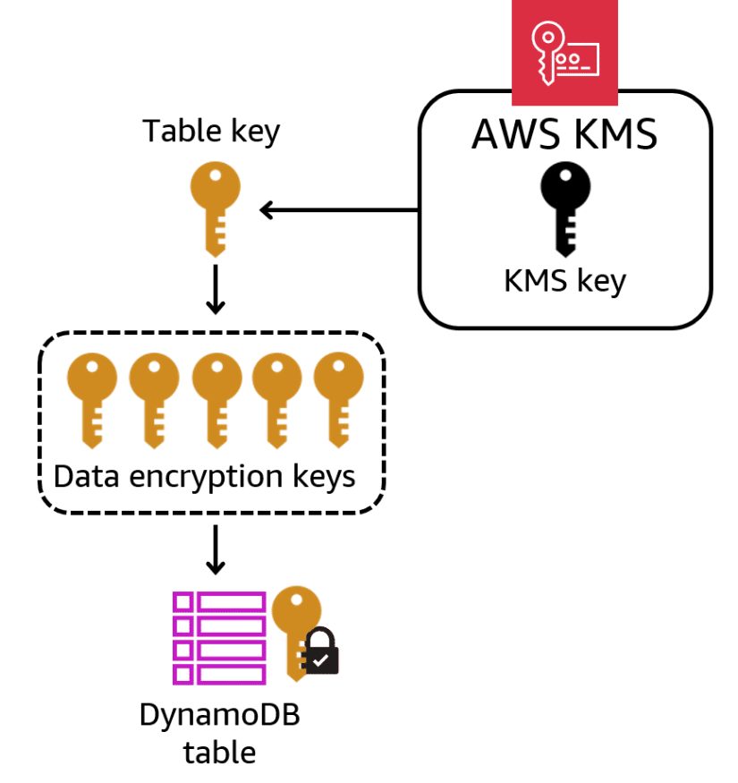

Relationship between KMS, table, and data encryption keys.

---

#### Modifying the encryption key for a DynamoDB table

If your encryption requirements change, the encryption key used by a DynamoDB table can be modified. Using the DynamoDB console, you can change the encryption key on an existing DynamoDB table by choosing the new encryption key type, and then choosing the **Save changes** button. This example shows the encryption type being changed to an AWS managed key. If the customer managed key were chosen, the ARN of the customer managed key would also have to be provided.

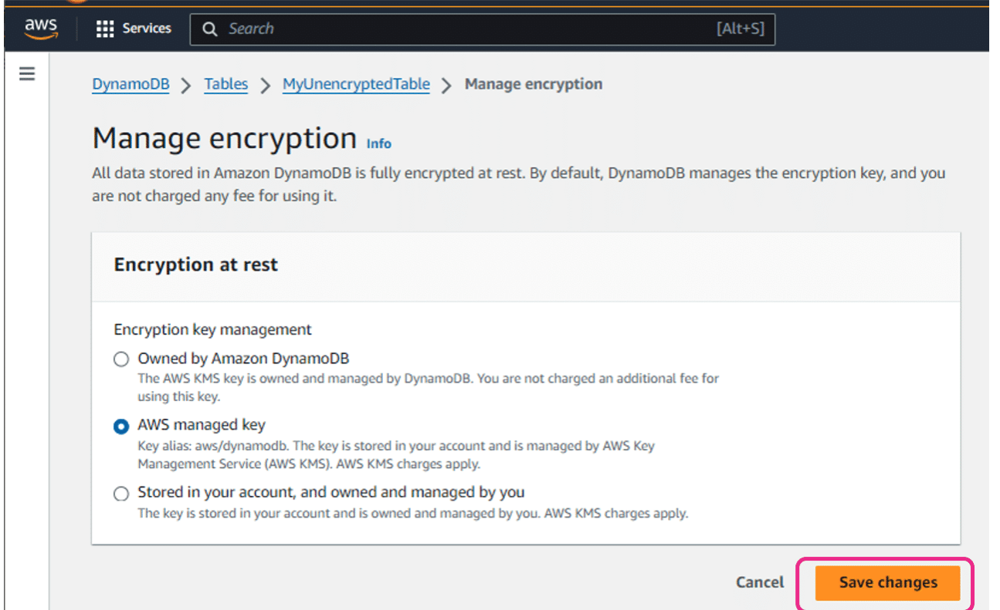

Amazon DynamoB console page showing how to change the encryption key type.

As shown here, the AWS CLI can also be used to modify the existing encryption key on a DynamoDB table. The AWS CLI uses the **`aws dynamodb update-table`** command with a specified encryption key type using the **`--sse-specification Enabled=true`** option and a specified key type. In this case, a customer managed key is being used.


Changing the encryption key type for a DynamoDB table using the AWS CLI.

---

## AWS Encryption SDK

### Introduction

The AWS Encryption SDK is a client-side encryption library designed to simplify encrypting and decrypting data using industry standards and best practices. By using the SDK, you can focus on the core functionality of your application, rather than on how to best encrypt and decrypt your data. The AWS Encryption SDK is provided free of charge and works with the C, .NET, Java, JavaScript, and Python programming languages.

### AWS Encryption SDK overview

The AWS Encryption SDK consists of four main components: Cryptographic materials managers, master key providers, master keys, and data keys. The role of each of these components is listed as follows:

* **Cryptographic materials managers**. Cryptographic materials managers collect cryptographic materials and prepare them for use. The default manager collects encrypted data keys from all master keys referenced by the master key provider.
* **Master key providers**. Master key providers provide master keys. AWS KMS is an example of a master key provider.
* **Master keys**. Master keys generate, encrypt, and decrypt data keys. An example of a master key is an AWS KMS customer master key (CMK).
* **Data keys**. Data keys are the encryption keys that are used to encrypt your data.

### How the AWS Encryption SDK works

The AWS Encryption SDK is used in conjunction with your development environment to securely handle and protect encryption keys, passwords, and other confidential information. The AWS Encryption SDK does this by working with the cryptographic manager that is part of your application development environment. The master key and keyring cryptographic managers that can be used with the SDK are described in the following table.

| Development environment | Cryptographic manager | Role of the cryptographic manager in this development environment |
| ----------------------- | --------------------- | --------------------- |
| Java and Python | master key | Manages and provides access to the master keys used for encryption and decryption |
| C, .NET, JavaScript | keyring | Used to protect and manage access to sensitive information required by the application, including cryptographic keys and passwords |

With the AWS Encryption SDK, you define the cryptographic manager that determines which wrapping keys you can use to protect your data. Then you encrypt and decrypt your data using straightforward methods provided by the AWS Encryption SDK. In addition, there is also an AWS Encryption SDK CLI available.

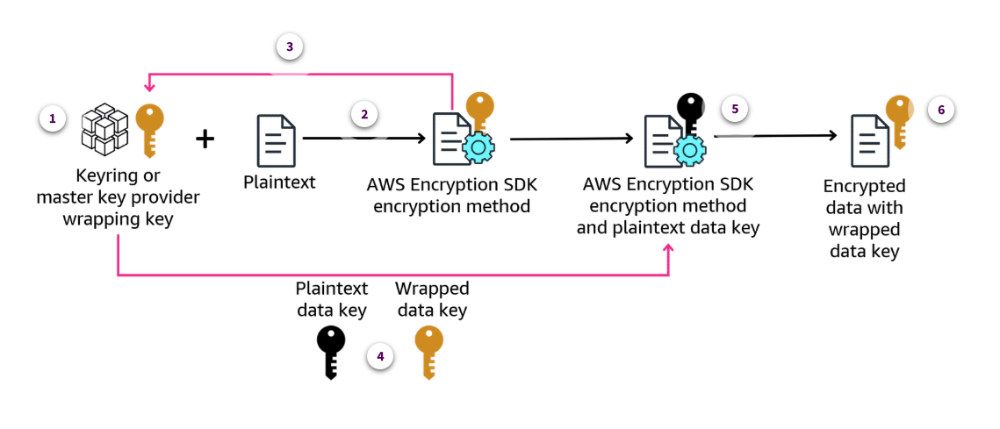

1. **Wrapping keys**

    Create a keyring or master key Provider that specifies the wrapping keys that protect your data.

2. **Passing plaintext and key**

    Pass the wrapping key and plaintext data to the AWS Encryption SDK encryption method.

3. **Encryption materials**

    The encryption method asks the Keyring or Master Key Provider for encryption materials.

4. **Returning keys**

    The Keyring or Master Key Provider returns two unique data encryption keys for the plaintext:

    * Plaintext data key
    * Copy of that same data key encrypted by each of the specified wrapping keys

5. **Encrypting and discarding key**

    The encryption method uses the plaintext data key to encrypt the data, and then discards the plaintext data key.

6. **Returning encrypted data**

    The encryption method returns an encrypted message that contains the encrypted data and the encrypted data key.

---

The AWS Encryption SDK provides methods that decrypt the encrypted message and return plaintext. You can use a keyring (C, C# / .NET, and JavaScript) or a master key provider (Java, Python, AWS CLI). The keyring or master key provider that decrypts the encrypted message must be compatible with the one used to encrypt the message. One of its wrapping keys must be able to decrypt an encrypted data key in the encrypted message.

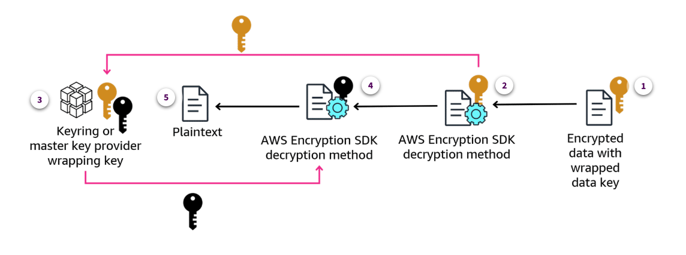

1. **Pass the data and key**

    Pass the encrypted message and the encrypted key to the AWS Encryption SDK decryption method.

2. **Decrypt the data key**

    The decryption method asks the Keyring or Master Key Provider to decrypt one of the encrypted data keys in the encrypted message. It passes in information from the encrypted message, including the encrypted data keys.

3. **Find plaintext data key**

    The keyring or master key provider uses its wrapping keys to decrypt one of the encrypted data keys. If it's successful, the response includes the plaintext data key.

4. **Decrypt the data**

    The decryption method uses the plaintext data key to decrypt the data, and discards the plaintext data key.

5. **Return the data**

    The decryption method returns the plaintext data.

---

### AWS Encryption SDK best practices

The AWS Encryption SDK is designed to make it easier for you to protect your data using industry standards and best practices. The AWS Encryption SDK includes many best practices as default values in the tool, and other practices are optional.

| Recommended best practice | Rationale |
| ------------------------- | ------------------------- |
| Use the latest version of the SDK. | Use the latest version of the SDK available for your preferred programming language. Doing so assures that you're using the recommended configuration and taking advantage of new security properties to protect your data. |
| Use the SDK default values. | Whenever possible, you should use the AWS Encryption SDK default values because these values are based on design best practices. |
| Use encryption context. | This is an optional component, consisting of a set of key-value pairs that provide additional contextual information associated with the encrypted data. Although optional, this is a recommended best practice when encrypting data. The SDK incorporates this context into the encryption process, ensuring that the ciphertext is bound to the provided context. During decryption, the same encryption context must be provided to successfully decrypt the data. |
| Protect your wrapping keys. | The SDK generates a unique data key to encrypt each plaintext message, then encrypts the data key with wrapping keys that you supply. If your wrapping keys are lost or deleted, your encrypted data is unrecoverable. Use wrapping keys that are protected by a secure key infrastructure, such as AWS KMS. |
| Specify your wrapping keys. | Specify your wrapping keys explicitly when encrypting or decrypting data. When you do, the SDK uses only the keys that you specify. This practice assures that you only use the encryption keys that you intend. |
| Use digital signatures. | Digital signatures verify that the message sender was authorized to send the message, and protects the integrity of the message. All versions of the SDK use algorithm suites with signing by default. |
| Use key commitment. | Key commitment is a security feature that helps protect against encryption key misuse and provides cryptographic proof that the correct encryption key was used during the encryption process. Key commitment incorporates into the encrypted message a commitment value derived from the data encryption key. |
| Limit the number of encrypted data keys. | Limit the number of encrypted data keys in the messages that you decrypt. Trying to decrypt messages with numerous encrypted data keys that you can't decrypt can cause performance issues, increase expenses, throttle your application, and potentially exhaust your key infrastructure. |

---

### Knowledge Check

#### A data encryption scheme is performed using an algorithm. It uses one key to encrypt the data and another key to decrypt data, and one key is distributed broadly for public use. Which type of encryption is this?

* Asymmetric encryption

Wrong answers:

* Symmetric encryption
* Envelope encryption
* Secure Sockets Layer

##### Explanation

This scenario describes characteristics of asymmetric encryption. Symmetric encryption uses the same key to encrypt and decrypt data, and the key is private. Envelope encryption and Secure Sockets Layer don't fit this description.

#### An application developer wants to use server-side encryption to protect application data at rest in Amazon S3 buckets. Which encryption option should the developer use if they do not want to manage their own encryption keys?

* SSE-S3

Wrong answers:

* SSE-KMS
* SSE-C
* DSSE-KMS

##### Explanation

SSE-S3 is self-managed by Amazon S3. SSE-KMS and DSSE-KMS let you choose a customer managed key that you create and manage. SSE-C requires you to managed and rotate encryption keys.

#### A database administrator created an Amazon RDS for PostgreSQL database without encryption. The security analyst has asked that encryption be enabled on the database. What steps will the database administrator need to perform? (Select THREE.)

* Create a snapshot of the unencrypted database.
* Create an encrypted copy of the unencrypted database snapshot.
* Restore the encrypted copy of the snapshot to a new encrypted database.

Wrong answers:

* Enable encryption for the existing database using the AWS Management Console.
* Export the contents of the database to Amazon S3, then re-create the database and import the data.
* Make a back up of the existing unencrypted database and store the backup in another Amazon Region.

##### Explanation

**Create a snapshot of the unencrypted database**, **create an encrypted copy of the snapshot**, and **restore the encrypted snapshot to a new, encrypted database**. The other steps are not helpful for enabling encryption on an existing Amazon RDS database.

#### A developer needs to create an encrypted Amazon DynamoDB table to store user session information for a gaming leaderboard. Which options are available to the developer for encrypting the data at rest?

* DynamoDB owned key, AWS managed key, or customer managed key encryption can be used.

Wrong answers:

* None, Amazon DynamoDB table data cannot be encrypted at rest.
* Symmetric or asymmetric encryption can be used.
* Transport Layer Security encryption can be used.

##### Explanation

**DynamoDB owned key**, **AWS managed key**, or **customer managed key** encryption can be used for at-rest encryption in Amazon DynamoDB. The other options are not applicable to DynamoDB or at-rest encryption.

#### A development team is planning to use Java and Python with the AWS Encryption SDK to manage the encryption tasks in their new application. Which of these is considered a best practice that the team should adhere to?

* Use the latest version of the SDK for development.

Wrong answers:

* Avoid the use of SDK default values.
* Use digital signatures only when absolutely necessary.
* Don't place limits on the number of encrypted data keys.

##### Explanation

**Using the latest version of the SDK** assures that you are using the recommended configuration and taking advantage of new security properties to protect your data. All the other items are contrary to recommended best practices for AWS Encryption SDK.

---

### Summary

* Symmetric, or private key, encryption uses a single key to encrypt and decrypt data, and all users who need access to the decrypted data will need access to the shared encryption key. This encryption method is commonly used to protect data at rest.
* Asymmetric, or public key, encryption uses two keys, one to encrypt the data and another to decrypt the data. One key is for public use, and the other is secure. This encryption method is commonly used to protect data in transit.
* Public key infrastructure (PKI) is a system of hardware, software, people, policies, documents, and procedures that results in the issuance and management of digital certificates. Certificates can be either public or private, but are used to establish trust between clients and servers.
* Transport Layer Security (TLS) and Secure Sockets Layer (SSL) are common asymmetric data encryption techniques for protecting data in transit.
* Encryption of data at rest can be achieved using either client-side or server-side encryption. AWS offers several client-side encryption tools including AWS Encryption SDK, Amazon S3 Encryption Client, and AWS Database Encryption SDK.
* Amazon Simple Storage Service (Amazon S3) offers four options for at-rest data encryption:

  * Server-side encryption with Amazon S3 managed keys (SSE-S3). This is the default.
  * Server-side encryption with AWS KMS keys (SSE-KMS)
  * Server-side encryption with customer-provided keys (SSE-C)
  * Dual-layer server-side encryption with AWS KMS keys (DSSE-KMS)

* Amazon RDS databases offer at-rest data encryption. Encryption must be enabled at database creation and cannot be turned on after the fact. To encrypt an existing, unencrypted Amazon RDS database, you must create a snapshot of the unencrypted database, create an encrypted copy of that snapshot, then use the encrypted snapshot copy to restore the database to a new, encrypted database.
* Amazon DynamoDB tables are encrypted by default, using an AWS Key Management Service (AWS KMS) key that is owned by DynamoDB. Table keys are used to encrypt the data stored in the table.
* The AWS Encryption SDK is a client-side encryption library designed to simplify encrypting and decrypting data using industry standards and best practices. This SDK can be used with Java, Python, C, .NET, or JavaScript programming environments. The AWS Encryption SDK is used in conjunction with your development environment to securely handle and protect encryption keys, passwords, and other confidential information. AWS provides recommended best practices for using the SDK, including using the latest SDK version, making use of default values, creating encryption content key-value pairs, and using digital signatures, among other suggestions.

---
