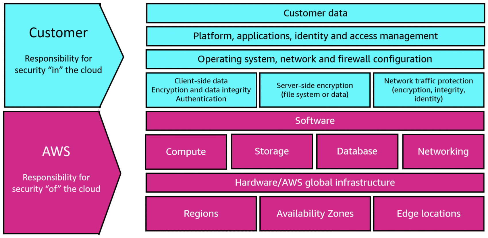
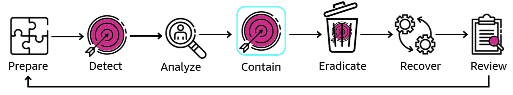
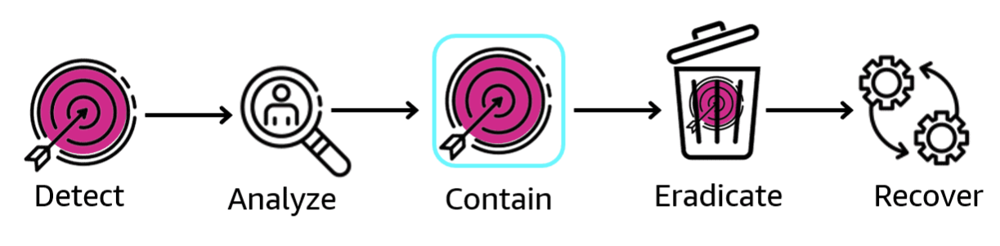
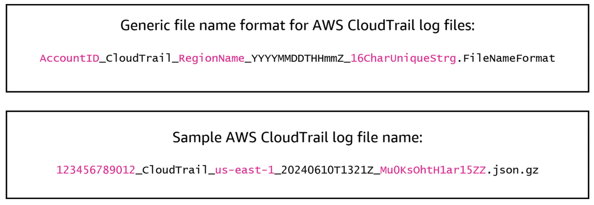
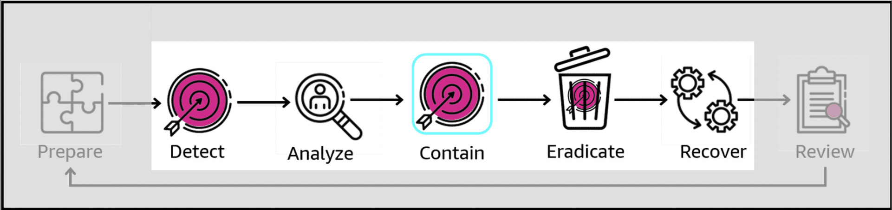

# Week 2: Security 3 Part 2: Incident Response

* back to AWS Cloud Institute repo's root [aci.md](../aci.md)
* back to [AWS Cloud Fundamentals 2](./aws-cloud-fundamentals-2.md)
* back to repo's main [README.md](../../../README.md)

## AWS Incident Response

### Introduction

A security incident is any impact on business operations that runs counter to your organization's policies or standard security practices. This module discusses incident response within the context of the AWS Cloud.

### Events and incidents

The National Institute of Standards and Technology (NIST) defines both security events and incidents. These terms are described in the following sections.

#### Events

An event is any observable occurrence in a system or network. Not all events are bad or lead to incidents. Examples of events include the following:

* A user connecting to a file share
* A server receiving a request for a webpage
* A user sending email
* A firewall blocking a connection attempt

#### Adverse events

NIST defines an adverse event as an event with a negative consequence. Adverse events can include the following:

* Hardware failures
* Denial of service attacks
* Unauthorized use of system privileges
* Unauthorized access to sensitive data
* Malware that destroys data

Incident response focuses on adverse events related to services in the AWS Cloud.

---

#### Incidents

NIST defines a computer security incident as a violation or an imminent threat of violation of computer security policies, acceptable use policies, or standard security practices. Examples of incidents include the following:

* A threat actor uses a distributed denial of service (DDoS) attack, which causes an organization's website to crash.
* A threat actor obtains sensitive data and threatens that the details will be released publicly if the organization does not pay a designated sum of money.
* A user provides or exposes sensitive information to others through peer-to-peer file-sharing services.

---

### Indicators of compromise

Events are the primary source of **indicators of compromise (IoCs)**. IoCs refer to observable artifacts, such as log entries or access patterns, that might indicate the presence of a security breach, malicious activity, or unauthorized access within your AWS environment. These IoCs can be used to detect, investigate, and respond to potential security incidents. Examples of IoCs in the AWS Cloud include the following:

* **Unauthorized API calls** – Unusual or suspicious API calls recorded in AWS CloudTrail logs, such as API calls from unfamiliar IP addresses, unauthorized Regions, or unexpected services.
* **Unusual resource usage patterns** – Abnormal spikes or deviations in resource usage, such as sudden increases in network traffic, CPU utilization, or data transfer volumes, which might indicate malicious activities like cryptocurrency mining or data exfiltration.
* **Suspicious network traffic** – Network traffic patterns that deviate from the norm, such as connections to known malicious IP addresses, unusual port scanning activities, or unauthorized inbound/outbound traffic flows.
* **Unauthorized access attempts** – Failed login attempts, brute-force attacks, or unauthorized access attempts recorded in AWS service logs, such as Amazon GuardDuty findings or AWS WAF logs.
* **Unauthorized resource creation or modification** – Unexpected creation, modification, or deletion of AWS resources, such as EC2 instances, S3 buckets, or IAM roles, which might indicate the presence of unauthorized actors or compromised credentials.
* **Suspicious user behavior** – User activities that deviate from established baselines or patterns, such as accessing resources from unusual locations, performing actions outside of normal working hours, or exhibiting behavior inconsistent with their role or responsibilities.
* **Known malware signatures or hashes** – Presence of known malware signatures, hashes, or indicators identified by security intelligence sources within your AWS environment, such as infected EC2 instances or compromised container images.
* **Unauthorized software installations** – Unauthorized or unexpected software installations on EC2 instances, containers, or other AWS resources, which might indicate the presence of malware or unauthorized modifications.
* **Misconfigured security settings** – Insecure configurations or deviations from security best practices, such as open security groups, overly permissive IAM policies, or disabled logging or monitoring services.

By continuously monitoring for these and other IoCs, organizations can enhance their ability to detect potential security incidents within their AWS environment and take appropriate actions to investigate and mitigate the threats.

---

## Incident Response: Traditional and Cloud

### Introduction

This section presents the fundamentals of responding to security incidents within your AWS Cloud environment. It provides an overview of cloud security and incident response concepts and identifies cloud capabilities, services, and mechanisms that are available to you when responding to security issues.

### AWS shared responsibility model

The diagram shown here demonstrates the AWS shared responsibility model. Under this model, AWS manages the security of the cloud, and customers are responsible for security in the cloud.

AWS shared responsibility model.

The shared responsibility model gives you full control of your security implementation and provides several tools and services to help meet your specific security objectives. These capabilities help you establish a security baseline for applications running in the AWS Cloud. All your AWS users should have a basic understanding of your organization's security incident response processes.

### Phases of incident response

The seven phases shown here represent incident response activities that should be included in your organization's security plan. The following sections describe each of these phases and discuss which phases can be grouped together.

Incident response phases and workflow.

#### Preparation

The prepare phase refers to taking steps to detect and respond to incidents within AWS. This preparation involves enabling detective controls and verifying appropriate access to the necessary tools and cloud services. These detective controls are used to identify potential security incidents, policy violations, or unauthorized activities within your AWS environment. Identifying which AWS services to use for detection and how to best configure those services for the effective monitoring and alerting are important steps in the preparation stage.

Preparing for an incident is critical for timely and effective incident response. Preparation is done across three areas:

* **People** – Identify the relevant stakeholders for incident response and train them on incident response and cloud technologies.
* **Process** – Document architectures, develop thorough incident response plans, and create playbooks for consistent response to security events.
* **Technology** – Set up access, aggregate and monitor necessary logs, implement effective alerting mechanisms, and develop response and investigative capabilities.

#### Operations

As shown here, the operations stage of the incident response process is composed of five phases: detect, analyze, contain, eradicate, and recover.

Developers, architects, and administrators who work in your organization's AWS environment need to be aware of the activities required to implement these five phases. Each of these five phases has distinct goals.

| Phase | Goal | Description |
| ----- | ---- | ----------- |  
| Detect | Identify a potential security incident. | Alerts are the main component of the detect phase. Alerts generate notification to initiate the incident response process based on the AWS account activity of interest. |
| Analyze | Determine whether the security event is an incident, and if it is, assess the scope of the incident. | Logs, query capabilities, and threat intelligence are involved in this phase. Many of the same logs used for detection are also used for analysis. The logs require onboarding and configuration of query tools. |
| Contain | Minimize and limit the scope of the security incident by mitigating the causes of the incident. | Act to minimize the scope of the security incident and contain the effects of unauthorized usage within the environment. Containment depends on many factors and can vary based on containment tactics, timing, and purpose. |
| Eradicate | Mitigate the security incident by removing unauthorized resources or artifacts related to the security event.| This involves removal of suspicious or unauthorized resources to return the account to a known safe state. Eradication depends on multiple factors that can vary based on your business requirements. |
| Recover | Restore systems to a known safe state, and monitor these systems to verify that the threat does not return. | This phase includes the following: * Restoring systems to a known safe state * Validating that backups are safe or unaffected by the incident * Testing to verify that the systems are working properly * Addressing vulnerabilities associated with the security incident |

---

### AWS CloudTrail logs

CloudTrail logs are a primary source of data for the detection of security events. The following image shows the naming convention used for CloudTrail logs.

AWS CloudTrail log naming convention and sample log file name.

The image shows that the AWS CloudTrail log naming convention consists of the AWS account ID, the keyword CloudTrail, the AWS Region name, a timestamp in the year, month, day, hours, minutes, seconds, and a random set of 16 characters. The file extension on the CloudTrail log is .json.gz, for a text file stored in a compressed format.

The sample AWS CloudTrail log shown is in compressed json format, and was created for AWS account ID 123456789012, in the us-east-1 Region, on June 10, 2024. The Mu0KsOhtH1ar15ZZ portion of the log file name is a randomly generated string.

---

#### Post-incident activity

The incident response phase can be improved upon with each iteration. Based on the outcome of your security events and simulations, you can adjust the operational processes used for detection, analysis, containment, eradication, and recovery. Each iteration will improve the efficacy of your incident response. You can increase the value derived from response and investigation and further reduce your risk. Learning from incidents improves the preparation process, which completes the incident response loop.

The threat landscape is constantly changing. Be dynamic in your organization's ability to effectively protect your environments. Iterate on the outcomes of your incidents and simulations to improve your capabilities.

---

### Design goals for incident response processes

General processes and mechanisms for incident response are defined by the NIST *Computer Security Incident Handling Guide*. However, it's important to also consider specific AWS Cloud design goals when investigating security incidents.

#### Establish response objectives

Work with your organization's stakeholders, legal team, and senior leadership to determine the goal of responding to an incident. Some common goals include containing and mitigating the issue, recovering the affected resources, preserving data for forensics, returning to known safe operations, and ultimately learning from incidents.

#### Respond using the cloud

Implement response patterns within the cloud where the event and data occur.

#### Know what you have and what you need

When an incident occurs, preserve logs, resources, snapshots, and other evidence by copying them to a centralized cloud account dedicated to incident response. You will need to understand what services you use, and what options are available for investigating those services.

#### Use redeployment mechanisms

If you can attribute a security anomaly to a misconfiguration, the solution might be as convenient as redeploying the misconfigured resources with the correct configuration. If you identify a possible security compromise, verify that your redeployment includes successful and verified mitigation of the root causes of that compromise.

### Automate where possible

As issues arise or incidents repeat, build mechanisms to programmatically triage and respond to common events. Use human responses for unique, complex, or sensitive incidents where automations are insufficient. AWS CloudTrail and Amazon CloudWatch can be used with alerting configurations to support this goal.

#### Choose scalable solutions

Strive to match the scalability of your organization's approach to cloud computing. Implement detection and response mechanisms that scale across your environments to effectively reduce the time between detection and response.

#### Learn and improve your process

Be proactive in identifying gaps in your processes, tools, or people, and implement a plan to fix them. Simulations are safe methods to find gaps and improve processes. Regular practice responding to simulated security incidents will help streamline the reaction to real incidents.

---

### Incident response in the AWS Cloud

In some ways, responses to security incidents in the AWS Cloud are different than those of on-premises data centers. These differences include the domains where incidents can occur, the areas for which you have responsibility when responding to an incident, and the techniques available to react to and remediate the incidents.

#### AWS Cloud security incident domains

You are responsible for responding to security incidents in three AWS Cloud domains: service, infrastructure, and application.

##### Service domain

Incidents in the service domain might affect your AWS account, AWS Identity and Access Management (IAM) permissions, resource metadata, billing, or other areas. A service domain event is one that you respond to exclusively with AWS API mechanisms. It might also have root causes associated with configuration or resource permissions and service-oriented logging.

**Example:**

An IAM user accidentally posts their access keys on GitHub, and a threat actor uses them to access an AWS account.

##### Infrastructure domain

Incidents in the infrastructure domain include data-related or network-related activity, such as the following:

* Processes and data on your Amazon EC2 instances
* Traffic to your EC2 instances within the VPC
* Other areas such as containers or other future services

Your response to infrastructure domain events often involves acquiring incident-related data for forensic analysis. It might include interacting with the operating system of an instance and, in some cases, AWS API mechanisms.

In the infrastructure domain, you can use a combination of AWS APIs and digital forensics and incident response (DFIR) tooling within a guest operating system, such as a dedicated Amazon EC2 instance.

**Example:**

A threat actor hijacks an EC2 instance to perform a crypto-mining activity.

##### Application domain

Incidents in the application domain occur in the application code or software deployed to the services or infrastructure. Include this domain in your cloud threat detection and response playbooks and incorporate similar responses to those in the infrastructure domain. With appropriate and thoughtful application architecture, you can manage this domain with cloud tools by using automated acquisition, recovery, and deployment.

**Example:**

A web application vulnerability, such as SQL injection, allows an unauthorized user to manipulate code sent to a backend database.

---

#### Key differences in incident response in AWS

Security incident response is an integral part of your security strategy, either on premises or in the cloud. Security principles, such as least-privilege and defense-in-depth, are designed to protect the confidentiality, integrity, and availability of data both on premises and in the cloud.

##### Security is a shared responsibility

The responsibility for security and compliance is shared between AWS and its customers. This shared responsibility model relieves you of some of the operational burden related to incident response.

##### Detection and analysis rely on history of API activity

Because of the API-based nature of AWS, incident response relies on reviewing and issuing API calls, rather than using host-based or network-based command line tools and management utilities. This makes AWS CloudTrail an important log source for responding to security events. CloudTrail tracks the management API calls made in your AWS accounts and provides information about the source location of the API calls. Be prepared with effective log collection processes that use appropriate, verifiable storage for any data gathered as a result of an incident.

##### Potential attacks are geographically limited

On-premises applications and infrastructure use credentials that are usually bound by a network or a specific identity provider. This is not the case with applications built using AWS services, which often have public and private endpoints that might be accessible from anywhere in the world. This means that potential bad actor activity can also originate from anywhere in the world.

##### Cloud resources are dynamic

Another difference comes from the on-demand, self-service, dynamic nature of cloud resources. The AWS Cloud allows you to quickly create and delete resources. For example, with auto scaling, you can deploy and terminate resources based on changes in application traffic. However, with this short-lived infrastructure, a resource that you’re investigating might no longer exist or might have been modified by the time that you examine it. Therefore, tracking the creation and deletion of AWS resources will become important for incident analysis.

##### Automation is important

To fully realize the benefits of cloud adoption, your operational strategy should embrace automation. Infrastructure as code (IaC) is a pattern of highly efficient, automated processes where AWS services are deployed, configured, reconfigured, and destroyed using IaC services such as AWS CloudFormation. This approach also allows incident response to become highly automated. For example, you can use IaC to quickly isolate a compromised Amazon EC2 instance from the rest of your application environment.

---

## Incident Response Playbooks

### Introduction

Playbooks are an important aspect of effective cybersecurity incident response in the AWS Cloud by providing a structured and standardized approach to addressing security incidents. By following playbooks, you can respond quickly and consistently to security events when they occur.

### Creating incident response playbooks

Creating incident response playbooks requires proactive documentation that outlines the specific steps, tools, and processes to be followed when security events occur. This helps ensure that incident response teams have a clear roadmap for triaging, investigating, and mitigating security events. A typical incident response playbook should include topics on preparation for incident response and the people to involve in incident response planning and implementation. Playbooks also specify which processes to follow for each operational phase of the incident response, and which services can be used to support these processes.

#### Incident response preparation

This portion of the playbook will provide an overview of the events that cause, or are indicators of, a specific security incident type. This section essentially defines what prerequisites must be met for a particular incident to be declared.

#### Incident response stakeholders

People who are stakeholders in the rapid identification and remediation of security incidents should be part of the playbook development process. Clearly these stakeholders should include members of the IT security and operations teams, as well as executive IT managers like the chief information officer (CIO) and the chief information security officer (CISO). However, non-IT stakeholders should be included as well. Input from legal and compliance, human resources, and public relations and communications teams should also be sought during playbook creation.

#### Incident response actions for operational phases

The operational phases of the incident response process include detection, analysis, containment, eradication, and recovery, as highlighted here. The following sections provide details about playbook actions that should be documented for each of these phases.

The operational phases of the incident response process.

##### Detect phase

The goal of the detect phase is to identify a potential security incident. Alerts are the primary component of the detect phase. An alert generates a notification based on AWS account activity, and initiates the incident response process. Sources of alerts include logs, billing alarms, and messages from the AWS Trust and Safety team. Detective controls help determine how an alert will be used to respond to a particular event.

The three main types of detective controls are as follows:

* **Behavioral detection** – This method of detection relies on mathematical models, such as machine learning (ML) or artificial intelligence (AI). The detection is made using inference. Therefore, the alert might not always reflect an actual event.
* **Rule-based detection** – This method of detection is deterministic. You can set the exact parameters for which activities should be alerted on, including which events will raise alarms, how frequently those events must occur, and over what period of time.
* **People-based detection** – This source of detection comes from people inside or outside the customer’s organization. People-based detection comes in a variety of forms. This includes emails, tickets, mail, news posts, telephone calls, and in-person interactions. People are a valuable source for security events, so have processes in place for people to escalate concerns.

##### Analyze phase

The goal of the analyze phase is to determine if the security event is really an incident, and if it is, to assess the scope of the incident.

Many of the same logs used during the detect phase can also be used for the analyze phase. During the analyze phase, you should perform a defined series of comprehensive log analysis activities. These activities are used to validate the alerts, define scope of the resources that are involved in the incident, and assess the impact of the possible compromise.

During analysis, you might need to enrich your log data to add context to an alert. For example, you might need to use external threat intelligence services to assess the reputation and ownership of the public IP addresses, domain names, and file hashes seen in your logs.

##### Contain phase

The goal of the contain phase is to minimize and limit the scope of the security incident. Containment applies the processes that will minimize the scope of the security incident. Containment also constraints the effects of any unauthorized usage within your environment. Containment can be manual or automated. The overall containment strategy should align with your organization’s security policies and business needs. It should also verify that negative effects are mitigated as efficiently as possible before beginning the eradicate and recover steps.

1. **Source containment**

    Apply filtering or routing within your environment to prevent access to resources from a bad actor's specific source IP address or network range. For example:

    * **Security groups** – To contain unauthorized traffic, create and apply isolation security groups to Amazon EC2 instances and remove rules from an existing security group.
    * **Policies** – Configure Amazon S3 bucket policies to block or allow traffic from specific IP addresses, network ranges, or VPC endpoints.
    * **AWS WAF** – Configure web access control lists (ACLs) to provide control over web requests to which resources will respond. You can add an IP address or network range to an IP set, and then apply match conditions, such as traffic blocking, to the IP set.
    * **Network access control lists (network ACLs)** – Network ACLs can be used to block the source IP addresses of the unauthorized traffic at the subnet level.

2. **Technique and access containment**

    Prevent unauthorized use of a resource by limiting the functions and IAM principals with access to the resource. This includes restricting the permissions of IAM principles that have access to the resource and temporarily revoking credentials.

3. **Destination containment**

    Apply filtering or routing within your environment to prevent access to a targeted host or resource. In some cases, destination containment also involves a form of resiliency to verify that legitimate resources are replicated for availability. Resources should be detached from these forms of resiliency for isolation and containment.

---

##### Eradicate phase

The goals of the eradicate phase are to remove unauthorized resources or artifacts related to the security event and mitigate the causes of the security incident. Removal of suspicious or unauthorized resources, and a return of the environment to a known safe state, is the goal. The eradication process includes determining which AWS resources are affected by the incident, assessing each affected resource to determine the business impact, and taking the appropriate remediation steps. Eradication can be manual or automated, depending on the incident and affected resources.

##### Recover phase

The goal of the recover phase is to restore systems to a known safe state and monitor these systems to verify that the threat does not return. Best practices for recovery include the following:

* Restore systems from clean backups taken before the event occurred.
* Replace compromised files with clean versions of those files.
* Change passwords for IAM principals that might have been compromised.
* Tighten network perimeter security using ACLs and AWS WAF settings.
* Capture lessons learned and update incident response guide policies, procedures, and playbooks.

---

#### Incident response expected outcomes

Incident response playbooks should also clearly describe what the expected outcomes will be when the playbook's recommendations are implemented. Outcomes can be expressed at both a high level and at an action-specific level. An example of a high-level outcome might be the restoration of service within 15 minutes of the detection of an identified event. An example of an action-specific outcome could be the removal of a security group called prod-web-appl-access-sg from an Amazon EC2 instance that is part of the auto-scaling group called prod-web-appl-asg so that unauthorized access by a bad actor is blocked.

---

### AWS services for playbook development

AWS provides several services that can be used to support the preparation, stakeholder management, and operational phases of incident response playbook development.

#### Incident Manager

One example is Incident Manager, a capability of AWS Systems Manager. Incident Manager is designed to help you mitigate and recover from incidents affecting your applications hosted on AWS. Specifically, Incident Manager helps reduce the time to resolve incidents in the following ways:

* It provides automated plans for efficiently engaging the people responsible for responding to the incidents.
* It provides relevant troubleshooting data for identifying root causes of incidents.
* It enables automated response actions by using predefined automation runbooks.
* It provides methods to collaborate and communicate with all stakeholders before, during, and following an incident.
* It displays dashboards that show progress on incident resolution and a timeline of what happened.
* It recommends post-incident action items, new alarms, and runbooks to respond faster next time.
* It integrates with AWS services such as Amazon CloudWatch, AWS CloudTrail, AWS Systems Manager, and Amazon EventBridge.

---

The features and workflows built into Incident Manager are based on the best practices for incident response that AWS has been developing almost since its inception.

---

#### Individual AWS services

Individual AWS services can also be used to support the preparation, stakeholder management, and operational phases of incident response playbook development.

* **AWS CloudTrail**

    **Available event history data:**

    CloudTrail enables auditing of AWS accounts by logging and continuously monitoring account activity related to actions across AWS services. Logs include management operations performed on resources in your AWS account and operations performed on or within a resource in your AWS account.

* **VPC Flow Logs**

    **Available event history data:**

    VPC Flow Logs capture information about the network traffic going to and from the network interfaces in your VPC. This data is useful for understanding where your network traffic is originating and where it is going to. Flow log data can be published to Amazon CloudWatch Logs and Amazon S3 for subsequent analysis.

* **Amazon Route 53**

    **Available event history data:**

    Route 53 Resolver query logs let you log all DNS queries made by resources within your VPC. Whether your application uses EC2 instances, Lambda functions, or containers, if the application resource resides in your VPC and makes a DNS query, it will be logged by Route 53 Resolver.

---

#### he services that can provide proactive capabilities for playbook development and automated incident response

* **Amazon Detective**

    **Proactive capabilities:**

    Detective helps you analyze, investigate, and identify the root cause of security findings or suspicious activities. It automatically collects log data from your AWS resources and uses machine learning and statistical analysis to generate visualizations that help you conduct more efficient security investigations.

* **Amazon GuardDuty**

    **Proactive capabilities:**

    GuardDuty is an intelligent threat detection service that continuously monitors your AWS accounts, workloads, runtime activity, and data for malicious activity. If potential malicious activity is detected, GuardDuty generates detailed security findings that can be used for security visibility and assisting in remediation.

* **Amazon Inspector**

    **Proactive capabilities:**

    Amazon Inspector is an automated vulnerability management service that can be used to identify software vulnerabilities and unintended network exposure in near real time. It can be configured to continually scan EC2 instances, Lambda functions, and container images.

---

#### AWS Log Storage

Another example of an AWS service that can be used to support the operational phases of incident response playbook development is the **AWS Log Storage** capability. You can use the Log Storage capability to collect and store your environment logs centrally and securely in tamper-resistant storage. Tamper-resistant storage helps to maintain a chain of custody for any artifacts collected during an incident response activity. Ideally, automation can be used to collect log data and place it into Log Storage when incidents occur.

#### AWS Incident Detection and Response

With an eligible support plan, you can also work directly with AWS Support on the development and implementation of your incident response playbooks. AWS Incident Detection and Response is an add-on premium to Enterprise Support and is included with AWS Managed Services. The service offers 24/7 proactive monitoring and critical incident management for selected workloads.

AWS Incident Detection and Response offers proactive engagement and incident management to reduce the potential for failure and to accelerate recovery of critical workloads from disruption. It achieves these objectives by ensuring that there is joint preparation with AWS to develop runbooks and response plans customized to the context of each workload onboarded to the service. Onboarded workloads are monitored 24/7 by a team of incident management engineers (IMEs) to detect and engage you on a call bridge within 5 minutes of a critical alarm.

---

### Activity: Top Incident Response Tips

#### Top 4 Tips for Incident Response

Experts from the AWS Support incident response team were asked to share their top incident response tips. Based on their experience with real-world customers, the support analysts offered these four suggestions.

1. **Tip 1**

    Understand your overall threat surface and plan around specific resources that are most likely to be attacked. Document where log information for those resources is located, and which services and tools can be used to implement remediation actions for these services.

2. **Tip 2**

    Have mechanisms in place for practicing your incident management playbooks. Schedule regular table-top exercises of common scenarios and security incidents. Find gaps and weak spots in your playbooks, then improve in those areas.

3. **Tip 3**

    Understand AWS escalation process and how to use it. To escalate a security incident with AWS Support, you should first open a new case through the AWS Support Center and provide detailed information about the issue, including any relevant logs or error messages. If the issue is critical or time-sensitive, you can request to have the case escalated to a higher priority level, which will ensure it receives immediate attention from the AWS security response team.

4. **Tip 4**

    Adopt good postmortem practices. Capture lessons learned and identify any gaps in your incident response. Create action items to address those gaps. Save any incident-related artifacts that might be useful if similar issues are encountered again. Always look for what went well, and what can be improved.

---

### [Lab: Responding to Incidents in an AWS Environment](./labs/W024Lab3RespondingToIncidentsInAws.md)

In this lab, you act as a member of the incident response team receiving an alert on a possible Amazon Elastic Compute Cloud (Amazon EC2) instance that might be compromised by a bad actor. You need to respond to the incident using proven processes and techniques for effective investigation, analysis, and lessons learned.

In this lab, you will perform the following tasks:

* Capture all the compromised instance persistent disks and metadata.
* Investigate the incident by reviewing system logs.
* Update instance settings to mitigate a vulnerability.
* Create an automated incident response to handle incident response actions.

---

### Knowledge Check

#### A junior cloud architect has detected hundreds of events in the AWS CloudTrail logs for a new application. All these events cause the architect to believe that the application might have been compromised. What should the architect do first?

* Review the events to see if any of them are related to network traffic. If they are, follow the security incident playbook associated with that application.

Wrong answers:

* Review the events to see if any of them should be considered adverse events. If they are, do nothing.
* Review the events to see if any of them should be considered adverse events. If they are, follow the security incident playbook associated with that application.
* Review the events to see if any of them should be considered adverse events. If they are, start by contacting AWS Support and immediately escalating the support ticket.

##### Explanation

Only **adverse events** are considered potential indicators of a security incident. If adverse events are observed, the incident response playbook should be used to determine next steps. These steps can include contacting AWS Support, but that might not be the first recommended action.

#### A cloud security specialist is configuring a third-party monitoring and alerting tool for an application deployed to the AWS Cloud. Which types of events should the specialist configure the tool to look for in AWS CloudTrail logs when initiating a security incident response? (Select THREE.)

* Changes to configuration settings
* Unauthorized access attempts
* Known malware signatures or hashes

Wrong answers:

* Application network activity
* Authorized API calls
* Typical resource usage patterns

##### Explanation

Configuration changes, unauthorized access attempts, and known malware signatures and hashes are all possible indicators of a potential compromise. Normal application network activity, authorized API calls, and usual resource access patterns are not considered adverse events.

#### Which of the seven incident response phases can be described as mitigating the causes of the security event by removing unauthorized resources or artifacts related to the security incident?

* Eradicate phase

Wrong answers:

* Analyze phase
* Contain phase
* Recover phase

##### Explanation

Eradication seeks to minimize the scope of the security incident and contain the effects of unauthorized usage within the environment.

#### AnyCompany recently moved several of their applications from an on-premises data center to the AWS Cloud. A member of the cloud team has been tasked with updating the security incident playbooks for these applications following their migration to AWS. Which factors should the team member consider as they begin updating the playbooks?

* Resources involved in an incident in the AWS Cloud might no longer exist when the incident is discovered, so the playbook should describe where to find event data for those resources.

Wrong answers:

* Any automated tasks that are in place for the on-premises incident response playbook will not be needed in AWS.
* Incident response in the AWS Cloud is the responsibility of AWS support, so the playbooks are no longer needed.
* Potential attacks on your applications deployed to AWS will come from less geographically dispersed locations than those for the on-premises applications.

##### Explanation

The AWS Cloud allows you to quickly create and delete resources. For example, with auto scaling, you can deploy and terminate resources based on changes in application traffic. Documenting where to look for events related to deleted resources can help with incident response.

#### A member of the security team is creating an incident response playbook for an application that was deployed in the AWS Cloud. Which order should the team member use to consider the operational aspects of the incident response process for this playbook?

* Detect, analyze, contain, eradicate, recover

Wrong answers:

* Detect, contain, eradicate, analyze, recover
* Detect, eradicate, recover, analyze, contain
* Detect, contain, eradicate, recover, analyze

##### Explanation

1. Detection of an adverse event leads to an analysis of the event.
2. The analysis provides insight into how to contain the adverse event.
3. Containment. t
4. The issue causing the event can be eradicated.
5. After which the system is recovered to its normal state.

This is the order in which the playbook should address these operational items.

---

### Summary

* The National Institute of Standards and Technology (NIST) defines both security events and incidents. An event is any observable occurrence in a system or network. NIST defines an adverse event as an event with a negative consequence. Incident response focuses on adverse events related to services in the AWS Cloud.
* NIST defines a computer security incident as a violation or an imminent threat of violation of computer security policies, acceptable use policies, or standard security practices.
* Indicators of potential compromise of an application in the AWS Cloud include unauthorized API calls, access attempts, resource modifications, or software installations. Unusual usage patterns and suspicious user behavior or network traffic are also important to monitor. Known malware signatures and hashes, or misconfigured security settings, can also indicate possible compromise of an application.
* AWS uses a shared responsibility security model, so incident response in the AWS Cloud typically requires cooperation between AWS Support and your own cloud team.
* The seven phases of the security incident response process are prepare, detect, analyze, contain, eradicate, recover, and review. **Detect, analyze, contain, eradicate, and recover** are considered the operational phases of the process.
* There are key differences between security incidents in the AWS Cloud and those in an on-premises data center. These include the importance of API events for analysis and the broad geographic dispersion of potential attackers. The dynamic nature of AWS cloud resources, and the emphasis on using automation to react to security incidents is also a difference.
* Incident response playbooks are documentation that outline the specific steps, tools, and processes to be followed when security events occur in the AWS Cloud. Playbook preparation should include input from key stakeholders, clear definitions of what constitutes a security incident, and detailed information related to the operational phases of the incident response process.
* AWS provides several services that can be used to improve security incident response and playbook quality. These include the Incident Manager, a capability of AWS Systems Manager, AWS CloudTrail, VPC Flow Logs, and Amazon Route 53 Resolver queries. Amazon Detective, Amazon GuardDuty, and Amazon Inspector can also provide valuable support for security incident response activities.
* **AWS Incident Detection and Response** is part of the **AWS Managed Services offering**. This service offers proactive engagement and incident management to reduce the potential for failure and to accelerate recovery of critical workloads from disruption.

---

### Additional Resources

* [AWS Encryption SDK](https://docs.aws.amazon.com/encryption-sdk/latest/developer-guide/introduction.html)
* [AWS Security Incident Response Guide](https://docs.aws.amazon.com/whitepapers/latest/aws-security-incident-response-guide/aws-security-incident-response-guide.html)
* [AWS Security Blog](https://aws.amazon.com/blogs/security/tag/incident-response/)
* [AWS Database Encryption SDK](https://docs.aws.amazon.com/database-encryption-sdk/latest/devguide/what-is-database-encryption-sdk.html)
* [Data Perimeter Implementation](https://docs.aws.amazon.com/whitepapers/latest/building-a-data-perimeter-on-aws/perimeter-implementation.html)
* [Using AWS Detective Controls](https://docs.aws.amazon.com/whitepapers/latest/aws-security-incident-response-guide/detective-control-implementations.html)
* [NIST Computer Security Incident Handling Guide](https://nvlpubs.nist.gov/nistpubs/specialpublications/nist.sp.800-61r2.pdf)
* [Data Perimeter Overview](https://docs.aws.amazon.com/whitepapers/latest/building-a-data-perimeter-on-aws/perimeter-overview.html)
* [Amazon S3 Encryption Client](https://docs.aws.amazon.com/AmazonS3/latest/userguide/UsingClientSideEncryption.html)
* [AWS Sample Playbooks](https://docs.aws.amazon.com/whitepapers/latest/aws-security-incident-response-guide/sample-playbooks.html)
* [AWS Well-Architected Framework](https://docs.aws.amazon.com/wellarchitected/latest/security-pillar/data-classification.html)
* [SSE-C](https://docs.aws.amazon.com/AmazonS3/latest/userguide/ServerSideEncryptionCustomerKeys.html)
* [SSE-KMS Encryption for Amazon S3](https://docs.aws.amazon.com/AmazonS3/latest/userguide/UsingKMSEncryption.html)
* [SSE-S3 Encryption for Amazon S3](https://docs.aws.amazon.com/AmazonS3/latest/userguide/UsingServerSideEncryption.html)

---
