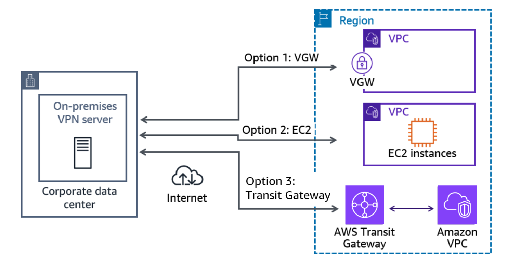
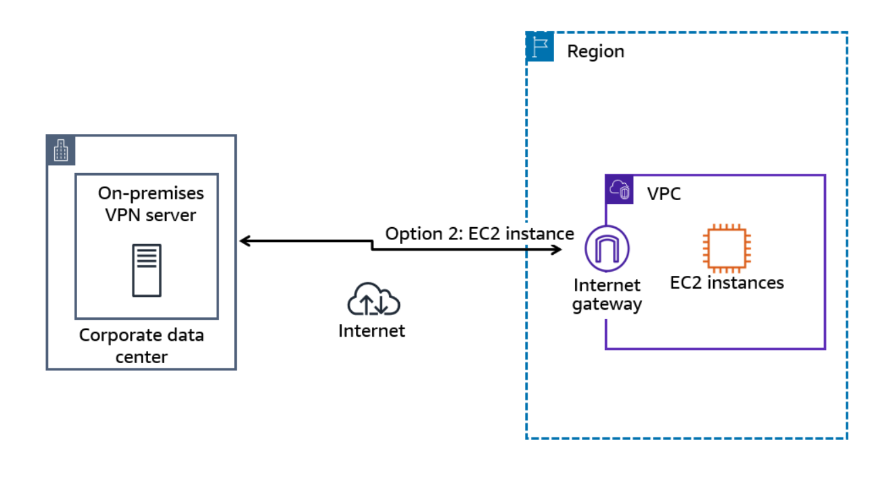

# Week 3: Networking 3 Part 1: Using AWS Site-to-Site VPN to Connect Your Data Center to AWS

* back to AWS Cloud Institute repo's root [aci.md](../aci.md)
* back to [AWS Cloud Fundamentals 2](./aws-cloud-fundamentals-2.md)
* back to repo's main [README.md](../../../README.md)

## Introducing VPNs

A virtual private network (VPN) is a technology that creates a secure, encrypted connection between your device and the internet.

### AWS VPN services

* AWS Site-to-Site VPN
* AWS Client VPN

### Key benefits of using AWS Site-to-Site VPN

1. Site-to-Site VPN supports static and dynamic routing protocols such as Border Gateway Protocol or BGP. This means you can propagate routes between your on-premises network and your VPC, enabling seamless integration and network traffic flow.
2. Site-to-Site VPN uses the internet protocol security or IPSec protocol to create encrypted channels. This helps maintain data confidentiality and integrity.
3. Accelerated performance. The accelerated site-to-site feature of AWS Site-to-Site VPN works with AWS Global Accelerator to intelligently route traffic or optimal network paths. This improves the connectivity speed for globally distributed clients.

### Key benefits of using AWS Client VPN

1. AWS Client VPN supports a variety of authentication methods, including active directory, federated authentication, and certificate-based authentication. This can help enhance the security of your VPN connections.
2. Custom security controls by defining network based access rules. You can configure these rules at the granularity of active directory groups. You can also implement access control using security groups.
3. With Client VPN, you can view connection logs. These logs provide details about client connection attempts. You can also manage and terminate active client connections.

---

### Key Components of AWS Site-to-Site VPN

AWS Site-to-Site VPN is a fully managed service that creates a secure connection between your data center or branch office and your AWS resources. When using Site-to-Site VPN, you can connect to your virtual private clouds (VPCs) and to AWS Transit Gateway.

#### AWS Site-to-Site VPN components

Site-to-Site VPN connections provide increased availability by using two encrypted Internet Protocol Security (IPsec) VPN tunnels, each terminating in a different Availability Zone. If one tunnel fails, the connection automatically fails over to the other tunnel.

1. **Customer gateway device**

    A customer gateway device is a physical or software appliance that you own or manage in your on-premises network (on your side of a Site-to-Site VPN connection).

2. **Customer gateway**

    A customer gateway is a resource that you create and configure in AWS that represents your on-premises gateway device. The resource contains information about the type of routing used by the Site-to-Site VPN and other optional configuration information.

3. **VPN connection**

    A VPN connection is a secure connection between your on-premises equipment and your VPCs.

4. **Virtual private gateway**

    A virtual private gateway is VPN endpoint on the AWS side of your Site-to-Site VPN connection that you can attach to a single VPC.

---

#### Site-to-Site VPN connection options

In addition to using virtual private gateways, there are other ways that you can set up Site-to-Site VPN connections.

---

### Site-to-site VPN connection options

By default, instances that you launch into a VPC can't communicate with your own (remote) network. You can enable access to your remote network from your VPC by creating an AWS Site-to-Site VPN connection and configuring routing to pass traffic through the connection. There are three different connection methods for your VPN connection to AWS:

* Connect to a virtual gateway
* Connect to an Amazon Elastic Compute Cloud (Amazon EC2) instance.
* Connect to a transit gateway.

#### Connect to a virtual gateway

A Site-to-Site VPN connection offers **two VPN tunnels** between a virtual private gateway on the AWS side and a customer gateway (which represents a VPN device) on the on-premises side.

**Image description:** Corporate data center connected to a virtual private gateway using a VPN connection over the internet. The virtual private gateway is associated with a Region that has a VPC with two separate private subnets in different availability zones.

#### Connect to an EC2 instance

You can also create a VPN connection to your remote network by using an EC2 instance in your VPC that's running a software VPN appliance. In the following example, the data center VPN traffic to AWS terminates on a VPN software appliance running on an EC2 instance within a VPC.

* This is an unmanaged solution. You are responsible for managing the EC2 instance.
* Use this type of connection if you require full control over both ends of the VPN connection or if you want to use a non-IPsec VPN protocol.

#### Connect to a transit gateway

AWS Transit Gateway offers a simplified hub with burstable throughput to VPCs, VPN connections, and AWS Direct Connect gateways.

To attach a VPN connection to your transit gateway, you must specify the customer gateway. This connection allows potential connectivity to all VPCs attached to the same transit gateway. This eliminates the requirement for creating a connection to each virtual gateway on each VPC requiring a connection.

For accessibility: Corporate data center connected to Amazon VPCs through a transit gateway.

---

### Optimizing your connections

#### Redundant VPN connections

To protect against a loss of connectivity in case your customer gateway device becomes unavailable, you can set up a second Site-to-Site VPN connection to your VPC and virtual private gateway by using a second customer gateway device. For example, you can perform maintenance on one of your devices while traffic continues to flow over the second customer gateway's Site-to-Site VPN connection.

#### Scaling site-to-site traffic

With AWS Transit Gateway, you can simplify the connectivity between multiple VPCs and also connect to any VPC attached to a transit gateway with a single VPN connection.

A single VPN tunnel has a maximum throughput of 1.25 gigabits per second (Gbps). Although you can create additional VPN tunnels into the transit gateway, by default each connection is separate and bound by the 1.25 Gbps limit.

#### Site-to-site VPN and ECMP

You can use AWS Transit Gateway to scale the IPsec VPN throughput with equal-cost multi-path (ECMP) routing support over multiple VPN tunnels. A single VPN tunnel still has a maximum throughput of 1.25 Gbps. If you establish multiple VPN tunnels to an ECMP-enabled transit gateway, it can scale beyond the default limit of 1.25 Gbps. For more details on ECMP and AWS Transit Gateway, see [Scaling VPN Throughput Using AWS Transit Gateway](https://aws.amazon.com/blogs/networking-and-content-delivery/scaling-vpn-throughput-using-aws-transit-gateway/) in the *AWS Blog*.

#### Accelerated Site-to-Site VPN

You can optionally enable acceleration for your Site-to-Site VPN connection. An accelerated Site-to-Site VPN connection (accelerated VPN connection) uses AWS Global Accelerator to route traffic from your on-premises network to an AWS edge location that is closest to your customer gateway device. Global Accelerator optimizes the network path, using the congestion-free AWS global network to route traffic to the endpoint that provides the best application performance. You can use an accelerated VPN connection to avoid network disruptions that might occur when traffic is routed over the public internet.

For more details, see [Improve VPN Network Performance of AWS Hybrid Cloud with Global Accelerator](https://aws.amazon.com/blogs/architecture/improve-vpn-network-performance-of-aws-hybrid-cloud-with-global-accelerator/) in the *AWS blog*.

---

### Site-to-site VPN connection options deep dive

"We need to optimize our VPN design. Our VPN connection to AWS is 75% busier this month than last. It's orky going up." - Data center operations

#### Connectivity options

1. **Connect to a virtual gateway**

    

    A VPN connection from on-prem VPN system into a specific VPC into the virtual private gateway. You get automatic redundancy on the AWS side, meaning there's multiple connections (2). The two tunnels are in different availability zones.

    If you have 20 VPC to connect to, you'd need 20 x Site-to-Site VPN connections.

2. **Connect to an EC2 instance**

    

    Unmanaged solution. Can use other protocols (not IPSec)

3. **Connect to transit gateway**

    

#### Redundant VPN connections

1. **Dual customer gateway device**

    

2. **Scaling Site-to-Site VPN traffic limits per Virtual Gateway**

    

3. **Site-to-Site VPN and ECMP**

    

4. **Accelerated Site-to-Site VPN**

    

    The idea is that the traffic would go to the closest edge location. As soon as a user is, or communication is connected to the edge location, you are on the AWS network here, which means all this traffic can be optimized.

---

## Routing in AWS Site-to-Site VPN

### Site-to-site VPN routing options

When setting up an AWS Site-to-Site VPN connection, you have two main routing options: static routing and dynamic routing. The type of routing that you select depends on the customer gateway device that you use.

* **Dynamic routing**: If your customer gateway device supports Border Gateway Protocol (BGP), you can use dynamic routing. Dynamic routing uses BGP to automatically exchange routing information between your on-premises network and your VPC. With dynamic routing, you don't need to manually configure route tables on either side of the VPN connection.
* **Static routing**: If your device does not support BGP, use static routing. With static routing, you manually configure the route tables on both your on-premises network and your VPC to specify the destination Classless Inter-Domain Routing (CIDR) blocks that should be routed through the VPN connection.

---

### BGP review

BGP consists of a set of rules that determine optimal routes for data transmission. To learn more, see the [What Is BGP?](https://aws.amazon.com/what-is/border-gateway-protocol/) page.

---

### Working with AWS Site-to-Site VPN route tables

Route tables dictate where network traffic from your VPC is directed. In the following example, you establish a Site-to-Site VPN connection between a VPC and the corporate data center. Both components of the connection—the virtual private gateway (VPN gateway) and the customer gateway—were created. A rule was also added to the main route table of the subnet that hosts the instances with IP addresses 10.0.0.5, 10.0.0.6, and 10.0.0.7. This rule routes traffic — which is going to destinations in the data center in the CIDR block address range of 192.168.10.0/24 — through the VPN gateway.  As a result of this configuration, the instances in the subnet can communicate with each other and other instances in the VPC, and to the destinations hosted in the data center.

---

## Troubleshooting AWS Site-to-Site VPN

### AWS Site-to-Site VPN common issues

Suppose that you are unable to communicate over the VPN with an Amazon EC2 instance from your local workstation. In the following section, you will review a few situations that might cause this issue and how to troubleshoot them.

### Troubleshooting the AWS side of the VPN

Several components are involved in making a successful Site-to-Site VPN connection and allowing communication with Amazon Virtual Private Cloud (Amazon VPC) resources over that connection.

#### Virtual private gateway

Ensure that the virtual private gateway is attached to your VPC that is associated with your Site-to-Site VPN connection.

The following screenshot highlights the process of viewing details on a virtual private gateway. From the Amazon VPC management dashboard, in the left navigation menu, choose **Virtual Private Gateways**. Select a gateway name for which to display details, and then view the details with an option to modify from the **Actions** menu. Also highlighted is the VPC name that the gateway is associated with, which helps you verify that you are selecting the correct gateway (if you had more than one).

#### Subnets

Confirm that your on-premises and private Amazon VPC networks (subnet range) are unique. Overlapping subnets can cause routing problems over VPN tunnels. For BGP-based VPN connections, make sure that a BGP session is established. Also, check the **Tunnel details** tab for the VPN connection to verify that the virtual private gateway is receiving the BGP route from the customer gateway.

For static route-based VPN connections, check the static route table to confirm that the route is configured for your on-premises private network.

The following screenshot highlights the process of viewing or modifying subnets and routes of a VPN connection. From the Amazon VPC management dashboard, in the left navigation menu, you can choose Site-to-Site VPN Connections. Choose a VPN connection for which to display details. Then view the details or choose the Edit routes button.

#### Routes

Configure the Amazon VPC route table to include routes to your on-premises private network. You can manually direct them to a virtual private gateway. You can also use route propagation to automatically propagate these routes so that your instance of Amazon VPC can reach your on-premises network.

The following screenshot highlights the process of navigating from the Amazon VPC management console to the route table dashboard. You can view or modify routes by choosing them. Choose the **Edit routes** button to modify the route table as needed.

#### Security group

Confirm that the Amazon VPC security group is configured to allow the required traffic (ICMP, RDP, SSH, and so on) to and from the on-premises subnet for bi-directional traffic.

The following screenshot highlights the process of navigating from the Amazon VPC management console to the **Security Groups** dashboard. You can choose a security group to view details about inbound and outbound rules with the appropriate tab, or choose the **Edit inbound rules** button.

#### Network ACLs

Ensure that the Amazon VPC access control list (ACL) is configured to allow the required traffic (ICMP, RDP, SSH, and so on) to and from the on-premises subnet for bi-directional traffic.

The following screenshot highlights the process of navigating from the Amazon VPC console to the **Network ACLs** dashboard to choose an ACL to view or modify. You can choose from five tabs: **Details**, **Inbound rules**, **Outbound rules**, **Subnet associations**, or **Tags**. The **Inbound rules** and **Outbound rules** tabs have an **Edit inbound rules** (or **Edit outbound rules**) button, so that you can modify rules as needed.

---

### Troubleshooting the customer gateway side of the VPN

Checking the customer side of the VPN is just as important, especially if a generic configuration file was used to set up the VPN connection. Use the configuration file that you downloaded from AWS to assist with troubleshooting. Verify that the correct numbers were entered when typing the IP address and CIDR subnetting information. You can also try the following troubleshooting options:

* Make sure that the packet is encrypted by the customer gateway and sent over the VPN tunnel.
* For policy-based configurations, check the VPN connection details to verify that the traffic selection is properly configured. The local IPv4 network CIDR is customer gateway CIDR range, and the remote IPv4 network CIDR is AWS CIDR range.
* For policy-based configurations, be sure that you limit the number of security associations to one.
* If the VPN tunnel is route based, confirm that the route to the VPC CIDR is properly configured.
* If the customer gateway is not behind the NAT device, we recommend deactivating NAT traversal. In a case where you are using accelerated VPN, ensure that NAT traversal is activated on the customer gateway device.
* Verify that the firewall policy or ACL is not blocking inbound or outbound IPsec traffic.
* Perform a packet capture of Encapsulating Security Payload (ESP) traffic on the wide area network (WAN) interface of the customer gateway device to confirm that it is sending and receiving encrypted packets.

---

### Knowledge Check

#### What is the main benefit of using the Accelerated Site-to-Site VPN feature?

* To improve connectivity speed for globally distributed clients

Wrong answers:

* To reduce the cost of data transfer between on-premises networks and AWS VPCs.
* To provide automatic failover for Site-to-Site VPN connections in case of an outage.
* To enable multi-factor authentication for Site-to-Site VPN connections.

##### Explanation

**The Accelerated Site-to-Site VPN feature of AWS Site-to-Site VPN works with AWS Global Accelerator to intelligently route traffic over optimal network paths. This improves connectivity speed for globally distributed clients.**

Although the Accelerated Site-to-Site VPN feature might indirectly reduce data transfer costs by improving performance, its primary purpose is not cost reduction. The Accelerated Site-to-Site VPN feature does not provide automatic failover capabilities or multi-factor authentication.

#### What is the primary purpose of an AWS Site-to-Site VPN?

* To establish a secure connection between an on-premises network and a virtual private cloud (VPC)

Wrong answers:

* To enable data transfer between multiple virtual private clouds (VPCs)
* To provide secure remote access for individual users
* To facilitate secure communication between two virtual private clouds (VPCs)

##### Explanation

**The primary purpose of an AWS Site-to-Site VPN is to create a secure connection between an on-premises network, such as a corporate data center, and a VPC.**

Enabling data transfer and facilitating secure communication between VPCs is the purpose of VPC peering. Use AWS Client VPN to provide secure remote access for individual users.

#### What is the primary reason that AWS Site-to-Site VPN uses two tunnels?

* To provide redundancy and high availability

Wrong answers:

* To encrypt the traffic twice for added security
* To load balance the traffic across the tunnels
* To separate incoming and outgoing traffic

##### Explanation

**The primary benefit of using two tunnels in an AWS Site-to-Site VPN connection is redundancy and high availability.**

The remaining answers are incorrect.

---

### Summary

#### VPNs overview

A virtual private network (VPN) is a technology that allows devices and applications to establish protected connections to remote networks across the internet.

A VPN works by establishing a secure tunnel between your device and a VPN server. This tunnel is encrypted, which means that any data transmitted through it is protected from unauthorized access.

AWS VPN services include AWS Site-to-Site VPN and AWS Client VPN. Each service provides a highly available, managed, and elastic cloud VPN solution to protect your network traffic.

#### AWS Site-to-Site VPN

AWS Site-to-Site VPN is a fully-managed service that creates a secure connection between your data center or branch office and your AWS resources. Following is a brief review of AWS Site-to-Site VPN components:

* A customer gateway device is a physical or software appliance that you own or manage in your on-premises network.
* A customer gateway is a resource that you create and configure in AWS that represents your on-premises gateway device.
* A VPN connection is a secure connection between your on-premises equipment and your VPCs.
* A virtual private gateway is VPN endpoint on the AWS side of your Site-to-Site VPN connection that you can attach to a single VPC.

#### Site-to-site VPN connection options

There are three different connection methods for your VPN connection to AWS.

* Connect to a virtual gateway.
* Connect to an Amazon EC2 instance.
* Connect to a transit gateway.

#### Optimizing your connections

You can optimize your Site-to-Site VPN connections in the following ways:

* **Redundant VPN connections**: To protect against a loss of connectivity in case your customer gateway device becomes unavailable, you can set up a second Site-to-Site VPN connection to your VPC and virtual private gateway by using a second customer gateway device.
* **Scaling site-to-site traffic**: With AWS Transit Gateway, you can simplify the connectivity between multiple VPCs and also connect to any VPC attached to a transit gateway with a single VPN connection.
* **Site-to-site VPN and ECMP**: You can use AWS Transit Gateway to scale the IPsec VPN throughput with equal-cost multi-path (ECMP) routing support over multiple VPN tunnels.
* **Accelerated Site-to-Site VPN**: You can optionally enable acceleration for your Site-to-Site VPN connection. An accelerated Site-to-Site VPN connection (accelerated VPN connection) uses AWS Global Accelerator to route traffic from your on-premises network to an AWS edge location that is closest to your customer gateway device.

#### Site-to-site VPN routing options

When setting up an AWS Site-to-Site VPN connection, you have two main routing options: static routing and dynamic routing.

* **Dynamic routing**: If your customer gateway device supports Border Gateway Protocol (BGP), you can use dynamic routing.
* **Static routing**: If your device does not support BGP, use static routing.

#### AWS Site-to-Site VPN common issues

Some of the steps that you can take to solve communications issues include the following:

* Ensure that the virtual private gateway is attached to your VPC that is associated with your Site-to-Site VPN connection.
* Confirm that your on-premises and private Amazon VPC networks (subnet range) are unique.
* Configure the Amazon VPC route table to include routes to your on-premises private network.
* Confirm that the Amazon VPC security group is configured to allow the required traffic to and from the on-premises subnet for bi-directional traffic.
* Ensure that the Amazon VPC access control list (ACL) is configured to allow the required traffic to and from the on-premises subnet for bi-directional traffic.

---
