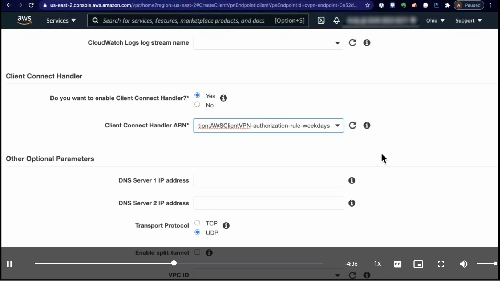
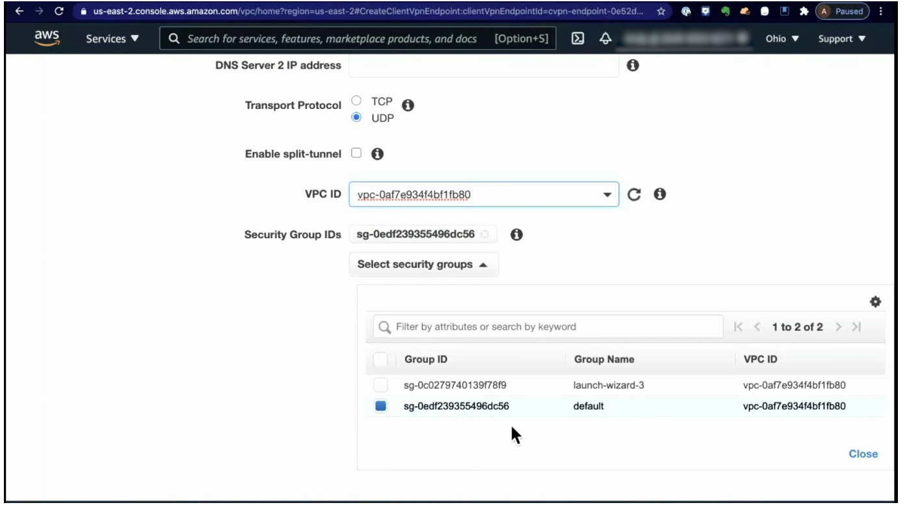

# Week 3: Networking 3 Part 1: Using AWS Client VPN to Connect Remote Users to the Cloud

* back to AWS Cloud Institute repo's root [aci.md](../aci.md)
* back to [AWS Cloud Fundamentals 2](./aws-cloud-fundamentals-2.md)
* back to repo's main [README.md](../../../README.md)

## Key Components of AWS Client VPN

AWS Client VPN is a managed, client-based virtual private network (VPN) service that you can use to securely access your Amazon Web Services (AWS) resources. With Client VPN, you can access your resources from any location using a VPN client software. You can add or remove VPN access for temporary workers.

### Client VPN components

One of the critical components of AWS Client VPN is the **Client VPN endpoint.** A Client VPN endpoint is the entry point for your users to connect to the VPN service. It is a network interface that serves as the destination for your users' VPN connections. When a user connects to the VPN endpoint, they can access the resources within your VPN network, such as Amazon Elastic Compute Cloud (Amazon EC2) instances, on-premises servers, or other AWS services.

Client using a Client VPN endpoint to connect to a VPC. The VPC is connected to an on-premises network through AWS Site-to-Site VPN.

### Connecting to a Client VPN endpoint

To connect to a Client VPN endpoint, you use a software application called a VPN client application. By following these steps, you can quickly set up a secure connection to the Client VPN endpoint and start accessing your private network:

1. **Choose a VPN client**: The first step in using Client VPN is to obtain a VPN client application. AWS provides a supported client for Windows, macOS, Ubuntu 18.04 LTS, and Ubuntu 20.04 LTS. You can download this client from the [AWS Client VPN download page](https://aws.amazon.com/vpn/client-vpn-download/). Alternatively, you can use an OpenVPN-based client application of your choice. Download and install the client on the device that you will be using to establish the VPN connection.
2. **Obtain the configuration file**: To connect to the Client VPN endpoint, you will need to obtain the configuration file from your administrator. This file contains the necessary information about the Client VPN endpoint and the required certificates.
3. **Connect to the VPN**: When you have the VPN client and the configuration file, you can proceed to connect to the Client VPN endpoint. For the AWS provided client, import the configuration file and [follow the steps](https://docs.aws.amazon.com/vpn/latest/clientvpn-user/connect-aws-client-vpn-connect.html) to connect to the VPN. For an OpenVPN-based client, import the configuration file and [follow the steps](https://docs.aws.amazon.com/vpn/latest/clientvpn-user/connect.html) to connect to the VPN.

---

## How AWS Client VPN works

### Setting up Client VPN

---

#### Prerequisites for setting up Client VPN

Before you begin setting up AWS Client VPN, create or identify a virtual private cloud (VPC) with at least one subnet. Identify the subnet in the VPC that you want to associate with the Client VPN endpoint and note its IPv4 Classless Inter-Domain Routing (CIDR) ranges.

---

In the following example, you configure AWS Client VPN to give clients access to resources inside a single VPC.

1. **Identify CIDR range for client**

    Identify a suitable CIDR range for the client IP addresses that does not overlap with the VPC CIDR range. To review the rules and limitations for Client VPN endpoints, see [AWS Client VPN Quotas](https://docs.aws.amazon.com/vpn/latest/clientvpn-admin/limits.html) in the *AWS Client VPN Administrator Guide*.

2. **Create VPN endpoint**

    Create a Client VPN endpoint in the same Region as the VPC. To learn about the steps required to create a Client VPN endpoint, see [Create a Client VPN Endpoint](https://docs.aws.amazon.com/vpn/latest/clientvpn-admin/cvpn-getting-started.html#cvpn-getting-started-endpoint) in the *AWS Client VPN Administrator Guide*.

3. **Associate the subnet**

    Associate the subnet with the Client VPN endpoint. To review the configuration steps to do this, see [Associate a Target Network with a Client VPN Endpoint](https://docs.aws.amazon.com/vpn/latest/clientvpn-admin/cvpn-working-target.html#cvpn-working-target-associate) in the *AWS Client VPN Administrator Guide*.

4. **Add authorization rule**

    Add an authorization rule to give client access to the VPC. To review the configuration steps to do this, see [Add an Authorization Rule to a Client VPN Endpoint](https://docs.aws.amazon.com/vpn/latest/clientvpn-admin/cvpn-working-rules.html#cvpn-working-rule-authorize) in the *AWS Client VPN Administrator Guide*.

5. **Add rule**

    Add a rule to your resource’s security group that allows access from the security group assigned to the subnet in step 3.

---

To review additional options for configuring Client VPN access for your clients, see [Scenarios and Examples for AWS Client VPN](https://docs.aws.amazon.com/vpn/latest/clientvpn-admin/scenario.html) in the AWS Client VPN Administrator Guide.

---

### AWS Client VPN authentication

You implement client authentication at the first point of entry into the AWS Cloud. You use client authentication to determine whether clients are allowed to connect to the Client VPN endpoint. If authentication succeeds, clients connect to the Client VPN endpoint and establish a VPN session. If authentication fails, the connection is denied and the client is prevented from establishing a VPN session.

#### Active Directory authentication

Client VPN provides Microsoft Active Directory support by integrating with AWS Directory Service. Active Directory is a directory tool that you use to manage user accounts, permissions, and other network resources. When you use Client VPN, it allows your users to authenticate against your existing Active Directory groups. This means that when a user tries to connect to resources by using Client VPN, their credentials are checked against the Active Directory groups that you have set up. If the user belongs to an authorized group, they are granted access.

For more information on Active Directory authentication, see [Active Directory Authentication](https://docs.aws.amazon.com/vpn/latest/clientvpn-admin/ad.html) in the *AWS Client VPN Administrator Guide*.

#### Mutual authentication

With mutual authentication, Client VPN uses certificates to perform authentication. Certificates are a form of digital IDs that are issued by a trusted organization called a certificate authority (CA). The VPN server uses client certificates to authenticate clients when they attempt to connect to the Client VPN endpoint.

For more information on mutual authentication, see [Mutual Authentication](https://docs.aws.amazon.com/vpn/latest/clientvpn-admin/mutual.html) in the *AWS Client VPN Administrator Guide*.

#### Single sign-on

One of the features of Client VPN is the ability to use identity federation with SAML 2.0. SAML 2.0 is a standard that allows you to securely share information about a user's identity between different systems and applications. Identity federation means that you can use a centralized identity provider (IdP) to manage user identities. An IdP is a service that stores and manages user accounts, such as a corporate directory or a cloud-based identity service. With SAML 2.0 identity federation, you can configure your Client VPN endpoint to use the IdP to authenticate users. This means that users can connect to the Client VPN using the same username and password that they use for other applications or services in your organization.

For more information on using single sign-on, see [Single Sign-On (SAML 2.0-Based Federated Authentication)](https://docs.aws.amazon.com/vpn/latest/clientvpn-admin/federated-authentication.html) in the *AWS Client VPN Administrator Guide*.

---

### Authentication example

This diagram illustrates integrating Client VPN with your existing AWS IAM Identity Center with a SAML 2.0 application to authenticate and authorize your Client VPN connections and traffic.

1. The user opens the VPN client provided by AWS on their device and initiates a connection to the Client VPN endpoint.
2. The Client VPN endpoint sends an IdP URL and authentication request back to the client, based on the information that was provided in the AWS Identity and Access Management (IAM) SAML provider.
3. The AWS provided VPN client opens a new browser window on the user’s device. The browser makes a request to the IdP and displays a sign-in page.
4. The user enters their credentials on the sign-in page, and the IdP sends a signed SAML assertion back to the client in the form of an HTTP POST to the AWS provided VPN client. SAML assertions are XML documents that contain authentication, authorization, and attribute statements about a user or subject.
5. The SAML assertion is passed from the VPN client provided by AWS to the Client VPN endpoint.
6. The endpoint validates the assertion and either allows or denies access to the user.

---

### Review and deeper dive on AWS Client VPN

1. **Client VPN solutions**

    

2. **Client VPN setup for single VPC access**

    

3. **Client VPN components**

    

4. **Client VPN authentication methods**

    

5. **Client VPN destination networks**

    

---

### Client VPN demo

#### Steps Summary

1. **Create Client VPN Endpoint**

    

    * The endpoint is associated with a **VPC** and one or more **subnets** (preferably across multiple Availability Zones for redundancy).
    * CIDR block range must be between `/16` and `/22`.

    

2. **Choose Authentication Method**

    * Options:

      * **Mutual authentication** using server and client certificates.
      * **User-based (federated) authentication** via **Active Directory** or other identity providers.

    * For mutual auth:

      * Upload server certificate to **AWS Certificate Manager (ACM)**.
      * Generate and distribute client certificates (either shared or individual).

    

3. **Set Logging & Handlers**

    * Enable **connection logging** to **CloudWatch Logs**.
    * Optionally configure **Client Connect Handler (Lambda)** for custom authorization logic (e.g., restrict login to weekdays).

    

4. **Define Additional Settings**

    * Optional parameters:

      * Custom **DNS** addresses.
      * **Split-tunnel** mode for selective routing.
      * Assign **Security Group** to control inbound/outbound VPN access.

    

5. **Associate the Endpoint with Subnets**

    

    * Each subnet defines where VPN clients land inside the VPC.
    * Associate **multiple subnets** in **different AZs** for high availability.

    

6. **Create Authorizations**

    

    * By default, **no authorizations exist** — clients can connect but can’t reach anything.
    * Authorization rules define **which networks** clients can access (e.g., local VPC CIDR, on-prem, or peered VPCs).

    

7. **Add Routes**

    * Routes define **how to reach** authorized networks.
    * Both **authorization** and **route** must exist for traffic to flow.
    * Example:

      * Authorization: access to 10.3.0.0/16.
      * Route: path to 10.3.0.0/16 network.

8. **Optional — Group-Based Access**

    * When using federated auth, restrict access by **Active Directory groups** or **IAM groups**.

9. **Client Configuration**

    * Clients require a **configuration file** to connect.
    * Distributed manually (for mutual auth) or via the **Self-Service Portal** (for user-based auth).

10. **Result**

     * VPN endpoint with subnet association(s).
     * Authorization(s) defining accessible networks.
     * Route(s) enabling network reachability.
     * Secure authentication and access control integrated into AWS VPC networking.

#### Key Concepts Recap

| Concept | Purpose |
|----------|----------|
| **Endpoint** | Entry point for VPN clients into AWS. |
| **Subnet Association** | Defines where VPN clients connect within the VPC. |
| **Authorization** | Grants access permission to a network. |
| **Route** | Defines how traffic gets to that network. |
| **Authentication** | Validates who can connect. |
| **Security Group** | Controls allowed network traffic. |
| **Client Connect Handler** | Custom Lambda to control or extend VPN connection logic. |

#### Takeaways

* Creating an endpoint alone does **not** allow access — you must define both **authorization** and **route**.
* Always deploy across multiple **Availability Zones** for reliability.
* Use **CloudWatch Logs** for connection visibility and troubleshooting.
* Apply **principle of least privilege** for both authorizations and routes.

---

### [Lab: Creating AWS Client VPN](./labs/W030Lab1CreatingAwsClientVpn.md)

In this lab, you create an AWS Client VPN in one VPC and install OpenVPN on an Ubuntu instance in another VPC. This lab uses mutual authentication with Client VPN endpoint that provides all clients with access to a single VPC.

In this lab, you perform the following tasks:

* Generate server and client certificates and keys.
* Create a Client VPN endpoint.
* Install OpenVPN on Ubuntu and test the connection.

---

### Knowledge Check

#### What is the purpose of the configuration file used to connect to an AWS Client VPN endpoint?

* It contains the necessary information about the Client VPN endpoint and the required certificates.

Wrong answers:

* It contains information about the user connecting to the Client VPN endpoint.
* It contains the software installation files for the AWS provided client application.
* It contains a readme file with information on how to connect to a Client VPN endpoint.

#### What AWS Client VPN resource serves as the destination for users' virtual private network (VPN) connections?

* Client VPN endpoint

Wrong answers:

* Customer gateway device
* Customer gateway
* Virtual private gateway

##### Explanation

**An AWS Client VPN endpoint is the entry point for your users to connect to the VPN service. It is a network interface that serves as the destination for your users' VPN connections.**

A customer gateway device is a physical or software appliance that you own or manage in your on-premises network. A customer gateway is a resource that you create and configure in AWS that represents your on-premises gateway device. A virtual private gateway is VPN endpoint on the AWS side of your AWS Site-to-Site VPN connection that you can attach to a single VPC.

#### Which method allows AWS Client VPN to use certificates to perform authentication?

* Mutual authentication

Wrong answers:

* Active Directory authentication
* Single sign-on
* Client VPN endpoint

##### Explanation

**With mutual authentication, Client VPN uses certificates to perform authentication.**

Active Directory allows your Client VPN users to authenticate against your existing Active Directory groups. With single sign-on, users can connect to the Client VPN using the same username and password that they use for other applications or services in your organization. A Client VPN endpoint is the entry point for your users to connect to the VPN service.

---

### Summary

#### Introducing AWS Client VPN

AWS Client VPN is a managed, client-based VPN service that you can use to securely access your AWS resources. With Client VPN, you can access your resources from any location using a VPN client software.

One of the critical components of AWS Client VPN is the **Client VPN endpoint**. A Client VPN endpoint is the entry point for your users to connect to the VPN service. It is a network interface that serves as the destination for your users' VPN connections.

To connect to a Client VPN endpoint, you use a software application called a VPN client application. AWS provides a supported client for Windows, macOS, Ubuntu 18.04 LTS, and Ubuntu 20.04 LTS. Alternatively, you can use an OpenVPN-based client application of your choice.

#### AWS Client VPN authentication

You implement client authentication at the first point of entry into the AWS Cloud. Client VPN offers the following types of client authentication:

* Client VPN provides Active Directory support by integrating with AWS Directory Service.
* With mutual authentication, Client VPN uses certificates to perform authentication.
* With SAML 2.0 identity federation, you can configure your Client VPN endpoint to use a centralized identity provider (IdP) to authenticate users.

---
