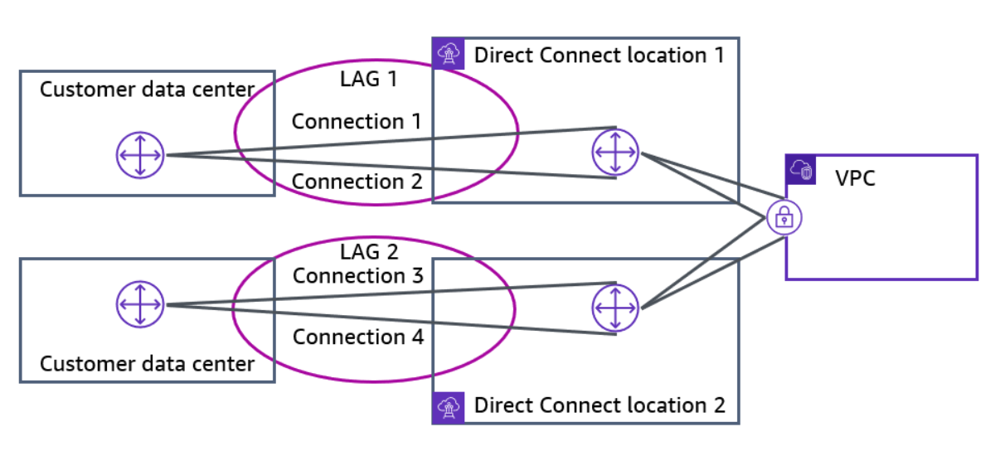

# Week 3: Networking 3 Part 1: UUsing AWS Direct Connect to Create a Dedicated Network Connection to AWS

* back to AWS Cloud Institute repo's root [aci.md](../aci.md)
* back to [AWS Cloud Fundamentals 2](./aws-cloud-fundamentals-2.md)
* back to repo's main [README.md](../../../README.md)

## Key Components of AWS Direct Connect

AWS Direct Connect is another solution that goes beyond connectivity over the internet. AWS Direct Connect uses virtual local area networks (VLANs) so that you can establish a dedicated, private network connection from your on-premises network to AWS. This private connection extends your private network to include AWS resources.

AWS Direct Connect links your internal network to a Direct Connect location over a standard Ethernet fiber-optic cable. One end of the cable is connected to your router, and the other is connected to a Direct Connect router. With this connection, you can create virtual interfaces (VIFs) directly to public AWS services — for example, Amazon Simple Storage Service (Amazon S3) — or to a virtual private cloud (VPC), bypassing internet service providers in your network path. A direct fiber link provides more predictable network performance with reduced bandwidth costs.

A Direct Connect location provides access to AWS in the Region with which it is associated. You can use a single connection in a public Region or AWS GovCloud (US) to access public AWS services in all other public Regions.

To use AWS Direct Connect in a Direct Connect location, your network must meet one of the following conditions:

* Your network is collocated with an existing Direct Connect location.
* You are working with a Direct Connect partner who is a member of the AWS Partner Network (APN).
* You are working with an independent service provider to connect to Direct Connect.

### AWS Direct Connect interface types

Direct Connect offers the following interface types.

| Type | Purpose |
| ---- | ------- |
| Public VIF | It's a public virtual interface that you use to access all AWS public services using public IP addresses. It allows AWS services or AWS customers to access your public networks over the interface instead of traversing the internet. |
| Private VIF | It's a private virtual interface that you use to access a VPC using private IP addresses. |
| Transit VIF | It's a transit virtual interface that you use to access one or more Amazon VPC transit gateways associated with Direct Connect gateways. |

Note that a public VIF gives you access to all AWS public IP addresses for the associated AWS Region. Even though you are accessing public endpoints for services such as Amazon Simple Storage Service (Amazon S3), public VIF traffic remains in the AWS Cloud. This has the impact of both reducing security threats from internet communication and creating cost savings when downloading data from services like Amazon S3.

---

## How Direct Connect Works

### AWS Direct Connect VPC connection options

After your Direct Connect physical link is established, you then create logical network routes to resources. There are four different connection options for Direct Connect. You are likely to use multiple options.

#### Option 1: Private VIF to virtual gateway

Private VIFs provide access to resources inside a VPC by using their private IP addresses instead of an internet gateway. They do not provide you with access to VPC endpoints, and you cannot use them to create transitive connections by using VPC peerings. 

Deploy private VIFs for each VPC that requires access. Private VIFs attach to your VPC at the same location as a virtual private network (VPN). If you have multiple Direct Connect connections, you can provision private VIFs on each connection and attach multiple VIFs to your virtual gateways for resilience. Because it is a private VIF, you can use any IP addresses and Autonomous System Number (ASN) for Border Gateway Protocol (BGP) peering sessions.

#### Option 2: Private VIF to Direct Connect gateway

You can use a Direct Connect gateway to connect your Direct Connect connection over a private VIF. You can connect it to one or more VPCs in your account that are located in the same or different Regions. You associate a Direct Connect gateway with the virtual private gateway for the VPC. Then, create a private VIF for your Direct Connect connection to the Direct Connect gateway. You can attach multiple private VIFs to your Direct Connect gateway.

A Direct Connect gateway is a globally available resource. You create the Direct Connect gateway in any public Region and access it from all public Regions. You associate a Direct Connect gateway with either of the following gateways:

* A transit gateway when you have multiple VPCs in the same Region
* A virtual private gateway

#### Option 3: Transit VIF to transit gateway

The following diagram illustrates how you can use the Direct Connect gateway to create a single connection that all of your VPCs can use. Attach a transit gateway to a Direct Connect gateway by using a transit virtual interface. This configuration offers the following benefits:

* Manage a single connection for multiple VPCs or VPNs that are in the same Region.
* Advertise prefixes from on premises to AWS and from AWS to on premises.

#### Option 4: VPN over public VIF

With Direct Connect and VPN, you can combine one or more Direct Connect dedicated network connections with a VPC. This combination provides an IPsec-encrypted private connection that reduces network costs, increases bandwidth throughput, and provides a more consistent network experience than internet-based VPN connections.

You can use Direct Connect to establish a dedicated network connection within your network. You can also create a logical connection to public AWS resources, such as an Amazon virtual private gateway IPsec endpoint. This solution combines the AWS managed benefits of the VPN solution with low latency, increased bandwidth, more consistent benefits of the Direct Connect solution, and an end-to-end, secure IPsec connection.

---

### Review and deeper dive on AWS Direct Connect

#### Overview

AWS Direct Connect provides a dedicated, physical network connection between on-premises data centers and AWS, ensuring **consistent bandwidth**, **reduced latency**, and **increased reliability** compared to traditional VPN connections.

* Direct Connect establishes a **private fiber link** between your data center and an AWS Direct Connect (DX) location.
* Offers **consistent network performance** and avoids the variability of internet-based VPNs.
* Provides **potential cost savings** when accessing AWS services such as S3.

#### Key Components

##### Physical vs. Logical Connectivity

* **Physical connection:** Fiber-based link between the customer’s data center and a DX location where AWS routers are hosted.
* **Logical connection:** Virtual interfaces (VIFs) created on top of the physical link to define traffic routes.

##### Bandwidth Options

* Standard speeds: **1 Gbps** and **10 Gbps**.
* Sub-1 Gbps connections are available through partners but limited to a single VIF.

##### Benefits

* **Predictable performance:** No internet routing variations.
* **Lower data transfer costs:** Especially when retrieving data from AWS services.
* **Improved privacy:** Traffic remains within AWS’s private backbone.

#### Virtual Interfaces (VIFs)

Direct Connect supports three types of virtual interfaces:

* **Public VIF**

  * Provides access to AWS public endpoints (e.g., S3, DynamoDB).
  * Accessible across **all AWS regions**.
  * Useful for retrieving data without using the public internet.

* **Private VIF**

  * Provides access to **VPCs** within the same region as the DX connection.
  * Multiple VIFs can be created for multiple VPCs.

* **Transit VIF**

  * Used to connect **Direct Connect Gateways** to **Transit Gateways**.
  * Enables access to multiple VPCs across multiple regions through a single connection.

#### Direct Connect Gateway (DX Gateway)

* A **logical resource** that allows you to connect multiple VPCs (even across regions) to a single DX connection.
* Simplifies network architecture and reduces the number of required private VIFs.
* Can connect to:

  * **VPCs** directly (multi-region support).
  * **Transit Gateways** (for VPC consolidation within a region).

#### Connection Models

* **Standard Private VIF:** One-to-one between VIF and VPC.

* **DX Gateway:** One-to-many connection to multiple VPCs across regions.

* **Transit VIF:** Connects DX Gateway to Transit Gateway.

* **VPN over DX:** Adds encryption on top of DX for compliance or security requirements.

#### Link Aggregation Groups (LAGs)

* Combine multiple DX links to increase bandwidth and redundancy.
* Requirements:

  * Same DX location.
  * Same speed (e.g., four 10 Gbps links).
  * Maximum of **4 aggregated links**, forming a **Link Aggregation Group (LAG)**.

#### Redundancy and High Availability

##### Options

* **VPN Backup:**

  * Set up a VPN connection as a backup in case of DX failure.
  * Cost-effective but offers lower performance (max ~1.25 Gbps).
  * Must configure routing priorities to prefer DX over VPN.

* **Multiple DX Links:**

  * Improves fault tolerance against fiber or device failures.
  * Can be within the same DX location or across multiple locations.

* **Multiple DX Locations Design**

* **Full Redundancy Design (Recommended):**

  * Redundant links to **multiple DX locations**.
  * Protects against equipment, fiber, and location-level failures.

#### Jumbo Frames

* Direct Connect supports **jumbo frames**, enabling larger data payloads per packet.
* Improves efficiency for **large data transfers** by reducing packet fragmentation.

---

**In summary**, AWS Direct Connect provides enterprises with high-performance, private, and scalable network connectivity to AWS. It’s ideal for hybrid architectures that require predictable performance, cost efficiency, and secure access between on-premises infrastructure and AWS environments.

---

## Comparing Direct Connect and AWS VPN

### Choosing between AWS Direct Connect and AWS Site-to-Site VPN

When selecting an AWS service for your applications, it's important that you carefully analyze all options and choose the product that best meets your connectivity needs. When you think about hybrid connectivity between AWS and your on-premises data center, you might choose to use either Site-to-Site VPN, Direct Connect, or both, depending on your use case.

Choose AWS VPN solutions in the following circumstances:

* When you need a way to quickly establish a network connection between your on-premises networks and your VPC
* When you need to stay within a small budget
* When you require encryption in transit by default

Consider AWS Direct Connect in the following circumstances:

* When you need faster connectivity options than what AWS Site-to-Site VPN can provide
* When you are already in a collocation that supports Direct Connect
*When you need predictable network performance

Review the following table to compare the two services.

| AWS Site-to-Site VPN | AWS Direct Connect |
| -------------------- | ------------------ |
| Limited to 1.25 Gbps connection maximum | Sub-1, 1, 10, 100, or 400 Gbps connection options |
| Faster to configure than Direct Connect | Requires special agreements and physical cabling to the data center |
| Don’t have to pay for inactive connections | Pay for port hours whether the connection is active or not |
| Encrypted in transit by default, but travels over public internet | Not encrypted by default, but it’s a private, dedicated connection |

---

### Pricing

It is important for you to consider pricing as a factor when deciding whether to use AWS Site-to-Site VPN or AWS Direct Connect.

#### Direct Connect

* *Capacity* is the maximum rate that data can be transferred through a network connection. The capacity of AWS Direct Connect connections is measured in megabits per second (Mbps) or gigabits per second (Gbps).
* *Port hours* measure the time that a port is provisioned for your use with AWS or an AWS Direct Connect Delivery Partner’s networking equipment inside an AWS Direct Connect location. Even when no data is passing through the port, you are charged for port hours. Port hour pricing is determined by the connection type: dedicated or hosted.
* *Data transfer out (DTO)* refers to the cumulative network traffic that is sent through AWS Direct Connect to destinations outside of AWS. This is charged per GB, and unlike capacity measurements, DTO refers to the amount of data transferred, not the speed. When calculating DTO, exact pricing depends on the AWS Region and AWS Direct Connect location that you are using.

#### Site-to-Site VPN

AWS Site-to-Site VPN has simpler cost factors to calculate. You are charged a *per-hour connection* fee for your use, and you are also charged for DTO, similarly to AWS Direct Connect.

With AWS Site-to-Site VPN, you receive your first 100 GB of data transfer out at no charge.

---

## Direct Connect Resiliency Architecting

### Redundant and resilient connections

With AWS Direct Connect, you can implement different levels of redundancy and resiliency based on your business requirements, budget, and risk tolerance.

#### Link aggregation groups

You can use multiple connections for redundancy. A link aggregation group (LAG) is a logical interface that uses the Link Aggregation Control Protocol (LACP) to aggregate multiple dedicated connections at a single Direct Connect endpoint, so that you can treat them as a single, managed connection. LACP is a protocol that allows multiple Ethernet links to be bundled together to form a single logical channel, providing increased bandwidth and redundancy. LAGs streamline configuration because the LAG configuration applies to all connections in the group.

In the following example, you have four dedicated connections with two connections to each location. You can create a LAG for the connections that terminate in the same location, and then use the two LAGs instead of the four connections for configuration and management.

#### Direct Connect with VPN backup

If you want a short-term or lower-cost solution, you might consider configuring a hardware VPN as a failover option for a Direct Connect connection. VPN connections are not designed to provide the same level of bandwidth available to most Direct Connect connections. Ensure that your use case or application can tolerate a lower bandwidth if you are configuring a VPN as a backup to a Direct Connect connection.

You typically use this option while AWS Direct Connect is being provisioned because Direct Connect can take a considerable amount of time to provision.

#### Basic device resiliency

You can achieve resiliency for non-critical workloads by using separate connections that terminate on separate devices in one location (as shown in the diagram). This model provides resiliency against device failure but does not provide resiliency against location failure.

#### High resiliency

You can achieve high resiliency for critical workloads by using two single connections to multiple locations (as shown in the diagram). This model provides resiliency against connectivity failures caused by a fiber cut or a device failure. It also helps prevent a complete location failure.

#### Maximum resiliency

You can achieve maximum resiliency for critical workloads by using separate connections that terminate on separate devices in more than one location (as shown in the diagram). This model provides resiliency against device, connectivity, and complete location failures.

---

### Cost considerations

Note that cost can be a limiting factor between the resiliency options that you explored. For example, choosing the maximum resiliency option would typically be more costly than less resilient alternatives.

---

### Knowledge Check

#### Which of these is a factor for choosing AWS Direct Connect instead of AWS Site-to-Site VPN?

* The need of predictable network performance

Wrong answers:

* The need to stay within a small budget
* The need of a way to quickly establish a network connection between your on-premises networks and your virtual private cloud (VPC)
* Requirement of encryption in transit

##### Explanation

**A requirement for predictable network performance is a use case for using Direct Connect.**

The remaining options represent use cases for Site-to-Site VPN.

#### What sort of interface is used to access a VPC using private IP addresses?

* Private virtual interface (VIF)

Wrong answers:

* Transit virtual interface (VIF)
* Public virtual interface (VIF)
* Interface endpoint

##### Explanation

**Use a private VIF to access a virtual private cloud (VPC) using private IP addresses.**

Use a public VIF to access AWS services using public IP addresses. Use a transit VIF to access one or more VPC transit gateways associated with AWS Direct Connect gateways. An interface endpoint is a type of VPC endpoint that allows connectivity to services over AWS PrivateLink.

#### Which option provides the lowest cost option for a short-term resiliency use case?

* Configure a hardware virtual private network (VPN) as a failover option for an AWS Direct Connect connection.

Wrong answers:

* Use separate connections that terminate on separate devices in one location.
* Use two single connections to multiple locations.
* Use separate connections that terminate on separate devices in more than one location.

##### Explanation

**If you want a short-term or lower-cost solution, you might consider configuring a hardware VPN as a failover option for an AWS Direct Connect connection.**

The remaining options provide higher levels of resiliency and represent potentially higher costs.

---

### Summary

#### Introducing AWS Direct Connect

AWS Direct Connect links your internal network to a Direct Connect location over a standard Ethernet fiber-optic cable. One end of the cable is connected to your router, and the other is connected to a Direct Connect router.

#### AWS Direct Connect interface types

AWS Direct Connect offers the following interface types:

* Public VIF is a public virtual interface that you use to access all AWS public services using public IP addresses.
* Private VIF is a private virtual interface that you use to access a VPC using private IP addresses.
* Transit VIF is a transit virtual interface that you use to access one or more VPC transit gateways associated with Direct Connect gateways.

#### AWS Direct Connect and AWS Site-to-Site VPN comparison

Choose AWS VPN solutions in the following circumstances:

* When you need a way to quickly establish a network connection between your on-premises networks and your VPC
* When you need to stay within a small budget
* When you require encryption in transit by default

Consider AWS Direct Connect in the following circumstances:

* When you need faster connectivity options than what AWS Site-to-Site VPN can provide
* When you are already in a collocation that supports AWS Direct Connect
* When you need predictable network performance

#### Redundant and resilient connections

The following are some techniques that you can implement for resiliency with AWS Direct Connect:

* Link aggregation groups (LAGs) allow multiple Ethernet links to be bundled together to form a single logical channel, providing increased bandwidth and redundancy.
* If you want a short-term or lower-cost solution, you might consider configuring a hardware VPN as a failover option for a Direct Connect connection.
* You can achieve resiliency for non-critical workloads by using separate connections that terminate on separate devices in one location.
* You can achieve high resiliency for critical workloads by using two single connections to multiple locations.
* You can achieve maximum resiliency for critical workloads by using separate connections that terminate on separate devices in more than one location.

---
