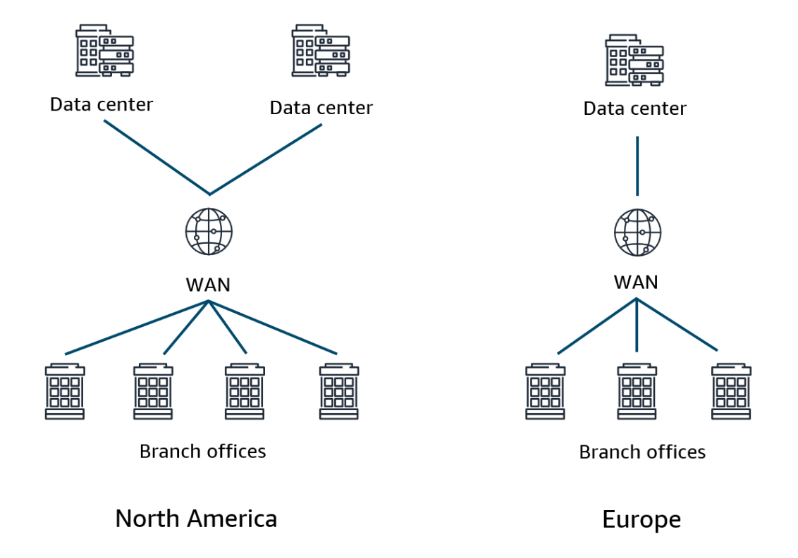
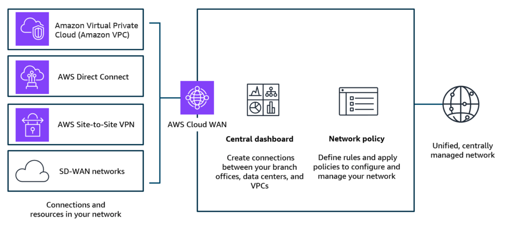
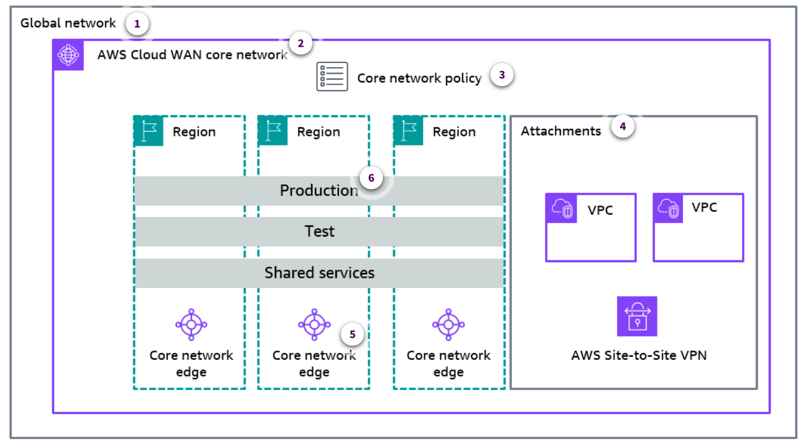
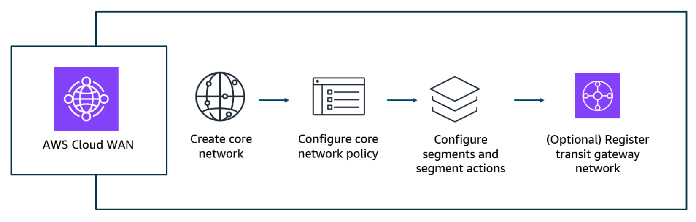
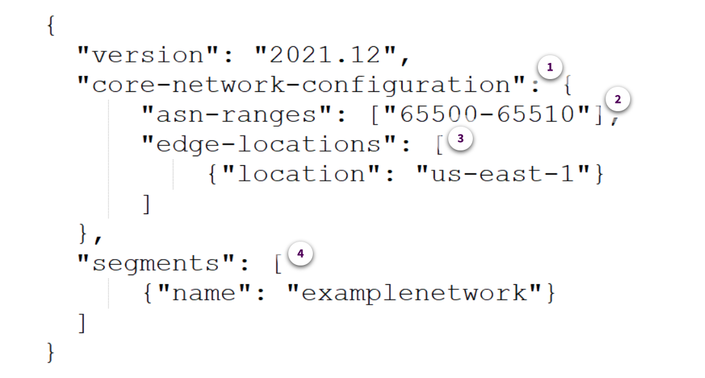

# Week 3: Networking 3 Part 1: Using AWS Cloud WAN to Create a Global Network

* back to AWS Cloud Institute repo's root [aci.md](../aci.md)
* back to [AWS Cloud Fundamentals 2](./aws-cloud-fundamentals-2.md)
* back to repo's main [README.md](../../../README.md)

## Introducing WANs

A wide area network (WAN) is a type of network infrastructure that spans a large geographical area, typically covering multiple cities, states, or even countries. WANs are designed to interconnect smaller networks, such as local area networks (LANs), and facilitate communication and data exchange over long distances. The primary purpose of a WAN is to enable communication and resource sharing among geographically dispersed locations. This is important for organizations with multiple offices, branch locations, or remote sites that need to access centralized resources, such as databases, applications, and file servers.

---

### WAN architectures and the OSI model

Wide-area network (WAN) architectures are based on the Open Systems Interconnection (OSI) model that conceptually defines and standardizes all telecommunication. The OSI model visualizes any computer network to work in seven layers. Different networking technologies operate on each of these different layers and together make a working WAN.

---

### Common challenges with WANs

Networking teams are the backbone of your company, ensuring reliable connectivity and enabling critical business operations. However, the constant demands and firefighting can take a toll, leaving little time for proactive optimization. Therefore, it is important to implement efficient processes and automation techniques. This will minimize the need for manual interventions and enable the network infrastructure to serve as a reliable foundation for business operations.

Few things touch as many parts of your organization as your cloud WAN, and few things are as fundamental as your network. One way that you can connect your data centers and branch offices is to use fixed, physical network connections. These connections are long-lived and not easy to change quickly.



For connectivity between your locations and AWS, many locations use **AWS Site-to-Site VPN** connections, or you bypass the internet altogether and use **AWS Direct Connect** to create a dedicated network link to AWS. And some use broadband internet with a **software-defined wide area network (SD-WAN)** to create virtual overlay networks between locations.

The challenge is that all of these networks take a different approach to connectivity, security, and monitoring. As a result, you might end up with a patchwork of tools and networks to manage and maintain. For example, to keep your network secure, you must configure firewalls at every location. But, depending on your architecture, you might be faced with many different firewalls from many different vendors, and each is configured differently than the others. Ensuring that your access policies are in sync across the entire network quickly becomes a daunting task. Likewise, managing and troubleshooting your network can be challenging when the information that you need is kept in many different systems. Every new location, network appliance, and security requirement make things more and more complicated.

To solve these problems, you need a way to unify your networks, so that there is one central place to build, manage, and secure the network. You need easy ways to make and change connections between data centers, branch offices, and cloud applications, regardless of what they're running on today. And those connections need a backbone network that can smoothly adapt to all these changes.

---

## Introduction to AWS Cloud WAN

AWS Cloud WAN is a managed WAN service that simplifies building and operating a global network that connects your on-premises data centers, branch offices, and cloud resources. With AWS Cloud WAN, you use a central dashboard to build and manage a global network that spans multiple locations and network types. This eliminates the need to configure and manage different networks individually using different technologies.



AWS Cloud WAN provides a central dashboard for making connections between your branch offices, data centers, and virtual private clouds (VPCs) — building a global network with only a few clicks. You use network policies to automate network management and security tasks in one location. AWS Cloud WAN generates a complete view of your on-premises and AWS networks to help you monitor network health, security, and performance.

---

### AWS Cloud WAN and AWS Transit Gateway comparison

AWS Cloud WAN and AWS Transit Gateway are both services that you can use to connect your VPCs with on-premises locations. However, Transit Gateway operates at a Regional level. It provides a network connectivity hub optimal for organizations operating within a few AWS Regions, preferring to manage their own peering and routing configurations, or using their own automation tools. AWS Cloud WAN is designed for global networks, unifying data centers, branch offices, and AWS networks. Transit Gateway can be interconnected across Regions to create a global network. But AWS Cloud WAN offers built-in automation, segmentation, and configuration management features tailored for building and operating global networks.

---

### Benefits of AWS Cloud WAN

There are several benefits of using AWS Cloud WAN.

1. **Unified**

    AWS Cloud WAN simplifies building and operating a global network by connecting your on-premises data centers, branch offices, and cloud resources.

2. **Secure**

    AWS Cloud WAN increases security by segmenting sensitive network traffic from everyday data. For example, you can increase your security posture by creating a policy that ensures that any network traffic from your branch locations is routed through a network firewall before reaching cloud resources.

3. **Holistic**

    With AWS Cloud WAN, you use a central dashboard to build and manage a global network that spans multiple locations and network types. This eliminates the need to configure and manage different networks individually using different technologies.

4. **Connected**

    You use network policies to specify the VPCs and on-premises locations that you want to connect through AWS VPN, AWS Direct Connect, and third-party SD-WAN products.

---

## Key Components and Architecture of AWS Cloud WAN

### Components of AWS Cloud WAN

AWS Cloud WAN helps you build, manage, and monitor a global, secure network connecting your on-premises and cloud resources. The following graphic provides a visual overview of the core components that comprise the AWS Cloud WAN architecture. This will help you understand how these elements work together to enable a seamless and reliable wide-area network.



1. **Global network**

    A global network is a private network that acts as the container for your network objects. A global network can contain both transit gateways and other AWS Cloud WAN core networks.

2. **Core network**

    A core network represents the part of your global network that AWS manages. This includes Regional connection points and attachments, such as virtual private networks (VPNs), VPCs, and Transit Gateway Connect attachments. A Transit Gateway Connect attachment is a feature that allows you to connect Transit Gateway to virtual appliances such as SD-WAN appliances.

3. **Core network policy**

    A core network policy (CNP) is a single document that defines the global configuration of your core network. CNPs define how your VPCs, VPNs, and existing transit gateways connect to your network. CNPs also define the routing policy and how traffic should be segmented across the network.

4. **Attachments**

    Attachments represent any connections or resources that you want to add to your core network. Supported attachments include VPCs, VPNs, Transit Gateway route table attachments, and Connect attachments.

5. **Core network edge**

    Core network edges (CNEs) represent a Regional connection point managed in AWS in each Region.

6. **Segments**

    Segments are dedicated routing domains, which means that only attachments within the same segment can communicate by default. You can define segment actions that share routes across segments in your core network policies.

---

### Getting started with AWS Cloud WAN

Creating a global network in AWS Cloud WAN is the foundation for creating a global network that connects resources running across your cloud and on-premises environments. After you have established a global network, you can proceed to create a core network and a core network policy, which define the rules and configurations for your network. The next step is to create an attachment, which connects your existing network resources, such as VPCs, to the core network. Although optional, you can register a transit gateway to enable cross-network routing, add devices to your network for better visibility and control, and create sites to represent your physical locations. By following these steps, you can seamlessly integrate your diverse network resources into a centrally managed, global network using AWS Cloud WAN. For a more detailed explanation of these steps, see [Get Started with AWS Cloud WAN](https://docs.aws.amazon.com/network-manager/latest/cloudwan/cloudwan-getting-started.html) in the *AWS Cloud WAN User Guide*.



---

### Core network policies overview

A core network policy encompasses all aspects of your core network configuration. The policy is expressed as a JSON template and can be modified using the AWS Management Console JSON editor, the graphical user interface (GUI), or through an API call. The following is a straightforward policy that creates a single segment named **`examplenetwork`** and establishes a Core Network Edge (CNE) in a single AWS Region, specifically **`us-east-1`**.



1. **core-network-configuration**

    You use a core network configuration to define the Regions where your core network should operate.

2. **asn-ranges**

    Autonomous System Numbers (ASNs) are unique numerical identifiers assigned to networks. By default, your core network automatically assigns an ASN for each core network edge. You can optionally define the ASN in the edge locations for each Region.

3. **edge-locations**

    The edge-locations parameter allows you to define a set of Regions for a segment.

4. **segments**

    You need to define at least one segment in your network. Use the segments section to give your segments a name. You can also optionally define descriptions, change defaults, and provide explicit Regional, operational, and route filters for your segments.

---

* Core network policy

```json
{
    "version": "2021.12",
    "core-network-configuration": {
        "asn-ranges": ["65500-65510"],
        "edge-locations": [
            {"location": "us-east-1"}
        ]
    },
    "segments": [
        {"name": "examplenetwork"}
    ]
}
```

---

### Additional core network policy examples

To view additional examples of core network policies, see [Core Network Policy Examples](https://docs.aws.amazon.com/network-manager/latest/cloudwan/cloudwan-policy-examples.html) in the *AWS Cloud WAN User Guide*.

---

### Knowledge Check

#### How does AWS Cloud WAN assign Autonomous System Numbers (ASNs) to each core network edge?

* By default, the core network automatically assigns an ASN for each core network edge.

Wrong answers:

* By default, you need to assign an ASN to each core network edge.
* By default, the core network automatically assigns two ASNs for each core network edge.
* By default, there isn't an option to assign an ASN to to each core network edge.

##### Explanation

**By default, the core network automatically assigns an ASN for each core network edge.**

The remaining answers are incorrect. You do not need to manually assign an ASN to each core network edge. The core network does not automatically assign two ASNs per core network edge. There is an option to assign an ASN to each core network edge.

#### What do segments represent in AWS Cloud WAN?

* They represent dedicated routing domains, which means that only attachments within the same segment can communicate by default.

Wrong answers:

* They represent a Regional connection point managed by AWS in each Region.
* They represent a private network that acts as the container for your network objects.
* They represent the part of your global network that AWS manages. This includes your Regional connection points and attachments.

##### Explanation

**Segments represent dedicated routing domains, which means that only attachments within the same segment can communicate by default.**

Core network edges represent a Regional connection point managed in AWS in each Region. A global network is a private network that acts as the container for your network objects. A core network represents the part of your global network that AWS manages.

#### True or False: Network policies automate network management and security tasks in one location?

* True

Wrong answer:

* False

##### Explanation

**True: With AWS Cloud WAN, network policies can automate network management and security tasks in one location.**

---

### Summary

#### Introduction to AWS Cloud WAN

WANs are designed to interconnect smaller networks, such as LANs, and facilitate communication and data exchange over long distances. AWS Cloud WAN is a managed WAN service that simplifies building and operating a global network that connects your on-premises data centers, branch offices, and cloud resources.

### AWS Cloud WAN components

The core components that comprise the AWS Cloud WAN architecture include the following

* A global network is a private network that acts as the container for your network objects.
* A core network represents the part of your global network that AWS manages.
* A core network policy (CNP) is a single document that defines the global configuration of your core network.
* Attachments represent any connections or resources that you want to add to your core network.
* Core network edges (CNEs) represent a Regional connection point managed by AWS in each Region.
* Segments are dedicated routing domains, which means that only attachments within the same segment can communicate by default.

---
