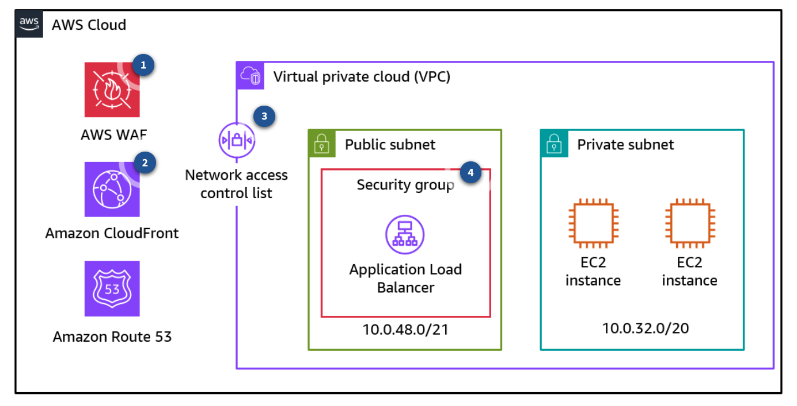
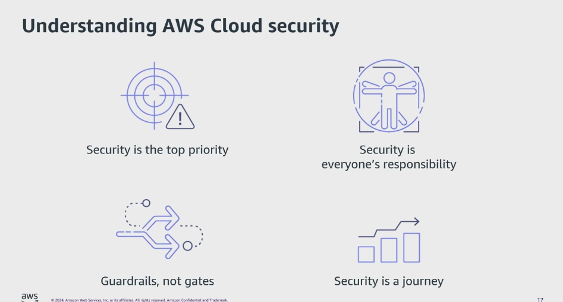
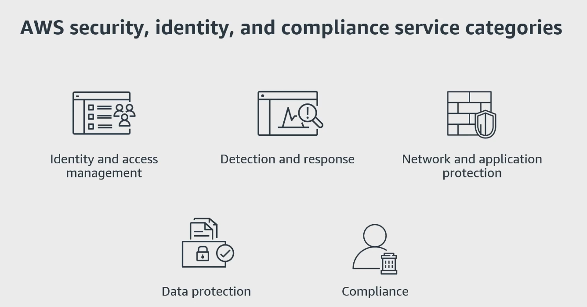
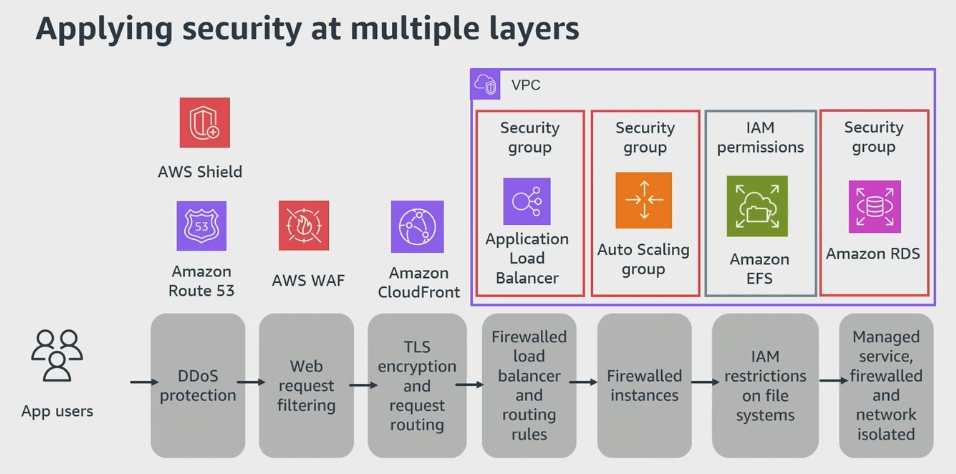
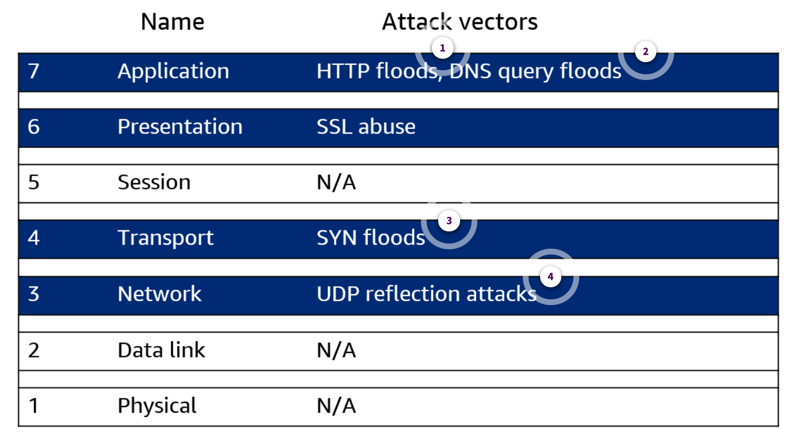
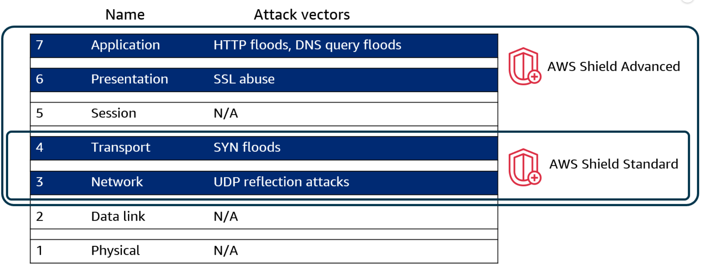
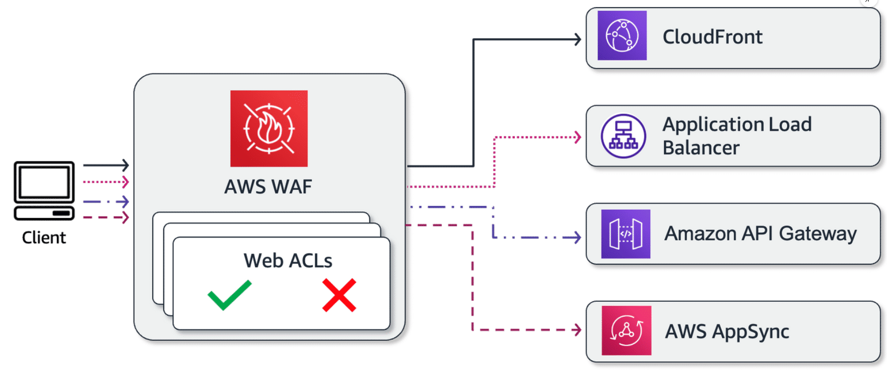
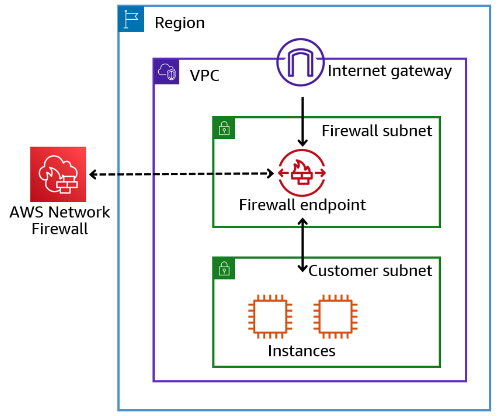
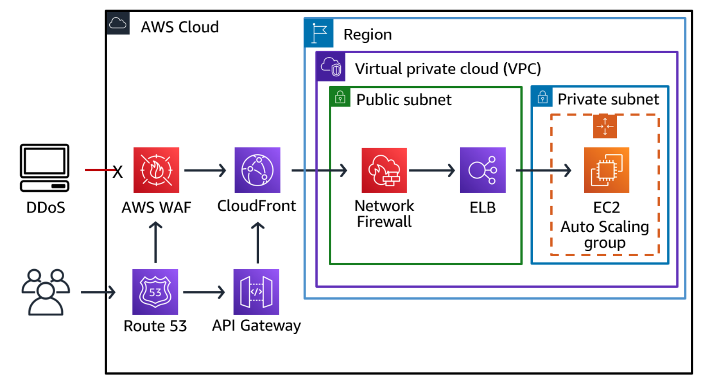
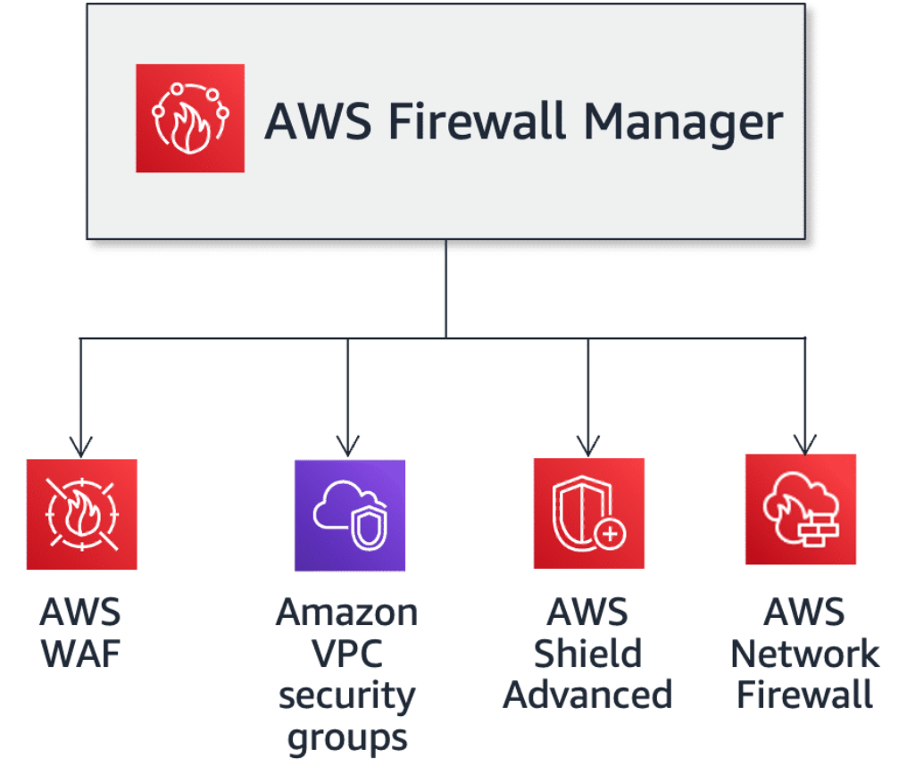

# Week 4: Networking 3 Part 2: Exploring Security Fundamentals

* back to AWS Cloud Institute repo's root [aci.md](../aci.md)
* back to [AWS Cloud Fundamentals 2](./aws-cloud-fundamentals-2.md)
* back to repo's main [README.md](../../../README.md)

## Understanding Multi-Layered Security

The term *multi-layered security* (also referred to as *defense in depth*) refers to the strategy of layering security controls. You can compare implementing multi-layered security with the act of defending a castle. In this analogy, the castle represents a server, data, or other important asset. To protect that asset, the defender employs multiple layers of defense. This serves the purpose of both stopping weaker adversaries and slowing down stronger adversaries. Multiple layers of defense can slow down adversaries because they must break through multiple layers of protection before they are able to compromise the asset. Layers of security also give the defender the time needed to detect the attack and respond accordingly.

### Resources for security inside the VPC

#### Security groups

Security groups act as virtual firewalls, at the instance level, allowing stateful traffic filtering.

#### Network ACLs

Network ACLs operate as virtual, horizontally scalable, stateless packet filtering devices at the subnet level.

#### VPC routing tables

VPC routing tables work at the VPC and subnet layer to control traffic routing within your network.

---

### Exploring additional security tools

Although you can implement network security using network ACLs and security groups, some organizations might have requirements beyond the scope of these network security controls, such as deep packet inspection (DPI), application protocol detection, and domain name filtering.

---

### Multi-layered architecture in action

The following architecture shows a simple example of a multi-layered architecture following a castle defenses analogy.

1. **Outer wall**

    Adversaries are met first by the outermost barrier, an outer wall. This can represent protection at the edge or perimeter, such as a web application firewall (WAF) like AWS WAF.

2. **Moat**

    If adversaries make it through the outer wall, they are met by a moat. This can represent protection outside the environment's perimeter, such Amazon CloudFront and blocking of banned areas.

3. **Inner wall**

    If adversaries make it through the moat, they are met by the very tall inner wall. This can represent protection at the edge or perimeter, such as a network ACL.

4. **Castle guard**

    If an adversary makes it through the inner wall, they are met with yet another barrier in the form of castle guard. This can represent a security group associated with a load balancer servicing an internet-facing web application.

---

Multi-layered security is a security approach that uses multiple layers of security to protect an organization's data. The idea is that unauthorized users will need to break through multiple layers of security to access your data, making it more difficult to gain access.

---

### Exploring multi-layered security

#### Security is everyone's responsibility

It is important to implement security at all layers to help prevent negative impacts on applications, loss of data, and unauthorized use. It is everyone's responsibility. For example, it's a developer's responsibility to write code in a way that helps ensure that the application will not be vulnerable to attacks. Often people think about security as gatekeeping, a practice that can block development and hinder agility. Instead, it's best to see security as guardrails that make it possible for developers to innovate quickly while maintaining a strong security posture. And finally, security is a journey, not a destination. When it comes to security, the job is never done. Instead, security is a process of iterative and continual improvement.

#### Security and compliance is a shared responsibility between AWS and the customer

AWS is responsible for security of the cloud. AWS is responsible for protecting the infrastructure that runs all the services offered. in the AWS cloud. Customers are responsible for security in the cloud, which involves things like protecting your network and encrypting your data. Strong security at the core of your organization enables digital transformation and innovation. AWS identity services such as AWS Identity and access management help you to securely manage identities, resources, and permissions at scale. AWS detection and response services like Amazon CloudWatch help you to enhance your security posture across your AWS environment by continuously monitoring the AWS environment and using CloudWatch features to identify and prioritize security risks.

AWS provides network and application protection services, such as AWS Shield and AWS WAF that help you enforce fine grain security policies at network control points across your organization. AWS Data Protection services such as, AWS Key Management Service or AWS KMS provide encryption capabilities, key management and sensitive data discovery to help you protect your data and workloads. AWS compliance services like AWS Audit Manager give you a comprehensive view of your AWS environment using automated compliance checks based on AWS best practices and industry standards. The purpose of multi-layered security is to protect an organization's data and make it more difficult for unauthorized users to gain access.

#### Multi-layered security example

1. **AWS Shield** for managed protection of the network. **Route 53** - a globally distributed DNS service - inspects requests to protect against DNS specific attacks.
2. **AWS WAF**, a web application firewall that blocks known bad traffic, including cross site scripting or XSS and SQL injection events.
3. **CloudFront** also provides both network and application level protection. After CloudFront and AWS WAF check the request, CloudFront forwards it to the compute services inside a VPC.
4. Then an application load balancer or ALB processes the request. Public access to the load balancer isn't allowed. A **security group** applied to the ALB only allows inbound traffic from the CloudFront IP range. The ALB distributes requests to the underlying EC2 instances.
5. The compute layer of this solution consists of an oral scaling group of EC2 instances. **Security group** rules specify which traffic reaches the instances. In this solution, only the ALB is allowed to make inbound connections to the EC2 instances.
6. Amazon EFS, which hosts the files that the application uses is protected by **IAM permission policies** that control the instances access to the file system.
7. Amazon RDS at the database layer and database instances are deployed in private subnets. **Private subnets** have no inbound or outbound internet access and can only be reached through other network interfaces within the VPC.

---

## Common Threats

### DDoS attacks overview

A distributed denial of service (DDoS) attack is an attack in which multiple compromised systems attempt to flood a target, such as a network or web application, with traffic. A DDoS attack can prevent legitimate users from accessing a service and can cause the system to crash due to the overwhelming traffic volume.

1. **HTTP flood/cache-busting (Layer 7) attacks**

    With an HTTP flood, including GET and POST floods, an unauthorized user sends multiple HTTP requests that appear to be from a real user of the web application. Cache-busting attacks are a type of HTTP flood that use variations in the HTTP requests query string that prevent use of edge-located cached content and forces the content to be served from the origin web server. This causes additional and potentially damaging strain on the origin web server.

2. **DNS query flood**

    In a DNS query flood, an unauthorized user uses multiple DNS queries to exhaust the resources of a DNS server. AWS Shield Advanced can help provide protection against DNS query flood attacks on Amazon Route 53 DNS servers.

3. **SYN flood**

    The intent of a SYN flood attack is to exhaust the available resources of a system by leaving connections in a half-open state. When a user connects to a TCP service, such as a web server, the client sends a SYN packet. The server returns an acknowledgment, and the client returns its own acknowledgement, completing the three-way handshake. In a SYN flood, the third acknowledgment is never returned, and the server is left waiting for a response. This can prevent other users from connecting to the server.

4. **UDP reflection attacks**

    With a UDP reflection attack, an unauthorized user can spoof the source of a request and use UDP to elicit a large response from the server. The extra network traffic directed towards the spoofed, attacked IP address can slow the targeted server and prevent legitimate users from accessing needed resources.

---

### AWS solutions

#### AWS Shield

AWS Shield is a managed DDoS protection service that safeguards your applications running on AWS. It provides you with dynamic detection and automatic inline mitigations that minimize application downtime and latency. There are two tiers of AWS Shield: Shield Standard and Shield Advanced.

AWS Shield Standard provides you protection against some of the most common and frequently occurring infrastructure (Layer 3 and 4) attacks. This includes SYN floods and reflection attacks. Shield Standard improves availability of your applications on AWS. The service applies a combination of traffic signatures, anomaly algorithms, and other analysis techniques. Shield Standard detects malicious traffic and it provides real-time issue mitigation. You are protected by Shield Standard at no additional charge.

If you need even more protection from DDoS attacks on your applications, consider using Shield Advanced, a fee-based service. You get additional detection and mitigation against large and sophisticated DDoS attacks, near real-time visibility, and integration with AWS WAF, a web application firewall. In addition to the Shield Standard functionality, Shield Advanced offers protections against attacks such as HTTP floods, DNS query floods, and SSL abuse.

#### AWS WAF

AWS WAF is a web application firewall that helps protect your web applications or APIs against common web exploits and bots. AWS WAF gives you control over how traffic reaches your applications. Create security rules that control bot traffic and block common attack patterns, such as SQL injection or cross-site scripting (XSS). You can also monitor HTTP(S) requests that are forwarded to your compatible AWS services.

In the following diagram, a client sends an inbound request to one of the four supported services: CloudFront, Application Load Balancer, Amazon API Gateway, or AWS AppSync. The traffic is evaluated against web access control lists (web ACLs) before it reaches the destination. If the traffic passes all web ACLs without a deny, it is sent to the destination AWS service.

#### AWS Network Firewall

AWS Network Firewall is a managed network firewall service designed to protect your VPCs from unwanted network traffic. The service operates as a stateful firewall, inspecting both incoming and outgoing network traffic and applying security rules to determine whether to allow or block the traffic.

To enable this protection, you need to use firewall endpoints. Firewall endpoints act as gateways for network traffic, allowing Network Firewall to inspect and apply configured rules to the incoming and outgoing traffic. In the following example, you use a firewall endpoint in a firewall subnet to route network traffic to and from customer resources located in a separate customer subnet within a VPC.

#### AWS Firewall Manager

AWS Firewall Manager simplifies your AWS WAF and Amazon Virtual Private Cloud (Amazon VPC) security groups administration and maintenance tasks. Firewall Manager helps you to do the following:

* Simplify management of rules across accounts and application.
* Automatically discover new accounts and remediate noncompliant events.
* Enable rapid response to attacks across all accounts.

As you create new applications, Firewall Manager also facilitates bringing new applications and resources into compliance with a common set of security rules from day one. This allows you to build firewall rules, create security policies, and enforce them in a consistent, hierarchical manner across your entire AWS infrastructure.

AWS Firewall Manager integrates with AWS Organizations, allowing you to manage security features across multiple AWS accounts and resources from a single place.

---

### DDoS-resilient reference architecture

In a traditional data center environment, you can mitigate infrastructure layer DDoS attacks. You use techniques such as overprovisioning capacity, deploying DDoS mitigation systems, or scrubbing traffic with the help of DDoS mitigation services. On AWS, DDoS mitigation capabilities are automatically provided. However, you can optimize your application’s DDoS resilience by making architecture choices that best use those capabilities, and so you can scale for excess traffic.

In the following diagram, AWS WAF sits on the edge of the architecture and acts as a gatekeeper. AWS WAF protects Layer 7 from application layer attacks.

You keep bad traffic at the edge by using services like Route 53, API Gateway, and CloudFront with AWS WAF and Shield. In this architecture, auto scaling is a last line of defense. Each of these AWS services, depending on the attacks, catch attacks and block them before they reach your VPC.

Services that are available in AWS edge locations, like CloudFront, AWS WAF, Route 53, and API Gateway, take advantage of a global network of edge locations. Multiple edge locations provide applications with greater fault tolerance and increased scale for managing larger volumes of traffic.

---

### Knowledge Check

#### What does a distributed denial of service (DDoS) attack consist of?

* In a DDoS attack, an unauthorized user uses multiple sources to overwhelm a target.

Wrong answers:

* In a DDoS attack, an unauthorized user extracts data from a website by sending multiple requests simultaneously.
* In a DDoS attack, an unauthorized user attempts to gain unauthorized access to a system by guessing the login credentials.
* In a DDoS attack, an unauthorized user encrypts data on a target system and demands a ransom payment to decrypt the data.

##### Explanation

**In a DDoS attack, an unauthorized user uses multiple sources to orchestrate an attack against a target. These sources can include distributed groups of malware infected computers, routers, Internet of Things (IoT) devices, and other endpoints.**

The remaining answers do not represent DDoS attacks.

#### An unauthorized user attempts to exhaust the resources of a DNS server. Which type of attack is this?

* DNS query flood

Wrong answers:

* HTTP flood
* SYN flood
* UDP reflection attack

##### Explanation

**In a DNS query flood, an attacker uses multiple DNS queries to exhaust the resources of a DNS server.**

With an HTTP flood, an attacker sends multiple HTTP requests that appear to be from a real user of the web application. The intent of an SYN flood attack is to exhaust the available resources of a system by leaving connections in a half-open state. With a UDP reflection attack, an unauthorized user can spoof the source of a request and use UDP to elicit a large response from the server.

#### What is the primary purpose of the AWS WAF service?

* AWS WAF is a web application firewall that helps protect web applications or APIs against common web exploits and bots.

Wrong answers:

* AWS WAF simplifies security configuration administration and maintenance tasks.
* AWS WAF is a managed network firewall service designed to protect virtual private clouds (VPCs) from unwanted network traffic.
* AWS WAF is a managed distributed denial of service (DDoS) protection service that safeguards applications running on AWS.

##### Explanation

**AWS WAF is a web application firewall that helps protect web applications or APIs against common web exploits and bots.**

AWS Firewall Manager simplifies AWS WAF and Amazon VPC security groups administration and maintenance tasks. AWS Network Firewall is a managed network firewall service designed to protect VPCs from unwanted network traffic. AWS Shield is a managed DDoS protection service that safeguards applications running on AWS.

---

### Summary

Multi-layered security is a security approach that uses multiple layers of security to protect an organization's data. The idea is that unauthorized users will need to break through multiple layers of security to access your data, making it more difficult to gain access.

#### Exploring common threats

In a distributed denial of service (DDoS) attack, an unauthorized user uses multiple sources to orchestrate an attack against a target. These sources can include distributed groups of malware infected computers, routers, Internet of Things (IoT) devices, and other endpoints.

* Attacks at Layers 3 and 4 are typically categorized as infrastructure layer attacks. These attacks are usually large in volume and aim to overload the capacity of the network or the application servers. Infrastructure layer attacks are the most common type of DDoS attack and include vectors like SYN flood or UDP flood attacks.
* Attacks at Layers 6 and 7 are often categorized as application layer attacks. These attacks are typically small in volume compared to the infrastructure layer attacks. But they tend to focus on particular expensive parts of the application, thereby making it unavailable for real users. Although application layer attacks are less common, they also tend to be more sophisticated. Examples include a flood of HTTP requests to a login page, or DNS query floods.

#### AWS solutions

AWS Shield Standard, AWS WAF, and AWS Firewall Manager are just some examples of AWS services that can protect your architectures against attacks.

* AWS Shield is a managed DDoS protection service that safeguards your applications running on AWS. It provides you with dynamic detection and automatic inline mitigations that minimize application downtime and latency. There are two tiers of AWS Shield: Shield Standard and Shield Advanced.
* AWS WAF is a web application firewall that helps protect your web applications or APIs against common web exploits and bots. AWS WAF gives you control over how traffic reaches your applications. Create security rules that control bot traffic and block common attack patterns, such as SQL injection or cross-site scripting (XSS). You can also monitor HTTP(S) requests that are forwarded to your compatible AWS services.
* AWS Network Firewall is a managed network firewall service designed to protect your VPCs from unwanted network traffic. The service operates as a stateful firewall, inspecting both incoming and outgoing network traffic and applying security rules to determine whether to allow or block the traffic.
* AWS Firewall Manager simplifies your AWS WAF and Amazon VPC security groups administration and maintenance tasks.

---
