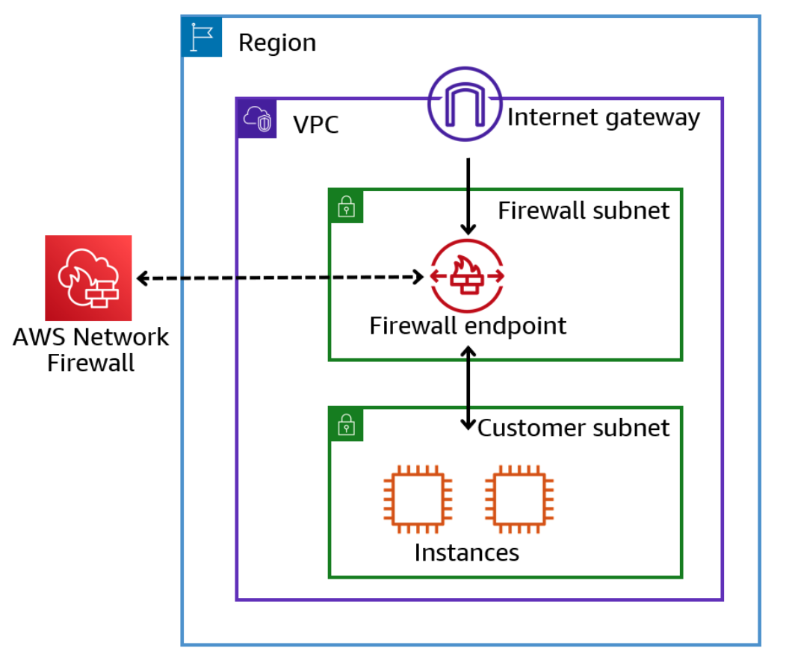
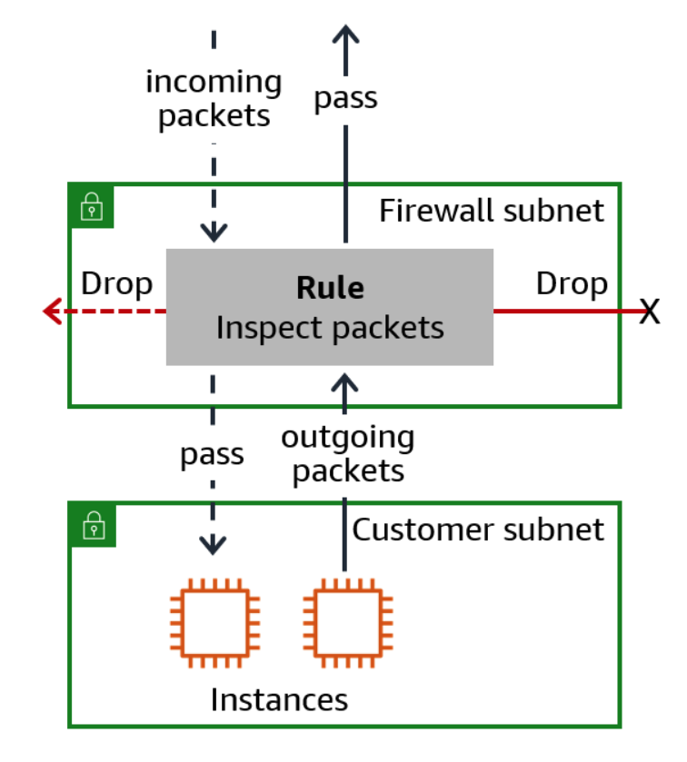
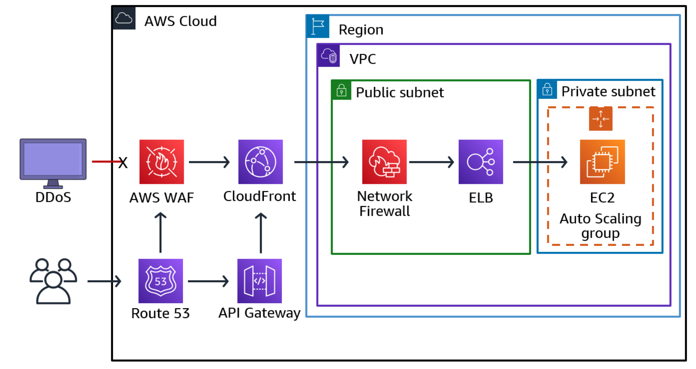
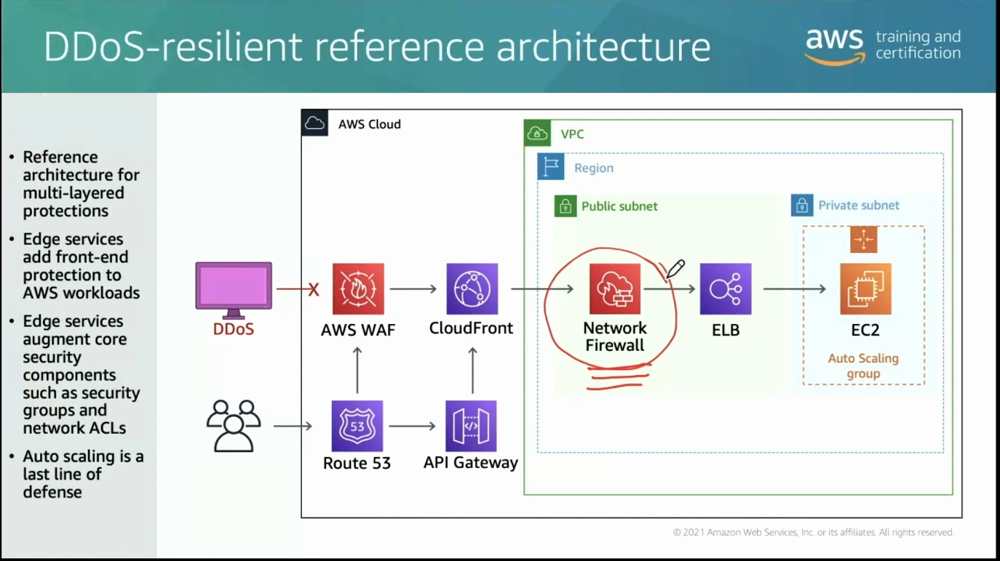
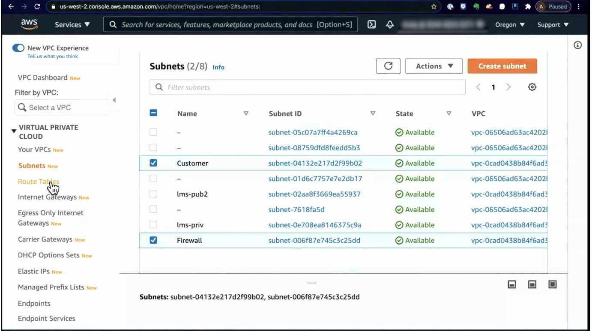
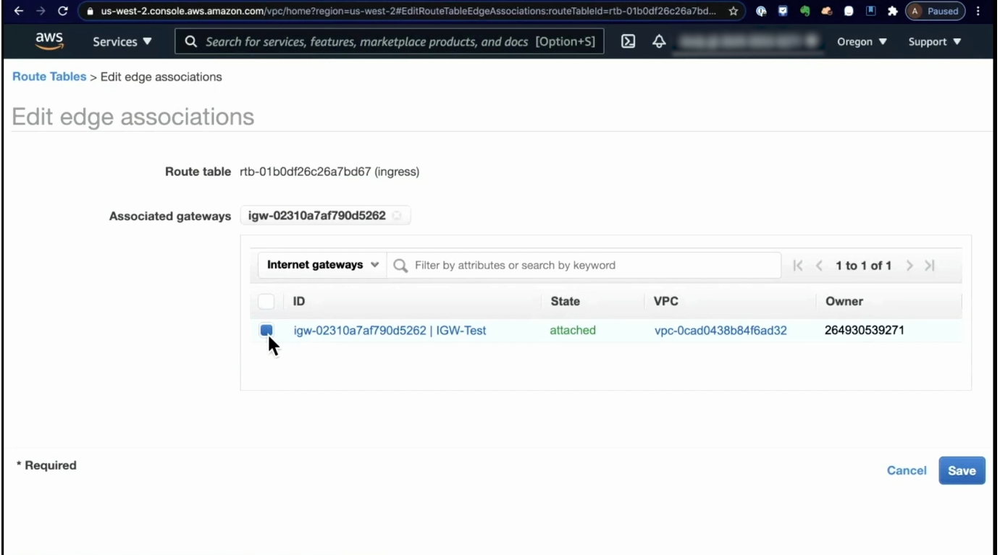
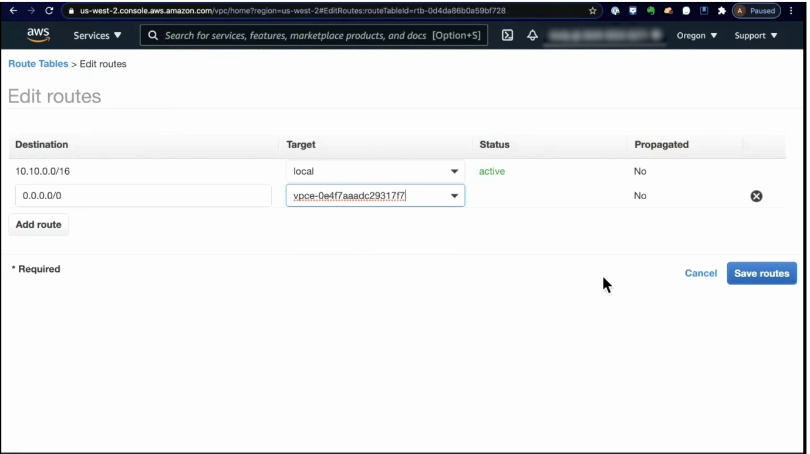
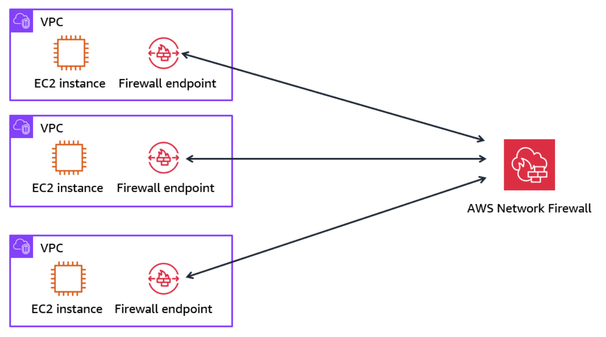
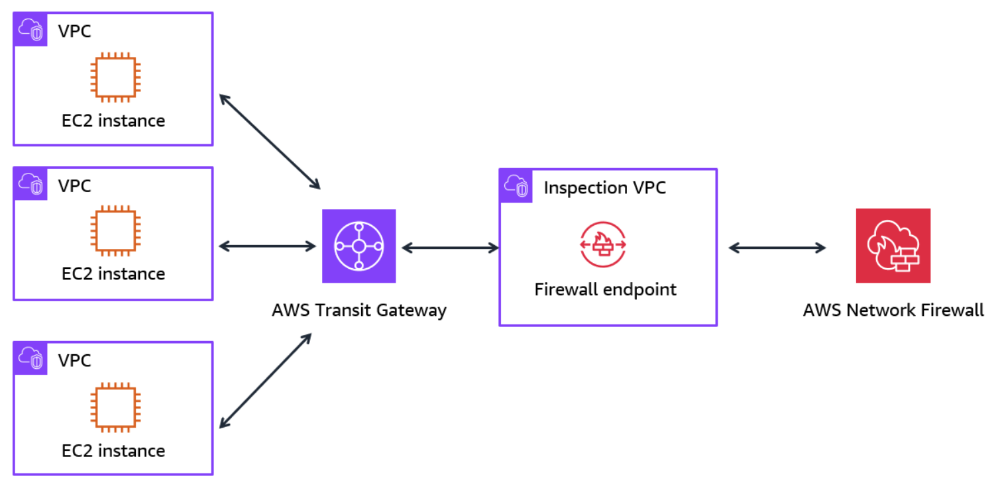

# Week 4: Networking 3 Part 2: Filtering Network Traffic with AWS Network Firewall

* back to AWS Cloud Institute repo's root [aci.md](../aci.md)
* back to [AWS Cloud Fundamentals 2](./aws-cloud-fundamentals-2.md)
* back to repo's main [README.md](../../../README.md)

## AWS Network Firewall

A firewall is a network security component designed to monitor and control the flow of incoming and outgoing network traffic. The primary function of a firewall is to inspect network traffic and either allow or block specific data packets based on a set of configurable rules. These rules can be based on various criteria, including source and destination IP addresses, ports, protocols, and application types. By enforcing these rules, a firewall can effectively protect a network from external attacks, unauthorized access attempts, and potential data breaches.

### Types of firewalls

There are several types of firewalls, including network-based firewalls, host-based firewalls, and application-level firewalls. Each type of firewall operates at a different level of the network stack and provides varying levels of security and control.

---

### AWS Network Firewall

AWS Network Firewall is a managed service that you use to deploy network protections for your virtual private clouds (VPCs). With Network Firewall, you can define firewall rules that give you fine-grained control over network traffic, or import rules that you’ve already written in common open-source rule formats. Network Firewall also provides managed rule groups, which are collections of rules designed to address specific threats or compliance requirements.

AWS Network Firewall protects the subnets within your VPC by filtering traffic going between the subnets and locations outside of your VPC. To enable the firewall's protection, you modify your VPC route tables to send your network traffic through firewall endpoints. Firewall endpoints represent the entry and exit points for network traffic in a VPC or across VPCs. Firewall endpoints act as the gateway for all network traffic, allowing Network Firewall to inspect and apply configured rules to incoming and outgoing traffic. Note that firewall endpoints can be deployed to multiple Availability Zones for high availability.

In the following example, you use a firewall endpoint in the firewall subnet to route network traffic to and from your customer's resources, which are located in a separate customer subnet.

---

### Network Firewall features and benefits

#### Customized rules

With AWS Network Firewall, you can implement customized rules to prevent your VPCs from accessing unauthorized domains, block thousands of known-bad IP addresses, or identify malicious activity using signature-based detection.

Network Firewall is integrated with AWS Firewall Manager. This gives customers who use AWS Organizations a single place to enable and monitor firewall activity across all of their VPCs and AWS accounts, reducing administrative overhead.

Network Firewall makes firewall activity visible in real time with Amazon CloudWatch metrics. It also offers increased visibility of network traffic by sending logs to Amazon Simple Storage Service (Amazon S3), Amazon CloudWatch, and Amazon Kinesis Data Firehose.

**Image description:** Network Firewall rule in a firewall subnet inspecting incoming and outcoming packets to EC2 instances in a customer subnet. Some packets pass, some others are dropped.

#### Centralized inspection

You can deploy Network Firewall into individual VPCs in a decentralized format so that each VPC can have its own security rules.

As an alternative, you can install a Network Firewall endpoint in a separate VPC and route all inbound and outbound traffic through the inspection VPC.

#### DDoS resilient

Network Firewall is an important part of DDoS-resilient architectures. The following reference architecture is an example of how you can improve your web application’s resiliency against DDoS attacks using Network Firewall in conjunction with other AWS services.

* It provides multi-layered protections.
* It adds front-end protection to AWS workloads with a global network of edge locations that provide applications with greater fault tolerance.
* It increases scale to manage larger volumes of traffic.
* It automatically scales as a last line of defense to mitigate volumetric DDoS attacks.

**Image description:** DdoS-resilient architecture showing an EC2 instance in a private subnet surrounded by an auto scaling group. DdoS traffic is intercepted by AWS WAF. Legitimate traffic goes through Route 53, API Gateway, CloudFront, Network Firewall and ELB before arriving to the EC2 instance.

In a DDoS-resilient architecture, edge services add frontend protection to AWS workloads by augmenting core security components such as security groups and network ACLs.

---

### AWS Network Firewall and the CIA triad

Securing information usually comes down to the three basic security functions in the CIA triad of **confidentiality**, **integrity** and **availability**. The CIA triad is a widely recognized model that outlines the three core objectives of information security. Confidentiality safeguards sensitive data from unauthorized access, integrity ensures the accuracy and trustworthiness of information, and availability guarantees that authorized users have reliable and consistent access to resources.

AWS Network Firewall plays a crucial role in supporting the integrity aspect of the CIA triad. By enforcing strict security policies, inspecting network traffic, and preventing unauthorized access or modifications to data, it maintains the accuracy, completeness, and trustworthiness of information within your AWS environment.

---

## How AWS Network Firewall Works

### Key components of AWS Network Firewall

#### Rule group

A rule group is a collection of stateful or stateless firewall rules that you can use to inspect and control network traffic. These rules define the criteria for allowing or blocking traffic, such as IP addresses, ports, protocols, and application-level inspection. Rule groups can be associated with one or more firewall policies, allowing you to apply a consistent set of rules across multiple firewalls.

---

#### Stateless and stateful rules differences

Stateless rules evaluate each packet independently, without considering the broader context or connection state. They make decisions based solely on the information present in the packet, such as the source and destination IP addresses, ports, and protocol. In contrast, stateful rules maintain awareness of the connection state, tracking the flow of network traffic and making decisions based on the overall context of the communication session.

---

#### Firewall policy

A firewall policy is a set of configurations that define the behavior of the firewall. It includes one or more rule groups, default actions for handling traffic that doesn't match any rules, and settings for logging and monitoring.

#### Firewall

A firewall is a logical resource that connects the rules in a firewall policy to the corresponding VPC that you want to protect. Each firewall requires one firewall policy.

---

### AWS Network Firewall Ingress Routing demo

The network firewall is the AWS service that you can use specifically for intrusion detection and intrusion prevention over here too and also packet scanning. But at the same time, you can also use third party products in that same arrangement here. In this particular arrangement, the network firewall is something that you install within your VPC.

#### Traffic flow with Network Firewall endpoint established

When the network firewall has already been established, The endpoint has already been set up. Setting up the endpoint, we can add rules for what kind of traffic we actually wanna flow here.

Under the normal flow, we're going right down from the internet gateway to your instances inside the VPC. Normally there's nothing inside that's actually scanning those packets like this. With the network firewall, the traffic from the internet gateway should flow down to the firewall and then the firewall can pass it back and then the same thing, vice versa down here. This is achieved by manipulating route tables.

1. Create a route table.
2. Associate it with the edge of this network, specifically the internet gateway. The traffic goes from the Internet Gateway to the firewall endpoint.

    

3. The same thing in reverse. We set for all non-local traffic, the all zeros to send it to the firewall endpoint. This is how we can set up ingress routing.

    

---

## AWS Network Firewall Deployment Models

### Introduction to AWS deployment models

You can deploy AWS Network Firewall in your AWS environment in different ways. The deployment models most commonly used for Network Firewall include **distributed deployment** and **centralized deployment.** The best model to use depends on the use case and requirements.

### Distributed deployments

The distributed deployment model is an approach where you deploy the Network Firewall service into each VPC that requires protection. In this model, each VPC is protected independently, which reduces the potential impact of a security breach. This means that if one VPC is compromised, the damage is limited to that specific VPC, and it does not affect the other VPCs in your AWS environment. By deploying Network Firewall in a distributed manner, you ensure that each VPC is protected individually, without requiring connectivity between the VPCs or to an AWS Transit Gateway. This architectural approach enhances the overall security of your AWS environment by compartmentalizing the network and limiting the blast radius in the event of a security incident.

---

#### Distributed deployments and the CIA triad

By reducing the potential impact of security breaches, distributed deployments play a role in supporting the **confidentiality** aspect of the CIA triad.

---

### Centralized deployments

A centralized deployment provides a simplified approach to manage inspection between VPCs (same or different Region), internet, and on-premises networks. In a centralized deployment model, a Transit Gateway acts as a network hub to simplify the connections between your VPCs and on-premises networks. It also allows you to connect transit gateways in different AWS Regions, creating a global network using the AWS backbone. **Transit Gateway is a prerequisite for a centralized deployment model.** In this model, you also need an inspection VPC. The inspection VPC is a dedicated VPC used for centralized inspection of network traffic using AWS Network Firewall. The **inspection VPC** has **two subnets** in each Availability Zone: one for the **firewall endpoint** and one for the **AWS transit gateway attachment**.

---

#### Centralized deployments and the CIA Triad

By spreading resources a highly available architecture, centralized deployments play a role in supporting the **availability** aspect of the CIA Triad.

---

---

Depending on the characteristics of your workloads and traffic patterns, there are several variations of each deployment model that you can implement. To learn more, see [Deployment Models for AWS Network Firewall](https://aws.amazon.com/blogs/networking-and-content-delivery/deployment-models-for-aws-network-firewall/) in the *AWS Blog*.

---

### [Lab: Using AWS Network Firewall for Inbound/Outbound Traffic](./labs/W042Lab1NetworkFirewallInboundOutboundTraffic.md)

In this lab, you use AWS Network Firewall to filter outbound web traffic using resources that are provisioned as part of this lab.

In this lab, you will perform the following tasks:

* Create and configure the AWS Network Firewall using the Network Firewall rule groups to filter outbound web traffic.
* Use CloudWatch Log Groups to filter queries for auditing and identifying potential threats.
* Configure stateful rule groups in AWS Network Firewall that follow Suricata-compatible intrusion prevention system (IPS) rule specifications.
* Apply stateful firewall rules to detect suspicious network traffic.
* Configure Firewall Policy and monitoring for AWS Network Firewall to hunt for suspicious network activity.
* Stop malicious activities identified through monitoring and investigation of security alerts.

---

### Knowledge Check

#### What is a benefit of integrating AWS Network Firewall with AWS Firewall Manager?

* Reduced administrative overhead

Wrong answers:

* Improved security posture
* Enhanced network performance
* Lower costs

##### Explanation

**Integrating AWS Network Firewall with AWS Firewall Manager allows for reduced administrative overhead by giving customers who use AWS Organizations a single place to enable and monitor firewall activity across all of their VPCs and AWS accounts.**

The remaining answers are incorrect.

### What is the purpose of firewall rules?

* They define the criteria for allowing or blocking traffic.

Wrong answers:

* They define the behavior of a firewall.
* They connect a firewall policy to a virtual private cloud (VPC).
* They represent the entry and exit points for network traffic.

##### Explanation

**Firewall rules define the criteria for allowing or blocking traffic, such as IP addresses, ports, protocols, and application-level inspection.**

A firewall policy is a set of configurations that define the behavior of the firewall. A firewall is a logical resource that connects the rules in a firewall policy to the corresponding VPC that you want to protect. Firewall endpoints represent the entry and exit points for network traffic in a VPC or across VPCs.

#### Which of these is an AWS Network Firewall deployment model?

* Centralized deployment

Wrong answers:

* Canary deployment
* Linear deployment
* Blue/green deployment

##### Explanation

**Centralized deployment is an approach used for centralized inspection of network traffic using AWS Network Firewall.**

The remaining answers represent DevOps deployment strategies and are not related to Network Firewall.

---

### Summary

A firewall is a network security component designed to monitor and control the flow of incoming and outgoing network traffic. The primary function of a firewall is to inspect network traffic and either allow or block specific data packets based on a set of configurable rules.

AWS Network Firewall is a managed service that you use to deploy network protections for your VPCs. Network Firewall benefits include customized rules, centralized inspection, and DDoS resiliency.

Network Firewall supports the integrity aspect of the confidentiality, integrity, and availability (CIA) triad. It does this by enforcing security policies, inspecting traffic, preventing unauthorized data access or modifications, and maintaining information accuracy and trustworthiness.

#### Key components of AWS Network Firewall

* A **rule group** is a collection of stateful or stateless firewall rules that you can use to inspect and control network traffic.
* A **firewall policy** is a set of configurations that define the behavior of the firewall.
* A **firewall** is a logical resource that connects the rules in a firewall policy to the corresponding VPC that you want to protect.

#### Deployment models

The deployment models most commonly used for Network Firewall include distributed deployment and centralized deployment. The best model to use depends on the use case and requirements.

* **Distributed deployment**: Network Firewall is deployed independently in each VPC requiring protection. This limits the impact of a breach to that VPC.
* **Centralized deployment**: Network Firewall is deployed in a dedicated inspection VPC, inspecting traffic between VPCs, internet, and on-premises networks using a transit gateway as a central hub.

---
