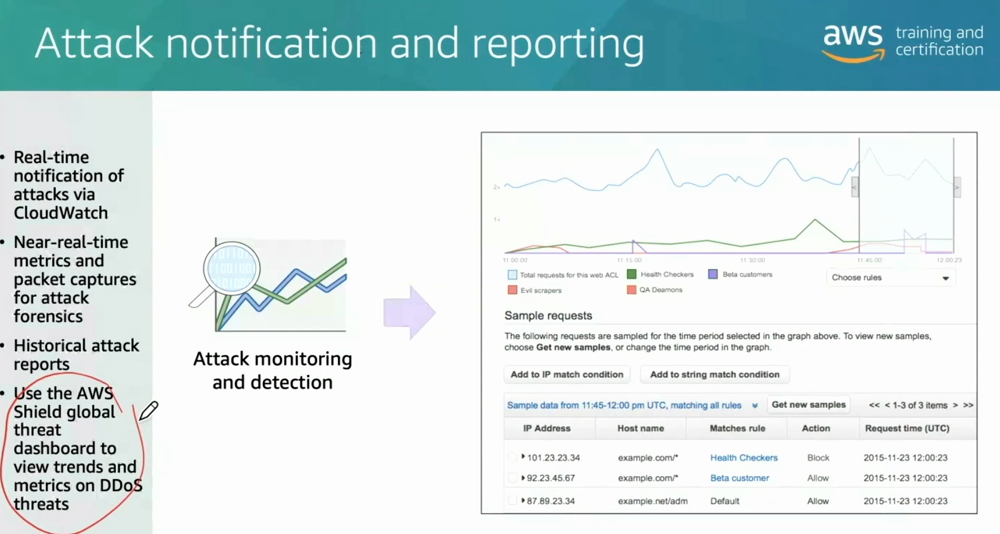
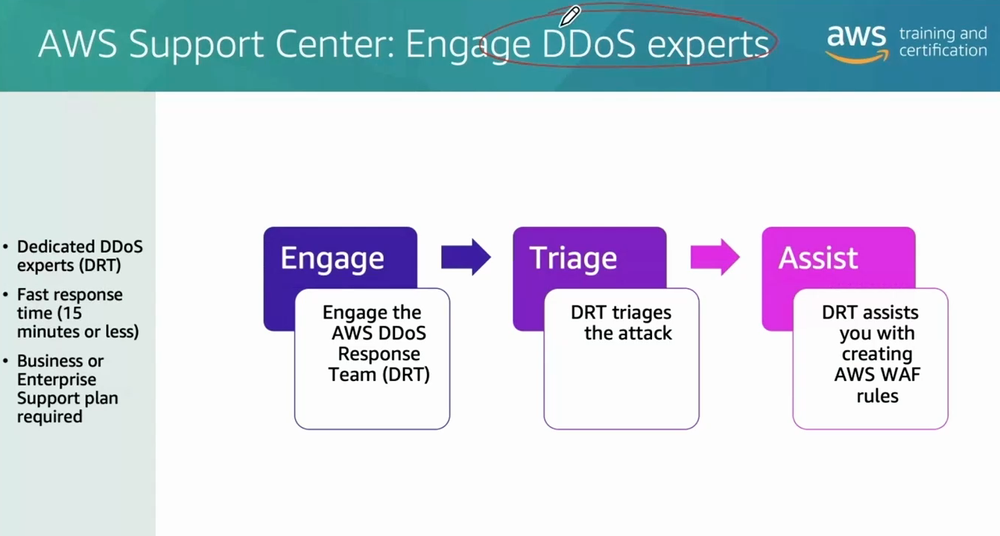
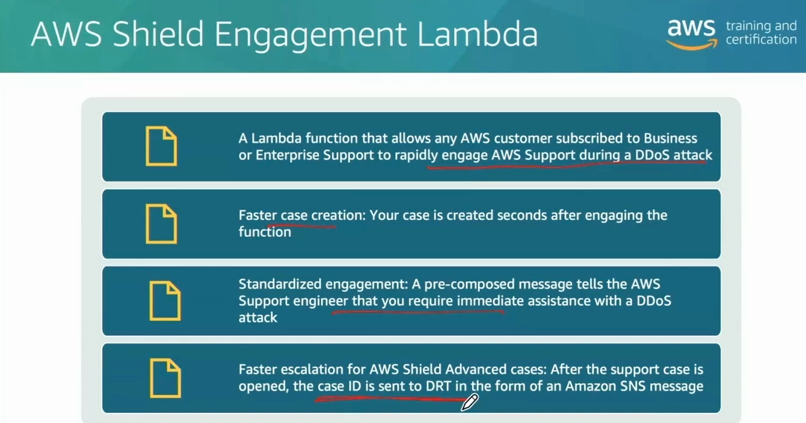
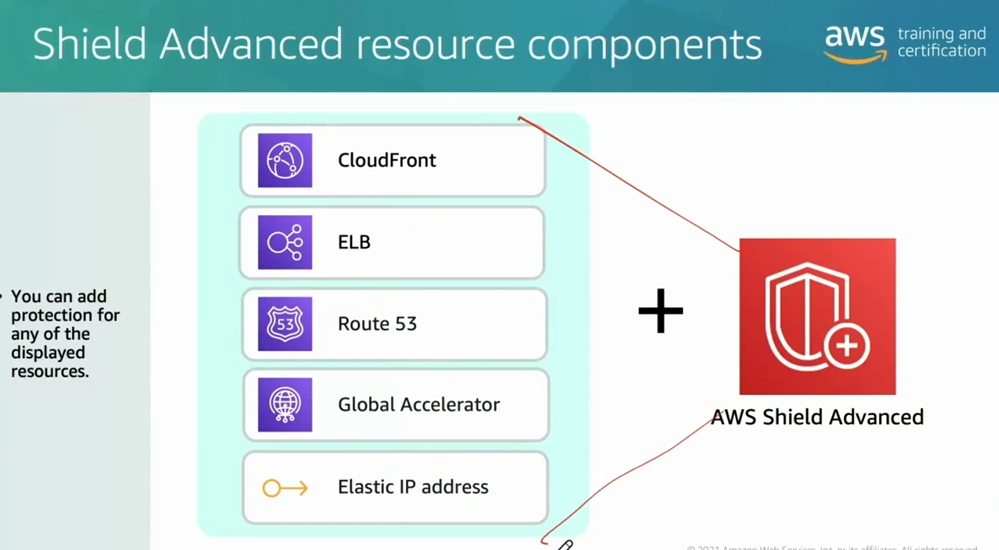
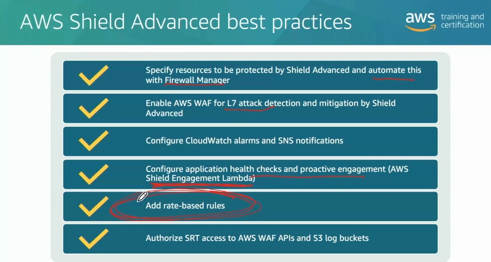
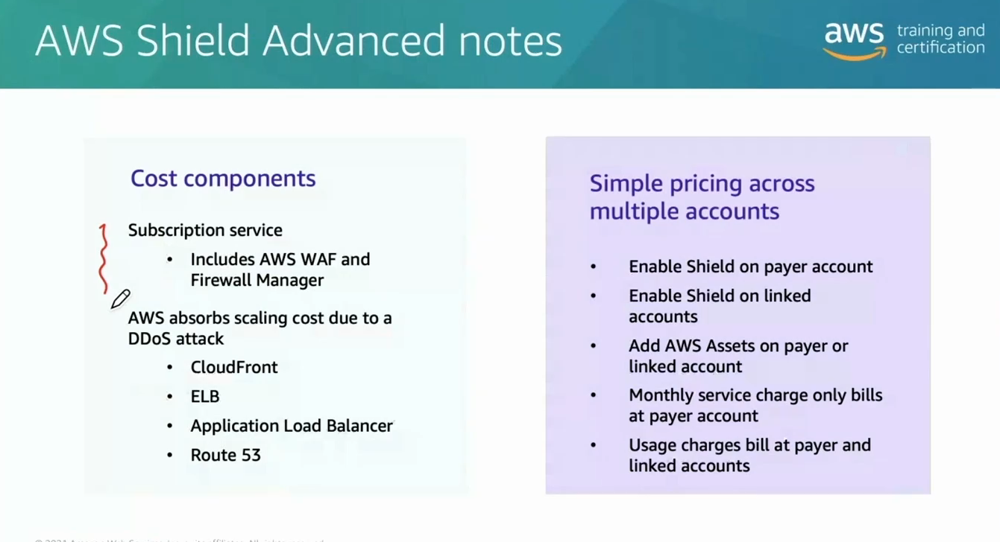

# Week 4: Networking 3 Part 2: Protecting Your Network Against DDoS Attacks with AWS Shield

* back to AWS Cloud Institute repo's root [aci.md](../aci.md)
* back to [AWS Cloud Fundamentals 2](./aws-cloud-fundamentals-2.md)
* back to repo's main [README.md](../../../README.md)

## AWS Shield Overview

AWS Shield is a managed distributed denial of service (DDoS) protection service that safeguards your applications running on Amazon Web Services (AWS). There are two tiers of AWS Shield: Shield Standard and Shield Advanced. **AWS Shield Standard** is a free service that offers baseline protection against common, frequently occurring Layer 3 and 4 DDoS attacks. It is automatically enabled for all AWS customers and applies safeguards such as SYN and UDP flood protection, large-packet mitigation, and detection of reflection attacks.

**AWS Shield Advanced** is a paid service that provides enhanced protection against more sophisticated and larger Layer 3, 4, and 7 DDoS attacks. It integrates with AWS WAF and provides advanced mitigation techniques, real-time visibility into attacks, dedicated DDoS response team support, cost protection for AWS resources during attacks, and access to DDoS experts for attack mitigation strategies.

### AWS Shield and DDoS attacks

DDoS attacks are a common and persistent threat to online services and applications. Unauthorized users often aim to cause embarrassment or disruption by taking a company's service offline. These attacks can continue until the threat is successfully mitigated, the attacker runs out of resources, or they lose interest and move on. DDoS attacks directly impact the availability of an organization's resources, which is a critical aspect of the confidentiality, integrity, and availability (CIA) triad. By ensuring the high availability of resources, even during a DDoS attack, AWS Shield Advanced helps you maintain the necessary level of service and avoid reputational and financial damage.

Shield Advanced is designed to detect and mitigate DDoS attacks early, before they can impact the availability of protected resources. The service continuously monitors traffic patterns and quickly identifies anomalies that might indicate an ongoing attack. Shield Advanced integrates with AWS WAF and provides you with a comprehensive solution to protect your critical resources and ensure high availability, even during the most severe DDoS attacks.

### Shield Standard and Shield Advanced comparison

The following table compares the functionality of AWS Shield Standard and Shield Advanced.

| | Shield Standard | Shield Advanced |
| ---------- | --------------- | --------------- |
| Scope | Protects AWS infrastructure | Protects your applications |
| Cost | Available to all AWS customers at no additional cost | Premium paid service with 12 months commitment |
| Protections | Shield Standard automatically protects against common infrastructure attacks by using the scale of the AWS network. | In addition to the Standard tier protections, Shield Advanced provides attack visibility and cost protections, and other features.  Shield Advanced also includes Shield Response Team (SRT) support. The SRT are security engineers who specialize in DDoS event response. |

---

### AWS Shield Advanced functionality

**AWS Shield Advanced** is a **subscription-based DDoS (Distributed Denial of Service) protection service** that enhances the baseline protections provided by **AWS Shield Standard**. It is designed for organizations requiring **enterprise-grade DDoS mitigation**, **real-time attack visibility**, and **24/7 expert support** from AWS’s DDoS ShieldResponse Team (SRT).

---

#### 1. Purpose and Value Proposition

##### 🔒 Why Shield Advanced?

* Protects AWS workloads against **large-scale and sophisticated DDoS attacks**.
* Ensures **equal or better protection** compared to traditional on-premise environments.
* Functions as a **DDoS insurance policy**, helping minimize operational risk and unexpected costs.
* During an attack, Shield Advanced automatically deploys your Amazon VPC network ACLs to the border of the AWS network.
* **Easy to configure** without changing your application architecture.
* **Comprehensive protection against DDoS** attack vector.
* **Near-real-time** event visibility.
* Protection from **economic attack vectors**.

##### 💰 Subscription Model

* Flat rate of **$3,000/month per organization**.
* Key value: reduces business risk, downtime, and **economic impact** from DDoS-triggered scaling.

---

#### 2. Key Enhancements Beyond Shield Standard

| Feature | Shield Standard | Shield Advanced |
|----------|------------------|------------------|
| Basic DDoS Protection | ✅ | ✅ |
| Enhanced DDoS Detection | ❌ | ✅ |
| 24/7 DDoS Response Team | ❌ | ✅ |
| Real-Time Attack Visibility | ❌ | ✅ |
| Global Threat Dashboard | ❌ | ✅ |
| Cost Protection (Autoscaling/WAF) | ❌ | ✅ |
| WAF and Firewall Manager Included | ❌ | ✅ |
| Resource-Specific Protection | ❌ | ✅ |

---

#### 3. Advanced Capabilities

##### 🧠 Real-Time Visibility and Threat Intelligence

* Access to **global dashboards** showing attack trends and vectors across AWS.
* Detailed **CloudWatch metrics** and diagnostics for analysis and forensics.
* Integration with **AWS WAF** for L7 (Application Layer) protection and **rate-based rules**.

##### ⚙️ Automated Mitigation

* Automatically updates **network ACLs** to block malicious traffic at the perimeter.
* Works seamlessly with **existing AWS architectures**—no complex configuration required.

##### 🧾 Economic Protection

* Covers costs incurred from **DDoS-induced scaling**, such as:
  * Auto Scaling groups expanding under load.
  * Increased AWS resource utilization.
* These scaling costs are **credited back** under Shield Advanced.

---

#### 4. Expert Support and Engagement

##### 👥 AWS DDoS Response Team (DRT)

* Available **24/7/365** for Shield Advanced subscribers.
* Provides **active attack triage**, **mitigation guidance**, and **post-incident support**.
* Offers **proactive engagement** to prepare for future attacks.

##### ⏱ Response Time

* Guaranteed **15-minute or less** response for high-severity DDoS incidents.

##### 🧩 Shield Engagement Lambda

* AWS-provided Lambda function that **automates DRT engagement**.
* Can be triggered automatically when CloudWatch detects an attack.
* Sends an **SNS notification** directly to the DRT for immediate response.
* Enables **fully automated incident escalation**—no human intervention required.

---

#### 5. Integrated Services

Shield Advanced includes or integrates tightly with several AWS services:

| Service | Purpose |
|----------|----------|
| **AWS WAF** | Application layer (L7) protection, rate-based rules, and custom filters. |
| **AWS Firewall Manager** | Centralized policy enforcement and automation for multiple accounts. |
| **Amazon CloudWatch** | Real-time monitoring, alerts, and metrics integration. |
| **AWS CloudFront / ALB / Route 53 / Global Accelerator / Elastic IP** | Supported resources that can be individually protected. |

---

#### 6. Cost Considerations

* **Included at no charge:**  
  * AWS WAF usage  
  * AWS Firewall Manager  
  * Scaling costs during DDoS events  

* **Additional requirement:**  
  * Must have **Business** or **Enterprise Support Plan** for SRT access.

* **Cross-account support:**  
  * Can be activated on **payer** or **linked** accounts under consolidated billing.

---

#### 7. Best Practices for Deployment

1. **Specify Protected Resources**
   * Explicitly select resources (e.g., ALBs, CloudFront, Route 53) for Shield Advanced coverage.

2. **Integrate with AWS WAF**
   * Enable L7 protection and implement **rate-based rules** for volumetric defense.

3. **Automate Response**
   * Use **Shield Engagement Lambda** to auto-trigger SRT engagement.

4. **Configure Monitoring**
   * Set **CloudWatch alarms** and **SNS notifications** for DDoS metrics.

5. **Grant Required Permissions**
   * Ensure SRT has access to **WAF APIs** and **S3 logs** for faster triage.

6. **Leverage Firewall Manager**
   * Automate Shield and WAF policies across multiple accounts.

---

#### 8. Summary

| Benefit | Description |
|----------|--------------|
| **Proactive Protection** | Extends beyond Shield Standard to stop complex, multi-vector attacks. |
| **Visibility** | Provides detailed metrics, logs, and real-time dashboards. |
| **Expert Assistance** | Includes access to AWS’s dedicated DDoS Response Team. |
| **Cost Assurance** | Shields against both traffic-based and economic impacts of attacks. |
| **Automation** | Integrates Lambda and CloudWatch for faster mitigation and escalation. |

---

#### ✅ Key Takeaways

* Shield Advanced is **enterprise-level insurance** against costly DDoS threats.  
* For high-value workloads, the $3,000 monthly investment is often outweighed by **potential downtime costs**.  
* Combine with **WAF**, **CloudFront**, and **Firewall Manager** for maximum resiliency.  
* Implement **Shield Engagement Lambda** for rapid response automation.  
* Always align SRT access, IAM roles, and S3 log permissions **before** an incident occurs.

---

### Knowledge Check

#### Which levels in the Open Systems Interconnection (OSI) model does AWS Shield Standard offer protection for?

* Layers 3 and 4 (Network and Transport)

Wrong answers:

* Layers 1 and 2 (Physical and Data link)
* Layers 5 and 6 (Session and Presentation)
* Layer 7 (Application)

##### Explanation

**Shield Standard offers protection against Layer 3 and 4 attacks.**

The remaining answers are incorrect.

#### Which statement is true regarding AWS Shield Advanced?

* It is a subscription service.

Wrong answers:

* It only offers protections at Layer 7.
* It offers less visibility than AWS Shield Standard.
* There is an extra charge for AWS WAF and AWS Firewall Manager.

##### Explanation

**Shield Advanced is a subscription service.**

Shield Advanced offers more visibility than Shield Standard. Shield Advanced includes AWS WAF and Firewall Manager. Shield Advanced offers protections for Layers 3, 4, and 7.

#### Which service resources does AWS Shield Advanced offer distributed denial of service (DDoS) cost protection for? (Select TWO.)

* Amazon CloudFront
* Amazon Route 53

Wrong answers:

* AWS Cloud WAN
* AWS Direct Connect
* Amazon S3

##### Explanation

**AWS Shield Advanced offers DDoS cost protection for Amazon CloudFront and Amazon Route 53.**

The remaining services listed are not included in the AWS Shield Advanced DDoS cost protection offering.

---

### Summary

AWS Shield is a managed DDoS protection service that safeguards your applications running on AWS. There are two tiers of AWS Shield: Shield Standard and Shield Advanced. **AWS Shield Standard** is a free service that offers baseline protection against common, frequently occurring Layer 3 and 4 DDoS attacks. **AWS Shield Advanced** is a paid service that provides enhanced protection against more sophisticated and larger Layer 3, 4, and 7 DDoS attacks.

#### Shield Standard and Shield Advanced comparison

The following table compares the functionality of Shield Standard and Shield Advanced.

| | Shield Standard | Shield Advanced |
| ---------- | --------------- | --------------- |
| Scope | Protects AWS infrastructure | Protects your applications |
| Cost | Available to all AWS customers at no additional cost | Premium paid service with 12 months commitment |
| Protections | Shield Standard automatically protects against common infrastructure attacks by using the scale of the AWS network. | In addition to the Standard tier protections, Shield Advanced provides attack visibility and cost protections, among many other features.  Shield Advanced also includes Shield Response Team (SRT) support. The SRT are security engineers who specialize in DDoS event response. |

---
