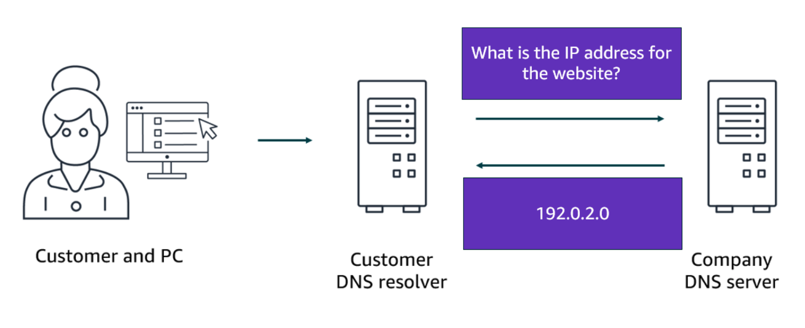
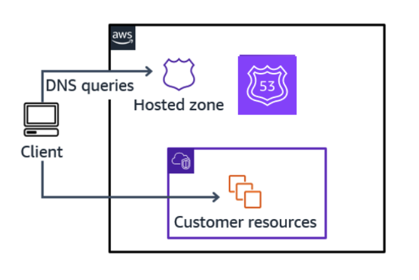
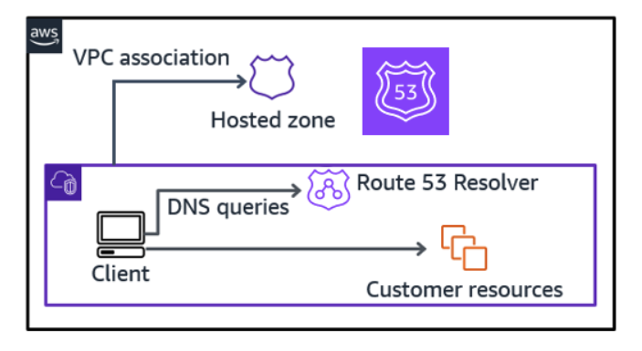
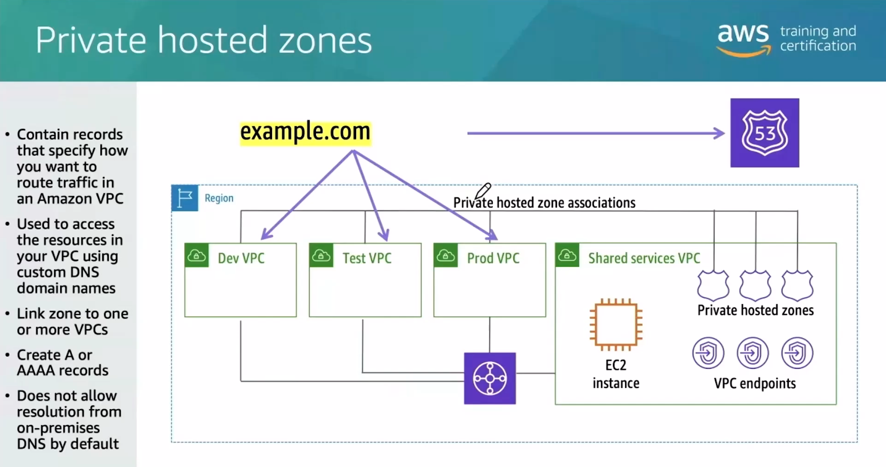
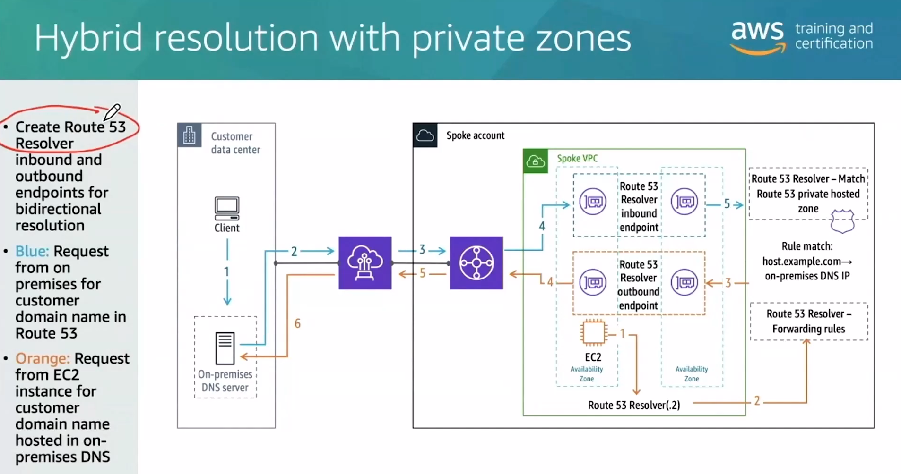
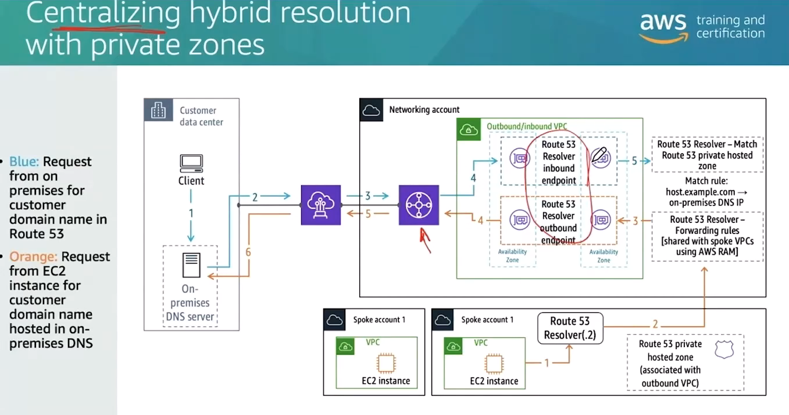
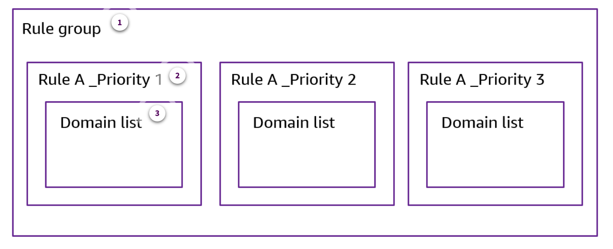
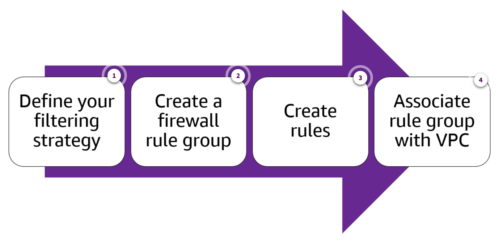

# Week 4: Networking 3 Part 2: Filtering DNS Traffic Using Amazon Route 53 Resolver DNS Firewall

* back to AWS Cloud Institute repo's root [aci.md](../aci.md)
* back to [AWS Cloud Fundamentals 2](./aws-cloud-fundamentals-2.md)
* back to repo's main [README.md](../../../README.md)

## Amazon Route 53 Review

### DNS review

The Domain Name System (DNS) protocol is a decentralized naming system that maps human-readable domain names to IP addresses, enabling the seamless routing of internet traffic.

Suppose that a company has a website hosted in the Amazon Web Services (AWS) Cloud. Users enter the web address into their browser, and they are able to access the website. This happens because of DNS resolution. DNS resolution involves a customer DNS resolver communicating with a company DNS server. You can think of DNS as being the phone book of the internet. DNS resolution is the process of translating a domain name to an IP address.

1. When you enter the domain name into your browser, a DNS query is sent to a customer DNS resolver.
2. The customer DNS resolver asks the company DNS server for the IP address that corresponds to the website.
3. The company DNS server sends a DNS response with the IP address for the AnyCompany Robots website, 192.0.2.0.

### Amazon Route 53

Route 53 is an AWS service that provides DNS functionality. Route 53 was designed to give developers a reliable and cost-effective way to route users to internet applications. Route 53 is the service that you use for failover routing when Regions go down.

1. **Resolves domain names to IP addresses**

    Route 53 translates names like example.com into the numeric IP addresses that computers use to connect to each other.

2. **Registers or transfers a domain name**

    With Route 53, you can purchase and manage domain names, such as example.com, and automatically configure DNS settings for your domains.

3. **Routes requests based on latency, health checks, and other criteria**

    Route 53 effectively connects user requests to infrastructure running in AWS, such as Amazon Elastic Compute Cloud (Amazon EC2) instances, Elastic Load Balancing (ELB) load balancers, or Amazon Simple Storage Service (Amazon S3) buckets. You can also use it to route users to infrastructure outside of AWS.

---

#### DNS hostnames

Based on the DNS hostname setting, any Amazon EC2 instance in a virtual private cloud (VPC) can be assigned two DNS names. One is internal, which means that it resolves to the private IP address of your instance. The other is an external DNS name resolving to a public IP address. (This is assuming that your instance is configured to receive a public IP address). These resolutions are handled by the Route 53 service, so you don't have to set up or manage a DNS server.

---

### Route 53 public and private DNS review

You can use the private or public DNS hostnames provided by AWS to reference your resources. However, these are not particularly user friendly. Additionally, many organizations want to use their own domain names, whether that is for internal use or for internet-facing resources. In this case, you can use hosted zones to associate custom domain names to your VPCs. There are two types of hosted zones: public hosted zones and private hosted zones.

#### Public hosted zone

If you need be able to allow traffic from the internet to find your AWS resources, but you do not want to manage your own DNS, you can use a public hosted zone.

A public hosted zone is a container that holds information about how you want to route traffic on the internet for a specific domain, such as example.com, and its subdomains, such as acme.example.com.

#### Private hosted zone

If you need to use DNS names within your various VPCs to refer to resources (but these DNS names will not be reachable from the internet), you can use a private hosted zone.

A private hosted zone is a container that holds information about how you want Route 53 to respond to DNS queries for a domain and its subdomains within one or more VPCs that you create with the Amazon Virtual Private Cloud (Amazon VPC) service. If you need to use DNS names within your various VPCs to refer to resources (but these DNS names will not be reachable from the internet), you can use a private hosted zone.

---

## Route 53 Resolver DNS Firewall Overview

### Route 53 Resolver

Route 53 Resolver is a Route 53 feature that facilitates recursive DNS lookups for names hosted on EC2 instances, as well as for public names accessible on the internet. The functionality of the Route 53 Resolver is automatically available in all your VPCs. For hybrid cloud scenarios, you can configure Route 53 Resolver to enable DNS resolution across AWS Direct Connect and AWS VPN.

#### Private hosted zones

* A private hosted zone is a new zone inside Route 53 that has a namespace that's different than what is automatically assigned onto AWS resources.
* Once a private zone is created,then you link it to one or more VPCs.
* By default, every VPC has .2 address assigned to the resolver.
* By default, DNS resolver does not allow resolution from on-prem DNS.

#### Hybrid resolution with private zones

* Route 53 Resolver is an extension of the Route 53 service that allows us to set up components that will allow for this hybrid resolution.
* To make the resolution with the internal resolver possible, the Resolver inbound and outbound endpoint can be configured.
* For the resolution from inside AWS, a forwarding rule to point to the outbound endpoint is used.

#### Centralized Hybrid resolution with private zones

* A Transit Gateway with the VPC attached allows to share a single pair of inbound/outbound endpoints in a central VPC with other VPCs connected through the Transit Gateway.

---

### Route 53 Resolver DNS Firewall

Route 53 Resolver DNS Firewall is a feature that allows you to deploy DNS protections across your VPCs. The Route 53 Resolver DNS Firewall allows you to block queries made for known malicious domains and to allow queries for trusted domains when using the Route 53 Resolver.

The Route 53 Resolver DNS Firewall feature allows you to define domain name filtering rules in rule groups, which you can then associate with your VPCs. These rule groups contain a collection of DNS Firewall rules that specify which domains to allow or block. And you can also customize the responses for the blocked DNS queries. Additionally, you can fine-tune the domain lists to allow certain query types to pass through.

---

#### DNS exfiltration attacks

A primary use of Route 53 Resolver DNS Firewall is to prevent DNS exfiltration of your data. DNS exfiltration involves an unauthorized user compromising a VPC and then using DNS lookups to route data from the VPC to a domain that they control.

---

### Components of Route 53 Resolver DNS Firewall

1. **Rule group**

    The rule group is a collection of rules that you can use to filter DNS queries. You can populate the rule group with rules and then associate the rule group with one or more VPCs. Whenever the Resolver receives a DNS query for a VPC that has a rule group associated with it, it passes the query to the DNS Firewall for filtering.

2. **Rule**

    The DNS Firewall rule is a filtering rule that specifies a domain list and an action to take on DNS queries whose domains match the specifications in that list. You can choose to allow, block, or alert on matching queries, or even specify custom responses for blocked queries. Each rule in a rule group has a unique priority setting, and the DNS Firewall will process the rules in the rule group from the lowest numeric priority setting to the highest.

3. **Domain list**

    A domain list specifies a domain for use in DNS filtering.

---

#### Priority setting in rule groups

If you associate multiple rule groups with a single VPC, you can set the processing order for those rule groups using a priority setting. The Route 53 Resolver DNS Firewall will process the rule groups in the VPC from the lowest numeric priority setting to the highest.

---

### Using Route 53 Resolver DNS Firewall

The following interaction provides a high-level overview of the steps required to start using Route 53 Resolver DNS Firewall.

1. **Define your filtering strategy**

    The first step in setting up the Route 53 Resolver DNS Firewall is to define your filtering approach and your domain lists. You will need to decide whether you want to allow or block specific domains, and then create lists of those domains. This will serve as the foundation for your firewall rules.

2. **Create a firewall rule group**

    Next, you will need to create a firewall rule group. This group will contain the rules that you have defined for your filtering approach.

3. **Create rules**

    After creating the rule group, you will need to add and configure your rules. Within each rule, you will need to set a priority, so that they process in the intended order within the rule group.

4. **Associate rule group with VPC**

    Associate your DNS Firewall rule group with your VPC. If you are using several rule groups for a VPC, set a priority so each rule group is processed in the intended order.

---

### Knowledge Check

#### Which resource does Amazon Route 53 Resolver DNS Firewall regulate outbound traffic to?

* Virtual private clouds (VPCs)

Wrong answers:

* Amazon S3 buckets
* Amazon CloudFront distributions
* AWS Direct Connect connections

##### Explanation

**Route 53 Resolver DNS Firewall allows you to deploy DNS protections across your VPCs.**

The remaining answers are incorrect.

#### What is a key purpose of the Amazon Route 53 Resolver DNS Firewall?

* Protecting against distributed denial of service (DDoS) attacks targeting your DNS infrastructure.

Wrong answers:

* Providing DNS-based content filtering for your internal users.
* Configuring failover mechanisms for your primary DNS servers.
* Enabling geo-based routing for your web applications.

##### Explanation

**Route 53 Resolver DNS Firewall protects against DDoS attacks targeting your DNS infrastructure by allowing you to block DNS queries that match specific criteria.**

Although Route 53 Resolver DNS Firewall can be used to filter DNS queries, its primary purpose is not to provide DNS-based content filtering for internal users. Route 53 Resolver DNS Firewall does not have the primary function of configuring failover mechanisms for your primary DNS servers. Route 53 Resolver DNS Firewall is not used for enabling geo-based routing for web applications.

#### Which component allows a cloud application developer to choose to allow, block, or alert specific DNS queries?

* Rule

Wrong answers:

* Rule group
* Domain list
* Hosted zone

##### Explanation

**Use rules to allow, block, or alert on matching queries, or even specify custom responses for blocked queries.**

A rule group is a collection of rules that you can use to filter DNS queries. A domain list specifies a domain for use in DNS filtering. Use hosted zones to associate custom domain names to your virtual private clouds (VPCs).

---

### Summary

#### Route 53 Resolver

Route 53 Resolver is a Route 53 feature that facilitates recursive DNS lookups for names hosted on EC2 instances, as well as for public names accessible on the internet. The functionality of the Route 53 Resolver is automatically available in all your VPCs. For hybrid cloud scenarios, you can configure Route 53 Resolver to enable DNS resolution across AWS Direct Connect and AWS VPN.

#### Route 53 Resolver DNS Firewall

Route 53 Resolver DNS Firewall is a feature that allows you to deploy DNS protections across your VPCs. Route 53 Resolver DNS Firewall allows you to block queries made for known malicious domains and to allow queries for trusted domains when using the Route 53 Resolver.

The following is a review of the components of Route 53 Resolver DNS Firewall:

* The rule group is a collection of rules that you can use to filter DNS queries. You can populate the rule group with rules and then associate the rule group with one or more VPCs.
* The Route 53 Resolver DNS Firewall rule is a filtering rule that specifies a domain list and an action to take on DNS queries whose domains match the specifications in that list.
* A domain list specifies a domain for use in DNS filtering.

#### Using Route 53 Resolver DNS Firewall

The following is a review of the steps required to start using Route 53 Resolver DNS Firewall:

* Define your filtering strategy.
* Create a firewall rule group.
* Create rules.
* Associate the firewall rule group with your VPC.

---
