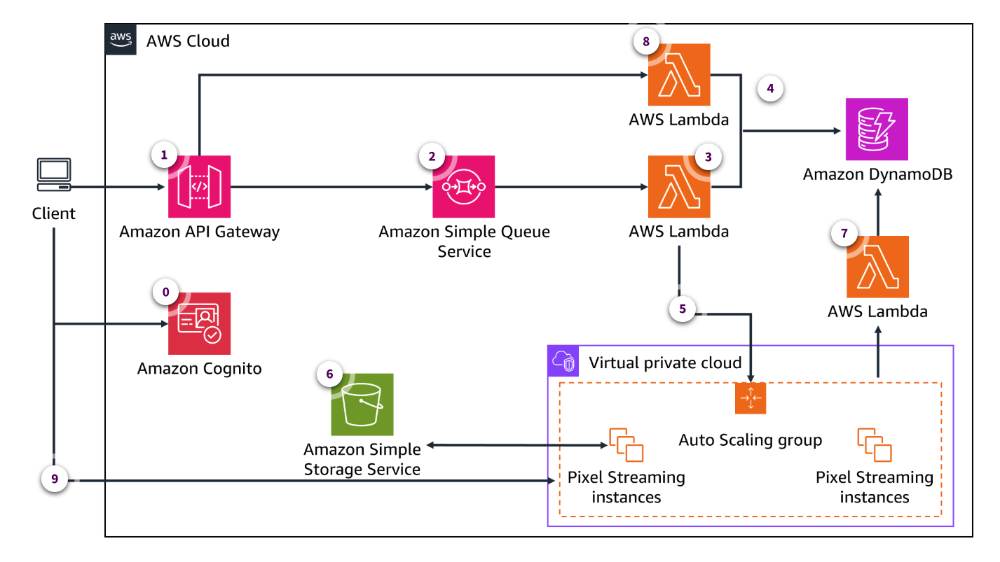
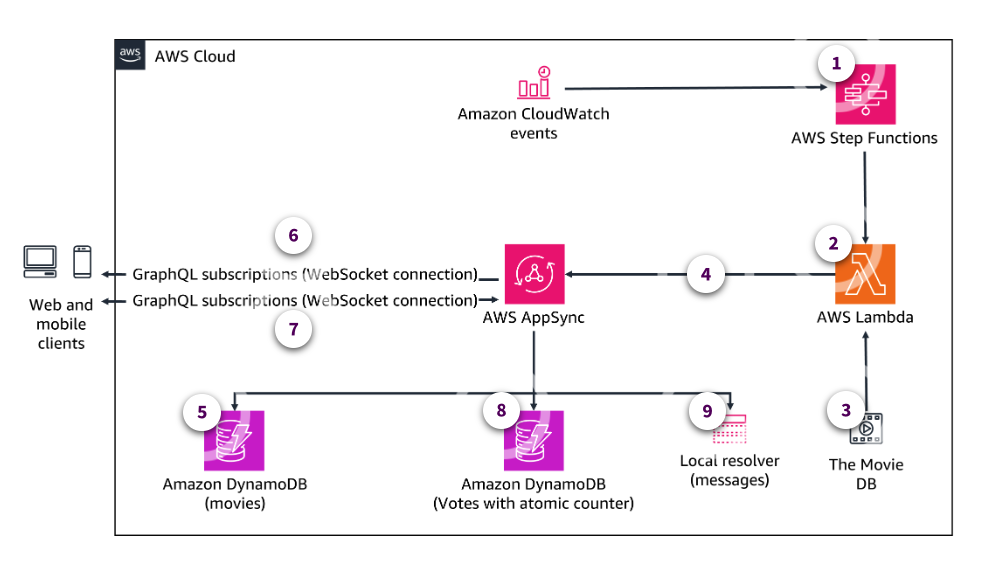
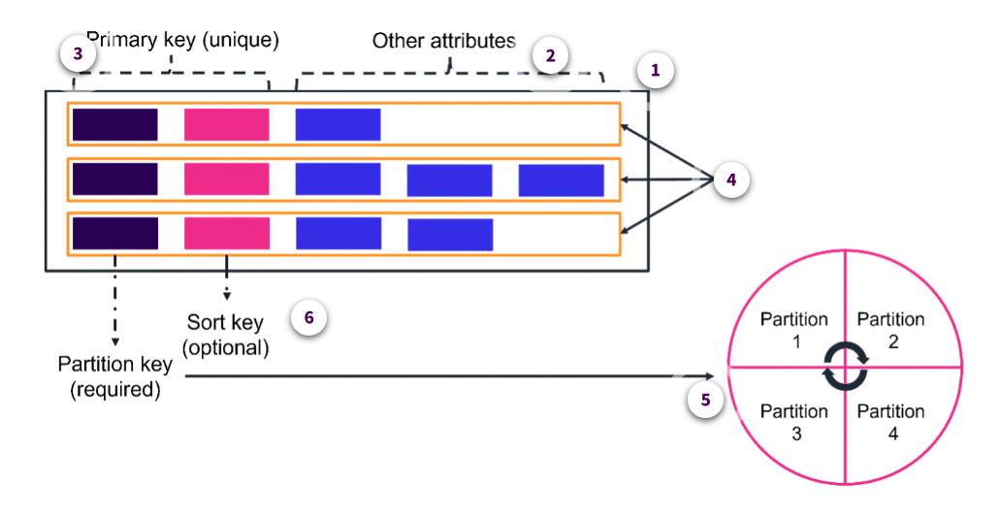
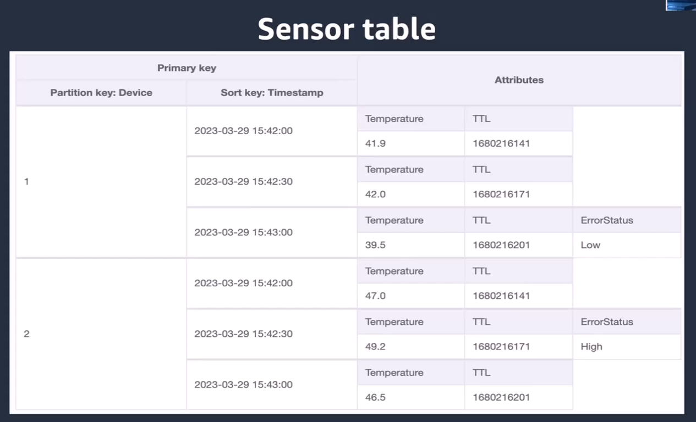
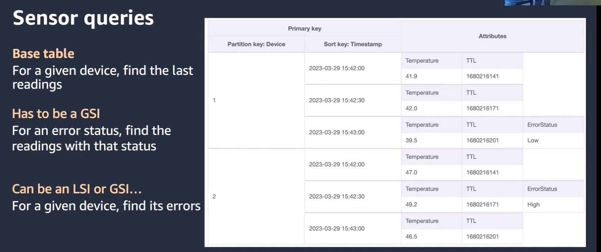
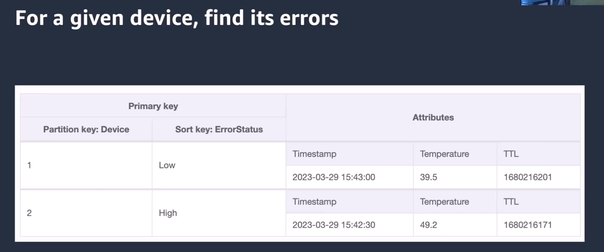
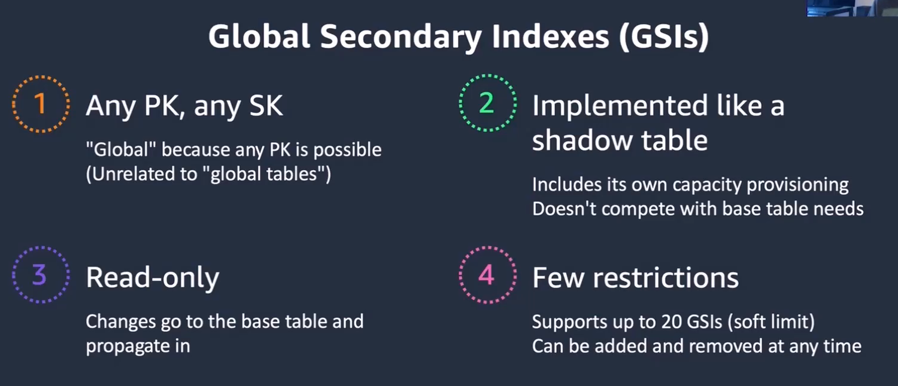
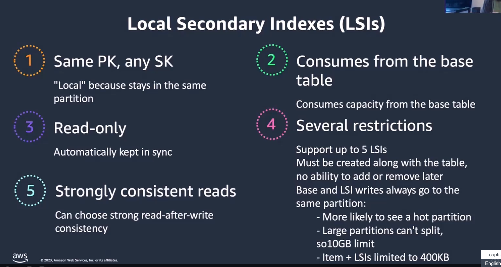
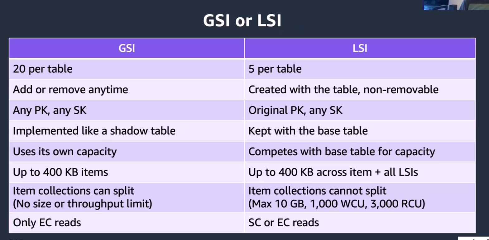

# Week 5: Databases and Caching Part 1: Developing Modern Applications Using DynamoDB

* back to AWS Cloud Institute repo's root [aci.md](../aci.md)
* back to [AWS Cloud Fundamentals 2](./aws-cloud-fundamentals-2.md)
* back to repo's main [README.md](../../../README.md)

## Introduction

### Database types

* Relational database
* Document database
* Key-value database
* Graph database

### Amazon DynamoDB

* Fully-managed
* Serverless
* NoSQL
* Key-value

#### Amazon DynamoDB key components

* Keys
* Indexes

#### Optimizing DynamoDB databases

* Capacity modes
* Read and write capacity units
* Auto scaling

### Amazon DynamoDB Streams

* Track and response to changes with a DynamoDB table

### Caching options to improve performance of a DynamoDB

* Amazon DynamoDB Accelerator (DAX)
* Amazon ElastiCache
* Amazon CloudFront Caching

### DynamoDB use case

* Massively multiplayer online (MMO) game.
* Robust and scalable friend management system.
* Provisioned capacity, auto scaling, and DynamoDB Time to Live (TTL) features.
* Amazon DynamoDB Accelerator (DAX) and Amazon ElastiCache for Redis clusters.
* Embracing the global reach of Amazon CloudFront.

---

## Understanding purpose-built databases

### Glossary

1. **Throughput**. Throughput is the amount of data processed by a database at a given time.
2. **Caching**. A database cache can be used for both SQL and NoSQL databases. A cache supplements your primary database by removing unnecessary pressure on it, typically in the form of frequently accessed read data. The cache itself can live in a number of areas including your database, application, or as a standalone layer.

### Trends in Data Generation and Consumption

The rapidly evolving landscape of data modernization has emerged as a central pillar in harnessing the full potential of artificial intelligence and machine learning (AI/ML). Data modernization transcends traditional barriers by optimizing the storage, management, and processing of data.

* By the year 2025, we will reach 175 zettabytes (trillion gigabytes) of data worldwide.

#### Trends leading to the data generation growth

1. Since 2005, the number of people using the internet has quadrupled to 4 billion.
2. The rise of smart devices and the internet of things like virtual assistance and smart appliances in our homes.

    There are now over 20 billion connected devices worldwide, which are continually increasing the volume of data being transmitted over networks.

3. Businesses relying on big data analytics more than ever before to gain insights, predict trends, boost efficiency, and make more informed decisions.

    Retailers are tracking every click and purchase. Manufacturers are outfitting products with sensors to monitor performance, and publishers and ad tech companies are analyzing household data to deliver tailored ad experiences and content.

4. Videostreaming, which now accounts for over 80% of internet traffic.

    Data velocity is also increasing as 5G networks are enabling higher bandwidth and faster speeds to power data heavy experiences. As data generation and consumption accelerate, managing and deriving value from all of this information will continue to be a priority for both businesses and individuals.

To succeed, companies need to build specialized databases to handle increases in data velocity, variation, and volume. By leveraging analytics, tools and services, companies can capture, analyze, and apply the insights that are generated by this unprecedented amount of data worldwide.

---

## Characteristics and Use Cases of Purpose-Built Databases

### What is a purpose-built database?

Purpose-built database models are designed from the ground up to perform specific functions that applications require—quickly and efficiently. Today's developers need diverse data models that match a variety of use cases.

---

Many purpose-built databases are nonrelational, or NoSQL, databases. Nonrelational and NoSQL are interchangeable terms. Throughout this module, you will see these databases called NoSQL databases.

---

### Characteristics of purpose-built databases

#### Flexibility

Although purpose-built databases are designed to handle specific types of data, they often provide flexible data models that can be adapted to changing data needs. Developers can easily modify the database schema to accommodate new data types or changes in the data structure. 

Depending on the needs of an application, a purpose-built database can support a wide range of data models, such as documents and graphs. With this flexibility, teams can store and manipulate data according to its structure rather than having to conform to a rigid schema like in relational databases. 

Purpose-built databases also provide flexible deployment models. They are often built on scalable, distributed architectures, which makes them adaptable to the changing needs of an application. For instance, they can support deployments originating in the cloud to easily scale up or down based on demand. They might also provide multi-Region replication for high availability.

#### Scalability

Purpose-built databases, especially those built for distributed architectures, provide a high-level of data consistency across the network. This is especially important for applications that require a global user base and need to ensure that the user experience is not degraded regardless of the user's location. This distributed architecture also provides the ability to process with **high-throughput** and **low-latency**. Both of these are critical for real-time applications such as financial trading and autonomous vehicles.

Many purpose-built databases support sharding. Database sharding overcomes the limitations of having a single machine, or database server, storing and processing all of the data. When databases are sharded, data is split into smaller chunks and stored across several database servers. This allows for horizontal scaling and helps the database handle high volumes of data and user requests. Because purpose-built databases tend to have looser schemas, it is easier to shard their data.

#### High performance

Many purpose-built databases, especially in the NoSQL space, incorporate **caching** at the database level. This minimizes response time by storing frequently accessed data in memory and helps to improve the performance of applications that require fast data retrieval. You will learn more about the various ways to cache data later in this module.

Many purpose-built databases store data in solid state drives (SSDs) and use in-memory techniques. This can achieve very high speeds. SSDs are faster than traditional rotating disc hard drives. In-memory databases store data in memory, closer to the CPU, which makes data access extremely fast.

---

## Comparing NoSQL and SQL Databases

Amazon Relational Database Service (Amazon RDS), a relational database management system (RDBMS) and SQL, and other NoSQL databases have many similarities, but also many things that are different.

NoSQL is a term used to describe NoSQL database systems that are highly available, scalable, and optimized for high performance. Instead of the relational model, NoSQL databases use alternate models for data management, such as key-value pairs or document storage.

### Optimal workloads for NoSQL and SQL databases

#### NoSQL databases

NoSQL databases are good for unstructured data workloads such as scalable web applications, including social networks, gaming, and media sharing as well as Internet of Things (IoT) devices.

#### SQL databases

SQL databases are good for one-time queries, data warehousing, and online analytic processing (OLAP) analyses.

---

### Language support

With NoSQL databases, the language used is highly variable and depends on the database type. Because of this, databases often lack cross compatibility between different NoSQL database systems.

SQL databases, as the name suggests, use structured query language, which is universal across all relational databases.

---

### Data models and schemas

| NoSQL databases | SQL databases |
| ------------------------------ | ------------------------------ |
| NoSQL databases have schemaless data models where every table must have a primary key to uniquely identify each data item, but there are no similar constraints on other non-key attributes. Because there isn't an upfront schema design, their data types are dynamic. This means data consistency is highly database system dependent. Additionally, transaction consistency is more relaxed for availability and partition tolerance. | SQL databases require well-defined schemas that are designed at the start of database creation. Data is normalized into tables, rows, and columns. In addition, all of the relationships are defined among tables, columns, indexes, and other database elements. Because of the upfront design, making any changes to a database schema is difficult. This strict upfront design means SQL databases are able to maintain strong data consistency by enforcing ACID compliance. |

---

### Accessing and querying data

#### NoSQL databases

Accessing and querying are dependent on the type of database used. The following are database examples:

* **Key-value stores**: Data is accessed by a unique key, like a dictionary. Querying is done by key lookup, similar to GET requests. Examples: Redis and Riak.
* **Document databases**: Data is stored in document formats like JSON. Documents are accessed by unique IDs. Querying is done using document properties, nested documents, or indexes. Examples: MongoDB and CouchDB.
* **Wide column stores**: Data is stored in tables with rows and dynamic columns. Rows are accessed by primary keys. Columns are grouped into column families. Querying uses primary keys, column ranges, and secondary indexes. Examples: Cassandra and HBase.  
* **Graph databases**: Data is stored as nodes connected by edges or relationships. Nodes are accessed by unique IDs. Querying traverses relationships between nodes using graph traversal languages. Examples: Neo4j and Amazon Neptune.

#### SQL databases

SQL is the standard for storing and retrieving data. Relational databases offer a rich set of tools for simplifying the development of database-driven applications, but all of these tools use SQL. With SQL, users can create powerful queries and use data joiners. Because of this, SQL databases are well-adapted for the complex querying required in many relational operations.

---

### Performance

NoSQL databases are optimized for compute, so performance is mainly a function of the underlying hardware and network latency.

SQL databases are optimized for storage, so performance generally depends on the disk subsystem. Developers and database administrators must optimize queries, indexes, and table structures to achieve peak performance.

### Replication

Most NoSQL databases have built in capabilities for replication and can be set up for easy data failover and disaster recovery.

Conversely, replication is difficult to implement and manage in SQL databases. It requires third-party tool sets and identical schemas in all instances of the database.

### Scaling

NoSQL databases are designed to easily scale out using distributed clusters of hardware. This design allows increased throughput without increased latency. You specify the throughput requirements, and DynamoDB allocates sufficient resources to meet those requirements. There are no upper limits on the number of items per table or the total size of that table.

For SQL databases, it is easiest to scale up with faster hardware. It is also possible for database tables to span across multiple hosts in a distributed system, but this requires additional investment. SQL databases have maximum sizes for the number and size of files, which imposes upper limits on scalability.

---

### Trade-offs

#### NoSQL databases

* Use self-managed clusters to handle large scale data and to improve availability
* Prioritize scalability over strict consistency
* Can perform limited complex relational operations because of overall design

#### SQL databases

* Squeeze the most out of the hardware
* Require trade-offs between consistency and availability
* Perform slower as data increases in size

---

### Summarizing the differences

#### Traditional databases

Traditional database architectures are commonly found in enterprise applications with a single stack of services and a relational database engine. These applications support hundreds to thousands of users with performance measured in seconds and request rates in the tens of thousands. These architectures typically use relational databases like MySQL and Oracle with rigid schemas and indexes that must be predefined. Because of this, they are well-suited for transactional workloads like OLTP.

These databases excel at consistency, integrity, and ACID. Vertical scaling is achieved by increasing resources on a single server. Horizontal scaling, however, is challenging. It is accomplished through sharding, where a horizontal partition stores a large database across multiple machines. This is difficult with traditional, relational database architectures for the following reasons:

* **ACID compliance**: Atomicity requires a coordinated rollback across nodes if part of a transaction fails. Consistency requires coordinated validation across nodes after each transaction. Isolation requires concurrency to make transactions appear sequential. This can have a significant effect on overall database performance. Durability requires that each node confirms it has saved its portion of a transaction despite failures.
* **Distributed joins**: Relational databases are great at performing complex joins when data is located on a single node. However, distributing data across multiple nodes makes join operations more complicated. A simple join between two sharded tables now requires retrieving and merging relevant data from multiple nodes, which causes increased network traffic and slower performance.
* **Data consistency**: In a sharded database, each shard must not only be accurate with itself, but also all other shards. Ensuring data is constantly synchronized means some combination of trading consistency for performance and adding complexity to the architecture through data consensus algorithms.

#### Purpose-built databases

Cloud applications typically use purpose-built databases because of their diverse and unique needs. Think of Amazon Prime and travel sites as examples. These applications can have millions of users in a matter of hours. They require response times in milliseconds to microseconds, and their user base is global. These databases use a range of database types such as MongoDB, Cassandra, Redis, and Elasticsearch.

NoSQL database query languages are varied and specific to the data model used. Their schemas can evolve organically as needs change. Additionally, these databases need to be able to scale both up and out because they handle data volumes ranging from terabytes (TB) to petabytes (PB), and even exabytes (EB). These databases accommodate flexible schemas and dynamic indexing to handle variability in unstructured data. They excel at analytical workloads like OLAP and prioritize availability and horizontal scaling.

---

Traditional databases aim for versatility, whereas purpose-built databases optimize for specific data models and workload patterns.

---

## DynamoDB

Serverless computing

A serverless architecture is a way to build and run applications and services without having to manage infrastructure. Your application still runs on servers, but all the server management is done by AWS. You no longer have to provision, scale, and maintain servers to run your applications, databases, and storage systems.

Serverless computing is like having a really helpful team of IT experts taking care of your applications. They set up, manage, and maintain the servers behind your applications, so you can focus on building and deploying awesome stuff without any management tasks.

With serverless computing, you do not have to worry about managing different types of servers or dealing with infrastructure management. AWS handles all of that for you. They cover tasks such as the following:

* Installing and updating the operating system
* Applying security patches
* Monitoring performance
* Managing storage and capacity

In this model, you can focus on making great applications without having to worry about the technical details. Plus, it's cost-effective, efficient, and scalable, so you can keep your costs under control and deliver a fantastic user experience.

---

### Amazon DynamoDB

AWS created DynamoDB to provide a NoSQL database service with all the advantages of the cloud. The service is fully managed. You get availability, durability, and scalability built in, and you do not have to manage any servers.

DynamoDB is accessed using the AWS Management Console, command line tools, or in your application code through the software development kit. The service provides security controls and metrics for monitoring, and it is easy to integrate with the rest of the AWS services. DynamoDB is available in AWS Regions around the world, so you can place your data and services close to your users.

* **Designed for OLTP**

    DynamoDB is a good fit for interactive applications that require live operations, such as social media platforms or online storefronts. It excels at handling hot, or active, data and smaller objects and situations where immediate data storing and quick retrieval are necessary. DynamoDB offers consistent low latency for these scenarios.

* **DynamoDB and other AWS databases**

    With Amazon RDS, you can use a number of relational database engines in the AWS Cloud for querying with SQL. DynamoDB is the serverless NoSQL equivalent for OLTP-type loads. Amazon Redshift, Amazon Neptune, and ElastiCache are NoSQL services for complex analytical needs, graph use cases, and in-memory NoSQL data stores. You can use Amazon S3 as a serverless database and Amazon Athena to make serverless SQL queries against structured data in your S3 bucket.

---

### Performance and scalability

#### 1. Data models

DynamoDB is a NoSQL database that supports two data models: key-value and document. NoSQL databases are flexible—the schema doesn't need to be predefined like in relational databases. This flexibility allows DynamoDB to easily adapt as business needs change without having to redefine the table schema.

Each item (or record) in DynamoDB can have many different attributes (or fields). So the data structure is flexible, unlike relational databases that require a fixed schema where each record has the same fields. The flexible schema is a key benefit of NoSQL databases like DynamoDB. It makes it easy to store different types of data and add or remove attributes as needed without altering the table design.

**How this helps AnyCompany Video Games:** The ability to create custom data models tailored to the specific needs of their video games helps optimize data access and query patterns, which leads to improved performance.

#### 2. Serverless that scales to zero downtime

DynamoDB provides simple storage and tracking of data. You don't need to manage servers or install or update any software, and you can forget about maintenance. You will have complete peace of mind because you know there will be zero downtime for maintenance, and you will be charged only when you use the resources.

**How this helps AnyCompany Video Games:** With a serverless architecture, AnyCompany Video Games does not have to spend development time maintaining servers. This helps save them money.

#### 3. ACID transactions

DynamoDB is a database built for critical business workloads. It supports ACID transactions, which allow developers to make coordinated changes to multiple data items across tables. DynamoDB now supports up to 100 actions in one transaction. This improves developer productivity when making complex, interrelated changes to data. With transaction support, developers can use DynamoDB for more mission-critical applications that require reliable transactions. The performance, scalability, and enterprise-readiness of DynamoDB can now benefit a wider range of important business workloads.

**How this helps AnyCompany Video Games:** The DynamoDB ACID transactions ensure AnyCompany Video Games' data integrity and consistency. This is crucial for video games, where gameplay data, player interactions, and in-game purchases need to be reliably recorded and updated.

#### 4. Active-active replication with global tables

With DynamoDB global tables, you can actively replicate your data across multiple AWS Regions. This provides 99.999 percent availability. You can read and write to any replica, so globally distributed applications can access data locally in selected Regions for fast, millisecond-level performance.

Global tables also automatically scale capacity to handle workloads across Regions. They improve multi-Region resilience for your applications and should be considered part of your organization's business continuity strategy.

**How this helps AnyCompany Video Games:** By replicating data across multiple AWS Regions, global tables can provide low-latency access to messaging data for players located in different parts of the world. This is crucial for chatting communication in video games, where low latency is essential for a seamless user experience.

#### 5. Amazon DynamoDB Streams as part of an event-driven architecture

DynamoDB can capture data changes in a table in near real-time. This feature, known as DynamoDB Streams, records every modification to the data, such as creating, updating, or deleting items, in a sequential log. Each change is then stored for a 24-hour period. You can use this information in event-driven architectures and to monitor data changes over time. Amazon Kinesis Data Streams can be used instead of DynamoDB Streams if you need longer storage.

**How this helps AnyCompany Video Games:** This event-driven architecture can be used to power real-time features, such as leaderboards, notifications, and game analytics, without the need to constantly poll the database.

#### 6. Secondary indexes

Like other database systems, you first create a DynamoDB table, which is a collection of items. Each item in the DynamoDB table has its own primary key for identification. Many applications can benefit from having secondary keys in addition to the primary key. Use the secondary keys to efficiently search for data based on attributes other than the primary key.

DynamoDB offers global and local secondary indexes. With global secondary indexes, also called sparse indexes, you query the data in a table using an alternate key instead of the primary key. Global secondary indexes provide flexibility in how you access data. You can provision global secondary indexes with lower write throughput than the table for excellent performance at a lower cost.

**How this helps AnyCompany Video Games:** This feature is particularly useful for their video games where players need to access data using different criteria, such as player rankings, in-game achievements, or item properties.

---

### DynamoDB functionality

#### Tables

Similar to other database systems, DynamoDB stores data in tables. You can manage your tables using a few basic operation.

#### Indexes

DynamoDB provides fast access to items in a table by specifying primary key values. However, many applications might benefit from having one or more secondary or alternate keys available so they can efficiently access data with attributes other than the primary key. To address this, you can create one or more secondary indexes on a table and issue Query or Scan requests against these indexes.

A secondary index is a data structure that contains a subset of attributes from a table along with an alternate key to support Query operations. You can retrieve data from the index using a Query in much the same way as you use Query with a table. A table can have multiple secondary indexes, which give your applications access to many different query patterns. DynamoDB has two types of secondary indexes.

* **Global secondary index**: This is an index with a partition key and a sort key that can be different from those on the base table. A global secondary index is considered global because queries on the index can span all of the data in the base table, across all partitions. A global secondary index is stored in its own partition space away from the base table and scales separately from the base table.
* **Local secondary index**: This is an index that has the same partition key as the base table, but a different sort key. A local secondary index is local in the sense that every partition of a local secondary index is scoped to a base table partition that has the same partition key value.

#### Transactions

DynamoDB transactions are optional operations that streamline the developer experience of making coordinated, all-or-nothing changes to multiple items both within and across tables. Transactions provide ACID compliance in DynamoDB, which helps you maintain data correctness in your applications. There is a tradeoff. Transaction operations will consume more resources because of reasons such as the following:

* **Coordination overhead**: Transactions involve coordinating reads and writes across multiple items while maintaining ACID properties. This coordination requires more processing and communication between the components managing the transaction.
* **Repeated reads**: To detect conflicts, transactions often have to re-read items multiple times during the transaction to ensure they have not changed.
* **Isolation overhead**: Transactions provide isolation from other transactions through locking. This requires more memory or storage for tracking the lock state.
* **Conflict handling**: When conflicts occur, transaction systems have to do extra work to abort and potentially retry transactions. This extra work adds overhead.
* **Usage patterns**: Transactions are often used for more complex, resource intensive patterns like complex updates across items compared to simple point reads/writes.

#### On-demand backup and restores

You can use the DynamoDB on-demand backup capability to create full backups of your tables for long-term retention and archiving for regulatory compliance needs. You can back up and restore your table data anytime with a single click on the AWS Management Console or with a single API call. Backup and restore actions run with no impact on table performance or availability.

There are two options available for creating and managing DynamoDB on-demand backups.

##### 1. AWS Backup service

    AWS Backup uses distributed technology to create backups in seconds, regardless of table size. AWS Backup integrates with DynamoDB, so users can copy on-demand backups across accounts and Regions, add cost allocation tags, and transition backups to cold storage. 

    These backups are cataloged, discoverable, and retained until deleted. AWS Backup enables users to configure backup policies and monitor activity for AWS resources and on-premises workloads from a single location.

##### 2. DynamoDB

    DynamoDB on-demand backups are available at no additional cost beyond the normal pricing that's associated with backup storage size. DynamoDB on-demand backups cannot be copied to a different account or Region.

---

You must opt in to AWS Backup. Opt-in choices apply to the specific account and AWS Region, so you might have to opt in to multiple Regions using the same account.

---

#### Point-in-time recovery

Point-in-time recovery helps protect DynamoDB tables from accidental write or delete operations. With point-in-time recovery, you don't have to worry about creating, maintaining, or scheduling on-demand backups. For example, suppose a test script writes accidentally to a production DynamoDB table. With point-in-time recovery, you can restore that table to any point in time during the last 35 days. After you enable point-in-time recovery, you can restore to any point in time from five minutes before the current time until 35 days ago. DynamoDB maintains incremental backups of your table. In addition, point-in-time operations don't affect performance or API latencies.

#### DynamoDB Accelerator (DAX)

DynamoDB is designed for scale and performance. In most cases, the DynamoDB response times can be measured in single-digit milliseconds. However, there are certain use cases that require response times in microseconds. For these use cases, DynamoDB Accelerator (DAX) delivers even faster (up to 10x) response times for accessing eventually consistent data. You will learn more about DAX later in this module

##### DAX clusters use cases

* **Player relationship tracking**

    A DAX cluster can be used to store and manage the complex relationships between players in a video game. This includes tracking friend connections, group memberships, chat histories, and other social activities. With the distributed nature of a DAX cluster, you can efficiently store and retrieve data, even at scale.

* **Notifications**

    A DAX cluster can handle the high volume of data reads required for a large player base. It can efficiently retrieve data to provide updates and alerts to players to ensure that they stay informed about their friendships and social activities within the game.

* **Resiliency and availability of friendship management system**

    A DAX cluster, with its distributed architecture, can provide high availability and fault tolerance for the friendship management system. This ensures that players can consistently access and manage their social connections, even in the event of hardware or software failures.

---

#### DynamoDB consistency model

Imagine a database consistency model as a set of rules that determine how and when the data you write is visible to other users when they come to read it. With DynamoDB, you can decide how consistent you want your reads to be. You can choose between the following two options:

* **Eventually consistent**: Your data might take a little time to reflect the latest changes made by other users. This is the default setting in DynamoDB, and it allows high read speeds. However, there might be a small delay between when you write something and when someone else sees it.
* **Strongly consistent**: Your data is always up-to-date with the latest changes made by other users. It guarantees that every read returns the most recent version of the data. However, this consistency comes at the cost of increased resource usage and slower read speeds.

#### DynamoDB architecture examples

* **Example 1**. This architecture shows a simple implementation of a gamning company's streaming feature on AWS. The architecture uses a serverless matchmaker composed of Amazon SQS, Lambda, and DynamoDB. Both the streaming instance and signaling servers are hosted in the same Amazon Elastic Compute Cloud (Amazon EC2) instance.



0. **Amazon Cognito**

    The client requests an Amazon Cognito identity and temporary AWS credentials.

1. **Amazon API Gateway**

    The client signs a request to Amazon API Gateway with the temporary credentials.

2. **Amazon SQS**

    API Gateway forwards the request to Amazon Simple Queue Service (Amazon SQS) to ensure requests are handled in order.

3. **AWS Lambda – request instance**

    Lambda checks DynamoDB for an available streaming instance. If none are available, it can then request a new instance.

4. **Amazon DynamoDB**

    DynamoDB stores required metadata such as the instance status, IP address, port number, and user reservation details.

5. **Request**

    If an instance is not available, Lambda requests that a new one be created.

6. **Amazon S3**

    Amazon S3 can be used to store static assets such as your game builds and bootstrap scripts.

7. **AWS Lambda – register instance**

    After a new instance is created, its metadata is written to DynamoDB using Lambda.

8. **AWS Lambda – poll DynamoDB**

    With a separate route in API Gateway, the client polls DynamoDB for their assigned instance.

9. **Connected**

    The client uses the IP and port returned from DynamoDB to connect to their assigned instance.

---

* **Example 2**. This architecture shows a movie voting application using AWS AppSync, Lambda, AWS Step Functions, and DynamoDB. Use backend and client facing real-time broadcasting with managed GraphQL subscriptions over WebSockets.



1. **AWS StepFunctions**

    Amazon CloudWatch events initiate a workflow in AWS Step Functions every 60 seconds.

2. **AWS Lambda**

    AWS Step Functions invokes Lambda every 10 seconds.

3. **Movie DB API**

    Lambda calls The Movie DB API to retrieve metadata for a single random movie from the most popular movies list.

4. **AWS Lambda**

    Lambda updates the Movie table, zeroes current votes, and upvotes the leaderboard in the Votes table through GraphQL mutations to AWS AppSync.

5. **AWS AppSync**

    AppSync updates the Movie table with the single current movie retrieved from Lambda.

6. **Broadcast**

    All connected clients subscribed to the backend mutation see the same current movie poster and synopsis on screen (broadcast).

7. **Voting**

    Clients vote on the current movie during a 10-second window and can send and receive chat messages in a public chatroom.

8. **Leaderboard update**

    Lambda updates the leaderboard and client’s movie votes through AppSync mutations.

9. **Local resolver**

    The public chatroom displays current messages on a pub/sub channel through Local resolver. Messages are not persisted on backend storage, only new messages are displayed.

---

### Common DynamoDB use cases

* [Financial Services](https://aws.amazon.com/blogs/database/common-financial-services-use-cases-for-amazon-dynamodb/)

    Financial services customers have mission critical use cases for payments, securities, loan origination, and other workloads that require highly available, secure, and scalable architectures. Delivering these requirements becomes challenging for application owners because of the complexity of maintaining large databases.

* [Robotics](https://aws.amazon.com/blogs/database/amazon-robotics-achieves-worldwide-scale-and-improves-engineering-efficiency-by-35-with-amazon-dynamodb/)

    Amazon Robotics designs advanced robotic solutions so the Amazon fulfillment network can meet delivery promises for millions of customers every day. AR builds critical software that controls over a half a million mobile robots used in hundreds of Amazon sites spanning North America, Europe, Asia, and Australia. With a focus on engineering efficiency, the Amazon Robotics Movement Sciences and Scheduling (MOSS) team turned to DynamoDB to store millions of real-time work requests that orchestrate mobile robot motion.

* [Friends](https://aws.amazon.com/blogs/database/amazon-robotics-achieves-worldwide-scale-and-improves-engineering-efficiency-by-35-with-amazon-dynamodb/)

    The gaming industry has evolved significantly over the past few years. A feature that has become essential to that evolution is to be friends with other players and play together in the same game. From the players’ point of view, the process to become friends is straightforward. Game developers use DynamoDB for its durability, scalability, and performance to support thousands of players.

---

### Knowledge Check

#### What does it mean for a database to have flexible schemas?

* Schemas can be changed without much effort.

Wrong answers:

* Multiple schemas can be used simultaneously.
* Schemas have predefined attribute types.
* Schemas are not used at all.

##### Explanation

The correct response is **Schemas can be changed without much effort**.

Purpose-built databases have flexible schemas that can evolve organically and do not need to conform to rigid, predefined schemas like in relational databases.

The other options are incorrect for the following reasons:

* Only one schema can be used at a time.
* Flexible schemas mean schemas do not have predefined attribute types.
* Although a flexible schema does decrease rigidity, a schema is still used.

#### How does data consistency differ between SQL and NoSQL databases?

* SQL databases provide strong data consistency, and NoSQL databases have variations in data consistency.

Wrong answers:

* SQL databases have variations in data consistency, and NoSQL databases provide strong data consistency.
* All SQL and NoSQL databases provide strong data consistency.
* Both SQL and NoSQL databases have variations in data consistency.

##### Explanation

The correct response is **SQL databases provide strong data consistency, and NoSQL databases have variations in data consistency**. In NoSQL databases, consistency is database system dependent. Transactions are more relaxed for availability and partition tolerance. SQL databases maintain strong consistency by enforcing ACID compliance.

The other options are incorrect because they do not correctly describe how data consistency varies between SQL and NoSQL databases.

#### What is a key difference between global and local secondary indexes in Amazon DynamoDB?

* A global secondary index can span all table data across all partitions, whereas a local index is limited to one partition.

Wrong answers:

* A global secondary index must have the same partition key but a different sort key than the base table, whereas a local index has the same.
* A local secondary index has a different sort key than the base table, whereas a global index has the same.
* A local secondary index is stored in a separate partition from the base table, whereas a global index is stored within the base table’s partition.

##### Explanation

The correct answer is **A global secondary index can span all table data, whereas a local index is limited to one partition**. A global secondary index is considered global because queries on the index can span all the data in the base table across all partitions.

The other choices are incorrect for the following reasons:

* A global secondary index can have a partition key and sort key that are different from the base table.
* Both local and global secondary indexes can have different sort keys than the base table.
* A global secondary index is stored in its own partition space away from the base table and scales separately from the base table. A local secondary index is called local because it is stored in the same partition as the base table.

---

### Summary

#### Data consumption

Data consumption is rapidly increasing for many reasons, the following three trends are contributors:

* More people are online and using the internet than ever before.
* The rise of smart devices and the IoT, like virtual assistants and smart appliances in our homes.
* Businesses relying on big-data analytics to gain insights, predict trends, boost efficiency, and make more informed decisions.

This increase in data creation and consumption means there is a greater need for specialized databases. These databases will help users manage and derive value in all the new data. To accomplish this, businesses must build specialized databases to handle increases in data velocity, variation, and volume.

#### Purpose-built databases

Purpose-built database models are designed from the ground up to perform the specific functions quickly and efficiently. Today's developers use diverse data models that match a variety of use cases. These databases have the following characteristics:

* **Flexibility**: Purpose-built databases offer developers tremendous flexibility in working with data. This flexibility comes from their unique ability to support non-standard data models not as rigidly required in relational databases, such as graph or document formats. With this adaptability, teams can readily modify the database schema to fit ever-shifting demands of the data without the usual painful recoding processes associated with it. By spreading across flexible deployment options, including scalable and distributed architectures, applications can successfully handle high loads and maintain data integrity even when they experience sudden upticks in usage.
* **Scalability**: Purpose-built, distributed databases facilitate high consistency over a global network of users, which is vital for applications with a big, global user base, ensuring the user experience is not sacrificed based on location. Such databases are also able to manage high-throughput and low latency, which are two critical aspects of real-time applications like financial transactions and autonomous vehicles. Sharding, a technique used by such databases, effectively splits data among multiple servers for horizontal scaling and improved handling of high data volumes and requests.
* **High performance**: Many purpose-built databases, especially in the NoSQL space, incorporate caching. Caching helps to minimize response time by storing frequently accessed data in memory, which improves the performance of applications that require fast data retrieval. Additionally, many purpose-built databases store data in SSDs and use in-memory techniques. This combination of SSDs, which are faster than traditional hard drives, and in-memory databases, which store data closer to the CPU, can achieve very high speeds and extremely fast data access.

#### NoSQL compared to SQL databases

NoSQL databases are well-suited for unstructured data workloads like web applications, social media, and IoT. They have schemaless data models and variable query languages. They are optimized for scalability and availability over strict consistency.

SQL databases are better for structured data, one-time queries, data warehousing, and OLAP. They use SQL, have predefined schemas, and are optimized for storage performance. Scaling SQL databases is more challenging than scaling NoSQL databases.

The following are the main differences between these databases:

* **Data models**: NoSQL is schemaless, and SQL has predefined schemas.
* **Language**: NoSQL has variable languages, and SQL uses universal SQL.
* **Scaling**: NoSQL scales out more easily, and SQL scales up with hardware.
* **Consistency**: NoSQL prioritizes availability over strict consistency, and SQL maintains ACID compliance.

Overall, the choice between NoSQL and SQL depends on the specific data, performance, and scalability requirements of the application.

#### Serverless computing

A serverless architecture is a way to build and run applications and services without having to manage infrastructure. Your application still runs on servers, but all the server management is done by AWS. You no longer have to provision, scale, and maintain servers to run your applications, databases, and storage systems.

#### DynamoDB

Amazon Web Services (AWS) created DynamoDB as a fully managed, NoSQL database service with built-in availability, durability, and scalability. DynamoDB can be accessed through the AWS Management Console, command line tools, or application code. It provides security controls, monitoring metrics, and easy integration with other AWS services. It is good for OLTP. DynamoDB is available globally, so users can place data and services close to their customers. 

##### Performance and scalability

The following capabilities contribute to the advantages in performance and scalability you have when using DynamoDB.

* **Data models**: DynamoDB supports two data models: key-value and document. NoSQL databases are flexible—the schema doesn't need to be predefined like in relational databases. This flexibility allows DynamoDB to easily adapt as business needs change without having to redefine the table schema.
* **Serverless that scales to zero**: DynamoDB provides simple storage and tracking of data. You don't need to manage servers or install or update software, and you can forget about maintenance. You will have confidence knowing there will be zero downtime for maintenance. You will be charged only when you use the resources.
* **ACID transactions**: DynamoDB supports ACID transactions. Developers can make coordinated changes to multiple data items across tables. With transaction support, developers can use DynamoDB for more mission-critical applications that require reliable transactions. The performance, scalability, and enterprise-readiness of DynamoDB can now benefit a wider range of important business workloads.
* **Active-active replication with global tables**: DynamoDB global tables allow you to actively replicate your data across multiple AWS Regions you choose. You can read and write to any replica, so globally distributed applications can access data locally in selected Regions for fast, millisecond-level performance. Global tables also automatically scale capacity to handle workloads across Regions. They improve multi-Region resilience for your applications and should be considered part of your organization's business continuity strategy.
* **DynamoDB Streams as part of an event-driven architecture**: DynamoDB can capture data changes in a table in near real time. This feature, known as DynamoDB Streams, records every modification to the data, such as creating, updating, or deleting items, in a sequential log. Each change is then stored for a 24-hour period, so you can use this information in event-driven architectures and to monitor data changes over time.
* **Secondary indexes**: Like other database systems, with DynamoDB you first create a table. Each item in the DynamoDB table has its own primary key for identification. Many applications can benefit from having secondary keys in addition to the primary key. You can use secondary keys to efficiently search for data based on attributes other than the primary key.

##### DynamoDB features

DynamoDB uses tables to store data, similar to how databases work in other systems. You can use several basic operations to manage these tables, which include creating, deleting, and reorganizing them. Secondary indexes can be added to the data in these tables to optimize queries for access to multiple query patterns. 

A secondary index is made up of attributes and an alternate key is used for queries and contains a subset of data from a table. Query requests can be sent to secondary indexes the same way they can be used on a table. A table can have many secondary indexes. These indexes can provide access to a wide range of query preferences separately from the table. There are two types of secondary indexes.

* **Global secondary index**: This index can have a different set of partition and sort keys from those in the original table and even across all partitions. A global secondary index is located in a separate partition space from the table and scales separately.
* **Local secondary index**: This index has the same partition and sort keys yet still provides access to a limited number of table partitions. A local secondary index is considered local.

DynamoDB transactions are optional operations that enable coordinated, all-or-nothing changes to multiple items within and across tables. This provides ACID compliance. However, transaction operations consume more resources because of factors like coordination overhead, repeated reads, isolation overhead, and conflict handling. Transactions are often used for more complex, resource-intensive patterns, like complex updates across items, rather than simple point reads/writes.

DynamoDB provides an on-demand backup capability you can use to create full backups of your tables for long-term retention and archiving without impacting table performance or availability. Backup and restore actions can be performed with a single click on the AWS Management Console or a single API call. The two backup options are AWS Backup and the DynamoDB backup feature.

Point-in-time recovery in DynamoDB was designed to assist customers in protecting their tables from accidental data changes, such as delete or write operations, through maintaining incremental table backups. With this feature, you can restore an entire table to any point in the past up to the last 35 days without having to create on-demand backups.

##### DAX

For use cases where response times need to be in the microseconds, DAX delivers up to 10 times faster response times for accessing eventually consistent data.

##### DynamoDB consistency models

A database consistency model is a set of rules that determine how and when the data you write is visible to other users when they come to read it. With DynamoDB, you can choose between the following two options:

* **Eventually consistent**: In this model, the data might still be in flux or updating, but users are designed to be able to read the data after some limited time gap, making it appear consistent. This is the default model. It provides faster read times but might have brief delays when updated.
* **Strongly consistent**: Here, the model ensures that the reads from the database will always reflect the most updated, latest versions of the data. However, as a trade-off, the read operation might take longer.

---

## DynamoDB Components

### DynamoDB Tables



1. **Table**

    Tables are the core components of DynamoDB. They contain a collection of items that have one or more attributes. Each item is uniquely identified by a primary key. These tables are schemaless, which means each item can have different attributes.

    Tables support create, read, update, and delete (CRUD) item operations in a table using the AWS SDKs or console.

2. **Attribute**

    Attributes are similar to columns in a relational database. Each attribute has a name and a value. There are three types of attributes. (1) A **scalar** type can represent exactly one value. (2) A **set** type can represent multiple scalar values. (3) A **document** type can represent a complex structure with nested attributes, such as what you would find in a JSON document.

    For more information, view the [Supported Data Types and Naming Rules in Amazon DynamoDB](https://docs.aws.amazon.com/amazondynamodb/latest/developerguide/HowItWorks.NamingRulesDataTypes.html) page.

3. **Primary key**

    A primary key is a unique attribute used to identify an item. It must be a type string, number, or binary.

4. **Item**

    An item is a collection of attributes. It is similar to rows in a relational database. Each attribute has a name, data type, and value. An item can have any number of attributes. Unlike a relational database, DynamoDB is not constrained by a pre-defined schema, so items can have different types of attributes.

5. **Partition key**

    Items in a DynamoDB table are distributed across storage units called partitions. When a table’s primary key is solely the partition key, each partition key must be unique. This key must be a scalar key, meaning it must hold a single value and be either a string, number, or binary.

6. **Sort key**

    When a table has a partition key and a sort key it is called a composite primary key. These tables can have multiple items with the same partition key value. Sort keys are used when you want to store all items with the same partition key close together and order them by a value. In these instances, each sort key must be unique. The sort key is also known as the range attribute because of the way DynamoDB stores items with the same partition key physically close together and ordered by sort key value.

#### Naming rules

DynamoDB table, attribute, and item names should be concise and meaningful. All names must meet the following conditions:

* Be encoded using UTF-8
* Have between 3 and 255 case-sensitive characters that contain only the following characters: a-z, A-Z, 0-9, _ (underscore), - (dash), and . (dot)
* Be at least one character long and less than 64 KB in size (Except for secondary index partition key names, secondary index sort key names, and names of any user-specified projected attributes in local secondary indexes)

---

It is considered best practice to keep your attribute names as short as possible. This helps reduce read request units consumed because attribute names are included in metering of storage and throughput usage.

---

* [This page contains all reserved words for DynamoDB. They cannot be used as attribute names in expressions and are not case sensitive.](https://docs.aws.amazon.com/amazondynamodb/latest/developerguide/ReservedWords.html)

---

### DynamoDB Keys and Table Design

#### Choosing primary keys

Selecting appropriate primary keys is critical to your success with DynamoDB. As covered, each item in a table must be uniquely identified by a primary key. In the simplest case, the primary key is based on a single attribute—the partition key. Failure to choose an appropriate primary key might lead to uneven data distribution and hot spots, which could lead to throttling.

#### Strategies when choosing a primary key

* **Use a high-cardinality attribute**

    Cardinality refers to the number of elements within a set. This number can be finite or infinite. Examples of high-cardinality single attributes are user IDs, email addresses, or phone numbers.

* **Use composite attributes**

    Combine two attributes to form a composite primary key. This increases the likelihood that each item has a unique primary key.

* **Add random numbers to your partition key**

    For write-heavy use cases, consider adding random numbers from a predetermined range to your partition key. This increases the randomness of the partition key.

---

* [**Best Practices for Designing and Using Partition Keys Effectively**](https://docs.aws.amazon.com/amazondynamodb/latest/developerguide/bp-partition-key-design.html)
* [**Best Practices for Using Sort Keys to Organize Data**](https://docs.aws.amazon.com/amazondynamodb/latest/developerguide/bp-sort-keys.html)

---

### Keys in single-table databases compared to multi-table databases

Overall, single-table databases require more complex primary keys, whereas multi-table databases allow you to optimize and simplify the primary key design according to the table's access patterns. Primary key design is tied closely to the single-table design compared to multi-table design decision. 

In a single-table design, you store all items in one table. The primary key would need to uniquely identify each item. Typically, you would use a composite primary key with a partition key and sort key. The primary key needs more attributes to distinguish items. The partition key and sort key together make the primary key complex enough to uniquely identify each item. If there is added complexity, why bother with single tables? One big advantage of single tables is that reads are faster because all data is in one table.

In a multi-table design, you divide data into multiple tables, each with its own primary key that only needs to be unique within that table. You can use simpler primary keys because the table itself provides uniqueness boundaries.

* [**Single-table vs. multi-table design in Amazon DynamoDB**](https://aws.amazon.com/blogs/database/single-table-vs-multi-table-design-in-amazon-dynamodb/)

---

### AnyCompany Video Games and table designs

AnyCompany Video Games uses both single and multi-table designs for their games.

#### Single-table designs

* **Game progression**

    AnyCompany Video Games uses a DynamoDB single-table design to store player progress and game data for single or multiplayer titles. It includes items such as character levels, inventory items, quest progress, and other relevant information. They store all the data in single table for quick querying and real-time synchronization across multiple players.

* **User accounts and profile management**

    AnyCompany Video Games uses a DynamodB table with a single-table design to store player accounts and profiles data. By using this design, AnyCompany Video Games effectively manages user information, including profiles, achievements, play history, purchase history, and more. This arrangement helps provide a seamless user experience across various game platforms.

* **In-game chats and communication**

    AnyCompany Video Games uses a DynamoDB table with a single-table design to store chat and messaging data for real-time communication between players. This involves storing messages, user information, and system-generated notifications in a single table for efficient retrieval and moderation.

#### Multi-table designs

* **Monetization**

    AnyCompany Video Games uses DynamoDB tables in a multi-table design architecture to separate monetization and billing data from the actual game data. This includes a payment system table for transactions, a subscription management table for player subscriptions, and a separate game data table to store gameplay-related information. This approach helps maintain data integrity and security.

* **Large-scale MMORPGs**

    AnyCompany Video Games has several **massively multiplayer online role-playing games (MMORPGs)**. They use DynamoDB tables with multi-table design architectures for these games to incorporate vast worlds, many players, and complex dynamics. Their game developers use different tables for storing world data (such as character positions and terrain), player data (such as achievements and inventory), and system data (such as server status and player connections). With this separation, AnyCompany can efficiently query and manage the massive data sets.

* **Game Modules and Plugins**

    AnyCompany Video Games uses DynamoDB tables in a multi-table design architecture to store different game modules or plugins. For example, they have separate tables for campaign missions, arena battles, item customization, and social hub functionalities. With this separation, AnyCompany can perform updates and modifications without impacting the entire game database.

---

### Interacting with DynamoDB

#### Table-level operations

##### Create a table

The **CreateTable** operation creates a table in Amazon DynamoDB. When creating a table, the following attributes must be provided:

* **TableName**: The name must conform to the DynamoDB naming rules and must be unique for the current AWS account and Region. For example, you could create a People table in US East (N. Virginia) and another People table in Europe (Ireland). However, these two tables would be entirely different from each other.
* **KeySchema**: These are the attributes that are used for the primary key.
* **AttributeDefinitions**: These are the data types for the key schema attributes.
* **ProvisionedThroughput (for provisioned tables)**: This represents the number of reads and writes per second that you need for this table. DynamoDB reserves sufficient storage and system resources so that your throughput requirements are always met. You can use the UpdateTable operation to change these later, if necessary. You do not need to specify a table's storage requirements because storage allocation is managed entirely by DynamoDB.
  * With provisioned mode, you specify the number of reads and writes per second that you expect your application to require, and you are billed based on that.

In the following example, a table named **Music** is created. The primary key consists of **Artist** (the partition key) and **SongTitle** (the sort key), each of which has a data type of String. The maximum throughput for this table is 10 read capacity units and 5 write capacity units.

    ```json
    {
        TableName : "Music",
        KeySchema: [
            {
                AttributeName: "Artist",
                KeyType: "HASH" //Partition key
            },
            {
                AttributeName: "SongTitle",
                KeyType: "RANGE" //Sort key
            }
        ],
        AttributeDefinitions: [
            {
                AttributeName: "Artist",
                AttributeType: "S"
            },
            {
                AttributeName: "SongTitle",
                AttributeType: "S"
            }
        ],
        ProvisionedThroughput: {       // Only specified if using provisioned mode
            ReadCapacityUnits: 1,
            WriteCapacityUnits: 1
        }
    }
    ```  

##### Describe table

To view details about a table, use the **DescribeTable** operation. You must provide the table name. The output from DescribeTable is in the same format as that from CreateTable. It includes the timestamp when the table was created, its key schema, its provisioned throughput settings, its estimated size, and any secondary indexes that are present. The following example requests details about the Music table.

    ```bash
    aws dynamodb describe-table --table-name Music
    ```

##### Update a table

The **UpdateTable** operation can be used for one of the following:

* For provisioned mode tables, to modify a table's provisioned throughput settings
* To change the table's read/write capacity mode
* To manipulate global secondary indexes on the table
* To enable or disable DynamoDB Streams on the table

The following example adjusts the Music table’s provisioned throughput settings.

    ```bash
    aws dynamodb update-table --table-name Music \
    --provisioned-throughput ReadCapacityUnits=20,WriteCapacityUnits=10
    ```

##### Delete a table

You can remove an unused table with the **DeleteTable** operation. Deleting a table is an unrecoverable operation. When you issue a DeleteTable request, the table's status changes from ACTIVE to DELETING. It might take a while to delete the table. The amount of time depends on the resources it uses such as the data stored in the table and any streams or indexes on the table. The following example deletes the Music table.

    ```bash
    aws dynamodb delete-table --table-name Music
    ```

##### List table names

The **ListTables** operation returns the names of the DynamoDB tables for the current AWS account and Region. The following example shows how to list the DynamoDB table names.

    ```bash
    aws dynamodb list-tables
    ```

#### Data-level operations

Here are data-level CRUD-operations.

##### Create data

* **PutItem**: This operation writes a single item to the table. It must specify primary key attributes. If item primary key already exists in table, it will overwrite existing item with new item.
* **BatchWriteItem**: This operation writes up to 25 items to a table. It is more efficient than multiple PutItem requests because it is single network round trip.

##### Read data

* **GetItem**: This retrieves a single item from a table using its primary key. It can retrieve the entire item or a subset of the attributes.
* **BatchGetItem**: This retrieves up to 100 items from one or more tables. It is more efficient than calling GetItem multiple times because of the single network round trip.
* **Query**: This retrieves all items with a partition key that you specify. It can retrieve entire items or a subset of their attributes. It can optionally apply a condition to sort key values to retrieve a subset of data with the same partition key if table/index has sort key.
* **Scan**: This retrieves all items in the specified table or index. It can retrieve entire items or a subset of their attributes. It can also apply a filter.

##### Update data

* **UpdateItem**: This modifies one or more attributes in an item that is identified by its primary key. It can add new attributes and modify or remove existing attributes.

##### Delete data

* **DeleteItem**: This deletes a single item from a table as specified by its primary key.
* **BatchWriteItem**: This can delete up to 25 items from one or more tables. It is more efficient than calling DeleteItem multiple times because of the single network round trip.

---

### DynamoDB Secondary Indexes

In addition to a primary key, many applications benefit from having one or more secondary, or alternate, keys. Secondary indexes make it so data can be efficiently accessed by attributes other than the primary key.

A secondary index contains a subset of attributes from a table and an alternate key that supports query operations. You can retrieve data from the index using a query similar to a standard one used for querying a table. Tables can have multiple secondary indexes. This enables many query patterns. Each secondary index is associated with exactly one base table, from which it gets its data. When you create an index, you define an alternate key (partition key and sort key) and which attributes to project, or copy, from the base table into the index.

DynamoDB copies these attributes into the index, along with the primary key attributes from the base table. You can then query or scan the index like a table. DynamoDB automatically maintains every secondary index. When you add, modify, or delete items in the base table, any indexes on that table also get updated to reflect these changes.

DynamoDB supports two types of secondary indexes.

1. **Local secondary index**

    A local secondary index has the same partition key as the base table but a different sort key. A local secondary index is local in the sense that every partition of a local secondary index is scoped to a base table partition that has the same partition key value.

2. **Global secondary index**

    A local secondary index has the same partition key as the base table but a different sort key. A local secondary index is local in the sense that every partition of a local secondary index is scoped to a base table partition that has the same partition key value.

---

### DynamoDB Indexes: Making the right choice between Global Secondary Index (GSI) and Local Secondary Index (LSI)

#### Secondary Indexes

* To support an alternate query pattern

| Local Secondary Index - LSI | Global Secondary Index - GSI |
| --------------------------- | ---------------------------- |
| Same partition key | Any partition key |
| Any sort key | Any sort key |

So if you want the same partition key, should you use an LSI?

#### Tensor table example



The table contains information from devices. Each record has a device number. They're sending in some temperature data on a timestamp, every 30 seconds. Once in a while, the temperature is too low and we get an error status low. Sometimes it's too high and we get an error status high.

Possible queries and LSI/GSI/base table usage:

* Find the last 10 readings - base table
* Find the readings with an error status - GSI
* For a given device, find its errors - LSI or GSI





#### Global Secondary Indexes (GSI)

* Any PK, any SK.
* It's called global because it's able to cross the entire table.
* It's nothing related to global tables.
* It's implemented like a shadow table, like a secondary table with its own write units, own read units.

    They don't compete with a base table in any way. When you do a write to the base table, it just propagates over to the GSI. Write in the background, eventually consistent, it propagates over.

* Up to 20 GSIs but that is a soft limit.
* GSIs can be added and removed at any time. If you add one later, it will backfill and be ready as soon as it has fully backfilled all the data that goes in.



#### Local Secondary Indexes (LSI)

* Same partition key but a different sort key.
* It's local because everything stays in the same partition.
* It consumes capacity from the base table instead of from the second, kind of, shadow table.
* It's read-only, automatically kept in sync.
* If you write 100 KB item and you have five LSIs, that means you're going to consume 600 write units from the same partition as part of that write just to write that item. If they were GSIs, it would've been six separate pools of provision capacity.
* Large partitions also can't split.

    They have to stay local, which means an item collection, the set of items with the same PK, can't get bigger than 10 gigabytes.

* DynamoDB items have a max 400 KB size. With GSIs, that's all per item and it can replicate out to each GSI. But with LSIs, it's the item plus the LSIs have to fit within 400 KB.
* **Strongly consistent reads.**

    With LSIs, because it's kept together, the same time I do the write to the base table, it's also written to the LSI and I can do strongly consistent reads against the LSI. That's the one and only advantage that LSIs have over GSIs.



#### GSI vs LSI comparison



| GSI | LSI |
| ---------- | ---------- |
| 20 per table | 5 per table |
| Add or remove anytime | Created with the table, non-removable |
| Any PK, any SK | Original PK, any SK |
| Implemented like a shadow table | Kept with the base table |
| Uses its own capacity | Competes with base table for capacity |
| Up to 400 KB items | Up to 400 KB across item + all LSIs |
| Item collections can split<br>(No size or throughput limit) | Item collections cannot split<br>(Max 10 GB, 1,000 WCU, 3,000 RCU) |
| Only EC reads | SC or EC reads |

---

**LSI brings strongly consistent reads. GSIs are always eventually consistent replicating in from the base table.**

---

### Secondary index best practices

By following best practices, your applications can get the most out of DynamoDB secondary indexes to build highly scalable, high-performance systems.

#### Index modeling strategies

Incorporating these considerations into your DynamoDB index modeling strategy can help you achieve efficient querying, optimize costs, and maintain high performance and scalability for your applications. 

* **Analyze access patterns and queries**: Conducting this analysis is crucial for determining the most effective DynamoDB index modeling strategy. Access patterns and queries provide significant insights into how the indexes should be structured.  In this phase, it's important to identify those queries that are most critical to the application and those that are performing poorly to understand whether there's an indexing opportunity to optimize the same. By understanding the queries, you will be able to make better choices for the partition and sort keys.
* **Choose appropriate partition key and sort key**: Based on the analysis of access patterns and queries, selecting the right partition and sort keys significantly contributes towards a highly optimized index. The partition key, being the primary access point for getting data, will help reduce the query response time while increasing scalability so you can push down filtering in the database itself. Use the sort key to efficiently compare and create range-based queries for quick retrieval of data based on specific attributes.
* **Use sparse indexes when applicable**: To determining the appropriate indexing strategy, you must understand the dataset. In most cases, databases like DynamoDB represent only a small fraction of the overall dataset in memory. By using sparse indexes, you only index the data that you need, thereby reducing the storage costs and improving the write performance. This also means that you would want to have a strategy to deal with the null or empty attributes in your indexes because they can be expensive to store in a sparse representation.
* **Plan for index capacity needs**: As a part of index planning, it's important to model for the capacity needs of the index. This includes understanding the provisioned capacity and data partitioning strategy for your tables and indexes. You'd want to estimate the read and write capacity needs for your indexes and ensure that you're provisioning enough capacity on the table to handle the load.
* **Model for efficient writes to index**: Although reading performance is often a primary focus for optimizing applications, it's equally important to consider the write patterns when designing an index. If the index doesn't handle writes efficiently, it can lead to increased latency and storage costs. For instance, a composite sort key could lead to hot spotting, a condition in which updates disproportionately happen to one attribute of the key, causing substantial throughput and latency spikes.
* **Plan index projections**: Each attribute that you include in the index affects the storage size and query performance. You should try to balance the selection of attributes in the index so that they align with the usage pattern of the table. Additionally, depending on how frequently the data in the table changes, you might want to consider index expiry, whereby you can project when an index might become stale and not be useful anymore. This ensures that you proactively refresh, or re-index, the data.

#### Capacity planning for indexes

Following these practices can help you optimize the performance and cost efficiency of your DynamoDB indexes by ensuring that they have adequate capacity to handle the workload.

* **Calculate required read/write capacity for index usage**: Understand the workload and usage patterns to determine the required read and write capacity units (CU) for the indexes. Consider factors such as the number of index partitions, the projected query volume, and whether the queries are equality-based or range-based.
* **Allocate sufficient provisioned capacity**: To maintain optimal performance and responsiveness, assign enough read and write capacity units to your indexes based on the usage forecast. It's better to allocate slightly more capacity than needed rather than risk throttle events, which can slow down the performance.
* **Scale capacity up/down based on actual usage**: Dynamically adjust the capacity of indexes based on monitored utilization trends. Using Amazon CloudWatch and DynamoDB telemetry data, such as consumed read and write capacity units and provisioned capacity, you can automatically scale the capacity up when traffic spikes and down when demand slackens.
* **Use auto scaling to manage capacity**: Use Amazon DynamoDB Auto Scaling to automatically adjust the provisioned capacity of your indexes as needed. Set policies to scale based on predefined criteria related to utilization, latency, or cost optimization.
* **Distribute index workload across partitions**: If your indexes don't require a significant number of partition key lookups, partitioned indexes can improve data locality, reduce query latency, and allow for finer-grained capacity planning. To ensure even workload distribution, use a partition key that evenly distributes the index entries.

#### Monitoring index usage

Monitoring and managing DynamoDB database consumption require using both AWS tools and custom tools to ensure optimum performance on a number of dimensions. Robust monitoring of index usage helps to identify issues early, rightsize capacity, and optimize DynamoDB costs. Following these best practices leads to healthy, high-performing indexes.

* **Track overall consumption with CloudWatch**: Using CloudWatch metrics like ConsumedReadCapacityUnits and ConsumedWriteCapacityUnits for indexes provides visibility into overall index usage trends. This helps ensure capacity is keeping pace with demand.
* **Drill down on errors and throttling**: CloudWatch metrics like ReadThrottleEvents and WriteThrottleEvents indicate when provisioned capacity is insufficient. Drilling into these metrics helps identify when and which indexes need more capacity.
* **Compare capacity to utilization**: To reveal over and under provisioning, compare provisioned capacity to actual utilization from CloudWatch. By rightsizing capacity, you can optimize cost.
* **Set alarms for thresholds**: CloudWatch alarms can activate notifications when usage, errors, or throttling exceed defined thresholds. Then you can proactively make capacity adjustments.
* **Log provisioned capacity changes**: By logging your capacity increases and decreases, you have an audit trail to help understand the evolution of provisioned capacity.

#### Maintaining indexes

Regularly analyze usage, evaluate performance, and tune indexes based on findings to maintain efficient and optimal indexes that meet your application needs over time.

* **Periodically analyze usage patterns**: By periodically understanding patterns in how your data is being accessed within DynamoDB, you be able to consider any new patterns, seasonality, and changing redistribution of data or query load. This is important to keep your table size and indexes optimal.
* **Evaluate performance and tune as needed**: By monitoring performance, you can decide if a new access path would perform better with a different kind of index or if the data distribution in DynamoDB needs to change.
* **Update indexes to support new access paths**: This goes to the heart of performance tuning in DynamoDB because the way you query your data should drive how indexes are set up. If the access patterns change, then you might need to modify the indexes to maintain optimal performance.
* **Replace inefficient indexes**: If your performance analysis uncovers a new access path that isn’t working well, it could be that a new index is needed. It might be best to remediate the old index and create a new one.
* **Delete unused indexes**: An obvious one, but it is important to maintain a tidy table and remove anything that is not necessary.
* **Coordinate index changes with developers and applications**: Changes to the indexing in DynamoDB might require updates in the code or application layer, so communication is necessary to make sure any updates go smoothly.

---

* [Best Practices for Using Secondary Indexes in DynamoDB](https://docs.aws.amazon.com/amazondynamodb/latest/developerguide/bp-indexes.html)

---

### [Lab: Working with Amazon DynamoDB Tables and Indexes](./labs/W050Lab1DatabasesDynamoDbTable.md)

You are tasked with creating the appropriate DynamoDB table and indexes tailored to meet the specific needs of this gaming ecosystem.

In this lab, you will perform the following tasks:

* Create a DynamoDB table.
* Enter data into a DynamoDB table.
* Query a DynamoDB table.
* Create global secondary indexes.
* Delete a DynamoDB table.

---

### Knowledge Check

#### Which of the following is used as the identifier for items in a DynamoDB table?

* Primary key

Wrong answers:

* Local secondary index
* Global secondary index
* Sort key

##### Explanation

The correct answer is **Primary key**. Each item in a DynamoDB table must be associated with a unique primary key, which identifies the item.

The other choices are incorrect for the following reasons:

* Local and global secondary indexes enable data to be efficiently accessed using attributes other than the primary key. They do not uniquely identify items.
* The sort key might be a part of a composite primary key. It would need a partition key to uniquely identify an item in a DynamoDB table.

#### Which DynamoDB attribute type can represent complex nested structures like JSON documents?

* Document

Wrong answers:

* Scalar
* Set
* String

##### Explanation

The correct answer is **Document**. A document type can represent a complex structure with nested attributes, such as what you would find in a JSON document.

The other choices are incorrect for the following reasons:

* A scalar type can represent exactly one value. The scalar types are number, string, binary, Boolean, and null.
* A set type can represent multiple scalar values. The set types are string set, number set, and binary set.
* Strings are a scalar subtype.

#### What is an advantage of a multi-table design over a single-table design in DynamoDB?

* Increased flexibility for primary key names

Wrong answers:

* Increased data read speed
* Reduced costs across large items
* Reduced your operational burden

##### Explanation

The correct answer is **Increased flexibility for primary key names**. The primary key only needs to be unique within that table. Therefore, you can use simpler primary keys, like a partition key, because the table itself provides uniqueness boundaries.

The other choices are incorrect because they are all advantages of single-table designs.

---

### Summary

#### DynamoDB elements

* **Tables**: The table is the core component of DynamoDB and has the following characteristics:

  * It contains a collection of items that have one or more attributes.
  * It has items that are uniquely identified using primary keys.
  * It does not have a schema, which means each item can have different attributes.

Supports create, read, update, and delete (CRUD) item operations in a table using the AWS SDKs or console.

* **Attributes**: Attributes are similar to columns in a relational database. Each attribute has a name and a value. There are three types of attributes. A scalar type can represent exactly one value. A set type can represent multiple scalar values. A document type can represent a complex structure with nested attributes, such as what you would find in a JSON document.
* **Primary key**: A primary key is a unique attribute used to identify an item. It must be of type string, number, or binary.
* **Item**: An item is a collection of attributes. It is similar to rows in a relational database. Each attribute has a name, data type, and value. An item can have any number of attributes. Unlike a relational database, DynamoDB is not constrained by a pre-defined schema, so items can have different types of attributes.
* **Partition key**: Items in a DynamoDB table are distributed across storage units, called partitions. When a table’s primary key is solely the partition key, each partition key must be unique. This key must be a scalar key, meaning it must hold a single value and be either a string, number, or binary.
* **Sort key**: When a table has a partition key and a sort key, it is called a composite primary key. These tables can have multiple items with the same partition key value. Sort keys are used when you want to store all items with the same partition key close together and order them by a value. In these instances, each sort key must be unique. The sort key is also known as the range attribute because of the way DynamoDB stores items with the same partition key physically close together and ordered by sort key value.

#### Naming rules

DynamoDB table, attribute, and item names should be concise and meaningful. All names must meet the following conditions:

* Be encoded using UTF-8
* Have between 3 and 255 case-sensitive characters that contain only the following characters: a-z, A-Z, 0-9, _ (underscore), - (dash), and . (dot)
* Attribute names must be at least one character long and less than 64 KB in size (except for secondary index partition key names, secondary index sort key names, and names of any user-specified projected attributes in local secondary indexes)

#### DynamoDB keys

Selecting strong primary keys for DynamoDB tables is critical for maintaining quick access to data and avoiding potential concurrency concerns. A primary key uniquely identifies each item in a table. A single partition key is the simplest approach. By using a high-cardinality attribute (for example user IDs) or a composite attribute, you can ensure uniqueness and prevent throttling and hot spots.

For single-table designs, using a composite primary key with both a partition and sort key is essential because all data is stored in one table. This can make the primary key more complex, but it can lead to faster reads. In contrast, multi-table designs store data across several tables, which simplifies the primary key and optimizes access patterns.

#### CRUD operations

##### Table level

| Command | Description |
| ------- | ----------- |
| CreateTable | The CreateTable operation creates a table in DynamoDB. When creating a table, the following attributes must be provided:<br><br>* TableName<br>* KeySchema<br>* AttributeDefinitions<br>* ProvisionedThroughput (for provisioned tables) |
| DescribeTable | The output from DescribeTable is in the same format as that from CreateTable. It includes the timestamp of when the table was created, its key schema, its provisioned throughput settings, its estimated size, and any secondary indexes that are present. |
| UpdateTable | The UpdateTable operation can be used for one of the following:<br><br>* Modify a table's provisioned throughput settings for provisioned mode tables<br>* Change the table's read/write capacity mode<br>* Manipulate global secondary indexes on the table<br>* Enable or disable DynamoDB Streams on the table |
| DeleteTable | Deleting a table is an unrecoverable operation. When you issue a DeleteTable request, the table's status changes from ACTIVE to DELETING. It might take a while to delete the table because of the resources it uses, such as the data stored in the table and any streams or indexes on the table. |
| ListTable | The ListTable operation returns the names of the DynamoDB tables for the current AWS account and Region. |

##### Data level

| Command | Description |
| ------- | ----------- |
| PutItem | Writes a single item to the table. Must specify primary key attributes. If item primary key already exists in table, it will overwrite the existing item with the new item. |
| BatchWriteItem | Writes up to 25 items to a table. More efficient than multiple PutItem requests because of the single network round trip. |
| GetItem | Retrieves a single item from a table by using its primary key. Can retrieve the entire item or a subset of attributes. |
| BatchGetItem | Retrieves up to 100 items from one or more tables. More efficient than calling GetItem multiple times because of single network round trip. |
| Query | Retrieves all items with a partition key that you specify. Can retrieve the entire items or a subset of their attributes. Can optionally apply a condition to sort key values to retrieve a subset of data with same partition key, if table/index has sort key. |
| Scan | Retrieves all items in the specified table or index. Can retrieve entire items or subset of their attributes. Can apply a filter. |
| UpdateItem | Modifies one or more attributes in an item identified by its primary key. Can add new attributes and modify or remove existing attributes. |
| DeleteItem | Deletes a single item from a table as specified by its primary key. |
| BatchWriteItem | Can delete up to 25 items from one or more tables. More efficient than calling DeleteItem multiple times because of the single network round trip. |

#### Secondary indexes

With DynamoDB, you can store multiple secondary indexes on a table. These indexes can be accessed using a different attribute from the primary key of the table. There are two types of secondary indexes: local secondary indexes and global secondary indexes. (1) A local secondary index is scoped to a base table partition with the same partition key value. (2) A global secondary index, on the other hand, can query data across all partitions of the base table.

Both types of secondary indexes are automatically maintained by the system. Secondary indexes can help developers with the following:

* Analyze access patterns and queries to understand the most critical and poorly performing queries. This helps determine the optimal partition and sort key for the indexes.
* Choose appropriate partition and sort keys based on the access pattern analysis to enable efficient querying, reduce response times, and increase scalability.
* Use sparse indexes when applicable to index only the necessary data. This reduces storage costs and improves write performance. Plan for index capacity needs by estimating the required read and write capacity units and provisioning enough capacity to handle the workload.
* Design indexes to handle write patterns efficiently to avoid issues like hot spotting that can lead to increased latency and costs. Carefully plan index projections to balance storage size and query performance based on usage patterns.
* Monitor and manage index usage by tracking overall consumption, identifying errors and throttling, comparing capacity to utilization, and setting alarms for thresholds.

---
