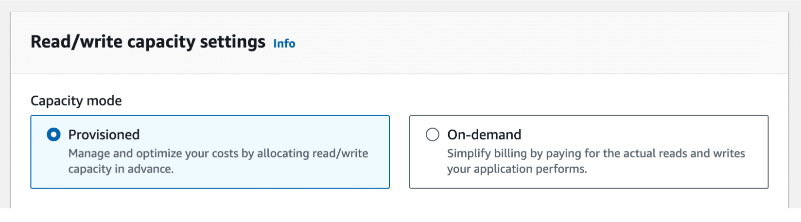
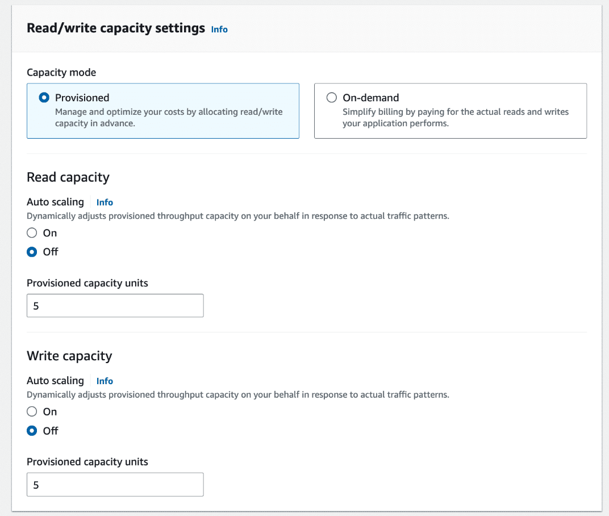

# Week 6: Databases and Caching Part 2: Exploring DynamoDB Advanced Concepts

* back to AWS Cloud Institute repo's root [aci.md](../aci.md)
* back to [AWS Cloud Fundamentals 2](./aws-cloud-fundamentals-2.md)
* back to repo's main [README.md](../../../README.md)

## Optimizing DynamoDB

### Capacity Modes

#### Introduction to capacity modes

Amazon DynamoDB offers two capacity modes for different capacity use cases: *provisioned capacity* and *on-demand capacity*. These capacity modes determine how your table manages and scales read/write operations. This matters because it controls how your table responds to changes in traffic and how you’re charged for read/write throughput.

##### Table capacity modes and why they matter

* How your table manages and scales read/write operations
* Controls how you're charged for read/write throughput
* Two modes
  * Provisioned capacity mode
  * On-demand capacity mode

##### Provisioned capacity mode

* Set the capacity to run at specific levels
* Auto scaling is your friend. You set a floor and ceiling
* Free tier eligible
* Reserved capacity

##### DynamoDB on-demand capacity mode

* Features
  * No capacity planning, provisioning, or reservations-simply make API calls
  * Pay only for the reads and writes you perform
* Key benefits
  * Eliminates tradeoffs of overprovisioning or underprovisioning
  * Instantly accommodates your workload as traffic ramps up or down
  * Can scale down to zero capacity

##### Selecting a capacity mode

* Use provisioned mode for:
  * Predictable workloads
  * Gradual ramps
  * Events with known traffic
  * Ongoing monitoring

* Use on-demand mode for:
  * New workloads
  * Unpredictable workloads
  * Frequently idle workloads
  * Events with unknown traffic
  * Set it and forget it

##### Switching modes

* New application
* Big event? Marketing, e-commerce, new DLC release

##### In summary

* Two modes
  * Provisioned capacity mode
  * On-demand capacity mode
* Choose the mode based on your workload
* Know that you can switch modes

---

In DynamoDB, you can choose a capacity mode when you create your table and also update the capacity mode for existing tables.

In the DynamoDB console, you can choose the provisioned or on-demand capacity modes when you create your DynamoDB table. Provisioned is the default capacity setting.

### Provisioned capacity mode

One option for the table capacity mode is provisioned capacity mode. In this mode, you can define how much capacity the table has available for requests either directly or with the assistance of auto scaling.  

#### How provisioned capacity mode works

The capacity for provisioned mode is defined in terms of the number of reads and writes per second that are required for your table. These are called *read capacity units (RCUs)* and *write capacity units (WCUs)*.

In provisioned mode, you can set the amount of capacity you need for read and write operations in terms of these capacity units. Then, DynamoDB provisions that amount of capacity for your database.

In provisioned mode, you can specify the read/write capacity units for your table manually. DynamoDB then provisions your table with the server capacity to handle that number of reads and writes per second.

You can also use auto scaling to adjust your table’s provisioned capacity automatically in response to traffic changes. With auto scaling, you can set a floor and ceiling for capacity units and a target utilization percentage. Then, auto scaling dynamically adjusts the provisioned throughput capacity on your behalf in response to traffic patterns. You will learn more about auto scaling later in this topic.

|[Read/Write settings in the DynamoDB console, depicting minimum and maximum capacity units, as well as target utilization.](./images/W06Img030DynamoDbCapacitySetupAutoScaling.png)

In provisioned mode, auto scaling is turned on by default but can be turned off. It is used to set a throughput floor (minimum capacity units) and ceiling (maximum capacity units). You also set a target utilization rate. DynamoDB then automatically increases and decreases the amount provisioned for your table based on usage.

In provisioned capacity mode, billing is based on the capacity provisioned instead of the number of requests. If the allocated capacity is exceeded on a table or index, it can lead to request throttling. Throttling prevents your application from consuming too many capacity units. When a request is throttled, it fails with an HTTP status ­code of 400 (Bad request) and a **ProvisionedThroughputExceededException**. If too many client requests are rejected, it can negatively impact the experience for your application users.

Provisioned mode provides some flexibility for your throughput provisioning with a feature called burst capacity. When your table is not using its available throughput fully, DynamoDB reserves a portion of that unused capacity for later bursts in activity to handle usage spikes.

**Note**: DynamoDB can also consume burst capacity for background maintenance and other tasks without prior notice.  

As mentioned previously, sudden, short-term surges in activity can be accommodated by your table’s built-in burst capacity. In some cases, DynamoDB uses burst capacity to accommodate reads or writes in excess of your table's throughput settings. With burst capacity, unexpected read or write requests can succeed where they otherwise would be throttled.

#### Benefits and drawbacks of provisioned mode

##### Benefits

The following are benefits of provisioned mode:

* **Predictable workloads**: You can set the upper and lower thresholds of how much capacity you want, which is ideal for workloads with known traffic patterns.
* **AWS Free Tier**: Provisioned mode is eligible for the [AWS Free Tier](https://aws.amazon.com/free/), which makes it a suitable option for AWS users trying out DynamoDB.
* **Cost savings**: You can purchase reserved capacity ahead of time, which is designed to help you realize significant cost savings on provisioned capacity costs. With reserved capacity, you pay a one-time upfront fee and commit to a minimum provisioned usage level over a period of time.

##### Drawbacks

The following are potential drawbacks of provisioned mode:

* **Manual adjustment**: You must intervene manually if the workload experiences significant changes.
* **Overprovisioning**: You must plan capacity carefully to avoid provisioning too many resources to optimize costs and use resources efficiently.
* **Underprovisioning**: You must plan capacity carefully to avoid underprovisioning to avoid throttling and reduced application user experience.

#### Provisioned mode use cases

There are certain types of workloads that lend themselves well to provisioned capacity mode. The characteristics of these workloads generally include predictable and consistent throughput requirements.

##### Predictable workloads

Provisioned capacity mode is a suitable choice for predictable workloads and cyclical traffic for a given hour or day. These types of workloads have consistent throughput requirements.

For example, an established social media application with a stable number of users that has predictable usage peaks would be a suitable fit for provisioned table capacity mode.

##### Gradual ramps

For a workload that is gradually ramping up, you can incrementally increase the provisioned capacity as needed by monitoring usage and traffic. This can help you optimize costs and keep billing predictable.

Examples of this type of workload include applications supporting a new product launch or marketing campaign. These applications might have low traffic initially that increases gradually as the product or campaign gains traction.

##### Events with known traffic

Provisioned capacity mode can be ideal for workloads that support events with limited, short-term bursts of traffic. Provisioned capacity works best for this type of event if there is historical data that can be analyzed to understand the traffic patterns and peak loads.

You can also use auto scaling during this type of event to dynamically adjust the provisioned capacity. When the event is over, the provisioned capacity can be scaled back down to regular levels.

Examples of workloads that support events with known traffic include applications that support holiday shopping events or recurring batch processing jobs with predictable bursts of activity.  

##### Ongoing monitoring

Ongoing monitoring refers to a type of workload that continuously collects, processes, and stores data over an extended period of time. For workloads that perform ongoing monitoring, provisioned capacity can also be a suitable fit if the workload exhibits relatively stable or gradually increasing activity over time.

An example of this type of workload includes Internet of Things (IoT) deployments that involve collecting and processing data from connected devices. Another example is patient health workloads that might involve wearable devices or remote monitoring systems.

---

### On-demand capacity mode

The other type of table capacity mode for DynamoDB is on-demand mode. This is a flexible scaling and billing option that is capable of serving thousands of requests per second without capacity planning.

#### How on-demand capacity mode works

For tables using on-demand mode, DynamoDB instantly accommodates customers’ workloads as they ramp up or down. DynamoDB can ramp up to twice the previous peak throughput of the table without needing to scale any resources.

Unlike provisioned mode, in on-demand mode, you don’t need to specify how much read and write throughput you expect your application to perform. DynamoDB charges you for the actual reads and writes that your application performs on your table in terms of *read request units (RRUs)* and *write request units (WRUs)*.

The concepts of consistency and transactions affect how read and write units are consumed.

##### Consistency

In DynamoDB, reads can be **eventually consistent (default)** or **strongly consistent**. Eventually consistent reads might not reflect the results of a recently completed write operation. Strongly consistent reads reflect updates from all prior write operations that were successful.

##### Transactions

In databases, a **transaction** represents multiple operations that are treated as one unit of work. A transaction should wholly fail or wholly succeed as one operation, such as a sequence of operations for a money transfer between two bank accounts. DynamoDB can provide transactional reads and writes for workloads that require it.

---

Read and write operations in on-demand mode consume different amounts of read request and write request units depending on their level of consistency and whether transactions are enabled. The following table describes how many RRUs and WRUs are consumed for different types of read and write requests.

| Operation Type | Reads | Writes |
| -------------- | ----- | ------ |
| **Eventually Consistent** | 0.5 RRU for an item up to 4 KB | Not applicable |
| **Strongly Consistent** | 1 RRU for an item up to 4 KB | 1 WRU for an item up to 1 KB |
| **Transactional** | 2 RRUs for an item up to 4 KB | 2 WRUs for an item up to 1 KB |

**Note**: Reading or writing items larger than the specified units will require additional request units.

#### Benefits and drawbacks of on-demand mode

##### Benefits

Benefits of on-demand capacity mode include the following.

* **Capacity planning**: Avoid the need to specify how much read and write throughput you expect to use.
* **Unpredictable workloads**: Eliminate underprovisioning or overprovisioning and dynamically adjust capacity.
* **Pricing**: Take advantage of pay-per-request pricing.
* **Rapid scaling**: Ramp from zero to tens of thousands of requests per second on demand.

##### Drawbacks

Potential drawbacks of on-demand capacity mode include the following.

* **Cost:** On-demand mode can be more expensive than provisioned capacity mode for sustained high workloads.
* **Throttling**: In on-demand mode, requests might be throttled if they spike to more than double the previously achieved peak request rate within 30 minutes. This can be mitigated by pre-warming the table to the anticipated peak capacity of the spike.

#### On-demand mode use cases

##### New workloads

In the initial stages of launching a workload without defined traffic patterns or throughput requirements, on-demand table capacity can be a suitable fit. On-demand capacity mode can help make management less complicated by eliminating the need for capacity planning and traffic monitoring in the early stages of a new service. It can also offer flexibility for new workloads with evolving requirements and unpredictable usage patterns.

An example would be launching a new mobile application with initial user adoption and traffic patterns that are difficult to predict.

##### Unpredictable workloads

On-demand capacity mode can also be a suitable fit for unpredictable workloads with traffic spikes or sudden increases in load that are challenging to forecast. On-demand capacity can seamlessly handle these changes in traffic patterns. You pay for the resources you actually use instead of provisioning and paying for unused capacity or underprovisioning and negatively impacting the end-user experience.

Examples of unpredictable workloads include applications that support ride-sharing or delivery services that experience highly unpredictable traffic based on local weather or events.  

##### Events with unknown traffic

For workloads that support events with unknown traffic patterns, it can be challenging to accurately provision capacity in advance. On-demand mode eliminates the need to do so and makes it possible for these types of workloads to scale seamlessly based on actual usage. This can help applications that support events with unknown traffic to perform consistently and optimize costs.

Examples include applications that support news websites covering major world events or services for live streaming major sports events.

##### Frequently idle workloads

Some workloads experience long periods of low or no activity interspersed with occasional bouts of activity. For these types of workloads, on-demand mode can be a suitable fit. With on-demand mode, your table capacity can scale up from zero quickly when there are bursts of activity. During the idle periods, you can avoid spending on unused capacity and incur minimal costs.

Frequently idle workloads can include batch processing systems that are idle between job runs. They can also include event-driven applications that have long periods of inactivity punctuated by bursts of activity when events occur. An example is an application that supports an annual music festival with relatively low traffic most of the year that increases leading up to the festival.

---

### When to choose one mode over the other

Think back to AnyCompany Video Games. As the company develops a microservice for a new friends feature, it needs to select a capacity mode for the DynamoDB Friends table.

The choice between provisioned capacity and on-demand capacity in DynamoDB depends on the specific requirements of your application and expected usage patterns. However, there are some general guidelines to be aware of.

#### Provisioned mode

Choose provisioned capacity mode for workloads characterized by the following:

* Predictable and stable usage patterns
* Known scaling patterns
* Cost sensitivity and cost predictability requirements
* Low latency and high throughput requirements

#### On-demand mode

Choose on-demand capacity mode for workloads characterized by the following:

* Highly variable or unpredictable usage patterns
* Unknown scaling patterns
* Uncertain or changing read/write capacity requirements
* Frequently idle

---

### Combining provisioned and on-demand mode

There might be some situations when you would switch between provisioned and on-demand capacity for an existing table.

If you anticipate a change to highly variable, bursty usage, a suitable option might be to switch your table from provisioned to on-demand capacity mode. This type of change might be driven by a new feature or downloadable content release or marketing or ecommerce events.

After the event is over or enough usage data is gathered to forecast traffic patterns, you can switch back to provisioned mode for cost savings and predictable throughput.

---

Remember, you can switch between table capacity modes only once every 24 hours. The only exception to this is if you switch a provisioned mode table to on-demand mode, you can switch back to provisioned mode in the same 24-hour period.

---

### Choosing the most suitable capacity mode

Use the following steps to choose the most suitable capacity mode.

#### Step 1: Assess application requirements

To assess application requirements, do the following:

* Identify whether your workload will be read-heavy, write-heavy, or balanced.
* Determine the required read and write throughput based on the expected number of requests each second, if possible.

#### Step 2: Analyze traffic patterns and demand

To analyze traffic patterns and demand, do the following:

* Evaluate historical data (if available) to understand usage patterns over time.
* Identify peak periods and any fluctuations in traffic.
* Consider future growth and scalability requirements.
* Determine whether traffic patterns are predictable.

#### Step 3: Factor in business needs and constraints

To factor in business needs and constraints, do the following:

* Consider the cost implications for provisioned and on-demand modes.
* Consider the importance of cost predictability.
* Consider any potential cost savings by purchasing reserved capacity.

#### Step 4: Plan capacity needs

To plan capacity needs, do the following:

* Based on your assessments, choose between on-demand or provisioned capacity mode as follows:
  * For on-demand, estimate the overall cost based on anticipated usage or use AWS Pricing Calculator.
  * For provisioned, calculate read and write capacity units based on traffic patterns and application requirements.
* Consider using auto scaling in provisioned mode to automatically adjust capacity based on utilization metrics.
* Plan for capacity adjustments during peak periods or special events.

#### Step 5: Monitor and optimize over time

To monitor and optimize over time, do the following:

* Monitor workloads to track capacity utilization and performance metrics.
* Review usage patterns and adjust capacity as needed in provisioned mode.
* Monitor costs and make optimizations where needed.
* Continue to evaluate the suitability of the chosen capacity mode and make changes as needed.

---
