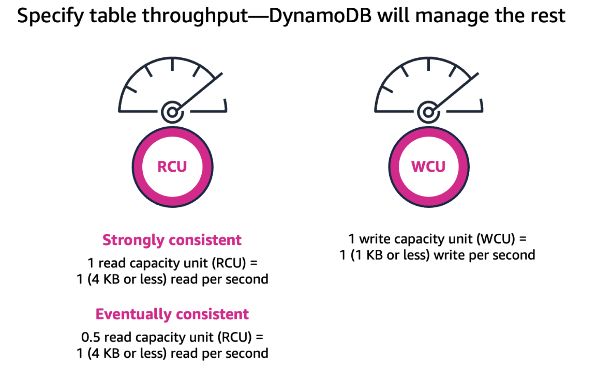
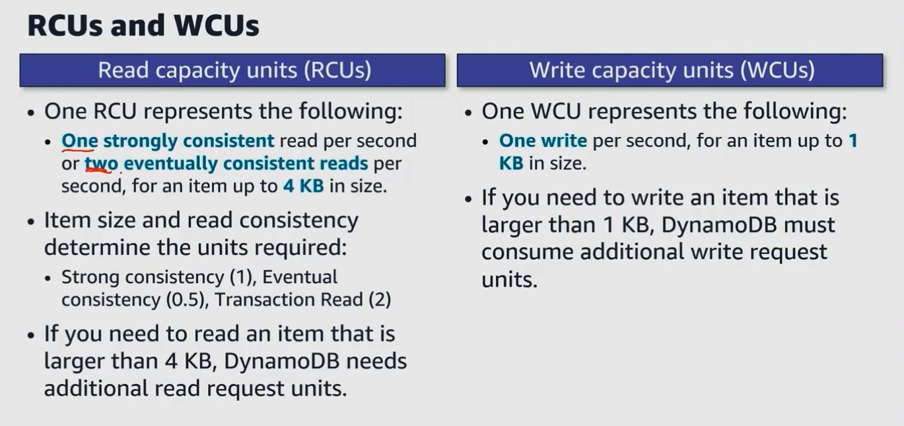
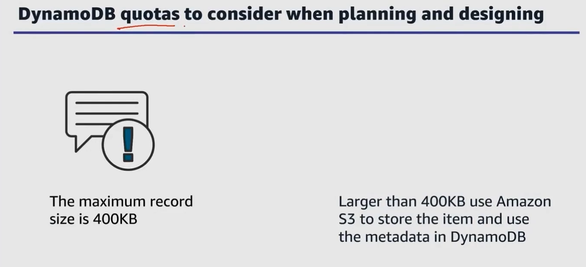
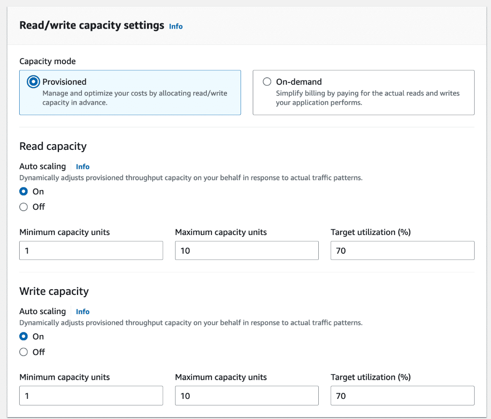
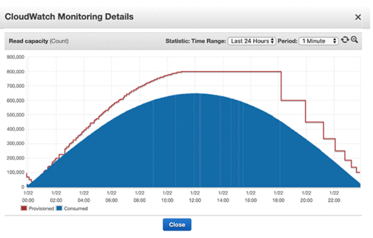
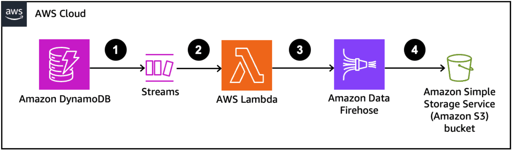
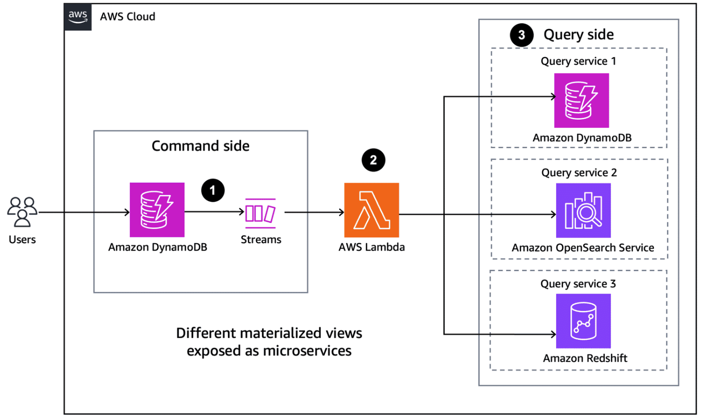
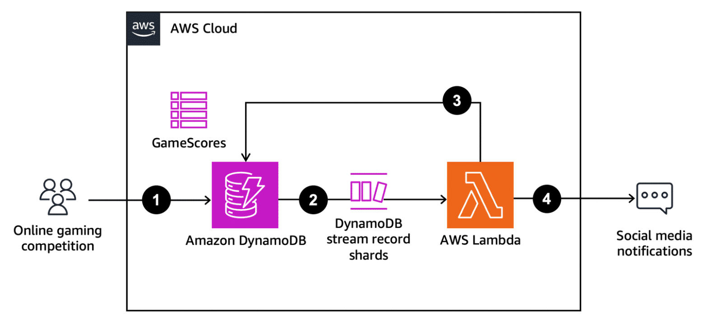
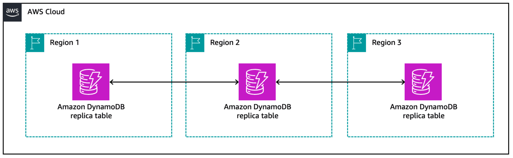

# Week 6: Databases and Caching Part 2: Exploring DynamoDB Advanced Concepts

* back to AWS Cloud Institute repo's root [aci.md](../aci.md)
* back to [AWS Cloud Fundamentals 2](./aws-cloud-fundamentals-2.md)
* back to repo's main [README.md](../../../README.md)

## Optimizing DynamoDB

### Capacity Modes

#### Introduction to capacity modes

Amazon DynamoDB offers two capacity modes for different capacity use cases: *provisioned capacity* and *on-demand capacity*. These capacity modes determine how your table manages and scales read/write operations. This matters because it controls how your table responds to changes in traffic and how you’re charged for read/write throughput.

##### Table capacity modes and why they matter

* How your table manages and scales read/write operations
* Controls how you're charged for read/write throughput
* Two modes
  * Provisioned capacity mode
  * On-demand capacity mode

##### Provisioned capacity mode

* Set the capacity to run at specific levels
* Auto scaling is your friend. You set a floor and ceiling
* Free tier eligible
* Reserved capacity

##### DynamoDB on-demand capacity mode

* Features
  * No capacity planning, provisioning, or reservations-simply make API calls
  * Pay only for the reads and writes you perform
* Key benefits
  * Eliminates tradeoffs of overprovisioning or underprovisioning
  * Instantly accommodates your workload as traffic ramps up or down
  * Can scale down to zero capacity

##### Selecting a capacity mode

* Use provisioned mode for:
  * Predictable workloads
  * Gradual ramps
  * Events with known traffic
  * Ongoing monitoring

* Use on-demand mode for:
  * New workloads
  * Unpredictable workloads
  * Frequently idle workloads
  * Events with unknown traffic
  * Set it and forget it

##### Switching modes

* New application
* Big event? Marketing, e-commerce, new DLC release

##### In summary

* Two modes
  * Provisioned capacity mode
  * On-demand capacity mode
* Choose the mode based on your workload
* Know that you can switch modes

---

In DynamoDB, you can choose a capacity mode when you create your table and also update the capacity mode for existing tables.

In the DynamoDB console, you can choose the provisioned or on-demand capacity modes when you create your DynamoDB table. Provisioned is the default capacity setting.

### Provisioned capacity mode

One option for the table capacity mode is provisioned capacity mode. In this mode, you can define how much capacity the table has available for requests either directly or with the assistance of auto scaling.  

#### How provisioned capacity mode works

The capacity for provisioned mode is defined in terms of the number of reads and writes per second that are required for your table. These are called *read capacity units (RCUs)* and *write capacity units (WCUs)*.

In provisioned mode, you can set the amount of capacity you need for read and write operations in terms of these capacity units. Then, DynamoDB provisions that amount of capacity for your database.

In provisioned mode, you can specify the read/write capacity units for your table manually. DynamoDB then provisions your table with the server capacity to handle that number of reads and writes per second.

You can also use auto scaling to adjust your table’s provisioned capacity automatically in response to traffic changes. With auto scaling, you can set a floor and ceiling for capacity units and a target utilization percentage. Then, auto scaling dynamically adjusts the provisioned throughput capacity on your behalf in response to traffic patterns. You will learn more about auto scaling later in this topic.

|[Read/Write settings in the DynamoDB console, depicting minimum and maximum capacity units, as well as target utilization.](./images/W06Img030DynamoDbCapacitySetupAutoScaling.png)

In provisioned mode, auto scaling is turned on by default but can be turned off. It is used to set a throughput floor (minimum capacity units) and ceiling (maximum capacity units). You also set a target utilization rate. DynamoDB then automatically increases and decreases the amount provisioned for your table based on usage.

In provisioned capacity mode, billing is based on the capacity provisioned instead of the number of requests. If the allocated capacity is exceeded on a table or index, it can lead to request throttling. Throttling prevents your application from consuming too many capacity units. When a request is throttled, it fails with an HTTP status ­code of 400 (Bad request) and a **ProvisionedThroughputExceededException**. If too many client requests are rejected, it can negatively impact the experience for your application users.

Provisioned mode provides some flexibility for your throughput provisioning with a feature called burst capacity. When your table is not using its available throughput fully, DynamoDB reserves a portion of that unused capacity for later bursts in activity to handle usage spikes.

**Note**: DynamoDB can also consume burst capacity for background maintenance and other tasks without prior notice.  

As mentioned previously, sudden, short-term surges in activity can be accommodated by your table’s built-in burst capacity. In some cases, DynamoDB uses burst capacity to accommodate reads or writes in excess of your table's throughput settings. With burst capacity, unexpected read or write requests can succeed where they otherwise would be throttled.

#### Benefits and drawbacks of provisioned mode

##### Benefits

The following are benefits of provisioned mode:

* **Predictable workloads**: You can set the upper and lower thresholds of how much capacity you want, which is ideal for workloads with known traffic patterns.
* **AWS Free Tier**: Provisioned mode is eligible for the [AWS Free Tier](https://aws.amazon.com/free/), which makes it a suitable option for AWS users trying out DynamoDB.
* **Cost savings**: You can purchase reserved capacity ahead of time, which is designed to help you realize significant cost savings on provisioned capacity costs. With reserved capacity, you pay a one-time upfront fee and commit to a minimum provisioned usage level over a period of time.

##### Drawbacks

The following are potential drawbacks of provisioned mode:

* **Manual adjustment**: You must intervene manually if the workload experiences significant changes.
* **Overprovisioning**: You must plan capacity carefully to avoid provisioning too many resources to optimize costs and use resources efficiently.
* **Underprovisioning**: You must plan capacity carefully to avoid underprovisioning to avoid throttling and reduced application user experience.

#### Provisioned mode use cases

There are certain types of workloads that lend themselves well to provisioned capacity mode. The characteristics of these workloads generally include predictable and consistent throughput requirements.

##### Predictable workloads

Provisioned capacity mode is a suitable choice for predictable workloads and cyclical traffic for a given hour or day. These types of workloads have consistent throughput requirements.

For example, an established social media application with a stable number of users that has predictable usage peaks would be a suitable fit for provisioned table capacity mode.

##### Gradual ramps

For a workload that is gradually ramping up, you can incrementally increase the provisioned capacity as needed by monitoring usage and traffic. This can help you optimize costs and keep billing predictable.

Examples of this type of workload include applications supporting a new product launch or marketing campaign. These applications might have low traffic initially that increases gradually as the product or campaign gains traction.

##### Events with known traffic

Provisioned capacity mode can be ideal for workloads that support events with limited, short-term bursts of traffic. Provisioned capacity works best for this type of event if there is historical data that can be analyzed to understand the traffic patterns and peak loads.

You can also use auto scaling during this type of event to dynamically adjust the provisioned capacity. When the event is over, the provisioned capacity can be scaled back down to regular levels.

Examples of workloads that support events with known traffic include applications that support holiday shopping events or recurring batch processing jobs with predictable bursts of activity.  

##### Ongoing monitoring

Ongoing monitoring refers to a type of workload that continuously collects, processes, and stores data over an extended period of time. For workloads that perform ongoing monitoring, provisioned capacity can also be a suitable fit if the workload exhibits relatively stable or gradually increasing activity over time.

An example of this type of workload includes Internet of Things (IoT) deployments that involve collecting and processing data from connected devices. Another example is patient health workloads that might involve wearable devices or remote monitoring systems.

---

### On-demand capacity mode

The other type of table capacity mode for DynamoDB is on-demand mode. This is a flexible scaling and billing option that is capable of serving thousands of requests per second without capacity planning.

#### How on-demand capacity mode works

For tables using on-demand mode, DynamoDB instantly accommodates customers’ workloads as they ramp up or down. DynamoDB can ramp up to twice the previous peak throughput of the table without needing to scale any resources.

Unlike provisioned mode, in on-demand mode, you don’t need to specify how much read and write throughput you expect your application to perform. DynamoDB charges you for the actual reads and writes that your application performs on your table in terms of *read request units (RRUs)* and *write request units (WRUs)*.

The concepts of consistency and transactions affect how read and write units are consumed.

##### Consistency

In DynamoDB, reads can be **eventually consistent (default)** or **strongly consistent**. Eventually consistent reads might not reflect the results of a recently completed write operation. Strongly consistent reads reflect updates from all prior write operations that were successful.

##### Transactions

In databases, a **transaction** represents multiple operations that are treated as one unit of work. A transaction should wholly fail or wholly succeed as one operation, such as a sequence of operations for a money transfer between two bank accounts. DynamoDB can provide transactional reads and writes for workloads that require it.

---

Read and write operations in on-demand mode consume different amounts of read request and write request units depending on their level of consistency and whether transactions are enabled. The following table describes how many RRUs and WRUs are consumed for different types of read and write requests.

| Operation Type | Reads | Writes |
| -------------- | ----- | ------ |
| **Eventually Consistent** | 0.5 RRU for an item up to 4 KB | Not applicable |
| **Strongly Consistent** | 1 RRU for an item up to 4 KB | 1 WRU for an item up to 1 KB |
| **Transactional** | 2 RRUs for an item up to 4 KB | 2 WRUs for an item up to 1 KB |

**Note**: Reading or writing items larger than the specified units will require additional request units.

#### Benefits and drawbacks of on-demand mode

##### Benefits

Benefits of on-demand capacity mode include the following.

* **Capacity planning**: Avoid the need to specify how much read and write throughput you expect to use.
* **Unpredictable workloads**: Eliminate underprovisioning or overprovisioning and dynamically adjust capacity.
* **Pricing**: Take advantage of pay-per-request pricing.
* **Rapid scaling**: Ramp from zero to tens of thousands of requests per second on demand.

##### Drawbacks

Potential drawbacks of on-demand capacity mode include the following.

* **Cost:** On-demand mode can be more expensive than provisioned capacity mode for sustained high workloads.
* **Throttling**: In on-demand mode, requests might be throttled if they spike to more than double the previously achieved peak request rate within 30 minutes. This can be mitigated by pre-warming the table to the anticipated peak capacity of the spike.

#### On-demand mode use cases

##### New workloads

In the initial stages of launching a workload without defined traffic patterns or throughput requirements, on-demand table capacity can be a suitable fit. On-demand capacity mode can help make management less complicated by eliminating the need for capacity planning and traffic monitoring in the early stages of a new service. It can also offer flexibility for new workloads with evolving requirements and unpredictable usage patterns.

An example would be launching a new mobile application with initial user adoption and traffic patterns that are difficult to predict.

##### Unpredictable workloads

On-demand capacity mode can also be a suitable fit for unpredictable workloads with traffic spikes or sudden increases in load that are challenging to forecast. On-demand capacity can seamlessly handle these changes in traffic patterns. You pay for the resources you actually use instead of provisioning and paying for unused capacity or underprovisioning and negatively impacting the end-user experience.

Examples of unpredictable workloads include applications that support ride-sharing or delivery services that experience highly unpredictable traffic based on local weather or events.  

##### Events with unknown traffic

For workloads that support events with unknown traffic patterns, it can be challenging to accurately provision capacity in advance. On-demand mode eliminates the need to do so and makes it possible for these types of workloads to scale seamlessly based on actual usage. This can help applications that support events with unknown traffic to perform consistently and optimize costs.

Examples include applications that support news websites covering major world events or services for live streaming major sports events.

##### Frequently idle workloads

Some workloads experience long periods of low or no activity interspersed with occasional bouts of activity. For these types of workloads, on-demand mode can be a suitable fit. With on-demand mode, your table capacity can scale up from zero quickly when there are bursts of activity. During the idle periods, you can avoid spending on unused capacity and incur minimal costs.

Frequently idle workloads can include batch processing systems that are idle between job runs. They can also include event-driven applications that have long periods of inactivity punctuated by bursts of activity when events occur. An example is an application that supports an annual music festival with relatively low traffic most of the year that increases leading up to the festival.

---

### When to choose one mode over the other

Think back to AnyCompany Video Games. As the company develops a microservice for a new friends feature, it needs to select a capacity mode for the DynamoDB Friends table.

The choice between provisioned capacity and on-demand capacity in DynamoDB depends on the specific requirements of your application and expected usage patterns. However, there are some general guidelines to be aware of.

#### Provisioned mode

Choose provisioned capacity mode for workloads characterized by the following:

* Predictable and stable usage patterns
* Known scaling patterns
* Cost sensitivity and cost predictability requirements
* Low latency and high throughput requirements

#### On-demand mode

Choose on-demand capacity mode for workloads characterized by the following:

* Highly variable or unpredictable usage patterns
* Unknown scaling patterns
* Uncertain or changing read/write capacity requirements
* Frequently idle

---

### Combining provisioned and on-demand mode

There might be some situations when you would switch between provisioned and on-demand capacity for an existing table.

If you anticipate a change to highly variable, bursty usage, a suitable option might be to switch your table from provisioned to on-demand capacity mode. This type of change might be driven by a new feature or downloadable content release or marketing or ecommerce events.

After the event is over or enough usage data is gathered to forecast traffic patterns, you can switch back to provisioned mode for cost savings and predictable throughput.

---

Remember, you can switch between table capacity modes only once every 24 hours. The only exception to this is if you switch a provisioned mode table to on-demand mode, you can switch back to provisioned mode in the same 24-hour period.

---

### Choosing the most suitable capacity mode

Use the following steps to choose the most suitable capacity mode.

#### Step 1: Assess application requirements

To assess application requirements, do the following:

* Identify whether your workload will be read-heavy, write-heavy, or balanced.
* Determine the required read and write throughput based on the expected number of requests each second, if possible.

#### Step 2: Analyze traffic patterns and demand

To analyze traffic patterns and demand, do the following:

* Evaluate historical data (if available) to understand usage patterns over time.
* Identify peak periods and any fluctuations in traffic.
* Consider future growth and scalability requirements.
* Determine whether traffic patterns are predictable.

#### Step 3: Factor in business needs and constraints

To factor in business needs and constraints, do the following:

* Consider the cost implications for provisioned and on-demand modes.
* Consider the importance of cost predictability.
* Consider any potential cost savings by purchasing reserved capacity.

#### Step 4: Plan capacity needs

To plan capacity needs, do the following:

* Based on your assessments, choose between on-demand or provisioned capacity mode as follows:
  * For on-demand, estimate the overall cost based on anticipated usage or use AWS Pricing Calculator.
  * For provisioned, calculate read and write capacity units based on traffic patterns and application requirements.
* Consider using auto scaling in provisioned mode to automatically adjust capacity based on utilization metrics.
* Plan for capacity adjustments during peak periods or special events.

#### Step 5: Monitor and optimize over time

To monitor and optimize over time, do the following:

* Monitor workloads to track capacity utilization and performance metrics.
* Review usage patterns and adjust capacity as needed in provisioned mode.
* Monitor costs and make optimizations where needed.
* Continue to evaluate the suitability of the chosen capacity mode and make changes as needed.

---

### Read and Write Capacity Units

In on-demand capacity mode, DynamoDB tables are billed by the number of requests in units called *read request units (RRUs)* and *write request units (WRUs)*.

In provisioned mode, *read capacity units (RCUs)* and *write capacity units (WCUs)* are used to specify the throughput amount to provision for DynamoDB tables and global secondary indexes. RCUs and WCUs indicate how much activity your provisioned table can support per second.

Regardless of capacity mode, one of the key benefits of DynamoDB is the ability to scale and manage read activity independently from write activity.

A strongly consistent read request consumes 1 RCU for an item up to 4 KB. An eventually consistent read request consumes 0.5 RCU. A write request consumes 1 WCU for an item up to 1 KB.

#### Relational databases VS DynamoDB

Relational databases have database instances, and there is a particular instance sizing that we could increase or decrease to match our workload. DynamoDB, however, is serverless, and as a consequence, we don't control size vertically or horizontally. We control it by the amount of requests and the amount of information in those requests in read and write capacity units. In other words, how quickly we want to talk to that table whether that be for reads or writes turns into costs. It's also our performance, so we can use that as a trade-off to help control our costs, but get the amount of performance that we need.

Eeventual and strong consistency is a consequence of DynamoDB distributing the data. Because that data is replicated, when we do a read, we might be querying multiple copies of a particular amount of data. If we are satisfied with the first read and the fastest of the information, then we will use an eventually consistent read at the expense of having understanding of a consistent read. In other words, when we do the read, then it's not going to change. It is strongly consistent. Eventual consistency happens because of that replication behind the scenes. If a read comes in in between an update, we might get two different answers, but eventually, it will be consistent. If we can tolerate that, we might use an eventually consistent read. If we can't and we require a strong consistent answer, then we can do a strongly consistent read.

A strongly consistent read is more computationally expensive to get. That means it's also more expensive, expensive in costs, and that's because read and write capacity units play directly into those costs. The way it affects performance is that an eventually consistent read is something that costs half as much as a strongly consistent read. That's why you can do two eventually consistent reads versus one strongly consistent read on the same 4 KB size. This is how we approach those levels of very, very high performance. Behind the scenes, DynamoDB is managing the partitions, and the indexing, and understanding of these read and write capacity units in order to get that single digit millisecond performance. So even though we've said that eventually consistent reads are faster, we actually will get consistent in speed times from an access point of view. It's just that it costs half as much. This allows us to potentially modify our applications in such a way to take advantage of that difference, that gives us the same response time, but lower costs.

If a record uses more than 4 KB, we just use that as the building block to understand how many read capacity units there are.

There's just a single write capacity unit for 1KB of size. There's not an eventual or strong consistency when it comes to write, we don't have that option. And if you read more than 4 KB, you use more than one read capacity unit. If you write more than 1 KB, you use more than one write capacity unit.

DynamoDB table has an automatic auto scaling of read and write capacity units, and that's turned on by default, so the read and write capacity units will grow or shrink based on the actual usage. And you can set minimums and maximums for that growth and change. So you can use that to understand your costs and have that read and write capacity when you need it for the applications in the way that they are using it.

#### DynamoDB quotas

The maximum record size inside of a DynamoDB table is 400 KB. This is a hard quota. The maximum record size is 400 KB, and there's no way to change it.

#### Storing something that's bigger than 400 KB

One access pattern is to store the item not in DynamoDB, but in something else, maybe Amazon S3. Amazon S3 has an object size limit of 5TB. That's significantly bigger than 400 KB, and every object inside of Amazon S3 has a URL. Now, URLs are typically just short strings, and that's something that generally is smaller than 400 KB. So that's one way to handle that mismatch of the item size and the maximum item size inside of DynamoDB.

---

### Read capacity

Read capacity is throughput for reading items. An RCU represents 1 strongly consistent read per second or 2 eventually consistent reads per second for an item up to 4 KB in size. Each API call to your table to read data is a read request and consumes RCUs. In provisioned capacity mode, you set a provisioned read throughput in RCUs for your table. This can be a single number, or it can be a minimum and maximum number with a target utilization rate if you use auto scaling.

For example, if you provision a table with 5 RCUs, you can perform 5 strongly consistent reads per second or 10 eventually consistent reads per second for items up to 4 KB. A transactional read request requires 2 RCUs per item for item sizes up to 4 KB.

If your item is larger than 4 KB, DynamoDB consumes more RCUs. For example, a strongly consistent read of an item that is 8 KB consumes 2 RCUs. An eventually consistent read of that item consumes only 1 RCU. A transactional read of that item would require 4 RCUs.  

If you are attempting to read an item that does not exist, DynamoDB still consumes provisioned read throughput. A strongly consistent read request of a nonexistent item consumes 1 RCU, and an eventually consistent read of that item consumes 0.5 RCU.

Different DynamoDB read operations consume RCUs in different ways. To learn more, choose each of the following tabs.

#### GetItem

GetItem reads a single item from a table. DynamoDB takes the item size and rounds it up to the next 4 KB boundary. If you make a strongly consistent read on an item that is 2.5 KB in size, it will be rounded up to 4 KB and consume 1 RCU.

---

#### BatchGetItem

#### Query

#### Scan

---

For these read operations, you can request a subset of attributes to retrieve. For operations like **Query** and **Scan**, you can request an item count instead of returning the actual items themselves. However, returning an item count or subset of the data does not impact the item size calculations or the number of RCUs consumed.

---

### Write capacity

Write capacity is throughput for writing new items and updating or deleting existing items. Each API call to your table to write data is a write request and consumes WCUs. A WCU represents 1 write per second for an item up to 1 KB in size. DynamoDB consumes additional WCUs for items larger than 1 KB. As with read capacity, you set a provisioned write throughput amount in WCUs for your provisioned mode tables and global secondary indexes.

If you provision a table with 5 WCUs, you can perform 5 writes per second for items up to 1 KB in size. A transactional write request requires 2 WCUs to perform 1 write per second for items up to 1 KB. Item sizes for writes are rounded up to the next kilobyte. For example, writing a 500 B item consumes the same throughput as writing a 1 KB item.

Different DynamoDB write operations consume write throughput in different ways.

#### PutItem

PutItem writes a single item to a table. If an item with the same primary key exists in the table, the operation replaces the item. For calculating provisioned throughput consumption, the item size that determines WCUs consumed is the larger of the two.

---

#### UpdateItem

#### DeleteItem

#### BatchWriteItem

---

### Provisioned capacity, performance, and cost

For tables that use provisioned capacity mode, the number of RCUs and WCUs that you provision affects the overall performance and cost of your DynamoDB workload. Provision too little throughput, and you risk request throttling and negatively impacting user experience. Provision too much, and you pay for unused capacity.

To rightsize your provisioned throughput, evaluate the read and write requirements of your workload and balance your performance needs with cost.

The price for provisioned capacity depends on the number of RCUs and WCUs you provision for your table. The charge for each RCU and WCU also depends on the table class you provision—Amazon DynamoDB Standard or Amazon DynamoDB Standard Infrequent Access (DynamoDB Standard-IA). The AWS Region where you deploy your table also affects the rate for capacity units.

#### Reserved capacity

Reserved capacity is available in provisioned mode and can help you save on your provisioned capacity costs. It offers a significant discount compared to regular provisioned capacity pricing.

To purchase reserved capacity, you pay a partial upfront payment and commit to a minimum provisioned usage level for a 1-year or 3-year term. Your reserved capacity is then billed at a discounted hourly rate. You can purchase reserved capacity in blocks of 100 RCUs or 100 WCUs. Any capacity that you provision over the reserved capacity is billed at normal rates. Reserved capacity is only available for the DynamoDB Standard table class and for single-Region tables.

### Calculating required read and write capacity

Different workloads have different requirements for reading and writing from a database. When considering the initial throughput requirements for your DynamoDB table, consider item size, expected traffic, and consistency requirements.

#### Item sizes

The size of each item in your table matters. Smaller items can be read or written using a single capacity unit. Larger items require multiple capacity units. Estimate the average size of the items you will be storing so that you can set your table’s provisioned throughput accurately.

#### Expected traffic

Estimate how many read and write operations you expect to perform per second. This will help you determine the number of RCUs and WCUs you need for your table.

#### Consistency and transactional requirements

Read capacity units are based on strongly consistent read operations, which consume more resources than eventually consistent reads. You should decide which of the following your application requires:

* Strongly consistent reads, which provide the latest data immediately after a write operation
* Eventually consistent reads, which might return slightly outdated data but consume fewer resources

If your application requires transactions, transactional reads and writes also consume more capacity units than standard reads and writes.

#### Example of calculating capacity based on requirements

Your team is building a new feature for a video game application. You are using a DynamoDB table to store data for a player friendships feature. Follow along to determine how much read and write capacity should be provisioned for this proof of concept (POC) table.

---

### Knowledge Check

#### A cloud application developer is using an Amazon DynamoDB table with provisioned capacity mode. Their application needs to perform the following operations on this table

* Write a 4 KB item.
* Read a 10 KB item using an eventually consistent read.
* Run a Query operation that returns a result set of 30 KB using a strongly consistent read.

Which option correctly represents the RCU and WCU consumption for these operations?

* * The write operation will consume 4 WCUs, the eventually consistent read will consume 1.5 RCUs, and the strongly consistent Query will consume 8 RCUs.

Wrong answers:

* The write operation will consume 1 WCU, the eventually consistent read will consume 1.5 RCUs, and the strongly consistent Query will consume 8 RCUs.
* The write operation will consume 1 WCU, the eventually consistent read will consume 3 RCUs, and the strongly consistent Query will consume 4 RCUs.
* The write operation will consume 4 WCUs, the eventually consistent read will consume 3 RCUs, and the strongly consistent Query will consume 8 RCUs.

##### Explanation

The correct response is **The write operation will consume 4 WCUs, the eventually consistent read will consume 1.5 RCUs, and the Query operation will consume 8 RCUs**.

DynamoDB consumes 1 WCU for a write operation of up to 1 KB, and consumes more write throughput for larger items. A write of a 4 KB item consumes 4 WCUs.

DynamoDB consumes 0.5 RCUs for eventually consistent reads for items up to 4 KB. To determine the number of RCUs necessary for a 10 KB item, round up to the nearest 4 KB boundary, 12 KB. A 12 KB item requires 3 RCUs for a strongly consistent read, and half of that (or 1.5 RCUs) for an eventually consistent read.

DynamoDB treats a Query as a single read operation, so the total item size is computed then rounded up to the next 4 KB boundary. For a 30 KB result set, this is 32 KB. A 32 KB strongly consistent read consumes 8 RCUs.

The other options are incorrect because they do not correctly describe how RCUs and WCUs will be consumed by these DynamoDB operations.

#### An Amazon DynamoDB table is in provisioned mode with auto scaling enabled. A target utilization rate has been defined, in addition to maximum and minimum capacity. Which metrics enable changes to the table's provisioned capacity? (Select TWO.)

* DynamoDB increases the provisioned capacity when the actual throughput exceeds the target utilization rate for 2 consecutive minutes.
* DynamoDB decreases the provisioned capacity when the actual throughput falls below the target utilization rate minus 20 percent for 15 consecutive minutes.

Wrong answers:

* DynamoDB increases the provisioned capacity when the actual throughput exceeds the maximum capacity for 5 consecutive minutes.
* DynamoDB increases the provisioned capacity when the actual throughput exceeds 90 percent of the current capacity for 2 consecutive minutes.
* DynamoDB decreases the provisioned capacity when the actual throughput falls below the minimum capacity for 15 consecutive minutes.

##### Explanation

Application Auto Scaling only changes the provisioned throughput for a table when the actual traffic is higher or lower over a sustained period. DynamoDB auto scaling scales out when activity surpasses the target utilization rate for 2 consecutive minutes. It scales in when activity falls below target utilization for 15 minutes.

#### A cloud application developer is building an application that will send an email to users with onboarding tasks when they sign up for the application. An Amazon DynamoDB table will be used to store new user records, and notifications to users should be delivered in near real time. Which actions should the developer take to accomplish this task with the LEAST amount of effort?  

* Create an AWS Lambda function invoked by DynamoDB Streams to send the onboarding email when a new user record is inserted into the DynamoDB table.

Wrong answers:

* Implement a scheduled AWS Lambda function that scans the DynamoDB table at regular intervals, identifies new user records, and sends onboarding emails using SES.
* Use AWS Step Functions to orchestrate a workflow that reads from the DynamoDB table periodically and checks for new user records. Then, it sends onboarding emails using Amazon Simple Email Service (Amazon SES).
* Create an Amazon API Gateway endpoint that reads from the DynamoDB table when a new user signs up. Then, integrate it with Amazon SES to send the onboarding email.

##### Explanation

By using DynamoDB Streams, the developer can capture inserts (new user records) in the DynamoDB table in near real time. The stream records can be consumed by a Lambda function, which can call another service to initiate the user email. This approach requires the least amount of effort because it uses the built-in integration between DynamoDB Streams and Lambda. It also avoids the need for periodic scanning or polling.

The other options are incorrect because of the following:

* AWS Step Functions can be used to call DynamoDB APIs. However, this approach is more complex, less automated, and might not deliver notifications to users in near real time.
* An AWS Lambda function can be scheduled to periodically scan a DynamoDB table, but this approach also involves more effort than using DynamoDB Streams. It is not as event-driven as using DynamoDB Streams, and might not deliver notifications to users in time.
* A solution using Amazon API Gateway would require significantly more effort and would not be as efficient as using DynamoDB Streams. The developer would likely need to make client-side code changes to invoke the API Gateway endpoint when a new user signs up.

---

### Summary

Amazon DynamoDB offers a number of features that can help you customize and optimize its performance for different use cases. They are capacity modes, read and write capacity units, auto scaling, and DynamoDB Streams.

#### Capacity modes

DynamoDB provides two options for capacity modes: provisioned mode, which is the default mode in the DynamoDB console, in addition to on-demand mode.

| Aspect | Provisioned mode | On-demand mode |
| ------ | ---------------- | -------------- |
| Definition | This mode provisions a specific read and write capacity for your table and can be used with auto scaling. | This mode instantly accommodates workloads as they ramp up and down. |
| Billing | You pay for provisioned capacity. You can purchase reserved capacity for additional cost savings. | You pay per request. |
| Units | Throughput is measured in read capacity units (RCUs) and write capacity units (WCUs). | Throughput is measured in read request units (RRUs) and write request units (WRUs). |
| Advantages | Provisioned mode offers cost-savings for consistent, predictable workloads. You can purchase reserved capacity for additional savings.  | There is no need for capacity planning or monitoring throughput. On-demand mode is ideal for highly unpredictable workloads. |
| Disadvantages | This mode requires capacity planning and monitoring to avoid over-provisioning or under-provisioning. | This mode has the potential for higher costs with sustained high traffic or traffic bursts. You cannot purchase reserved capacity in on-demand mode. |
| Use cases | Provisioned mode is suitable for workloads with predictable traffic patterns and consistent throughput requirements. | On-demand mode is suitable for workloads with unpredictable traffic patterns and unknown throughput requirements. |

#### Read and write capacity units

RCUs and WCUs are the units of read and write throughput in provisioned capacity mode. Different types of reads and writes consume different amounts of RCUs and WCUs. The following table reviews the differences.

| Operation type | Reads | Writes |
| -------------- | ----- | ------ |
| Eventually consistent | 0.5 RCU for an item up to 4 KB | N/A |
| Strongly consistent | 1 RCU for an item up to 4 KB  | 1 WCU for an item up to 1 KB |
| Transactional | 2 RCUs for an item up to 4 KB | 2 WCUs for an item up to 1 KB |

Remember that for items larger than the sizes specified, additional RCUs and WCUs are consumed.

#### Different DynamoDB operations calculate throughput differently

##### Reads

Different DynamoDB read operations consume RCUs in different ways:

* **GetItem**: The item size is rounded up to next 4 KB boundary. If you request an item that is 2.5 KB, it is rounded up to 4 KB.
* **BatchGetItem**: Each item is processed as an individual GetItem request, so each item is rounded up to next 4 KB boundary.
* **Query**: All items returned are treated as a single read, so total size of all items is calculated, then rounded up to next 4 KB boundary. If query returns data set that is 26 KB, it is rounded up to 28 KB.
* **Scan**: This operation reads all the items in a table, so the size of the data evaluated determines the read throughput.

##### Writes

Different DynamoDB write operations consume WCUs in different ways:

* **PutItem**: The size of the item is rounded up to the next 1 KB boundary to determine WCU consumption. When overwriting existing items, the item size that determines WCU consumption is the larger of the existing and the new item.
* **UpdateItem**: The size of the item before and after the update is considered. The larger of these items determines WCU consumption, rounded up to the next 1 KB boundary.
* **DeleteItem**: WCU consumption is based on the size of the deleted item, rounded up to the next 1 KB boundary.
* **BatchWriteItem**:  DynamoDB processes each item in a batch write as an individual PutItem or DeleteItem request. The size of each item is first rounded up to the next 1 KB boundary, and then the total size is calculated. The result is not necessarily the same as the total size of all the items.

---

#### Auto scaling

DynamoDB auto scaling is a feature that can be enabled on any table or global secondary index that uses provisioned capacity mode.

DynamoDB auto scaling uses AWS Auto Scaling to dynamically adjust provisioned throughput capacity on your behalf, in response to actual traffic patterns.

In auto scaling, you can choose whether to enable auto scaling for read capacity, write capacity, or both. You also determine minimum capacity units, maximum capacity units, and target utilization rate.

In a provisioned mode table, you can enable auto scaling for read capacity, write capacity, or both.

* Minimum capacity units

    **Minimum capacity** units determine the floor or lower limit of provisioned capacity. Can be in RCUs or WCUs.

* Maximum capacity units

    **Maximum capacity** units determine the ceiling or upper limit of provisioned capacity. Can be in RCUs or WCUs.

* Target utilization

    **Target utilization** is the desired percentage of consumed throughput compared to provisioned throughput at any point in time.

---

These parameters are used to create a scaling policy through AWS Auto Scaling. DynamoDB publishes consumed capacity metrics to CloudWatch. If the table's consumed capacity exceeds your target utilization (or falls below the target) over a certain time period, Amazon CloudWatch initiates an alarm. This CloudWatch alarm causes AWS Auto Scaling to evaluate your scaling policy, then issue an UpdateTable request. DynamoDB processes the UpdateTable request, dynamically increasing (or decreasing) the table's provisioned throughput capacity so that it approaches your target utilization.

DynamoDB auto scaling helps to eliminate the challenge of under-provisioned capacity, which can result in request throttling. It also helps solve the problem of over-provisioned capacity, which can mean paying for unused resources.

In this graph, time is on the x-axis and read capacity is on the y-axis. The provisioned capacity indicated by the red line closely tracks to consumed capacity over the course of one day. This is indicated by the blue, shaded curve. Provisioned capacity increases with actual traffic in the first half of the graph and gradually decreases as traffic wanes.

---

#### DynamoDB Streams

DynamoDB Streams captures a time-ordered sequence of item-level modifications in any DynamoDB table and stores this information in a log for up to 24 hours. Applications can access this log and view the data items as they appeared before and after they were modified, in near real time.

* **Stream**

    A stream is a sequence of ordered changes (create, update, delete operations) that is grouped into containers called shards.

* **Shards**

    A stream is composed of one or more shards. A shard is a group of stream records.

* **Stream record**

    A stream record captures an individual, item-level modification event. It can capture information about the item keys, the event type (**INSERT**, **MODIFY**, **REMOVE**), and item data before and after modification.

---

With DynamoDB Streams, you can build an architecture driven by item modification events in your DynamoDB table. Lambda functions are commonly used to process DynamoDB streams and initiate the next step in an application flow.

#### Serverless archive design pattern

A common application requirement is to preserve older data in colder storage. DynamoDB Streams can be combined with DynamoDB TTL to create a serverless archive design pattern. In this architecture, a TTL attribute that holds a Unix epoch timestamp is enabled on a DynamoDB table. This attribute indicates when an item can be safely deleted by DynamoDB using background processes, without consuming any write throughput. The following steps correspond to the labeled steps in the graphic:

1. DynamoDB automatically deletes expired items. These deletions are captured in DynamoDB streams.
2. A Lambda function polls the stream and is invoked when an expiration event occurs.
3. The Lambda function writes the expired items to a Firehose delivery stream.
4. Firehose streams the expired items into an S3 bucket to be archived.

#### Materialized view updates

Another common application requirement is the ability to access denormalized or aggregated data. In a microservices architecture, this data might be siloed in different operational databases. *Materialized views* are data tables that combine data from multiple existing tables for faster data retrieval. This gives you the ability to provide different data sources and views specifically for querying. DynamoDB Streams can be used to update these materialized views when data in the underlying DynamoDB table changes. The following steps correspond to the labeled steps in the graphic:

1. Users update data in the application, which is captured in a DynamoDB stream.
2. A Lambda function polls the stream for data changes.
3. The function writes data to other data stores that provide a query layer for the application. These data stores might include services like another DynamoDB table, OpenSearch Service, and Amazon Redshift, depending on the data storage and querying need.

#### Social media notifications

DynamoDB Streams can also be used to send *social media notifications* to users of a game application when there is a new top score. The following steps correspond to the labeled steps in the graphic:

1. User scores are recorded to the DynamoDB table with streams enabled.
2. Immediately after a new score is added, a new record appears in the stream. AWS Lambda polls the stream and invokes a function when it detects data has been changed.
3. The Lambda function can aggregate and group scores by user id and update the top score in the table.
4. When the top-ranked score is updated in the table, this initiates another stream record. This event can invoke another Lambda function that sends a social media notification to all users with the new top score.

---

Note: Remember that DynamoDB TTL can be used to expire unneeded items in a DynamoDB table without impacting table performance or consuming write throughput. With TTL, you can define a per-item expiration timestamp that indicates when an item is no longer needed. This timestamp is stored in Unix epoch time at the seconds granularity.

---

## DynamoDB Security and Resiliency

---

### Knowledge Check

#### A company has a web application running on Amazon EC2 instances within an Amazon Virtual Private Cloud (Amazon VPC). The application needs to access an Amazon DynamoDB table that contains sensitive data, and the company wants to ensure that this data does not traverse the public internet. The company has already created a VPC gateway endpoint for DynamoDB in the same AWS Region as the DynamoDB table. Which steps should it take next to secure access to the DynamoDB table through the VPC endpoint?

* * Create a VPC endpoint policy that allows access to the needed DynamoDB resources. Then, attach this policy to the VPC endpoint and use the aws:sourceVpce condition on the DynamoDB table to enforce access through the endpoint.

Wrong answers:

* Attach an IAM policy to the EC2 instance role that allows access to the DynamoDB table. Then, update the VPC route tables to route DynamoDB traffic through the endpoint.
* Create a VPC endpoint policy that allows full access to all DynamoDB resources, and attach this policy to the VPC endpoint.
* Configure a VPN connection between the VPC and the company's on-premises network, and route DynamoDB traffic through the VPN connection to access DynamoDB securely.

##### Explanation

To secure access to the DynamoDB table, the company should create a VPC endpoint policy that allows access to the DynamoDB table. It should then attach this policy to the VPC gateway endpoint. It can use the **aws:sourceVpce** condition in IAM policies to enforce that all access to the DynamoDB table is via the specified VPC endpoint.

The other options are incorrect because:

* A policy for the EC2 instance role does not provide the more granular access control offered by adding a VPC endpoint policy and aws:sourceVpce condition. Additionally, when you associate a route table with a gateway endpoint, a route that points traffic to the service through the endpoint is automatically added.
* Allowing full access to the DynamoDB table through the VPC endpoint policy does not follow the principle of least privilege and could potentially expose sensitive data. Access to the DynamoDB table should also be limited to the VPC endpoint.
* A VPN connection between a VPC and an on-premises network is for devices outside of AWS to connect to resources in the VPC. It is not designed for securing communications between AWS services.

#### What are best practices for preventative security and access control in Amazon DynamoDB? (Select THREE.)

* Use AWS Identity and Access Management (IAM) roles to authenticate access to DynamoDB.
* Use AWS Identity and Access Management (IAM) policies for DynamoDB base authorization.
* Use AWS Identity and Access Management (IAM) policy conditions for fine-grained access control to items and attributes in tables.

Wrong answers:

* Use Amazon CloudWatch for auditing and tracking API calls to DynamoDB.
* Use Amazon DynamoDB Streams to monitor read activity on tables.
* Use the optional encryption-at-rest feature for tables that contain sensitive or confidential data.

##### Explanation

The correct responses are as follows:

* **Use IAM roles to authenticate access to DynamoDB**. IAM roles that grant temporary credentials should be used to authenticate users, applications, and other AWS services with DynamoDB. Long-term credentials, such as access key IDs and secret access keys, should not be stored in applications or EC2 instances.
* **Use IAM policies for DynamoDB base authorization**. Use IAM permissions policies for IAM identities to grant least-privilege access to DynamoDB API actions and resources.
* **Use IAM policy conditions for fine-grained access control to item and attributes in tables**. Policy conditions can be used to grant users different levels of access to certain items or attributes on a table. They can also be used to grant conditional access based on the identity associated with the request.

The other options are incorrect because of the following:

* CloudWatch collects and processes raw data from DynamoDB into readable, near real-time usage metrics and table activity, but it does not track and audit API calls. AWS CloudTrail is the service that can provide tracking and auditing of API calls to DynamoDB.
* DynamoDB Streams capture table writes, not reads, and cannot be used to monitor read activity on tables.
* Encryption of all DynamoDB table data, including primary keys, secondary indexes, backups, global tables, and streams, is enabled by default.

#### A cloud application developer is building a serverless application that uses AWS Lambda to query an Amazon DynamoDB table. The Lambda function already is associated with a Lambda execution role called "LambdaRole." What actions should the developer take to authenticate the Lambda function with DynamoDB with the MOST security and LEAST effort?

* Create a new AWS Identity and Access Management (IAM) policy with the necessary DynamoDB permissions and attach this policy to the existing "LambdaRole" IAM role.

Wrong answers:

* Create a new AWS Identity and Access Management (IAM) role with the necessary DynamoDB permissions and associate it with the Lambda function in addition to the existing "LambdaRole".
* Modify the Lambda function code to call the AWS Security Token Service (AWS STS) API to obtain temporary credentials with the required DynamoDB permissions.
* Configure the Lambda function to use an AWS access key ID and secret access key with the necessary DynamoDB permissions, instead of relying on an AWS Identity and Access Management (IAM) role.

##### Explanation

To authenticate with DynamoDB from a Lambda function, the developer should create a new IAM policy with the necessary DynamoDB permissions and attach this policy to the existing "LambdaRole" IAM role associated with the Lambda functions. By attaching the appropriate IAM policy to the existing role, the Lambda function will have the permissions to perform the required DynamoDB operations.

The other options are incorrect because of the following:

* An EC2 instance, or any AWS principal, service, or resource, can only assume one role at a time.
* AWS STS is a web service that is typically used to authenticate users with temporary credentials. It is not typically used to provide authentication between other AWS services and introduces unnecessary complexity.
* Storing long-term credentials like access key IDs and secret access keys in application code is never recommended. These are not automatically rotated and could have a significant business impact if compromised.

---

### Summary

Amazon DynamoDB provides a number of security and resiliency features. The AWS shared responsibility model applies to both security and resiliency. AWS is responsible for the security and resiliency of the cloud, while the customer is responsible for security and resiliency in the cloud. There are multiple ways you can strengthen the security and resiliency postures of your DynamoDB workloads.

#### Security

DynamoDB provides some built-in security features, in addition to others that can be customized for different security requirements. These include the following:

* **Encryption**: DynamoDB automatically encrypts all user data at rest using AWS KMS keys. You can switch between AWS owned keys, AWS managed keys, or customer-managed keys. Client-side encryption can also be set up using the AWS Data Encryption SDK for DynamoDB.
* **Access control**: IAM integrates with DynamoDB for authentication and authorization. You can use IAM roles and policies to grant permissions in DynamoDB, including fine-grained, conditional policies.
* **Auditing**: AWS CloudTrail also integrates directly with DynamoDB. This makes it possible for you to audit and track API calls made to your DynamoDB tables, including from the DynamoDB console.
* **VPC endpoints for DynamoDB**: You can use an Amazon VPC endpoint to privately connect to DynamoDB from a private VPC. This empowers you to limit access to your database and keep your database traffic off the open internet.

#### Resiliency

DynamoDB also offers some default and customizable resiliency features, including the following:

* **Auto scaling and on-demand capacity mode**: In provisioned capacity mode, you can enable auto scaling, which automatically and dynamically manages capacity based on actual traffic. You can also enable on-demand capacity mode, which allows DynamoDB to instantly accommodate your workloads as they ramp up and down.
* **Automatic replication**: DynamoDB automatically replicates your data across multiple Availability Zones in an AWS Region, providing higher data availability and durability.
* **Backup and restore**: DynamoDB provides two backup and restore options, on-demand backs and continuous backups with point-in-time recovery (PITR). These capabilities allow you to create backups of your tables for long-term data retention, protection, and archiving.
* **Monitoring and logging**: DynamoDB integrates with Amazon CloudWatch, allowing you to monitor the performance and health of your DynamoDB workload. You can set up alarms to receive notifications when specific thresholds are breached, allowing you to monitor your workload and resolve issues proactively.
* **Global tables**: This is a DynamoDB feature that allows you to replicate data seamlessly across multiple AWS Regions, providing disaster recovery and high availability on a global scale.

---

#### Global tables

A DynamoDB feature called global tables that gives you the ability to deploy replica tables in multiple Regions. A global table consists of one or more replica tables. Writes to any individual table are automatically replicated across all of the other replicas in the global table.

Three AWS Regions, each with a DynamoDB replica table. Arrows indicate that writes are replicated between all the tables.
A DynamoDB global table consists of replica tables deployed into different AWS Regions. Writes are replicated automatically between the tables. This provides geographically-dispersed users with fast, localized reads and writes.

Global tables is an ideal feature for use cases that require low-latency performance for globally distributed users or a multi-Region disaster recovery and backup strategy. Using global tables as part of your DynamoDB workload provides the following benefits:

* Read and write locally, access your data globally
* Performance boost for massively-scaled global applications
* Straightforward to set up and operate
* Availability, durability, and fault tolerance
* Consistency and conflict resolution using the last-writer-wins approach

---

**Note**: Remember that writes to global tables are billed at a higher rate than for single-Region tables. This is due to the costs of the streaming infrastructure required to replicate changes across replica tables. Writes are billed in replicated write request units (rWRUs) for on-demand capacity mode or replicated write capacity units (rWCUs) for provisioned capacity mode.

---

#### Access control with IAM

IAM is used to secure your DynamoDB workload. Identity-based and resource-based policies are two common ways of granting permissions to DynamoDB. You can also specify more fine-grained access control, such as restricting access to specific DynamoDB actions and using policy conditions.

Using policy conditions, you can specify when certain permissions take effect. For example, you might want users to be able to modify only their own data. In this case, you can grant write permissions only if the partition key matches their own user id using the **dynamodb:LeadingKeys** condition key. You might also want to limit access to only a subset of attributes to protect confidential data. You can use the **dynamodb:Select** condition key set to **SPECIFIC_ATTRIBUTES** and specify certain attributes in the **dynamodb:Attributes** condition key.

##### Authenticate with roles

For users, applications, and other AWS services to access DynamoDB, they must include valid AWS credentials in their API requests. However, AWS credentials should not be stored directly in an application or an EC2 instance. Instead, use an IAM role for users, applications, and other AWS services to obtain temporary access keys. These keys can be used to access AWS services and resources, including DynamoDB.

##### Authorize with policies

You can attach permissions policies to IAM identities (users, groups, and roles) to grant them permissions to perform specific operations on DynamoDB resources.

These policies specify the DynamoDB API actions and resources that are authorized for the identities receiving the privileges. With policies, implementing least privilege is key in reducing security risk.

##### Fine-tune with conditions

You can include conditions that determine the circumstances under which a particular policy takes effect for fine-grained access control. This helps uphold the principle of least privilege, which is key in reducing security risk and the impact of potential mistakes or bad actors.

You can issue permissions to DynamoDB resources with conditional granularity. This includes granting users different types of access to certain items or attributes on a table, or granting access based on user identity.

---

#### VPC endpoints

VPC endpoints are a feature that allows applications in a VPC to connect privately to supported AWS services, including DynamoDB. Traffic between an Amazon VPC and a supported AWS service does not leave the Amazon network. Public IP addresses are not required for EC2 instances in the VPC to communicate with VPC endpoint resources.

VPC endpoints are available in two types: gateway and interface endpoints. The following table reviews the differences between the two types of endpoints.

| Aspect | Interface Endpoint | Gateway Endpoint |
| ------ | ------------------ | ---------------- |
| Definition | A collection of one or more elastic network interfaces that serves as an entry point for traffic to a specific service, enabled through AWS PrivateLink | A gateway that you specify in your route table, targeting specific IP routes for traffic destined to specific AWS services |
| Supported services | Many AWS managed services, services hosted by other AWS customers and partners in their own VPCs, supported AWS Marketplace partner services | DynamoDB, Amazon S3 |
| Public IP addresses | Use private IP addresses from your VPC to access DynamoDB | Use DynamoDB public IP addresses |
| On premises access | Allows access from on premises | Does not allow access from on premises |
| Regions | Allows access from an Amazon VPC endpoint in another Region by using Amazon VPC peering or AWS Transit Gateway | Does not allow access from another Region |
| Billing | Billed | Not billed |

You can control and limit access to your VPC endpoint for DynamoDB through a combination of VPC endpoint policies and identity-based policies:

* **VPC endpoint policies** are resource-based policies applied on the DynamoDB VPC endpoint. They help you control which AWS principals can use the endpoint to access an AWS service.
* **Identity-based and resource-based policies** can be given the **aws:sourceVpce** condition to specify that all access to the DynamoDB table should be through the specified VPC endpoint. You can attach these policies to users, groups, or roles that are accessing DynamoDB, if access to DynamoDB should only be allowed through the endpoint. You can also attach these policies to resources, such as a DynamoDB table, to specify that all traffic should be through the endpoint.

---
