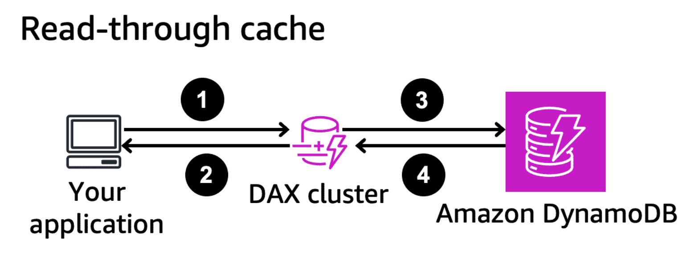
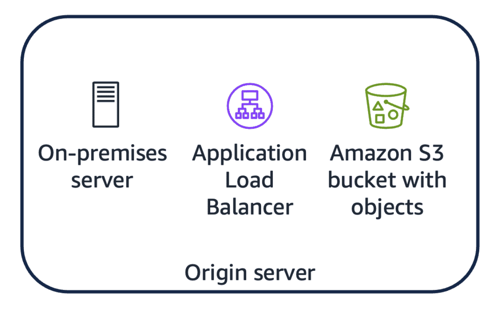
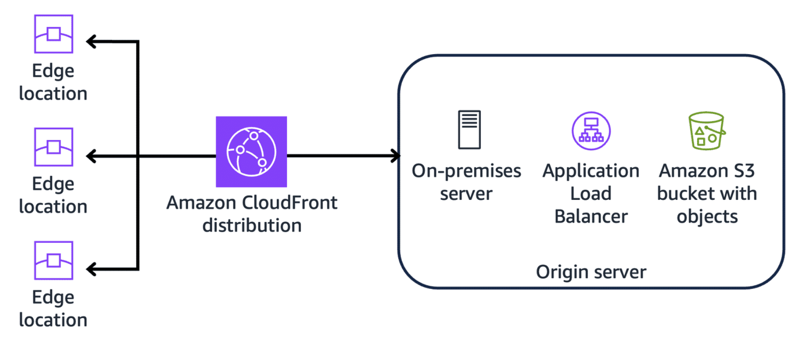
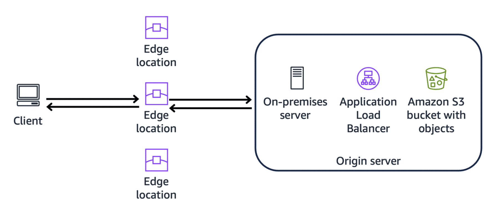
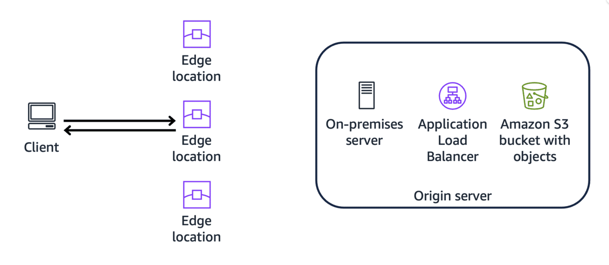

# Week 7: Databases and Caching Part 3: Caching on AWS

* back to AWS Cloud Institute repo's root [aci.md](../aci.md)
* back to [AWS Cloud Fundamentals 2](./aws-cloud-fundamentals-2.md)
* back to repo's main [README.md](../../../README.md)

## Caching

### Knowledge Check

#### What does a cache hit ratio measure?

* The percentage of cache hits over the total number of requests.

Wrong answers:

* The percentage of cache misses over the total number of requests.
* The percentage of cache misses over the total number of cache hits.
* The percentage of requests to the cache over the total number of requests to the underlying data store.

##### Explanation

A cache hit occurs when the requested data is found and unexpired in the cache. The cache hit ratio is a metric that helps capture the effectiveness of the caching strategy.

The other responses incorrectly describe the formula for calculating the cache hit ratio.

#### Which AWS services can provide a caching layer for the web, application, and database layers? (Select THREE.)

* Amazon ElastiCache
* Amazon CloudFront
* Amazon DynamoDB Accelerator (DAX)

Wrong answers:

* Amazon RDS
* Amazon Elastic File System (Amazon EFS)
* AWS Lambda

##### Explanation

The following AWS services - **Amazon ElastiCache**, **Amazon CloudFront**, and **Amazon DynamoDB Accelerator (DAX)**, - can be part of a caching solution for the web, application, and database layers of an application.

The other responses are incorrect because of the following reasons:

Amazon RDS is a fully managed SQL database service, primarily used for storing and retrieving data, not for caching.
Amazon EFS is a fully managed file storage service and is not designed for caching use cases.
Lambda is a serverless compute service that runs code in response to events and would not be suitable as a dedicated caching service.

#### How does the lazy loading caching strategy update a cache?

* Data is loaded into the cache only when there is a cache miss.

Wrong answers:

* Data is written to both the cache and origin data store simultaneously.
* Data is proactively refreshed in the cache before it expires.
* Data is written to the cache, and the origin data store is updated asynchronously.

##### Explanation

In the lazy loading strategy, the application first checks the cache for the requested data. If the data does not exist in the cache or has expired, the application retrieves the data from the database and updates the cache with the data.

The other responses are incorrect because of the following reasons:

* **Data is written to both the cache and origin data store simultaneously**: This approach describes the write-through strategy in which database writes are also written to the cache.
* **Data is proactively refreshed in the cache before it expires**: This approach describes the refresh-ahead strategy.
* **Data is written to the cache, and the origin data store is updated asynchronously**: This approach describes the write-back (or write-behind) strategy in which data is written to the cache first and written to the database later.

---

## DAX Benefits and Functionality

### Knowledge Check

#### What is the purpose and functionality of Amazon DynamoDB Accelerator (DAX)?

* DAX is an in-memory cache that sits in front of Amazon DynamoDB, providing faster read access to frequently accessed data by caching it in memory.

Wrong answers:

* DAX is a fully managed NoSQL database service that replaces Amazon DynamoDB for read-heavy workloads.
* DAX is a load balancing service that distributes read and write requests across multiple Amazon DynamoDB tables for improved performance.
* DAX is a data replication service that automatically creates and maintains read replicas of Amazon DynamoDB tables in different AWS Regions.

##### Explanation

**DAX is an in-memory cache that sits in front of DynamoDB, providing faster read access to frequently accessed data by caching it in memory.**

The other responses are incorrect due to the following reasons:

* DAX is not a replacement for DynamoDB. It is a caching layer that works in conjunction with DynamoDB to improve read performance.
* DAX is not a load balancing service. It is a caching layer that caches data from DynamoDB in memory for faster read access.
* DAX is not a data replication service. It is a caching layer that caches data from DynamoDB in memory within the same AWS Region.

#### How does Amazon DynamoDB Accelerator (DAX) improve response times for Amazon DynamoDB? (Select TWO.)

* DAX uses a read-through caching strategy, where it first checks the cache for requested data, and if not found, it reads the data from DynamoDB and caches it for future requests.
* DAX uses a write-through caching strategy, where data written to DynamoDB is simultaneously written to the DAX cache, ensuring that the cache stays up to date.

Wrong answers:

* DAX implements a write-back caching strategy, where writes are initially made to the cache, and the changes are periodically flushed to DynamoDB in batches.
* DAX uses a write-around caching strategy, where read requests are served from the cache, but write requests bypass the cache and go directly to DynamoDB.
* DAX uses a predictive caching strategy, where it analyzes access patterns and preloads data into the cache based on anticipated future requests.

##### Explanation

With a combination read-through and write-through caching strategy, DAX captures both read and write activity to DynamoDB in the DAX cache. This enables the data in DAX to stay synchronized with the data in DynamoDB and provide in-memory acceleration to applications.

The other responses are incorrect due to the following reasons:

* DAX does not use a write-back caching strategy.
* DAX does not use a write-around caching strategy.
* DAX does not currently use a predictive caching strategy. It caches data based on actual read requests, not anticipated future requests.

#### What are characteristics of workloads that can achieve improved application performance through Amazon DynamoDB Accelerator (DAX)? (Select TWO.)

* Applications with read-heavy workloads that require microsecond-latency access to data
* Applications that query against large tables with many items and require fast reads

Wrong answers:

* Applications with a high volume of write operations and infrequent read operations
* Applications with a balanced mix of read and write operations and no strict latency requirements
* Applications that use a different cache engine and already have their own client-side logic for interfacing with their caching solution

##### Explanation

Applications with read-heavy workloads that require microsecond-latency responses can benefit from DAX because it caches frequently accessed data for faster access. Applications that query against large tables with many items and require fast reads can also use DAX to cache both items and queries. This reduces the load on the DynamoDB table and improves query performance.

The other responses are incorrect due to the following reasons:

* Applications with a high volume of write operations and infrequent read operations might not benefit significantly from DAX, because DAX is primarily designed to improve read performance.
* Although DAX can provide some performance benefits for applications with a balanced mix of read and write operations, its primary use case is for read-heavy workloads with strict latency requirements.
* Applications that are already using a different cache engine and have implemented their own logic for working with that solution do not benefit from adding DAX.

#### What are recommended best practices when enabling Amazon DynamoDB Accelerator (DAX) for Amazon DynamoDB tables? (Select TWO.)

* Start with a conservative time-to-live (TTL) value for cached data.
* Prioritize enabling DAX on tables with read-heavy workloads.

Wrong answers:

* Enable DAX on all DynamoDB tables, regardless of their read workload.
* Provision a single-node DAX cluster to minimize costs.
* Choose the T2 node type for your production DAX workload.

##### Explanation

DAX is designed to accelerate read performance for DynamoDB tables with heavy read workloads. Enabling DAX on high-read tables can significantly reduce read latency, reduce demand for read throughput, and improve overall application performance. When determining the TTL for cache data, starting low ensures that the cached data stays fresh and consistent with the underlying DynamoDB data. As cache behavior is observed, the TTL can be increased as needed to optimize cache utilization.

The other responses are incorrect because of the following:

* DAX should not be enabled on all DynamoDB tables. Its usefulness depends on the balance between read and write requests, as well as latency requirements.
* Best practice is to provision three nodes instead of one in a DAX cluster to maximize availability.
* The T2 node type is not recommended for production DAX workloads. Its burst capacity can indicate an overly optimistic picture of its performance during load testing, which would not carry over into production.

#### What is one difference between using Amazon DynamoDB Accelerator (DAX) and pre-fetching data for caching reads from Amazon DynamoDB?

* DAX is suitable for workloads with unpredictable data access patterns, and pre-fetching is better for workloads with predictable data access patterns.

Wrong answers:

* DAX employs a read-through caching strategy, and pre-fetching data uses a cache-aside strategy.
* DAX caches data in memory, and pre-fetching data stores cached data on disk.
* DAX automatically invalidates cached data when the underlying data in DynamoDB changes, and pre-fetching requires manual cache invalidation.

##### Explanation

The data that gets stored in DAX depends on the actual requests from the application. Conversely, pre-fetching preempts actual requests and relies on known patterns or predictions to load the cache proactively.

The other responses are incorrect due to the following reasons:

* Pre-fetching loads data preemptively and does not strictly follow the read-through or cache-aside approach.
* Pre-fetching does not typically store cached data on disk. A pre-fetching strategy will typically rely on faster, local memory, like random access memory (RAM), to store cached items.
* DAX does automatically invalidate cached data, but cache invalidation for pre-fetching depends on the actual implementation. Implementations that use cache engines like Memcached or Redis can use their cache eviction policies.

---

### Summary

Amazon DynamoDB Accelerator (DAX) is an in-memory cache that improves response times for read operations against Amazon DynamoDB tables. DAX provides the following benefits:

* **Faster response times for reads**: Decreases latency from single-digit milliseconds to microseconds
* **Reduced read load on DynamoDB tables**: Offloads requests for eventually consistent reads to the cache instead of the database
* **Seamless cache for DynamoDB**: Provides a managed cache that intercepts requests to DynamoDB
* **No application rewrites required**: No need to change application logic because DAX is compatible with existing API calls

#### How DAX works

You can deploy a DAX cluster into a VPC in the same AWS Region as your DynamoDB table. You then install the DAX client software onto the compute element of your application, whether an Amazon EC2 instance or AWS Lambda function. The DAX client intercepts API calls from your application to DynamoDB and directs them to your DAX cluster.

DAX uses a read-through and write-through caching strategy.

##### Read-through cache

The following steps align to the numbered markers in the diagram.

1. The DAX client intercepts application requests for eventually consistent reads. These are passed to the DAX cluster.
2. On a cache hit, the data is returned to the application from the DAX cluster with very low latency. This avoids a read request to the DynamoDB table.
3. On a cache miss, the request is forward to the DynamoDB table.
4. DAX caches the data so that it can serve subsequent requests before returning it to the application.

##### Write-through cache

The following steps align to the numbered markers in the diagram.

1. The DAX client routes writes through the DAX cluster.
2. DAX writes the data to DynamoDB.
3. On a successful write, DAX updates the DAX cache with the new data so that any subsequent requests for that data result in a cache hit.
4. If the write is unsuccessful, an exception is returned to the application.

---

Remember that DAX does not serve requests for strongly consistent reads from its caches. It passes these requests directly to DynamoDB.

DAX also maintains two types of caches: an item cache and a query cache. Writes that update the item cache do not update the query cache.

---

#### DAX use cases

DAX can offer significant benefits to certain types of workloads, but it is not a universal solution to all workloads on DynamoDB.

##### Well-suited for DAX

DAX is a **well-suited caching solution** for workloads characterized by the following:  

* Read-heavy
* Low-latency requirements
* Occasional traffic spikes
* Large tables with many items

##### Not well-suited for DAX

DAX is **not as well-suited** for workloads characterized by the following:

* High consistency requirements
* Tolerance to higher latency
* Write intensive
* Already have a caching solution in place

---

#### DAX best practices

To gain the maximum benefits for your workload, follow the recommended best practices for DAX.

##### Enable on high-read tables

DAX is designed to accelerate read performance on **read-heavy workloads**. This can significantly reduce read latency, reduce demand for read throughput on your table, and improve overall application performance.

##### Start with conservative TTL

TTL is an important setting that determines how long items remain valid in the cache. **Start your new DAX cluster with a lower TTL** to ensure that the cached data remains fresh and consistent with the underlying data. As you gather data on the workload, adjust the TTL to find a balance between data freshness and cache utilization.

##### Monitor cache hit ratio

Use CloudWatch metric math to define a **cache hit ratio metric**. Adjust the cache TTL and configuration as needed to optimize cache utilization.

##### Ensure high availability

DAX clusters for production should be deployed with at least **three nodes into three different Availability Zones**. This ensures that your cluster remains available even if one Availability Zone experiences failure.

Use load testing to determine the type of node to use for your workload. When load testing, provision two nodes to simulate outage of one Availability Zone. Be careful when load testing with T2 node types. They provide burstable CPU performance, which in testing might not accurately represent the performance of a production workload.

##### Secure your DAX cluster

You can enable **encryption at rest** for certain DAX cluster node types. Encryption at rest automatically integrates with AWS KMS to manage your encryption key. Encryption in transit can also be enabled.

Additionally, a DAX cluster is deployed into a VPC. This provides your DAX cluster with **enhanced security and network isolation**.

---

#### Comparing DAX to other caching strategies

DAX provides many caching benefits to read-heavy applications backed by DynamoDB, but it is not the only way to implement a database cache for DynamoDB. You can use other caching solutions with DynamoDB, such as Amazon ElastiCache or a self-managed cache. You can also customize your application behavior to follow different caching strategies than the ones implemented by DAX.

DAX uses the read-through and write-through caching strategies, but there are other caching strategies. For instance, your application might not be able to tolerate the additional latency introduced by the extra network request incurred through the write-through strategy. Or your application might write a lot of data, the majority of which is never accessed. In these cases, a write-through strategy might not be the best approach. You could customize your application to use a write-around approach instead, which bypasses the cache and writes directly to the database.

Pre-fetching is another caching strategy that populates a cache before the application requests the data. DAX does not implement pre-fetching natively, but you can customize your application to pre-fetch data if needed. Pre-fetching can be useful in the following scenarios:

* **Predictable data access patterns**: Applications that access a specific set of data at regular intervals or follow a certain sequence of data access
* **Bulk data retrieval**: Applications that require large amounts of data from database
* **Cache warming**: Applications that do not tolerate a "cold" initial cache due to an unacceptable amount of buffering or lag

Pre-fetching is not necessarily mutually exclusive with DAX. If your use case has one of the scenarios mentioned previously, you can incorporate pre-fetching into your application. For instance, you could write a script that makes requests from your application to frequently used DynamoDB data to pre-warm your DAX cache.

---

## Caching Applicatio data using Amazon ElastiCache

### Knowledge Check

#### What is the purpose of sharding in an Amazon ElastiCache for Redis (cluster mode enabled) deployment?

* Sharding is a method of partitioning data across multiple shards (node groups) to improve performance and scalability.

Wrong answers:

* Sharding is a technique used to replicate data across multiple Availability Zones for high availability.
* Sharding is a caching strategy that allows different types of data structures to be stored within a single Redis cluster.
* Sharding is a method of compressing data to reduce the memory footprint of the Redis cluster.

##### Explanation

In ElastiCache for Redis (cluster mode enabled), data is partitioned across multiple shards (node groups) to distribute the load and improve performance and scalability.

The other options are incorrect because:

* Sharding is not a technique for replicating data across Availability Zones. That is achieved through Multi-AZ deployments.
* Sharding does not allow the storage of different types of data structures within a single Redis cluster. It partitions the same data across multiple shards.
* Sharding is not a method of compressing data. It is a partitioning strategy for distributing data across multiple nodes.

#### What is a key difference between Amazon ElastiCache for Memcached and ElastiCache for Redis?

* ElastiCache for Redis supports advanced data structures like lists, sets, and sorted sets. ElastiCache for Memcached only supports simple key-value pairs.

Wrong answers:

* ElastiCache for Memcached supports data persistence, and ElastiCache for Redis does not.
* ElastiCache for Memcached supports automatic failover and Multi-AZ deployments, and ElastiCache for Redis does not.
* ElastiCache for Redis is suitable for caching read-heavy workloads. ElastiCache for Memcached is better suited for write-heavy workloads.

##### Explanation

Redis supports advanced data structures that make it better suited for use cases that require flexibility in data modeling.

The other options are incorrect because:

* Redis supports data persistence with optional on-demand or continuous snapshots to Amazon S3.
* Redis supports automatic failover and Multi-AZ deployments. Memcached does not provide this functionality.
* Redis, especially with cluster-mode-enabled, is better suited for write-heavy workloads. Memcached is more suitable for read-heavy workloads.

#### What is the purpose of the Auto Discovery feature in Amazon ElastiCache for Memcached?

* It enables client applications to automatically identify and connect to all nodes in the cache cluster.

Wrong answers:

* It automatically detects and replaces failed nodes in the cluster.
* It automatically partitions data across multiple nodes in the cluster for improved performance.
* It automatically replicates data across multiple Availability Zones for high availability.

##### Explanation

In ElastiCache for Memcached, the ElastiCache Cluster Client streamlines client connections and awareness of all the nodes in the cluster. Without this, the application would have to manually connect to individual nodes.

The other options are incorrect because they do not correctly describe the Auto Discovery feature.

---

### Summary

Amazon ElastiCache is a managed service that provides a fast, in-memory data store. It can be used as an ephemeral data store for use cases that do not require data durability, such as storing user session data or temporary files. It can also be used as a database cache for quick, in-memory access to data that is permanently stored on disk.

Using ElastiCache over a self-managed cache or in-memory data store provides several benefits:

* Elimination of management overhead
* Automated failover
* Integration with other AWS services
* Improved security
* Pay-as-you-go pricing

#### Serverless and self-designed clusters

ElastiCache offer serverless and self-designed options. With the serverless options, you can create highly available caches in under a minute. They also eliminate the need to provision instances or configure nodes or clusters.

Some use cases might benefit from choosing self-designed clusters, which let you customize your node and cluster configurations, including Availability Zone placement.

#### ElastiCache for Redis and ElastiCache for Memcached

ElastiCache is compatible with two widely used, open-source caching engines: Memcached and Redis. Memcached is a lightweight, in-memory key-value cache, best suited for caching read-heavy workloads and accelerating applications. Redis is a more feature-rich and versatile in-memory data store that supports advanced data structures, persistence, replication, and additional functionalities beyond caching. It might be tempting to look at Redis as a more evolved Memcached due to its advanced data types and atomic operations. However, Memcached has a longer track record and the ability to use multiple CPU cores.

The following table summarizes and compares key aspects of Memcached and Redis.

| Aspect | Memcached | Redis |
| ------ | --------- | ----- |
| Data model | Provides key-value, string data types only | Provides various advanced data structures including geospatial data |
| Components | Nodes, clusters | Nodes, shards, clusters |
| Data persistence | Stores data purely in memory. If cache instance restarts or fails, data is lost | Supports data persistence through snapshots, which allow data to be written to disk. Can be used as an in-memory database in addition to a cache |
| Replication and failover | Does not support automatic failover, though nodes can be deployed in multiple Availability Zones for higher fault tolerance | Supports replication and automatic failover with Multi-AZ deployments. Supports cross-Region replicas with Global Datastore |
| Use cases | In-memory data store | In-memory data store, gaming leaderboards, messaging, recommendation data |
| Advanced features | Supports multi-threaded architectures and Auto Discovery for automatic client connections | Supports transactions and atomic operations, pub/sub messaging, Health Insurance Portability and Accountability Act (HIPAA) and Payment Card Industry Data Security Standard (PCI DSS) eligibility |

#### Choosing the right engine

On the surface, the engines look similar in some ways. Each of them is an in-memory key-value store that can provide sub-millisecond latency. They both provide support for data partitioning that allows you to distribute data across multiple nodes, and support for a broad set of programming languages.

However, each engine provides some advantages and can help meet different application requirements.

##### Memcached

Choose Memcached if the following requirements apply to your use case:

* You need the simplest data model possible.
* You need to run large nodes with multiple cores or threads.
* You need the ability to scale out and in, adding and removing nodes as demand on your system fluctuates.
* You need to cache objects.

##### Redis

Choose Redis if the following requirements apply to your use case:

* You need complex data types, such as strings, hashes, lists, sets, sorted sets, and bitmaps.
* You need to sort or rank in-memory datasets.
* You need persistence of your key store.
* You need to replicate your data from the primary to one or more read replicas for read-intensive applications.
* You need automatic failover if your primary node fails.
* You need publish and subscribe (pub/sub) capabilities to inform clients about events on the server.
* You need backup and restore capabilities.
* You need to support multiple databases.

---

The choice between Redis and Memcached depends on the specific requirements of the application, such as data complexity, durability needs, and the desired feature set.

---

#### Auto discovery

ElastiCache for Memcached provides a feature called Auto Discovery. This feature streamlines the process of client connections to nodes in a cache cluster.

This feature is enabled by default and allows nodes in a cache cluster to automatically register and deregister themselves with the configuration endpoint. Other nodes in the cluster are automatically updated with the latest cache node metadata. Nodes are also automatically replaced if they fail.

Use the ElastiCache Cluster Client in your application to create a Memcached connection with Auto Discovery and streamline cluster connections.

#### Design considerations for ElastiCache  

ElastiCache is a side cache. In other words, it does not integrate natively in a database, so you have to decide what you want to cache and how you want to cache it. Data that is often a good candidate for caching includes the following:

* **Frequently accessed or "hot" data**, such as product details in an ecommerce application or popular user profiles in a social media platform
* **Computationally expensive data** that your application generates by complex calculations, transformations, or aggregations, such as the output of complex data analysis
* **Static or slow to change data**, such as geographic data, location information, or reference data
* **User-specific data** for user preferences or session data, such as shopping cart data or user settings
* **Shared data** that is shared across multiple requests or users, such as trending products or news articles
* **Data in hotspots or bottlenecks**, such as the results from a resource-intensive third-party API call

You can use several caching strategies with ElastiCache, including read-through (lazy-loading) caching, write-through caching, and pre-warming strategies.

Additionally, both ElastiCache for Redis and Memcached provide time to live (TTL) functionality, which you can customize for your clusters. Both ElastiCache for Redis and ElastiCache for Memcached also manage cache memory internally.

#### Assessing cache effectiveness

ElastiCache publishes cluster metrics to Amazon CloudWatch, where you can monitor and set up alerts for different metrics. The most important metric to monitor for cache effectiveness is CPU usage. If CPU usage is consistently high, this indicates that a node is overtaxed.

You can also monitor metrics like Evictions, CacheMisses, BytesUsedForCacheItems, SwapUsage, and CurrConnections, to understand how effectively your cache is performing.

---

## Using Amazon CloudFromt to implement Global Caching

### Knowledge Check

#### What are best practices for monitoring and troubleshooting an Amazon CloudFront distribution? (Select TWO.)

* Configure CloudFront to create and save standard logs to Amazon S3.
* Turn on additional Amazon CloudWatch metrics for CloudFront for more detailed monitoring and troubleshooting.

Wrong answers:

* Create an AWS Lambda function to periodically check the status of the distribution.
* Wait for viewer feedback before setting up a troubleshooting strategy.
* Create an AWS Support ticket to request upgraded metrics for the distribution.

##### Explanation

To monitor and troubleshoot a CloudFront distribution, recommended best practices are to enable and monitor standard (or access) logs that are stored in Amazon S3 buckets. CloudWatch provides basic metrics for CloudFront, but additional metrics can be enabled at additional cost for more detailed visibility into a distribution.

The other options are incorrect because of the following:

* Creating a Lambda function to monitor the distribution is not a strategic approach when there are built-in tools like CloudWatch and standard logs.
* Waiting for viewer feedback on distribution performance is not as proactive a strategy as the best practices identified.
* An AWS Support ticket does not need to be created to enable additional metrics for a distribution.

#### What is the relationship between a distribution, an edge location, and an origin in Amazon CloudFront?

* A distribution tells CloudFront where to deliver content from and how to deliver it. An edge location is a server where the content is cached, and an origin is the server where the original content is stored.

Wrong answers:

* An edge location is a distribution, and an origin is the server that contains the content that is cached at the edge location.
* A distribution is the source of the content. Edge locations are where the content is cached, and the origin is not used in CloudFront.
* An origin is a distribution, and edge locations are where the content is cached. The distribution is not used in CloudFront.

##### Explanation

In CloudFront, a distribution holds the configuration for how to cache and deliver content. A distribution also tells CloudFront which origin server to get content from. Content is cached at edge locations or points of presence (POPs), which are collections of geographically-dispersed servers in data centers closer to end users.

The other options are incorrect because they do not correctly describe the relationship between distributions, edge locations, and origins.

#### A cloud application developer is creating an Amazon CloudFront distribution for an application running behind an Application Load Balancer. Their application uses certain headers and cookies for access control and authentication. When the distribution sends requests to their origin, those headers and cookies should be included. Which CloudFront feature can they use to enable this functionality?

* Origin request policies

Wrong answers:

* Cache policies
* Response headers policies
* CloudFront does not provide a built-in solution.

##### Explanation

By default, a request forwarded to the origin on a cache miss only includes basic information from the viewer's request. To include additional information, such as headers, cookies, and query strings, the developer can create an origin request policy that lets them add extra information to the request.

The other options are incorrect because of the following:

* A cache policy is used to configure cache and compression settings for a cache, including cache keys.
* A response headers policy is used to modify the HTTP headers in the response sent to viewers, not in the request sent to the origin server.
* CloudFront does provide a built-in solution for this scenario.

---

### Summary

Amazon CloudFront is a content delivery network (CDN) built for high performance, security, and developer convenience. It allows you to accelerate the distribution of static and dynamic content by caching and delivering content from points of presence (POPs) around the world.

#### Key components of CloudFront

* **Origin**

    Location where the original content is stored, such as an Amazon S3 bucket, an Application Load Balancer, or an on-premises server

* **Distribution**

    Enables the delivery of your content through CloudFront, with configuration settings to manage how content is delivered and tracked

* **Edge locations**

    Servers close to users, also called POPs, which serve requests for cached content

* **Regional edge caches**

    CloudFront server locations between POPs and your origin server with larger caches, keeping more content closer to users

#### How CloudFront works

Refer to the parts in the following sequence to review how to set up a CloudFront distribution and how it speeds up content delivery.

##### Part 1: Create origin server

First, you create your origin server, like an Amazon S3 bucket or your own HTTP server, if it does not yet exist. You then upload the files that you want to distribute to this server. This is the origin from which CloudFront will retrieve your files to distribute to edge locations all over the world.

##### Part 2: Create distribution

Next, create a CloudFront distribution. This tells CloudFront which origin server to get your files from when users request the files through your website or application.

When you create a distribution, you can specify settings such as: enabling Origin Shield, compression, viewer protocol policy, allowed HTTP methods, cache key and origin request policies, and more.

CloudFront then sends your distribution's configuration information (but not your content) to all of its edge locations globally.

##### Part 3: Client request

When a user requests content that you're serving with CloudFront, the request is routed to the edge location that provides the lowest latency (time delay), so that content is delivered with the best possible performance.

If the content is not yet in that edge location (cache miss), CloudFront retrieves it from the origin that you've identified as the source of that content.

CloudFront also caches the content in that edge location so that subsequent requests can be served from the cache.

##### Part 4: Cache hit

On subsequent requests to that edge location for the same content, CloudFront can deliver the content with low latency. This avoids a request to the origin server for that content.

---

#### Customizing CloudFront functionality

You can customize CloudFront functionality with cache policies, origin request policies, and response headers policies. To review, expand each of the following three categories.

* **Cache policies**

    Cache policies allow you to manage cache and compression settings. In a cache policy, you can configure cache keys and TTL settings, and enable compression. These settings can affect your cache performance, including your cache hit ratio.

* **Origin request policies**

    Origin request policies allow you to specify values to include in requests that get sent to the origin server. You can add or modify HTTP headers or cookies that get forwarded to your origin server, which can be useful for analytics or logging.

* **Response headers policies**

    You can also modify the HTTP headers sent in the response to the viewers. CloudFront can remove headers that it received from the origin, or add headers to the response, before sending the response to viewers. Making these changes doesn't require writing code or changing the origin server configuration.

---

#### Restricting viewer access

CloudFront also provides several ways to secure the content in your distribution:

* **Configure HTTPS**: Require that viewers access content using HTTPS (secure HTTP) only.
* **Restrict by geographic location**: Prevent users in specific geographic locations from accessing your content using the CloudFront geographic restrictions feature or a third-party geolocation service.
* **Use signed URLs or cookies**: Restrict access to content for certain users through signed URLS (for individual files or clients that don't support cookies) or signed cookies (for access to multiple restricted files or if you want to keep same URLs).
* **Use field-level encryption**: Protect certain fields (like credit card numbers or passwords) by adding encryption to specific fields before caching and delivering content.
* **Use AWS WAF**: Deploy a firewall in front of your CloudFront distribution to filter and block requests based on IP addresses, HTTP headers, or SQL code injection attempts.

#### Optimizing CloudFront

##### Monitor metrics

Use CloudFront's integration with Amazon CloudWatch to **monitor operational metrics** for distributions and edge functions. CloudWatch provides default metrics at no additional cost, including Requests, BytesDownloaded, and error rate information.

You can enable advanced metrics per distribution. These advanced metrics do incur additional costs and include cache hit rate, origin latency, and error rate by individual HTTP status codes.

##### Improve cache hit ratio

Cache hit ratio is a key metric to consider when evaluating the performance of your cache. The following strategies can help you **improve your cache hit ratio**:

* Specify how long to cache objects.
* Use Origin Shield to provide another caching layer.
* Cache based on select and consistent query string parameters.
* Cache based on select cookie values.
* Cache based on select request headers.
* Remove Accept-Encoding header when compression is not needed.

##### Serve compressed files

**Serving compressed files** can improve your cache performance through faster downloads and smaller file sizes. It also lowers costs by reducing the amount of data transfer out (DTO).

You can use CloudFront to automatically compress certain types of objects (files) and serve the compressed objects when viewers (web browsers or other clients) support them. Viewers indicate their support for compressed objects with the Accept-Encoding HTTP header.

---

#### Integrating CloudFront with other AWS services

CloudFront integrates natively with core AWS services such as Amazon S3, Amazon EC2, and Lambda. You can use these integrations to secure and retrieve content, extend functionality, and enable detailed logging and analytics for your distribution.

##### Restricting access to an AWS origin

You can configure CloudFront to send authenticated requests to an AWS origin and also configure the origin to only allow access through CloudFront. By doing so, you can prevent clients from bypassing CloudFront and accessing these services directly. This functionality includes the following services:

* **Amazon S3**: Use origin access control (OAC) to send authenticated requests.
* **AWS Lambda**: Use CloudFront OAC to secure Lambda function URLs by allowing access only from designated CloudFront distributions.
* **Application Load Balancers**: Configure CloudFront to add a custom HTTP header to requests and configure the Application Load Balancer to only accept requests with that CloudFront header.

##### Using Lambda@Edge

With Lambda@Edge, you can run Lambda functions at CloudFront edge locations globally. These can be useful for requirements such as A/B testing, device responsiveness, personalization, access control, and fetching additional data.

##### Logging and analytics

CloudFront standard access logs can exported to Amazon S3 for analysis. These logs can be used for security analytics, operational troubleshooting, or integrating with other AWS analytics services, such as Amazon Athena.

CloudFront also provides real-time logs that can be delivered to Amazon Kinesis Data Streams and consumed with your own Kinesis data stream consumer or Amazon Data Firehose. With real-time logs, you can configure sampling rate, fields, and the specific cache behaviors (path patterns) for which you want to receive real-time logs.

---

#### Troubleshooting CloudFront

Common Amazon CloudFront issues are with object invalidation, errors related to access restrictions, and origin server issues.

##### Object invalidations

**Object invalidation** allows you to remove files from CloudFront edge caches before expiration. However, issues like failed or slow invalidations can occur.

Troubleshooting steps include the following:

* Checking invalidation batch status
* Verifying correct relative object paths
* Reviewing CloudFront access logs for 4xx errors
* Adjusting batch sizes if hitting invalidation limits
* Using versioned object paths

Properly configuring and monitoring invalidations is key to ensuring that updated content gets pushed to edge locations promptly.

##### Access restrictions

When using **geographic restrictions or signed URLs and cookies to restrict content access**, a common issue is HTTP 403 Forbidden errors.

For distributions with geographic restrictions, this might indicate that the request came from a blocked location, so check if the user is on a VPN.

For distributions that use signed URLs and cookies, 403 errors can mean that the signing key is not valid or missing, or that there is an issue with your application's signing process. Troubleshoot by verifying that the trusted key group in the cache behavior matches the application's signing process. Also make sure that your application is distributing signed URLs or cookies in responses as expected.

CloudFront error responses often provide details to pinpoint the root cause of restricted access failures.

##### Origin server errors

When CloudFront returns 4xx or 5xx errors after requesting an object from the origin, this means that there is a **problem in communication between CloudFront and your origin server**. Some of the common HTTP codes and potential causes include the following:

* **400 Bad Request**: This can occur for a variety of reasons, such as if your origin is an Amazon S3 bucket that you moved into a different AWS Region. Update your CloudFront distribution so that it finds the S3 bucket in its current Region.
* **502 Bad Gateway**: This means that CloudFront couldn't connect to the origin server. This can be due to SSL/TLS or origin issues, such as the origin not responding on the specified port. This error can also be a result of Lambda@Edge function validation errors or DNS errors.
* **503 Service Unavailable**: This means that the server is not ready to handle the given request. This could be due to a function invocation error related to Lambda@Edge or CloudFront Functions or exceeding a Lambda quota. It can also be due to more general issues, such as an overwhelmed origin server or a CloudFront issue during load testing.
* **504 Gateway Timeout**: This indicates that when CloudFront forwarded the request to the origin, the origin either returned a 504 status code or the request timed out. Underlying reasons for this can include a firewall or security group that blocks traffic, or an origin that isn't accessible on the internet.

---
