# Week 9: Compute 3 Part 2: Practice with Container Computing

* back to AWS Cloud Institute repo's root [aci.md](../aci.md)
* back to [AWS Cloud Fundamentals 2](./aws-cloud-fundamentals-2.md)
* back to repo's main [README.md](../../../README.md)

## CONTAINER COMPUTING OVERVIEW

### Containers Concepts Overview

In computing, a container is a standardized unit that packages code and its dependencies. This package is designed to run reliably on any supported platform because the container creates its own independent environment. With containers, workloads can be carried from one place to another, such as from development to production or from on premises to the cloud. In the same way that abstraction helped to increase agility in the physical world of shipping containers, abstraction helps to remove difficulties and inconsistencies in the virtual world. Before shipping containers, it was difficult to consistently and efficiently deliver physical cargo. Similarly, in the virtual world, it is difficult to consistently and efficiently deliver applications with bare metal servers. Let's explore a couple considerations surrounding the use of bare metal servers and virtual machines (VMs).

* **Bare metal servers**: A bare metal server runs a standalone operating system with one or more applications that use the libraries installed on top of the operating system. The maximum capacity is fixed—to scale, you must buy and configure additional servers.
* **VM**: Virtually every application can now consistently run on a VM. The downside to VMs is that the virtualization layer is heavy. Each VM has its own operating system instead of one that supports all VMs. This causes higher use of the host CPU and RAM, reducing efficiency and performance. Having an individual operating system for each VM also means more patching, more updates, and more space being taken up on the physical host. There's also significant redundancy—you've installed potentially the same operating system four times and potentially the same library three times.
* **Containers**: While virtual machines virtualize a whole system, including the hardware, containers only virtualize the software layer. You can deliver consistency and efficiency with containers. The containerization platform lets containers share a machine’s operating system kernel and exposes the underlying operating system file system. Sharing a machine’s operating system kernel allows for shared libraries but can permit individual libraries, as necessary.

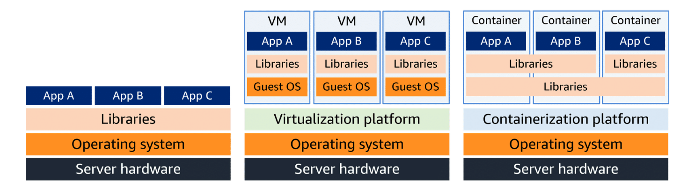

Because containers isolate software from the other layers, their code runs identically across different environments—from development and staging all the way to production. Containers are lightweight, efficient, and fast.

An image is a read-only template with instructions for creating a container.

A container runs as an instance of a container image. Once you create a container image, it can go anywhere that Docker is supported.

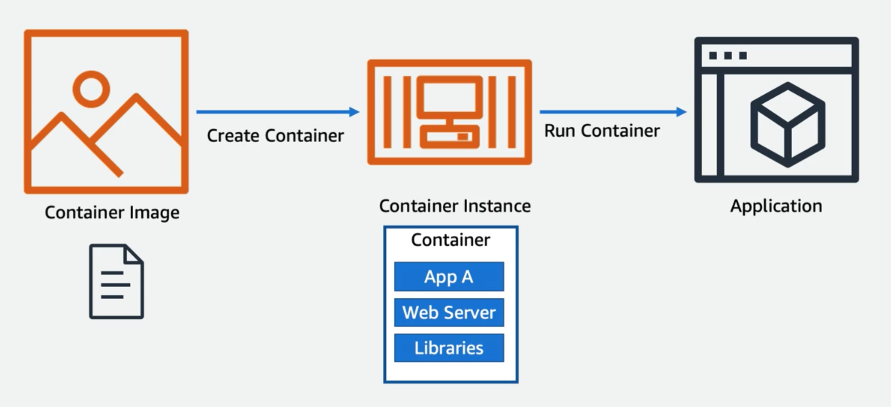

An image is usually based on another image, with some customization. For example, you may build an image that is based on the Ubuntu Linux image in the registry.

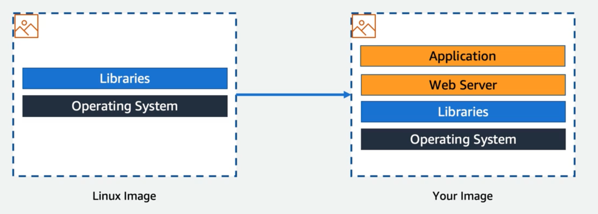

You can use images that were created by others and published to a public registry such as Docker Hub. Or, you can use images published to a private registry that that you can create using a service like Amazon Elastic Container Registry or Amazon ECR.

You can also create your own images and publish them to these registries.

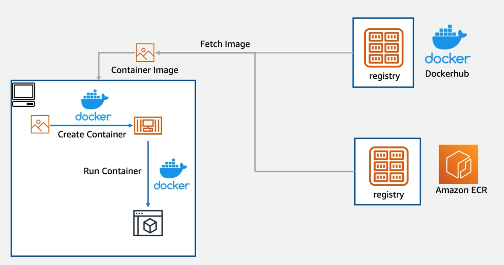

---

A *container* is a **lightweight package of code and resource** that runs on compatible platforms. Limitations include Linux and Windows compatibility. For example, a container based on a Linux image cannot run on Windows and vice versa.

---

### Containerization platforms

Containerization platforms make containers highly portable. They are software solutions that you can use to manage containerized applications. Generally, they provide capabilities like automation, orchestration, security, and customization for a container architecture.

* **Container image**

    A container image is the design for a container. It specifies the applications and runtime items needed for that container to run. It can be thought of as a blueprint and is analogous to a class within an application. You'll be working with Docker images in this lesson.

* **Container**

    A container is an instance of a container image deployed on a host. It is analogous to an object within an application.

* **Container repository**

    A container repository, like a code repository, is where container images are stored so they can be deployed. You'll be using Amazon Elastic Container Registry (ECR) in this lesson.

* **Container runtime**

    A container runtime is the service that needs to be running on a host for containers to be deployed on it.

* **Container engine**

    A container engine provides services necessary to deploy and manage containers. There is no defined set of services a container engine provides. Docker is a container engine in addition to being a container image specification. Compared to Kubernetes, the other container engine you'll explore, Docker provides less robust tools but is generally easier to learn.

* **Container orchestration service**

    A container orchestration service works with container engines to automate deployment, host provisioning, scaling, networking, and other aspects of container management. You'll be working with Amazon Elastic Kubernetes Service (EKS) and Amazon Elastic Container Service (ECS) in this lesson.

#### Container engine example: Docker

Docker is an example of a popular container engine that provides a container runtime environment and helps you to create containers, manage container images, and perform basic operations.

Docker is a software platform that you can use to build, test, and deploy applications quickly. Docker packages software into containers that have everything the software needs to run, including libraries, system tools, code, and runtime. Running Docker on AWS provides developers a highly reliable, low-cost way to build, ship, and run distributed applications.

#### Container orchestrator example: Kubernetes

Kubernetes is open-source software that you can use to deploy and manage containerized applications at scale. Kubernetes works by managing a cluster of compute instances and scheduling containers to run on the cluster based on the available compute resources and the resource requirements of each container. Containers are run in logical groupings called pods, and you can run and scale one or many containers together as a pod.

AWS makes it convenient to run Kubernetes. You can choose to manage Kubernetes infrastructure yourself with Amazon Elastic Compute Cloud (Amazon EC2) or get an automatically provisioned, managed Kubernetes control plane with Amazon Elastic Kubernetes Service (Amazon EKS).

---

Containers are an ideal choice for microservices architectures because they are scalable, portable, and continuously deployable.

---

### Getting Started with Docker

#### Docker as a virtualization platform

Docker is a software platform that allows you to build, test, and deploy applications quickly. It packages software into standardized units, called containers, which have everything the software needs to run, including libraries, system tools, code, and runtime.

With Docker, you can run different application versions with different dependencies simultaneously. This leads to faster development and deployment cycles as well as better resource usage and efficiency.

#### Why use Docker

Using Docker, you can quickly deploy and scale applications into any environment and know your code will run. Running Docker on AWS provides developers and administrators a highly reliable, low-cost way to build, ship, and run distributed applications at any scale.

Containerizing your applications with Docker creates a consistent environment in which they run. This means that you can run a container on any compatible system and it will behave the same. This does not include differences due to hardware configuration or external services, such as latency. What it eliminates are issues related to things such as library or runtime versions. This simplifies testing and deployment, and reduces post-deployment bug chasing.

#### AWS services in which you can run Docker containers

AWS container services offer a broad choice of ways to run your containers. Options range from maintaining full control over the installation, configuration, and management of the compute environment to using managed services.

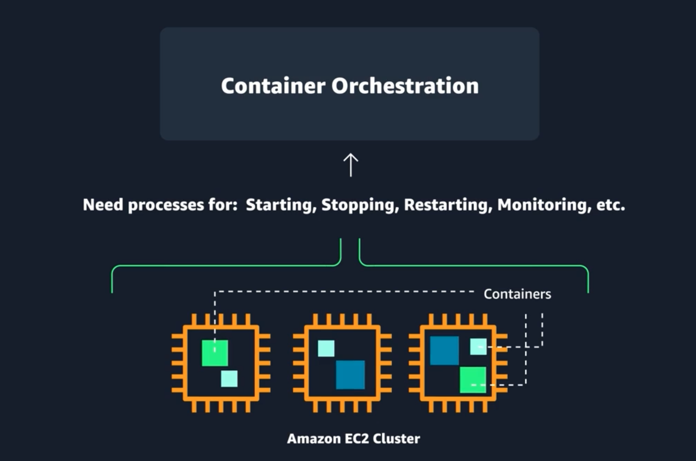

* Amazon Elastic Container Service (ECS)
* Amazon Elastic Kubernetes Service (EKS)

### What is a container image?

A *container image* is an immutable file with executable code that can create a container on a computing system. This means it cannot be changed, so it can be deployed consistently in any environment. It is a core component of a containerized architecture.

#### Container image example: Dockerfile

When creating Docker container images, they are composed in what is called a *Dockerfile*. A Dockerfile is a read-only template with instructions for creating a container image.

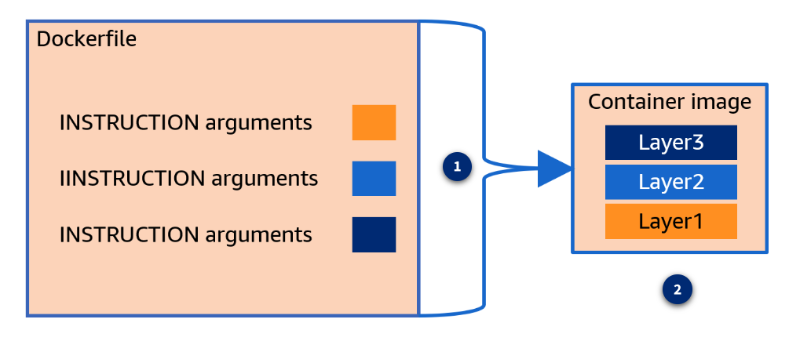

1. **Dockerfile**

    Each line or layer of the Dockerfile contains an instruction and then the arguments that the instruction uses. An instruction can specify the image on which to base your custom image, run certain executables, expose ports, and more. You can create custom images, or you can use images that were created by others and published to a public or private image registry.

2. **Container image**

    An image is usually based on another image, with some customization. To build a container image, the Dockerfile instructions are followed line by line.

Since container images are immutable, you represent a change in a Dockerfile as a build step and produce a new image. You can store container images in image registries for later use.

#### Building a Docker image

To build your own image, create a Dockerfile to define how to create the image and run it.

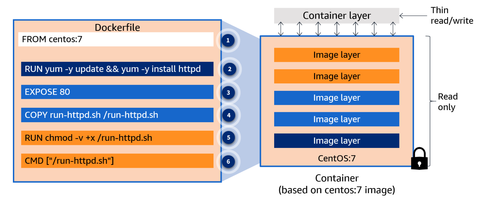

1. **FROM instruction**

    Every Dockerfile starts with the FROM instruction. It might be from another existing image, such as CentOS 7 in this example, or from a specific application image, such as OPENJDK or NGINX. You can also use FROM scratch, which is a reserved, minimal image that returns an empty filesystem.

2. **RUN instruction**

    The RUN instruction here updates all base image packages to the latest version and installs the Apache HTTP server. The RUN instruction runs any commands in a new layer on top of the current image and commits the results. This results in a new image that is used for the next layer in the Dockerfile.

3. **EXPOSE instruction**

    The EXPOSE instruction documents what network port to listen to at runtime. Here, the instruction is for port 80.

4. **COPY instruction**

    The COPY instruction copies files from the client file system and specifies their location in the container image file system. In this example, it copies your shell script for your application.

    The ADD instruction is similar to the COPY instruction. However, you can also use it to access a URL or extract a tar file.

5. **RUN instruction**

    This second RUN instruction gives the shell script executable permissions.

6. **CMD instruction**

    The CMD instruction defines what command the container should start when run. The instruction might be a shell script (as in this example), a shell built-in, or a call to an interpreted language runtime, such as Python or Node.js. A Dockerfile can have only one CMD instruction.

In addition to the instructions in this example, other keywords are available in a Dockerfile, such as the following:

* **LABEL** for image metadata
* **ENV** for setting environment variables
* **USER** for setting users on the image
* **WORKDIR** for setting the working directory for relative paths throughout the rest of the Dockerfile

If you change the Dockerfile and rebuild the image, the layer you changed and all the following layers are rebuilt. This is part of what makes container images lightweight, small, and fast in comparison to other virtualization technologies.

---

Most images are built on top of base images that are minimal OS distributions. These images share the host system's OS kernel, but provide the container with all necessary OS functionality.

More limited base images can also be used if, for instance, the container only needs to host a MySQL database or Python code.

---

#### A running container is an instance of an image

Think of container images as more permanent, unchangeable objects. Think of containers as ephemeral or temporary objects. You can have multiple running containers derived from the same container image. Containers can be disposed of and new containers can be instantiated from the container image.

### Using Image Repositories

#### Container image repositories

Container image repositories store, manage, and share container images. Similar to app stores for smartphones, image repositories are essentially directories of available container images. From there, each container image contains everything a software package needs to run, including code, resources, and any dependences for the software to function properly.

While many server packages function as container image repositories, this section focuses on Docker Hub and Amazon Elastic Container Registry (Amazon ECR).

#### Docker Hub

Docker Hub is a public registry service provided by Docker that allows you to store, manage, and distribute Docker container images. With Docker Hub, you can push and pull container images to share them with others. It acts as a centralized resource for trusted and enterprise-ready containers.

Docker Hub has more than 100,000 public images created by the Docker community that you can pull and use in your own projects. The key benefits of using Docker Hub include simplifying your development workflow, promoting collaboration across teams, and accelerating your software delivery. You can use the pre-built images on Docker Hub to skip low-level OS and app configuration tasks, letting you focus on your code.

#### Amazon ECR

The key difference between Docker Hub and Amazon ECR is that Docker Hub is a public registry while Amazon ECR is a private registry service. Amazon ECR is designed to work seamlessly with other AWS services and is hosted in your AWS account. Amazon ECR provides tight access controls, encryption, and integration with IAM for managing access to your container images.

Unlike the public Docker Hub, Amazon ECR keeps your container images private in your AWS environment. So while Docker Hub allows you to publicly share containers, Amazon ECR is best suited for storing private container images that should only be accessed in your company's AWS account and resources.

You can use your preferred command-line interface to push, pull, and manage Docker images, Open Container Initiative (OCI) images, and OCI compatible artifacts.

* **Registry functions**

    A container registry has two core functions: pushing containers (uploading them to the registry) and pulling containers (downloading them from the registry).

    Pushing a container is part of application development. A developer writes application code and packages it as a container, which is called *building* a container image. The developer then pushes the image to the registry.

    After an image is in the registry, it can be pulled to be run by your applications. This image pull is often managed by container orchestrators, which are services that automate much of the operational effort associated with running containerized applications.

* **Highly available**

    Because container registries are the central point from which container images are pulled, they play a key role in the availability of applications. If an application needs to scale up to meet increased demand, it will need to pull a certain number of container images to start new tasks or pods. However, if the registry storing the images isn’t able to scale up to fulfill the image pulls, the application won’t be able to scale up to meet demand. Amazon ECR is highly available and scales to meet your demands without any provisioning on your end. It can effectively support applications where availability and scalability are important.

* **Security and access control**

    Amazon ECR uses AWS Identity and Access Management (IAM) to control and monitor who and what can access your container images. Through IAM, you can define policies to allow users in the same AWS account or other accounts to access your container images in private repositories. You can further refine these policies by specifying different permissions for different users and roles, such as push only, pull only, or full administrator access. For example, a running web application might be allowed to pull images from its specified repository but no other repositories, and not be allowed to push images to any repository. Amazon ECR also provides container image vulnerability scanning, with a no-cost option (using Clair) and an enhanced option powered by Amazon Inspector Classic.

* **Encryption**

    You can transfer your container images to and from Amazon ECR through HTTPS. Your images are also automatically encrypted at rest using Amazon Simple Storage Service (Amazon S3) server-side encryption. Amazon ECR also lets you choose your own key, managed by AWS Key Management Service (AWS KMS), to encrypt images at rest.

* **Team and public collaboration**

    Amazon ECR supports defining and organizing repositories (such as folders in the registry) using name spaces, which you can use to group similar repositories. For example, if both team 1 and team 2 need development and production environments, you can create *dev/team1*, *prod/team1*, *dev/team2*, and *prod/team2*.

    You can control which actions another user can perform on your repository through resource-level policies. Then, you can share your repositories with different users and AWS accounts. You can also efficiently share your container artifacts with anyone in the world by storing them in a public repository to be found on the Amazon ECR website.

#### Additional considerations for Amazon ECR

##### Integrating Amazon ECR

Remember that Amazon ECR is rarely used by itself, but rather in conjunction with a container orchestrator like Amazon ECS or Amazon EKS. Amazon ECR is also integrated with continuous integration and delivery (CI/CD) tools, such as AWS Glue, to help customers automate deploying code changes. Integrating Amazon ECR with other tools typically happens when building a cloud solution and building workflows to automate deployments.

##### Securing the software development lifecycle

Customers developing containerized applications typically build containers iteratively, which means they build on top of an existing container in their registry. Registries are involved earlier in the software development lifecycle (SDLC) than container orchestrators like Amazon ECS and Amazon EKS. This means that registries play a key role in securing the SDLC, and many organizations are working to secure applications earlier in the development process to reduce risk.

##### Validation

Instead of validating the security of a container image only before it is deployed into production, a shift left would begin the validation process when the first container is built and pushed to a development repository. Amazon ECR offers features like integration with IAM, encryption at rest, and vulnerability scanning to help you secure your SDLC.

#### Using Amazon ECR with Docker

In this demo, we install a Docker client on an Amazon Linux 2023 Amazon Elastic Compute Cloud (Amazon EC2) instance. Then, we retrieve a container image that contains a MySQL Server on top of an Ubuntu distribution from an Amazon ECR public registry, instantiate and run a container, and connect to the database it hosts.

1. **​Install Docker client**

    On Amazon Linux 2023, we install a Docker client with the following commands:

    * **dnf install docker**: Installs the client.
    * **docker images**: Verifies that the Docker command works by listing the container images on the local host. There is no image yet.
    * **docker container ls**: Lists all the containers. There is no container yet on this EC2 instance.

2. **Browse the Amazon ECR public repository**

    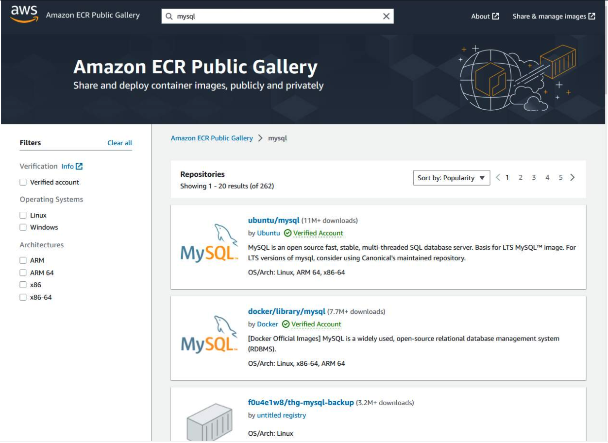

    Navigate to [https://gallery.ecr.aws](https://gallery.ecr.aws/) and look for a MySQL container. For this demo, we are using *docker/library/mysql*.

3. **Copy the image URL**

    

    We select *mysql 5.7.41* and copy the image name, which is public.ecr.aws/docker/library/mysql:5.7.41 in this example.

4. **Run the container**

    ```bash
    $docker run -d --name mysqlent -p 30306:3306 -e MYSQL_ROOT_PASSWORD=MyS3cr3t public.ecr.aws/docker/library/mysql:5.7.41

    $docker container Is
    CONTAINER ID IMAGE CREATED                              STATUS
    7cb4b7c36566 public.ecr.aws/docker/library/mysql:5.7.41 Up
    PORTS               NAMES
    0.0.0.0:30306>3306/tcp mysqlent
    ```

    We can now run the container using the Docker run command with the following options:

    * **-d**: Runs as a background task.
    * **-name**: Identifies the name for the container.
    * **-p**: Maps the port 3306 of the container to the port 30306 of our host. 3306 is the default port to access a MySQL instance. The mapping will let us connect through the port 30306 or our local host.
    * **-e** MYSQL_ROOT_PASSWORD: Sets the password for the root user.

    We then verify that the container is running by using the command **docker container ls**, which lists the running containers.

    The run command pulls the image from the repository before creating and running the container. You can also pull the container first by using the Docker pull command.

5. **Connect to the MySQL instance that runs in the container**

    ```bash
    $mysql -uroot -pMyS3cr3t -h127.0.0.1 -P30306
    Welcome to the MariaDB monitor.
    Server version: 5.7.41 MySQL Community Server (GPL)
    Copyright (c) 2000, 2018, Oracle, MariaDB Corporation Ab and others.
    Type 'help;' or '\h' for help. Type '\c' to clear the current input statement.
    MySQL [(none)]>
    ```

    We can now connect to our MySQL instance that is hosted in the container using the mysql command with the following options:

    * **-u**: We connect using the root user.
    * **-p**: The password is the one we previously passed to the Docker run command.
    * **-h**: The IP is 127.0.0.1, the local host, because the container is running locally on our EC2 instance.
    * **-P**: The port is 30306 that we previously mapped to the port 3306 of the container.

6. **Summary**

    In this example, we connected to an Amazon ECR public registry that is available to anyone. When you create your own images, you can publish them to an Amazon ECR public registry for anyone to use or to an Amazon ECR private registry for private use. An Amazon ECR private registry is provided to each AWS account. You can create one or more repositories in your registry and store images in them.

### [Lab: Using Dockerfile with Amazon ECR](./labs/W090Lab1DockerfileEcr.md)

In this lab, you will gain hands-on experience working with Docker images and Amazon Elastic Container Registry (Amazon ECR). This lab demonstrates how to build Docker images, test them locally, and push them to Amazon ECR repositories for storage and deployment. Hands-on experience with these steps will provide practical knowledge for working with containers and Amazon ECR.

In this lab, you will perform the following tasks:

* Verify the application on the Amazon Elastic Compute Cloud (Amazon EC2) instance
* Install Docker
* Create an Amazon ECR repository
* Build and push a Docker image to an Amazon ECR repository
* Pull an image from a second EC2 instance

---

### Deploying Containers at Scale

#### Container orchestration

Container orchestration refers to the automated arrangement, coordination, and management of containers and containerized applications. Orchestration tools allow users to easily deploy, scale, manage, and move containers across hosts in a cluster.

Orchestration is key for running containerized applications across multiple servers and enables portability across infrastructure while abstracting the underlying implementation. Using container orchestration is an essential practice for anyone operating containers at scale across a distributed computing environment.

The control plane and data plane are key components in a container orchestration system, and they provide distinct functionalities.

* **Control plane**

    The control plane is the part of a container orchestration system that manages and orchestrates containers across a cluster of nodes. It is responsible for scheduling containers, managing their lifecycle, maintaining desired state, rolling out updates, and monitoring health. The control plane typically runs on master nodes in a cluster.

* **Data plane**

    The data plane refers to the containers themselves, which run the actual applications and workloads. It comprises the distributed runtime environment where containers execute after being scheduled by the control plane. This includes container engines like Docker that run on each node.

#### AWS Fargate

AWS Fargate is a serverless compute engine for containers that works with both Amazon Elastic Container Service (Amazon ECS) and Amazon Elastic Kubernetes Service (Amazon EKS).

With Fargate, you can focus on building your applications by removing the need to provision and manage virtual machines. You configure and pay for compute resources on a per-application basis while also improving your security posture with application isolation by design.


The differences between using AWS resources with and without AWS Fargate.

With Fargate, there is no provisioning, patching, cluster capacity management, or infrastructure management required. You define your application content, networking, storage, and scaling requirements.

Containers let you package your code so it can run anywhere. Before, you had to provision and manage servers, often requiring complex infrastructure to run your containers. With AWS Fargate, you can now run serverless containers so you don't have to manage any service. Fargate can quickly launch tens of thousands of containers and will seamlessly scale to meet your application's compute requirements.

#### What problems does Fargate solve?

Fargate provides a holistic suite of capabilities aimed at bringing a serverless operating model into containerized workloads. Features such as automatic scaling, evergreen patching of underlying instances, and persistent storage options provide a robust, broad set of capabilities that align with diverse workloads. Abstracting the minutiae of virtual machine infrastructure frees development and operations teams to innovate more quickly and focus on higher-value activities for their own customers.

* **Infrastructure**

    Spend time **deploying and managing infrastructure**, optimize spending by supporting Spot Instances, Compute Savings Plans, and AWS Graviton2 processors.

* **Security**

    **Secure** containers through the use of a hardened environment that restricts privileged containers and host mounts, by deploying each workload in an isolated micro-virtual machine away from other workloads.

* **Data Storage**

    **Store data** with 20 GB of local ephemeral storage, by default, which can be expanded along with persistent storage integration with Amazon Elastic File System (Amazon EFS).

* **Compiance Standards**

    Consider **compliance standards** such as the Payment Card Industry Data Security Standard (PCI DSS), Health Insurance Portability and Accountability Act (HIPAA), Systems and Organization Controls 2 (SOC 2), and more.

#### Fargate benefits

AWS Fargate allows you to run containers without having to manage servers or clusters. It's a serverless compute engine for containers that makes it easy to deploy and scale containerized applications. By using Fargate, you don't have to provision, configure, and scale clusters of virtual machines to run containers.

* **Decreased Operational Overhead**

    When you operate containers, you have minimal infrastructure to deploy, harden, patch, and manage. Fargate regularly patches the underlying infrastructure, keeping host operating systems up to date. It also updates the versions used by the container runtime, storage plugins, orchestrator agents, and more.

* **Improved Security By Design**

    The norm in a container ecosystem is for disparate containers to be deployed together, collocated on the same cluster node. While containers form an isolation boundary through groups and namespaces, Fargate takes this a step further by wrapping Amazon ECS tasks or Amazon EKS pods in a micro-virtual machine, providing an additional hypervisor-based barrier that is unique. Fargate also restricts privileged containers, provides an elastic network interface for each task or pod that can be individually locked down through a security group, and encrypts the ephemeral drive, by default.

* **Optimized Spend**

    The traditional approach of sizing container deployments, where a cluster of nodes is created by estimating how much capacity to use without being wasteful, is challenging to maintain. Fargate shifts sizing from the virtual machine level to the container level. This means that operators can granularly and independently control the vCPU and memory allocated on a task-by-task basis, decreasing over-provisioning of costly resources. Fargate also includes support for a bevy of features that can help optimize spend further through Compute Savings Plans, Spot Instances, and deployment of Arm-based containers with Graviton2.

#### Fargate use cases

Fargate provides convenience through its serverless operating model, although there is a trade-off inherent to the value it offers. For users coming from an Amazon EC2 background, where the underlying operating system is available for adjustment, Fargate provides significantly less customization. Workloads that require specific kernel-level or OS-level adjustments and optimizations might not be usable with Fargate.

Fargate supports common container use cases, including microservices architecture applications, batch processing, machine learning applications, and migrations of on-premises applications to the cloud.

* **Microservices and Web Applications**

    Elastically scaling based on demand is a key capability of Fargate with both Amazon ECS and Amazon EKS. The operator can focus on the number of replicas in the container layer rather than also worry about a second underlying infrastructure capacity layer. A variety of metrics, including custom metrics, can be used to initiate scaling events and provide nuanced control of workload behavior.

* **Data Processing**

    Fargate can process data as part of a queue or workflow engine, scaling from zero to many tasks during high demand. It can then scale back to zero after processing is done, without juggling large pools of Amazon EC2 capacity. The Amazon ECS RunTask API and Kubernetes Jobs objects in Amazon EKS both help with asynchronous creation of containers that tidy up after themselves once processing is completed. Spot Instance support and Graviton2 help make this approach particularly cost-effective.

* **Legacy Workloads**

    Whether your application portfolio has existing investments in Java, .NET Framework, or other application types, Fargate can provide the benefits of a modern application stack. This includes faster scaling and centralized logging, along with removing the need to maintain legacy operating systems and orchestration platforms.

#### Architecting a cloud solution with AWS Fargate

After a container orchestrator, such as Amazon ECS or Amazon EKS, is chosen, Fargate might be selected as the compute layer for a workload. Fargate can also be used in conjunction with Amazon EC2 for compute through the Amazon ECS capacity provider feature, or on a per-namespace basis in Amazon EKS.

The following architecture diagram shows a microservice deployed with Amazon ECS and Fargate across multiple Availability Zones.

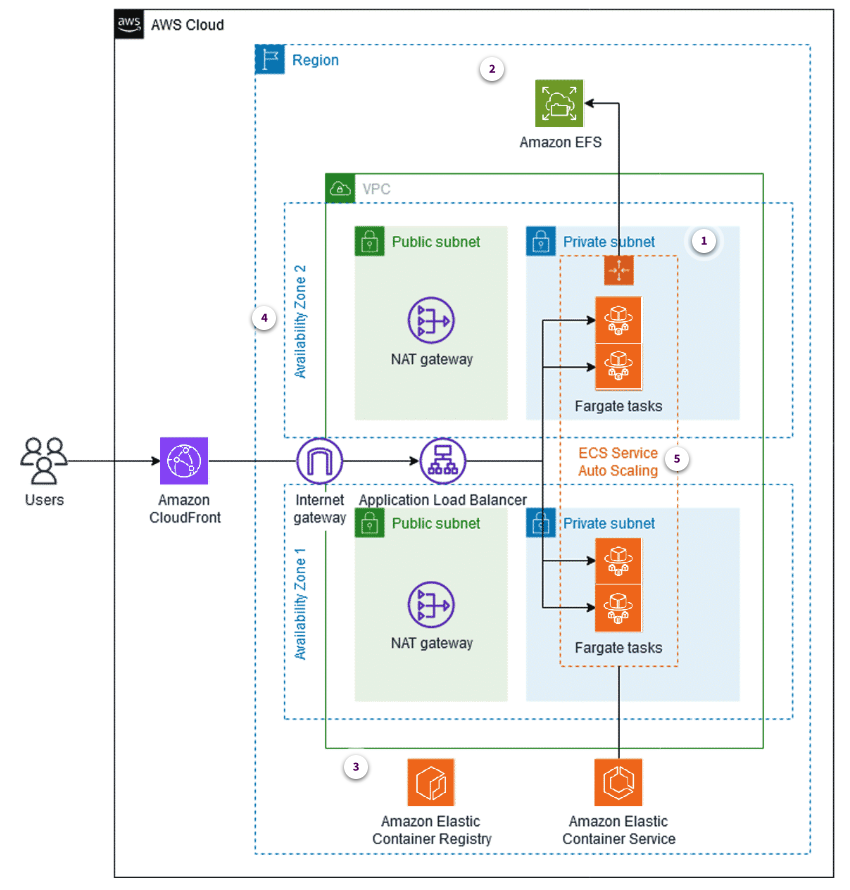

1. Task Networking

    Fargate tasks live in the private subnets provided to Amazon ECS.  By default, every Amazon ECS task on Fargate is provided an elastic network interface (ENI) with a primary private IP address. When using a public subnet, you can optionally assign a public IP address to the task's ENI.

2. Persistent Storage

    Data that needs to persist beyond the lifecycle of a given task can be stored in Amazon EFS. It grows and shrinks automatically as you add and remove files. This provides the storage your applications need, when they need it.

3. Image Storage

    Amazon Elastic Container Registry (Amazon ECR) is the best place to store images used with Fargate.  Amazon ECR supports private repositories with resource-based permissions. It uses AWS Identity and Access Management (IAM) so that specified users or Amazon EC2 instances can access your container repositories and images.

4. Resiliency

    Deploy tasks across Availability Zones for better resiliency. The replica scheduling strategy in Amazon ECS places and maintains the desired number of tasks across your cluster. By default, the service scheduler spreads tasks across Availability Zones.

5. Auto Scaling

Use the Amazon ECS auto scaling capabilities to provide the right capacity at the right time. When you use an auto scaling group capacity provider with managed scaling turned on, Amazon ECS creates two custom Amazon CloudWatch metrics and a target tracking scaling policy that attaches to your auto scaling group. Amazon ECS then manages the scale-in and scale-out actions of the group based on the load your tasks put on your cluster.

---

### Knowledge Check

#### How do containers differ from virtual machines?

* Containers share the underlying host system’s operating system kernel rather than containing the OS kernel.

Wrong answers:

* Containers can take a longer time to start than VMs.
* Containers go through an operating system boot-up cycle, while VMs do not.
* Containers require developers to keep the versions of their libraries in sync with their applications, while VMs do not.

##### Explanation

The containerization platform lets containers share a machine’s operating system kernel and exposes the underlying operating system file system.

The other options are incorrect because VMs contain the operating system that applications will run on. This means that a fresh launch of a VM requires a boot up of the operating system, which also makes launch time longer for VMs. Regardless of how an application is deployed, developers must maintain compatibility among their applications and libraries.

#### Which standardized unit of software holds everything that a software application requires to run, including relevant code, runtime, system tools, and system libraries?

* Container

Wrong answers:

* Task definition
* Service
* Cluster

##### Explanation

The other options are incorrect because tasks and services are ways of organizing containers for deployment, and clusters are the compute services that containers are hosted on.

#### What are key benefits of containers? (Select TWO.)

* They are portable.
* They are lightweight.

Wrong answers:

* They simplify accessing host hardware directly.
* Their contents can be quickly updated at runtime.
* They automate security management for their contents.

##### Explanation

Packing applications and their runtime requirements together leads to much simpler deployment across multiple systems. At the same time, they are designed to require just the runtime requirements specific to a given application.

The other options are incorrect because of the following:

* Since containers are isolated above the host operating system, directly accessing hardware isn't an intended use case for them.
* Deploying containers as a unit trades the flexibility to modify a deployment at runtime for easier-to-maintain compatibility and consistency.
* While using containers changes how security must be addressed, they do not provide automatic support for security management.

---

### Summary

#### Containers

A container is a standardized unit that packages your code and its dependencies. This package is designed to run reliably on any supported platform because the container creates its own independent environment. Docker is a widely used containerization platform.

#### Container hosting options

* **Amazon EC2**

    An Amazon ECS cluster infrastructure capacity can be provided by Amazon Elastic Compute Cloud (Amazon EC2) instances that you manage. Using Amazon EC2 as your host offers you more control over your infrastructure.

* **AWS Fargate**

    AWS Fargate is a serverless, pay-as-you-go compute engine that takes care of the infrastructure that your containers run on.

#### Container orchestration options

* **Amazon ECS**

    Amazon ECS is a fully managed container orchestration service that helps you deploy, manage, and scale containerized applications.

* **Amazon EKS**

    Amazon EKS is a managed container service used to scale Kubernetes applications in the cloud or on premises.

---

## WORKING WITH AMAZON EKS

### Amazon EKS Overview

#### Kubernetes objects

* **Cluster**: A cluster is a set of worker machines, called nodes, that run containerized applications. Every cluster has at least one worker node. A cluster also has a control plane that runs services that manage the cluster.

    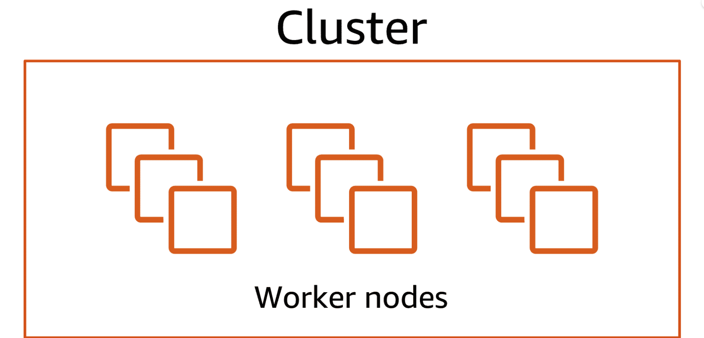

* **Node**: Kubernetes runs a workload by grouping containers into pods and assigning those pods to run on nodes. A node can be a virtual or physical machine, depending on the cluster. Each node is managed by the control plane and contains the services necessary to run pods.

    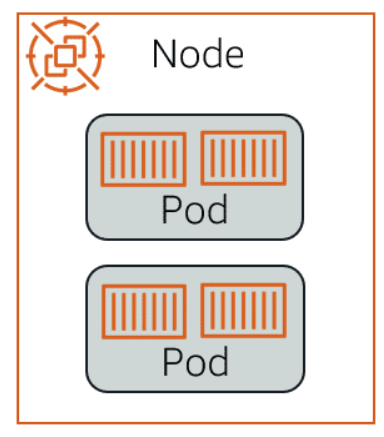

* **Pod**: A pod is a group of one or more containers. Pods are defined by a PodSpec file, a specification for how to run the containers. Pods are the basic building block in Kubernetes for deployment, scaling, and replication.

    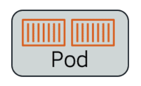

* **Ephemeral volume**: An ephemeral volume exists inside of a pod and is accessible to applications in that pod. When a pod ceases to exist, Kubernetes destroys ephemeral volumes.

* **Persistent volume**: A persistent volume functions similarly to an ephemeral volume but has a lifecycle independent of any individual pod that uses them. Persistent volumes are backed by storage subsystems independent of cluster nodes.

    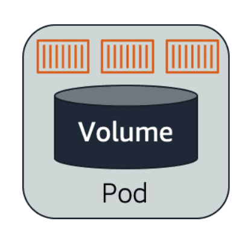

* **Service**: A service in kubernetes is a logical collection of pods and a means to access them. The service is continually updated with the set of pods available, eliminating the need for pods to track other pods.

    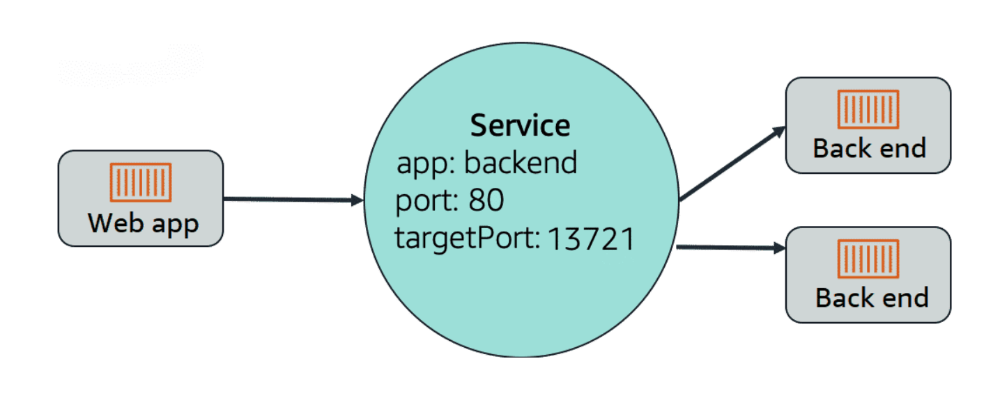

* **Namespace**: A namespace is a virtual cluster that is backed by the same physical cluster. Physical clusters can have resources with the same name as long as they are in different namespaces. Namespaces are especially useful when multiple teams or projects use the same cluster.

    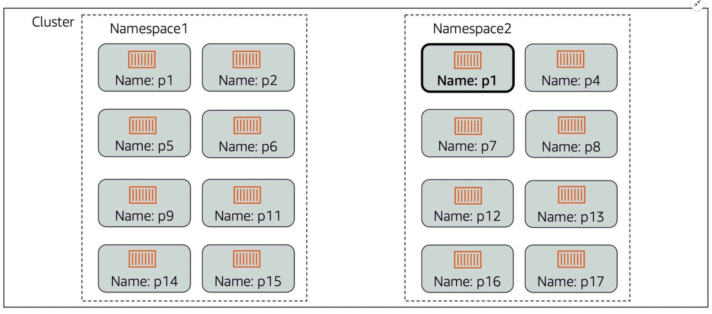

* **ReplicaSet**: A ReplicaSet is an object that ensures that a specific number of pod replicas are running at any given time.

    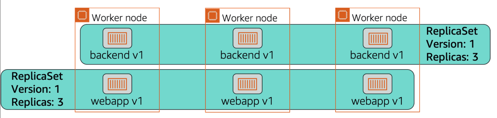

* **Deployment**: A Deployment owns and manages ReplicaSets or individual pods. Developers describe a desired state in the Deployment. The Deployment then changes the actual state of the cluster to the desired state at a controlled rate. Note that this is a specific Kubernetes object, not the general term applied to the result of deploying something.

    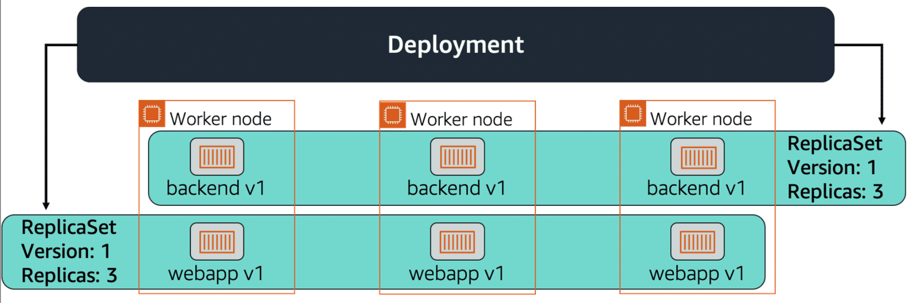

* **ConfigMap**: A ConfigMap is an API object that stores nonconfidential data as key-value pairs used by other Kubernetes objects, such as pods. Developers use ConfigMaps to follow the best practice of portability by separating configuration data from application code.

* **Secrets**: Secrets should store all confidential data, such as AWS credentials. Secrets restrict access to sensitive information. Optionally, encryption can be turned on to improve security.

    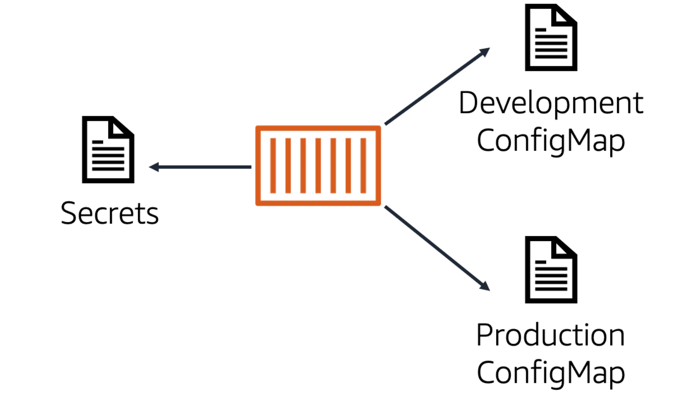

#### Pod scheduling

Scheduling a pod is the process of determining where a pod can be run. You can schedule pods with the Kubernetes scheduler. The scheduler checks the resources required by your pods and uses that information to influence the scheduling decision. The scheduler runs a series of filters to exclude ineligible nodes for pod placement

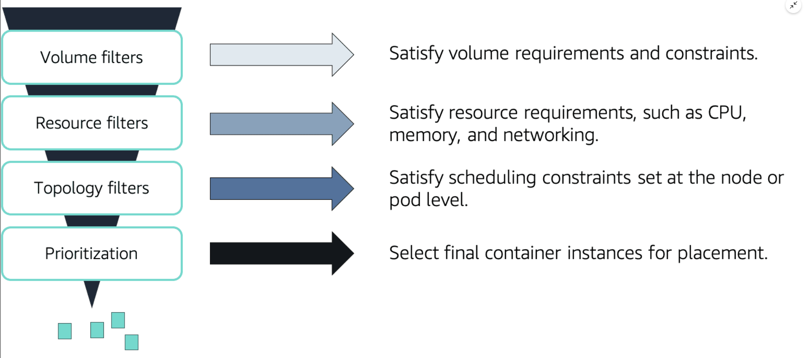

A funnel that shows the steps of filtering: volume filters (satisfy volume requirements and constraints), resource filters (satisfy resource requirements such as CPU, memory, and networking), topology filters (satisfy scheduling constraints set at the node or pod level), prioritization (select final container instances for placement).

#### Control plane and data plane

* **Control plane**: Control plane nodes manage the worker nodes and the pods in the cluster.

* **Data plane**: Worker nodes host the pods that are the components of the application workload.

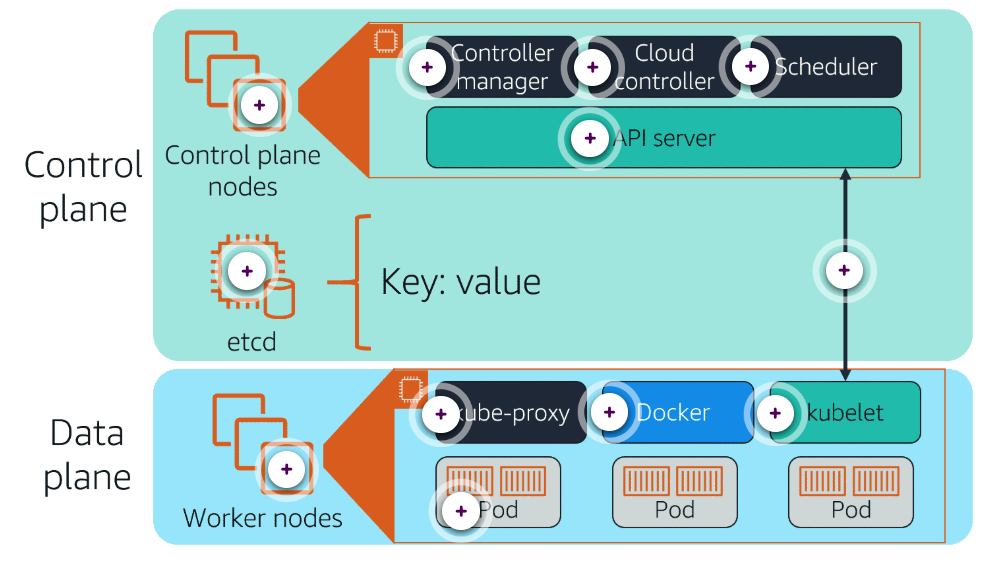

* **Control plane**

    The control plane determines when tasks are scheduled and where they are routed to. It includes:

  * Control plane nodes
    * Controller manager
    * Cloud controller
    * Scheduler
    * API server
  * etcd

* **etcd**

    This is the core persistence layer for Kubernetes. It is a highly available distributed key-value store. This is where the critical cluster data and state are stored.

* **Controller manager**

    The controller manager runs background threads called *controllers* that detect and respond to cluster events.

* **Cloud controller**

    The cloud controller is a specific controller that interacts with the underlying cloud provider.

* **Scheduler**

    The scheduler selects nodes for newly created containers to run on.

* **API server**

    The Kubernetes API server exposes the Kubernetes API and is the frontend for the Kubernetes control plane. It handles all communication from the cluster to the control plane. None of the other control plane components are designed to expose remote services. The Kubernetes API server is designed to scale horizontally, deploying more instances as necessary.

* **Control/data plane communication**

    Communication between the control plane and worker nodes is done through the API server to kubelet.

* **Data plane**

    In Kubernetes, the data plane is where your pods and the services they require are run. This is all done on your worker nodes.

    The data plane includes:

  * Worker nodes
    * kube-proxy
    * Container runtime
    * kubelet
    * Pods

* **kube-proxy**

    This helps with networking. It maintains network rules on the host and performs any connection forwarding that may be necessary.

* **Container runtime**

    Kubernetes supports several runtimes, with Docker being the most common.

* **kubelet**

    This is the primary agent that runs on the worker nodes. Kubelet makes sure that the right containers are running in a pod and that they are healthy.

* **Pods**

    A *pod* is a group of one or more containers. The containers in a pod are always colocated, scheduled together, and managed together. You cannot split containers in a pod across nodes. Applications in a pod can easily communicate with each other. Like individual application containers, pods are considered to be relatively ephemeral (rather than durable) entities. This means that pods can disappear if they become unhealthy, and new ones can take their place.

#### Custom resources

In addition to the resources that Kubernetes defines (such as pods and deployments), you can also extend the Kubernetes API to create custom resources. A custom resource could be a new object, such as a service mesh object, or it can be a combination of built-in Kubernetes resources. Custom resources are created with a **custom resource definition (CRD)**.

Custom resources can be controlled with custom controllers. Custom controllers run in pods on the worker nodes of your cluster. When used to automate the management of custom resources in a cluster, custom controllers are referred to as *operators*. It is a good practice to use operators instead of manually updating built-in Kubernetes objects.

#### kubectl

You can communicate with your control plane nodes using kubectl. kubectl is a command line interface (CLI) for communicating with the Kubernetes API server. It provides commands to create resources, view detailed information about the cluster and resources, and access troubleshooting tools. kubectl commands are used to roll out, manually scale, and automatically scale resources.

Syntax

```shell
kubectl [command] [TYPE] [NAME] [flags]
```

* **Command**: Specifies the operation you are performing.
* **Type**: Specifies the resource type.
* **Name**: Specifies the name of the resource.
* **Flag**: Specifies optional flags.

#### Pod deployment

Launching a pod in Kubernetes and Amazon EKS is a crucial step in setting up your containerized application. With Kubernetes, you can easily define and manage the deployment of your pods, ensuring that your application runs reliably and at scale. By using Amazon EKS, you can access the powerful managed Kubernetes service and focus on your application development while AWS handles the underlying infrastructure.

* To troubleshoot an issue with one of the pods on Amazon EKS use:

```shell
kubectl logs <pod_name>
```

* If a recently deployed pod is in Pending status, check if you have enough resources like CPU and memory available on nodes.

* A smooth rollout without downtime when deploying a new version of an application to Amazon EKS could be achieved using Kubernetes deployments that allows you to gradually roll out the new version.

---

### Configuring Amazon EKS

#### AWS shared responsibility model

AWS operates, manages, and controls the components from the host operating system and virtualization layer down to the physical security of the facilities in which the services operate. This means that AWS is responsible for protecting the global infrastructure that runs all the services offered in the AWS Cloud, including AWS Regions, Availability Zones, and edge locations. The AWS global infrastructure includes the facilities, network, hardware, and operational software (for example, host operating system and virtualization software) that support the provisioning and use of these resources.

Customers maintain complete control over their content and are responsible for managing critical-content security requirements, including customer content stored in AWS, the country in which the content is stored, who has access, and so forth. The type of Amazon Elastic Kubernetes Service (Amazon EKS)  shared responsibility model is contingent on a customer's choices for their cluster's data plane.

##### Shared responsibility model with self-managed workers

With Amazon EKS, AWS is responsible for managing the Amazon EKS managed Kubernetes control plane, including:

* Kubernetes control-plane nodes and services (for example, API server, scheduler, and so forth)
* etcd datastore
* Other infrastructure necessary for AWS to deliver a secure and reliable service

Amazon EKS customers are responsible for the data plane, including:

* AWS Identity and Access Management (IAM)
* Pod security
* Runtime security
* Network security
* Security of the code in container images

##### Shared responsibility model with managed node groups

Amazon EKS follows the shared responsibility model for common vulnerabilities and exposures (CVEs) and security patches on managed node groups. AWS is responsible for building patched versions of the Amazon EKS optimized Amazon Machine Image (AMI) when bugs or issues are reported. Customers are responsible for deploying the patched AMI versions to their managed node groups.

When managed nodes run a custom AMI, the customer is responsible for building and deploying patched versions of the AMI.

##### Shared responsibility model with AWS Fargate

With Fargate, AWS is responsible for securing the underlying container runtime to run customers' pods. While AWS assumes more responsibility for data-plane components, customers are still responsible for other aspects of running and maintaining their workloads, including:

* IAM
* Pod security
* Network security
* Security of the code in container images

#### Amazon EKS authentication and authorization

* **Authentication**: When a service or user wants to access your Amazon EKS or Kubernetes resources, the first step is to confirm their identity. If the presented identity credential is invalid, any further connection or communication is denied.
* **Authorization**: After authentication validates the identity, you determine if the system should allow the identity to perform the requested action. You can grant different permissions depending on the service or user. Perhaps a user is allowed to view the current pods that are running, but they can't create a deployment. Different identities can have different permissions.

#### How authentication and authorization happens in Amazon EKS

The process for authenticating identities and authorizing commands is different for AWS commands and Kubernetes commands.

##### Using the AWS API

For AWS commands, such as **aws eks create-cluster**, the AWS IAM service handles both authentication and authorization. In this respect, Amazon EKS behaves just like other AWS services.

##### Using the Kubernetes API

For Kubernetes commands, such as **kubectl get nodes**, Amazon EKS uses IAM user authentication to the Kubernetes cluster, but it relies on built-in Kubernetes RBAC for authorization. Using the IAM service for authentication simplifies cluster user management in the following two fundamental ways:

* Both IAM and Amazon EKS are integrated services managed by AWS.
* IAM addresses the issue of Kubernetes not providing end-user authentication.

All permissions for interacting with an Amazon EKS cluster’s Kubernetes API are managed through the built-in Kubernetes RBAC system.

#### Running a Kubernetes command with IAM and Kubernetes RBAC

The following image shows an example of running a Kubernetes command with IAM and Kubernetes RBAC.

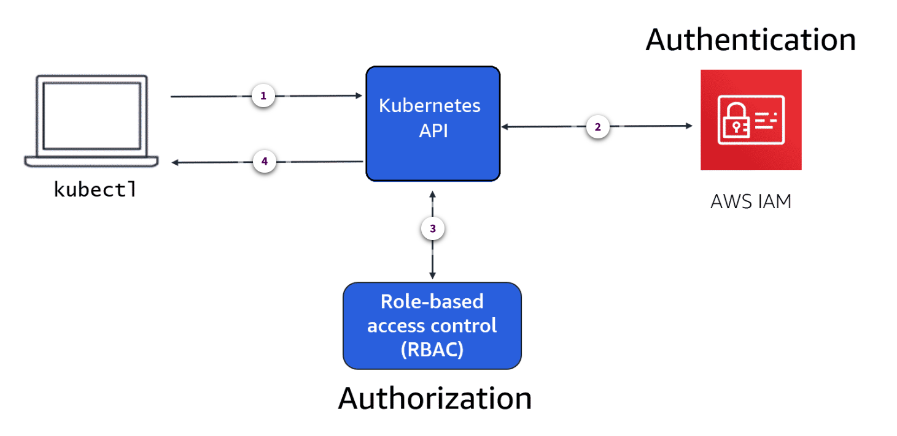

1. kubectl sends a command to Kubernetes API.
2. Kubernetes verifies your identity with IAM. IAM sends a token verifying your identity back to the Kubernetes API server.
3. The Kubernetes API server checks its internal RBAC mapping for authorization. This determines if your **get pods** call is allowed or denied.
4. If approved, the Kubernetes API server processes the request and sends back the list of pods. If denied, the client receives a message stating as such.

#### Configuring Permissions

There are three types of permissions to configure when deploying a new Amazon EKS cluster.

##### Cluster IAM Role

Amazon EKS requires permission to make calls to AWS APIs on your behalf to manage the cluster. For example, Amazon EKS needs permission to manage Amazon Elastic Compute Cloud (Amazon EC2) Auto Scaling for worker nodes. This permission is controlled by the IAM role assigned to the cluster. AWS provides an IAM policy with the recommended permissions for this role.

##### Node IAM Role

The **kubelet** daemon on Amazon EKS worker nodes makes calls to AWS APIs on your behalf; for example, pulling container images from the Amazon Elastic Container Registry (Amazon ECR). worker nodes receive permissions for these API calls through an IAM role assigned to the worker nodes.

##### RBAC User

The administrators who will manage your Kubernetes cluster need permission to make calls to the Kubernetes API. This is accomplished by mapping an IAM role to a Kubernetes RBAC user. The IAM role used to create the cluster will have full permission to manage the cluster, which is more permission than is usually required. For this reason, the best practice is that you create a specific IAM role just for deploying clusters. Create additional principals in IAM that map to more restrictive roles in RBAC for routine operations, following the principle of least privilege.

#### Setting up a pod

* **Add permissions to a pod**

    EKS Pod Identities is a feature that provides the ability to manage credentials for applications, similar to the way Amazon EC2 instance profiles provide credentials to Amazon EC2 instances.

1. Set up the EKS Pod Identity agent

    You must complete this procedure once for each cluster.

2. Assign an IAM role to a Kubernetes service account

    You must complete this procedure for each unique set of permissions that you want an application to have.

3. Configure pods to access AWS services with service accounts

    You must complete this procedure for each pod that needs access to AWS services.

4. Use a supported AWS SDK

    Finally, you must confirm that the workload uses an AWS SDK of a supported version and that the workload uses the default credential chain.

#### Configuring networking

Before creating an Amazon EKS cluster, you must decide whether you will use an existing Amazon Virtual Private Cloud (Amazon VPC) or if you will create a new VPC for your Amazon EKS cluster. If you use an existing VPC, it must meet specific requirements for use with Amazon EKS. For more information, see [Cluster VPC considerations](https://docs.aws.amazon.com/eks/latest/userguide/network_reqs.html) in the *Amazon EKS User Guide*.

VPCs for Amazon EKS clusters can use one of three common design patterns:

* Only public subnets
* Only private subnets
* Public and private subnets

##### Only Public Subnets

This VPC has two public subnets that are deployed into different Availability Zones in an AWS Region. All worker nodes are automatically assigned public IP addresses and can send and receive internet traffic through an internet gateway. A security group is deployed that denies all inbound traffic and allows all outbound traffic.  

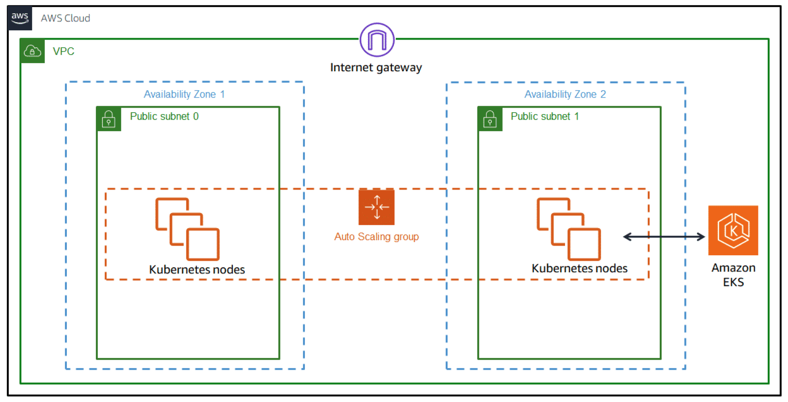

##### Only Private Subnets

This VPC has two private subnets that are deployed into different Availability Zones in an AWS Region. All nodes can optionally send and receive internet traffic through a NAT instance or NAT gateway. A security group is deployed that denies all inbound traffic and allows all outbound traffic.

The following diagram illustrates a basic configuration of worker nodes deployed to private subnets in two Availability Zones. The diagram includes an option of using NAT gateways to provide worker nodes external network access to other AWS services and the public internet. The NAT gateway in each Availability Zone deployment pattern is a recommended practice for meeting high availability requirements.

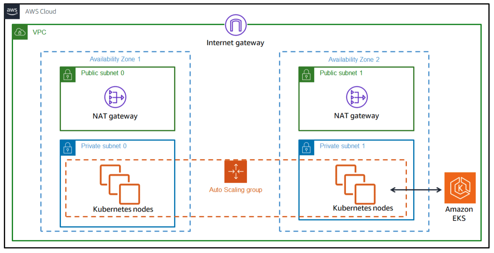

##### Public and Private Subnets

This VPC has two public subnets and two private subnets. One public and one private subnet are deployed to one Availability Zone. The other public and private subnets are deployed to a second Availability Zone in the same Region. AWS recommends this option for all production deployments. With this option, you can deploy your worker nodes to private subnets. Kubernetes can deploy load balancers to the public subnets. These load balancers can balance traffic to pods running on worker nodes in the private subnets.

Public IP addresses are automatically assigned to resources deployed to one of the public subnets. However, public IP addresses are not assigned to any resources deployed to the private subnets. The worker nodes in private subnets can communicate with the cluster and other AWS services. Pods can communicate outbound to the internet through a NAT gateway that is deployed in each Availability Zone. A security group is deployed that denies all inbound traffic and allows all outbound traffic. The subnets are tagged so that Kubernetes can deploy load balancers to them.

For more information about subnet tagging, see [Subnet tagging](https://docs.aws.amazon.com/eks/latest/userguide/network_reqs.html#vpc-subnet-tagging) requirements in the *Amazon EKS User Guide*.

For more information about this type of VPC, see [VPC with public and private subnets (NAT)](https://docs.aws.amazon.com/vpc/latest/userguide/VPC_Scenario2.html) in the *Amazon VPC User Guide*.

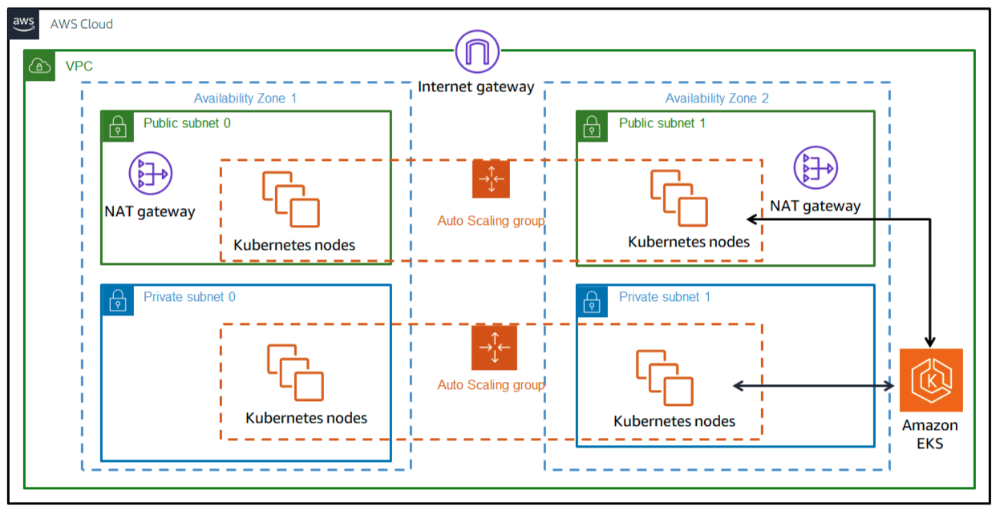

#### Creating Clusters

Before you create your first cluster, make sure that you have installed the required tools on the system you will be using to access the cluster, including:

* AWS Command Line Interface (AWS CLI)
* kubectl
* eksctl (optional)

Note that creating a cluster refers to the process of deploying the Amazon EKS managed control plane. Adding worker nodes to your cluster is a separate step.

You have a choice of which interface to use to create your cluster.

* **eksctl utility**

    eksctl is a command line tool that simplifies cluster creation. Using this method, you can create a cluster with a single command.

* **AWS Management Console**

    The AWS Management Console provides a graphical interface that handles many of the complexities of cluster creation for you.

* **AWS CLI**

The AWS CLI offers the most potential for customization. It also has the most complexity of the three methods.

#### Create a cluster with eksctl

This section shows cluster creation using eksctl, an AWS CLI tool for creating clusters on Amazon EKS using AWS CloudFormation. Weaveworks developed eksctl as a simple command line utility for creating and managing Kubernetes clusters on Amazon EKS.

##### What does eksctl do by default?

eksctl automates many of the steps involved in cluster and worker node creation. Here is an overview of the tasks performed by eksctl when it is run with the default option.

1. Creates IAM roles for the cluster and worker nodes.
2. Creates a dedicated VPC with Classless Inter-Domain Routing (CIDR) 192.168.0.0/16.
3. Creates a cluster and a node group.
4. Configures access to API endpoints.
5. Installs CoreDNS.
6. Writes a kubeconfig file for the cluster.

#### An example of installing eksctl and using it to create an Amazon EKS cluster

1. Install eksctl

    ```shell
    curl --silent --location "https://github.com/weaveworks/eksctl/releases/latest/download/eksctl_$(uname-s)_amd64.tar.gz" | tar xz -C /tmp
    sudo mv /tmp/eksctl /usr/local/bin
    ```

    This snippet shows installing eksctl on a Linux host. For more information, including examples of installing eksctl on other platforms, see [Getting started with Amazon EKS – eksctl](https://docs.aws.amazon.com/eks/latest/userguide/getting-started-eksctl.html).

2. Create a cluster

    ```shell
    $ eksctl create cluster -f •/prod-cluster-config yaml
    [i] eksctl version 0.44.0
    [i] using region us-west-2
    [i] subnets for us-west-2a - public: 192.168.0.0/19 private:192.168.96.0/19
    [i] subnets for us-west-2b - public: 192.168.32.0/19 private:192.168.128.0/19
    [i] subnets for us-west-2c - public: 192.168.64.0/19 private:192.168.160.0/19
    [i] using Kubernetes version 1.19
    [i] creating EKS cluster "prod" in "us-west-2" region with Fargate profile and managed nodes
    [i] 1 nodegroup (ng-prod) was included (based on the include/exclude rules)
    [i] will create a CloudFormation stack for cluster itself and 0 nodegroup stack(s)
    [i] will create a CloudFormation stack for cluster itself and 1 managed nodegroup stack (s)
    [i] if you encounter any issues, check CloudFormation console or try 'eksctl utils describe-stacks --region=us-west-2 --cluster=prod'
    ```

    This screen shows eksctl being run and the beginning of the output. As each step in the process is completed, output is displayed, showing success or failure. The process of creating a cluster takes approximately 8 minutes.

3. View your nodes

    ```shell
    $ kubect get nodes

    NAME                                            STATUS  ROLES   AGE VERSION
    ip-192-168-55-188.us-west-2.compute.internal    Ready   <none>  12d vl.19.6-eks-49a6c0
    ip-192-168-78-173.us-west-2.compute.internal    Ready   <none>  12d vl.19.6-eks-49a6c0
    ```

    After the output from eksctl indicates success, use kubectl to check the status of the nodes that were created to verify that they are in the Ready state.

#### Demonstration: Examine an Amazon EKS cluster in the AWS Management Console

In this demonstration, you'll explore a newly configured Amazon Elastic Kubernetes Service, or Amazon EKS, cluster in the AWS Management Console. The cluster was built in the us-west-2 Region. Before inspecting the cluster, first ensure the correct Region is selected in the console. Oregon, also known as us-west-2, appears on the screen.

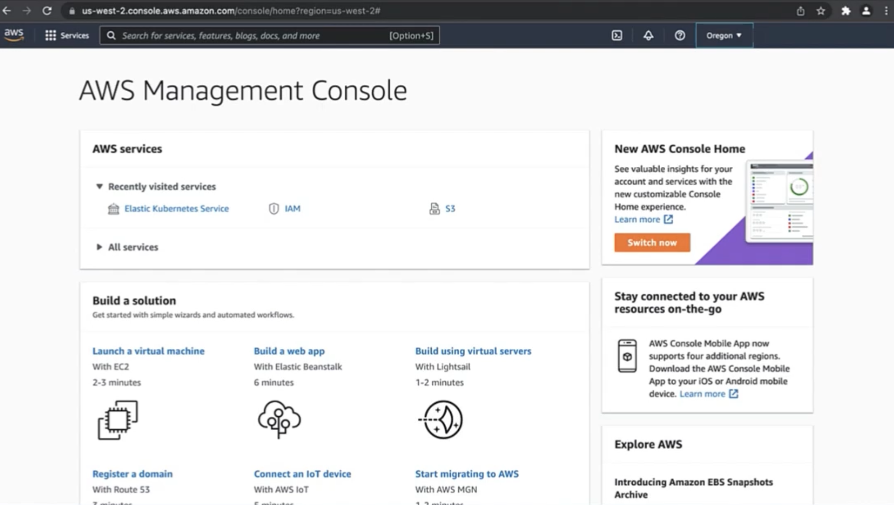

Launch the Amazon EKS service. Search for the Amazon EKS service by typing "EKS" in the search bar. Finally, select the Elastic Kubernetes Service under the services category.

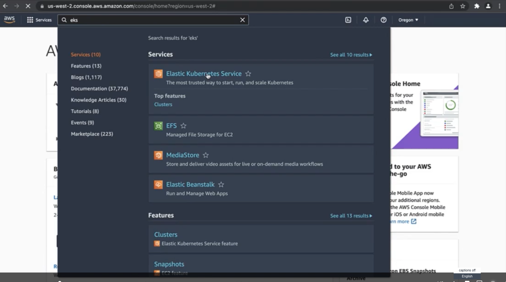

The Amazon EKS homepage contains general information about the service, including product documentation and pricing.

To launch the Cluster Dashboard, select the Clusters link on the left side of the screen under the Amazon EKS heading. The next screen shows that only one Amazon EKS cluster exists. The status shows Active and running Kubernetes version 1.21, which is the latest available Kubernetes version as of this recording.

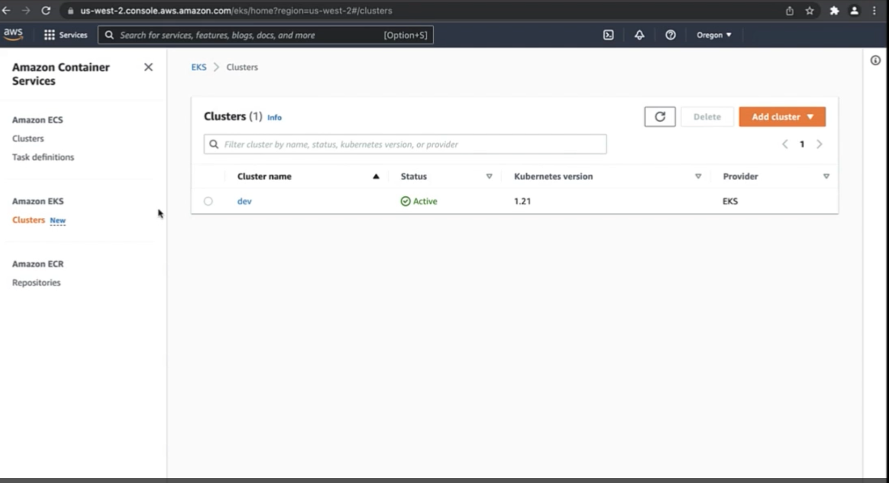

Select the dev cluster to review the configuration. This next screen presents details about the worker nodes.

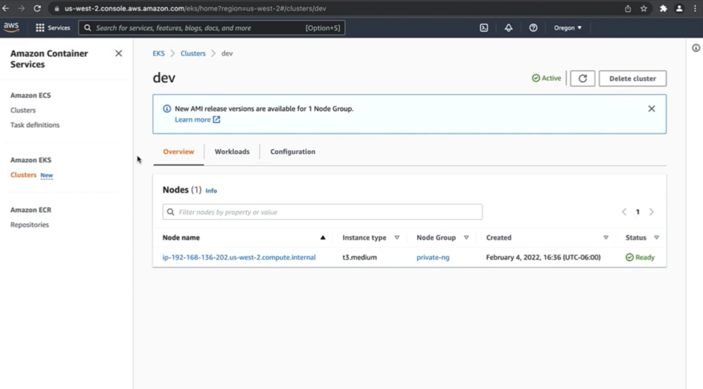

Select the Workloads tab to see which applications are running on the cluster. Options to filter by namespace is available in the list below. Other options to filter by some other value are available from the search bar. All namespaces are already selected. The current list shows the details of all workloads running in the cluster, the type of cluster object, deployment and DaemonSet in this case, the number of pods and so forth. Amazon EKS supports multiple kinds of workloads, including deployment, StatefulSet, DaemonSet and Job, and Amazon EKS cluster will always include these three workloads: **aws-node**, **coredns**, and **kube-proxy**, - which define basic Amazon EKS functionality.

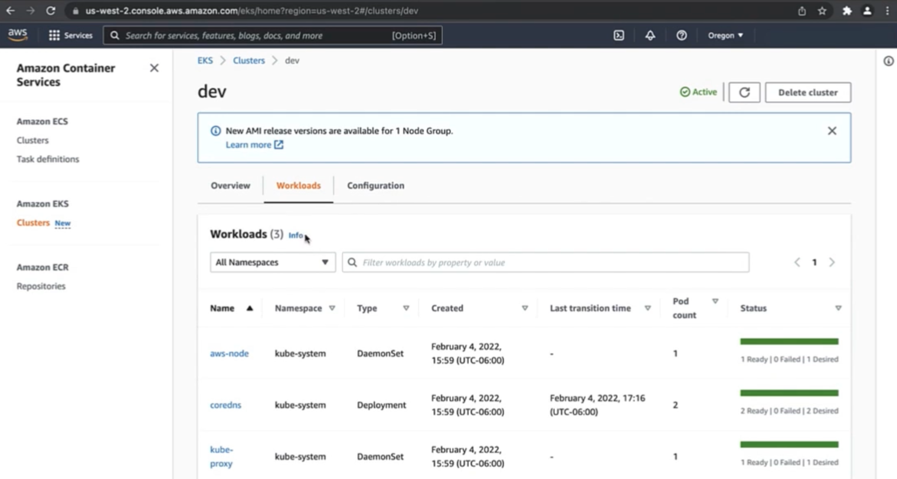

For this demonstration, select the coredns link to see how it's configured in the Amazon EKS cluster. Coredns provides name resolution and service discovery inside of Kubernetes. By default, coredns runs as a deployment, consisting of two replicas in the kube-system namespace. Additional metadata about the workload and details about the pods running in the workload can be accessed here.

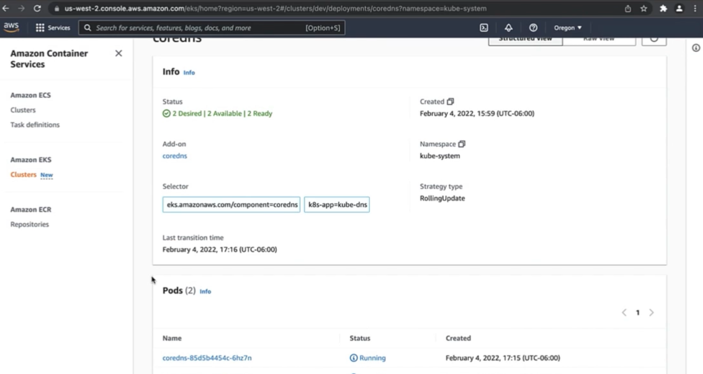

For more information on the cluster configuration details, select dev from the breadcrumb list, then select Configuration tab from this screen.

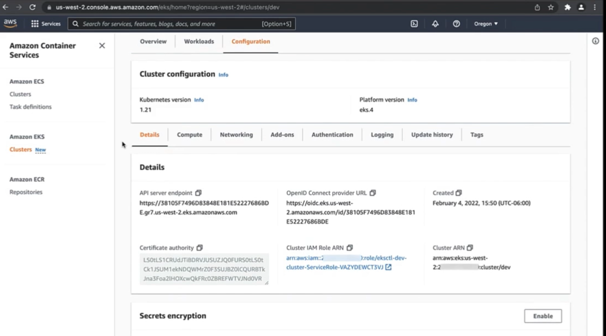

This screen highlights critical information about the cluster and the control plane, including the Amazon Resource Names, or ARNs, and the OpenID Connect provider. If secrets encryption has been activated, you will also find the corresponding AWS Key Management Service key beneath the Details card.

Next, select the Compute sub-tab. On this screen, configuration details are available for the clusters managed, unmanaged or Fargate node groups.

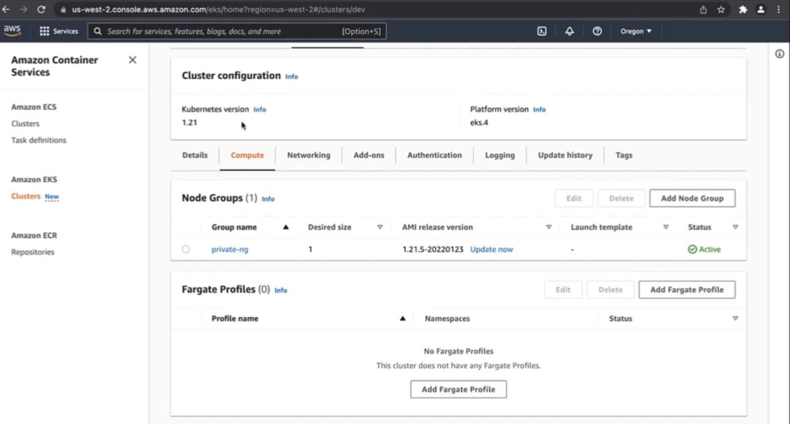

For this demonstration, one node group called private-ng with the desired size of one has been configured already. Select the private-ng link to see more information about it.

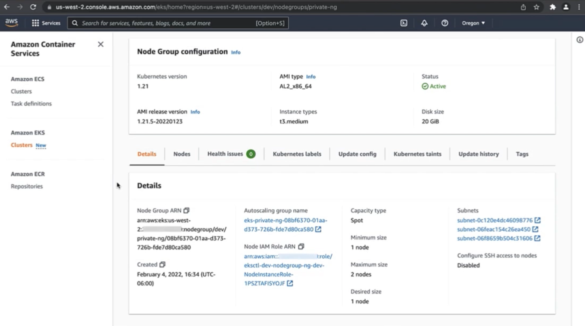

At the top of the screen is an overview of key information about the node group, including the EMI type, release version, instance type and other details. Further down the page is information on the node group ARN, the minimum, maximum and desired number of nodes and the configured subnets. The additional sub-tabs, Nodes, Health Issues, Kubernetes Labels, and so forth, provide the status of the nodes and additional node-configuration details within the EKS cluster.

To move on, select dev in the breadcrumbs at the top of the page to return to the previous screen. Next, select the Networking sub-tab.

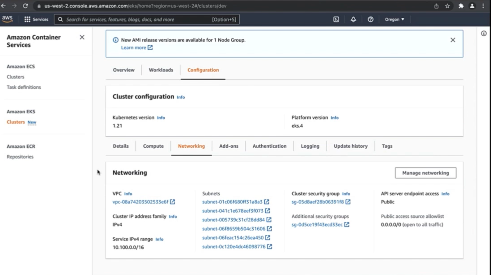

This sub-tab shows you the VPC in which your cluster has been configured. The sub-tab also shows the subnets it runs in and the security group's controlling traffic to and from the cluster. By default, the Kubernetes API server endpoint is assigned a public IP address. Access to the Kubernetes API server is secured using a combination of AWS identity and access management and native Kubernetes role-based access control. Restricting access to the Kubernetes API server to your VPC or a particular range of IP addresses is possible and requires additional configuration.

Next, select the add-ons sub-tab.

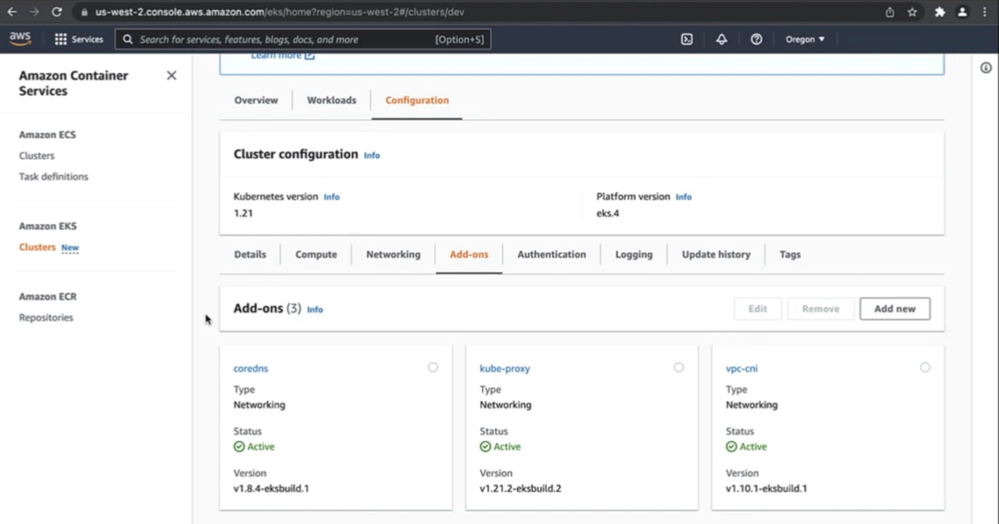

Add-ons are operational software that provide key functionality to support your Kubernetes applications. Because this is a new Amazon EKS cluster, the add-ons shown here, that is the kube-proxy, coredns, and vpc-cni, are what were installed and configured at cluster creation. Adding, removing, and upgrading add-ons is also an option here.

Moving on, select the Authentication sub-tab to view how user access is managed. As you can see, the dev cluster can be configured to use OpenID Connect, commonly referred to as OIDC, as an existing identity provider.

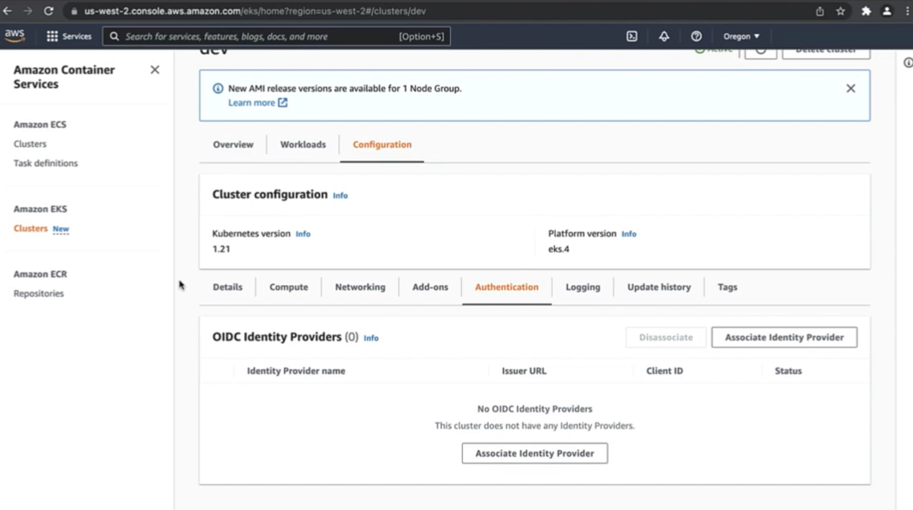

OIDC sits on top of OAuth 2.0 and provides login and profile information about a cluster's users. With OIDC, you can manage access to your cluster using the same set of rules and procedures your organization already follows for creating, activating, and deactivating employee accounts. For more information about OIDC, select the Info button at the top of the card.

Lastly, select the Logging sub-tab to view the monitoring for the cluster. By default, Control Plane Logging is deactivated. You could activate logging by selecting the Manage Logging button and then selecting the specific logs you want sent to Amazon CloudWatch.

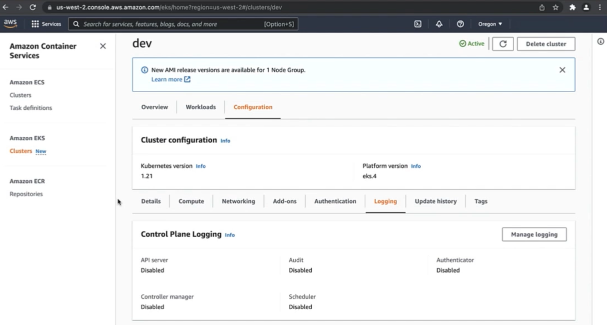

##### Additional Information

* [What is Amazon EKS?](https://docs.aws.amazon.com/eks/latest/userguide/what-is-eks.html)
* [Getting Started with Amazon EKS](https://docs.aws.amazon.com/eks/latest/userguide/getting-started-console.html)

---

#### Configuring horizontal and vertical scaling

Amazon EKS supports automatic scaling of worker nodes and pods to match workload demands. The Cluster Autoscaler tool can be used to automatically add or remove nodes based on pending pods, while the Horizontal Pod Autoscaler can scale the number of pods in a deployment or ReplicaSet. Both horizontal pod and node automatic scaling can be configured on Amazon EKS clusters to achieve efficient resource usage by scaling resource capacity up or down as needed. Using automatic scaling helps optimize performance and costs by allocating only the resources needed to meet application demands.

* **Pod Autoscaler**

    A Pod Autoscaler automatically scales the number of pods in a deployment or ReplicaSet based on observed CPU use or other selected metrics. The Kubernetes Horizontal Pod Autoscaler can automatically scale the number of pods in a deployment depending on CPU use or other application-provided metrics. This allows scaling the number of pods up or down in response to a real-time load.

* **Node Autoscaler**

    A Node Autoscaler automatically scales the number of nodes in an Amazon EKS cluster based on metrics like CPU use or number of pods pending scheduling. The Amazon EKS Cluster Autoscaler tool can automatically scale the number of nodes in your Amazon EKS cluster to meet application demands and optimize costs. It increases or decreases the number of nodes based on pending pods or custom metrics from various services. This allows scaling cluster capacity up or down in response to load changes.

#### Comparing horizontal and vertical scaling

* **Horizontal scaling**

    A horizontally scalable system is one that can increase or decrease capacity by adding or removing compute resources. In this example, more pods are deployed when demand spikes (scale out). Pods are removed when demand drops (scale in).

    

* **Vertical scaling**

    A vertically scalable system increases performance by adding more resources to the compute resource, such as faster (or more) CPUs, memory, or storage.

    In this example, the size of pods (CPU and memory resources assigned) is increased when demand spikes (scale up) and decreased when demand drops (scale down).

    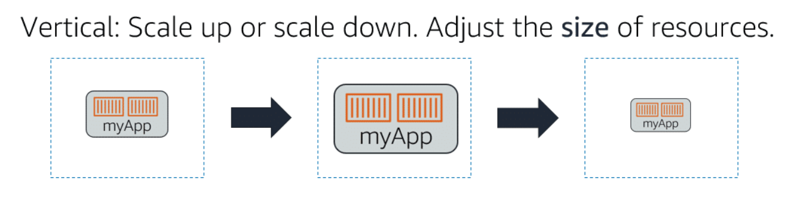

When it comes to traditional server infrastructure, scaling application workloads horizontally is difficult to manage compared to managing scaling vertically. This is less true when you consider cloud computing and Kubernetes. Kubernetes has mechanisms to scale application workloads both vertically and horizontally.

---

### Kubernetes automatic scaling

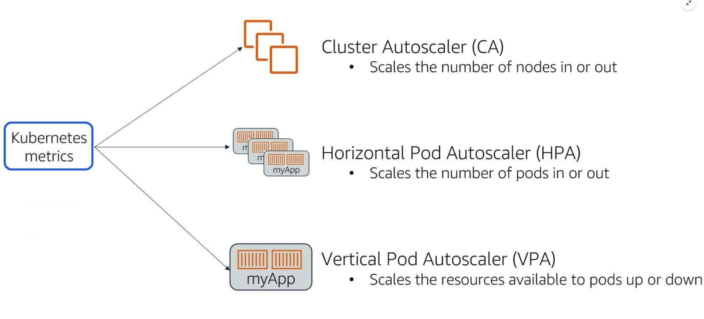

This diagram shows Kubernetes automatic scaling; focusing on Cluster Autoscaler, Horizontal Pod Autoscaler, and Vertical Pod Autoscaler.

#### Cluster Autoscaler

The Kubernetes Cluster Autoscaler automatically adjusts the number of nodes in your cluster when pods fail to launch. The failure to launch can result from a lack of resources or when nodes in the cluster are underused and their pods can be rescheduled onto other nodes in the cluster. In Amazon EKS, this is accomplished by adding your worker nodes to EC2 Auto Scaling groups. A simple way to configure this is to deploy a cluster with managed node groups using eksctl.

Amazon EC2 Auto Scaling automatically adjusts capacity to maintain steady, predictable performance at the lowest possible cost. The dynamic scaling capabilities of EC2 Auto Scaling automatically increase or decrease capacity based on load or other metrics. When demand goes up, Amazon EC2 Auto Scaling scales out. When demand goes down, Amazon EC2 Auto Scaling scales in. The number of instances will not go above the maximum or below the minimum.

#### Karpenter: An alternative to Cluster Autoscaler

Karpenter is a node lifecycle management solution. It observes incoming pods and launches the right instances for the situation. Instance selection decisions are intent-based and driven by the specification of incoming pods, including resource requests and scheduling constraints.

When deployed, Karpenter will perform the following actions:

* Launch nodes for unscheduled pods
* Replace existing nodes to improve resource use
* Terminate nodes if outdated or no longer needed
* Drain nodes gracefully before preemption

---

Karpenter is currently in development and available for early adopters. It is not yet ready to be used in production and has not yet been rigorously tested for scale and performance. For more information, see the [Karpenter repo on GitHub](https://github.com/awslabs/karpenter).

---

#### Horizontal Pod Autoscaler

The Horizontal Pod Autoscaler (HPA) is a Kubernetes component that automatically scales your service in or out based on CPU use or other metrics that you define through the Kubernetes metrics server.

In the following example, a CPU percentage of 50 percent is specified when the HPA resource is created. When CPU usage exceeds 50 percent of the allocated container resource, the HPA scales out from the minimum specified (1) to the configured maximum (10). It scales out until the CPU average is below the target (50 percent) or the maximum is reached. When the load decreases, Amazon EKS slowly brings the number of instances back to the minimum number.

```shell
kubectl autoscale deployment myapp --cpu-percent=50 --min=1 --max=10
```

The Horizontal Pod Autoscaler uses CPU use by default, but it can be configured to use custom metrics, such as metrics from Amazon CloudWatch.

#### Vertical Pod Autoscaler

The Kubernetes Vertical Pod Autoscaler (VPA) automatically adjusts the CPU and memory reservations for your pods to help rightsize your applications. This adjustment can improve cluster resource usage and free up CPU and memory for other pods.

##### VPA example

This is an example of the Vertical Pod Autoscaler in action.

1. Step 1

    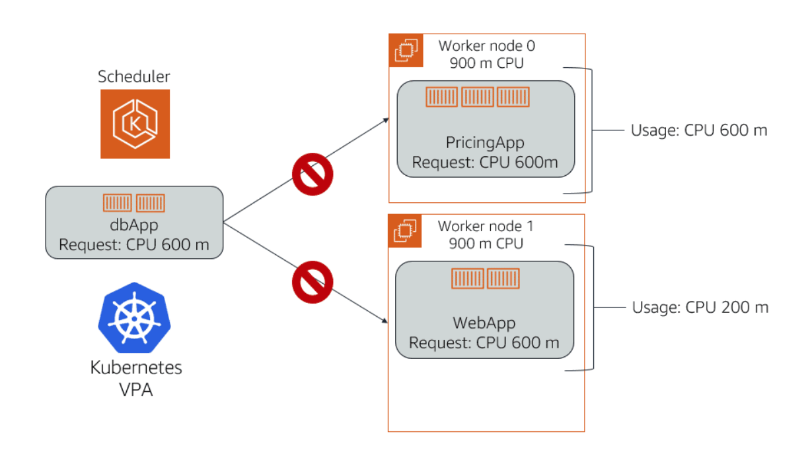

    A pod (**dbApp**) is waiting to be scheduled. It cannot run because there are not enough CPU resources on any nodes to accommodate it. However, although the **WebApp** pod has requested 600 m of CPU, it’s only using 200 m.

2. Step 2

    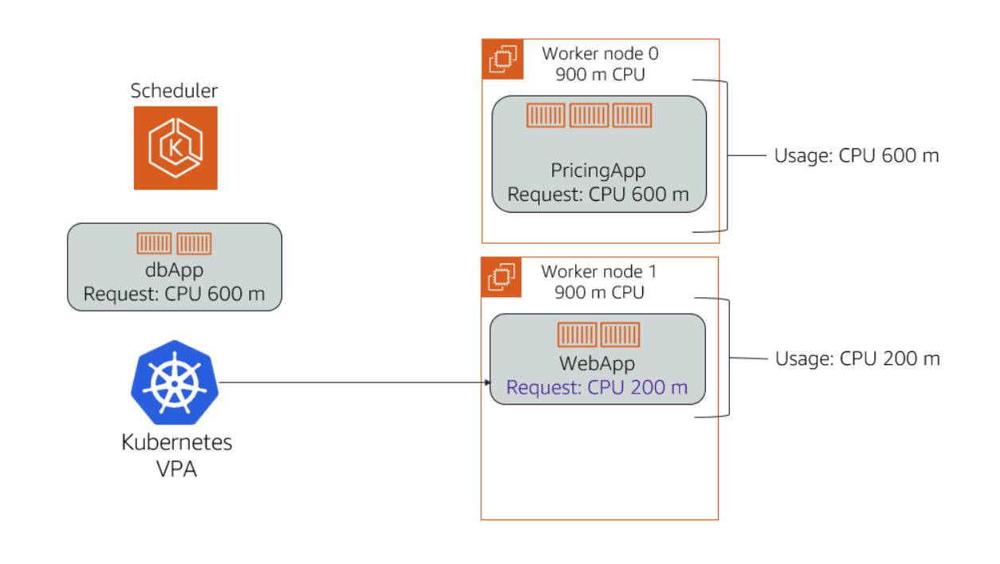

    The Kubernetes Vertical Pod Autoscaler adjusts the resource reservation of the **WebApp** pod to align to its actual usage.

3. Step 3

    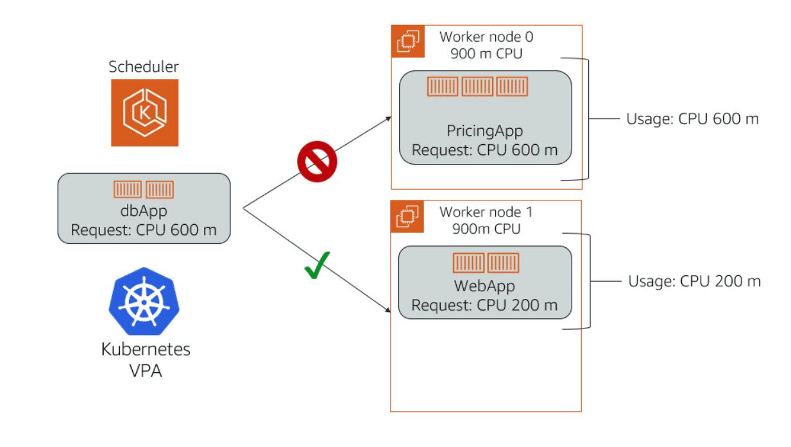

    Adequate resources are now available for the scheduler to run the **dbApp** pod on node 1.

4. Step 4

    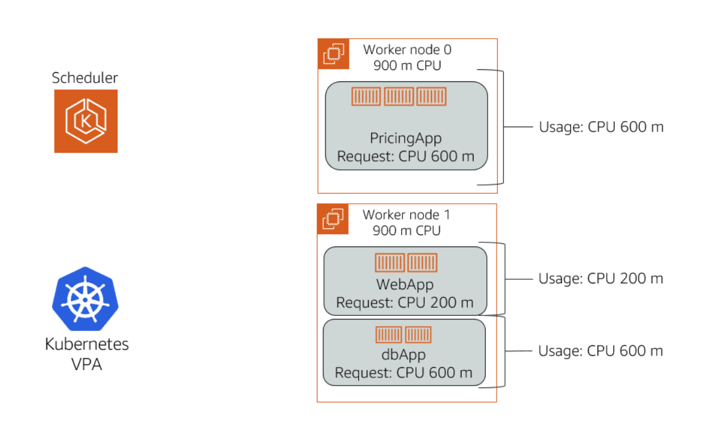

    The **dbApp** pod is now running on node 1.

---

#### Demonstration: Deploy an application and scale worker nodes

In this demonstration, you will examine both pod and node auto scaling within Amazon EKS. The demonstration starts with deploying a simple web application into an EKS cluster. Afterwards, you will observe how auto scaling occurs in response to the application under pressure. This demonstration focuses on the scaling capability of both the Horizontal Pod Autoscaler (HPA) and the Cluster Autoscaler.

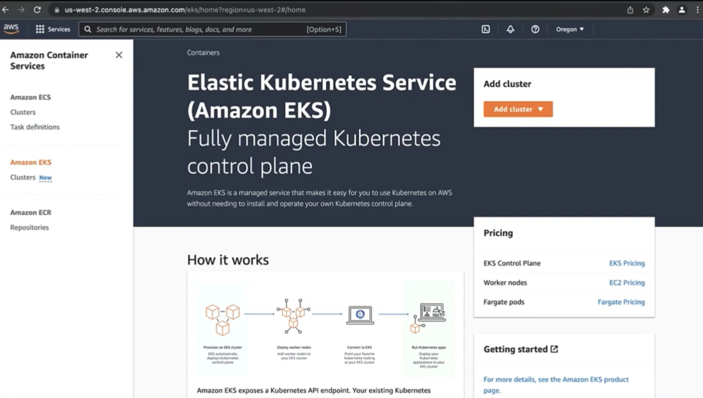

First, start with the Amazon EKS cluster named dev in the Oregon Region, as shown in a previous demonstration. This cluster is configured to use a worker node with lean compute resources in order to observe cluster scaling. From the Clusters dashboard, select the dev cluster, then open the Workloads tab.

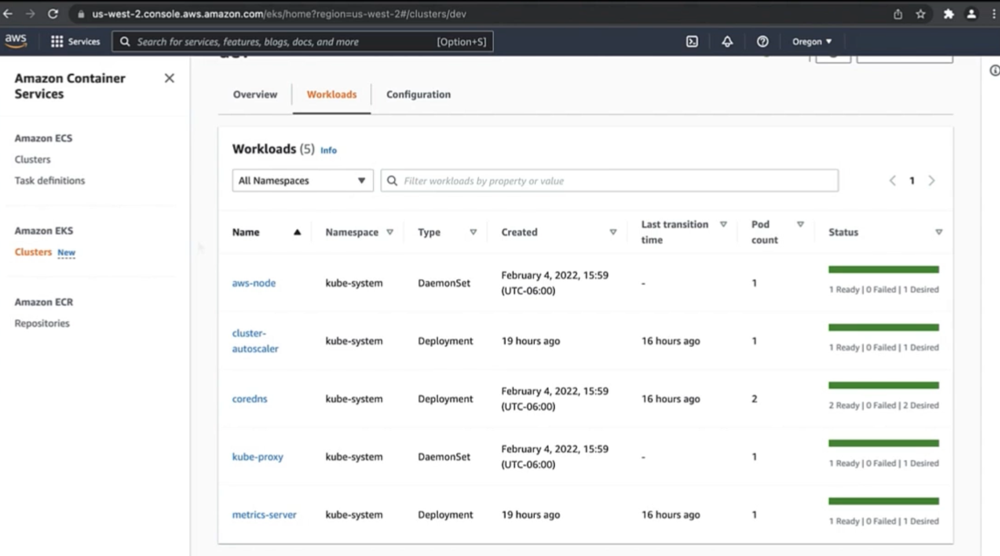

This page displays a list of all the applications that are running in the cluster. In this case, you can see that there are five workloads currently running. **CoreDNS**, **aws-node**, and **kube-proxy** are standard workloads that come **preinstalled on all EKS clusters**. These other two applications, **cluster-autoscaler** and **metrics-server**, are prerequisites that must be installed to activate both pod and cluster scaling. The metrics-server add-on runs as a deployment in the kube-system namespace. The add-on collects and organizes resource usage data in the cluster. The Horizontal Pod Autoscaler uses the metrics-server data to determine scaling events. The cluster-autoscaler add-on runs as a deployment in the kube-system namespace also. When the add-on observes a pod in a pending state, the cluster-autoscaler will add another worker node to the cluster to allow the pending pod or pods to run.

In this demonstration, these applications will work together to collect resource usage data within the cluster and then adjust the number of pods and nodes accordingly.

Now that the cluster is running and has the requisite cluster components installed, the next step is to use the kubectl utility to simulate a scaling event and observe what happens.

First, run a command to view all the pods in the cluster.

```shell
kubectl get pods -o wide -A
```

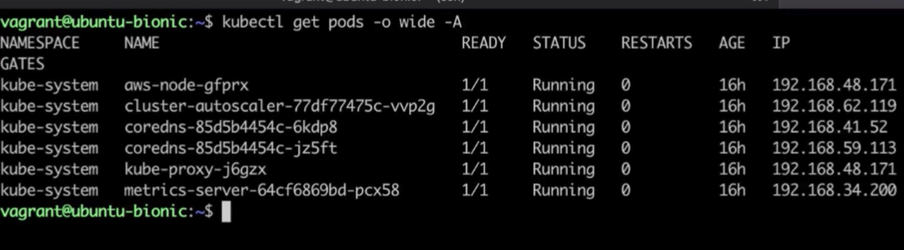

The output shows the same five applications that are listed on the Workloads page in the AWS Management Console are listed here. Next, install a php-apache server as the target application to activate the scaling activity.

```shell
kubectl apply -f https://k8s.io/examples/application/php-apache.yaml
```

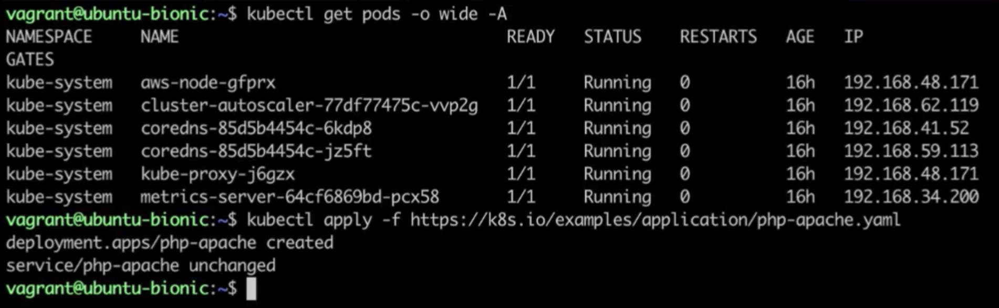

This simple PHP application will perform CPU-intensive computations upon receiving an HTTP GET event. The application provides a way to simulate load within a Kubernetes cluster. Next, take closer look at how the new deployment is configured.

```shell
kubectl describe deployment php-apache
```

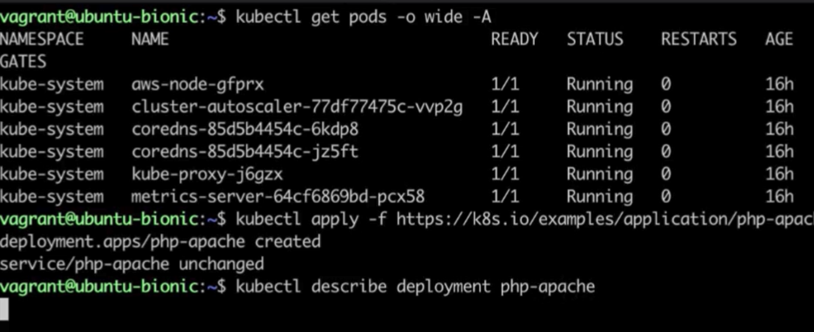

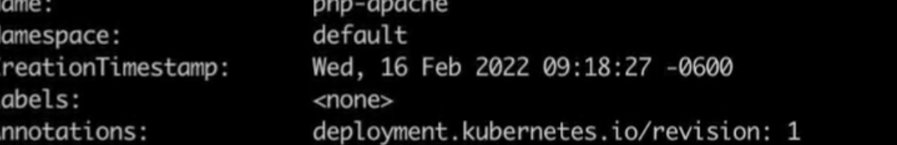

Currently, the deployment is configured to request 200 millicpus but is permitted to consume a maximum of 500 millicpus. This is equivalent to half of a virtual CPU, which means the deployment is set for testing automatic scaling.

Now, create a Horizontal Pod Autoscaler resource that will scale the number of pods in this deployment.

```shell
kubectl autoscale deployment php-apache --cpu-percent=50 --min=1 --max=10
```

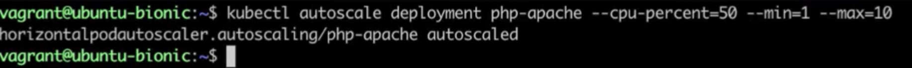

This command creates an HPA that targets 50 percent CPU utilization for the deployment, with a minimum of one pod and a maximum of 10 pods. When the average CPU load is below 50 percent, the HPA tries to reduce the number of pods. Similarly, when the load is greater than 50 percent, the HPA tries to increase the number of pods in the deployment, up to a maximum of 10. For this demonstration, the existing worker nodes will not have enough requested resources to accommodate the number of additional pods. The Cluster Autoscaler should add another worker node to handle any pending pods.

To watch the scaling activity in real time, open a new terminal connection and use the following command.

```shell
watch "kubectl get nodes; echo; kubectl get hpa,pods -o wide”
```

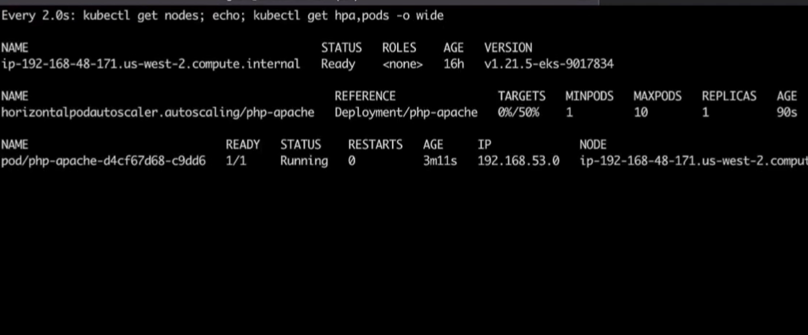
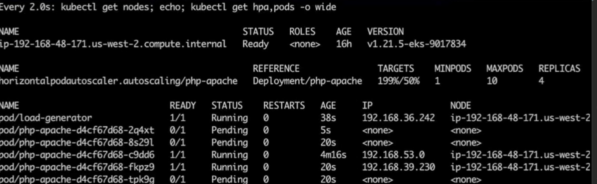

Next, simulate load by running a container that sends an infinite loop of requests to the Apache web server.

```shell
kubectl run -i --tty load-generator --rm --image=busybox --restart=Never -- /bin/sh -c "while sleep 0.01; do wget -q -O- http://php-apache; done"
```


As the CPU load increases, the HPA adds replicas, up to a maximum of 10.

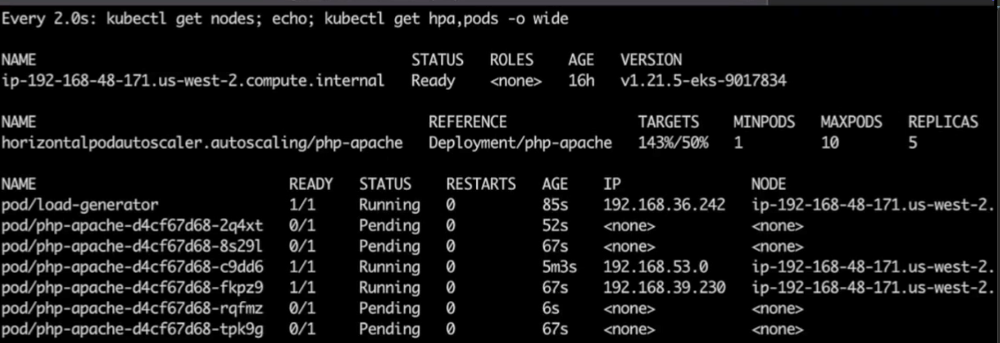

Additionally, the Cluster Autoscaler creates an additional node, which you can see from the command output.

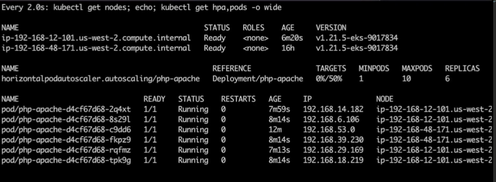

In the AWS Management Console, the Autoscaling Group’s activity log records an event detailing that a user, that is the Cluster Autoscaler, made a request to add an Amazon Elastic Compute Cloud (Amazon EC2) instance.

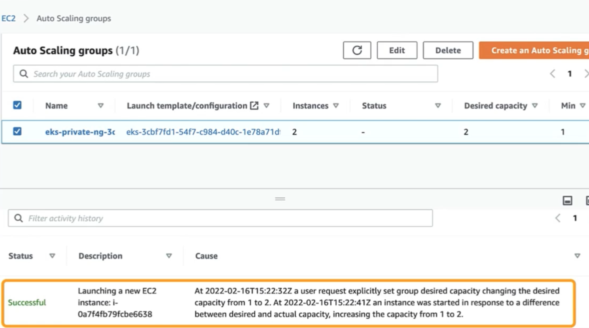

Now, stop the looping requests to see what happens. After a brief moment, the HPA detects the decreased load, and the number of pods slowly returns to its initial state. For the sake of time, the video is sped up so you can see the results. The Cluster Autoscaler decreases the size of the cluster when the additional node is consistently unneeded for a significant amount of time.

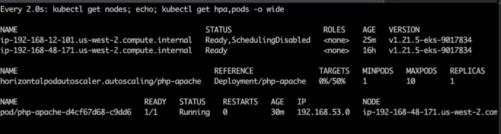

##### Additional information

* [Horizontal Pod Autoscaler](https://docs.aws.amazon.com/eks/latest/userguide/horizontal-pod-autoscaler.html)
* [Autoscaling](https://docs.aws.amazon.com/eks/latest/userguide/autoscaling.html)

---

#### Overview of Amazon EKS communication

To simplify inter-node communication, Amazon EKS integrates Amazon VPC networking into Kubernetes through the Amazon VPC Container Network Interface (CNI) plugin for Kubernetes. The Amazon VPC CNI plugin allows Kubernetes pods to have the same IP address inside the pod as they do on the Amazon VPC network.

#### VPC fundamentals

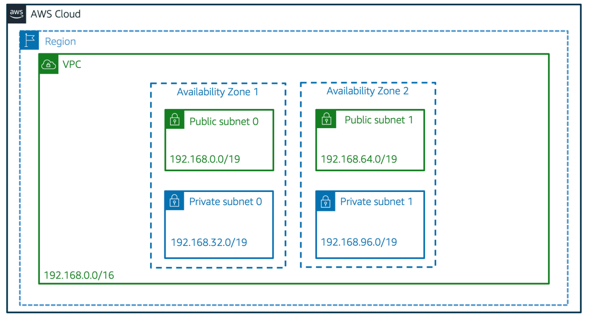

Think of Amazon VPC as a virtual data center. It’s an isolated section of the AWS Cloud where you can launch AWS resources, like Amazon EC2 instances, in a virtual network that you define.

An Amazon VPC is created in a single AWS Region, but it spans all of the Availability Zones within that Region. When you create a VPC, you must specify a range of IPv4 addresses for the VPC as a CIDR block (for example, 192.168.0.0/16). This is the primary CIDR block for your VPC.

After creating a VPC, you can add one or more subnets in each Availability Zone. When you create a subnet, you specify the CIDR block for the subnet, which is a subset of the VPC CIDR block. Each subnet must reside entirely in one Availability Zone and cannot span zones.

#### Types of communication in Amazon EKS

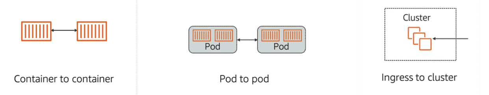

There are multiple types of communication in Amazon EKS environments. Lines of communication include the following:

* Interpod communication between containers
* Communication between pods on the same node or pods on different nodes
* Ingress connections from outside the cluster

In some cases, default Kubernetes methods are used. In other cases, specifically inter-node communication and ingress, methods specific to Amazon EKS are used.

1. Intrapod communication

    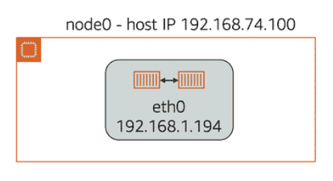

    Containers in a pod share a Linux namespace and can communicate with each other using localhost. In Kubernetes networking, the IP address with which a container identifies is the same IP address for all entities in the network. All containers can communicate with all other containers in a pod without NAT.

2. Intrahost communication

    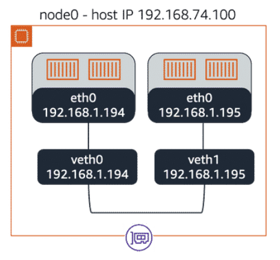

    In addition to each pod having a Linux namespace, the host node also has a Linux namespace. Each namespace has its own routing table. The pod namespace and host namespace are connected by a Linux virtual Ethernet (veth) device. A pair of veths creates a tunnel between the default host namespace and the pod namespace.

    Pod-to-pod communication in the host happens through this veth tunnel. Each node is allocated a network range for containers, and each pod gets an IP address in that range allowing containers on the same host to communicate.

3. Interhost communication

    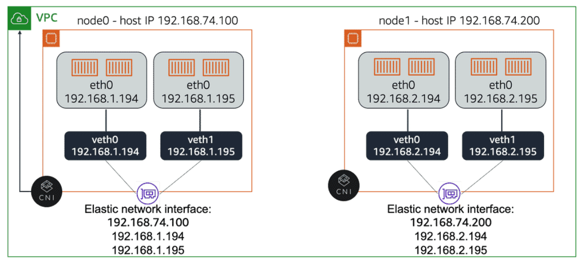

    To simplify internode communication, Amazon EKS integrates Amazon VPC networking into Kubernetes through the Amazon VPC CNI plugin for Kubernetes. CNI allows Kubernetes pods to have the same IP address inside the pod as they do on the Amazon VPC network.

    This CNI plugin is an open source project maintained in the amazon-vpc-cni-k8s repository on GitHub. CNI uses the Amazon EC2 ability to provision multiple network interfaces to a host instance—each with multiple secondary IP addresses—to get multiple IP addresses assigned from the Amazon VPC pool. It then distributes these IP addresses to pods on the host and connects the network interface to the veth port created on the pod. The Linux kernel manages the rest. Therefore, every pod has a real, routable IP address from the Amazon VPC and can easily communicate with other pods, nodes, or AWS services.

    At the host, CNI modifies both the default routing table and the network interface routing table. The default routing table is used to route traffic to pods. Each network interface has its own routing table that is used to route outgoing pod traffic. Each pod is assigned one of the network interface’s secondary IP addresses. For example, if a pod sends network traffic out of the instance, the VPC-CNI plugin ensures that the traffic routes through the correct network interface.

---

#### Review: Kubernetes services

The built-in service objects in Kubernetes solve the issue of pods disappearing and new pods being created with different IP addresses. Instead of trying to communicate to the IP address of ephemeral pods, communicate to the IP address of the service. The service is continually updated with the pod statuses and directs to a healthy pod.

A service object provides a constant IP address and communication port as an entry point to a group of pods. Each service object has an IP address and port that does not change for as long as the service exists. Internal or external clients can reach your application running in a group of pods by connecting to the service IP address and port. Those connections are then routed to one of the pods backing that service.

##### What is a service?

Kubernetes uses four types of services. A *service* is a logical collection of pods and a means to access them. Instead of trying to connect to the IP address of the ephemeral pods, you connect to the IP address of the service. The service tracks the pods' statuses and directs traffic to a healthy pod. Each service has an IP address and a port that does not change for as long as the service exists. Internal or external clients can reach your application by connecting to the service IP and port. These connections are then routed to one of the pods backing that service.

1. ClusterIP

    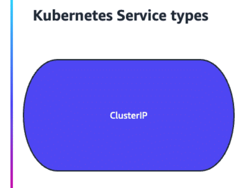

    The ClusterIP service creates a static or fixed IP address that maps to the appropriate pods. This IP address is only available internally in the cluster.

2. NodePort

    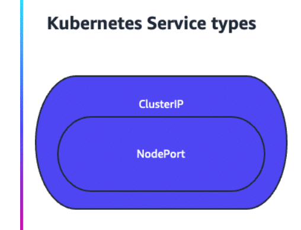

    The NodePort service is exposed on each node using a static port and can be accessed from outside the cluster by requesting ```<NodeIP>:<NodePort>```. Internally, the NodePort service connects to a ClusterIP service that Kubernetes creates automatically.

3. LoadBalancer

    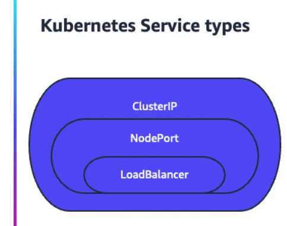

    The LoadBalancer service is exposed externally with a cloud provider's load balancer to balance the load between nodes. The LoadBalancer service connects to both the NodePort and ClusterIP, which are created automatically.

4. ExternalName

    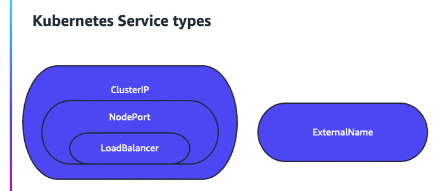

    The ExternalName service is used less frequently than the other three. It maps an internal IP address, a ClusterIP, to an external DNS name. This makes it looks like a resource is internal to your cluster when it is really external. This is useful when you are planning to migrate a service into your cluster at a later point in time and don't want to have your routing change.

---

#### Ingress

With Kubernetes ingress objects, you can reduce the number of load balancers you use. An ingress object exposes HTTP and HTTPS routes from outside the cluster to your services and defines traffic rules.

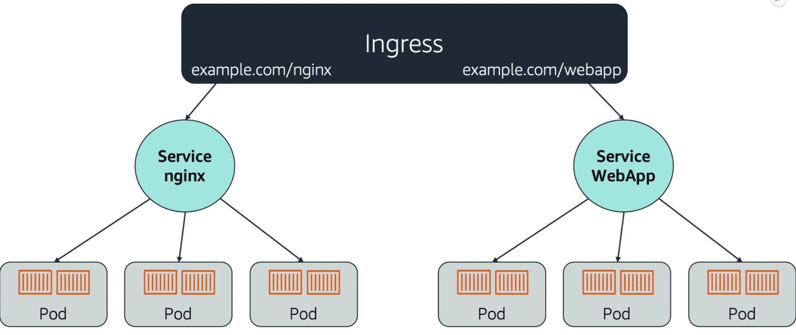

Kubernetes Ingress Objects

### Integrating Amazon EKS with Other Services

#### Managing storage in Amazon EKS

Running your workloads on an Amazon Elastic Kubernetes Service (Amazon EKS) cluster provides the benefit of using other AWS services, including several storage services. In this topic, you explore how to manage your application workload storage requirements with Amazon Elastic Block Store (Amazon EBS) and Amazon Elastic File System (Amazon EFS). While only two storage services are covered, additional AWS storage services are available for Amazon EKS. To learn more, see [Storage](https://docs.aws.amazon.com/eks/latest/userguide/storage.html) in the *Amazon EKS User Guide*.

#### Kubernetes persistent storage

Application workloads requiring data persistence independent of the pod lifecycle require at least two Kubernetes objects, a persistent volume (PV), and a persistent volume claim (PVC). Recall that a PV is similar to ephemeral volumes but has a lifecycle independent of any individual pod. A PVC is a request for storage by a cluster user, which means the request includes details about storage amount, storage access, and storage performance.

Manual administration of persistent volumes poses a scalability challenge for cluster administrators. A third object, storage class, provides the benefit of automating persistent volume management in a Kubernetes cluster. Cluster administrators use storage classes to present persistent storage options to cluster users. Cluster users must specify their desired storage class in a PVC. An Amazon EKS cluster uses these three Kubernetes objects for persistent storage.

In addition to the three objects, a Container Storage Interface (CSI) driver is necessary for allowing a Kubernetes cluster access to a desired storage provider. The CSI is a standard for exposing arbitrary block and file storage systems to containerized workloads on container orchestration systems like Kubernetes. Both Amazon EBS and Amazon EFS have their respective CSI drivers, which run as containerized applications in Amazon EKS cluster nodes. The CSI drivers make the necessary AWS API calls to their respective AWS storage service on behalf of a storage class object.

##### Using Amazon EBS

When a cluster user submits a PVC with the requisite parameters, the Amazon EBS storage class calls on the EBS CSI driver to allocate storage per the PVC request. The EBS CSI driver makes the necessary AWS API calls to create an EBS volume and attach the volume to the designated cluster node. When attached, the persistent volume is allocated to the PVC. The Amazon EBS CSI driver can be configured to use the various functionalities of Amazon EBS, including volume resizing, volume snapshot creation, and so forth.

The following diagram shows two examples of how an Amazon EBS volume associates with its PV. Notice that EBS creates a volume for each Amazon Elastic Compute Cloud (Amazon EC2) instance. A good use case for using Amazon EBS volumes for PVs is when application workloads are deployed into a Kubernetes StatefulSet object. To learn more, visit [StatefulSets](https://kubernetes.io/docs/concepts/workloads/controllers/statefulset/) in the Kubernetes documentation.

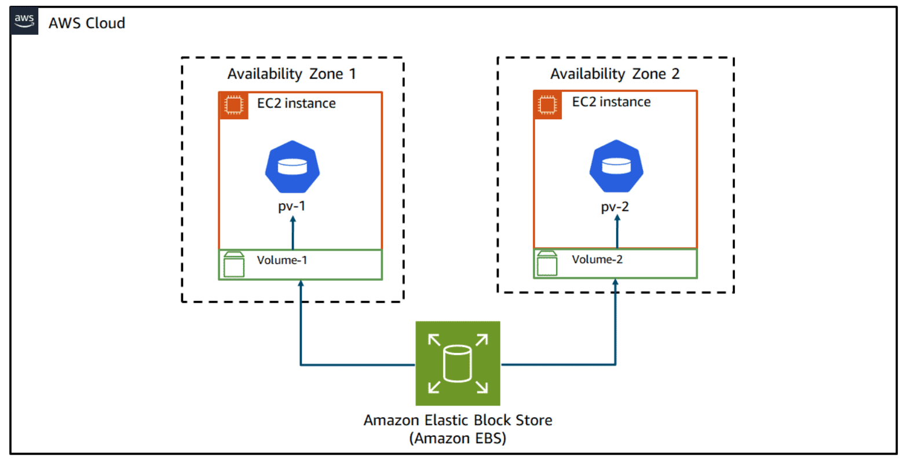

##### Using Amazon EFS

A Kubernetes storage class backed by Amazon EFS will direct the Amazon EFS CSI driver to make calls to the appropriate AWS APIs to create an access point to a preexisting file system. When a PVC is created, a dynamically provisioned PV will use the access point for access to the Amazon EFS file system and then bind to the PVC.

The following diagram illustrates how a single Amazon EFS file system can be accessed by two pod replicas running on separate cluster nodes. Notice that the same file system is mounted in each pod and in two separate Availability Zones. A good use case for Amazon EFS for persistent storage is when an application workload requires replicas to span across worker nodes and access the same application data.

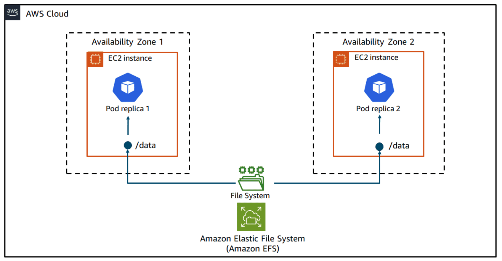

#### Pods running on AWS Fargate

The previous section illustrates how both Amazon EBS and Amazon EFS provide storage to managed or self-managed worker nodes. Running pods on Fargate simplifies the requirement and management of persistent storage. Between the two storage providers, Amazon EFS is the only storage provider for pods running on AWS Fargate, mainly because of its serverless aspect.

Additionally, a pod running on Fargate automatically mounts an Amazon EFS file system, without needing the CSI driver installation and configuration.

#### Demonstration: Defining Persistence and Volume Storage

**Note**: *Helm* is a package manager for Kubernetes. Helm Charts are used to define, install, and upgrade Kubernetes applications. Many preconfigured Helm charts are available through public repositories.

For this demonstration, a previously configured Amazon EKS cluster running a managed node group will be used. Command line access to the Amazon EKS cluster is necessary to complete the tasks in this demonstration, so the command line interface, or CLI, with full permissions to the Kubernetes cluster will be used.

Start by examining the current state of the cluster.

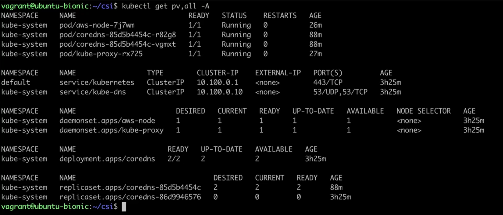

At the moment, the cluster does not have any persistent storage nor is the cluster configured with the Amazon EBS CSI driver.

The CSI driver empowers the Kubernetes cluster to manage and mount the storage on your behalf. To interact with the Amazon EBS service, the Amazon EBS CSI driver requires explicit permissions to the AWS APIs.

Next, download an AWS Identity and Access Management, or IAM, policy that allows the CSI driver's service account to make calls to the AWS APIs. Then, create the IAM policy. The new policy is named **EBS_CSI_Driver_Policy**.

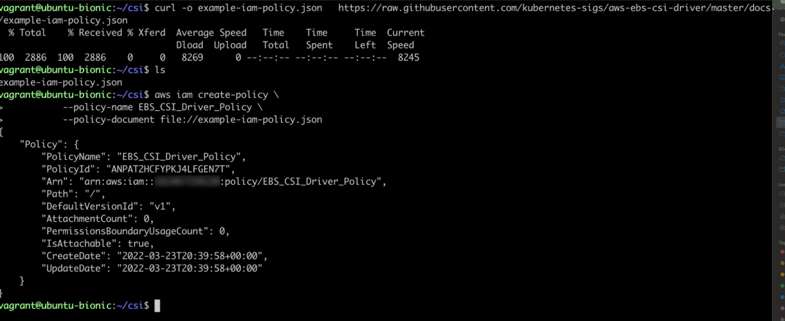

Next, use **eksctl** to create an IAM role and attach the IAM policy to it. In the background,

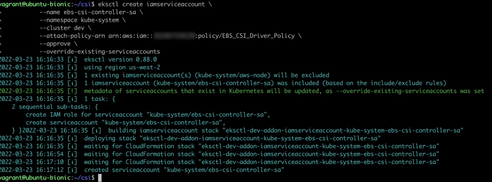

Amazon EKS calls the CloudFormation API to create the new role, attach the EBS CSI driver policy to it, and then map the role to a service account.

The command specifically creates a service account named **ebs-csi-controller-sa** in the **kube-system** namespace and attaches the previously created IAM policy.

With the IAM role and service account now associated, the next step is to deploy the Amazon EBS CSI driver. The driver can be deployed using a Helm chart or a YAML manifest file. In this demonstration, Helm is used to deploy the driver.

First, add the **aws-ebs-csi-driver** Helm repository, then pull the repository chart listing.

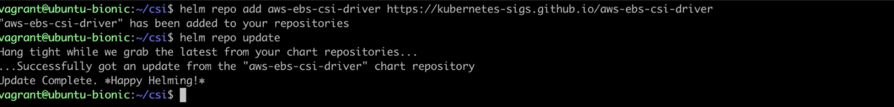

Next, install a release of the driver in the **kube-system** namespace using the Helm chart. The command requires custom values that specify the image repository located in **us-west-2** and the name of the service account for the driver. Because the previously created service account will be used, there is no need to create a new one.

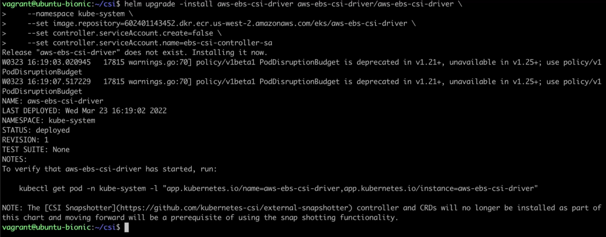

With the Amazon EBS CSI driver installed, the next step is to verify that the driver is working properly. To do so, deploy a storage class, persistent volume, and a pod that runs a sample app that writes to the persistent volume.

In this demonstration, the following steps highlight dynamic volume provisioning.

Start by cloning the Amazon EBS CSI GitHub repository to the local system.

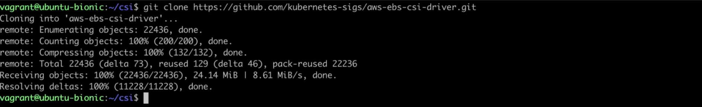

Navigate to the **dynamic-provisioning** manifests directory to deploy the **ebs-sc** storage class and **ebs-claim** persistent volume claim.

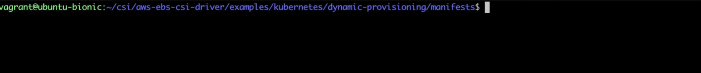

For this demonstration, the **ebs-sc** storage class is a Kubernetes resource that will automatically provision an Amazon EBS volume on behalf of the requesting cluster user. The storage class makes the necessary Kubernetes API calls to activate the EBS CSI driver. A cluster user makes storage requests from a storage class using a persistent volume claim, which is another Kubernetes resource that contains the storage requirements.

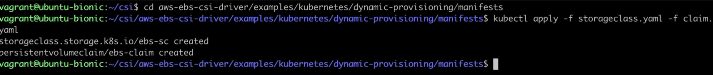

Now, examine the **ebs-sc** storage class.

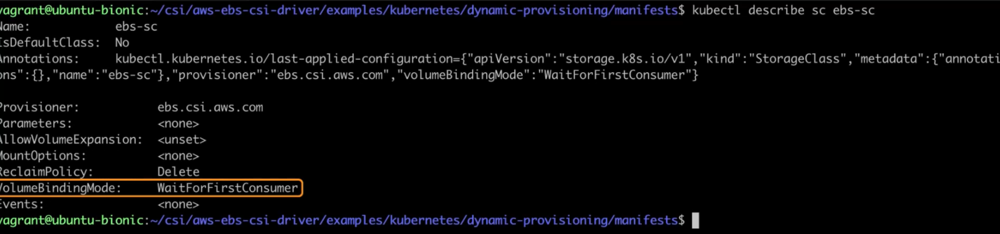

Note that the storage class uses the **WaitForFirstConsumer** volume binding mode. This means that volumes are not dynamically provisioned until a pod specifies the appropriate persistent volume claim.

Next, confirm the status of the PVC.

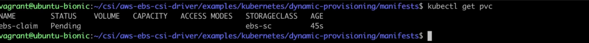

This command output shows the ebs-claim PVC is in a pending state. In this demonstration, the claim specifies 4 GB of storage from Amazon EBS. When the corresponding pod with this PVC is declared to the Kubernetes API, the Amazon EBS CSI driver will provision and attach a 4 GB volume to the target Amazon EC2 worker node.

Next, create the pod and check the status of the PVC. The pod specifies that the container process write the date repeatedly to the /data directory, which is backed by an Amazon EBS volume.

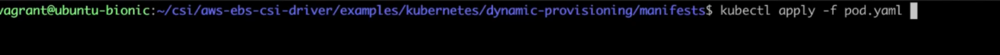

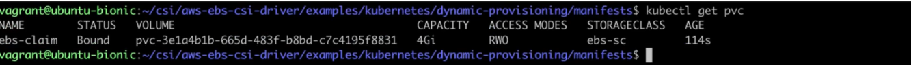

Now, confirm that the pod is writing data to the persistent volume. Use the exec command to enter the container and verify that it can write to the /data/out.txt file.

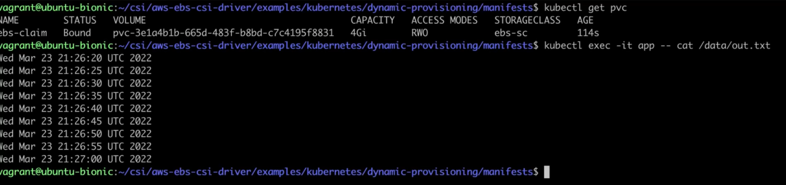

The output printed on screen demonstrates that the Amazon EBS volume was correctly configured and mounted to the Amazon EC2 worker node.

##### Additional Information

* [https://docs.aws.amazon.com/eks/latest/userguide/ebs-csi.html](https://docs.aws.amazon.com/eks/latest/userguide/ebs-csi.html)
* [https://docs.aws.amazon.com/eks/latest/userguide/managing-ebs-csi-self-managed-add-on.html](https://docs.aws.amazon.com/eks/latest/userguide/managing-ebs-csi-self-managed-add-on.html)
* [https://github.com/kubernetes-sigs/aws-ebs-csi-driver](https://github.com/kubernetes-sigs/aws-ebs-csi-driver)

---

### Deploying applications to Amazon EKS

Several methods exist for deploying applications to a Kubernetes cluster running on Amazon EKS. Using the **kubectl** command to deploy applications to the cluster is suitable for testing and development purposes. However, using **kubectl** to deploy microservices is not ideal for production because of poor scalability and high administration overhead.

#### Microservices software development lifecycle

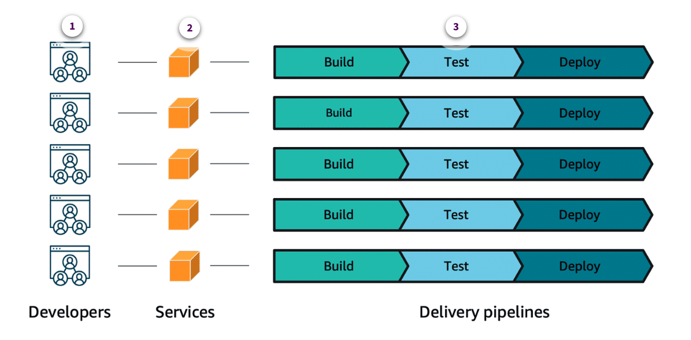

1. **Software developer teams**

    In the microservices model, software developer teams are responsible for developing and maintaining each microservice that makes up part of the application.

2. **Interdependent services**

    Software developers commit their coding for their service using continuous integration. Passing initial testing, the new versions of software are sent through to the respective delivery pipeline.

3. **Delivery pipelines**

    Delivery pipelines decouple your teams and efficiently release independently of other teams. Because tasks that build, test, and deploy applications are repetitive, automating these tasks is the preferred method.

---

#### Application deployment to Amazon EKS

Continuous integration and continuous delivery (CI/CD) is a DevOps model of implementing a microservices software development lifecycle. With continuous integration, developers frequently commit to a shared repository using a version control system, such as Git. A continuous integration service automatically builds and runs unit tests on the new code changes to immediately surface errors. Continuous delivery expands on continuous integration by automating an end-to-end release through to production.

##### Continuous delivery with AWS services

You can use Kubernetes and AWS together to create a fully managed, continuous delivery pipeline for container-based applications. This approach uses Kubernetes’ open source system to manage containerized applications and the AWS developer tools to manage source code, builds, and pipelines.

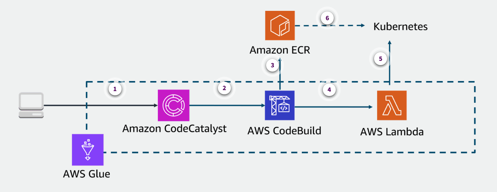

1. **Commit code**

    Developers commit code to a repository, such as Amazon CodeCatalyst. AWS Glue automatically detects the changes to the repository and processes the code changes through the pipeline.

2. **AWS CodeBuild**

    CodeBuild packages the code changes and any dependencies, and builds a Docker image. As an option, another pipeline stage tests the code and the package by also using CodeBuild.

3. **Amazon ECR**

    The Docker image is pushed to Amazon ECR after a successful build stage, test stage, or both.

4. **AWS Lambda**

    AWS Glue invokes a Lambda function to prepare the built and tested artifact for deployment to the Kubernetes cluster. Changes to running applications usually include a change in the image tag.

5. **Declare update to Kubernetes**

    After the deployment manifest update is completed, Lambda invokes the Kubernetes API to deploy or update the application in the Kubernetes cluster.

6. **Deploy application**

    Kubernetes performs a rolling update of the pods in the application deployment to match the Docker image specified in Amazon ECR.

---

#### Gaining observability

Observability is the ability to analyze and view data or processes. It is achieved only after monitoring data (such as metrics) has been compiled. Observability is a term often used interchangeably with monitoring, but they are two different concepts. In this section, you examine the challenges of observability in a microservices environment; review the components of monitoring, including metrics, logging, and tracing; and explore examples of observability.

##### Gaining insight is challenging

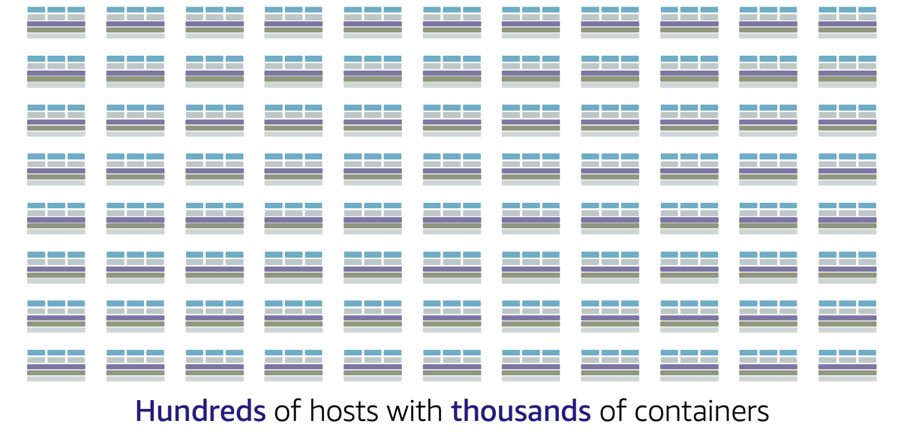

Gaining insight is challenging in any environment. However, it’s more difficult in a microservices environment because there are many potential metrics that you can choose from. Selecting the right ones is not easy.

Containers, in particular, are difficult to monitor because they are generally more transient than your normal workloads. Processes must be in place to capture logs and other useful artifacts from running containers. You must then store these logs and artifacts in a durable, searchable location.

#### The value of insight

With good insight of your applications running in your Amazon EKS cluster, you can answer important questions.

* Customer experience: Are your applications providing the best experience?
* Performance and cost: How are your changes affecting overall performance and cost?
* Trends: Do you need to scale?
* Troubleshooting and remediation: Where did the problem occur and how can it be resolved?
* Learning and improvement: How do you detect and prevent problems in the future?

#### Three main sources of full observability

Three main sources of full observability are logs, metrics, and traces.

* **Logs**

    Logs collect and aggregate log files from resources and then filters actionable insights from background noise.

* **Metrics**

    Metrics collect and visualize data regarding the health and performance of resources measured over intervals of time. The ability to configure alerts to warn you when key performance indicators run out of bounds is also desirable.

* **Traces**

    Traces follow the path of a request as it passes though different services. Tracing helps developers understand how your application and its underlying services are performing. This helps to identify and troubleshoot the root cause of performance issues and errors.

#### Examples of observability

Many tools exist to ingest data from the three main sources of observability. Often, using multiple tools are necessary for a full solution. In this section, two examples are provided to showcase how both AWS managed tools and open source tools can work with an Amazon EKS cluster.

##### Example: Amazon CloudWatch Container Insights

The following image is an example of how CloudWatch Container Insights can be configured to collect, aggregate, and visualize metrics and logs from Amazon EKS. CloudWatch Container Insights also provides diagnostic information, such as container restart failures, to help you isolate issues and resolve them quickly.

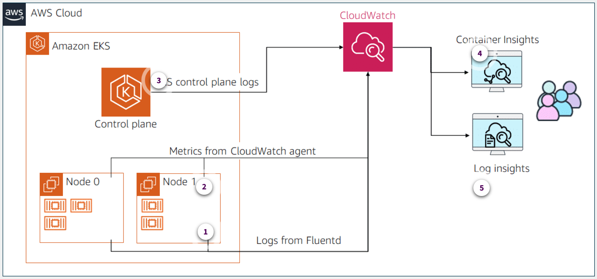

1. **FluentBit agent**

    A log collector with a CloudWatch plugin runs as a DaemonSet on every node. This example uses Fluentd, an open source log collection and aggregation tool. Another option is FluentBit, which is a lightweight version of Fluentd.

2. **CloudWatch metrics**

    The CloudWatch agent runs as a DaemonSet on each worker node. The agent collects and ships metrics data to CloudWatch for further processing.

3. **Amazon EKS control plane logs**

    You can collect Amazon EKS control plane metrics by turning on control plane logging for an Amazon EKS cluster. CloudWatch collects metrics information from these logs, which you can view using CloudWatch Logs Insights.

4. **CloudWatch data access**

    The metrics that Container Insights collects are available in CloudWatch automatic dashboards and also viewable in the  Metrics section of the CloudWatch console. In addition to CPU, memory, disk, and network metrics, Container Insights provides diagnostic information, such as container restart failures, to help with troubleshooting issues.

5. **CloudWatch Logs Insights**

    CloudWatch Logs Insights helps you interactively search and analyze your log data in CloudWatch Logs. You can perform queries to help you more efficiently and effectively respond to operational issues.

---

##### Open source tools for logs and metrics

The following image shows an example of how various open source tools can be configured to collect, aggregate, and visualize metrics and logs from Amazon EKS. Customers opting for open source tools for collecting metrics and logs are free to self-manage those tools themselves or can use the AWS managed equivalents. In this case, AWS provides [Amazon Managed Service for Prometheus](https://aws.amazon.com/prometheus/), [Amazon Managed Grafana](https://aws.amazon.com/grafana/), and [Amazon OpenSearch Service](https://aws.amazon.com/opensearch-service/) as options.

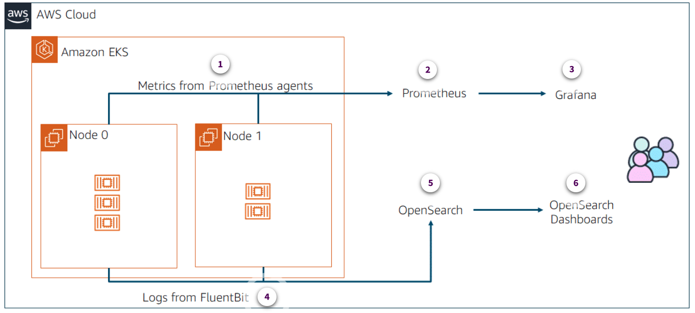

1. **Prometheus agents**

    Prometheus agents run in a DaemonSet, which means one agent per worker node. Agents collect and ship metric data to a Prometheus server.

2. **Prometheus server**

    Prometheus is the name of an open-source time series database used to collect and store metrics from many different sources including your application workloads if configured to do so. The Prometheus project is a graduated Cloud Native Computing Foundation (CNCF) project like Kubernetes and is a popular solution.

3. **Grafana**

    Grafana provides dashboards to visualize and query your metrics collected by Prometheus.

4. **FluentBit agents**

    Similar to the Prometheus agents, FluentBit agents run on each worker. The agents collect and ship logging data to the OpenSearch server.

5. **OpenSearch**

    OpenSearch is a community-driven, open-source log analytics tool derived from Apache 2.0 licensed Elasticsearch 7.10.2.  Logging data is ingested for log analytics.

---

#### Demonstration: Logging and monitoring in an Amazon EKS cluster using the AWS Management Console

Observability is a crucial process for ensuring the health and status of application workloads, and the platform that runs them. Determining the appropriate metrics for containerized application workloads is difficult because of the ephemeral nature of containers. Also, the vast selection of metrics adds to the difficulty of deciding which metrics are relevant for monitoring application workloads. In this demonstration, you will explore logging and monitoring options for a newly configured Amazon EKS cluster and its core component pieces using the AWS Management Console.

For this demonstration, a new installation of Amazon EKS cluster named **dev** located in the **us-west-2** Region will be used. The cluster has one Amazon EC2 worker node in a managed node group. Control plane logging has not been activated for the cluster.

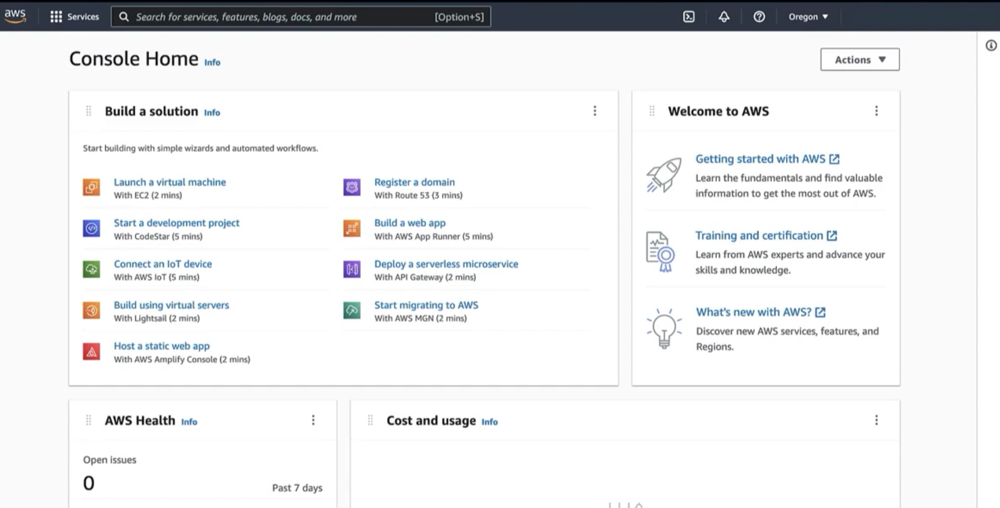

Start by navigating to the Amazon EKS service console. Search for the Amazon EKS service by typing “EKS” in the search bar. Next, choose the Elastic Kubernetes Service under the Services category.

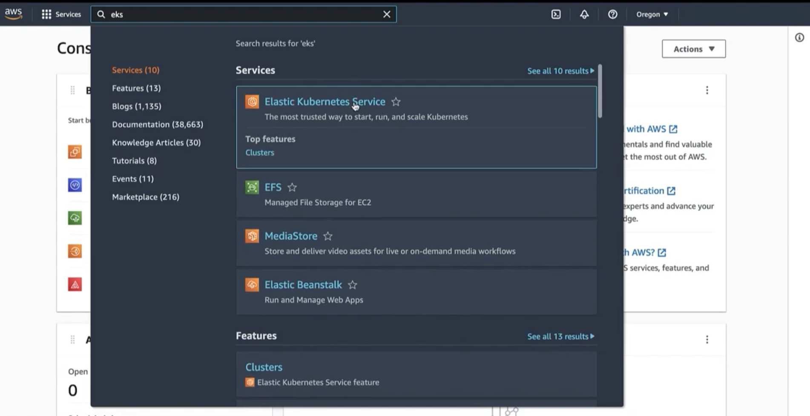

Next, choose the **Clusters** link on the left side of the screen under the Amazon EKS heading. The next screen shows that one Amazon EKS cluster exists named **dev**.

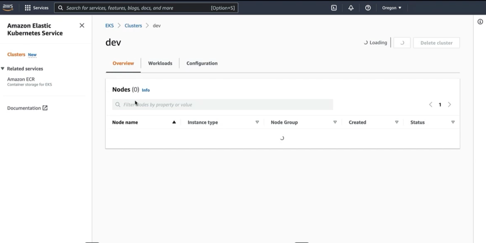

Proceed with choosing the **dev** cluster, then choose the **Configuration** tab. Next, choose the **Logging** sub-tab.

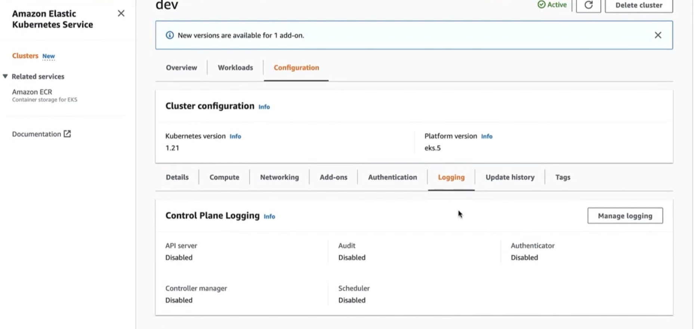

Amazon EKS control plane logging provides audit and diagnostic logs directly from the Amazon EKS control plane to CloudWatch Logs in your account. Control plane logging can be managed from this card by choosing the **Manage logging** button. The options include logging for the Kubernetes API server, Controller manager, Scheduler, and so forth. You have the option to activate any or all logging for these components. When activated, logs are sent as log streams to a log group in CloudWatch.

Now, choose the **Manage logging** button. On the next screen, toggle all control plane logging options to Enabled status. Choose the **Save changes** button. The logging update can take up to 4 to 5 minutes. Logs will appear in the CloudWatch Logs under the dev cluster name. The next step is to generate logs, then review them from the CloudWatch console.

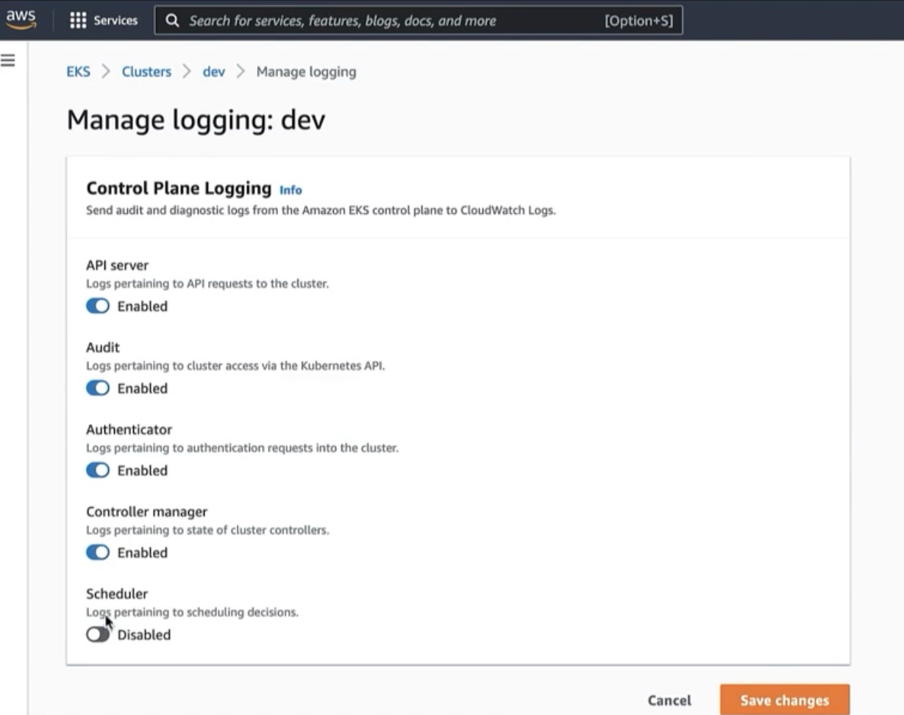

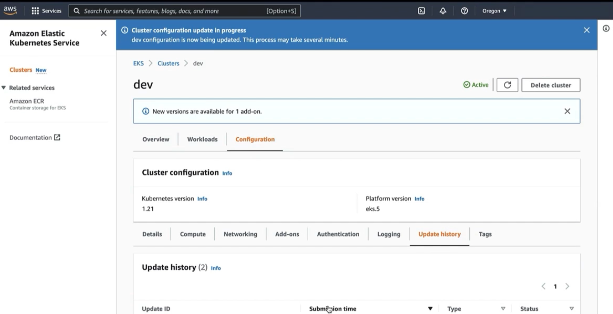

Open a command line interface, or CLI, where with kubectl access. For this demonstration, the kubectl utility has been configured with permissions to run workloads on the dev cluster. To generate logs, use the load generator example from the Autoscaling demonstration:

```shell
kubectl apply -f https://k8s.io/examples/application/php-apache.yaml
```

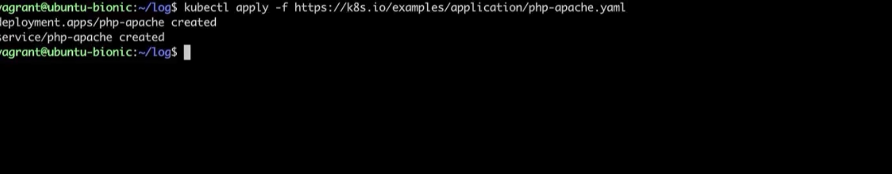

```shell
kubectl run -it load-generator --rm --image=busybox --restart=Never -- /bin/sh -c "while sleep 0.01; do wget -q -O- http://php-apache; done"
```

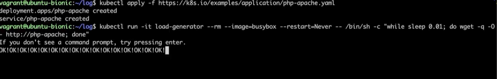

This example uses a simple PHP application that performs CPU-intensive computations when receiving an HTTP GET event. The load generator continuously makes calls to the application. Let the load generator run for 2 minutes.

From the AWS Management Console, navigate to the CloudWatch service. Search for the CloudWatch service by typing, “cloudwatch” in the search bar. Finally, choose the CloudWatch Service under the Services category.

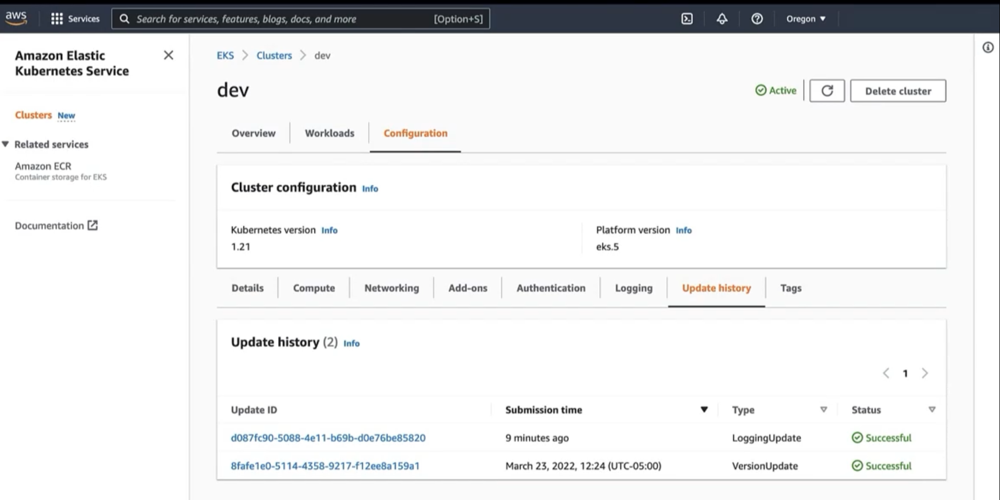

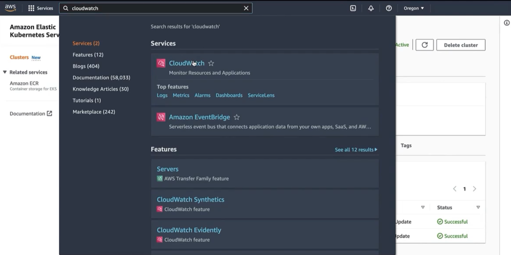

On the left side of the screen, expand the Logs menu, then choose **Log groups**.

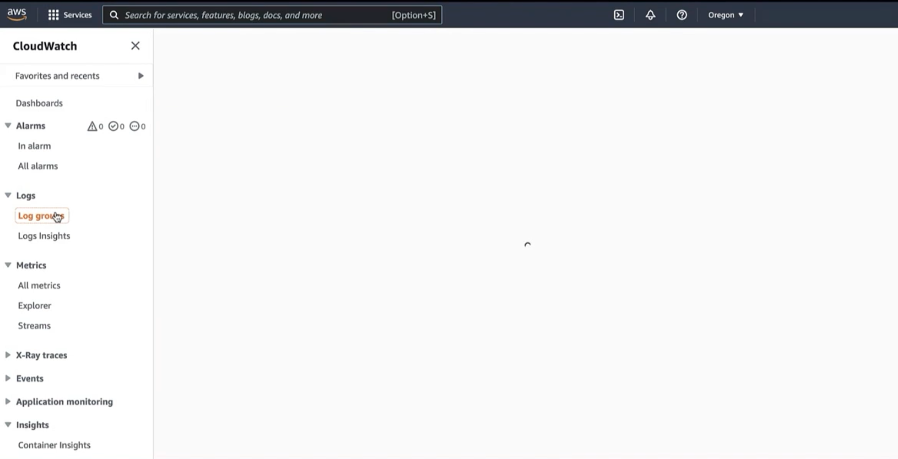

From the **Log groups** card, choose the **Log group** associated with the dev cluster. For this demonstration, **/aws/eks/dev/cluster** is that **Log group**. The log group name format is ```/aws/eks/<cluster-name>/cluster```.

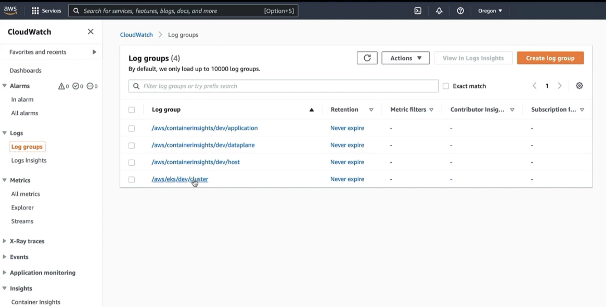

The top card, **Log group details**, shows various points of data including Retention, Metric filters, log storage, and so forth. The Log streams card shows various log streams that correspond to the control plane logging configuration that was made earlier. Each log stream has a unique identifier appended to the name.

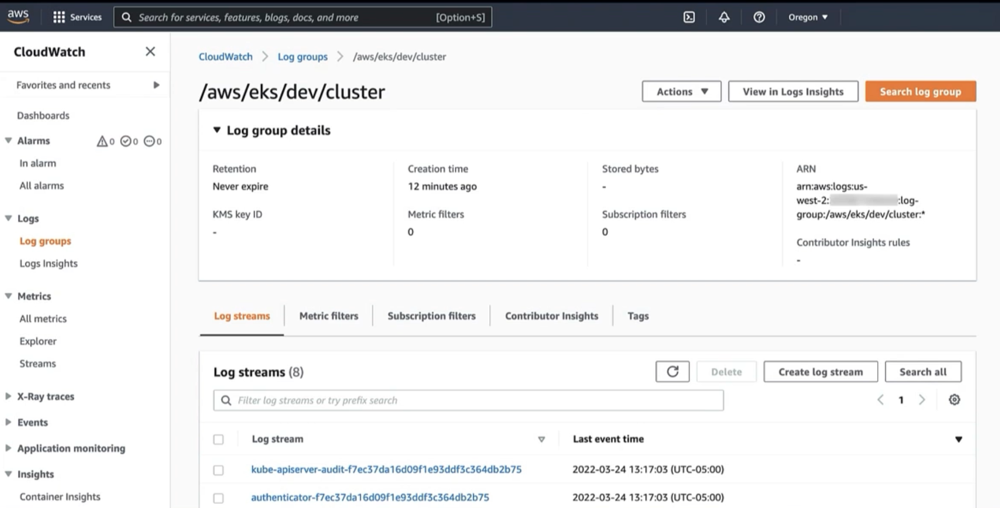

Next, choose a **kube-apiserver** log stream. The next screen shows options to filter events by time and by various word combinations. Below that are the captured logs showing the time the log was recorded and the message written by the Kubernetes API server.

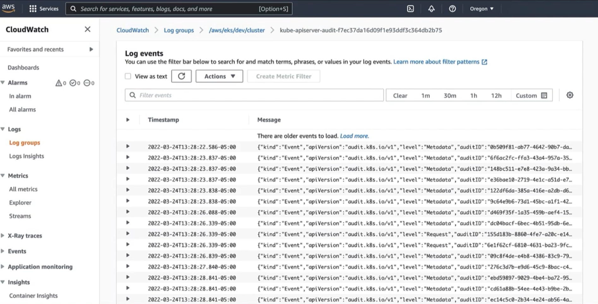

Expand one of the entries to see the full contents of the message. As log stream data grows or ages, the log stream names are rotated.

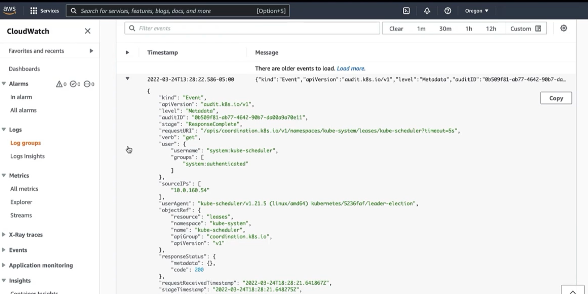

Next, choose the **Container Insights** from the menu on the left side of the screen. For this demonstration, the dev cluster has all the requisite configured components to activate this CloudWatch service. CloudWatch Container Insights collect, aggregate, and summarize metrics and logs from your containerized applications and microservices. This screen shows options to filter by time or by cluster, resources, and alarms. The Resources card shows the containers that are sending logs to CloudWatch. You can see the name of the resource, like a pod, namespace, and so forth. You also can see the name of the cluster where the resource resides, alarm status, and compute consumption, such as CPU and memory. If alarms are active, then you can see more details on the Alarms card.

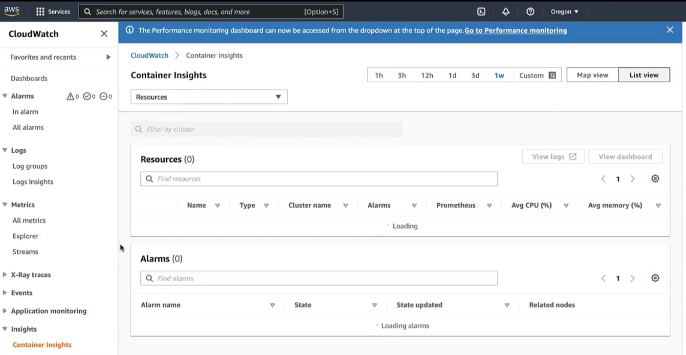

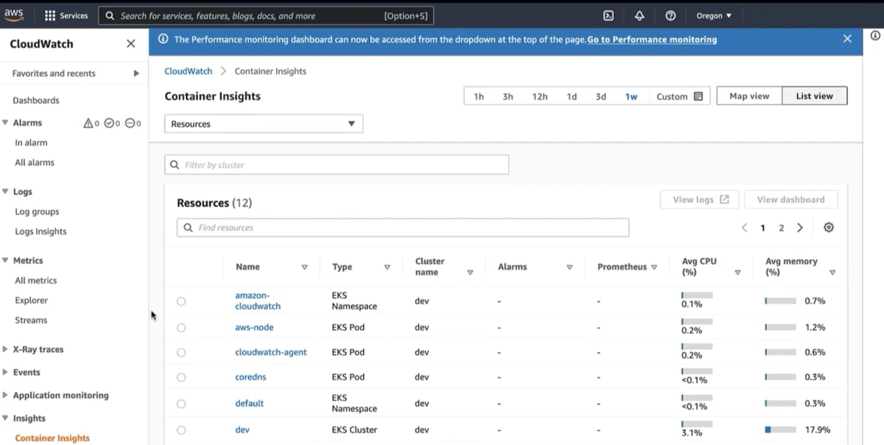

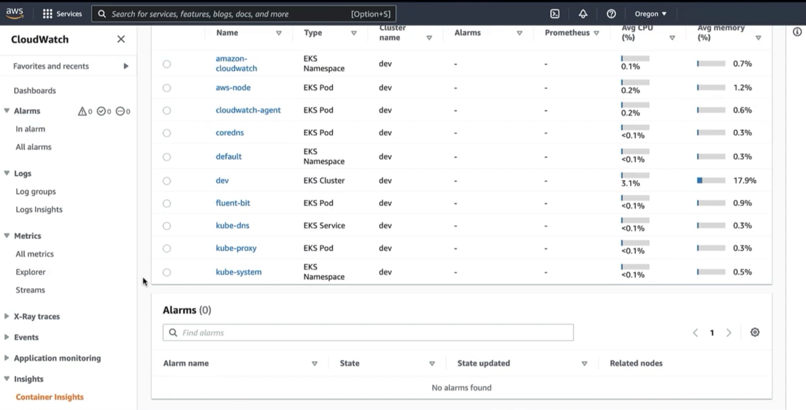

Next, choose **Performance monitoring** from the dropdown menu near the top of the screen.


The next screen shows various data regarding resource usage of containers running in Amazon EKS. You can filter the view by AWS service, cluster namespace, nodes, and so forth.  Additionally, you can create various dashboards that suit your logging requirements for both Amazon EKS cluster and your application workloads.

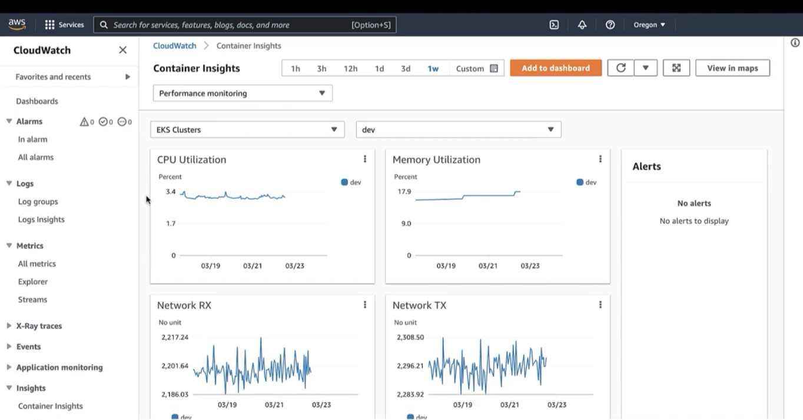

##### Additional Information

* [https://docs.aws.amazon.com/eks/latest/userguide/control-plane-logs.html](https://docs.aws.amazon.com/eks/latest/userguide/control-plane-logs.html)
* [https://docs.aws.amazon.com/AmazonCloudWatch/latest/monitoring/ContainerInsights.html](https://docs.aws.amazon.com/AmazonCloudWatch/latest/monitoring/ContainerInsights.html)
* [https://docs.aws.amazon.com/AmazonCloudWatch/latest/monitoring/Container-Insights-EKS-logs.html](https://docs.aws.amazon.com/AmazonCloudWatch/latest/monitoring/Container-Insights-EKS-logs.html)

---

### Maintaining an Amazon EKS Cluster

#### Maintaining add-ons

Add-ons extend the operational capabilities of Amazon EKS clusters, but they are not specific to any one application. This includes software like observability agents or Kubernetes drivers that allow the cluster to interact with underlying AWS resources for networking, compute, and storage. Add-on software is typically built and maintained by the Kubernetes community, cloud providers like AWS, or third-party vendors. In this topic, you explore the challenges of maintaining third-party apps and the complexity it adds to upgrade scenarios.

#### Default Amazon EKS add-ons

Amazon EKS automatically installs on every cluster the following add-ons:

* Amazon Virtual Private Cloud (Amazon VPC) container network interface (CNI)
* kube-proxy
* CoreDNS

These add-ons provide core functionality to your cluster and run as pods in your cluster's data plane (pods running on cluster nodes or as AWS Fargate pods).

The manner of maintaining these add-ons depends on how they were implemented in your cluster. For example, if you create a cluster using the AWS Management Console or with eksctl using a configuration file, the managed Amazon EKS add-ons are installed. You can use the AWS Management Console, eksctl, or the AWS Command Line Interface (AWS CLI) utility to maintain and automatically upgrade them. However, if you create a cluster using eksctl without a config file or using any other tool, the self-managed kube-proxy, Amazon VPC CNI, and CoreDNS add-ons are installed. You will use the kubectl command line tool to maintain and upgrade the add-ons directly in the cluster.  

All Amazon EKS add-ons include the latest security patches and bug fixes, and they are validated by AWS to work with Amazon EKS. With Amazon EKS add-ons, you can consistently ensure that your Amazon EKS clusters are secure and stable, and reduce the amount of work that you need to do to install, configure, and update add-ons.

---

Self-managed Amazon EKS default add-ons will not appear in the AWS Management Console. You can convert self-managed add-ons to managed by manually reinstalling them using the methods previously mentioned.

---

#### Third-party add-ons

Amazon EKS clusters often contain many outside products, such as ingress controllers, continuous delivery systems, monitoring tools, and other workflows. These types of add-ons are installed and configured by you. When you are planning to upgrade the Kubernetes version of your cluster, you must identify all the agents, operators, and services that are compatible with the new cluster version. In some cases, you might need to also test new versions of the add-ons in the upgraded cluster to validate that the add-on is ready for production usage. Ultimately, you need to determine the correct order to upgrade components during the cluster upgrade cycle.

Minor releases of Kubernetes often make changes to the built-in APIs, which means any third-party add-ons must be reviewed to ensure that they are not using deprecated APIs and are configured for any new APIs.

#### Summary of third-party add-on challenges

* Test and validate third-party add-on dependencies.
* Determine the correct order to upgrade components.
* Plan for API changes.

#### Amazon EKS managed add-ons

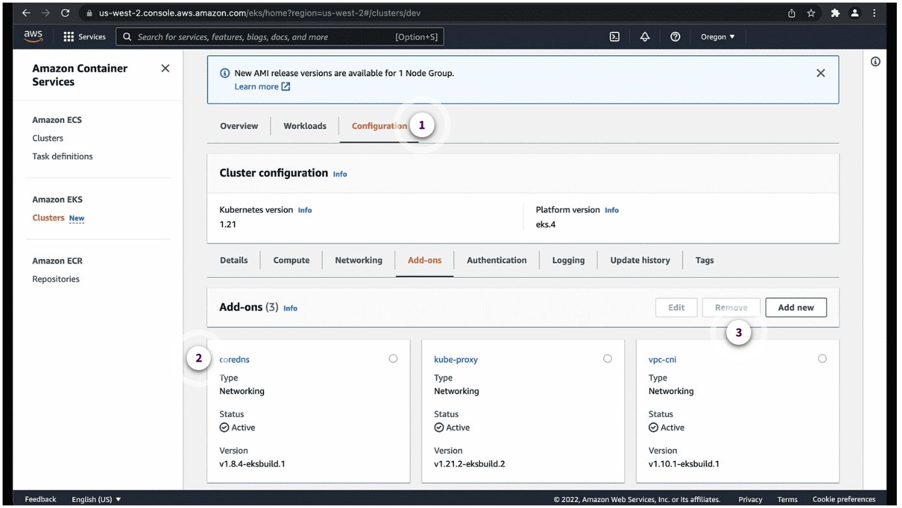

1. **List of managed add-ons**

    To locate the Amazon EKS managed add-ons, choose the Configuration tab, and then choose Add-ons.

2. **Add-ons**

    The available managed add-ons are shown in separate cards. The current Amazon EKS cluster shows three managed add-ons — **coredns**, **kube-proxy**, and **vpc-cni**.

3. **Add-on management**

    Amazon EKS cluster administrators have a choice to edit, remove, or add new add-ons to a cluster. Choosing the Edit button provides options to upgrade add-ons.

#### Managing upgrades

New Kubernetes versions can introduce significant changes. The impact of these changes can vary greatly, even among upgrades of the same type. In this section, you will examine the Amazon EKS upgrade process along with various upgrade strategies for your Amazon EKS worker nodes.

#### Upgrading an Amazon EKS cluster

Upgrading an Amazon EKS cluster is a nontrivial task and requires careful planning. When you run Kubernetes on Amazon EKS, you have the benefit of AWS managing the upgrade of your Kubernetes control plane when you are ready to proceed. The Amazon EKS platform defines which Kubernetes versions are supported in Amazon EKS.

When deciding whether to upgrade to a new Kubernetes version, consider the following:

* What is the benefit of upgrading to the next version of Kubernetes?
* Which team is responsible for completing the upgrade of a Kubernetes version?
* What downstream components, such as nodes and add-ons, will also need to be upgraded?
* In what order will the downstream dependencies need to get upgraded?
* What impact will there be to applications during the upgrade?
* Do any applications in the ecosystem use Kubernetes APIs? Consider doing an impact analysis to these applications as well.

---

#### Amazon EKS upgrade process

Any upgrade plan must take into account how the Amazon EKS cluster upgrade occurs. The following is the sequence of events that occur during the cluster upgrade.

1. **API server nodes**

    During an upgrade, Amazon EKS launches new API server nodes with the upgraded Kubernetes version to replace the existing ones. Amazon EKS performs standard infrastructure and readiness health checks for network traffic on these new nodes to verify that they are working as expected.

2. **Automatic rollback**

    If any of these checks fail, Amazon EKS reverts the infrastructure deployment and your cluster remains on the previous Kubernetes version. Running applications are not affected, and your cluster is not left in an unrecoverable state. Amazon EKS regularly backs up all managed clusters, and mechanisms exist to recover clusters, if necessary.

3. **Possible minor service interruptions**

    To upgrade the cluster, Amazon EKS requires two to three free IP addresses from the subnets provided when you created the cluster. If these subnets do not have available IP addresses, the upgrade can fail. Additionally, if any of the subnets or security groups provided during cluster creation have been deleted, the cluster upgrade process can fail.

4. **Upgrade nodes and Kubernetes add-ons**

    Amazon EKS does not modify any of your running applications, cluster worker nodes, Amazon EKS add-ons, or Kubernetes add-ons when you upgrade your cluster's control plane. You will need to perform the necessary tasks to complete the cluster upgrade process.

---

#### Upgrading cluster worker nodes

* **Self-managed nodes**

    Upgrade using AWS CloudFormation template, eksctl, and kubectl.

* **Managed node groups**

    Upgrade using the AWS Management Console or eksctl.

* **AWS Fargate**

    No node upgrades are required. Underlying infrastructure is upgraded automatically.

---

#### Selecting an upgrade strategy for worker nodes

The worker node upgrade process depends mainly on whether worker nodes are in a managed group or a self-managed group. The following sections provides high-level details for both types of groups.

##### Managed worker nodes

If you are running managed node groups, Amazon EKS automatically updates your nodes for you when you initiate a managed node group update. When you upgrade a managed node group version, Amazon EKS does the following:

* Amazon EKS creates a new Amazon Elastic Compute Cloud (Amazon EC2) launch template version for the EC2 Auto Scaling group associated with your node group. The new template uses the target Amazon Machine Image (AMI) for the upgrade.
* The EC2 Auto Scaling group is upgraded to use the latest launch template with the new AMI.
* The EC2 Auto Scaling group maximum size and desired size are incremented to ensure that new EC2 instances are created along with your existing EC2 instances.
* The EC2 Auto Scaling group launches a new instance with the new AMI to satisfy the increased size of the node group.
* Amazon EKS checks the nodes in the node group for the eks.amazonaws.com/nodegroup-image label. Amazon EKS cordons all nodes in the node group that are not labeled with the latest AMI ID. This prevents nodes that have already been upgraded from a previous failed upgrade from being cordoned.
* Amazon EKS randomly selects a node in your node group and sends a termination signal to the EC2 Auto Scaling group. Then, Amazon EKS sends a signal to drain the pods from the node. After the node is drained, it is terminated. This step is repeated until all nodes are using the new AMI version.
* The EC2 Auto Scaling group maximum size and desired size are decremented by 1 to return to your pre-upgrade values.

There are two options for the update strategy:

* **Rolling update** — This option respects PodDisruptionBudgets for your cluster. The update fails if Amazon EKS is unable to gracefully drain the pods that are running on this node group because of a PodDisruptionBudget issue.
* **Force update** — This option does not respect PodDisruptionBudgets. It forces node restarts.

To learn more about the details of the managed node group upgrade process, visit [Managed node update behavior](https://docs.aws.amazon.com/eks/latest/userguide/managed-node-update-behavior.html) in the *Amazon EKS User Guide*.

##### Self-managed worker nodes

If you are upgrading self-managed node groups, you have the following two strategies to consider:

* **Migrate to a new node group** — Create a new node group and migrate your pods to that group.
* **Update the existing self-managed node group** — Update the AWS CloudFormation stack for an existing node group to use the new AMI.

Between these two methods, migrating to a new node group is the preferred upgrade strategy, because it is more graceful than updating the AMI ID in an existing CloudFormation stack. The migration process drains the old nodes after a new stack is ready to accept the existing pod workload.

##### Migrating to new self-managed node group

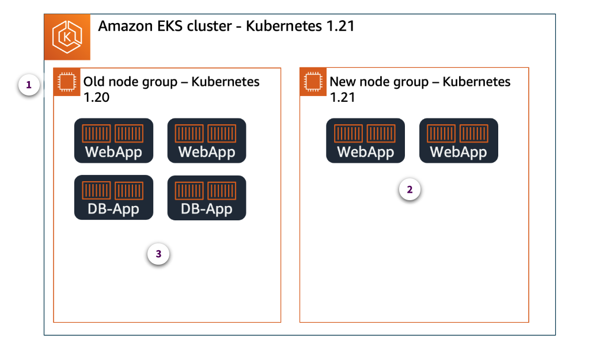

1. **Suspend scheduling**

    One of the first steps during an upgrade is to suspend scheduling on old node groups.

2. **Start application migration**

    Use tools such as Flagger for canary deployments with a fallback mechanism in place. You can greatly reduce risk by pushing one application at a time to new nodes to verify compatibility. To learn more about Flagger, visit the [Flagger](https://docs.flagger.app/) documentation.

3. **Large node groups**

    Be careful using this method with large node groups that are already straining resource availability.

---

#### Demonstration: Upgrading an Amazon EKS Cluster

Kubernetes releases multiple versions throughout the year, which provide new features, security patches, and bug fixes. As such, you must implement a regular maintenance cycle that includes periodic upgrades to your Amazon EKS cluster. In this demonstration, you will examine upgrading an Amazon EKS cluster version, the node group version, and the default managed cluster add-ons.

For this demonstration, a new installation of a Kubernetes cluster version 1.20 located in the us-west-2 Region will be upgraded using the AWS Management Console. The cluster has one Amazon EC2 node in a managed node group.

Start by navigating to the Amazon EKS service console. Search for the Amazon EKS service by typing “EKS” in the search bar. Finally, select the Elastic Kubernetes Service under the Services category.

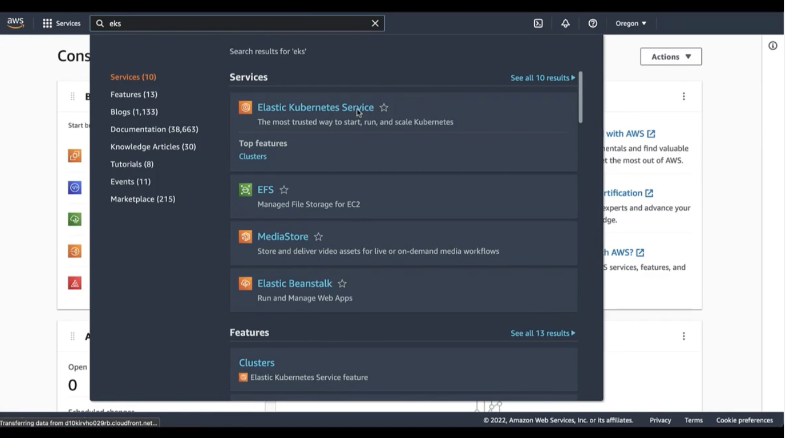

The landing page shows that one Amazon EKS cluster named dev exists. The status shows active and running Kubernetes v1.20. A banner states that new Kubernetes versions are available for the cluster. Although a link to update the cluster shows on this screen, proceed with choosing the dev cluster, then choose the Configuration tab.

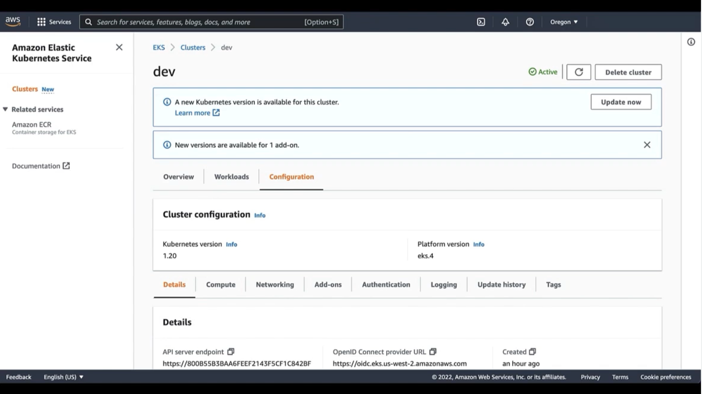

The next screen presents details about the dev cluster including a banner prompting you to upgrade the cluster to a newer version along with a second banner stating that new versions are available for one add-on. Choose the Update cluster version button to begin the cluster upgrade process. For Kubernetes version, select the 1.21 version and choose Update. This process will only upgrade the Kubernetes control plane components to the latest supported release of v1.21. The next screen shows the update is in progress. Control plane component upgrades can take up to 25 minutes to complete.

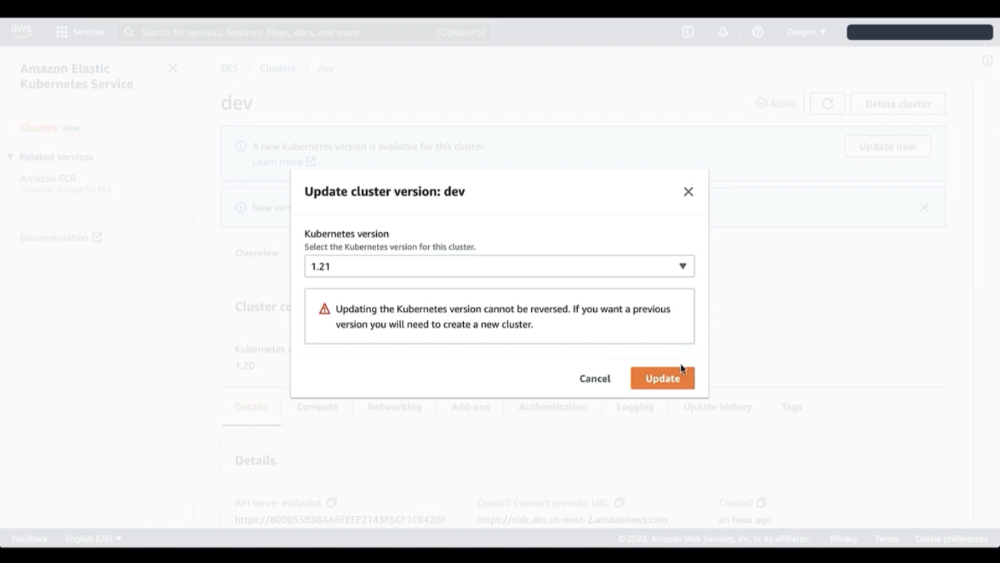

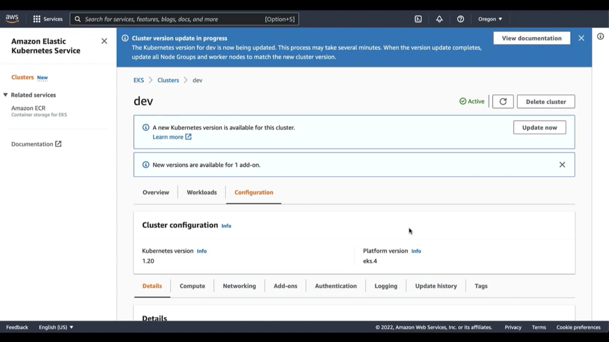

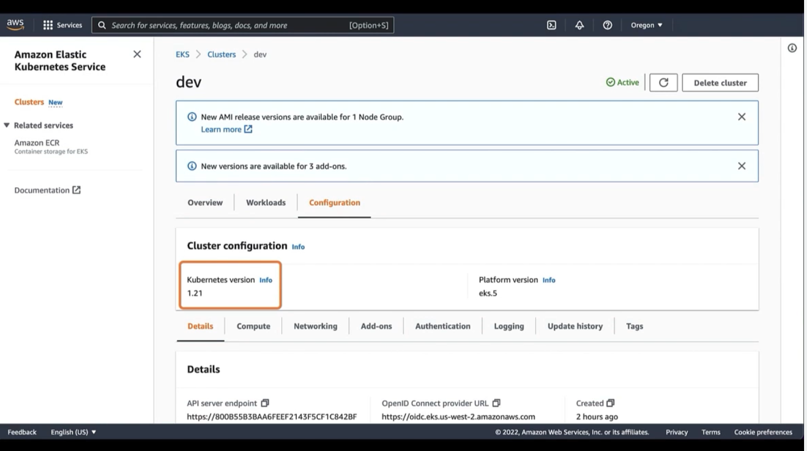

Now that the control plane upgrade is complete, the Cluster configuration card shows Kubernetes version 1.21 is now the current version of the cluster and the status shows active. Choose the Update history sub-tab. All configuration and version updates to the cluster are logged here. The details in the Update history card state that the upgrade was successful.

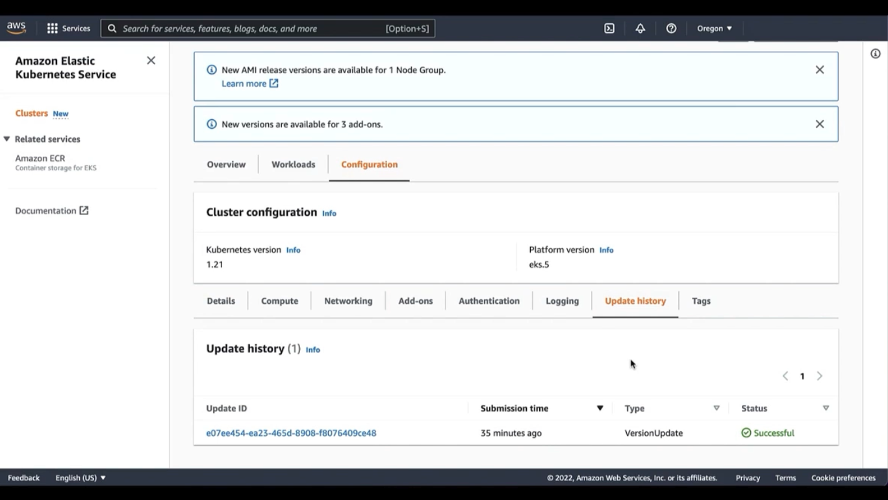

If the upgrade failed, then the result could also be found here. Before moving on, notice a banner shows that new AMI release versions are available for one node group and a second banner states that new versions are available for three add-ons.

Next, update the worker node to the same Kubernetes minor version as the upgraded cluster. Choose the **Compute** sub-tab.

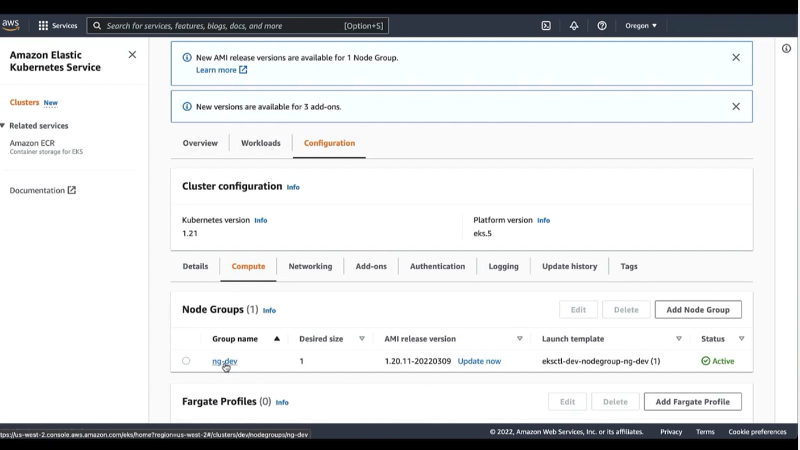

Choose the **ng-dev** link under the Group name heading.

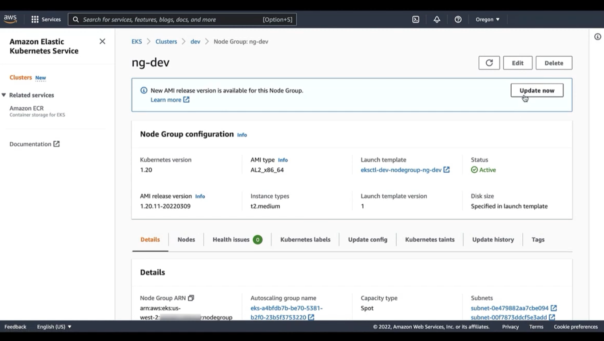

Choose the **Update node group** button to start the node group upgrade process. On the next screen, leave the defaults settings of **Update the Node Group** version toggled on and **Rolling update** as the Update strategy. Choose the **Update** button. The update for the one worker node takes several minutes to complete, though additional nodes in the node group can take additional time.

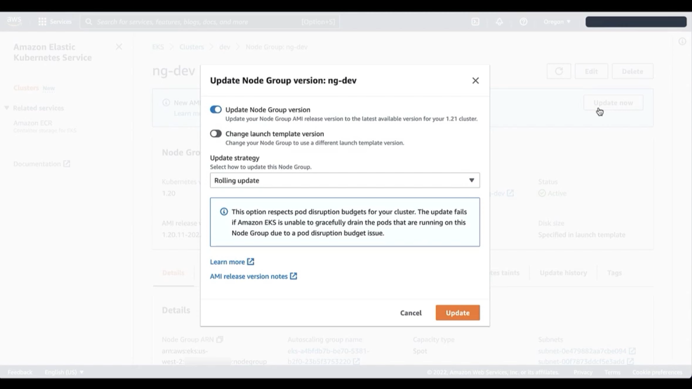

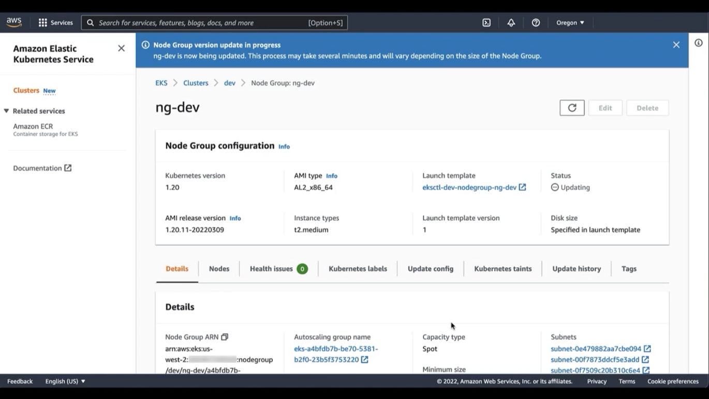

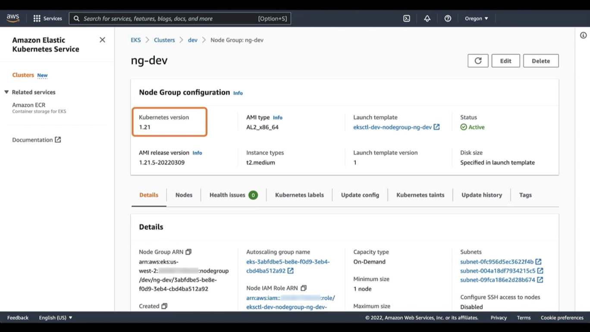

With the update to the managed node group complete, the node group configuration shows Kubernetes version 1.21 is now the current version. Choose the **Update history** sub-tab. All version updates to managed node groups are logged here. The details in the Update history card state that the upgrade was successful. Similarly, if the upgrade failed, then the result can be found here.


The last step for this demonstration is to upgrade the managed add-ons. Choose dev from the breadcrumb list, then choose the **Add-Ons** sub-tab.

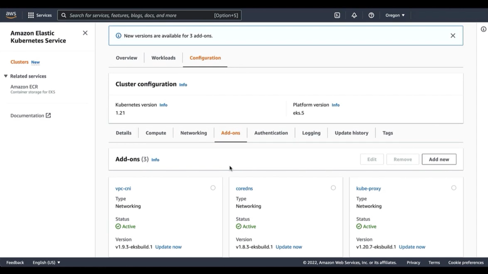

Because the cluster was upgraded to v1.21, all three add-ons now have new versions available. For this demonstration, only the coredns add-on will be upgraded.

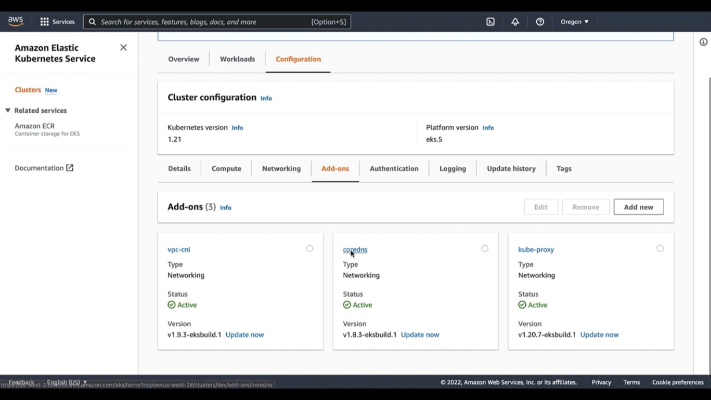

Scroll down to the Add-on cards, and then choose the **coredns** link.

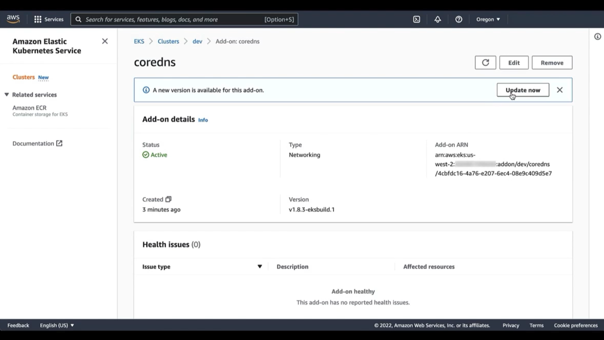

Choose the Update now button to start the upgrade process. The next screen shows the recommended version update and the option to override the existing configuration. If updating add-ons fail, then overriding the configuration forces the update to succeed. For this demonstration, leave the version update and check the override existing configuration box to force the update. Finally, choose the **Update** button.

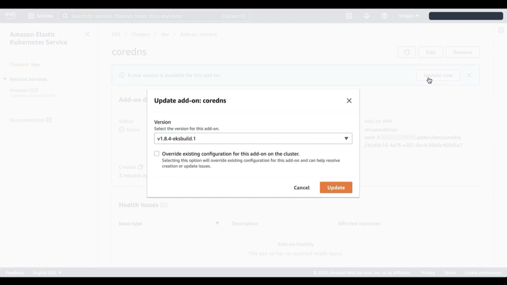

The coredns add-on upgrade is complete. Scroll down to the Update history card. Each add-on has an Update history card that shows the logs for each update. The details of the card state the upgrade was successful. If the upgrade failed, the result can be found here, and the add-on status will show as degraded.

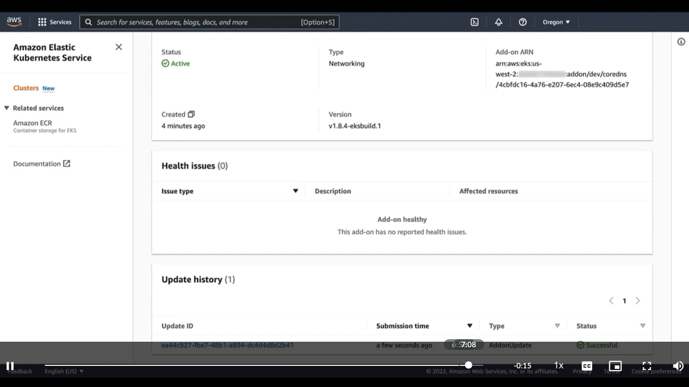

##### Additional Information

* [https://docs.aws.amazon.com/eks/latest/userguide/update-cluster.html](https://docs.aws.amazon.com/eks/latest/userguide/update-cluster.html)
* [https://docs.aws.amazon.com/eks/latest/userguide/update-managed-node-group.html](https://docs.aws.amazon.com/eks/latest/userguide/update-managed-node-group.html)
* [https://docs.aws.amazon.com/eks/latest/userguide/managing-coredns.html](https://docs.aws.amazon.com/eks/latest/userguide/managing-coredns.html)

---

### Managing Amazon EKS Costs

#### Overview

One of the [Six Pillars of the AWS Well-Architected Framework](https://aws.amazon.com/architecture/well-architected/) is cost optimization, which is summarized as running systems to deliver business value at the lowest price point. This topic describes the primary drivers of cost in Amazon Elastic Kubernetes Service (Amazon EKS) with a specific attention to compute cost options using the framework as the point of reference.

#### Amazon EKS pricing model

The control plane of an Amazon EKS cluster makes up the smallest amount of cost as represented in the following graphic. Compute resources make up the largest source of cost for the cluster.

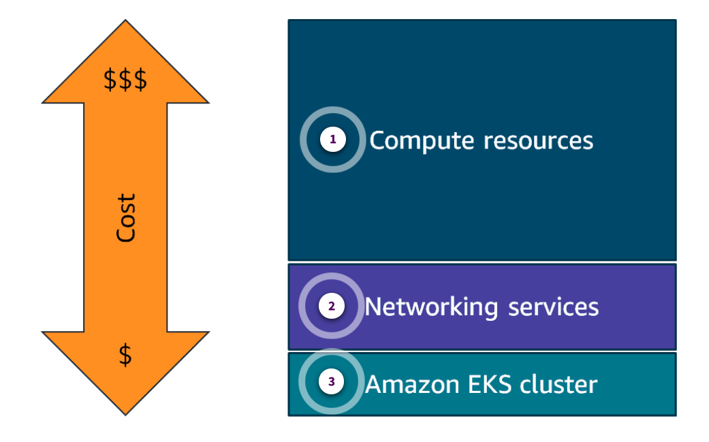

1. **Compute resources**

    Compute services, like Amazon Elastic Compute Cloud (Amazon EC2) and AWS Fargate, are likely to make up the majority of the cost of the EKS cluster. The total cost of ownership differs depending on which compute resource is running in the cluster. The difference in overall cost between running workloads on Fargate or with EC2 instances depends on the practice of rightsizing and reducing the waste of underused compute capacity.

2. **Networking services**

    Amazon EKS clusters can use a variety of networking and content-delivery services, such as load balancers, that contribute to overall cost.

3. **Control plane**

    Customers incur a charge per cluster, but this cluster charge makes up a small part of the overall cost.

---

#### Cost of an Amazon EKS cluster

A review of a simplified Amazon EKS cluster diagram provides an initial step for calculating the cost of running an Amazon EKS cluster consisting of compute and networking resources. The following reference architecture shows an example of a viable Amazon EKS cluster. As the architecture is for reference, additional components (additional storage, networking, and so forth) are excluded.

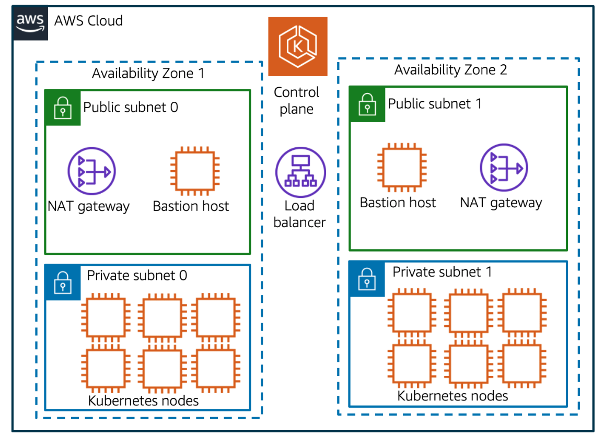

The reference architecture of an Amazon EKS cluster shown consists of the following AWS objects that incur costs.

| Service | Number of Items |
| ------- | --------------- |
| Amazon EKS control plane | 1 |
| Networking services (Application Load Balancer, NAT gateway)| 3 |
| Compute services (Amazon EC2) | 14 |

The diagram shows that compute services such as Amazon EC2 instances have the largest impact on cost for an Amazon EKS cluster. The actual amount depends on the instance type.

#### Managing compute costs

AWS provides a variety of purchasing options for compute resources that act as the worker nodes in your cluster.

* **On-Demand**

    Pay for the compute resources your workloads actually consume as they consume those resources. This is a good choice for workloads with spikes in demand that are stateful or do not tolerate interruption well.

* **Savings Plan or Reserved Instances**

    Savings Plans and Reserved Instances are good choices for steady-state workloads, such as databases.

* **Compute Savings Plans**

    Savings Plans are a flexible pricing model that offer low prices on Amazon EC2 and Fargate usage in exchange for a commitment to a consistent amount of usage (measured in dollars per hour) for a 1- or 3-year term. When you sign up for a Savings Plan, you will be charged the discounted Savings Plans price for your usage up to your commitment.

    Visit the [Savings Plans pricing page](https://aws.amazon.com/savingsplans/) for additional information.

* **Reserved Instances**

    Commit to a certain amount of compute for 1 or 3 years at a discounted price. Amazon EC2 Reserved Instances provide a significant discount compared to On-Demand pricing, and they provide a capacity reservation when used in a specific Availability Zone or Region.

    Visit the [Amazon EC2 Reserved Instances pricing page](https://aws.amazon.com/ec2/pricing/reserved-instances/) for additional information.

* **Spot or Fargate Spot**

    Take advantage of unused Amazon EC2 capacity in the AWS Cloud, paying much less than On-Demand Instances without the commitment of Reserved Instances. This is a good choice for stateless or other fault-tolerant workloads, even if they experience spikes in demand.

---

#### How managed services reduce cost

Amazon EKS is itself a great example of a managed service that removes the undifferentiated heavy lifting of managing your cluster’s control plane. You can also make greater use of managed services in Amazon EKS by using managed node groups instead of manually managing your worker nodes.

Using managed services accomplishes the following:

* Reduces your total cost of ownership by saving on engineering hours
* Enhances productivity because people can focus on development
* Improves security, stability, and compliance

#### To learn more

In this topic, you learned about the Amazon EKS pricing model and the primary drivers of cost for an Amazon EKS cluster. You can calculate your Amazon EKS cluster architecture cost using the AWS Pricing Calculator.

* [AWS Pricing Calculator](https://calculator.aws/#/)

---

### [Lab: Deploying Containerized Applications to Amazon EKS](./labs/W092Lab2DeployingApptoEks.md)

In this hands-on lab, you deploy and run a pre-built containerized application on an Amazon Elastic Kubernetes Service (Amazon EKS) cluster using an AWS integrated development environment (IDE). You will gain experience with the workflow of managing Kubernetes on AWS using multiple tools and approaches.

In this lab, you will perform the following tasks:

* Configure IDE
* Deploy an Amazon EKS cluster and managed node group
* Deploying Containerized Tasks to Amazon EKS Using Imperative and Declarative Approaches

---

## WORKING WITH AMAZON ECS

---

## SELECTING A COMPUTE SERVICE

---
