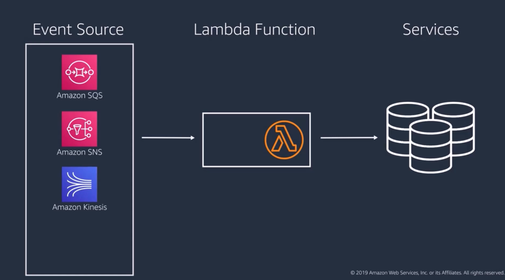
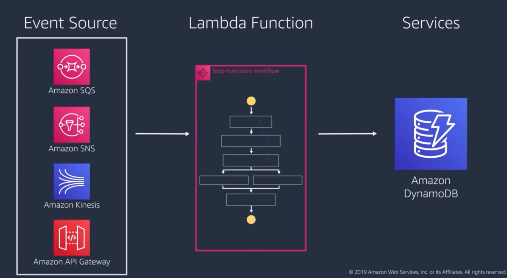
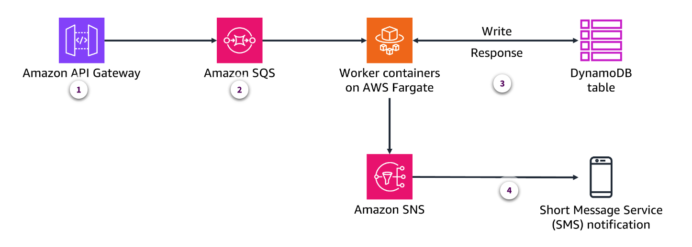
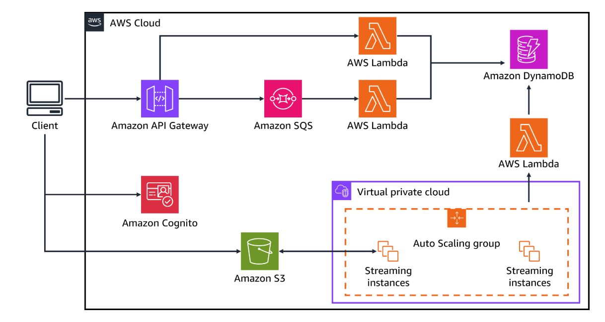

# Week 10: Architecting on AWS 2 Part 1: Building Modern, Event-Driven Applications

* back to AWS Cloud Institute repo's root [aci.md](../aci.md)
* back to [AWS Cloud Fundamentals 2](./aws-cloud-fundamentals-2.md)
* back to repo's main [README.md](../../../README.md)

## UNDERSTANDING MODERN APPLICATIONS

### Well-Architected Framework: Six pillars of the Well-Architected Framework

1. **Operational excellence**

    Operations teams must understand their business and customers to support desired outcomes. They create and validate procedures to respond to events and collect metrics to measure achievement. As everything continues to change, operations must evolve to support the business over time and incorporate lessons learned. One way to help automate aspects of the operational excellence pillar is using the [Cloud Development Kit](https://aws.amazon.com/cdk/).

2. **Security**

    Before architecting workloads, security must be implemented to control access and identity and to protect systems and data. Every system and service on AWS is automated and can be programmatically secured. Some examples of this are not allowing access from the internet, encrypting data in storage, and starting an alarm when things go wrong. This, along with a well-defined and communicated response process, is critical to preventing financial loss and keeping the business compliant with regulations.

3. **Reliability**

    When building on AWS, foundational requirements for reliability are often already in place. The cloud's scalability and flexibility enable on-demand resource adjustments. Reliable workloads require upfront design decisions, such as loosely coupled dependencies and graceful degradation, to accommodate changes. Cloud infrastructure abstracts hardware failures. However, to ensure reliable operation, it is crucial to implement resiliency measures, including fault isolation, automated failover, and disaster recovery.

4. **Performance efficiency**

    Take a data-driven, iterative approach to building a high-performance AWS architecture. Regularly review choices, monitor performance, and make trade-offs like compression, caching, or relaxed consistency to optimize for specific workloads. AWS Well-Architected solutions often combine multiple approaches to enhance performance.

5. **Cost optmization**

    Considering trade-offs between speed and cost is crucial. Hasty design decisions can lead to overprovisioned and underoptimized deployments. Using appropriate services, resources, and configurations is key to cost savings. One easy way to visualize these expenses and compare trade-offs is to use [AWS Cost Explorer](https://aws.amazon.com/aws-cost-management/aws-cost-explorer/).

6. **Sustainability**

    Choose AWS Regions based on your business needs and sustainability goals. Analyze user behavior, infrastructure, data, and hardware to optimize for sustainability. Implement load smoothing, data management, and efficient hardware selection. In your development and deployment process, identify opportunities to reduce sustainability impact through performance optimizations, managed environments, and automated lifecycle management. One key resource that can help calculate the environmental impacts of your architectures is the [Customer Carbon Footprint Tool](https://aws.amazon.com/aws-cost-management/aws-customer-carbon-footprint-tool/).

### Activity: Aligning with the Well-Architected Framework

#### After speaking with several other cloud architects, you discover that everyone has their own manual processes for provisioning resources. What changes, if any, would you suggest?

* Implement infrastructure as code (laC) using tools like AWS CloudFormation and the AWS Cloud Development Kit (AWS CDK) to automate the provisioning of cloud resources. This ensures consistency, reliability, and the ability to replicate and scale the infrastructure.

Wrong answers:

* No changes need to be made. Each team should continue to deploy according to their preferences.
* Implement a standardized way for all the teams to manually provision their resources. This way, each team is following the same process and schedule.

##### Explanation

Implementing resources manually can lead to issues such as configuration errors and poor scheduling. Automating resource provisioning helps with the following:

* Creating standardization and repeatable processes
* Increasing resource utilization efficiency
* Simplifying the monitoring of resources

#### The password policies for the company require eight characters and must use both letters and numbers. What changes, if any, would you suggest?

* Implement stronger password policies, including longer and more complex requirements. Also enable multi-factor authentication for all user accounts and administrative access in AWS Identity and Access Management (IAM).

Wrong answers:

* No changes need to be made. These password requirements are sufficient.
* Implement stronger password policies, including longer and more complex requirements for all user accounts and administrative access in AWS Identity and Access Management (IAM).

##### Explanation

This implements the principle of [least privilege](https://docs.aws.amazon.com/IAM/latest/UserGuide/best-practices.html#grant-least-privilege) and enforces separation of duties with appropriate authorization for each interaction with your AWS resources. This choice also centralizes identity management, and aims to eliminate reliance on long-term static credentials.

#### The company runs its product catalog in an Amazon Relational Database Service (Amazon RDS) instance in a sinle Availability Zone. What changes, if any, would you suggest?

* Deploy replicas of critical workloads, like product catalog databases, across multiple Availability Zones.

Wrong answers:

* No changes need to be made. The product catalog diagram is fine as it is.
* Deploy replicas of critical workloads, like product catalog databases, within the same Availability Zone to achieve high availability and fault tolerance.

##### Explanation

Deploying critical workloads across multiple Availability Zones or even multiple AWS Regions can help the company to achieve high availability and fault tolerance for their product catalog.

#### As seen in the previous review, the company runs their product catalog on an Amazon RDS instance. As new product types are added, they redo the schema to accommodate different attribute types. This rework has resulted in many hours of redesigning, testing, and implementing the database. What changes, if any, would you suggest?

* Switch to Amazon DynamoDB and use a key-value database so that the database can dynamically meet the attribute needs of different product types.

* Switch to Amazon DynamoDB and use a document database so that the database can dynamically meet the attribute needs of different product types.
* No changes need to be made. The product catalog should remain in Amazon RDS.

##### Explanation

DynamoDB is a NoSQL database that supports two data models: key-value and document. NoSQL databases are flexible — the schema doesn't need to be predefined like in relational databases. This flexibility would let the company easily add new product types without reconfiguration.

#### After speaking with the different department heads, you discovered that some of their teams still run their workloads completely using on-premises solutions. What changes, if any, would you suggest?

* Review the workloads that each department is running that use on-premises solutions. If there are no compliance reasons not to move to the cloud, work with the team to move their workloads in phased transitions to the cloud.

Wrong answers:

* No changes need to be made. The teams should move to the cloud whenever they feel comfortable.
* Review the workloads that each department is running that use on-premises solutions. If there are no compliance reasons not to move to the cloud, work with the team to move their workloads all at once to the cloud.

##### Explanation

A phased conversion is both safer and more economical. By picking one or a few essential applications or divisions, you can prove out the concepts and gain trust. To encourage adoption, provide support and training.

#### Most of their infrastructure is still running through on-premises data centers in their building. This has led to high energy costs even when demand is low. What changes, if any, would you suggest?

* Migrate to a cloud-based infrastructure. It can often offer more energy-efficient data centers and the ability to scale based on demand, reducing the overall energy usage.

Wrong answers:

* Upgrade their data centers so that they use more energy-efficient technology. They can use resources like the Carbon Footprint Tool to evaluate their workloads and how changes can affect their footprint.
* No changes need to be made. They should continue running their applications as they are.

##### Explanation

Moving their infrastructure to the cloud will make it so that they can benefit from all of the sustainable practices implemented by
AWS. Additionally, it means that they can scale up and down in accordance with demand instead of wasting energy on unused resources. One key resource that they can use to help calculate the sustainability of their architectures is the [Customer Carbon Footprint Tool](https://aws.amazon.com/sustainability/tools/aws-customer-carbon-footprint-tool/).

### Modern Applications

A traditional application architecture uses what's called a monolithic structure, which results in a large, complex, and tightly coupled architecture. Because of this, changes and updates to the application often require a complete rebuilding and redeployment of the entire system.


This leads to a slow and rigid deployment process and slows innovation because any disruption to any part of an application must be carefully balanced. Monolithic applications face several other challenges.

For example, scaling an application becomes increasingly difficult as the code base grows larger and more complex. Additionally, troubleshooting and isolating issues in the application are complicated. A problem in one component can easily have ripple effects throughout the entire system.


To address these challenges, developers have started using an alternative architecture style, often called event driven or modern applications. Modern applications segment an application into smaller independent services that focus on a specific functionality such as an authentication system, product catalog, and payment system.


These microservices communicate with one another through events. The resulting architecture is modular and loosely coupled. The modern application approach offers three notable benefits.


1. Each part of an application can be updated independently, whether you are scaling a service or implementing a new way of doing something.
2. Troubleshooting is much simpler. It is easier to isolate and address a problem in microservices because you don't have to look through an entire application to locate the source of an issue. This also reduces the chance of a fix causing problems throughout a system.
3. This approach can more readily incorporate emerging technologies such as generative AI, serverless computing, and containerization.

While this is a new design architecture, some industries such as video and music streaming services are already using microservices, and as technology continues to evolve, we expect the adoption of modern application architecture to increase.


The modern application architecture can enhance scalability, reliability, and efficiency, but most of all, it fosters innovation by enabling easier experimentation in application.

#### Summary

* **Monolithic application**

    An application using a monolithic architecture is a traditional software development model that uses one code base to perform multiple business functions. All the software components in a monolithic system are interdependent due to the data exchange mechanisms within the system.

* **Microservice-based application**

    An application using microservices for its architecture composes software into small independent components or services. Each service performs a single function and communicates with other services through a well-defined interface. Because they run independently, you can update, modify, deploy, or scale each service as required.

#### Characteristics of a modern application

* **Event-driven and decoupled architecture**

    Modern applications are designed to be event-driven, meaning that they respond to and react to specific events or triggers. This approach allows for more dynamic and flexible application behavior, because the application can adapt and respond to changing conditions or user interactions.

    **Use case**: When a customer places an order on the ecommerce website, the Order Management microservice creates an event with the order details. This event is then routed through a routing service such as Amazon Simple Notification Service (Amazon SNS) to another service, such as the Packaging microservice.

* **Real-time data streaming**

    Modern applications often rely on real-time data streaming, where data is continuously ingested, processed, and acted upon in near real time. This enables applications to provide up-to-the-moment information, insights, and responses to users or other systems.

    **Use case**: A financial institution could use real-time data streaming from Amazon OpenSearch to detect and mitigate fraudulent activities, ensuring the security and integrity of their systems.

* **Horizontal scalability**

    Modern applications are designed to be horizontally scalable. This means that they can handle increased loads and demands by adding more computing resources (for example, servers or containers) rather than relying on a single, powerful machine. This scalability allows applications to adapt and grow to meet changing user needs and traffic patterns.

    **Use case**: During a major sales event, such as Black Friday or Cyber Monday, an ecommerce's platform is likely to experience a significant increase in user traffic and transaction volume. To handle this surge in demand, the platform can scale horizontally by adding more computing resources, such as additional web servers, application servers, and database instances. For example, the platform's load balancer can automatically detect the increased load and dynamically provision more web server instances to handle the incoming requests. Similarly, the platform's microservices responsible for processing orders, managing inventory, and processing payments can also scale horizontally by adding more instances to distribute the workload.

* **Use of managed services**

    Modern applications use managed services, such as cloud-based databases, storage, messaging, and analytics platforms, provided by cloud service providers. This lets developers focus on building the application's core functionality without having to manage the underlying infrastructure and services.

    **Use case**: An online vacation home company uses Amazon Simple Storage Service (Amazon S3) for the storage of over a million photos uploaded by hosts and guests. This service lets developers focus on the application side of data storage and retrieval, rather than managing the block storage infrastructure needed to keep the data available, durable, and secure.

* **API-driven and originating in the cloud**

    Modern applications are designed to be API driven, where the application's functionality is exposed through well-defined and documented APIs. These applications are also designed to be built specifically for the cloud environment, taking advantage of cloud-based technologies and best practices.

    **Use case**: A web-based food ordering and delivery service created their platform using an event-driven architecture. In this scenario, the backend, consisting of food ordering and delivery services, is built using a microservices architecture. Each core functionality (for example, user management, menu management, order processing, and delivery tracking) is implemented as a separate service. External entities, such as customers, can interact with the frontend service through an API. The frontend then creates events and sends them to the backend services.

#### AWS services that support modern applications

The following table provides a list of categories and their associated services that contribute to this style of modern application.

| Purpose | Serivces |
| ------- | -------- |
| Data ingestion and streaming | Amazon Simple Queue Service (Amazon SQS), Amazon Kinesis Data Streams, Amazon Data Firehose, and Amazon Managed Streaming for Apache Kafka (Amazon MSK) |
| Messaging and event-driven architecture | Amazon SQS and Amazon Simple Notification Service (Amazon SNS) |
| Data storage and database | Amazon DynamoDB, OpenSearch, Amazon ElastiCache, and Amazon MemoryDB for Redis |
| Event management and orchestration | Amazon EventBridge, AWS Batch, and AWS Step Functions |
| Analytics and big data | Amazon EMR, Amazon Managed Service for Apache Flink, and GraphQL through AWS AppSync |
| Compute and serverless | AWS Lambda |

### Microservices

#### Comparing microservice and monolithic applications

Within a monolithic application, there are a client-side UI, a database, and a server-side application. Developers build all of these modules on a single code base. Features such as user management, threads, and posts are all part of that code base.

With a microservice-based application, the architecture is distributed and each microservice works to accomplish these features individually. Instead of exchanging data within the same code base, the microservices communicate with an API.


* **DEVELOPMENT PROCESS**

| Monolithic | Microservices |
| ---------- | ------------- |
| Monolithic applications are easier to start with, because not much up-front planning is required. You can get started and keep adding code modules as needed. However, the application can become complex and challenging to update or change over time. | A microservice architecture requires more planning and design before starting. Developers must identify different functions that can work independently and plan consistent APls. However, the initial coordination makes code maintenance much more efficient. You can make changes and find bugs faster. Code reusability also increases over time. |

* **DEPLOYMENT PROCESS**

| Monolithic | Microservices |
| ---------- | ------------- |
| Deploying monolithic applications is more straightforward than deploying microservices. Developers install the entire application code base and dependencies in a single environment. | In contrast, deploying microservice-based applications is more complex, because each microservice is an independently deployable software package. Developers usually containerize microservices before deploying them. Containers package the code and related dependencies of the microservice for platform independence. |

* **DEBUGGING**

| Monolithic | Microservices |
| ---------- | ------------- |
| Debugging is a software process to identify coding errors that cause the application to behave erratically. When debugging monolithic architecture, the developer can trace data movement or examine code behavior within the same programming environment. However, identifying coding issues in a microservice architecture requires looking at multiple loosely coupled individual services. | It can be more challenging to debug microservice applications because several developers might be responsible for many microservices. For instance, debugging might require coordinated tests, discussions, and feedback among team members, which takes more time and resources. |

* **MODIFICATIONS**

| Monolithic | Microservices |
| ---------- | ------------- |
| A small change in one part of a monolithic application affects multiple software functions because of the tightly coupled coding. In addition, when developers introduce new changes to a monolithic application, they must retest and redeploy the entire system on the server. | In contrast, the microservices approach allows flexibility. It's easier to make changes to the application. Instead of modifying all the services, developers only change specific functions. They can also deploy particular services independently. Such an approach is helpful in the continuous deployment workflow where developers make frequent small changes without affecting the system's stability. |

* **SCALING**

| Monolithic | Microservices |
| ---------- | ------------- |
| Monolithic applications face several challenges as they scale. The monolithic architecture contains all functionalities within a single code base, so the entire application must be scaled as requirements change. For example, if the application's performance degrades because the communication function experiences a traffic surge, you must increase the  compute resources to accommodate  the entire monolithic application. This results in resource wastage because not all parts of the application are at peak capacity. | The microservices architecture supports distributed systems. Each software component receives its own computing resources in a distributed system. These resources can be scaled independently based on current capacities and predicted demands. So, for example, you can allocate more resources to a geographic location service instead of the whole system. |

---

#### Benefits of microservice-based applications

##### Scalability

Microservices allow for independent scalability of different processes. If one service or component faces an issue or grows beyond capacity, it can be provisioned or scaled without impacting others, which enhances the overall system's scalability.

**Use case**: This can help ecommerce websites during peak sales seasons. During major shopping events like Black Friday, Cyber Monday, or holiday sales, ecommerce websites often experience a significant surge in traffic and user activity. In a monolithic application architecture, the entire system would be stressed, and the overall performance would degrade if the system cannot handle the increased load.

However, in a microservice-based architecture, the different components of the ecommerce application such as the following can be scaled independently to handle the increased load.

* **Product catalog**:  If the product catalog service is experiencing high traffic due to users browsing and searching for products, it can be scaled up by adding more instances or increasing the resources like CPU and memory of the existing instances, without impacting the other services.
* **Shopping cart**: The shopping cart service might also see a spike in usage as customers add items to their carts during the sales event. This service can be scaled independently to handle the increased load, ensuring a smooth checkout process.
* **Payment processing**: The payment processing service can be scaled to accommodate the higher number of transactions.
* **Order management**: The order management service can be scaled to handle the increased order processing workload.

By providing independent scalability of these microservices, the overall ecommerce application can better handle the increased demand during peak sales seasons This provides a seamless and efficient user experience for customers. This flexibility and scalability offered by microservices can be a significant advantage in high-traffic, high-load scenarios like ecommerce websites.

##### Reduced risk of failure

Because of monolithic architecture's high level of coupling, failure of one component can cause an entire application failure. With well-designed microservice architectures, the failure of one service isn't a threat to the whole system, because services are made to be lightweight, independent, and self-sufficient.

**Use case**: This can help that same ecommerce company with its platform. In a traditional monolithic application, the entire platform would be tightly coupled, where the shopping cart, product catalog, payment processing, and order management modules would all be part of a single codebase.

In this scenario, if a bug or unexpected load in the payment processing module were to cause it to fail, the entire ecommerce platform would likely become unavailable to customers. And this would lead to a poor user experience and potentially lost revenue.

However, in a microservice-based ecommerce platform, the various functionalities would be implemented as independent services, each running in its own container or virtual machine. If the payment processing service were to fail, the other services would continue to function. So customers could still browse the product catalog, add items to their cart, and complete their orders, even if they couldn't process payments during that time.

The failure of the payment processing service would be isolated and would not impact the overall availability of the ecommerce platform. This level of failure isolation is particularly important in mission-critical applications or in regulated industries, where the failure of one component cannot be allowed to bring down the entire system.

By using microservices, organizations can build more resilient and fault-tolerant applications that can better withstand the failure of individual components, ensuring a more reliable and consistent user experience.

##### Faster launch, migration, or rollback

The startup of individual services can be independent and as a result, faster, because they do not rely on another service to start and can be deployed more frequently.

**Use case**: The ecommerce company is planning to launch a new product line on their website. They have developed this new product line using a microservice-based architecture. Each part of the product page — product details, pricing, images, reviews, and so on—is implemented as a separate service. In a traditional monolithic application, the entire website would need to be updated and deployed at once, which could be a lengthy and risky process, especially if there are any issues with the new product line.

However, in a microservice-based architecture, the ecommerce company can deploy the new product-related services independently, without affecting the rest of the website. This provides the following benefits:

* **Faster launch**: The company can quickly deploy the new product-related services without waiting for the entire website to be ready. This helps them to get the new products in front of customers more quickly.
* **Easier migration**: If the company later needs to update or modify the new product line, they can do so by updating the individual services, without having to redeploy the entire website. This reduces the risk and complexity of the migration process.
* **Quicker rollback**: If any issues arise with the new product-related services, the company can quickly roll back those specific services to the previous stable version, without impacting the rest of the website. This minimizes the downtime and impact on the customers.
* **Faster failure recovery**: If a failure occurs within the application, the company can take that individual service offline, fix it, and then put it back online, all without affecting other parts of the application.

By using the independent deployment and rollback capabilities of a microservice-based architecture, the ecommerce company can launch new products or make updates to their website more efficiently. And they can do this without disrupting the overall user experience for their customers.

##### Enhanced collaboration and development productivity

Developers can focus on specific features without worrying about how those features will interact with the whole system. Changed or new services can be introduced as requirements evolve, increasing overall development productivity.

**Use case**: The ecommerce company wants to implement a new feature that allows customers to create personalized product bundles. This new feature must be integrated with the existing product catalog, shopping cart, and order management systems. In a microservice-based architecture, the ecommerce company can do the following:

* It can isolate the development of the personalized product bundle feature into a dedicated microservice. Developers working on this feature can focus solely on its implementation, without having to worry about how it will interact with the rest of the ecommerce system. Each development team becomes the owner of a service within the application. This transition to more ownership within a team can increase productivity, because there are fewer barriers to decision making and implementation.
* The new personalized product bundle microservice can be designed and implemented independently, without disrupting the existing product catalog, shopping cart, or order management microservices.
* As the ecommerce company's requirements evolve, they can easily introduce new microservices or make changes to existing ones, such as adding a recommendation engine or implementing a loyalty program. These changes can be made without necessarily impacting the entire system, thanks to the loose coupling and independence of the microservices.
* The modular and independent nature of the microservices permits the ecommerce company to assign specific teams or developers to work on different features, increasing overall development productivity. Each team can focus on their respective microservice, enhancing their expertise and streamlining the development process.
* If a particular microservice has to be updated or scaled, it can be done independently, without affecting the rest of the ecommerce system. This flexibility and agility in adapting to changing requirements is crucial for an ecommerce company to stay competitive and responsive to customer needs.

By using the benefits of a microservice-based architecture, the ecommerce company can quickly implement new features, such as the personalized product bundle. They can do this without compromising the stability and performance of the overall system, while maintaining a high level of development productivity as the business evolves.

#### Challenges of microservice-based applications

The following are some of the complexities that can accompany microservice-based applications:

* **Complexity**: Microservices architecture can be more challenging to manage, and designing this system might be more complex than a monolith, which might affect initial development costs and timelines.
* **Communication overhead**: There can be added overhead in terms of communication between services, which can be slower and more complex than a monolithic system where a request is sent as a whole. Because services are independent, communication is required at different layers such as data exchange and events, which increases this overhead.
* **Misaligned services**: If not implemented properly, services might end up serving the wrong customer needs, because they might not be designed with the user's needs in mind.
* **Complex versioning and compatibility**: Services change independently. So it will be harder to manage and ensure that all service versions work well together in the future. This can be especially true if they are not implemented with a framework or platform to manage these versions.
* **Overhead of testing and monitoring individual services**: Testing and monitoring services can be more tough, because it's harder to combine all these services into test environments and set up complete scenarios. This might lead to some services not being fully tested, which could then cause an entire system failure.

### Communication protocols

Communication protocols are a set of rules and standards that define how data is transmitted and received between different devices or systems on a network. They specify the format, timing, sequencing, and error checking of data communication. When designing an application, there are several decisions that must be made. The following are two communication protocols, along with examples for you to think about.

#### Synchronous or asynchronous communication

When reading about the two methods, consider a chat or messaging application, and which might be the ideal choice.

* **Synchronous communications**

Data exchange between services requires both the sender and receiver to be available at the same time to exchange data, typically in a blocked manner. In a synchronous request chain, the client is blocked from sending subsequent requests until the current one is completed.

This communication type also require sequential execution because requests are executed one after the other, in a linear fashion. Because of this, requests are dependent on the response from the previous one. This tight association means that communications lack parallelism because only one request can be processed at a time, limiting the overall throughput.


* **Asynchronous communications**

Senders and receivers operate independently, swapping messages at their convenience. Asynchronous communication is similar to delivering a package. After it is delivered, the carrier no longer is interested in its status. It can continue delivering other packages. This method of communication is preferred in microservices because of its responsiveness, resource conservation, and scalability.


---

In a real-time chat application, users expect instant responses and the ability to send and receive messages without delay. Using a synchronous communication protocol, such as a traditional client-server model where the client sends a request and waits for a response, would not be the best choice for this scenario. This is because with synchronous communication, the user would have to wait for a response from the server before it can display the sent message, resulting in a slow and unresponsive user experience. Asynchronous communication enables bidirectional communication.

---

#### Communication with single or multiple receivers

When reading about the two methods, consider the scenario of a *stockprice* topic that is published on a broker service every time the stock price of a company changes and which might be the ideal choice.

* **Single receiver**: In a single receiver scenario, a microservice sends a request or a message to a single, specific microservice. The communication is point-to-point, where the calling microservice knows the exact recipient of the message. This type of communication is often used in request-response patterns, where a client calls a specific service to perform a particular task.
* **Multiple receivers**: In a multiple receivers scenario, a microservice sends a request or a message to multiple microservices. The communication is broadcast-like, where the calling microservice does not need to know the specific recipients of the message. This type of communication is often used in event-driven architectures, where a microservice publishes an event, and multiple microservices can subscribe to and consume that event. Multiple receivers can be implemented using message queues, message brokers, or event buses, where the message is delivered to all the subscribed microservices.

In this instance, multiple receivers would be the preferred choice. Multiple separate applications, tracking different companies, can be set up to listen or subscrape the *stockprice* topic to get the latest stock price of the companies that they are tracking.

### Strategies for incorporating asynchronous communication

Asynchronous communication is an essential aspect of distributed systems, and it plays a crucial role in achieving eventual consistency and effective data replication. Here are some strategies for asynchronous communication in the context of two topics: eventual consistency and data replication.

#### Eventual consistency

Eventual consistency is where your data might take a little time to reflect the latest changes made by other users. The following are some ways that having eventually consistent data can support asynchronous communication:

* **Event-driven architecture**: Employ an event-driven architecture where components communicate by publishing and subscribing to events. This allows for loose coupling and asynchronous processing, to provide eventual consistency.
* **Message queues and publish-subscribe systems**: Use message queues or publish-subscribe (pub-sub) systems to decouple the sender and receiver of updates, allowing for eventual propagation of changes.
* **Versioning and causal consistency**: Maintain version information and causal dependencies to ensure that updates are applied in the correct order, even in the face of asynchronous communication.

#### Data replication

Data replication is when copies of data are stored in multiple locations. Some common reasons for this are to reduce latency, increase availability, and support disaster recovery efforts. The following are some ways that data replication decisions can support asynchronous communication:

* **Asynchronous replication**: Employ asynchronous replication mechanisms, where updates are first committed locally and then propagated to other replicas in the background. This can reduce the impact on the primary service.
* **Incremental data synchronization:** Design your replication mechanisms to only propagate the changes (deltas) between replicas, rather than full dataset transfers This reduces the load on the network and improves efficiency.
* **Notification and subscription mechanisms**: Provide notification and subscription mechanisms, where clients can subscribe to specific data changes and be asynchronously notified of updates. This enables efficient data propagation.
* **Batch and scheduled replication**: Consider batch-processing or scheduled replication approaches to reduce the impact of continuous replication on the overall system performance. By incorporating these strategies for asynchronous communication, you can effectively manage eventual consistency and implement robust data replication mechanisms in your distributed systems. The choice of specific strategies will depend on the requirements, constraints, and characteristics of your application.

### Converting to Microservices

To build a successful microservices-based application, it is important to start with a well-defined business domain and clear service boundaries. Additionally, adopting a continuous integration and continuous deployment and continuous integration (CI/CD) pipeline can help streamline the development and deployment process. Implementing service discovery, load balancing, and fault tolerance mechanisms is crucial for ensuring the reliability and scalability of the application.

Using AWS services like AWS Lambda, Amazon API Gateway, and Amazon DynamoDB can provide a powerful and flexible infrastructure to support the microservices architecture. Finally, implementing robust monitoring and observability tooling is essential for maintaining the health and performance of the application.

Converting from a monolithic application to a microservice-based application involves the following key steps:

1. Assess your current architecture and workloads.
2. Identify the right services and tools for your use case.
3. Determine the necessary changes to your development and deployment processes.
4. Architect and implement the microservices.
5. Gradually migrate to microservices, starting with smaller components.

* [Migrating Applications from Monolithic to Microservices on AWS](https://aws.amazon.com/blogs/apn/migrating-applications-from-monolithic-to-microservice-on-aws/)

#### Mindset shifts when moving to microservices

Changing from a monolithic architecture to microservices requires several mental shifts. To learn more about these shifts, expand each of the following categories.

##### Cultural shifts

Transitioning from a "single team, single codebase" mindset to a "multiple autonomous teams, multiple codebases" approach is essential for fostering a culture of experimentation and continuous improvement, and a willingness to embrace change.

By encouraging this shift, organizations can cultivate a mindset of shared responsibility and cross-functional collaboration across the teams. Emphasizing the importance of agility, flexibility, and the ability to respond quickly to changing business requirements will help the organization to thrive in the face of evolving market demands.

##### Organizational shifts

The organization should be restructured from a centralized, hierarchical structure to a more decentralized, autonomous team-based structure. Cross-functional teams should be established, each responsible for specific microservices or domain-driven capabilities.

These teams should be empowered to make independent decisions, develop, and deploy their microservices without relying on a central authority. Furthermore, a governance model should be implemented that balances autonomy and consistency across the organization.

##### Communication shifts

The organization should shift from a predominantly asynchronous communication model, such as email and documentation, to a more real-time, event-driven communication model. This can be achieved by encouraging the use of messaging protocols, APIs, and event-driven architectures to enable seamless communication between microservices.

Clear guidelines and standards should be established for inter-service communication, API design, and data exchange to ensure consistency and facilitate collaboration. Additionally, mechanisms for service discovery, service registration, and service monitoring should be implemented to facilitate communication between distributed components and enable the smooth operation of the system.

##### Ownership shifts

The organization should transition from a centralized ownership model to a decentralized, domain-based ownership model. Clear ownership and accountability should be assigned to specific teams for each microservice or domain-driven capability. This empowers teams to make autonomous decisions regarding the design, development, and deployment of their microservices.

Additionally, mechanisms for cross-team collaboration and coordination should be implemented to ensure coherence and consistency across the overall system. Lastly, a shared responsibility model should be established where teams collaborate and share knowledge to maintain the overall system health.

---

### Knowledge Check

#### A cloud architect is designing a new application for a retail company. Which benefit of the sustainability pillar of the AWS Well-Architected Framework should the architect consider?

* Helping to analyze and optimize the environmental impact of the architecture

Wrong answers:

* Ensuring reliable operation of applications in the face of changes and disruptions
* Providing a framework for implementing security controls
* Enabling efficient use of computing resources to minimize costs

##### Explanation

The sustainability pillar helps analyze and optimize the environmental impact of architectures.

The other options are incorrect because:

* Ensuring reliable operation is a benefit of the reliability pillar.
* Implementing security controls is a benefit of the security pillar.
* Efficient use of computing resources to minimize costs is a benefit of the cost optimization pillar.

#### A team is designing a modern, event-driven application on AWS. Which of these are characteristics of a modern application architecture? (Select TWO.)

* Event-driven and decoupled
* API-driven and cloud-centered

Wrong answers:

* Monolithic, on-premises deployment
* Tightly coupled system components
* Vertically scalable

##### Explanation

Modern applications are typically designed to be event driven, with decoupled components that communicate asynchronously.

They are also designed to be horizontally scalable, using cloud-centered technologies and APIs rather than being monolithic and deployed on premises.

The other options are incorrect because they describe characteristics of traditional, legacy application architectures.

#### A company wants to modernize their monolithic application to improve scalability, flexibility, and fault tolerance. Which benefit of the reliability pillar of the AWS Well-Architected Framework should the company consider?

* Ensuring reliable operation of applications in the face of changes and disruptions

Wrong answers:

* Helping architects analyze and optimize the environmental impact of their architectures
* Providing a framework for implementing security controls
* Enabling efficient use of computing resources to minimize costs

##### Explanation

The reliability pillar of the AWS Well-Architected Framework ensures reliable operation of applications in the face of changes and disruptions, which aligns with the company's goals of improving scalability, flexibility, and fault tolerance.

The other options are incorrect because they describe the benefits of other pillars of the framework, not the reliability pillar.

#### A company is transitioning from a monolithic application to a microservices-based architecture on AWS. Which shifts should the company expect during this transition? (Select TWO.)

* Organizational shift to a decentralized, autonomous team-based structure
* Communication shift to a more real-time, event-driven model

Wrong answers:

* Cultural shift to a "single team, single codebase" mindset
* Ownership shift to a centralized, hierarchical model
* Technical shift to a tightly coupled, monolithic architecture model

##### Explanation

Transitioning to microservices requires a shift in organizational structure, moving from a centralized to a decentralized model with autonomous teams responsible for individual services.

It also necessitates a shift in communication patterns, from asynchronous to more real-time, event-driven interactions between services.

The cultural shift should be towards a "multiple autonomous teams, multiple codebases" mindset, not a "single team, single codebase" approach.

The ownership model should also shift to a more decentralized, domain-based ownership, not a centralized, hierarchical model.

The technical shift is towards a decoupled architecture, with a microservices architecture, not the other way around.

---

### Summary

There are six pillars of the Well-Architected Framework:

* Operational excellence
* Security
* Reliability
* Performance efficiency
* Cost optimization
* Sustainability

#### Modern applications

Modern applications use events to communicate between microservices. An application using microservices for its architecture composes software into small independent components or services. Each service performs a single function and communicates with other services through a well-defined interface. Because they run independently, you can update, modify, deploy, or scale each service as required.

##### Characteristics of a modern application

Modern applications have the following characteristics:

* Event-driven and decoupled architecture
* Real-time data streaming
* Horizontal scalability
* Use of managed services
* API-driven and originating in the cloud

##### Functions supported by microservices

AWS has services that can help with the following purposes:

* Data ingestion and streaming
* Messaging and event-driven architecture
* Data storage and database
* Event management and orchestration
* Analytics and big data
* Compute and serverless

#### Microservices

Within a monolithic application, there are a client-side UI, a database, and a server-side application. Developers build all these modules on a single code base. Features such as user management, threads, and posts are all a part of that code base.

With a microservice-based application, the architecture is distributed and each microservice works to accomplish these features individually. Instead of exchanging data within the same code base, the microservices communicate with an API.

##### Benefits of using microservices

* Scalability
* Reduced risk of failure
* Faster launch, migration, or rollback
* Enhanced collaboration and development productivity

##### Challenges of using microservices

* Complexity
* Communication overhead
* Misaligned services
* Complex versioning and compatibility

#### Communication protocols

Communication protocols are sets of rules and standards that define how data is transmitted and received between different devices or systems on a network. They specify the format, timing, sequencing, and error checking of data communication. When designing an application, there are several decisions that need to be made.  Synchronous and asynchronous communication protocols can be used by applications.

Asynchronous communication is an essential aspect of distributed systems, and it plays a crucial role in achieving eventual consistency and effective data replication.

#### Converting to microservices

To build a successful microservices-based application, it is important to start with a well-defined business domain and clear service boundaries. Additionally, adopting a CI/CD pipeline can help streamline the development and deployment process. Implementing service discovery, load balancing, and fault tolerance mechanisms is crucial for ensuring the reliability and scalability of the application.

Converting from a monolithic application involves the following key steps:

1. Assess your current architecture and workloads.
2. Identify the right services and tools for your use case.
3. Determine the necessary changes to your development and deployment process.
4. Architect and implement the microservices.
5. Gradually migrate to microservices, starting with smaller components.

##### Mindset shifts

Changing from a monolithic architecture to microservices requires several mental shifts:

* **Cultural shifts**: It is advised to move from a "single team, single codebase" mindset to a "multiple autonomous teams, multiple codebases" approach to foster a culture that allows for experimentation, improvement, change, and the ability to deal with them. This shift helps organizations be more agile and respond quickly to changing business needs in an evolving market.
* **Organizational shifts**: The organization should transition from a centralized, hierarchical structure to a more decentralized, team-based structure. Cross-functional teams should be established, each responsible for specific microservices or domain-driven capabilities. These teams should be empowered to make independent decisions and deploy their microservices without relying on a central authority. Additionally, a governance model should be implemented to balance the autonomy of the teams with consistency across the organization.
* **Communication shifts**: An improved communication system across the organization involves adopting protocols, APIs, and event-driven architectures to enable seamless communication between services. Clear guidelines and standards must also be established for better consistency and collaboration through service discovery, registration, and monitoring. This will result in a more real-time and collaborative system.
* **Ownership shifts**: Organizations should transition from a centralized ownership model to a system in which teams have clear ownership for certain areas, and in turn, make autonomous decisions about their specific services. This promotes cross-team collaboration and coordination to ensure consistent capabilities across the overall system. A final suggestion is to create a shared responsibility model to maintain system health through collaboration and knowledge sharing.

---

## DESIGNING MODERN EVENT-DRIVEN APPLICATIONS

### Event-Driven Architectures

An event-driven architecture uses events to communicate between decoupled services and is common in modern applications built with microservices.

An event is a change in state, or an update, like an item being placed in a shopping cart on an ecommerce website. Events can either carry the state (the item purchased, its price, and a delivery address) or events can be identifiers (a notification that an order was shipped).

Often, the applications built using microservices are serverless in nature. Serverless applications are those where the underlying infrastructure is abstracted and wholly managed by a cloud provider. Serverless applications let developers concentrate on code writing and complex and scalable computing without the need to administer hardware or servers. This further increases the flexibility and cost reduction that microservices already provide.

Serverless applications are inherently event driven, because they are often initiated by events, such as HTTP requests, database updates, or message queue events.

---

Event-driven architectures use events to communicate between and invoke decoupled services.

---

Like microservices, serverless applications are event-driven and use technology-agnostic APIs with decoupled communications.

Event-driven code is executed in response to an event, such as a change in state or an endpoint request. In event-driven architectures, state and code are decoupled, and integration between components is typically done with messaging to create asynchronous connections.

To be successful with these types of architectures, it's critically important to get the integrations right. Event-driven patterns aren’t new. Many of them were documented in the book "Enterprise Integration Patterns: Designing, Building, and Deploying Messaging Solutions" (Gregory Hope and Bobby Woolf) which was written in 2003.

However, at that point, techniques for implementing them could be expensive to build and run, and could create lock-in that made it difficult to scale. With today’s cloud-based serverless technologies, you can implement event-driven patterns with a lot less overhead.

AWS Lambda is a serverless compute service that is well suited to event-driven architectures. AWS Lambda is event driven by nature.



Lambda functions execute based on an event source and get data from the event source via the event object. Lambda functions consume and produce events that other services can then consume. Lambda has native support for events produced by message and streaming services like Amazon Simple Queue Service (SQS), Amazon Simple Notification Service (SNS), and Amazon Kinesis that can be used to create asynchronous integrations.

Serverless architecture patterns use Lambda with other managed services that are also serverless. In addition to message and streaming services, serverless architectures use managed services like Amazon API Gateway for API management, Amazon DynamoDB for data stores, and AWS Step Functions for orchestration. This lets you create Lambda functions focused on business logic, while AWS managed services do more of the undifferentiated lifting between integrated components.



#### Event-driven architecture use cases

In the following examples, the event-driven architecture allows the applications to respond to various user actions, sensor inputs, and external data sources in a timely and efficient manner. The applications can then update their user interfaces, initiate backend processes, and communicate with other services or devices based on these events, providing a seamless and responsive user experience.

##### Smartwatch or Fitness tracker

With these kinds of devices, real-time data processing is paramount. Because of this, event-driven architecture becomes a suitable model. The following events would cause updates to the user interface, data synchronization with the companion application, and analysis of the user's activity and health metrics:

* Heart rate changes
* Step count changes
* Sleep pattern changes
* Workout start and end
* Notifications from connected devices

##### eCommerce

The entire shopping experience is a series of events within the online storefront. Some example events that might cause updates to the system as you are shopping or an email to be sent about your order are the following:

* Product added to cart
* Checkout process initiated
* Payment successful or failed
* Order status changes

##### Financial Trading

In financial trading systems, real-time updates to a user's portfolio, market data visualizations, and implementation of trading strategies can all be driven by events. The following are some common events that would happen within this kind of system:

* Stock price changes
* Market news updates
* User trading actions (buy, sell, place orders)

---

Expanding on the ecommerce use case, the following illustrates a simple event-driven workflow. This workflow is a serverless pattern to process orders within an ecommerce workflow using a RESTful microservice.

1. The order information comes in through an API call over HTTP.
2. Amazon API Gateway handles requests and responses to those API calls.
3. Lambda contains the business logic to process the calls.
4. DynamoDB provides persistent storage.

#### Event-driven architecture components

Event-driven architecture has three main components: **event producers**, **event routers**, and **event consumers**. These components work together to create a loosely coupled, scalable, and resilient system.

##### Event producer

Event producers are the components or services that generate events and publish them to an event routing mechanism, such as a stream, message queue, or a pub-sub system.

They are responsible for detecting or creating significant occurrences or changes in the system and packaging them as discrete event messages. Their event messages contain relevant information about the event, such as the type of event, the timestamp, and any associated data.

Event producers have no direct knowledge of the event consumers and simply publish the events to the event routing mechanism.

**Examples of event producers**: Amazon Simple Storage Service (Amazon S3), Amazon DynamoDB, and AWS CloudTrail

##### Event router

Event routers are responsible for ingesting a high throughput of events from event producers and forwarding them to the appropriate event consumers. The event router acts as an intermediary between the event producers and the event consumers, decoupling them from each other. It might buffer events for replay and multiple consumers.

Event routers are decoupled from event producers and event consumers and can be implemented using various technologies, such as a message queue, a pub-sub system, or a message broker. The event router is responsible for managing the distribution of events, ensuring reliable delivery, and providing features like message queueing, filtering, and event transformation.

**Examples of event routers**: Amazon EventBridge and AWS Lambda

##### Event consumer

Event consumers are the components or services that are subscribed to streams and queues. They receive and process the events from the event routers that are published by the event producers.

Event consumers are responsible for processing the event messages, performing any necessary business logic, and taking appropriate actions based on the received events. Event consumers are decoupled from the event producers, allowing them to be added, removed, or modified independently without affecting the overall system. Because of this, they have no knowledge of what produces an event.

Event consumers can be synchronous (blocking) or asynchronous (non-blocking) in their processing, depending on the requirements of the system. Sometimes, event consumers send events to new destinations.

**Examples of event consumers**: Amazon Simple Queue Service (Amazon SQS) and AWS Lambda

#### Example of event-driven architecture

AWS provides a set of fully managed services that you can use to build and run serverless, event-driven, applications. Serverless applications don’t require you to provision, maintain, and administer servers for backend components, such as compute, databases, storage, stream processing, messaging, and queueing.



This architecture diagram shows a simple SMS notification service where each part of the process is decoupled. Operating independently from each other protects against traffic spikes and makes it easier to troubleshoot each individual part of the process.

1. **Receiving requests and API calls**

    Amazon API Gateway receives all requests for the service. It carries out all the tasks involved in accepting and processing API calls.

2. **Amazon SQS**

    Amazon API Gateway feeds messages to an application messaging queue built in Amazon SQS. The messages are processed by a worker service. This queue provides a buffer for the worker service if traffic spikes occur.

3. **AWS Fargate and DynamoDB**

    The worker service writes the processed message to a DynamoDB table. The worker receives a response when the request is complete.

    The containerized worker service uses serverless hosting in AWS Fargate, which automatically scales hosting capacity with each newly launched container.

4. **Amazon SNS**

    When the worker receives a success response, it notifies Amazon SNS, which pushes an SMS notification to all subscribed users.

#### Benefits of event-driven architecture

Event-driven architectures offer several benefits that make them a popular choice for modern software systems. Some of the key benefits of event-driven architecture include the following:

* **Rapid integration**: Because events are directed towards receptors that have detailed knowledge about their consumption, systems can be integrated together in more flexible ways, only needing to react to specific events of interest, according to the business needs.
* **High concurrency**: Events are often processed in parallel by many different components, allowing a high level of concurrency and better utilization of available resources.
* **Advanced real-time systems**: The event-driven model is often associated with real-time systems, where timely responses to events are required.

#### Disadvantages of event-driven architecture

It's important to note that although event-driven architectures provide many benefits, they also come with some challenges. The following are some common challenges:

* **Complexity amplification**: Event-driven architecture can lead to an increase in system complexity, particularly when events are firing often, and there's a substantial amount of state management involved. This can escalate complexity, debugging efforts, and overall development time.
* **System design dynamics**: Event-driven systems demand integration points throughout the system, which can introduce areas of failure and fragility into what might look like a monolithic paradigm. Poor integration design can introduce points of failure and performance bottlenecks, and make it harder to troubleshoot elements.
* **Testing intricacies**: Event-driven architecture can make unit testing a system almost impossible. In a system where the sequence of events is crucial, unit testing can become difficult. Function-level integration testing, brownfield testing (simulating an events sequence), and extensive debugging can become staple items in the tester's toolbox.

### Eventual Consistency in Event-Driven Architectures

* **Eventual consistency**

    Eventual consistency is a model used in distributed systems, where the system guarantees that if no new updates are made to a given data item, eventually all accesses to that item will return the last updated value. In these systems, updates to data might take some time to propagate to all replicas, and during this time, different replicas might have different versions of the same data. Eventual consistency is often used in scenarios where immediate consistency is not critical, and the system prioritizes availability and partition tolerance over strong consistency.

* **Event-driven architecture**

    Event-driven architecture is an architectural pattern where the flow of the program is determined by events, such as user actions, sensor outputs, or messages from other systems. In this architecture style, components of the system communicate with each other by producing, detecting, and reacting to events. Events are typically published to an event bus, which decouples the event producers from the event consumers, allowing for asynchronous and scalable communication.

#### AWS services with eventual consistency

Most AWS services support some form of eventual consistency, but the specific details can vary from service to service.

* **Amazon S3**

    Amazon S3 provides eventual consistency for overwrite PUTS and DELETE operations. This means that subsequent read requests might not immediately reflect the update.

* **DynamoDB**

    DynamoDB supports both strong consistency and eventual consistency. By default, DynamoDB read operations use eventual consistency, but you can choose to use strongly consistent reads if necessary.

* **Amazon SQS**

    Amazon SQS uses a distributed, replicated architecture, which means that messages in a queue might not be immediately visible to all consumers. This is an example of eventual consistency.

* **Amazon SNS**

    Amazon SNS employs a distributed architecture, and message delivery is not guaranteed to be immediate. This is another example of eventual consistency.

* **Amazon ElastiCache with Redis**

    When using the Redis engine, Amazon ElastiCache provides eventual consistency for read operations, because the data is replicated across multiple nodes.

* **Amazon RDS**

    When using the MySQL, PostgreSQL, or Oracle DB engines in a multi-AZ configuration, Amazon RDS can provide eventual consistency for read replicas.

---

#### CAP theorem tradeoffs

The CAP theorem is a fundamental principle in distributed systems that states that a distributed system can only guarantee at most two out of the following three properties:

* **Consistency (C)**: Consistency means that all clients see the same data at the same time. In other words, when a client writes data, all other clients should see the same data immediately.
* **Availability (A)**: Availability means that the system is always ready to serve a client's request. The system should respond to every request, regardless of whether the data is consistent or not.
* **Partition tolerance (P)**: Partition tolerance means that the system can continue to operate even when there is a network failure or a network partition (a situation where the network is divided into two or more independent networks).

This tradeoff occurs because when a network partition occurs, the system has to choose between consistency and availability. Consider the example of a database sharded between five different nodes. A network break could occur that separates two nodes from the other three, creating two partitions. Using the CAP theorem, one potential outcome is that the partition with the most nodes becomes the leader and operates as if it contains all the nodes, and the other two nodes are taken offline. This would be an example of losing availability in favor of consistency.

1. **Consistency and availability (CA) system**

    In a CA system, the system maintains consistency and availability, but it cannot handle network partitions. This means that if a network partition occurs, the system will either become unavailable or lose consistency.

2. **Consistency and partition tolerance (CP) system**

    In a CP system, the system maintains consistency and partition tolerance, but it might sacrifice availability. This means that if a network partition occurs, the system will become unavailable until the partition is resolved.

3. **Availability and partition tolerance (AP) system**

    In an AP system, the system maintains availability and partition tolerance, but it might sacrifice consistency. This means that if a network partition occurs, the system will remain available, but it might return stale or inconsistent data.

---

In practice, most distributed systems choose to sacrifice one of the three properties to achieve the other two. The choice between availability and consistency depends on the specific requirements of the system and the trade-offs that the system designer is willing to make.

For example, a banking application might prioritize consistency over availability, because it is crucial to ensure that all transactions are recorded accurately.

A content delivery network for a video streaming provider might prioritize availability over consistency, because it is more important to serve content quickly than to ensure that all clients see the same data at the same time.

---

#### Eventual consistency in real life

An end user updating their profile in a social media application is an example of data that is usually eventually consistent.

1. **User updating profile**: A user updates their profile information, such as their profile picture, bio, or location, on a social media platform.
2. **Initial stale data**: When the user initially views their profile, the updated information mighty not be immediately visible. Instead, the user sees the previous, stale data.
3. **Eventual consistency**: Over time, as the platform's data replication and synchronization processes take effect, the updated profile information is propagated across the system. Eventually, the user's profile will display the new, up-to-date information.

#### Eventual compared with strong consistency

So why use eventual consistency? Wouldn't it be better to have data that is as accurate as possible? Well, there are also trade-offs when choosing strong consistency. The following provides a summary of the trade-offs for each choice and as use cases for each consistency model:

* **Strong consistency**: This consistency model can lead to increased latency and higher cost. It is typically used for critical data that requires instant visibility such as financial transactions and gaming.
* **Eventual consistency**: This consistency model provides faster performance and lower costs. It is typically used for use cases such as social media posts and product catalogs, where instant visibility is not necessary.

Event-driven architecture can use eventual consistency to handle data updates in a distributed system. In an event-driven architecture, when an event occurs, it can activate updates to data stored across multiple distributed nodes or services. Because these updates might take time to propagate to all replicas, the system can use an eventual consistency model to ensure that the data eventually converges to a consistent state, even if intermediate states temporarily exhibit inconsistencies.

The asynchronous and decoupled nature of event-driven architecture aligns well with the relaxed consistency guarantees provided by eventual consistency. So the system can maintain availability and responsiveness while managing the complexity of distributed data management. Eventual consistency and event-driven architecture are distinct concepts. However, they can be used together effectively in the design of scalable and fault-tolerant distributed systems, where data consistency is not the primary concern, but rather overall system availability and responsiveness.

---

### Knowledge Check

#### An ecommerce company wants to build a decoupled, event-driven architecture to handle their order processing workflow. Which AWS services would be most suitable to implement this? (Select TWO.)

* Amazon Simple Notification Service (Amazon SNS)
* Amazon EventBridge

Wrong answers:

* Amazon Simple Queue Service (Amazon SQS)
* Amazon DynamoDB
* Amazon EC2

##### Explanation

Amazon SNS provides a publish-subscribe model to decouple the order processing components, allowing them to communicate asynchronously.

Amazon EventBridge can be used to ingest events from various sources, route them to the appropriate targets, and orchestrate the overall order processing workflow.

The other options are incorrect because:

* Amazon SQS and DynamoDB are also useful in event-driven architectures, but they are not the primary services for decoupling and event routing in this scenario.
* Amazon EC2 is not directly involved in the event-driven aspects of the architecture.

#### A content delivery network (CDN) for a video streaming provider is implementing a distributed system. It is important to the CDN to serve content quickly and not fail if messages are dropped or delayed between components of the system. Which properties of the CAP theorem might the CDN prioritize?

* Availability
* Partition tolerance

Wrong answers:

* Consistency
* Scalability
* Fault tolerance

##### Explanation

A content delivery network for a video streaming provider needs to  prioritize Availability and Partition Tolerance over Consistency, because it is more important to serve content quickly and reliably, than to ensure that all clients see the same data at the same time.

The other options are incorrect because:

* Consistency is not as important to the CDN. The CDN doesn't care that all clients see the same data at the same time.
* Scalability and Fault tolerance are not properties of the CAP theorem.

#### An ecommerce company wants to implement an event-driven architecture to handle order processing. They plan to use Amazon Simple Notification Service (Amazon SNS) and Amazon Simple Queue Service (Amazon SQS) to decouple the components. Which primary benefit will this architecture provide?

* Rapid integration between components

Wrong answers:

* Improved data consistency
* Reduced system complexity
* Simplified testing and monitoring

##### Explanation

Event-driven architectures, like the one using Amazon SNS and Amazon SQS, promote decoupling and asynchronous communication between components.

This allows for rapid integration and changes, because the components do not have to know about each other's implementation details.

The other options are incorrect because:

* Event-driven architectures can also provide improved data consistency through eventual consistency models, reduced system complexity, and simplified testing and monitoring. However, the primary benefit in this scenario is the rapid integration between the order processing components.

---

### Summary

An event is a change in state, or an update, like an item being placed in a shopping cart on an ecommerce website. Events can either carry the state (the item purchased, its price, and a delivery address) or events can be identifiers (a notification that an order was shipped).

```text
Event-driven architectures use events to communicate between and invoke decoupled services.
```

#### Event-driven architecture components

Event-driven architecture has three main components:

* **Event producers**: Event producers are technologies or services that receive, detect, or create events and are then published to a message queue or similar systems like pub-sub.  They package significant occurrences or changes in the system as discrete event messages that contain relevant event details, timestamps, and any associated data. Event producers don't know the consumers and simply publish the events to be received by them later.
* **Event routers**: Event routers act as middlemen between producers and consumers of events, decoupling them and managing the distribution of events. They can use technologies like message queues, pub-sub systems, or message brokers to achieve the required function. They can buffer events for replay purposes, ensuring the same events get delivered reliably.
* **Event consumers**: Event consumers are services that subscribe to event streams and queues, processing the received events and performing actions based on them. They are decoupled from the event producers, meaning that they can be added, removed, or modified without affecting the overall system. This loose connection offers flexibility and independent scalability of the system. Consumer processing can be synchronous or asynchronous, with the system requirement determining this.

#### Eventual consistency

Eventual consistency is a model used in distributed systems where the system guarantees that if no new updates are made to a data item, all accesses will eventually return the last updated value. In these systems, updates might take time to propagate to all replicas, so different replicas might have different versions temporarily. Eventual consistency is used when immediate consistency is not critical, and the system prioritizes availability and partition tolerance over strong consistency.

The following AWS services support eventual consistency:

* Amazon S3
* DynamoDB
* Amazon SQS
* Amazon SNS
* ElastiCache
* Amazon RDS

#### CAP theorem

The CAP theorem is a fundamental principle in distributed systems that states that a distributed system can only guarantee at most two out of the following three properties:

* **Consistency (C)**: Consistency means that all clients see the same data at the same time. In other words, when a client writes data, all other clients should see the same data immediately.
* **Availability (A)**: Availability means that the system is always ready to serve a client's request. The system should respond to every request, regardless of whether the data is consistent or not.
* **Partition Tolerance (P)**: Partition tolerance means that the system can continue to operate even when there is a network failure or a network partition (a situation where the network is divided into two or more independent networks).

---

## IMPLEMENTING EVENT-DRIVEN ARCHITECTURES WITH AWS SERVICES

### Using Amazon SQS in Event-Driven Architectures

Amazon Simple Queue Service (Amazon SQS) is an AWS service that provides a simple and cost-effective queuing service that allows you to pass messages among different components of an application or infrastructure. The following are the key ways that it participates in an event-driven architecture:

* **Decoupling**: Amazon SQS provides a way to decouple components in an event-driven architecture. It acts as a message broker, allowing producers (event publishers) to send messages to a queue without the need to directly interact with the consumers (event subscribers). This decoupling enables greater flexibility, scalability, and fault tolerance.
* **Asynchronous communication**: Amazon SQS facilitates asynchronous communication between components in an event-driven system. Producers can publish events to the queue without waiting for consumers to process them, allowing the system to scale and handle high-volume workloads more effectively.
* **Reliable message delivery**: Amazon SQS ensures reliable message delivery by providing at-least-once delivery semantics. Messages placed in the queue are persisted and can be consumed multiple times if necessary, ensuring that events are not lost.
* **Dead-letter queues**: Amazon SQS supports the use of dead-letter queues, which allow you to capture and analyze messages that could not be successfully processed by the consumers. This feature helps identify and address issues in the event processing pipeline.
* **Message visibility timeout**: Amazon SQS allows you to configure a message visibility timeout, which determines the time window during which a consumer has to process a message before it becomes visible to other consumers. This feature helps ensure that messages are processed exactly once, even in the face of consumer failures.
* **Integration with other AWS services**: Amazon SQS integrates seamlessly with other AWS services, such as Lambda, Amazon SNS, and Amazon CloudWatch. You can build complex event-driven architectures and automate event processing workflows.
* **Scalability and elasticity**: Amazon SQS is a highly scalable service that can automatically handle fluctuations in message volume. As the number of producers and consumers changes, Amazon SQS can dynamically scale to accommodate the workload, ensuring that the system remains responsive and efficient.
* **Delayed message delivery**: Amazon SQS provides the ability to delay the delivery of messages to the queue, which can be useful in certain event-driven scenarios where you need to introduce a deliberate delay before processing an event.

By using the key functions and features of Amazon SQS, you can design and implement highly scalable, fault-tolerant, and decoupled event-driven architectures that can efficiently handle a wide range of workloads and event processing requirements.

#### Using Amazon SQS as an event consumer

In this architecture diagram from Databases and Caching, API Gateway forwards the request to Amazon SQS to ensure that requests are handled in order. The architecture uses a serverless matchmaker composed of Amazon SQS, AWS Lambda, and Amazon DynamoDB. Both the streaming instance and signaling servers are hosted in the same Amazon Elastic EC2 instance.



---

### Using Amazon SNS in Event-Driven Architectures

Amazon Simple Notification Service (Amazon SNS) is an AWS service that provides a fully managed publish-subscribe (pub-sub) system that plays a crucial role in event-drive architecture. The following are the key ways that it participates in an event-driven architecture:

* **Publish-subscribe model**: Amazon SNS follows a pub-sub model, allowing producers (publishers) to send messages to consumers (subscribers) without direct coupling. Publishers can publish messages to SNS topics, and subscribers can subscribe to these topics to receive the messages.
* **Topic-based messaging**: Amazon SNS organizes messages into topics, which act as logical access points and event channels. Topics provide a way to group related messages and decouple event producers from event consumers.
* **Event distribution**: Amazon SNS can distribute messages to multiple subscribers simultaneously, enabling event fan-out and scalable event propagation. Subscribers can be diverse, including Amazon SQS queues, AWS Lambda functions, HTTP/S endpoints, email addresses, and more.
* **Reliability and durability**: Amazon SNS provides high availability and fault tolerance, ensuring reliable message delivery. Messages are durably stored and can be replicated across multiple Availability Zones for increased resilience.
* **Scalability and performance**: Amazon SNS can handle high-volume event traffic, scaling automatically to accommodate changes in message throughput. It can deliver millions of messages per second, making it suitable for event-driven architectures with large-scale event processing requirements.
* **Integration with other AWS services**: Amazon SNS integrates seamlessly with other AWS services, enabling event-driven workflows and integration patterns. It can activate actions in services like AWS Lambda, Amazon SQS, Amazon S3, and Amazon Kinesis, facilitating end-to-end event-driven architectures.
* **Flexible subscription options**: Amazon SNS supports various subscription types, including HTTP/S, email, SMS, mobile push notifications, and Amazon SQS queues. This flexibility allows you to choose the appropriate delivery mechanism based on the event consumer's requirements.
* **Dead-letter queues**: Amazon SNS provides the ability to configure dead-letter queues, which can capture and store failed message deliveries for further investigation and processing. This feature helps in monitoring and troubleshooting event-driven architectures.
* **Message filtering**: Amazon SNS supports message filtering, allowing subscribers to receive only the events that they are interested in based on specific criteria. This feature helps in reducing unnecessary event processing and optimizing resource utilization.

By using the key functions and features of Amazon SNS, you can build scalable, reliable, and decoupled event-driven architectures, for efficient and flexible event processing and distribution across your applications and services.

#### Pub-sub messaging

Publish-subscribe messaging, or pub-sub messaging, is an asynchronous communication model that makes it easy for developers to build highly functional and architecturally complex applications in the cloud. In modern cloud architecture, applications are decoupled into smaller, independent building blocks called services. Pub-sub messaging provides instant event notifications for these distributed systems. It supports scalable and reliable communication between independent software modules.

##### Pub-sub components

A pub-sub system has four key components.

* **Messages**

    A message is communication data sent from sender to receiver. Message data types can be anything from strings to complex objects representing text, video, sensor data, audio, or other digital content.

* **Topics**

    Every message has a topic associated with it. The topic acts like an intermediary channel between senders and receivers. It maintains a list of receivers who are interested in messages about that topic.

* **Subscribers**

    A subscriber is the message recipient. Subscribers have to register (or subscribe) to topics of interest. They can perform different functions or do something different with the message in parallel.

* **Publishers**

    The publisher is the component that sends messages. It creates messages about a topic and sends them once only to all subscribers of that topic. This interaction between the publisher and subscribers is a one-to-many relationship. The publisher doesn’t need to know who is using the information it is broadcasting, and the subscribers don’t need to know where the message comes from.

##### Pub-sub features

Applications developed with a pub-sub pattern have separate application and communication logic. The messaging infrastructure decouples message delivery between publishers and subscribers, and broadcasts to different subscribers asynchronously. This provides the following features. To learn more, expand each of the following categories.

* **Push delivery**

    Pub-sub messaging instantly pushes asynchronous event notifications when messages are published to the message topic. Subscribers are notified when a message is available.

* **Multiple delivery protocols**

    Topics connect to multiple types of endpoints, such as message queues, serverless functions, HTTP servers, and email addresses.

* **Fanout**

    This scenario happens when a message is sent to a topic and then replicated and pushed to multiple endpoints. Fanout provides asynchronous event notifications, which in turn allow for parallel processing.

* **Filtering**

    The filtering feature empowers the subscriber to create a message filtering policy. So, they will only get the notifications that they’re interested in, as opposed to receiving every single message posted to the topic.

* **Multiplexing**

In some cases, publishers can also be subscribers. You can multiplex message streams and create systems that link together in an internally consistent manner.

##### Pub-sub and event-driven architecture benefits

The pub-sub model enables event-driven architecture, which is required in several modern applications. You can use events to initiate and communicate between decoupled services. An event is a change in state, or an update, like an item being placed in a shopping cart.

Pub-sub messaging provides significant advantages to developers who build applications that rely on real-time events. The following are some of these benefits:

* **Eliminating polling**: Message topics allow instantaneous, push-based delivery, eliminating the need for message consumers to periodically check, or poll, for new information and updates. This promotes faster response time and reduces the delivery latency that can be particularly problematic in systems where delays cannot be tolerated.
* **Dynamic targeting**: The pub-sub pattern makes the discovery of services easier, more natural, and less error prone. Instead of maintaining a roster of peers so that an application can send messages, a publisher will simply post messages to a topic. Then any interested party will subscribe its endpoint to the topic and start receiving these messages. Multiple subscribers can change, upgrade, or disappear, and the system adjusts dynamically.
* **Decoupling and scaling independently**: Pub-sub makes the software more flexible. Publishers and subscribers are decoupled and work independently from each other, which allows you to develop and scale them independently. You can decide to handle orders one way this month and then another the following month. Adding or changing functionality won’t send ripple effects across the system, because pub-sub allows you to flex how everything works together.
* **Simplified communication**: Code for communications and integration is some of the hardest code to write. The publish-subscribe model reduces complexity by removing all the point-to-point connections with a single connection to a message topic. The topic will manage subscriptions to decide what messages should be delivered to which endpoints. Fewer callbacks result in looser coupling, plus code that is easier to maintain and extend.
* **Durability**: Pub-sub messaging services often provide very high durability, and at-least-once delivery, by storing copies of the same message on multiple servers.
* **Security**: Message topics authenticate applications that try to publish content and allow you to use encrypted endpoints to secure messages in transit over the network.

#### Integrating Amazon SNS and Amazon SQS for decoupling

In an event-driven architecture, integrating Amazon SNS and Amazon SQS can be a powerful way to achieve decoupling between different components of the system. The following is how you can integrate these two services to implement a decoupled event-driven architecture:

1. **Create an SNS topic**: Create an SNS topic that will serve as the event bus. This topic will be the central point where all the events are published.
2. **Subscribe SQS queues to the SNS topic**: Create one or more SQS queues and subscribe them to the SNS topic. This means that whenever a message is published to the SNS topic, it will be delivered to all the subscribed SQS queues.
3. **Publish events to the SNS topic**: The components in your system that generate events (the publishers) will publish those events to the SNS topic. These components don't need to know anything about the downstream consumers of the events.
4. **Consume events from the SQS queues**: The components in your system that consume the events (the subscribers) will receive the events from the SQS queues. These components don't need to know anything about the upstream producers of the events.

---

### [Lab: Using Amazon SNS and SQS in Event-Driven Architectures](./labs/W100Lab1SnsSqsEvenDrivenArchitecture.md)

In this lab, you configure an Amazon Simple Storage Service (Amazon S3) bucket to invoke an Amazon Simple Notification Service (Amazon SNS) notification whenever an object is added to an Amazon S3 bucket. You learn how to create and interact with Amazon Simple Queue Service (Amazon SQS) queues, and learn how to invoke an AWS Lambda function using Amazon SQS.

In this lab, you will perform the following tasks:

* Create an Amazon SNS topic.
* Create Amazon SQS queues.
* Create event notifications in Amazon S3.
* Create AWS Lambda functions using preexisting code.
* Invoke an AWS Lambda Function from SQS queues
* Monitor AWS Lambda S3 functions through Amazon CloudWatch Logs.

---

### Using Amazon DynamoDB in Event-Driven Architectures

Amazon DynamoDB is a fully managed NoSQL database service that is well suited for event-driven architecture due to its key features and functions. The following are the key ways that it participates in an event-driven architecture:

* **Scalability and high availability**: DynamoDB is a fully managed service that automatically scales up or down based on the workload, ensuring high availability and eliminating the need for manual provisioning or scaling. This is crucial in event-driven architectures, where the workload can fluctuate significantly based on the occurrence of events.
* **Low latency data access**: DynamoDB provides fast and consistent data access, with single-digit millisecond latency for reads and writes. This makes it suitable for event-driven systems that require real-time responses to events.
* **Event sourcing and change data capture (CDC)**: Amazon DynamoDB Streams can be used to capture changes to the data, which is a key requirement for event sourcing and CDC patterns in EDA. These streams can be used to invoke downstream actions and process events in real time.
* **Integration with other AWS services**:** DynamoDB seamlessly integrates with other AWS services, such as AWS Lambda, Amazon Kinesis, and Amazon SNS, which are commonly used in event-driven architectures. This allows for the creation of event-driven workflows and the ability to react to events in a serverless and scalable manner.
* **Flexible data model**: The DynamoDB document-based data model, where data is stored in JSON-like documents, is well suited for event-driven architectures that often deal with semi-structured or unstructured data. This flexibility allows for easy modeling of event data and related information.
* **Transactions and conditional writes**: DynamoDB supports ACID-compliant transactions, which is important for maintaining data consistency in event-driven systems. Conditional writes can also be used to ensure that events are processed in the correct order and that the data remains consistent.

By using these features and functions, DynamoDB can play a crucial role in building robust and scalable event-driven architectures. It provides real-time processing, data consistency, and seamless integration with other AWS services.

#### Amazon DynamoDB Streams

Amazon DynamoDB Streams provides a real-time data synchronization capability that helps decouple application components at no extra cost. It is included in the store-and-query pricing of Amazon DynamoDB, a fully managed NoSQL database service.

With DynamoDB Streams, you can make your applications always up to date. You do this by capturing and transferring changes made to your data lake in DynamoDB and then streaming this synchronized data to downstream destinations such as databases, cache systems, or analytics services. Here's how it works.

* **Data change capture**: DynamoDB Streams enable you to capture and record every change (write) made to your tables as a stream of consistency points. A consistency point is a snapshot of the data as it existed at a specific point in time. Each such snapshot, or record, captures key-value changes from that point onward and doesn't capture changes that occurred before that time.
* **Stream generation**: DynamoDB Streams begin generating streams when you enable them, which is a quick operation. When the streams are enabled, for every new write operation performed on the table, a new record is created in the stream, capturing the information about that write operation.
* **Destination criteria**: DynamoDB supports two types of destinations to receive this data: stream names and snapshots. When you set up a destination, you choose where to send the stream records. And you can select between sending the data to another DynamoDB table (optimal when you want to maintain the data in real time), or to take a snapshot of the data at a specific point in time for long-term storage.
* **Ease of integration**: Decoupling your applications is simplified because you only need to configure the destination of your choice when you set up the DynamoDB Streams, and then enable the destination. There's no need to replatform or reconcile your applications to use the real-time updates. After set up, you can write and read from your application as a completely separate system.
* **Extensibility**: The nature of the service supports a wide variety of applications. For example, you can use the data in Amazon Kinesis to analyze streams in real time and build a customized streaming ingestion pipeline for real-time data processing. Or you can save the data in Amazon S3 to analyze it at your convenience.

#### Common use cases of Amazon DynamoDB in event-drive architecture

##### Send welcome emails for new users

In an event-driven architecture, the creation of a new user account can be considered an event. When a new user is created, an event can be launched to store the user's information in a DynamoDB table. This table can be used to keep track of new users and their associated data, such as addresses. Upon the creation of a new user, a serverless function, such as a Lambda function, can run to send a welcome email to the new user's email address stored in the DynamoDB table. This approach ensures that the welcome email is sent immediately after the user's account is created, providing a seamless and timely onboarding experience.

##### Notify fraud detection system

In an event-driven architecture, suspicious activities or potential fraud events can launch notifications to a fraud detection system. A DynamoDB table can be used to store the details of these suspected fraud events, such as the user's information, transaction details, and any other relevant data. When a potential fraud event occurs, an event can be generated, and a serverless function (for example, AWS Lambda) can be initiated to write the event details to the DynamoDB table. The fraud detection system can then read from the DynamoDB table, analyze the data, and take appropriate actions. These actions can include flagging the account, initiating further investigation, or invoking additional security measures. This approach allows the fraud detection system to react promptly to potential fraud events and maintain a comprehensive audit trail in the DynamoDB table.

##### Append changes to audit log table

In an event-driven architecture, any changes or updates made to your system's data can be considered events. A DynamoDB table can be used as an audit log to record these events and changes. Whenever a change occurs in your system, an event can be generated. And a serverless function (for example, AWS Lambda) can be initiated to append the details of the change to the DynamoDB audit log table. The audit log table can store information such as the modified data, the user who made the change, the timestamp, and any other relevant metadata. This approach ensures that you have a comprehensive and tamper-proof audit trail of all changes made to your system, which can be valuable for compliance, troubleshooting, and data lineage purposes.

##### Propogate changes in other tables

In an event-driven architecture, changes made to one table or entity can prompt updates or propagation of those changes to other related tables or entities. DynamoDB can be used to facilitate this propagation process by acting as a central hub for events and changes. Whenever a change occurs in a table, an event can be generated and written to a DynamoDB table. Other serverless functions (for example, AWS Lambda) can be initiated by these events to read the changes from the DynamoDB table and propagate the updates to the relevant tables or entities in your system. This approach ensures that your system maintains data consistency and integrity across multiple tables and components, even in a distributed and event-driven architecture.

---

### Using Amazon EventBridge in Event-Driven Architectures

Amazon EventBridge is a serverless event bus that is fully managed by AWS. An event bus is a software design pattern that allows different components of an application to communicate with each other by sending and receiving events. It is a central hub that facilitates the exchange of messages between different parts of an application, without the components having to know about each other's existence. The following are the key ways that it participates in an event-driven architecture:

* **Event ingestion and routing**: EventBridge can ingest events from various sources, both on premises and cloud, in various formats such as JSON, logs, and API calls. All events within EventBridge are guaranteed to be stored after 7 days (for long-term archival), and can be replayed to support end-to-end data integrity and audit trails. EventBridge has powerful routing rules that are defined to route events to various target destinations such as AWS services or third-party systems based on the event data or attributes.
* **Decoupled event processing**: In EventBridge, event processing occurs at runtime with virtually no drag on infrastructure, so that applications can continue to process batches in the background while new events arrive. It uses inference to determine the source of the event, so there's no need to predefine schemas, which simplifies running any custom event processing logic.
* **Event transformation and scheduling**: EventBridge supports event patching (modifying an event before it's passed on) and creating new events within an event stream (called events stretching), allowing much more flexibility. You can schedule events for prompts at predefined intervals or according to specific time or date patterns.
* **Integrations with core AWS services**: EventBridge integrates seamless with many core AWS services such as Amazon S3, Amazon RDS, Amazon CloudFront, and Lambda. Users can also connect to event streams from hundreds of third-party applications and services through open APIs (like Amplify, IBM Cloud, or Microsoft Azure).
* **Security and governance**: EventBridge uses a serverless architecture to provide a scalable and managed event bus for your application. It provides audit trails and APIs to control access to your event stream for enhanced security. It also offers customer-managed encryption for data at rest.

By using these features, you can build highly scalable, fault-tolerant, and decoupled event-driven architectures that efficiently process and respond to events in real time. This helps you build more agile and responsive applications.

#### Event routing and processing

The core strength of EventBridge lies in its event routing capabilities. You can define rules or prompts for incoming events based on attributes, patterns, or destinations. This means that you can strategically route events to targeted destinations like Lambda functions, AWS services, databases, or even external systems, enabling parallel processing or orchestration.  It routes and processes events in the following ways:

* **Event sources**: EventBridge can receive events from a variety of sources, including AWS services (for example, Amazon EC2, AWS Lambda, or Amazon S3). It can also receive events from software as a service (SaaS) applications and your own applications.
* **Event bus**: The EventBridge event bus collects and distributes events. When an event occurs in one of the connected sources, it is sent to the event bus.
* **Event rules**: Amazon EventBridge uses rules to determine how to process the incoming events. These rules define the criteria for matching events and the actions to take when a match is found.
* **Event targets**: When an event matches a rule, EventBridge can send the event to one or more target services or applications, such as AWS services (for example, Lambda, Amazon SNS, or Amazon SQS) and your own applications.
* **Event transformation**: EventBridge can transform the incoming event data into the format required by the target service or application. This allows you to integrate disparate systems without having to write custom code to transform the data.
* **Event replay**: EventBridge provides the ability to replay past events, which can be useful for debugging or reprocessing data.
* **Event filtering**: EventBridge allows you to filter events based on various criteria, such as the event source, event type, or event detail.
* **Event scheduling**: EventBridge can be used to schedule events, so you can automate tasks and workflows.
* **Event monitoring and logging**: EventBridge integrates with CloudWatch, so you can monitor and log the events processed by the service.

#### Event schemas and rules

EventBridge schemas and rules are two important components of the Amazon EventBridge service.

* **Schemas**

    Schemas in EventBridge define the structure and format of event data, ensuring consistent interpretation and processing. They can be registered in the schema registry, allowing management and sharing across your organization. By using schemas, you can guarantee proper event formatting and reliable event consumption and processing.

* **Rules**

    EventBridge rules determine how events are routed and processed. They specify what happens when an event comes in. Rules are used for incoming events, defining criteria to match against. Event data can be transformed, such as adding attributes, before being sent to a target service.

Together, Amazon EventBridge schemas and rules provide a comprehensive and flexible event management solution that you can use to define, validate, and process events across your applications and services. Schemas ensure the consistency and integrity of event data. Rules help you create custom event-driven workflows and integrate your applications with ease.

---

### [Lab: Building Decoupled Architectures with Amazon EventBridge](./labs/W102Lab2BuildingDecoupledArchitecturesWithAmazonEventBridge.md)

In this lab, you learn how to use an HTTP API to drive event-driven architecture. You also initiate AWS Lambda functions by invoking Amazon EventBridge rules directly from Amazon API Gateway.

In this lab, you will perform the following tasks:

* Create a Lambda function and configure environment variables.
* Create EventBridge rules targeting Lambda functions.
* Create an HTTP API and WebSocket endpoint using API Gateway.
* Create an API Gateway method to integrate with EventBridge.

---

### Knowledge Check

#### A media company wants to build an event-driven architecture to automatically process and analyze user-generated content. They plan to use Amazon Simple Notification Service (Amazon SNS) to distribute events to various downstream services. Which features of Amazon SNS are relevant to this specific use case? (Select TWO.)

* Amazon SNS can distribute messages to multiple subscribers simultaneously, enabling event fan-out.
* Amazon SNS integrates with other AWS services like AWS Lambda, enabling event-driven workflows.

Wrong answers:

* Amazon SNS supports message filtering, allowing subscribers to receive only the events that they are interested in.
* Amazon SNS provides strong data consistency guarantees for message delivery.
* Amazon SNS provides a web-based management console for configuring and monitoring SNS topics.

##### Explanation

Amazon SNS can distribute messages to multiple subscribers simultaneously, enabling event fan-out, which is crucial for the media company's use case of processing and analyzing user-generated content across multiple downstream services.

Additionally, the integration of Amazon SNS with other AWS services like Lambda allows the company to build event-driven workflows to automate the processing of the content.

The other options are incorrect because:

* Amazon SNS does support message filtering, allowing subscribers to receive only the events that they are interested in. And Amazon SNS provides a web-based management console for configuring and monitoring SNS topics. Although these are also useful features, fan-out and service integration are the MOST important in this scenario.
* Amazon SNS does not provide strong data consistency guarantees, but rather focuses on high availability and reliability.

#### A software development company wants to build an event-driven architecture to automatically propagate changes made to one Amazon DynamoDB table to other related tables. Which DynamoDB feature would be MOST useful for this use case?

* DynamoDB Streams to capture changes made to the tables and trigger updates to other tables

Wrong answers:

* DynamoDB Accelerator (DAX) to provide in-memory caching and low-latency access to the tables
* DynamoDB backup and restore to create point-in-time backups of the tables
* DynamoDB global tables to maintain multiple, fully replicated tables across AWS Regions

##### Explanation

This allows the company to build an event-driven architecture that automatically propagates changes across the system, ensuring data consistency and integrity.

The other options are incorrect because although they are useful DynamoDB features, DynamoDB Streams is the MOST relevant for this use case of propagating changes between tables in an event-driven manner.

#### A company is building an event-driven architecture using Amazon EventBridge to decouple and integrate various components of their application. Which benefits of using EventBridge in this scenario are accurate? (Select TWO.)

* Providing a scalable and managed event bus to ingest and route events from various sources
* Integrating seamlessly with other AWS services like AWS Lambda, Amazon Simple Notification Service (Amazon SNS), and Amazon Simple Queue Service (Amazon SQS)

Wrong answers:

* Enabling the use of event transformation and scheduling to enhance the flexibility of event processing
* Ensuring strong data consistency and atomicity across the event-driven architecture
* Simplifying the development and deployment of the event-driven application

##### Explanation

Amazon EventBridge provides a scalable and managed event bus that can ingest events from various sources and integrate with other AWS services, enabling flexible and decoupled event-driven architectures.

The other options are incorrect because:

* EventBridge supports eventual consistency, not strong consistency.
* EventBridge is a service that is used to build the event-driven architecture, not a solution that simplifies the entire application development and deployment process.

---

### Summary

#### Amazon SQS

Amazon SQS is an AWS service that provides a simple and cost-effective queuing service. You can pass messages among different components of an application or infrastructure. It plays a crucial role in event-driven architectures by decoupling components, enabling asynchronous communication, and ensuring reliable message delivery. Amazon SQS acts as a message broker, allowing producers to send messages to a queue without directly interacting with the consumers. This decoupling enables greater flexibility, scalability, and fault tolerance.

Additionally, the service facilitates asynchronous communication, allowing producers to publish events without waiting for consumers to process them. This improves the system's ability to handle high-volume workloads. Amazon SQS ensures reliable message delivery by providing at-least-once delivery semantics, and it supports the use of dead-letter queues to capture and analyze messages that could not be successfully processed. The message visibility timeout feature helps ensure that messages are processed exactly once, even in the face of consumer failures.

Furthermore, Amazon SQS integrates seamlessly with other AWS services, enabling the construction of complex event-driven architectures and automated event processing workflows. The service is highly scalable and can dynamically accommodate fluctuations in message volume, ensuring that the system remains responsive and efficient. By using the key features of Amazon SQS, organizations can design and implement highly scalable, fault-tolerant, and decoupled event-driven architectures that can efficiently handle a wide range of workloads and event processing requirements.

#### Amazon SNS

Amazon SNS is an AWS service that provides a fully managed pub-sub system, which plays a crucial role in event-driven architecture. It follows a pub-sub model, allowing producers (publishers) to send messages to consumers (subscribers) without direct coupling. Amazon SNS organizes messages into topics, which act as logical access points and event channels, enabling event fan-out and scalable event propagation.

The service provides high availability, fault tolerance, and scalability, handling high-volume event traffic and delivering messages reliably. It integrates seamlessly with other AWS services, facilitating end-to-end event-driven architectures. Amazon SNS supports various subscription types and offers features like dead-letter queues and message filtering, providing flexibility and enhancing the monitoring and optimization of event-driven architectures.

#### DynamoDB

Amazon DynamoDB is a fully managed NoSQL database service that is well suited for event-driven architecture due to its key features and functions. The service offers scalability, high availability, and low latency data access. It offers event sourcing and change data capture, seamless integration with other AWS services, a flexible data model, and transactions and conditional writes. These features make DynamoDB a crucial component in building robust and scalable event-driven architectures. It enables real-time processing, data consistency, and seamless integration.

#### DynamoDB Streams

Amazon DynamoDB Streams provides a real-time data synchronization capability that helps decouple application components. Applications can stay up to date by capturing and transferring changes made to the data lake in DynamoDB and streaming this synchronized data to downstream destinations. The service captures and records every change made to the tables as a stream of consistency points. It generates streams when enabled, and supports two types of destinations to receive the data: stream names and snapshots. This ease of integration and extensibility simplifies the decoupling of applications, enabling real-time updates without the need for replatforming or reconciling.

#### EventBridge

Amazon EventBridge is a serverless event bus that is fully managed by AWS. It allows different components of an application to communicate with each other by sending and receiving events, without the components having to know about each other's existence. EventBridge can ingest events from various sources, both on premises and cloud, and route them to various target destinations based on defined rules. It provides features such as decoupled event processing, event transformation and scheduling, and integration with core AWS services. The EventBridge event routing and processing capabilities are its core strength, allowing you to define rules for incoming events and strategically route them to targeted destinations for parallel processing or orchestration. Overall, EventBridge enables the building of highly scalable, fault-tolerant, and decoupled event-driven architectures that efficiently process and respond to events in real time.

#### Lab recaps

In the *Using Amazon SNS in Event-Driven Architectures* lab, you configured an Amazon S3 bucket to prompt an Amazon SNS notification when an object is added to the bucket. This involved creating an Amazon SNS topic, three Amazon SQS queues, an Amazon S3 event notification, and three AWS Lambda functions. You also uploaded an object to the Amazon S3 bucket and validated the processed file.

In the *Building Decoupled Architectures with Amazon EventBridge* lab, you used an HTTP API to implement an event-driven architecture. You created an AWS Lambda function, configured its environment variables, and set up EventBridge rules to prompt the Lambda function. You also created an HTTP API and WebSocket endpoint using Amazon API Gateway, and configured an API Gateway method to integrate with EventBridge.

---
