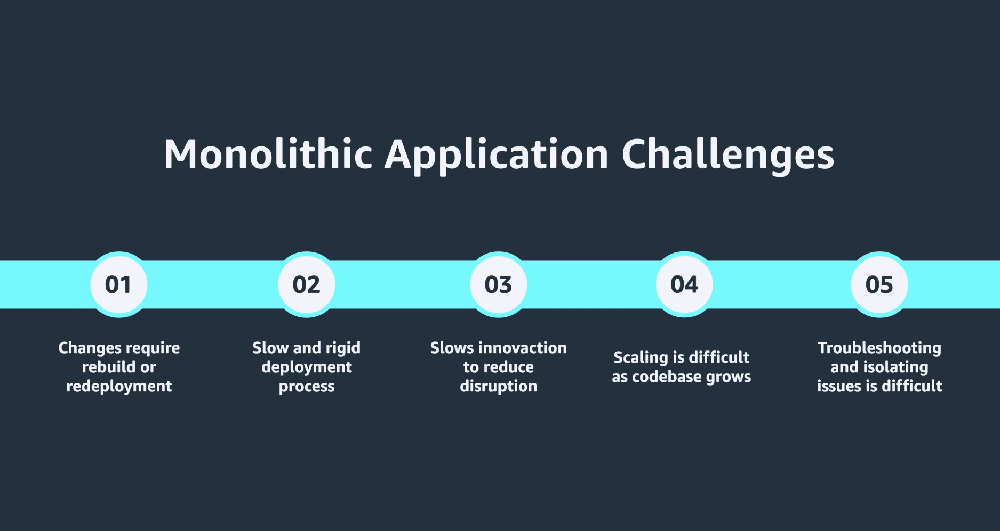
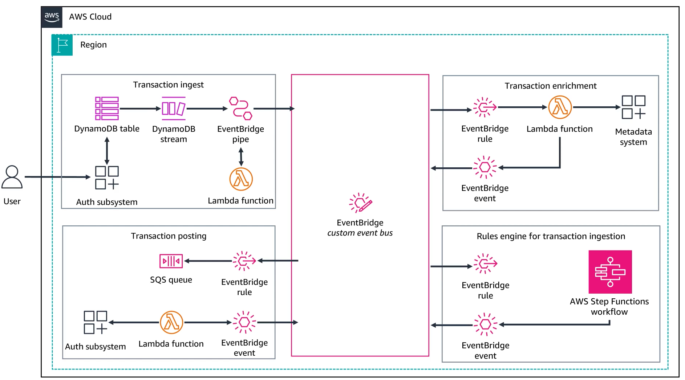
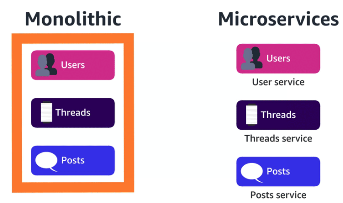
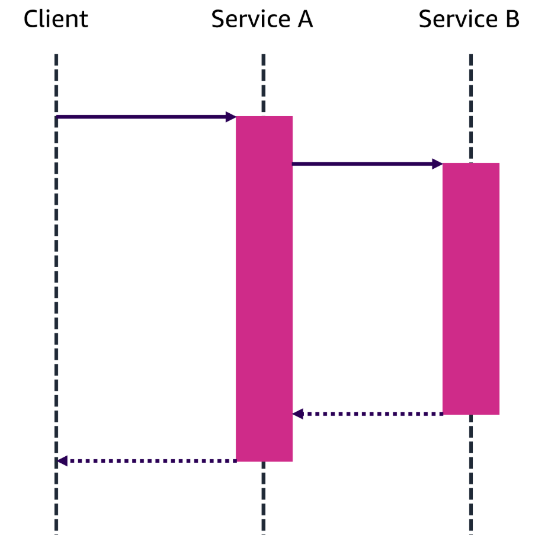
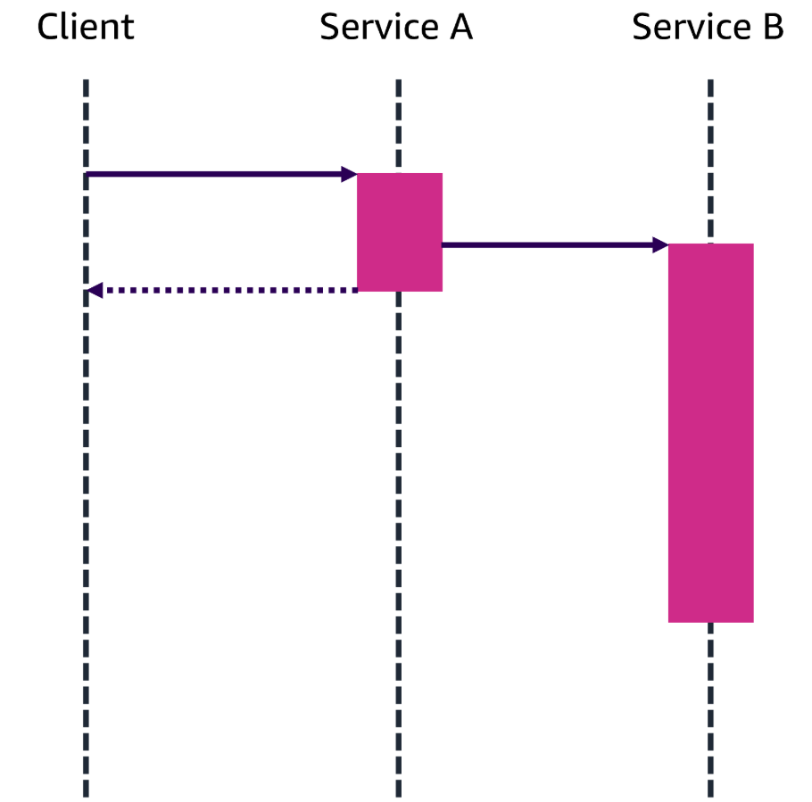

# Week 10: Architecting on AWS 2 Part 1: Building Modern, Event-Driven Applications

* back to AWS Cloud Institute repo's root [aci.md](../aci.md)
* back to [AWS Cloud Fundamentals 2](./aws-cloud-fundamentals-2.md)
* back to repo's main [README.md](../../../README.md)

## UNDERSTANDING MODERN APPLICATIONS

### Well-Architected Framework: Six pillars of the Well-Architected Framework

1. **Operational excellence**

    Operations teams must understand their business and customers to support desired outcomes. They create and validate procedures to respond to events and collect metrics to measure achievement. As everything continues to change, operations must evolve to support the business over time and incorporate lessons learned. One way to help automate aspects of the operational excellence pillar is using the [Cloud Development Kit](https://aws.amazon.com/cdk/).

2. **Security**

    Before architecting workloads, security must be implemented to control access and identity and to protect systems and data. Every system and service on AWS is automated and can be programmatically secured. Some examples of this are not allowing access from the internet, encrypting data in storage, and starting an alarm when things go wrong. This, along with a well-defined and communicated response process, is critical to preventing financial loss and keeping the business compliant with regulations.

3. **Reliability**

    When building on AWS, foundational requirements for reliability are often already in place. The cloud's scalability and flexibility enable on-demand resource adjustments. Reliable workloads require upfront design decisions, such as loosely coupled dependencies and graceful degradation, to accommodate changes. Cloud infrastructure abstracts hardware failures. However, to ensure reliable operation, it is crucial to implement resiliency measures, including fault isolation, automated failover, and disaster recovery.

4. **Performance efficiency**

    Take a data-driven, iterative approach to building a high-performance AWS architecture. Regularly review choices, monitor performance, and make trade-offs like compression, caching, or relaxed consistency to optimize for specific workloads. AWS Well-Architected solutions often combine multiple approaches to enhance performance.

5. **Cost optmization**

    Considering trade-offs between speed and cost is crucial. Hasty design decisions can lead to overprovisioned and underoptimized deployments. Using appropriate services, resources, and configurations is key to cost savings. One easy way to visualize these expenses and compare trade-offs is to use [AWS Cost Explorer](https://aws.amazon.com/aws-cost-management/aws-cost-explorer/).

6. **Sustainability**

    Choose AWS Regions based on your business needs and sustainability goals. Analyze user behavior, infrastructure, data, and hardware to optimize for sustainability. Implement load smoothing, data management, and efficient hardware selection. In your development and deployment process, identify opportunities to reduce sustainability impact through performance optimizations, managed environments, and automated lifecycle management. One key resource that can help calculate the environmental impacts of your architectures is the [Customer Carbon Footprint Tool](https://aws.amazon.com/aws-cost-management/aws-customer-carbon-footprint-tool/).

### Activity: Aligning with the Well-Architected Framework

#### After speaking with several other cloud architects, you discover that everyone has their own manual processes for provisioning resources. What changes, if any, would you suggest?

* Implement infrastructure as code (laC) using tools like AWS CloudFormation and the AWS Cloud Development Kit (AWS CDK) to automate the provisioning of cloud resources. This ensures consistency, reliability, and the ability to replicate and scale the infrastructure.

Wrong answers:

* No changes need to be made. Each team should continue to deploy according to their preferences.
* Implement a standardized way for all the teams to manually provision their resources. This way, each team is following the same process and schedule.

##### Explanation

Implementing resources manually can lead to issues such as configuration errors and poor scheduling. Automating resource provisioning helps with the following:

* Creating standardization and repeatable processes
* Increasing resource utilization efficiency
* Simplifying the monitoring of resources

#### The password policies for the company require eight characters and must use both letters and numbers. What changes, if any, would you suggest?

* Implement stronger password policies, including longer and more complex requirements. Also enable multi-factor authentication for all user accounts and administrative access in AWS Identity and Access Management (IAM).

Wrong answers:

* No changes need to be made. These password requirements are sufficient.
* Implement stronger password policies, including longer and more complex requirements for all user accounts and administrative access in AWS Identity and Access Management (IAM).

##### Explanation

This implements the principle of [least privilege](https://docs.aws.amazon.com/IAM/latest/UserGuide/best-practices.html#grant-least-privilege) and enforces separation of duties with appropriate authorization for each interaction with your AWS resources. This choice also centralizes identity management, and aims to eliminate reliance on long-term static credentials.

#### The company runs its product catalog in an Amazon Relational Database Service (Amazon RDS) instance in a sinle Availability Zone. What changes, if any, would you suggest?

* Deploy replicas of critical workloads, like product catalog databases, across multiple Availability Zones.

Wrong answers:

* No changes need to be made. The product catalog diagram is fine as it is.
* Deploy replicas of critical workloads, like product catalog databases, within the same Availability Zone to achieve high availability and fault tolerance.

##### Explanation

Deploying critical workloads across multiple Availability Zones or even multiple AWS Regions can help the company to achieve high availability and fault tolerance for their product catalog.

#### As seen in the previous review, the company runs their product catalog on an Amazon RDS instance. As new product types are added, they redo the schema to accommodate different attribute types. This rework has resulted in many hours of redesigning, testing, and implementing the database. What changes, if any, would you suggest?

* Switch to Amazon DynamoDB and use a key-value database so that the database can dynamically meet the attribute needs of different product types.

* Switch to Amazon DynamoDB and use a document database so that the database can dynamically meet the attribute needs of different product types.
* No changes need to be made. The product catalog should remain in Amazon RDS.

##### Explanation

DynamoDB is a NoSQL database that supports two data models: key-value and document. NoSQL databases are flexible — the schema doesn't need to be predefined like in relational databases. This flexibility would let the company easily add new product types without reconfiguration.

#### After speaking with the different department heads, you discovered that some of their teams still run their workloads completely using on-premises solutions. What changes, if any, would you suggest?

* Review the workloads that each department is running that use on-premises solutions. If there are no compliance reasons not to move to the cloud, work with the team to move their workloads in phased transitions to the cloud.

Wrong answers:

* No changes need to be made. The teams should move to the cloud whenever they feel comfortable.
* Review the workloads that each department is running that use on-premises solutions. If there are no compliance reasons not to move to the cloud, work with the team to move their workloads all at once to the cloud.

##### Explanation

A phased conversion is both safer and more economical. By picking one or a few essential applications or divisions, you can prove out the concepts and gain trust. To encourage adoption, provide support and training.

#### Most of their infrastructure is still running through on-premises data centers in their building. This has led to high energy costs even when demand is low. What changes, if any, would you suggest?

* Migrate to a cloud-based infrastructure. It can often offer more energy-efficient data centers and the ability to scale based on demand, reducing the overall energy usage.

Wrong answers:

* Upgrade their data centers so that they use more energy-efficient technology. They can use resources like the Carbon Footprint Tool to evaluate their workloads and how changes can affect their footprint.
* No changes need to be made. They should continue running their applications as they are.

##### Explanation

Moving their infrastructure to the cloud will make it so that they can benefit from all of the sustainable practices implemented by
AWS. Additionally, it means that they can scale up and down in accordance with demand instead of wasting energy on unused resources. One key resource that they can use to help calculate the sustainability of their architectures is the [Customer Carbon Footprint Tool](https://aws.amazon.com/sustainability/tools/aws-customer-carbon-footprint-tool/).

### Modern Applications

A traditional application architecture uses what's called a monolithic structure, which results in a large, complex, and tightly coupled architecture. Because of this, changes and updates to the application often require a complete rebuilding and redeployment of the entire system.

This leads to a slow and rigid deployment process and slows innovation because any disruption to any part of an application must be carefully balanced. Monolithic applications face several other challenges.

For example, scaling an application becomes increasingly difficult as the code base grows larger and more complex. Additionally, troubleshooting and isolating issues in the application are complicated. A problem in one component can easily have ripple effects throughout the entire system.

To address these challenges, developers have started using an alternative architecture style, often called event driven or modern applications. Modern applications segment an application into smaller independent services that focus on a specific functionality such as an authentication system, product catalog, and payment system.

These microservices communicate with one another through events. The resulting architecture is modular and loosely coupled. The modern application approach offers three notable benefits.

1. Each part of an application can be updated independently, whether you are scaling a service or implementing a new way of doing something.
2. Troubleshooting is much simpler. It is easier to isolate and address a problem in microservices because you don't have to look through an entire application to locate the source of an issue. This also reduces the chance of a fix causing problems throughout a system.
3. This approach can more readily incorporate emerging technologies such as generative AI, serverless computing, and containerization.

While this is a new design architecture, some industries such as video and music streaming services are already using microservices, and as technology continues to evolve, we expect the adoption of modern application architecture to increase.

The modern application architecture can enhance scalability, reliability, and efficiency, but most of all, it fosters innovation by enabling easier experimentation in application.

#### Summary

* **Monolithic application**

    An application using a monolithic architecture is a traditional software development model that uses one code base to perform multiple business functions. All the software components in a monolithic system are interdependent due to the data exchange mechanisms within the system.

* **Microservice-based application**

    An application using microservices for its architecture composes software into small independent components or services. Each service performs a single function and communicates with other services through a well-defined interface. Because they run independently, you can update, modify, deploy, or scale each service as required.

#### Characteristics of a modern application

* **Event-driven and decoupled architecture**

    Modern applications are designed to be event-driven, meaning that they respond to and react to specific events or triggers. This approach allows for more dynamic and flexible application behavior, because the application can adapt and respond to changing conditions or user interactions.

    **Use case**: When a customer places an order on the ecommerce website, the Order Management microservice creates an event with the order details. This event is then routed through a routing service such as Amazon Simple Notification Service (Amazon SNS) to another service, such as the Packaging microservice.

* **Real-time data streaming**

    Modern applications often rely on real-time data streaming, where data is continuously ingested, processed, and acted upon in near real time. This enables applications to provide up-to-the-moment information, insights, and responses to users or other systems.

    **Use case**: A financial institution could use real-time data streaming from Amazon OpenSearch to detect and mitigate fraudulent activities, ensuring the security and integrity of their systems.

* **Horizontal scalability**

    Modern applications are designed to be horizontally scalable. This means that they can handle increased loads and demands by adding more computing resources (for example, servers or containers) rather than relying on a single, powerful machine. This scalability allows applications to adapt and grow to meet changing user needs and traffic patterns.

    **Use case**: During a major sales event, such as Black Friday or Cyber Monday, an ecommerce's platform is likely to experience a significant increase in user traffic and transaction volume. To handle this surge in demand, the platform can scale horizontally by adding more computing resources, such as additional web servers, application servers, and database instances. For example, the platform's load balancer can automatically detect the increased load and dynamically provision more web server instances to handle the incoming requests. Similarly, the platform's microservices responsible for processing orders, managing inventory, and processing payments can also scale horizontally by adding more instances to distribute the workload.

* **Use of managed services**

    Modern applications use managed services, such as cloud-based databases, storage, messaging, and analytics platforms, provided by cloud service providers. This lets developers focus on building the application's core functionality without having to manage the underlying infrastructure and services.

    **Use case**: An online vacation home company uses Amazon Simple Storage Service (Amazon S3) for the storage of over a million photos uploaded by hosts and guests. This service lets developers focus on the application side of data storage and retrieval, rather than managing the block storage infrastructure needed to keep the data available, durable, and secure.

* **API-driven and originating in the cloud**

    Modern applications are designed to be API driven, where the application's functionality is exposed through well-defined and documented APIs. These applications are also designed to be built specifically for the cloud environment, taking advantage of cloud-based technologies and best practices.

    **Use case**: A web-based food ordering and delivery service created their platform using an event-driven architecture. In this scenario, the backend, consisting of food ordering and delivery services, is built using a microservices architecture. Each core functionality (for example, user management, menu management, order processing, and delivery tracking) is implemented as a separate service. External entities, such as customers, can interact with the frontend service through an API. The frontend then creates events and sends them to the backend services.

#### AWS services that support modern applications

The following table provides a list of categories and their associated services that contribute to this style of modern application.

| Purpose | Serivces |
| ------- | -------- |
| Data ingestion and streaming | Amazon Simple Queue Service (Amazon SQS), Amazon Kinesis Data Streams, Amazon Data Firehose, and Amazon Managed Streaming for Apache Kafka (Amazon MSK) |
| Messaging and event-driven architecture | Amazon SQS and Amazon Simple Notification Service (Amazon SNS) |
| Data storage and database | Amazon DynamoDB, OpenSearch, Amazon ElastiCache, and Amazon MemoryDB for Redis |
| Event management and orchestration | Amazon EventBridge, AWS Batch, and AWS Step Functions |
| Analytics and big data | Amazon EMR, Amazon Managed Service for Apache Flink, and GraphQL through AWS AppSync |
| Compute and serverless | AWS Lambda |

### Microservices

#### Comparing microservice and monolithic applications

Within a monolithic application, there are a client-side UI, a database, and a server-side application. Developers build all of these modules on a single code base. Features such as user management, threads, and posts are all part of that code base.

With a microservice-based application, the architecture is distributed and each microservice works to accomplish these features individually. Instead of exchanging data within the same code base, the microservices communicate with an API.

* **DEVELOPMENT PROCESS**

| Monolithic | Microservices |
| ---------- | ------------- |
| Monolithic applications are easier to start with, because not much up-front planning is required. You can get started and keep adding code modules as needed. However, the application can become complex and challenging to update or change over time. | A microservice architecture requires more planning and design before starting. Developers must identify different functions that can work independently and plan consistent APls. However, the initial coordination makes code maintenance much more efficient. You can make changes and find bugs faster. Code reusability also increases over time. |

* **DEPLOYMENT PROCESS**

| Monolithic | Microservices |
| ---------- | ------------- |
| Deploying monolithic applications is more straightforward than deploying microservices. Developers install the entire application code base and dependencies in a single environment. | In contrast, deploying microservice-based applications is more complex, because each microservice is an independently deployable software package. Developers usually containerize microservices before deploying them. Containers package the code and related dependencies of the microservice for platform independence. |

* **DEBUGGING**

| Monolithic | Microservices |
| ---------- | ------------- |
| Debugging is a software process to identify coding errors that cause the application to behave erratically. When debugging monolithic architecture, the developer can trace data movement or examine code behavior within the same programming environment. However, identifying coding issues in a microservice architecture requires looking at multiple loosely coupled individual services. | It can be more challenging to debug microservice applications because several developers might be responsible for many microservices. For instance, debugging might require coordinated tests, discussions, and feedback among team members, which takes more time and resources. |

* **MODIFICATIONS**

| Monolithic | Microservices |
| ---------- | ------------- |
| A small change in one part of a monolithic application affects multiple software functions because of the tightly coupled coding. In addition, when developers introduce new changes to a monolithic application, they must retest and redeploy the entire system on the server. | In contrast, the microservices approach allows flexibility. It's easier to make changes to the application. Instead of modifying all the services, developers only change specific functions. They can also deploy particular services independently. Such an approach is helpful in the continuous deployment workflow where developers make frequent small changes without affecting the system's stability. |

* **SCALING**

| Monolithic | Microservices |
| ---------- | ------------- |
| Monolithic applications face several challenges as they scale. The monolithic architecture contains all functionalities within a single code base, so the entire application must be scaled as requirements change. For example, if the application's performance degrades because the communication function experiences a traffic surge, you must increase the  compute resources to accommodate  the entire monolithic application. This results in resource wastage because not all parts of the application are at peak capacity. | The microservices architecture supports distributed systems. Each software component receives its own computing resources in a distributed system. These resources can be scaled independently based on current capacities and predicted demands. So, for example, you can allocate more resources to a geographic location service instead of the whole system. |

---

#### Benefits of microservice-based applications

##### Scalability

Microservices allow for independent scalability of different processes. If one service or component faces an issue or grows beyond capacity, it can be provisioned or scaled without impacting others, which enhances the overall system's scalability.

**Use case**: This can help ecommerce websites during peak sales seasons. During major shopping events like Black Friday, Cyber Monday, or holiday sales, ecommerce websites often experience a significant surge in traffic and user activity. In a monolithic application architecture, the entire system would be stressed, and the overall performance would degrade if the system cannot handle the increased load.

However, in a microservice-based architecture, the different components of the ecommerce application such as the following can be scaled independently to handle the increased load.

* **Product catalog**:  If the product catalog service is experiencing high traffic due to users browsing and searching for products, it can be scaled up by adding more instances or increasing the resources like CPU and memory of the existing instances, without impacting the other services.
* **Shopping cart**: The shopping cart service might also see a spike in usage as customers add items to their carts during the sales event. This service can be scaled independently to handle the increased load, ensuring a smooth checkout process.
* **Payment processing**: The payment processing service can be scaled to accommodate the higher number of transactions.
* **Order management**: The order management service can be scaled to handle the increased order processing workload.

By providing independent scalability of these microservices, the overall ecommerce application can better handle the increased demand during peak sales seasons This provides a seamless and efficient user experience for customers. This flexibility and scalability offered by microservices can be a significant advantage in high-traffic, high-load scenarios like ecommerce websites.

##### Reduced risk of failure

Because of monolithic architecture's high level of coupling, failure of one component can cause an entire application failure. With well-designed microservice architectures, the failure of one service isn't a threat to the whole system, because services are made to be lightweight, independent, and self-sufficient.

**Use case**: This can help that same ecommerce company with its platform. In a traditional monolithic application, the entire platform would be tightly coupled, where the shopping cart, product catalog, payment processing, and order management modules would all be part of a single codebase.

In this scenario, if a bug or unexpected load in the payment processing module were to cause it to fail, the entire ecommerce platform would likely become unavailable to customers. And this would lead to a poor user experience and potentially lost revenue.

However, in a microservice-based ecommerce platform, the various functionalities would be implemented as independent services, each running in its own container or virtual machine. If the payment processing service were to fail, the other services would continue to function. So customers could still browse the product catalog, add items to their cart, and complete their orders, even if they couldn't process payments during that time.

The failure of the payment processing service would be isolated and would not impact the overall availability of the ecommerce platform. This level of failure isolation is particularly important in mission-critical applications or in regulated industries, where the failure of one component cannot be allowed to bring down the entire system.

By using microservices, organizations can build more resilient and fault-tolerant applications that can better withstand the failure of individual components, ensuring a more reliable and consistent user experience.

##### Faster launch, migration, or rollback

The startup of individual services can be independent and as a result, faster, because they do not rely on another service to start and can be deployed more frequently.

**Use case**: The ecommerce company is planning to launch a new product line on their website. They have developed this new product line using a microservice-based architecture. Each part of the product page — product details, pricing, images, reviews, and so on—is implemented as a separate service. In a traditional monolithic application, the entire website would need to be updated and deployed at once, which could be a lengthy and risky process, especially if there are any issues with the new product line.

However, in a microservice-based architecture, the ecommerce company can deploy the new product-related services independently, without affecting the rest of the website. This provides the following benefits:

* **Faster launch**: The company can quickly deploy the new product-related services without waiting for the entire website to be ready. This helps them to get the new products in front of customers more quickly.
* **Easier migration**: If the company later needs to update or modify the new product line, they can do so by updating the individual services, without having to redeploy the entire website. This reduces the risk and complexity of the migration process.
* **Quicker rollback**: If any issues arise with the new product-related services, the company can quickly roll back those specific services to the previous stable version, without impacting the rest of the website. This minimizes the downtime and impact on the customers.
* **Faster failure recovery**: If a failure occurs within the application, the company can take that individual service offline, fix it, and then put it back online, all without affecting other parts of the application.

By using the independent deployment and rollback capabilities of a microservice-based architecture, the ecommerce company can launch new products or make updates to their website more efficiently. And they can do this without disrupting the overall user experience for their customers.

##### Enhanced collaboration and development productivity

Developers can focus on specific features without worrying about how those features will interact with the whole system. Changed or new services can be introduced as requirements evolve, increasing overall development productivity.

**Use case**: The ecommerce company wants to implement a new feature that allows customers to create personalized product bundles. This new feature must be integrated with the existing product catalog, shopping cart, and order management systems. In a microservice-based architecture, the ecommerce company can do the following:

* It can isolate the development of the personalized product bundle feature into a dedicated microservice. Developers working on this feature can focus solely on its implementation, without having to worry about how it will interact with the rest of the ecommerce system. Each development team becomes the owner of a service within the application. This transition to more ownership within a team can increase productivity, because there are fewer barriers to decision making and implementation.
* The new personalized product bundle microservice can be designed and implemented independently, without disrupting the existing product catalog, shopping cart, or order management microservices.
* As the ecommerce company's requirements evolve, they can easily introduce new microservices or make changes to existing ones, such as adding a recommendation engine or implementing a loyalty program. These changes can be made without necessarily impacting the entire system, thanks to the loose coupling and independence of the microservices.
* The modular and independent nature of the microservices permits the ecommerce company to assign specific teams or developers to work on different features, increasing overall development productivity. Each team can focus on their respective microservice, enhancing their expertise and streamlining the development process.
* If a particular microservice has to be updated or scaled, it can be done independently, without affecting the rest of the ecommerce system. This flexibility and agility in adapting to changing requirements is crucial for an ecommerce company to stay competitive and responsive to customer needs.

By using the benefits of a microservice-based architecture, the ecommerce company can quickly implement new features, such as the personalized product bundle. They can do this without compromising the stability and performance of the overall system, while maintaining a high level of development productivity as the business evolves.

#### Challenges of microservice-based applications

The following are some of the complexities that can accompany microservice-based applications:

* **Complexity**: Microservices architecture can be more challenging to manage, and designing this system might be more complex than a monolith, which might affect initial development costs and timelines.
* **Communication overhead**: There can be added overhead in terms of communication between services, which can be slower and more complex than a monolithic system where a request is sent as a whole. Because services are independent, communication is required at different layers such as data exchange and events, which increases this overhead.
* **Misaligned services**: If not implemented properly, services might end up serving the wrong customer needs, because they might not be designed with the user's needs in mind.
* **Complex versioning and compatibility**: Services change independently. So it will be harder to manage and ensure that all service versions work well together in the future. This can be especially true if they are not implemented with a framework or platform to manage these versions.
* **Overhead of testing and monitoring individual services**: Testing and monitoring services can be more tough, because it's harder to combine all these services into test environments and set up complete scenarios. This might lead to some services not being fully tested, which could then cause an entire system failure.

### Communication protocols

Communication protocols are a set of rules and standards that define how data is transmitted and received between different devices or systems on a network. They specify the format, timing, sequencing, and error checking of data communication. When designing an application, there are several decisions that must be made. The following are two communication protocols, along with examples for you to think about.

#### Synchronous or asynchronous communication

When reading about the two methods, consider a chat or messaging application, and which might be the ideal choice.

* **Synchronous communications**

Data exchange between services requires both the sender and receiver to be available at the same time to exchange data, typically in a blocked manner. In a synchronous request chain, the client is blocked from sending subsequent requests until the current one is completed.

This communication type also require sequential execution because requests are executed one after the other, in a linear fashion. Because of this, requests are dependent on the response from the previous one. This tight association means that communications lack parallelism because only one request can be processed at a time, limiting the overall throughput.

* **Asynchronous communications**

Senders and receivers operate independently, swapping messages at their convenience. Asynchronous communication is similar to delivering a package. After it is delivered, the carrier no longer is interested in its status. It can continue delivering other packages. This method of communication is preferred in microservices because of its responsiveness, resource conservation, and scalability.

---

In a real-time chat application, users expect instant responses and the ability to send and receive messages without delay. Using a synchronous communication protocol, such as a traditional client-server model where the client sends a request and waits for a response, would not be the best choice for this scenario. This is because with synchronous communication, the user would have to wait for a response from the server before it can display the sent message, resulting in a slow and unresponsive user experience. Asynchronous communication enables bidirectional communication.

---

#### Communication with single or multiple receivers

When reading about the two methods, consider the scenario of a *stockprice* topic that is published on a broker service every time the stock price of a company changes and which might be the ideal choice.

* **Single receiver**: In a single receiver scenario, a microservice sends a request or a message to a single, specific microservice. The communication is point-to-point, where the calling microservice knows the exact recipient of the message. This type of communication is often used in request-response patterns, where a client calls a specific service to perform a particular task.
* **Multiple receivers**: In a multiple receivers scenario, a microservice sends a request or a message to multiple microservices. The communication is broadcast-like, where the calling microservice does not need to know the specific recipients of the message. This type of communication is often used in event-driven architectures, where a microservice publishes an event, and multiple microservices can subscribe to and consume that event. Multiple receivers can be implemented using message queues, message brokers, or event buses, where the message is delivered to all the subscribed microservices.

In this instance, multiple receivers would be the preferred choice. Multiple separate applications, tracking different companies, can be set up to listen or subscrape the *stockprice* topic to get the latest stock price of the companies that they are tracking.

### Strategies for incorporating asynchronous communication

Asynchronous communication is an essential aspect of distributed systems, and it plays a crucial role in achieving eventual consistency and effective data replication. Here are some strategies for asynchronous communication in the context of two topics: eventual consistency and data replication.

#### Eventual consistency

Eventual consistency is where your data might take a little time to reflect the latest changes made by other users. The following are some ways that having eventually consistent data can support asynchronous communication:

* **Event-driven architecture**: Employ an event-driven architecture where components communicate by publishing and subscribing to events. This allows for loose coupling and asynchronous processing, to provide eventual consistency.
* **Message queues and publish-subscribe systems**: Use message queues or publish-subscribe (pub-sub) systems to decouple the sender and receiver of updates, allowing for eventual propagation of changes.
* **Versioning and causal consistency**: Maintain version information and causal dependencies to ensure that updates are applied in the correct order, even in the face of asynchronous communication.

#### Data replication

Data replication is when copies of data are stored in multiple locations. Some common reasons for this are to reduce latency, increase availability, and support disaster recovery efforts. The following are some ways that data replication decisions can support asynchronous communication:

* **Asynchronous replication**: Employ asynchronous replication mechanisms, where updates are first committed locally and then propagated to other replicas in the background. This can reduce the impact on the primary service.
* **Incremental data synchronization:** Design your replication mechanisms to only propagate the changes (deltas) between replicas, rather than full dataset transfers This reduces the load on the network and improves efficiency.
* **Notification and subscription mechanisms**: Provide notification and subscription mechanisms, where clients can subscribe to specific data changes and be asynchronously notified of updates. This enables efficient data propagation.
* **Batch and scheduled replication**: Consider batch-processing or scheduled replication approaches to reduce the impact of continuous replication on the overall system performance. By incorporating these strategies for asynchronous communication, you can effectively manage eventual consistency and implement robust data replication mechanisms in your distributed systems. The choice of specific strategies will depend on the requirements, constraints, and characteristics of your application.

---

## DESIGNING MODERN EVENT-DRIVEN APPLICATIONS

---

## IMPLEMENTING EVENT-DRIVEN ARCHITECTURES WITH AWS SERVICES
