# Week 11: Architecting on AWS 2 Part 2: Batch and Real-Time Processing Architectures

* back to AWS Cloud Institute repo's root [aci.md](../aci.md)
* back to [AWS Cloud Fundamentals 2](./aws-cloud-fundamentals-2.md)
* back to repo's main [README.md](../../../README.md)

## DESIGNING A BATCH PROCESSING APPLICATION ARCHITECTURE

### Batch Processing Architectures

When a task must be repeated multiple times, it's often more efficient to perform it in batches rather than individually. For instance, when doing laundry, it's better to wash clothes of the same color or fabric type together in one load, instead of washing each item separately. This batch processing approach saves time and effort. Similarly, applications process data in batches to achieve greater efficiency.

#### Understanding batch processing

When applications have to perform the same operation on a lot of data, it is generally more efficient to break those operations into one or more batch processing jobs.

Batch processing is a way to automate a series of application tasks and minimize the need for human intervention. Batch processing is commonly used in industries where large volumes of data need to be processed for non-time sensitive workloads, such as financial services, scientific computing, and media production.

Batch processing offers several key benefits, including improved efficiency, reduced costs, and the ability to handle large scale data processing tasks.

For example, the property management company for an apartment building collects rents from tenants on a monthly basis, then uses that income to pay its operating costs. Some apartment tenants may pay their rent by mail using a check. Others may pay online using a credit card, and some may pay their rent in person using cash. Rather than process each of these payments separately, it is more efficient for the apartment management company to hold all the rent payments as they arrive. Then all the payments are processed together at one time before sending the payment data to the company's financial management systems.

The AWS Cloud offers several services that support batch processing for applications.

* **AWS Batch** is a fully-managed batch processing service, which makes it easy to run batch computing workloads on the AWS Cloud.
* **AWS Step Functions** is a visual workflow service that helps developers use AWS services to support batch processing for applications.
* **AWS Lambda functions** can be used to initiate and perform batch processing activities.
* **Amazon Elastic Map Reduce, or Amazon EMR** is a data analytics service, specifically designed to perform batch processing on very large data sets.
* **Amazon EC2 spot instances** can be used to temporarily add additional low cost compute resources that are needed only during batch processing.

#### Examples of batch processing workloads

Batch processing is the method that computers systems use to periodically complete high-volume repetitive tasks. These types of systems process such tasks in batches, often in off-peak times when computing resources are more commonly available, such as at the end of the day or overnight. The following sections describe some scenarios where applications and their infrastructure use batch processing.

##### Batch processing for applications

Applications take in data from many sources for processing. With shopping or messaging applications, users enter, update, and process application data in real time. However, there are also scenarios where real-time application data input and processing are not required. These situations are well suited for batch processing of application data.

###### Processing data

Batch processing is often performed on transactional application data after the transactional data has been collected. For example, a utility company that collects real-time utility usage data runs a monthly batch process to summarize that real-time usage data and prepare the customer's billing statement. After this is calculated, the billing statements might go through additional batch processing to help the utility company identify overall usage patterns for a specific group of customers, geographic region, or time of year.

###### Filtering, sorting, and converting application data

Sometimes the data provided to an application has to be filtered, sorted, or converted before it is suitable for use by the target application. For example, prices that use local currencies might have to be converted to a different currency before being loaded into a data analytics environment. The transform step of the extract, transform, and load (ETL) process that is used when moving data from source systems into a data analytics environment would be responsible for this type of batch processing.

###### Loading application data

Not all application data is entered by users. Application data related to merchandise pricing, workforce scheduling, or product shipping costs usually only changes on a daily, weekly, monthly, or even annual basis. This data might come from external systems and not be created in the application itself. For example, daily work start and end times might be captured by an employee time clock system but only loaded into the payroll application once a month. Loading data of this type can be performed in batch, with the frequency of the availability of new data, and the needs of the application, driving the data loading schedule.

##### Batch processing for infrastructure

Batch processing can also be used on the data related to monitoring and managing the infrastructure on which applications reside.

###### Infrastructure backups

Application databases contain data that can be constantly changing. However, backing up the database after each individual data change is not practical. Modern databases incorporate recovery mechanisms in their architectures to prevent the loss of application data, but regular database backups are still required for maximum recoverability. Running batch jobs to back up important database files on an hourly, daily, or weekly basis limits the impact of the backup operation on the database resources and application users.

###### Log management

Most technology stack software components like databases, application servers, and web servers generate logs to record their activity, errors, and events.

Applications themselves also generate logs related to application activity. Batch processes are used to archive, truncate, or remove logs on a regular basis. This keeps only the most recent and relevant data in the logs.

```text
Amazon CloudWatch and AWS CloudTrail provide automated mechanisms for monitoring and managing infrastructure logs using both batch and real-time techniques.
```

###### Software patching

Like applications, the database, web server, and application server software that support applications requires regular patching to maintain optimum reliability and security. Patches are usually released on a monthly, quarterly, or annual basis, unless there is a specific, serious bug that must be fixed. Batch processing is well suited to patching, because many environments might require patching at once, and batch automation allows for consistent patching application across environments.

#### Batch processing aligns to the Well-Architected Framework

The AWS Well-Architected Framework includes multiple recommendations that can be implemented by incorporating batch processing in an application architecture.

##### Operational excellence

Adding or removing batch processing environments to meet the demands of an application helps keep applications running smoothly. However, to deliver this capability with operational excellence, the deployment and management of batch environments must be automated.

Effectively delivering this automation requires two elements. First is the monitoring of the utilization of the batch processing resources. This data is required to know when additional resources should be added or removed. Second is accurately monitoring and logging the status of each batch process. This data tells you if a process is running longer than expected or if it fails entirely due to a lack of resources.

If a bank is using batch processing for facilitating credit card purchases, the number of transactions that have to be processed will vary widely based on the time of year. For example, shopping activity around major gift-giving holidays will produce more credit card activity than other times of the year. By monitoring the resources that perform the batch processing, additional resources can be added to handle the increased processing that holiday activity brings. Likewise, regardless of the activity level, any failures during credit card processing must be retried so that the card transaction is properly documented.

##### Security

Batch processing can also be used to dedicate processing environments for batch operations, separate from the normal transactional application environment. The data used for the batch operations can also be stored separately from transactional application data. Operating in this manner provides an additional layer of security for batch operations. Access to data between the transaction and batch environments can be controlled using access permissions or encryption.

For example, to determine the types of surgical equipment in which they should invest., a hospital performs batch analytics on sensitive patient data. The required security controls around this data would be high, and might differ from the transactional system that the data originates from. Moving this batch processing to a secondary environment, with special access controls and data encryption capabilities, helps meet the unique security requirements.

##### Reliability

Batch processing can be used to improve application reliability through implementation of a resilient queuing model. This architecture model builds in mechanisms that allow failed batch processing jobs to be automatically resubmitted for processing. If the failed batch job fails multiple times, it can be marked for further investigation, while other batch jobs can continue to be submitted and processed.

One reason that a batch process can fail is a lack of available resources to complete the required processing. Dynamically scaling the application architecture to add additional resources to meet batch processing demands helps enhance application reliability. Coupling scaling with resilient queueing allows the application to retry the failed batch process after the additional resources have been allocated.

Video hosting services are a good example of applications that uses queued batch jobs to improve resiliency. When a user uploads a video to the platform, the video file must be converted into multiple formats and resolutions to support different devices and bandwidth conditions. This conversion process is computationally intensive and can take a significant amount of time, especially for longer videos or high-resolution files. Instead of making the user wait for the conversion to finish before their video is available, these platforms use a queued batch job system that notifies the user when their video is ready. Additionally, if there is a failure or interruption during transcoding, the job can be retried or moved to a different server without impacting the user experience.

##### Performance efficiency

Auto scaling is one mechanism for adding resources until the desired performance during large batch operations is achieved. This real-time right-sizing capability is particularly useful when the size of batch operations varies from one job to the next.

Additionally, monitoring CPU, memory, and I/O for Amazon Elastic Compute Cloud (Amazon EC2) instances will help you determine if the resources that you have allocated to the batch processes are being fully utilized. If the resources are underutilized, consider decreasing their capacity or adding additional workload to the batch process so that the available resources are fully utilized.

Choosing optimal data formats, compression techniques, and partitioning based on the source data and target environments is also important when performing batch data loading operations.

##### Cost optimization

One of the benefits of the pay-per-use model of cloud computing is only paying for resources when you need them. By running large data processing, loading, or transformation jobs in batch, you can add additional resources to your environment during the batch operation, then release those resources when the batch process is complete. Even large, memory-rich or CPU-rich Amazon EC2 instances can be cost effective for batch processing when used in this manner. EC2 Spot Instances are another way to reduce the cost of adding resources during batch processing.

You should also monitor the batch resources to optimize and reduce costs. Examine how changing capacity or using reserved instances or savings plans might contribute to reducing batch operation costs.

##### Sustainability

Batch processing can help optimize resource utilization by processing data in batches during off-peak hours. This reduces the application's overall carbon footprint and energy consumption. Batch processing tasks can be scheduled and executed in parallel, minimizing idle time and maximizing resource utilization.

AWS services like AWS Batch and AWS Lambda can automatically scale resources up or down based on demand, ensuring that only the necessary resources are provisioned. This further contributes to sustainability.

#### Batch processing patterns

The previous sections described the concepts of batch processing, and potential benefits that batch processing can provide an application. The following sections describe three common batch processing architecture patterns:

* Fan-out pattern
* Fan-in pattern
* Dynamic parallelism

##### Fan-out pattern

The fan-out pattern is a parallel processing model where a single input is divided into multiple smaller tasks, which are then processed concurrently by multiple workers or services. The fan-out pattern is useful when you have a large amount of data or a computationally intensive task that can be divided into smaller, independent units of work.

The following image shows a conceptual example of how the fan-out pattern works.

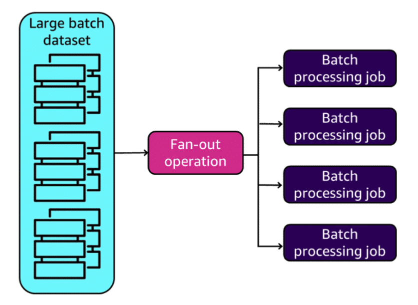

Fan-out operation for batch processing.

In this pattern, a task to process a large batch data set is split into four smaller batch processing jobs by a fan-out operation. Then each smaller batch processing job runs in parallel to complete the batch operation.

##### Fan-in pattern

The fan-in pattern is the complementary pattern to the fan-out pattern. It is used to consolidate the results of multiple parallel tasks into a single output or result. This pattern is often used in conjunction with the fan-out pattern to handle the aggregation and post-processing of the results from parallel tasks.

The following image shows a conceptual example of how the fan-in pattern works.

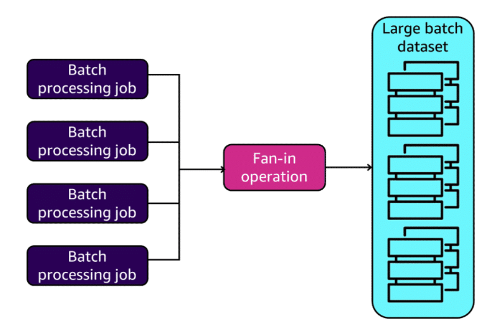

Fan-in operation for batch processing.

After the subtasks have been processed in parallel by the workers or services, the fan-in pattern collects and combines the individual results into a final output.

```text
The fan-out and fan-in patterns are complementary and often used together to achieve parallel processing and result consolidation. The fan-out pattern focuses on dividing the input into smaller tasks for parallel implementation, and the fan-in pattern focuses on combining the results of those parallel tasks.
```

##### Dynamic parallelism

The dynamic parallelism pattern is an extension of the fan-out pattern, where the number of parallel tasks is not fixed but can dynamically adjust based on the input data or the available resources. However, the dynamic parallelism pattern extends the fan-out pattern by allowing for dynamic and recursive task subdivision. This allows for efficient utilization of resources by adapting the level of parallelism based on the complexity of the input data or the available computing resources.

The following image shows a conceptual example of how the dynamic parallelism pattern works.

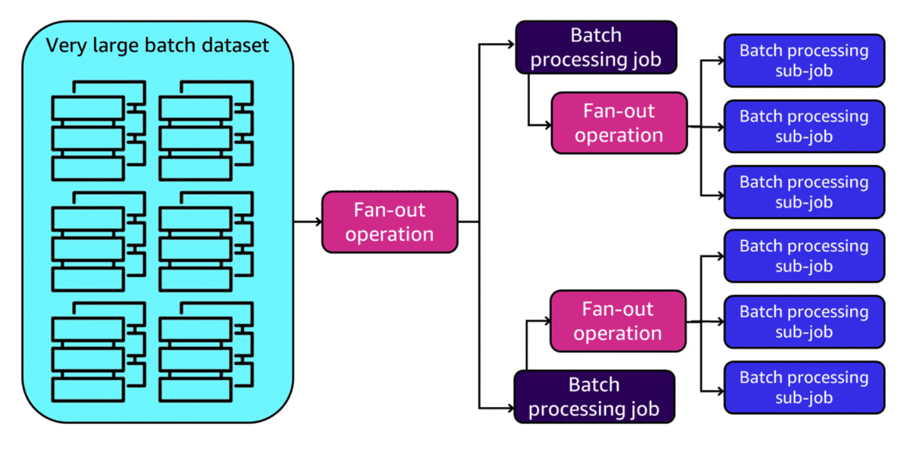

Dynamic parallelism for batch processing.

In this pattern, the input data is divided into tasks, and each task can further subdivide itself into smaller subtasks if necessary, creating a recursive tree-like structure of parallel tasks.

##### Choosing a batch processing pattern

The fan-out and fan-in patterns are suitable for scenarios where the input data can be easily divided into independent tasks. The dynamic parallelism pattern is more suitable for scenarios where the complexity of the input data varies and requires adaptive task subdivision.

For example, in some applications, the data that must be processed by a batch job always has the same volume and type of data. Processing lab results for a biotechnology research facility is one such scenario. The number of experiments conducted each day is fairly consistent, because the number of scientists performing experiments is fixed. Based on past experience, a fan-out or fan-in pattern can be configured that will use a predefined number of sub-jobs to process the research data according to the lab's needs.

Alternatively, some applications do not have consistent data volumes or data types being held for batch processing. For example, a batch processing cycle for a car rental agency might run every 10 minutes, but the amount of data needing to be processed might vary from no data to huge amounts of data on busy days.  Dynamic parallelism is helpful in this scenario because the number of sub-jobs can be increased or decreased based on the volume of data that has to be processed.

### Implementing Batch Processing with AWS

AWS offers several services that can be used to implement fan-out, fan-in, and dynamic parallelism batch processing patterns for applications. These services are used to manage both the orchestration and scheduling of batch processing in applications.

#### Data orchestration services

**Data orchestration** refers to the automated coordination and management of data flows between application systems and components. It typically involves streamlining the movement, transformation, and integration of data from multiple sources for efficient processing. The AWS services used for orchestration of batch data processing include AWS Step Functions and Amazon EMR.

##### AWS Step Functions

Step Functions is a serverless function orchestrator that allows you to coordinate multiple AWS services into a series of steps, so you can build and run complex, distributed applications.

Step Functions operates on the concept of a **state machine**, or workflow. A state machine defines a series of steps and their transitions. Each step can perform tasks, choice operations, or parallel operations, and support various application architectures, including fan-out, fan-in, and dynamic parallelism.

Fan-out architecture is supported by splitting a single input into multiple parallel tasks or branches using the **Parallel state**. Step Functions can provide a fan-in architecture by using the **Parallel state** in combination with the **Choice state** or by using the **Map state** to process an array of inputs. Dynamic parallelism is also supported through the use of the Map state, which can iterate over an array of inputs and run tasks in parallel for each element.

##### Amazon EMR

Amazon EMR is one of the AWS services that provides data orchestration capabilities in support of application batch processing. Many data analytics environments are based on big data frameworks such as Apache Hadoop and Apache Spark. These frameworks make use of a **distributed architecture model**. This architecture has special mechanisms in place that spread data load and data query operations across many individual compute and storage resources called **nodes** that are connected together to form a **cluster**.

Using this model, each data load and data query job is divided into smaller chunks, and each chunk is processed by a separate cluster node. This parallel processing is designed to efficiently process large datasets using a batch-based approach.

Processing that is both distributed and parallel can be difficult to manage. The management complexity arises from the multiple nodes composing the cluster and from the cluster management software used to coordinate the activities between nodes.

As with many other complex computing services, the AWS Cloud simplifies the deployment, management, and operation of a distributed parallel processing environment by automating the creation, configuration, and management of the underlying infrastructure. Amazon EMR is a fully managed, distributed parallel processing solution. An Amazon EMR cluster consists of three different Amazon EC2 node types: Primary, core, and task. Each node type has a role within the cluster, with different software components installed on each node type.

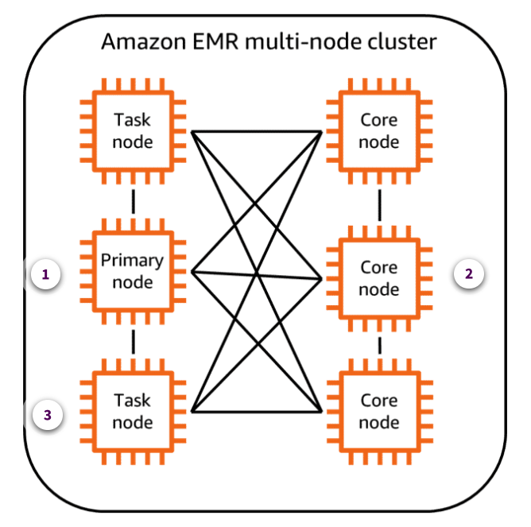

1. **Primary node**

    Primary nodes manage the cluster by running software components to coordinate the distribution of data and tasks among the other nodes during processing. The primary node tracks the status of tasks and monitors the health of the cluster. Every cluster has a primary node, and it's possible to create a single-node cluster that has only a primary node.

2. **Core node**

    Core nodes run software components that perform processing tasks and store data across the available storage on the cluster. Multi-node clusters must have at least one core node.

3. **Task node**

    Task nodes are optional, but when used, task nodes run software components that only perform processing tasks and do not store data.

The six-node cluster shown here is composed of a primary node, three core nodes, and two task nodes. The lines between nodes show that every node in the cluster can communicate with every other node in the cluster. You can add task and core nodes to an Amazon EMR cluster at any time to increase the cluster's overall batch processing and store capacity.

#### Batch process scheduling services

The AWS services used for scheduling batch data processing include Lambda, AWS Batch, Amazon Elastic Container Service (Amazon ECS), and Amazon Elastic Kubernetes Service (Amazon EKS).

##### AWS Lambda

Lambda is a serverless computing service that allows you to run functions written in Java, Go, PowerShell, Node.js, C#, Python, or Ruby. There are several benefits to combining AWS Lambda for carrying out individual batch processing tasks, and AWS Step Functions for orchestrating and coordinating these tasks into complex workflows:

* Both services follow a serverless architecture, allowing you to focus on your application logic without managing underlying infrastructure.
* Lambda can automatically scale to handle high volumes of concurrent invocations, enabling parallel processing of batch jobs. Step Functions can coordinate and orchestrate these parallel operations
* Step Functions provides a way to define and manage stateful workflows, which is essential for batch processing pipelines that might involve multiple steps or conditional branching.
* Step Functions offers built-in retry and error handling mechanisms, ensuring reliable processing of batch jobs even in the face of transient failures.

##### AWS Batch

AWS Batch is a service that supports the scheduling and management of application batch job activities. It is a fully managed batch processing service that allows you to efficiently run batch computing workloads in the AWS Cloud.

AWS Batch automatically provisions the required compute resources. It manages the submission of your batch jobs, defines batch job dependencies, and uses features like automatic scaling and job monitoring to optimize your batch processing workflows.

Several key capabilities make AWS Batch a good resource for creating, running, and managing scalable batch processing operations. These capabilities include the following:

* **Job definitions** specify the container image, processing and memory requirements, and other configurations for running a batch job.
* **Job queues** are used to manage and prioritize the processing of batch jobs. You can create multiple job queues with different priority levels and associate them with specific compute environments.
* **Compute environments** define the AWS Fargate or Amazon EC2 compute resources that will be used to run your batch jobs. You can configure the instance types, minimum and maximum vCPUs, and other settings for the compute environment.
* **Job scheduling** lets you define job dependencies and automatic retries for failed jobs. Array jobs, the running of multiple copies of a job with different input parameters, are also available.
* **Job monitoring and logging** is possible using the AWS Batch integration with Amazon CloudWatch. With this integration, you can track the status and resource utilization of batch jobs, and set up alarms for specific events or thresholds.
* **Job storage** facilitates the storage of input and output data from batch jobs. AWS Batch supports using both Amazon Elastic File System (Amazon EFS) and Amazon Simple Storage Service (Amazon S3) for this purpose.
* **Job submission** operations can be performed using the AWS Batch API, AWS Command Line Interface (AWS CLI), or AWS SDKs. You can submit jobs either individually or as part of a job array.
* **Job dependencies** can be defined to ensure that jobs are processed in the correct order and that dependent jobs are only run after their prerequisites have been completed successfully.
* **Automatic job scaling** allows AWS Batch to add or remove compute resources based on the number of jobs in the job queues. This helps ensure efficient resource utilization and cost optimization.

###### Scientific Computing and Research

AWS Batch is well-suited for scientific computing and research applications that involve running complex simulations, data analysis, or computational models. These workloads often require significant computational resources and can benefit from the ability to scale resources up or down dynamically based on demand. Examples include genomic data analysis, climate modeling, and simulating liquid or gas flows using mass, momentum, and energy equations.

###### Media Transcoding and Processing

Media and entertainment companies often need to process large volumes of audio, video, or image files for various purposes, such as transcoding, watermarking, or content analysis. AWS Batch can be used to efficiently distribute these batch processing tasks across a fleet of compute resources, ensuring timely completion and optimal resource utilization. This use case is particularly relevant for video streaming platforms, post-production studios, and media content delivery networks.

###### Financial Risk Analysis and Modeling

Financial institutions and investment firms frequently run complex risk analysis, portfolio optimization, and financial modeling workloads. These batch processing tasks can be computationally intensive and might have to be executed on a recurring schedule or triggered by specific events. AWS Batch provides a scalable and reliable platform for running these financial modeling workloads, ensuring that computations are completed within the required time constraints and with the necessary compute resources.

##### Using AWS Batch with AWS Lambda

Using AWS Batch in conjunction with Lambda can be an effective architectural model for batch processing application data. This combination takes advantage of the strengths of both services, providing a scalable and cost-effective solution.

AWS Batch excels at running large-scale batch processing jobs that require significant computational resources. However, managing the submission and orchestration of these batch jobs can be a challenge, especially when dealing with complex workflows or event-driven processing. This is where AWS Lambda comes into play. Lambda functions can be invoked by various events, such as file uploads to Amazon S3, database updates, or API calls. These functions can then submit batch jobs to AWS Batch, passing the necessary input data and job configurations.

Another advantage of using AWS Batch with Lambda is the ability to implement serverless batch processing architectures. Lambda functions can be used to process and filter data before submitting batch jobs, reducing the overall compute requirements and costs. Additionally, Lambda functions can be used to handle post-processing tasks after batch jobs are complete, such as data aggregation, notification, or cleanup operations.

When AWS Batch and Lambda are combined, AWS Batch can handle the heavy lifting of running computationally intensive batch jobs. AWS Lambda provides a serverless and flexible way to manage the orchestration, preprocessing, and postprocessing tasks associated with batch processing workflows.

##### Amazon EKS and Amazon ECS

Amazon EKS and Amazon ECS are two more AWS services that provide data scheduling capabilities in support of application batch processing.

Amazon EKS is based on the open-source Kubernetes container management platform. Amazon EKS streamlines the deployment, scaling, and management of containerized applications on AWS. Amazon EKS provides a fully managed Kubernetes control plane, which allows you to build and run containerized applications without managing the underlying infrastructure.

Amazon ECS is a proprietary, fully managed container orchestration service that simplifies running and scaling containerized applications on AWS. It supports Docker containers and allows you to use API calls to launch and stop container-based applications.

Amazon ECS is tightly integrated with other AWS services. It is generally considered simpler to set up and manage than a Kubernetes-based containerization environment.

Both Amazon EKS and Amazon ECS can be used to schedule batch processing in an application architecture. With Amazon EKS, you can use Kubernetes jobs to run batch processing tasks on a schedule or on demand. These jobs can be configured to run on a specific set of nodes or using the auto scaling capabilities of Kubernetes to dynamically provision resources as needed. In Amazon ECS, you can use the batch service to run batch processing jobs on AWS Fargate or Amazon EC2 instances. The batch service automatically provisions the required compute resources, schedules the jobs, and monitors their processing, providing a seamless batch processing experience.

```text
Although similar to the Amazon ECS batch feature, the AWS Batch service offers more advanced job scheduling, management, and monitoring capabilities than those provided by Amazon ECS.
```

#### Combining orchestration and scheduling services

None of the AWS services described in the preceding sections are entirely dedicated to either data orchestration or batch process scheduling. Instead, each of these services can deliver both of these capabilities to varying degrees. The stacked bar graph shown here provides a visualization of how much of each capability these services provide.

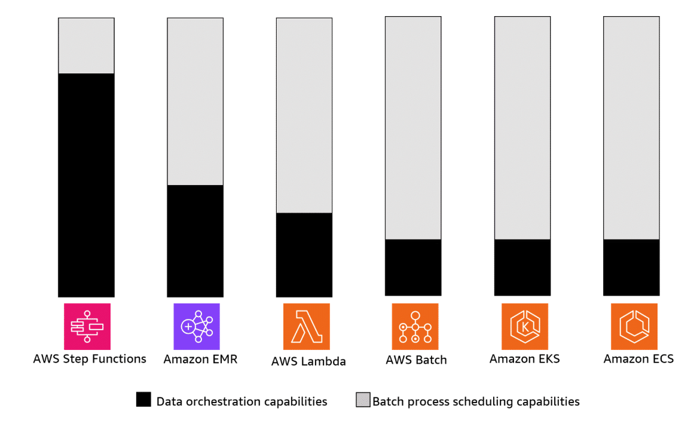

Comparison of the data orchestration and batch process scheduling capabilities of AWS services.

The graph shows that AWS Step Functions is predominantly used to deliver data orchestration capabilities. Conversely, AWS Batch, Amazon EKS, and Amazon ECS are predominantly used to deliver batch process scheduling capabilities. Amazon EMR and AWS Lambda fall in between, with Amazon EMR providing more data orchestration capabilities, and AWS Lambda providing more batch process capabilities. When services are combined in an application architecture, you can use the strongest aspect of each service's capabilities to deliver your application's desired functionality for batch processing.

##### Combining AWS Step Functions and AWS Lambda

The following example shows how Step Functions and Lambda functions can be used to orchestrate and schedule the individual components of an application's batch processing workflow. In this example, the batch process uses the Amazon Comprehend service to perform sentiment analysis on files stored in an Amazon S3 bucket. When the sentiment has been determined, the sentiment results are stored in an Amazon DynamoDB table. The batch aspect of this workflow can be built into the two Lambda functions.

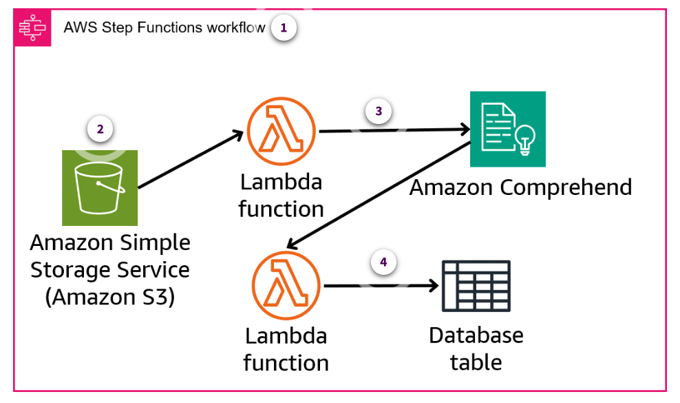

1. **State machine**

    Define the state machine in the Amazon States Language (ASL) using the AWS Step Functions console or AWS CloudFormation.

2. **Initiate state**

    Use the S3Source service integration to initiate the state machine whenever 100 or more files have been uploaded to the S3 bucket.

3. **Sentiment analysis state**

    Invoke a Lambda function that uses Amazon Comprehend to perform sentiment analysis on the preprocessed text.

4. **Storage state**

    Invoke a Lambda function to store the sentiment analysis results in a database table.

Using AWS Step Functions and AWS Lambda functions, you can orchestrate this batch processing workflow, handle error conditions, and monitor the completion of each step. Additionally, you could extend this workflow to include more complex processing steps or integrate with other AWS services as needed.

```text
AWS Step Functions used in conjunction with AWS Lambda and the Kinesis family of services creates a solid base for building batch-based applications. These services will be the focus of subsequent sections.
```

### How Step Functions Supports Batch Processing

AWS Step Functions is a visual workflow service that helps you build distributed applications, automate processes, orchestrate microservices, and create data and machine learning pipelines. Step Functions can also be used to provide orchestration for processing batch jobs. The orchestration process centrally manages a batch job workflow by breaking it into multiple steps, adding flow logic, and tracking the inputs and outputs between the steps. As your batch jobs run, Step Functions maintains the job's state, tracks exactly which workflow step your batch job is in, and stores an event log of the data that is passed between batch job components. This event log allows your batch job to pick up where it left off if the workflow is interrupted.

#### Step Functions states

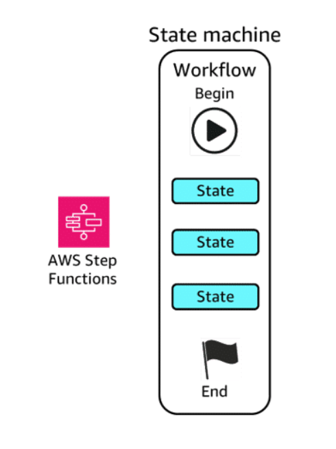

State machines workflows consist of event-driven states.

Step Functions is based on **state machines** and **tasks**. A state machine defines a series of steps and their transitions. Each step in a state machine is called a **state**. States are referred to by their names, which can be any string, but must be unique within the scope of the entire state machine. Each individual state can make decisions based on its input, perform actions, and pass output to other states.

State machines are interchangeably referred to as workflows, because they direct the flow of operations from one state to the next within the state machine.

Step Functions supports eight different types of states.

##### Task, Choice, and Parallel state types

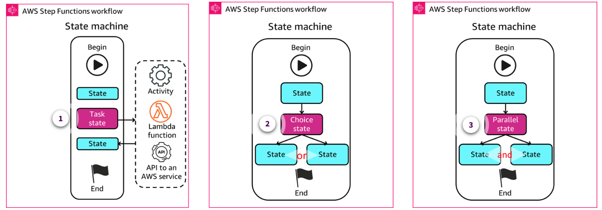

1. **Task state**

    A Task state represents a single unit of work performed by a state machine. Tasks perform all the work in your state machine. A task performs work by using an activity, invoking a Lambda function, or passing parameters to an API for another AWS service.

2. **Choice state**

    A Choice state adds branching logic to a state machine.

3. **Parallel state**

    A Parallel state can be used to create parallel branches of activity in your state machine.

    * **Map, Succeed, and Fail state types**

    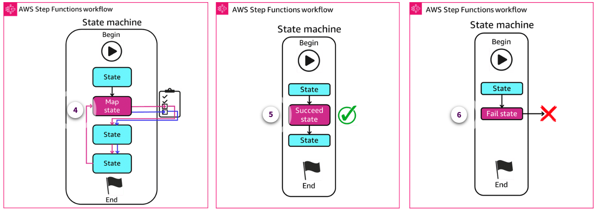

4. **Map state**

    The Map state can be used to run a set of steps for each element of an input array. The Parallel state invokes multiple branches of steps using the same input. But a Map state will invoke the same steps for multiple entries of an array in the state input.

5. **Succeed state**

    A Succeed state stops an activity successfully. The Succeed state is a useful target for Choice state branches that do not do anything except stop the activity. Because Succeed states are terminal states, they have no Next field, and do not need an End field.

6. **Fail state**

    A Fail state stops the activity of the state machine and marks it as a failure, unless it is a caught by a Catch block.

    * **Wait and Pass state types**

    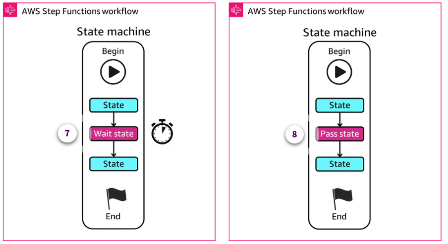

7. **Wait state**

    A Wait state delays the machine from continuing for a specified time. You can choose either a relative time, specified in seconds from when the state begins, or an absolute end time, specified as a timestamp.

8. **Pass state**

    A Pass state passes its input to its output, without performing work. Pass states are useful when construction and debugging state machines.

#### Benefits of AWS Step Functions for batch processing

The three use cases in this section help to demonstrate some key benefits that AWS Step Functions provides.

##### Flexibility

The Lambda functions and microservices that are called by AWS Step Functions can be quickly revised when needed. Changes to one Lambda function or microservice does not impact the rest of the workflow. Additionally, the tasks in your workflow can run anywhere, including EC2 instances or containers. Step Functions also allows you to interact with other AWS services as part of state events, in addition to your own functions and microservices.

##### Separation of application logic

AWS Step Functions keeps your application logic strictly separated from the implementation of your application. You can add, move, swap, and reorder steps without having to make changes to your business logic. Through this separation, your workflows gain modularity, simplified maintenance, scalability, and reuse of code.

##### Alignment with Well-Architected Framework

The two use cases that include Parallel and Map state events automatically start sub-workflows to perform the required processing steps. This dynamic parallelism is a key capability of AWS Step Functions, and helps to deliver on two of the objectives of the Well-Architected Framework:

* **Performance efficiency** – By automatically scaling resources, dynamic parallelism helps optimize resource usage, which can lead to cost savings.
* **Scalability** – Dynamically adding and removing resources allows applications to handle changing workloads efficiently, ensuring consistent performance.

#### Creating and using a Step Functions state machine

In this demonstration, you learn how to create an AWS Step Functions state machine using the AWS Step Functions Workflow Studio. For the most up-to-date information on this topic, see [What Is Step Functions?](https://docs.aws.amazon.com/step-functions/latest/dg/welcome.html)

In this scenario, the state machine will model the functionality of a donut shop that receives and processes donut orders for customer delivery.

Each donut order will be for a particular type and quantity of donut. The state machine must check the inventory, and if the ordered donut is available in the quantity requested, process the payment for the order.

* Go to the AWS Services console, and select Step Functions.

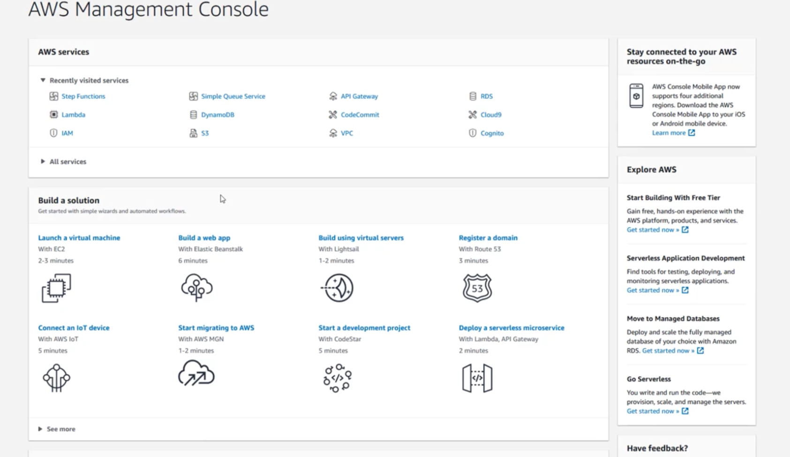

* Now select **Create State Machine** and, for this demo, use the **Design your workflow visually** option.

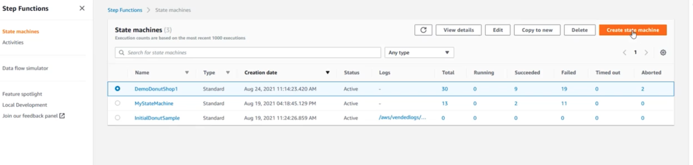

* Leave the **Type** set to **Standard** and choose **Next**.

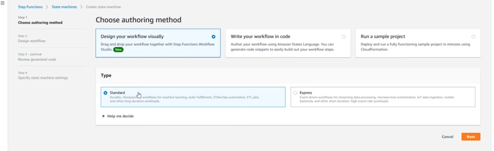

* Here is the visual workflow using **Workflow Studio**. With Workflow Studio, you can build a workflow by dragging and dropping in the tasks you need.

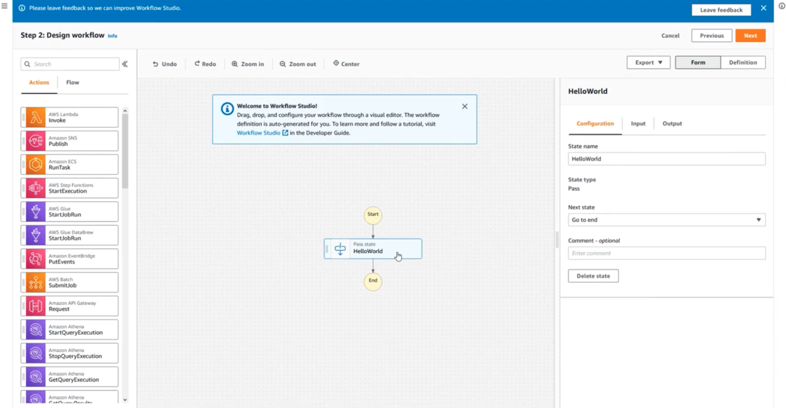

* You can delete the **HelloWorld** task.

* The first step for this demo workflow is to get an item from a donut database, to verify that the incoming order can be obtained from inventory. You can scroll down to find the Amazon DynamoDB GetItem object on the left, and drag it into the workflow. The pane on the right is where you enter the specific data for this database call.

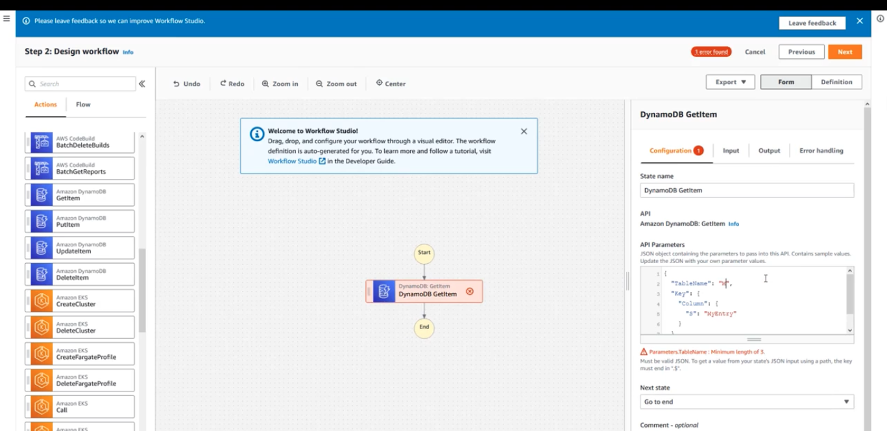

* A DynamoDB table called **DonutInventory** has already been created and populated with items. In the pane on the right, you can replace the default text in the parameters pane with the names of the actual table, primary key, and the value you are looking for.

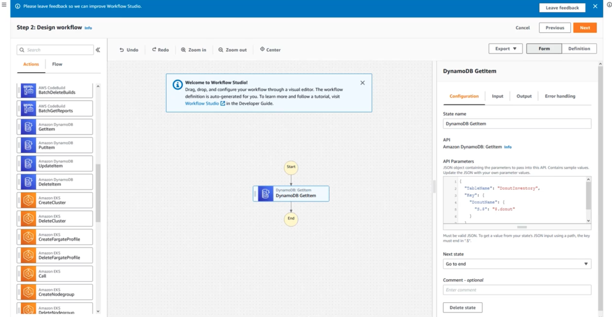

* This table has a primary key of **DonutName**. The value itself will come from the workflow input. You can reference values that are passed into Step Functions by adding the dollar sign character in the appropriate place. For this request, it is a string value that will come from the input, and you must reference the particular variable from the incoming JSON.

* You need to add the original order data to the output of the DynamoDB item information so that a later task can read all of it.

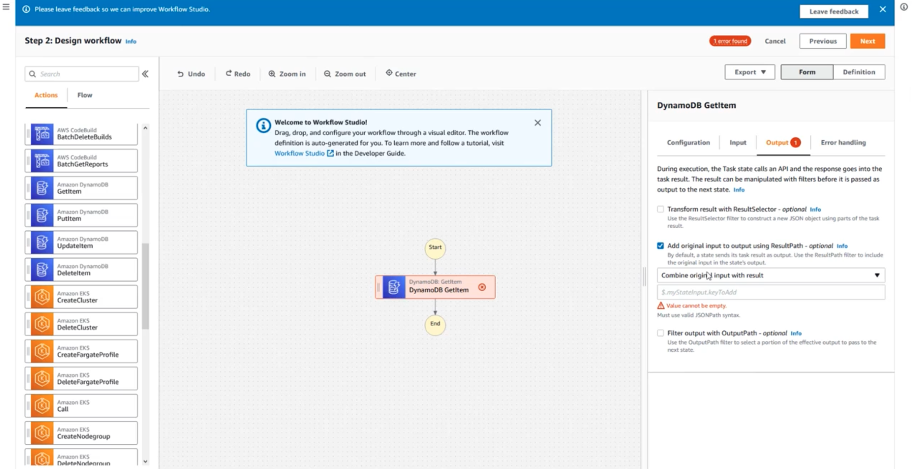

* To do this, select the Output tab and then choose the Add original input to output using **ResultPath** option. When choosing this option, the task will pass on the original input and add the result of the **GetItem** call as a new item within the larger JSON structure. You must name this added item. For this demo, DynamoDB is the string used to show that it is the result of the DynamoDB action.

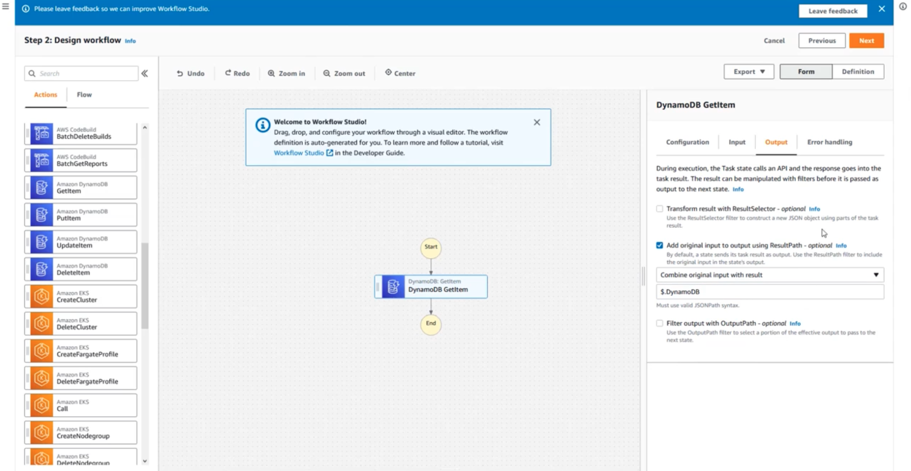

* It is always a good practice to add an error handling mechanism to tasks in case errors occur. For this demo, select the **Error handling** tab and select the **Add new catcher** button. Then choose the Errors entry and choose the generic **States.ALL** error. This will add a single catcher that will cover all errors that might come from the task. For the **Fallback** state, select the **Add new state** option, which will create a new placeholder in the diagram.

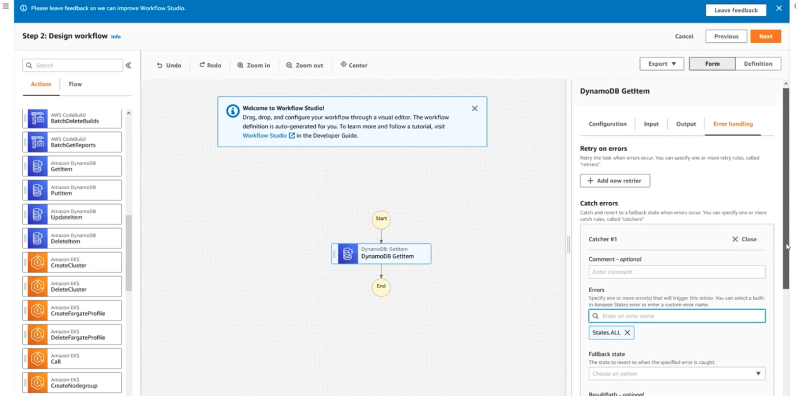

* For this generic error state, choose the **Flow tab** in the upper left portion of the **Workflow Studio** pane and add the generic **Fail** task. A more robust state machine could have multiple options based on the type of exception, but just use one for now.

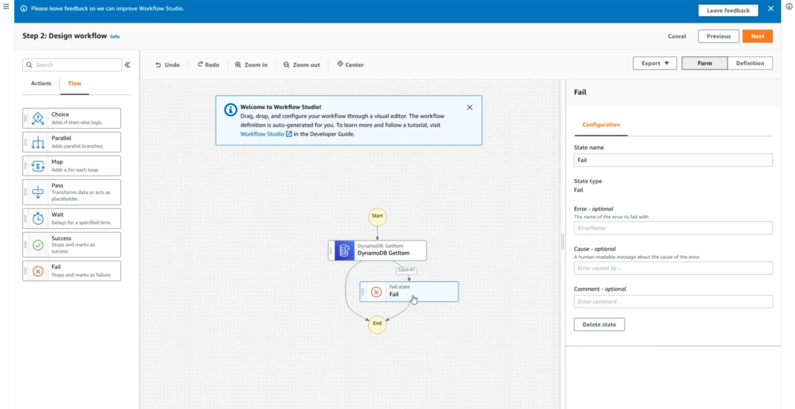

* The next step is to add an **AWS Lambda function** that will both verify that inventory exists, to supply the order, and process the payment. This Lambda function, called **CheckDonutPayment**, was created earlier. Note that it contains separate error conditions to return to the state functions call. One condition is for when the function failed because there is insufficient inventory, and one condition is for when the payment failed.

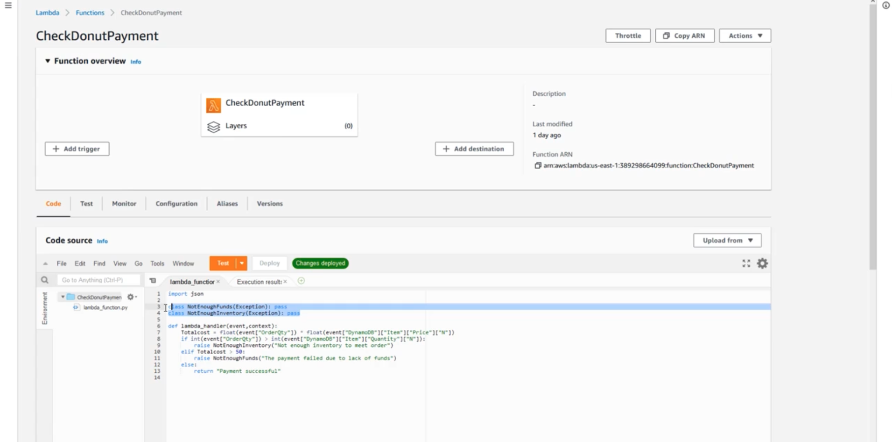

* This simple function reads the values sent on by the Step Functions call through the event object to calculate the total cost for the order. It then compares the order quantity to the inventory as returned by the DynamoDB call. If there is enough inventory, the function will process the payment, although in this simplified function it will just compare the calculated cost to a maximum of 50.
* To add this Lambda function to the workflow, go back to the **Actions** tab and select the **AWS Lambda** task. Insert it into the workflow after the DynamoDB task and it automatically becomes the next state. Now specify the name of the function. When making your selection, the menu will show all of your eligible Lambda functions.

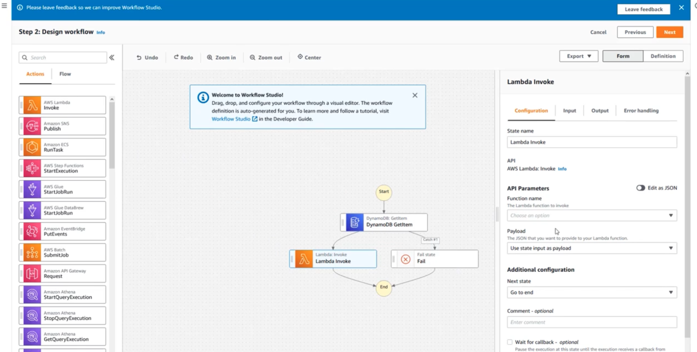

* The **CheckDonutPayment** Lambda function created unique error classes that can be used by the Step Functions workflow. Select the **Error handling** tab on the right and add three catchers. The first catcher will be for the **NotEnoughInventory** error class. This catcher will be activated when the order is for a quantity of donuts greater than the inventory returned by the DynamoDB call. The second catcher will be for the **NotEnoughFunds** error class. This catcher will be activated when the total cost of the order is greater than 50. Use the exact names of the exception classes created by the Lambda function. The third catcher will be a generic catch for any other types of errors.

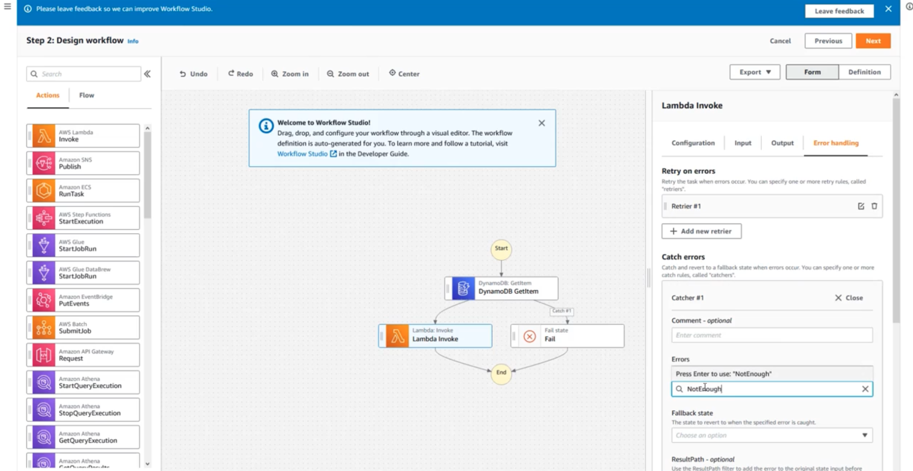

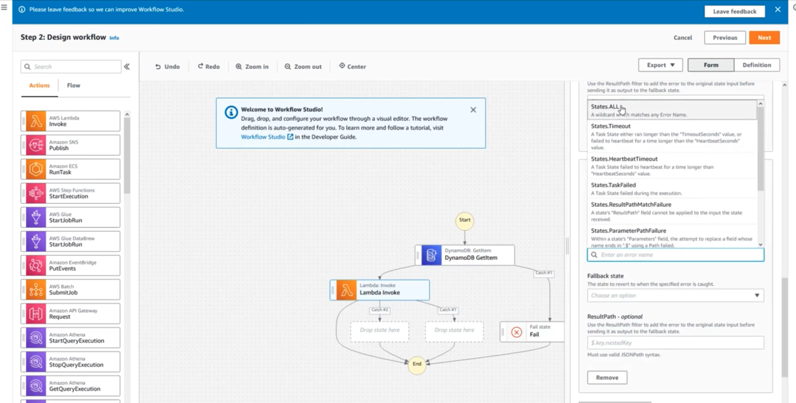

* For the rest of this simple demo workflow, add a **Success** state and fill in **Pass** states for the two types of processing failure caught from the Lambda task. Both of these will be considered a fail state for the overall workflow.

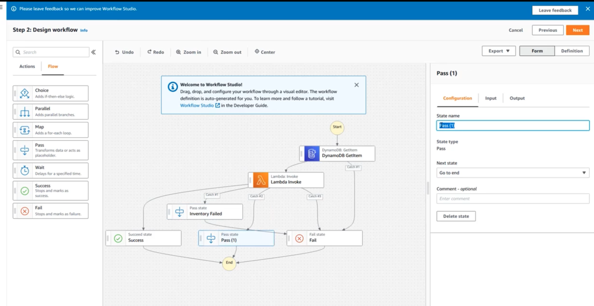

* It is a good idea to identify the names of states even if they are passing information through and taking no other action.
* To complete this workflow, choose the **Next** button and advance to the code view of the workflow.

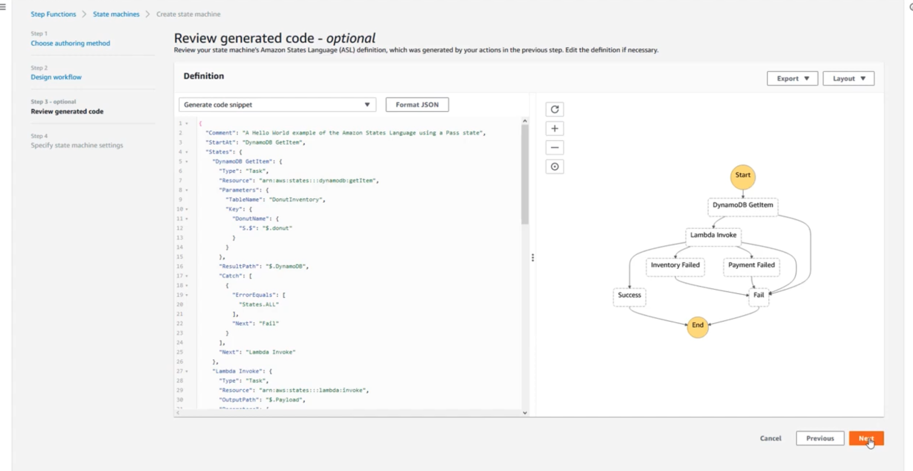

* Choose the **Next** button again to specify some final settings. Here you must name the state machine. Then you can let the Step Function service create a new AWS Identity and Access Management, or IAM, role to use for this state machine. The service will review the workflow and choose appropriate permissions, and then you can review them here at the bottom of the pane.

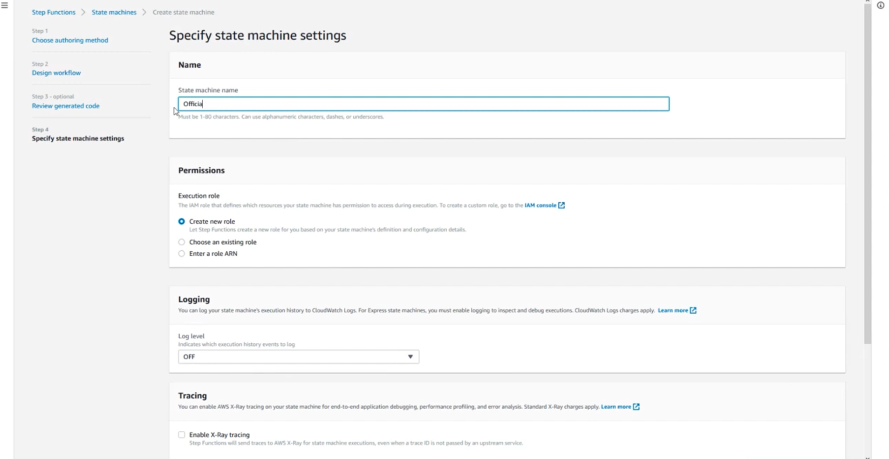

* Choose the **Create state machine** button to finish creating the state machine.

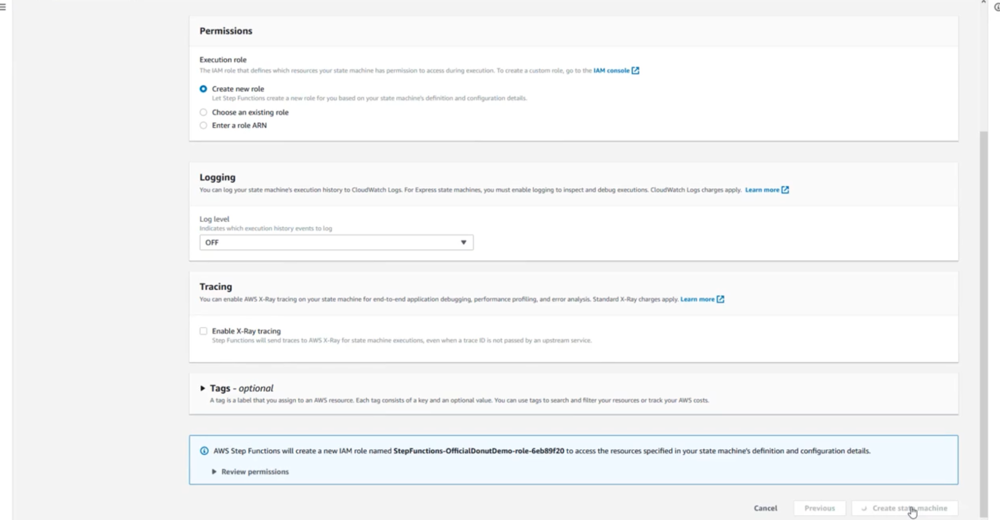

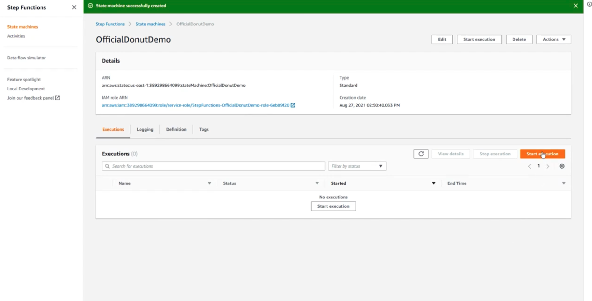

* Then choose the **Start Execution** button to start the worfklow. You can use the pop-up window to enter the order data needed for the workflow. Follow JSON formatting. For this scenario, enter an order of 25 Glazed donuts, and then choose the Start execution button.

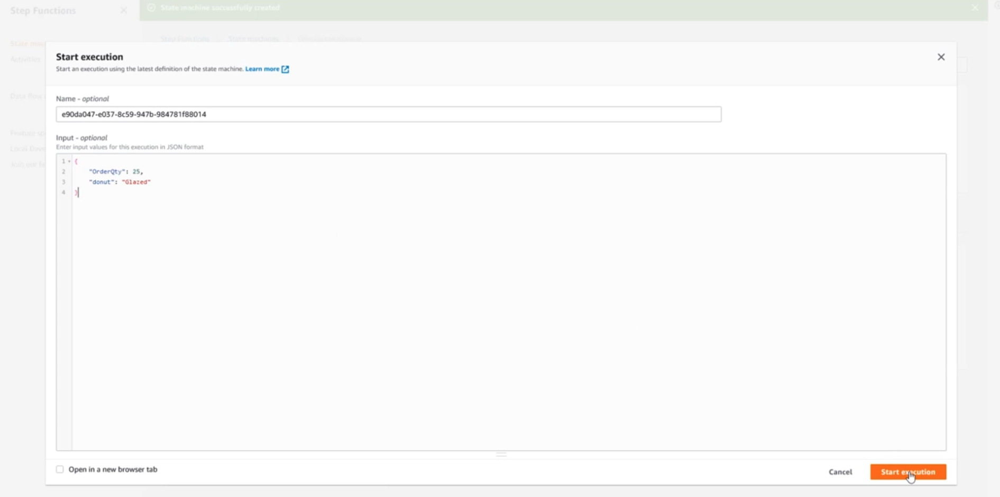

* The workflow ran successfully, so there were enough donuts in the inventory and the payment was sufficient.

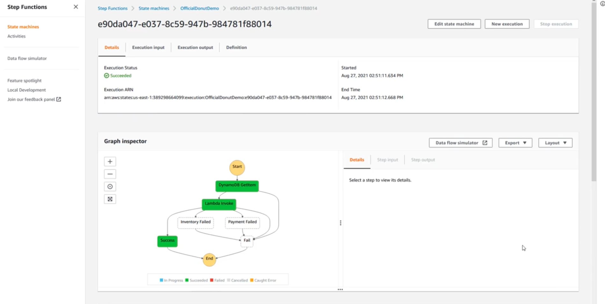

* Different order inputs should result in different results, such as an order for 500 Chocolate donuts, for which there is not sufficient inventory, or an order for 30 Jelly Bismarck donuts, which are too expensive for the $50 limit specified in the Lambda function.

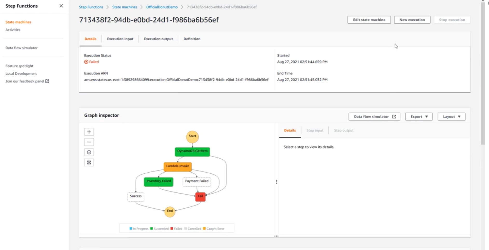

---

#### Orchestrating AWS Batch jobs and Lambda functions with Step Functions

The previous video showed how AWS Lambda functions can be used with a Step Functions state machine to orchestrate the flow of microservice processing tasks. Similarly, this video shows how Lambda functions and Step Functions state machines can be used with the AWS Batch service to perform batch processing. This video will take you through the process of creating a sample project that uses a Step Functions state machine to invoke a Lambda function to do simple preprocessing, then invokes multiple AWS Batch jobs in parallel using the Map state.

A sample state machine created using AWS Step Functions is to invoke an AWS Lambda function for pre-processing of inputs. After pre-processing, Step Functions invokes multiple AWS Batch jobs in parallel using the **Map** workflow state.

* To begin, set up a state machine in AWS Step Functions. Open the AWS Management Console, search for `step`,  and then choose `Step Functions` in the search results.

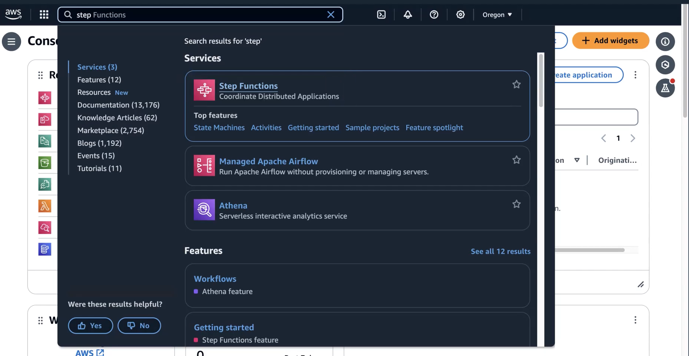

* On the State Machines console page, choose `Create state machine`.
* Next, you’ll choose a template. Type `fan` in the search box, and choose `Fan out a batch job` in the search results. Choose `Next` to continue.

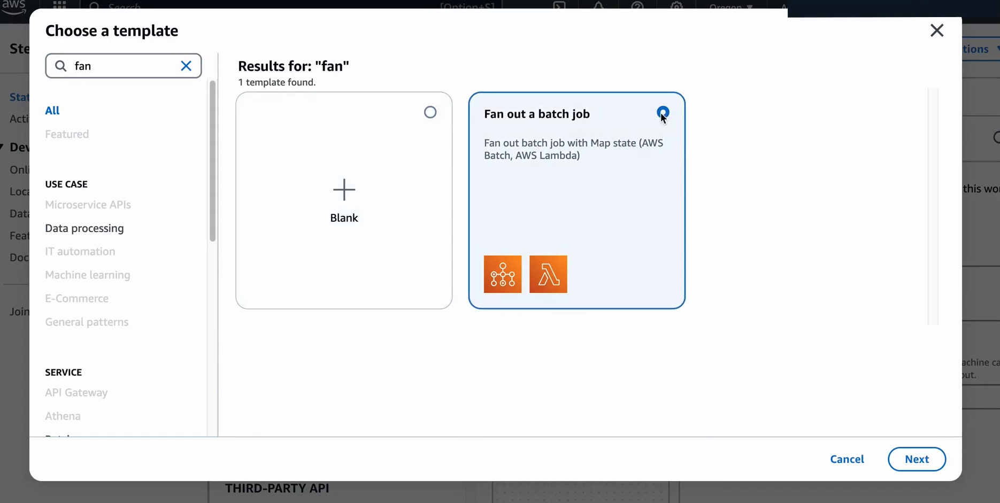

* Here, Step Functions lists the AWS services used in the `Fan out a batch job` template. In the `Choose how to use this template` section, choose `Run a demo`. And then choose `Use template` to continue.

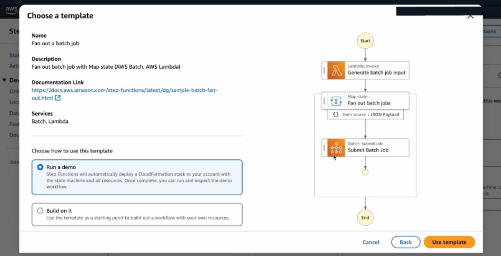)

* This is the **Workflow Studio**. Notice the workflow graph, which shows:

  * A Lambda function
  * An AWS Batch job queue
  * An AWS Step Functions state machine with a **Map** state to Fan-Out AWS Batch jobs, and
  * Related AWS Identity and Access Management, or IAM, roles

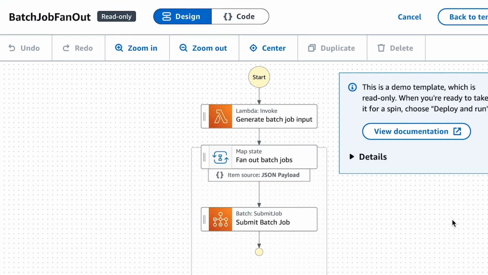

* At this point, **Workflow Studio** is in `Design mode` and it displays the workflow prototype for the state machine. `Design mode` allows you to visualize the state machine by choosing `Design` or review its Amazon States Language definition by choosing `Code`. Amazon States Language is a JSON-based, structured language used to define a state machine.

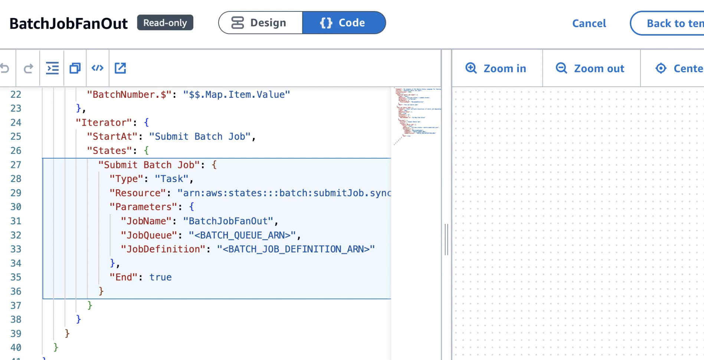

* To see how the batch job is configured, choose the `Submit Batch Job` step in the workflow, and then choose `Code`. This highlights the part of the Amazon States Language definition associated with the `Submit Batch Job` workflow step in the Code editor for the state machine.

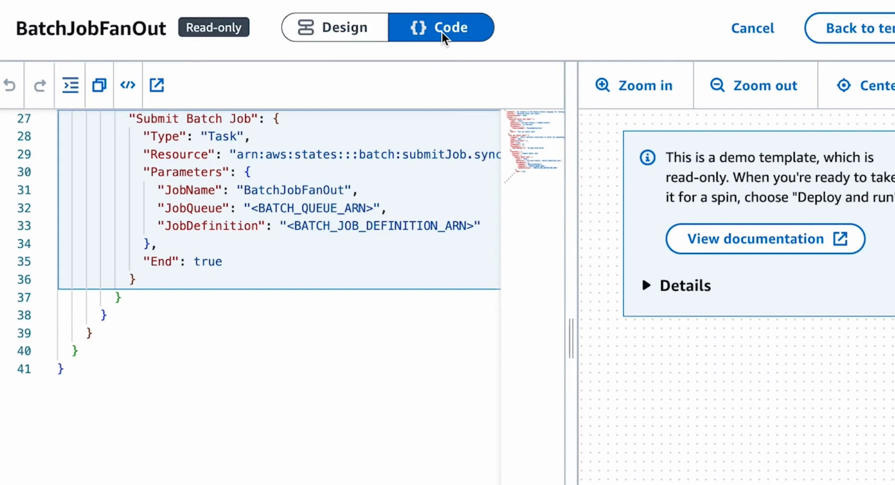

* To deploy the state machine and create the resources, choose `Deploy and run`. It can take up to 10 minutes for the resources and related IAM permissions to be created. While you wait, you can monitor which resources AWS CloudFormation is provisioning. At the top of the page, in the `Deploying CloudFormation stack` banner, choose the `View in CloudFormation` link.

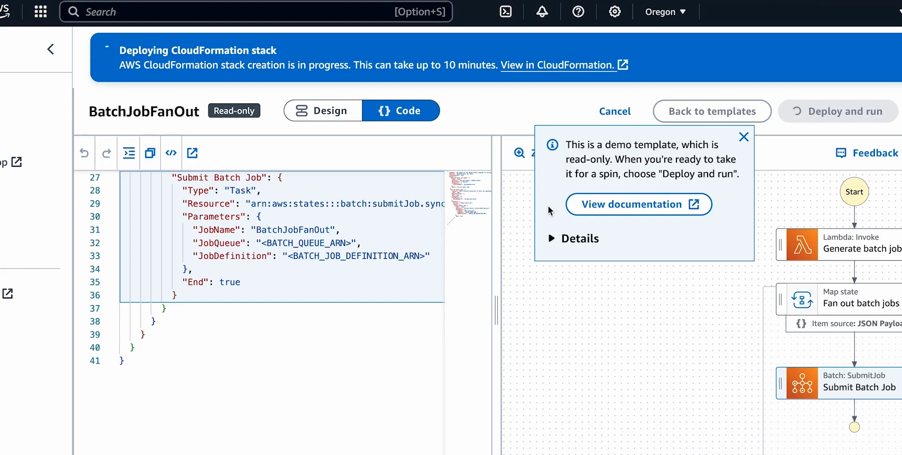

* All the resources for the state machine are now created, and a new window provides an option to execute the newly deployed state machine. Choose `Start execution`.

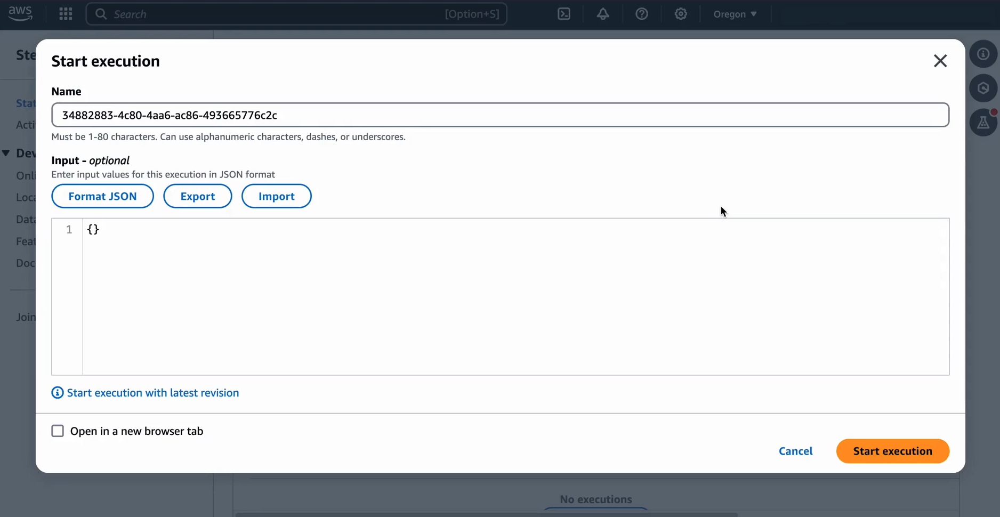

* The Step Functions page displays in the console and a message indicates that the execution of the batch job has started successfully. The sample batch job can take 1 to 5 minutes to complete, so the `Status` portion of the page initially displays as `In progress`.

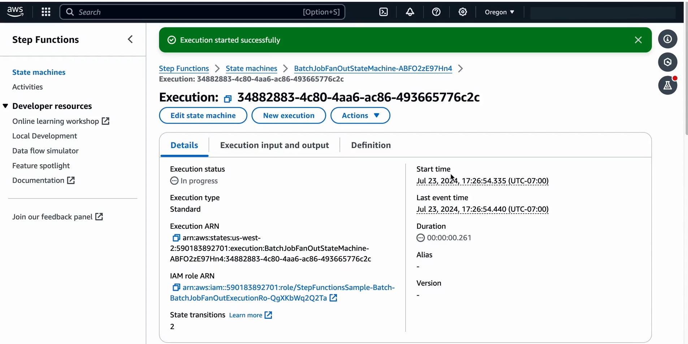

* When the job completes, the `Status` changes to `Succeeded`.

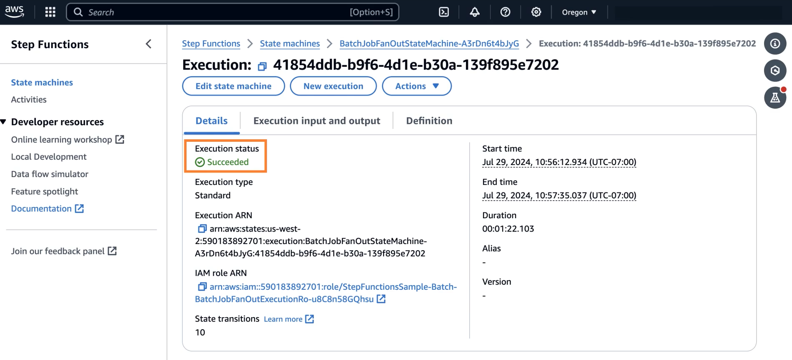

* You can view details about what happened during the state machine's execution by choosing the `Execution input and output` tab on the state machine. These details include the name of each job, the start and end times of batch tasks, and each job’s log information—among other details.

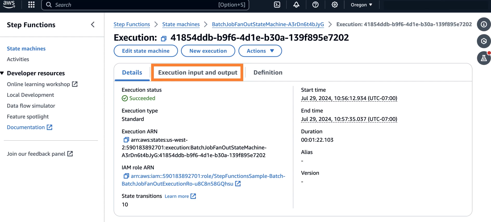

* To access details about a specific stage of the workflow, scroll to the visual representation of the batch job, select one of the workflow stages, and then choose the `Output` tab.

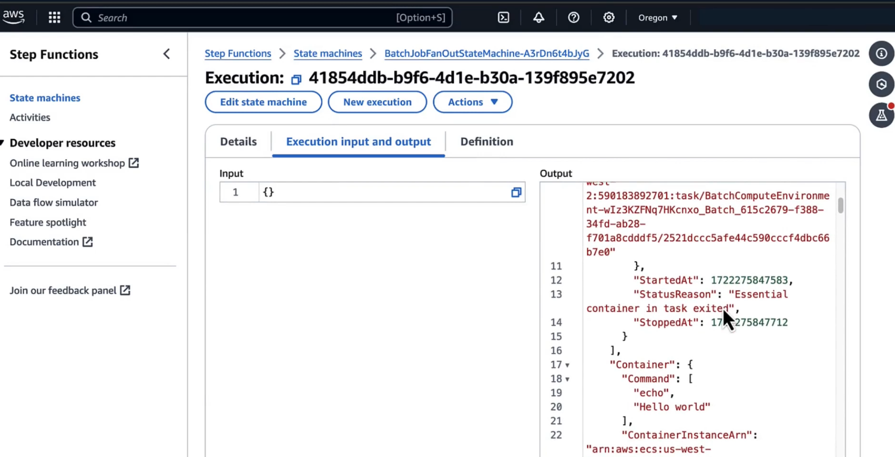

* At the bottom of the state engine page, you can use the `Event view` tab to view the events performed by the batch job. Or, you can choose the `State view` tab to view the states the batch job passed through during processing.

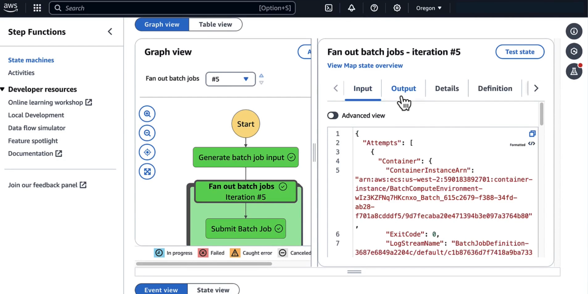

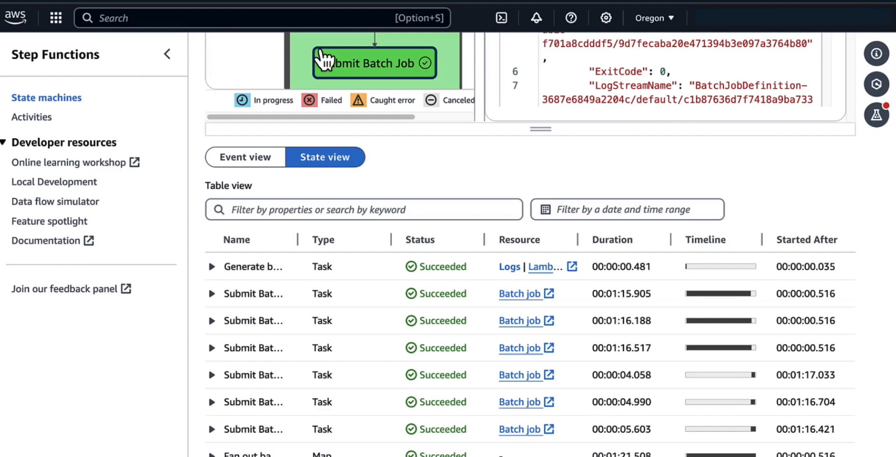

* In the `State view` tab, you can drill into the details of the AWS Batch job that was started during processing. To do this, choose the `Batch job` link. This link takes you to the AWS Batch console page, where you can find general information, as well as specific details, about the job and the container in which the job ran.

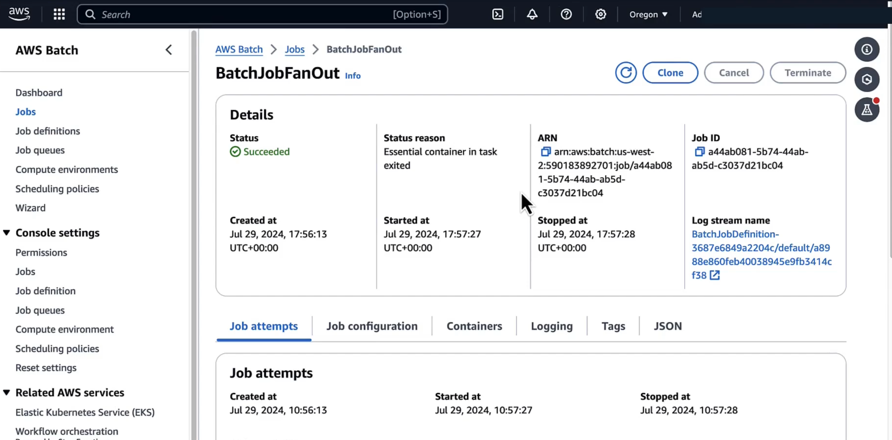

---

The example in the video is taken from the [Run an AWS Batch job with Lambda](https://docs.aws.amazon.com/step-functions/latest/dg/sample-batch-lambda.html) section of the AWS documentation. Use the link to view the most up-to-date steps for creating the items shown in the video.

---

### Use Cases: Step Functions for Batch Processing

These three example use cases are provided to show how the eight state machine types can be used to support application workflows.

#### Offering customers a line of credit

An application developer works for a company that sells parts for ocean-going container ships. Most customer orders are for large dollar amounts, so the company grants customers some type of line of credit that the customers can use to defer payment of their order invoices for up to 90 days.

The line of credit amount is determined when the customer places their first order. All customers receive some amount of credit. In some cases, the line of credit might be sufficient to cover the customer's entire order amount, and other times the line of credit might cover only part of the customer's order amount.

When the credit line does not cover the entire order, the customer typically declines the credit line and cancels their order. However, regardless of whether the customer accepts the credit line, an activity report is generated for regulatory purposes to document that a credit line was offered.

The developer is planning to use AWS Step Functions to create an microservice-based approval process for customer credit lines. The credit lines are offered to new customers as part of their initial order with a vendor. The following diagram shows the workflow that the developer is suggesting.

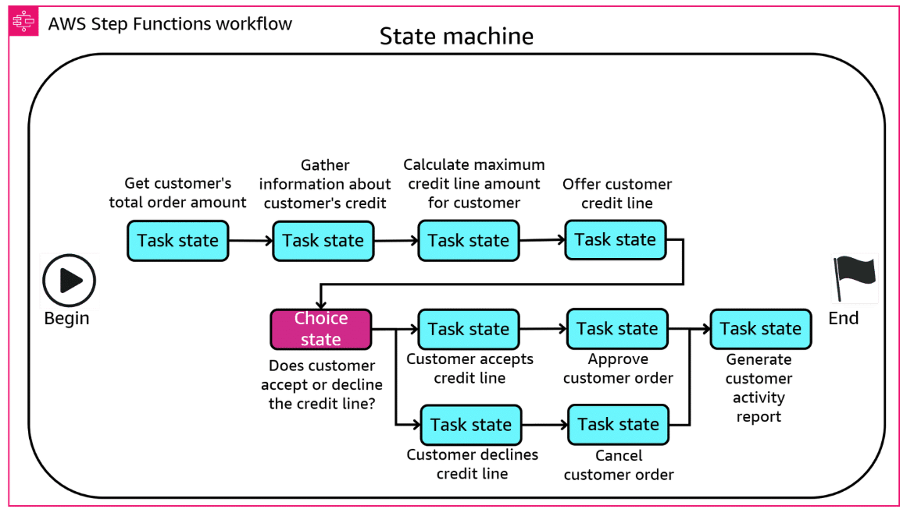

AWS Step Functions workflow for a credit approval process.

The workflow begins with a `Task` state that invokes a microservice to get the total amount of the customer's order from the company's online ordering application. Next, a `Task` state uses a microservice to retrieve information about the customer's creditworthiness from available sources. These sources include credit reporting agencies, public records, and private data aggregation vendors. The next microservice is invoked by a `Task` state to calculate the customer's maximum allowable line of credit based on analysis of the customer's available information.

The next `Task` state uses a microservice to offer the credit line amount to the customer in real time. The customer's decision to accept or decline the offered credit limit is captured by a `Choice` state.

If the customer accepts the offered credit line, the `Choice` state invokes a `Task` state that accepts the line of credit by updating the customer's profile in the online ordering application.

If the customer declines the offered credit line, the `Choice` state invokes a `Task` state that cancels the customer's order.

The final `Task` state invokes a microservice that generates a customer activity report, showing the amount of the credit line that was offered to the customer, and whether or not the customer accepted the credit line. The workflow state machine ends after this final operation.

#### Using parallel processes to load machinery data

The next example of using Step Functions state types to support an application focuses on loading data collected from Internet of Things (IoT) devices. In this scenario, a company uses IoT devices to continuously collecting data from 120 machines in their factory. The devices first collect the data locally, then upload that data to one of three Amazon S3 buckets on an hourly basis. Each bucket contains data files for 40 machines. Each machine uploads ten gigabytes of collected data per hour.

When the IoT data is stored in Amazon S3, it is loaded into a relational database. Then consolidated reports are prepared comparing current, summarized IoT data to historical data from the same period. This report helps the factory managers determine if the factory machines are experiencing any anomalies.

An application architect is planning to use AWS Step Functions to create an microservice-based data loading and reporting process for this IoT data. The following diagram shows the workflow that the architect has proposed.

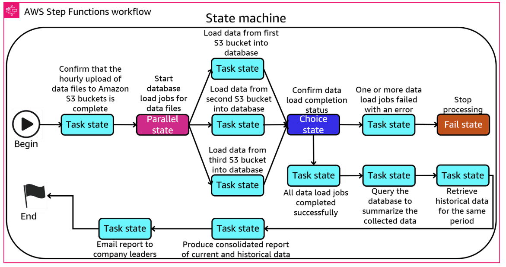

AWS Step Functions workflow for a data load and report preparation process.

The workflow begins with a `Task` state that invokes a microservice to determine whether the hourly data files have been uploaded to the three Amazon S3 buckets by the factory devices. A Parallel state then invokes one `Task` state for each S3 bucket. These `Task` states load the contents of the data files from each S3 bucket into the relational database.

Following the data load operation, a `Choice` state is used in the workflow to determine whether each prior `Task` state has been completed successfully.

If a prior `Task` state failed with an error, a `Task` state invokes a microservice to stop processing and control passes to a `Fail` state event where processing ends.

If a prior `Task` state to load data has been competed successfully, a subsequent `Task` state calls a microservice that summarizes the data that was loaded to the relational database.

Next, another `Task` state retrieves historical data for the same time period from a data lake. Another `Task` state creates a report that consolidates the summarized data and the historical data collected into a report. A final `Task` state event then emails the report to the company leadership team, ending the workflow.

#### Using dynamic parallelism to process spikes in customer orders

An online retailer is planning to offer a special 3-day-only shopping event where products will be sold at up to 50% off their regular prices.

This special pricing is expected to increase the number of online sales from the typical 5,000 per day to 30,000 per day or more. The retailer is concerned that their shipping application might not be able to handle the expected spike in traffic during the sale.

Specifically, the retailer is concerned that the Step Functions workflow related to shipping orders could have performance issues, which could result in shipping delays. The current shipping microservice workflow begins by receiving a comma separated value (CSV) file from the sales application. The rest of the current shipping workflow is shown in the following diagram.

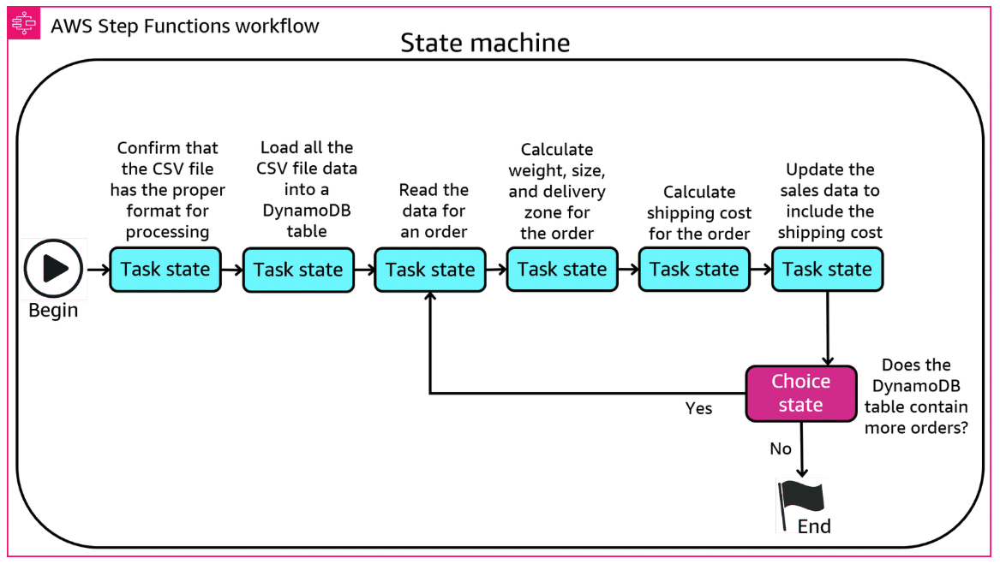

Shipping process workflow using a Choice state event.

The first step in the shipping workflow is a `Task` state event that confirms that the format of the CSV file is correct. If it is, a `Task` state event loads the contents of the CSV file into an Amazon DynamoDB table. The next `Task` state event reads a record from the DynamoDB table and passes the data to a subsequent `Task` state event to calculate the weight, size, and delivery zone information for that order. When this is complete, the remaining two `Task` state events calculate the cost of shipping the order, and update the sales data to include this shipping cost. Finally, a `Choice` state event checks to see if there are additional orders in the DynamoDB table that require processing. If so, the workflow is repeated for the next order. If not, the workflow ends.

The Task state event that calculates the weight, size, and delivery zone for the order relies on several external, third-party applications to determine the cost to ship the ordered items. Sometimes this event can take up to a minute to complete.

This potential delay and the serial nature of the workflow is almost certainly not going to scale efficiently when orders go from 5,000 per day to the expected 30,000 per day.

To avoid any problems related to the shipping calculations during the sale, a developer has proposed a new microservice workflow that uses a `Map` state event in place of the existing workflow.

With `Map` states in Step Functions, you can run a set of tasks in parallel for each element of an array. When the `Map` state is encountered, the workflow will iterate over the array and execute the specified tasks for each record in the array, potentially in parallel. `Map` states can iterate over a set of records in a CSV file by first converting the CSV data into an array. The resulting output of the `Map` state would be an array containing the outputs of each individual iteration, ordered in the same sequence as the original input array. In this workflow, the output of the `Map` state would be an array of order numbers, with each order's associated shipping cost. The developer's proposed new workflow is shown in the following diagram.

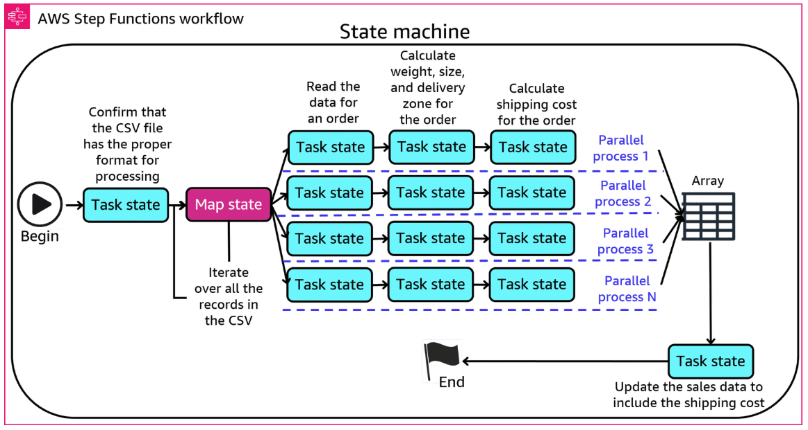

Proposed shipping process workflow using a Map state event.

In this workflow, the `Map` state event reads the entire CSV file into an array after the previous `Task` state event has confirmed that the CSV file is in the proper format. Then the `Map` state iterates through the array file, launching each of the sub-workflows for each order record in the array. These processes can run in parallel until completion. When all sub-workflows are complete, the `Map` state will return an array containing the output for each item processed by the Iterator. This array can be used by the last `Task` state event to update the sales data with the calculated shipping cost, after which the workflow ends.

```text
You can configure an upper limit on how many parallel sub-workflows a Map task event can start. The default value is zero, which places no limit on parallelism and iterations are invoked as concurrently as possible.
```

---

### Knowledge Check

#### A developer is designing a microservice that sends monthly billing statements for printing. There are ten printers available to print the billing statements. The developer wants to start ten parallel processes to print the statements, each with an equal number of statements. Which batch processing model is this an example of?

* Fan-out

Wrong answers:

* Fan-in
* Dynamic parallelism
* Load balanced

##### Explanation

**Fan-out** type of batch processing creates a batch job based on a fixed number of parallel tasks.

The other options are incorrect because:

* Fan-in is the process of combining multiple separate batch processes into one result.
* The approach described uses a fixed number of processes, which is not consistent with dynamic parallelism processing.
* Load balancing is also a dynamic activity, which is typically applied at the instance level, not the microservice level.

#### Which AWS services are frequently used to support batch processing in microservice applications? (Select THREE.)

* Amazon Elastic Container Service (Amazon ECS)
* AWS Step Functions
* AWS Lambda

Wrong answers:

* Elastic Load Balancing
* Amazon API Gateway
* Amazon CloudFront

##### Explanation

**Amazon ECS**, **Step Functions**, and **Lambda** services are architected specifically to run batch processing for microservice applications.

The other options are incorrect because:

* Elastic Load Balancing adds or removes resources at the instance level, not the container or microservice level.
* API Gateway is not a batch processing service.
* CloudFront is not a batch processing service.

#### Which statement about AWS Step Functions state machines is correct?

* State machines are called workflows, which consist of a series of event-driven steps.

Wrong answers:

* Each event-driven step is called a machine.
* State machines are called events, which consist of a series of workflow-driven steps.
* Each event-driven step is called a workflow.

##### Explanation

Each event-driven step is called a state.

The other options are incorrect because those responses are incorrect definitions of both state machines and states.

#### A developer has created an AWS Step Functions workflow that has a state that iteratively reads customer data from a comma separated value (CSV) file. Each time that a value is read from the CSV file, the total sales, gross margin, and profit generated by that customer is calculated. Which type of state event is this an example of?

* Map state event

Wrong answers:

* Parallel state event
* Choice state event
* Task state event

##### Explanation

Map state events iterate on an array of data and perform the same subsequent processing on each item. Parallel processes can be created if needed.

The other options are incorrect because:

* Parallel state events allow two or more subsequent states to run concurrently.
* Choice state events pass control to subsequent states based on the result of an evaluation condition.
* Task state events perform an activity, run an AWS Lambda function, or call an API to an AWS service.

#### A microservice application is using AWS Step Functions. An inventory microservice sometimes fails due to short delays transmitting data between handheld scanners in the warehouse and the inventory application in the AWS Cloud. Which two state events could be used to suspend processing for 2 minutes before rerunning the inventory microservice again? (Select TWO.)

* Fail state event
* Wait state event

Wrong answers:

* Parallel state event
* Succeed state event
* Pass state event

##### Explanation

The `Fail` state event can be raised to acknowledge the process failure, and the `Wait` state event can be used to pause processing for 2 minutes before retrying the failed process.

The other options are incorrect because:

* The Parallel state event is used to run multiple processes concurrently.
* The Succeed state event is used when preceding processes work correctly.
* The Pass state event does nothing except pass a value through to a subsequent state.

---

### Summary

Applications that must perform the same operation on a lot of data are generally more efficient when those operations are broken down into one or more batch processing jobs.

#### Batch processing

`Batch processing` aligns with the operational excellence, security, reliability, performance efficiency, cost optimization, and sustainability pillars of the AWS Well-Architected Framework.

Flexibility and separation of application logic from the application implementation are also key benefits of batch processing models.

The `fan-out pattern` is a parallel processing model where a single input is divided into multiple smaller tasks, which are then processed concurrently by multiple workers or services. The `dynamic parallelism` pattern is an extension of the fan-out pattern, where the number of parallel tasks is not fixed but can dynamically adjust based on the input data or the available resources.

The `fan-in` pattern is the complementary pattern to the `fan-out` pattern. It is used to consolidate the results of multiple parallel tasks into a single output or result.

##### AWS Services for Batch processing

Popular AWS services for implementing batch processing patterns include `AWS Step Functions`, `AWS Lambda`, `Amazon EMR`, `Amazon Elastic Kubernetes Service (Amazon EKS)`, and `Amazon Elastic Container Service (Amazon ECS)`.

`AWS Batch` is a service that is purpose-built for defining, scheduling, monitoring, and logging batch processing jobs.

`AWS Step Functions` offers eight state event types than can be useful for batch processing jobs. These include `Task`, `Choice`, `Parallel`, `Map`, `Succeed`, `Fail`, `Wait`, and `Pass` state events.

`Choice` state events take an action based on the results of a previous state. `Parallel` state events start a fixed number of subsequent states that concurrently perform processing tasks. Map state events iterate on an array of inputs, starting one or more parallel subsequent states to perform processing tasks.

The AWS Management Console can be used to create combinations of AWS Step Functions workflows, AWS Batch jobs, and AWS Lambda functions to perform batch processing for applications.

---

## DESIGNING A REAL-TIME PROCESSING APPLICATION ARCHITECTURE

### Real-Time Processing Architectures

Real-time data processing refers to the continuous ingestion, analysis, and processing of application data, typically within milliseconds to seconds of receiving that data. Real-time data processing differs from batch processing, where data is periodically processed in larger batches, using a predetermined processing interval. Real-time processing enables immediate decision-making based on the most up-to-date information. With the rise of big data analytics and the need for instant insights, real-time data processing has become increasingly important in areas like finance and technology management.

#### Understanding real-time processing

**Real-time processing** is used when application data has to be instantly available so that actions can be taken using the most up-to-date information.

In today's fast-paced world, data is being generated at an unprecedented rate. From financial transactions and social media interactions to sensor readings and log files, data constantly flows around us in real-time.

To keep up with this deluge of data, applications must process and analyze data as it arrives, with little to no delays. This is where real-time processing comes into play.

One type of real-time processing is **stream processing**.

**Stream processing** is a technique for ingesting and analyzing continuous streams of data as it is generated or received, without storing the entire dataset first. Unlike batch processing, where data is collected and processed in batches at scheduled intervals, real-time processing handles data as it arrives, enabling immediate analysis and decision-making.

**Batch processing** is like waiting for some packages to arrive at your home. Instead of opening each package as it arrives, you collect all the packages and open them at once at a scheduled time, like after dinner or on Saturday.

In contrast, **real-time processing** is like opening each package as soon as it arrives, processing its contents immediately, and then taking action based on what's inside.

In the context of applications running in the AWS Cloud, batch processing is suitable for scenarios where data can be processed periodically, such as generating daily reports or running analytics on historical data. However, real-time processing is essential for applications that require immediate responses or decisions based on incoming data.

Real-time processing is crucial for a wide range of industries and applications:

* financial services
* real-time processing is essential for fraud detection
* risk management
* high-frequency trading, where milliseconds can make a significant difference

Real-time processing is also found in ecommerce and retail, supporting personalized shopping recommendations, dynamic pricing, and inventory management based on customer behavior and sales data.

With the proliferation of connected devices, real-time processing is necessary for monitoring sensor data, predictive maintenance, and real-time decision-making in industrial applications.

Lastly, social media and online gaming also rely on real-time processing for analyzing user interactions, delivering personalized content, and ensuring a seamless user experience.

To help implement real-time processing in all these industries, AWS offers a variety of services and tools. Applications can use these services to ingest, process, and analyze data streams in real time, which translates to faster decision-making, improved customer experiences, and more efficient operations.

* Amazon Kinesis Video Streams
* Amazon Kinesis Data Streams
* Amazon Data Firehose
Amazon Managed Streaming for Apache Kafka

#### Examples of real-time processing workloads

**Real-time processing** is an approach used by developers to implement the continuous ingestion, analysis, and processing of application data. The following sections describe examples of applications from the financial and technology sectors that use real-time data processing.

##### Financial applications

* **Securities trading**

Applications that track securities trading activity are critical components in the fast-paced financial services industry, where split-second decisions can have significant financial implications. Real-time processing is a necessity for these applications to capture and analyze data as it streams in from various sources. This data allows traders, investors, and financial institutions to make informed decisions based on the most up-to-date information.

Real-time processing also supports compliance with regulatory bodies that mandate timely reporting of securities transactions. Financial services firms that rely on swift execution of trades for their income also benefit from real-time processing.

* **Fraud detection**

Applications for credit card transaction processing play a crucial role in ensuring secure and efficient financial transactions. By incorporating real-time data processing, these systems can rapidly analyze and respond to potential fraudulent activities. This helps reduce financial losses for both merchants and customers.

Real-time data processing also supports instant risk assessments, allowing for proactive measures to mitigate potential threats and maintain a high level of trust and confidence among consumers.

* **Inventory management**

Inventory management systems use real-time data processing to accurately control prices, reduce costs associated with excess inventory, and improve supplier satisfaction. Real-time data processing enables dynamic pricing adjustments based on supply and demand, and minimize the risk of unsold inventory. Just-in-time inventory replenishment and reduced carrying costs associated with stockpiling excess inventory can also be implemented by processing sales and inventory data in real time. Real-time data processing streamlines communication with suppliers. This enables more efficient order fulfilment and fosters better supplier relationships through improved transparency and responsiveness.

##### Technology applications

* **Network monitoring**

Network monitoring software must process data in real time to effectively manage network traffic and efficiently allocate resources. By continuously analyzing network data streams, the software can identify patterns, anomalies, and congestion points that might require immediate action. Real-time processing ensures that network routing and resource allocation decisions are made promptly.

* **Cybersecurity**

Effective monitoring and mitigation of malicious activities on computer systems necessitates real-time analysis of data. By continuously examining processes as they run, security software can promptly identify and address potential threats. For instance, when malware infiltrates a system, it often manifests as rogue processes consuming excessive resources or exhibiting suspicious behaviors. Real-time process monitoring allows security software to detect such anomalies quickly, facilitating swift containment and remediation measures before the malware can cause significant harm.

* **Telecommunications**

The dynamic nature of telecommunications systems demands constant data ingestion. Processing data in real time ensures a seamless and uninterrupted stream of current data is available to these systems.

For example, weather forecasting applications rely on real-time satellite and remote sensor data to accurately predict and track weather patterns. Real-time analysis of temperature, humidity, wind speed, and atmospheric pressure data are just a few of the data elements needed to make accurate weather predictions.

#### Stream processing for real-time data

Each of the example use cases presented in the preceding sections use **stream processing** to deliver the required application capabilities. Stream processing of data refers to a technique for processing and analyzing continuous streams of data in real time or near real time. Specifically, stream processing involves ingesting, processing, and analyzing data as it is generated or received, without having to store the entire dataset first.

Most streaming data architectures consist of the five logical layers shown here. Each layer is composed of multiple purpose-built components that address specific requirements for real-time ingestion, storage, processing, and analysis of streaming data.

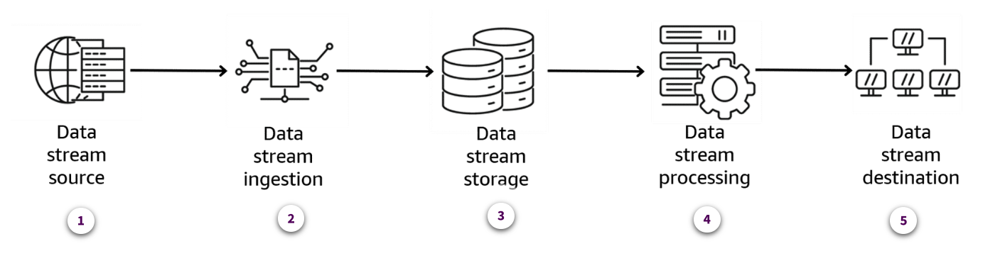

1. **Data stream source**

    Your source of streaming data can include sources like sensors, social media platforms, log files, and mobile devices.

2. **Data stream ingestion**

    The stream ingestion layer is responsible for pulling data into the data stream storage layer. It provides the ability to collect data from tens of thousands of data sources and ingest in near real time.

3. **Data stream storage**

    The data stream storage layer is responsible for providing scalable and cost-effective components to store streaming data. The streaming data can be stored in the order it was received for a set duration of time, and can be accessed indefinitely during that time.

4. **Data stream processing**

    The data stream processing layer is responsible for transforming data into a consumable state. This includes validating, cleaning, transforming, and enriching the data. The streaming data is read in the order it is produced, allowing for real-time analytics or building event driven applications.

5. **Data stream destination**

    The data stream destination layer is specific to your application's use case. Your destination might be an event-driven application, data lake, data warehouse, database, or a search service.

```text
AWS provides services that support each of the five layers of the data streaming architecture. These services are discussed in detail in subsequent sections.
```

#### Other real-time processing mechanisms

In addition to the stream processing of data, two other mechanisms are also used to support real-time processing of data: materialized views and event sourcing.

##### Materialized views

Views are a feature in most relational and nonrelational databases. A view is a virtual table that represents a subset of data from one or more underlying base tables. Views do not physically store any data of their own. Instead, views provide a logical representation of the data based on a predefined database query. Whenever a view is accessed, the query underlying the view is run as part of the interaction with the view.

The example shown here uses a view called classList. The view uses data from four tables that store student, course, teacher, and student registration data. The query behind the view joins these four tables using the ID columns (StudentId, CourseId, TeacherId). The Registration table is the hub that stores the ID values for each course in which a student is registered.

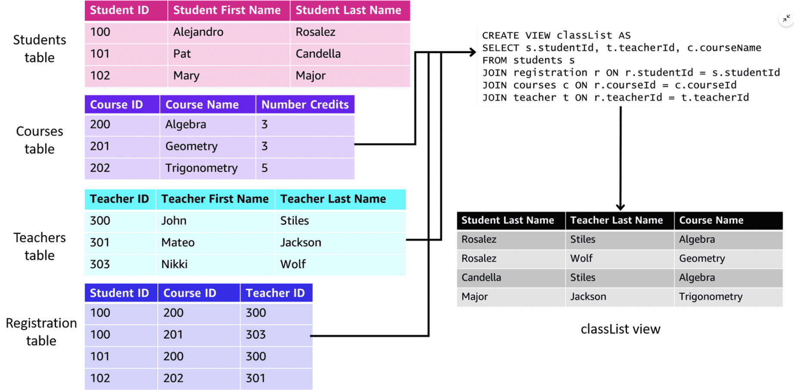

The course list materialized view continuously reflects the data from the four underlying tables.

Views provide real-time access to data because their contents are dynamically updated by the underlying tables whenever data in those tables changes. This means that any changes made to the base tables are immediately reflected in the view, providing real-time access to the most up-to-date data. In this example, when any changes are made to the data in the Students, Courses, Teachers, or Registration tables, the classList view will be automatically updated to reflect those changes.

Materialized views are similar to views, except that materialized views store a separate physical copy of the data that is returned by the query underlaying the view. As a result, materialized views can sometimes improve the performance of databases queries by precomputing and caching the results of complex queries. However, unlike regular views, materialized views aren't dynamically updated. Materialized views have to be refreshed using a regularly scheduled refresh operation or some other mechanism to keep the data in the materialized view current.

The following table contrasts the characteristics of views and materialized views.

| Characteristic | View | Materialized view |
| -------------- | ---- | ----------------- |
| View physically stores a copy of the data from the tables that define the view. | No | Yes |
| When accessing the view, the query defining the view is also executed. | Yes | No |
| View data always matches the table data used to define the view. | Yes | No |
| View requires a separate action to synchronize its data with the tables used to define the view. | No | Yes |

##### Event sourcing patterns

Many serverless applications deployed in the AWS Cloud use event-driven architectures. The event sourcing pattern is a way of managing and storing data in applications by capturing all changes to the application state as a sequence of **immutable** events. In the context of the event sourcing pattern, an immutable event refers to an event that, after it's created and stored in the event store or log, cannot be changed or deleted. It is a permanent record of something that happened in the application at a specific point in time.

For example, if an event represents a customer placing an order, the details of that event, such as the customer's information, the items ordered, and the timestamp, are recorded in an immutable event. Even if the customer later changes their address or cancels the order, the original event representing the order placement remains unchanged in the event store.

The event sourcing pattern naturally lends itself to an event-driven architecture, where events can be consumed by other components or services, enabling better scalability and decoupling of systems. Although the event sourcing pattern can introduce some complexity and overhead, it is recommended as a best practice for applications using an event-driven architecture, especially in distributed or mission-critical systems.

### Implementing Real-Time Processing with AWS

Several AWS services offer capabilities for processing streaming data in real time. These include services for data streaming and real-time data processing, Amazon OpenSearch Service, Amazon DynamoDB, the GraphQL features of AWS AppSync, Amazon ElastiCache, and Amazon MemoryDB for Redis.

#### Services for data streaming and real-time data processing

AWS offers several services for data streaming and real-time data processing. These services include Amazon Kinesis Data Streams, Amazon Data Firehose, and Amazon Managed Service for Apache Flink.

##### Amazon Kinesis Data Streams

`Amazon Kinesis Data Streams` is a scalable and serverless service that you can use to collect, process, and analyze large amounts of real-time data. It can handle millions of records per second, making it suitable for ingesting continuous data streams from applications, devices, or sensors.

Examples of use cases where Kinesis Data Streams can be used include the following:

* **Real-time analytics** – Kinesis Data Streams can be used to process and analyze real-time data for real-time analytics, such as analyzing website traffic, tracking user behavior, or detecting fraud.
* **Data streaming and event processing** – Kinesis Data Streams can be used to stream data from various sources and process it in real time, such as for a log analysis pipeline or an event-driven architecture.
* **Real-time notifications** – Kinesis Data Streams can be used to send out real-time notifications, such as emails or texts, based on data that's coming in through a data stream.

##### Amazon Data Firehose

With `Amazon Data Firehose`, you can automatically capture and load data from various sources into data stores like Amazon S3, Amazon Redshift, and Amazon OpenSearch Service. It can capture streaming data from sources such as web applications, mobile apps, and Internet of Things (IoT) devices, and then load it into your chosen data store for further analysis or processing.

Firehose differs from the Kinesis Data Streams service. `Firehose` is designed for capturing and loading streaming data into data stores. `Kinesis Data Streams` is designed for real-time processing and analysis of streaming data within your applications.

Examples of use cases where Firehose can be used include the following:

* **Data warehousing** – Firehose can be used as part of a data warehousing solution to load data into Amazon Redshift or other big data stores in real time.
* **Data transformation** – Firehose can be used to load streamed data directly into analytics-friendly file formats like Apache Parquet and Apache Hudi. These formats allow you to directly query and derive insights from your data using AWS analytics services.
* **Data intelligence** – Firehose can be used to load streaming data into existing data intelligence tools and dashboards. This helps provide up-to-the-minute data for business decision-making.

##### Amazon Managed Service for Apache Flink

`Amazon Managed Service for Apache Flink` is a service that you can use to process and analyze streaming data in real time. It is commonly used in applications that must continuously process large amounts of data, such as IoT devices, websites, mobile apps, and sensors.

Amazon Managed Service for Apache Flink differs from Kinesis Data Streams. `Amazon Managed Service for Apache Flink` focuses on processing and analyzing data in real time using SQL or Java code, whereas `Kinesis Data Streams` is designed for ingesting and storing streaming data.

Examples of use cases whereAmazon Managed Service for Apache Flink can be used include the following:

* **Predictive maintenance** – Amazon Managed Service for Apache Flink can be used to analyze streaming sensor data from industrial equipment to predict and prevent failures.
* **Clickstream analysis** – Amazon Managed Service for Apache Flink is helpful when analyzing user interactions on websites or mobile apps to improve user experience and engagement.
* **Fraud detection** – Amazon Managed Service for Apache Flink can be used to Identify suspicious transactions or activities in financial data streams.

##### Choosing an Amazon Kinesis service

Many of these services offer the same or similar capabilities when it comes to dealing with real-time streaming data. Which of the these services to use in your application architecture depends on your specific use case. For example, if your application is a real-time analytics and machine learning use case, this might favor using Kinesis Data Streams. Alternatively, if your application is performing bulk data loading of data, and performing analytics on that data, Firehose might make a better choice. Factors such as cost and performance will also help drive your design decisions.

```text
See the next section, Use Cases: Using Kinesis for Real-Time Processing, for examples of application architectures that include one or more AWS real-time, data streaming services.
```

#### Amazon MSK

`Apache Kafka` is a distributed streaming platform that allows applications to publish and subscribe to streams of data. Kafka acts as a broker, receiving data from producers and storing it in topics, which are then consumed by applications or services that subscribe to those topics.

Amazon Managed Streaming for Apache Kafka (Amazon MSK) is a fully managed service for building and running Apache Kafka applications on AWS. Amazon MSK handles tasks like provisioning, configuring, and managing Apache Kafka clusters.

Both Kinesis Data Streams and Amazon MSK are services that support real-time data streaming. Therefore, many of the use cases for other Amazon Kinesis services also apply to Amazon MSK.

However, Amazon MSK is constructed on the foundations of Apache Kafka. Apache Kafka uses a producer-subscriber model, and provides a different feature set and underlying architecture for supporting data streaming. Amazon MSK is particularly well suited for applications that were designed around Apache Kafka but also need integration with other AWS services. Amazon MSK offers direct integration with AWS services like Lambda, Amazon S3, and CloudWatch.

#### OpenSearch Service

`Amazon OpenSearch` Service provides a fully managed and scalable solution for searching and analyzing large amounts of data in real time.

OpenSearch Service uses real-time indexing to ensure that streaming data is quickly accessible.

OpenSearch Service is frequently used in conjunction with the Amazon Kinesis services.

Examples include the following:

* You can use `Kinesis Data Streams` to continuously stream data from various sources into OpenSearch Service. For example, Kinesis Data Streams can be used to capture website clickstream data and stream it into OpenSearch Service to analyze user behavior in real time.
* `Kinesis Data Firehose` can capture, transform, and load streaming data into OpenSearch Service. You could use Kinesis Data Firehose to automatically load application logs or IoT sensor data into OpenSearch Service for centralized log analysis and data visualization.
* `Kinesis Data Analytics` can be used to process and analyze data in real time before sending it to OpenSearch Service. For example, Kinesis Data Analytics can be used to process and enrich IoT sensor data, and then send the processed data to OpenSearch Service for further analysis and visualization.

```text
Log analysis and auditing are two common use cases where Amazon Kinesis services and Amazon OpenSearch Service are used to analyze real-time data.
```

#### Amazon DynamoDB

`Amazon DynamoDB` is a fully managed NoSQL database service. It can support real-time processing of data at scale because it provides single-digit millisecond latency response times. Even as table sizes or request volumes increase, performance remains fast due to automatic partitioning of data and throughput capacity across servers. This makes DynamoDB well-suited for use cases that require real-time reads and writes.

#### GraphQL service AWS AppSync

`GraphQL` is a feature in the `AWS AppSync` service that offers a query and manipulation language for APIs. GraphQL provides a flexible and intuitive syntax to describe data requirements and interactions. The benefits of GraphQL are best described by using an example. Consider an order tracking system that requires that notifications are sent to customers whenever an order status changes from packed, to shipped, to out for delivery, to delivered.

A REST API would issue separate requests for each order status, which could quickly become inefficient, especially with a large number of orders or frequent status changes.

GraphQL provides an alternative to this approach. With GraphQL, you can describe exactly what data you need in a single request, and the server will send back only that data in a predictable format. GraphQL makes your application more efficient because it reduces the number of requests that complex applications need to make when accessing data from many different sources.

Architecture icon for AWS AppSync which includes GraphQL.
GraphQL is based on a subscription model. If GraphQL subscribes to a publisher, producer, event source, or data stream that tracks order changes, a message will be sent to a topic whenever an order status changes. This will make real-time updates to changes in order status possible, which offers two key advantages. First, it reduces the number of requests needed, enhancing system performance and scalability. Second, it ensures a uniform data retrieval and delivery method by consolidating real-time data requirements into a single GraphQL subscription.

#### Data caching

To perform real-time processing of data, applications require low latency and fast response times when accessing that data. One way to deliver the required performance is to hold the data in memory until the real-time processing is complete. This technique is referred to as `data caching`, and AWS provides two services designed for this purpose: Amazon ElastiCache and Amazon MemoryDB for Redis.

##### Amazon ElastiCache

`Amazon ElastiCache` improves application performance when processing real-time data by caching frequently used data in memory. This reduces the load on application databases.

ElastiCache supports two types of in-memory data stores: Redis and Memcached. These two data stores differ in terms of their data handling capabilities, but both are purpose-built data caches.

Ultimately, the specific use case, desired performance characteristics, required level of flexibility, and data durability requirements will determine whether Redis or Memcached is the best fit for a given application.

##### Amazon MemoryDB for Redis

`Amazon MemoryDB for Redis` also uses an in-memory data cache to improve application performance by caching frequently used data in memory.

MemoryDB delivers this by using a distributed, multi-Availability Zone, in-memory database. This architecture delivers not only ultra-low latency and high query throughput, it also provides high data durability and consistency.

These characteristics make MemoryDB well-suited for workloads where high data ingestion rates of streaming data are critical.

The following table is helpful when determining which of these in-memory data caching services to consider for your application.

|Amazon ElastiCache | Amazon MemoryDB for Redis |
| -------------------- | -------------------- |
| * You want to speed up data access from your existing main database or data storage system.<br>* You require microsecond read and write speeds.<br>* You want to use the open-source Redis data structures and APIs to access data stored in a primary database or data store.<br>* You don't require a durable, long-lasting database behind the data cache. | * Your workloads require reading data in microseconds and writing data in a few milliseconds.<br>* You need to build an application using the same data structures and programming interfaces as the open-source Redis database, but with a durable, long-lasting database instead of just a cache.<br>* You want to simplify your application's design and reduce costs by replacing a separate database and cache with a single, fast, and reliable database. |

### Use Cases: Using AWS Services for Real-Time Processing

The following sections discuss some typical architectures that incorporate AWS streaming services for handling an application's real-time data streaming requirements. You should aim to conceptually understand how the AWS services for real-time data processing integrate with one another, and the general operational function that each service delivers.

#### Monitoring machinery in real time using Amazon Data Firehose

A company performs log analysis that involves searching, analyzing, and visualizing IoT data generated by their manufacturing machinery. The data includes logs and metrics such as number of components produced by the machine per hour, defect rates for parts produced by the machine, and employee compliance with safety procedures. This data is variable and complex, but it also provides valuable operational intelligence for the business.

In this use case, the IoT data is initially collected in an Amazon S3 bucket. There are several users, including auditors, and members of the machinery maintenance team, that need to access the data. The following diagram illustrates the application architecture, with IoT data as input that drives near real-time dashboards for the users.

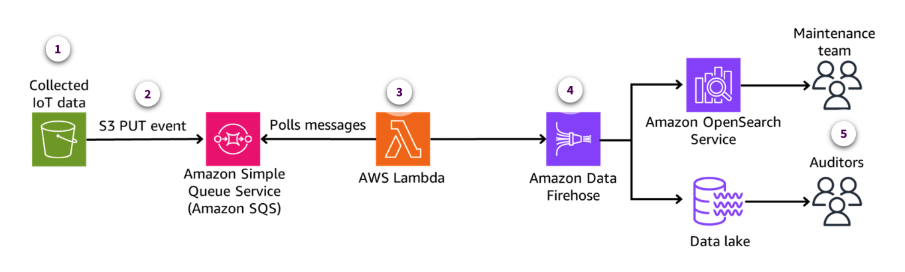

1. **IoT data is collected**

    Operational data from multiple IoT devices attached to machinery is collected in an Amazon S3 bucket.

2. **S3 PUT events are published**

    Amazon S3 PUT events are published to Amazon SQS.

3. **Lambda polls messages**

    AWS Lambda polls the events from Amazon SQS and invokes a Lambda function to move data into Amazon Data Firehose.

4. **Firehose sends data**

    Firehose passes the data in real time to OpenSearch Service and a data lake.

5. **Auditors access dashboard**

    Maintenance team members use the OpenSearch Service dashboard to monitor the streaming machinery metrics in real time. Auditors use the analysis tools of their choice to review the data in the data lake.

#### Streaming data from an SaaS application using Amazon Kinesis services

A company uses a popular human resources (HR) application that is delivered using a software as a service (SaaS) model. The company needs to copy selected HR data, in real time, from the SaaS vendor's platform into the company's payroll and time management systems in the AWS Cloud.

In this use case, the SaaS vendor uses a publish-subscribe (pub-sub) messaging model to allow their customers to pull data from the HR SaaS application. Therefore, the Amazon MSK service is used to ingest data from the HR application. When the HR data is ingested, enriched, and processed into the company's payroll and time management systems, the company will use the Amazon QuickSight service to analyze the data. The following diagram illustrates the application architecture, with data from the HR SaaS application as input, and near real-time data reporting using QuickSight.

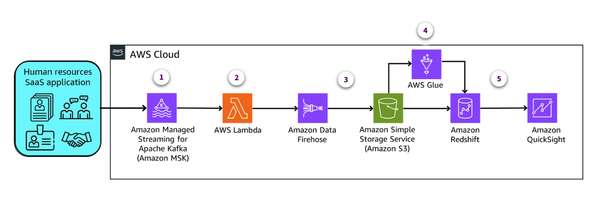

1. **Amazon MSK**

    Near real-time data is published from the external HR application running on the vendor's SaaS platform. Amazon MSK subscribes and ingests the streaming data as it is published.

2. **Lambda**

    Lambda reads the data from Amazon MSK. At this point, any required data transformation or enrichment can be performed.

3. **Amazon Data Firehose**

    The Lambda function passes its transformed and enriched data to Firehouse, for storage in an S3 bucket.

4. **AWS Glue**

    AWS Glue performs any additional required transformations on the data stored in Amazon S3, then loads the data into Amazon Redshift.

5. **Amazon QuickSight**

    After data is in Amazon Redshift, QuickSight can be used to create reports and analysis using the transformed and enriched HR data.

#### Real-time recommendations using OpenSearch Service

A music streaming service has thousands of subscribed users who listen to millions of songs each month. To ensure compliance with copyright laws, the company collects real-time data about the songs that users are listening to. This data includes the artists who performed the songs and the composers who wrote the songs.

Additional non-copyright-related data is also collected for marketing purposes. This includes data like the genre for each song, the subscriber's geographic location, the date and time the song was heard, and the device type that the subscriber used to listen. The company uses this information to make real-time recommendations to subscribers for new artists and songs. Formulating these recommendations requires searches across both semi-structured and unstructured data.

Past research by the company shows that these recommendations must be made as quickly as possible to have the greatest positive impact on the listener's experience. To deliver on these requirements, the company uses a DynamoDB table with streams to replicate listener data into OpenSearch Service. This combination provides a near real-time, full-text search capability to feed the recommendation process. The following diagram illustrates the application's data architecture with Amazon DynamoDB and Amazon OpenSearch Service.

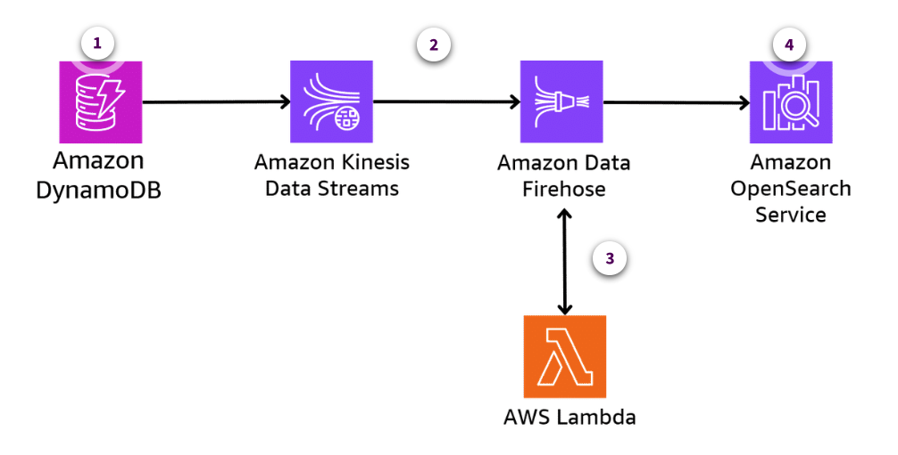

1. **DynamoDB**

    DynamoDB is used as a durable data store for the data that subscribers generate while using the music streaming service.

2. **Kinesis Data Streams and Firehose**

    DynamoDB has an integration with Kinesis Data Streams to perform `change data capture (CDC)`. This means that any update, deletion, or new item on the DynamoDB table is collected by Kinesis Data Streams and sent to Firehose for processing.

3. **Lambda**

    Kinesis Data Firehose passes the data changes to Lambda. Lambda makes appropriate calls to OpenSearch Service to index the data in near real time.

4. **OpenSearch Service**

    The recommendation portion of the music streaming application can now use the full indexed and cached data to quickly generate user recommendations in near real time.

#### Customer call center management with OpenSearch Service

A manufacturer of premium kitchen appliances operates a call center to provide support to its customers. Purchasers of the company's appliances can call the support center 24 hours a day and get answers to their questions about how to use, clean, and maintain their appliances. The manufacturer uses Amazon Connect, a contact center service that enables businesses to deliver better customer service through features like interactive voice response and call routing. Amazon Connect also integrates with other AWS services to deliver analytics capabilities on data collected during call center interactions.

The following diagram illustrates the application's data architecture that uses Amazon Connect and OpenSearch Service to stream and then analyze contact center data.


1. **Amazon Connect sends metrics to CloudWatch**

    Amazon CloudWatch receives Amazon Connect instance metrics and uses a subscription filter to forward the metrics to Amazon Kinesis Data Firehose.

2. **Amazon Connect sends streams to Kinesis Data Streams**

    Amazon Connect streams segments of customer service agent events through Kinesis Data Streams.

3. **Amazon Connect sends events to Amazon EventBridge**

    Amazon Connect streams case event and voice events through Amazon EventBridge.

4. **Lambda forwards to Amazon Data Firehose**

    EventBridge forwards the events to Firehose by using Lambda.

5. **Firehose invokes Lambda**

    Firehose invokes a Lambda function for data cleansing and transformation.

6. **Lambda transforms using a schedule**

    Lambda captures third-party data and Amazon Connect reporting API data on a scheduled basis. Lambda transforms the data as needed, then calls Amazon OpenSearch Service to forward logs to the OpenSearch index specific to the data source.

7. **Firehose sends data to OpenSearch Service**

    Firehose directly ingests data to Amazon OpenSearch Service and into the OpenSearch index specific to the data source.

8. **Gain insights using OpenSearch Dashboard**

    The OpenSearch Dashboard is configured to visualize the Amazon Connect index data located in OpenSearch Service.

### Kinesis Data Streams and OpenSearch Service

Several of the real-time processing architectures use `Amazon Kinesis Data Streams` and `Amazon OpenSearch Service` as part of their application design. These services are central to many solutions related to streaming data challenges.

#### Architecture and operation of Kinesis Data Streams

* **Data producer**: typically, an application that produces data records, assigns a partition key data record before putting the data record to the Kinesis Data Stream using the PUT record or PUT records API call.

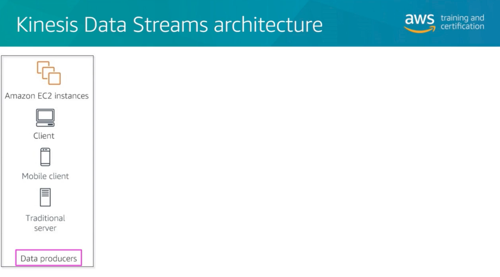

* **Data stream**: a logical grouping of shards. A data stream by default is retained for a minimum of 24 hours, but it can be extended up to seven days.

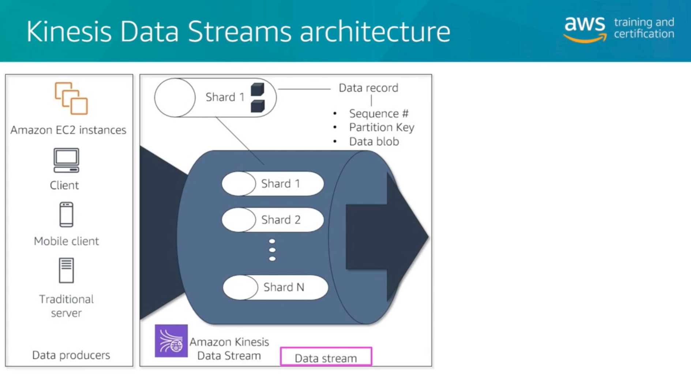

* **Shard**: a temporary holding space to accumulate data until it is processed. It is the base throughput unit of a Kinesis Data Stream and append-only log that defines a unit of stream capability. A Shard contains a sequence of records ordered by arrival time. One shard can ingest up to `1000` records each second and emit up to `two megabytes each second`. If your customer requires a higher ingestion capability, then they must add more shards.

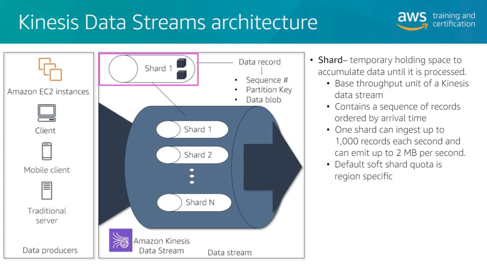

The default soft shard quota is region specific but a customer can request a limit increase.

* **Data record**: unit of data stored in the Amazon Kinesis Stream and is composed of a sequence number, partition key, and data blob. The data blob is the data of interest that a data producer adds to the stream. The data payload is encoded using base 64. The maximum size of the data blob is one megabyte before encoding.

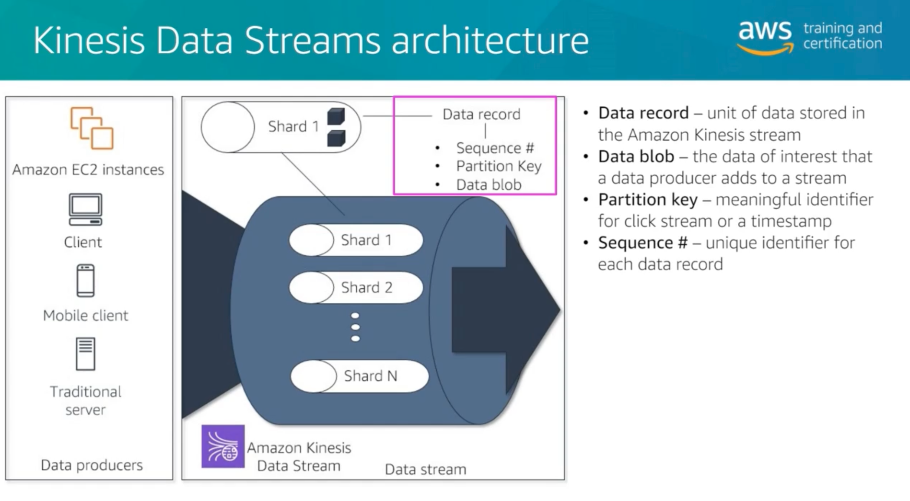

* **Partition key**: meaningful identifier such as user id for click stream or a time stamp. The partition key is specified by the data producer while putting data into a Kinesis Data Stream and is used by data consumer to replay or build a history using it. It plays a role in how the data streams are stored and managed by Amazon Kinesis Data Stream.

* **Sequence number**: unique identifier for each record and is assigned by Kinesis Data Streams when the data producer calls the PUT record or PUT records API to add data to the data stream.

* **Data consumer**: This can be a distributed Kinesis application or another AWS service such as Amazon Kinesis Data Firehose or Kinesis Data Analytics that retrieves data from all shards in a stream as it is generated in real time. The data consumer can run analytics or pass it on to another service for processing or just store it.

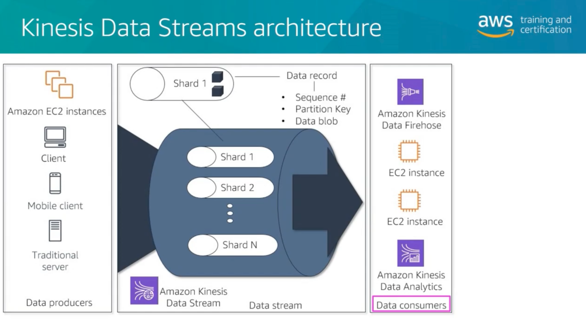

As the diagram shows producers put data records into a data stream which are stored in shards. The consumer processes the data records from the shards and then emits them to another AWS service.

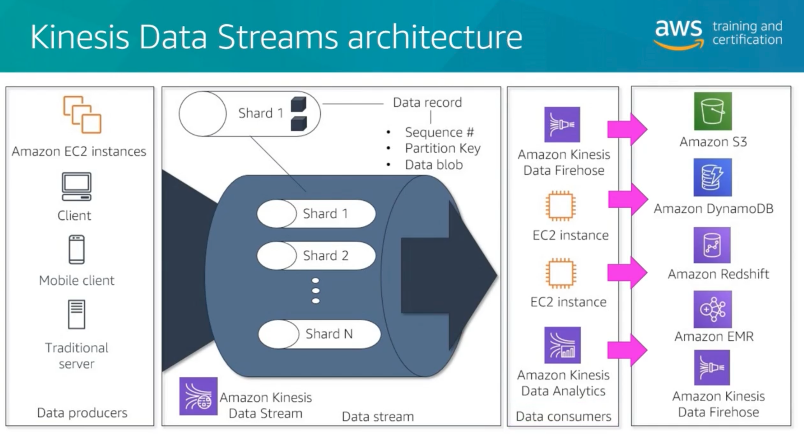

```text
Amazon Kinesis Data Firehose is now called Amazon Data Firehose. Amazon Kinesis Data Analytics is now called Amazon Managed Service for Apache Flink.
```

##### Kinesis Data Streams terminology

* **Data producer**

    A data source that produces data records, which includes a partition key assigned by the producer

* **PutRecord**

    The API call used by a data producer to put a record into the Kinesis data stream

* **Shard**

    Temporary holding space used to accumulate data from the data producer until it is processed

* **Data stream**

    A logical grouping of shards

* **Data blob**

    The data of interest that the data producer puts into the stream

* **Sequence number**

    Unique identifier automatically assigned to each data record

* **Data record**

    Unit of data stored in the Amazon Kinesis data stream. Composed of a partition key, data blob, and sequence number

* **Data consumer**

    AWS service that retrieves shards from the stream, reads each data record within the shard, and then either processes that data or passes it on to another service or application

##### Kinesis Data Streams concepts

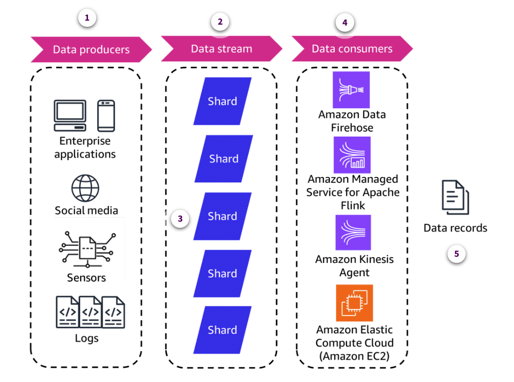

1. **Data producers**

    Data producers put data records into a data stream.

2. **Data stream**

    Data stream records are stored in shards.

3. **Shard data records**

    Shard data records are composed of a primary key, sequence number, and data blob.

4. **Data consumers**

    The data consumers process the data records from the shards.

5. **Data records**

    The data records are emitted to another AWS service or application by the consumer.

#### Architecture and operation of OpenSearch Service

Amazon OpenSearch Service is a fully managed cloud search service that provides fast search capabilities for real-time data when used in conjunction with Amazon Kinesis Data Streams. Specifically, OpenSearch Service allows for the collection, storage, and analysis of real-time data to provide extremely fast search results by indexing new data as it is streaming.

OpenSearch Service integrates with existing AWS cloud services, including the following:

* AWS Identity and Access Management (IAM) for fine-grained access control
* Amazon S3 for data persistence
* Kinesis Data Streams, Lambda, and Amazon Redshift for data processing and analysis

The architecture of OpenSearch Service consists of a `single`endpoint for use with the OpenSearch APIs, known as the `domain endpoint`. The domain endpoint provides access to the service's administrative functionality, such as creating and managing indexes, creating and managing data streams, and managing users and roles.

OpenSearch Service uses API gateway to handle the routing of OpenSearch Service API calls to the backend Elasticsearch domains. The API gateway also includes rate limiting, request validation, and authentication features.

##### OpenSearch Service terminology

* **Amazon OpenSearch Service domain**

    A cluster of compute resources. The number and type of resources are based on the settings, instance types, instance counts, and storage resources that you specify when the domain is created.

* **Data nodes**

    Responsible for storing and indexing the data in the OpenSearch Service cluster.

* **Master node**

    Responsible for cluster management operations, such as adding or removing nodes, allocating shards to data nodes, and managing cluster state.

* **Domain endpoint**

    A single domain endpoint that acts as the entry point for all OpenSearch Service API requests. The domain endpoint abstracts away the underlying cluster topology and provides a unified interface for interacting with the OpenSearch Service cluster.

* **Domain index**

    An index is a collection of documents that have similar characteristics. It is a logical partition of data within an OpenSearch Service cluster. Having at least two replicas for each index in your OpenSearch Service domain is considered a good design practice. By having multiple replicas of an index, you ensure that your data remains available even if one or more nodes in the cluster fail.

##### OpenSearch Service concepts

* The Amazon OpenSearch Service is configured and managed using the OpenSearch Service portion of the AWS Management Console, the AWS CLI, or any of the language-specific AWS SDKs.
* Master nodes do not store data or participate in data-related operations.
* Data nodes handle operations such as creating, reading, updating, and deleting data, search queries, and aggregations.
* You can customize the number of nodes for each node type based on your specific requirements. Factors such as the amount of data that you need to store, the expected query load, and the desired level of fault tolerance and high availability will all impact the domain configuration.
* A single domain endpoint distributes incoming client requests across the available data nodes in the cluster. If new data nodes are added or existing nodes are removed, the domain endpoint automatically adjusts to include or exclude those nodes.

This diagram shows the components of the Amazon OpenSearch Service architecture and its operational characteristics.

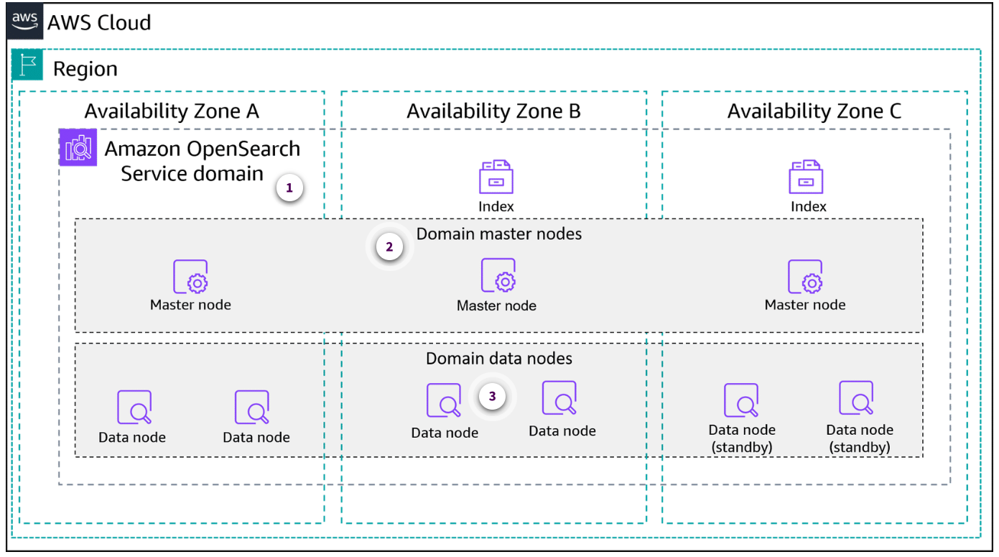

1. **Domain endpoint**

    The domain endpoint abstracts away the underlying cluster topology and provides a unified interface for interacting with the OpenSearch cluster.

2. **Domain master nodes**

    In the default domain configuration for Amazon OpenSearch Service, three master nodes are distributed across three different Availability Zones within the same AWS Region.

3. **Domain data nodes**

    In the default domain configuration for Amazon OpenSearch Service, two data nodes are deployed within a single Availability Zone. However, you also have the option to configure the data nodes to be distributed across Availability Zones, if desired, for increased data availability and durability.

This architecture diagram incorporates several configuration characteristics that are designed to prevent data loss and minimize OpenSearch Service cluster downtime in the event of a service disruption. Specifically, the recommended Multi-AZ with standby deployment option creates the following configuration:

* The domain deployed across three Availability Zones (AZs)
* Three dedicated master nodes
* Six data nodes. AWS recommends three, or a multiple of three, data nodes
* At least two replicas for each index in your domain

With the Multi-AZ with standby configuration, OpenSearch Service creates a domain across three Availability Zones, with each zone containing a complete copy of data and with the data equally distributed in each of the zones. The domain reserves nodes in one of these zones (Availability Zone C in this example) as standby, which means that those nodes won't serve search requests. Instead, these standby nodes are automatically activated in less than a minute when OpenSearch Service detects a failure in the underlying infrastructure.

```text
AWS also offers an on-demand, serverless configuration for Amazon OpenSearch Service that is called Amazon OpenSearch Serverless. The serverless offering is primarily intended for supporting log analytics and full-text searching use cases.
```

---

### [Lab: Navigating Through Kinesis](./labs/W110Lab1NavigatingThroughKinesis.md)

This is a two-part lab. In part one of the lab, you will create an AWS Lambda function from a blueprint and create a stream using Amazon Kinesis Data Streams. You will then invoke the function with data from your stream and monitor the process with Amazon CloudWatch.

In part two of the lab, you will learn the basics of event-driven programming using Amazon DynamoDB, the DynamoDB Streams feature, and AWS Lambda. You will walk through the process of building a real-world application using triggers, which combine DynamoDB Streams and Lambda.

In this lab, you will perform the following tasks:

* Create a stream using Amazon Kinesis Data Streams.
* Create an AWS Lambda function.
* Test your function.
* Create tables in Amazon DynamoDB.
* Configure Amazon DynamoDB Streams.

---

### Real-Time Data Storage Options

Several AWS services can process, analyze, and manage streaming data in real time. However, many applications require a mechanism for storing the streaming data long term. AWS offers several storage services that are purpose-built for persisting real-time data.

#### NoSQL databases

NoSQL databases emerged as a response to the limitations of traditional relational (SQL) databases. Relational databases typically perform poorly when handling large volumes of unstructured or semi-structured data. However, NoSQL databases are designed to be more scalable, flexible, and better suited for handling both big data and real-time web applications. Most data stores used for real-time streaming data are classified as NoSQL databases. AWS provides several NoSQL-based data storage services such as key-value, document, wide-column, in-memory, and graph, to meet the requirements of different types of real-time workloads and use cases.

#### Key-value databases

Key-value databases are NoSQL databases that store data as a collection of `key-value pairs`. A key-value pair consists of a unique identifier (the key) and its associated data (the value) stored together. Both the keys and the values can be anything, and they range from simple text to complex objects like photos, video, or audio files. One advantage of key-value databases is that they are highly partitionable. That means that data that shares the same range of key values will be stored together. Careful use of partitions in an application's design provides performance that other database types cannot achieve. Because of this performance benefit, key-value databases are commonly used to support high-traffic web applications that produce large amounts of real-time data.

`Amazon DynamoDB` uses an AWS key-value architecture to store and access data. Each DynamoDB table must have a primary index, which can be based on either a simple hash key or composite hash key with range key.

Simple hash keys use a distributed hash table layer to index on a unique key. The key is hashed over multiple processing and storage partitions to optimally distribute the workload.

Composite hash keys with range keys give you the ability to create a primary key that is composed of two attributes: a hash attribute and a range attribute. When you query against this type of key, the hash attribute must be uniquely matched, but a range (low to high) can be specified for the range attribute.

Many AWS services use the concept of key-value-based partitioning to deliver performance benefits. For example, key-value partitioning can be used to distribute data across multiple database nodes, or to assign data to separate processing units called shards, to allow for parallelization and faster processing of data. This node-based distributed data architecture allows key-value databases like DynamoDB to scale horizontally, adding additional nodes as data, shard storage requirements, and processing demands increase.

```text
By default, DynamoDB uses an eventual data consistency model. This means that when an item in a table is updated, the changes are propagated to all copies of the data over a period of time. And reads performed immediately after the update might not reflect the latest data. If this behavior is not suitable, a strongly consistent model can be configured for the table instead.
```

#### In-memory databases

In-memory databases also use the key-value approach to storing data, but they are designed for applications where millisecond latency is not fast enough. When applications require microsecond response times accessing data, in-memory databases can meet the need. Examples of where the ultra-fast performance of in-memory databases is needed include the following:

* Website content caching
* Storing user session information
* Calculating gaming leaderboards
* Facilitating bid processing
* Feeding weather and geospatial data to mobile devices

`Redis`, which means `Remote Dictionary Server`, and `Memcached` are two popular open-source in-memory databases. Both of these databases can be used as in-memory caching mechanisms to improve application performance.

AWS offers two managed service options to provide in-memory database capabilities based on the Redis and Memcached open-source databases:

* `Amazon ElastiCache for Memcached` and `Amazon ElastiCache for Redis`
* `Amazon MemoryDB for Redis`

With both the ElastiCache and MemoryDB services, the purpose of the fully managed Redis and Memcached technologies is to cache database content in memory to improve response time when reading and writing data to an underlying database.

However, in the case of Redis, the database for which data is being cached by Redis differs between ElastiCache and MemoryDB.

##### Amazon MemoryDB for Redis

`Amazon MemoryDB` for Redis is a durable, in-memory database for workloads that require an ultra-fast, Redis-compatible primary database. Consider using MemoryDB in the following cases:

* When an application requires a durable database with full transaction protections that provides microsecond read and single-digit millisecond write latency
* When an application requires a cluster-based database with scalability to hundreds of terabytes and a Multi-AZ transaction log for fast database recoveries and restarts
* When an application architecture uses Redis data structures and APIs and requires a primary durable database to store application data
* When an application architecture can be simplified and costs reduced by replacing a database design that uses a separate cache for durability and performance

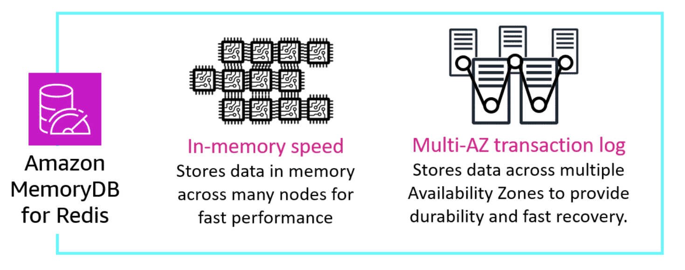

##### Amazon ElastiCache for Redis

`Amazon ElastiCache` for Redis is a service that is commonly used to cache data from other databases and data stores using Redis. Consider using ElastiCache for Redis in the following cases:

* When an application needs a cache to achieve microsecond read and write performance to an existing primary database, such as Amazon RDS
* When it is acceptable to an application that some cached data changes might be lost during a database failure
* When an application needs to use Redis data structures and APIs are needed to access data stored in an existing primary database

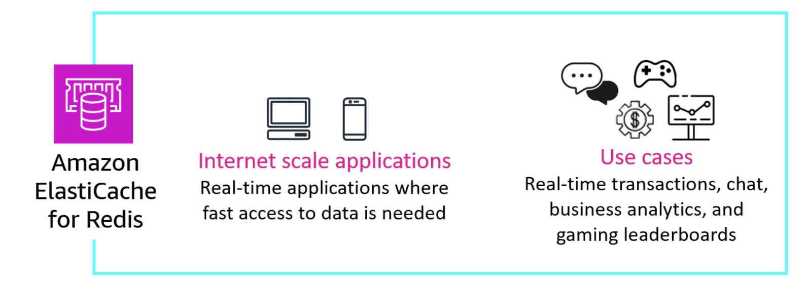

---

Amazon ElastiCache can be used with either Redis or Memcached, two popular, open-source, in-memory data stores known for their ease of use and high performance.

However, there are important differences to consider when choosing between the two. Memcached is designed with simplicity in mind, offering a straightforward key-value store. On the other hand, Redis provides a rich set of features, making it suitable for a wide range of use cases beyond simple caching.

For reference, the following table compares some of the features of Memcached and Redis.

| Characteristics | Memcached | Redis |
| --------------- | --------- | ----- |
| Sub-millisecond latency | Yes | Yes |
| Developer ease of use | Yes | Yes |
| Data partitioning | Yes | Yes |
| Support for several programming languages | Yes | Yes |
| Advanced data structures available | — | Yes |
| Multithreaded architecture | Yes | — |
| Snapshots | — | Yes |
| Replication | — | Yes |
| Transactions | — | Yes |
| Pub-sub support | — | Yes |

```text
Use ElastiCache for applications that are simply caching content from another database. Use MemoryDB for applications that want to use Redis as the primary database.
```

#### Time series databases

Time series databases efficiently collect, synthesize, and derive insights from data that changes over time and with queries that span time intervals. Common application uses for this type of database include the following:

* Analysis of sensor data from industrial and medical telemetry data
* Looking for patterns in stock pricing data
* Tracking order fulfillment times
* Monitoring trouble ticketing systems

`Amazon Timestream` is a fast, scalable, and serverless time series database service that can store and analyze trillions of events. Timestream is optimized for timestamped data, with very high data ingestion capabilities by automatically scaling up or down to adjust capacity and performance.

Timestream also manages the lifecycle of time series data, keeping recent data in memory and moving historical data to a cost-optimized storage tier. The adaptive query engine in Timestream accesses and analyzes recent and historical data together, without having to specify its location. The Timestream built-in time series analytics functions are helpful for identifying trends and patterns in data in near real time.

#### Streaming and messaging services

Streaming and messaging services are not actually databases in their own right. However, they are used as mechanisms to deliver real-time data to, or read aggregated data from, real-time data streaming sources. Amazon real-time data services can be used with Amazon S3 and Amazon DynamoDB to persist streaming data. However, there are three other AWS services that can also be used to handle real-time data ingestion, processing, and analysis from various sources: `Amazon MQ`, `Amazon EventBridge`, and `Amazon Simple Queue Service (Amazon SQS)`.

##### Amazon MQ

Amazon MQ is a managed message broker service. `Message brokers` allow different software systems, often using different programming languages and on different platforms, to communicate and exchange data in real time. Messages are the mechanism used for exchanging the data. A `message` can be any type of data or information that must be transmitted between different components of a distributed system or application. Application logs and events, database changes, incoming sensor data, financial transactions, user actions or commands, and notifications are all examples of messages in this context.

The main components in a message broker service are as follows:

* **Message queue** stores messages until they are delivered to their intended recipients.
* **Message producer** creates a message and places it on the message queue. This component is also called a publisher.
* **Message consumer** receives a message by taking it from the message queue. This component is also called a subscriber.

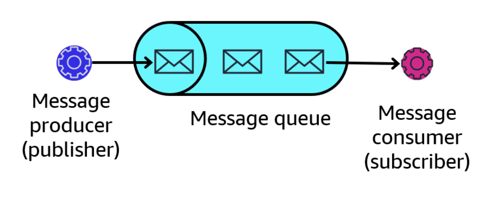

Components of a message broker service.

`Amazon MQ` is a fully managed service, so you don't have to configure or maintain the infrastructure that underlies these components. Amazon MQ also acts as a message broker, connecting producers and consumers to queues, and defining the protocol, message formats, and delivery rules for messages.

For real-time streaming data applications, Amazon MQ can be used to ingest and buffer the incoming streams of data from various sources. The message broker can route and distribute this data to different consumer systems and applications in real time for processing and analytics.

##### EventBridge

`Amazon EventBridge` is a serverless event bus service. An `event bus` is a software architecture pattern that facilitates communication between different services in a distributed system through the use of events.

An event bus architecture is conceptually similar to that of Amazon MQ, except that EventBridge is event driven, and Amazon MQ is message driven. An event bus architecture consists of three components:

* **Event producers** – Components or services that generate events when something of interest occurs, such as a user action, system state change, or external data source update
* **Event consumers** – Components or services that subscribe to specific types of events that they are interested in and receive and process those events from the event bus
* **Event bus** – Central messaging system that receives events from producers, routes them based on predefined rules or subscriptions, and delivers them to interested consumers

Event buses typically provide mechanisms to route events to the appropriate consumers based on event types, topics, or other criteria. They also filter capabilities to ensure that consumers only receive relevant events. In this way, the event bus acts as a central hub or messaging system that decouples event producers from event consumers, allowing them to communicate asynchronously without being tightly coupled. This loose coupling promotes scalability, flexibility, and maintainability of the overall architecture.

Amazon EventBridge simplifies building event-driven applications by acting as a central hub for routing events from AWS services to targets like Lambda functions, Amazon Kinesis streams, or Amazon Simple Queue Service (Amazon SQS) queues.

In application architectures that store real-time streaming data, EventBridge can be used to ingest and route the data streams from various sources to a target like Amazon Kinesis, where the data can be processed, analyzed, and stored for further use.

#### Amazon SQS

`Amazon Simple Queue Service (Amazon SQS)` is a message queuing service that allows for the storage and retrieval of messages in real time. In an application architecture, Amazon SQS can be used to store streaming data that is generated by various components, enabling asynchronous communication and guaranteeing message delivery. Amazon SQS facilitates distributed applications by providing a reliable mechanism for handling large amounts of data and buffering temporary spikes in workload.

Like Amazon MQ, Amazon SQS also uses a publisher-queue-subscriber model. However, Amazon SQS provides for two types of queues.

The `first queue type is a first-in, first-out (FIFO) queue`, which guarantees that items will be processed only once, and in the order in which they entered the queue.

The other queue type is a `standard queue`, which will process each item, but the processing order might not match the order in which the items were queued. Using a standard queue, it's also possible that an item might be delivered to a subscriber more than once.

The appropriate queue type to choose will depend on the requirements of your application.

Real-time data streaming applications can produce massive amounts of data. Amazon SQS can be used to store real-time streaming data by having application components send streaming data to SQS queues.

After it is queued, the data can be consumed and processed by other components in a decoupled, asynchronous way. Producers send data to the queues without waiting for consumers. Consumers can process the data asynchronously as it becomes available.

In this way, SQS queues can be used as temporary buffers to handle high throughput streaming data in a scalable and reliable way, without data loss.

#### Comparing real-time data storage options

The following table summarizes the storage services discussed in this section by listing the benefits, challenges, and typical use cases for each service.

| Database service | Benefits | Challenges | Use cases |
| ---------------- | -------- | ---------- | --------- |
| Amazon DynamoDB | Fast performance, scalability, durability | No complex querying or sorting, eventual transaction consistency only | User profiles, log data and sensor data, real-time analytics |
| Amazon MemoryDB for Redis | Very low latency, high throughput, Multi-AZ deployments | Data loss if system fails, high memory usage, challenging with large datasets | Leaderboards, session management, real-time analytics |
| Amazon ElastiCache for Redis | Low latency, scalability through sharding | Data loss if system fails, high memory usage, challenging with large datasets | Leaderboards, session management, real-time analytics |
| Amazon Timestream | Serverless, scaling storage and throughput independently | Limited query capabilities, no transaction support | Analyzing time series, telemetry, and IoT data |
| Amazon MQ | Managed message broker, supporting popular queueing formats | Limited message size | Financial services, broadcasting |
| Amazon EventBridge| Serverless, integrating many event sources | Limited event transformation capabilities | Microservices integrations and ETL processing |
| Amazon Simple Queue Service (Amazon SQS) | Decouples systems, scales massively | Potentially high latency, limited ordering guarantees | Order management, workload balancing, and distributed task management |

### Evaluating Storage Options

AWS offers many options for storing application data. Choosing the right storage services impacts the application architecture and operational costs. Factors that you should consider when evaluating your storage options include the characteristics of your application data, expected data access patterns, and your application's performance needs.

#### Characteristics of application data

One factor that drives your selection of storage service for your real-time data streaming application is the data itself. Factors to assess include the following:

* The types of data that each service is able to store and process varies by service, for example, text, audio, video, or images.
* The structure of the data in the application should also be assessed. For example, DynamoDB supports key-value and document data models with nested data structures. Amazon MemoryDB for Redis and Amazon ElastiCache for Redis are also key-value stores, but use Redis data structures.
* The data retention requirements of the application is another factor. Most AWS database services can store data indefinitely. But Amazon SQS queues only retain data up to 14 days and Amazon ElastiCache for Memcached is an in-memory store with no built-in retention.

The characteristics of each storage service in terms of different types of real-time streaming application are summarized in the following table.

| Database service | Data types | Data structures | Data retention |
| ---------------- | ---------------- | -------------------- | -------------------- |
| Amazon DynamoDB | Suitable for text data. Can store objects up to 400 KB, but generally not suitable for image, video, or music data. | Key-value and document model, supports nested data structures | Configurable, no upper limit |
| Amazon MemoryDB for Redis | Suitable for text data | Key-value store with data structures like strings, hashes, lists, sets | Configurable, no upper limit |
| Amazon ElastiCache | Suitable for text data | Key-value store with data structures like strings, hashes, lists, sets | No built-in retention |
| Amazon Timestream | Suitable for time series text data | Time series data model, optimized for time series data and metadata | Configurable, no upper limit |
| Amazon MQ | Suitable for transmitting and queuing text, image, video, and music data | Message queues and topics | Configurable, based on broker settings |
| Amazon EventBridge | Suitable for routing and processing text events | Event data (JSON format) | Configurable, no upper limit |
| Amazon Simple Queue Service (Amazon SQS) | Suitable for processing and queuing text, image, video, and music data | Message queues | Configurable, up to 14 days |

```text
For storing large binary data like images, videos, or music files, you would typically use Amazon Simple Storage Service (Amazon S3) or Amazon Elastic File System (Amazon EFS). These services are designed to efficiently store and retrieve large amounts of binary data.
```

#### Expected data access patterns

When choosing a storage service for a real-time data streaming application, it is important to look at how much read and write activity the application will be performing under load. Factors to consider include the following:

* **The amount of read and write activity the application will be performing under load** – For example, if your application expected read and write activity is going to be balanced between read and write workloads, DynamoDB and Amazon SQS are good choices.
* **The frequency and volume with which streaming data will be ingested into the system** – If your application's data ingestion volume and frequency is expected to be high, DynamoDB, Timestream, and EventBridge are a good fit.
* **The application's requirements for querying and analyzing the real-time data after it is stored** – If your application must be optimized for time series data analysis and queries, Timestream is a good solution.

The data access pattern characteristics of each storage service for real-time streaming data applications are summarized in the following table.

| Database service | Read and write activity | Data ingestion volume and frequency | Query and analysis capabilities |
| ---------------- | -------------------- | -------------------- | -------------------- |
| Amazon DynamoDB | Balanced reads and writes | Volume: High, hundreds of gigabytes or terabytes per hour or day<br>Frequency: High, using constant or near-constant streams of data | Limited query capabilities |
| Amazon MemoryDB for Redis | Read-heavy, with 10:1 ratio of reads to writes, and thousands of read requests per second or more  | Volume: Moderate, gigabytes or tens of gigabytes per hour or day<br>Frequency: High, using constant or near-constant streams of data | Limited to Redis data structures and operations |
| Amazon ElastiCache | Read-heavy, with 10:1 ratio of reads to writes, and thousands of read requests per second or more | Volume: Moderate, gigabytes or tens of gigabytes per hour or day<br>Frequency: High, using constant or near-constant streams of data | Limited to Redis or Memcached data structures and operations |
| Amazon Timestream | Write-heavy, with a 10:1 ratio or writes to reads, and thousands of write requests per second or more | Volume: High, hundreds of gigabytes or terabytes per hour or day<br>Frequency: High, using constant or near-constant streams of data | Optimized for time series data analysis and queries |
| Amazon MQ | Balanced reads and writes | Volume: Moderate, gigabytes or tens of gigabytes per hour or day<br>Frequency: High, using constant or near-constant streams of data | Limited to message routing and delivery |
| Amazon EventBridge | Write-heavy, with a 10:1 ratio or writes to reads, and thousands of write requests per second or more | Volume: High, hundreds of gigabytes or terabytes per hour or day<br>Frequency: High, using constant or near-constant streams of data | Limited to event routing and delivery |
| Amazon Simple Queue Service (Amazon SQS)| Balanced reads and writes | Volume: Moderate, gigabytes or tens of gigabytes per hour or day<br>Frequency: Moderate, using occasionally streaming data or periodic bursts of data| Limited to message queueing and delivery |

#### Application performance requirements

Understanding the performance requirements for your application is important when selecting a storage service for a real-time data streaming application. Considerations include the following:

* Evaluate how fast data reads and writes have to occur to meet the application's performance requirements. `Latency` is the delay between the time that a request to read or write data is made, and the time when the data is received or written. MemoryDB and ElastiCache are the fastest storage services, offering sub-millisecond latency due to their in-memory nature.
* The application scalability requirements are another consideration when choosing a storage service. `Scalability` refers to a service's ability to grow as demands on the service grows. Fortunately, every AWS service is designed for scalability, and this is true for DynamoDB, MemoryDB, ElastiCache, Timestream, EventBridge, and Amazon SQS.
* The application's requirements for the durability and availability of your application data must be examined. For example, DynamoDB, MemoryDB, Timestream, Amazon MQ, and Amazon SQS provide durable data storage mechanisms that are also high availability through replication across multiple Availability Zones.

The performance characteristics of each storage service for real-time streaming data applications are summarized in the following table.

| Database service | Read and write latency | Scalability | Durability and availability |
| ---------------- | ---------------------- | ----------- | --------------------------- |
| Amazon DynamoDB | Low (single-digit milliseconds) | Highly scalable | Durable, Multi-AZ replication |
| Amazon MemoryDB for Redis | Very low (sub-millisecond) | Highly scalable | Durable, Multi-AZ replication |
| Amazon ElastiCache for Redis | Very low (sub-millisecond) | Highly scalable | Not durable, in-memory store |
| Amazon ElastiCache for Memcached | Very low (sub-millisecond) | Highly scalable | Durable, in-memory store |
| Amazon Timestream | Low (single-digit milliseconds) | Highly scalable | Durable, Multi-AZ replication |
| Amazon MQ | Moderate (depends on broker configuration) | Scalable (by adding brokers) | Durable, messages persisted to disk |
| Amazon EventBridge | Low (milliseconds) | Highly scalable | Not durable, event delivery is best effort |
| Amazon Simple Queue Service (Amazon SQS) | Low (milliseconds) | Highly scalable | Durable, messages persisted to disk |

### Activity: Selecting the Appropriate Storage Option

The AnyCompany team is designing a new mobile app to support a promotional event. The app will allow customers to use their mobile device to submit rebates for items they have purchased during the promotion. This application has three core functions.

#### The first function is to collect the customer rebate data. This data is continuously streamed into the application from the customer's mobile device, in real-time, as the customer makes their purchases. Which AWS service should we consider if we want to ingest real-time data from customers?

* Amazon Kinesis Data Streams

Wrong answers:

* Amazon EMR
* Amazon Timestream
* Amazon DynamoDB

##### Explanation

Amazon Kinesis Data Streams can handle millions of records per second, making it suitable for ingesting continuous data streams from the customer mobile devices.

#### The second function the application needs to perform is super-fast lookups to confirm the customer is a Rewards Club Member before processing the rebate. Which AWS service should we consider for ensuring these lookup operations have sub-millisecond latency?

* Amazon MemoryDB for Redis

Wrong answers:

* Amazon DynamoDB
* Amazon SQS

##### Explanation

Amazon MemoryDB for Redis provides sub-millisecond response times by caching the real-time data in memory. Amazon ElastiCache for Redis is another option that could meet this requirement.

#### The application needs to perform is submission of the rebates to an external financial application. The financial application will issue the rebate funds to the customer. The rebate issuing process is initiated every 15 minutes to ensure the timely processing of a customer's submitted rebate claim. Which AWS service should we consider for storing the real-time rebate requests until the rebate issuance operation is started?

* Amazon SQS

Wrong answers:

* Amazon DynamoDB
* Amazon OpenSearch Service

##### Explanation

Amazon SQS allows you to decouple the rebate submission process from the financial application's refund process. This decoupling helps to improve the scalability and reliability of both applications, as neither of them is reliant on the other's availability and processing speed.

---

### Knowledge Check

#### Which layer of the five logical data architecture layers is responsible for transforming data from the data stream storage layer?

* Data stream processing

Wrong answers

* Data stream source
* Data stream ingestion
* Data stream destination

##### Explanation

`Data stream processing` layer provides the ability to collect data from tens of thousands of data sources and ingest in near real time.

The other responses are incorrect because:

* The source layer is responsible for providing data.
* The ingestion layer is responsible for pulling in data.
* The destination layer is responsible for using data.

#### How are Amazon Managed Service for Apache Flink and Amazon Kinesis Data Streams related?

* Kinesis Data Streams acts as the source of streaming data, from which Amazon Managed Service for Apache Flink reads to process the data using SQL or Java code before outputting the results to various destinations.

Wrong answers:

* Kinesis Data Streams reads data from streaming sources and passes it to Amazon Managed Service for Apache Flink, where the data is analyzed using Amazon DynamoDB.
* Amazon Managed Service for Apache Flink acts as the source of streaming data, from which Kinesis Data Streams reads to process the data using SQL or Java code before outputting the results to various destinations.
* Kinesis Data Streams reads data from streaming sources and passes it to Amazon Managed Service for Apache Flink, where the data is analyzed using Amazon CloudWatch Logs.

##### Explanation

Kinesis Data Streams and Amazon Managed Service for Apache Flink services are often used together because they provide complimentary capabilities for supporting real-time analytics. **Kinesis Data Streams acts as the source of streaming data, from which Amazon Managed Service for Apache Flink reads to process the data using SQL or Java code before outputting the results to various destinations.**

The other responses are incorrect because:

* DynamoDB is not a data analysis tool. It is a key-value data store.
* CloudWatch Logs is not used for analyzing data. Is is used to centralize the logs from systems, applications, and AWS services.

#### A developer is looking for a way to improve the performance of an application's search and analytics capabilities on real-time data. The application uses Amazon Kinesis Data Streams to deliver the real-time data. Which service should the developer consider adding to the application architecture to speed up querying and analysis of streaming data as it arrives?

* Amazon OpenSearch Service

Wrong answers:

* Amazon ElastiCache for Redis
* Amazon DynamoDB
* Amazon MemoryDB for Redis

##### Explanation

Amazon OpenSearch Service integrates with Amazon Kinesis Data Streams to enhance lookups on streaming data by indexing and storing data in real time for fast search and analytics.

The other responses are incorrect because:

* Both Amazon ElastiCache for Redis and Amazon MemoryDB for Redis are data caching mechanisms. They do not enhance the performance of an application's search and analytics capabilities on real-time data.
* Amazon DynamoDB is a NoSQL database for storing unstructured data using a key-value format. It provides fast read and write capabilities, but it does not index data and cache streaming data in real time.

#### An application that uses real-time streaming to report on traffic conditions is experiencing performance issues. The performance issues usually occur during busy traffic times in the morning and evening. The application architect thinks that caching the most recent traffic data in memory will improve the application performance during these peak usage times. Which services should the application architect consider adding to the application architecture to achieve this design? (Select TWO.)

* Add Amazon ElastiCache to the architecture.
* Add Amazon MemoryDB for Redis to the architecture.

Wrong answers:

* Add Amazon CloudFront to the architecture.
* Add Amazon MQ to the architecture.
* Add Amazon EventBridge to the architecture.

##### Explanation

**Amazon ElastiCache** and **Amazon MemoryDB for Redis** services can provide sub-millisecond response times for queries against data cached in memory.

The other responses are incorrect because:

* Amazon CloudFront is used to improve the performance of accessing static content, not real-time streaming data.
* Amazon MQ is not a caching mechanism. It is used to pass data between dissimilar systems using a queueing system.
* Amazon EventBridge is not a caching mechanism. It is used to pass events between AWS services.

#### A developer is considering real-time streaming data storage options for a new application. Which statements about the streaming data storage options are correct? (Select THREE.)

* Some AWS storage options for streaming data support only text data.
* When sub-millisecond latency is required, Amazon MemoryDB for Redis and Amazon ElastiCache for Redis should be considered.
* Consider using Amazon DynamoDB if the access pattern for the streaming data is expected to have balanced reads and writes, with high data ingestion volume and speed.

Wrong answers:

* Neither Amazon MemoryDB for Redis nor Amazon MQ provide durable data storage.
* Amazon MQ is suitable for transmitting and queuing all data types except text.
* When data ingestion volume and frequency are both high, Amazon Simple Queue Service (Amazon SQS) is the best option for processing streaming data.

##### Explanation

The other responses are incorrect because:

* Neither Amazon MemoryDB for Redis nor Amazon MQ provide durable data storage is incorrect because Amazon MQ does provide durable storage.
* Amazon MQ is suitable for transmitting and queuing all data types except text is incorrect. Amazon MQ can also process text data.
* When data ingestion volume and frequency are both high, Amazon SQS is the best option for processing streaming data is incorrect because Amazon SQS is a queuing mechanism, which is better suited to slow to moderate data ingestion volume and frequency.

---

### Summary

#### Five-layer architecture model

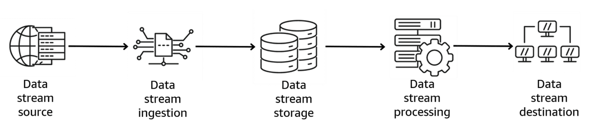

Standard data streaming architecture model.

A standard five-layer architecture model is used by many applications to handle stream processing of real-time data.

Examples of applications with these architecture characteristics were discussed. These included financial applications like those for securities trading, fraud detection, and inventory management. Examples of technology-supporting applications like networking monitors, cybersecurity tools, and telecommunications were also discussed.

#### AWS Services for real-time appliucation architecture layers

AWS offers several services that are designed to handle one or more of the five architecture layers of a real-time application.

These services include `Amazon Kinesis Data Streams`, `Amazon Data Firehose`, `Amazon Managed Service for Apache Flink`, and `Amazon Managed Streaming for Apache Kafka (Amazon MSK)`. `Amazon OpenSearch Service`, `Amazon DynamoDB`, and `GraphQL` are also examples of services that are used in real-time application architectures.

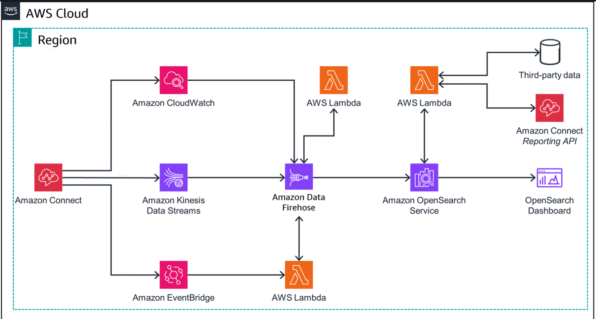

The two in-memory databases, Amazon ElastiCache and Amazon MemoryDB for Redis are also used to support streaming data requirements.

Decorative image of an application architecture that uses real-time and data streaming AWS services.

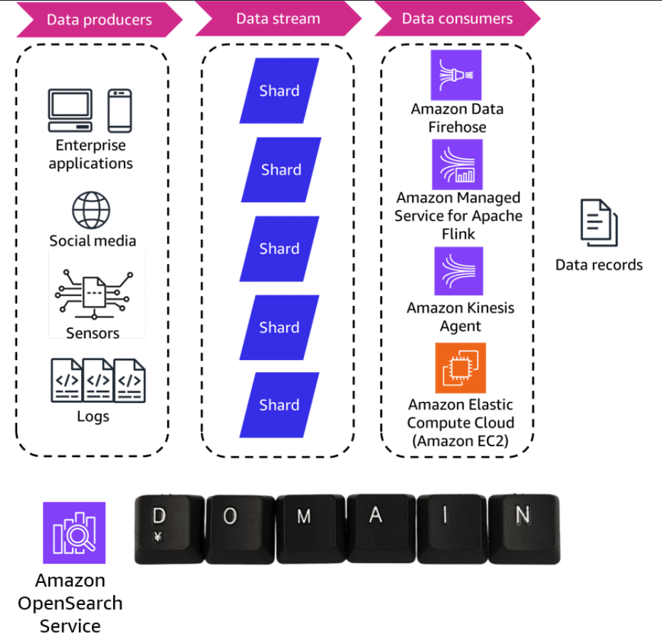

In particular, the Amazon Kinesis family of services is heavily used in real-time data streaming application architectures. Examples of this included the following:

* Monitoring machinery in real time using Amazon Data Firehose
* Streaming data from an SaaS application using Amazon Kinesis Data Streams
* Making real-time recommendations using Amazon OpenSearch Service
* Supporting customer call center management with OpenSearch Service

The operational details of Amazon Kinesis Data Streams begin with a data producer, then PutRecord API, shards, data streams, data blobs, sequence numbers, and data records. Data consumers are at the end of the processing stream.

An OpenSearch Service domain, master nodes, data nodes, and domain endpoints all comprise the operational details of the Amazon OpenSearch Service. The OpenSearch service is frequently used in conjunction with Kinesis Data Streams.

#### DynamoDB and in-memory databases like ElastiCache and MemoryDB om real-time web applications

Key-value databases like DynamoDB and in-memory databases like ElastiCache and MemoryDB are commonly used for real-time web applications. Amazon Timestream is a fast, scalable, and serverless time series database optimized for storing and analyzing timestamped data. Services like Amazon MQ, EventBridge, and Amazon SQS can be used for real-time data ingestion, processing, and analysis from various sources.

AWS offers various storage services for real-time data streaming. Choosing the right one impacts application architecture and operational costs. Factors to consider include data characteristics, access patterns, performance needs, data types, data structure, retention requirements, read and write activity, ingestion volume and frequency, and querying and analysis requirements.

#### Lab recap

In the *Navigating Through Kinesis* lab, you have created an AWS Lambda function from a blueprint and created a stream using Amazon Kinesis Data Streams.

You also invoked the function with data from your stream and monitored the process with Amazon CloudWatch.

You also experienced the basics of event-driven programming using Amazon DynamoDB, the DynamoDB Streams feature, and AWS Lambda.

---

### Additional Resources

* [Event Sourcing Pattern](https://docs.aws.amazon.com/prescriptive-guidance/latest/cloud-design-patterns/event-sourcing.html)

    Additional details on how event sourcing can be used to maintain a history of state changes, and promotes auditability, traceability, and the ability to analyze past states.

* [Comparing In-Memory Database Options](https://aws.amazon.com/nosql/in-memory/)

    A discussion of how ElastiCache for Redis is commonly used as a cache, and Amazon MemoryDB is a durable database designed for applications with high performance requirements.

* [Creating AWS Serverless Batch Processing Architectures](https://aws.amazon.com/blogs/compute/creating-aws-serverless-batch-processing-architectures/)

    A blog post that explains a serverless solution for batch processing to implement a file intake process. This example uses AWS Step Functions for orchestration, AWS Lambda functions for on-demand instance compute, Amazon S3 for storing the data, and Amazon Simple Email Service (Amazon SES) for sending emails.

* [Architectural Patterns for Real-Time Analytics Using Amazon Kinesis Data Streams, Part 1](https://aws.amazon.com/blogs/big-data/architectural-patterns-for-real-time-analytics-using-amazon-kinesis-data-streams-part-1/)

    A review of two common architectural patterns that use Amazon Kinesis Data Streams for real-time data analytics.

* [NoSQL Databases](https://aws.amazon.com/nosql/)

    More information on how NoSQL databases are purpose-built for specific data models and stores data.

---
