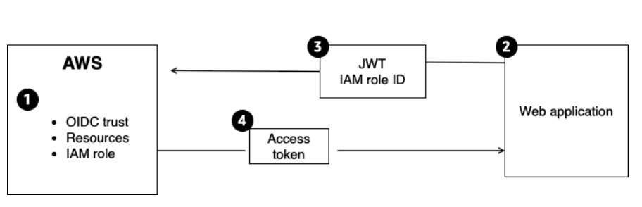
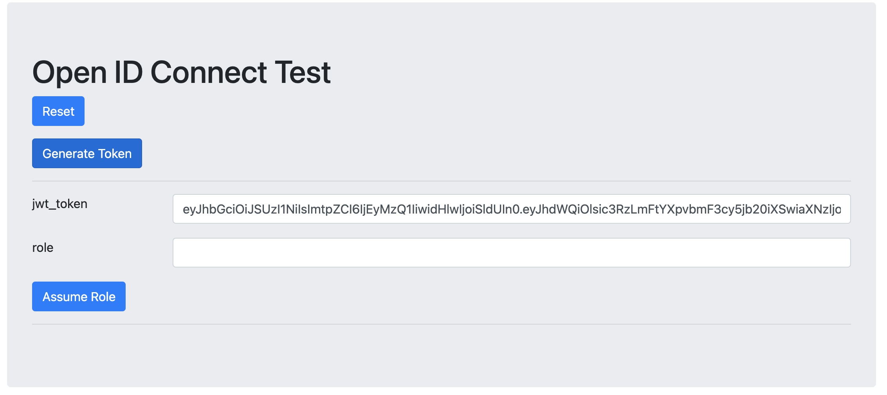
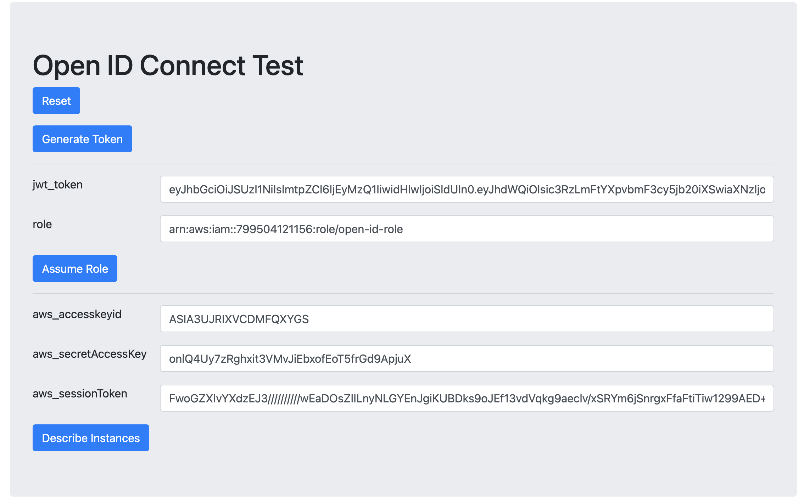
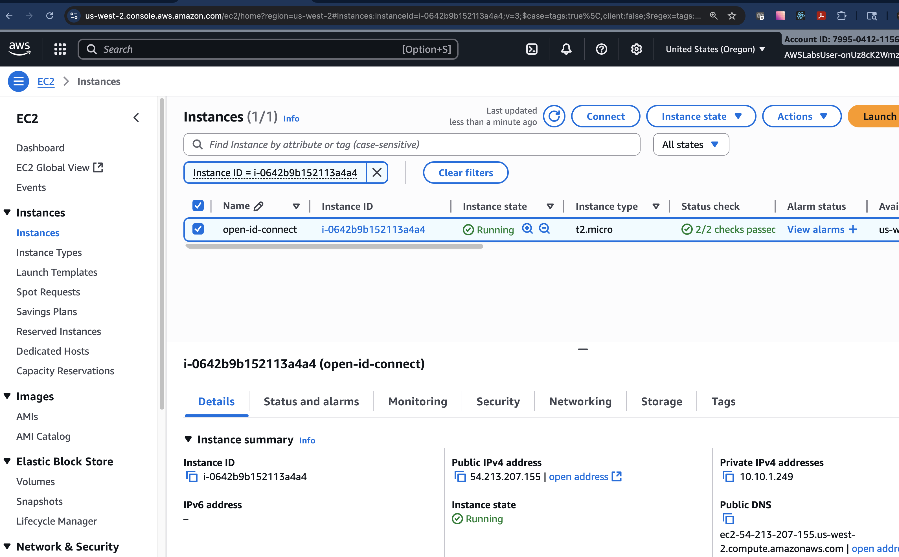

# Implementing an OpenID Connect Identity Provider for Enhanced Security and Identity Management

* back to AWS Cloud Institute repo's root [aci.md](../../aci.md)
* back to [AWS Cloud Fundamentals 2](../aws-cloud-fundamentals-2.md)
* back to repo's main [README.md](../../../../README.md)

## Resources

* ProviderURL

```text
https://labstack-bb14ad79-02ae-4534-aaeb-7960-staticbucket-7ejniycncsv7.s3.amazonaws.com/identity-application/
```

* Website

```text
http://ec2-54-213-207-155.us-west-2.compute.amazonaws.com
```

* Created in the lab open-id-role ARN

```text
arn:aws:iam::799504121156:role/open-id-role
```

---

## Lab Overview

This lab demonstrates how to create an OpenID Connect (OIDC) identity provider (IdP), and connect it to a third-party application to use short-term credentials. When you use AWS Identity and Access Management (IAM) roles with OIDC identity providers, you have a trusted way to provide access to your Amazon Web Services (AWS) resources.

### Objectives

By the end of this lab, you will be able to do the following:

Create an OIDC identity provider in IAM.
Create an IAM role for the identity provider.
Generate a JSON Web Token (JWT) through a web application to test short-term credentials.
Prerequisites
This lab requires the following:

Access to a computer with Microsoft Windows, macOS X, or Linux (Ubuntu, SUSE, or Red Hat)
A modern internet browser such as Chrome or Firefox
Icon key
Various icons are used throughout this lab to call attention to different types of instructions and notes. The following list explains the purpose for each icon:

 Caution: Information of special interest or importance (not so important to cause problems with the equipment or data if you miss it, but it could result in the need to repeat certain steps)
 Expected output: A sample output that you can use to verify the output of a command or edited file
 Note: Additional information or elaboration on a point
 Copy edit: A time when copying a command, script, or other text to a text editor (to edit specific variables within it) might be easier than editing directly in the command line or terminal
 Task complete: A conclusion or summary point in the lab
 Warning: An action that is irreversible and could potentially impact the failure of a command or process (including warnings about configurations that cannot be changed after they are made)
Start lab
To launch the lab, at the top of the page, choose Start Lab.

 Caution: You must wait for the provisioned AWS services to be ready before you can continue.

To open the lab, choose Open Console .

You are automatically signed in to the AWS Management Console in a new web browser tab.

 Warning: Do not change the Region unless instructed.

Common sign-in errors
Error: Choosing Start Lab has no effect
In some cases, certain pop-up or script blocker web browser extensions might prevent the Start Lab button from working as intended. If you experience an issue starting the lab:

Add the lab domain name to your pop-up or script blocker’s allow list or turn it off.
Refresh the page and try again.
Lab environment
The following is a diagram of the final solution and flow when the lab is completed.



1. List of AWS resources including 

    * OIDC Trust
    * AWS Services
    * IAM Role

2. Web Application you will authenticate to.
3. JSON web token and IAM role ID that will be added to the web app.
4. Secure access token calling aws services via web application.

---

### Services and technologies used in this lab

IAM OIDC identity providers (IdPs) when used with AWS provide a more secure, scalable, and user-friendly approach to managing access to your AWS resources. This is especially important in scenarios where you need to integrate with external IdPs or use federated identities. You use an IAM OIDC IdP when you want to establish trust between an OIDC-compatible IdP and your AWS account. This is useful when creating a mobile app or web application that requires access to AWS resources, but you don’t want to create custom sign-in code or manage your own user identities.

JSON Web Tokens (JWTs) are an open standard (RFC 7519) for securely transmitting information between parties as a JSON object. They are commonly used for authentication and authorization purposes.

IAM roles are similar to IAM users, but they are intended to be assumable by anyone who needs them. Unlike IAM users, roles do not have standard long-term credentials such as a password or access keys. Instead, when you assume a role, it provides you with temporary security credentials for your role session.

AWS services not used in this lab
AWS service capabilities used in this lab are limited to what the lab requires. Expect errors when accessing other services or performing actions beyond those provided in this lab guide.

Task 1: Create the OIDC Idp in IAM
In this task, you create an OIDC IdP through IAM. This will then be connected to the web application later in the lab to generate the JWT to assume an IAM role with short-term credentials.

On the AWS Management Console, in the search box, search for and choose IAM.

In the left navigation pane, choose Identity providers.

Choose Add provider.

In the Provider details section, configure the following values:

For Provider type, select the OpenID Connect option.
In the Provider URL text box, replace the https:// placeholder value with the ProviderURL value that is listed to the left of these instructions.
For Audience, enter sts.amazonaws.com.
 Note: For AWS OIDC federation, the audience is usually set to sts.amazonaws.com, which represents the AWS Security Token Service (AWS STS). This is because the OIDC IdP will be issuing JWTs that will be exchanged for temporary AWS security credentials through the AWS STS.

Choose Add provider.

IAM will attempt to retrieve and use the top intermediate certificate authority (CA) thumbprint of the OIDC IdP server certificate to create the IAM OIDC identity provider.

 Expected output: A banner message like the following is displayed at the top of the page:  oidc-lab-staticbucket-r05vbjsfgpap.s3.amazonaws.com/identity-application/ added. You must assign an IAM role to start using this provider.

 Task complete: In this task, you created the OIDC IdP.

Task 2: Create the OIDC IAM role
In this task, you must create one or more IAM roles. A role is an identity in AWS that doesn’t have its own credentials (as a user does). But in this context, a role is dynamically assigned to a federated user that is authenticated by your organization’s IdP. The role permits your organization’s IdP to request temporary security credentials for access to AWS. The policies assigned to the role determine what the federated users are allowed to do in AWS.

Choose the Assign role button that is provided within the green banner at the top of the page.

Leave the default Create a new role option selected, and choose Next.

In the Trusted entity type section, leave the default Web identity option selected.

In the Web identity section, leave the prepopulated identity provider selected, and in the Audience dropdown, choose sts.amazonaws.com.

Choose Next.

In the Permissions policies search box, enter AmazonEC2ReadOnlyAccess.

Select the checkbox next to the AmazonEC2ReadOnlyAccess policy name.

Select the  Set permissions boundary - optional option to expand the dropdown.

Select the Use a permissions boundary to control the maximum role permissions option.

In the Permissions policies search box, enter AmazonEC2ReadOnlyAccess.

Select the radio button next to the AmazonEC2ReadOnlyAccess policy name.

Choose Next.

For Role name, enter open-id-role.

Review the trust policy to see the allowed effect of the role and what conditions must be met.

Example trust policy:

```json
{
    "Version": "2012-10-17",
    "Statement": [
        {
            "Effect": "Allow",
            "Action": "sts:AssumeRoleWithWebIdentity",
            "Principal": {
                "Federated": "arn:aws:iam::053653851050:oidc-provider/oidc-staticbucket-jltmpj56bibv.s3.amazonaws.com/identity-application/"
            },
            "Condition": {
                "StringEquals": {
                    "oidc-staticbucket-jltmpj56bibv.s3.amazonaws.com/identity-application/:aud": [
                        "sts.amazonaws.com"
                    ]
                }
            }
        }
    ]
}
```

 Note: A trust policy is a policy document that defines the trusted entities that can assume an IAM role. A trust policy specifies the principals (users, roles, or services) that are allowed to assume the role.

Choose Create role.

 Expected output: A banner message like the following is displayed at the top of the page:  Role open-id-role created.

From within the green success banner, choose the View role button.

 Note: The lab environment might display a permissions error banner. The provided AWS service capabilities are limited to the lab’s requirements.

 Copy edit: Copy the Amazon Resource Name (ARN) of the IAM role and paste it into a text editor for later use.

 Task complete: In this task you created the IAM role to be used with the web application to access the EC2 instance.

### Task 3: Generate a JWT to assume the IAM role with short-term credentials, and test functionality

In this task, you open the web application and configure it for authentication with AWS services. You do this by generating a JWT and adding in the IAM role ARN to the website. After this has been done, you will be granted short-term credentials that allow the EC2DescribeInstances action.

To open the web application, copy the Website value from the list to the left of these instructions, and paste it into a new web browser tab.

 Note: This is a simulated web application that will show how to configure authentication with an OIDC IdP.


To generate the JWT, choose the Generate token button.



Paste jwt.io into a new browser tab, and press Enter.

 Note: This site will be used to break down the structure of a JWT and see what is inside of the token.

Copy the token from the jwt_token text box on the simulated web application, paste it into the ENCODED VALUE text box on the jwt.io site, and then view the DECODED PAYLOAD text box.

 Note: The payload is a crucial part of a JWT. The payload is the section of the JWT that contains the actual data, or claims, about the user or application.

The following is an example output that should look similar:

```json
{
  "aud": [
    "sts.amazonaws.com"
  ],
  "iss": "https://oidc-staticbucket-jltmpj56bibv.s3.amazonaws.com/identity-application/",
  "iat": "1715713864",
  "exp": 1715713924,
  "sub": "subject"
}
```

JWT payload breakdown:

aud (audience) identifies the recipients that the JWT is intended for, in this case, AWS (sts.amazonaws.com).
iss (issuer) identifies the principal that issued the JWT, in this case, the web application that is being hosted in an Amazon Simple Storage Service (Amazon S3) bucket.
iat (issued at) identifies the time at which the JWT was issued.
exp (expiration time) identifies the expiration time on or after which the JWT must not be accepted for processing.
Close the browser tab that has the jwt.io site open, and return to the web application browser tab.

Copy and paste the open-id-role ARN that you copied earlier from the text editor into the role text box, and then choose Assume Role.

 Note: If you receive an error message, choose the Reset option and try again.



This will call the sts:AssumeRoleWithWebIdentity action. That will then provide the temporary credentials, which can be seen on the webpage (aws_accesskeyid, aws_secretAccessKey, and aws_sessionToken).

Choose the **Describe Instances** button.

* Expected output:

```json
{'Reservations': [{'Groups': [], 'Instances': [{'AmiLaunchIndex': 0, 'ImageId': 'ami-0caa91d6b7bee0ed0', 'InstanceId': 'i-0642b9b152113a4a4', 'InstanceType': 't2.micro', 'LaunchTime': datetime.datetime(2025, 10, 12, 16, 40, 43, tzinfo=tzlocal()), 'Monitoring': {'State': 'disabled'}, 'Placement': {'AvailabilityZone': 'us-west-2a', 'GroupName': '', 'Tenancy': 'default'}, 'PrivateDnsName': 'ip-10-10-1-249.us-west-2.compute.internal', 'PrivateIpAddress': '10.10.1.249', 'ProductCodes': [], 'PublicDnsName': 'ec2-54-213-207-155.us-west-2.compute.amazonaws.com', 'PublicIpAddress': '54.213.207.155', 'State': {'Code': 16, 'Name': 'running'}, 'StateTransitionReason': '', 'SubnetId': 'subnet-0f9b19a9f225435ce', 'VpcId': 'vpc-0d10559175438d917', 'Architecture': 'x86_64', 'BlockDeviceMappings': [{'DeviceName': '/dev/xvda', 'Ebs': {'AttachTime': datetime.datetime(2025, 10, 12, 16, 40, 44, tzinfo=tzlocal()), 'DeleteOnTermination': True, 'Status': 'attached', 'VolumeId': 'vol-0ac1f37c82d0f8170'}}], 'ClientToken': 'd974a5a2-4f87-83de-e76e-378855af5d28', 'EbsOptimized': False, 'EnaSupport': True, 'Hypervisor': 'xen', 'IamInstanceProfile': {'Arn': 'arn:aws:iam::799504121156:instance-profile/LabStack-bb14ad79-02ae-4534-aaeb-796047619249-onUz8cK2WmzZ1s55uzxB9S-0-InstanceProfile-N5zviLYa4Rmy', 'Id': 'AIPA3UJRIXVCO6ZSAG3MV'}, 'NetworkInterfaces': [{'Association': {'IpOwnerId': 'amazon', 'PublicDnsName': 'ec2-54-213-207-155.us-west-2.compute.amazonaws.com', 'PublicIp': '54.213.207.155'}, 'Attachment': {'AttachTime': datetime.datetime(2025, 10, 12, 16, 40, 43, tzinfo=tzlocal()), 'AttachmentId': 'eni-attach-0d9ec256fcd34bcbd', 'DeleteOnTermination': True, 'DeviceIndex': 0, 'Status': 'attached', 'NetworkCardIndex': 0}, 'Description': '', 'Groups': [{'GroupName': 'LabStack-bb14ad79-02ae-4534-aaeb-796047619249-onUz8cK2WmzZ1s55uzxB9S-0-WebServerSG-slKmNNKBCdU5', 'GroupId': 'sg-064909c3bd62f5274'}], 'Ipv6Addresses': [], 'MacAddress': '06:94:1f:bf:38:ed', 'NetworkInterfaceId': 'eni-078b983260d6a9445', 'OwnerId': '799504121156', 'PrivateDnsName': 'ip-10-10-1-249.us-west-2.compute.internal', 'PrivateIpAddress': '10.10.1.249', 'PrivateIpAddresses': [{'Association': {'IpOwnerId': 'amazon', 'PublicDnsName': 'ec2-54-213-207-155.us-west-2.compute.amazonaws.com', 'PublicIp': '54.213.207.155'}, 'Primary': True, 'PrivateDnsName': 'ip-10-10-1-249.us-west-2.compute.internal', 'PrivateIpAddress': '10.10.1.249'}], 'SourceDestCheck': True, 'Status': 'in-use', 'SubnetId': 'subnet-0f9b19a9f225435ce', 'VpcId': 'vpc-0d10559175438d917', 'InterfaceType': 'interface'}], 'RootDeviceName': '/dev/xvda', 'RootDeviceType': 'ebs', 'SecurityGroups': [{'GroupName': 'LabStack-bb14ad79-02ae-4534-aaeb-796047619249-onUz8cK2WmzZ1s55uzxB9S-0-WebServerSG-slKmNNKBCdU5', 'GroupId': 'sg-064909c3bd62f5274'}], 'SourceDestCheck': True, 'Tags': [{'Key': 'Name', 'Value': 'open-id-connect'}, {'Key': 'aws:cloudformation:logical-id', 'Value': 'AppInstanceOpenId'}, {'Key': 'aws:cloudformation:stack-id', 'Value': 'arn:aws:cloudformation:us-west-2:799504121156:stack/LabStack-bb14ad79-02ae-4534-aaeb-796047619249-onUz8cK2WmzZ1s55uzxB9S-0/f43186d0-a789-11f0-9940-02effd958cef'}, {'Key': 'aws:cloudformation:stack-name', 'Value': 'LabStack-bb14ad79-02ae-4534-aaeb-796047619249-onUz8cK2WmzZ1s55uzxB9S-0'}], 'VirtualizationType': 'hvm', 'CpuOptions': {'CoreCount': 1, 'ThreadsPerCore': 1}, 'CapacityReservationSpecification': {'CapacityReservationPreference': 'open'}, 'HibernationOptions': {'Configured': False}, 'MetadataOptions': {'State': 'applied', 'HttpTokens': 'required', 'HttpPutResponseHopLimit': 2, 'HttpEndpoint': 'enabled', 'HttpProtocolIpv6': 'disabled', 'InstanceMetadataTags': 'disabled'}, 'EnclaveOptions': {'Enabled': False}, 'BootMode': 'uefi-preferred', 'PlatformDetails': 'Linux/UNIX', 'UsageOperation': 'RunInstances', 'UsageOperationUpdateTime': datetime.datetime(2025, 10, 12, 16, 40, 43, tzinfo=tzlocal()), 'PrivateDnsNameOptions': {'HostnameType': 'ip-name', 'EnableResourceNameDnsARecord': False, 'EnableResourceNameDnsAAAARecord': False}, 'MaintenanceOptions': {'AutoRecovery': 'default'}, 'CurrentInstanceBootMode': 'legacy-bios'}], 'OwnerId': '799504121156', 'RequesterId': '658754138699', 'ReservationId': 'r-0109158ec0e6e7bb1'}], 'ResponseMetadata': {'RequestId': '4c8cab12-dc44-480d-83cc-ad34da4ac659', 'HTTPStatusCode': 200, 'HTTPHeaders': {'x-amzn-requestid': '4c8cab12-dc44-480d-83cc-ad34da4ac659', 'cache-control': 'no-cache, no-store', 'strict-transport-security': 'max-age=31536000; includeSubDomains', 'vary': 'accept-encoding', 'content-type': 'text/xml;charset=UTF-8', 'content-length': '6278', 'date': 'Sun, 12 Oct 2025 19:42:13 GMT', 'server': 'AmazonEC2'}, 'RetryAttempts': 0}}
```

Image that shows a successful EC2 describe instance call.

Image description: The previous image shows an example output of what a successful Amazon Elastic Compute Cloud (Amazon EC2) describe instance call will look like. The InstanceId property of the output shows an instance ID confirming that the short-term credentials associated with the OIDC IdP worked properly.

Make note of the InstanceId value by copying and pasting it into a text editor. The ID will look similar to i-06c31917bb15e132c.

Navigate back to the AWS Management Console browser tab, and in the search box, search for and choose EC2.

From the left side of the page, choose Instances.

Confirm that the Instance ID of the open-id-connect EC2 instance is the same as the previously copied instance ID from the web application.



This confirms the success of the temporary credentials working from the web application because it has successfully called the EC2DescribeInstance action.

 Task complete: In this task you configured the web app to have short term aws credentials, by generating a JWT and adding the iam role ARN to the web app.

Conclusion
You have successfully done the following:

Created an OIDC identity provider in IAM
Created an IAM role for the identity provider
Generated a JWT through a web application to test short-term credentials
End lab
Follow these steps to close the console and end your lab.

Return to the AWS Management Console.

At the upper-right corner of the page, choose AWSLabsUser, and then choose Sign out.

Choose End Lab and then confirm that you want to end your lab.

---

### Additional resources

* [What Is OpenID Connect](https://openid.net/developers/how-connect-works/)
* [OIDC Federation](https://docs.aws.amazon.com/IAM/latest/UserGuide/id_roles_providers_oidc.html)
