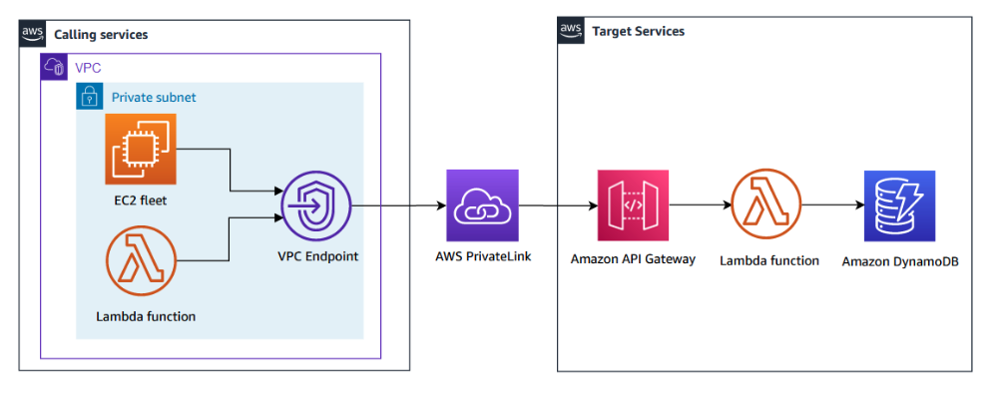
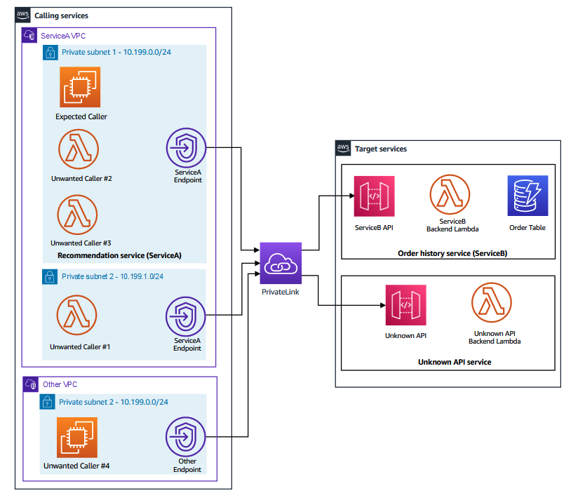

# Zero Trust Architecture for Service-To-Service Workloads

* back to AWS Cloud Institute repo's root [aci.md](../../aci.md)
* back to [AWS Cloud Fundamentals 2](../aws-cloud-fundamentals-2.md)
* back to repo's main [README.md](../../../../README.md)

## Resources

* APIGWVPCEndpointID `vpce-066503802d616616a`
* APIMethodARN `arn:aws:execute-api:us-west-2:625460125317:91vfip1ejf/*/GET/orders`
* AWSAccountID `625460125317`
* AwsRegionCode `us-west-2`
* ServiceAInstanceRoleARN `arn:aws:iam::625460125317:role/instance-role`
* ServiceAInstanceSSMSessionURL `https://us-west-2.console.aws.amazon.com/systems-manager/session-manager/i-0b3e9217223e38bab?region=us-west-2`

---

## Lab Overview

This lab is intended to explain the principles of Zero Trust model and how you can use AWS various services and features to implement these principles in the most appropriate way for their workloads. The lab focuses on applying Zero Trust principles to the service-to-service architectures used in many micro-architecture or distributed environments today.

### Objectives

By the end of this lab, you will be able to do the following:

Review the lab scenario current state service-to-service architecture.
Review the existing security controls applied in the solution.
Run an assessment to evaluate your current security posture.
Improve the security posture using IAM authorization on the Amazon API Gateway.
Improve the security posture using an API Gateway resource policy.
Improve the security posture using an Amazon Virtual Private Cloud (Amazon VPC) Endpoint policy.
Improve the security posture by tuning the VPC endpoint security group rules.

### Technical knowledge prerequisites

To successfully complete this lab, you should be familiar with the following services or features:

API Gateway
AWS Identity and Access Management (IAM)
Amazon Virtual Private Cloud (VPC)
VPC Endpoints
Duration
This lab requires approximately 75 minutes to complete.

Icon key
Various icons are used throughout this lab to call attention to different types of instructions and notes. The following list explains the purpose for each icon:

 Learn more: Where to find more information.
 Note: A hint, tip, or important guidance.
 Command: A command that you must run.
 Expected output: A sample output that you can use to verify the output of a command or edited file.
 Hint: A hint to a question or challenge.
Start lab
To launch the lab, at the top of the page, choose Start Lab.

 Caution: You must wait for the provisioned AWS services to be ready before you can continue.

To open the lab, choose Open Console .

You are automatically signed in to the AWS Management Console in a new web browser tab.

 Warning: Do not change the Region unless instructed.

Common sign-in errors
Error: You must first sign out
Log out error

If you see the message, You must first log out before logging into a different AWS account:

Choose the click here link.
Close your Amazon Web Services Sign In web browser tab and return to your initial lab page.
Choose Open Console again.
Error: Choosing Start Lab has no effect
In some cases, certain pop-up or script blocker web browser extensions might prevent the Start Lab button from working as intended. If you experience an issue starting the lab:

Add the lab domain name to your pop-up or script blocker’s allow list or turn it off.
Refresh the page and try again.

### Lab scenario

The security team at AnyCompany, which runs an online retails business, has decided to implement additional security measures for its services based on Zero Trust guidelines. As a security engineer at AnyCompany, you have been tasked with analyzing the existing architecture and integrating Zero Trust principles into a Proof of Concept (PoC) workload. The PoC workload is a service-to-service architecture.

 Learn more: Refer to Zero Trust architectures: An AWS perspective in the Additional resources section for more information.

The diagram below illustrates a high-level architecture of the lab scenario.



Image description: The scenario is comprised of two services:

The calling services component has multiple compute nodes which make API calls to the target services. The API calls are made by a fleet of Amazon Elastic Compute Cloud (Amazon EC2) instances and AWS Lambda functions. These compute nodes resides in different subnets within multiple Amazon VPCs.
The target services component has multiple REST APIs hosted by the API Gateway, multiple backend Lambda functions and other backend services like Amazon DynamoDB tables.
Because the REST APIs are set as private, VPC Endpoints are configured within the calling services subnets to provide a network path for the API calls from the calling services using AWS PrivateLink.

 Learn more: Refer to Creating a private API in Amazon API Gateway in the Additional resources section for more information.

 Note: This is only a high-level diagram. There are multiple Amazon VPCs, subnets, EC2 instances, and Lambda functions in the calling services component for multiple purposes. There is also more than one target service API in the target services component. A more detailed diagram is shown later in the lab.

For simplicity, the lab scenario assumes that both calling and target services are in the same AWS account. If these services are in different accounts, the concepts presented in this lab are still valid.

### Zero Trust architectures: An AWS perspective

Before you start the lab, it is good to understand more about the Zero Trust model in general and how its principles can be applied in AWS. To learn more, expand the Zero Trust model on AWS section below.

#### Zero Trust model on AWS

AWS believes that Zero Trust models move beyond traditional point-in-time network-centric controls in three meaningful ways. First, Zero Trust models integrate network and identity controls by augmenting the network boundary with identity-aware controls while simultaneously minimizing the network perimeter of individual service components. Second, Zero Trust models move to a continuous posture assessment model instead of a point-in-time trust decision. Third, good Zero Trust models provide prescriptive guidance while remaining flexible to the use case and security requirements. The models accomplish these by:

Decreasing the reliance on network location as a means of granting access, but not removing those controls entirely. Network-centric controls are paired with identity-centric controls, with each made aware of the other when making AuthN/AuthZ choices.
Leveraging identity controls to continuously authenticate and authorize each request instead of the traditional one-time upfront authentication and authorization scheme.
Allowing for flexibility in implementations, enabling you to work backwards from your specific use cases. Providing robust user access to resources, reducing unnecessary pathways between workloads, and far flung IoT solutions require different sets of resources to accomplish this joining of controls.
Balancing the implementation of controls with the organizational value of the systems and data being protected. In addition to upfront costs, Zero Trust models carry operational burdens and costs that might not be appropriate for certain data.
How are these principles put into practice on AWS?
Here are some tactical examples of how to put this into practice. We cover most of these in the lab, although we may not dive deep into all of them for the sake of time:

Principle 1: Use static permissions and user behavior analysis to authenticate and authorize each action, not just at the start of a “session”. For example, every AWS API call is a signed request that is individually authenticated and authorized.

Principle 2: Services to service communications should be consistent and follow best practices regardless of whether either party is another service or a human interface. Regardless of how tightly coupled services may be, they should use short term credentials with API calls that are authenticated and authorized every single time. No more storing credentials in a “hidden” file.

Principle 3: Leverage scalable endpoints and network encryption over all communications channels. Regardless of whether IoT devices are talking over the Internet or a corporate network, encryption keeps the data safe.

Principle 4: Eliminate unnecessary pathways between resources. Consider each system component an independent system on an untrusted platform and design basic network controls to block unnecessary communication at the start.

Principle 5: When appropriate leverage gateways to manage communication between components. For example, using an API Gateway allows you to implement rate limiting, leverage AWS IAM or custom authorizers for AuthN and AuthZ, and can provide logging and metrics.

Principle 6: Enforce the right amount of security at the point of user access. Instead of placing the largest lock you can find on the house and leaving the rooms inside open, put the right sized lock for each door depending on the value behind it. For example, leverage pixel proxies (such as Virtual Desktop Infrastructure or Application Streaming) for services with higher data risk, and identity-aware proxies for network access to less sensitive resources.

Principle 7: Identify all assets uniquely, provide the right permissions to devices themselves, and then maintain vigilance with monitoring and maintenance. Ensuring granular control over individual far flung devices like IoT sensors or robots provides the ability to react to changes in device behavior and fix abnormal behavior before it becomes a problem.

#### Task 1: Review the lab scenario current state service-to-service architecture

In this task, you review the current architecture to analyze the different services and components of the solution.

The diagram below illustrates a detailed architecture of the lab scenario.



Image Description: As described in the scenario section, the solution has many services. However, the scope of the lab focusses on two internal services:

Recommendation service (ServiceA) : Generates recommendations based on previous orders retrieved from the Order History service (ServiceB). ServiceA valid compute nodes are represented by the EC2 instance denoted as Expected Caller.
Order History service (ServiceB) : Provides access to customers past orders. This is represented by the ServiceB API. The API communicates at the backend with a Lambda function and a DynamoDB table to store the order table.
In addition to the above, there are other unwanted callers and unknown APIs which perform other functions but should not be able to interact with the main two services above.

There are many conditions that you can use to allow or block the API call using different security controls:

Does the caller need to make an API call to the target service?
Does the API call has a valid path to the target service?
Is the API call sourced from a valid CIDR IP range?
Does the caller have the correct IAM permissions to make the API call via IAM role?
Is the API call authenticated (signed) using AWS Signature V4 (SigV4) algorithm?
 Note: AWS Signature V4 is an algorithm used to sign the API calls. When enforced, it requires that the caller uses valid IAM credentials to sign the API calls. The API endpoint receiving the call verifies the signature to accept the call. For simplicity, the term SigV4 is used for the rest of the lab instructions to refer to the algorithm.

 Learn more: Refer to Authenticating Requests (AWS Signature Version 4) in the Additional resources section for more information.

You can use a combination of the above conditions in your security controls that you aim to apply according to the Zero Trust guiding principles.

The Callers table below explains all the different types of callers in the diagram:

Caller name	Caller type	Target API	Call path	Caller CIDR IP range	Caller supports SigV4	Caller has IAM permissions	Desired call outcome
Expected Caller	EC2 Instance	ServiceB	Via ServiceA Endpoint	10.199.0.0/24	Yes	Yes	This call should be allowed
Expected Caller	EC2 Instance	Unknown	Via ServiceA Endpoint	10.199.0.0/24	Yes	Yes	This call should be blocked
Unwanted Caller #1	Lambda function	ServiceB	Via ServiceA Endpoint	10.199.1.0/24	No	No	This call should be blocked
Unwanted Caller #2	Lambda function	ServiceB	Via ServiceA Endpoint	10.199.0.0/24	No	No	This call should be blocked
Unwanted Caller #3	Lambda function	ServiceB	Via ServiceA Endpoint	10.199.0.0/24	Yes	No	This call should be blocked
Unwanted Caller #4	EC2 Instance	ServiceB	Via Other Endpoint	10.199.0.0/24	Yes	Yes	This call should be blocked
If you examine the Detailed architecture diagram and the table above, you note that the only calls that need to be allowed are the calls sourced from the Expected Caller node to the ServiceB API. All other calls must blocked as they are not required for the solution. You can also note that some of the unwanted callers share the same path to ServiceB API or has the same CIDR IP range as the Expected Caller. You can also note some of the unwanted callers has IAM permissions or support SigV4 like the Expected Caller. This is a challenge as you need to find the right set of conditions to use in the security controls that you intend to apply.

 Congratulations! You have successfully reviewed the architecture and explored the different services and components of the solution.

#### Task 2: Review the existing security controls

In this task, you review the existing security controls applied in the solution.

Before you do so, it is good to discuss where you can apply security controls in the solution:

API Gateway:

IAM authorization on the API level: This is where you can require that the caller has valid IAM credentials and the API call is signed using SigV4. If turned off, the API can be called by any entity without having valid IAM credentials.
Resource policy: This is where you can apply an IAM resource policy with specific conditions to restrict making calls to the API.
API Endpoint Type: You can control where the API can be called from depending on the type you choose. In the lab scenario, both the ServiceB API and Unknown API are set to Private. This means that calls must be initiated from a API Gateway VPC endpoint from within a VPC.
VPC Endpoint:

Resource policy: This is where you can apply an IAM resource policy with specific conditions to restrict making calls to the API. This is similar to the API Gateway resource policy but configured closer to the source of the API call.
Security Group: You can define inbound/outbound rules to control the traffic traversing through the VPC endpoint.
Now you navigate through the AWS Management Console to examine the current settings in place.

At the top of the AWS Management Console, in the search bar, search for and choose API Gateway.

In the list of APIs, under the name column, choose the ServiceBAPI link.

In the Resources pane, under /orders, choose GET.

In the /orders-GET-Method execution section, choose the Method request card.

In the Method request settings page, verify that Authorization is set to None.

 Note: When Authorization is set to NONE, the API can accept calls from sources even if they do not have valid IAM credentials and the calls are not being authenticated via SigV4 algorithm.

In the navigation pane at the left of the page, in the API:ServiceBAPI section, choose Resource policy.

```json
{
  "Version": "2012-10-17",
  "Statement": [
    {
      "Effect": "Allow",
      "Principal": {
        "AWS": "*"
      },
      "Action": "execute-api:Invoke",
      "Resource": "arn:aws:execute-api:*:*:*",
      "Condition": {
        "IpAddress": {
          "aws:VpcSourceIp": "10.199.0.0/24"
        }
      }
    }
  ]
}
```

Check the existing IAM resource policy configured on the ServiceBAPI. The policy allows any call sourced from an IP address within the 10.199.0.0/24 range. This range is similar to the range of Private subnet 1 in the ServiceA VPC and also the Private subnet 2 in the Other VPC. You can verify the ranges using the Detailed architecture diagram and/or the Callers table presented earlier.

 Learn more: Refer to AWS condition keys that can be used in API Gateway resource policies in the Additional resources section for more information.

Now check the VPC endpoint security controls. The goal is to examine the security settings on the API Gateway VPC endpoint which resides in the ServiceA VPC. This endpoint provides the network path to ServiceB API from the expected caller, unwanted caller #1, unwanted caller #2, and unwanted caller #3. Refer to the Detailed architecture diagram presented earlier.

At the top of the AWS Management Console, in the search bar, search for and choose VPC.

In the navigation pane at the left of the page, in the PrivateLink and Lattice section, choose Endpoints.

You need to locate the API Gateway VPC endpoint which resides in the ServiceA VPC subnets.

In the Endpoints page, select the endpoint with a VPC endpoint ID that matches the APIGWVPCEndpointID value that is listed to the left of these instructions.
 Note: This endpoint is present in both subnets of the ServiceA VPC. However, the Endpoint ID is the same in both subnets.

Add a name tag to the VPC endpoint so it can be easily identified in later steps of lab.

In the VPC endpoint Details section under the list of Endpoints, choose the Tags tab, then choose Manage tags.

Choose Add new tag.

On the Manage tags page, in the Tags section:

For Key, enter Name.
For Value, enter ServiceA-APIGW-EP.
Choose Save.

While the ServiceA-APIGW-EP endpoint name is selected, choose the Policy tab.

```json
{
    "Statement": [
        {
            "Action": "*",
            "Effect": "Allow",
            "Principal": "*",
            "Resource": "*"
        }
    ]
}
```

Note that the existing policy allows all traffic to traverse through the endpoint to make a call to any Private API in the same region with no restrictions.

From reviewing the existing security controls, you can clearly tell that the current security settings are not restrictive as they allow most of the callers (including the unwanted callers) to reach the ServiceB API. The current controls rely heavily on network-centric-controls which is the opposite to the principles of Zero Trust model.

 Congratulations! You have reviewed the current security controls of the solution.

#### Task 3: Run an assessment to evaluate your current security posture

In this task, you run an assessment to verify which API calls are currently allowed/blocked. This can be achieved by running an assessment script on the ServiceA-Instance. You connect to the instance shell and run the script.

From the list to the left of these instructions, copy the value of ServiceAInstanceSSMSessionURL and open it in a new browser tab. This opens a terminal session to the instance with the ServiceA-Instance$ shell prompt.

 Command: To start the assessment script, run the following command:

```bash
runscanner
```

 Expected output:


************************
**** EXAMPLE OUTPUT ****
************************

> Started scanning ...

Check                           Result               Enforced@             Desired outcome
------------------------------------------------------------------------------------------------
Expected Caller                 Allowed              -                            ✔
Expected Caller-Unknown API     Allowed              -                            ✘
Unwanted Caller #1              Blocked              API Gateway                  ✔ 
Unwanted Caller #2              Allowed              -                            ✘
Unwanted Caller #3              Allowed              -                            ✘
Unwanted Caller #4              Allowed              -                            ✘

> Finished scanning.

ServiceA-Instance$
The script makes the API calls from the Expected Caller node to both ServiceB and Unknown APIs. It also makes a call from all other callers in the scenario to the ServiceB API. Then it returns the output in a tabular format stating each call, if the call was blocked/allowed, where was the call blocked, and if this is the desired outcome or not (denoted by the check or cross).

Knowledge check 1
Can you explain why each call was allowed or blocked in the assessment?

 Hint: Refer to the Detailed architecture diagram and the Callers table presented earlier to assist you in answering the knowledge check.

Expand the Knowledge check 1 solution section below for detailed explanation.

Knowledge check 1 solution
This table explains the expected outcome of each call and the reason:

Caller name	Target API	Result	Reason
Expected Caller	ServiceB	Allowed	The API Gateway resource policy allows any call from 10.199.0.0/24 and the VPC Endpoint provides the path and allows the traffic
Expected Caller	Unknown	Allowed	The API Gateway resource policy allows any call from 10.199.0.0/24 and the VPC Endpoint provides the path and allows the traffic
Unwanted Caller #1	ServiceB	Blocked	The API Gateway resource policy blocks this call as it is sourced from invalid CIDR IP range (10.199.1.0/24)
Unwanted Caller #2	ServiceB	Allowed	The API Gateway resource policy allows any call from 10.199.0.0/24 and the VPC Endpoint provides the path and allows the traffic
Unwanted Caller #3	ServiceB	Allowed	The API Gateway resource policy allows any call from 10.199.0.0/24 and the VPC Endpoint provides the path and allows the traffic
Unwanted Caller #4	ServiceB	Allowed	The API Gateway resource policy allows any call from 10.199.0.0/24 and the VPC Endpoint provides the path and allows the traffic

Based on the assessment results above, only two out of six API calls patterns comply with desired security outcome. This really raises an alarm and does not fit well with the Zero Trust principles that you need comply with.

In the next tasks, you attempt to improve your security posture and tackle each of the above use cases by implementing changes to your existing security controls.

 Congratulations! You have successfully evaluated your current security posture and identified its shortcomings.

#### Task 4: Improve your security posture using IAM authorization on the API Gateway

In this task, you restrict some of the unwanted callers using the API Gateway IAM authorization (SigV4).

Currently, your API Gateway does not have an authorization method set. The only security control applied to the API now is network-centric where the API is configured to only allow calls from a specific CIDR.

As a security engineer responsible for applying Zero Trust principles, you feel that these network-centric controls are not sufficient. You decide to configure your API Gateway to use IAM-based authorization for invoking the API. This extends your authorization capability to enhance security via request signing. By enabling IAM-based authorization, you enforce that all API calls are signed with valid IAM credentials using the SigV4 algorithm.

At the top of the AWS Management Console, in the search bar, search for and choose API Gateway.

In the list of APIs, under the name column, choose the ServiceBAPI link.

In the Resources panel, under the /orders, choose GET.

In the /orders-GET-Method Execution section, choose the Method request card.

In the Method request settings section, choose Edit, and then from the Authorization drop-down menu, select AWS IAM.

To save your selection, choose Save.

After saving your selection, you need to deploy the API for your changes to take effect.

In the Resources panel, choose Deploy API.
For Stage, select api.
Choose Deploy.
You made the changes required for SigV4 on the API Gateway end, but, you also need to update the ServiceA caller on the ServiceA-Instance where your assessment script runs to originate SigV4 API calls.

To make this change, you need to make a small update to the Python code on the ServiceA-Instance. This allows the code to pass authentication information to AWS using the Authorization header when making API calls.

Choose the browser tab which has the Session Manager terminal session to the ServiceA-Instance.
 Note: If the session is terminated, you can start a new session by copying the value of ServiceAInstanceSSMSessionURL from the list to the left of these instructions and opening it in a new browser tab.

If you are interested in reviewing the Python code, expand the Sample Python code section below.

Sample Python code

Note that the intent here is not to understand the details of the code. We only intend to show the relative simplicity required for enabling the code to make SigV4 calls.

This is a sample of the Python code without SigV4:

```python
...
def call_api(api_id: str, api_key=None): 
    host = api_id+'.execute-api.'+region+'.amazonaws.com'
    base_url = f'https://{host}/api'
    get_url = f'{base_url}/{os.environ["api_resource"]}'

    response = requests.get(get_url, headers={'x-api-key': api_key}, timeout=2)
    return response
...
```

And this is a sample of the code with SigV4 included:

```python
...
# Simplifies making Amazon SigV4 calls with the python requests library
from aws_requests_auth.boto_utils import BotoAWSRequestsAuth

def call_api(api_id: str, api_key=None): 
    host = api_id+'.execute-api.'+region+'.amazonaws.com'
    base_url = f'https://{host}/api'
    get_url = f'{base_url}/{os.environ["api_resource"]}'

    # Get authentication token - SigV4
    auth = BotoAWSRequestsAuth(aws_host=host, aws_region=region, aws_service='execute-api')
    response = requests.get(get_url, headers={'x-api-key': api_key}, timeout=2, auth=auth)
    return response
...
```

The Python code is located in /tmp/lab/ directory of the ServiceA-Instance. For convenience, a file with updated code is placed into the same directory as the existing code.

 Command: To update the existing code with the required SigV4 support, run the following command:

```bash
mv /tmp/lab/service_a_caller_sigv4.py /tmp/lab/service_a_caller.py
```

 Expected output: None, unless there is an error.

 Command: To re-run the assessment script, run the following command:

runscanner
 Expected output:


************************
**** EXAMPLE OUTPUT ****
************************

> Started scanning ...

Check                           Result               Enforced@             Desired outcome
------------------------------------------------------------------------------------------------
Expected Caller                 Allowed              -                            ✔
Expected Caller-Unknown API     Allowed              -                            ✘
Unwanted Caller #1              Blocked              API Gateway                  ✔ 
Unwanted Caller #2              Blocked              API Gateway                  ✔
Unwanted Caller #3              Allowed              -                            ✘
Unwanted Caller #4              Allowed              -                            ✘

> Finished scanning.

ServiceA-Instance$

#### Knowledge check 2

Can you explain why each call was allowed or blocked in the assessment?

 Hint: Refer to the Detailed architecture diagram and the Callers table presented earlier to assist you in answering the knowledge check.

Expand the Knowledge check 2 solution section below for detailed explanation.

##### Knowledge check 2 solution

This table explains the expected outcome of each call and the reason:

Caller name	Target API	Result	Reason
Expected Caller	ServiceB	Allowed	The API Gateway resource policy allows any call from 10.199.0.0/24, caller supports SigV4, and the VPC Endpoint provides the path and allows the traffic
Expected Caller	Unknown	Allowed	The API Gateway resource policy allows any call from 10.199.0.0/24 and the VPC Endpoint provides the path and allows the traffic
Unwanted Caller #1	ServiceB	Blocked	The API Gateway resource policy blocks this call as it is sourced from invalid CIDR IP range (10.199.1.0/24) and also the caller does not support SigV4
Unwanted Caller #2	ServiceB	Blocked	API requires IAM authorization while the caller does not support SigV4
Unwanted Caller #3	ServiceB	Allowed	The API Gateway resource policy allows any call from 10.199.0.0/24, caller supports SigV4, and the VPC Endpoint provides the path and allows the traffic
Unwanted Caller #4	ServiceB	Allowed	The API Gateway resource policy allows any call from 10.199.0.0/24, caller supports SigV4, and the VPC Endpoint provides the path and allows the traffic

By deploying the authentication integration to your API, you enforce valid callers to use SigV4 to sign the API calls. This new security control is working alongside the CIDR IP range enforcement which is enforced in the API resource policy.

The new security controls blocked Unwanted Caller #2 as it does not support SigV4.

 Congratulations! You’ve now successfully improved your security posture using IAM authorization on the API Gateway.

### Task 5: Improve your security posture using API Gateway resource policy

In this task, you update the resource policy of your API by adding identity-centric and network-centric controls. In doing so, you combine the identity and network controls together to allow the API Gateway to make authorization decisions based on both identities and locations together.

When API Gateway evaluates the resource policy attached to your API, the result is affected by the authentication type that you have defined for the API.

 Learn more: Refer to How API Gateway resource policies affect authorization workflow in the Additional resources section for more information.

In the previous task you changed the API Gateway authorization method to IAM. This now allows you to define more fine grained conditions in the API Gateway resource policy.

 Learn more: Refer to API Gateway resource policy examples in the Additional resources section for more information.

Return to the API Gateway Console browser tab.

In the ServiceBAPI left panel, choose Resource Policy.

As you observed earlier, the existing resource policy only uses aws:VpcSourceIp condition. This condition allows requests from any caller with an IP address in the 10.199.0.0/24 range, which is the assigned IP range for the ServiceA. When migrating legacy applications, the network-centric controls may have made sense because this matched the controls on-premises. However this doesn’t always protect against more modern threats across all environments like malware. Based on Zero Trust principles, you want to leverage cloud native controls to decrease the reliance on network location as a means of granting access and instead pair network-centric controls with identity-centric controls.

Note that the allowed IP range also matches the source IP range of Unwanted Caller #4 which should not be allowed to make calls to the ServiceB API.

As the owner of ServiceB, you want to only allow API calls originated from ServiceA’s AWS account, and only from the ServiceA designated network (VPC). To achieve this, you update the API Gateway resource policy with the following conditions keys:

PrincipalAccount: To only allow requests from a trusted AWS account - your intended identity (ServiceA AWS account ID).
SourceVpce: To only allow API calls coming from a trusted network path - your intended location (ServiceA VPC endpoint ID).
 Note: In this scenario, both services A and B are in the same AWS account. However, in many distributed systems, these two services might be in different AWS accounts. This is where the PrincipalAccount condition is useful.

Choose Edit, and then delete the entire policy.

In the Policy details pane, add the following policy after making these two changes:

Replace the INSERT_AWS_ACCOUNT_ID placeholder value with the AWSAccountID value that is listed to the left of these instructions (keep the quotes).
Replace the INSERT_APIGW_VPC_ENDPOINT_ID placeholder value with the APIGWVPCEndpointID value that is listed to the left of these instructions (keep the quotes).

```json
{
  "Version": "2012-10-17",
  "Statement": [
    {
      "Effect": "Allow",
      "Principal": "*",
      "Action": "execute-api:Invoke",
      "Resource": "arn:aws:execute-api:*:*:*"
    },
    {
      "Effect": "Deny",
      "Principal": "*",
      "Action": "execute-api:Invoke",
      "Resource": "arn:aws:execute-api:*:*:*",
      "Condition": {
        "StringNotEquals": {
          "aws:PrincipalAccount": "625460125317"
        }
      }
    },
    {
      "Effect": "Deny",
      "Principal": "*",
      "Action": "execute-api:Invoke",
      "Resource": "arn:aws:execute-api:*:*:*",
      "Condition": {
        "StringNotEquals": {
          "aws:SourceVpce": "vpce-066503802d616616a"
        }
      }
    }
  ]
}
```

Choose Save changes.
After saving the policy, you need to deploy the API for your changes to take effect.

In the navigation pane at the left of the page, in the API:ServiceBAPI section, choose Resources.

In the Resources panel, choose Deploy API.

For Deployment stage, select api.
Choose Deploy.
While the API is being deployed, check the resource policy that you just updated. The policy is applied on the ServiceBAPI and allows callers to invoke the API. However, there are two Deny statements. One blocks calls if they are not coming from AWS account defined in the policy, while the other statement blocks calls not coming via the specified VPC endpoint. This endpoint is ServiceA VPC endpoint in Private subnets 1 and Private subnet 2 in the ServiceA VPC.

Now it is time to assess the changes.

Choose the browser tab which has the Session Manager terminal session to the ServiceA-Instance. If the session is terminated, you can start a new session by copying the value of ServiceAInstanceSSMSessionURL from the list to the left of these instructions and opening it in a new browser tab.

 Command: To re-run the assessment script, run the following command:

```bash
runscanner
```

 Expected output:


************************
**** EXAMPLE OUTPUT ****
************************

> Started scanning ...

Check                           Result               Enforced@             Desired outcome
------------------------------------------------------------------------------------------------
Expected Caller                 Allowed              -                            ✔
Expected Caller-Unknown API     Allowed              -                            ✘
Unwanted Caller #1              Blocked              API Gateway                  ✔ 
Unwanted Caller #2              Blocked              API Gateway                  ✔
Unwanted Caller #3              Allowed              -                            ✘
Unwanted Caller #4              Blocked              API Gateway                  ✔

> Finished scanning.

ServiceA-Instance$

#### Knowledge check 3

Can you explain why each call was allowed or blocked in the assessment?

 Hint: Refer to the Detailed architecture diagram and the Callers table presented earlier to assist you in answering the knowledge check.

Expand the Knowledge check 3 solution section below for detailed explanation.

##### Knowledge check 3 solution

This table explains the expected outcome of each call and the reason:

Caller name	Target API	Result	Reason
Expected Caller	ServiceB	Allowed	The API Gateway resource policy allows any call from ServiceA VPC endpoint and the caller supports SigV4
Expected Caller	Unknown	Allowed	The API Gateway resource policy allows any call from 10.199.0.0/24 (you did not change the UnknownAPI resource policy ) and the VPC Endpoint provides the path and allows the traffic
Unwanted Caller #1	ServiceB	Blocked	The API Gateway resource policy blocks this call as it is sourced from an invalid VPC endpoint and also the caller does not support SigV4
Unwanted Caller #2	ServiceB	Blocked	API requires IAM authorization while the caller does not support SigV4 even though it is sourced from a valid VPC endpoint in the API Gateway resource policy
Unwanted Caller #3	ServiceB	Allowed	The API Gateway resource policy allows any call from ServiceA VPC endpoint and the caller supports SigV4
Unwanted Caller #4	ServiceB	Blocked	The API Gateway resource policy blocks this call as it is sourced from an invalid VPC endpoint even though the caller supports SigV4

By improving the security in the API Gateway resource policy, you are now restricting the API calls to the ServiceBAPI only to:

API calls signed by SigV4.
Callers from an approved AWS account (In this example, it is the same account of ServiceB).
API calls sourced from the ServiceA VPC endpoint.
The new security controls blocked Unwanted Caller #4 as it is sourced from an invalid VPC endpoint. Even though you removed the CIDR IP range condition from the API Gateway resource policy, Unwanted Caller #1 is still blocked as it does not support SigV4.

 Congratulations! You’ve now successfully improved your security posture by enhancing the API Gateway resource policy.

### Task 6: Improve the security posture using VPC endpoint policy

In this task, you update the VPC endpoint policy to restrict which identities are allowed to make which API calls.

Consider a scenario of multiple service owners. You own ServiceA (caller service) while another group owns ServiceB (target API). As the owner of ServiceA, you want to make sure that only your intended identities are making API calls to ServiceB. In the previous task, ServiceB owner has allowed calls from your entire AWS Account and it is your responsibility to minimize the number of unintended calls made from your account toward ServiceB API. In addition, you want to ensure that your identities are making calls only to the specific ServiceB API endpoint: ServiceBAPI/api/GET/orders, and not any other API/stage/method/resource. This helps blocking the Unknown API call which is still allowed.

VPC endpoint policies allow you to enforce identity-centric rules at a network boundary - in this case, the private network exit from your ServiceA VPC on the way to ServiceB API endpoint. Currently, the VPC endpoint has a full access policy. You need to tighten the rules in this policy to achieve both objectives above.

Return to the API Gateway Console browser tab.

At the top of the AWS Management Console, in the search bar, search for and choose VPC.

In the navigation pane at the left of the page, in the PrivateLink and Lattice section, choose Endpoints.

In the list of Endpoints, under the Name column, locate the ServiceA-APIGW-EP and select it.

In the VPC endpoint Details section under the list of Endpoints, choose the Policy tab.

In the Policy pane, choose Edit Policy.

In the Edit policy page, ensure that  Custom is selected.

Select the existing policy and delete it.

In the Policy pane, add the following policy after making these two changes:

Replace the INSERT_SERVICEA_INSTANCE_ROLE_ARN placeholder value with the ServiceAInstanceRoleARN value that is listed to the left of these instructions (keep the quotes).
Replace the INSERT_API_METHOD_ARN placeholder value with the APIMethodARN value that is listed to the left of these instructions (keep the quotes).

```json
{
    "Statement": [
        {
            "Effect": "Allow",
            "Principal": {
                "AWS": "arn:aws:iam::625460125317:role/instance-role"
            },
            "Action": "execute-api:Invoke",
            "Resource": "arn:aws:execute-api:us-west-2:625460125317:91vfip1ejf/*/GET/orders"
        }
    ]
}
```

Choose Save.
 Note: The changes can take between (3-5) minutes to apply. While waiting, examine the new policy.

By applying this policy on the network boundary, you block API calls made:

From unintended principals in your network - in this case, any requester other than ServiceA instance IAM Role.
To unintended resources outside of your network - in this case, any API endpoint other than ServiceB, or ServiceB API but any stage (e.g. prod) other than api, any method (e.g. PUT) other than GET, any resource other orders.
Now it is time to assess the changes.

Choose the browser tab which has the Session Manager terminal session to the ServiceA-Instance. If the session is terminated, you can start a new session by copying the value of ServiceAInstanceSSMSessionURL from the list to the left of these instructions and opening it in a new browser tab.

 Command: To re-run the assessment script, run the following command:


runscanner
 Expected output:


************************
**** EXAMPLE OUTPUT ****
************************

> Started scanning ...

Check                           Result               Enforced@             Desired outcome
------------------------------------------------------------------------------------------------
Expected Caller                 Allowed              -                            ✔
Expected Caller-Unknown API     Blocked              VPC endpoint                 ✔
Unwanted Caller #1              Blocked              VPC endpoint                 ✔ 
Unwanted Caller #2              Blocked              VPC endpoint                 ✔
Unwanted Caller #3              Blocked              VPC endpoint                 ✔
Unwanted Caller #4              Blocked              API Gateway                  ✔

> Finished scanning.

ServiceA-Instance$
You note the following changes from the previous assessment:

Expected Caller to Unknown API is now blocked at the VPC endpoint level as the VPC endpoint policy restrict the access to only the ServiceB API.
Unwanted Caller #3 to ServiceB API is now blocked at the VPC endpoint level. This is because the VPC endpoint policy restrict the access to the ServiceA-Instance IAM role while Unwanted Caller #3 is a Lambda function which does not have the identity of the allowed role.
Unwanted Caller #1 and Unwanted Caller #2 were previously blocked at the API Gateway level while they are now blocked at the VPC endpoint level. This is were the service ownership and boundaries play an important role. When the services are owned by different owners, each owner must apply the security controls at their end to comply with the Zero Trust principles.
 Congratulations! You’ve now successfully improved your security posture by applying security controls at the VPC endpoint level.

### Task 7: Improve the security posture by tuning the VPC endpoint security group

In this task, you tune the VPC endpoint security group rules.

How if you could add another layer of security into the architecture? In this task you update the security group of your VPC endpoint. This is to have defense in depth in addition to all other security controls you have applied so far. Additionally, by moving the blocking closer to the source of the traffic, you can reduce costs of network traffic and risks to downstream assets.

In the list of Endpoints, select ServiceA-APIGW-EP endpoint if not already selected.

Choose the Security Groups tab. There is one security group applied to the VPC endpoint.

Under the Group ID, choose the security group link.

Under Security group ID, choose link to display the details.

In the Details section, choose the Inbound rules tab (if not displayed already), and examine the existing inbound rule.

The current rule allows all HTTPS (TCP:443) traffic inbound to the VPC endpoint from the whole ServiceA VPC CIDR range of 10.199.0.0/16. This represents any subnet in the ServiceA VPC even though the expected caller resides only in Private subnet 1. This is a broad range of IP addresses which you need to narrow down.

First, you delete the current rule and then add a new rule.

Choose Edit inbound rules.

To delete the existing rule, choose Delete.

To add a new rule, choose Add rule.

For the new rule, configure the following settings:

For Type, choose HTTPS
For Source, choose Custom, then in the search field, select the security group that has ServiceASecurityGroup in its name.
For Description, enter From ServiceA Instances Security Group
Choose Save rules.
 Note: The changes can take between (1-3) minutes to apply.

You now have updated the inbound rule for the VPC endpoint security group to only allow traffic from the instances associated with the ServiceA security group - in effect, only ServiceA EC2 instances and not other resources in the VPC.

Now it is time to assess the changes.

Choose the browser tab which has the Session Manager terminal session to the ServiceA-Instance. If the session is terminated, you can start a new session by copying the value of ServiceAInstanceSSMSessionURL from the list to the left of these instructions and opening it in a new browser tab.

 Command: To re-run the assessment script, run the following command:


runscanner
 Expected output:


************************
**** EXAMPLE OUTPUT ****
************************

> Started scanning ...

Check                           Result               Enforced@             Desired outcome
------------------------------------------------------------------------------------------------
Expected Caller                 Allowed              -                            ✔
Expected Caller-Unknown API     Blocked              VPC endpoint                 ✔
Unwanted Caller #1              Blocked              Security Group               ✔ 
Unwanted Caller #2              Blocked              Security Group               ✔
Unwanted Caller #3              Blocked              Security Group               ✔
Unwanted Caller #4              Blocked              API Gateway                  ✔

> Finished scanning.

ServiceA-Instance$
From the assessment results, you can see that all security requirements are still met. However, Unwanted Callers #1, #2, and #3 are now blocked by the VPC endpoint security group level which is closer to the source.

 Congratulations! You have successfully tuned the VPC endpoint security group rules.

Conclusion
 Congratulations! You have now successfully done the following:

Reviewed the lab scenario current state service-to-service architecture.
Reviewed the existing security controls applied in the solution.
Ran an assessment to evaluate your current security posture.
Improved the security posture using IAM authorization on the Amazon API Gateway.
Improved the security posture using API Gateway resource policy.
Improved the security posture using Amazon Virtual Private Cloud (Amazon VPC) Endpoint policy.
Improved the security posture by tuning the VPC endpoint security group rules.

### End lab

Follow these steps to close the console and end your lab.

Return to the AWS Management Console.

At the upper-right corner of the page, choose AWSLabsUser, and then choose Sign out.

Choose End Lab and then confirm that you want to end your lab.

## Additional resources

* [Zero Trust architectures: An AWS perspective.](https://aws.amazon.com/blogs/security/zero-trust-architectures-an-aws-perspective/)
* [Creating a private API in Amazon API Gateway.](https://docs.aws.amazon.com/apigateway/latest/developerguide/apigateway-private-apis.html)
* [AWS condition keys that can be used in API Gateway resource policies.](https://docs.aws.amazon.com/apigateway/latest/developerguide/apigateway-resource-policies-aws-condition-keys.html)
* [Authenticating Requests (AWS Signature Version 4).](https://docs.aws.amazon.com/AmazonS3/latest/API/sig-v4-authenticating-requests.html)
* [How API Gateway resource policies affect authorization workflow.](https://docs.aws.amazon.com/apigateway/latest/developerguide/apigateway-authorization-flow.html)
* [API Gateway resource policy examples.](https://docs.aws.amazon.com/apigateway/latest/developerguide/apigateway-resource-policies-examples.html)
