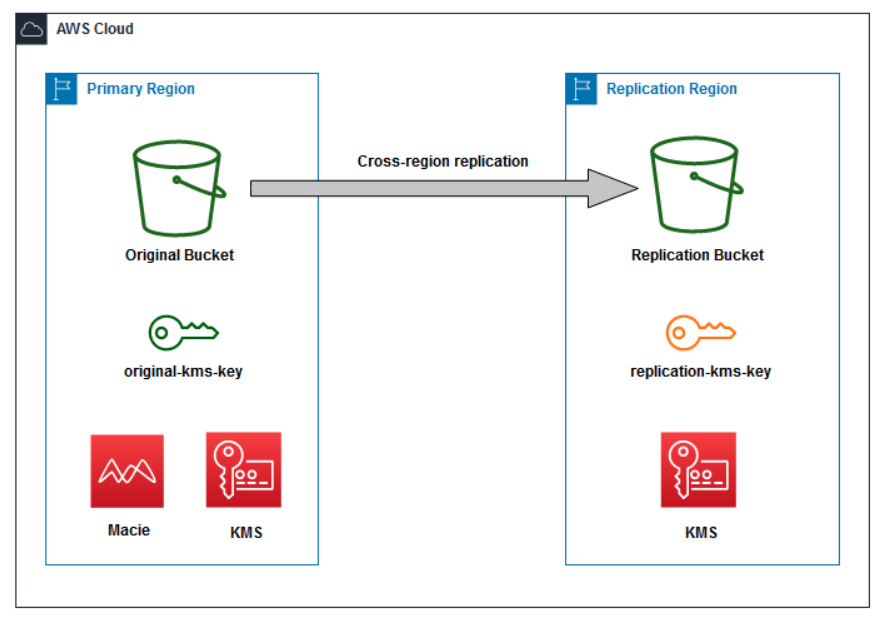

# Zero Trust Architecture for Service-To-Service Workloads

* back to AWS Cloud Institute repo's root [aci.md](../../aci.md)
* back to [AWS Cloud Fundamentals 2](../aws-cloud-fundamentals-2.md)
* back to repo's main [README.md](../../../../README.md)

## Resources

* AccountID `859089088556`
* OriginalBucketName `original-bucket-718009261`
* PrimaryRegionCode `us-west-2`
* PrimaryRegionName `Oregon`
* ReplicationBucketName `replication-bucket-718009261`
* S3ObjectsLink `https://us-west-2-tcprod.s3.us-west-2.amazonaws.com/courses/SPL-PW-200-CLF252/v1.0.3.prod-5922ca94/scripts/files.zip`
* SecondaryRegionCode `us-east-1`
* SecondaryRegionName `N. Virginia`

* original-kms-key `arn:aws:kms:us-west-2:859089088556:key/1d63f109-8f48-4d80-b3d4-28ec6e5d1fba`
* replication-kms-key `arn:aws:kms:us-east-1:859089088556:key/92ca57c6-cfb7-4725-9924-bd383d8f0de2`

---

## Lab Overview

As a security engineer at AnyCompany, you are tasked with applying your company’s data protection strategies to secure data stored in Simple Storage Service (S3) buckets. These strategies require the following:

Data stored in an S3 bucket is encrypted using Server-Side Encryption (SSE) with AWS Key Management Service (KMS) key you manage in the same bucket region
Data uploads to the S3 bucket must be denied if it is not using the correct encryption method and AWS KMS key
Data stored in an S3 bucket in your primary region must be replicated to another S3 bucket in your secondary region to provide multi-region resiliency. The data must be also encrypted in the secondary region using a different AWS KMS key in that region
Data stored in an S3 bucket must not contain any Personal Identifiable Information (PII)
In this lab, you explore the various ways to secure data stored in Amazon Simple Storage Service (Amazon S3). First, you create an AWS Key Management Service (AWS KMS) key that you use to encrypt the contents of an S3 bucket. Then you create an S3 bucket policy to enforce encryption for any new objects uploaded to the bucket. Then you create an Amazon Macie job used to identify Personal Identifiable Information (PII) stored in objects in an S3 bucket. Then you create a replication rule to replicate the objects from the original bucket to a replication bucket in a different region to provide multi-region resiliency to your data. Finally, you review your Macie job findings.

 Note: A list of all the resources that you need through the lab activities are provided to the left of these instructions.

Objectives
By the end of this lab, you will be able to do the following:

Create AWS KMS keys for use with S3 buckets
Encrypt data in an S3 bucket with an AWS KMS key
Create an S3 bucket policy to enforce encryption on uploaded objects
Replicate encrypted data in an S3 bucket to a bucket in another region
Use Macie to to identify Personal Identifiable Information (PII) stored in objects in an S3 bucket
Icon key
Various icons are used throughout this lab to call attention to different types of instructions and notes. The following list explains the purpose for each icon:

 Expected output: A sample output that you can use to verify the output of a command or edited file.
 Note: A hint, tip, or important guidance.
 Hint: A hint to a question or challenge.
 Copy edit: A time when copying a command, script, or other text to a text editor (to edit specific variables within it) might be easier than editing directly in the command line or terminal.
 Task complete: A conclusion or summary point in the lab.
Start lab
To launch the lab, at the top of the page, choose Start Lab.

 Caution: You must wait for the provisioned AWS services to be ready before you can continue.

To open the lab, choose Open Console .

You are automatically signed in to the AWS Management Console in a new web browser tab.

 Warning: Do not change the Region unless instructed.

Common sign-in errors
Error: Choosing Start Lab has no effect
In some cases, certain pop-up or script blocker web browser extensions might prevent the Start Lab button from working as intended. If you experience an issue starting the lab:

Add the lab domain name to your pop-up or script blocker’s allow list or turn it off.
Refresh the page and try again.

### Lab environment



Image description: Two different AWS Cloud regions, each with a unique S3 bucket and KMS key, designated as original and replication. Data in each bucket is encrypted using KMS in the region they occupy. Data uploaded to the primary region is scanned for PII using AWS Macie and replicated to the replication region

The initial lab build contains the following:

An S3 bucket in your primary region (original-bucket)
Another S3 bucket in your secondary region (replication-bucket)
AWS services not used in this lab
AWS service capabilities used in this lab are limited to what the lab requires. Expect errors when accessing other services or performing actions beyond those provided in this lab guide.

### Task 1: Create AWS KMS keys in primary and secondary regions

In this task, you create two AWS KMS keys. Each key is used for Server-Side Encryption (SSE) on the Amazon S3 bucket in the corresponding region. As part of your company’s data protection strategies, your security compliance requires that all data stored in an Amazon S3 bucket is encrypted using Server-Side Encryption AWS KMS key that you manage.

Task 1.1: Identify the primary and secondary regions buckets
Before creating the AWS KMS key, you need to locate your primary and secondary region S3 buckets.

At the top of the AWS Management Console, in the search bar, search for and choose S3.

In the S3 Management Console, locate where the buckets are listed under General purpose buckets.

Note your primary region bucket and its region. Your primary region S3 bucket name is original-bucket-<RANDOM_NUMBER>.

Note your secondary region bucket and its region. Your secondary region S3 bucket name is replication-bucket-<RANDOM_NUMBER>.

 Note: You can always find the primary and secondary buckets and regions names in the list to the left of these instructions.

Task 1.2: Create the primary region AWS KMS key
At the top of the AWS Management Console, in the search bar, search for and choose Key Management Service.

In the AWS Key Management Service page, check the region name in the navigation bar and verify that you are in the lab primary region. You can find your primary region value in the list to the left of these instructions. If not, use the Region selector to choose the correct region.

In the AWS Key Management Service navigation pane to the left of the page, choose Customer managed keys.

Choose Create key.

Configure the following settings in the Configure key page.

Key type:  Symmetric

Key usage:  Encrypt and Decrypt

Choose Next.

Configure the following in the Add labels page.

Alias: original-kms-key

Description: This AWS KMS key is used for the original region S3 bucket

Choose Next.

Scroll down in the Define key administrative permissions and choose Next.

Scroll down in the Define key usage permissions and choose Next.

Review all the parameters in the Review page.

```json
{
  "Id": "key-consolepolicy-3",
  "Version": "2012-10-17",
  "Statement": [
    {
      "Sid": "Enable IAM User Permissions",
      "Effect": "Allow",
      "Principal": {
        "AWS": "arn:aws:iam::859089088556:root"
      },
      "Action": "kms:*",
      "Resource": "*"
    }
  ]
}
```


 Note: Since you did not add any explicit permissions in the key policy, the default key policy is used. The default key policy displayed allows any identity in the same account to use the key if this identity has the required IAM permissions.

Choose Finish.
The primary key alias and ID is now displayed in the Customer managed keys page.

Under the Customer managed keys, choose the original-kms-key link to open the key details page.

In the key page, copy the ARN of the key and paste it in your preferred editor as you need it in a later task in the lab.

Under Key Management Service (KMS) in the navigation pane which is located the left of the page, choose Customer managed keys to return back to the list of keys in your primary region.

Task 1.3: Create the secondary region AWS KMS key
In the AWS Key Management Service page, use the Region selector in the navigation bar to change the region to your secondary region in a new browser tab. You can find your secondary region value in the list to the left of these instructions.

Repeat the same steps in Task 1.2 to create an AWS KMS key in the secondary region. Use the following to create this key:

Alias: replication-kms-key

Description: This KMS key is used for the secondary region S3 bucket

Once created, the replication key alias and ID is displayed in the Customer managed keys page of the secondary region.

For more information about Security Best Practices for Amazon S3, refer to Security Best Practices for Amazon S3 in the Additional resources section for more information.

```json
{
  "Id": "key-consolepolicy-3",
  "Version": "2012-10-17",
  "Statement": [
    {
      "Sid": "Enable IAM User Permissions",
      "Effect": "Allow",
      "Principal": {
        "AWS": "arn:aws:iam::859089088556:root"
      },
      "Action": "kms:*",
      "Resource": "*"
    }
  ]
}
```

 Note: This replication-kms-key is used to encrypt replicated objects to your replication-bucket. The replication-bucket is used in a later task as a disaster recovery region bucket to replicate your data from the original bucket.

 Task complete: You have successfully configured the AWS KMS keys to be used in your primary and secondary regions.

Task 2: Encrypt data in your S3 bucket with AWS KMS key
In this task, you set the default encryption on both the primary and secondary regions buckets to use the corresponding region AWS KMS key. This automatically encrypts uploaded objects using the default encryption of the bucket. After setting the encryption on your S3 buckets, you test by uploading a sample file.

 Note: The default encryption is not an enforcement policy. It only encrypts objects that are uploaded without setting any encryption option in the upload. Enforcing the encryption during object upload is covered in a later task.

Task 2.1: Enable default encryption on each bucket with the corresponding AWS KMS key
At the top of the AWS Management Console, in the search bar, search for and choose S3.

In the S3 Management Console, locate where the buckets are listed under General purpose buckets and choose the original-bucket-<RANDOM_NUMBER> link to access the original bucket settings.

Choose the Properties tab and scroll down to the Default encryption section and choose Edit..

In the Edit default encryption page, configure the following options:

Encryption key type:  Server-side encryption with AWS Key Management Service keys (SSE-KMS)

AWS KMS key:  Choose from your AWS KMS keys

Available AWS KMS keys: original-kms-key

Choose Save changes.
The original bucket Default encryption is now set to use the primary region AWS KMS key. Refer to Protecting data using server-side encryption in the Additional resources section for more information.

Repeat the same steps above but now for the replication-bucket-<RANDOM_NUMBER> and set its default encryption to use the replication-kms-key AWS KMS key.
Task 2.2: Upload a sample file to the original bucket to verify the encryption settings
From the list to the left of these instructions, copy the S3ObjectsLink and paste it into a new browser tab to download a zip file “files.zip” to your local computer. The zip file contains sample files for testing uploads to the S3 bucket.

Unzip/extract the zipped file on your local computer. The unzipped folder contains sample files that you use for testing.

In the S3 Management Console, locate where the buckets are listed under General purpose buckets and choose the original-bucket-<RANDOM_NUMBER> link to access the original bucket settings.

In the Objects tab, choose Upload.

In the Upload page, choose Add files.

In the File Upload window that appears, select the unzipped folder on your local computer, then select any one of the sample files to upload.

Choose Upload.

The files uploaded are listed under Files and folders on the Upload: status page.

Choose Close.

In the Objects tab, choose the object link that you have just uploaded to access the object properties.

In the Properties tab, scroll down to the Server-side encryption settings and verify that the object encrypted key type is SSE-KMS and the AWS KMS key ARN matches the original-kms-key.

 Task complete: You have successfully enabled the default encryption on each bucket using the corresponding AWS KMS key in each region and verified it by uploading a sample file to the original bucket.

Task 3: Prevent S3 object upload using unapproved encryption method and key
In the previous task, you enabled the default encryption on your original bucket, set the encryption type to use SSE-KMS with a specific AWS KMS key (original-kms-key), and verified it by uploading a sample file.

In this task, you enforce object uploads to your original bucket to use a specific server-side encryption key type and AWS KMS key by configuring a bucket policy that prevent any non compliant uploads.

Task 3.1: Upload a sample file to override the default encryption
Try uploading another file to your original bucket while setting the encryption during the upload.

At the top of the AWS Management Console, in the search bar, search for and choose S3.

In the S3 Management Console, locate where the buckets are listed under General purpose buckets and choose the original-bucket-<RANDOM_NUMBER> link to access the original bucket settings.

In the Objects tab, choose Upload.

In the Upload page, choose Add files.

In the File Upload window that appears, select the unzipped folder on your local computer, then select one of the sample files to upload. You can select a different file to the one you uploaded before.

After the file you selected appears under Files and folders in the Upload page, scroll down to the Properties and expand it by choosing the small arrow.

Scroll down to the Server-side encryption section and set the following:

Server-side encryption:  Specify an encryption key

Encryption settings:  Override bucket settings for default encryption

Encryption key type:  Amazon S3-managed keys (SSE-S3)

Scroll down and choose Upload.

Choose Close.

In the Objects tab, choose the object link that you have just uploaded to access the object properties.

In the Properties tab, scroll down to the Server-side encryption settings. You see that the object encryption key type is Amazon S3-managed keys (SSE-S3).

This means that the default encryption of the bucket does not enforce the encryption when uploading objects and you can override the settings during upload.

Task 3.2: Create an S3 bucket policy to enforce encryption with a specific AWS KMS key on the original bucket
Your security rules require that all uploads must be denied unless it uses the specified AWS KMS key (original-kms-key in this scenario). You need to set a bucket policy to enforce this requirement:

At the top of the AWS Management Console, in the search bar, search for and choose S3.

In the S3 Management Console, locate where the buckets are listed under General purpose buckets and choose the original-bucket-<RANDOM_NUMBER> link to access the original bucket settings.

Choose the Permissions tab and scroll down to the Bucket Policy section and choose Edit. to add a new policy statement.

In the Policy pane, enter the following policy after changing the following in the policy statement:

 Copy command: You may want to copy this policy to your preferred note editor and update the values then paste back into the Policy pane.

Replace the REPLACE_WITH_YOUR_ORIGINAL_BUCKET_NAME with your original bucket name. You can find the original bucket name in the list to the left of these instructions.
Replace the REPLACE_WITH_YOUR_ORIGINAL_KMS_KEY_ARN with your original-kms-key ARN which you copied earlier into your preferred editor.

```json
{
    "Version": "2012-10-17",
    "Statement": [
      {
                "Sid": "Deny Incorrect AWS KMS Keys or encryption key types",
                "Effect": "Deny",
                "Principal": "*",
                "Action": "s3:PutObject",
                "Resource": "arn:aws:s3:::REPLACE_WITH_YOUR_ORIGINAL_BUCKET_NAME/*",
                "Condition": {
                    "StringNotEquals": {
                          "s3:x-amz-server-side-encryption-aws-kms-key-id": "REPLACE_WITH_YOUR_ORIGINAL_KMS_KEY_ARN"
                             }
                   }
           }
    ]
}
```

 Hint: The condition key s3:x-amz-server-side-encryption-aws-kms-key-id in the policy above is used to restrict object uploads using specific method or key.

After you paste the policy in the Policy pane, scroll down and choose Save changes.
The new bucket policy is described below Bucket policy on the original-bucket page.

Task 3.3 Verify the bucket policy
In your original-bucket page, choose the Objects tab then choose Upload.

In the Upload page, choose Add files.

In the File Upload window that appears, select the unzipped folder on your local computer, then select one of the sample files to upload. You can select a different file to the ones you uploaded before.

After the file appears under Files and folders in the Upload page, scroll down to the Properties and expand it by choosing the small arrow.

Scroll down to the Server-side encryption section and set the following:

Server-side encryption:  Specify an encryption key

Encryption settings:  Override bucket settings for default encryption

Encryption key type:  Amazon S3-managed keys (SSE-S3)

Scroll down and choose Upload.
The Upload Status describes Failed under Files and folders on the Upload: status page. Try uploading other sample files using other options as below and verify the output. This is the expected output for each case:

Upload without setting extra encryption options: Upload is successful because the AWS KMS original-kms-key is set as the default option on the bucket and matches the key in the bucket policy

Upload with SSE-KMS and using AWS managed key (aws/s3): Upload fails as it is not using the configured key in the bucket policy (original-kms-key)

 Task complete: You have successfully configured your original bucket to prevent any uploads using unapproved encryption method and key.

Task 4: Identify Personal Identifiable Information (PII) stored in objects in an S3 bucket using Macie
The next security control that you need to apply as part of your company’s data protection strategy is to detect any PII in your S3 objects.

In this task, you configure a Macie job to scan your S3 bucket objects and generate findings on any objects that might contain PII. The job is only applied to your original bucket.

Task 4.1: Enable Macie
At the top of the AWS Management Console, in the search bar, search for and choose Amazon Macie.

Check the region name in the navigation bar and verify that you are in the lab primary region. You can find your primary region value in the list to the left of these instructions. If not, use the Region selector to choose the correct region.

In the Amazon Macie console, choose Get started.

In the Get started page, choose Enable Macie.

Task 4.2: Modify the AWS key policy to allow Macie role decryption permissions
When you create a Macie job in the next section, the Macie service scans your S3 objects. Since your objects are encrypted, you need to allow the Macie service to decrypt the objects before scanning them. You do this by adding an explicit permissions in your KMS key policy for the Macie service role to decrypt.

At the top of the AWS Management Console, in the search bar, search for and choose Key Management Service.

In the AWS Key Management Service page, check the region name in the navigation bar and verify that you are in the lab primary region. You can find your primary region value in the list to the left of these instructions. If not, use the Region selector to choose the correct region.

In the AWS Key Management Service navigation pane to the left of the page, choose Customer managed keys.

Under the Customer managed keys list, choose the original-kms-key link.

In the Key policy tab, choose Switch to policy view in the Key policy section.

Choose Edit.

In the Policy pane, replace the existing policy with the policy below after changing the following in the policy statements:

 Copy command: You may want to copy this policy to your preferred note editor and update the values then paste back into the Policy pane.

Replace the REPLACE_WITH_YOUR_12_DIGIT_ACCOUNT_ID with your Account ID. You can find your Account ID value in the list to the left of these instructions. The account ID must be replaced in two different locations in policy below

```json
{
    "Version": "2012-10-17",
    "Statement": [
        {
            "Sid": "Enable IAM User Permissions",
            "Effect": "Allow",
            "Principal": {
                "AWS": "arn:aws:iam::REPLACE_WITH_YOUR_12_DIGIT_ACCOUNT_ID:root"
            },
            "Action": "kms:*",
            "Resource": "*"
        },
        {"Sid": "Enable explicit permissions for Macie service-role",
        "Effect": "Allow",
        "Principal": {
            "AWS":
                "arn:aws:iam::REPLACE_WITH_YOUR_12_DIGIT_ACCOUNT_ID:role/aws-service-role/macie.amazonaws.com/AWSServiceRoleForAmazonMacie"
        },
        "Action": "kms:Decrypt",
        "Resource": "*"
        }
    ]
}
```

 Note: You are only adding kms:Decrypt for the original-kms-key policy

Scroll down and choose Save changes
Task 4.3: Create a Macie job to scan the original bucket objects
At the top of the AWS Management Console, in the search bar, search for and choose Amazon Macie.
The Macie summary page displays statistics about your S3 buckets.

In the Summary page, choose Create job.
A message appears advising that Sensitive data discovery jobs aren’t included in your 30-day free trial of automated sensitive data discovery. Are you sure that you want to create a job?

Choose Yes.
 Note: You can safely ignore close the following error message if you get it:

 Error Pricing: getProducts: User: arn:aws:sts::111122223333:assumed-role/AWSLabsUser is not authorized to perform: pricing:GetProducts
In the Choose S3 buckets page, choose  Select specific buckets, then under the Select S3 buckets, select the original-bucket-<RANDOM_NUMBER>.
 Note: If the original-bucket does not appear in the list, please wait at least 5-10 minutes, then choose the Refresh icon  to refresh the buckets list.

Choose Next.

In the Review S3 buckets page, verify that your original bucket is selected and choose Next.

In the Refine the scope, choose  One-time job under the Sensitive data discovery options and choose Next.

 Note: You can schedule the job so it runs regularly. For the lab purpose, you configure the job as a One-time job.

In the Select managed data identifiers page, choose  Custom.

Choose  Use specifc managed data identifiers.

Select the  checkbox next to Sensitive data types.

Choose Next.

All of the sensitive checks should be selected.

In the Select custom data identifiers page, choose Next.

In the Select allow lists page, choose Next.

In the Enter general settings, enter lab-macie-job under the Job name field and choose Next.

In the Review and create page, review all the information and choose Submit.

The created Macie job is listed on the Jobs table and needs ~10-15 minutes to complete, review the findings after completing the next task.

 Task complete: You have successfully created a Macie job to scan your bucket objects.

Task 5: Replicate data to the disaster recovery region bucket
In this task, you create a replication rule that replicates encrypted objects uploaded in the original bucket to the replication bucket in the disaster recovery region to protect against any possible data loss in the primary region.

Once the data is replicated, it is also encrypted using the secondary region AWS KMS key replication-kms-key.

To achieve this goal, you need to complete the following steps:

Enable bucket versioning on both buckets
Configure a replication rule to replicate objects from the original to replication buckets
You need a service role that has the permissions to replicate objects. The service role is created automatically when creating the replication rule
Verify the replication by uploading objects to the original bucket
Task 5.1: Enable bucket versioning on both buckets
Both source and destination buckets must have bucket versioning enabled before creating the replication rule.

In the S3 Management Console, locate where the buckets are listed under General purpose buckets and choose the original-bucket-<RANDOM_NUMBER> link to access the original bucket settings.

Choose the Properties tab and scroll down to Bucket Versioning.

Under Bucket versioning, choose Edit.

Choose  Enable.

Choose Save changes.

Bucket versioning is now enabled on original-bucket-<RANDOM_NUMBER> bucket.

Enable bucket versioning on the replication bucket by repeating the steps above on replication-bucket-<RANDOM_NUMBER> bucket.
Task 5.2: Configure a replication rule
At the top of the AWS Management Console, in the search bar, search for and choose S3.

In the S3 Management Console, locate where the buckets are listed under General purpose buckets and choose the original-bucket-<RANDOM_NUMBER> link to access the original bucket settings.

Choose the Management tab and scroll down to the Replication rule section.

Choose Create replication rule.

In the Create replication rule page, configure the following:

Replication rule configuration

Replication rule name: lab-replication-rule

Status:  Enabled

Source bucket

Choose a rule scope:  Apply to all objects in the bucket
Destination

Destination:  Choose a bucket in this account
Bucket name: Browse S3 and choose  replication-bucket-RANDOM-NUMBER then choose Choose path
IAM role

Choose  Choose from existing IAM roles

From the IAM role drop-down menu, choose S3ReplicationRole

Encryption

Choose  Replicate objects encrypted with AWS KMS

AWS KMS key for encrypting destination objects:  Choose from your AWS KMS keys

In the Available AWS KMS keys drop-down menu, choose the replication-kms-key

Leave all other settings as default and choose Save.

In the Replicate existing objects?, choose  No, do not replicate existing objects.

Choose Submit.

The replication rule that you created is displayed under Replication rules. In summary, this is how it works:

You can only upload objects to your original bucket encrypted with your original-kms-key because of the bucket policy you configured in the previous task
The replication rule replicates the objects from the original bucket to the replication bucket
The replication rule decrypts objects from the original bucket using the original-kms-key before replication
The replication rule encrypts objects when replicating them to the replication bucket using the replication-kms-key
For the replication rule to perform all the above tasks, it needs IAM permissions. These permissions are added to the the IAM replication service role which was created with the rule. Refer to Replicating Objects in the Additional Resources section for more information.

In the Replication rules page, under the Replication configuration settings, you can see the IAM role has all required permissions.
 Hint: The role name is `S3ReplicationRole`

Open the IAM role link in a new browser tab. This opens the role page.

In the Permissions tab, expand the policy the existing policy to view the required role permissions.

```json
{
    "Statement": [
  {
   "Action": [
    "s3:GetReplicationConfiguration",
    "s3:ListBucket"
   ],
   "Resource": [
    "arn:aws:s3:::original-bucket*"
   ],
   "Effect": "Allow"
  },
  {
   "Action": [
    "s3:GetObjectVersionForReplication",
    "s3:GetObjectVersionAcl",
    "s3:GetObjectVersionTagging"
   ],
   "Resource": [
    "arn:aws:s3:::original-bucket*/*"
   ],
   "Effect": "Allow"
  },
  {
   "Action": [
    "s3:ReplicateObject",
    "s3:ReplicateDelete",
    "s3:ReplicateTags"
   ],
   "Resource": [
    "arn:aws:s3:::replication-bucket*/*"
   ],
   "Effect": "Allow"
  },
  {
   "Action": [
    "kms:Decrypt"
   ],
   "Resource": [
    "arn:aws:kms:us-west-2:859089088556:key/*"
   ],
   "Effect": "Allow"
  },
  {
   "Action": [
    "kms:Encrypt"
   ],
   "Resource": [
    "arn:aws:kms:*:859089088556:key/*"
   ],
   "Effect": "Allow"
  }
 ]
}
```

#### Task 5.3: Test the replication by uploading objects to the original bucket

At the top of the AWS Management Console, in the search bar, search for and choose S3.

In the S3 Management Console, locate where the buckets are listed under General purpose buckets and choose the original-bucket-<RANDOM_NUMBER> link to access the original bucket.

In the Objects tab, choose Upload.

In the Upload page, choose Add files.

In the File Upload window that appears, select the unzipped folder on your local computer, then select one of the sample files to upload. You can select a different file to the ones you uploaded before.

Choose Upload.

Choose Close.

In the Objects tab, choose the object link that you have just uploaded to access the object properties.

In the Properties tab, scroll down to the Object management overview and check the Replication status. It should show PENDING or COMPLETED. If it the status is PENDING, refresh the page till the status is COMPLETED. It might take few of minutes for the for the object to be replicated. In some cases, the replication might take longer than few minutes. Refer to Amazon S3 Replication in the Additional Resources section to learn more about S3 replication times.

 Note:

PENDING means that the object is not yet replicated
COMPLETED means that the object is replicated
Scroll down to the Server-side encryption settings and verify that the object encrypted key type is SSE-KMS and the AWS KMS key ARN matches the original-kms-key.

Return back to the S3 Management Console, locate where the buckets are listed under General purpose buckets and choose the replication-bucket-<RANDOM_NUMBER> link to access the replication bucket.

In the Objects tab, choose the object link that have been replicated to access the object properties.

In the Properties tab, scroll down to the Object management overview and check the Replication status. It should show REPLICA.

Scroll down to the Server-side encryption settings and verify that the object encrypted key type is SSE-KMS and the AWS KMS key ARN matches the replication-kms-key.

 Note: The replication rule does not replicate objects in the bucket that existed before the replication is configured.

 Task complete: You have successfully enabled data replication from the original bucket to the disaster recovery region bucket.

Task 6: Review the Macie job findings
At the top of the AWS Management Console, in the search bar, search for and choose Amazon Macie.

Check the region name in the navigation bar and verify that you are in the lab primary region. You can find your primary region value in the list to the left of these instructions. If not, use the Region selector to choose the correct region.

In the left navigation pane, choose Jobs.

Verify that the status of the job is Complete. It can take ~10-15 minutes to complete from the time it was created.

You can choose the Refresh icon  to check the status of the job.

In the left navigation pane, choose Findings.

Choose one of the resulted findings and go through the finding details on the right. This should include the object name and other artifacts about the finding.

The Macie service detected objects which have PII. In the scan, Macie uses pre-defined data identifiers to detect the contents of an object. You can also add your own custom data identifiers.

Macie was able to read the contents of objects even though the objects are encrypted with an AWS KMS key. This is because you gave permissions to the Macie service role to decrypt the objects. Refer to What is Amazon Macie? in the Additional Resources section for more information about Macie.

 Task complete: You have successfully reviewed the findings from your Macie job to detect for any PII in your S3 objects.

Conclusion
 Lab complete You have successfully done the following:

Created AWS KMS keys for use with S3 buckets
Encrypted data in an S3 bucket with an AWS KMS key
Created an S3 bucket policy to enforce encryption on uploaded objects
Created an S3 replication rule to replicate encrypted objects in an S3 bucket to a bucket in another region
Used Macie to to identify Personal Identifiable Information (PII) stored in objects in an S3 bucket
End lab
Follow these steps to close the console and end your lab.

Return to the AWS Management Console.

At the upper-right corner of the page, choose AWSLabsUser, and then choose Sign out.

Choose End Lab and then confirm that you want to end your lab.

---

### Additional Resources

* [Security Best Practices for Amazon S3](https://docs.aws.amazon.com/AmazonS3/latest/userguide/security-best-practices.html)
* [Protecting data using server-side encryption](https://docs.aws.amazon.com/AmazonS3/latest/userguide/serv-side-encryption.html)
* [Replicating objects](https://docs.aws.amazon.com/AmazonS3/latest/userguide/replication.html)
* [Amazon S3 Replication](https://aws.amazon.com/s3/features/replication/)
* [What is Amazon Macie?](https://docs.aws.amazon.com/macie/latest/user/what-is-macie.html)

For more information about AWS Training and Certification, see [https://aws.amazon.com/training/](https://aws.amazon.com/training/).

---
