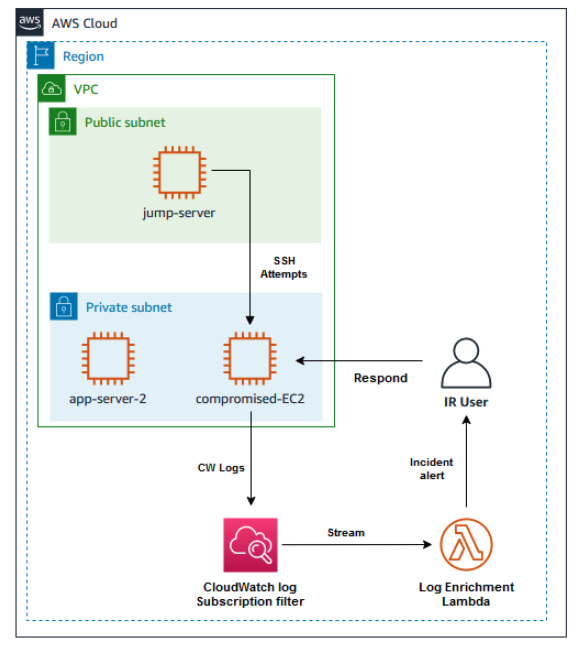
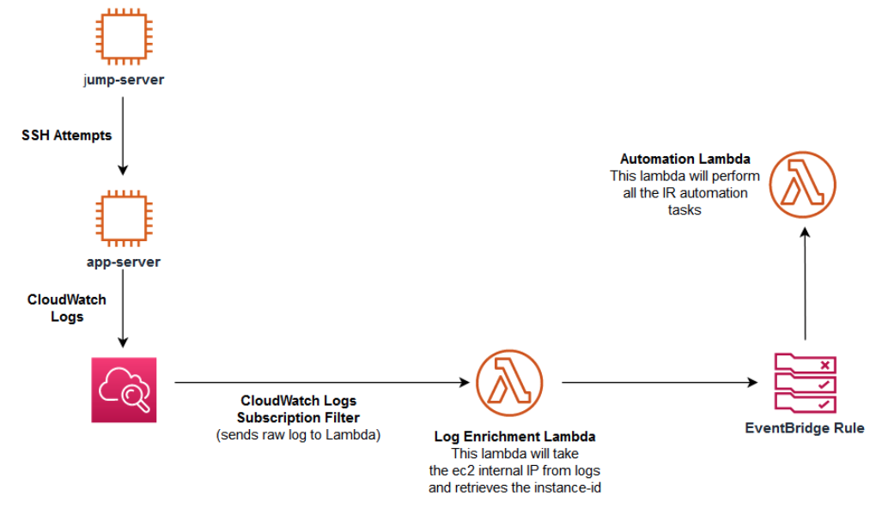

# Zero Trust Architecture for Service-To-Service Workloads

* back to AWS Cloud Institute repo's root [aci.md](../../aci.md)
* back to [AWS Cloud Fundamentals 2](../aws-cloud-fundamentals-2.md)
* back to repo's main [README.md](../../../../README.md)

## Resources

* AppServer2DNSName `ip-10-0-2-222.ec2.internal`
* AutomationLambdaARN `arn:aws:lambda:us-east-1:140843548218:function:IR-Automation-Lambda`
* CompromisedInstanceDNSName `ip-10-0-2-45.ec2.internal`
* CompromisedInstanceId `i-0db0669c60e03838c`
* IRBucketName `ir-bucket-158453160`
* LabRegionCode `us-east-1`
* QuarantineSG `sg-09e9042ba72ccac73`
* SessionManagerJumpServerUrl `https://us-east-1.console.aws.amazon.com/systems-manager/session-manager/i-0dc26f45b9f80759c?region=us-east-1`

---

## Lab Overview

In this lab, you act as a member of the incident response team receiving an alert on a possible Elastic Compute Cloud (Amazon EC2) instance that might be compromised by a bad actor. You need to respond to the incident using proven processes and techniques for effective investigation, analysis, and lessons learned.

### Objectives

By the end of this lab, you will be able to do the following:

Capture compromised instance metadata and persistent disks
Create a snapshot of the compromised instance
Isolate the instance and protect against accidental instance termination
Review system logs to validate the suspected breach
Update instance settings to mitigate a vulnerability
Create an automated incident response to handle similar incidents in the future
Technical knowledge prerequisites
To successfully complete this lab, you should have a basic knowledge of AWS services as defined in the AWS Cloud Practitioner Essentials course. You should be comfortable with navigating the AWS Management Console and be familiar with basic networking concepts.

Icon key
Various icons are used throughout this lab to call attention to different types of instructions and notes. The following list explains the purpose for each icon:

 A sample output that you can use to verify the output of a command or edited file.
 Note: A hint, tip, or important guidance.
 Hint: A hint to a question or challenge.
 Command: A command that you must run.
 Learn more: Where to find more information.
 Copy edit: A time when copying a command, script, or other text to a text editor (to edit specific variables within it) might be easier than editing directly in the command line or terminal.
Start lab
To launch the lab, at the top of the page, choose Start Lab.

 Caution: You must wait for the provisioned AWS services to be ready before you can continue.

To open the lab, choose Open Console .

You are automatically signed in to the AWS Management Console in a new web browser tab.

 Warning: Do not change the Region unless instructed.

Common sign-in errors
Error: Choosing Start Lab has no effect
In some cases, certain pop-up or script blocker web browser extensions might prevent the Start Lab button from working as intended. If you experience an issue starting the lab:

Add the lab domain name to your pop-up or script blocker’s allow list or turn it off.
Refresh the page and try again.
Scenario
As a security engineer at AnyCompany, you have been alerted to a potential security breach on one of your application servers where multiple failed login attempts were detected. Now, you must safely perform an analysis of the instance to determine if there was actually a breach, address the vulnerabilities that led to it, and perform remediation actions.

### The initial lab build contains the following:

Amazon Virtual Private Cloud (Amazon VPC) for the lab that contains a public and private subnets
An Amazon Elastic Compute Cloud (Amazon EC2) instance acting as a jump server to perform the tasks
Two EC2 instances. One instance is acting as the compromised server and another instance to be used as a second possible target for later testing
An Amazon Simple Storage Service (Amazon S3) bucket to be used for collecting incident response artifacts
AWS Identity and Access Management (IAM) roles and policies which are required to perform the lab activities
AWS Lambda functions for the incident response automation



 Note: A list of all the resources that you need through the lab activities are provided to the left of these instructions.

### Task 1: Capture all the compromised instance persistent disks and metadata

In this task, you review the incident to identify the compromised instance details. Then you start taking the initial response actions to:

Capture the compromised instance metadata.
Enable termination protection on the compromised instance.
Capture the instance memory and disks.
Deploy a new instance from the captured snapshot to run detailed investigation on it.
Tag, decommission, and isolate the compromised instance.

#### Task 1.1: Review the compromised instance details

As an incident response team member receiving an incident notification about a potential compromised EC2 instance, you need to review the compromised instance details and gather information and artifacts about the potential incident, so you can start your incident response actions.

Check the resource provided to the left of these instructions and take a note of the following details which are reported in the incident findings:
CompromisedInstanceId
CompromisedInstanceDNSName
In the lab, the compromised instance has a name tag of compromised-ec2.

#### Task 1.2: Capture the compromised instance metadata

Now, you gather some information about the compromised instance by collecting its metadata.

To connect to the jump-server terminal, copy SessionManagerJumpServerUrl value from the list to the left of these instructions and then open this URL in a new browser tab. This opens the jump-server terminal with the jump-server$ shell prompt.

 Command: Set the compromised instance id, region, IR Bucket, and metadata file as shell variables in your terminal so you can reuse these variables when typing commands from the terminal of the jump-server. To set these variables, run the following commands after replacing the values from the list to the left of these instructions:

 Copy edit: You might want to copy these commands to your preferred note editor, update the values, and then paste them back into the terminal.

* template

```bash
jump-server$
compromised_instance_id=REPLACE_WITH_YOUR_CompromisedInstanceId
lab_region=REPLACE_WITH_YOUR_LabRegionCode
ir_bucket=REPLACE_WITH_YOUR_IRBucketName
metadata_file=metadata_$compromised_instance_id.json
```

* actual commands:

```bash
jump-server$ compromised_instance_id=i-0db0669c60e03838c
lab_region=us-east-1
ir_bucket=ir-bucket-158453160
metadata_file=metadata_$compromised_instance_id.json
```

 Expected output:

None, unless there is an error.

 Command: To verify that the variables are set correctly, run the following commands, and validate the output:

```bash
jump-server$ echo $compromised_instance_id
echo $lab_region
echo $ir_bucket
echo $metadata_file
```

 Expected output:

```bash
jump-server$ echo $compromised_instance_id
i-0db0669c60e03838c
jump-server$ echo $lab_region
us-east-1
jump-server$ echo $ir_bucket
ir-bucket-158453160
jump-server$ echo $metadata_file
metadata_i-0db0669c60e03838c.json
```

 Command: To capture the instance metadata and save it in a file, run the following command:

```bash
jump-server$ aws ec2 describe-instances --instance-ids $compromised_instance_id --region $lab_region >> $metadata_file
```

 Expected output:

None, unless there is an error.

To verify that the instance metadata was captured, view the contents of the file you created above, run the following command:

```bash
jump-server$ cat $metadata_file
```

 Expected output: You should see all the compromised instance details.

To upload the metadata file into the IR bucket as part of the incident response artifacts collection, run the following command:

```bash
jump-server$ aws s3api put-object --bucket $ir_bucket --body $metadata_file --key $metadata_file
```

 Expected output:

```json
{
    "ETag": "\"e61a6fe22e22a92fc6f957a8455e6717\"",
    "ServerSideEncryption": "AES256"
}
```

To verify the metadata file in the IR bucket, at the top of the AWS Management Console, in the search bar, search for and choose S3.

In the S3 Management Console, under Buckets, locate where the buckets are listed and choose the ir-bucket-<RANDOM_NUMBER> link for your bucket.

Under your bucket, choose the Objects tab, you should see the metadata file uploaded in the bucket.

 Note: You can try downloading the object and verifying its contents.

#### Task 1.3: Enable termination protection on the compromised instance

Even though you will take a snapshot of the compromised instance, you want to protect it from accidental termination while you are capturing the instance details and disks. You should enable termination protection to protect your instance till you finished all data gathering.

At the top of the AWS Management Console, in the search bar, search for and choose EC2.

In the left navigation pane, choose Instances under Instances section.

Under Instances, locate the compromised-ec2 instance and select  beside its name.

Choose Actions  on the top-right of the page, then choose Instance settings then Change termination protection.

In the Change termination protection pop-up window, select Enable, and then choose Save.

 Expected output:

Successfully enabled termination protection for instance

You have enabled protection termination on the compromised instance. It cannot be terminated till this feature is turned off.

 Note: As part of the incident response, you can also disable the “DeleteOnTermination” setting for all the attached volumes. This will preserve the volumes if the instance is terminated. For the purpose of this lab, you do not set this option. You can find more on this feature here Disable the “DeleteOnTermination” Setting for All Attached Volumes.

#### Task 1.4: Capture the instance memory and disks

The next step in your incident response is to capture a snapshot of the persistent disks attached to the instance as well as capturing the memory contents. You use the disk snapshot and memory contents to create a new instance. This instance is what you perform a detailed forensic analysis on to determine the root cause of the incident.

To take a snapshot of the attached volume to the instance, you need to identify the volume(s) attached to the instance.

If you are not already on the EC2 Management Console, use the AWS Management Console search bar at the top to search EC2 then choose it.

In the left navigation pane, choose Volumes under Elastic Block Store section.

To identify which volume is attached to the compromised instance, under Volumes scroll to the right to find the Attached Instances column and locate the volume which is attached to the compromised-ec2 instance. Scroll back to the left and select the  for the compromised-ec2 volume.

Choose Actions  on the top-right of the page, then choose Create snapshot.

In the Create snapshot page, configure the following:

Under Description, enter A snapshot of the compromised ec2 volume.
Under Tags, choose Add tag then enter Name for the Key field and compromised_ec2_snapshot for the Value field.
Scroll down and choose Create snapshot.
 Expected output:

Successfully created snapshot

In the left navigation pane, choose Snapshots under Elastic Block Store section.

Under Snapshots, you can see the new snapshot that you created.

With regard to the memory capture, you need to use third-party tools installed on the compromised instance. You then run commands and scripts to enable the tools to capture the memory. Once the memory is captured, you take another snapshot of the volume which includes the memory dump.

To install and run third-party memory capture tools, you need to connect to the compromised instance. However, you would not want to connect to a compromised instance and run live commands as you might change the instance state and impact the forensic analysis.

To capture the memory without connecting to the instance, you can use the AWS Systems Manager Run Command service to invoke the SSM Agent, which runs shell scripts and Windows PowerShell commands. These scripts can load and execute specific tools to capture additional data from the host, such as the Linux Memory Extractor (LiME) kernel module.

For the purpose of this lab, the memory capture will be skipped.

 Learn more: You can find more details on memory capture here Acquire Instance Memory.

Task 1.5: Deploy a new instance from the captured snapshot (Optional)
If you need to perform a detailed forensic analysis on the compromised instance, you now have all the artifacts to build a copy of this instance in your forensic VPC, run all the analysis and investigation tools on the instance to determine the root cause, and recommend future prevention and remediation actions.

For the purpose of this lab, we assume that the snapshot you captured is the full snapshot including the memory dumps.

Before you launch the instance, you need to create an image from the snapshot.

While you are still on the Snapshots page, choose the refresh icon  at the top of the page to refresh the status of the newly created snapshot.

Check the Snapshot status column for the compromised_ec2_snapshot. The Snapshot status should state Completed before you move to the next step. If the status is still as Pending, then wait for couple of minutes and refresh the page again.

Select the  compromised_ec2_snapshot.

Choose Actions  on the top-right of the page, then choose Create image from snapshot.

In the Create image from snapshot page under Image settings, configure the following:

Image name: compromised_ec2_ami
Description: This is a full image of the compromised ec2
Leave all other settings as default
Choose Create image.
 Expected output:

A banner message should be displayed at the top of the page indicating that image is being created.

In the left navigation pane, choose AMIs under Images section.

You can view the new created image and its details. If required, you can create a new instance from this AMI in your forensic VPC and run detailed analysis on it. If the new image is not displayed, use the refresh icon  at the top of the page to refresh the list of images.

 Note: For the purpose of this lab, you use CloudWatch logs to investigate the breach.

Task 1.6: Tag, decommission, and isolate the compromised instance
Once all artifacts are collected, you can tag and isolate/decommission the compromised instance. Start by tagging the instance with a special tag to identify its status.

In the left navigation pane, choose Instances under Instances section.

Under Instances, locate the compromised-ec2 instance and select  beside its name.

Under the Instance details section, choose the Tags tab.

Choose Manage tags.

In the Manage tags page, choose Add new tag.

For the tag Key, enter Status.

For the tag Value, enter Quarantine

Choose Save.

 Expected output:

Request to manage tags has succeeded.

 Note:

The tags keys and values can be set based on your organization tagging strategy.
Tags can be leveraged to serve as both a visual representation/marker as well as a mechanism to initiate automation.
After the instance is tagged, you need to consider your options to isolate/decommission the instance.

Here are some actions that you may take:

Remove Instance from Amazon EC2 Auto Scaling Groups (if applicable).
De-Register Instance from Elastic Load Balancers (ELB) (if applicable).
Modify or remove the instance profile (IAM role) to remove the instance permissions attached to the IAM role.
Modify the security group on the instance to block all unwanted traffic. Ensure that you can reach the instances with any required tools if needed.
Shutdown the instance.
 Note: Be aware that there is currently no way to completely isolate/contain/quarantine an Instance using Security Groups, due to Connection Tracking. While Security Groups can be used to prevent future connections, they CANNOT be used to terminate existing Tracked Connections.

For the purpose of this lab, you just need to remove the instance profile and modify the security group to a block all inbound/outbound traffic.

In the left navigation pane, choose Instances under Instances section.

Under Instances, locate the compromised-ec2 instance and select  beside its name.

Choose Actions  on the top-right of the page, then choose Security, and then choose Modify IAM role.

In the Modify IAM role page, under IAM role drop-down menu, choose No IAM Role  to detach the existing role.

Choose Update IAM role.

In the Detach IAM role pop-up window, enter Detach in the field to confirm.

Choose Detach.

 Expected output:

Successfully disassociated App-server-instance-profile from instance

In the EC2 Management Console, under Instances, locate the compromised-ec2 instance and select  beside its name.

Choose Actions  on the top-right of the page, then choose Security, and then choose Change security groups.

In the Change security groups page, under Associated security groups section, choose Remove to remove the APP-SG security group.

Choose Select security groups field, the available security groups in the lab VPC will be displayed. Choose the Quarantine-SG security group, then choose Add security group.

The security group will be associated with the instance.

Choose Save.
 Expected output:

Security groups changed successfully

Task 1 summary:

Captured the compromised instance metadata.
Enabled termination protection on the compromised instance.
Captured the instance disks into a snapshot.
Created an image from the snapshot to be used to deploy a copy of the compromised instance if required for investigation.
Tagged, decommissioned, and isolated the compromised instance.

---

### Task 2: Investigate the incident by reviewing system logs

In the previous task, you took the initial steps in incident response that requires you to collect all the necessary information about the possible incident. The next step is that you use all the information that you collected to investigate the incident, and recommend actions for remediation and future prevention of similar incidents.

In this task, you investigate the incident by reviewing the system logs for authentication failures to confirm the incident and recommend the right course of action.

Depending on the complexity of the incident/breach, you would normally run your forensic analysis tools on the instance you launched from the compromised instance snapshot and examine its system logs.

As this lab is simulating here a simple incident (SSH authentication failures), you examine the logs using CloudWatch logs as the instance was writing all the logs to a CloudWatch log group.

 Note: There are many other logging and Security Incident and Event Management (SIEM) tools that you can use, and it will depend on your environment in a real-world scenario.
At the top of the AWS Management Console, in the search bar, search for and choose CloudWatch.

In the left navigation pane, choose Log Groups under the Logs section.

In the Log groups page, choose the ec2-ssh-log-group link.

In the ec2-ssh-log-group, under Log streams, choose the instance-id link that matches your compromised-ec2 to view the log events. You can confirm the compromised-ec2 instance-id from the list to the left of these instructions.

In the Log events page, scroll through the log events to search for authentication failure. You can use the Filter events search box at the top to find the log events.

Examine the logs. You determine that what caused the alert is SSH failed attempts which could be an indication to a brute-force attempt.

After consulting with your team and other stakeholders, you recommend disabling and blocking SSH on this server. You also recommend using SSM session manager to access the instance, as it does not require any inbound access, provides IAM controllability, and can be audited via CloudTrail.

 Congratulations! You have successfully reviewed system logs and recommended the remediation action to prevent similar future incidents.

Task 3: Update instance settings to mitigate a vulnerability
In this task, you apply the recommended actions on the instance to mitigate any future similar attempts.

There are two actions to be taken. The first one, is to allow the instance to be managed by SSM session manager by attaching an IAM role to the instance which has SSM permissions. The second one, is to remove inbound SSH rule from the instance security group.

Task 3.1: Add SSM permissions to the instance profile (IAM role)
At the top of the AWS Management Console, in the search bar, search for and choose IAM.

In the IAM navigation pane to the left of the page, choose Roles under the Access management section.

In the Roles page, use the search bar to search for app-server-role.

In the search results, choose the app-server-role link to access the role details.

In the Permissions tab, you will see only one policy attached to the role (EC2-Policy). To add the required SSM permissions, choose Add permissions , then in the drop-down menu, choose Attach policies.

In the Attach policy to app-server-role page, under Other permissions policies, use the search box to search for AmazonSSMManagedInstanceCore.

In the search results, select the  AmazonSSMManagedInstanceCore policy name, then scroll down and choose Add permissions.

 Expected output:

Policy was successfully attached to role.

After updating the role permission, you need to re-attach the role to the instance. Recall that you de-attached the role from the instance when you isolated the instance.

At the top of the AWS Management Console, in the search bar, search for and choose EC2.

In the left navigation pane, choose Instances under Instances section.

Under Instances, locate the compromised-ec2 instance and select  beside its name.

Choose Actions  on the top-right of the page, then choose Security then choose Modify IAM role.

In the Modify IAM role page, under IAM role drop-down menu, choose App-server-instance-profile  to re-attach the role to the instance.

Choose Update IAM role.

 Expected output:

Successfully attached App-server-instance-profile to instance

 Note: If the AWS Systems Manager SSM Agent is already running on the instance when you attach the IAM instance profile, you might need to restart the agent before the you can connect to the instance via the Session Manager. To restart the agent, you need to reboot the instance.

Under Instances, locate the compromised-ec2 instance and select  beside its name.

Choose Instance state  on the top of the page, then choose Reboot.

 Expected output:

Successfully rebooted

Task 3.2: Remove inbound SSH rule from security group
Recall that part of the isolation of the instance, you removed the original security group of the instance and applied a quarantine security group that blocks all inbound/outbound traffic. Now you need to remove the inbound SSH rule from the original security group and apply it back to the instance after removing the Quarantine security group.

In the left navigation pane, choose Security Groups under Network & Security section.

In the Security groups page, locate the APP-SG from the list of security groups and select  beside its name.

Under the APP-SG details, choose the Inbound rules tab.

Choose Edit inbound rules.

In the Edit inbound rules page, find the SSH rule and choose Delete.

Choose Save rules.

 Expected output:

Inbound security group rules successfully modified on security group

In the left navigation pane, choose Instances under Instances section.

Under Instances, locate the compromised-ec2 instance and select  beside its name.

Choose Actions  on the top-right of the page, then choose Security, and then choose Change security groups.

In the Change security groups page, under Associated security groups section, choose Remove to remove the Quarantine security group.

Choose Select security groups field, the available security groups in the lab VPC will be displayed. Choose the APP-SG security group, then choose Add security group.

The security group will be associated with the instance.

Choose Save.
 Expected output:

Security groups changed successfully

You have now updated the security group on the instance after remediating it.

Task 3.3: Connect to the instance via SSM to validate the remediation
Finally, check that you can connect to the instance via SSM Session Manager.

In the left navigation pane, choose Instances under Instance section.

Under Instances, locate the compromised-ec2 instance and select  beside its name.

 Note: If the Connect button at the top of the top-center of the page is not active, it means the instance is not yet ready for SSM Session Manager connection. Wait for few minutes or you can check it again after the next task.

Choose Connect on the top-center of the page.

In the Connect to instance page, choose the Session Manager tab, then choose Connect.

The terminal of the compromised instance is now open with the compromised-ec2$ prompt.

Choose Terminate, then choose Terminate again to terminate the session.
Finally, remove the Quarantine tag from the instance.

In the left navigation pane, choose Instances under Instances section.

Under Instances, locate the compromised-ec2 instance and select  beside its name.

Under the Instance details section, choose the Tags tab.

Choose Manage tags.

In the Manage tags page, locate the Status:Quarantine tag and choose Remove.

Choose Save.

 Expected output:

Request to manage tags has succeeded.

Your instance is now back in service.

 Note: In real life scenarios, you might have taken other steps for the isolation (as discussed earlier). Ensure that you take all necessary steps to take the instance out of isolation.

Task 3 summary: You have successfully remediated the incident cause by allowing connection to the instance via SSM Session Manager instead of SSH and removed the SSH inbound rule from the security group.

### Task 4: Create an automated incident response to handle incident response actions

The steps you took in tasks 1 and 3 are common for incidents that involves EC2 instances. However, performing all these actions manually is not best practice and you need to automate the initial response.

In this task, you create an Amazon EventBridge rule that will be triggered by any incident which involves an EC2 instance and invoke a Lambda function to automatically perform the steps you took in task 1.

Here is the scenario used in this task:

SSH failure attempts are initiated against an app-server. The attempts will be simulated by the jump-server
The app-server will generate SSH authentication failure logs and sends the logs to a CloudWatch log group
The CloudWatch log group has a pre-configured subscription filter that matches SSH authentication failure logs and sends them to a pre-configured Lambda function (Log Enrichment Lambda)
The Log Enrichment Lambda will capture the app-server internal IP address and retrieves the instance id. Then it sends an event to Amazon EventBridge which includes the instance id
The EventBridge rule will match the incoming event and triggers the Automation Lambda to perform the automated incident response actions



All the above requirements are pre-created in the lab build except the EventBridge rule that you need to configure in this task.

The Automation Lambda function is pre-created in the lab build and you can find an example of this function here.

Task 4.1: Create an EventBridge rule to act on an Amazon CloudWatch alarm
At the top of the AWS Management Console, in the search bar, search for and choose Amazon EventBridge.

In the Amazon EventBridge page, choose Create rule.

In the Define rule detail, configure the following options:

Rule detail

Name: EC2-IR-RULE

Description: A rule that will automate initial IR actions on EC2

Event bus: default 

Rule type:  Rule with an event pattern

Choose Next.

In the Build event pattern page, configure the following options:

Event source

Event source:  AWS events or EventBridge partner events
Sample event - optional skip this section and scroll down.

Event pattern

Event source AWS services 

AWS service Lambda 

Event type All Events 

Event pattern section, choose Edit pattern and replace the existing pattern with the following then choose Next


{
  "source": ["log.lambda"]
}
In the Select target(s) page, configure the following options:
Target1

Target types  AWS service

Select a target choose Lambda function 

 Note: You can safely ignore the following error if you get it:

 Failed to load external data with error

Function choose Enter the Lambda function ARN 

Function ARN enter the AutomationLambdaARN which you can find in the list to the left of these instructions.

For Execution role, choose  Use existing role.

For Role name, select EventBridgeInvokeLambdaRole.

Choose Next

In the Configure tags - optional page, choose Next.

In the Review and create page, scroll down and choose Create rule.

 Expected output:

Rule EC2-IR-RULE was created successfully

The rule will appear under EventBridge rules.

You have now an EventBridge rule that will be triggered if another incident takes place.

Task 4.2: Test the rule by initiating an SSH authentication failure against another instance
Now you test the EventBridge rule by purposefully initiating failed SSH attempts on the app-server-2 from the jump-server. Before initiating these attempts, check the current setting of the app-server-2.

At the top of the AWS Management Console, in the search bar, search for and choose EC2.

In the left navigation pane, choose Instances under Instances section.

Under Instances, locate the app-server-2 instance and select beside its name.

In the instance details, in the Details tab, scroll down to check the current Termination protection status. The status should be Disabled.

In the instance details, choose the Security tab and note the current IAM Role and Security groups. They should be set to the following values:

IAM Role: app-server-role

Security groups: App-server-2-SG

In the instance details, choose the Tags tab. Verify that there is no Status:Quarantine tag on the instance.
These are the default settings on the app-server-2 before initiating the failed SSH attempts. If your EventBridge automation is correctly configured, the automated response should take the following actions:

Capture the metadata and upload it into the IR-Bucket
Enable termination protection on the instance
Create a snapshot of the instance volume
Apply a Status:Quarantine tag on the instance
Remove the current IAM role from the instance
Remove the App-server-2-SG security group and apply the Quarantine-SG security group to isolate the instance
Let’s initiate the failed SSH attempts.

Go to the jump-server Session Manager browser tab if it is available. If not, copy SessionManagerJumpServerUrl value from the list to the left of these instructions, and then open this URL on a new browser tab. This will open the jump-server terminal with the jump-server$ shell prompt.

 Command: To initiate the failed SSH attempts, run the following command after replacing the AppServer2DNSName with the value from the list to the left of these instructions:

jump-server$


sshpass -p "password" ssh -o StrictHostKeyChecking=no student@<REPLACE_WITH_YOUR_AppServer2DNSName>
 Expected output:


******************************
**** This is OUTPUT ONLY. ****
******************************

Warning: Permanently added 'ip-10-0-2-92.ec2.internal,10.0.2.92' (ECDSA) to the list of known hosts.
Permission denied, please try again.
Repeat the check steps at the beginning of this task (Task 4.2) to verify that the initial incident response actions have been applied to the app-server-2 instance.

You can also check the IR-Bucket and verify that the metadata file have been uploaded into the bucket as part of the automated response.

Task 4 summary: You have created an incident response that will automate the manual actions that you performed in Task 1.

Conclusion
You have successfully done the following:

Captured compromised instance metadata and persistent disks
Created a snapshot of the compromised instance
Isolated the instance and protected it against accidental instance termination
Reviewed system logs and validated the suspected breach
Updated instance settings to mitigate a vulnerability
Created an automated incident response to handle similar incidents in the future
End lab
Follow these steps to close the console and end your lab.

Return to the AWS Management Console.

At the upper-right corner of the page, choose AWSLabsUser, and then choose Sign out.

Choose End Lab and then confirm that you want to end your lab.

### Additional Resources

* For more information about AWS Security Incident Response, see [AWS Security Incident Response Guide](https://docs.aws.amazon.com/whitepapers/latest/aws-security-incident-response-guide/welcome.html).
* For more information about practical incident response with AWS, see [You’ve received an Amazon GuardDuty EC2 finding: What’s next?](https://catalog.us-east-1.prod.workshops.aws/workshops/cd1ad8dd-4e62-442f-b595-166bd86288eb/en-US).
* For more information about How to automate incident response in the AWS Cloud for EC2 instances, see [How to automate incident response in the AWS Cloud for EC2 instances](https://aws.amazon.com/blogs/security/how-to-automate-incident-response-in-aws-cloud-for-ec2-instances/).

---
