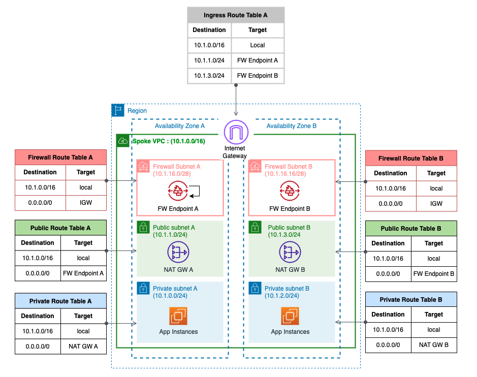

# Using AWS Network Firewall for Inbound/Outbound Traffic

* back to AWS Cloud Institute repo's root [aci.md](../../aci.md)
* back to [AWS Cloud Fundamentals 2](../aws-cloud-fundamentals-2.md)
* back to repo's main [README.md](../../../../README.md)

## Resources

* AwsRegion

---

## Lab Overview

As a network engineer, your role encompasses monitoring and troubleshooting of the network. Understanding the flow of traffic through the network, being able to identify where traffic is coming from, and ensuring that unauthorized access attempts are unsuccessful. This lab demonstrates the use of AWS Network Firewall to filter outbound web traffic using resources that are provisioned as part of this lab. You use Network Firewall Engine to inspect traffic and configure a stateful rule group to mitigate a threat against AWS workload. Finally, you set up CloudWatch Log Groups to monitor your network and detect anomalies. Based on the finding displayed in CloudWatch, you investigate and mitigate the suspected threats.

### Objectives

By the end of this lab, you should be able to do the following:

* Create and configure the AWS Network Firewall using the Network Firewall rule groups to filter outbound web traffic.
* Use CloudWatch Log Groups to filter queries for auditing and identifying potential threats.
* Configure stateful rule groups in AWS Network Firewall that follow Suricata-compatible intrusion prevention system (IPS) rule specifications.
* Apply stateful firewall rules to detect suspicious network traffic.
* Configure Firewall Policy and monitoring for AWS Network Firewall to hunt for suspicious network activity.
* Stop malicious activities identified through monitoring and investigation of security alerts.

### Prerequisites

This lab requires:

* Access to a computer with Microsoft Windows, Mac OS X, or Linux (Ubuntu, SuSE, or Red Hat)
* A modern internet browser such as Chrome or Firefox
* Familiarity with routing and DNS are recommended. You should also be comfortable working with the Command Line Interface (CLI) in a Linux environment.

### Duration

This lab requires approximately 90 minutes to complete.

Icon key
Various icons are used throughout this lab to call attention to certain aspects of the guide. The following list explains the purpose for each one:

 Additional information: Where to find more information.
 CAUTION: Information of special interest or importance (not so important to cause problems with the equipment or data if you miss it, but it could result in the need to repeat certain steps).
 Command: A command that you must run.
 Copy edit: A time when copying a command, script, or other text to a text editor (to edit specific variables within it) might be easier than editing directly in the command line or terminal.
 Expected output: A sample output that you can use to verify the output of a command or edited file.
 Note: A hint, tip, or important guidance.
 Task complete: A conclusion or summary point in the lab
 WARNING: An action that is irreversible and could potentially impact the failure of a command or process (including warnings about configurations that cannot be changed after they are made).

### Start lab

To launch the lab, at the top of the page, choose Start Lab.

 Caution: You must wait for the provisioned AWS services to be ready before you can continue.

To open the lab, choose Open Console .

You are automatically signed in to the AWS Management Console in a new web browser tab.

 Warning: Do not change the Region unless instructed.

Common sign-in errors
Error: Choosing Start Lab has no effect
In some cases, certain pop-up or script blocker web browser extensions might prevent the Start Lab button from working as intended. If you experience an issue starting the lab:

Add the lab domain name to your pop-up or script blocker’s allow list or turn it off.
Refresh the page and try again.
Lab environment
This lab deploys two Virtual Private Clouds (VPCs) one being the SpokeVPC and the other is MaliciousVPC. The MaliciousVPC and its resources are not shown in the following architecture diagram. As shown in the following architecture diagram, SpokeVPC has two private instances with a Network Address Translation Gateway (NAT Gateway) deployed in a dedicated public subnet allowing the private instances to communicate with resources on the internet. An AWS Network Firewall is deployed into the SpokeVPC VPC which requires protection. The two VPCs do not require connectivity to each other. AWS Network Firewall is deployed in a dedicated Firewall subnet which has access to Internet Gateway (IGW). Returning traffic from IGW is returned back to firewall Elastic Network Interface (ENI) using Inbound Routing table attached to the IGW. This ensures the traffic is symmetric for full inspection. This lab is pre-populated with a MaliciousInstance that is deployed in MaliciousVPC, performing a variety of activities that you detect as you configure security controls and monitoring.

In the preceding diagram, two VPCs are deployed which are SpokeVPC & MaliciousVPC where SpokeVPC has two private instances in separate Availability Zones with NAT Gateway deployed in dedicated public subnet allowing the private instances to communicate with resources on the internet. AWS Network Firewall is deployed into the Spoke VPC which requires protection.

Services used in this lab
Amazon VPC (Virtual Private Cloud)
Amazon VPC is a service that enables users to create and manage isolated virtual networks within the AWS infrastructure. With Amazon VPC, customers can configure their own IP address range, create subnets, and set up routing tables and network gateways. This allows for greater control over network security, traffic routing, and resource access within an organization’s cloud environment.

Amazon EC2 (Elastic Compute Cloud)
Amazon EC2 is a scalable compute service that allows users to run virtual servers in the AWS cloud. With EC2, customers can quickly provision and configure instances to meet their specific needs, including choosing the operating system, storage, and network settings. The service offers a variety of instance types and pricing options, making it suitable for a wide range of applications, from small-scale web hosting to large-scale data processing and analytics.

Amazon CloudWatch
Amazon CloudWatch is a monitoring service for AWS cloud resources and the applications you run on AWS. You can use Amazon CloudWatch to collect and track metrics, collect and monitor log files, and set alarms. Amazon CloudWatch can monitor AWS resources such as Amazon EC2 instances, Amazon DynamoDB tables, and Amazon RDS DB instances, as well as custom metrics generated by your applications and services, and any log files your applications generate. You can use Amazon CloudWatch to gain system-wide visibility into resource utilization, application performance, and operational health. You can use these insights to react and keep your application running smoothly.

AWS Network Firewall
AWS Network Firewall is a highly available, managed network firewall service for your Amazon Virtual Private Cloud (Amazon VPC). It enables you to easily deploy and manage stateful inspection, intrusion prevention and detection, and web filtering to protect your virtual networks on AWS. AWS Network Firewall automatically scales with your traffic, ensuring high availability with no additional customer investment in security infrastructure. While AWS Network Firewall secures the network traffic to your applications, Route 53 DNS firewall complements it by performing filtering and securing DNS query traffic to the Route 53 resolver.

There are 3 key components of AWS Network Firewall.

Rule Groups: Holds a reusable collection of criteria for inspecting traffic and for handling packets and traffic flows that match the inspection criteria.

Policy: Defines a reusable set of stateless and stateful rule groups, along with some policy-level behavior settings.

Firewall: Enforces the inspection rules in the firewall policy to the VPC that the rules protect. Each firewall requires one firewall policy. The firewall additionally defines settings like how to log information about your network traffic and the firewall’s stateful traffic filtering.

---

## Task 1: Verify firewall resources

In this task, is to verify the network firewall resources since an AWS Network Firewall has already been provisioned as part of this lab.

### Task 1.1 - List firewalls

Verify the Firewall policy and rule groups provisioned as part of this lab.

At the top of the page, in the unified search bar, search for and choose VPC.

In the navigation pane, under Network Firewall, choose Firewalls.

Choose the pre-configured Firewall link: SpokeVPC-InspectionFirewall

Task 1.2 - Firewall details
Review the following information:

i. What is the current status of the Firewall?

ii. What policy has been associated with the Firewall?

iii. What Stateful rules are configured in the policy mentioned above?

Choose the Firewall details tab and this tab provides the following details:

Details of Firewall endpoints & status.
Logging configuration displaying Flow/Alert type and CloudWatch Log Group configurations.
Tags.
Task 1.3 - Firewall monitoring details
In this task you view the metrics for the Firewall.

Choose the Monitoring tab and this tab provides the following details on Firewall metrics for example:
How many packets are received/passed/dropped by Firewall Stateful Inspection?
Task 1.4 - List firewalls & rule groups
In this task, verify the rule group NetworkFirewall-DomainAllow-RuleGroup.

In the navigation pane, under Network Firewall, choose Network Firewall rule groups.

Choose the NetworkFirewall-DomainAllow-RuleGroup button to see more details.

You can observe that the Stateful rule group NetworkFirewall-DomainAllow-RuleGroup is allowing traffic matching domain .amazon.com and .amazonaws.com.

 Task complete: You have successfully created a Network Firewall and observed key features of the firewall.

Task 2: Outbound web filtering
In this task, you use AWS Network Firewall to filter outbound web traffic using resources previously provisioned as part of this lab.

Task 2.1 - List & verify EC2 instances
As part of this lab setup, an EC2 instance named SpokeVPC-TestInstance1 and SpokeVPC-TestInstance2 are pre-created in a Private Subnets of the SpokeVPC. In this task, you verify EC2 instance details.

At the top of the page, in the unified search bar, search for and choose EC2.

In the navigation pane, under Instances, choose Instances.

Select the instance SpokeVPC-TestInstance1.

Choose Connect from the navigation bar.

With Session Manager tab selected, choose Connect .

Now you are ready to test the firewall policy.

Task 2.2 - Verify domain filtering
In this task, you verify domain filtering by running the curl command.

 Command: On the SpokeVPC-TestInstance1 instance, run the following command:

curl -vLo /dev/null https://aws.amazon.com
 Example of expected output: You observe the output for the curl command. Notice that the curl command is completed successfully.

sh-4.2$ curl -vLo /dev/null https://aws.amazon.com
  % Total    % Received % Xferd  Average Speed   Time    Time     Time  Current
                                 Dload  Upload   Total   Spent    Left  Speed
  0     0    0     0    0     0      0      0 --:--:-- --:--:-- --:--:--     0*   Trying 3.163.24.103:443...
* Connected to aws.amazon.com (3.163.24.103) port 443
* ALPN: curl offers h2,http/1.1
* Cipher selection: ALL:!EXPORT:!EXPORT40:!EXPORT56:!aNULL:!LOW:!RC4:@STRENGTH
} [5 bytes data]
* TLSv1.2 (OUT), TLS handshake, Client hello (1):
} [512 bytes data]
*  CAfile: /etc/pki/tls/certs/ca-bundle.crt
*  CApath: none
{ [5 bytes data]
* TLSv1.2 (IN), TLS handshake, Server hello (2):
{ [100 bytes data]
* TLSv1.2 (IN), TLS handshake, Certificate (11):
{ [5089 bytes data]
* TLSv1.2 (IN), TLS handshake, Server key exchange (12):
{ [333 bytes data]
* TLSv1.2 (IN), TLS handshake, Server finished (14):
{ [4 bytes data]
* TLSv1.2 (OUT), TLS handshake, Client key exchange (16):
} [70 bytes data]
* TLSv1.2 (OUT), TLS change cipher, Change cipher spec (1):
} [1 bytes data]
* TLSv1.2 (OUT), TLS handshake, Finished (20):
} [16 bytes data]
* TLSv1.2 (IN), TLS change cipher, Change cipher spec (1):
{ [1 bytes data]
* TLSv1.2 (IN), TLS handshake, Finished (20):
{ [16 bytes data]
* SSL connection using TLSv1.2 / ECDHE-RSA-AES128-GCM-SHA256
* ALPN: server accepted h2
* Server certificate:
*  subject: CN=aws.amazon.com
*  start date: Jan 18 00:00:00 2024 GMT
*  expire date: Dec 31 23:59:59 2024 GMT
*  subjectAltName: host "aws.amazon.com" matched cert's "aws.amazon.com"
*  issuer: C=US; O=Amazon; CN=Amazon RSA 2048 M01
*  SSL certificate verify ok.
{ [5 bytes data]
* using HTTP/2
* [HTTP/2] [1] OPENED stream for https://aws.amazon.com/
* [HTTP/2] [1] [:method: GET]
* [HTTP/2] [1] [:scheme: https]
* [HTTP/2] [1] [:authority: aws.amazon.com]
* [HTTP/2] [1] [:path: /]
* [HTTP/2] [1] [user-agent: curl/8.3.0]
* [HTTP/2] [1] [accept: */*]
} [5 bytes data]
> GET / HTTP/2
> Host: aws.amazon.com
> User-Agent: curl/8.3.0
> Accept: */*
>
{ [5 bytes data]
< HTTP/2 200
< content-type: text/html;charset=UTF-8
< server: Server
< date: Tue, 18 Jun 2024 22:03:56 GMT
< x-amz-rid: YEKYNTZ0YB2K6DKAYJD1
< set-cookie: aws-priv=eyJ2IjoxLCJldSI6MCwic3QiOjB9; Version=1; Comment="Anonymous cookiefor privacy regulations"; Domain=.aws.amazon.com; Max-Age=31536000; Expires=Wed, 18 Jun 2025 22:03:56 GMT; Path=/; Secure
< set-cookie: aws_lang=en; Domain=.amazon.com; Path=/
< x-frame-options: SAMEORIGIN
< x-xss-protection: 1; mode=block
< strict-transport-security: max-age=63072000
< x-amz-id-1: YEKYNTZ0YB2K6DKAYJD1
< last-modified: Wed, 12 Jun 2024 03:13:50 GMT
< x-content-type-options: nosniff
< vary: accept-encoding,Content-Type,Accept-Encoding,User-Agent
< x-cache: Miss from cloudfront
< via: 1.1 13367f2265e830e1595737bd8f2eab92.cloudfront.net (CloudFront)
< x-amz-cf-pop: HIO52-P2
< x-amz-cf-id: qqAooVkmbdIot4z2CDG_WTMIwQjaM1Jx4EnE-tOGlUuhQRL4l5DemQ==
<
{ [16378 bytes data]
100  725k    0  725k    0     0  5487k      0 --:--:-- --:--:-- --:--:-- 5497k
* Connection #0 to host aws.amazon.com left intact
Now try testing this command again with another domain which is not permitted by default.

 Command: On the SpokeVPC-TestInstance1 instance, run the following command:

curl -vvv https://google.com -o /dev/null --max-time 5
 Example of expected output: Notice that the curl command times out eventually without any data returning.

sh-4.2$ curl -vvv https://google.com -o /dev/null --max-time 5
  % Total    % Received % Xferd  Average Speed   Time    Time     Time  Current
                                 Dload  Upload   Total   Spent    Left  Speed
  0     0    0     0    0     0      0      0 --:--:-- --:--:-- --:--:--     0*   Trying 142.251.33.110:443...
* Connected to google.com (142.251.33.110) port 443 (#0)
* ALPN: offers h2,http/1.1
* Cipher selection: ALL:!EXPORT:!EXPORT40:!EXPORT56:!aNULL:!LOW:!RC4:@STRENGTH
} [5 bytes data]
* TLSv1.2 (OUT), TLS handshake, Client hello (1):
} [512 bytes data]
*  CAfile: /etc/pki/tls/certs/ca-bundle.crt
*  CApath: none
  0     0    0     0    0     0      0      0 --:--:--  0:00:04 --:--:--     0* Connection timed out after 5000 milliseconds
  0     0    0     0    0     0      0      0 --:--:--  0:00:05 --:--:--     0
* Closing connection 0
curl: (28) Connection timed out after 5000 milliseconds
Task 2.3 - Update domain rule group
In this task, you update the domain rule group.

At the top of the page, in the unified search bar, search for and choose VPC.

In the navigation pane, under Network Firewall, choose Network Firewall rule groups.

Choose the NetworkFirewall-DomainAllow-RuleGroup rule group.

Scroll down to Domains (2) section and choose Edit .

In the Edit domains for NetworkFirewall-DomainAllow-RuleGroup pop-up window, under Domain names, add .google.com.

Choose Save .

Task 2.4 - Verify updated domain success
In this task, you verify that the updated domain group returns a success.

Now you have 3 domains that are allowed in this Rule Group.

 Command: Run the following command again on the SpokeVPC-TestInstance1 instance:

curl -vvv https://google.com -o /dev/null --max-time 5
 Example of expected output: Notice that the curl command completes successfully now that you have permitted the domain in Rule Group.

sh-4.2$ curl -vvv https://google.com -o /dev/null --max-time 5
  % Total    % Received % Xferd  Average Speed   Time    Time     Time  Current
                                 Dload  Upload   Total   Spent    Left  Speed
  0     0    0     0    0     0      0      0 --:--:-- --:--:-- --:--:--     0*   Trying 142.251.33.78:443...
* Connected to google.com (142.251.33.78) port 443 (#0)
* ALPN: offers h2,http/1.1
* Cipher selection: ALL:!EXPORT:!EXPORT40:!EXPORT56:!aNULL:!LOW:!RC4:@STRENGTH
} [5 bytes data]
* TLSv1.2 (OUT), TLS handshake, Client hello (1):
} [512 bytes data]
*  CAfile: /etc/pki/tls/certs/ca-bundle.crt
*  CApath: none
{ [5 bytes data]
* TLSv1.2 (IN), TLS handshake, Server hello (2):
{ [96 bytes data]
* TLSv1.2 (IN), TLS handshake, Certificate (11):
{ [6482 bytes data]
* TLSv1.2 (IN), TLS handshake, Server key exchange (12):
{ [149 bytes data]
* TLSv1.2 (IN), TLS handshake, Server finished (14):
{ [4 bytes data]
* TLSv1.2 (OUT), TLS handshake, Client key exchange (16):
} [70 bytes data]
* TLSv1.2 (OUT), TLS change cipher, Change cipher spec (1):
} [1 bytes data]
* TLSv1.2 (OUT), TLS handshake, Finished (20):
} [16 bytes data]
* TLSv1.2 (IN), TLS change cipher, Change cipher spec (1):
{ [1 bytes data]
* TLSv1.2 (IN), TLS handshake, Finished (20):
{ [16 bytes data]
* SSL connection using TLSv1.2 / ECDHE-ECDSA-AES128-GCM-SHA256
* ALPN: server accepted h2
* Server certificate:
*  subject: CN=*.google.com
*  start date: May 22 08:17:22 2023 GMT
*  expire date: Aug 14 08:17:21 2023 GMT
*  subjectAltName: host "google.com" matched cert's "google.com"
*  issuer: C=US; O=Google Trust Services LLC; CN=GTS CA 1C3
*  SSL certificate verify ok.
} [5 bytes data]
* using HTTP/2
* h2h3 [:method: GET]
* h2h3 [:path: /]
* h2h3 [:scheme: https]
* h2h3 [:authority: google.com]
* h2h3 [user-agent: curl/8.0.1]
* h2h3 [accept: */*]
* Using Stream ID: 1 (easy handle 0x864180)
} [5 bytes data]
> GET / HTTP/2
> Host: google.com
> user-agent: curl/8.0.1
> accept: */*
>
{ [5 bytes data]
< HTTP/2 301
< location: https://www.google.com/
< content-type: text/html; charset=UTF-8
< content-security-policy-report-only: object-src 'none';base-uri 'self';script-src 'nonce-MNvpA-8Q_2WZmYfQzKH8cA' 'strict-dynamic' 'report-sample' 'unsafe-eval' 'unsafe-inline' https: http:;report-uri https://csp.withgoogle.com/csp/gws/other-hp
< date: Fri, 16 Jun 2023 19:05:38 GMT
< expires: Sun, 16 Jul 2023 19:05:38 GMT
< cache-control: public, max-age=2592000
< server: gws
< content-length: 220
< x-xss-protection: 0
< x-frame-options: SAMEORIGIN
< alt-svc: h3=":443"; ma=2592000,h3-29=":443"; ma=2592000
<
{ [5 bytes data]
100   220  100   220    0     0   3470      0 --:--:-- --:--:-- --:--:--  3492
* Connection #0 to host google.com left intact
Task 2.5 - Verify alert logs captured in CloudWatch
In this task, you verify that the log group captured the blocked event.

 Note: It can take 5 to 10 minutes for logs to show up after the event.

At the top of the page, in the unified search bar, search for and choose CloudWatch.

In the navigation pane, under Logs, choose Log groups.

Choose the /NetworkFirewall/Alert Log group.

Select the latest Log streams /aws/network-firewall/alert/SpokeVPC-InspectionFirewall_.

You observe alerts being captured with all details under the log group.

In the Filter events dialog box type google.com and look for the Log event where google.com is being blocked.
 Expected output: An example output of the log event is show below:

{
    "firewall_name": "SpokeVPC-InspectionFirewall",
    "availability_zone": "us-west-2a",
    "event_timestamp": "1718748421",
    "event": {
        "app_proto": "tls",
        "src_ip": "10.1.1.154",
        "src_port": 31536,
        "event_type": "alert",
        "alert": {
            "severity": 1,
            "signature_id": 7,
            "rev": 1,
            "signature": "not matching any TLS allowlisted FQDNs",
            "action": "blocked",
            "category": ""
        },
        "flow_id": 1531467310370111,
        "dest_ip": "172.217.14.206",
        "proto": "TCP",
        "tls": {
            "sni": "google.com",
            "version": "UNDETERMINED",
            "ja3": {},
            "ja3s": {}
        },
        "dest_port": 443,
        "timestamp": "2024-06-18T22:07:01.273459+0000"
    }
}
Task 2.6 - Verify ICMP alerts
In this task, you verify the rule group: NetworkFirewall-IcmpAlert-RuleGroup. This allows all ICMP traffic to pass through which is captured in the logs.

 Command: Run the following command on the SpokeVPC-TestInstance1 instance:

ping 1.1.1.1 -c 5
 Example of expected output: An example output of the ping command is shown below:

sh-4.2$ ping 1.1.1.1 -c 5
PING 1.1.1.1 (1.1.1.1) 56(84) bytes of data.
64 bytes from 1.1.1.1: icmp_seq=1 ttl=31 time=10.3 ms
64 bytes from 1.1.1.1: icmp_seq=2 ttl=31 time=9.15 ms
64 bytes from 1.1.1.1: icmp_seq=3 ttl=31 time=8.98 ms
64 bytes from 1.1.1.1: icmp_seq=4 ttl=31 time=9.01 ms
64 bytes from 1.1.1.1: icmp_seq=5 ttl=31 time=18.8 ms

--- 1.1.1.1 ping statistics ---
5 packets transmitted, 5 received, 0% packet loss, time 4005ms
rtt min/avg/max/mdev = 8.985/11.276/18.838/3.816 ms
Navigate back to the CloudWatch console to view the logs. You can use the steps provided earlier in this task on how to navigate to Cloudwatch and view the logs.
 Example of expected output: A sample screen shot of the log event is show below:

{
    "firewall_name": "SpokeVPC-InspectionFirewall",
    "availability_zone": "us-west-2a",
    "event_timestamp": "1718748906",
    "event": {
        "icmp_type": 8,
        "src_ip": "10.1.1.154",
        "src_port": 0,
        "event_type": "alert",
        "alert": {
            "severity": 3,
            "signature_id": 1,
            "rev": 0,
            "signature": "",
            "action": "allowed",
            "category": ""
        },
        "flow_id": 1643632560597871,
        "dest_ip": "1.1.1.1",
        "proto": "ICMP",
        "icmp_code": 0,
        "dest_port": 0,
        "timestamp": "2024-06-18T22:15:06.551791+0000"
    }
}
 Task complete: You have successfully used AWS Network Firewall to filter and verify outbound web traffic in this task.

---

## Task 3: Using open source rules with AWS Network Firewall

In this task, you look at how you can utilize Open Source/Suricata compatible rules in AWS Network Firewall. For this example, you choose Suricata specific rules from the community such as Proofpoint’s OPEN ruleset found [here](https://rules.emergingthreats.net/open/). For more details on open-source and commercial rules from Proofpoint, check the resources section located at the end of the lab.

AWS Network Firewall can be setup in various deployment models depending on the requirements. For more information on the deployment models and how to setup firewalls, check the Additional Resources section.

### Task 3.1 - Download/Clone rules

For this lab, you need to choose “User-Agents” category from Proofpoint’s OPEN rules which can be used to detect suspicious user-agents. The rules can be found following this link, [here](https://rules.emergingthreats.net/open/suricata-5.0/rules/emerging-user_agents.rules).

32. To download the rules, right-click or control click and Save Link As to save the rule file to your local machine.

* [Download Rules here](https://rules.emergingthreats.net/open/suricata-5.0/rules/emerging-user_agents.rules)

Once downloaded, note down the location where the rules are saved so you can use it in next steps.

### Task 3.2 - Create rule Group with Suricata-compatible rules

In this task, you create a rule group with Suricata-compatible rules.

At the top of the page, in the unified search bar, search for and choose VPC.

In the navigation pane, under Network Firewall, choose Network Firewall rule groups.

Choose Create rule group .

On the Choose rule group type page, in the Rule group type section, configure the following:

For Rule group type, select Stateful rule group.
For Rule group format, select Suricata compatible rule string from the drop-down menu.
For Rule evaluation order, select Action order.
Choose Next .

On the Describe rule group page, in the Rule group details section:

For Name, enter NetworkFirewall-Emerging-User-Agents-Rules-RuleGroup.
For Description - optional, enter Emerging user agents rules rule group.
For Capacity, enter 300.
Choose Next .

On the Configure rules page, in the Rule variables - optional section:

In the IP set variables section:
For Variable name, enter HOME_NET.
For Values, enter 10.0.0.0/8.
The HOME_NET rule group variable is used to define source IP range eligible for processing in the Stateful Domain list and optionally Suricata compatible IPS Rule Groups. By default, it is set to the VPC CIDR where firewall endpoints are deployed.

In the Suricata compatible rule string section, in the text input field,  Copy edit: copy and paste the rules that you downloaded in Task 3 which contains the Emerging Threats User-Agents rules.
Choose Next .

On the Configure advanced settings - optional page, leave everything default and choose Next .

On the Add tags - optional page, leave everything default and choose Next .

On the Review and create page, choose Create rule group .

Task 3.3 - Modify firewall policy to add and forward traffic to stateful rule groups
In this task, you modify the Firewall policy to add and forward traffic to stateful rule groups.

In the navigation pane, under Network Firewall, choose Firewall policies.

Choose SpokeVPC-InspectionFirewall-Policy link to view details.

Before you add the new rule group that you created in the previous task, first remove the existing rule groups.

In the Stateful rule groups section, select these two rules:
NetworkFirewall-DomainAllow-RuleGroup
NetworkFirewall-IcmpAlert-RuleGroup
From the Actions drop-down menu, select Disassociate from policy and choose Disassociate from policy .
Now add the new rule group that you created in the previous task.

In the Stateful rule groups section, from the Actions drop-down menu, select Add unmanaged stateful rule groups.

Select NetworkFirewall-Emerging-User-Agents-Rules-RuleGroup.

Choose Add stateful rule group .

To ensure traffic is forwarded to stateful inspection engine, it is required to add a custom defined stateless rule group which cover the interesting traffic or set a default action for all stateless traffic to be forwarded to stateful rule groups in the firewall policy. For this lab, you can leave the settings under Stateless default actions as Forward to stateful rule groups.

Task 3.4 - Test and monitor
To generate interesting traffic, you must have compute resources for example EC2 instances which are protected by AWS Network Firewall.

For this task, there is a pre-created EC2 instance to generate request against signature # 2029569 from the Proofpoint’s OPEN rule set imported in the previous task which detects the suspicious user-agents.

Navigate to the SpokeVPC-TestInstance1 terminal and reconnect.

 Command: On the SpokeVPC-TestInstance1 instance, run the following command:

wget -U "easyhttp client" http://www.amazon.com -o /dev/null
This command generates a HTTP GET request with a user agent as easyhttp client. To check the logs, navigate to the CloudWatch console.

At the top of the page, in the unified search bar, search for and choose CloudWatch.

In the navigation pane, under Logs, choose Log groups.

Select /NetworkFirewall/Alert Log group.

Select the latest Log streams /aws/network-firewall/alert/SpokeVPC-InspectionFirewall_.

In the Filter events dialog box type easyhttp client and look for the Log event with “signature”: “ET USER_AGENTS Observed Suspicious UA (easyhttp client)”.

 Expected output: An example output of the log event for the HTTP GET request with a user agent as easyhttp client is shown below:

{
    "firewall_name": "SpokeVPC-InspectionFirewall",
    "availability_zone": "us-west-2a",
    "event_timestamp": "1718750170",
    "event": {
        "tx_id": 0,
        "app_proto": "http",
        "src_ip": "10.1.1.154",
        "src_port": 62488,
        "event_type": "alert",
        "alert": {
            "severity": 2,
            "signature_id": 2029569,
            "rev": 1,
            "metadata": {
                "attack_target": [
                    "Client_Endpoint"
                ],
                "created_at": [
                    "2020_03_04"
                ],
                "deployment": [
                    "Perimeter"
                ],
                "signature_severity": [
                    "Informational"
                ],
                "updated_at": [
                    "2020_03_04"
                ]
            },
            "signature": "ET USER_AGENTS Observed Suspicious UA (easyhttp client)",
            "action": "allowed",
            "category": "Potentially Bad Traffic"
        },
        "flow_id": 1620248694017212,
        "dest_ip": "3.163.18.236",
        "proto": "TCP",
        "http": {
            "hostname": "www.amazon.com",
            "url": "/",
            "http_user_agent": "easyhttp client",
            "http_method": "GET",
            "protocol": "HTTP/1.1",
            "length": 0
        },
        "dest_port": 80,
        "timestamp": "2024-06-18T22:36:10.845245+0000"
    }
}
This concludes how to import Suricata rule references into AWS Network Firewall.

Before moving on to next task, disassociate NetworkFirewall-Emerging-User-Agents-Rules-RuleGroup from the firewall policy and associate/add NetworkFirewall-DomainAllow-RuleGroup and NetworkFirewall-IcmpAlert-RuleGroup back to the firewall policy by following the below steps:

At the top of the page, in the unified search bar, search for and choose VPC.

In the navigation pane, under Network Firewall, choose Firewall policies.

Choose the SpokeVPC-InspectionFirewall-Policy.

To remove the rule group, navigate to the section Stateful rule groups and select the box for NetworkFirewall-Emerging-User-Agents-Rules-RuleGroup.

From the Actions drop-down menu, select Disassociate from policy and choose Disassociate from policy .

To add a new rule group from the Stateful rule groups section, navigate to the Actions drop-down menu, select Add unmanaged stateful rule groups.

Select the below rule groups under Stateful rule group:

NetworkFirewall-DomainAllow-RuleGroup
NetworkFirewall-IcmpAlert-RuleGroup
Choose Add stateful rule group .
 Task complete: You have successfully imported and utilized Open Source/Suricata compatible rules in AWS Network Firewall to detect suspicious traffic.

Task 4: Threat hunting with AWS Network Firewall
This task shows you how to quickly use AWS Network Firewall to hunt for suspicious network activity that may indicate a compromise of your infrastructure. In this task look for non-TLS TCP traffic that is traversing over port 443 on your network, this type of network traffic is uncommon and should be investigated. To generate some interesting traffic for you to investigate, the lab has already deployed compute resources which are protected by AWS Network Firewall along with a malicious host.

Task 4.1 - Create a firewall rule group to detect non-TLS traffic over TLS ports
In this task, you create a firewall rule group to detect non-TLS traffic over TLS ports.

In the navigation pane, under Network Firewall, choose Network Firewall rule groups.

Choose Create rule group .

On the Choose rule group type page, in the Rule group type section:

For Rule group type, select Stateful rule group.
For Rule group format, select Suricata compatible rule string from the drop-down menu.
For Rule evaluation order, select Action order.
Choose Next .

On the Describe rule group page, in the Rule group details section:

For Name, enter NetworkFirewall-Suricata-Detect-Non-TLS-Over-TLS-Ports-RuleGroup.
For Description - optional, enter This rule will detect non-TLS traffic over ports 443.
For Capacity, enter 10.
Choose Next .

On the Configure rules page, in the Rule variables - optional section:

In the IP set variables section:
For Variable name, enter HOME_NET.
For Values, enter 10.0.0.0/8.
The HOME_NET rule group variable is used to define source IP range eligible for processing in the Stateful Domain list and optionally Suricata compatible IPS Rule Groups. By default, it is set to the VPC CIDR where firewall endpoints are deployed.

In the Suricata compatible rule string section, in the text input field,  Copy edit: copy and paste the following Suricata rule:

alert tcp any any <> any 443 (msg:"SURICATA Port 443 but not TLS"; flow:to_server,established; app-layer-protocol:!tls; sid:2271003; rev:1;)
This rule will alert on TCP traffic from any interface in either direction <> over port 443 that is not !tls protocol.

Choose Next .

On the Configure advanced settings - optional page, leave everything default and choose Next .

On the Add tags - optional page, leave everything default and choose Next .

On the Review and create page, choose Create rule group .

Task 4.2 - Add the newly created firewall rule group to the existing firewall policy
In this task, you add the newly created firewall rule group to the existing firewall policy.

In the navigation pane, under Network Firewall, choose Firewall policies.

Choose SpokeVPC-InspectionFirewall-Policy link to begin editing it.

Under Stateful rule groups section, from the Actions drop-down menu, select Add unmanaged stateful rule groups.

Select NetworkFirewall-Suricata-Detect-Non-TLS-Over-TLS-Ports-RuleGroup.

Choose Add stateful rule group .

To ensure traffic is forwarded to stateful inspection engine, it is required to add a custom defined stateless rule group which cover the interesting traffic or set a default action for all stateless traffic to be forwarded to stateful rule groups in the firewall policy. For this lab, you can leave the settings under Stateless default actions as Forward to stateful rule groups.

Task 4.3 - Investigate the changes
In this task, you investigate the changes in the Monitoring tab and view the outputs.

In the navigation pane, under Network Firewall, choose Firewalls.

Choose SpokeVPC-InspectionFirewall link to view details.

Select the Monitoring tab to check and see if traffic is flowing through the Network Firewall.

 Note: It can take a few minutes to appear, choose the graph refresh button in the lower section until you see some traffic.

 Expected output: An example output of the Monitoring graph is shown below:

Monitoring Graph

Figure: An example output of traffic captured and shown on a graph.

At the top of the page, in the unified search bar, search for and choose CloudWatch.

In the navigation pane, under Logs, choose Log groups.

Select /NetworkFirewall/Alert Log group.

Select the latest Log streams /aws/network-firewall/alert/SpokeVPC-InspectionFirewall_ .

In the Filter events dialog box type SURICATA and look for the Log event with signature set as SURICATA Port 443 but not TLS and action set as allowed.

 Note: It may take 10-15 minutes before the logs show up in CloudWatch, which may populate multiple log streams. Select a few of the logs and investigate what the alerts show. Do you see anything suspicious? What protocol was actually in use?

 Expected output: An example output of the log event is show below:

{
    "firewall_name": "SpokeVPC-InspectionFirewall",
    "availability_zone": "us-west-2a",
    "event_timestamp": "1718752741",
    "event": {
        "app_proto": "ftp",
        "src_ip": "10.1.1.154",
        "src_port": 44591,
        "event_type": "alert",
        "alert": {
            "severity": 3,
            "signature_id": 2271003,
            "rev": 1,
            "signature": "SURICATA Port 443 but not TLS",
            "action": "allowed",
            "category": ""
        },
        "flow_id": 1069305490172826,
        "dest_ip": "44.227.148.51",
        "proto": "TCP",
        "app_proto_ts": "failed",
        "dest_port": 443,
        "timestamp": "2024-06-18T23:19:01.605020+0000"
    }
}
You discovered some instances are communicating non-TLS traffic over port 443, now what changes could you make to block that activity? Look at the Suricata rule you created to detect non-TLS traffic, what parameter change would drop the traffic?

At the top of the page, in the unified search bar, search for and choose VPC.

In the navigation pane, under Network Firewall, choose Network Firewall rule groups.

Choose the NetworkFirewall-Suricata-Detect-Non-TLS-Over-TLS-Ports-RuleGroup link rule group.

Under the Rules section, choose Edit .

Modify the existing rule to the following:

drop tcp any any <> any 443 (msg:"SURICATA Port 443 but not TLS"; flow:to_server,established; app-layer-protocol:!tls; sid:2271003; rev:1;)
Choose Save rule group .

At the top of the page, in the unified search bar, search for and choose CloudWatch.

In the navigation pane, under Logs, choose Log groups.

Select /NetworkFirewall/Alert Log group.

Select the latest Log streams /aws/network-firewall/alert/SpokeVPC-InspectionFirewall_ .

In the latest Log stream, search for the Log event with signature set as SURICATA Port 443 but not TLS and action set as blocked.

 Expected output: An example of the log event is show below:

{
    "firewall_name": "SpokeVPC-InspectionFirewall",
    "availability_zone": "us-west-2a",
    "event_timestamp": "1718753795",
    "event": {
        "app_proto": "ftp",
        "src_ip": "10.1.1.154",
        "src_port": 45106,
        "event_type": "alert",
        "alert": {
            "severity": 3,
            "signature_id": 2271003,
            "rev": 1,
            "signature": "SURICATA Port 443 but not TLS",
            "action": "blocked",
            "category": ""
        },
        "flow_id": 1602519276837686,
        "dest_ip": "44.227.148.51",
        "proto": "TCP",
        "app_proto_ts": "failed",
        "dest_port": 443,
        "timestamp": "2024-06-18T23:36:35.421069+0000"
    }
}
 Note: It is important to test your rules, some protocols behave differently depending on the ‘flow’ parameter, such as flow:to_server vs. flow:established, read more about the topic in the Additional Resources section.

 Task complete: You have successfully used AWS Network Firewall as an effective service for blocking unwanted network activity. Additionally, because of the integration of Suricata rules you have incredible flexibility and control over your AWS VPC network.

Conclusion
You have successfully done the following:

Created and configure the AWS Network Firewall using the Network Firewall rule groups to filter outbound web traffic.
Used CloudWatch Log Groups to filter queries for auditing and identifying potential threats.
Configured stateful rule groups in AWS Network Firewall that follow Suricata-compatible intrusion prevention system (IPS) rule specifications.
Applied stateful firewall rules to detect suspicious network traffic.
Configured Firewall Policy and monitoring for AWS Network Firewall to hunt for suspicious network activity.
Stopped malicious activities identified through monitoring and investigation of security alerts.

### End lab

Follow these steps to close the console and end your lab.

102. Return to the **AWS Management Console**.
103. At the upper-right corner of the page, choose **AWSLabsUser**, and then choose **Sign out**.
104. Choose **End Lab** and then confirm that you want to end your lab.

---

### Additional resources

* For more information about AWS Network Firewall, see [AWS Network Firewall](https://docs.aws.amazon.com/network-firewall/latest/developerguide/what-is-aws-network-firewall.html).
* For more information about Deployment Model for AWS Network Firewall, see [Deployment Model for AWS Network Firewall (blog)](https://aws.amazon.com/blogs/networking-and-content-delivery/deployment-models-for-aws-network-firewall/).
* For more details on open-source and commercial rules from Proofpoint, see [ET Pro Ruleset](https://www.proofpoint.com/au/products/et-pro-ruleset).
* For more information about Flow Keywords, see [Flow Keywords](https://docs.suricata.io/en/suricata-6.0.0/rules/flow-keywords.html).

---
