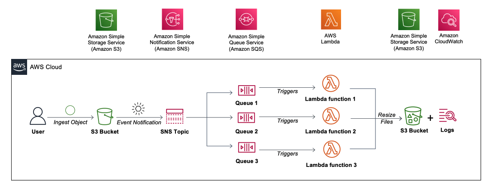

# Using Amazon SNS and SQS in event-driven architectures

* back to AWS Cloud Institute repo's root [aci.md](../../aci.md)
* back to [AWS Cloud Fundamentals 2](../aws-cloud-fundamentals-2.md)
* back to repo's main [README.md](../../../../README.md)

## Resources

* Topic ARN: arn:aws:sns:us-east-1:514795841966:resize-image-topic-1974
* Topic owner: 514795841966

## Lab overview

AWS solutions architects increasingly adopt event-driven architectures to decouple distributed applications. Often, these events must be propagated in a strictly ordered way to all subscribed applications. Using Amazon Simple Notification Service (Amazon SNS) topics and Amazon Simple Queue Service (Amazon SQS) queues, you can address use cases that require end-to-end message ordering, deduplication, filtering, and encryption. In this lab, you configure an Amazon Simple Storage Service (Amazon S3) bucket to invoke an Amazon SNS notification whenever an object is added to an S3 bucket. You learn how to create and interact with SQS queues, and learn how to invoke an AWS Lambda function using Amazon SQS. This scenario helps you understand how you can architect your application to respond to Amazon S3 bucket events using serverless services such as Amazon SNS, AWS Lambda, and Amazon SQS.

### Objectives

By the end of this lab, you should be able to do the following:

Understand the value of decoupling resources.
Understand the potential value of replacing Amazon Elastic Compute Cloud (Amazon EC2) instances with Lambda functions.
Create an Amazon SNS topic.
Create Amazon SQS queues.
Create event notifications in Amazon S3.
Create AWS Lambda functions using preexisting code.
Invoke an AWS Lambda function from SQS queues.
Monitor AWS Lambda S3 functions through Amazon CloudWatch Logs.
Duration
This lab requires approximately 60 minutes to complete.

Icon key
Various icons are used throughout this lab to call attention to different types of instructions and notes. The following list explains the purpose for each icon:

 Caution: Information of special interest or importance (not so important to cause problems with the equipment or data if you miss it, but it could result in the need to repeat certain steps).
 Copy edit: A time when copying a command, script, or other text to a text editor (to edit specific variables within it) might be easier than editing directly in the command line or terminal.
 Expected output: A sample output that you can use to verify the output of a command or edited file.
 Note: A hint, tip, or important guidance.
 Task complete: A conclusion or summary point in the lab.
 Warning: An action that is irreversible and could potentially impact the failure of a command or process (including warnings about configurations that cannot be changed after they are made).
Start lab
To launch the lab, at the top of the page, choose Start Lab.

 Caution: You must wait for the provisioned AWS services to be ready before you can continue.

To open the lab, choose Open Console .

You are automatically signed in to the AWS Management Console in a new web browser tab.

 Warning: Do not change the Region unless instructed.

Common sign-in errors
Error: Choosing Start Lab has no effect
In some cases, certain pop-up or script blocker web browser extensions might prevent the Start Lab button from working as intended. If you experience an issue starting the lab:

Add the lab domain name to your pop-up or script blocker’s allow list or turn it off.
Refresh the page and try again.

#### Lab environment

In this lab, you should be examining and enhancing an event-driven architecture utilized by AnyCompany. At present, the AnyCompany Customer Care team captures product images and uploads them to an ingest S3 bucket. Following this, the development team executes a series of Python scripts to resize these images. When a file is uploaded to the ingest bucket, it triggers an event notification that is sent to an Amazon SNS topic. Subsequently, Amazon SNS distributes the notifications to three distinct SQS queues.

The original design involved running EC2 instances in Auto Scaling groups for each resizing operation. However, after evaluating this design, you should recommend replacing the EC2 instances with Lambda functions. These Lambda functions should process the images in three different formats and save the resulting output in a separate S3 bucket. This updated design is aimed at being more cost-effective.

The following diagram shows the basic architecture of the lab environment:

Image description: The preceding diagram depicts the application workflow. When a user uploads an image to the S3 Bucket, an S3 event notification is sent to an SNS topic. The topic has three subscribed SQS queues, which in turn, trigger three lambda functions that resize the image and save the copies to a different folder in the S3 bucket.

The scenario workflow is as follows:

A user uploads an image file to an Amazon S3 bucket.
Uploading the file invokes an event notification to an Amazon SNS topic.
Amazon SNS then distributes the notifications to three separate SQS queues.
The Lambda functions process the images in three formats and save the output to the S3 bucket folder.
You validate the processed images in the S3 bucket folders and the logs in Amazon CloudWatch.
Task 1: Create a standard Amazon SNS topic
In this task, you create an Amazon SNS topic.

At the top of the AWS Management Console, in the search box, search for and choose Simple Notification Service.

Expand the navigation menu by choosing the menu icon  in the upper-left corner.

From the left navigation menu, choose Topics.

Choose Create topic.

On the Create topic page, in the Details section, configure the following:

Type: Choose Standard.
Name: Enter a unique SNS topic name, such as resize-image-topic, followed by four random numbers.
Choose Create topic.

 Expected output:

 Topic resize-image-topic-xxxx created successfully.

 Note: The topic’s Name, Amazon Resource Name (ARN), and topic owner’s AWS account ID are displayed in the Details section.

 Copy edit: Copy the topic ARN and Topic owner values to your favorite text editor. You need these values later in the lab.

 Task complete: You have created an Amazon SNS topic.

Task 2: Create three Amazon SQS queues
In this task, you create three Amazon SQS queues. Each of the queues will be subscribed to the SNS topic you created in the previous task and will trigger a different AWS Lambda function.

Task 2.1: Create an Amazon SQS queue for the thumbnail
At the top of the AWS Management Console, in the search box, search for and choose Simple Queue Service.

On the SQS home page, choose Create queue.

On the Create queue page, in the Details section, configure the following:

Type: Choose Standard (the Standard queue type is set by default).
Name: Enter thumbnail-queue.
The console sets default values for the queue Configuration parameters. Leave the default values.

Choose Create queue.

 Expected output:

 Queue thumbnail-queue created successfully

Task 2.2: Subscribe the SQS queue to the SNS topic
On the queue’s detail page, choose the SNS subscriptions tab.

Choose Subscribe to Amazon SNS topic.

A new Subscribe to Amazon SNS topic page opens.

Open the Specify an Amazon SNS topic available for this queue menu. In the Use existing resource section, choose the resize-image-topic SNS topic you previously created.

 Note: If the SNS topic is not listed in the menu, choose Enter Amazon SNS topic ARN and then enter the topic ARN that was copied earlier.

Choose Save.

 Expected output:

 Subscribed successfully to topic arn:aws:sns:ap-northeast-1:612967679350:resize-image-topic-xxxx.

Task 2.3: Create two more SQS queues and subscribe them to the SNS topic
Create two more standard SQS queues, one named web-queue and one named mobile-queue.

Use the following configurations for the two additional queues:

Create an SQS queue for web-sized images with the following steps:

In the left navigation pane, choose Queues.

Choose Create queue.

On the Create queue page, in the Details section, configure the following:

Type: Choose Standard (the Standard queue type is set by default).
Name: Enter web-queue.
Choose Create queue.

 Expected output:

 Queue web-queue created successfully

Create an SQS Queue for mobile-sized images with the following steps:

On the Create queue page, in the Details section, configure the following:

Type: Choose Standard (the Standard queue type is set by default).
Name: Enter: mobile-queue.
Choose Create queue.

 Expected output:

 Queue mobile-queue created successfully

Now that the web-queue and mobile queues have been created, they need to be subscribed to the resize-image-topic-xxxx topic. Repeat the steps 15-18 you followed in Task 2.2 to subscribe these queues to the topic.

 Expected output:

 Subscribed successfully to topic arn:aws:sns:ap-northeast-1:612967679350:resize-image-topic-xxxx.

 Task complete: You have successfully created three Amazon SQS queues and subscribed them to a topic that sends notification messages.

Task 3: Create an Amazon S3 event notification
In this task, you create an Amazon S3 event notification that sends your SNS Topic a notification whenever an object is added to your ingest S3 bucket.

Task 3.1: Configure the Amazon SNS access policy to allow the Amazon S3 bucket to publish to a topic
At the top of the AWS Management Console, in the search box, search for and choose Simple Notification Service.

From the left navigation menu, choose Topics.

Choose the resize-image-topic-xxxx topic.

Choose Edit.

Navigate to the Access policy section and expand it, if necessary.

Delete the existing content from the JSON editor.

Copy the following code block and paste it into the JSON Editor section.

{
"Version": "2008-10-17",
"Id": "__default_policy_ID",
"Statement": [
    {
    "Sid": "__default_statement_ID",
    "Effect": "Allow",
    "Principal": {
        "AWS": "*"
    },
    "Action": [
        "SNS:GetTopicAttributes",
        "SNS:SetTopicAttributes",
        "SNS:AddPermission",
        "SNS:RemovePermission",
        "SNS:DeleteTopic",
        "SNS:Subscribe",
        "SNS:ListSubscriptionsByTopic",
        "SNS:Publish",
        "SNS:Receive"
    ],
    "Resource": "SNS_TOPIC_ARN",
    "Condition": {
        "StringEquals": {
        "AWS:SourceAccount": "SNS_TOPIC_OWNER"
        }
    }
    },
    {
    "Effect": "Allow",
    "Principal": {
        "Service": "s3.amazonaws.com"
    },
    "Action": "SNS:Publish",
    "Resource": "SNS_TOPIC_ARN",
    "Condition": {
        "StringEquals": {
        "AWS:SourceAccount": "SNS_TOPIC_OWNER"
        }
    }
    }
]
}
 Note: The Access Policy you pasted into the JSON editor includes two placeholders: SNS_TOPIC_OWNER and SNS_TOPIC_ARN. You update these values in the following steps.

Replace the two occurrences of SNS_TOPIC_OWNER with the Topic owner (12-digit AWS Account ID) value that you copied in Task 1. Make sure to leave the double quotes.

Replace the two occurrences of SNS_TOPIC_ARN with the SNS topic ARN your copied in Task 1. Make sure to leave the double quotes.

 Caution: Verify that both instances of SNS_TOPIC_OWNER and SNS_TOPIC_ARN have been replaced.

 Note: If you get an error message, ensure the quotations are on the same line of code after copying the ARN value.

Choose Save changes.

 Expected output:

Topic resize-image-topic-xxxx saved successfully.

Task 3.2: Creating a single S3 event notification on uploads to the ingest S3 bucket
At the top of the AWS Management Console, in the search box, search for and choose S3.

On the Buckets page, choose the bucket hyperlink with a name like labstack-xxxxx-labbucket-xxxxx.

Choose the Properties tab.

Scroll to the Event notifications section.

 Note: The permission errors you see under the AWS CloudTrail data events section can be ignored because the labuser does not have the permissions to that data.

Choose Create event notification.

In the General configuration section, do the following:

Event name: Enter resize-image-event.
Prefix - optional: Enter ingest/.
Suffix - optional: Enter .jpg.
 Note: You can use prefix and suffix filters to limit the number of notifications that are sent. In this case, you’ve used a prefix filter that only sends notifications when objects are added to the ingest folder, as well as a suffix filter that only sends notifications when files whose names end in jpg are added to the bucket.

In the Event types section, select  All object create events.

In the Destination section, configure the following:

Destination: Select SNS topic.
Specify SNS topic: Select Choose from your SNS topics.
SNS topic: Choose the resize-image-topic-xxxx SNS topic from the dropdown menu.
Alternatively, if you prefer to specify an ARN, choose Enter ARN and enter the ARN you copied in Task 1.

Choose Save changes.

 Expected output:

 Successfully created event notification “resize-image-event”.

 Task complete: You have successfully created an Amazon S3 event notification.

Task 4: Create and configure three AWS Lambda functions
In this task, you create, configure, and deploy three AWS Lambda functions. Each function is created by uploading a deployment package containing the function code and its dependencies.

Task 4.1: Create a Lambda function to generate a thumbnail
Start by creating an AWS Lambda function with an SQS trigger that reads an image from Amazon S3, resizes the image, and then stores the new image in an Amazon S3 bucket folder.

At the top of the AWS Management Console, in the search box, search for and choose Lambda.

Choose Create function.

In the Create function window, select Author from scratch.

In the Basic information section, configure the following:

Function name: Enter CreateThumbnail.
Runtime: Choose Python 3.9.
Expand the  Change default execution role section.
Execution role: Select Use an existing role.
Existing role: Choose the role with the name like xxxxx-LabExecutionRole-xxxxx.
 Note: This role provides your Lambda function with the permissions it needs to access Amazon S3 and Amazon SQS.

 Caution: Make sure to choose Python 3.9 under Other supported runtime.

Choose Create function.

 Expected output:

 Successfully created the function CreateThumbnail. You can now change its code and configuration. To invoke your function with a test event, choose “Test”.

Task 4.2: Configure the Lambda function to add an SQS trigger and upload the python deployment package
Now that you’ve created the function, you need to add your code and assign it a trigger. AWS Lambda functions can be initiated automatically by events, such as data being received by Amazon Kinesis or data being updated in an Amazon DynamoDB database. In this lab, you initiate the Lambda function whenever a new object is pushed to your Amazon SQS queue.

Choose  Add trigger and then configure the following:

Select a trigger: Choose SQS.
SQS Queue: Choose thumbnail-queue.
Ensure that  Activate trigger is selected.
Batch Size: Enter 1.
Scroll to the bottom of the page, and then choose Add.

 Expected output:

 The trigger thumbnail-queue was successfully added to function CreateThumbnail. The trigger is in a disabled state.

The SQS trigger is added to your Function overview page. Now configure the Lambda function.

Choose the Code tab.

Rather that manually entering your Python code into the code editor, you upload it as a deployment package.

Follow the subsequent steps to add your code to the Lambda function:

Use the context (right-click) menu to save the following file to your computer: CreateThumbnail.zip
Open the Upload from  menu and choose .zip file.
Choose the  Upload button, then navigate to and select the deployment package you saved to your computer.
Choose Save.
 Expected output:

 Successfully updated the function CreateThumbnail.

Examine the CreateThumbnail.zip file which contains the following Lambda function. It performs the following steps:

Receives an event, which contains the name of the incoming object (Bucket, Key)
Downloads the image to local storage
Resizes the image using the Pillow library
Creates and uploads the resized image to a new folder
 Caution: Do not copy this code—it is just an example to show what is in the zip file.

import boto3
import os
import sys
import uuid
from PIL import Image
import PIL.Image
import json
import time

s3_client = boto3.client('s3')
s3 = boto3.resource('s3')

def resize_image(image_path, resized_path):
    with Image.open(image_path) as image:
        image.thumbnail((128, 128))
        image.save(resized_path)

def handler(event, context):
    for record in event['Records']:

        payload = record["body"]
        sqs_message=json.loads(str(payload))
        bucket_name =  json.loads(str(sqs_message["Message"]))["Records"][0]["s3"]["bucket"]["name"]
        print(bucket_name)
        key=json.loads(str(sqs_message["Message"]))["Records"][0]["s3"]["object"]["key"]
        print(key)
        download_path = '/tmp/{}{}'.format(uuid.uuid4(), key.split("/")[1])
        upload_path = '/tmp/resized-{}'.format(key.split("/")[1])

        s3_client.download_file(bucket_name, key, download_path)
        resize_image(download_path, upload_path)
        s3.meta.client.upload_file(upload_path, bucket_name, 'thumbnail/Thumbail-'+key.split("/")[1])
In the Runtime settings section, choose Edit.

In the Handler text field, enter CreateThumbnail.handler.
 Caution: Make sure you set the Handler field to the preceding value, otherwise the Lambda function would not be found.

Choose Save.

 Expected output:

 Successfully updated the function CreateThumbnail.

Choose the Configuration tab.

Choose General configuration from the panel on the left side of the screen.

Choose Edit.

In the Description text field, enter: Create a thumbnail-sized image.
Leave the other settings at the default settings. Here is a brief explanation of these settings:

Memory defines the resources that are allocated to your function. Increasing memory also increases the CPU allocated to the function.
Timeout sets the maximum duration for function processing.
Choose Save.

 Expected output:

 Successfully updated the function CreateThumbnail.

Task 4.3: Create and configure two more Lambda functions
Next, you repeat this process to create and configure two more Lambda functions used to generate web and mobile images. Use the following configurations:

Create a Lambda function to generate a web image:

Function name: Enter CreateWebImage.

Runtime: Choose Python 3.9.

Choose the existing Execution role with the name like xxxxx-LabExecutionRole-xxxxx.

Select a trigger: Choose SQS.

SQS Queue: Choose web-queue.

Ensure that  Activate trigger is selected.

Batch Size: Enter 1.

Download and save the following zip file:

Use the context (right-click) menu to save the following file to your computer: CreateWebImage.zip.
Choose the Code tab.

Choose Upload from , and choose .zip file.

Choose  Upload, and upload the downloaded zip file.

Choose Save.

In the Runtime settings section, choose Edit

In the Handler text field, enter: CreateWebImage.handler.

Choose the Configuration tab.

Choose General configuration from the panel on the left side of the screen.

Choose Edit.

In the Description text field, enter: Create a web-sized image.

Create a Lambda function to generate a mobile image:

Function name: Enter CreateMobileImage.

Runtime: Choose Python 3.9.

Choose the existing Execution role with the name like xxxxx-LabExecutionRole-xxxxx.

Select a trigger: Choose SQS.

SQS Queue: Choose mobile-queue.

Ensure that  Activate trigger is selected.

Batch Size: Enter 1.

Download and save the following zip file:

Use the context (right-click) menu to save the following file to your computer: CreateMobileImage.zip.
Choose the Code tab.

Choose Upload from , and choose .zip file.

Choose  Upload, and upload the downloaded zip file.

Choose Save.

In the Runtime settings section, choose Edit

In the Handler text field, enter: CreateMobileImage.handler.

Choose the Configuration tab.

Choose General configuration from the panel on the left side of the screen.

Choose Edit.

In the Description text field, enter: Create a mobile-sized image.

With these configurations, you should have all three of your Lambda functions ready for the test.

 Task complete: You have successfully created and configured Lambda functions.

Task 5: Upload an object to the Amazon S3 bucket
In this task, you upload an object to the S3 bucket using the S3 console.

Download one of the following images to test your architecture:

Use the context (right-click) menu to download and save an image showing the AWS logo: AWS.jpg.

Use the context (right-click) menu to download and save an image showing the the Mona Lisa: MonaLisa.jpg.

Use the context (right-click) menu to download and save an image showing a Happy Face: HappyFace.jpg.

Save your file with a name similar to InputFile.jpg.

 Caution: Recall that you created a suffix filter that only triggers on files with a .jpg extension. Ensure that the file is saved with this extension and not .jpeg.

At the top of the AWS Management Console, in the search box, search for and choose S3.

In the S3 Management Console, choose the xxxxx-labbucket-xxxxx bucket hyperlink.

Choose the ingest/ link.

Choose Upload.

In the Upload window, choose Add files.

Browse to and choose the downloaded .jpg image file.

Choose Upload.

 Expected output:

 Upload succeeded.

 Congratulations! You have successfully uploaded images to S3 bucket.

Task 6: Validate the processed file
In this task, you use Amazon CloudWatch Logs to validate that the file you uploaded triggered all three Lambda functions and that the processed files were uploaded to S3.

Task 6.1: Search Amazon CloudWatch Logs for Lambda activity
You can monitor AWS Lambda functions to identify problems and view log files to assist in debugging.

At the top of the AWS Management Console, in the search box, search for and choose Lambda.

Choose the hyperlink for one of your Create- functions.

Choose the Monitor tab.

The console displays graphs showing the following:

Invocations: The number of times that the function was invoked.
Duration: The average, minimum, and maximum execution times.
Error count and success rate (%): The number of errors and the percentage of executions that completed without error.
Throttles: When too many functions are invoked simultaneously, they are throttled. The default is 1000 concurrent executions.
Async delivery failures: The number of errors that occurred when Lambda attempted to write to a destination or dead-letter queue.
Iterator Age: Measures the age of the last record processed from streaming triggers (Amazon Kinesis and Amazon DynamoDB Streams).
Concurrent executions: The number of function instances that are processing events.
Log messages from Lambda functions are retained in Amazon CloudWatch Logs.

Choose View CloudWatch logs.

Choose the hyperlink for the Log stream with the most recent timestamp.

Expand  each message to view the log message details.

The REPORT line provides the following details:

RequestId: The unique request ID for the invocation
Duration: The amount of time that your function’s handler method spent processing the event
Billed Duration: The amount of time billed for the invocation
Memory Size: The amount of memory allocated to the function
Max Memory Used: The amount of memory used by the function
Init Duration: For the first request served, the amount of time it took the runtime to load the function and run code outside of the handler method
In addition, the logs display any logging messages or print statements from the functions. This assists with debugging Lambda functions.

Task 6.2: Validate the S3 bucket for processed files
At the top of the AWS Management Console, in the search box, search for and choose S3.

Choose the hyperlink for xxxxx-labbucket-xxxxx to enter the bucket.

You should now see the following three new folders:

thumbnail
web
mobile
Navigate through these folders to find the resized images (for example, Thumbnail-AWS.jpg, WebImage-HappyFace.jpg, MobileImage-MonaLisa.jpg).

If you find the resized image here, you have successfully resized the image from its original to three different formats.

 Task complete: You have successfully validated the processed image file from the logs generated by the function code through Amazon CloudWatch Logs.

Challenge tasks
Challenge tasks are optional and are provided in case you have extra time remaining in your lab. If you need assistance, expand the Solution menus to reveal additional information.

(Optional) Task 1: Create a lifecycle configuration to delete files in the ingest bucket after 30 days.
Task 1 Solution
Optional Task 1 Solution: Create a lifecycle configuration to delete files in the ingest bucket after 30 days
At the top of the AWS Management Console, in the search box, search for and choose S3.

On the Buckets page, choose the xxxxx-labbucket-xxxxx bucket.

Choose the Management tab.

In the Lifecycle rules section, choose Create lifecycle rule.

In the Lifecycle rule configuration section, configure the following:

Lifecycle rule name: Enter cleanup.
Choose a rule scope: Choose Limit the scope of this rule using one or more filters.
In the Filter type section, configure the following:
Prefix: Enter ingest/.
In the Lifecycle rule actions section, configure the following:
Select  Expire current versions of objects and  Permanently delete noncurrent versions of objects.
Enter the following values in the new boxes that open.
Days after object creation: Enter 30.
Days after objects become noncurrent: Enter 1.
Choose Create rule.
 Expected service output:

 The lifecycle configuration was updated. Lifecycle rule “cleanup” was successfully added.

(Optional) Task 2: Add an SNS email notification to the existing SNS topic.
Task 2 Solution
Optional Task 2 Solution: Add an SNS email notification to the existing SNS topic
At the top of the AWS Management Console, in the search box, search for and choose Simple Notification Service.

In the left navigation pane, choose Subscriptions

On the Subscriptions page, choose Create subscription.

On the Create subscription page, in the Details section, configure the following:

Topic ARN: Choose the ARN of the topic created.
Protocol: Choose Email.
Endpoint: Enter an email address.
Choose Create subscription.
 Expected service output:

 Subscription to resize-image-topic-xxxx created successfully.

The console creates the subscription and opens the subscription’s Details page.

 Note: You must confirm the subscription before the email address can start to receive messages.

To confirm a subscription, check your email inbox and choose Confirm subscription in the email from Amazon SNS.
Amazon SNS opens your web browser and displays a subscription confirmation with your subscription ID.

### Conclusion

Congratulations! You have successfully done the following:

* Created an Amazon SNS topic
* Created Amazon SQS queues
* Created event notifications in Amazon S3
* Created AWS Lambda functions using preexisting code
* Invoked an AWS Lambda function from SQS queues
* Monitored AWS Lambda S3 functions through Amazon CloudWatch Logs

### End lab

Follow these steps to close the console and end your lab.

95. Return to the **AWS Management Console**.
96. At the upper-right corner of the page, choose **AWSLabsUser**, and then choose **Sign out**.
97. Choose **End Lab** and then confirm that you want to end your lab.

---
