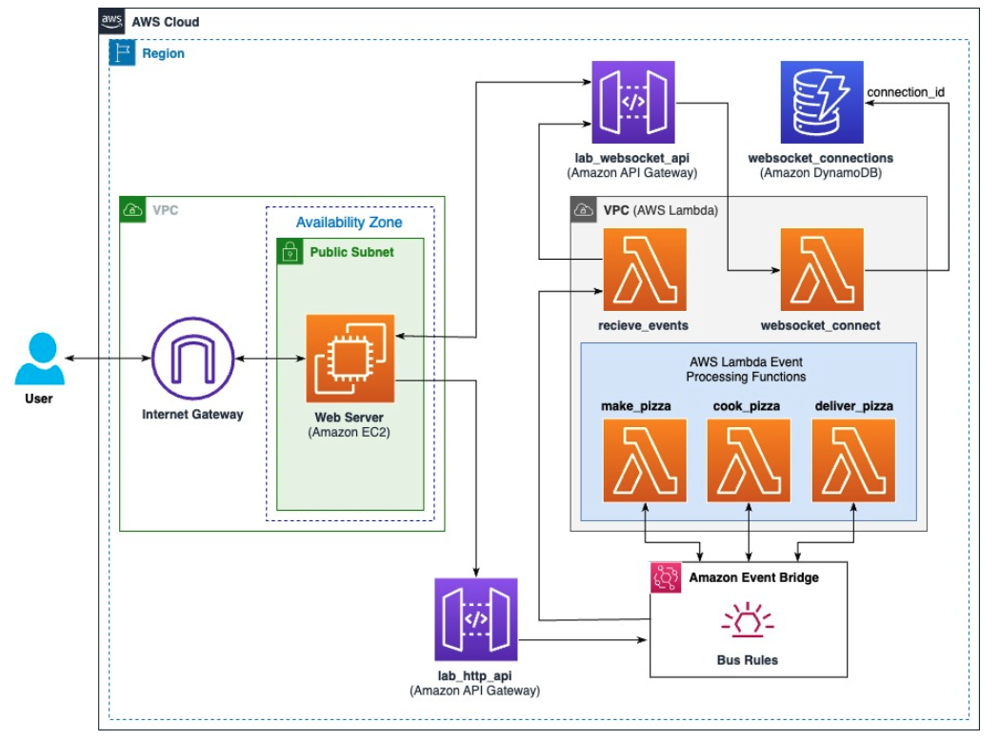
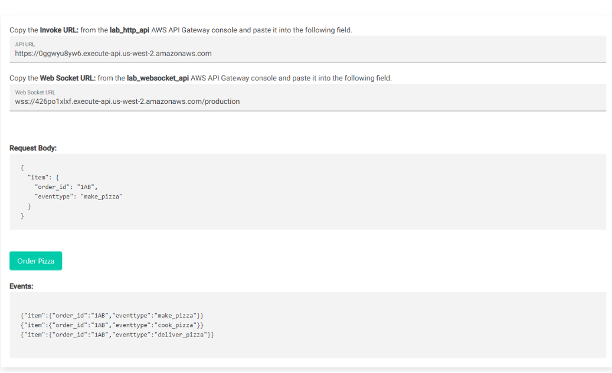

# Building Decoupled Architectures with Amazon EventBridge

* back to AWS Cloud Institute repo's root [aci.md](../../aci.md)
* back to [AWS Cloud Fundamentals 2](../aws-cloud-fundamentals-2.md)
* back to repo's main [README.md](../../../../README.md)

## Resources

* Event bus ARN: arn:aws:events:us-west-2:641999446704:event-bus/lab_event_bus
* Invoke URL: https://w87i4c0ru1.execute-api.us-west-2.amazonaws.com
* WebSocket URL: wss://cqzeik68c0.execute-api.us-west-2.amazonaws.com/production/
* @connections URL: https://cqzeik68c0.execute-api.us-west-2.amazonaws.com/production/

## Lab overview

This lab shows you the power of combining microservices, event-driven architectures, and serverless architectures. Microservices are an architectural and organizational approach to software development where software is composed of small independent services that communicate over well-defined APIs. An event-driven architecture uses events to start and communicate between decoupled services and is common in modern applications built with microservices. A serverless architecture is a way to build and run applications and services without having to manage infrastructure. This lab brings these concepts together to build an event-driven serverless architecture using Amazon API Gateway, Amazon EventBridge, and AWS Lambda that orchestrates and processes events for a pizza ordering system.

In this lab, you will configure an HTTP API on API Gateway to redirect requests to EventBridge. You will create event bus rules that match a request and forward events to Lambda functions. Events processed by the Lambda functions are sent back to the bus as a new event. Each time an event is published to the event bus, a separate Lambda function receives the event and post it back to the client application using a WebSocket connection hosted on an API Gateway.

### Objectives

By the end of this lab, you should be able to:

Create a Lambda function and configure environment variables.
Create EventBridge rules targeting Lambda functions.
Create an HTTP API and WebSocket endpoint using API Gateway.
Create an API Gateway method to integrate with EventBridge.
Icon key
Various icons are used throughout this lab to call attention to different types of instructions and notes. The following list explains the purpose for each icon:

 Caution: Information of special interest or importance (not so important to cause problems with the equipment or data if you miss it, but it could result in the need to repeat certain steps).
 Note: A hint, tip, or important guidance.
 Task complete: A conclusion or summary point in the lab.
 Warning: An action that is irreversible and could potentially impact the failure of a command or process (including warnings about configurations that cannot be changed after they are made).
Start lab
To launch the lab, at the top of the page, choose Start Lab.

 Caution: You must wait for the provisioned AWS services to be ready before you can continue.

To open the lab, choose Open Console .

You are automatically signed in to the AWS Management Console in a new web browser tab.

 Warning: Do not change the Region unless instructed.

Common sign-in errors
Error: Choosing Start Lab has no effect
In some cases, certain pop-up or script blocker web browser extensions might prevent the Start Lab button from working as intended. If you experience an issue starting the lab:

Add the lab domain name to your pop-up or script blocker’s allow list or turn it off.
Refresh the page and try again.

### Lab environment

The following diagram shows the architecture that you will build in this lab, which includes the following key resources: details the major resources in the diagram:

Amazon Virtual Private Cloud (Amazon VPC) with one public subnet.
Amazon Elastic Compute Cloud (Amazon EC2) instance acting as a web application server.
Amazon API Gateway HTTP API.
Amazon API Gateway WebSocket API.
Amazon EventBridge Bus with rules that route events to Lambda functions.
AWS Lambda functions that make, cook, and deliver pizza, receive events; and manage WebSocket connections.
Amazon DynamoDB table that stores WebSocket connection ids.

Image description: This architecture illustrates the event-driven, serverless architecture that you will build in this lab.

Services used in this lab
Amazon API Gateway
Amazon API Gateway enables you to create and deploy your own REST and WebSocket APIs at any scale. You can create robust, secure, and scalable APIs that access Amazon Web Services or other web services, as well as data that’s stored in the AWS Cloud. You can create APIs to use in your own client applications, or you can make your APIs available to third-party app developers.

Amazon EventBridge
Amazon EventBridge is a serverless event bus service that makes it easy to connect your applications with data from a variety of sources. EventBridge delivers a stream of real-time data from your own applications, software-as-a-service (SaaS) applications, and AWS services and routes that data to targets such as AWS Lambda. You can set up routing rules to determine where to send your data to build application architectures that react in real time to all of your data sources. EventBridge enables you to build event-driven architectures that are loosely coupled and distributed.

AWS Lambda
With AWS Lambda, you can run code without provisioning or managing servers. You pay only for the compute time that you consume—there’s no charge when your code isn’t running. You can run code for virtually any type of application or backend service—all with zero administration. Just upload your code and Lambda takes care of everything required to run and scale your code with high availability.

AWS services not used in this lab
AWS service capabilities used in this lab are limited to what the lab requires. Expect errors when accessing other services or performing actions beyond those provided in this lab guide.

Task 1: Create Lambda functions
In this task, you will create the following five Lambda functions:

Three functions that process specific events registered to the event bus. Each function processes an event and then sends a new event back to the bus. This starts the next function in the sequence.
One function that writes a WebSocket connection ID to an Amazon DynamoDB table.
One function that uses the connection ID to track and send event information back to the browser using the WebSocket connection.
These functions represent the application-specific microservices of establishing a persistent connection to the web application and event processing, which in this case produces pizza.

Task 1.1: Create the make_pizza Lambda function
To begin, you must first create the make_pizza Lambda function. This function receives an event, updates the value of the eventtype attribute to cook_pizza, and sends the event back to EventBridge. The cook_pizza event matches an EventBridge rule that targets another Lambda function.

In this task, you will create the make_pizza function.

At the top of the AWS Management Console, in the search bar, search for and choose Lambda.

Choose Create function.

On the Create function page, configure the following settings:

At the top of the page, select the  Author from scratch option.
For Function name, enter make_pizza.
For Runtime, select Python 3.12.
In the Change default execution role section, select Use an existing role.
On the Existing role menu, choose lab_lambda_make_pizza.
Choose Create a function.

You should see a Lambda message stating that the function was successfully created.

In the Code source pane, on the lambda function.py tab, replace the code with the following code.

import json
import boto3
import os
from botocore.exceptions import ClientError

client = boto3.client('events')

def lambda_handler(event, context):
  try:
    detail = event["detail"]
    detail["item"]["eventtype"]="cook_pizza"
    response = client.put_events(
      Entries=[
        {
          'DetailType': 'eventtype',
          'Detail': json.dumps(detail),
          'EventBusName': os.environ.get('EVENT_BUS'),
          'Source':"make_pizza"
        },
      ]
    )
    print(response)
  except ClientError as err:
    print(err)
Choose Deploy.

You should see a Lambda message stating that the function was successfully updated.

 Note: In this lab, you use Lambda environment variables to store URLs and table names. When the value is required, the key name is used to query the variable.

To add an environment variable, choose the Configuration tab.

On the Configuration tab, in the left navigation pane, choose Environment variables.

Choose Edit and choose Add environment variable.

In the Environment variables section, for Key, enter EVENT_BUS.

For Value, enter lab_event_bus.

Choose Save.

You should see a Lambda message stating that the function was successfully updated.

Task 1.2: Create the cook_pizza Lambda function
Now, you must create the cook_pizza Lambda function. This function receives an event, updates the value of the eventtype attribute to deliver_pizza, and sends the event back to EventBridge. The deliver_pizza event matches an EventBridge rule that targets another Lambda function.

In this task, you will create the cook_pizza function.

In the left navigation pane, choose Functions, and then choose Create function.

On the Create function page, configure the following settings:

Select the  Author from scratch option.
For Function name, enter cook_pizza.
For Runtime, select Python 3.12.
In the Change default execution role section, select Use an existing role.
On the Existing role menu, choose lab_lambda_cook_pizza.
Choose Create a function.

You should see a Lambda message stating that the function was successfully created.

In the Code source pane, on the lambda function.py tab, replace the code with the following code.

import json
import boto3
import os
from botocore.exceptions import ClientError

client = boto3.client('events')

def lambda_handler(event, context):
  try:
    detail = event["detail"]
    detail["item"]["eventtype"]="deliver_pizza"
    response = client.put_events(
      Entries=[
        {
          'DetailType': 'eventtype',
          'Detail': json.dumps(detail),
          'EventBusName': os.environ.get('EVENT_BUS'),
          'Source':"cook_pizza"
        },
      ]
    )
    print(response)
  except ClientError as err:
    print(err)
Choose Deploy.

You should see a Lambda message stating that the function was successfully updated.

To add an environment variable, choose the Configuration tab.

On the Configuration tab, in the left navigation pane, choose Environment variables.

Choose Edit and choose Add environment variable.

In the Environment variables section, for Key, enter EVENT_BUS.

For Value, enter lab_event_bus.

Choose Save.

You should see a Lambda message stating that the function was successfully updated.

Task 1.3: Create the deliver_pizza Lambda function
The deliver_pizza Lambda function is the final event processing function. This function receives an event, updates the value of the eventtype attribute to delivered, and sends the event back to EventBridge.

In this task, you will create the deliver_pizza function.

In the left navigation pane, choose Functions, and then choose Create function.

On the Create function page, configure the following settings:

Select the  Author from scratch option.
For Function name, enter deliver_pizza.
For Runtime, select Python 3.12.
In the Change default execution role section, select Use an existing role.
On the Existing role menu, choose lab_lambda_deliver_pizza.
Choose Create a function.

You should see a Lambda message stating that the function was successfully created.

In the Code source pane, on the lambda function.py tab, replace the code with the following code.

import json
import boto3
import os
from botocore.exceptions import ClientError

client = boto3.client('events')

def lambda_handler(event, context):
  try:
    detail = event["detail"]
    detail["item"]["eventtype"]="delivered"
    response = client.put_events(
      Entries=[
        {
          'DetailType': 'eventtype',
          'Detail': json.dumps(detail),
          'EventBusName': os.environ.get('EVENT_BUS'),
          'Source':"deliver_pizza"
        },
      ]
    )
  except ClientError as err:
    print(err)
Choose Deploy.

You should see a Lambda message stating that the function was successfully updated.

To add an environment variable, choose the Configuration tab.

On the Configuration tab, in the left navigation pane, choose Environment variables.

Choose Edit and choose Add environment variable.

In the Environment variables section, for Key, enter EVENT_BUS.

For Value, enter lab_event_bus.

Choose Save.

You should see a Lambda message stating that the function was successfully updated.

Task 1.4: Create the websocket_connect Lambda function
WebSocket connections are two-way persistent connections, often used by chat applications. When a WebSocket connection is opened with the Amazon API Gateway, a connection ID is generated to uniquely identify the connection. The next Lambda function you will create gets invoked by the API Gateway and saves the connection ID to an Amazon DynamoDB table. The ID sends events back through the open connection to the client. The WebSocket connection opens when users select Order Pizza. The application makes a call to establish the connection before calling the HTTP API endpoint and placing the order.

In this task, you will create a Lambda function that saves the WebSocket connection ID.

In the left navigation pane, choose Functions, and then choose Create function.

On the Create function page, configure the following settings:

Select the  Author from scratch option.
For Function name, enter websocket_connect.
For Runtime, select Python 3.12.
In the Change default execution role section, select Use an existing role.
On the Existing role menu, choose lab_lambda_websocket_connection.
Choose Create a function.

You should see a Lambda message stating that the function was successfully created.

In the Code source pane, on the lambda function.py tab, replace the code with the following code.

import boto3
import json
import os
from botocore.exceptions import ClientError

dynamodb = boto3.resource('dynamodb')
table = dynamodb.Table(os.environ.get('TABLENAME'))

def lambda_handler(event, context):
  try:
    order_id=event['queryStringParameters']['order_id']
    response = table.put_item(
      Item={
      'order_id': order_id,
      'connection_id': event["requestContext"]["connectionId"]
      })

    return {
      "statusCode": 200,
      "headers": {
      "Content-Type": "application/json"
    }
    }
  except ClientError as err:
    print(err)
Choose Deploy.

You should see a Lambda message stating that the function was successfully updated.

To add an environment variable, choose the Configuration tab.

On the Configuration tab, in the left navigation pane, choose Environment variables.

choose Edit and then choose Add environment variable.

In the Environment variables section, for Key, enter TABLENAME.

For Value, enter websocket_connections.

Choose Save.

You should see a Lambda message stating that the function was successfully updated.

Task 1.5: Create the receive_events Lambda function
The final Lambda function you will create is the receive_events function. The client application must track the events as they are added to the event bus. This involves two AWS services, API Gateway, to host the WebSocket API, and a Lambda function, to receive the events from the event bus and post the events to the open WebSocket connection.

In this task, you will create the receive_events function.

In the left navigation pane, choose Functions, and then choose Create function.

On the Create function page, configure the following settings:

Select the  Author from scratch option.
For Function name, enter receive_events.
For Runtime, select Python 3.12.
In the Change default execution role section, select Use an existing role.
On the Existing role menu, choose lab_lambda_receive_events.
Choose Create a function.

You should see a Lambda message stating that the function was successfully created.

In the Code source pane, on the lambda function.py tab, Replace the code the following code.

import boto3
import json
import os
from botocore.exceptions import ClientError

dynamodb = boto3.resource('dynamodb')
table = dynamodb.Table(os.environ.get('TABLENAME'))
management = boto3.client('apigatewaymanagementapi', endpoint_url=os.getenv('APIGW_ENDPOINT'))

def lambda_handler(event, context):
  try:
    response = table.get_item(
      Key={
      'order_id': event["detail"]['item']['order_id']
      }
    )
    management.post_to_connection(
      Data=json.dumps(event["detail"]),
      ConnectionId=response["Item"]["connection_id"]
    )
  except ClientError as err:
    print(err)
Choose Deploy.

You should see a Lambda message stating that the function was successfully updated.

To add an environment variable, choose the Configuration tab.

On the Configuration tab, in the left navigation pane, choose Environment variables.

Choose Edit and choose Add environment variable.

In the Environment variables section, for Key, enter TABLENAME.

For Value, enter websocket_connections.

Choose Save.

You should see a Lambda message stating that the function was successfully updated.

 Task complete: You created the five Lambda functions that process the events for your event-driven architecture. You also created environment variables to store configuration settings used by the function logic.

Task 2: Configure EventBridge
Now that you created the Lambda functions, you are ready to configure the EventBridge event bus. In this project’s architecture, the event bus rules redirect events to Lambda targets. Each rule is configured with a custom pattern and a target Lambda function. You must create a single rule with multiple patterns. This demonstrates how different Lambda functions can be invoked simultaneously to process an event.

Task 2.1: Create an EventBridge bus
In this task, you will create an EventBridge bus.

At the top of the AWS Management Console, in the search bar, search for and choose EventBridge.

In the left navigation pane, under Buses, choose Event buses.

In the Event buses pane, in the Custom event bus section, choose Create event bus.

On the Create an event bus page, for Name, enter lab_event_bus.

Choose Create.

You should see an EventBridge message stating that the event bus was successfully created.

In the lab_event_bus pane, copy the Event bus ARN for the event bus you just created, and save it in a text editor. You will use the Event bus ARN in Task 3.

Task 2.2: Create the make_pizza bus rule
The first rule invokes the make_pizza Lambda function. It matches a request body that includes an attribute called eventtype with the value make_pizza. The rule also must match the nesting of the eventtype attribute, not just the value.

In this task, you will create the make_pizza rule.

In the left navigation pane, under Buses, choose Rules.

In the Rules pane, in the Rules section, choose Create rule.

In the Define rule detail pane, in the Rule detail section, for Name, enter lab_make_pizza_rule.

On the Event bus menu, choose lab_event_bus.

Choose Next.

For your own applications, you can choose an AWS service as an event source or create a custom event pattern. This lab provides steps for creating a custom event pattern.

In the Build event pattern pane, in the Creation method section, for Method, select  Custom pattern (JSON editor). This enables the pattern editor, allowing you to paste in a custom pattern.

Copy and paste the following JSON object into the Event pattern editor. You can use the {} Prettier option to make the snippet easier to read.

{
  "detail": {
    "item": {
      "eventtype": ["make_pizza"]
    }
  }
}
Choose Next.

In the Select target(s) pane, under Target types, in the Target 1 section, choose  AWS service.

On the Select a target menu, choose Lambda function.

 Note: If you do not see Lambda function in the menu, use the search tool to search for it.

On the Function menu, choose make_pizza.

For Execution role, choose  Use existing role.

From Role name dropdown field, search for and choose the lab-eventbridge-invoke-lambda role.

Choose Next.

In the Configure tags - optional pane, choose Next.

In the Review and create pane, choose Create rule.

You should see an EventBridge message stating that the rule was successfully created.

 Note: To view the rules that you have created, in the Rules pane, on the Event bus menu, choose lab_event_bus.

Task 2.3: Create the cook_pizza bus rule
Next, you must create the rule to invoke the cook_pizza Lambda function. This rule should match a request body that includes an attribute called eventtype with the value cook_pizza.

In this task, you will create the cook_pizza rule.

In the left navigation pane, under Buses, choose Rules.

In the Rules pane, in the Rules section, choose Create rule.

In the Define rule detail pane, in the Rule detail section, for Name, enter lab_cook_pizza_rule.

On the Event bus menu, choose lab_event_bus.

Choose Next.

In the Build event pattern pane, in the Creation method section, for Method, select  Custom pattern (JSON editor).

Copy and paste the following JSON object into the Event pattern editor. You can use the {} Prettier option to make the snippet easier to read.

{
  "detail": {
    "item": {
      "eventtype": ["cook_pizza"]
    }
  }
}
Choose Next.

In the Select target(s) pane, under Target types, in the Target 1 section, choose  AWS service.

On the Select a target menu, choose Lambda function.

On the Function menu, choose cook_pizza.

For Execution role, choose  Use existing role.

From Role name dropdown field, search for and choose the lab-eventbridge-invoke-lambda role.

Choose Next.

In the Configure tags - optional pane, choose Next.

In the Review and create pane, choose Create rule.

You should see an EventBridge message stating that the rule was successfully created.

Task 2.4: Create the deliver_pizza bus rule
Next, you must create the rule to invoke the deliver_pizza Lambda function. This rule should match a request body that includes an attribute called eventtype with the value deliver_pizza.

In this task, you will create the deliver_pizza rule.

In the left navigation pane, under Buses, choose Rules.

In the Rules pane, in the Rules section, choose Create rule.

In the Define rule detail pane, in the Rule detail section, for Name, enter lab_deliver_pizza_rule.

On the Event bus menu, choose lab_event_bus.

Choose Next.

In the Build event pattern pane, in the Creation method section, for Method, select  Custom pattern (JSON editor).

Copy and paste the following JSON object into the Event pattern editor. You can use the {} Prettier option to make the snippet easier to read.

{
  "detail": {
    "item": {
      "eventtype": ["deliver_pizza"]
    }
  }
}
Choose Next.

In the Select target(s) pane, under Target types, in the Target 1 section, choose  AWS service.

On the Select a target menu, choose Lambda function.

On the Function menu, choose deliver_pizza.

For Execution role, choose  Use existing role.

From Role name dropdown field, search for and choose the lab-eventbridge-invoke-lambda role.

Choose Next.

In the Configure tags - optional pane, choose Next.

In the Review and create pane, choose Create rule.

You should see an EventBridge message stating that the rule was successfully created.

Task 2.5: Create the receive_events bus rule
Finally, you must create a rule that includes a pattern, which tracks all the events and invokes the receive_events Lambda function. This rule should match a request body that includes an attribute called eventtype, with the value that can be make_pizza, cook_pizza or deliver_pizza. Since there are two rules that match each of the pizza values, two Lambda functions must be invoked simultaneously by separate rules to process the event.

In this task, you will create the receive_events rule.

In the left navigation pane, under Buses, choose Rules.

In the Rules pane, in the Rules section, choose Create rule.

In the Define rule detail pane, in the Rule detail section, for Name, enter lab_receive_events_rule.

On the Event bus menu, choose lab_event_bus.

Choose Next.

In the Build event pattern pane, in the Creation method section, for Method, select  Custom pattern (JSON editor).

Copy and paste the following JSON object into the Event pattern editor.

{
  "detail": {
    "item": {
      "eventtype": ["make_pizza","cook_pizza","deliver_pizza"]
    }
  }
}
Choose Next.

In the Select target(s) pane, under Target types, in the Target 1 section, choose  AWS service.

On the Select a target menu, choose Lambda function.

On the Function menu, choose receive_events.

For Execution role, choose  Use existing role.

From Role name dropdown field, search for and choose the lab-eventbridge-invoke-lambda role.

Choose Next.

In the Configure tags - optional pane, choose Next.

In the Review and create pane, choose Create rule.

You should see an EventBridge message stating that the rule was successfully created.

 Task complete: You configured EventBridge with an event bus. You also created event rules to redirect custom events to specific Lambda targets.

Task 3: Configure Amazon API Gateway
In this task, you will create and configure an HTTP API endpoint and a WebSocket API endpoint. The HTTP API endpoint integrates with EventBridge. Requests sent from the web application to the HTTP API are directed to the event bus, where the request body matches to a rule, and invokes the target function. The WebSocket endpoint allows the client application to establish a persistent connection. This connection receives events which are displayed in the web application as they occur. Finally, you will add the WebSocket Connection URL as an environment variable to the receive_events Lambda function.

 Note: REST APIs and HTTP APIs are both RESTful API products. REST APIs support more features than HTTP APIs, while HTTP APIs are designed with minimal features so that they can be offered at a lower price. You can use HTTP APIs to send requests to Lambda functions or other AWS services, such as EventBridge.

Task 3.1: Create the HTTP API endpoint
First, you must create the HTTP API endpoint, which directs the web application HTTP requests to the EventBridge event bus. The HTTP API must be configured to accept POST HTTP requests, and integrate with EventBridge.

In this task, you will create and configure the HTTP API endpoint.

At the top of the AWS Management Console, in the search bar, search for and choose API Gateway.

Choose Create an API.

In the Amazon API Gateway page, in the Choose an API type pane, in the HTTP API section, choose Build.

On the Configure API page, in the API details section, in the API Name field, enter lab_http_api.

Choose Next.

On the Configure routes – optional page, choose Next.

On the Define stages – optional page, choose Next.

On the Review and Create page, choose Create.

You should see an API Gateway message stating the API was successfully created.

In the left navigation pane, under Develop, select Routes, and then choose Create.

On the Create a route page, in the Route and method section, under Route name, choose ANY, and then choose POST in the menu.

Choose Create.

You should see an API Gateway message stating the route was successfully created.

In the left navigation pane, under Develop, choose Integrations.

Choose the POST route link, and then choose Create and attach an integration.

For Integration target, configure the following options:

For Integration type, select Amazon EventBridge.
For Integration action, select PutEvents.
For EventBridge – PutEvents, configure the following options:

For Detail, enter $request.body.
For Detail type, enter eventtype.
For Source, enter lab_http_api.
For Invocation role, copy and paste the APIExecutionRoleARN from the left pane of the lab instructions, under Resources.
Expand Advanced settings, and configure the remaining options:

For Event bus name – optional, copy and paste the event bus Amazon Resource Name (ARN) from the text editor from Task 2.
For Region – optional, copy and paste the AWSRegion from the left pane of the lab instructions, under Resources.
 Note: You may also find the event bus ARN by returning to the EventBridge console. In the Amazon EventBridge navigation left pane, under Buses, choose Event buses. In the Custom event bus section, the event bus ARN is listed under Amazon Resource Name (ARN), beside lab_event_bus.

Choose Create.

In the left navigation pane, under Develop, choose CORS.

In the upper-right corner, choose Configure.

To configure CORS, use the following settings:

For Access-Control-Allow-Origin, enter *, and choose Add.
For Access-Control-Allow-Methods, select POST.
For Access-Control-Allow-Headers, enter *, and choose Add.
Choose Save.

In the navigation left pane, choose API: lab_http_api…(XXXX).

On the lab_http_api page, in the Stages for lab_http_api section, copy the Invoke URL and save it in a text editor. You will use the Invoke URL in Task 4.

Task 3.2: Create the WebSocket API endpoint
Now, you must create the WebSocket API endpoint, which is used to send events back to the web application. WebSocket connections are two-way persistent connections allowing bidirectional communication and are often used by chat applications.

In this task, you will create the WebSocket API endpoint.

In the left navigation pane, choose APIs, and then choose Create API.

On the Choose an API type page, in the WebSocket API section, choose Build.

On the *Specify API details page, configure the following settings:

For the API Name field, enter lab_websocket_api.
For Route selection expression, enter request.body.action.
Choose Next.

On the Add routes page, choose Add $connect route and then choose Next.

The websocket_connect function invokes when the application establishes the connection. This function saves the connection ID to a DynamoDB table.

For Attach integrations, on the Integration type menu, choose Lambda, and choose the websocket_connect function.

Choose Next.

On the Add Stages page, choose Next, and then choose Create and deploy.

You should see an API Gateway message stating that the API was successfully created.

In the navigation pane, choose Stages, and then choose the Production stage.

Copy the WebSocket URL and save it in a text editor. You will use the WebSocket URL in Task 4.

Copy the Connection URL up to, but do not include, the @connections text, and then paste it into a text editor. You will use the Connection URL, without @connections, in Task 3.3.

The image displays a screenshot of the WebSocket and connection URL, indicating which URL needs to be copied in the previous step.

Image: The image displays example URLs for the WebSocket URL and the Connection URL without the @connections text.

Task 3.3: Add the WebSocket API Connection URL to the receive events function
Now that the WebSocket API endpoint is created, its Connection URL must be added as an environment variable to the receive_events Lambda function.

In this task, you will add the WebSocket API Connection URL to the receive_events Lambda function.

In the Lambda console, and then open the receive_events Lambda function.

To add an environment variable, choose the Configuration tab.

On the Configuration tab, in the left navigation pane, choose Environment variables.

Choose Edit and choose Add environment variable.

In the Environment variables section, for Key, enter APIGW_ENDPOINT.

For Value, copy and paste the Connection URL.

Choose Save.

You should see a Lambda message stating that the function was successfully updated.

 Task complete: You created and configured an HTTP API endpoint, and integrated it with EventBridge. You also created and configured a WebSocket endpoint, and then integrated it into a Lambda function.

Task 4: Test the event-driven architecture
In this task, you will test the event-driven architecture by using a web application to send events to the API Gateway. The HTTP endpoint redirects the event to the event bus, which uses a rule to invoke a Lambda function. The processing functions work in sequence. The order is determined by the event data sent back by the function. The receive_event function is invoked for each event simultaneously with the other functions.

In the left navigation pane of the lab instructions, under Resources, copy and paste the WebServerIP into a new browser tab and navigate to the website.

Copy the Invoke URL from the text editor from Task 3, and then paste it into the website API URL field.

 Note: You may also find the Invoke URL by returning to the API Gateway console.

Copy the WebSocket URL from the text editor from Task 3, and then paste it into the website Web Socket URL field.
 Note: You may also find the WebSocket URL by returning to the API Gateway console.

Select **Order Pizza**.

Events should start to appear in the Events text area. The events are being picked up by the receive_events Lambda function and posted to the WebSocket connection. The same events are also being processed by the Lambda functions that are started in sequence. In an event-driven architecture, multiple worker processes can process the same event simultaneously.

Image: The image displays a screenshot of a successful outcome using the testing web application, including an event for make_pizza, cook_pizza, and deliver_pizza.

 Task complete: You successfully tested the event-driven architecture.

### Conclusion

In this lab you created a serverless event-driven architecture using EventBridge, API Gateway and Lambda. This type of architecture is ideal for improving agility and scalability. An event-driven architecture is commonly found in modern applications that use microservices, or any application that has decoupled components.

Task complete: You successfully completed the following:

* Created a Lambda function and configure environment variables.
* Created EventBridge rules targeting Lambda functions
* Created a HTTP API and WebSocket endpoint using API Gateway.
* Created an API Gateway method to integrate with EventBridge.

### End lab

Follow these steps to close the console and end your lab.

174. Return to the **AWS Management Console**.
175. At the upper-right corner of the page, choose **AWSLabsUser**, and then choose **Sign out**.
176. Choose **End Lab** and then confirm that you want to end your lab.

### Additional resources

* [API Gateway Documentation]()
* [EventBridge Documentation]()
* [Lambda Documentation]()
