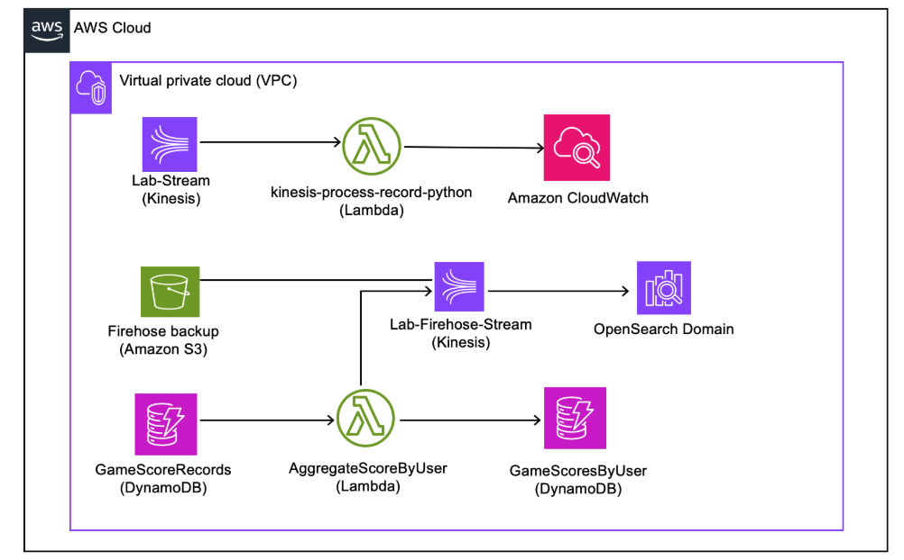
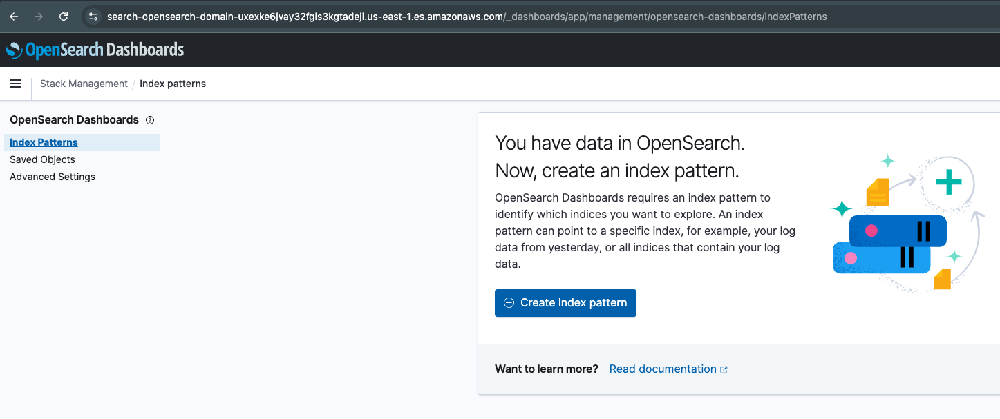
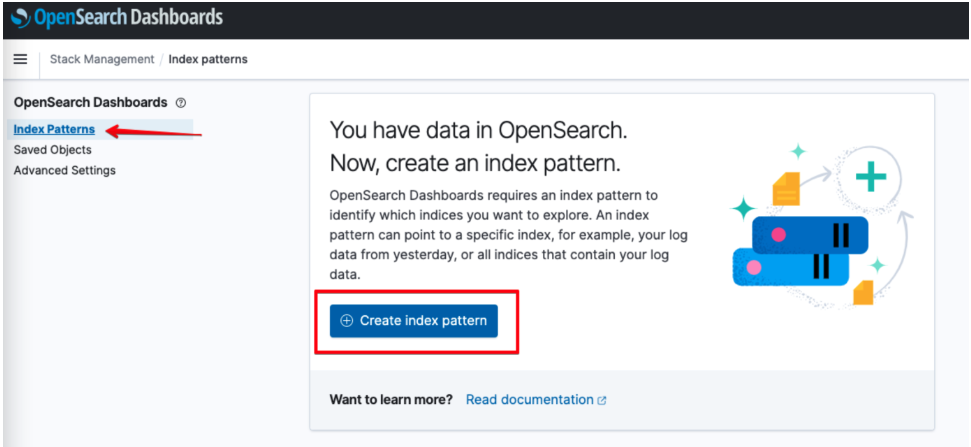
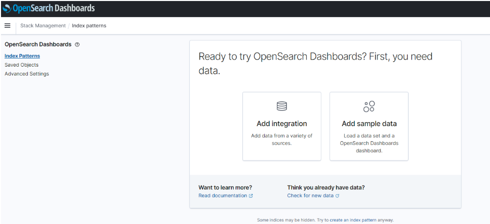
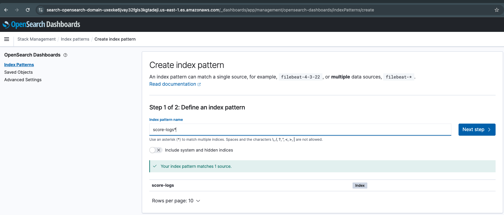
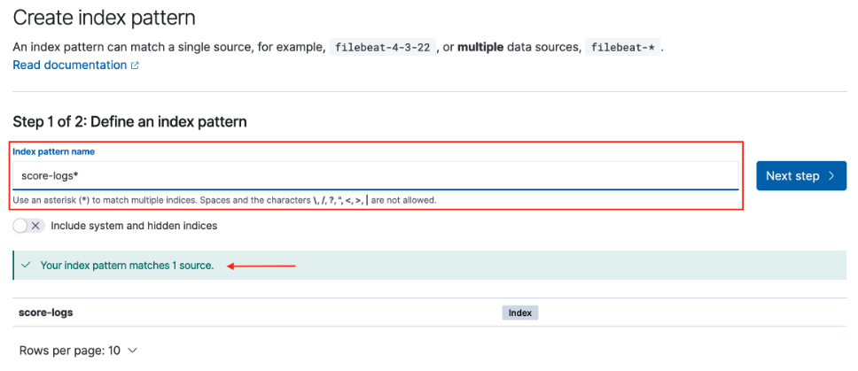
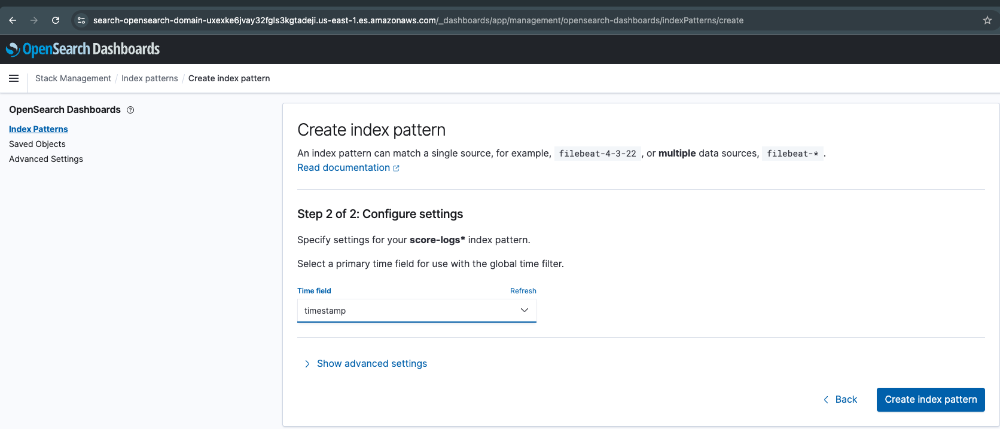
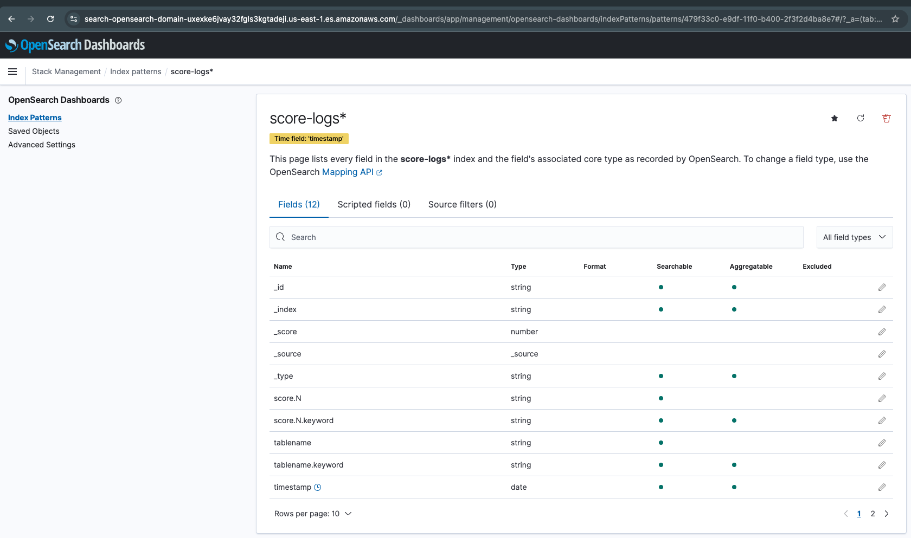
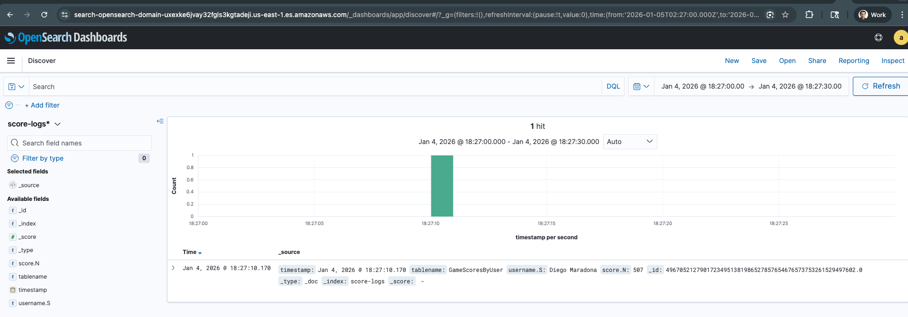
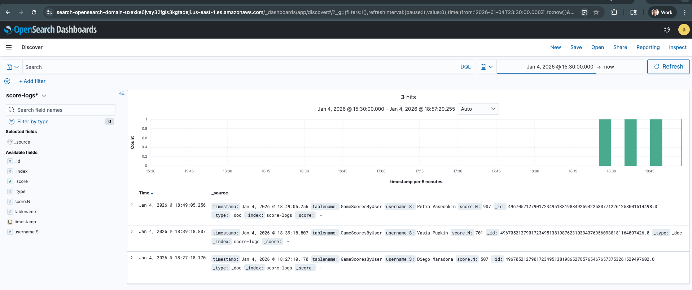

# Navigating Through Kinesis

* back to AWS Cloud Institute repo's root [aci.md](../../aci.md)
* back to [AWS Cloud Fundamentals 2](../aws-cloud-fundamentals-2.md)
* back to repo's main [README.md](../../../../README.md)

## Lab overview

Amazon Kinesis Data Streams is a serverless streaming data service that simplifies capturing, processing, and storing data streams at any scale. Amazon Data Firehose is the easiest way to reliably ingest, transform, and deliver streaming data into destinations in real time. Together, Kinesis Data Streams and Firehose provide a platform for serverless event-driven architecture orchestration.

In this lab, you will implement Kinesis Data Streams and Firehose to invoke AWS Lambda functions and send real-time events to OpenSearch. First, you will create a data stream and Lambda function that is invoked by the data stream. Next, you will create a pair of DynamoDB tables, enable a DynamoDB stream, and create a Lambda function that fetches the DynamoDB stream records from one table and writes new items to another table. Finally, you will edit the previous Lambda function to send DynamoDB stream records to a data stream, and create a Firehose that streams records to an OpenSearch domain.

Objectives
By the end of this lab, you should be able to do the following:

Create a Kinesis data stream.
Create a Lambda function that processes Kinesis records from a blueprint.
Use Amazon CloudWatch to monitor Lambda function invocations.
Create an Amazon DynamoDB table and insert items.
Create a Lambda function to process DynamoDB stream events and insert new items.
Create an Amazon Data Firehose to send data stream records to OpenSearch.
Review real-time events in OpenSearch.
Icon key
Various icons are used throughout this lab to call attention to different types of instructions and notes. The following list explains the purpose of each icon:

 Caution: Information of special interest or importance (not so important to cause problems with the equipment or data if you miss it, but it could result in the need to repeat certain steps).
 Copy edit: A time when copying a command, script, or other text to a text editor (to edit specific variables within it) might be easier than editing directly in the command line or terminal.
 Note: A hint, tip, or important guidance.
 Refresh: A time when you might need to refresh a web browser page or list to show new information.
 Task complete: A conclusion or summary point in the lab.
 Warning: An action that is irreversible and could potentially impact the failure of a command or process (including warnings about configurations that cannot be changed after they are made).

### Lab environment

The following diagram depicts two data flows. The first one shows a Kinesis data stream processed through Lambda and monitored on CloudWatch. The second data flow shows DynamoDB data that is streamed into Amazon Data Firehose and delivered to an Amazon OpenSearch Service domain for analysis. The AggregateScoreByUser Lambda function gets triggered when a new entry is added to the DynamoDB table.

Image description: The diagram depicts two data streams created in this lab.

Services used in this lab
Amazon CloudWatch
Amazon CloudWatch monitors your Amazon Web Services (AWS) resources and the applications you run on AWS in real time. You can use CloudWatch to collect and track metrics, which are variables you can measure for your resources and applications.

Amazon Data Firehose
Amazon Data Firehose is a fully managed service for delivering real-time streaming data to destinations such as Amazon Simple Storage Service (Amazon S3), Amazon Redshift, Amazon OpenSearch Service, Amazon OpenSearch Serverless, Splunk, Apache Iceberg Tables, and any custom HTTP endpoint or HTTP endpoints owned by supported third-party service providers, including Datadog, Dynatrace, LogicMonitor, MongoDB, New Relic, Coralogix, and Elastic. With Amazon Data Firehose, you don’t need to write applications or manage resources. You configure your data producers to send data to Amazon Data Firehose, and it automatically delivers the data to the destination that you specified. You can also configure Amazon Data Firehose to transform your data before delivering it.

Amazon DynamoDB
Amazon DynamoDB is a serverless, NoSQL, fully managed database with single-digit millisecond performance at any scale. DynamoDB addresses your needs to overcome scaling and operational complexities of relational databases. DynamoDB is purpose-built and optimized for operational workloads that require consistent performance at any scale. For example, DynamoDB delivers consistent single-digit millisecond performance for a shopping cart use case, whether you’ve 10 or 100 million users. Launched in 2012, DynamoDB continues to help you move away from relational databases while reducing cost and improving performance at scale.

Amazon Kinesis Data Streams
You can use Amazon Kinesis Data Streams to collect and process large streams of data records in real time. You can create data-processing applications, known as Kinesis Data Streams applications. A typical Kinesis Data Streams application reads data from a data stream as data records. These applications can use the Kinesis Client Library, and they can run on Amazon EC2 instances. You can send the processed records to dashboards, use them to generate alerts, dynamically change pricing and advertising strategies, or send data to a variety of other AWS services. For information about Kinesis Data Streams features and pricing, see Amazon Kinesis Data Streams.

AWS Lambda
You can use AWS Lambda to run code without provisioning or managing servers. Lambda runs your code on a high-availability compute infrastructure and performs all of the administration of the compute resources, including server and operating system maintenance, capacity provisioning and automatic scaling, and logging. With Lambda, all you need to do is supply your code in one of the language runtimes that Lambda supports.

Amazon OpenSearch
Amazon OpenSearch Service is a managed service that makes it easy to deploy, operate, and scale OpenSearch clusters in the AWS Cloud. Amazon OpenSearch Service supports OpenSearch and legacy Elasticsearch OSS (up to 7.10, the final open source version of the software). When you create a cluster, you have the option of which search engine to use.

Amazon S3
Amazon Simple Storage Service (Amazon S3) is an object storage service that offers industry-leading scalability, data availability, security, and performance. Customers of all sizes and industries can use Amazon S3 to store and protect any amount of data for a range of use cases, such as data lakes, websites, mobile applications, backup and restore, archive, enterprise applications, IoT devices, and big data analytics. Amazon S3 provides management features so that you can optimize, organize, and configure access to your data to meet your specific business, organizational, and compliance requirements.

AWS services not used in this lab
AWS service capabilities used in this lab are limited to what the lab requires. Expect errors when accessing other services or performing actions beyond those provided in this lab guide.

Start lab
To launch the lab, at the top of the page, choose Start Lab.

 Caution: You must wait for the provisioned AWS services to be ready before you can continue.

To open the lab, choose Open Console .

You are automatically signed in to the AWS Management Console in a new web browser tab.

 Warning: Do not change the Region unless instructed.

Common sign-in errors
Error: Choosing Start Lab has no effect
In some cases, certain pop-up or script blocker web browser extensions might prevent the Start Lab button from working as intended. If you experience an issue starting the lab:

Add the lab domain name to your pop-up or script blocker’s allow list or turn it off.
Refresh the page and try again.
Task 1: Process Amazon Kinesis Data Streams records using a Lambda function
Kinesis Data Streams is a serverless streaming data service that simplifies capturing, processing, and storing data streams at any scale.

In this task, you will create a data stream, named Lab-stream, and a Lambda function, named ProcessKinesisRecords. You will then configure ProcessKinesisRecords to be triggered by incoming records from Lab-stream. Finally, you will test ProcessKinesisRecords and verify its invocations in CloudWatch.

Task 1.1: Create the Lab-stream data stream
In this task, you will create a Kinesis data stream.

At the top of the AWS Management Console, in the search bar, search for and choose Kinesis.

Choose Create data stream.

On the Create data stream page, in the Data stream configuration section, under Data stream name, enter Lab-stream.

In the Data stream capacity section, configure the following settings:

For Capacity Mode, choose  Provisioned.

For Provisioned shards, enter 1.

Each shard supports a predefined capacity, as shown in the Total data stream capacity section. This lab only requires one shard, but applications requiring more capacity can request more shards.

Choose Create data stream.
You should see a Kinesis message stating that the Lab-stream data stream was successfully created.

#### Task 1.2: Create the ProcessKinesisRecords Lambda function

Now, you will create an AWS Lambda function that will be triggered by data coming into the stream. You will start by selecting a Lambda blueprint. Blueprints are pre-built for you, and they can be customized to suit your specific needs.

At the top of the AWS Management Console, in the search bar, search for and choose Lambda.

Choose Create a function.

On the Create function page, select the  Use a blueprint option.

In the Basic information section, select the Blueprint name search  box, and search for kinesis-process-record-python.

In the search menu, select Process records sent to a Kinesis stream .

Configure in the following settings:

For Function name, enter ProcessKinesisRecords.
In the Change default execution role section, choose  Use an existing role.
On the Existing role menu, choose lambda_basic_execution.
In the Lambda function code section, examine the Lambda blueprint. It does the following:
Loops through each of the records received.
Decodes the data, which is encoded in Base 64.
Prints the data to the debug log.
In the Kinesis trigger section, configure in the following settings:
For Kinesis stream, enter Lab-stream.

This configures the Lambda function so that it is triggered whenever data comes into the Kinesis stream you created in Task 1.

Deselect the Activate trigger option, if it is selected.

For Batch size, enter 5.

Leave all other settings at the default values.

At the bottom of the screen, choose Create function.

You should see a Lambda message stating that the function has been successfully created and configured with Lab-stream as a trigger.

 Caution: Ignore the following message, which pops up at the top of the screen: Your Lambda function “ProcessKinesisRecords” was successfully created, but an error occurred when creating the trigger: source must NOT have fewer than 20 characters

Task 1.3: Test the ProcessKinesisRecords Lambda function
Now, you will simulate data coming from a stream to trigger your Lambda function.

On the ProcessKinesisRecords page, under the function overview section, choose the Test tab.

The Test event page opens.

 Note: An event template for Kinesis is automatically selected. The event contains a simulated message arriving from Kinesis.

For Event Name, enter stream.

Choose Save.

On the ProcessKinesisRecords page, under the function overview section, choose the Code tab.

In the Code source section, choose Test.

On the ProcessKinesisRecords page, under Code source, the Execution results tab displays the output of the Lambda function. You can see the following information about the Lambda execution in the Function Logs section:

Duration
Billed duration
Memory size
Maximum memory used
Init duration
Choose Test three times, waiting a few seconds between each test.

This generates the test data for Amazon CloudWatch.

On the ProcessKinesisRecords page, in the function overview section, choose the Monitor tab.

You can now view the CloudWatch metrics for your Lambda function. Metrics should be available for Invocations and Duration.

 Refresh: If the metrics do not appear, wait a minute and then choose  refresh.

 Task complete: You successfully created a Kinesis data stream and tested processing records with a Lambda function.

Task 2: Use Event-Driven Programming with DynamoDB and Lambda
In this task, you will create an event-driven architecture using DynamoDB and Lambda. First, you will create two DynamoDB tables, GameScoreRecords and GameScoresByUser. GameScoreRecords contains game scores records, while GameScoresByUser contains users’ total scores. You will also create a Lambda function that increments user scores in the GameScoresByUser table and is invoked by the GameScoreRecords DynamoDB stream.

Task 2.1: Create the GameScoreRecords table in DynamoDB
First, you will create the GameScoreRecords DynamoDB table.

At the top of the AWS Management Console, in the search bar, search for and choose DynamoDB.

Choose Create table.

On the Create table page, configure the following settings:

For Table name, enter GameScoreRecords.
For Partition key, enter RecordID, and choose Number.
Choose Create table.
You should see a DynamoDB message stating that the table was created.

Task 2.2: Create the GameScoresByUser table in DynamoDB
You will now create the GameScoresByUser table for storing users total score.

Choose Create table.

On the Create table page, configure the following settings:

For Table name, enter GameScoresByUser.
For Partition key, enter Username, and choose String.
Choose Create table.
You should see a DynamoDB message stating that the table was created.

Task 2.3: Enable a DynamoDB stream on the GameScoreRecords DynamoDB table
In this task, you will activate DynamoDB Streams on the GameScoreRecords table. This generates streaming data whenever there is any change to the table (for example, insert, update, or delete).

On the DynamoDB page, under tables, choose GameScoreRecords.

Choose the Exports and Streams tab.

Scroll to DynamoDB stream details and choose Turn on.

On the DynamoDB stream details page, for View type, choose  New image.

Choose Turn on stream.

You should see a DynamoDB message stating that DynamoDB streaming was successfully turned on.

Any record sent to this table now sends a message using DynamoDB streams, which triggers the Lambda function created in the next task.

Task 2.4: Create the AggregateScoresByUser Lambda function
Now, you will create a Lambda function that is triggered by updates to your DynamoDB table.

At the top of the AWS Management Console, in the search bar, search for and choose Lambda.

Choose Create function.

On the Create function page, configure the following settings:

Select  Author from scratch.
For Function name, enter AggregateScoresByUser.
For Runtime, select Node.js 20.x.
In the Change default execution role section, select Use an existing role.
On the Existing role menu, choose lambda_basic_execution_dynamodb.
Choose Create a function.

You should see a Lambda message stating that the function was successfully created.

In the Code source pane, on the index.mjs tab, replace the code with the following code.

import { DynamoDBClient, UpdateItemCommand } from "@aws-sdk/client-dynamodb";

// Set up AWS client.
const dynamodb = new DynamoDBClient();

export const handler = async (event, context) => {
    // Keep track of how many requests are in flight.
    let inflightRequests = 0;

    const updatePromises = event.Records.map(async (record) => {
        console.log('DynamoDB Record: %j', record.dynamodb);

        // Get the new image of the DynamoDB Streams record.
        const newItemImage = record.dynamodb.NewImage;

        // Set the appropriate parameters for UpdateItem.
        const updateItemParams = {
            TableName: "GameScoresByUser",
            Key: { Username: newItemImage.Username },
            UpdateExpression: 'ADD Score :attrValue',
            ExpressionAttributeValues: { ':attrValue': newItemImage.Score }
        };

        try {
            const command = new UpdateItemCommand(updateItemParams);
            await dynamodb.send(command);
            inflightRequests++;
        } catch (err) {
            console.error(err);
        } finally {
            inflightRequests--;
        }
    });

    await Promise.all(updatePromises);

    return `Successfully processed ${event.Records.length} records.`;
};
Examine the code. It does the following:
Loops through each incoming record.
Creates (ADD) an item in the GameScoresByUser table with the incoming score.
Waits until all updates are processed.
Choose Deploy.
You should see a Lambda message Stating that the function was successfully updated.

Task 2.5: Configure the AggregateScoresByUser Lambda function trigger
You will now configure the AggregateScoresByUser Lambda function to be invoked whenever a value is added to the GameScoreRecords DynamoDB table.

Scroll up to the Function overview section.

Choose  Add trigger.

On the Add trigger page, in the Trigger configuration section, configure the following settings:

On the Select a source menu, select DynamoDB.
Under DynamoDB table, choose the , and select GameScoreRecords.
Choose Add.
You should see a Lambda banner stating that the trigger GameScoreRecords was successfully added to function AggregateScoresByUser.

 Note: The function is triggered when a new game score is added to the DynamoDB table. You can now test the function with a record that simulates an update of the database.

Task 2.6: Test the AggregateScoresByUser Lambda function
On the AggregateScoresByUser page, in the Function overview section, choose the Test tab.

For Event name, enter score.

In the Event JSON pane, replace the default event JSON with the following JSON.

{
  "Records": [
    {
      "eventID": "1",
      "eventVersion": "1.0",
      "dynamodb": {
        "Keys": { "RecordID": {"N": "2" }
      },
      "NewImage": {
        "RecordID": {"N": "2" },
        "Username": { "S": "Jane Doe" },
        "Score": { "N": "100" },
        "Nickname": { "S": "JaneD" }
      },
      "StreamViewType": "NEW_IMAGE",
      "SequenceNumber": "111",
      "SizeBytes": 26
    },
    "awsRegion": "us-west-2",
    "eventName": "INSERT",
    "eventSourceARN": "arn:aws:dynamodb:us-west-2:account-id:table/GameScoreRecords/stream/2015-10-07T00:48:05.899",
    "eventSource": "aws:dynamodb"
    }
  ]
}
Examine the test record. It is simulating an incoming record from the GameScoreRecords table.

Choose Save.

Choose Test.

You should see a message above the Test event pane that states that the Lambda function succeeded.

In the Executing function: succeeded banner, expand  Details to view the output of the Lambda function.

You should see Successfully processed 1 records.

Task 2.7: Verify new user scores in the GameScoresByUser DynamoDB table
In this task, you will verify that the data is updated in the GameScoresByUser table.

At the top of the AWS Management Console, in the search bar, search for and choose DynamoDB.

In the left navigation pane, choose Tables.

In the Tables section, choose GameScoresByUser.

On the GameScoresByUsers page, choose Explore table items.

 Note: This table was previously empty (you created it yourself), but you should now see an entry for Jane Doe.

You can perform more tests by creating new items in the GameScoreRecords table and confirming that the Lambda updates the GameScoresByUser table.

Task 2.8: Trigger the Lambda function by adding items to the GameScoreRecords DynamoDB table
Now that you created and tested the event-driven architecture using Lambda and DynamoDB, you can conduct an end-to-end test by creating new items in the GameScoreRecords table. You can then verify new user scores in the GameScoresByUser table.

In this task, you will conduct an end-to-end test.

In the left navigation pane, choose Tables.

In the Tables section, choose GameScoreRecords.

On the GameScoreRecords page, on the Actions menu, choose Create item.

 Note: In the upcoming steps, you create a new item and assign it two attributes.

In the text field next to RecordID, enter 1.

To add the Username attribute, complete the following steps:

Choose Add new attribute.
In the menu, select String.
For Attribute Name, enter Username.
For Value, enter a random user’s name.
To add the Score attribute, complete the following steps:
Choose Add new attribute.
In the menu, select Number.
For Attribute Name, enter Score.
For Value, enter a random score.
Choose Create item.
You should see a DynamoDB message stating that the item was saved successfully.

Now that the new item is created, it should have also triggered the Lambda function, resulting in a new entry in the other table.

Select the  GameScoresByUser table.
The new data that you entered should appear in the User table.

 Refresh: If you do not see the data populated automatically, refresh  the page.

Repeat the test by adding more items in the GameScoreRecords table.
 Task complete: You successfully created an event-driven architecture using DynamoDB and Lambda.

Task 3: View Firehose statistics in OpenSearch
Amazon OpenSearch Service provides a managed service for deploying, operating, and scaling OpenSearch clusters in AWS. OpenSearch is an open source, distributed search and analytics engine used for use cases such as real-time application monitoring, log analytics, and website search. It features scalability, fast response times for queries over large data volumes, and an integrated visualization tool, called OpenSearch Dashboards.

In this task, you will create an Amazon Data Firehose delivery stream to transmit data from the Lab-stream data stream into an Amazon OpenSearch Service domain. Then, using the architecture created in the previous task, you will update the AggregateScoresByUser Lambda function to send GameScoreRecords DynamoDB stream events to the Lab-stream data stream. Amazon Data Firehose will then stream newly created items in GameScoreRecords to the OpenSearch domain, allowing you to observe real-time game score statistics in OpenSearch Dashboards.

For this lab, an OpenSearch deployment, opensearch-domain, and Firehose_Opensearch_Stream Firehouse role have been created.

Task 3.1: Configure the firehose-role in OpenSearch
Here, you will log in to OpenSearch Dashboards and configure the domain to receive DynamoDB events.

 Copy edit: Copy the DomainEndpointDashboard link to the left of these instructions and paste it into a new browser tab.

On the OpenSearch login page, enter the following values for the Username and Password fields:

For Username, enter admin.
For Password, copy and paste the OpenSearchPassword value from the left side of the lab instructions.
Choose Log In.
The OpenSearch Dashboards homepage opens.

 Caution: One or two pop-up windows might appear on screen in any order.

If prompted to Add data, choose Explore on my own.
If prompted to Select your tenant, choose Private and choose Confirm.
Now that you’re connected to the OpenSearch Dashboard, you will configure a role and permissions.

 Note: Roles are the core method to control access to your cluster. Roles contain any combination of cluster-wide permissions, index-specific permissions, document-level and field-level security, and tenants. Users are then mapped to these roles to be assigned permissions.

In the upper-left area of the page, choose the  menu, and under the OpenSearch Plugins section, choose Security.

In the left navigation pane, under Security, choose Roles.

On the Roles page, choose Create role.

On the Create Role page, create a new role with the following parameters:

For Name, enter firehose-role.
In the Cluster permissions card, on the Cluster Permissions list, select cluster_composite_ops and cluster_monitor.
 Caution: Ensure that you choose cluster_composite_ops and not cluster_composite_ops_ro.

cluster_composite_ops grants read-only permissions to execute requests such as mget, msearch, or mtv, plus permissions to query for aliases. cluster_composite_ops also grants bulk permissions and all aliases permissions.
cluster_monitor grants all cluster monitoring permissions. It equates to cluster:monitor/*.
In the Index permissions card, configure the following parameters:
If not already expanded, expand the Add index permission option.
For Index, enter score-logs*. This is the name of the destination index that you entered earlier when you configured Firehose.
From the Index permissions dropdown list, choose the following three action groups: crud, create_index and manage.
 Note: To help locate the action groups, you can type the names. The crud action group allows creating, reading, updating, and deleting documents in the specified index. The create_index action enables creating new indices in the OpenSearch cluster. Finally, the manage action allows various index management operations, such as setting the number of replicas and changing index settings. Together, these three action groups provide permissions for basic index operations: ingesting data, searching and retrieving data, creating additional indices, and managing index configurations.

Leave the remaining default settings, scroll down to the bottom of the page, and choose Create.

On the firehose-role page, choose the Mapped users tab, and then choose Map users.

On the lab instructions, in the left navigation pane, under Resources, copy the FirehoseRoleArn to your clipboard.

On the Map user page, in the Backend roles section, paste the FirehoseRoleArn in the text field under Backend roles,

To add the mapping to OpenSearch, choose Map.

On the firehose-role page, in the Mapped users table, under User type, you should see the newly assigned Backend role, and under User, you should see FirehoseRoleArn.

Keep this tab open. You will be coming back here in upcoming steps.

Task 3.2: Create the Lab-Firehose-Stream Firehose
Now, you will create a Firehose stream with its destination as OpenSearch domain.

In the AWS Management Console, in the search bar, search for and choose Amazon Data Firehose.

Choose Create Firehose stream.

In the Choose source and destination section, configure the following parameters:

For Source, choose Amazon Kinesis Data Streams.
For Destination, choose Amazon OpenSearch Service.
To select a Kinesis data stream, in the Source settings section, choose Browse.

In the Choose Kinesis data stream pop-up, select Lab-stream, and then choose Choose.

In the Firehose stream name section, enter Lab-Firehose-Stream.

To select an OpenSearch Service domain, in the Destination settings section, choose Browse.

In the Choose OpenSearch Service domain pop-up, select opensearch-domain, and then choose Choose.

For Index, enter score-logs.

 Note: The score-logs index does not yet exist in OpenSearch. Indexes are automatically created when data is sent to an index that does not yet exist.

To select an S3 backup bucket, in the Backup settings section, choose Browse.
In the Choose a bucket in Amazon S3 pop-up, select firehose-bucket, and then choose Choose.
On the Advanced settings menu, under Service access, select Choose existing IAM role.

On the Existing IAM roles menu, select Firehose_Opensearch_Stream.

Choose Create Firehose stream.

You should see a Firehose message stating that the Lab-Firehose-Stream was successfully created.

Task 3.3: Update the AggregateScoresByUser Lambda function to use Kinesis streams
In this task, you will update Lambda function code to include putRecords.

In the AWS Management Console tab, in the search bar, search for and choose Lambda.

Choose AggregateScoresByUser.

Choose the Code tab and delete the code in the index.mjs editor.

Select the Code tab, then:

Delete all of the code in the index.mjs editor

Copy and paste this code into the index.mjs editor:

import { DynamoDB } from "@aws-sdk/client-dynamodb";
import { Kinesis } from "@aws-sdk/client-kinesis";

const dynamodb = new DynamoDB();
const kinesis = new Kinesis();

export const handler = async (event) => {
  try {
    const processedRecords = await Promise.all(
      event.Records.map(async (record) => {
        console.log('DynamoDB Record: %j', record.dynamodb);

        const newItemImage = record.dynamodb.NewImage;

        const updateItemParams = {
          TableName: "GameScoresByUser",
          Key: { Username: newItemImage.Username },
          UpdateExpression: 'ADD Score :attrValue',
          ExpressionAttributeValues: { ':attrValue': newItemImage.Score }
        };

        const result = {
          timestamp: new Date().toISOString(),
          tablename: updateItemParams.TableName,
          username: newItemImage.Username,
          score: newItemImage.Score
        };

        const kinesisParams = {
          Data: JSON.stringify(result),
          PartitionKey: '1',
          StreamName: 'Lab-stream'
        };

        // Send UpdateItem request to DynamoDB
        await dynamodb.updateItem(updateItemParams);

        // Send record to Kinesis
        await kinesis.putRecord(kinesisParams);

        return record;
      })
    );

    console.log(`Successfully processed ${processedRecords.length} records.`);
    return { statusCode: 200, body: `Successfully processed ${processedRecords.length} records.` };
  } catch (error) {
    console.error('Error:', error);
    return { statusCode: 500, body: 'Error processing records' };
  }
};
Examine the code. It does the following:
Loops through each incoming record.
Fetches DynamoDB new image information from the record.
Creates (ADD) an item in the GameScoresByUser table with the incoming score.
Generates a log of the new GameScoresByUser table item.
Sends a log of the new GameScoresByUser table item to the Lab-stream Kinesis data stream.
Waits for all updates to process.
Choose Deploy.
You should see a message stating that the AggregateScoresByUser function was successfully updated.

Task 3.4: Invoke the updated AggregateScoresByUser Lambda function
In this task, you will invoke the updated Lambda function by creating new items in the GameScoreRecords table.

At the top of the AWS Management Console, in the search bar, search for and choose DynamoDB.

In the left navigation pane, choose Explore items.

You can perform more tests by creating new items in the GameScoreRecords table and confirming that the Lambda function updates the GameScoresByUser table.

Select the GameScoreRecords table.

In the Items returned section, choose Create item.

 Note: In the upcoming steps, you will create a new item and assign it two attributes. Keep in mind that each new item will require a unique RecordID integer.

In the text field next to RecordID, enter 2.

To add the Username attribute, complete the following steps:

Choose Add new attribute.
In the menu, select String.
For Attribute Name, enter Username.
For Value, enter a random user’s name.
To add the Score attribute, complete the following steps:
Choose Add new attribute.
In the menu, select Number.
For Attribute Name, enter Score.
For Value, enter a random score.
Choose Create item.
You should see a DynamoDB message stating that the item was saved successfully.

Now that the new item is created, it should have also triggered the Lambda function, resulting in a new entry in the other table.

Select the  GameScoresByUser table.
You should see that the new data you entered has been copied to the GameScoresByUser table.

 Refresh: If you do not see the data populated automatically, refresh  the page.

#### Task 3.5: Analyze logs using OpenSearch Dashboards

Finally, you will review the DynamoDB stream events that are now being aggregated in OpenSearch.

109. Choose the **OpenSearch Dashboard** tab, which you kept open in an earlier task.
110. In the upper-left area, choose the  menu, and under the **Management** section, choose **Stack Management**.
111. From the left menu, choose **Index Pattern**s**, and then choose **Create index pattern**.

Image description: The image shows the create index pattern page in the OpenSearch Dashboard.

**Note**: If you do not see the preceding screen, you might see the following screen.

Image description: The image shows the Ready to try OpenSearch Dashboards? page.

In this case, at the bottom of the screen, choose create an index pattern. This redirects you to the expected Create index pattern page.

112. On the Create index pattern page, in the Step 1 of 2: Define an index pattern section, for Index pattern name, enter score-logs*.

    Refresh: You should see a green prompt stating that Your index pattern matches 1 source. If this prompt does not appear, wait a couple of minutes, refresh the page, and search for score-logs* again. It might take up to 10 minutes for the index to be created.

Image description: The image depicts the create index pattern page from the OpenSearch Dashboard.

113. Choose **Next step >**.
114. On the **Create index pattern** page, in the **Step 2 of 2: Configure settings** section, on the **Time field** menu, choose **timestamp**.

115. Choose **Create index pattern**.

Now that you created your pattern, you can look at the data.

116. On the OpenSearch menu, on the left and under **OpenSearch Dashboards**, choose **Discover**.

Your DynamoDB event logs are displayed on screen, confirming that the Amazon Data Firehose data stream is successfully pushing data into your OpenSearch Dashboards. In the displayed logs, you can observe the latest username and score items, which you added to the DynamoDB table in earlier steps.

 Task complete: You successfully created an Amazon Data Firehose delivery stream that transmits data from DynamoDB into an Amazon OpenSearch Service domain.

Conclusion
You successfully completed the following:

Created a Kinesis data stream.
Created a Lambda function from a blueprint.
Used CloudWatch to monitor Kinesis event data triggering a Lambda function.
Created a DynamoDB table and inserted items.
Configured a Firehose delivery stream to send DynamoDB events to OpenSearch.
Reviewed real-time DynamoDB events in OpenSearch.

### End lab

Follow these steps to close the console and end your lab.

117. Return to the **AWS Management Console**.
118. At the upper-right corner of the page, choose **AWSLabsUser**, and then choose **Sign out**.
119. Choose **End Lab** and then confirm that you want to end your lab.

### Additional resources

* [Amazon OpenSearch Service](https://docs.aws.amazon.com/whitepapers/latest/big-data-analytics-options/elasticsearch.html)
* [Lambda Documentation](https://docs.aws.amazon.com/lambda/index.html)
* [What Is Amazon Data Firehose?](https://docs.aws.amazon.com/firehose/latest/dev/what-is-this-service.html)
* [What Is Amazon Kinesis Data Streams?](https://docs.aws.amazon.com/streams/latest/dev/introduction.html)

For more information about AWS Training and Certification, see [https://aws.amazon.com/training/](https://aws.amazon.com/training/).
