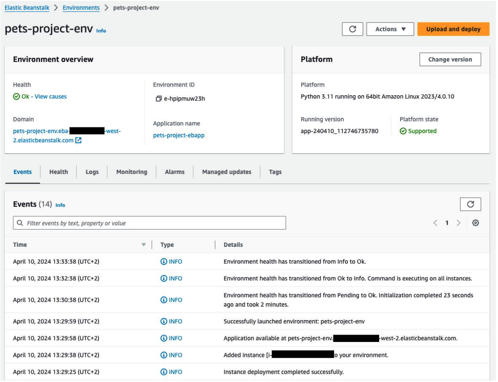
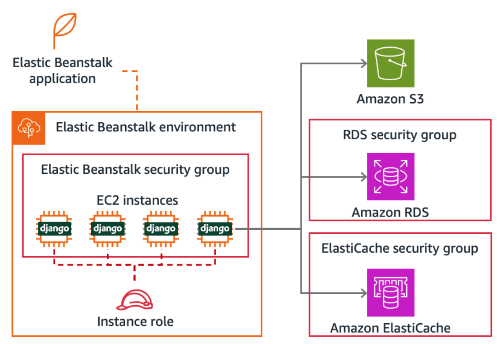

# Week 7: Deploying a Django Web Application to AWS Elastic Beanstalk

* back to AWS Cloud Institute repo's root [aci.md](../aci.md)
* back to repo's main [README.md](../../../README.md)

## Deploying a Django Web Application

### Pre-assessment

#### Which task should you complete before you deploy your web application to AWS Elastic Beanstalk?

* Test your website locally or on an AWS supported IDE

Wrong answers:

* Manually deploy your compute resources
* Package the application into a Docker image
* Install Python on an Amazon EC2 instance

It's important to set up a development environment for local testing of applications before deploying them to AWS Elastic Beanstalk. Some integrations with AWS storage and database services can be performed.

#### What is the AWS Elastic Beanstalk command line interface (CLI) used for?

* Creating, configuring, and managing AWS Elastic Beanstalk environments

Wrong answers:

* Managing and configuring the underlying Amazon EC2 instances
* Replacing the AWS CLI tool for managing AWS services
* Building and running serverless applications on AWS

With the Elastic Beanstalk CLI, you can create, configure, and manage Elastic Beanstalk environments, including deploying applications, viewing logs, and managing environment settings.

#### Which AWS service can be used to store Django media files provided by users persistently and in the most efficient manner?

* Amazon S3

Wrong answers:

* Amazon RDS
* Amazon ElastiCache
* Amazon Elastic Block Store (Amazon EBS)

##### Explanation

* Media files can be stored on an object storage service, such as Amazon S3, that is decoupled from the Django application instances.
* Amazon RDS is a relational database that is not suited for binary data.
* Amazon ElastiCache is used as an in-memory data store for quick access.
* Amazon EBS is a block storage service. Block volumes are attached to the Amazon EC2 instances. These volumes are not shared between instances.

## Moving from Development to Production

Working within a development environment is necessary to code, build, and test your Django project in a safe, nonproduction area.

### Source development environment

When you are using an IDE within AWS, you edit the source code locally on a single Amazon Elastic Compute Cloud (Amazon EC2) instance. You test the Django application on a lightweight web server, and the test data is stored in an SQLite database file.

Client < - > django Lightweight development web server < - > django application

This environment is not meant to be accessed by end users, so it is not public. It does not scale, because it is running on a single instance, and it uses a file-based database stored on the instance.

### Target production environment

When a Django application has been coded and tested locally from your IDE, you can plan how to deploy it to a production environment. A proper production architecture on AWS should follow the design principles and best practices defined in the AWS Well-Architected Framework. The framework covers different aspects of the architecture, known as pillars, including security and reliability. To learn more, see [AWS Well-Architected Framework](https://docs.aws.amazon.com/wellarchitected/latest/framework/welcome.html).

You can start by defining some requirements for your Django application in production.

* The web application must be exposed to the internet, be highly available, and scale to hundreds or thousands of simultaneous end users.
* The application data, like vet visits, must be stored in a separate managed database that can handle high numbers of reads and writes.
* The application media files, like pet pictures, must be stored and managed in a separate, secure storage area.
* From a maintenance point of view, it should be easy to deploy the application and redeploy changes. It should be easy to manage the compute instances and the database.

This translates into several AWS services that you can use.

For the application to handle many simultaneous users, you need to run the application behind a load balancer with several Amazon EC2 instances. The number of instances should adjust automatically based on how many users are currently interacting with the website. Auto scaling is a feature of Amazon EC2 that can be managed by AWS Elastic Beanstalk.

Because the application is running on multiple instances, the application data cannot reside in an SQLite file on each instance. This would result in inconsistency because nothing would synchronize these files. In addition, the user sessions would not be shared between the instances. This would cause the application to malfunction if consecutive requests for the same user were managed by different servers.

As a consequence, the data has to be stored on an external Django compatible database. Amazon RDS is a managed relational database service that offers operational benefits. To improve performance, some data, like user sessions, can be cached in memory instead of being persisted in a database. This can be achieved by using Amazon ElastiCache, a fully managed in-memory data store and cache service.

Because the database is not the best place to store binary data, pictures and other media files can be stored on a cloud object storage area provided by Amazon S3. The pictures can be protected by using temporary links in the web application that expire.

All of the AWS services mentioned are either serverless or managed services. They provide clear operational advantages to let you focus on the application instead of the infrastructure.

### Path to a full deployment

A Django application can be configured to integrate with an external database, an external object storage area, and an external in-memory data store. Testing such integrations can be done from the test environment. The strategy is to start by applying these changes in your IDE first, before deploying the Django application to Elastic Beanstalk.

The following are the four steps, starting with three integration steps and the resulting test architecture. The last step is about deploying the Django application to Elastic Beanstalk and showing you the final production architecture.

1. **Amazon S3 integration** – An Amazon S3 bucket is created for your application. Django storage is reconfigured from local storage to point to the bucket. Some media files might have to be uploaded to Amazon S3. The Django application is run in your IDE to verify that the pictures are now served from Amazon S3.
2. **Amazon ElastiCache integration** – An ElastiCache cache is created for your application. The Django session framework is reconfigured from using a database to point to the cache. The Django application is run in your IDE to verify that everything is working.
3. **Amazon RDS integration** – An Amazon RDS database is created for your application. The Django database is reconfigured from SQLite to point to the Amazon RDS database. The Django command line interface (CLI) is used to migrate the database. Some data might have to be loaded as well. The Django application runs in your IDE to verify that everything is working and that new data is saved in Amazon RDS.
4. **AWS Elastic Beanstalk deployment** – An Elastic Beanstalk application and environment are created. The Django application is prepared and deployed to the Elastic Beanstalk environment. The environment public URL is used to access the website.

The end result is the target production environment. The Django application is deployed and managed by Elastic Beanstalk. It runs on EC2 instances, abstracted away by Elastic Beanstalk. The application integrates with Amazon S3 for storing pictures, Amazon RDS for application data, and ElastiCache for user sessions.

## Using Amazon S3 for Media Files

Amazon Simple Storage Service (Amazon S3) provides scalable object storage. A Django application's media files can be uploaded and downloaded from an Amazon S3 bucket.

### Django application files

A Django website might use different types of files. Only some types are good candidates for object storage on Amazon S3.

* **Static files** – Your Django application includes webpage templates that use static content in the form of Cascading Style Sheets (CSS) files, JavaScript files, and pictures like the application logo and header background. These files are called *static files* and they reside along with the HTML template code. They are edited and redeployed together with the templates, and are placed locally in the application folder. To learn more, see [How to Manage Static Files](https://docs.djangoproject.com/en/stable/howto/static-files/) in the Django documentation.
* **Media files** – Your application might let end users upload photos, like a profile picture. The application might also display photos, like a pet picture. These user files are called *media files* and they do not reside with the application because they are updated continuously by users. They are not static. Media files require a storage area decoupled from the application. Because databases are not appropriate for binary data, an object storage service is ideal for this scenario.

In the following example, only media files will be used for object storage on Amazon S3.

### Django file storage system

Django abstracts away file access and file management to a file storage system. This layer is a pluggable framework that lets you switch from one implementation to another. Django’s default file storage is provided by **django.core.files.storage.FileSystemStorage**.

In the project **settings.py** file, the **STORAGES** variable defines the specific storage implementations to be used by your application. By default, after creating a Django project with the CLI, that variable is missing from the settings. But it is equivalent to the values for **default** and **staticfiles**, as shown in the following code snippet. The first sets the file system for *media files*, the second for *static files*. By default, all files are stored locally in the Django application.

```python
STORAGES = {
    "default": {
        "BACKEND": "django.core.files.storage.FileSystemStorage",
    },
    "staticfiles": {
        "BACKEND": "django.contrib.staticfiles.storage.StaticFilesStorage",
    },
}
```

### Storage configuration for Amazon S3

To place media files on Amazon S3, the first task is to create an Amazon S3 bucket, which can be done from the AWS Management Console or from the AWS Command Line Interface (AWS CLI). The bucket can remain private even if media files will be served from it. But cross-origin resource sharing (CORS) must be enabled for your bucket to be able to serve these files to different hostnames.

#### [Creating an Amazon S3 Bucket](https://docs.aws.amazon.com/AmazonS3/latest/userguide/create-bucket-overview.html)

When a specific bucket is available for your Django application, two Python packages must be installed in your Django project, **django-storages** and **boto3**. This brings a Django file system implementation that is able to integrate with the Amazon S3 API by internally using the AWS SDK for Python (Boto3).

```bash
pip install django-storages boto3
```

When the Python packages are available in a project, they can be used. The **STORAGES** value can be modified in **settings.py**. The media file storage under **default** is changed to **storages.backends.s3boto3.S3Boto3Storage** to enable storage on Amazon S3.

```python
STORAGES = {
    "default": {
        "BACKEND": "storages.backends.s3boto3.S3Boto3Storage",
    },
    "staticfiles": {
        "BACKEND": "django.contrib.staticfiles.storage.StaticFilesStorage",
    },
}
```

The Django Amazon S3 file storage uses specific variables to locate the S3 bucket. The following two variables, **AWS_STORAGE_BUCKET_NAME** and **AWS_S3_REGION_NAME**, can be set to define which bucket to use and in which AWS Region.

```bash
AWS_STORAGE_BUCKET_NAME = 'pets-project-us-west-2-123456789901'
AWS_S3_REGION_NAME = 'us-west-2'
```

The Django S3 file storage can be configured further with other variables that are optional. In particular, it can use AWS Identity and Access Management (IAM) credentials to access the S3 bucket. You should avoid hardcoding anything sensitive in the settings. Instead, the Django application will benefit from using the Amazon EC2 instance role credentials to get access to the media files on Amazon S3.

### Testing the Amazon S3 integration

During development and testing on your IDE, media files can be stored locally in the Django project or on Amazon S3. You can switch back and forth between the two storage backends by simply editing the settings if the media URLs are not hardcoded in the Django templates. For example, if a pet's model field is picture = models.ImageField(), a template can display the image as .

The following diagram shows a running Django application using Amazon S3 as its media files storage backend.

Developer -> AWS supported IDE (django Application) -> Amazon S3 (Multimedia)

You can check that everything works as expected by starting the application and inspecting a media file URL in your browser. The easiest method is to view the webpage source code from your browser menu. The resulting HTML code is illustrated in the following two use cases.

When the **STORAGES** default backend is set to **django.core.files.storage.FileSystemStorage**, images are served locally with a relative URL as in **/media/luna.jpg**.

```html
<td><a href="/pet/2">
  
  <p>Luna</a></p>
  <p>Ana Carolina Silva</p>
</td>
```

When the **STORAGES** default backend is set to **storages.backends.s3boto3.S3Boto3Storage**, images are served with a temporary and secure URL such as **https://pets-project-us-west-2-xxxx.s3.amazonaws.com/luna.jpg?...**

Both credentials and expiration are added automatically to the URL. Even if Django sets a high number of seconds for the expiration time, Amazon S3 will enforce a maximum of 7 days.

```html
<td><a href="/pet/2">
  
  <p>Luna</a></p>
  <p>Ana Carolina Silva</p>
</td>
```

Another way to verify that media files are stored in Amazon S3 is to either modify one or upload a new one. If you do not have a custom webpage to upload a new picture in your application, you can visit the administration site to modify a file.

After saving this change, you can go to your Amazon S3 bucket to verify that the file has been uploaded to the correct storage backend.

## Using ElastiCache for Session Storage

The performance of an application in production is often a main concern. This section focuses on how the latency and user experience can be improved.

### HTTP sessions

HTTP communication between a web browser and a server is stateless, meaning that the information about the communication is not stored. It is as if every connection is the first time, with no memory of what occurred previously or what the state of the communication looked like. This state information is necessary for understanding the continued relationship between a web browser and a server.

A session is the mechanism that is used to keep track of this state information. Sessions are crucial for maintaining user authentication, storing preferences, and personalizing user experiences. Sessions permit the web browser to retain data when making future connections to the server. By saving session data, the application can recognize logged-in users across multiple page requests. Session data permits the application to customize content for each user.

An ecommerce website might keep shopping carts in user sessions. For every request, the application retrieves the cart from the session and eventually updates the cart. As a developer, you can choose where these sessions are stored, which has consequences for the performance. Reading and writing session data to a database can take time, especially if the database is handling multiple requests at the same time, or is physically located far from the server processing the user's request. As more users shop simultaneously, the delay can increase, leading to a slower response time and a less satisfying shopping experience. Storing the user session in memory is much faster.

### Django session framework

Django web applications use a session framework to handle temporary data storage per user session. The session framework is implemented with built-in middleware and a built-in application. The following settings in your project **settings.py** are present by default when you create a Django project.

* A Django middleware called **django.contrib.sessions.middleware.SessionMiddleware** must be present under the **MIDDLEWARE** list.
* The session middleware uses a session data model included in the **django.contrib.sessions** application. It must be listed under **INSTALLED_APPS**.

The session engine can be configured to decide where to store user sessions, including session ID, expiration date, and actual session data serialized into a string. Here are the four possible choices, with their pros and cons.

#### Database-backed sessions

By default, sessions are stored in the database. This is enabled by setting the **SESSION_ENGINE** variable to **django.contrib.sessions.backends.db** or by not setting this variable at all, which is the default configuration.

Knowing which database has been configured is important. Session data might end up in the local SQLite file or an external database like Amazon RDS. In production, the assumption is that you are using an external database. This is necessary for performance but also to get a stateless Django application. The user session must be stored away from the EC2 instances because they can be terminated during a scale-in event.

Consider an ecommerce website that experiences frequent traffic spikes during sales events. Each HTTP GET request fetching session data, like shopping cart contents or user preferences, requires first a session query to the database. This can overwhelm the database, leading to slower response times and potential downtime during peak traffic.

#### File-based sessions

User session data can be stored locally in the Django project. This is achieved by setting the **SESSION_ENGINE** variable to **django.contrib.sessions.backends.file**.

This is equivalent to database-backed sessions with an SQLite database. The performance is equivalent because the data is stored on file. The web application is stateful because files are not synchronized between instances, which means that you cannot use scalability later when deploying the application in production. If an application instance is automatically terminated, data is lost, which will impact the user experience.

#### Cookie-based sessions

Browser cookies can be used to store session data. Cookies are passed to the server on each request. Cookie-based sessions are enabled by setting the **SESSION_ENGINE** string to **django.contrib.sessions.backends.signed_cookies**.

However, storing session data on the client side (in your browser) is generally less secure than keeping it on the server. Although cookies are signed to ensure that they haven't been tampered with, they are not encrypted, which means that someone could still read the data inside them.

Also, the data might change on the server side, so there is no freshness guarantee on the data inside a cookie.

Finally, you need to be aware of the cookie size when a lot of user data is being stored. It can have a negative impact on the performance of the website because the cookie is passed on every single request.

#### Cache sessions

For better performance, you might want to use a cache-based session backend. The user sessions are stored in memory. This is enabled by setting the **SESSION_ENGINE** string to **django.contrib.sessions.backends.cache**. In addition, your cache preference goes in the **CACHES** setting, also under the Django **settings.py** file.

Reading session data from memory instead of from a file or database has a positive performance impact. But it is important to decouple this memory from the Django application to avoid being stateful, and not able to scale in and out. So, the **CACHES** configuration must point to an external distributed memory store.

Another advantage of a cache session is that it uses a broader *Django cache framework*. It is not used solely for user sessions. It is also a robust cache system that saves dynamic pages so that they do not have to be rendered for each request. This leads to a better user experience due to lower latency.

### Django cache framework

Django has a cache framework that offers different levels of cache granularity. You can cache the user session data or the webpage content from a specific view. You can also programmatically cache some elements that are costly to calculate, or you can cache your entire website. So the cache framework can be used in the session framework for session data, but you must be aware that it has a broader scope.

For your application to scale in and out, you want to store session data on an external memory-based cache server. Django supports two in-memory data stores, Memcached and Redis. The configuration is similar for both data stores.

This leads to several possibilities on AWS for a service compatible with the Django cache framework. Amazon ElastiCache supports both data stores. And Redis is also available in Amazon MemoryDB for Redis.

As an example, you can choose Amazon ElastiCache for Redis as the external data store for Django session data. ElastiCache is particularly beneficial for applications with high database loads or frequent session data retrievals. Initially, session data is stored by default in your database. Storing session data in memory reduces the load on the database, leading to faster page load times and improved scalability during traffic spikes. By using ElastiCache to store session data in memory, the website can handle these spikes more efficiently. The cached session data can be quickly accessed by the application, reducing the number of database queries. This not only improves the website's responsiveness but also reduces the load on the database, so it can focus on other critical tasks. As a result, the website can maintain fast page load times and handle high traffic volumes with ease, even during peak periods.

### Configuring ElastiCache for session storage

There are several steps to follow to migrate session data to ElastiCache.

First, you must create a Redis cache in Amazon ElastiCache. This is done in the AWS Management Console or by using the AWS CLI. The simplest approach is to use ElastiCache Serverless. Take a note of the cache **Endpoint**.

#### [Creating an Amazon ElastiCache Cache ](https://docs.aws.amazon.com/AmazonElastiCache/latest/red-ug/GettingStarted.serverless.step1.html)

Because the cache is a resource inside of a virtual private cloud (VPC), you must configure its security settings to allow the authorized traffic. You will limit the access to this cache by configuring an extra inbound rule in the cache's security group. You can add your AWS supported IDE security group ID (and later Elastic Beanstalk security group ID) and the port **6379** because traffic will come from the IDE.

Now that your Redis cache is created on AWS and its security group is open for traffic, you can return to your Django project. For Django to integrate with Redis, the Python Redis package must be installed.

```bash
pip install redis
```

Then, the Django session framework is reconfigured in **settings.py** to use cache sessions instead of the default database-backed sessions.

```python
SESSION_ENGINE = "django.contrib.sessions.backends.cache"
```

Finally, the Django cache framework is configured in **settings.py** with the **CACHES** variable to use your newly created Redis cache. Note that the **LOCATION** starts with **rediss://**. The extra s is for TLS because encryption in transit is enabled by default on ElastiCache, as indicated in the previous AWS Management Console screenshot. The rest of the **LOCATION** can also be seen on the same screenshot as the **Endpoint**.

```python
CACHES = {
  "default": {
    "BACKEND": "django.core.cache.backends.redis.RedisCache",
    "LOCATION": "rediss://pets-project-abcdef.serverless.usw2.cache.amazonaws.com:6379",
  }
}
```

### Testing the ElastiCache integration

If you have opened the communication from the IDE instance to the ElastiCache Redis cache by editing its security group for port 6379, you can test session caching from your development environment.

Developer -> AWS supported IDE (django Application) -> Amazon ElastiCache (sessions)

User session caching is mainly used for authenticated users. Your application might not use any authentication mechanism yet to protect webpages, but the Django administration site does. When you log into the Django admin site, if something is misconfigured, you will see an error. If it is possible for you to log in, that indicates that the session caching is working properly.

To make sure that sessions are stored in Redis, look at the ElastiCache Redis cache's **Monitoring** tab on the AWS Management Console. After 5 minutes, the **Cache Hit Rate** and the **Data Stored** should show some activity.

## Switching to an Amazon RDS database

A production deployment must include a highly available database capable of dealing with busy times and many concurrent reads and writes. Because the default Django database is not production ready, it must be replaced.

### Django database system

Django offers a data layer that abstracts away the relational database that is being configured and used. Django models define tables and columns while Django utilities help prepare database tables and schemas. You can code against the Django Data API to create, read, update, and delete (CRUD) objects or rows in the database. The same models, utilities, and API are used independently of the database engine. Django takes care of the translation between your models and the configured database.

By default, a newly created Django project is configured to use a local SQLite file, as illustrated in the following code snippet. This database is only suitable in a development environment.

```python
DATABASES = {
  'default': {
    'ENGINE': 'django.db.backends.sqlite3',
    'NAME': BASE_DIR / 'db.sqlite3',
  }
}
```

The **DATABASES** dictionary variable in the project **settings.py** defines which database to use. In addition to SQLite, Django supports PostgreSQL, MariaDB, MySQL, and Oracle with corresponding Python database backends, like **django.db.backends.postgresql** for PostgreSQL. There are several other third-party database backends available that are Django compatible.

### Configuring Amazon RDS as a Django database

Because four of the Django database engines are also supported by Amazon RDS, you have a choice to make. For this example, Amazon RDS for MySQL is used.

The first task is to create a new Amazon RDS database. This is done from the AWS Management Console or by using the AWS CLI. Note the **Endpoint** and **Port** number because these are going to be used in the Django settings so that Django knows where to route the database connection request and queries. Also, while creating the database, you have to choose a database name, user, and password.

#### [Creating an Amazon RDS DB Instance ](https://docs.aws.amazon.com/AmazonRDS/latest/UserGuide/USER_CreateDBInstance.html)

The network traffic towards the RDS DB instance is limited by a security group. Similar to the ElastiCache security group, the Amazon RDS security group must allow traffic from your IDE (and later from the Elastic Beanstalk instances). So you need to configure an extra inbound rule in the Amazon RDS security group. You can add the IDE security group ID and the port **3306** for MySQL. Note that the port number is different for each database engine.

You are now ready to edit the **DATABASES** dictionary variable in the project **settings.py** to replace SQLite. For the MySQL engine, the built-in Python backend is **django.db.backends.mysql**. You must specify the database **NAME** (**pet** in this example), the database **USER** (**django** in this example), and **PASSWORD**. The **HOST** and **PORT** define the database endpoint.

```python
DATABASES = {
  'default': {
    'ENGINE':'django.db.backends.mysql',
    'NAME':'pets',
    'USER':'django',
    'PASSWORD':'xxxxxxxxx',
    'HOST':'pets-project-mysql.xxxx.us-west-2.rds.amazonaws.com',
    'PORT':'3306',
  }
}
```

You can avoid hardcoding sensitive information, like the password, in settings.py by using the operating system's environment variables. You can import the **os** Python package and type **os.environ.get('RDS_USER_PASSWORD')**.

Depending on which database engine you picked, and what is already installed in your development environment, you might have to install extra Python libraries. In your IDE, to install the MySQL Python libraries, run the following command.

```bash
pip install mysql-connector-python mysqlclient pymysql
```

So far, the database is empty, and you need to prepare the database to receive data. Table and schema creation is done automatically by Django with the following commands. This prepares and runs the appropriate SQL commands corresponding to the Django models in your Django project.

```bash
./manage.py makemigrations
./manage.py migrate
```

To verify that the tables now exist, you can use an off-the-shelf database client. In the following command, you can use the **mysql** CLI with the Amazon RDS host **pets-project-mysql.xxxx.us-west-2.rds.amazonaws.com**, port **3306**, database user **django**, and database name **pet**.

```bash
mysql -h pets-project-mysql.xxxx.us-west-2.rds.amazonaws.com \
  -P 3306 -u django \
  -e "USE pet; SHOW TABLES;"
```

The output shows that the Django application tables corresponding to the Django models have been set up.

```txt
+----------------------------+
| ...                        |
| pets_app_breed             |
| pets_app_pet               |
| pets_app_pet_breed         |
| pets_app_vaccinationcard   |
| pets_app_vetvisit          |
+----------------------------+
```

Some data can be loaded into specific tables with the **loaddata** Django utility if necessary.

If you want to use the Django admin site, you need to recreate a superuser because the database has no admin user yet.

```bash
./manage.py createsuperuser
```

### Testing the Amazon RDS integration

The application data is now stored and served in the Amazon RDS database instead of the local SQLite file. The website should work as intended without error.

Developer -> AWS supported IDE (django Application) -> Amazon RDS (Data)

You can modify the data to verify that the update is committed to Amazon RDS. If your application is only reading and displaying data, you can visit the built-in Django admin site and make an edit. You can then verify the change in MySQL.

```bash
mysql -h pets-project-mysql.xxxx.us-west-2.rds.amazonaws.com \
  -P 3306 -u django \
  -e "USE pet; SELECT * FROM pets_app_vetvisit;"
```

## Deployment to Elastic Beanstalk

Django project for production is prepared for Elastic Beanstalk deployment by decoupling where media files, user sessions, and application data are stored.

### Running a Python based server on AWS

AWS offers multiple compute services that can be used to run a Django based website. Some are serverless, others are not. Some are container-based, others are not. And some support Python applications directly, which is true for Elastic Beanstalk.

Using containers provides a way to package an application together with all its dependencies. It makes that package self-sufficient and portable, especially from a development environment to a production environment. The same package, called an image, can be run locally in development, as well as on a server. Also, instantiating an image into a running container is fast and makes scaling very responsive.

Docker can be used from an IDE to create a container image embedding the Django application with its Python dependencies. That image is placed in a repository service called Amazon Elastic Container Registry (Amazon ECR). From there, the image can be deployed to become container instances on an AWS compute service supporting containers, such as Amazon Elastic Container Service (Amazon ECS), Amazon Elastic Kubernetes Service (Amazon EKS) and AWS App Runner.


When deploying your Django application directly to Elastic Beanstalk using the AWS Elastic Beanstalk Command Line Interface (EB CLI), you need to make sure that the Django version you are using supports a Python version that is available as an Elastic Beanstalk Python platform. For instance, Python 3.11 is compatible with both Django 5.0 and Elastic Beanstalk at the time of this writing. This must be checked again before future application releases. Upgrading the Django version might mean upgrading the Elastic Beanstalk platform as well. To learn more, see the [Django Release Notes](https://docs.djangoproject.com/en/stable/releases/) and [Elastic Beanstalk Supported Python Platforms](https://docs.aws.amazon.com/elasticbeanstalk/latest/platforms/platforms-supported.html#platforms-supported.python).

### Step-by-step deployment guide

As a starting point, you have a running Django application in your IDE. It might already be integrated with Amazon S3, ElastiCache, and Amazon RDS. Next, you need to prepare the Django project for production and prepare a production environment to finally deploy the Django application.

#### Preparing your Django project

You must prepare your Django project to make it deployable on Elastic Beanstalk. 

A Django project includes one or more Django applications. Static files used in templates, like images and CSS files, can be scattered under multiple applications. Before an Elastic Beanstalk deployment, these files must be gathered under a single folder. The name of that folder is specified in the project **settings.py** with the **STATIC_ROOT** string. In this section, you can assume its value is **'staticfiles'**.

After setting the static folder location in the project settings, you can copy all the static files by running the following command. Note that the files are not removed from their applications, but are duplicated to the root static folder.

```bash
./manage.py collectstatic
```

A configuration file with the extension **.config** must be placed under a hidden folder called **.ebextensions** at the top level of your Django project's source code. The name of the folder allows Elastic Beanstalk to recognize this application. The content of the file is in YAML. The following code snippet shows the simplest possible configuration. It says that this Python application needs a Web Server Gateway Interface (WSGI), and it gives the name of the project, **pets_project**. It also indicates from which folder the static files will be served, **staticfiles**.

```yaml
option_settings:
  aws:elasticbeanstalk:container:python:
    WSGIPath: pets_project.wsgi:application
  aws:elasticbeanstalk:environment:proxy:staticfiles:
    /static: staticfiles
```

You have previously installed extra Python libraries in your development environment that are necessary for your project. This includes **django**, **pillow**, **django-storages**, and **boto3**, and maybe others, depending on your application. Because this application is about to be deployed in a different environment, these dependencies will have to be installed there as well. So you need to list these Python libraries with their specific version in a file called **requirements.txt** at the top level of your Django project's source code. Before you do that, you need to install **gunicorn** or an equivalent for WSGI support in production.

```bash
pip install gunicorn
pip freeze > /home/ubuntu/environment/django/requirements.txt
```

You can open **requirements.txt** and verify that there are no development-specific libraries. If that is the case, they can be removed from the list.

The last step in this preparation is to edit the **DEBUG** Boolean in **settings.py** to make sure it is set to False. When this is done, Django will still run, but it will reject all incoming requests if **ALLOWED_HOSTS** isn't set properly. Django serves requests that originate from hosts defined in ALLOWED_HOSTS. Because you are deploying to Elastic Beanstalk, a suitable value is ['.elasticbeanstalk.com'].

At this point, the Django project is ready for production. To verify, Django provides a utility to return warnings and recommendations.

```bash
./manage.py check --deploy
```

#### Creating an Elastic Beanstalk application and environment

To work with Elastic Beanstalk, you first need to create a placeholder, called an *application*. It defines the platform being used, like a Python platform with a specific version. Then, for that particular application, you can create one or multiple *environments*. Your Django website can be deployed to one environment. This translates into the following steps.

First, it is more convenient to interact with Elastic Beanstalk through its dedicated CLI. It can be installed in your IDE with the following command. You install a Python package called **awsebcli**, which makes the **eb** command available.

```bash
pip install awsebcli
```

Because you generated the **requirements.txt** file before installing **awsebcli**, this utility will not be available in production. This is intentional because it is only used in the development environment.

All **eb** commands should be run in the top-level directory of the Django project (the parent directory of the **.ebextensions** folder). This identifies which Django project you are deploying to Elastic Beanstalk.

The **eb init** command is used to create an Elastic Beanstalk application. You specify the platform, like **python-3.11**. and the name of the application, like **pets-project-ebapp**.

```bash
eb init --region us-west-2 --platform python-3.11 pets-project-ebapp
```

The **eb create** command is used to create an Elastic Beanstalk environment with EC2 instances and make a first deployment of your Django project. There are many possible parameters to this command, but you can specify the number of EC2 instances and their type, like **t3.micro**. You have the option to set environment variables like **RDS_USER_PASSWORD**. This is necessary to avoid hardcoding the Amazon RDS username and password, for instance. You also give the environment a name, like **pets-project-env**.

```bash
eb create --region us-west-2 --single --instance_type t3.micro \
  --instance_profile pets-project-ebInstanceProfile \
  --envvars RDS_USER_NAME=django,RDS_USER_PASSWORD=u3R4Sbf3nT42 \
  pets-project-env
```

Your Django website is now running on Elastic Beanstalk. The commands **eb status** and **eb health** are used to check how the environment is doing. The command **eb logs** enables logging to Amazon CloudWatch.

```bash
eb status --region us-west-2 pets-project-env
eb health --region us-west-2 pets-project-env
eb logs --region us-west-2 \
  --cloudwatch-logs enable --cloudwatch-log-source all \
  pets-project-env
```

You can also visit the AWS Management Console to see the environment's **Health** and **Events**, as shown in the following screenshot. Note the **Domain** URL to access your deployed website.



If you later make changes to your Django project, you can redeploy it to the same environment using **eb deploy**.

```bash
eb deploy --region us-west-2 pets-project-env
```

Some of these **eb** commands could be part of a continuous integration and continuous delivery (CI/CD) pipeline to automatically start a test environment on code changes, run tests, and release new application versions to the production environment.

#### [EB CLI Command Reference ](https://docs.aws.amazon.com/elasticbeanstalk/latest/dg/eb3-cmd-commands.html)

#### Security and networking

The Django website runs in the Elastic Beanstalk environment on EC2 instances with an associated IAM role, as illustrated in the following architecture diagram. The role's policies define what AWS services the Django application is allowed to access. This is crucial to read and write media files from Amazon S3 using the AWS SDK for Python (Boto3). You need to review these policies to include the least privileges based on the AWS integrations that your Django project has.



Security groups are another important security concept on AWS. You can limit or open the network traffic by setting inbound rules. Based on the integrations that you have previously covered, two security groups have to allow inbound traffic from the Elastic Beanstalk EC2 instances. The Amazon RDS and ElastiCache security groups must allow the Elastic Beanstalk security group ID with ports **3306** (MySQL) and **6379** (Redis) respectively.

#### Service documentation

[Deploying a Django Application to Elastic Beanstalk](https://docs.aws.amazon.com/elasticbeanstalk/latest/dg/create-deploy-python-django.html)

### Testing the Elastic Beanstalk deployment

You can access the website from the **Domain** URL displayed in the environment overview in the AWS Management Console. The Django website should have the same behavior as when it was tested in your IDE.

### [Lab: Deploying a Web App on AWS Elastic Beanstalk](./labs/W070Lab1DeployToBeanstalk.md)

### Knowledge Check

#### Which AWS services can be used to store Django user sessions in production? (Select TWO.)

* Amazon ElastiCache
* Amazon MemoryDB for Redis

Wrong answers:

* Amazon EC2
* AWS Elastic Beanstalk
* Amazon Elastic Container Registry (Amazon ECR)

##### Explanation

* **Amazon ElastiCache** and **Amazon MemoryDB for Redis** are in-memory data store services. They are suitable for storing user sessions because they provide a shared location for user data that can be accessed very quickly by multiple instances in an Auto Scaling group. They are also directly supported by the Django framework.
* **Amazon EC2** and **Elastic Beanstalk** are compute services and do not directly provide a data storage service.
* **Amazon ECR** is a registry for Docker container images.

#### Which AWS service can be used to store Django models' data?

* Amazon RDS

Wrong answers:

* Amazon DynamoDB
* Amazon ElastiCache
* Amazon S3

##### Explanation

* Amazon RDS is a relational database service that supports four database engines compatible with Django, including MySQL.
* Amazon DynamoDB is a nonrelational database.
* Amazon ElastiCache is Redis and Memcached compatible. It is not a relational database supported by Django for models' data.
* Amazon S3 is an object storage service and not a relational database.

#### Which command line interface (CLI) command can be used to update a Django application in AWS Elastic Beanstalk after a code change?

* eb deploy

Wrong answers:

* pip install
* ./manage.py collectstatic
* ./manage.py migrate

##### Explanation

* **eb deploy** redeploys an application to an Elastic Beanstalk environment.
* **pip install** is used to install a Python package locally.
* **collectstatic** gathers applications' static files to a single folder.
* **migrate** prepares the tables and schemas in the configured relational database.

### Summary

* Running a Django website in production requires decoupling file, session, and data storage to external AWS managed services. This allows your application to be stateless and part of an Auto Scaling group of instances.
* Media files uploaded by users can be stored on an object storage service. An Amazon S3 bucket can be configured in Django as the storage location for media files.
* User sessions should be available in memory for fast access. Amazon ElastiCache provides a distributed in-memory data store. Its cache can be configured in Django as a cache for user sessions and also to cache dynamic webpages.
* Django supports multiple relational databases. Amazon RDS can be configured to store your Django models' data.
* Your Django application can be deployed to AWS Elastic Beanstalk using the Elastic Beanstalk CLI. You must first prepare a configuration file and a file that lists Python dependencies.
