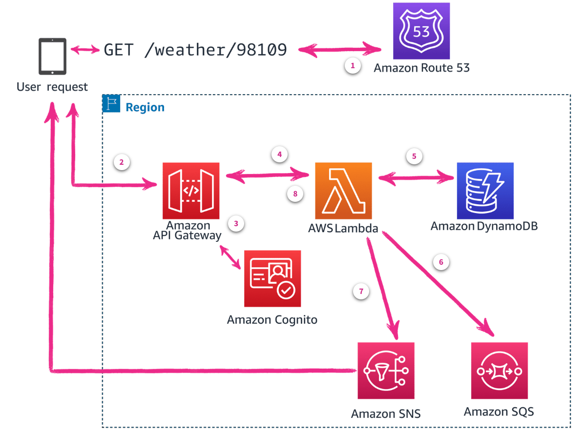

# Week 8: Serverless Applications – Modern Application Architecture Overview

* back to AWS Cloud Institute repo's root [aci.md](../aci.md)
* back to repo's main [README.md](../../../README.md)

## Modern Application Architecture

### Pre-assessment

#### What is a serverless, event-driven compute service that lets you run code for virtually any type of application or backend service without provisioning or managing servers?

* AWS Lambda

Wrong answers:

* AWS Fargate
* Amazon Elastic Container Service (Amazon ECS)
* Amazon Elastic Kubernetes Service (Amazon EKS)

##### Explanation

* AWS Lambda is an event-driven compute service that lets you run code without provisioning or managing servers.

The other responses are incorrect because:

* AWS Fargate is a serverless compute engine for Amazon Elastic Container Service (ECS) and Amazon Elastic Kubernetes Service (EKS). It allows you to run containers without provisioning or managing servers, but it is not an event-driven compute service like AWS Lambda. Fargate is designed for running containerized applications, while Lambda is designed for running individual functions or small pieces of code in response to events.
* Amazon ECS is a fully-managed container orchestration service that allows you to run and manage Docker containers on AWS. It provides a highly scalable and reliable platform for running containerized applications, but it is not a serverless or event-driven compute service like AWS Lambda. With ECS, you still need to provision and manage the underlying compute resources (EC2 instances or Fargate) to run your containers.
* Amazon EKS is a managed Kubernetes service that allows you to run and manage Kubernetes clusters on AWS. Like ECS, it is designed for running and managing containerized applications, but it is not a serverless or event-driven compute service like AWS Lambda. With EKS, you still need to provision and manage the underlying compute resources (EC2 instances or Fargate) to run your Kubernetes nodes and pods.

#### What are the benefits of a microservices architecture?

* Increased flexibility and scalability

Wrong answers:

* Little effort needed to set up an application
* Single application design containing all services for straightforward deployment
* Not difficult for implementers to understand

##### Explanation

* Setting up a microservices architecture often requires more initial effort compared to monolithic applications. Microservices involve multiple independent services, each with its own setup, deployment, and management requirements. While this can lead to benefits in the long run, the initial setup is typically more complex and requires more effort.
* Microservices involve breaking down an application into smaller, independent services rather than having a single application containing all services. The deployment of microservices is typically more complex than a monolithic application, as it involves managing multiple services independently.
* Microservices architectures can be more challenging to understand and implement compared to monolithic applications. They require a good grasp of distributed systems, inter-service communication, and complex deployment strategies. While microservices can offer benefits, they often come with a steeper learning curve and increased complexity for implementers.

#### Which AWS services are serverless? (Select THREE.)

* AWS Lambda
* AWS Fargate
* Amazon DynamoDB

Wrong answers:

* Amazon Elastic Compute Cloud (Amazon EC2)
* Amazon WorkSpaces
* Amazon Lightsail

##### Explanation

* **AWS Lambda** is serverless because it allows you to run code without provisioning or managing servers.  
* **AWS Fargate** is serverless because it allows you to deploy containers without having to manage servers or clusters.
* **Amazon DynamoDB** is serverless because it is a fully managed NoSQL database that handles capacity planning and scaling automatically.

The other options are incorrect because

* Amazon Elastic Compute Cloud (EC2) is not serverless because it requires managing underlying virtual server instances.  
* Amazon WorkSpaces is not serverless since it provides persistent virtual desktops that require managing dedicated underlying server resources.
* Amazon Lightsail is not serverless as it provides virtual private servers that require managing dedicated compute resources.

### Overview

Modern applications are built with microservice architecture patterns and serverless operational models and are deployed through an automated software delivery process.

### Microservice architecture

Microservices architecture is a software design pattern that breaks a large (monolithic) application into smaller, independent services that communicate with each other through well-defined APIs. Each service is a self-contained, single-purpose module that can be developed, tested, and deployed independently.

The main advantages of microservice architecture are modularity, scalability, and flexibility. With modularity, developers can build and deploy services independently, making it more convenient to manage and maintain complex applications. Scalability is improved because each service can be scaled independently, without affecting the other services.

Flexibility is increased because services can be effortlessly integrated with other services or replaced with new services as requirements change. Services can also be written in any programming language and use any form of data persistence that meets the desired application requirements. For example, one service could be written in Python with an Amazon DynamoDB database, while another is written in Java with a relational database. 

Microservice architecture also has some challenges, such as managing dependencies between services and ensuring that services communicate effectively through APIs. However, these challenges can be addressed through proper design and implementation practices.

Overall, microservice architecture is a powerful tool for building scalable and flexible applications that can adapt to changing requirements over time.

### Serverless deployments

Serverless deployment is a method of deploying an application without having to think about servers. The server is managed by a cloud provider, and the developer only needs to worry about writing the code and deploying it. This can make the development process faster and more convenient because there is no need to set up and maintain servers. 

Many serverless solutions are built using an event-driven architecture (EDA) that focuses on small, decoupled services that publish, consume, or route events (messages sent between services). This allows serverless applications to scale, update, and independently deploy components as needed.

At AWS, there are two primary options for serverless operating models.

#### Serverless Event-Driven Compute

AWS Lambda might be a good fit if you are looking to offload as much infrastructure as possible and build event-driven applications. 

* [AWS Lambda](https://aws.amazon.com/lambda/)

#### Serverless Compute for Containers

Containerized applications are typically used for implementing microservices. They might be a good fit if you want to migrate or build traditional applications with long-running process with a dedicated compute layer.

* [AWS Fargate](https://aws.amazon.com/fargate/)

### Automated software delivery

Automated software delivery is often referred to as continuous integration and continuous delivery (CI/CD).

* **Continuous Integration (CI)** is a software development practice in which developers frequently integrate their changes into a shared main code base. This helps to catch and fix bugs early in the development process.
* **Continuous Delivery (CD)** is a software development practice that aims to automate the deployment of software testing and production environments after manually approving the deployment.
* **Continuous Deployment (CD)** automates continuous delivery through automated testing of code. If the code passes all tests, it will automatically be delivered to the production and made available to your customers.

Overall, AWS offers a range of CI/CD services that can be used to automate the software delivery process and improve the efficiency of software development teams. These services provide a flexible and scalable solution for building, testing, and deploying applications, in addition to collaborating on development projects.

## Overview of AWS Services and Tools for Building Modern Applications

### Data Storage

Data storage is one of the most important parts of any business. AWS offers a wide range of data storage services, including the following:

* **Amazon Aurora** is a highly available and scalable relational database engine built for the cloud.
* **Amazon DocumentDB (with MongoDB compatibility)** is a document database service that makes it convenient to build highly available and scalable NoSQL databases.
* **Amazon DynamoDB** is a fully managed NoSQL database service that offers fast and predictable performance with seamless scalability. 
* **Amazon Elastic File System (Amazon EFS)** is a straightforward, scalable, high-performance file system service. It makes it convenient for customers to store and access data across multiple AWS Regions.
* **Amazon Simple Storage Service (Amazon S3)** is an object storage service offering industry-leading scalability, data availability, security, and performance.

### Compute Services

Compute services for modern applications use event-driven and container technologies to streamline deployments and allow individual services to grow as needed. AWS offers a variety of compute services, including the following:

* **Amazon Elastic Container Service (Amazon ECS)** empowers you to run multiple containerized applications on a single Amazon Elastic Compute Cloud (Amazon EC2) instance or a fleet of EC2 instances. Amazon ECS can automatically scale your applications based on demand.
* **Amazon Elastic Kubernetes Service (Amazon EKS)** helps you run Kubernetes applications in a highly available, scalable, and managed manner. Amazon EKS can also automatically scale your Kubernetes clusters based on demand.
* **AWS Fargate** is a compute service that aids you in running containerized applications without provisioning or managing servers. AWS Fargate is serverless, which means that you pay only for the compute time that your applications use. AWS Fargate is the primary container service used in modern application architecture.
* **AWS Lambda** is an event-based compute service that gives you the ability to run code without provisioning or managing servers.

### Integration Services

AWS offers a range of integration services that can be used to build complex integration solutions. Each service has its own strengths and use cases, and it is important to choose the service that best fits your specific needs.

* **Amazon API Gateway** is a fully managed service that makes it effortless to create, publish, monitor, and scale APIs. It provides a range of features, including API documentation, request and response validation, caching, and security. Amazon API Gateway supports RESTful and WebSocket APIs.
* **Amazon EventBridge** is a fully managed event-sourcing service that makes it convenient to collect, process, and distribute application events across multiple AWS services. It provides features such as event routing, event filtering, and event logging.
* **Amazon Simple Queue Service (Amazon SQS)** is a highly scalable, reliable, and fully managed message queuing service. You can store and retrieve messages in a distributed manner, making it suitable for use in distributed systems and applications.
* **AWS App Mesh** is a service that makes it effortless to build, deploy, and manage microservice-based applications in a highly available and scalable manner. It provides features such as service mesh networking, traffic management, and service discovery.
* **AWS AppSync** is a serverless service that makes it convenient to build connected apps that exchange data with each other. With AWS AppSync, you can define data models as GraphQL APIs that describe the data and how it relates to other data. You can then use these APIs to build connected apps that can access and share data across different systems and services.
* **AWS Step Functions** is a state machine service that makes it uncomplicated to build, manage, and run complex business processes. It provides features such as parallel execution, state management, and fault tolerance.

### Development and Deployment Tools

AWS has a variety of tools available for application development and code deployment. The following are some of the key services available:

* **AWS Amplify** is a fully managed, serverless platform for building mobile and web apps. It provides a range of services, including authentication, databases, hosting, and more, all managed through a single interface.
* **AWS Cloud Development Kit (AWS CDK)** is a powerful tool that makes it effortless to build, test, and deploy cloud-based applications on AWS. It provides a high-level, code-first approach to building cloud applications, abstracting away the complexity of working with AWS resources.
* **AWS CodePipeline** is a continuous delivery service that automates the build, test, and deployment of applications. It integrates with other AWS services, such as Amazon Simple Storage Service (Amazon S
* **AWS Serverless Application Model (AWS SAM)** is a service that makes it convenient to create and manage serverless applications. It provides a set of tools and services that help developers build, deploy, and manage applications without the need for servers or infrastructure management.

### Microservice example: Weather information

The Services to be used to build a microservice that looks up the weather by zip code and returns JSON data.

1. **Amazon Route 53**. The solution starts with the client resolving the host name through Route 53 DNS.
2. **Amazon API Gateway**. The browser's HTTP request, GET /weather/98109 in this example, is sent to API Gateway.
3. **Amazon Cognito**. If the URL is valid and authenticated with Amazon Cognito, an event for the request is created and sent to Lambda for processing.
4. **AWS Lambda**. A Lambda function receives and processes the event.
5. **Amazon DynamoDB**. The handler method sends a query to DynamoDB for weather data for the given zip code. The function might filter and customize the data, based on the location and preferences of the user, perhaps converting degrees in Celsius to Fahrenheit.
6. **Amazon SQS**. Before returning the data that is bundled into a new event back to API Gateway, the function handler might create additional events. It might send one to an Amazon SQS queue, where a data analytics service could be listening.
7. **Amazon SNS**. The handler function might create and send another event to an Amazon SNS queue so that alerts for high temperatures are sent to users through text messages.
8. **Amazon API Gateway**. The function finally wraps up the JSON weather data into a new event and sends it back to Amazon API gateway.



After returning the weather to the API Gateway, and ultimately the user, the function continues to handle hundreds of additional requests. You will be charged for the number of requests for your functions and the duration it takes for your code to run.

### Knowledge Check

#### What is a key architectural principle of microservices?

* Microservice applications should use multiple services that run independently of each other.

Wrong answers:

* Microservice applications should consolidate all functionality into a single, large service.
* Microservice applications should always use a single database for all services.
* Microservice applications should prioritize tightly coupled services for better performance.

##### Explanation

* Microservices aim to break down applications into smaller, manageable services rather than consolidating everything into a single large service.
* While it's possible for microservices to share a database, it's generally recommended for each microservice to have its own database to maintain independence and reduce coupling.
* Microservices actually prioritize loose coupling between services, not tight coupling. This allows for greater flexibility and easier updates to individual services without affecting the entire system.

#### What are the main advantages of microservice architecture?

* Modularity, scalability, and flexibility

Wrong answers:

* Cost, speed, and complexity
* Cloud, physical server usage, and resource limits
* Color, size, and quality

##### Explanation

* While microservices can potentially reduce costs and improve speed in some aspects, they often introduce additional complexity. Complexity is generally considered a challenge rather than an advantage of microservices.
* While microservices can be deployed in the cloud and can affect server usage and resource management, these are not the primary advantages that define microservice architecture.
* Color, size, and quality have no relation to the advantages of microservices in software design and development.

#### Which of the following are part of automated software delivery? (Select TWO.)

* Continuous integration (CI)
* Continuous deployment (CD)

Wrong answers:

* Incremental backup
* Prime Delivery
* Amazon Aurora

##### Explanation

* Incremental backup is a valid backup method that backs up items that have changed since the last full backup. This type of backup is for files or Operating System level back and isn't used for automated software delivery.
* Prime Delivery is is a service that offers a variety of delivery options for items ordered on Amazon.com, it is not part of automated software delivery.
* Amazon Aurora is a managed relational database service. The database itself is not part of the deployment pipeline.

### Summary

* Identify the differences between monolithic and microservice architectures.
* Describe some of the AWS services available for building modern applications.
* Explain a high-level overview of microservice architecture, design patterns, and how to decompose an application into microservices.

## Microservices

### Pre-assessment

#### Which type of architecture is tightly coupled and run as a single service?

* Monolithic architecture

Wrong answers:

* Microservice architecture
* Blue/green architecture
* Distributed architecture

##### Explanation

* With monolithic architectures, all processes are tightly coupled and run as a single service. This means that if one process of the application experiences a spike in demand, the entire architecture must be scaled.

The other responses are incorrect because:

* Microservice architecture is the opposite of what the question asks for. Microservices are loosely coupled, independent services that can be developed, deployed, and scaled separately. Each microservice typically runs as its own service, not as a single, tightly coupled unit.
* Blue/green architecture refers to a deployment strategy rather than an application architecture type. It involves maintaining two identical production environments, allowing for zero-downtime releases and easy rollbacks. It doesn't describe how the application itself is structured or coupled.
* Distributed architecture refers to systems where components are spread across multiple computers or nodes, communicating over a network. While it can involve tightly coupled components, it's not typically run as a single service and is more focused on distribution rather than coupling.

#### Which type of architecture builds each component as independent services that communicate over lightweight APIs?

* Microservice architecture

Wrong answers:

* Monolithic architecture
* Network architecture
* Security architecture

##### Explanation

* Microservices architecture builds each component as independent services that communicate over lightweight APIs. Each service is built for a single function that runs independently of each other.

The other responses are incorrect because:

* monolithic architecture is the opposite of what the question describes. In a monolithic architecture, all components of an application are tightly integrated into a single codebase and deployed as a single unit. It does not build components as independent services, nor does it typically use lightweight APIs for internal communication.
* network architecture refers to the design of computer networks and how devices communicate within them. While it involves communication between components, it doesn't specifically relate to building application components as independent services with API communication.
* security architecture focuses on designing systems with security in mind, including aspects like access control, data protection, and threat mitigation. While important, it doesn't describe the structure of building application components as independent services communicating via APIs.

#### Choose the types of APIs that are used by microservices? (Select THREE.)

* REST
* GraphQL
* SOAP

Wrong answers:

* XPATH
* RSS
* JSON

##### Explanation

* **REST**, **GraphQ**L, and **SOAP** APIs are essential for building scalable and efficient applications.

The other responses are incorrect because:

* RSS is a standardized web feed that allows users and services to subscribe to a computer-readable information feed.
* JSON stands for Javascript Object Notation, it is a lightweight format for storing and transporting data.
* XPATH stands for XML Path Language, it uses non-XML syntax to provide way to address different parts of an XML document.

### Monolithic Compared with Microservice Architecture

### Architecture Differences

Microservices are an architectural and organizational approach to software development where software is composed of small, independent services that communicate over well-defined APIs. These services are owned by small, self-contained teams. Microservice architectures make applications more convenient to scale and faster to develop, providing innovation and accelerating time-to-market for new features.

The following chat application is currently a single monolithic application that would benefit from being converted, or decomposed, into a microservice application.

#### Monolithic architecture

A typical monolithic application architecture with the user, thread, and post services contained within a single application.

With monolithic architectures, all processes are tightly coupled and run as a single service. This means that if one process of the application experiences a spike in demand, the entire architecture must be scaled. Adding or improving a monolithic application’s features becomes more complex as the code base grows.

It is difficult to write a monolithic application in more than one programming language. This means the entire application and services are written in the same programming language. Microservices give the option to write each service in the programming language that is best suited to the task.

This chat application contains all the services and functions for managing user accounts, message threads, and post status within a single application.

This complexity limits experimentation and makes it difficult to implement new ideas. Monolithic architectures add risk for application availability because many dependent and tightly coupled processes increase the impact of a single process failure.

#### Microservices architecture

Microservices architecture builds each component as independent services that communicate over lightweight APIs. Each service is built for a single function that runs independently of each other. Because of this, they can be updated, deployed, and scaled to meet demand for their specific function without affecting other services.

For the chat application, the user, thread, and post features are now separate services. Users can then be created and profiles updated seamlessly as the number of posts and message threads grows independently.

A single monolithic architecture application split into three separate microservices: User service, Threads service, and Posts service.

### The Twelve-Factor App Methodology

The Twelve-Factor App methodology, created by Adam Wiggins, is a set of guidelines for building scalable and reliable web applications. Microservice architectures combine successful and proven concepts from various fields and often incorporate design patterns from the Twelve-Factor App.

### The twelve factors

Each of the following twelve factors are directly applicable to serverless application development and are the default capabilities of the AWS serverless platform:

* Codebase
* Dependencies
* Config
* Backing services
* Build, release, run
* Processes
* Port binding
* Concurrency
* Disposability
* Dev and prod parity
* Logs
* Admin processes

#### Codebase

Use one codebase tracked in a revision control system and deployed into multiple environments. The codebase is a tracking database that keeps track of all changes to the code. This is also known as a code repository, code repo, or repo.

All code deployments to different environments, such as production, staging, or development, share the same code repo.

#### Dependencies

Explicitly declare and isolate dependencies.

The application shouldn't assume any required dependencies will preexist on the user's system. Required dependencies should be packaged with the application. The application should also use a dependency isolation mechanism while running to prevent any preexisting dependencies from being used by the application. This ensures the application ships and runs with the correct version of the required dependencies without any preexisting system configuration causing a conflict with the application.

This means that if your application requires Python 3, but the user's system already has a broken version of Python 3 installed, your application will still run properly. It will use the version of Python 3 you packaged with the application and ignore the preexisting version on the user's system when the application is run.

Another advantage of explicitly declaring dependencies is that it will serve as documentation for any new developers joining the team. They can find all the libraries and packages needed to build and run an application in one place.

#### Config

Store config in the environment.

Configuration that varies between deployments should be stored in the environment and not as constants in the code. This could be system environment variables or local configuration files that are stored on the file system.

An example configuration setting is the database host. This is going to be different in your development, staging, testing, and production environments. Ideally, you want the same code in each environment. So, you should externalize the database setting, removing the setting from the code and storing it in a configuration file or an environment variable.

The following is an example of an external configuration file.

* Configuration.ini

```bash
# Settings file for your application, separate and outside of your course code.

[Database]
dbname="testdb"
dbserver="db.example.lan"
```

#### Backing services

Treat backing services as attached resources.

Services used by the application over a network, such as databases, should be treated as resources to the application. They should be able to be swapped from a local database to a cloud-hosted database without changes to the core code.

#### Build, release, run

Strictly separate build and run stages.

The codebase is deployed through three stages—the build stage, the release stage, and the run stage. A Twelve-Factor App uses strict separation between these stages. Code isn't changed when it is in the run stage. You always start at the beginning by supplying the updated code to the build stage.

The Twelve-Factor App stages are as follows:

* **Build**: This takes code from your repository, retrieves the defined dependencies, and creates an artifact for the next stage.
* **Release**: The release combines the built artifact with the settings to prepare the application for the run stage.
* **Run**: The output from the release stage is delivered to a service to be launched or run. An example of this is an Amazon Elastic Compute Cloud (Amazon EC2) instance.

#### Processes

Run the app as one or more stateless processes.

The application is run as one or more stateless processes that share nothing between processes. This allows processes to not interfere with each other and scale as needed for process-specific tasks.

A stateless app persists data to an external resource, such as Amazon DynamoDB. After processing completes, nothing is kept locally that is needed for future processing. A stateless app can be conveniently moved between processing nodes.
A share-nothing process can perform its processing without having to coordinate with other processes doing the same task. The work has already been divided up, such as using a load balancer for balancing requests for a web application. Each process servicing those requests works independently of each other and can be moved to other hosts effortlessly.

#### Port binding

Export services through port binding.

Twelve-Factor Apps are self-contained because they include everything needed to expose themselves as a service on a port. They do not require the support of external services to create or make themselves available.

A web server, for example, would export HTTP as a service and bind to port 80. The developer can visit http://localhost/ to access it without the need to previously install and configure a dedicated web server. After it's deployed, the same service could respond to requests coming from an application load balancer, as well.

#### Concurrency

Scale out through the process model.

Twelve-Factor Apps' processes are high priority and are modeled from the Unix processes model for running service daemons. A developer can specify a process type while architecting their application to optimize process performance. This allows many process types to run concurrently without conflicting with other processes and are all managed by the operating system's process manager locally.

#### Disposability

Maximize robustness with fast startup and graceful shutdown.

Application processes should be disposable and conveniently stopped and started to achieve fast scaling and rapid deployment. Processes should also protect against sudden hardware or software failure and recover quickly.

#### Dev and prod parity

Keep development, staging, and production as similar as possible.

The application should be designed for continuous development and deployment. The following gaps should be kept as short as possible:

* **Time gap**: This is the time it takes a developer to deploy code.
* **Personnel gap**: The developers creating the code should also be involved with its deployment.
* **Tools gap**: The toolset available in development should be similar to the tools available in production.

#### Logs

Treat logs as event streams.

An application should stream event details, unbuffered, to a standard output that can be monitored live by the developer. The application should never be concerned with writing and storing log files.

For example, when submitting an order for payment processing, the developer is monitoring what happens during development. In production, the application logs can be captured and archived for viewing. This is helpful when tracing production issues.

#### Admin processes

Run admin and management tasks as one-off processes.

Admin tasks should run similarly to long-running processes of the application, using the same codebase and config of the release. Developers can run one-time tasks and commands, provided they deploy the proper environment with the application. An example of this is a one-time script to fix database records that were created by a bad deployment.

### [Applying the Twelve-Factor App Methodology to Serverless Applications](https://aws.amazon.com/blogs/compute/applying-the-twelve-factor-app-methodology-to-serverless-applications/)

### Microservices Communication Protocols

### APIs

APIs are mechanisms that enable two software components to communicate with each other using a set of definitions and protocols. For example, the weather bureau’s software system contains daily weather data. The weather app on your phone “talks” to this system by way of APIs and shows you daily weather updates on your phone.

Microservices communicate through API *endpoints*, which are essential for building scalable and efficient applications. It is important for developers to choose the right protocol for their specific needs, and to ensure that they are properly implemented for higher performance and reliability.

#### GraphQL

GraphQL is a query language for APIs that gives applications the ability to fetch the exact data that they need from a server. In a single request, a GraphQL query can describe the data it wants. The server responds with a JSON object of the results requested by the application. GraphQL APIs are highly flexible and efficient, because clients can query data in a more declarative and intuitive way.

To use GraphQL, AWS AppSync should be used.


#### REST

Representational State Transfer (REST) is a lightweight, stateless protocol that is commonly used for building web services. It follows a client-server model, where the client sends requests to the server, and the server responds with data. REST APIs are typically designed using HTTP methods, such as GET, POST, PUT, and DELETE, and they use JSON or XML as the data format. REST web services are also called RESTful web services.


#### SOAP

Simple Object Access Protocol (SOAP) is an older technology that requires a strict communication contract between systems. New web service standards have been added over time to accommodate technology changes, but they create additional overheads. REST was developed after SOAP and inherently solves many of its shortcomings.

SOAP is a protocol that defines rigid communication rules. It has several associated standards that control every aspect of the data exchange. For example, here are some standards SOAP uses:  

* Web Services Security (WS-Security) specifies security measures like using unique identifiers called *tokens*.  
* Web Services Addressing (WS-Addressing) requires including routing information as metadata.
* WS-ReliableMessaging standardizes error handling in SOAP messaging.
* Web Services Description Language (WSDL) describes the scope and function of SOAP web services.

When you send a request to a SOAP API, you must wrap your HTTP request in a SOAP envelope. This is a data structure that modifies the underlying HTTP content with SOAP request requirements. Due to the envelope, you can also send requests to SOAP web services with other transport protocols, like TCP or Internet Control Message Protocol (ICMP). However, SOAP APIs and SOAP web services always return XML documents in their responses. 

#### WebSocket API

WebSocket API is another modern web API development that uses JSON objects to pass data. A WebSocket API supports two-way communication between client apps and the server. The server can send callback messages to connected clients, making it more efficient than REST API.

### How to Design an Application Using Microservices

#### Identify the business problem

Start by identifying the business problem that your application will solve. This will help you determine the functionality that your application will need.

#### Define the microservices

Break down the functionality of your application into smaller, independent services. Each service should have a clear purpose and should be responsible for a specific set of tasks.

#### Choose the technology stack

Choose the technology stack that will best support your microservices. This could include a variety of technologies, such as Java, Python, and Node.js.

#### Design the data model

Design a data model that will be used by all of your microservices. This model should be scalable and should be able to handle large amounts of data. For example, Amazon DynamoDB, Amazon Relational Database Service (Amazon RDS), or Amazon Aurora can be used.

#### Implement the microservices

Each service should be deployed independently. Choose the compute service where your code will run, such as AWS Lambda or Amazon Elastic Container Service (Amazon ECS).

#### Integrate the microservices

Integrate the microservices using a messaging system, such as Amazon Simple Notification Service (Amazon SNS) and Amazon Simple Queue Service (Amazon SQS). This will allow the services to communicate with each other.

#### Test the microservices

Test each microservice to ensure that it is working correctly. This will help you identify any bugs or issues that might need to be addressed.

#### Deploy the microservices

Deploy the microservices to a production environment. This will allow your application to be used by users.

#### Monitor the microservices

Monitor the microservices to ensure that they are running smoothly. This will help you identify any issues that might arise, so you can make any necessary changes. AWS CloudWatch, AWS CloudTrail, and AWS X-Ray can be used for monitoring and troubleshooting.

#### Maintain the microservices

Maintain the microservices by updating them with new features and fixing any bugs or issues that might arise. This will help ensure that your application remains reliable and efficient.

### Decomposing an application

*Decomposing an application* refers to the process of breaking down a monolithic application into smaller, independent services that can be developed, deployed, and managed separately. By breaking down an application into microservices, developers can better understand the individual components, making it more convenient to identify and address issues. The goal of decomposing an application into microservices is to improve the overall architecture of the application and make it more scalable, reliable, and flexible.

After you decide to decompose a monolith in your application, you should choose the appropriate decomposition patterns. You can use multiple patterns to decompose your applications, such as breaking them down by business capability and then by subdomain.

Two typical patterns you might see are **Brownfield** and **Greenfield** projects. Brownfield projects involve developing and deploying a new software system within the context of existing or legacy systems. Greenfield projects involve creating a system from scratch for a completely new environment, without any legacy code involved.

The following are some of the other decompose patterns available:

* Decompose by business capability
* Decompose by subdomain
* Decompose by transactions
* Service per team pattern
* Branch by abstraction pattern

#### [Patterns for Decomposing Monoliths ](https://docs.aws.amazon.com/prescriptive-guidance/latest/modernization-decomposing-monoliths/decomposing-patterns.html)

### How to Build This: Serverless Microservice Application

### Food delivery application example

Users place orders to vendors and delivery guys pick them up. Vendors don't have direct interaction with the users, just the delivery guy. The users don't have direct contact with anybody, any of the individuals on the marketplace. They just see the order on the app and delivery guys deliver it to the users.

The application will be in charge of displaying the menus, communicating the orders to the restaurants, and ensuring that food gets delivered to hungry customers as soon as possible.

In a microservices architecture, the application is composed of independent services that communicate over well-defined APIs. This agile approach will help you improve maintainability and scalability.

#### A typical serverless microservices infrastructure

A typical serverless microservices infrastructure is composed of Amazon API Gateway and AWS Lambda functions. API Gateway makes it easy to create, maintain, and secure REST APIs at any scale. You can think of API Gateway as the front door to access your backend.

Lambda lets you run code without having to think about servers or clusters. Lambda will take care of everything required to run and scale the execution to meet the actual traffic demands with high availability.

You’ll create Lambda functions for each business process. API Gateway will synchronously trigger the right Lambda function, depending on the service you need to reach.

#### Lambda functions for services as an example

* user service
* order service
* payment service
* menu service
* delivery service

#### User authentication

Amazon Cognito lets you add user sign-up, sign-in, and access control to your apps quickly. Cognito has a concept called “user pools,” which you can think of as a user directory. You can use a Cognito user pool to control who can access your API in API Gateway. This is useful when you have different personas using your app. In this app, the user that wants to order food should have access to different APIs than the restaurant owner and the person delivering the food.  

#### Choosing a database

Relational databases are a solid choice when you’re building a transactional system and want data accuracy and consistency. Amazon Aurora is a MySQL and Postgres compatible relational database built for the cloud. He’ll use Aurora to perform CRUD operations on food orders. In this example, Aurora can be used to perform CRUD operations on food orders.

#### Search / user experience in the app

Amazon Elasticsearch provides a fast and personalized search experience for your app. Elasticsearch achieves fast responses because it searches an index instead of the text directly. This is like retrieving pages in a book related to a keyword by scanning the index as opposed to searching every word of every page.

#### When a user logs into the app

The user will search for their favorite restaurants or for a specific food. This functionality is built on API Gateway calling a Lambda function and the Lambda function requesting the searched item in Elasticsearch. 

#### Payment processing

To process payments, you can use a third party payment processor so you can get your app to market as soon as possible. You would use Lambda to trigger the third-party payment processor.

#### Once the payment has been processed

You'll use a Lambda function to trigger Amazon's Simple Notification Service. Simple Notification Service is a pub/sub messaging service that can be used to send messages to millions of users. Lambda triggering Simple Notification Service is a common architecture pattern for event-driven apps. You can use Lambda with the Simple Notification Service solutions construct to pre-configure these services together with security best practices built in.

#### When the order is confirmed

It is sent to a central message queue managed by Amazon Simple Queue Service. Simple Queue Service is a message queuing service that enables you to decouple and scale microservices. It is really important that the purchases are kept in order so that there are no delays for the users. A first in, first out queue will ensure that the order in which the messages are sent and received is strictly preserved. It will also ensure that the message is only delivered once and that no duplicates are introduced into the queue.

#### Verifying the status

Amazon Location Service makes it easy for developers to add location functionality to their app. Location geofences gives your application the ability to detect and act when a tracked device enters or exits a geographical boundary you define as a geofence. When a location update crosses the boundaries of one or more geofences, Amazon EventBridge receives the geofence event.

EventBridge is a serverless event bus that makes it easier to build event-driven applications at scale. EventBridge will route the data from the geofence to a Lambda function which will then publish a message to SNS and trigger a notification to your users.

This architecture pattern of using location service for map and geofence data and passing that data to EventBridge to react in real time can be used for almost every app that needs to manage deliveries.

#### Example summary to build an ecommerce app with location-based notifications

Add user sign-in with Amazon Cognito. Use API Gateway with AWS Lambda to build each microservice. All of your order data is stored in Amazon Aurora. Use Amazon Elasticsearch to provide a quick search experience in your app. Notify users of their order with Amazon Simple Notification Service. Use a FIFO queue with Amazon Simple Queue Service to process orders. Send real-time notifications based on the location of the delivery worker using Amazon Location Service.

### Knowledge Check

#### Choose the decompose patterns. (Select TWO.)

* Decompose by business capability
* Decompose by subdomain

Wrong answers:

* Decompose by examination
* Decompose by review
* Decompose by shared database

#### An app is being deployed to four environments: development, staging, testing, and production. How many code repositories would be used for this application, according to the Twelve-Factor app?

* One repository used by all environments

Wrong answers:

* Four repositories, one for each environment
* Two repositories, one for non-production and one for production
* Five repositories, one for each environment, and one to track changes between those environments.

##### Explanation

* Having four repositories one each environment would lead to code duplication and make it difficult to maintain consistency across environments.
* While having two repositories is sometimes used in practice, it's not in line with the Twelve-Factor App methodology. It still introduces the problem of maintaining multiple codebases, which can lead to drift between production and non-production environments.
* Having five repositories is the furthest from the Twelve-Factor App principles. It not only creates multiple codebases but also adds complexity with an additional repository to track changes. This would make version control and deployment processes unnecessarily complicated.

#### How should modern application dependencies be handled?

* Explicitly declared, isolated, and packaged with the application

Wrong answers:

* Listed as a pre-requisite before installing the application
* Reinstalled, even if it already exists on the user environment
* Ignored because most modern environments have what is needed already

##### Explanation

* Listed as a pre-requisite before installing the application
 * While this approach was common in the past, it's not ideal for modern applications. It can lead to version conflicts, inconsistencies across environments, and difficulties in deployment and scaling. It also doesn't ensure that the exact versions of dependencies are used across all installations.

* Reinstalled, even if it already exists on the user environment
 * This approach is inefficient and can lead to conflicts with existing system libraries. It doesn't respect the user's environment and can cause unnecessary duplication of resources. Moreover, it doesn't guarantee consistency across different environments.

* Ignored because most modern environments have what is needed already
 * This is a dangerous assumption that can lead to numerous problems. Different environments may have different versions of dependencies, leading to inconsistent behavior. It also makes the application less portable and more difficult to deploy in new environments.

 ### Summary

* What a microservice architecture is and how it differs from a monolithic architecture
* The Twelve-Factor app methodology
* Microservice communication protocols
* How to design an application using microservices
* How to decompose a monolithic application into a microservice application
