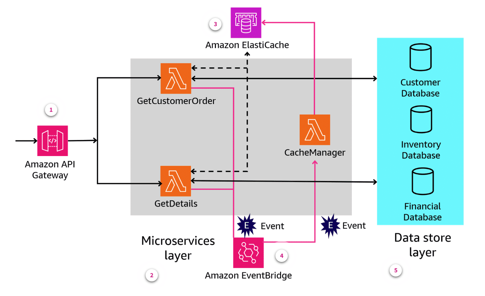
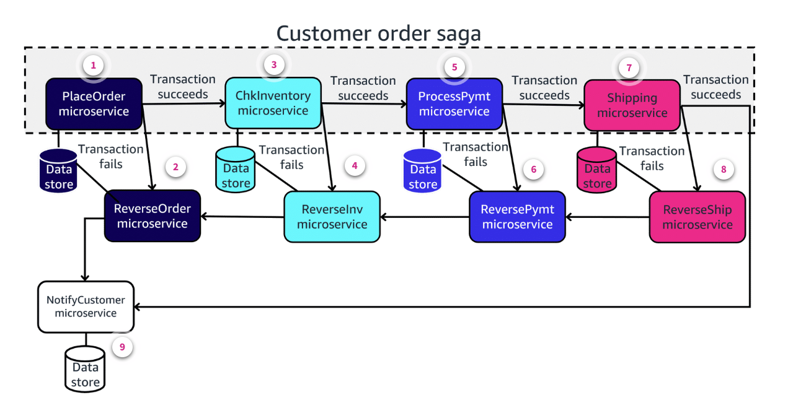
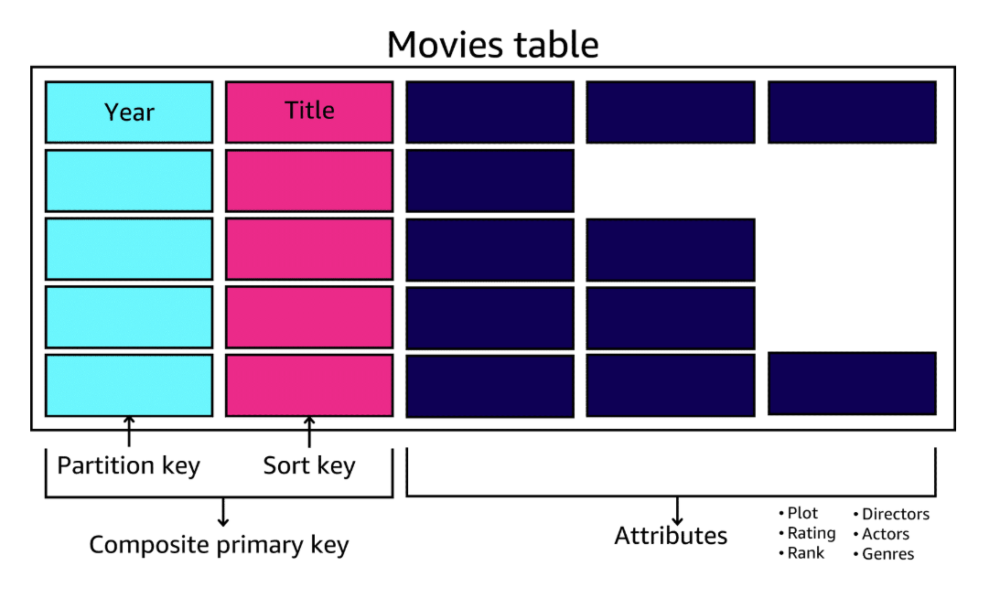

# Week 8: Serverless Applications – Microservice Data Storage Patterns

* back to AWS Cloud Institute repo's root [aci.md](../aci.md)
* back to repo's main [README.md](../../../README.md)

## Microservice Data Storage

### Pre-assessment

#### What are benefits of using the database-per-service pattern for microservice data stores? (Select THREE.)

* Changes made to the structure of a microservice's data store do not affect other microservices.
* Different data stores can be used to meet each microservice's compliance or security requirements.
* The data store that is best suited to an individual microservice's requirements can be used to persist data.

Wrong answers:

* In-memory caches reduce the importance of which data store is used to persist data for each individual microservice.
* Changes made to the structure of a microservice's data store automatically update all other microservice data stores.
* The same data stores can be used, no matter what the compliance or security requirements are for each microservice.

#### Which issue can the API composition pattern be used to resolve in a microservices-based application?

* The issue of querying data that spans the data stores from multiple microservices

Wrong answers:

* The issue of managing transaction data that spans multiple microservices and data stores
* The issue of securing access to data stores across multiple microservices
* The issue of managing API calls to AWS services from Python-based microservices

##### Explanation

The API composition pattern uses an aggregator to implement a query by invoking the individual microservices that own the data. Then the aggregator uses an in-memory join operation to combine the data and return the requested query results.

#### An application developer needs to write a transaction that uses four separate microservices to complete a single application operation. Each microservice has its own data store. What pattern should the developer consider using if all four transactions must succeed or fail as a unit?

* Saga pattern

Wrong answers:

* Database-per-service pattern
* API composition pattern
* Command query responsibility segregation (CQRS) pattern

##### Explanation

The saga pattern is a failure management pattern that coordinates transactions between multiple microservices to maintain overall data consistency.

#### A developer is creating a new microservice and using Amazon DynamoDB as the data store. The developer was told to download and install Boto3 for their development environment. Which language will the developer be using to create the microservice?

* Python

Wrong answers:

* Java
* JavaScript
* PHP

##### Explanation

Boto3 is another name for the AWS software development kit for Python (AWS SDK for Python).

#### Which Boto3 API for Amazon DynamoDB is used to update an existing item in a DynamoDB table from a Python-based microservice?

* update_item

Wrong answers:

* UpdateAPI
* UpdateItem
* update_api

## Understanding Microservice Data Storage

### Overview

The Twelve-Factor App methodology recommends the use of microservices in modern application architectures. This approach allows for highly scalable applications, but it also introduces some unique storage considerations related to the management, ownership, and storage of the data used to support these microservices.

### Microservice data management

Microservices are stateless. Therefore, they do not maintain any of their data after the microservice has run to completion. Instead, this data is stored outside the microservice itself, using a persistent data store such as a database.

### Microservice data ownership

When a microservice stores its data externally, it  sometimes acts as the owner of that data too. In this case, other microservices or processes that need to access that data, do so using the appropriate application programming interface (API). In other cases, multiple microservices may share the data stored in a single database, or set of database tables. This ownership model requires careful coordination between the microservices that share that data, so that application changes for one microservice do not adversely impact another microservice. Caching strategies can be used to speed up access to dispersed data that is used by microservices for their processing.

### Microservice data storage

Not all microservices will require the same type of storage for their data. The best data store for a particular microservice is determined by the microservice's performance requirements and the type and volume of data produced by the microservice. Because the best option for storing data can differ from one microservice to the next, microservice-based applications frequently use multiple data storage options (*polyglot persistence*) in their architecture. This differs from a traditional monolithic application architecture, which usually stores all the application's transactional and state data in a single, large relational database.

## Managing Microservice Data Persistence

### Overview

Microservices have to store (*persist*) their data in external data stores. The following architecture design patterns present some common approaches for persisting and using data associated with microservices.

### Database-per-service pattern

Loose coupling is a key characteristic of a microservices architecture, because each individual microservice can independently write and read information to its own data store. In-memory caches, relational databases, nonrelational databases, and disk-based object, block, and file storage can all be used to persist microservice state data. By applying the database-per-service pattern, you can choose the most appropriate data stores for your microservices.

The database-per-service approach provides several benefits when using a microservice application architecture:

* You can choose the data storage option that is best suited to each microservice.
* Any changes that you make to a data store structure for one microservice will not affect the data structures of any other microservices.
* Matching microservices to individual data stores also improves the portability and scalability of your application by making it easier to move a microservice, and its data store, as a unit.
* You can enforce different data compliance or security requirements for different microservices.
* Individual data store ownership also improves the resiliency of your overall application by helping to prevent the database being a single point of failure.

The database-per-service approach also presents several challenges when using a microservice application architecture:

* Having multiple databases of different types increases the operational overhead of managing the application.
* Data queries that span multiple data stores require coordination across microservices.
* Transactions that span multiple data stores are essentially distributed transactions. So you will need sufficient mechanisms in place to ensure that the overall transaction succeeds or fails as a unit, across all impacted data stores.

Other architecture patterns can be used to address some of these challenges, including the API composition pattern and the saga pattern.

### API composition pattern

If you use the database-per-service approach to storing microservice data, the API composition pattern can be used to manage queries and transactions that must span multiple microservices. One way to implement the API composition pattern is to use Amazon API Gateway to route requests coming into the serverless Lambda environment.

1. **API operations**. The Amazon API Gateway is exposing Lambda functions as API operations to internal or external consumers.
2. **Microservice layer**. The microservices layer (GetCustomerOrder, GetDetails, and CacheManagerPayments) is comprised of Lambda functions.
3. **Data cache manager**. All three microservices are connected with the data cache and can save and retrieve objects from there. The cache is maintained in-memory using Amazon ElastiCache.
4. **Custom events**. Custom events, such as a inventory event that is raised by a customer order, are published to Amazon EventBridge for downstream processing.
5. **Data store layer**. Downstream persistent storage of application data is done outside of the microservices layer using a data store for each microservice.

The API composition pattern offers the simplest way to query data from multiple microservices. However, there are three disadvantages to using the API composition pattern that you should consider:

* In-memory joins like those performed using the API composer pattern might not be suitable for complex queries on large datasets.
* As the number of microservices connected to the API composer increases, each query will reduce overall system availability.
* Each database request initiated by the API composer creates network traffic, which increases your operational costs.

### Saga pattern

If you use the database-per-service approach to storing microservice data, the saga pattern can be used to manage transactions that span multiple microservices.

The saga pattern is a failure management pattern that coordinates transactions between multiple microservices to maintain overall data consistency. Under the saga pattern, each microservice publishes an event for every transaction that it performs. The next microservice's transaction is initiated based on the success or failure of the preceding microservice's transaction event. Successful completion of the prior microservice's transaction can cause the application to follow one path, and failure of the prior microservice's transaction can cause the application to follow a different path.

#### An example of how the saga pattern can be used to control a transaction for a customer order application that uses nine microservices

1. **PlaceOrder microservice**. The saga pattern begins when a customer places an order. Placing an order calls the PlaceOrder microservice. If the microservice is completed successfully, the order data is stored in the microservice's dedicated data store, and an event calls the next microservice in the saga.
2. **ReverseOrder microservice**. If the PlaceOrder microservice fails, an event calls the ReverseOrder microservice, and the original PlaceOrder data is rolled back.
3. **ChkInventory microservice**. The saga pattern continues by calling the ChkInventory microservice to see if the ordered item is in stock. If the microservice is completed successfully, the change in inventory is stored in the microservice's dedicated data store, and an event calls the next microservice in the saga.
4. **ReverseInv microservice**. If the ChkInventory microservice fails, an event calls the ReverseInv microservice to roll back the original ChkInventory data, and a second event calls the ReverseOrder microservice to roll back that data as well.
5. **ProcessPymt microservice**. The saga pattern continues by calling the ProcessPymt microservice to determine whether the credit card payment used to pay for the order has been approved. If the microservice is completed successfully, the payment authorization transaction is stored in the microservice's dedicated data store, and an event calls the next microservice in the saga.
6. **ReversePymt microservice**. If the ProcessPymt microservice fails, an event calls the ReversePymt microservice to roll back the original ProcessPymt data, and additional event calls use the ReverseInv and ReserveOrder microservices to roll back that data as well.
7. **Shipping microservice**. The saga pattern continues by calling the Shipping microservice to initiate the packing and shipping process. If the microservice is completed successfully, the shipping transaction is stored in the microservice's dedicated data store, and an event calls the NotifyCustomer microservice to send an email to the customer telling them the order is being shipped.
8. **ReverseShip microservice**. If the Shipping microservice fails, an event calls the ReverseShip microservice to roll back the original Shipping data, and additional event calls use the ReversePymt, ReverseInv, and ReserveOrder microservices to roll back that data as well.
9. **NotifyCustomer microservice**. The NotifyCustomer microservice is last in the order saga. This microservice is called by an event created by either successful completion of all steps in the saga, or by any of the reversing microservices that run when a transaction fails. Depending on the event raised, the NotifyCustomer microservice will either send an email informing the customer that the ordered item has shipped, or send an email informing the customer that there was a problem during the ordering process.

The saga pattern is useful for loosely coupled microservice applications that must maintain data consistency across multiple microservices, and you need to be able to roll back an entire transaction if a single operation fails in the sequence. This pattern is also helpful if your application has long-lived transactions, and you don’t want other microservices to be blocked if one microservice runs for a long time.

However, the saga pattern also increases the complexity of application architecture that uses a large number of microservices, and can make it more difficult to troubleshoot transaction issues when they arise.

### Other patterns

The API composition and saga patterns are two common ways that you can address the challenges of managing distributed queries and transactions in a microservice-based application. Three other popular microservice architecture patterns are summarized here.

* [Command query responsibility segregation pattern](https://docs.aws.amazon.com/prescriptive-guidance/latest/modernization-data-persistence/cqrs-pattern.html)

Command query responsibility segregation (CQRS) is another option for managing distributed queries in microservice-based applications. In the CQRS architecture, a read-only database replicates and consolidates data from the individual data stores associated with each microservice. Changes made to the individual microservice data stores are published as events, which the read-only replica database subscribes to to keep its data in sync. This approach provides a single source for querying application data.

* [Event sourcing pattern](https://docs.aws.amazon.com/prescriptive-guidance/latest/modernization-data-persistence/service-per-team.html)

This event sourcing pattern is typically used with the CQRS pattern to decouple reads from writes of application data. Application data is stored as a series of events, instead of direct updates to data stores. Microservices replay events from an event store to compute the appropriate state of their own data stores. The event sourcing pattern works effectively with the CQRS pattern because data can be reproduced for a specific event.

* [Shared-database-per-service pattern](https://docs.aws.amazon.com/prescriptive-guidance/latest/modernization-data-persistence/shared-database.html)

In this architecture pattern, the same database is shared by several microservices. When adopting this pattern, you should avoid using a single table for multiple microservices because performance issues can result. The impact of any database changes also must be considered. Developers can only drop columns or tables that are not referenced by current versions of a microservice.

## Choosing the Right Microservice Storage Service

If you are implementing a microservices-based application architecture that uses the database-per-service pattern, you have many data store options to choose from. You can use **in-memory caches**, **relational databases**, **nonrelational databases**, and **disk-based object**, **block**, and **file storage** as microservice data stores.

To choose the right data store for your application, you should consider the **performance**, **manageability**, **reliability**, and **security** requirements of each microservice and the application overall.

### Performance

Performance is often a key factor that drives the choice of data store for a microservices-based application. The faster a microservice performs, the better the experience will typically be for the application user. Therefore, many microservices require millisecond or microsecond response times when writing and reading data to their individual data stores. This speed requirement makes in-memory data stores and NoSQL databases a popular choice for microservice-based applications. However, relational databases are also useful in some scenarios. The following table compares the performance characteristics of some of the AWS storage and database services that you might consider in your microservice application architecture.

| AWS service | Performance | Comments |
| ----------- | ----------- | -------- |
| Self-managed database on Amazon Elastic Compute Cloud (Amazon EC2) | Moderate to high | Selection of an appropriate Amazon EC2 instance type for the workload, and the performance characteristics of the underlying block storage, are your responsibility. You must manually tune the operating system and database for optimal performance using metrics that you gather. |
| Amazon Relational Database Service (Amazon RDS) | Moderate to high | Selection of an appropriate EC2 instance type for the workload, and the performance characteristics of the underlying block storage, are your responsibility. Amazon CloudWatch data is available for performance-related metrics related to read and write activity. |
| Amazon Aurora | High | Aurora uses a cluster-based design to scale storage, instance, and database read activity to deliver improved performance for MySQL and PostgreSQL databases. |
| Amazon DynamoDB | High to very high | DynamoDB automatically distributes data and traffic to key-value tables across several servers to meet throughput requirements while maintaining consistent, millisecond response times. Amazon DynamoDB Accelerator (DAX), a highly available caching service, can be used with DynamoDB to reduce response times from milliseconds to microseconds. |
| Amazon ElastiCache | Very high | ElastiCache is an in-memory cache that improves application performance by storing critical pieces of data in memory for low-latency access. |
 for Redis | Very high | MemoryDB is a Redis-compatible, durable, in-memory database service that delivers ultra-fast performance. With MemoryDB, you can achieve microsecond read latency, single-digit millisecond write latency, and high throughput. |
| Amazon Simple Storage Service (Amazon S3) | Moderate to high | Amazon S3 can automatically scale to deliver 3,500 requests per second. Higher request rates are possible when prefix partitioning and parallelism are employed. This can also be used with Amazon ElastiCache to improve response times. |
| Amazon Elastic File System (Amazon EFS) | Moderate to high | Depending on the AWS Region and selected performance and throughput modes, Amazon EFS can provide maximum throughput per file system of up to 10 gibibytes per second (GiBps) of read throughput and 3 GiBps of write throughput. |

### Manageability

There are generally three ways to implement a data store on AWS: Self-managed data stores, AWS managed data stores, or serverless (fully managed) data stores. An example of self-managed is when you launch an Amazon EC2 instance, and then install a relational or NoSQL database on that instance to support an application. This is the most labor-intensive approach to managing a data store in the AWS Cloud, but also provides flexibility for your database versioning and configuration. Managed database services relieve you of much of the administrative burden related to data stores, pushing that responsibility onto AWS per the AWS shared responsibility model. Serverless data store options require the least administrative overhead because all aspects of managing the service are handled by AWS. The following table compares the manageability characteristics of some of the AWS storage and database services that you might consider in your microservice application architecture.

| AWS service | Manageability | Comments |
| ----------- | ------------- | -------- |
| Self-managed database on Amazon EC2 | Self-managed | You must manually configure and maintain the operating system and database software, patching, storage, and backups. |
| Amazon RDS | Managed | You benefit from the flexibility of being able to scale the compute resources or storage capacity associated with your relational database instance. |
| Aurora | Managed to fully managed (serverless option) | Aurora is a MySQL and PostgreSQL compatible fully managed database that automates administration tasks such as hardware provisioning, database setup, patching, and backups. When using the Amazon Aurora Serverless service, there is no infrastructure that you need to configure or manage. |
| DynamoDB | Fully managed (serverless) | There is no infrastructure that you need to configure or manage. DynamoDB automatically scales throughput capacity to meet workload demands, and partitions and repartitions your data as your table size grows. It also provides high availability and data durability by synchronously replicating your data across three facilities in an AWS Region. |
| ElastiCache | Managed to fully managed (serverless option) | AWS manages the work involved in setting up a distributed in-memory environment, from provisioning the resources to installing the software. When using Amazon ElastiCache Serverless, there is no infrastructure that you need to configure or manage. |
| MemoryDB | Managed | MemoryDB provides two different processes for cluster maintenance. For some mandatory updates, MemoryDB automatically patches your cluster during maintenance windows that you specify. For other updates, MemoryDB uses service updates, which you can apply at any time or schedule for a future maintenance window. |
| Amazon S3 | Fully managed (serverless) | Typical application activities associated with adding, reading, and removing objects in Amazon S3 buckets are fully managed. Some additional features like versioning, storage classes, object locking, batch operations, replication, and tags might require additional configuration. |
| Amazon EFS | Self-managed (serverless) | You are responsible for creating and deleting file systems, as well as managing file system backups, access, network connectivity, and tags. |

### Reliability

Some application data can be very critical or even irreplaceable, but other application data might be of lesser importance because it's temporary, or easily reproducible. When each microservice owns its own data store, the reliability requirements of that data store can be an additional consideration when choosing the storage option for your microservice. The following table compares the data reliability characteristics of some of the AWS storage and database services that you might consider in your microservice application architecture.

| AWS service | Reliability | Comments |
| ----------- | ----------- | -------- |
| Self-managed database on Amazon EC2 | Self-managed | You must manually configure the instance and database reliability features based on your application requirements. |
| Amazon RDS | High | You can use built-in features like automated backups with point-in-time recovery, user-initiated database snapshots, and Multi-AZ deployments to enhance the reliability of your Amazon RDS configuration. |
| Aurora | High | Data is stored in a cluster volume that copies data across three Availability Zones in a single AWS Region. This makes your data highly durable with less possibility of data loss. |
| DynamoDB | High | All data is stored on solid-state disks (SSDs) and is automatically replicated across multiple Availability Zones in an AWS Region. This offers you high data durability and integrated availability. |
| ElastiCache | N/A | The ElastiCache data source is responsible for persistence, from which cache data can always be repopulated. However, when used with Redis, you can save snapshots of your cached data to disk for recovery. Memcached does not offer this option. |
| MemoryDB | High | MemoryDB delivers 99.99 percent availability, near instantaneous recovery without any data loss, and Multi-AZ durability. |
| Amazon S3 | High | Amazon S3 is designed to provide 99.999999999 percent (11 nines) durability and 99.99 percent availability of objects over a given year. |
| Amazon EFS | High | Amazon EFS is designed to provide 99.999999999 percent (11 nines) of durability over a given year. If you use EFS Regional file systems, they are designed to protect data even if an Availability Zone is lost. |

### Security

All applications require some degree of security to protect their application data. A microservices-based application is composed of many microservices, each performing separate functions in support of the overall application. Some of those individual microservice functions might have unique security requirements for sensitive data. The following table compares the security characteristics of some of the AWS storage and database services that you might consider in your microservice application architecture.

| AWS service | Security | Comments |
| ----------- | -------- | -------- |
| Self-managed database on Amazon EC2 | Self-managed | You can use AWS security controls like virtual private clouds (VPCs), subnets, security groups, and access control lists (ACLs) to control access to the instance and database. You must manually configure the database users and their access privileges, and any data encryption features. |
| Amazon RDS | High | You can use AWS security controls like VPCs, subnets, security groups, and ACLs to control access to the instance. Data can be automatically encrypted while in transit to the database, and at rest in the database. You can use AWS Secrets Manager to automatically rotate the secrets for some Amazon RDS databases with some restrictions. |
| Aurora | High | You can use AWS security controls like VPCs, subnets, security groups, and ACLs to control access to the instance. You can automatically encrypt data while in transit to the database, and at rest in the database. You can use Secrets Manager to automatically rotate the secrets for Aurora. |
| DynamoDB | High | All your data stored in DynamoDB is fully encrypted at rest and integrates with AWS Key Management Service (AWS KMS) for managing the encryption keys. DynamoDB also protects your data in transit between on-premises clients and DynamoDB, and between DynamoDB and other AWS resources within the same AWS Region. |
| ElastiCache | High | At-rest encryption can be enabled on a cache only when it is created. Because there is some processing needed to encrypt and decrypt the data, enabling at-rest encryption can have a performance impact during these operations. |
| MemoryDB | High | MemoryDB offers you default, service-managed encryption at rest, as well as the ability to use your own customer managed keys in AWS KMS. In-transit encryption provides you encrypted connections between client and server, encrypted replication of data moving between a primary node and replica node, and server authentication. |
| Amazon S3 | High | You can use server-side encryption for your data at rest, and enforce encryption of data in transit. VPC endpoints can also be used to prevent Amazon S3 traffic from traversing the internet. |
| Amazon EFS | High | Amazon EFS supports encryption of your data in transit when you mount the Amazon EFS file system, and encryption of your data at rest when creating the file system. |

## Using DynamoDB for Microservice Data Storage

Because of its speed, durability, and serverless ease of management, Amazon DynamoDB is a common choice for storing application data in microservice-based applications. The microservice application architecture model uses APIs to communicate between application components. The DynamoDB service provides over 50 low-level API actions for managing database tables and indexes, and for creating, reading, updating, and deleting data.

### SDK for Python

AWS provides the AWS SDK for Python (Boto3) to facilitate interaction between DynamoDB tables and Python-based microservice applications. This SDK is also sometimes referred to as Boto3 in some AWS documentation and by some developers. The SDK's client interface delivers complete functionality by providing a 1-to-1 mapping to every API offered by DynamoDB and other AWS services.

The following Python APIs are provided by the SDK for Python, and can be used to perform insert, update, read, and delete operations on items stored in a DynamoDB table.

* **put_item** – Creates a new item, or replaces an existing item, in a DynamoDB table
* **update_item** – Updates an existing item in a DynamoDB table
* **get_item** – Reads an item from a DynamoDB table
* **delete_item** – Deletes and existing item from a DynamoDB table

The examples that follow use a DynamoDB table called Movies to perform their insert, update, read, and delete operations. The Movies table stores application data related to popular motion pictures. This table uses the movie's release year as the DynamoDB table's partition key, and the movie's title as the DynamoDB table's sort key. The structure of the Movies table is shown here. The table includes a composite primary key on both Year and Title, with additional attributes available to store data related to a movie's plot, rating, rank, directors, actors, genres, etc. The number and type of additional data items for each movie can vary. Some movies may have many additional data items, others may have just a few, or no additional data beyond Year and Title.

### Python put_item API for DynamoDB

The put_item API is used to create a new item, or replace an existing item with a new item, in a DynamoDB table. If an item that has the same primary key as the new item already exists in the specified table, the new item completely replaces the existing item. Put operations can also be conditional. For example, put_item conditions can be used to only insert new items in the table when the specified primary key doesn't already exist, or for replacing an existing item when certain specified attribute values are matched.

### Python update_item API for DynamoDB

The update_item API is used to modify an existing item in a DynamoDB table. If the update succeeds, the new values are returned to the user.

### Python get_item API for DynamoDB

The get_item API is used to query an existing item in a DynamoDB table.

### Python delete_item API for DynamoDB

The delete_item API is used to remove an existing item from a DynamoDB table

### Additional resources

* [DynamoDB Examples Using SDK for Python (Boto3)](https://docs.aws.amazon.com/code-library/latest/ug/python_3_dynamodb_code_examples.html)
* [AWS SDK for Python](https://aws.amazon.com/sdk-for-python/)
* [Complete Boto3 Documentation](https://boto3.amazonaws.com/v1/documentation/api/latest/index.html)

### Knowledge Check

#### Which statements about data storage for microservice-based applications are correct? (Select THREE.)

* Each microservice's data is private and only available to all other microservices when accessed using the appropriate API.
* Microservices are stateless, so they must persist their data using a storage service.
* Microservice-based applications can use the most appropriate data store type to persist their application data.

Wrong answers:

* Each microservice's data is public and available to all other microservices that comprise the application.
* Microservices are stateful, so they must persist their data using a storage service.
* Microservice-based applications must use the same data store type to persist all of their application data.

#### Which challenge does the use of the API composition pattern address in microservice-based applications?

* Coordinating queries across multiple microservices and data stores

Wrong answers:

* Coordinating transactions across multiple microservices and data stores
* Coordinating security across multiple microservices and data stores
* Coordinating workloads across multiple microservices and data stores

The API composition pattern uses an API composer, or aggregator, to manage queries that must span multiple microservices.

#### Which challenge is addressed through the use of the saga pattern in microservice-based applications?

* Coordinating transactions across multiple microservices and data stores

Wrong answers:

* Coordinating queries across multiple microservices and data stores
* Coordinating security across multiple microservices and data stores
* Coordinating workloads across multiple microservices and data stores

The saga pattern endures that an application transaction—which can be composed of several individual microservice transactions—succeeds or fails as a unit.

#### Which AWS data storage service is popular in microservice-based application architectures due to its fast response time, ease of management, and high reliability?

* Amazon DynamoDB

Wrong answers:

* Amazon Aurora
* Amazon RDS
* Amazon S3

DynamoDB is a fast, serverless, key-value database that is well suited to acting as a microservice data store.

#### A developer wants to use the AWS SDK for Python (Boto3) to delete specific items from an Amazon DynamoDB table. Which Python API for DynamoDB should the developer use?

* delete_item

Wrong answers:

* item_delete
* DeleteItem
* remove_item

### Summary

* **The data storage characteristics of a microservice**. Since microservices are stateless, they must use a data store to persist their data. Microservices also own the data they persist, and only allow access to that data when access is requested using the appropriate API.
* **How to identify microservice data persistence patterns**. Microservice applications use polyglot persistence - a variety of data store types to store the application's data. This database-per-service approach requires explicit transaction management  across all the application's data stores. API composition, and Saga are two commonly used patterns for control microservice transactions that span multiple data stores.
* **How to choose the right AWS data storage service**. The best data store for a microservice is driven by the microservice's performance, manageability, reliability, and security requirements. Amazon DynamoDB is a popular choice for microservice data persistence because of its speed, flexibility, scalability, and serverless architecture.
