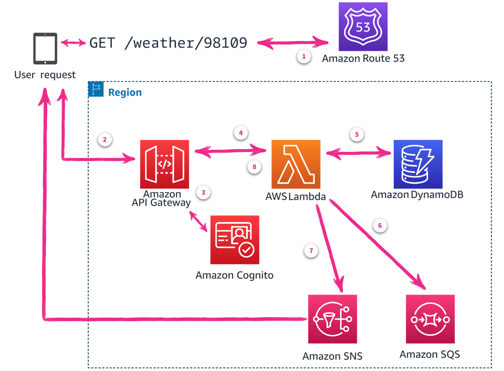

# Week 8: Serverless Applications – Microservice Deployment Patterns

* back to AWS Cloud Institute repo's root [aci.md](../aci.md)
* back to repo's main [README.md](../../../README.md)

## Modern Application Architecture

### Pre-assessment

#### What is a serverless, event-driven compute service that lets you run code for virtually any type of application or backend service without provisioning or managing servers?

* AWS Lambda

Wrong answers:

* AWS Fargate
* Amazon Elastic Container Service (Amazon ECS)
* Amazon Elastic Kubernetes Service (Amazon EKS)

##### Explanation

* AWS Lambda is an event-driven compute service that lets you run code without provisioning or managing servers.

The other responses are incorrect because:

* AWS Fargate is a serverless compute engine for Amazon Elastic Container Service (ECS) and Amazon Elastic Kubernetes Service (EKS). It allows you to run containers without provisioning or managing servers, but it is not an event-driven compute service like AWS Lambda. Fargate is designed for running containerized applications, while Lambda is designed for running individual functions or small pieces of code in response to events.
* Amazon ECS is a fully-managed container orchestration service that allows you to run and manage Docker containers on AWS. It provides a highly scalable and reliable platform for running containerized applications, but it is not a serverless or event-driven compute service like AWS Lambda. With ECS, you still need to provision and manage the underlying compute resources (EC2 instances or Fargate) to run your containers.
* Amazon EKS is a managed Kubernetes service that allows you to run and manage Kubernetes clusters on AWS. Like ECS, it is designed for running and managing containerized applications, but it is not a serverless or event-driven compute service like AWS Lambda. With EKS, you still need to provision and manage the underlying compute resources (EC2 instances or Fargate) to run your Kubernetes nodes and pods.

#### What are the benefits of a microservices architecture?

* Increased flexibility and scalability

Wrong answers:

* Little effort needed to set up an application
* Single application design containing all services for straightforward deployment
* Not difficult for implementers to understand

##### Explanation

* Setting up a microservices architecture often requires more initial effort compared to monolithic applications. Microservices involve multiple independent services, each with its own setup, deployment, and management requirements. While this can lead to benefits in the long run, the initial setup is typically more complex and requires more effort.
* Microservices involve breaking down an application into smaller, independent services rather than having a single application containing all services. The deployment of microservices is typically more complex than a monolithic application, as it involves managing multiple services independently.
* Microservices architectures can be more challenging to understand and implement compared to monolithic applications. They require a good grasp of distributed systems, inter-service communication, and complex deployment strategies. While microservices can offer benefits, they often come with a steeper learning curve and increased complexity for implementers.

#### Which AWS services are serverless? (Select THREE.)

* AWS Lambda
* AWS Fargate
* Amazon DynamoDB

Wrong answers:

* Amazon Elastic Compute Cloud (Amazon EC2)
* Amazon WorkSpaces
* Amazon Lightsail

##### Explanation

* **AWS Lambda** is serverless because it allows you to run code without provisioning or managing servers.  
* **AWS Fargate** is serverless because it allows you to deploy containers without having to manage servers or clusters.
* **Amazon DynamoDB** is serverless because it is a fully managed NoSQL database that handles capacity planning and scaling automatically.

The other options are incorrect because

* Amazon Elastic Compute Cloud (EC2) is not serverless because it requires managing underlying virtual server instances.  
* Amazon WorkSpaces is not serverless since it provides persistent virtual desktops that require managing dedicated underlying server resources.
* Amazon Lightsail is not serverless as it provides virtual private servers that require managing dedicated compute resources.

### Overview

Modern applications are built with microservice architecture patterns and serverless operational models and are deployed through an automated software delivery process.

### Microservice architecture

Microservices architecture is a software design pattern that breaks a large (monolithic) application into smaller, independent services that communicate with each other through well-defined APIs. Each service is a self-contained, single-purpose module that can be developed, tested, and deployed independently.

The main advantages of microservice architecture are modularity, scalability, and flexibility. With modularity, developers can build and deploy services independently, making it more convenient to manage and maintain complex applications. Scalability is improved because each service can be scaled independently, without affecting the other services.

Flexibility is increased because services can be effortlessly integrated with other services or replaced with new services as requirements change. Services can also be written in any programming language and use any form of data persistence that meets the desired application requirements. For example, one service could be written in Python with an Amazon DynamoDB database, while another is written in Java with a relational database. 

Microservice architecture also has some challenges, such as managing dependencies between services and ensuring that services communicate effectively through APIs. However, these challenges can be addressed through proper design and implementation practices.

Overall, microservice architecture is a powerful tool for building scalable and flexible applications that can adapt to changing requirements over time.

### Serverless deployments

Serverless deployment is a method of deploying an application without having to think about servers. The server is managed by a cloud provider, and the developer only needs to worry about writing the code and deploying it. This can make the development process faster and more convenient because there is no need to set up and maintain servers. 

Many serverless solutions are built using an event-driven architecture (EDA) that focuses on small, decoupled services that publish, consume, or route events (messages sent between services). This allows serverless applications to scale, update, and independently deploy components as needed.

At AWS, there are two primary options for serverless operating models.

#### Serverless Event-Driven Compute

AWS Lambda might be a good fit if you are looking to offload as much infrastructure as possible and build event-driven applications. 

* [AWS Lambda](https://aws.amazon.com/lambda/)

#### Serverless Compute for Containers

Containerized applications are typically used for implementing microservices. They might be a good fit if you want to migrate or build traditional applications with long-running process with a dedicated compute layer.

* [AWS Fargate](https://aws.amazon.com/fargate/)

### Automated software delivery

Automated software delivery is often referred to as continuous integration and continuous delivery (CI/CD).

* **Continuous Integration (CI)** is a software development practice in which developers frequently integrate their changes into a shared main code base. This helps to catch and fix bugs early in the development process.
* **Continuous Delivery (CD)** is a software development practice that aims to automate the deployment of software testing and production environments after manually approving the deployment.
* **Continuous Deployment (CD)** automates continuous delivery through automated testing of code. If the code passes all tests, it will automatically be delivered to the production and made available to your customers.

Overall, AWS offers a range of CI/CD services that can be used to automate the software delivery process and improve the efficiency of software development teams. These services provide a flexible and scalable solution for building, testing, and deploying applications, in addition to collaborating on development projects.

## Overview of AWS Services and Tools for Building Modern Applications

### Data Storage

Data storage is one of the most important parts of any business. AWS offers a wide range of data storage services, including the following:

* **Amazon Aurora** is a highly available and scalable relational database engine built for the cloud.
* **Amazon DocumentDB (with MongoDB compatibility)** is a document database service that makes it convenient to build highly available and scalable NoSQL databases.
* **Amazon DynamoDB** is a fully managed NoSQL database service that offers fast and predictable performance with seamless scalability. 
* **Amazon Elastic File System (Amazon EFS)** is a straightforward, scalable, high-performance file system service. It makes it convenient for customers to store and access data across multiple AWS Regions.
* **Amazon Simple Storage Service (Amazon S3)** is an object storage service offering industry-leading scalability, data availability, security, and performance.

### Compute Services

Compute services for modern applications use event-driven and container technologies to streamline deployments and allow individual services to grow as needed. AWS offers a variety of compute services, including the following:

* **Amazon Elastic Container Service (Amazon ECS)** empowers you to run multiple containerized applications on a single Amazon Elastic Compute Cloud (Amazon EC2) instance or a fleet of EC2 instances. Amazon ECS can automatically scale your applications based on demand.
* **Amazon Elastic Kubernetes Service (Amazon EKS)** helps you run Kubernetes applications in a highly available, scalable, and managed manner. Amazon EKS can also automatically scale your Kubernetes clusters based on demand.
* **AWS Fargate** is a compute service that aids you in running containerized applications without provisioning or managing servers. AWS Fargate is serverless, which means that you pay only for the compute time that your applications use. AWS Fargate is the primary container service used in modern application architecture.
* **AWS Lambda** is an event-based compute service that gives you the ability to run code without provisioning or managing servers.

### Integration Services

AWS offers a range of integration services that can be used to build complex integration solutions. Each service has its own strengths and use cases, and it is important to choose the service that best fits your specific needs.

* **Amazon API Gateway** is a fully managed service that makes it effortless to create, publish, monitor, and scale APIs. It provides a range of features, including API documentation, request and response validation, caching, and security. Amazon API Gateway supports RESTful and WebSocket APIs.
* **Amazon EventBridge** is a fully managed event-sourcing service that makes it convenient to collect, process, and distribute application events across multiple AWS services. It provides features such as event routing, event filtering, and event logging.
* **Amazon Simple Queue Service (Amazon SQS)** is a highly scalable, reliable, and fully managed message queuing service. You can store and retrieve messages in a distributed manner, making it suitable for use in distributed systems and applications.
* **AWS App Mesh** is a service that makes it effortless to build, deploy, and manage microservice-based applications in a highly available and scalable manner. It provides features such as service mesh networking, traffic management, and service discovery.
* **AWS AppSync** is a serverless service that makes it convenient to build connected apps that exchange data with each other. With AWS AppSync, you can define data models as GraphQL APIs that describe the data and how it relates to other data. You can then use these APIs to build connected apps that can access and share data across different systems and services.
* **AWS Step Functions** is a state machine service that makes it uncomplicated to build, manage, and run complex business processes. It provides features such as parallel execution, state management, and fault tolerance.

### Development and Deployment Tools

AWS has a variety of tools available for application development and code deployment. The following are some of the key services available:

* **AWS Amplify** is a fully managed, serverless platform for building mobile and web apps. It provides a range of services, including authentication, databases, hosting, and more, all managed through a single interface.
* **AWS Cloud Development Kit (AWS CDK)** is a powerful tool that makes it effortless to build, test, and deploy cloud-based applications on AWS. It provides a high-level, code-first approach to building cloud applications, abstracting away the complexity of working with AWS resources.
* **AWS CodePipeline** is a continuous delivery service that automates the build, test, and deployment of applications. It integrates with other AWS services, such as Amazon Simple Storage Service (Amazon S
* **AWS Serverless Application Model (AWS SAM)** is a service that makes it convenient to create and manage serverless applications. It provides a set of tools and services that help developers build, deploy, and manage applications without the need for servers or infrastructure management.

### Microservice example: Weather information

The Services to be used to build a microservice that looks up the weather by zip code and returns JSON data.

1. **Amazon Route 53**. The solution starts with the client resolving the host name through Route 53 DNS.
2. **Amazon API Gateway**. The browser's HTTP request, GET /weather/98109 in this example, is sent to API Gateway.
3. **Amazon Cognito**. If the URL is valid and authenticated with Amazon Cognito, an event for the request is created and sent to Lambda for processing.
4. **AWS Lambda**. A Lambda function receives and processes the event.
5. **Amazon DynamoDB**. The handler method sends a query to DynamoDB for weather data for the given zip code. The function might filter and customize the data, based on the location and preferences of the user, perhaps converting degrees in Celsius to Fahrenheit.
6. **Amazon SQS**. Before returning the data that is bundled into a new event back to API Gateway, the function handler might create additional events. It might send one to an Amazon SQS queue, where a data analytics service could be listening.
7. **Amazon SNS**. The handler function might create and send another event to an Amazon SNS queue so that alerts for high temperatures are sent to users through text messages.
8. **Amazon API Gateway**. The function finally wraps up the JSON weather data into a new event and sends it back to Amazon API gateway.

After returning the weather to the API Gateway, and ultimately the user, the function continues to handle hundreds of additional requests. You will be charged for the number of requests for your functions and the duration it takes for your code to run.

### Knowledge Check

#### What is a key architectural principle of microservices?

* Microservice applications should use multiple services that run independently of each other.

Wrong answers:

* Microservice applications should consolidate all functionality into a single, large service.
* Microservice applications should always use a single database for all services.
* Microservice applications should prioritize tightly coupled services for better performance.

##### Explanation

* Microservices aim to break down applications into smaller, manageable services rather than consolidating everything into a single large service.
* While it's possible for microservices to share a database, it's generally recommended for each microservice to have its own database to maintain independence and reduce coupling.
* Microservices actually prioritize loose coupling between services, not tight coupling. This allows for greater flexibility and easier updates to individual services without affecting the entire system.

#### What are the main advantages of microservice architecture?

* Modularity, scalability, and flexibility

Wrong answers:

* Cost, speed, and complexity
* Cloud, physical server usage, and resource limits
* Color, size, and quality

##### Explanation

* While microservices can potentially reduce costs and improve speed in some aspects, they often introduce additional complexity. Complexity is generally considered a challenge rather than an advantage of microservices.
* While microservices can be deployed in the cloud and can affect server usage and resource management, these are not the primary advantages that define microservice architecture.
* Color, size, and quality have no relation to the advantages of microservices in software design and development.

#### Which of the following are part of automated software delivery? (Select TWO.)

* Continuous integration (CI)
* Continuous deployment (CD)

Wrong answers:

* Incremental backup
* Prime Delivery
* Amazon Aurora

##### Explanation

* Incremental backup is a valid backup method that backs up items that have changed since the last full backup. This type of backup is for files or Operating System level back and isn't used for automated software delivery.
* Prime Delivery is is a service that offers a variety of delivery options for items ordered on Amazon.com, it is not part of automated software delivery.
* Amazon Aurora is a managed relational database service. The database itself is not part of the deployment pipeline.

### Summary

* Identify the differences between monolithic and microservice architectures.
* Describe some of the AWS services available for building modern applications.
* Explain a high-level overview of microservice architecture, design patterns, and how to decompose an application into microservices.

## Microservices
