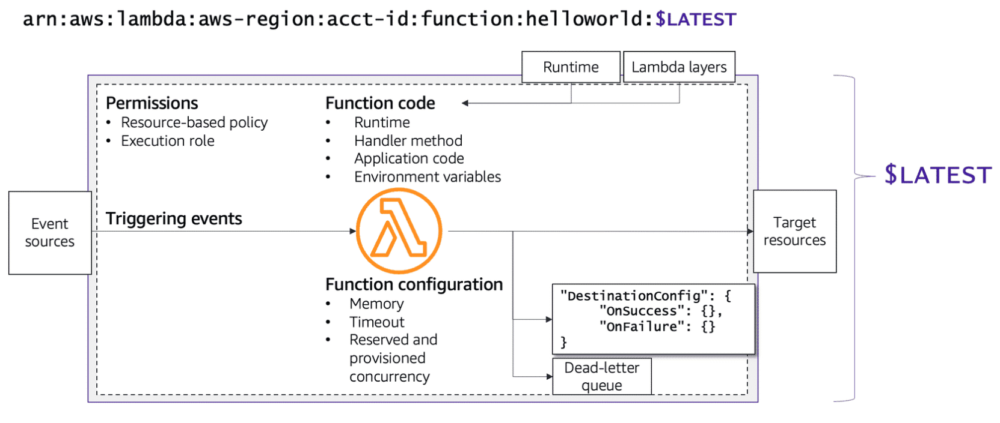

# Week 8: Serverless Applications – Microservice Deployment Patterns

* back to AWS Cloud Institute repo's root [aci.md](../aci.md)
* back to repo's main [README.md](../../../README.md)

## Microservice Deployment Patterns

### Pre-assessment

#### Which statement about serverless microservice deployments is true?

* Serverless deployments abstract away the underlying infrastructure, such as servers and operating systems, and handle deployment tasks like scaling and provisioning automatically.

Wrong answers:

* Serverless deployments communicate directly through the local hypervisor to reduce network connectivity issues.
* Serverless deployments are used for small workloads that don't require a lot of CPU, memory, or storage usage.
* Serverless uses services such as AWS Fargate to scale up and down as needed.

#### Which deployment type uses lightweight virtualization to bundle code and dependencies, providing a more controlled and isolated environment for running applications?

* Container deployments

Wrong answers:

* Serverless deployments
* Physical on-premises deployments
* Thin-client deployments

##### Explanation

* **Container deployments** use lightweight virtual machines (VMs) that bundle code and dependencies, providing a more controlled and isolated environment for running applications.

The other options are incorrect because of the following reasons:

* Serverless deployments are a cloud computing model that allows developers to build and run applications without managing servers
* Thin-client deployments are normally used for desktop virtualization, shared services, or browser-based computing.
* Physical on-premises deployments are when an organization's software applications run on computers and servers located within the organization's physical premises.

#### Which use case is the MOST appropriate for serverless deployments?

* The application's requirements are dynamic and change frequently, requiring the services to scale dynamically.

Wrong answers:

* The application needs to be run from different locations or offline.
* The application requires many libraries and other dependencies.
* The application's traffic is predictable.

##### Explanation

The other options are incorrect because of the following reasons:

* Serverless deployments are not ideal when the application needs to be run from different locations or offline.
* The application requires many libraries and other dependencies is a more appropriate use case for a microservice deployment.
* The application's traffic is predictable is a more appropriate use case for reserved and provisioned capacity planning options.

## Serverless and Container-Based Deployments

### Serverless and container-based deployments

Serverless deployments abstract away the underlying infrastructure, such as servers and operating systems, and handle deployment tasks like scaling and provisioning automatically. Containers, on the other hand, were created to package and run applications in a predictable and repeatable way across multiple environments. Instead of recreating the environment, you packaged the application to run on all types of physical or virtual environments.

Serverless deployments pair well with event-driven applications, such as those that respond to form submissions, image processing, and Internet of Things (IoT) sensor events. With containers, you have more control over which features and software are deployed within a container image. For instance, you can deploy WordPress with containers, but not to AWS Lambda.

#### Serverless services

Some of the serverless services offered by AWS include the following:

* **AWS Lambda** is an event-based compute service that lets you run code without provisioning or managing servers.
* **Amazon Simple Storage Service (Amazon S3)** is an object storage service offering industry-leading scalability, data availability, security, and performance.
* **Amazon DynamoDB** is a fully managed NoSQL database service that offers fast and predictable performance with seamless scalability.
* **Amazon API Gateway** is a fully managed service that makes it convenient to create, publish, monitor, and scale APIs. It provides a range of features, including API documentation, request and response validation, caching, and security. API Gateway supports RESTful and WebSocket APIs.
* **Amazon Simple Queue Service (Amazon SQS)** is a highly scalable, reliable, and fully managed message queuing service. You can store and retrieve messages in a distributed manner, making it suitable for use in distributed systems and applications.

#### Container services

Container-based services offered by AWS include the following

* **Amazon Elastic Container Service (Amazon ECS)** runs multiple containerized applications on a single Amazon Elastic Compute Cloud (Amazon EC2) instance or a fleet of EC2 instances. Amazon ECS can automatically scale your applications based on demand.
* **Amazon Elastic Kubernetes Service (Amazon EKS)** runs Kubernetes applications in a highly available, scalable, and managed manner. Amazon EKS can also automatically scale your Kubernetes clusters based on demand.
* **AWS Fargate** runs containerized applications without provisioning or managing servers. Fargate is used with both Amazon ECS and Amazon EKS.

* [Serverless on AWS](https://aws.amazon.com/serverless/)

### When to choose serverless or container-based

The serverless deployment method is suitable for applications that have bursty or unpredictable workloads, such as real-time analytics and IoT applications. It is also suitable for applications that require frequent deployments, because it can eliminate the need for manual infrastructure setup by using infrastructure as code (IaC).

The container-based deployment method uses containers to package and deploy applications at scale. Containers provide isolation and security, and they can be conveniently scaled up or down, based on the application's needs. Container-based deployments are suitable for applications that require high levels of scalability, reliability, and performance, such as web applications and applications that require complex dependencies.

### Serverless Microservices

Serverless microservices offer many benefits that can help organizations build, deploy, and manage scalable, flexible, and cost-effective cloud applications in the following ways:

* **Pay per use**: Eliminates the need to provision and manage servers, because the underlying infrastructure is managed by the cloud provider.
* **Scalability**: Effortlessly scales applications up or down based on demand. This means that applications can handle increased traffic or spikes in workload without requiring manual intervention or infrastructure changes.
* **Microservices architecture**: Promotes modularity, scalability, and flexibility. With microservices, teams can build and deploy independent services that communicate with each other through well-defined APIs, making it more convenient to manage and maintain complex applications.
* **Continuous delivery**: Empowers developers to continuously integrate their services, automate testing, and deploy them with a single click, promoting a DevOps culture and continuous improvement.
* **Cost optimization**: Optimizes cloud spending by eliminating the need to provision and manage infrastructure for idle services.
* **Focus on business value**: Allows organizations to focus on building and delivering business value, rather than managing infrastructure. With this shift in focus, developers can spend more time on writing code and less time on operational tasks, leading to increased efficiency and productivity.
* **Resilience and fault tolerance**: Allows applications to continue to operate, even in the event of infrastructure failures.
* **Continuous innovation**: Helps organizations to quickly prototype and experiment with new ideas and technologies. With serverless microservices, developers can quickly spin up new services, test them in production, and iterate on their ideas without the need for lengthy infrastructure setups.

### Architectural pattern for microservices with Lambda

In a serverless microservice architecture, each of the application components are decoupled and independently deployed and operated. An API created with Amazon API Gateway acts like the front door for your application, accepting API calls from API consumers. The requests are sent to the serverless compute service, AWS Lambda, where your application logic lives, and functions are subsequently launched by Lambda.

Your team can use these services to decouple and fragment your environment to the level of granularity desired.


In general, a microservices environment can introduce the following difficulties:

* Repeated overhead for creating each new microservice
* Issues with optimizing server density and usage
* Complexity of running multiple versions of multiple microservices simultaneously
* Proliferation of client-side code requirements to integrate with many separate services

The serverless microservices pattern lowers the barrier for the creation of each subsequent microservice (API Gateway even allows for the cloning of existing APIs and using Lambda functions in other accounts). Optimizing server usage is no longer relevant with this pattern.

Finally, API Gateway provides programmatically generated client SDKs in several popular languages to reduce integration overhead.

### Knowledge Check

#### Which deployment type is suitable for applications that have bursty or unpredictable workloads, such as real-time analytics or Internet of Things (IoT) applications?

* Serverless deployments

Wrong answers:

* Container deployments
* Physical, on-premises deployments
* Thin-client deployments

#### Which feature is not a benefit of serverless Microservices?

* User-controlled OS patching

Wrong answers:

* Pay-per-use
* Continuous delivery
* Scalability

##### Explanation

OS updates do not have to be installed with serverless microservices. Serverless microservices are ephemeral. This means they are short-lived and dynamically created as needed, rather than running continuously on a persistent server. This eliminates the need for manual OS updates and maintenance.

The other options are incorrect because of the following reasons:

* Pay-per-use is a benefit because the customer only pays for what they use.
* Continuous delivery is a benefit due to the dynamic response time serverless microservices offer.
* Scalability is a benefit due to the scalability of microservices based on demand.

#### Choose the serverless services offered by AWS (Select THREE.)

* AWS Fargate
* AWS Lambda
* Amazon DynamoDB

Wrong answers:

* Amazon EC2
* Amazon WorkSpaces
* Amazon Lightsail

##### Explanation

The other options are incorrect because

* Amazon Elastic Compute Cloud (EC2) is not serverless because it requires managing underlying virtual server instances.  
* Amazon WorkSpaces is not serverless since it provides persistent virtual desktops that require managing dedicated underlying server resources.
* Amazon Lightsail is not serverless as it provides virtual private servers that require managing dedicated compute resources.

### Summary

* Which serverless and container services are available from AWS
* How to articulate when serverless or container services should be used
* How to explain some of the benefits of serverless microservices

## Serverless Microservices with AWS Lambda

### Pre-assessment

#### What is the name of the AWS SDK for Python?

* Boto3

Wrong answers:

* AWS Serverless Application Model (SAM)
* AWS Cloud Development Kit (CDK)
* Java Development Kit

#### Which method in function code processes events?

* Lambda function handler

Wrong answers:

* Python command
* Invoke command process
* Bash interpreter

##### Explanation

The Lambda function handler is the method in function code that processes events. When a function is invoked, Lambda runs the handler method.

The other options are incorrect because of the following reasons:

* Python command used to invoke Lambda functions from within they Python script file.
* Invoke command process is the way Lambda invokes synchronous and asynchronous functions.
* Bash interpreter is used for interpreting Bash scripts.

#### Which methods are used for creating an AWS Lambda application? (Select THREE.)

* AWS Serverless Application Repository
* AWS CloudFormation
* AWS CLI and AWS Serverless Application Model (AWS SAM) CLI

Wrong answers:

* Amazon EC2 console
* Amazon S3
* Amazon DynamoDB
* Amazon Elastic Transcoder

## Developing a Python Lambda Function

You can run Python code in Lambda. Lambda provides runtimes for Python that run your code to process events. Your code runs in an environment that includes the AWS SDK for Python (Boto3), with credentials from an AWS Identity and Access Management (IAM) role that you manage.

### Lambda function handler

The Lambda function handler is the method in your function code that processes events. When your function is invoked, Lambda runs the handler method. Your function runs until the handler returns a response, exits, or times out.

You can use the following general syntax when creating a function handler in Python:

```python
def handler_name(event, context):
    ...
    return some_value
```

#### Naming

The Lambda function handler name specified at the time that you create a Lambda function is derived from the following:

* The name of the file where the Lambda handler function is located
* The name of the Python handler function

A function handler can be any name. However, the default name in the Lambda console is **lambda_function.lambda_handler**. This function handler name reflects the function name (**lambda_handler**) and the file where the handler code is stored (**lambda_function.py**).

If you create a function in the console using a different file name or function handler name, you must edit the default handler name.

To change the function handler name, do the following:

1. Open the Functions page of the Lambda console and choose your function.
2. Choose the **Code** tab.
3. Scroll down to the **Runtime settings** pane and choose **Edit**.
4. In **Handler**, enter the new name for your function handler.
5. Choose **Save**.

#### How it works

When Lambda invokes your function handler, the Lambda runtime passes two arguments to the function handler:

* The first argument is the event object. An event is a JSON-formatted document that contains data for a Lambda function to process. The Lambda runtime converts the event to an object and passes it to your function code. It is usually of the Python **dict** type. It can also be **list**, **str**, **int**, **float**, or the **NoneType** type.

The event object contains information from the invoking service. When
you invoke a function, you determine the structure and contents of the event. When an AWS service invokes your function, the service defines the event structure. For more information about events from AWS services, see [Using AWS Lambda with Other Services](https://docs.aws.amazon.com/lambda/latest/dg/lambda-services.html).

* The second argument is the context object. A context object is passed to your function by Lambda at runtime. This object provides methods and properties that provide information about the invocation, function, and runtime environment.

#### Returning a value

Optionally, a handler can return a value. What happens to the returned value depends on the invocation type and the service that invoked the function. The following are some examples:

* If you use the **RequestResponse** invocation type, such as synchronous invocation, Lambda returns the result of the Python function call to the client invoking the Lambda function. In the HTTP response to the invocation request, serialized into JSON. For example, the AWS Lambda console uses the **RequestResponse** invocation type, so when you invoke the function on the console, the console will display the returned value.
* If the handler returns objects that can't be serialized by **json.dumps**, the runtime returns an error.
* If the handler returns **None**, as Python functions without a return statement implicitly do, the runtime returns **null**.
* If you use the **Event** invocation type (an asynchronous invocation), the value is discarded.

### Lambda Context object

When Lambda runs your function, it passes a context object to the handler. This object provides methods and properties that provide information about the invocation, function, and runtime environment.

#### Context methods

* **get_remaining_time_in_millis** – Returns the number of milliseconds left before the processing times out.

#### Context properties

* **function_name** – The name of the Lambda function
* **function_version** – The version of the function
* **invoked_function_arn** – The Amazon Resource Name (ARN) that's used to invoke the function. Indicates if the invoker specified a version number or alias
* **memory_limit_in_mb** – The amount of memory that's allocated for the function
* **aws_request_id** – The identifier of the invocation request
* **log_group_name** – The log group for the function
* **log_stream_name** – The log stream for the function instance
* **identity** – (mobile apps) Information about the Amazon Cognito identity that authorized the request
* **cognito_identity_id** – The authenticated Amazon Cognito identity
* **cognito_identity_pool_id** – The Amazon Cognito identity pool that authorized the invocation
* **client_context** – (mobile apps) Client context that's provided to Lambda by the client application
* **client.installation_id**
* **client.app_title**
* **client.app_version_name**
* **client.app_version_code**
* **client.app_package_name**
* **custom** – A **dict** of custom values set by the mobile client application
* **env** – A **dict** of environment information provided by the AWS SDK

#### Example handler.py

The following example shows a handler function that logs context information.

```python
import time

def lambda_handler(event, context):   
    print("Lambda function ARN:", context.invoked_function_arn)
    print("CloudWatch log stream name:", context.log_stream_name)
    print("CloudWatch log group name:",  context.log_group_name)
    print("Lambda Request ID:", context.aws_request_id)
    print("Lambda function memory limits in MB:", context.memory_limit_in_mb)
    # We have added a 1 second delay so you can see the time remaining in get_remaining_time_in_millis.
    time.sleep(1) 
    print("Lambda time remaining in MS:", context.get_remaining_time_in_millis())
```

### Logging Lambda

Having logging statements in your code can be very helpful when you are trying to trace why something isn't working the way you expect. When you are in active development, you might want to know which parts of your code ran before an exception occurred. In production, you might also need to trace through a sequence of events to see why software is malfunctioning.

Lambda automatically monitors Lambda functions and sends log entries to Amazon CloudWatch. Your Lambda function comes with an Amazon CloudWatch Logs log group and a log stream for each instance of your function. The Lambda runtime environment sends details about each invocation and other output from your function's code to the log stream.

To send basic output to the logs, you can use a print method in your function. The following example logs the values of the CloudWatch Logs log group and stream, and the event object.

Note that if your function outputs logs using Python print statements, Lambda can only send log outputs to CloudWatch Logs in plain text format. To capture logs in structured JSON, you need to use a supported logging library.

The following example shows a handler function that logs context information.

#### Example lambda_function.py

```python
import os
def lambda_handler(event, context):
    print('## ENVIRONMENT VARIABLES')
    print(os.environ['AWS_LAMBDA_LOG_GROUP_NAME'])
    print(os.environ['AWS_LAMBDA_LOG_STREAM_NAME'])
    print('## EVENT')
    print(event)
```

#### Example log output

```bash
START RequestId: 8f507cfc-xmpl-4697-b07a-ac58fc914c95 Version: $LATEST
## ENVIRONMENT VARIABLES
/aws/lambda/my-function
2023/08/31/[$LATEST]3893xmpl7fac4485b47bb75b671a283c
## EVENT
{'key': 'value'}
END RequestId: 8f507cfc-xmpl-4697-b07a-ac58fc914c95
REPORT RequestId: 8f507cfc-xmpl-4697-b07a-ac58fc914c95  Duration: 15.74 ms  Billed Duration: 16 ms Memory Size: 128 MB Max Memory Used: 56 MB  Init Duration: 130.49 ms
XRAY TraceId: 1-5e34a614-10bdxmplf1fb44f07bc535a1   SegmentId: 07f5xmpl2d1f6f85 Sampled: true 
```

The Python runtime logs the START, END, and REPORT lines for each invocation. The REPORT line includes the following data:

#### REPORT line data fields

* **RequestId** – The unique request ID for the invocation
* **Duration** – The amount of time that your function's handler method spent processing the event
* **Billed Duration** – The amount of time billed for the invocation
* **Memory Size** – The amount of memory allocated to the function
* **Max Memory Used** – The amount of memory used by the function
* **Init Duration** – For the first request served, the amount of time it took the runtime to load the function and run code outside of the handler method
* **XRAY TraceId** – For traced requests, the AWS X-Ray trace ID
* **SegmentId** – For traced requests, the X-Ray segment ID
* **Sampled** – For traced requests, the sampling result

#### [AWS Lambda Developer Guide - Logging](https://docs.aws.amazon.com/lambda/latest/dg/python-logging.html)

### Testing Lambda

Testing serverless functions uses traditional test types and techniques, but you must also consider testing serverless applications as a whole. Cloud-based tests will provide the most accurate measure of the quality of your functions and serverless applications.

A serverless application architecture includes managed services that provide critical application functionality through API calls. For this reason, your development cycle should include automated tests that verify functionality when your function and services interact.

If you do not create cloud-based tests, you could encounter issues due to differences between your local environment and the deployed environment. Your continuous integration process should run tests against a suite of resources provisioned in the cloud. This should be done before promoting your code to the next deployment environment, such as quality assurance (QA), staging, or production.

#### [Serverless Test Samples Repository](https://github.com/aws-samples/serverless-test-samples)

For serverless testing, you will still write unit, integration, and end-to-end tests.

* **Unit tests** – Tests that run against an isolated block of code. For example, verifying the business logic to calculate the delivery charge given a particular item and destination.
* **Integration tests** – Tests involving two or more components or services that interact, typically in a cloud environment. For example, verifying a function processes events from a queue.
* **End-to-end tests** – Tests that verify behavior across an entire application. For example, ensuring infrastructure is set up correctly and that events flow between services as expected to record a customer's order.

You will generally use a mix of approaches to test your serverless application code, including testing in the cloud, testing with mocks, and occasionally testing with emulators.

#### Cloud Testing

Testing in the cloud is valuable for all phases of testing, including unit tests, integration tests, and end-to-end tests. You run tests against code deployed in the cloud and interacting with cloud-based services. This approach provides the most accurate measure of the quality of your code.

A convenient way to debug your Lambda function in the cloud is through the console with a test event. A test event is a JSON input to your function. If your function does not require input, the event can be an empty JSON document (**{}**). The console provides sample events for a variety of service integrations. After creating an event in the console, you can share it with your team to make testing more convenient and consistent.

#### Testing Tools

Tools and techniques exist to accelerate development feedback loops. For example, AWS SAM Accelerate and AWS Cloud Development Kit (CDK) watch mode both decrease the time required to update cloud environments.

**[Moto](https://pypi.org/project/moto/)** is a Python library for mocking AWS services and resources. You can test your functions with little or no modification using decorators to intercept and simulate responses.

The validation feature of the **[Powertools for AWS Lambda (Python)](https://docs.powertools.aws.dev/lambda-python/latest/utilities/validation/)** provides decorators so you can validate input events and output responses from your Python functions.

For more information, see **[Unit Testing Lambda with Python and Mock AWS Services](https://aws.amazon.com/blogs/devops/unit-testing-aws-lambda-with-python-and-mock-aws-services/)** in the AWS Blog.

To reduce the latency involved with cloud deployment iterations, see **[AWS Serverless Application Model (AWS SAM) Accelerate](https://docs.aws.amazon.com/serverless-application-model/latest/developerguide/using-sam-cli-sync.html)**, **[AWS Cloud Development Kit (AWS CDK) watch mode](https://docs.aws.amazon.com/cdk/v2/guide/cli.html#cli-deploy-watch)**. These tools monitor your infrastructure and code for changes. They react to these changes by creating and deploying incremental updates automatically into your cloud environment.

Examples that use these tools are available in the **[Python Test Samples](https://github.com/aws-samples/serverless-test-samples/tree/main/python-test-samples)** code repository.

### Lambda Errors

When your code raises an error, Lambda generates a JSON representation of the error. This error document appears in the invocation log and, for synchronous invocations, in the output.

#### How it Works

When you invoke a Lambda function, Lambda receives the invocation request and validates the permissions in your role. It verifies that the event document is a valid JSON document, and checks parameter values. If the request passes validation, Lambda sends the request to a function instance. If Lambda encounters an error, it returns an exception type, message, and HTTP status code that indicates the cause of the error.

The following list describes the range of status codes you can receive from Lambda.

* **2xx**

A 2xx series error with an **X-Amz-Function-Error** header in the response indicates a Lambda runtime or function error. A 2xx series status code indicates that Lambda accepted the request. However, instead of an error code, Lambda indicates the error by including the **X-Amz-Function-Error** header in the response.

* **4xx**

A 4xx series error indicates an error that the invoking client or service can fix by modifying the request, requesting permission, or retrying the request. 4xx series errors other than 429 generally indicate an error with the request.

* **5xx**

A 5xx series error indicates an issue with Lambda or an issue with the function's configuration or resources. 5xx series errors can indicate a temporary condition that can be resolved without any action by the user. These issues can't be addressed by the invoking client or service, but a Lambda function's owner might be able to fix the issue.

#### Lambda Console

You can invoke your function on the Lambda console by configuring a test event and viewing the output. The output is captured in the function's logs and, when active tracing is enabled, in X-Ray.

To invoke a function on the Lambda console

1. Open the **[Functions page](https://console.aws.amazon.com/lambda/home#/functions)** of the Lambda console.
2. Choose the function to test, and choose **Test**.
3. Under **Test event**, select **New event**.
4. Select a **Template**.
5. For **Name**, enter a name for the test. In the text entry box, enter the JSON test event.
6. Choose **Save changes**.
7. Choose **Test**.

The Lambda console invokes your function synchronously and displays the result. To see the response, logs, and other information, expand the **Details** section.

### AWS CLI

When you invoke a Lambda function in the AWS Command Line Interface (AWS CLI), the AWS CLI splits the response into two documents. The AWS CLI response is displayed in your command prompt. If an error has occurred, the response contains a **FunctionError** field. The invocation response or error returned by the function is written to an output file. For example, **output.json** or **output.txt**.

The following invoke command example demonstrates how to invoke a function and write the invocation response to an output.txt file. Take a look at the parameters used in the following example:

```bash
aws lambda invoke   \
  --function-name my-function   \
  --cli-binary-format raw-in-base64-out  \
  --payload '{"key1": "value1", "key2": "value2", "key3": "value3"}' output.txt
```

Outout:

```json
{
    "StatusCode": 200,
    "FunctionError": "Unhandled",
    "ExecutedVersion": "$LATEST"
}
```

* **aws lambda invoke** – This starts the AWS CLI. lambda invoke signifies you are invoking a command targeting the Lambda service.
* **--function-name my-function** – This specifies that you are targeting my-function with the following parameters.
* **--cli-binary-format raw-in-base64-out** – This tells the AWS CLI you are going to pass the payload as a string containing JSON formatting.
* **--payload** – This is the JSON input being passed to your Lambda function (my-function) in the function-name parameter.

You should see the function invocation response in the output.txt file. In the same command prompt, you can also view the output in your command prompt using cat output.txt.

#### Example output.txt

```bash
cat output.txt

{"errorMessage": "'action'", "errorType": "KeyError", "stackTrace": ["  File \"/var/task/lambda_function.py\", line 36, in lambda_handler\n    result = ACTIONS[event['action']](event['number'])\n"]}
```

#### [AWS Lambda Function Errors in Python](https://docs.aws.amazon.com/lambda/latest/dg/python-exceptions.html)

#### [Working with .zip File Archives for Python Lambda Functions](https://docs.aws.amazon.com/lambda/latest/dg/python-package.html)

### [Deploy Python Lambda Functions with Container Images](https://docs.aws.amazon.com/lambda/latest/dg/python-image.html)

## Writing Good Lambda Functions

### AWS Lambda applications

An **AWS Lambda application** is a combination of Lambda functions, event sources, and other resources that work together to perform tasks. You can use AWS CloudFormation and other tools to collect your application's components into a single package that can be deployed and managed as one resource. Applications make your Lambda projects portable, which means you can integrate it with other developer tools, such as AWS CodePipeline, AWS CodeBuild, and AWS Serverless Application Model (SAM).

### Creating an application

You have three options for creating a Lambda application.

#### AWS Serverless Application Repository

The AWS Serverless Application Repository provides a collection of Lambda applications that you can deploy in your account with a few selections. The repository includes both ready-to-use applications and samples that you can use as a starting point for your own projects. You can also submit your own projects for inclusion.

#### AWS CloudFormation

With AWS CloudFormation, you can create a template that defines your application's resources, so you can manage the application as a stack and more safely add or modify resources. If any part of an update fails, AWS CloudFormation automatically rolls back to the previous configuration.

With AWS CloudFormation parameters, you can create multiple environments for your application from the same template. AWS SAM extends AWS CloudFormation with a streamlined syntax focused on Lambda application development.

#### AWS CLI and AWS SAM CLI

The AWS Command Line Interface (AWS CLI) and AWS SAM CLI are command line tools for managing Lambda application stacks. In addition to commands for managing application stacks with the AWS CloudFormation API, the AWS CLI supports higher-level commands that streamline tasks like uploading deployment packages and updating templates.

The AWS SAM CLI provides additional functionality. This includes validating templates, testing locally, and integrating with continuous integration and continuous delivery (CI/CD) systems.

### Lambda environment lifecycle

When you create your Lambda function, you specify configuration information. This includes the amount of available memory and the maximum invocation time allowed for your function. Lambda uses this information to set up the environment.


#### Step 1: Init phase

In the init phase, Lambda creates or unfreezes an environment with the configured resources, and it downloads the code for the function and all layers. It initializes any extensions, initializes the runtime, and then runs the function’s initialization code (the code outside the main handler).

The init phase happens either during the first invocation or before function invocations if you have enabled provisioned concurrency.

The init phase is split into three sub-phases:

1. **Extension init** – Starts all extensions.
2. **Runtime init** – Bootstraps the runtime.
3. **Function init** – Runs the function's static code.

These sub-phases ensure that all extensions and the runtime complete their setup tasks before the function code runs.

#### Step 2: Invoke phase

In the invoke phase, Lambda invokes the function handler. After the function runs to completion, Lambda prepares to handle another function invocation.

#### Step 3: Shutdown phase

If the Lambda function does not receive any invocations for a period of time, the shutdown phase initiates. In the shutdown phase, Lambda shuts down the runtime, alerts the extensions to let them stop cleanly, and then removes the environment. Lambda sends a shutdown event to each extension, which tells the extension that the environment is about to be shut down.

#### Summary

When you write your function code, do not assume that Lambda automatically reuses the environment for subsequent function invocations. Other factors might require Lambda to create a new environment, which can lead to unexpected results. Always test to optimize functions and adjust settings to meet your needs.

A **Cold Start** occurs when a new environment is required to run a Lambda function. When the Lambda service receives a request to run a function, the service first prepares an environment. During this step, the service downloads the code for the function, and then creates the environment with the specified memory, runtime, and configuration. After it's complete, Lambda runs any initialization code outside of the event handler before finally running the handler code.


In a **Warm Start**, the Lambda service retains the environment instead of destroying it immediately. This allows the function to run again within the same environment. This saves time by not needing to initialize the environment.

**Concurrency** is the number of requests that your function is serving at any given time. When your function is invoked, Lambda allocates an instance of it to process the event. When the function code finishes running, it can handle another request. If the function is invoked again while a request is still being processed, another instance is allocated, which increases the function's concurrency. The total concurrency for all of the functions in your account is subject to a per-Region quota. By default, Lambda provides your account with a total concurrency limit of 1,000 across all functions in an AWS Region.


### Best practice: Minimize cold start times

When you invoke a Lambda function, the invocation is routed to an environment to process the request. If the environment is not already initialized, the startup time of the environment adds to latency. If a function has not been used for some time, if more concurrent invocations are required, or if you update a function, new environments are created. Creation of these environments can introduce latency for the invocations that are routed to a new environment. This latency is implied when using the term cold start. For most applications, this additional latency is not a problem. However, for some synchronous models, this latency can inhibit optimal performance. It is critical to understand latency requirements and try to optimize your function for peak performance.

**Reducing cold start times in case of concurrent invocation of lambda functions results in a considerable performance increase.**

### Best practice: Take advantage of environment reuse

#### Initialize global variables outside the handler

One best practice of environment reuse is to put global variables outside of the handler. If your code retrieves any externalized configuration or dependencies, make sure they are stored and referenced locally after the initial run. Limit the re-initialization of variables or objects on each invocation. Any declarations in your Lambda function code (outside of the handler code) remain initialized when the function is invoked again.

You should also add logic to your code to check whether a connection already exists before creating one. If a connection exists, reuse the existing one.

In the following Python example, the Amazon DynamoDB client is declared outside of the handler. This makes it available to the current invocation, in addition to any that are routed to the same environment while the invocation is still warm.

```python
import boto3

# create the dynamo client
# when execution environment is created
ddb_client = boto3.client("dynamodb")

def lambda_handler(event, context):
    return ddb_client.scan(
        TableName='Presidents'
    )
```

#### Temp space as transient cache

Another way to take advantage of environment reuse is to add code to check whether the local cache has the data that you stored. Each invocation environment provides a small amount of disk space in the temp (/tmp) directory, which remains in the environment.

The following is a Python example where the function looks for config.json in the /tmp directory. If this is a warm environment, the file does not need to be reloaded. If there is an error finding the file in the /tmp directory, the function loads it.

```python
import boto3

try:
    # attempt to read /tmp file
    with open("/tmp/config.json") as f:
        config = f.read()
except OSError as e:
    # if the file isn't present
    # retrieve from s3, and save in /tmp
    s3 = boto3.client("s3")
    s3.download_file('myPrivateConfigBucket', 'config.json', '/tmp/config.json')
    with open("/tmp/config.json") as f:
        config = f.read()

print(config)
```

### Best practice: Check that background processes have completed

If you don’t wait for a background process to end before exiting your function, the background process continues to run while that environment exists. So, an invocation that follows and gets that warm environment could get unexpected results from a process that began running during the previous invocation.

### Best practice: Use a database proxy to manage connection pooling

A database proxy can provide connection pooling in addition to other benefits. This allows your functions to interact with the Amazon Relational Database Service (Amazon RDS) Proxy endpoint. The proxy manages the incoming connections to the database, as needed. This is much more efficient for functions where you anticipate high levels of concurrency. AWS offers database proxy on Amazon RDS, MySQL, and Postgres, in addition to Amazon Aurora.

Using Amazon RDS Proxy, you can handle unpredictable surges in database traffic. Otherwise, these surges might cause issues due to oversubscribing connections or creating new connections at a fast rate. RDS Proxy establishes a database connection pool and reuses connections in this pool. This approach avoids the memory and CPU overhead of opening a new database connection each time. To protect the database against oversubscription, you can control the number of database connections that are created.


### Best practice: Persist state data externally

As noted earlier, you can take advantage of a warm start when available, but you can't assume that you will get a warm start. Therefore, you can’t assume that any data you write to the /tmp directory will remain available.

Let's say you have a function that adds an item to a shopping cart and increments a counter for items in the cart. If you store the counter's value locally and the next invocation gets a cold start, the local counter will be reset. Then, you would not be able to maintain state properly. If you need to maintain state, persist data using an external store, such as a DynamoDB table.

### Best practice: Minimize deployment package size and complexity of dependencies

When you invoke your function, the deployment package is downloaded, unpacked, and loaded into your invocation environment. Minimizing the package helps shorten cold starts and reduces your cost because you are billed from the point at which Lambda initializes the runtime in your environment.

Minimize your deployment package size to its runtime necessities. This reduces the amount of time it takes for your deployment package to download and unpack ahead of invocation. This is particularly important for functions authored in compiled languages.

### Best practice: Mount Amazon EFS for large or shared assets

The size and nature of the Lambda invocation environment makes some use cases difficult. You might not be able to get your deployment package small enough to meet the size limit, or you might need to work with very large objects such as media files or machine language models that can’t be loaded into the temp space. There might be some third-party libraries that can’t be loaded and shared in a Lambda invocation environment. Mounting an Amazon Elastic File System (Amazon EFS) volume addresses these challenges.

Amazon EFS gives you the ability to write data to it and share it between invocations. You can use Amazon EFS for persisting data that is updated in one invocation and used on the next invocation. Writing to Amazon EFS requires no special coding. You just use the same command you would use to write a file to block storage.

You can use other sources to update the data on Amazon EFS, as well, such as AWS Fargate or Amazon Elastic Compute Cloud (Amazon EC2). This makes hybrid scenarios more convenient and extends the workloads you can run with Lambda.


### Aspects to consider while configuring a function

There are three important aspects to consider while configuring a Lambda function.

#### Permissions

As you add triggers and targets to your function, you need to manage two key permissions:

* Permissions to invoke your function, which are dictated in the **resource-based policy**
* Permissions for your Lambda function to interact with other resources through an **execution role**

You need to set up permissions when you create a function.

#### Sources and targets

*Sources* are the services that trigger Lambda synchronously or asynchronously when you add a trigger to your function in the Lambda console.

A *target*, or destination, is an AWS resource that receives invocation records for a function. You must give a function permissions to the target through the execution role.

#### Memory and time out

The cost of invocating a Lambda function depends on memory and duration. You want to balance the allocation of these resources in a way that optimizes the function's performance.

### Resource based policy

Permissions to invoke your function is dictated by the resource-based policy.


For services that invoke Lambda synchronously or asynchronously, when you add an event source to your function with the Lambda console, the console updates the function's resource-based policy to allow the service to invoke it. Likewise, if you configure an integration with Lambda from another service console, the permissions to invoke the function are created for you. For example, if you create an API in Amazon API Gateway that targets a Lambda function, permissions to invoke that API are added when you create the API.

If you need to grant permissions to other accounts or services that aren't available in the Lambda console, you can use the AWS CLI to update the resource-based policy. You can also use AWS Identity and Access Management (IAM) roles to grant permissions to invoke. The key, as a developer, is that you need to provide permissions from source to function to invoke the function.

### Execution role

The execution role is an IAM role that Lambda has permissions to assume when you invoke a function. You need to select or create an execution role when you create the function, and you can modify the policies associated with the role through IAM. The default Lambda execution role includes permissions to write to Amazon CloudWatch Logs.

As you add additional targets—such as writing to a database or sending an Amazon Simple Notification Service (Amazon SNS) topic—your Lambda function’s execution role needs permissions to interact with those targets. The role needs permissions to write to a DynamoDB table or Amazon SNS topic, for example. IAM provides managed policies that you can add to your function to streamline getting the permissions that you need.


### Execution role to connect to a VPC

To interact with resources that are in a virtual private cloud (VPC), in addition to execution role permissions to interact with the resource, you need to connect your function to the VPC. Your execution role permissions must include the ability to work with network interfaces. You can achieve this by attaching the **AWSLambdaVPCAccessExecutionRole** policy. This is because, when you connect a function to a VPC, Lambda creates an elastic network interface for each combination of security group and subnet in your function's VPC configuration.


The Lambda console has an option to connect to the VPC. After that is set up, you can configure an Amazon EFS volume for the function and you can configure the database proxy feature. Then, you can create a pool of connections to an Amazon RDS instance. You won’t be able to complete configuration of these options until you have connected the function to the appropriate VPC and subnet.

### Targeting destinations for stream or async invocations


A destination is an AWS resource that receives invocation records for a function. You must give a function permissions to the destination through the execution role. 

Streaming event sources can use an OnFailure destination in conjunction with stream error-handling features. This will move failed records off of the stream and send them to services like Amazon SNS or Amazon Simple Queue Service (Amazon SQS)  for handling offline. 

Asynchronous records can include both OnSuccess and OnFailure destinations. You can configure services like Amazon EventBridge, Amazon SNS, and Amazon SQS as your OnFailure destination to handle the failed records.

As an alternative to an OnFailure destination, you can configure your function with a dead-letter queue to save discarded events for further processing. A dead-letter queue is part of a function's version-specific configuration, so it is locked in when you publish a version.

### Key concepts for your function code

#### Runtime and handler method

You select the runtime as part of configuring the function, and Lambda loads that runtime when initializing the environment.

Your function runs starting at the handler method. It is a best practice to separate the Lambda handler from your business logic.


#### Lambda layers

Lambda layers are explicitly designed for reuse of application code. You can use a layer that matches the runtime of your function to attach reusable modules or libraries.

A function can have a limited number of layers associated with it, but layers can be used across any of your functions. You need permissions to view and use the layer if it is not public. You can’t run a layer on its own.

A layer reduces your actual Lambda function deployment size, which speeds up your continuous integration and continuous delivery (CI/CD) cycle. For example, you might be able to reduce the size of a Lambda function from 10 MB to 2 MB. You can specify multiple runtimes for a layer.

Note: The runtime is a tag rather than any check on the type of code that you include. For example, if you indicate that the runtime is Node.js, but it contains Python code, that layer will be available to your Python functions. However, the layer would fail when the function tries to run it.

#### Environment variables

You can use environment variables (**process.env.VARIABLE_NAME**) to store secrets securely and adjust your function's behavior without updating code. An environment variable is a pair of strings that are stored in a function's version-specific configuration. When you publish a version, the environment variables are locked for that version along with other version-specific configurations.

For example, an Amazon DynamoDB table name (**process.env.DBName**) could be stored in an environment variable. This removes the configuration from your code. Now the same code can be deployed into different environments (for example, DEV, STAGING and PROD). Only the environment variable would need to change in each environment.


### Versions

You can use versions to manage the deployment of your functions. $LATEST represents the latest version of the lambda function.

#### Function version components



A function version includes the triggers, permissions, configurations, and code. When you create a function, there is only one version called $LATEST.

Two Amazon Resource Names (ARNs) are associated with the function.

* Qualified ARN – The function ARN with a version suffix
* Unqualified ARN – The function ARN without a version suffix

#### Latest version of Lambda function


When you save updates to your Lambda function, $LATEST is updated by default. When you choose the option to "publish" a version of the function, Lambda creates a copy of the unpublished $LATEST version and gives it a sequential number. That version is immutable.

The code and most of the settings are locked to provide a consistent experience for users of that version. The qualified ARN for that version puts the version number as a qualifier. You edit the $LATEST code and publish new versions as needed.

### Aliases

You can create one or more aliases for your Lambda function. A Lambda alias is like a pointer to a specific function version.


1. **Alias to $LATEST version**. You can create an alias and associate it to any version of your function, including $LATEST.
2. **Aliases for different purposes**. A common use of aliases might be to have DEV and TEST aliases. When version 2 has been unit tested and is ready for broader testing, you can point the TEST alias at version 2 instead of version 1.
3. **Weighted aliases**. With Lambda, you can also use alias routing to have an alias point to two versions, sending a percentage of traffic to each version. When you first start using version 2 as your test version, you might only send a small portion of traffic to make sure there are no unexpected integration issues. Then, you could update the configuration to send 100 percent of traffic to version 2 when you are confident it is working as expected.

## Running and testing your function

### Testing from the console

From the Lambda console, you can do the following:

1. Configure multiple test events
2. View results on the console or in CloudWatch

#### Try it

To test a function in your own account, choose a function, and choose **Configure test events** from the dropdown menu next to the Test button.

Name the test event, and add a test event payload. Lambda blueprints include configured test events that you can use. Choose **Create** to save the test event. Choose **Test**.

Your results display in a panel preceding the main console sections.

### Using AWS SAM CLI for testing

By using the AWS SAM CLI to invoke and test your function from the command line, you can do the following:

* Test and debug serverless applications
* Generate sample payloads
* Step through debugging Lambda functions locally

### Types of errors

Two types of errors might occur while running Lambda functions—invocation errors and function errors.

#### Invocation errors

An invocation error occurs when the Lambda service is unable to invoke your function. Two scenarios generate invocation errors.

* The first scenario occurs when the event passed to Lambda by the event source has an issue. For example, the source doesn’t have the proper permissions to invoke the function, the JSON is invalid, or the payload is too large.
* The second scenario occurs when the Lambda service receives the event, but cannot initiate an invocation of the function. The most common reason for this type of error is that not enough concurrency is available to start a new invocation environment. So Lambda throttles the request.Invocation errors result in a 400- or 500-series error code.

#### Function errors

A function error occurs when Lambda invokes the function successfully but something goes wrong, such as the function times out or throws an exception. 

When a function error occurs, Lambda does not generate a 400 or 500 error. Lambda indicates a function error by including a header, named X-Amz-Function-Error, and a JSON-formatted response with the error message and other details.

### Handling invocation errors

Lambda functions can be invoked by three types of source triggers. Error handling for each type of invocation source is different.

#### Synchronous event sources

With *synchronous* event sources, it’s a request or response API call. The event source or the client that it is attached to must handle any error that occurs while invoking or running the function. For example, if API Gateway is being used to proxy a client request to the Lambda function, that client needs to handle the errors that come back.

The AWS CLI and AWS SDK include backoff and retries by default, so take advantage of those to respond to errors.


#### Asynchronous event sources

With an *asynchronous* invocation, the event source that requests the invocation does not wait for the results of the function. However, the event source is responsible for making sure that the request is handed off successfully.

With asynchronous event sources, the client or invoking service is still responsible for dealing with most errors that prevent Lambda from invoking the function. This includes permissions issues or invalid JSON. If you are writing your own asynchronous event sources, you need to manage those types of errors and design retry mechanisms.

Server-side errors can happen when the system responsible for the subscribed endpoint becomes unavailable or returns an exception that indicates it can't process a valid request from Amazon SNS. Amazon SNS retries server-side errors based on the retry policy for the type of endpoint. When Lambda or another AWS-managed endpoint is the subscriber, retries extend for a very long period, and the time increases between attempts.

Lambda controls the frequency and backoff pattern of retries for this type of failure. However, you can configure how long failed invocations are retried in the function configuration (up to 6 hours). If Lambda successfully invokes the function, but your function throws an exception or doesn’t complete, Lambda retries running the function up to two more times. You can set this retry value from 0–2 in the function configuration.

You can send Lambda invocation failures that continue to fail beyond the duration you set, in addition to function errors that exhaust your retry configuration, to an OnFailure destination or a dead-letter queue.


#### Polling

With both streams and queues, records are produced upstream and added to the stream or queue. Lambda gets a batch of records off the queue or stream and then invokes the function synchronously with that batch.

Generally speaking, Lambda owns the error handling between itself and the event source, and Lambda will keep trying a batch until it succeeds (by default) or the records expire. For these event sources, be particularly aware of queue and stream behaviors that indicate Lambda might be running into a high number of errors.

With both queues and streams, you have some configuration options to modify the default error-handling behaviors to get failed records out of the way. It is a best practice to use these.


### Event source mapping

**SQS queues** and **DynamoDB stream**s are two of the supported event sources for AWS Lambda functions. The **EventSourceMapping** object is used to configure Lambda to process events from these event sources. It can be configured using the AWS Management Console, AWS CLI, or AWS SDK.

To configure Lambda to process events from an SQS queue, you can create an **EventSourceMapping** resource that specifies the SQS queue as the event source. The resource also specifies the Lambda function that is responsible for processing the events from the queue. From a DynamoDB stream, you can create an **EventSourceMapping** resource that specifies the DynamoDB stream as the event source and the Lambda function that is responsible for processing the events from the stream.

In both cases, the **EventSourceMapping** resource specifies the event source, the Lambda function, and additional parameters. These can include the batch size and maximum batching window, which determine the rate at which events are read from the event source and sent to Lambda.

### Handling partial failures with a queue

As a best practice, your Lambda function code should delete successfully processed records off of the queue as soon as processing is complete.

Although Lambda manages the Amazon SQS queue, you have some options for configuring how long-erroring records are retried. You can limit the retention period on the queue itself. Messages are discarded if they remain on the queue beyond the time limit that you set.


1. **Failed batches become visible**. If any record in the batch fails, the Lambda service identifies this as a failure, and the entire batch fails. This includes the function timing out before all the records in the batch were processed. When the batch fails, those records become visible again on the queue.
2. **Delete records after processing**. Rather than letting Lambda continually process the same records because of the partial failure of a batch, it’s a best practice to have your Lambda function code delete successfully processed records off of the queue as soon as processing is complete. This way, if part of the batch fails, only the failed record becomes visible again on the queue.

It is a best practice to configure a dead-letter queue with a *maximum receives* value, which limits how many times Lambda will retry a failing record. When a record hits the maximum receives value, it is sent to the dead-letter queue where you can perform offline analysis or another automated process on failed records.


1. **Dead letter queue**. It is a best practice to configure a dead-letter queue with a maximum receives value, which limits how many times Lambda will retry a failing record. When a record hits the maximum receives value, it is sent to the dead-letter queue where you can perform offline analysis or another automated process on failed records.

### Handling partial failures with a stream: BisectBatchOnFunctionError

**BisectBatchOnFunctionError** and **FunctionResponseTypes** are properties of the **EventSourceMapping**. When the function returns an error, Lambda splits the batch into two and then sends them to your function separately, still maintaining record order. Lambda also resets the retry and max age values whenever it splits a batch.


1. **Bisect batch on function error**. Bisect batch on function error tells Lambda to split a failing batch into two and retry each batch separately.
2. **Maximum retry attempts**. Maximum retry attempts and maximum record age let you limit the number or duration of retries on a failed batch.
3. **Lambda splits the batch into two**. Now, you have two batches of five. Lambda sends the first batch of five and it fails, so the splitting process repeats. Lambda splits that failing batch, yielding a batch of two and a batch of three records. Lambda resets the retry and max age values and sends the first of those two batches for processing. This process continues until Lambda isolates the failing record.
4. **Send failed records to an OnFailure destination**. Lambda sends the batch with the bad record and it fails, but there’s nothing left to split. Now, the max retry and max age settings come into play. In this example, the function retries the record twice, and when it continues to fail, the function sends the record to the Amazon SNS topic configured for the **OnFailure destination**. With the erroring record out of the way, Lambda works its way back through each of the smaller batches that it created. When the original batch of 10 is marked as successful, Lambda moves the pointer on the stream to the start of the next batch of records.

### Handling partial failures with a stream: Checkpointing

When you set *FunctionResponseType* equal to *Report Batch Item Failure*, if a batch fails to process, only records after the last successful message are retried. This reduces duplicate processing and gives you more options for failure handling. If a failure occurs, Lambda prioritizes checkpointing, if enabled, over other mechanisms to minimize duplicate processing.


1. **Lambda begins retries after the last successful record**. In this example, the first 7 records in a batch of 10 process successfully, but the eighth record fails. With checkpointing enabled, rather than retrying the entire batch or splitting the batch into two, Lambda begins retries from the checkpoint. In this example, Lambda would start retrying with record eight. To use checkpointing, your Lambda function must return a failed sequence identifier.
2. **Maximum retries and OnFailure destination**. MaximumRetryAttempts still provides the option to limit retries, and you can send records that continue to fail to an OnFailure destination. In this example, record eight continues to fail, so the checkpoint remains at the same point until, after two retries, the record is sent to the OnFailure destination.

### Knowledge Check

#### What can be used to store secrets securely and adjust the function's behavior without updating the code?

* Environment variables

Wrong answers:

* Key-Value tags
* Configuration files stored with the Lambda code
* Storing settings in the /tmp folder

##### Explanation

Environment variables can be used to store secrets securely and adjust the function's behavior without updating code. An environment variable is a pair of strings that are stored in a function's version-specific configuration.

The other options are incorrect because of the following reasons:

* Key-Value tags are free-form tags associated with your resources that are supported across AWS service.
* Storing settings in the /tmp folder is a possibly but not best practice as this folder is ephemeral in nature.
* Configuration files stored with the Lambda code is not ideal due to the stored secrets possibly impacting the codes functionality.

#### Which types of errors might be seen while running Lambda functions? (Select TWO.)

* Invocation errors
* Function errors

Wrong answers:

* Memory errors
* Storage errors

##### Explanation

An invocation error occurs when the Lambda service is unable to invoke a function. The other type of error is a function error. In this case, Lambda invokes the function successfully, but something goes wrong.

The other options are incorrect because of the following reasons:

* If the amount of memory allocated to the Lambda function is exceeded, the service will stop the function with a **Runtime.ExitError**. This type of error is considered a type of function error.
* Storage errors are not a valid error for Lambda functions.

#### Which testing method is a valid way to test a Lambda function? (Select TWO.)

* Testing from the AWS Lambda console
* Testing from the AWS Serverless Application Model (AWS SAM) CLI

Wrong answers:

* Testing from AWS CodeDeploy
* Testing from Amazon CloudWatch

##### Explanation

* **Testing from the Lambda console** - From the Lambda console, multiple test events can be configured and the results can be viewed in the Lambda console or in CloudWatch. 
* **Testing from the AWS SAM CLI** - Using the AWS SAM CLI to invoke and test the function from the command line allows you to do the following: Test and debug serverless applications, Generate sample payloads, and Step-through debugging Lambda functions locally.

The other options are incorrect because using AWS CodeDeploy and Amazon CloudWatch are not ideal for testing Lambda functions.

### Summary

* How to demonstrate writing proper Lambda functions
* How to write and troubleshoot Python Lambda functions

### [Lab: Creating a Serverless Web App Backend with Amazon DynamoDB]()

### [Lab: Creating AWS Lambda Functions to List and Save Customers]()
