# Week 9: Serverless Applications – Microservice Integration Patterns – Part 1

* back to AWS Cloud Institute repo's root [aci.md](../aci.md)
* back to repo's main [README.md](../../../README.md)

### Pre-assessment

#### Which integration pattern uses synchronous communications?

* API gateway pattern

Wrong answers:

* Fan-out pattern
* Decouple messaging pattern
* Publish-subscribe (pub-sub) pattern

The API gateway pattern is a synchronous communication pattern. Amazon API Gateway is recommended when designing and building complex or large microservices-based applications that use multiple client applications.

#### What is the benefit of working with asynchronous integration patterns?

* They make it possible for microservices to work and communicate independently.

Wrong answers:

* The requestor receives an immediate response to queries.
* There is a closer coupling of the microservices.
* All systems wait for an immediate response.

Asynchronous integration patterns are built and designed to allow microservices to work and communicate independently and eliminate latency. Asynchronous patterns are built to decouple services. Decoupling the services can improve system resilience and scalability and promote service discovery.

#### What are the three types of communication options used for application integration? (Select THREE.)

* Message queues
* Publish-subscribe (pub-sub) patterns
* Event-driven messaging

Wrong answers:

* Emails
* Chats
* System-initiated messaging

##### Explanation

* A message queue acts as a buffer that decouples senders (producers) and receivers (consumers) of messages. Producers enqueue messages into the queue, and consumers dequeue and process them.
* In the pub-sub pattern, a message is published to a topic, and multiple interested subscribers receive the message.
* Event-driven messaging involves capturing and reacting to events that occur in the system.

## Identifying Communication Patterns

Microservices distribution patterns identify the ways that microservices communicate and interact. Microservices, by definition, are smaller application components that communicate over a network to accomplish a business task. When decomposing a larger application into more agile microservices, part of your planning is how to integrate these services into your existing environment. Integration is the process of connecting applications, systems, APIs, data, and devices to create efficient communications and ease of functionality within your existing architecture. Correctly integrating your new services into your infrastructure is the key to achieving the greatest benefits from using microservices.

Determining the best way to integrate these microservices into your unique environment depends on a variety of communication factors discussed in this module.

### Integration

After you've identified how best to decompose a large monolithic application, the next step is to ensure that your microservices are correctly and efficiently integrated into your existing architecture. When planning your integration, it's critical that these small services communicate with each other. They need to function efficiently and maintain access to the data they need to process. 

If your microservices are inefficient or start losing data, you will be in a difficult position to provide data showing how the microservices you've deployed benefit the business. Data integrity issues lose customer trust and can be difficult to troubleshoot after the fact. To avoid this type of situation, you must effectively integrate your microservices, so they work together and don't impede any existing processes or workflows.

When planning for your integration, one of the first discussion items is how you want your microservices to communicate. Next are the different communication options.

### Synchronous and asynchronous communication

There are two types of communication used for services: synchronous and asynchronous.

#### Synchronous communication

In *synchronous* communications, a connection is established by the requestor (the one making the request). The requestor waits for a response from the responder (the one who can provide the information needed) before performing the next action.

An online meeting is an example of synchronous communication. For example, if you ask a question, you wait for and expect an immediate response from the people in attendance.

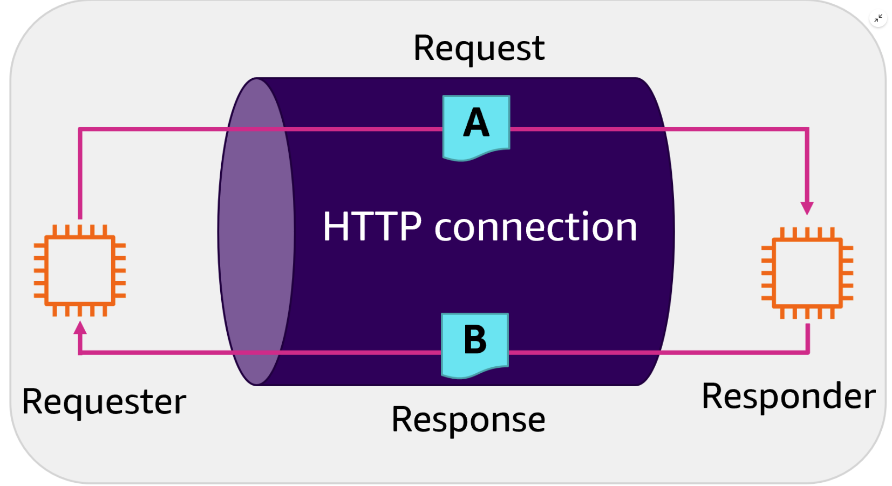

There are pros and cons to both types of communications. With synchronous communication, you bind resources on both sides of the communication when you issue and wait for a response. While your request is being processed, all systems participating in the communication are using resources specifically for the request or response until the full communication cycle is completed.

If your business use case expects quick response turnaround or is latency sensitive, synchronous communications might not be the most efficient way to meet your objectives.

#### Asynchronous communication

With *asynchronous* communications, the requester makes a request over an HTTPS connection. This request goes into a topic or internal queue. After the request is in the queue, the requester is notified that the request was accepted, and the requester is free to complete other tasks.

The backend systems or the responders then take action on the items in the queue.

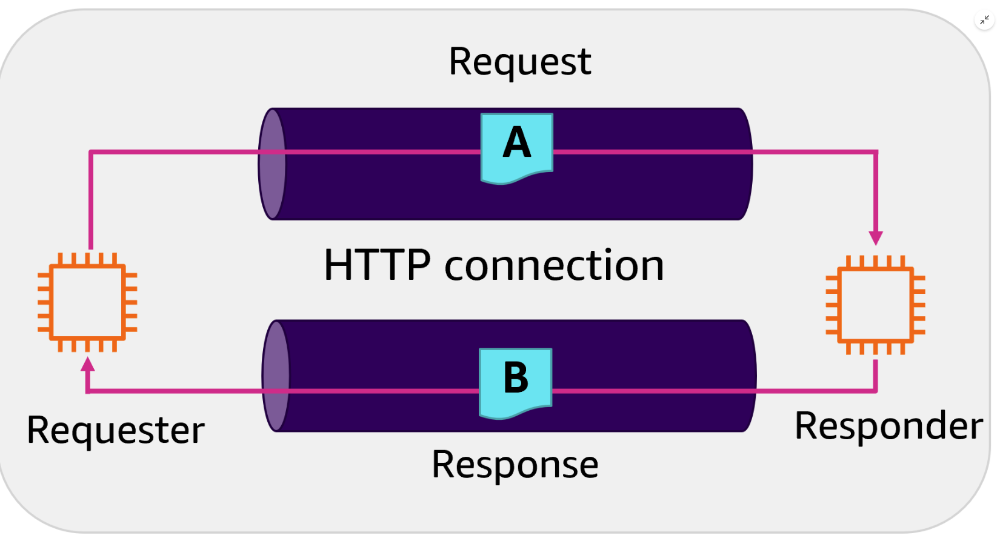

With asynchronous communications, there is no active waiting for a response. This is a good solution for fluctuating traffic volumes or for workflows that have many microservices working together. The challenge with this is that the requester is only notified when the request enters the queue and not when the action is taken. Additional logic would need to be rewritten to notify the requester of the completed request. This might take additional planning and coding time to achieve, depending on your business objectives or your use case.

Along with choosing synchronous or asynchronous communication methods, you must also consider which enterprise integration patterns (EIPs) to use. EIPs are industry-backed methods, frameworks, or best practices that cover different types of distribution patterns used for integrating services into an existing environment.

### Distribution patterns

Microservice distribution patterns explain and illustrate how microservices communicate, interact, and work together to form a larger distributed system.

#### One-to-one pattern

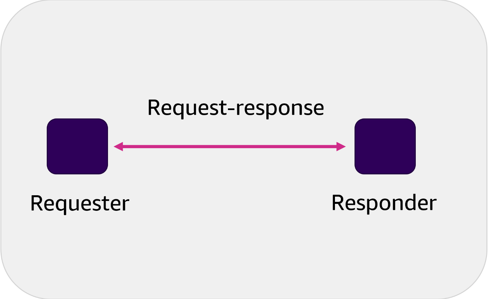

Requestor on left. Responder on right. Two-way arrow between them indicating the round-trip request and response.

In this distribution pattern, one microservice sends a request directly to another microservice called the responder. The responder then sends its reply directly to the requesting microservice.

This is a commonly used pattern for microservices that require synchronous communications. This pattern is used when a requestor is waiting for a response before taking its next action.

#### One-to-many pattern


Arrow points from publisher to message queue. Multiple single-colored arrows point from message queue to each subscriber.

This asynchronous communication pattern is also called the publish-subscribe (pub-sub) pattern. Often used with newsfeeds, this pattern decouples the message sender (publisher) from the receivers (subscribers) through the use of a message broker or queue. 

The publisher has no knowledge of the subscribers. After the message is pushed from the publishing service to the topic the publishing service can move on to its next action. The topic handles the message distribution to the subscribers.  Subscribers choose which communication topics to receive by subscribing to them. Not all subscribers subscribe to the same topics or messages.

#### Fan-out pattern


Publisher on left. Four subscribers on right side. Arrows from publisher to topic. Arrows from topic to four subscribers.

The fan-out pattern also has a single microservice (publisher) sending a message to multiple subscribers. In this pattern, scalability is important to allow for reliable parallel processing. This patterns requires message persistence. 

The fan-out pattern is a type of publish-subscribe communication, except that all subscribers are sent an identical message to subscribers of a single topic.

A common design pattern has multiple SQS queues subscribed to the SNS topic rather than specific compute resources. By buffering the incoming messages to the consumer layers via an SQS queue, it ensures the ability to scale out or scale in the consumer layers without losing messages.

### Orchestrating microservices

Microservices orchestration is a centralized approach where a central component, called the orchestrator, is responsible for managing and coordinating the interactions between microservices. Orchestrating workflows across multiple microservices can be challenging. Embedding orchestration code directly into services is discouraged because it introduces tighter coupling and hinders replacing individual services.

AWS Step Functions provides a workflow engine to manage service orchestration complexities, such as error handling and serialization. You can scale and change applications quickly without adding coordination code. Step Functions is part of the AWS serverless offerings which includes the following:

* AWS Lambda functions
* Amazon Elastic Compute Cloud (Amazon EC2)
* Amazon Elastic Kubernetes Service (Amazon EKS)
* Amazon Elastic Container Service (Amazon ECS)
* Amazon SageMaker
* AWS Glue

### Twelve-factor app methodology

Integrating microservices falls within all steps of the twelve-factor app methodology. With a purposeful build and deployment of your microservices, you can decompose a large application and effectively repurpose it as microservices. How you integrate your new services into the existing environment should be determined during planning. Integration isn't an afterthought, it's part of every step and every thought. The following four steps of the twelve-factor app methodology align with the integration process of your microservice implementation:

* **Step 4: Backing services**: These are any services called by the application over the network. These services include Amazon MQ, Amazon Simple Notification Service (Amazon SNS), and Amazon Simple Queue Service (Amazon SQS). Your application treats these services as attached resources that can be removed, updated, or changed without you making changes to the application code. This form of loose coupling requires you to only configure the location of the attached resource and not any information about the resource.
* **Step 5: Build, release, run**: This gives you the ability to iteratively deploy and test integration. By building and integrating purposefully, teams can identify opportunities, breaks, and inefficiencies between the services before they go into production.
* **Step 6: Processes**: In your application, processes are stateless and have no persistent information. Transactions are completed in one run and don't share any data or require any data from other processes. With management services like Amazon MQ, Amazon SNS, and Amazon SQS, you can write these types of stateless communicating processes. When an application writes a message to an Amazon SQS queue, the persistence is handled by the service and kept outside of your application.
* **Step 8: Concurrency**: A twelve-factor app scales by launching more processes. The architecture you build needs to plan for processes integration and scaling.

#### [Twelve-factor app methodology](https://12factor.net/)

Both synchronous and asynchronous communications provide unique benefits when used with distributed systems. As you plan your microservice implementation, determine the communication pattern best suited for your workflow.

## API Gateway Integration Pattern

### Three widely usedIntegration patterns

When integrating new microservices into your architecture, you need to know which communication pattern they use: synchronous or asynchronous. Based on the communication pattern, you determine which integration pattern works best for your use case. Some integration patterns provide benefits that highlight the performance, integrity, and ease of maintenance that make microservices so appealing. These patterns align to the following three types:

* API gateway pattern
* Decouple messaging pattern
* Pub-sub pattern

There are additional options available. When discussing synchronous communication, it aligns with the API gateway pattern.

### API Gateway refresher

The API Gateway is a fully managed service for creating, publishing, maintaining, monitoring, and securing APIs. You can create robust, secure, and scalable APIs that access AWS or other web services in addition to data that’s stored in the AWS Cloud. API Gateway gives you the option to create APIs to use in your own client applications or make your APIs available to third-party app developers.

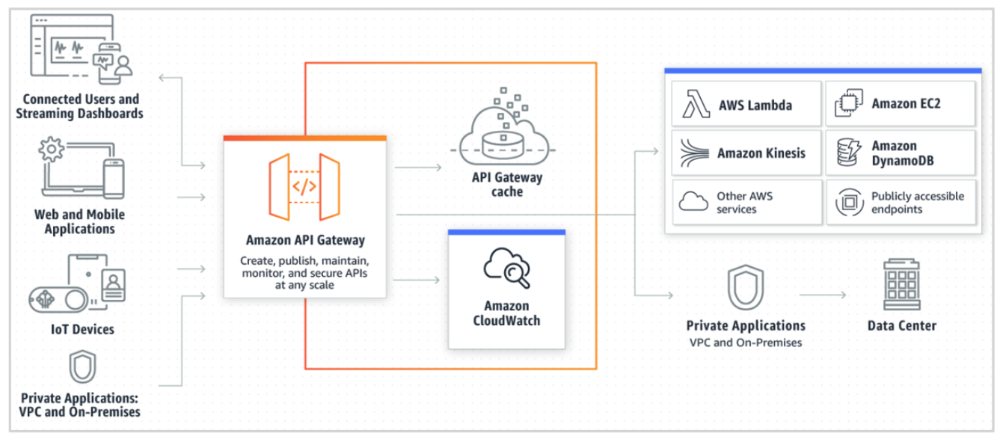

API Gateway handles any level of traffic received by an API, so you are free to focus on your business logic and services instead of maintaining infrastructure. If you’re using REST APIs, you can also set up a cache. This provides you with customizable keys and a time to live (TTL), in seconds, for your API data to avoid calling your backend services for each request.

#### [API Gateway](https://aws.amazon.com/api-gateway/)

### API gateway pattern

API Gateway functions as a proxy between external requestors and your backend microservices. API Gateway takes incoming requests and redirects them to the appropriate internal microservice endpoint.

The API gateway pattern uses the API Gateway to provide a single endpoint, or URL, for client applications to communicate with. It then maps these requests to the internal microservice. This layer of abstraction hides implementation details (for example, the Lambda function name and version) that are not necessary for the client to know.

The following image depicts external requestors, clients, or microservices connecting to an API gateway. The API Gateway then forwards the incoming requests to the correct microservice on the right.

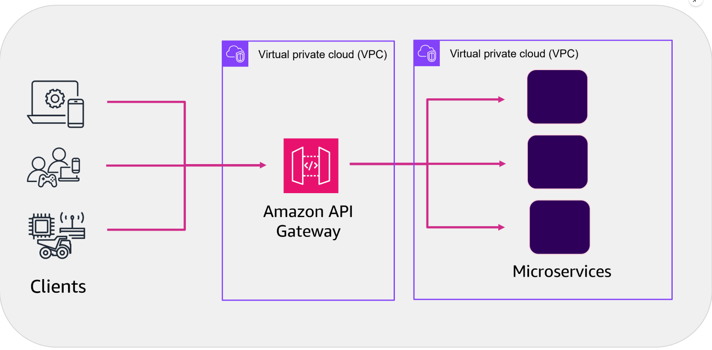

The API gateway pattern is a synchronous communication pattern. API Gateway is recommended when designing and building complex or large microservices-based applications that use multiple client applications.

The HTTPS protocol, which is widely used for synchronous communication between microservices, often operates through RESTful APIs. API Gateway offers a streamlined way to build an API that serves as a centralized access point to backend services. It handles tasks like traffic management, authorization, monitoring, and version control.

### API Gateway example

Here's a use case for API Gateway by providing the original architectural design challenges and two optional solutions.

#### Use case description

This use case depicts a customer making regular monthly payments through an insurance system. This system consists of four microservices deployed as Lambda functions. The four Lambda functions are labeled as **payments**, **customer**, **sales**, and **communication**.

#### Defining the four microservices in the example

The four microservices are defined as follows:

* The *payments* microservice is the overall system the customer uses to make their monthly payment.
* The *customer* microservice updates the customer database with the monthly payment details.
* The *sales* microservice updates the sales database with relevant information that helps the sales team follow up with the customer for cross-selling opportunities. 
* The *communication* microservice sends a confirmation email to the customer after the payment is successfully processed.

#### Original architecture design challenges

The original configuration for this example used web services and synchronous communication patterns to integrate these four microservices. There were three challenges to using this type of pattern for this insurance payment system example.

The three challenges were as follows:

* Using synchronous communication to the downstream systems means that *any latency caused by these subsystems affects the overall response time*.
* *Running costs are higher* because the payments system is waiting for responses from the other microservices before responding to the calling system. The total running time is, therefore, relatively higher compared with an asynchronous system.
* *Error handling and retry are handled separately* for each microservice inside the payments system, not by the individual microservices.

#### Solution 1: Single API Gateway

In the following architecture, each microservice is deployed as a single Lambda function. All of the microservices are connected by the same API Gateway on the frontend.

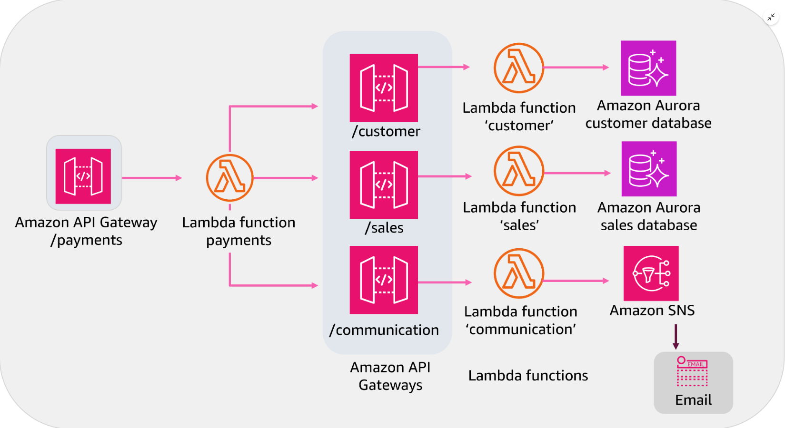

#### Solution 2: Multiple API Gateways

In the following architecture, each microservice has its own API Gateway. The *payments* microservice calls out to individual systems and implements the API gateway pattern.

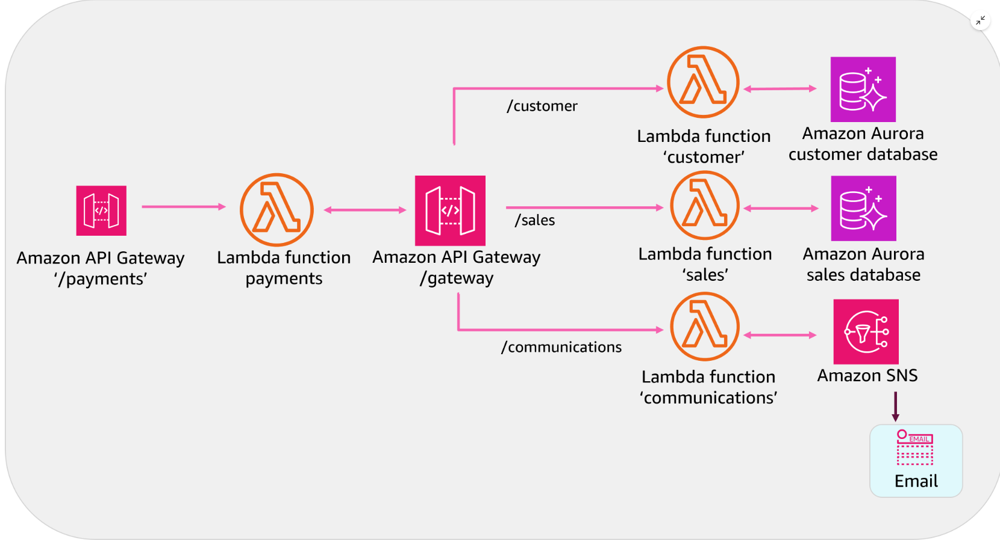

### API Gateway and your application

When creating an API method, you must integrate it with an endpoint on the backend. A backend endpoint is also called an *integration endpoint*. An integration endpoint can be a Lambda function, an HTTP webpage, or an AWS service action. An API integration has both a request and a response component as follows:

* An *integration request* encapsulates an HTTP request that is received by the backend services.
* An *integration response* is an HTTP response that encapsulates the output that is returned from the backend.

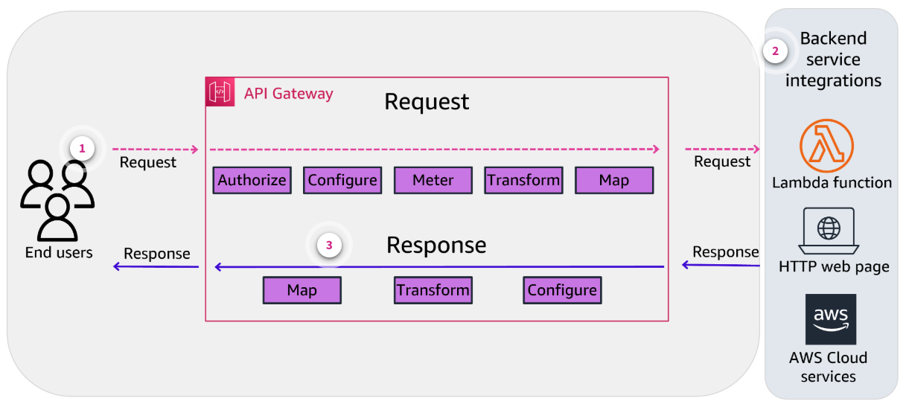

#### Request

Setting up an integration request involves the following:  

1. Authorizing the message or verifying authorization
2. Configuring how to pass client-submitted method requests to the backend
3. Metering and transforming the request data, if necessary, to the integration request data
4. Specifying which Lambda function to call
5. Mapping which Lambda function, HTTP server, or AWS service to forward the incoming invocation, HTTP request, or AWS action

#### Backend services

Use an API Gateway to proxy requests to AWS services or Lambda functions on the backend.

#### Response

Setting up an integration response involves the following:

1. Configuring how to pass the backend-returned result to a method response of a given status code
2. Transforming specified integration response parameters to preconfigured method response parameters
3. Mapping the integration response body to the method response body according to the specified body-mapping templates

### Creating, deploying, securing, monitoring, optimizing, and testing APIs

#### Step 1: Creating an API

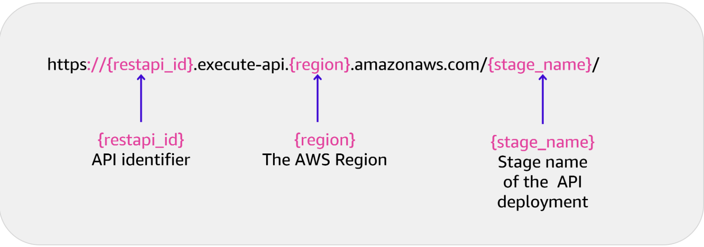

You create an API in the API Gateway by using either the AWS Command Line Interface (AWS CLI) or the API Gateway console. When you create and deploy an API, the API gateway generates a URI.

#### Step 2: Deploying an API

When an API is deployed, it is associated to a stage. A stage is a snapshot of an API, and developers create stages for version control, separating backend functions, and optimizing a deployment. For example, you can set up stage settings to enable caching, customize request throttling, or configure logging.

#### Step 3: Securing an API

You can secure your APIs using the following:

* AWS Identity and Access Management (IAM) resource policies control access to your API’s endpoint.
* Certificates through the use of SSL or, more specifically, TLS confirm that a request came in from API Gateway.
* AWS WAF is a web application firewall that protects APIs from common web exploits, like SQL injection and cross-site scripting (XSS).
* Cross-origin resource sharing (CORS) is a browser security feature that restricts cross-origin HTTP requests that are initiated from scripts that run in the browser.

#### Step 4: Monitoring an API

Amazon CloudWatch collects and processes raw data from the API Gateway into readable, near real-time metrics. This data is saved for 15 months, so you can gain a wider view into how your APIs are performing.

By default, API Gateway sends the following metrics data to CloudWatch every minute:

* **Count** – Refers to the total number of API calls in a given period
* **IntegrationLatency** – Measures the responsiveness of the backend
* **Latency** – Refers to the time between when API Gateway receives a request from a client and when it returns a response to the client
* **HTTP 400 and 500 errors** – Is the number of client-side and server-side errors, respectively, that were captured in a given period

For more information about monitoring, see [Monitoring REST APIs with Amazon CloudWatch Metrics.](https://docs.aws.amazon.com/apigateway/latest/developerguide/monitoring-cloudwatch.html)

#### Step 5: Optimizing an API

Using the API Gateway cache helps minimize backend calls and improve the latency of requests to your APIs.

Payload compression reduces the size of the client payload, reducing the amount of data from the API gateway to the clients. This option gives you both cost optimization and performance improvements.

#### Step 6: Testing an API with the invoke URL


You can test your APIs in multiple ways, such as using the invoke URL, the API Gateway console, or third-party tools.

If an API permits anonymous access, you can use any web browser to invoke any GET method calls. You can do this by copying an appropriate invocation URL to the browser's address bar. To call a deployed API, clients submit requests to the URL for the API Gateway component service for API operation, called execute-api.

The URL for REST APIs follows this format:

https://**{restapi_id}**.execute-api.**{region}**.amazonaws.com/**{stage_name}**/

In this example, the API identifier is **{restapi_id}**. This is followed by the AWS Region name, and the **{stage_name}** is the stage name of the API deployment.

You can find a REST API's root URL in the API Gateway console. You can also use the API Gateway console to call an API by using the API Gateway TestInvoke feature. TestInvoke bypasses the invoke URL and allows API testing before the API is deployed.

The API Gateway pattern is a form of synchronous communication.

## Decoupled Messaging Integration

Asynchronous integration patterns are built and designed to allow microservices to work and communicate independently and eliminate latency. Asynchronous patterns are built to decouple services by sending and receiving all messages through an intermediary queue. Using a queue or queueing service enables services to remain loosely coupled. Decoupling the services using a queue can improve system resilience and scalability and promote service discovery.

### A message broker and a message queue

#### Amazon MQ

Message brokers make it possible for software systems, which often use different programming languages on various technologies, to communicate and exchange information. Amazon MQ is a managed message broker service for Apache ActiveMQ and RabbitMQ that streamlines setup, operation, and management of message brokers on AWS.

Amazon MQ works with your existing applications and services without the need to manage, operate, or maintain your own messaging system. Amazon MQ is useful for migrating applications from existing message brokers that rely on compatibility with APIs. These include Java Message Service (JMS) or protocols such as Advanced Message Queuing Protocol (AMQP) - AMQP 0-9-1, AMQP 1.0, Message Queuing Telemetry Transport (MQTT), OpenWire, and Simple (or Streaming) Text Oriented Message Protocol (STOMP).

This makes Amazon MQ different from Amazon SQS and Amazon SNS, which are queue and topic services. These are highly scalable, straightforward to use, and don't require you to set up message brokers. Amazon SQS and Amazon SNS are best for new applications that benefit from nearly unlimited scalability and simple APIs.

* [Amazon MQ Developer Guide](https://docs.aws.amazon.com/amazon-mq/latest/developer-guide/welcome.html)

### Messaging types

Messaging can be defined into three types.

* Message Queues
* Pub-Sub Pattern
* Event-Driven Messaging

#### Message Queues

A message queue acts as a buffer that decouples senders (producers) and receivers (consumers) of messages. Producers enqueue messages into the queue, and consumers dequeue and process them.

This pattern is useful for asynchronous communication, load leveling, and handling bursts of traffic.

#### Pub-Sub Pattern

In the pub-sub pattern, a message is published to a topic, and multiple interested subscribers receive the message. This pattern enables broadcasting events or messages to multiple consumers asynchronously.

Pub-sub is an example of a queue or topic service. Amazon SNS is useful when building a pub-sub messaging system.

#### Event-Driven Messaging

Event-driven messaging involves capturing and reacting to events that occur in the system. Events are published to a message broker, and interested services subscribe to specific event types. This pattern enables loose coupling and allows services to react to events without direct dependencies.

### Two main messaging patterns that use an intermediary queue

There are two main messaging patterns that use an intermediary queue: the decouple messaging pattern and the pub-sub pattern.

#### Decouple messaging pattern

This pattern provides asynchronous communication between microservices by using an asynchronous poll model. When the backend system receives a call, it immediately responds with a request identifier and then asynchronously processes the request. A loosely coupled architecture can be built, which avoids bottlenecks caused by synchronous communication, latency, and I/O. In the pattern's use case, Amazon SQS and Lambda are used to implement asynchronous communication between different microservices.

You should consider using this pattern for the following scenarios:

* You want to create loosely coupled architecture.
* All operations don’t need to be completed in a single transaction, and some operations can be asynchronous.
* The downstream system cannot handle the incoming transactions per second (TPS) rate. The messages can be written to the queue and processed based on the availability of resources.

A disadvantage of this pattern is that business transaction actions are synchronous. Even though the calling system receives a response, some part of the transaction might still continue to be processed by downstream systems.

#### Decouple messaging use case

The following section explores a use case for decoupled messaging.

In this use case, the insurance system has a sales database that is automatically updated with the customer transaction details after a monthly payment is made. The following diagram depicts how to build this system by using the decouple messaging pattern.

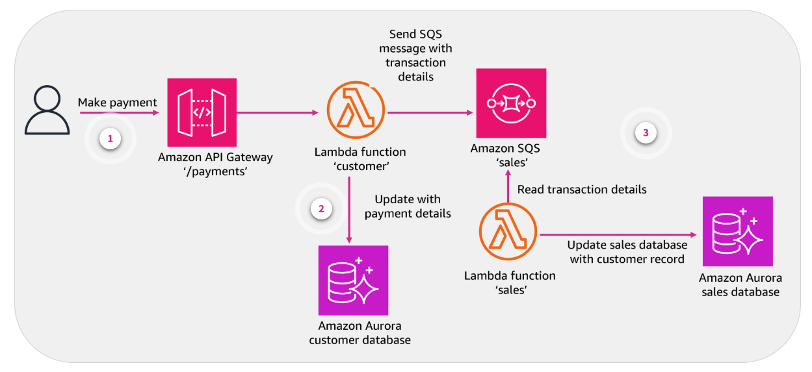

1. **Make payment**. The frontend application calls the API Gateway with the payment information after a user makes their monthly payment.
2. **Update with payment details**. The API Gateway runs the *Customer* Lambda function that saves the payment information in an Amazon Aurora database. It then writes the transaction details in a message to the *Sales* Amazon SQS and responds to the calling system with a success message.
3. **Read transaction details**. A Sales Lambda function pulls the transaction details from the SQS message and updates the sales data. Failure and retry logic to update the sales database is incorporated as part of the Sales Lambda function.

Message queues can help in a number of ways to make your applications and services more efficient.

## Publish-Subscribe Integration

Asynchronous messaging allows services to communicate by sending and receiving messages through a queue. Pub-sub messaging is an asynchronous communication model.

### Pub-sub pattern

In the pub-sub pattern, a message is published to a topic, and multiple interested subscribers receive the message. In the following image, the publishers on the left send messages about different topics to a message queue. The subscribers then automatically receive the messages.

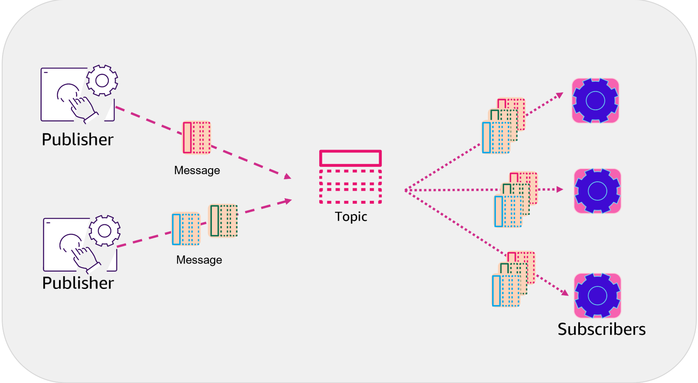

This pattern enables broadcasting events or messages to multiple consumers asynchronously. The pub-sub pattern also allows communication among multiple AWS services, such as Amazon SQS, Lambda, or Amazon Simple Storage Service (Amazon S3), without creating interdependency. Pub-sub messaging provides instant event notifications for these distributed systems.

### Message queues differ from pub-sub messaging

A message queue is another form of asynchronous communication used in serverless and microservices architectures. Messages are stored in the queue until they are processed and deleted. *Message queues require the sender to know who they are exchanging messages with*. Message ordering might also cause bottlenecks in the system.

In contrast, the pub-sub pattern provides more flexibility. Several interested subscribers can receive messages simultaneously and asynchronously. *Publishers don't need to know who the subscribers are*. Message handling is more scalable and reliable, and it gives better performance.

* [Message Queues](https://aws.amazon.com/message-queue/)
* [Amazon Simple Queue Service](https://aws.amazon.com/sqs/)

### How the pub-sub system works

The pub-sub system has four key components.

* Messages
* Topics
* Subscribers
* Publishers

#### Messages

A message is communication data sent from a sender to a receiver. Message data types can be anything from strings to complex objects representing text, video, sensor data, audio, or other digital content.

#### Topics

Every message has a topic associated with it. The topic acts like an intermediary channel between senders and receivers. It maintains a list of receivers who are interested in messages about that topic.

#### Subscribers

A subscriber is the message recipient. Subscribers must register (or subscribe) to topics of interest. They can perform different functions or do something different with the message in parallel.

#### Publishers

The publisher is the component that sends messages. It creates messages about a topic and sends them only once to all subscribers of that topic. This interaction between the publisher and subscribers is a one-to-many relationship. The publisher doesn’t need to know who is using the information it is broadcasting, and the subscribers don’t need to know where the message comes from.

### Microservices and the pub-sub pattern

Applications developed with a pub-sub pattern have separate application and communication logic. Microservices publish events as messages in a channel that subscribers can listen to. For example, a factory can use a pub-sub pattern to enable equipment to publish problems or failures to a channel. A subscriber then receives the messages to display and log the equipment issues.

Consider using this pattern if any of the following applies to you:

* You have an event-driven architecture.
* You can enable loosely coupled architecture.
* You don't need to complete all operational parts of a transaction before the response back to the calling system (certain operations can be asynchronous).
* You need to scale to volumes that are beyond the capability of a traditional data center. This level of scalability is primarily because of parallel operations, message caching, tree-based routing, and other features built into the pub-sub model.

### Benefits of pub-sub messaging

The pub-sub model enables event-driven architecture, which is required in several modern applications. You can use events to invoke and communicate between decoupled services. An event is a change in state, or an update, like an item being placed in a shopping cart.

Pub-sub messaging provides significant advantages to developers who build applications that rely on real-time events.

* **Eliminate polling**. Message topics allow instantaneous, push-based delivery, eliminating the need for message consumers to periodically check, or poll, for new information and updates. This promotes faster response time and reduces the delivery latency that can be particularly problematic in systems where delays cannot be tolerated.
* **Implement dynamic targeting**. The pub-sub pattern makes the discovery of services more convenient, more natural, and less error-prone. Instead of maintaining a roster of peers so an application can send messages, a publisher will post messages to a topic. Then, any interested party will subscribe its endpoint to the topic and start receiving these messages. Multiple subscribers can change, upgrade, or disappear, and the system adjusts dynamically.
* **Decouple and scale independently**. The pub-sub pattern makes the software more flexible. Publishers and subscribers are decoupled and work independently from each other, so you can develop and scale them independently. You can decide to handle orders one way this month and another way the following month. Adding or changing functionality won’t send ripple effects across the system because with the pub-sub pattern, you can flex how everything works together.
* **Streamline communication**. Code for communications and integration is some of the most difficult code to write. The pub-sub model reduces complexity by removing all the point-to-point connections with a single connection to a message topic. The topic will manage subscriptions to decide which messages should be delivered to which endpoints. Fewer callbacks result in looser coupling and code that is straightforward to maintain and extend.
* **Provide high durability**. Pub-sub messaging services often provide high durability and at-least-once delivery by storing copies of the same message on multiple servers.
* **Secure messages**. Message topics authenticate applications that try to publish content and allow you to use encrypted endpoints to secure messages in transit over the network.

### Pub-sub use case

In this use case, an SNS topic is used to publish events to several dependent microservices in an insurance system. After a customer makes their monthly payment, the information must be updated in subsystems, such as customer or sales. An email must be sent to the customer with the payment confirmation. This pattern can be implemented by using either Amazon SNS or Amazon EventBridge. The following diagram focuses on the Amazon SNS implementation.


1. **User makes a payment**. The user payment moves through the API gateway, invoking the Lambda function called "payments."
2. **Message is sent to "payments" SNS topic**. After a user makes a payment, an SNS message is sent by the "payments" Lambda function to the "payments" SNS topic.
3. **Subscribers receive the message**. This SNS topic has three subscribers that receive a copy of the message and process it.
4. **Data is processed**. The message is then processed and the information is written to the appropriate database.

### Pub-sub pattern disadvantages

The following are disadvantages to using this pattern:

* The pub-sub pattern typically cannot guarantee delivery of messages to all subscriber types.
 * Some services, such as Amazon SNS, can provide exactly-once delivery to some subscriber subsets.
* Another disadvantage is that a publisher might assume that a subscriber is listening to a channel when, in fact, they are not.

## Event-Based Integration

EventBridge is a serverless service that uses events to connect application components. You can conveniently build scalable event-driven applications. You can use EventBridge to route events from custom applications, AWS services, and third-party software to any of the consumer applications across your organization.

### Example

EventBridge is an asynchronous communication flow. Events are changes to your environment, such as a new MP3 file uploaded to an Amazon S3 bucket. When the MP3 is uploaded, an event is sent that invokes an action, such as a Lambda function that transcribes the audio.

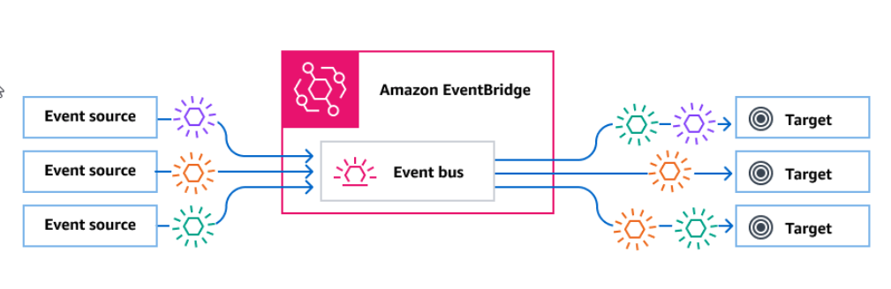)

### How EventBridge works

EventBridge provides real-time access to changes in data without needing to write additional code.

#### Event buses

An *event bus* is a router that receives events and delivers them to zero or more destinations, or targets. Event buses are well-suited for routing events from many sources to many targets with optional transformation of events before delivery to a target.

Rules associated with the event bus evaluate events as they arrive. Each rule checks whether an event matches the rule's pattern. If the event does match, EventBridge sends the event.

You associate a rule with a specific event bus, so the rule only applies to events received by that event bus.

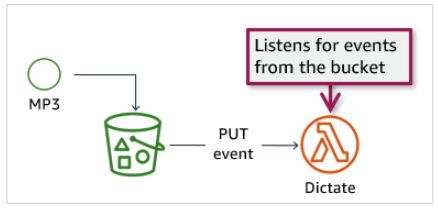

#### How event buses work

An event source, which can be an AWS service, your own custom application, or a software as a service (SaaS) provider, sends an event to an event bus.

EventBridge then evaluates the event against each rule defined for that event bus. For each event that matches a rule, EventBridge then sends the event to the targets specified for that rule. Optionally, as part of the rule, you can also specify how EventBridge should transform the event before sending it to the targets.

An event might match multiple rules, and each rule can specify up to five targets. (An event might not match any rules. In which case, EventBridge takes no action.)

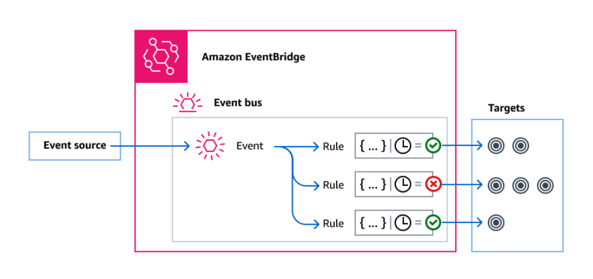

#### Events

An event often represents an indicator of a change in a resource or environment. An EventBridge event is a JSON object sent to an event bus or pipe.

Events use a specific JSON structure. Every event has the same top-level envelope fields, such as the source of the event, timestamp, and Region. This is followed by a detail field, which is the body of the event.

For example, when an Amazon EC2 Auto Scaling group creates a new Amazon EC2 instance, it emits an event with source: “aws.autoscaling” and detail: **EC2 instance created successfully**.

The following is the example JSON event object code.

```json
{
  "version": "0",
  "id": "UUID",
  "source": "aws.autoscaling",
  "account": "ARN",
  "time": "timestamp", 
  "region": "region",
  "resources": [ 
     "ARN"  
   ], 
  "detail": {
   EC2 instance created successfully
  }
}
```

#### Event sources

EventBridge can receive events from event sources, including the following:

* AWS services
* Custom applications
* SaaS partners

#### Rules

A rule receives incoming events and sends them as appropriate to targets for processing. The following are some specifics for using rules:

* Each rule is defined for a specific event bus and only applies to events on that event bus.
* A single rule can send an event to up to five targets.
* By default, you can configure up to 300 rules for each event bus.

You can specify how each rule invokes its targets based on the following:

* A schedule to invoke the targets at regular intervals
* An event pattern, which contains one or more filters to match events, can include filters that match the following:
 * **Event metadata** – This is data about the event, such as the event source or the account or Region where the event originated.
 * **Event data** – This includes the properties of the event itself. These properties vary according to event.
 * **Event content** – This is the actual property value of the event data.

#### Usage examples

Common use cases for event buses include the following:

You can use an event bus as a broker between different workloads, services, or systems.

You can use multiple event buses in your applications to divide up the event traffic. For example, creating a bus to process events containing personally identifiable information (PII) and another bus for events that don't.

You can aggregate events by sending events from multiple event buses to a centralized event bus. This centralized bus can be in the same account as the other buses but can also be in a different account or Region.

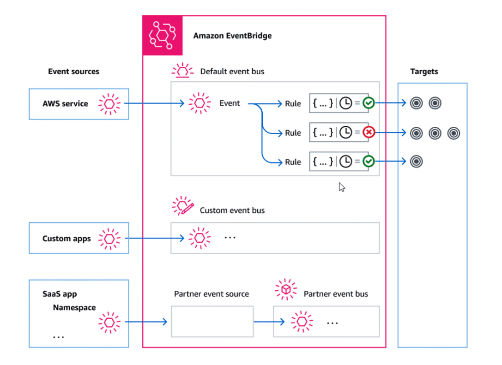

### EventBridge use case

In the following illustration, EventBridge is used to build a version of the pub-sub pattern where subscribers are defined by using event rules.

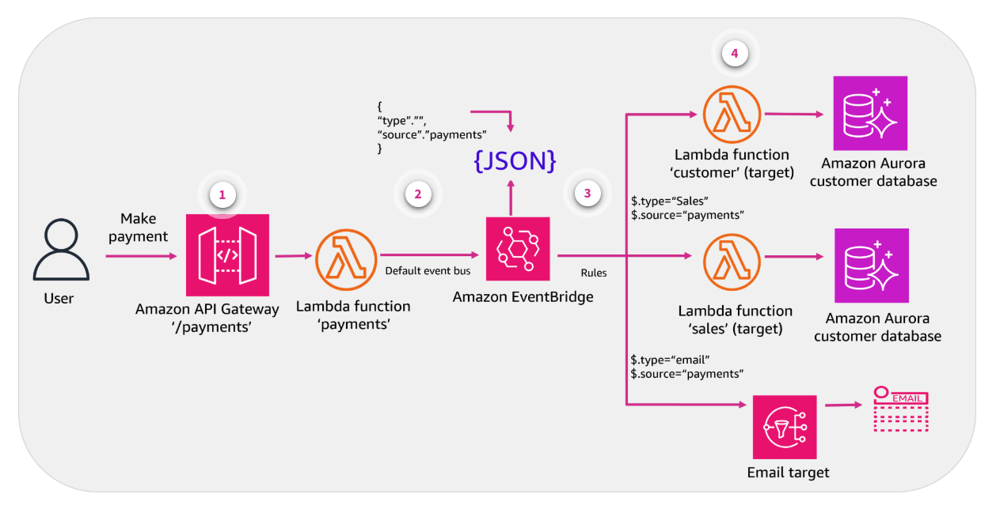

1. **User makes a payment**. The user submits a payment to the system.
2. **Message is sent across default event bus**. After a user makes a payment, the "payments" Lambda function sends a message to EventBridge by using the default event bus.
3. **Rules are invoked**. The default event bus has three different rules pointing to different targets.
4. **Messages are processed**. Each microservice processes the messages and performs the required actions.

### [Lab: Connecting Serverless Functions with Amazon API Gateway](./labs/W090Lab1ConnectingServerlessFunctionsWithApiGateway.md)

### Knowledge Check

#### How does using a message queue differ from a publish-subscribe (pub-sub) messaging pattern? (Select TWO.)

* Messages are stored in the queue until they are processed and deleted.
* Message queues require the sender to know who they are exchanging messages with.

Wrong answers:

* Several interested subscribers can receive identical messages simultaneously.
* Publishers don't need to know who the subscribers are.
* A message queue provides more flexibility.

##### Explanation

* Messages are stored in the queue until they are processed and deleted. Message queues require the sender to know who they are exchanging messages with.
* The pub-sub pattern provides more flexibility. Multiple subscribers can receive messages simultaneously and asynchronously.

#### Which type of communication method does the API gateway integration pattern use?

* Synchronous

Wrong answers:

* Asynchronous
* Publish-subscribe (pub-sub)
* Fan-out

#### Which distribution pattern has a single request-response model?

* One-to-one

Wrong answers:

* Fan-out
* One-to-many
* Publish-subscribe (pub-sub)

In the one-to-one distribution pattern, one microservice sends a request directly to another microservice called the responder. The responder then sends its reply directly to the requesting microservice.

### Summary

* Describe microservice integration pattern types.
* Identify AWS services used for synchronous and asynchronous integration.
* Use API Gateway for microservice integration.

Microservice integration patterns identify the ways microservices communicate and interact. When decomposing a larger application into more agile microservices, planning how to integrate these services into your existing environment is critical. Understanding the types of communication patterns that work best for your business use case can help you plan for integration. Testing and combining different messaging patterns can help you correctly integrate your new services into your infrastructure. Successful integration is key to achieving the greatest benefits from using microservices.

## Microservices and Step Functions

### Pre-assessment

#### What does a task state represent when working with AWS Step Functions?

* A unit of work

Wrong answers:

* Current run state of the function
* The end objective
* Amazon States Language (ASL)

A *task state* represents a unit of work that another AWS service, such as AWS Lambda, performs.

#### Which type of run model does a standard workflow follow?

* Exactly-once

Wrong answers:

* At-least-once
* More-than-once
* Not-quite-once

Express workflows define an at-least-once workflow execution. This means each step in the workflow executes at least once, and some steps can execute more than once. Each step runs for up to 5 minutes.

#### What is the definition of a workflow when working with AWS Step Functions?

* A sequence of steps that often matches a business process

Wrong answers:

* A single unit of work performed by a state machine
* A visual designer that helps to prototype and build workflows faster
* Individual steps in the state machine

A workflow describes a sequence of steps that often matches a business process.

## Orchestrating Microservices Using Step Functions

Step Functions helps you coordinate and manage the components of distributed microservices. As your applications initiate, Step Functions track exactly which workflow step your application is in. It then stores information in an event log of data that is passed between application components. If there is an error on the network or a component fails, your application starts where it left off.

Using Step Functions makes your development cycles faster and more intuitive because you can identify and purposefully build your application workflow. The workflow is built independently from your business logic so that you can make changes to one without impacting the other. Step Functions provides a reliable way to coordinate components and step through the functions of your application.

### Orchestration service

Step Functions is an orchestration service. Orchestration is the process of centrally managing a workflow by breaking it into multiple steps, adding flow logic, and tracking the inputs and outputs between the steps. A central component, called the orchestrator, is responsible for monitoring and coordinating the interactions between these microservices.

Manually orchestrating workflows across multiple microservices is challenging. Additionally, embedding orchestration code directly into services is not best practice because this introduces tighter coupling and would impact replacing any individual services.

Step Functions provides a visual workflow engine to manage service orchestration complexities, such as error handling and serialization. You can scale and change applications quickly without adding coordination code.

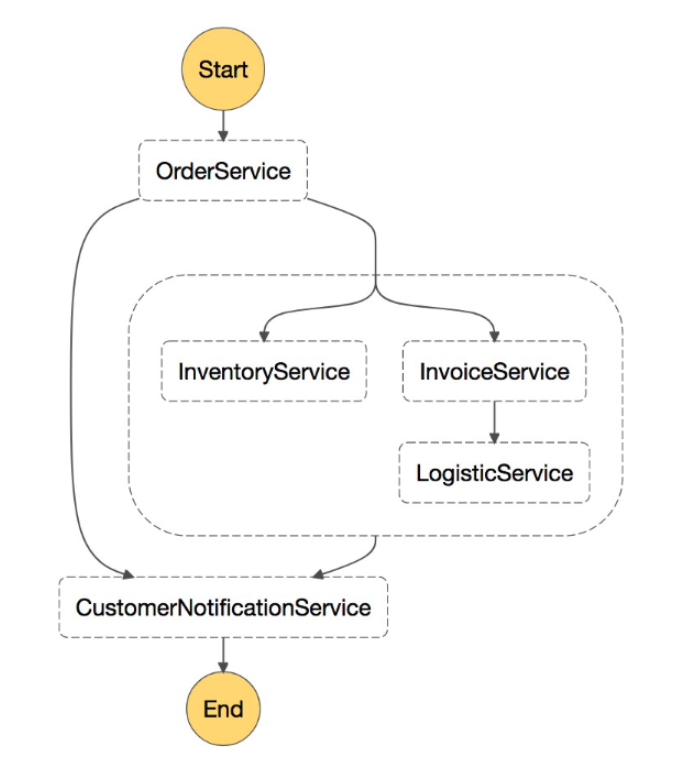

### Step Functions features

#### Build and update applications quickly

By using Step Functions, you can build visual workflows that provide fast translation of business requirements into technical requirements. You can build applications in minutes. When needs change, you can exchange or reorganize components without customizing any code.

#### Scale and recover reliably

Step Functions automatically scales the operations and underlying compute to run the steps of your application for you in response to changing workloads. Step Functions scales automatically to help ensure that the performance of your application workflow remains consistent as the frequency of requests increases.

#### Evolve applications effortlessly

Step Functions manages state, checkpoints, and restarts for you to make sure that your application runs in order and as expected. It has built-in retry and catch and rollback capabilities to deal with errors and exceptions automatically.

* [AWS Step Functions Features](https://aws.amazon.com/step-functions/features/)

### Key concepts

This section introduces you to important Step Functions concepts.

| Term | Description |
| -------- | ----------------------------------- |
| Workflow | This describes a sequence of steps and often matches a business process. |
| Workflow Studio | This is a visual workflow designer that helps you to prototype and build workflows faster. |
| States | These are individual steps in your state machine that perform a variety of functions in the state machine. |
| State machines | This is a workflow defined using JSON text representing the individual states or steps in the workflow, along with fields, such as StartAt, TimeoutSeconds, and Version. |
| Amazon States Language (ASL) | This is a JSON-based, structured language used to define your state machine. It's a collection of states that can do work (Task state), determine which states to transition to next (Choice state), and stop an execution with an error (Fail state). |
| Task | This represents a single unit of work performed by a state machine. |
| I/O configuration | Individual states in a workflow receive JSON data as input and usually pass JSON data as output to the next state. Step Functions provides multiple filters to control the input and output data flow between states. |

## Working With Step Functions

### State management

Step Functions is based on state machines and tasks. Step Functions is one of the many services that gives you the ability to connect Lambda functions together into serverless workflows called state machines. A *state machine* is a series of event-driven steps. Each individual step in a workflow is called a *state*.

A *task state* represents a unit of work that another AWS service, such as AWS Lambda, performs. A task state can call any AWS service or API. With Step Functions built-in controls, you examine the state of each step in your workflow to make sure that your application runs in the correct order and as expected.

The following image depicts the variety of benefits of using step functions. Step Functions provides multiple decision paths to follow. The function's decision can select a task based on data. It can run tasks in parallel, allow for a duration or wait period before running the next task, and automatically retry failed tasks.

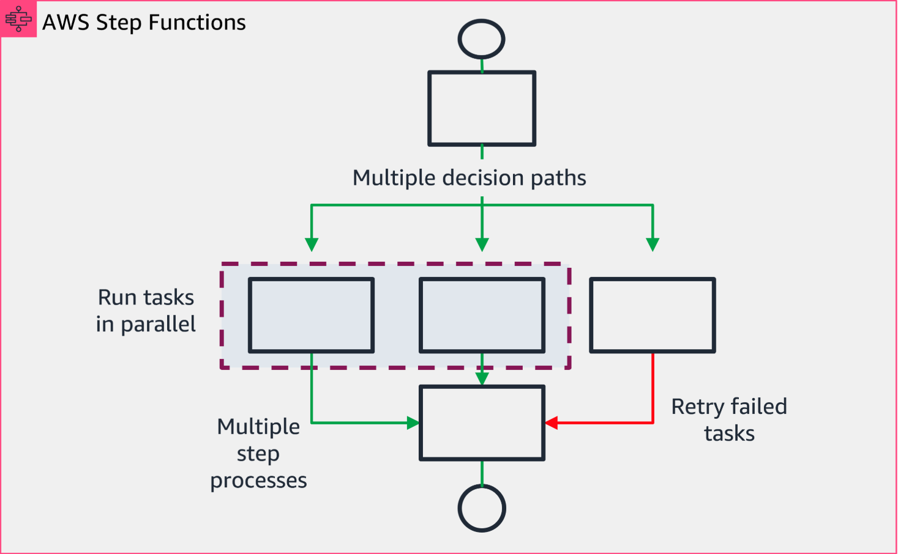

* [Optimized Integrations](https://docs.aws.amazon.com/step-functions/latest/dg/connect-to-services.html#connect-to-services-optimized)

### Defining states

States are elements in your state machine. Individual states make decisions based on their input, perform actions from those inputs, and pass output to other states.

States can perform a variety of different task functions in your state machine, including the following:

* **Choice** – Choose the appropriate branch of the flow.
* **Fail or Succeed** – Stop the flow based on pass or fail.
* **Pass** – Pass the input to the output as is or combined with some fixed data.
* **Wait** – Delay the flow for a specific amount of time.
* **Parallel** – Begin parallel branching within the flow.
* **Map** – Run the same steps for multiple entries of an array in the state input.

### Amazon States Language

In Step Functions, you define your workflows in the Amazon States Language (ASL). ASL is a JSON-based, structured language used to define your state machine, a collection of states. A state is referred to by its name, which can be any string, but it must be unique within the scope of the entire state machine.

A Step Functions execution receives JSON text as input and passes that input to the first state in the workflow.

The state machine always has a *StartAt* field, which indicates the name where processing starts. The state machine also always has a *States section*, which defines all of the states within the state machine. Each state must have a *Type* field indicating the type of state it is. Each state type is designed for a different type of logic, and some fields are relevant to specific state types.

Most states have a *Next* or *End* field, which tells the state machine what to do on completion of that state. States are not processed in the order listed. The *Next* field drives the order of operations.

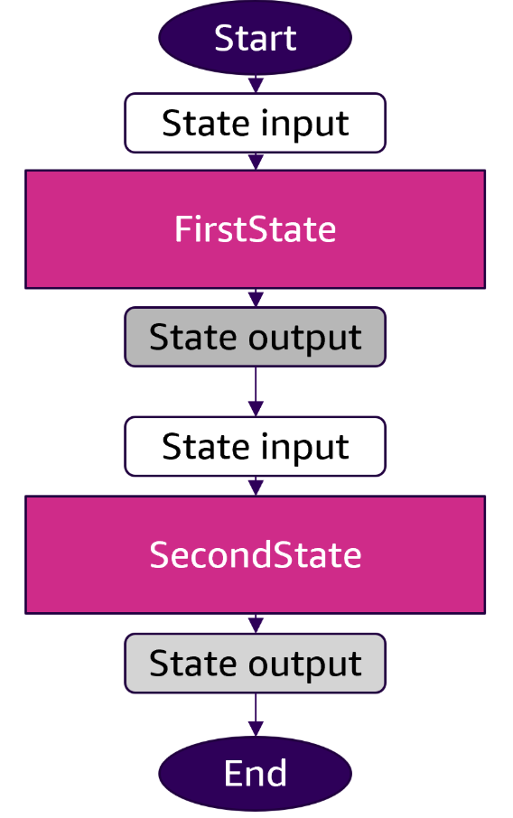

In this example, **FirstState** is a *Task state* that runs a Lambda function and indicates that the next step is **SecondState**.

**SecondState** is a *Pass state* type and indicates that processing ends after it completes.

The following is an example of the state machine described here written in ASL.

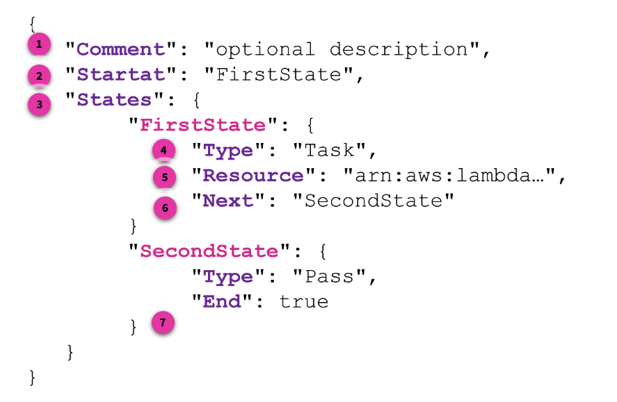

1. **Comment**. A state machine might have a string field named Comment, provided for a human-readable description of the machine. This is an optional field. In the image, the **Comment** field reads **optional description**.
2. **Startat**. A state machine must have a string field named StartAt, and its value must exactly match one of names of the States fields. The interpreter starts running the machine at the named state. In the image, the **Startat** value is called **FirstState**. This **FirstState** value matches the initial state in the list.
3. **States**. A state machine must have an object field named **States**, and its fields represent the states.
4. **Type**. **Type, or task_type**, is the type of task to run. It can be one of the following values:
 * **activity** – An activity
 * **function** – A Lambda function
 * **servicename** – The name of a supported connected service
5. **Resource**. This is a required value. It appears as a URI, especially an Amazon Resource Name (ARN) that uniquely identifies the specific task to execute. 
6. **Transitions**. After a state runs, Step Functions uses the value of the Next field to determine the next state to advance to. Next fields also specify state names as strings. This string is case-sensitive and must match the name of a state specified in the state machine description exactly. In the example, the **Next** state is to run **SecondState**.
7. **End**. A task state must set either the End field to true if the state ends the execution or must provide a state in the Next field that is run when the Task state is complete. In the example the **End** value is **true**.

* [Amazon States Language](https://states-language.net/spec.html)

### Standard and Express workflows

When you create a state machine, you select a *Type* of either Standard or Express. The default Type for a state machine is *Standard*. A state machine with a Type that is Standard is called a *Standard workflow*, and a state machine with a Type that is Express is called an *Express workflow*.

Executions are instances where you run your workflow to perform tasks.

#### Standard workflows

Standard workflows follow an *exactly-once* model where your tasks and states never run more than once unless you configure them to. This makes Standard workflows better suited for actions that should only ever be completed once, such as starting an Amazon EMR cluster or processing a payment.

The specifications for Standard workflows are as follows:

* 2,000 per second execution rate
* 4,000 per second state transition rate
* Priced by state transition
* Show execution history and visual debugging
* Support all service integrations and patterns

Standard workflows are ideal for long-running (up to 1 year), durable, and auditable workflows because they show execution history and visual debugging. You can retrieve the full execution history using the Step Functions API for up to 90 days after your execution completes.

#### Express workflows

Asynchronous Express workflows define an *at-least-once* workflow execution. This means each step in the workflow executes at least once, and some steps can execute more than once. Each step runs for up to 5 minutes. Synchronous Express workflows define an *at-most-once* workflow execution. This means each step in the workflow executes no more than once.

Express workflows specifications are as follows:

* 100,000 per second execution rate
* Nearly unlimited state transition rate
* Priced by number and duration of executions
* Send execution history to Amazon CloudWatch
* Display execution history and visual debugging based on the Amazon CloudWatch Log level enabled
* Support all service integrations and most patterns

Express workflows are ideal for high-volume, event-processing workloads, such as Internet of Things (IoT) data ingestion, streaming data processing and transformation, and mobile app backends. They can run for up to 5 minutes.

Express workflows employ an at-least-once model. Therefore, they are ideal for orchestrating idempotent actions, such as transforming input data and storing by way of a PUT action in Amazon DynamoDB. Express workflow executions are billed by the number of executions, the duration of execution, and the memory consumed while the execution ran.

* [Tutorials for Step Functions](https://docs.aws.amazon.com/step-functions/latest/dg/tutorials.html)

## Identifying Step Functions Use Cases

### Use cases

Step Functions manages your application's components and logic, so you can write less code and focus on building and updating your application quickly.

### Function orchestration

For function orchestration, you create a workflow that runs a group of Lambda functions (steps) in a specific order.

The workflow can handle taking the output from one Lambda function and passing it on to the next Lambda function's input. The last step in your workflow gives a result.


With Step Functions, you can watch how each step in your workflow interacts with one another. You can make sure that each step performs its intended function.

* [Orchestration tutorial](https://docs.aws.amazon.com/step-functions/latest/dg/getting-started-with-sfn.html#get-started-tutorials-intro)

### Branching

What if you're a bank that needs to automate customer transactions? In this example, a customer requests a credit limit increase. Using a *Choice* state, you can have Step Functions make decisions based on the Choice state’s input.

If the request is more than your customer’s preapproved credit limit, you can have Step Functions send your customer's request to a manager for sign-off.

If the request is less than your customer’s preapproved credit limit, you can have Step Functions approve the request automatically.

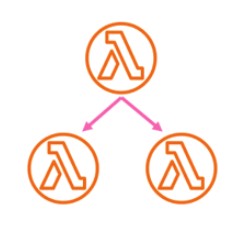

#### Error handling

In this use case, a customer requests a username for a new account. The first time the customer requests the username, the request is unsuccessful.

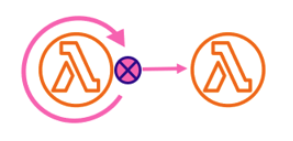

Using a *Retry* statement, you can have Step Functions try your customer's request again.

After the retry is processed for the second time, your customer’s request is successful.

In a similar use case, a customer requests an unavailable username. Using a *Catch* statement, you have Step Functions suggest an available username. If your customer takes the available username, you can have Step Functions go to the next step in your workflow, which is to send a confirmation email. If your customer doesn’t take the available username, you have Step Functions go to a different step in your workflow, which is to start the sign-up process over.

* [Code example](https://docs.aws.amazon.com/step-functions/latest/dg/concepts-error-handling.html)

### Human-in-the-loop

With the use of a banking app, one of your customers sends money to a client. Your customer then waits for a confirmation email indicating that the transaction was completed.

Using a callback and a task token, you have Step Functions tell Lambda to send your customer’s money and report back when your customer’s client receives it.

After Lambda reports back that your customer’s client received the money, you can have Step Functions go to the next step in your workflow. This step sends your customer a confirmation email.

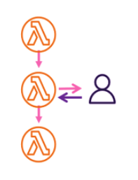

* [Code example](https://docs.aws.amazon.com/step-functions/latest/dg/callback-task-sample-sqs.html)

#### Parallel processing

In this example, your customer converts a video file into five different display resolutions, so viewers can watch the video on multiple devices.

Using a Parallel state, Step Functions inputs the video file so Lambda can process it into the five display resolutions at the same time.

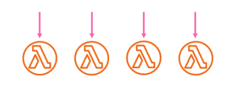

#### Dynamic parallelism

What if one of your customers orders three items, and you need to prepare each item for delivery? First, you check each item's availability, gather each item, and then package each item for delivery.

Using a Map state, Step Functions has Lambda process each of your customer's items in parallel. After all of your customer's items are packaged for delivery, Step Functions goes to the next step in your workflow. This step will send your customer a confirmation email with tracking information.

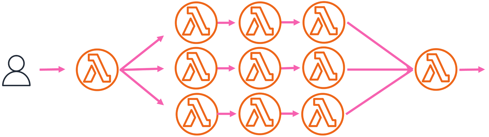

* [Dynamically Process Data with a Map State](https://docs.aws.amazon.com/step-functions/latest/dg/sample-map-state.html)

## API Operations

### API Gateway with Step Functions

With Amazon API Gateway, you can create, publish, maintain, and monitor HTTP and REST APIs. You can also integrate Step Functions with API Gateway. You define a *Task* state (in Step Functions) that directly calls an API Gateway HTTP or API Gateway REST endpoint without needing to write additional code or rely on other infrastructure.

A *Task* state definition includes all the necessary information for the API call. You can also select different authorization methods based on your application needs.

Step Functions supports the ability to call HTTP endpoints through API Gateway but does not currently support the ability to call generic HTTP endpoints.

### Creating a step function using API Gateway

You can use API Gateway to associate Step Functions APIs with methods in an API Gateway API. When an HTTPS request is sent to an API method, API Gateway invokes the Step Functions API actions.

To create a function using API Gateway, follows these steps:

1. Create an AWS Identity and Access Management (IAM) role for API Gateway.
2. Create your API Gateway API.
3. Test and deploy the API Gateway API.

The following is a JSON example of a task making calls to an API Gateway API. Here, the **Type** is "**Task**", and the Resource is "**apigateway:invoke**".

```json
{
    "Type": "Task",
    "Resource":"arn:aws:states:::apigateway:invoke", 
    "Parameters": {
        "ApiEndpoint": "example.execute-api.us-east-1.amazonaws.com",
        "Method": "GET", 
        "Headers": { 
            "key": ["value1", "value2"] 
        },
        "Stage": "prod",
        "Path": "bills",
        "QueryParameters": {
            "billId": ["123456"]
        },
        "RequestBody": {},
        "AuthType": "NO_AUTH"
    } 
}
```

For detailed instructions about how to complete each of these steps, run the following "Creating a Step Functions API Using API Gateway" tutorial.

* [Creating a Step Functions API Using API Gateway ](https://docs.aws.amazon.com/step-functions/latest/dg/tutorial-api-gateway.html)

### API Gateway feature support

The *Step Functions API Gateway integration* supports some, but not all, API Gateway features.

The following features are supported by both the step functions API Gateway REST API and API Gateway HTTP API integrations:

* **Authorizers**: IAM (using Signature Version 4), No Auth, Lambda Authorizers (request-parameter-based and token-based with custom header)
* **API types**: Regional
* **API management**: API Gateway API domain names, API stage, Path, Query Parameters, Request Body

### Quotas

Step Functions places quotas on the sizes of certain state machine parameters. These parameters might include the number of API actions you can make during a certain time period or how many state machines you can define. The quotas are designed to prevent a misconfigured state machine from consuming all the resources of the system. These are not hard quotas, and you can request a service quota increase if needed. Quotas might differ significantly based on whether your state machine uses Standard or Express workflows.

### Step Functions APIs

You can access and use Step Functions by using the AWS Management Console, AWS SDKs, or APIs. You can run a Step Functions state machine by doing the following:

* Call the Step Functions **StartExecutionAPI** action.
* Associate the Step Functions APIs with API operations in API Gateway. When an HTTPS request is sent to an API operation, API Gateway invokes the Step Functions API actions.

The following table lists the most common Step Functions APIs and their descriptions.

| API ACTION | DESCRIPTION |
| ---------- | ----------- |
| **Create** | Upload state machines that are defined in JSON. Register activity workers. |
| **StartExecution** | Return an ARN that identifies the run. |
| **StopExecution** | Return the date that the state machine stopped. |
| **List** | List all state machines, runs, and activities. |
| **Describe** | Describe individual state machines, runs, and activities. |
| **GetExecutionHistory** | Get the history of a state machine run as a list of events. |

**Important**: If you use the Step Functions API actions using AWS SDK integrations, make sure the API actions are in camel case and the parameter names are in Pascal case.

For example, you can use the Step Functions API action **startSyncExecution** and specify its parameter as **StateMachineArn**.

* [AWS Step Functions API Reference guide](https://docs.aws.amazon.com/step-functions/latest/apireference/Welcome.html)

### Knowledge Check

#### Which outcome can be prevented by putting AWS Step Functions quotas in place?

* A misconfigured state machine from consuming all the resources of the system

Wrong answers:

* Overuse of the underlying hardware
* A misconfiguration that increases the cost of running the state machine
* Unauthorized use of Step Functions

Step Functions places quotas on the sizes of certain state machine parameters. These parameters might include the number of API actions that can be made during a certain time period or how many state machines can be defined. These quotas are designed to prevent a misconfigured state machine from consuming all the resources of the system.

#### Which are three types of AWS Step Functions use cases? (Select THREE.)

* Branching
* Human-in-the-loop
* Dynamic parallelism

Wrong answers:

* Step Functions chaining
* Asymmetric parallelism
* Functioning

#### With AWS Step Functions, visual workflows can be built to provide fast translation of business requirements. Which additional performance benefits are available when working with Step Functions? (Select TWO.)

* Automatically scale the operations and underlying compute.
* Manage state, checkpoints, and restarts to make sure the application runs in order and as expected.

Wrong answers:

* Write and build the Step Functions automatically based on the services selected. 
* Integrate with third-party messaging systems to improve communications.
* Step Functions provide their own internal authentication so developers don't need to consider security.

Step Functions automatically scales the operations and underlying compute to run the steps of the application in response to changing workloads.

Step Functions manages state, checkpoints, and restarts to make sure that the application runs in order and as expected.

### Summary

Step Functions helps you coordinate and manage the components of distributed microservices. As your applications initiate, Step Functions tracks exactly which workflow step your application is in. It stores information in an event log of data that is passed between application components.

You reviewed how to work with Step Functions and identified architectural use cases for the different types of services. You learned how other AWS services integrate with Step Functions. Finally, you learned how to create, publish, maintain, and monitor HTTP and REST APIs using API Gateway.
