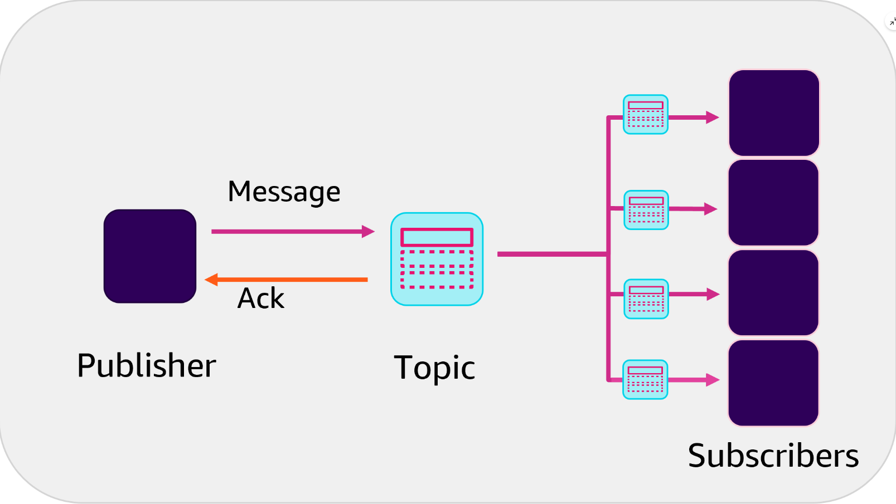
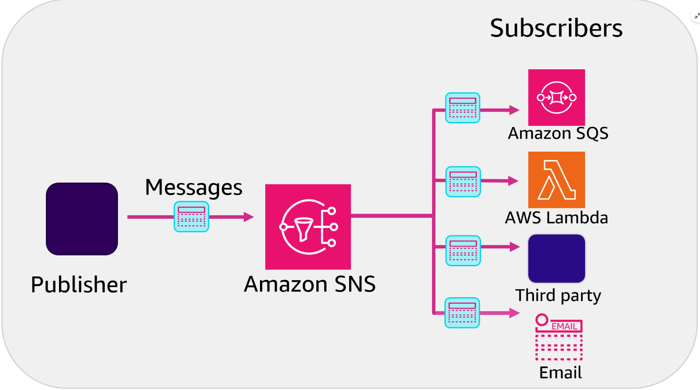

# Week 9: Serverless Applications – Microservice Integration Patterns – Part 1

* back to AWS Cloud Institute repo's root [aci.md](../aci.md)
* back to repo's main [README.md](../../../README.md)

### Pre-assessment

#### Which integration pattern uses synchronous communications?

* API gateway pattern

Wrong answers:

* Fan-out pattern
* Decouple messaging pattern
* Publish-subscribe (pub-sub) pattern

The API gateway pattern is a synchronous communication pattern. Amazon API Gateway is recommended when designing and building complex or large microservices-based applications that use multiple client applications.

#### What is the benefit of working with asynchronous integration patterns?

* They make it possible for microservices to work and communicate independently.

Wrong answers:

* The requestor receives an immediate response to queries.
* There is a closer coupling of the microservices.
* All systems wait for an immediate response.

Asynchronous integration patterns are built and designed to allow microservices to work and communicate independently and eliminate latency. Asynchronous patterns are built to decouple services. Decoupling the services can improve system resilience and scalability and promote service discovery.

#### What are the three types of communication options used for application integration? (Select THREE.)

* Message queues
* Publish-subscribe (pub-sub) patterns
* Event-driven messaging

Wrong answers:

* Emails
* Chats
* System-initiated messaging

##### Explanation

* A message queue acts as a buffer that decouples senders (producers) and receivers (consumers) of messages. Producers enqueue messages into the queue, and consumers dequeue and process them.
* In the pub-sub pattern, a message is published to a topic, and multiple interested subscribers receive the message.
* Event-driven messaging involves capturing and reacting to events that occur in the system.

## Identifying Communication Patterns

Microservices distribution patterns identify the ways that microservices communicate and interact. Microservices, by definition, are smaller application components that communicate over a network to accomplish a business task. When decomposing a larger application into more agile microservices, part of your planning is how to integrate these services into your existing environment. Integration is the process of connecting applications, systems, APIs, data, and devices to create efficient communications and ease of functionality within your existing architecture. Correctly integrating your new services into your infrastructure is the key to achieving the greatest benefits from using microservices.

Determining the best way to integrate these microservices into your unique environment depends on a variety of communication factors discussed in this module.

### Integration

After you've identified how best to decompose a large monolithic application, the next step is to ensure that your microservices are correctly and efficiently integrated into your existing architecture. When planning your integration, it's critical that these small services communicate with each other. They need to function efficiently and maintain access to the data they need to process. 

If your microservices are inefficient or start losing data, you will be in a difficult position to provide data showing how the microservices you've deployed benefit the business. Data integrity issues lose customer trust and can be difficult to troubleshoot after the fact. To avoid this type of situation, you must effectively integrate your microservices, so they work together and don't impede any existing processes or workflows.

When planning for your integration, one of the first discussion items is how you want your microservices to communicate. Next are the different communication options.

### Synchronous and asynchronous communication

There are two types of communication used for services: synchronous and asynchronous.

#### Synchronous communication

In *synchronous* communications, a connection is established by the requestor (the one making the request). The requestor waits for a response from the responder (the one who can provide the information needed) before performing the next action.

An online meeting is an example of synchronous communication. For example, if you ask a question, you wait for and expect an immediate response from the people in attendance.

There are pros and cons to both types of communications. With synchronous communication, you bind resources on both sides of the communication when you issue and wait for a response. While your request is being processed, all systems participating in the communication are using resources specifically for the request or response until the full communication cycle is completed.

If your business use case expects quick response turnaround or is latency sensitive, synchronous communications might not be the most efficient way to meet your objectives.

#### Asynchronous communication

With *asynchronous* communications, the requester makes a request over an HTTPS connection. This request goes into a topic or internal queue. After the request is in the queue, the requester is notified that the request was accepted, and the requester is free to complete other tasks.

The backend systems or the responders then take action on the items in the queue.

With asynchronous communications, there is no active waiting for a response. This is a good solution for fluctuating traffic volumes or for workflows that have many microservices working together. The challenge with this is that the requester is only notified when the request enters the queue and not when the action is taken. Additional logic would need to be rewritten to notify the requester of the completed request. This might take additional planning and coding time to achieve, depending on your business objectives or your use case.

Along with choosing synchronous or asynchronous communication methods, you must also consider which enterprise integration patterns (EIPs) to use. EIPs are industry-backed methods, frameworks, or best practices that cover different types of distribution patterns used for integrating services into an existing environment.

### Distribution patterns

Microservice distribution patterns explain and illustrate how microservices communicate, interact, and work together to form a larger distributed system.

#### One-to-one pattern

Requestor on left. Responder on right. Two-way arrow between them indicating the round-trip request and response.

In this distribution pattern, one microservice sends a request directly to another microservice called the responder. The responder then sends its reply directly to the requesting microservice.

This is a commonly used pattern for microservices that require synchronous communications. This pattern is used when a requestor is waiting for a response before taking its next action.

#### One-to-many pattern

Arrow points from publisher to message queue. Multiple single-colored arrows point from message queue to each subscriber.

This asynchronous communication pattern is also called the publish-subscribe (pub-sub) pattern. Often used with newsfeeds, this pattern decouples the message sender (publisher) from the receivers (subscribers) through the use of a message broker or queue. 

The publisher has no knowledge of the subscribers. After the message is pushed from the publishing service to the topic the publishing service can move on to its next action. The topic handles the message distribution to the subscribers.  Subscribers choose which communication topics to receive by subscribing to them. Not all subscribers subscribe to the same topics or messages.

#### Fan-out pattern

Publisher on left. Four subscribers on right side. Arrows from publisher to topic. Arrows from topic to four subscribers.

The fan-out pattern also has a single microservice (publisher) sending a message to multiple subscribers. In this pattern, scalability is important to allow for reliable parallel processing. This patterns requires message persistence. 

The fan-out pattern is a type of publish-subscribe communication, except that all subscribers are sent an identical message to subscribers of a single topic.

A common design pattern has multiple SQS queues subscribed to the SNS topic rather than specific compute resources. By buffering the incoming messages to the consumer layers via an SQS queue, it ensures the ability to scale out or scale in the consumer layers without losing messages.

### Orchestrating microservices

Microservices orchestration is a centralized approach where a central component, called the orchestrator, is responsible for managing and coordinating the interactions between microservices. Orchestrating workflows across multiple microservices can be challenging. Embedding orchestration code directly into services is discouraged because it introduces tighter coupling and hinders replacing individual services.

AWS Step Functions provides a workflow engine to manage service orchestration complexities, such as error handling and serialization. You can scale and change applications quickly without adding coordination code. Step Functions is part of the AWS serverless offerings which includes the following:

* AWS Lambda functions
* Amazon Elastic Compute Cloud (Amazon EC2)
* Amazon Elastic Kubernetes Service (Amazon EKS)
* Amazon Elastic Container Service (Amazon ECS)
* Amazon SageMaker
* AWS Glue

### Twelve-factor app methodology

Integrating microservices falls within all steps of the twelve-factor app methodology. With a purposeful build and deployment of your microservices, you can decompose a large application and effectively repurpose it as microservices. How you integrate your new services into the existing environment should be determined during planning. Integration isn't an afterthought, it's part of every step and every thought. The following four steps of the twelve-factor app methodology align with the integration process of your microservice implementation:

* **Step 4: Backing services**: These are any services called by the application over the network. These services include Amazon MQ, Amazon Simple Notification Service (Amazon SNS), and Amazon Simple Queue Service (Amazon SQS). Your application treats these services as attached resources that can be removed, updated, or changed without you making changes to the application code. This form of loose coupling requires you to only configure the location of the attached resource and not any information about the resource.
* **Step 5: Build, release, run**: This gives you the ability to iteratively deploy and test integration. By building and integrating purposefully, teams can identify opportunities, breaks, and inefficiencies between the services before they go into production.
* **Step 6: Processes**: In your application, processes are stateless and have no persistent information. Transactions are completed in one run and don't share any data or require any data from other processes. With management services like Amazon MQ, Amazon SNS, and Amazon SQS, you can write these types of stateless communicating processes. When an application writes a message to an Amazon SQS queue, the persistence is handled by the service and kept outside of your application.
* **Step 8: Concurrency**: A twelve-factor app scales by launching more processes. The architecture you build needs to plan for processes integration and scaling.

#### [Twelve-factor app methodology](https://12factor.net/)

Both synchronous and asynchronous communications provide unique benefits when used with distributed systems. As you plan your microservice implementation, determine the communication pattern best suited for your workflow.

## API Gateway Integration Pattern

### Three widely usedIntegration patterns

When integrating new microservices into your architecture, you need to know which communication pattern they use: synchronous or asynchronous. Based on the communication pattern, you determine which integration pattern works best for your use case. Some integration patterns provide benefits that highlight the performance, integrity, and ease of maintenance that make microservices so appealing. These patterns align to the following three types:

* API gateway pattern
* Decouple messaging pattern
* Pub-sub pattern

There are additional options available. When discussing synchronous communication, it aligns with the API gateway pattern.

### API Gateway refresher

The API Gateway is a fully managed service for creating, publishing, maintaining, monitoring, and securing APIs. You can create robust, secure, and scalable APIs that access AWS or other web services in addition to data that’s stored in the AWS Cloud. API Gateway gives you the option to create APIs to use in your own client applications or make your APIs available to third-party app developers.

API Gateway handles any level of traffic received by an API, so you are free to focus on your business logic and services instead of maintaining infrastructure. If you’re using REST APIs, you can also set up a cache. This provides you with customizable keys and a time to live (TTL), in seconds, for your API data to avoid calling your backend services for each request.

#### [API Gateway](https://aws.amazon.com/api-gateway/)

### API gateway pattern

API Gateway functions as a proxy between external requestors and your backend microservices. API Gateway takes incoming requests and redirects them to the appropriate internal microservice endpoint.

The API gateway pattern uses the API Gateway to provide a single endpoint, or URL, for client applications to communicate with. It then maps these requests to the internal microservice. This layer of abstraction hides implementation details (for example, the Lambda function name and version) that are not necessary for the client to know.

The following image depicts external requestors, clients, or microservices connecting to an API gateway. The API Gateway then forwards the incoming requests to the correct microservice on the right.

The API gateway pattern is a synchronous communication pattern. API Gateway is recommended when designing and building complex or large microservices-based applications that use multiple client applications.

The HTTPS protocol, which is widely used for synchronous communication between microservices, often operates through RESTful APIs. API Gateway offers a streamlined way to build an API that serves as a centralized access point to backend services. It handles tasks like traffic management, authorization, monitoring, and version control.

### API Gateway example

Here's a use case for API Gateway by providing the original architectural design challenges and two optional solutions.

#### Use case description

This use case depicts a customer making regular monthly payments through an insurance system. This system consists of four microservices deployed as Lambda functions. The four Lambda functions are labeled as **payments**, **customer**, **sales**, and **communication**.

#### Defining the four microservices in the example

The four microservices are defined as follows:

* The *payments* microservice is the overall system the customer uses to make their monthly payment.
* The *customer* microservice updates the customer database with the monthly payment details.
* The *sales* microservice updates the sales database with relevant information that helps the sales team follow up with the customer for cross-selling opportunities. 
* The *communication* microservice sends a confirmation email to the customer after the payment is successfully processed.

#### Original architecture design challenges

The original configuration for this example used web services and synchronous communication patterns to integrate these four microservices. There were three challenges to using this type of pattern for this insurance payment system example.

The three challenges were as follows:

* Using synchronous communication to the downstream systems means that *any latency caused by these subsystems affects the overall response time*.
* *Running costs are higher* because the payments system is waiting for responses from the other microservices before responding to the calling system. The total running time is, therefore, relatively higher compared with an asynchronous system.
* *Error handling and retry are handled separately* for each microservice inside the payments system, not by the individual microservices.

#### Solution 1: Single API Gateway

In the following architecture, each microservice is deployed as a single Lambda function. All of the microservices are connected by the same API Gateway on the frontend.

#### Solution 2: Multiple API Gateways

In the following architecture, each microservice has its own API Gateway. The *payments* microservice calls out to individual systems and implements the API gateway pattern.

### API Gateway and your application

When creating an API method, you must integrate it with an endpoint on the backend. A backend endpoint is also called an *integration endpoint*. An integration endpoint can be a Lambda function, an HTTP webpage, or an AWS service action. An API integration has both a request and a response component as follows:

* An *integration request* encapsulates an HTTP request that is received by the backend services.
* An *integration response* is an HTTP response that encapsulates the output that is returned from the backend.

#### Request

Setting up an integration request involves the following:  

1. Authorizing the message or verifying authorization
2. Configuring how to pass client-submitted method requests to the backend
3. Metering and transforming the request data, if necessary, to the integration request data
4. Specifying which Lambda function to call
5. Mapping which Lambda function, HTTP server, or AWS service to forward the incoming invocation, HTTP request, or AWS action

#### Backend services

Use an API Gateway to proxy requests to AWS services or Lambda functions on the backend.

#### Response

Setting up an integration response involves the following:

1. Configuring how to pass the backend-returned result to a method response of a given status code
2. Transforming specified integration response parameters to preconfigured method response parameters
3. Mapping the integration response body to the method response body according to the specified body-mapping templates

### Creating, deploying, securing, monitoring, optimizing, and testing APIs

#### Step 1: Creating an API

You create an API in the API Gateway by using either the AWS Command Line Interface (AWS CLI) or the API Gateway console. When you create and deploy an API, the API gateway generates a URI.

#### Step 2: Deploying an API

When an API is deployed, it is associated to a stage. A stage is a snapshot of an API, and developers create stages for version control, separating backend functions, and optimizing a deployment. For example, you can set up stage settings to enable caching, customize request throttling, or configure logging.

#### Step 3: Securing an API

You can secure your APIs using the following:

* AWS Identity and Access Management (IAM) resource policies control access to your API’s endpoint.
* Certificates through the use of SSL or, more specifically, TLS confirm that a request came in from API Gateway.
* AWS WAF is a web application firewall that protects APIs from common web exploits, like SQL injection and cross-site scripting (XSS).
* Cross-origin resource sharing (CORS) is a browser security feature that restricts cross-origin HTTP requests that are initiated from scripts that run in the browser.

#### Step 4: Monitoring an API

Amazon CloudWatch collects and processes raw data from the API Gateway into readable, near real-time metrics. This data is saved for 15 months, so you can gain a wider view into how your APIs are performing.

By default, API Gateway sends the following metrics data to CloudWatch every minute:

* **Count** – Refers to the total number of API calls in a given period
* **IntegrationLatency** – Measures the responsiveness of the backend
* **Latency** – Refers to the time between when API Gateway receives a request from a client and when it returns a response to the client
* **HTTP 400 and 500 errors** – Is the number of client-side and server-side errors, respectively, that were captured in a given period

For more information about monitoring, see [Monitoring REST APIs with Amazon CloudWatch Metrics.](https://docs.aws.amazon.com/apigateway/latest/developerguide/monitoring-cloudwatch.html)

#### Step 5: Optimizing an API

Using the API Gateway cache helps minimize backend calls and improve the latency of requests to your APIs.

Payload compression reduces the size of the client payload, reducing the amount of data from the API gateway to the clients. This option gives you both cost optimization and performance improvements.

#### Step 6: Testing an API with the invoke URL

You can test your APIs in multiple ways, such as using the invoke URL, the API Gateway console, or third-party tools.

If an API permits anonymous access, you can use any web browser to invoke any GET method calls. You can do this by copying an appropriate invocation URL to the browser's address bar. To call a deployed API, clients submit requests to the URL for the API Gateway component service for API operation, called execute-api.

The URL for REST APIs follows this format:

https://**{restapi_id}**.execute-api.**{region}**.amazonaws.com/**{stage_name}**/

In this example, the API identifier is **{restapi_id}**. This is followed by the AWS Region name, and the **{stage_name}** is the stage name of the API deployment.

You can find a REST API's root URL in the API Gateway console. You can also use the API Gateway console to call an API by using the API Gateway TestInvoke feature. TestInvoke bypasses the invoke URL and allows API testing before the API is deployed.

The API Gateway pattern is a form of synchronous communication.

## Decoupled Messaging Integration
