# Week 10: Serverless Application Deployment Frameworks – Part 1

* back to AWS Cloud Institute repo's root [aci.md](../aci.md)
* back to repo's main [README.md](../../../README.md)

## Serverless Application Deployment Frameworks

### Pre-assessment

#### Which statements accurately describe infrastructure as code (IaC) in regard to deployment of serverless applications? (Select THREE.)

* IaC uses declarative code to define the required components of the serverless application environment.
* Deploying application environments using IaC provides greater consistency than traditional, manual deployment methods.
* AWS CloudFormation is the core service for IaC tools like AWS Cloud Development Kit (AWS CDK) and AWS Serverless Application Model (AWS SAM).

Wrong answers:

* IaC uses imperative code to define the required components of the serverless application environment.
* Deploying application environments using IaC is less scalable than traditional, manual deployment methods.
* AWS CloudFormation templates can be written in either Python or JavaScript.

##### Explanation

CloudFormation is the declarative IaC service for deploying serverless application environments consistently, and is integrated with both AWS CDK and AWS SAM.

The other options are incorrect for the following reasons:

* IaC uses declarative, rather than imperative, code to define application components.
* Deploying application environments using IaC is more scaleable than traditional deployment methods for a number of reasons. IaC reduces the amount of manual configuration steps and provides the ability to quickly replicate application resources across different environments.
* CloudFormation templates can be written in JSON or YAML format, not Python or JavaScript.

#### What can be used as formats for AWS CloudFormation templates? (Select TWO.)

* JSON
* YAML

Wrong answers:

* Python
* Node.js
* Ruby

##### Explanation

CloudFormation templates can be in either JSON or YAML format. JSON and YAML are both commonly used data formats; in the context of CloudFormation, JSON and YAML templates serve the same purpose of defining application resources. However, each provide their own benefits in terms of readability and complexity.

The other options are incorrect for the following reason:

* Python, Node.js, and Ruby are programming languages. They are not used to define CloudFormation templates.

#### Which AWS resource provides a software development framework that uses modern programming languages to define infrastructure as code (IaC) for use with AWS CloudFormation?

* AWS Cloud Development Kit (AWS CDK)

Wrong answers:

* AWS Command Line Interface (AWS CLI)
* AWS CloudFormation
* AWS Serverless Application Model (AWS SAM)

##### Explanation

Modern programming languages like TypeScript, JavaScript, Python, Java, C#, and Go can be used with AWS CDK to define reusable cloud components as code, with CloudFormation for provisioning.

The other options are incorrect for the following reasons:

* The AWS CLI is a command-line tool for interacting with AWS services, not a development framework for IaC.
* Although CloudFormation is an IaC service, it uses template-based formats in JSON or YAML rather than modern programming languages.
* AWS SAM is an extension of CloudFormation specifically for building serverless applications. AWS SAM template resources are also defined in JSON or YAML format, not modern programming languages.

#### Which AWS resource provides a framework that uses shorthand syntax to define serverless application components like Lambda functions, APIs, databases, and events?

* AWS Serverless Application Model (AWS SAM)

Wrong answers:

* AWS Command Line Interface (AWS CLI)
* AWS CloudFormation
* AWS Cloud Development Kit (AWS CDK)

##### Explanation

AWS SAM can be used to define an application environment using a few lines of streamlined AWS SAM code for each resource. Then, during deployment, AWS SAM transforms and expands the AWS SAM syntax into CloudFormation templates, which are used to provision the resources.

The other options are incorrect for the following reasons:

* The AWS CLI is a command-line tool used for interacting with AWS resources, not a framework to define serverless application resources.
* CloudFormation is an IaC service. However, it is not specifically meant for serverless applications, nor does it provide a shorthand syntax for defining serverless resources. In fact, AWS SAM templates are an extension of CloudFormation templates.
* The AWS CDK is also an IaC service, but it is not limited to serverless resources. Instead of a shorthand syntax, it uses modern programming languages such as JavaScript, TypeScript, Python, and Java, to define cloud infrastructure.

## Deployment Frameworks for Serverless Applications

Serverless applications require underlying infrastructure to run.

### Understanding IaC

Traditionally, the infrastructure used to support applications has often been deployed using a combination of manual processes, checklists, and scripts. However, effectively managing and maintaining infrastructure components using these techniques can become challenging over time. As a result, most organizations that use semi-manual infrastructure management often dedicate a significant amount of time and effort to building and maintaining application environments.

In contrast, IaC uses a DevOps-focused approach to creating and maintaining application infrastructure. In DevOps environments, you store application code in a version management or source control system that logs a history of code development, changes, and bug fixes. Similarly, the IaC approach to infrastructure management gives you a way to create, deploy, and maintain infrastructure in a programmatic, and descriptive way.

The code used to implement IaC is *declarative*. This means you need only specify what you want your resulting serverless application environment to look like. The IaC code will deploy and configure the infrastructure components and services required to create that environment. You do not need to spell out each of the individual steps required to deliver the desired environment or its infrastructure. Contrast this with *imperative* code, which requires you to write your code in a procedural, step-by-step manner. You have to provide specific instructions on how to perform each operation within the code, using a defined format and syntax.

### Deployment services for serverless applications

AWS provides several deployment services that can be used to create, manage, and run IaC to support serverless application environments. These include AWS CloudFormation, the AWS Cloud Development Kit (AWS CDK), and AWS Serverless Application Model (AWS SAM).

#### AWS CloudFormation

AWS CloudFormation is an example of a declarative language that uses templates formatted as JSON or YAML to describe all the AWS resources required for an application.

JSON and YAML CloudFormation templates abstract away the complexity of specific resource APIs, so you can deploy and update compute, database, networks, and many other resources.

CloudFormation also provides DevOps-like resource lifecycles to be managed in a repeatable, predictable, and safe way, with automatic rollbacks of failed deployments.

#### AWS Cloud Development Kit (CDK)

The AWS CDK is an open-source software development framework for defining cloud IaC with modern programming languages and deploying it through CloudFormation.

You can use TypeScript, JavaScript, Python, Java, C#, and Go with AWS CDK to define reusable cloud components as code.

When AWS CDK applications are run, they compile down to fully formed CloudFormation templates that are then submitted to the CloudFormation service for provisioning.

#### AWS SAM

AWS SAM is an open source framework for building serverless applications. It provides shorthand syntax to define your serverless applications using functions, APIs, databases, and events.

You can define your application environment using a few lines of streamlined AWS SAM code for each resource. Then, during deployment, AWS SAM transforms and expands the AWS SAM syntax into CloudFormation templates, which CloudFormation uses to provision your resources.

### Knowledge Check

#### A development team for a software-as-a-service (SaaS) vendor needs to deploy a set of cloud resources whenever a new customer purchases their service. A manager at the SaaS vendor has seen how convenient it is to use the AWS Management Console to deploy resources in the AWS Cloud. However, the manager noted that the development team uses AWS CloudFormation to deploy their AWS application resources, not the AWS Management console. 

Which justification might the development team offer for operating in this manner?

* Using infrastructure as code (IaC) to deploy AWS resources is a more scalable way to deploy application environments than using the AWS Management Console

Wrong answers:

* Using infrastructure as code (IaC) to deploy AWS resources is less expensive than using the AWS Management Console
* Using infrastructure as code (IaC) to deploy AWS resources provides more application security options than using the AWS Management Console
* Using infrastructure as code (IaC) to deploy AWS resources provides less consistency than using the AWS Management Console

##### Explanation

Manual processes performed through the AWS Management Console do not support repeatability at scale. More and more time is required to maintain and manage the application as the environment grows and becomes more complex.

The other options are incorrect for the following reasons:

* Using IaC to deploy AWS resources does not necessarily incur fewer expenses than using the AWS Management Console to deploy the same resources.
* Using IaC to deploy AWS resources does not provide more security options than using the AWS Management Console.
* Using IaC is likely to provide more consistency, rather than less, compared to using the AWS Management Console.

#### Which formats can be used when creating AWS CloudFormation templates? (Select TWO.)

* JSON
* YAML

Wrong answers:

* JavaScript
* Python
* Go

##### Explanation

AWS CloudFormation templates can be formatted as either JSON or YAML.

The other options are incorrect for the following reason:

* CloudFormation templates cannot be formatted with JavaScript, Python, or Go.

#### Which programming languages can be used with AWS Cloud Development Kit (AWS CDK) to create AWS CloudFormation templates? (Select TWO.)

* JavaScript
* Python

Wrong answers:

* JSON
* YAML
* XML

##### Explanation

Modern programming languages, like JavaScript, TypeScript, Python, Java, C#, and Go, can be used with AWS CDK to define reusable cloud components.

The other options are incorrect for the following reasons:

* JSON and YAML can be used when working directly with CloudFormation to create templates. You cannot define resources in JSON or YAML when working with AWS CDK.
* XML is a markup language that can be used to define data. It is not a programming language, and cannot be used directly with AWS CDK to define cloud resources.

#### Which benefit does the AWS Serverless Application Model (AWS SAM) provide when deploying AWS resources using infrastructure as code (IaC)?

* AWS SAM supports a shorthand syntax that facilitates deployment of serverless AWS resources with minimal coding.

Wrong answers:

* AWS SAM supports a shorthand syntax that facilitates deployment of serverless AWS resources with zero coding.
* AWS SAM supports a shorthand syntax that facilitates deployment of serverless AWS resources coded in TypeScript, JavaScript, Python, Java, C#, and Go.
* AWS SAM supports a shorthand syntax that facilitates deployment of any AWS resources with minimal coding.

##### Explanation

AWS SAM allows you to define your application environment using a few lines of streamlined AWS SAM code for each serverless resource. During deployment, AWS SAM transforms and expands the AWS SAM syntax into full AWS CloudFormation template code.

The other options are incorrect for the following reasons:

* Facilitating deployment of AWS resources with zero coding is not a functionality of AWS SAM.
* AWS SAM templates can be written in JSON or YAML, not programming languages like TypeScript or Python.
* AWS SAM templates focus on serverless resources and cannot be used to define any type of AWS resource.

### Summary

* With the IaC approach to infrastructure management, you can create, deploy, and maintain infrastructure in a programmatic, and descriptive way.
* IaC code is declarative, so you only need to specify what you want your resulting resources to look like. The IaC deployment process will determine the specific details for the deployment requirement.
* AWS CloudFormation is the primary mechanism for delivering IaC in the AWS Cloud.
* The AWS CDK is a development framework for defining cloud IaC with modern programming languages and deploying it through CloudFormation.
* The AWS SAM is a framework for building serverless applications that provides shorthand syntax to define your serverless applications.

## Working with AWS CloudFormation

### Pre-assessment

#### A cloud engineer is reviewing an AWS CloudFormation template that was used to deploy application resources. The template makes use of commas, curly braces, and brackets. Which formatting style is the template using?

* JSON

Wrong answers:

* HTML
* YAML
* XML

##### Explanation

AWS CloudFormation templates formatted as JSON make heavy use of commas and curly braces.

The other options are incorrect for the following reasons:

* YAML documents rely on spaces for formatting and are not characterized by commas, curly braces, and brackets.
* HTML and XML are not available formats for AWS CloudFormation templates.

#### A developer has created a AWS CloudFormation stack to deploy their new application to the AWS Cloud. How does the use of an AWS CloudFormation stack benefit the developer? (Select THREE.)

* Each individual resource in the stack must deploy successfully, or the entire CloudFormation stack is rolled back.
* The developer can manage all the application resources as a single unit.
* The developer maintains separate CloudFormation stacks for each application layer, such as networking, storage, and serverless resources.

Wrong answers:

* A CloudFormation stack provides deploy options that are not available in the AWS Management Console.
* The developer can choose their favorite language from C++, Ruby, GO, and Python when coding the CloudFormation stack.
* If an individual resource in the stack fails to deploy, that resource will be skipped, all other resources will continue to deploy.

##### Explanation

A CloudFormation stack is a collection of AWS resources that you can manage as a single unit. Each individual resource must be created or deleted successfully for the stack to be created or deleted.

The other options are incorrect for the following reasons:

* A CloudFormation stack does not provide deployment options that are not found in the AWS Management Console.
* A CloudFormation stack must be formatted in JSON or YAML.
* In the event of resource deployment failure, CloudFormation does not proceed with deployment of other resources.

#### A cloud developer has proposed that an entirely new application infrastructure be deployed in the AWS Cloud whenever application changes are required. After the application changes are tested, the old application infrastructure can be removed. Which term describes the developer's proposed model for deploying application infrastructure?

* Immutable infrastructure model

Wrong answers:

* CloudFormation change set model
* DevOps operating model
* Infrastructure as code (IaC) model

##### Explanation

In CloudFormation, using the immutable infrastructure model can help when tight controls over application infrastructure changes are desired.

The other options are incorrect for the following reasons:

* A CloudFormation change set is a preview of how proposed changes to a stack might impact running resources. It is not directly related to how those resources are updated.
* The DevOps operating model does not necessarily require the use of immutable architecture.
* IaC describes an approach that uses code instead of manual processes and settings to deploy application infrastructure. You can use IaC to implement immutable infrastructure practices.

#### A cloud engineer has created several AWS CloudFormation templates to deploy the infrastructure for a new application. Which AWS resources can the engineer use to run these templates and build the required resources? (Select TWO.)

* AWS Management Console
* AWS Command Line Interface (AWS CLI)

Wrong answers:

* AWS Identity and Access Management (IAM)
* AWS Solutions Library
* AWS Labs repository

##### Explanation

CloudFormation templates can be created, edited, run, and deleted using the AWS Management Console or the AWS CLI.

The other options are incorrect for the following reason:

* IAM, AWS Solutions Library, and the AWS Labs repository cannot be used directly to deploy CloudFormation templates.

#### A developer wants to create an AWS CloudFormation stack called BuildStack using a local YAML CloudFormation template file called BuildStack.yaml. Which AWS Command Line Interface (AWS CLI) command should the developer use?

* aws cloudformation create-stack --stack-name BuildStack -- template-body file:///BuildStack.yaml

Wrong answers:

* aws cloudformation stack-name --create-stack BuildStack -- template-body file:///BuildStack.yaml
* aws cloudformation create-stack --stack BuildStack --template file:///BuildStack.yaml
* aws cloudformation create-stack --stack-name file:///BuildStack.yaml -- template-body BuildStack

##### Explanation

 The **--stack-name** and **--template-body** options for the **create-stack** command specify the name of the stack to create and the path to the CloudFormation template file for the stack, respectively.

The other options are incorrect for the following reasons:

* The command **stack-name** is not a valid CloudFormation command in the AWS CLI.
* The **create-stack** command does not accept a **--stack** option.
* In **aws cloudformation create-stack --stack-name file:///BuildStack.yaml -- template-body BuildStack**, the arguments for the **--stack-name** and **--template-body** options are switched.

## AWS CloudFormation

CloudFormation is a service that helps you automate the provisioning and updating of AWS services. CloudFormation can be used in a declarative manner by running CloudFormation templates directly from the command line using the AWS Command Line Interface (AWS CLI), from the AWS Management Console, or using AWS SAM. Alternatively, CloudFormation can also be used in an imperative manner in conjunction with the AWS CDK. Any of these approaches can be used to support deployment of serverless application environments.

### CloudFormation concepts

CloudFormation uses *templates* to describe all the AWS resources required for an application deployment. Templates are the basic building blocks of an IaC approach to serverless application deployments in the AWS Cloud. Templates can be used individually or grouped together into sets called CloudFormation *stacks*.

### CloudFormation templates

A CloudFormation template is a text file formatted in either JSON or YAML notation. The contents of a JSON or YAML template file consists of the CloudFormation commands used to deploy your desired AWS services. You can name your CloudFormation template files anything you like, but filename extensions like .json, .yaml, .yml, .template, or .txt are common for CloudFormation files. Your development team will typically choose YAML or JSON as their standard for creating CloudFormation templates, and then use that format for all their templates.

#### Formatting templates using YAML

```yaml
AWSTemplateFormatVersion: "2010-09-09"

Mappings:
  RegionMap:
    us-east-1:
      AMI: "ami-0ff8a91507f77f867"
    us-west-1:
      AMI: "ami-0bdb828fd58c52235"
    us-west-2:
      AMI: "ami-a0cfeed8"
    eu-west-1:
      AMI: "ami-047bb4163c506cd98"
    sa-east-1:
      AMI: "ami-07b14488da8ea02a0"
    ap-southeast-1:
      AMI: "ami-08569b978cc4dfa10"
    ap-southeast-2:
      AMI: "ami-09b42976632b27e9b"
    ap-northeast-1:
      AMI: "ami-06cd52961ce9f0d85"

Parameters:
  EnvType:
    Description: Environment type.
    Default: test
    Type: String
    AllowedValues: [prod, dev, test]
    ConstraintDescription: must specify prod, dev, or test.
  
Conditions:
  CreateProdResources: !Equals [!Ref EnvType, prod]
  CreateDevResources: !Equals [!Ref EnvType, "dev"]

Resources:
  EC2Instance:
    Type: "AWS::EC2::Instance"
    Properties:
      ImageId: !FindInMap [RegionMap, !Ref "AWS::Region", AMI]
      InstanceType: !If [CreateProdResources, c1.xlarge, !If [CreateDevResources, m1.large, m1.small]]    
  MountPoint:
    Type: "AWS::EC2::VolumeAttachment"
    Condition: CreateProdResources
    Properties:
      InstanceId: !Ref EC2Instance
      VolumeId: !Ref NewVolume
      Device: /dev/sdh
  NewVolume:
    Type: "AWS::EC2::Volume"
    Condition: CreateProdResources
    Properties:
      Size: 100
      AvailabilityZone: !GetAtt EC2Instance.AvailabilityZone
```

YAML formatted CloudFormation templates are optimized for human readability, and support embedded comments. For this reason, you might find YAML documents more convenient to debug than JSON documents.

With JSON, it can be difficult to track down missing or misplaced commas or braces. YAML does not have this issue because it does not use braces. However, errors in YAML CloudFormation templates can be caused by extra or missing spaces in your templates.

Review the sample YAML template shown in the image. This template uses 17 lines of CloudFormation code to deploy a t2.micro Amazon Elastic Compute Cloud (Amazon EC2) instance. It uses an Amazon Machine Image (AMI), and an EC2 key pair called TestKey. The instance also has a single Amazon Elastic Block Store (Amazon EBS) volume of type io1 that is 20 GiB in size and mounted to /dev/sdm.

#### Formatting templates using JSON

Despite the advantages that YAML offers, many cloud-based computer systems and tools use the JSON format for their CloudFormation templates and configuration files. This can be an advantage, because developers can reliably share data that is stored in JSON with many third-party systems without the need for transformation. Also, it is usually more convenient to generate and parse JSON than it is to generate and parse YAML.

```json
{
  "AWSTemplateFormatVersion" : "2010-09-09",

  "Mappings" : {
    "RegionMap" : {
      "us-east-1"      : { "AMI" : "ami-0ff8a91507f77f867"},
      "us-west-1"      : { "AMI" : "ami-0bdb828fd58c52235"},
      "us-west-2"      : { "AMI" : "ami-a0cfeed8"},
      "eu-west-1"      : { "AMI" : "ami-047bb4163c506cd98"},
      "sa-east-1"      : { "AMI" : "ami-07b14488da8ea02a0"},
      "ap-southeast-1" : { "AMI" : "ami-08569b978cc4dfa10"},
      "ap-southeast-2" : { "AMI" : "ami-09b42976632b27e9b"},
      "ap-northeast-1" : { "AMI" : "ami-06cd52961ce9f0d85"}
    }
  },
  
  "Parameters" : {
    "EnvType" : {
      "Description" : "Environment type.",
      "Default" : "test",
      "Type" : "String",
      "AllowedValues" : ["prod", "dev", "test"],
      "ConstraintDescription" : "must specify prod, dev, or test."
    }
  },
  
  "Conditions" : {
    "CreateProdResources" : {"Fn::Equals" : [{"Ref" : "EnvType"}, "prod"]},
    "CreateDevResources" : {"Fn::Equals" : [{"Ref" : "EnvType"}, "dev"]}
  },
  
  "Resources" : {
    "EC2Instance" : {
      "Type" : "AWS::EC2::Instance",
      "Properties" : {
        "ImageId" : { "Fn::FindInMap" : [ "RegionMap", { "Ref" : "AWS::Region" }, "AMI" ]},
        "InstanceType" : { "Fn::If" : [
          "CreateProdResources",
          "c1.xlarge",
          {"Fn::If" : [
            "CreateDevResources",
            "m1.large",
            "m1.small"
          ]}
        ]}
      }
    },
    
    "MountPoint" : {
      "Type" : "AWS::EC2::VolumeAttachment",
      "Condition" : "CreateProdResources",
      "Properties" : {
        "InstanceId" : { "Ref" : "EC2Instance" },
        "VolumeId"  : { "Ref" : "NewVolume" },
        "Device" : "/dev/sdh"
      }
    },

    "NewVolume" : {
      "Type" : "AWS::EC2::Volume",
      "Condition" : "CreateProdResources",
      "Properties" : {
        "Size" : "100",
        "AvailabilityZone" : { "Fn::GetAtt" : [ "EC2Instance", "AvailabilityZone" ]}
      }
    }
  }
}
```

Note that both the YAML and JSON CloudFormation template formats start with the keyword **AWSTemplateFormatVersion : 2010-09-09**. This date only refers to the version of the formatting style being used in the CloudFormation template itself. It does not refer to the version of CloudFormation within the template, or to the date that the CloudFormation template was created or modified.

#### Additional resources

* [AWS CloudFormation Template Anatomy](https://docs.aws.amazon.com/AWSCloudFormation/latest/UserGuide/template-anatomy.html)
* [Learn Template Basics](https://docs.aws.amazon.com/AWSCloudFormation/latest/UserGuide/gettingstarted.templatebasics.html)

### CloudFormation stacks

A CloudFormation template deployed as three separate stacks.

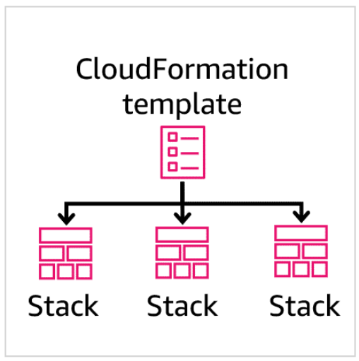

A *CloudFormation* stack is a collection of AWS resources that you can manage as a single unit. With stacks, you can create, update, or delete a collection of resources by creating, updating, or deleting stacks. All the resources in a stack are defined by the stack's CloudFormation template.

Because CloudFormation treats the resources in a stack as a single unit, each individual resource must be created or deleted successfully for the stack to be created or deleted.

If an individual stack resource can't be created, CloudFormation rolls back the stack and automatically deletes any resources that were created. If a resource can't be deleted, any remaining resources are retained until the stack can be successfully deleted.

Stacks can be combined into templates that deploy each layer of the application. The following diagram shows how you can use a template to deploy three separate stacks. The first stack configures the network services for the application, the second configures the serverless data stores, and the third configures the serverless application's AWS Lambda resources.

Sequence to create templates, store templates in S3, create stacks from templates, and use stacks to deploy resources.

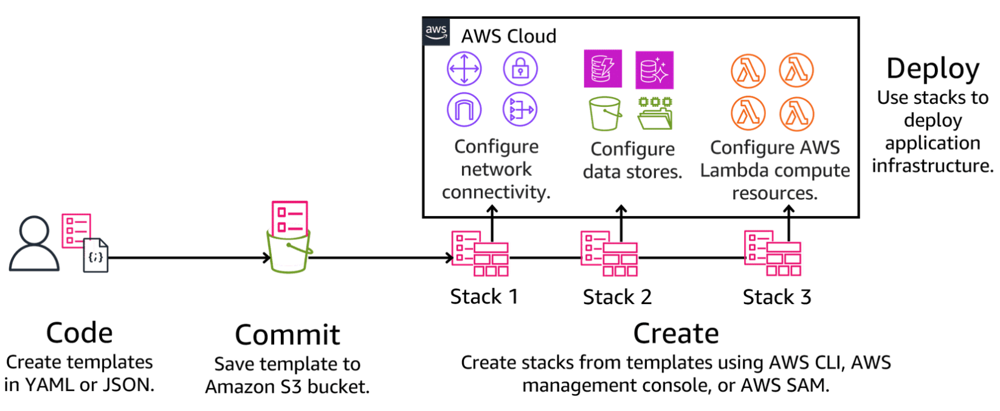

### Benefits of CloudFormation

Using CloudFormation templates and stacks to implement IaC addresses many of the risks associated with traditional, semi-manual processes for infrastructure management. These risks are summarized as follows:

* **Consistency**: Manual changes are prone to variations and errors, particularly when more than one person makes changes across multiple systems over an extended period of time. It is also difficult to consistently apply changes across tiers and environments whenever patches, upgrades, or modifications are applied to one or more infrastructure components. CloudFormation provides a consistent way to deploy resources.
* **Deployment speed**: Manually building and configuring an application environment is a time-consuming process that often involves a series of individual, serial tasks. CloudFormation provides a way to quickly deploy resources, often in parallel.
* **Scalability**: Manual processes do not support repeatability at scale. More and more time is required to maintain and manage the application as the environment grows and becomes more complex. CloudFormation consistently deploys resources at any scale.
* **Change sets**: Manual change techniques lack the CloudFormation capability of comparing an existing stack to a desired stack, and then creating a change set for delivering the new configuration.
* **Audit trail**: Many application environments must meet governmental or industry compliance requirements. For these applications, it is important to know who made changes to applications, and when and why they made those changes. Manual changes often lack sufficient documentation to meet these requirements. Changes to CloudFormation templates can be audited using a code repository.

### CloudFormation use cases

In addition to the benefits listed previously, CloudFormation is useful when your requirements call for tight controls over application infrastructure changes. It is also useful when adoption of a DevOps operating model is desired as part of an serverless application deployment environment.

#### Immutable infrastructure model

CloudFormation can help when tight controls over application infrastructure changes in production environments are desired due to compliance requirements or internal policies. You can use CloudFormation and IaC to implement immutable infrastructure practices into your application deployments.

*Immutable* describes something that cannot be changed. *Immutable infrastructure* is a deployment model that mandates that no updates, security patches, or configuration changes happen in place in production environments. Instead, when a change is needed, a new set of updated infrastructure resources containing all the necessary changes are deployed in parallel alongside your existing resources. Then, this deployment is validated, and if successful, application users are shifted to the new set of resources and the old environment is eventually removed from service.

The immutable infrastructure approach provides increased consistency across application environments and reduces configuration drift over time. Because the original application environment remains available, this approach also delivers all-or-nothing deployments that can be quickly recovered if errors occur.

#### DevOps operating model

By adopting a DevOps operating model, you can evolve and improve your applications at a faster pace than traditional software development and infrastructure management techniques. Adopting a microservices application architecture model is one of the key practices that is important when implementing DevOps. Another is adoption of continuous integration and continuous delivery (CI/CD) deployment models, which reduce operational challenges associated with frequent application code changes.

By using CloudFormation and IaC, you can include the deployment of the application infrastructure in the overall CI/CD pipeline as part of the DevOps development cycle. You can also use the DevOps repository tools to add versioning, and check in and check out controls to your CloudFormation templates. DevOps automated testing tools can also be used to check the validity of CloudFormation templates when changes are made.

## Creating and Managing CloudFormation Templates

### Creating templates

There are multiple ways you can create CloudFormation templates, including using a text editor, building templates using the AWS CloudFormation Designer, and working from examples pulled from template repositories.

#### Text editor

Because CloudFormation templates are stored as a text files, they can be created and edited using any text editor. The template text file must follow the proper YAML or JSON formatting rules, and must include the required CloudFormation keywords and components. Additionally, each service declaration must include any required elements for that service, along with any optional items needed to deliver the required deployment configuration.

#### AWS CloudFormation Designer

The AWS Management Console provides a graphical interface called the AWS CloudFormation Designer that you can use to create or view the contents of CloudFormation templates. This tool also provides a drag-and-drop interface for authoring templates that can be saved in either JSON or YAML formats. With Designer, you can see graphic representations of the resources in a template. This streamlines template creation and editing. You can also use Designer to convert a valid JSON formatted template to YAML, or convert a YAML formatted template to JSON.

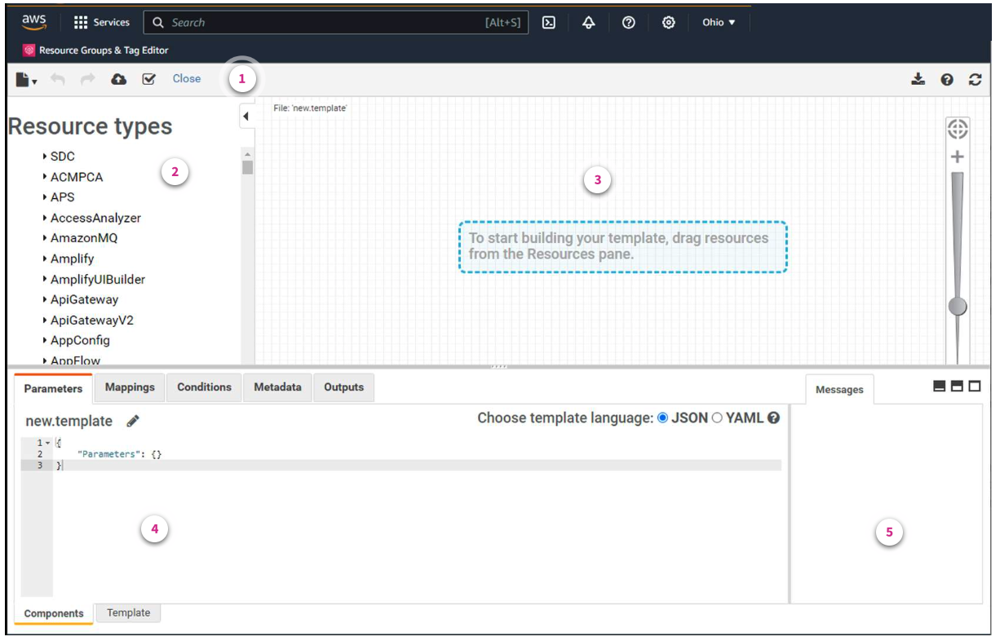

1. **Toolbar**. The toolbar provides quick access to commands for common actions, such as opening and saving templates, undoing or redoing changes, creating a stack, and validating a template. The toolbar has options for you to download diagrams as an image, get help, or refresh the diagram in the canvas pane.
2. **Resource types pane**. The Resource types pane lists all the template resources that you can add to your template, categorized by their AWS service names. Resources are added by dragging them from the Resource types pane to the canvas pane.
3. **Canvas pane**. The canvas pane displays your template resources as a diagram. You can use this pane to add or remove resources, create relationships between resources, and arrange their layout. The changes made in the canvas automatically modify the template's JSON or YAML code.
4. **JSON and YAML editor pane**. In the integrated editor, you can specify the details of your template, such as resource properties or template parameters. When you select an item in the canvas, Designer highlights the related JSON or YAML code in the editor.
5. **Messages pane**. When you convert a template from JSON to YAML, or YAML to JSON, the Messages pane displays a success or failure message. This pane also displays any validation errors when a nonvalid template is opened, validated, or used to attempt to create a stack.

#### AWS Labs repository

AWS Labs operates a repository of curated sample CloudFormation templates on GitHub. GitHub is a publicly accessible code repository platform that gives you the ability to collaborate on code while also enforcing version control as templates change over time.

The sample templates stored in the AWS Labs GitHub repository are useful for learning how to declare specific AWS resources or solve a particular use case. AWS recommends that you use these sample templates as a starting point for creating your own templates. You should also review the resources that a template will create and the permissions it requires, before launching the template.

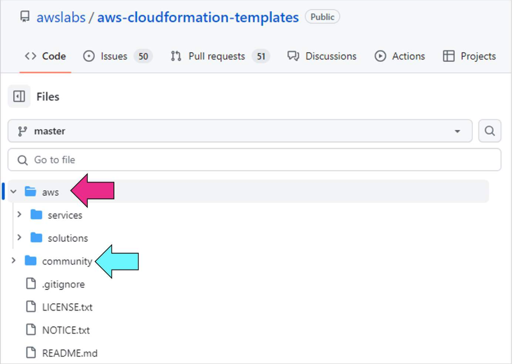

The templates that the CloudFormation team and its approved contributors provide and maintain are located in the aws folder in the AWS Labs GitHub repository.

Templates developed by the GitHub community are also available, and are located in the community folder. Community-based templates are not tested, maintained, or supported by AWS Labs, so you should examine these templates carefully before using them.

These AWS and community folders are shown in this image of the AWS Labs home page.

#### AWS Solutions Library

Another source for CloudFormation templates is the AWS Solutions Library. The *AWS Solutions Library* offers vetted solutions and guidance for implementing AWS Cloud deployments for specific use cases.

The library features solutions built by AWS and AWS Partners for a broad range of industries and technologies. Many of these libraries include CloudFormation templates to assist with the deployment of the environment. These templates can also be useful blueprints for creating new custom CloudFormation templates for similar environments.

#### Additional resources

* [What is CloudFormation Designer?](https://docs.aws.amazon.com/AWSCloudFormation/latest/UserGuide/working-with-templates-cfn-designer.html)
* [AWS CloudFormation Templates](https://github.com/awslabs/aws-cloudformation-templates)
* [AWS Solutions Library](https://aws.amazon.com/solutions/?awsm.page-featured-solutions-homepage=2)

### Managing CloudFormation templates

CloudFormation templates should be properly managed to prevent their potential loss or unauthorized modification, and for change management. Because CloudFormation facilitates implementation of IaC, management of each CloudFormation template should be given the same consideration as the application code itself. This means that the templates should be placed into a source control system and managed in the same way as the application source code. Two options for managing CloudFormation templates are described in the following sections.

#### Using Amazon S3 to manage templates

One option for storing CloudFormation templates is Amazon Simple Storage Service (Amazon S3) buckets.

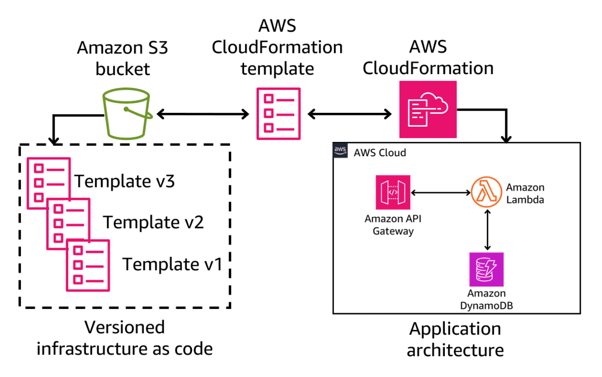

* **Security**: You can use AWS bucket policies to control access to templates.
* **Version control**: Amazon S3 versioning can be enabled, so you can preserve, retrieve, and restore any version of every template stored in the bucket.
* **Durability and availability**: Amazon S3 automatically provides redundant storage on multiple devices within an AWS Region, providing 99.999999999 percent data durability and 99.99 percent data availability.

#### Using a repository to manage templates

Another way to manage CloudFormation templates is to use the same source control systems that you use to store your application code. Most development teams use a central code repository with check-in and check-out capabilities, in addition to the security and versioning features mentioned previously.

Git is one example of an open-source code repository platform that has gained wide acceptance and high adoption rates by development teams. Because of Git's popularity, CloudFormation supports Git sync. ***Git sync*** is a feature that you can use to synchronize your stacks using a CloudFormation template stored in a remote Git repository.

By configuring CloudFormation to monitor a Git repository, you can leverage the power of source control for your infrastructure as code. The system watches for changes in two critical files:

* A CloudFormation template file that defines the stack's structure
* A stack deployment file containing parameters for stack configuration

This integration allows you to utilize pull requests and version tracking to configure, deploy, and update CloudFormation stacks from a central location. When changes are committed to either the template or the deployment file, CloudFormation automatically initiates stack updates.

## Working with CloudFormation Templates

### Using templates from the AWS Management Console

After you create a template, it must be run so the directives contained in the template are performed, and the requested AWS services and desired configurations are deployed. Over time, templates might also need to be modified or deleted. The following sections show you how to perform these tasks using the console.

#### Loading and running a template using the console

You can load an existing template into the console by providing the location and name of the template to be loaded. The following screenshot shows the Stacks portion of the AWS CloudFormation section of the AWS Management Console, where these steps are performed.

A stack can be created using either new resources (standard option), or by using existing resources (import resources option). The following image shows these two options presented after choosing **Create stack**.

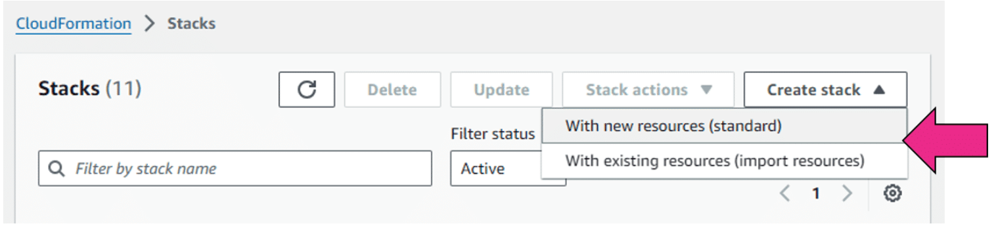

Choosing **With new resources (standard)** opens the **Create stack** page on the console.

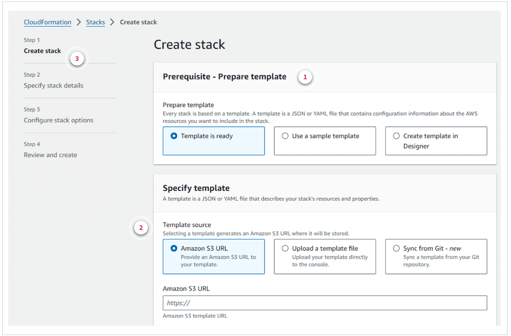

1. **Prerequisite section**. If a template already exists, select the **Template is ready** option in the **Prerequisite section** of the **Create stack** process to begin the stack creation process.
2. **Template location**. In the **Specify template** portion of the **Create stack** process, the location of the template text file is provided. If the template is stored in a local or shared file system, choose **Upload a template file**.
3. **Subsequent steps**. After the template location is specified, the stack details, including any required input parameters, are supplied in Step 2. In Step 3, options such as which actions to take if provisioning fails are specified. In Step 4, a final review of the template can be performed before running it.

#### Modifying a template using the console

Similarly, the CloudFormation section of the console can also be used to modify templates as needed.

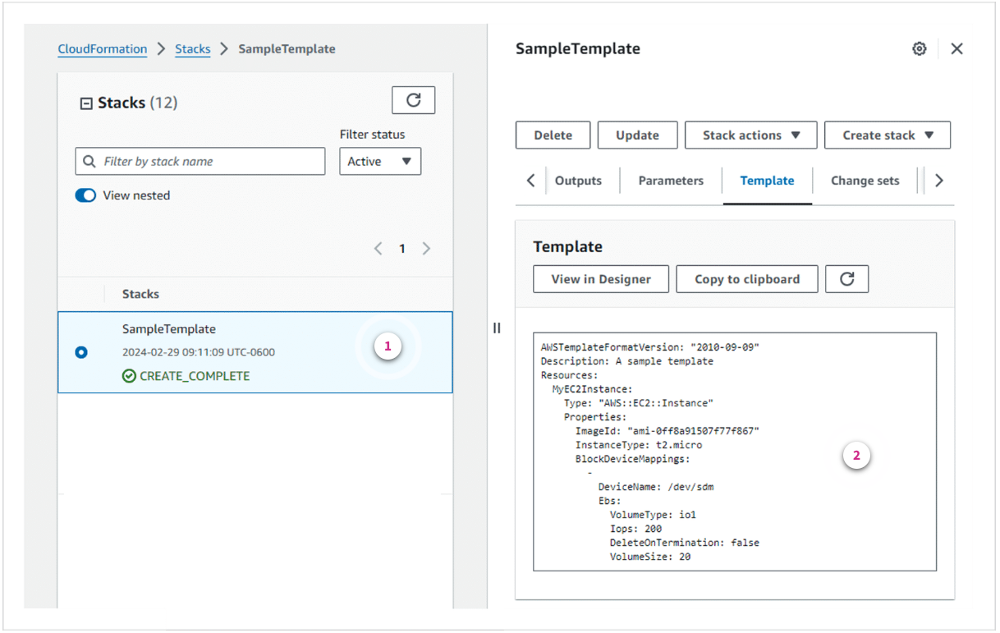

1. **Select a template**. On the **Template** tab of the **Stack details** section, the source code for the selected template is displayed.
2. **Edit the source code**. The template source code can be edited by using Designer, or it can be copied to a clipboard and edited using a text editor.

#### Deleting a template using the console

CloudFormation templates that are no longer needed can also be deleted by using the console.

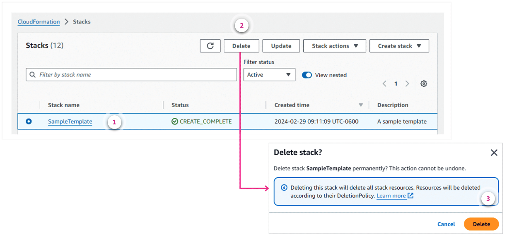

1. **Select a template**. Select the template to be deleted from the **Stacks** list.
2. **Delete the template**. Choose **Delete** to initiate the template deletion process.
3. **Confirm delete**. Choose **Delete** to confirm the deletion of the template when prompted.

### Using templates from the AWS CLI

In addition to the console, the AWS CLI can also be used to load, run, validate, and delete CloudFormation templates.

#### Loading and running a template using the AWS CLI

Loading an existing template into CloudFormation and running it from the command line is performed using the **aws cloudformation create-stack** command. The CLI command shown in the following screenshot begins with the **aws cloudformation create-stack** CLI command and the following two command line options:

* **--stack-name**: This option defines the name of the stack that the template will create.
* **--template-body**: This option is the full path to the location of the CloudFormation template file. In this example, the file is called **SampleTemplate.yml**, and is located on the workstation's local file system in a directory called **CFNtemplates**.

```sh
aws cloudformation create-stack --stack-name SampleTemplate --template-body file:///CFNtemplates/SampleTemplate.yml
{
    "StackId": "arn:aws:cloudformation:us-west-2:XXXXXXXXXXXX:stack/SampleTemplate/11ff6d30-bc72-11ee-a2cf-XXXXXXXXXXXX"
}
```

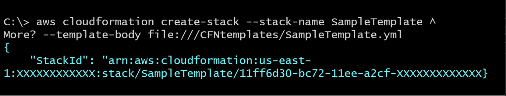

The **caret symbols** (^) shown at the end of each line in the AWS CLI example are optional continuation characters. These symbols allow a long AWS CLI command to be spread across multiple lines for better readability. Microsoft Windows responds with a new line and the **More?** prompt each time a continuation character is used. The backslash (\) is the continuation character for Linux.

#### Validating a template using the AWS CLI

There are no command line options for modifying CloudFormation templates. CloudFormation template changes are best done using a text editor or the console. However, the AWS CLI **cloudformation validate-template** option can be used to verify that a modified template has been formatted correctly.

The following example uses the validate-template option to check the template file specified by the **--template-body** parameter for proper syntax and formatting. If the template is formatted correctly, the output from the validate-template command will consist of two parts. The first is a list of any parameters that are required when running this template. The empty brackets ([ ]) in this example indicate that no parameters are required for this template. The second item in the output is the description of the template, which is taken from the template code itself. The lack of any error messages in the output indicates that this template is formatted correctly.

```sh
aws cloudformation validate-template --template-body file:///CFNtemplates/SampleTemplate.yml
{
    "Parameters": [],
    "Description": "A sample template"
}
```

#### Listing template resources using the AWS CLI

Another useful command line option when working with CloudFormation is the ability to return descriptions of all of the resources in a specified stack. The following example uses the **list-stack-resources** option of the **aws cloudformation** AWS CLI command to display the AWS resources in a stack called **SampleTemplate**. In this example, it is an instance called **MyEC2Instance**. The output returned by the command shows the date when the stack was last updated. It also shows whether the stack has been checked against the actual resources for any configuration drift.

```sh
aws cloudformation list-stack-resources --stack-name SampleTemplate
{
    "StackResourceSummaries": [
        {
            "LogicalResourceId": "MyEC2Instance",
            "PhysicalResourceId": "i-0e88e98XXXXXXXXX",
            "ResourceType": "AWS::EC2::Instance",
            "LastUpdatedTimestamp": "2025-02-15T10:20:30.71100+00:00",
            "ResourceStatus": "CREATE_COMPLETE",
            "DriftInformation": {
                "StackResourceDriftStatus": "NOT_CHECKED"
            }
        }
    ]
}
```

#### Deleting a stack using the AWS CLI

The final example uses the **delete-stack** option of the **aws cloudformation** CLI command to delete the stack specified by the **--stack-name** parameter. There is no output returned by this command to confirm its successful operation. However, if the delete operation is unsuccessful, an error will be displayed.

```sh
aws cloudformation delete-stack --stack-name SampleTemplate
```

#### Additional resources

* [Using the AWS CloudFormation Console](https://docs.aws.amazon.com/AWSCloudFormation/latest/UserGuide/cfn-using-console.html)
* [Using the AWS Command Line Interface](https://docs.aws.amazon.com/AWSCloudFormation/latest/UserGuide/cfn-using-cli.html)

### Knowledge Check

#### A DevOps engineer has decided to use an Infrastructure as Code (IaC) approach to deploying application resources in the AWS Cloud. The engineer has decided to use AWS CloudFormation templates for their IaC deployments. Which formats can the engineer choose from when creating their CloudFormation templates? (Select TWO.)

* JSON
* YAML

Wrong answers:

* JavaScript
* Python
* Go

##### Explanation

AWS CloudFormation templates can be formatted as either JSON or YAML.

The other options are incorrect for the following reason:

* JavaScript, Python, and Go cannot be used directly in CloudFormation templates.

#### A cloud engineer is reviewing an AWS CloudFormation template that was used to deploy application resources. The template contains no commas, curly braces, or brackets. Instead, the template uses spaces and indenting to format the code. Which formatting style is the template using?

* YAML

Wrong answers:

* JSON
* Java
* Go

##### Explanation

YAML formatted AWS CloudFormation templates use spaces and indenting to format the code.

The other options are incorrect for the following reasons:

* JSON is characterized by commas, curly braces, and brackets, rather than spaces and indenting, for formatting.
* Java and Go are not valid options for CloudFormation templates.

#### Which term describes the AWS CloudFormation capability of comparing an existing CloudFormation stack to a desired CloudFormation stack, and identifying the configuration differences between the two stacks?

* Change sets

Wrong answers:

* Change control
* DevOps
* Immutable infrastructure

##### Explanation

Change sets refers to the CloudFormation capability of comparing an existing stack to a desired stack, and then creating a change set for delivering the new configuration.

The other options are incorrect for the following reasons:

* Change control is a more generic term that typically references how change is managed in projects.
* DevOps is a broader practice and philosophy that combines software development and IT infrastructure management processes.
* Immutable infrastructure refers to the practice of deploying changes by replacing a completely new set of resources, instead of modifying existing ones.

#### The schedule for a new application development project is very aggressive. Where can the development team look for sample AWS CloudFormation templates that might help speed up development of their own templates for their project? (Select TWO.)

* AWS Labs Repository
* AWS Solutions Library

Wrong answers:

* AWS Marketplace
* AWS CloudFormation registry
* AWS Management Console

##### Explanation

Samples of ready-to-run CloudFormation templates are available in the AWS Labs Repository and AWS Solutions Library.

The other options are incorrect for the following reasons:

* AWS Marketplace is a platform for third-party software and solutions that can run on AWS. Although some solutions are available as CloudFormation templates, they tend to be part of larger, more commercial solutions that are not as customizable and not free to use.
* AWS CloudFormation Registry is a centralized hub for managing extensions that can be integrated into CloudFormation templates in an AWS account. It does not provide samples of ready-to-run CloudFormation templates.
* The AWS Management Console does not directly provide sample CloudFormation templates.

#### A developer needs to delete the CloudFormation stack for a retired application from their AWS account. How can the developer perform this task? (Select TWO.)

* Use the Stacks section of the CloudFormation dashboard in the AWS Management Console
* Use the AWS Command Line Interface (AWS CLI) **aws cloudformation delete-stack** command with the **--stack-name** option

Wrong answers:

* Use the Systems Manager section of the AWS Management Console
* Use the AWS Command Line Interface (AWS CLI) **aws cloudformation --delete-stack** command with the **stack-name** option
* Use the AWS Command Line Interface (AWS CLI) **aws delete-stack** command with the **--stack-name** option

##### Explanation

The **delete-stack** subcommand of the **aws cloudformation** AWS CLI command is used to delete the stack specified by the **--stack-name** option. The CloudFormation section of the AWS Management Console can also be used to delete a stack.

The other options are incorrect for the following reasons:

* A stack cannot be directly deleted from the Systems Manager section of the AWS Management Console.
* The stack name option must be specified as **--stack-name**, not **stack-name**.
* The command **aws delete-stack** is not a valid AWS CLI command for CloudFormation. It is missing the **cloudformation** subcommand.

### Summary

* CloudFormation templates can be used to define IaC for serverless applications.
* CloudFormation templates can be created in either YAML or JSON format.
* CloudFormation stacks contain all the resources that the corresponding templates specify, managed as a single unit.
* CloudFormation templates can be created from scratch using a text editor or the AWS CloudFormation Designer tool in the console. Pre-built CloudFormation templates can also be pulled from template repositories and modified as needed.
* CloudFormation stacks can be created and managed using the console or the AWS CLI.

## Working with AWS CDK

### Pre-assessment

#### Which AWS Cloud Development Kit (AWS CDK) construct type is designed for use in building a specific architecture, helping you complete common tasks that involve multiple kinds of AWS resources?

* Layer 3 (L3) constructs

Wrong answers:

* Custom constructs
* Layer 1 (L1) constructs
* Layer 2 (L2) constructs

##### Explanation

Layer 3 constructs are also called patterns. Patterns are designed to help complete common tasks that involve multiple kinds of AWS resources, designed to meet the needs of a specific architecture or situation.

The other options are incorrect for the following reasons:

* Developers can create and distribute their own constructs, but custom constructs are not a construct type directly provided by the AWS CDK.
* L1 constructs are the most basic construct and require manual configuration. They correspond to a single AWS CloudFormation resource, and do not involve multiple AWS resources.
* L2 constructs provide some more default configurations but still correspond to a single AWS CloudFormation resource.

#### The AWS Cloud Development Kit (AWS CDK) Library includes the AWS Construct Library, which is a collection of constructs consisting of pre-written, modular, reusable pieces of code. What can these constructs be used for?

* Can be combined into AWS CDK stacks, which can be used to deploy resources using CloudFormation.

Wrong answers:

* Can be saved in the AWS Marketplace for reuse by other applications.
* Can be saved in the AWS Solutions Library for reuse by other applications.
* Can be combined into AWS CloudFormation stacks, which can be used to deploy resources using AWS CDK.

##### Explanation

Constructs from the AWS Construct Library can be combined into AWS CDK stacks, and then into an app, which can be deployed to CloudFormation to provision or update resources. Using items from the AWS CDK Construct Library reduces the complexity required to define and integrate AWS services together when building applications on AWS.

The other options are incorrect for the following reason:

* AWS Marketplace is a digital catalog for third-party software that can be used on AWS. AWS CDK constructs cannot be directly saved in the AWS Marketplace for reuse by other applications.
* The AWS Solutions Library provides solutions and guidance for different business and technical use cases, developed by AWS and AWS Partners. AWS CDK constructs cannot be directly saved in the AWS Solutions Library for reuse by other applications.
* AWS CDK constructs cannot be directly used in CloudFormation stacks. Rather, AWS CDK constructs are used to define resources that are ultimately translated to and deployed through CloudFormation.

#### Prior to installing the AWS Cloud Development Kit (AWS CDK) Toolkit, several prerequisite components must be installed. Which prerequisite component provides the AWS CDK Toolkit with programmatic command line access to AWS resources in an AWS account?

* AWS Command Line Interface (AWS CLI)

Wrong answers:

* AWS Identity and Access Management (IAM)
* Node.js
* Integrated development environment (IDE)

##### Explanation

The AWS CLI is an open-source tool that interacts with AWS services using commands in the operating system's command-line shell. The AWS CDK requires the AWS CLI for activities such as configuring access credentials.

The other options are incorrect for the following reasons:

* IAM is a service that enables secure access to AWS resources by managing users, groups, roles, and their permissions, but IAM itself is not a command line tool.
* Node.js is a server-side programming language and must be installed in an environment to use AWS CDK Toolkit. However, Node.js does not provide command line access to AWS resources.
* An IDE is an essential tool for application development, but an IDE is not a command line tool for accessing AWS resources.

#### Which AWS Cloud Development Kit (AWS CDK) command is used to generate an AWS CloudFormation template for one or more stacks defined within an app?

* cdk synth

Wrong answers:

* cdk list
* cdk import
* cdk destroy

##### Explanation

The **cdk synth** command will create output files consisting of JSON-formatted CloudFormation templates for the app's infrastructure as code (IaC) and other supporting files.

The other options are incorrect for the following reasons:

* The **cdk list** command is used to list all AWS CDK stacks and their dependencies from a CDK app.
* The **cdk import** command is used to import existing AWS resources into a CDK stack.
* The **cdk destroy** command is used to delete one or more AWS CDK stacks from your AWS environment.

#### What are the recommended best practices when adopting AWS Cloud Development Kit (AWS CDK) for application development in AWS? (Select TWO.)

* Choose one of the six languages supported by AWS CDK, and establish standard coding practices and policies
* Store infrastructure and application runtime code together in a single repository or package

Wrong answers:

* Adopt a single stack app development model
* Adopt a multi-stack app development model
* Store all AWS CDK applications in a single repository

##### Explanation

The AWS CDK supports TypeScript, JavaScript, Python, Java, C#, and Go. You can use any of these languages to define constructs — which are reusable cloud components. It is also recommended to combine code that defines infrastructure and code that implements runtime logic into a single construct.

The other options are incorrect for the following reasons:

* Single-stack and multi-stack apps provide different benefits. One approach is not recommended over the other; the choice should be made based on the requirements of the specific application.
* AWS recommends storing one AWS CDK application per repository, rather than storing all applications in the same repository.

## AWS Cloud Development Kit

The AWS CDK is an open-source software development framework for creating applications and defining application cloud IaC.

### AWS CDK concepts

AWS CDK is an abstraction layer that hides the details of maintaining the Amazon CloudFormation templates that govern the process of managing AWS resources for a serverless application. Like CloudFormation, AWS CDK also uses the term *stack* to refer to a collection of application resources.

The AWS CDK supports TypeScript, JavaScript, Python, Java, C#, and Go. You can use any of these languages to define reusable cloud components, known as *constructs*. A *construct* is the basic building block of an AWS CDK application, or *app*. Constructs represent AWS resources at three levels of complexity, or layers. Each of these layers are described here:

* **Layer 1**: Layer 1 constructs are very basic and must be manually configured. These constructs use the prefix Cfn, and they correspond directly to a single CloudFormation resource. AWS recommends avoiding the use of Layer 1 constructs unless there is no other higher-level construct available for your required action.
* **Layer 2**: Layer 2 constructs come with commonly used, pre-configured code and default values. These constructs require less detail to implement than those in Layer 1.
* **Layer 3**: Layer 3 constructs are also called patterns. Patterns are designed to help you complete common tasks that involve multiple kinds of AWS resources, designed to meet the needs in a specific situation.

As a developer working in AWS CDK, you will typically interact with the highest two construct levels. The following image shows the relationship between an AWS CDK app, stack, and construct for a typical application in the AWS Cloud.

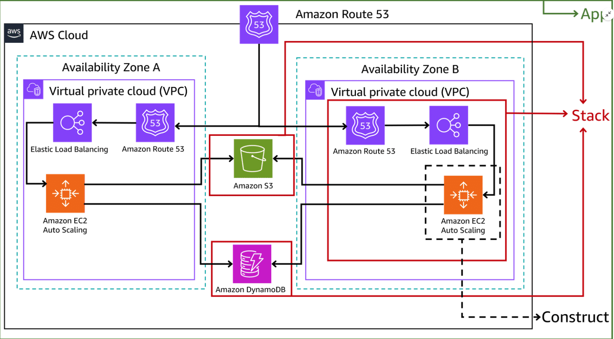

The sample architecture diagram shows an application that uses Amazon Route 53, Elastic Load Balancing (ELB), Amazon EC2 Auto Scaling, an Amazon S3 bucket, and an Amazon DynamoDB database. This application architecture is deployed to two different Availability Zones.

* The green outermost box around the entire diagram represents the AWS CDK app.
* The red solid line box around the Amazon Route 53, Elastic Load Balancing (ELB), Amazon S3, and Amazon EC2 Auto Scaling resources represents the AWS CDK stack. This is a group of app resources that are deployed together as a unit. Similarly, the Amazon S3 bucket and Amazon DynamoDB database also comprise a AWS CDK stack, but each stack only consists of a single resource.
* The innermost, black-dashed box around the Amazon EC2 Auto Scaling resource represents an AWS CDK construct, which is a basic building block of the app.

### Benefits of AWS CDK

Adopting the AWS CDK for the development and deployment of applications in the AWS Cloud provides a number of benefits. These include the ability to use the AWS Construct Library as a development resource, and the ability to use a common language for both application and IaC code.

#### AWS Construct Library

One benefit of using AWS CDK is the availability of the AWS Construct Library. The *AWS Construct Library* is a collection of constructs consisting of pre-written, modular, reusable pieces of code.

These constructs can be combined into AWS CDK stacks, and then into an app, which you can deploy to CloudFormation to provision or update your resources. Using items from the AWS Construct Library reduces the complexity required to define and integrate AWS services together when building applications on AWS.

The following code is an example taken from the AWS Construct Library. This code uses programming concepts to create infrastructure. Specifically, it creates an Amazon Elastic Container Service (Amazon ECS) service with an AWS Fargate launch type using Python. The code creates an Amazon Virtual Private Cloud (Amazon VPC) construct instance called **vpc**. Then, the code passes the Amazon VPC details as a parameter when creating the Amazon ECS cluster. The AWS CDK facilitates the use of the vpc parameter in this manner. You might find this approach to be more familiar than using a CloudFormation reference. This technique would need to be used to pass the Amazon VPC details if a standard CloudFormation template was being used, instead of this construct.

##### Python AWS Construct Library to deploy Amazon ECS with an AWS Fargate launch type

```python
class MyEcsConstructStack(Stack):

    def __init(self, scope: Construct, id: str, **kwargs) -> None:
        super().__init__(scope, id, **kwargs)

        vpc = ec2.Vpc(self, "MyVpc", max_azs=3)     # default is all AZs in region

        cluster = ecs.Cluster(self, "MyCluster", vpc=vpc)

        ecs_patterns.ApplicationLoadBalancedFargateService(self, "MyFargateService",
            cluster=cluster,            # Required
            cpu=512,                    # Default is 256
            desired_count=6,            # Default is 1
            task_image_options=ecs_patterns.ApplicationLoadBalancedTaskImageOptions(
                image=ics.ContainerImage.from_registry("amazon/amazon-ecs-sample")
            ),
            memory_limit_mib=2048,      # Default is 512
            public_load_balancer=True   # Default is False
        )
```

The AWS CDK code used to define the MyEcsConstructStack class in this example consists of 18 lines. This code will produce over 500 lines of AWS CloudFormation commands required to provision these resources in AWS. When deployed, this app uses the CloudFormation commands to create more than 50 AWS resources. These resources include VPCs, security groups, subnets, ELB, internet and NAT gateways, route tables, and more.

#### Early detection of IaC errors

When defining IaC using typed languages like those supported by AWS CDK, you are more likely to catch IaC coding errors early in the development process. Specifically, the AWS CDK compiler will identify any IaC errors in your transformation templates before the code is sent to CloudFormation for processing. If you were using templates to go directly to Cloudformation without the AWS CDK, any IaC errors in the template are not identified until the stack build process begins.

#### Common application and IaC code

Another benefit to the AWS CDK is that it provides an internal, object-oriented abstraction library to declare services imperatively. It provisions architecture using languages you already know, so you can write both IaC and application runtime code using the same language. This helps speed up application development time by not requiring you to learn a new language for IaC development. With AWS CDK, you can also write imperative code to generate declarative CloudFormation stack templates. You can choose your preferred IDE and favorite language's programming elements like parameters, conditionals, loops, composition, and inheritance to define the desired outcome of your infrastructure.

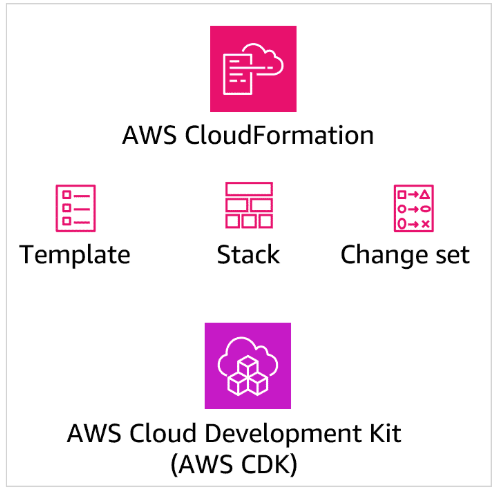

#### Additional resources

* [Official AWS CDK GitHub Repository](https://github.com/aws/aws-cdk)
* [Construct Hub AWS CDK Library](https://constructs.dev/search?cdk=aws-cdk&amp;sort=downloadsDesc&amp;offset=0)
* [Library of AWS CDK examples](https://cdkpatterns.com/patterns/)
* [AWS Constructs Library](https://docs.aws.amazon.com/cdk/v2/guide/constructs.html)

### AWS CDK use cases

In addition to the benefits listed previously, AWS CDK can help meet your needs for rapid application development. It can also facilitate the use of other popular development kits for cloud-based tools.

#### Rapid application development model

The faster you add new and innovative functionality to your applications, the faster the users of your application will gain the benefits of those enhancements. The AWS CDK supports this focus on rapid innovation by providing the AWS Construct Library. These libraries offer scalable, secure, and well-architected deployment patterns for common application infrastructure patterns. They also reduce the time you spend developing IaC, so you can focus on application innovation, instead. Additionally, the integration of the AWS CDK with public code repositories means that you have access to application code samples. You can use these code samples to modify and integrate into your own AWS CDK apps.

#### Extension of Construct Programming Model

The Construct Programming Model (CPM) concepts used by AWS CDK for app development can also be applied to third-party tools and platforms. For example, the Terraform Community Edition is a popular IaC tool for deploying cloud-based applications. Like CloudFormation, Terraform uses high-level syntax to define application services in the AWS Cloud. After you are familiar with the CPM approach, creating IaC using the CDK for Terraform (CDKTF) will feel very familiar. The resulting Terraform code can be used to build, change, or remove the AWS services used for an application's cloud infrastructure. Likewise, the AWS CDK for Kubernetes (cdk8s) also provides a familiar CPM-based coding model. This coding model can be used for defining, deploying, and managing container-based applications in the AWS Cloud.

### Additional resources

* [CDK for Terraform](https://developer.hashicorp.com/terraform/cdktf)
* [Cloud Development Kit for Kubernetes](https://cdk8s.io/)

## Creating and Managing Apps using AWS CDK Toolkit

The AWS CDK Toolkit is a command line tool used to create, manage, and deploy your AWS CDK apps. The AWS CDK Toolkit generates the CloudFormation templates needed to deploy your apps. It provides code comparison, deletion, and troubleshooting capabilities, and integration with popular code repositories and integrated development environments.

### Installing AWS CDK Toolkit

The AWS CDK Toolkit has to be downloaded and installed on your local workstation. Some additional prerequisite software might also be required if you have not already installed those items. You will need to complete the following steps before using the AWS CDK Toolkit to create, manage, and deploy code:

* To access an AWS account using the AWS CDK Toolkit, you will need authentication for programmatic access to the AWS account.
* Download, install, and configure the AWS CLI software. The *AWS CLI* is an open-source tool that gives you the ability to interact with AWS services using commands in your command-line shell. The AWS CDK requires the AWS CLI for activities such as configuring the credentials described previously.
* Download, install, and configure the Node.js software. Node.js is always required to use AWS CDK.
* Download, install, and configure the client software for your preferred programming language (TypeScript, JavaScript, Python, Java, C#, or Go). Your chosen programming language might also have its own additional prerequisites required to build an app using AWS CDK.
* Download, install, and configure an Integrated Development Environment (IDE) for your preferred programming language. Most popular IDEs provide excellent integration with the AWS CDK.
* Download, install, and configure the AWS CDK software. The command **cdk --version** can be run from the operating system command line to confirm a successful installation of AWS CDK. After it's configured, the AWS CDK will use the AWS CLI and the programmatic access to the AWS account to interact with the AWS Cloud.
* Deploying stacks with the AWS CDK requires dedicated Amazon S3 buckets and other containers to be available to AWS CloudFormation during deployment. Use the **cdk bootstrap** command to create these Amazon S3 buckets.

#### Additional resources

* [Creating IAM Users (AWS CLI)](https://docs.aws.amazon.com/IAM/latest/UserGuide/id_users_create.html#id_users_create_cliwpsapi)
* [Install and configure AWS CDK](https://docs.aws.amazon.com/cdk/v2/guide/getting_started.html#getting_started_install)

### Creating an app with the AWS CDK Toolkit

The most common way to create app code is using the AWS CDK and AWS CDK Toolkit in conjunction with an IDE tool. AWS CDK integrations are available for many popular IDEs, so you can access AWS CDK capabilities from within your preferred IDE.

However, an IDE is not required to create an application using AWS CDK. The following steps outline the typical workflow used to create a new AWS CDK app on a Windows workstation using the AWS CDK:

* **Create app directory**: On your local workstation, use an operating system command to create a directory for storing the files that will support your new app. In Windows you can use either the **mkdir** command, or Windows File Explorer to create this directory.
* **Initialize the app**: At the operating system prompt, navigate to the new app directory and use the **cdk init** command with the **--language** operator to initialize the project for the app. You should include the language you will be using to develop the app as an argument following the **--language** operator. This operation creates an extensive sub-directory structure within the project directory, and populates this structure with a set of initial configuration files for your new app.
* **Setup Python environment**: If your chosen coding language is Python, you will need to complete two additional steps before you can begin developing your app. First, you need to source the **.venv/bin/activate** file to establish a virtual environment into which an additional Python package can be installed. Second, you will need to run the Python installer using the **pip install -r requirements.txt** command to download and install the additional Python packages and libraries needed for the AWS CDK.

After completing the preceding steps, you have a directory structure for your new app that contains empty project files. The coding language you specified during the initialization process will determine the project files that serve as the main entry point for the application. The chosen coding language also determines the file that defines the service stack for the new app.

Next, you can begin development on your AWS CDK app. Typically this is done by pulling sample code that has similar app functionality from an available construct library.

You can then use a text editor or IDE to modify or add additional capabilities to the sample app code to meet your specific app requirements.

After completing your changes, building or compiling the code to check for errors isn't necessary. The AWS CDK Command Line Interface (AWS CDK CLI) will automatically perform this step during the deploy process.

Lastly, you deploy the application using the **cdk deploy** command or established integrations with your CI/CD platform.

During the deploy process, the AWS CDK implicitly runs synthesize, or the **cdk synth** command. This command is used to synthesize the CloudFormation template for one or more specified stacks. If desired, you can run the cdk synth separately, without deploying your app. When you do so, the cdk synth will create a CloudFormation template for each stack in your app. The AWS CDK CLI will display a YAML formatted version of your template at the command line. It will also save a JSON formatted version of your template in the cdk.out subdirectory.

#### Additional resources

* [AWS CDK Workshop](https://cdkworkshop.com/)

## Working with AWS CDK Apps using AWS CDK

AWS CDK provides several commands that you can use to work with app code and app infrastructure after an app has been developed and deployed. These include commands to examine and manage the configuration of the app, document portions of the app, and remove apps that are no longer needed.

### Environment AWS CDK commands

The following AWS CDK commands can be used to examine and manage an app deployed to the AWS Cloud:

* **list**: The **cdk ls** command can be used to list the AWS CDK identifiers for the stacks that comprise an app.
* **difference**: The **cdk diff** command compares the specified stack and its dependencies against the deployed app stacks or a local CloudFormation template. Any differences between the two environments are output to the screen.
* **import**: The **cdk import** command is used to bring resources for a particular AWS CDK stack under the management of CloudFormation. The import command can be useful if you are migrating to AWS CDK from a deployment approach based solely on CloudFormation. It is also useful if you need to move resources between AWS CDK stacks.
* **doctor**: The **cdk doctor** command checks the AWS CDK project environment and produces information useful for troubleshooting potential problems. Specifically, the doctor command checks the operating system environment for the presence of the correct coding language and version. It also checks for the environment variables used to access your AWS account, and any locally configured custom environment variables for the AWS CDK.
* **destroy**: The **cdk destroy** command is used to completely delete a deployed app and all of its infrastructure. After it's started, the destroy command will prompt you to confirm the deletion of the app before proceeding. The destroy command does not remove any of the the local application files from your workstation, so these files can be used to rebuild the application, if needed.

#### AWS CDK context command

Context values are key-value pairs that can be associated with an app, stack, or construct. The toolkit uses context to cache values retrieved from your AWS account during synthesis. Examples of cached context values include the Availability Zones in your account, the AMI IDs currently available for deploying Amazon EC2 instances, and names of your VPCs. The **cdk context** command can be used to view the cached values that will be used during synthesis. Specific context key-value pairs can be provided to your AWS CDK app using any of the following six techniques:

* If no other context value location is specified, the AWS CDK will automatically use the current values from your AWS account.
* The **--context option** can be used to pass a specific key-value pair from the command line, while running the cdk synth or cdk deploy commands.
* Cached context values can also be specified using the **cdk.context.json file**, located in the project directory. This file is where the AWS CDK caches context values retrieved from your AWS account.
* Similarly, the context key section of a **cdk.json file**, placed in the project directory, can also be used to define the context keys for a specific project. This file should also be placed in the project directory.
* Alternatively, if the same context values are to be used across multiple projects, the context key section **~/.cdk.json** file can be used. This file is placed in the parent directory that is above each individual project directory.
* Context values can also be stored in the app itself using the **construct.node.setContext() method** in the app code.

### Informational AWS CDK commands

There are two AWS CDK commands that are informational in nature. These are the metadata, docs, and debug AWS CDK commands.

#### AWS CDK metadata command

The **cdk metadata** command is used to display  any available metadata information about the specified stack. *Metadata* is data about the stack itself. You can think of stack metadata as being similar to comments that you include in your app code. It provides documentation about the stack and its components. For example, CloudFormation metadata includes the version, the location of the template, and the assets deployed by the template.

Including metadata in AWS CDK apps is optional, but if metadata was created as part of the app, the metadata command will display it.

#### AWS CDK documents command

The **cdk docs** command is used to open the CDK API Reference Documentation using your default browser.

#### AWS CDK debug command

If the **--debug option** is used from the cdk command line, additional detailed information is produced during the synth and deploy processes. This information might be helpful for debugging your app.

## AWS CDK Best Practices

The AWS CDK is designed around a model where your entire application is defined as code. This includes both the application business logic and the infrastructure where the application will be deployed. The AWS CDK synthesizes the CloudFormation templates that describe your infrastructure, and the files that contain your runtime code and their supporting files during the deployment process. The best practices in this section should be considered when using AWS CDK to facilitate rapid development and deployment of serverless AWS applications.

### Plan for AWS CDK adoption

If an organization adopts the AWS CDK development tools, they should also adopt the AWS CDK operating model. Doing so will help realize fullest benefits of AWS CDK.

For example, the AWS CDK supports six coding languages: JavaScript, Python, TypeScript, Java, C#, and Go. Adoption of the AWS CDK will include choosing which of these six languages developers will use for the application. Standards and policies related to the selected language should also be established.  Direction might also be needed for where and when testing will be performed within the CI/CD pipeline, and how that testing will be performed.

Application design considerations are another example where standardization is needed. For example, the AWS CDK applications can use either a single stack app or multi-stack app development model. Although both are viable options, the chosen model will impact factors such as app dependencies, versioning, service quotas, updatability, and deployment times. These factors are summarized in the following table.

| Factor | Single stack app | Multi-stack app |
| ------ | ---------------- | --------------- |
| Dependencies | The app will not have any cross-stack dependencies during deployment. | The app might have to check for cross-stack dependencies during deployment. |
| Versioning | The entire stack is always at the same version. | Different stacks can be at different versions. |
| Quotas | CloudFormation quotas are limited to 500 resources per stack.| CloudFormation quotas are limited to 2000 stacks. |
| Updates | Only one stack needs to be updated when implementing changes. | Multiple stacks might require updates when implementing changes. |
| Timings | More time is required to build and deploy when compared to a multi-stack app. | Less time is requires to build and deploy when compared to a single stack app. |

AWS guidance related to single stack apps compared with multi-stack apps recommends keeping as many resources in the same stack as possible. However, consider keeping stateful resources, like databases, in a separate stack from stateless resources.

### Establish coding best practices

After the preferred development language has been selected, coding best practices should be established for the application and IaC development that will follow. The five recommended coding best practices assume that the relationship between a development team and the team's code repositories, packages, applications, and construct libraries resemble the following diagram. Specifically, each development team will own one or more code repositories, which will contain one or more packages. These packages consist of either AWS CDK apps or construct libraries. In turn, each AWS CDK app might depend on a construct library.

#### Creation of a template, storing template in S3, creating stacks from templates, and using stacks to deploy resources

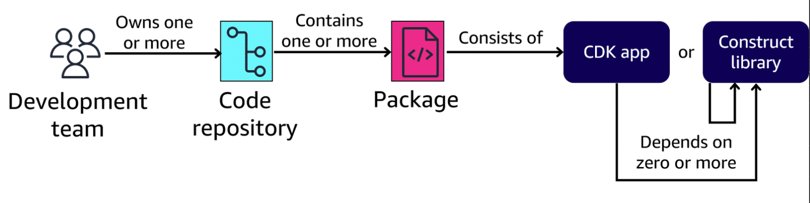

The following items are recommended best practices to consider when coding applications using the AWS CDK:

* **Start basic**: With the AWS CDK, you can quickly refactor and deploy your code to meet changing application requirements. This way, you don't need to anticipate every application requirement up front. Instead, the recommended best practice is to keep things as basic as possible. Only add complexity to the new application when requirements demand a more complex solution.
* **Establish component ownership and responsibility**: An AWS CDK application meets the definition of a component in the AWS Well-Architected Framework. The AWS Well-Architected Framework defines a *component* as the code, configuration, and AWS resources that deliver a specific application requirement. A component is often the unit of technical ownership, belonging to a specific development team or developer who is responsible for maintaining and managing that component. Each component should have a clear owner.
* **One application per repository**: AWS does not recommend putting multiple applications in the same repository, especially when using automated deployment pipelines. When there are multiple applications in a single repository, changes to one application might cause a deployment of the other applications. This can happen even if those other applications haven't changed. Conversely, a deployment issue in one application can prevent other applications in the same repository from being deployed.
* **Store shared packages to their own repository**: Over time, packages might be used across multiple applications. If this occurs, AWS suggests moving the shared packages into their own repository. This allows the packages to continue to be referenced by the application build systems that use them, but the shared packages themselves can be updated independently.
* **Combine infrastructure and runtime code**: When using AWS CDK, infrastructure code and application code don't need to live in separate repositories or packages. Instead, AWS CDK can bundle together CloudFormation templates and application runtime assets like Lambda functions and Docker images. This combines the code that defines your infrastructure, and the code that implements your application logic into a single construct.

### Organize your code

The AWS Prescriptive Guidance documentation recommends that you create a new project directory to store each application's source code. Within this directory, AWS recommends the creation of additional sub-directories, which store code that has been broken into logical pieces based on functionality. One possible directory structure shown here could be used to store AWS CDK code for an application.

#### Sample directory structure for an app

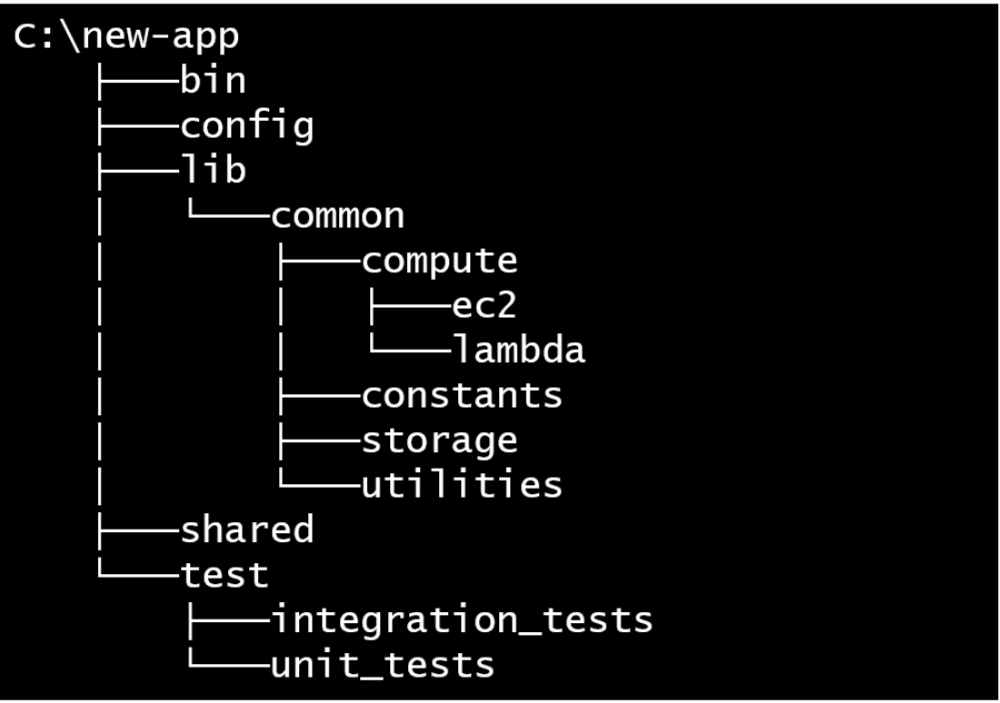

In this example, the **compute** sub-directory under the **common** sub-directory is used to hold all the code for constructs related to the application's compute resources. Similarly, directories for constructs related to CDK **constants**, **storage** services, and other **utilities** are also stored in sub-directories under the **common** directory. Configuration data that is common to all constructs can be placed in the **shared** directory. In this example, scripts and code used to perform integration and unit tests can be kept in subdirectories under the **test** directory.

However, this is only an example. There is no functional difference to the AWS CDK regarding the directory structure you choose, so you're free to do whatever works best for you and your team.

### Test in the AWS Cloud

Although testing serverless applications can be done locally on your workstation, AWS recommends that your serverless applications be tested in an isolated environment in the AWS Cloud whenever possible.

This testing approach provides the most reliable, accurate, and thorough representation of how your application will operate when the application is deployed for users. Additionally, when possible, the actual services needed by the application should be used, and not mocked up mechanisms that mimic the behavior of that service. Tests using real services provide the same environment a serverless application would use when processing requests in production.

### Additional resources

* [Best Practices for Developing and Deploying Cloud Infrastructure with the AWS CDK](https://docs.aws.amazon.com/cdk/v2/guide/best-practices.html)
* [Serverless Applications Lens](https://docs.aws.amazon.com/wellarchitected/latest/serverless-applications-lens/deployment-approaches.html)
* [AWS Prescriptive Guidance](https://docs.aws.amazon.com/pdfs/prescriptive-guidance/latest/best-practices-cdk-typescript-iac/best-practices-cdk-typescript-iac.pdf?did=pg_card-pdf&amp;trk=pg_card-pdf)

### Knowledge Check

#### AWS Cloud Development Kit (AWS CDK) constructs represent AWS resources at several layers of complexity. Which layer construct comes with commonly used, pre-configured code and default values that reduce the detail required to implement it?

* Layer 2 (L2) construct

Wrong answers:

* Layer 1 (L1) construct
* Layer 3 (L3) construct
* Stack

##### Explanation

AWS CDK Layer 2 constructs come with commonly used, pre-configured code and default values. These constructs require less detail to implement than L1 constructs.

The other options are incorrect for the following reasons:

* L1 constructs are the building blocks of the AWS CDK and provide no abstraction. They require more configuration and details to implement.
* L3 constructs are the highest level of abstraction. They are designed to help complete common tasks in AWS, typically involving multiple kinds of resources.
* An AWS CDK stack is the smallest single unit of deployment, representing a collection of AWS resources that are defined using CDK constructs. A stack itself is not a layer construct.

#### AWS Cloud Development Kit (AWS CDK) constructs represent AWS resources at several layers of complexity. Which layer construct is also referred to as a pattern, and helps complete common tasks that involve multiple kinds of AWS resources?

* Layer 3 (L3) construct

Wrong answers:

* Layer 1 (L1) construct
* Layer 2 (L2) construct
* Stacks

##### Explanation

L3 constructs are also called patterns. Patterns help complete common tasks that involve multiple kinds of AWS resources designed to meet the needs in a specific situation.

The other options are incorrect for the following reasons:

* L1 constructs are the lowest level of abstraction. An L1 construct maps directly to a single AWS CloudFormation resource, rather than multiple AWS resources.
* L2 constructs also map directly to single CloudFormation resources. They provide a higher level of abstraction, but they do not involve multiple resources.
* Stacks represent a collection of AWS resources that are defined using CDK constructs; however, they are individual units of deployment rather than layer constructs.

#### Which term describes a collection of constructs consisting of pre-written, modular, reusable pieces of code, which AWS CDK can combine into stacks and an app?

* AWS Construct Library

Wrong answers:

* AWS CDK stage
* AWS CDK stack
* AWS CDK app

##### Explanation

Using items from the AWS CDK Construct Library reduces the complexity required to define and integrate AWS services when building applications on AWS.

The other options are incorrect for the following reasons:

* An AWS CDK stage is a group of one or more CDK stacks that are configured to deploy together, rather than a collection of constructs.
* An AWS CDK stack is the smallest unit of deployment, representing a collection of AWS resources that are defined using CDK constructs. It is not a collection of constructs.
* An AWS CDK app is a collection of one or more stacks, rather than constructs.

#### Which components need to be installed and configured on a developer's workstation before using the AWS Cloud Development Kit (AWS CDK) Toolkit for serverless application development? (Select THREE.)

* AWS Command Line Interface (AWS CLI)
* Node.js
* Client software for the programming language that will be used to create AWS CDK stacks

Wrong answers:

* AWS Serverless Application Model Command Line Interface (AWS SAM CLI)
* AWS Construct Library
* AWS Integrated Development Environment (IDE) Toolkit

##### Explanation

Before installing and using the AWS CDK Toolkit, a developer must install and configure the AWS CLI, Node.js, and the client software for TypeScript, JavaScript, Python, Java, C#, or Go.

The other options are incorrect for the following reasons:

* AWS SAM CLI is required for development with AWS SAM. It is not a prerequisite for development with AWS CDK.
* AWS Construct Library is a part of the broader AWS CDK Library. It provides a collection of constructs, or building blocks, that are developed and maintained by AWS, and that can be used for building applications with the AWS CDK. It is not an environment prerequisite for getting started with the AWS CDK.
* AWS IDE Toolkits are plugins and extensions that enable access to AWS services in an IDE. They can streamline the process for developing AWS applications, but they are not directly required to get started with AWS CDK.

#### A development team is trying to decide between a single-stack app or multi-stack app design model for their serverless application development project using the AWS Cloud Development Kit (AWS CDK). What is a potential drawback to using the single-stack app model?

* Could potentially reach the CloudFormation quota of 500 resources per stack

Wrong answers:

* App will not have any cross-stack dependencies during deployment
* Requires less time to build and deploy than multi-stack app
* Only one stack needs to be updated when implementing changes

##### Explanation

If all resources are deployed using a single-stack app, then it is possible the account quota limit of 500 resources per stack could be reached.

The other options are incorrect for the following reasons:

* No cross-stack dependencies is an advantage, rather than a drawback, of the single-stack app model.
* A single-stack app model requires more time, rather than less time, to build and deploy than a multi-stack app.
* Only needing to update one stack when implementing changes is a benefit of a single-stack approach, not a drawback.

### Summary

* The AWS CDK is a development framework for creating applications and defining application cloud IaC using a collection of resources called a stack.
* AWS CDK apps are composed of basic building blocks called constructs, which represent AWS resources at four levels of complexity. Serverless development primarily uses Level 2 and Level 3 constructs. Level 3 constructs are also called patterns. AWS Construct Library is available to speed up development time by providing pre-written, modular, reusable pieces of code.
* Prior to installing the AWS CDK, there are prerequisite tasks that you should perform. First, you will need to obtain credentials for an AWS account that has programmatic access to the AWS Cloud. Then, download and install the AWS CLI. Node.js software will also need to be downloaded and installed. Then, you will download and install your preferred programming language client (TypeScript, JavaScript, Python, Java, C#, or Go). Finally, download and install your IDE.
* After creating a local directory for your new application, the **cdk init** command can be used to initialize the project for your chosen programming language. It can also be used to perform any additional language-specific configuration tasks. Following this configuration, the **cdk build** and **cdk deploy** commands can be used to build and deploy your serverless application.
* AWS CDK provides environmental and information commands that can be used to display details about the configuration of the application environment and the application itself.
* Establishing standards for app coding languages and single-stack compared to multi-stack application design are recommended best practices. Stacks that are used for deploying the resources should be defined by constructs. Using properties and methods as placeholders for variable values will also encourage construct reusability.
