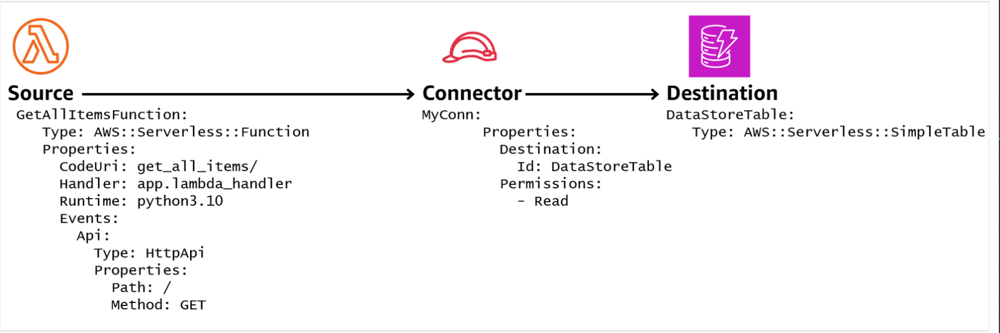
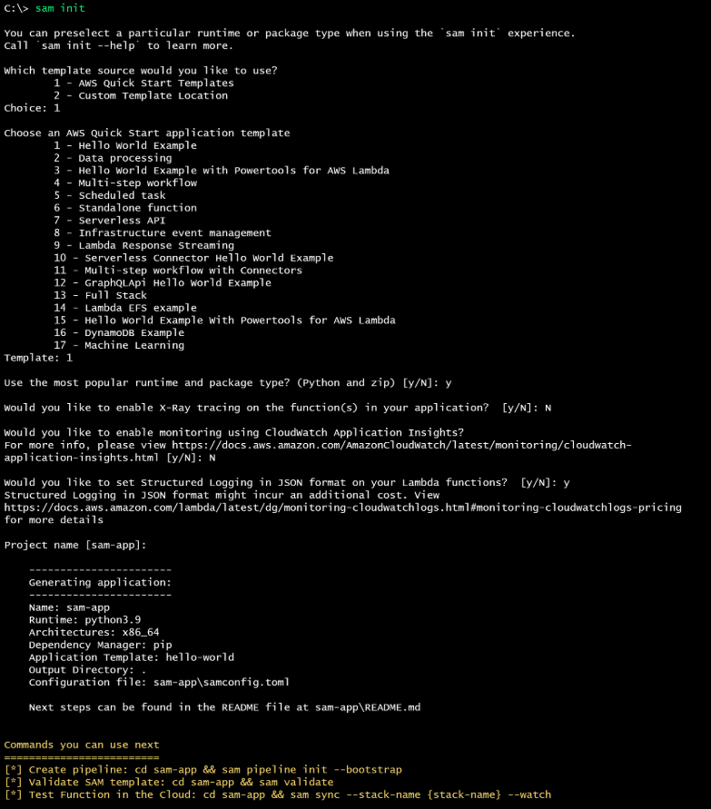

# Week 11: Serverless Application Deployment Frameworks – Part 2

* back to AWS Cloud Institute repo's root [aci.md](../aci.md)
* back to repo's main [README.md](../../../README.md)

## Working with AWS Serverless Application Model

### Pre-assessment

#### Which are the components that comprise the AWS Serverless Application Model (AWS SAM)? (Choose TWO.)

* AWS SAM transformation templates
* AWS SAM command line interface (AWS SAM CLI)

Wrong answers:

* AWS command line interface (AWS CLI)
* AWS Cloud Development Kit (AWS CDK)
* AWS identity and access management (AWS IAM)

##### Explanation

The other responses are incorrect because:

* While the AWS CLI is a useful tool for interacting with AWS services, it is not a specific component of AWS SAM.
* The AWS CDK is a separate framework from AWS SAM, used for defining and deploying cloud infrastructure resources using programming languages like TypeScript, Python, Java, and C#. It is not a component of AWS SAM.
* AWS IAM is a service that manages access to AWS resources, but it is not a specific component of AWS SAM.

#### Which statement describes the relationship between AWS Serverless Application Model (AWS SAM) templates and AWS CloudFormation templates?

* An AWS SAM template requires less detailed syntax to deploy a serverless resource than an AWS CloudFormation template.

Wrong answers:

* An AWS SAM template requires more detailed syntax to deploy a serverless resource than a AWS CloudFormation template.
* An AWS SAM template must be formatted as YAML, and an AWS CloudFormation template must be formatted as JSON.
* An AWS SAM template must be formatted as HTML, and an AWS CloudFormation template must be formatted as XML.

##### Explanation

The other responses are incorrect because:

* AWS SAM templates are designed to simplify the syntax required to define serverless resources compared to AWS CloudFormation templates.
* AWS SAM templates can be written in YAML or JSON format, while AWS CloudFormation templates can also be written in YAML or JSON format. However, the statement incorrectly implies that AWS SAM templates must be in YAML format and AWS CloudFormation templates must be in JSON format, which is not true.
* Neither AWS SAM templates nor AWS CloudFormation templates are formatted as HTML or XML. AWS SAM templates and AWS CloudFormation templates are typically written in YAML or JSON format.

#### A developer is planning to use AWS Serverless Application Model (AWS SAM) to create the infrastructure as code files for a new application. What AWS SAM command line interface (AWS SAM CLI) syntax will the developer use build the application?

* sam build

Wrong answers:

* sam init
* sam deploy
* build sam

##### Explanation

The other options are incorrect because:

* sam init is used to initialize the AWS SAM application environment.
* sam deploy is used to initiate the application deployment.
* build sam is used to build the AWS SAM application locally. It compiles the application code, packages the dependencies, and generates deployment artifacts (e.g., AWS CloudFormation templates) based on the template file.

#### What are recommended best practices when working with AWS Serverless Application Model (AWS SAM)? (Select TWO.)

* Use the Globals feature in AWS CloudFormation to reduce code redundancy in templates.
* Use AWS CloudFormation mappings to promote code portability across environments.

Wrong answers:

* Avoid the use of AWS SAM parameters and pseudo parameters.
* Develop AWS CloudFormation templates that are completely independent, with no passing of shared values between stacks using cross-stack references.
* Store the source code files for all serverless applications in a single directory on the developer's workstation.

##### Explanation

The other options are incorrect because:

* AWS SAM parameters and pseudo parameters are essential for configuring and customizing your serverless applications.
* Cross-stack references are a recommended practice in AWS CloudFormation when you need to share resources or values between multiple stacks. This approach promotes modular and reusable infrastructure as code, making it easier to manage and maintain complex deployments.
* It is generally recommended to follow a modular and organized structure for your serverless applications, separating different components or services into their respective directories or repositories. Storing all source code files in a single directory can lead to code organization issues, especially for larger projects or when working in a team environment.

#### An application is being developed using AWS Serverless Application Model (AWS SAM). The application needs to use the same values for AWS::Serverless::Function for multiple resources. All of these resources will use the same configuration values for Runtime and Timeout. Which is the best approach for reducing duplication of code in the application's IaC templates?

* Use AWS SAM globals to store the common configuration values. 

Wrong answers:

* Use AWS SAM parameters to store the common configuration values.
* Use a separate AWS SAM template for each resource, and export/import the common configuration values between templates.
* Use AWS SAM CloudFormation mappings to pass the common configuration values between templates.

##### Explanation

The other responses are incorrect because:

* While AWS SAM parameters can be used to store configuration values, they are primarily intended for passing different values during deployment. Parameters are not the best approach for reducing duplication of code when the same values need to be shared across multiple resources.
* Splitting resources into separate templates and exporting/importing values between them can lead to increased complexity, especially as the number of resources grows.
* CloudFormation mappings are primarily used for mapping keys to values based on conditions or environments. They are not designed for sharing common configuration values across resources within the same template. Using mappings for this purpose would be an inefficient and convoluted approach.

## AWS Serverless Application Model Templates

The AWS Serverless Application Model (AWS SAM) is a toolkit designed to enhance your ability to build and run serverless applications on AWS.

### Benefits of using AWS SAM

The AWS SAM template specification is an open-source framework that you can use to define and manage your serverless application infrastructure code. The template specification fully supports AWS CloudFormation syntax. However, it also extends that syntax by adding declarative shorthand commands that are specific to AWS SAM and designed specifically for deploying serverless application environments. These shorthand commands support serverless resource types like Lambda functions, layers and applications, APIs, DynamoDB tables, and AWS Step Functions.

When AWS SAM code is deployed, it is first converted into AWS CloudFormation commands, then run. Therefore, both AWS CloudFormation and AWS SAM syntax can be used within the same AWS SAM template.

Specifically, AWS SAM runs on top of AWS CloudFormation and is comprised of two parts. The first part is AWS SAM transformation templates. The second part is the AWS SAM tools that are accessible from the AWS SAM CLI.

Another benefit of the AWS SAM CLI is its ability to package an AWS SAM application for you. The packaging process creates a .zip file of your code and dependencies, and then uploads the file to an Amazon S3 bucket. AWS SAM then returns a copy of your AWS SAM template, replacing references to local artifacts with the Amazon S3 location where the command uploaded those artifacts.

### AWS SAM transformation templates

For an example of how AWS SAM extended syntax is converted to AWS CloudFormation commands, consider a basic serverless application architecture. The application processes a user's request to get all items from a database using an HTTP call. The following is a streamlined architecture diagram of the AWS services needed for this application, along with a description of the architecture's four main components.

Diagram with an HTTP API endpoint, Amazon API Gateway, AWS IAM role, Amazon Lambda function, and Amazon DynamoDB table.


The four main components of the application architecture are:

* An **Amazon API Gateway** to serve as the connection between the client (requestor) and the application
* A **Lambda function** that contains the logic to process the user's request, such as  GetAllItemsFunction used in this example
* A **DynamoDB** table to act as the data store for the items that the user wishes to retrieve, such as the DataStoreTable used in this example
* **AWS Identity and Access Management (IAM)** adequate to manage the permissions needed for the application to run securely

#### Sample AWS SAM template

The following AWS SAM template contains the declarative AWS SAM YAML code needed to deploy the components for this serverless application. When you deploy this AWS SAM template, CloudFormation will transform any serverless resources into regular CloudFormation resources. The keyword **transform** on line 2 of the template enables this conversion. This transformation step converts the 24 lines of the following AWS SAM code into the over 200 lines of AWS CloudFormation commands. These commands are required to provision these resources in AWS.


```yaml
AWSTemplateFormatVersion: '2010-09-09'
Transform: AWS::Serverless-2016-10-31
Resources:
  GetAllItems:
    Type: AWS::Serverless::Function
    Properties:
      CodeUri: get_all_items/
      Handler: app.lambda_handler
      Runtime: python3.10
      Events:
        Api:
          Type: HttpApi
          Properties:
            Path: /
            Method: GET
    Connectors:
      MyConn:
        Properties:
          Destination:
            Id: DataStoreTable
          Permissions:
            - Read
  DataStoreTable:
    Type: AWS::Serverless::SimpleTable
```

Two other important examples of the shorthand IaC code that AWS SAM provides are related to the Resources (line 3) and Events (line 10) keywords. By using the **Resources** section of the AWS SAM code, you can define the type of serverless AWS resource that is being created by the template. In this example, the **AWS::Serverless::Function** type is being used to define a serverless Lambda function called **GetAllItemsFunction**. In total, there are nine AWS SAM serverless resource types that can be defined using similar AWS SAM shorthand code. The **AWS::Serverless::SimpleTable** type can be seen on Line 24 of the sample code.

#### Resources section


The **CodeUri** (Line 7) property of the Resources section of the template specifies the location of the source code for the GetAllItemsFunction Lambda function. In this example, that source code is stored in an Amazon S3 bucket called **get_all_items**.

The **Handler** (line 8) and **Runtime** (line 9) keywords within the Resources section of the template further define properties of the AWS::Serverless::Function type.

These two properties define the type of service being called, and the function's runtime engine and language. In this example, these are defined as **app.lambda_handler** and **python3.10**, respectively.

#### Events section

It defines which AWS service will be used to invoke the GetAllItemsFunction function.

In this example, a **GET** operation from an HTTP API endpoint will invoke the Lambda function, using the **HttpApi** event source.

In total, there are nineteen available event sources for AWS SAM. These include Amazon Alexa skills, Amazon CloudWatch Events, and Amazon Simple Notification Service (Amazon SNS) notifications, among others.


#### Connectors and SimpleTable in AWS SAM code

The AWS SAM template also includes shorthand syntax to deploy the application's Amazon DynamoDB table, called **DataStoreTable** (Line 23). The table is implicitly created by using the **AWS::Serverless::SimpleTable** (line 24) type.


By default, because no primary key is specified, the AWS::Serverless::SimpleTable type will create a DynamoDB table called DataStoreTable. This table has a primary key column called **id**, and which will have a string value for its data type.

Alternatively, additional syntax can be added to the AWS::Serverless::SimpleTable type to explicitly define characteristics of the DynamoDB table. These include a primary key, a provisioned throughput value, enabling point in time recovery or server-side data encryption capabilities, and tags.

The AWS SAM code uses the **Connectors** (line 16) keyword to define the permissions required (Read) to access to the DataStoreTable DynamoDB table. AWS SAM uses over 80 policy templates to facilitate building the IAM roles and permissions needed to access various serverless resources.

Ultimately, AWS SAM will transform the shorthand syntax in the example into the CloudFormation syntax required to create an API gateway endpoint. It will have the correct IAM role and permissions required to invoke the GetAllItemsFunction Lambda function. The transformation will also create the DataStoreTable DynamoDB table, and a connector that allows the function to read data. The following diagram summarizes this relationship between the Lambda function, its connector, and the DynamoDB table defined by this AWS SAM code.



Relationship between a serverless function, its access privileges, and its data store in AWS SAM template

#### Additional resources

* [AWS SAM Resource and Property Reference](https://docs.aws.amazon.com/serverless-application-model/latest/developerguide/sam-specification-resources-and-properties.html)
* [AWS SAM Event Sources](https://docs.aws.amazon.com/serverless-application-model/latest/developerguide/sam-property-function-eventsource.html)
* [AWS SAM Policy Templates](https://docs.aws.amazon.com/serverless-application-model/latest/developerguide/serverless-policy-templates.html)

### AWS SAM use cases

The primary use case for the adoption of AWS SAM is development environments where an open-source framework for building serverless applications is desired. By providing a shorthand syntax to express functions, APIs, databases, and event source mappings, AWS SAM can improve the speed and accuracy of application development.

#### Build on existing CloudFormation expertise

Many development teams are already using CloudFormation for defining and deploying infrastructure in the AWS Cloud. Adding AWS SAM as a serverless application development tool will give those teams the ability to continue to use their existing CloudFormation knowledge and templates.

#### Integration with development tools

Many enterprise development environments make use of CI/CD systems as part of their DevOps operating model. AWS SAM provides integrations to many popular CI/CD systems so that existing deployment pipeline processes can continue to be used with AWS SAM.

#### Rapid prototyping of applications

The AWS Serverless Application Repository provides over 1,000 pre-built serverless applications that are ready to deploy. Reviewing the design and deployment techniques behind these sample applications can provide building blocks to support your own development activities.

## Using the AWS SAM Command Line Interface

AWS SAM CLI makes it more convenient to code, debug, and test serverless applications. You can use AWS SAM CLI with both AWS SAM templates and supported third-party integrations to build and run your serverless applications. Specifically, AWS SAM CLI can be used to perform the following serverless application development tasks from your local workstation:

* Initialize a new development project for your application.
* Build your application for deployment.
* Debug and test your application.
* Deploy your application.
* Configure CI/CD pipelines.
* Monitor and troubleshoot your application in the AWS Cloud.
* Synchronize local application changes to an AWS Cloud repository as you develop.

### Installing the AWS SAM CLI software

The AWS SAM CLI is available for Linux, MacOS, and Windows. Before downloading and installing the AWS SAM CLI for your workstation's OS, you should ensure you have the following two prerequisite items available:

* To access an AWS account using the AWS SAM CLI, you will need authentication for programmatic access to the AWS account.
* Download, install, and configure the AWS Command Line Interface (AWS CLI) software. The AWS CLI is an open-source tool that you can use to interact with AWS services using commands in your command-line shell. The AWS SAM CLI requires the AWS CLI for activities such as configuring the credentials described previously.

After confirming that you have completed these two tasks, you can download, install, and configure the AWS SAM CLI software. The AWS SAM CLI will use the AWS CLI and the access key ID to interact with your AWS account in the AWS Cloud.

After installing the AWS SAM CLI, the command **sam --version** can be run from the operating system command line. This will confirm a successful installation of AWS SAM.

#### Additional resources

* [Creating IAM Users (AWS CLI)](https://docs.aws.amazon.com/IAM/latest/UserGuide/id_users_create.html#id_users_create_cliwpsapi)
* [Installing the AWS CLI](https://docs.aws.amazon.com/cli/latest/userguide/getting-started-install.html)
* [Installing the AWS SAM CLI](https://docs.aws.amazon.com/serverless-application-model/latest/developerguide/install-sam-cli.html)

### Initializing the AWS SAM CLI environment

After the AWS SAM CLI software has been successfully installed, it can be used to create a basic application to confirm its operation. This section uses a Hello World application based on code from a Git repository to confirm the successful AWS SAM CLI installation. The following steps describe how to initiate the AWS SAM project for the Hello World application:

1. Download and install Git on your local workstation if you have not already done so. Git is not required to use AWS SAM CLI, but Git is needed to pull the Hello World application code in this example from the Git repository.
2. Run the **sam init** command from the AWS SAM CLI. This AWS SAM CLI command uses the AWS CLI and the previously configured access key ID to interact with your AWS account.
3. When prompted, choose option 1, **AWS Quick Start Templates**.
4. When prompted, choose option 1, **Hello World Examples**.
5. When prompted, respond with **Y (yes)** in response to the question **Use the most popular runtime and package type?**
6. When prompted, respond with **N (no)** in response to the question **Would you like to enable X-Ray training on the function(s) in your application?** AWS X-Ray is a service that collects data about requests that your application serves, and provides tools that you can use to view, filter, and gain insights into that data to identify issues and opportunities for optimization.
7. When prompted, respond with **N (no)** in response to the question **Would you like to enable monitoring using CloudWatch Application Insights?** Amazon CloudWatch Application Insights is powered by SageMaker, and facilitates observability for your applications and their underlying AWS resources.
8. When prompted, respond with **Y (yes)** in response to the question **Would you like to set Structured Logging in JSON format on your Lambda functions?** Formatting logs using a structured JSON format can make it more convenient to search, filter, and analyze large volumes of log entries when troubleshooting.
9. When prompted, accept the default value of **sam-app** by pressing Enter, when prompted for a Project name.
10. The AWS SAM CLI will begin initialization of the sam-app project for the Hello World application.

The following sample output is from a successful run using the sam init command to initialize the sam-app project for the Hello World application for a Windows workstation.



#### Additional resources

* [Git Software](https://github.com/git-guides/install-git)
* [Test AWS SAM Installation](https://docs.aws.amazon.com/serverless-application-model/latest/developerguide/serverless-getting-started-hello-world.html)

### Directory structure for AWS SAM project

When initializing the sam-app project, AWS SAM CLI creates a new directory structure on your local workstation to store the project's application files. The resulting directory structure from a successful Hello World build on a Windows workstation is shown in the image.


The sam-app directory holds all the files for the project. The directory contains three sub-directories called **events**, **hello_world**, and **tests**. The tests directory also contains two sub-directories called **integration** and **unit**. The following are key files to be aware of in this directory structure:

* **sam-app/hello_world/app.py**:  This file contains the Python source code for the Hello World Lambda function.
* **sam-app/hello_world/requirements.txt**: This file contains any Python dependencies that the Lambda function requires.
* **sam-app/samconfig.toml**: This configuration file stores the default parameters used by AWS SAM CLI.
* **sam-app/template.yaml**: This file is the AWS SAM template that contains the Hello World application infrastructure code.

### Building the Hello World application

After the initialization of the aws-app project and Hello World application is complete, you can run the AWS SAM CLI **sam build** command from the sam-app directory. This will prepare the application for deployment. When you run the build command, an additional directory called .aws-sam is created. This directory is used to organize application function dependencies, project code, and project files.

The following sample output is from a successful run of the **sam build** command to build the sam-app project for the Hello World application for a Windows workstation.


While building the Hello World application, AWS SAM CLI creates additional directories on your local workstation to store the Hello World application files.

In this example, the build process creates a new directory called **.aws-sam**, under the sam-app directory. This directory is used to store the files created by the build process.

The resulting directory structure from a successful Hello World build on a Windows workstation is shown here.


Key directories and files to be aware of in this directory structure are as follows:

* **sam-app/.aws-sam/build/HelloWorldFunction**: This folder contains the Hello World application's Lambda function code and dependencies. The AWS SAM CLI creates a directory for each function in an application.
* **sam-app/.aws-sam/build/template.yaml**: This file contains a copy of the Hello World application's AWS SAM template that is referenced by CloudFormation at deployment.
* **sam-app/.aws-sam/build.toml**: This configuration file stores default parameter values referenced by the AWS SAM CLI when building and deploying your application.

### Deploying the Hello World application

After using AWS SAM CLI to initialize and build the Hello World application, you're ready to deploy the application to the AWS Cloud. The AWS SAM CLI command **sam deploy --guided** is used in the following example. Running the deploy command with the **--guided** option will initiate the deploy process. It will provide you with interactive prompts to guide you through the configuration of your application settings.

The output from the AWS SAM CLI deploy option is verbose, so only the first and last portions of the following output are shown. The final line of the output indicates that the deploy operation completed successfully.


During the deploy process, the AWS SAM CLI performs three operations. First, AWS SAM CLI creates an Amazon S3 bucket where the Hello World application files from the aws-sam directory are uploaded from your local workstation.

Next, the AWS SAM CLI sends the Hello World AWS SAM template file, template.yaml, to the CloudFormation service. After it's there, a macro hosted by CloudFormation called **AWS::Serverless transform** transforms and expands the template.yaml file written in the AWS SAM syntax, into a compliant CloudFormation template.

Finally, AWS CloudFormation provisions the resources for the Hello World application. If the application already has an existing deployment, prior to deployment, AWS SAM will create a CloudFormation change set to provision only those items that have changed.

### Using AWS SAM CLI sync to deploy

If desired, AWS SAM CLI can be configured so that the application code on your local workstation is kept in sync with the application code in the AWS Cloud. The application will be automatically deployed whenever code changes are made. The AWS SAM CLI command **sam sync --watch** is used for this purpose.

By default, issuing the sam sync command causes AWS SAM to perform an initial deployment of all application resources before AWS SAM begins monitoring for local code changes.


After it's started, AWS SAM will automatically deploy, in real time, any changes made to your local templates and application code.

The sync operation will run continuously until you stop it. To stop the sync process in a Windows or Linux environment, press Ctrl + C from the operating system command line. To perform the same function in macOS, press Command + Period (.).

The following screenshot shows shows the sync command being started and stopped using Ctrl + C.


The AWS SAM CLI sam sync command will automatically deploy your local template and application code changes to the AWS Cloud in real time. Therefore, AWS recommends that the sam sync feature only be used in development environments where each developer is more likely to have their own dedicated environment.

The sam deploy and sync features might meet the needs for your development environments. However, they are not well suited for automated deployment of production applications that are part of a fully automated CI/CD deployment process. For these environments, the recommended deployment method is AWS SAM pipelines.

### Using AWS SAM pipelines to deploy

Automated deployment of production applications are typically part of a fully automated CI/CD environment. They give you much more control over the deployment process than the AWS SAM CLI sam deploy command. A fully automated CI/CD environment coordinates deployments across multi-developer environments, with complex dependencies between microservices and cloud resources, predefined deployment approval workflows, and specific security requirements.

A fully automated CI/CD deployment pipeline consists of an automated sequence of steps that are performed when a new version of an application is released. These steps are defined using a pipeline template file, whose format and contents are specific to the CI/CD system you use. AWS SAM CLI includes support for many common CI/CD templates, including AWS CodePipeline, Jenkins, GitLab CI/CD, GitHub Actions, and BitBucket Pipelines. These pipeline templates include AWS deployment best practices to help with multi-account and multi-Region deployments.

Using pipelines requires the use of two additional AWS SAM CLI commands. The first is **sam pipeline bootstrap**. This command creates the AWS resources and permissions required to deploy your application artifacts from your CI/CD code repository into your AWS environments.

The second AWS SAM CLI command is **sam pipeline init**. Before running this command, you must connect your Git repository to your CI/CD system and create IAM credentials in your AWS account for the CI/CD system to use. After these connections are complete, the **sam pipeline init** command generates a pipeline configuration file your CI/CD system can use for AWS SAM application deployments. This configuration includes an IAM access key ID and a secret access key.

#### Additional resources

* [AWS SAM CLI Deploy Options](https://docs.aws.amazon.com/serverless-application-model/latest/developerguide/serverless-deploying.html)
* [AWS SAM CLI Sync Options](https://docs.aws.amazon.com/serverless-application-model/latest/developerguide/sam-cli-command-reference-sam-sync.html)
* [Generating Starter Pipelines for Jenkins, GitLab CI/CD, GitHub Action, or BitBucket Pipelines](https://docs.aws.amazon.com/serverless-application-model/latest/developerguide/serverless-generating-example-ci-cd-others.html)

### Testing the Hello World application

The Hello World application has successfully completed the development cycle using the AWS SAM CLI to initialize, build, and deploy the application. Next, you can test the application to see if it is working as designed.

#### Remote application testing

Using the output from the Outputs section of the deploy command, you can determine the API Gateway endpoint URL that is associated with the Hello World application's Lambda function. In the following sample output, the endpoint is **https://XXXXXXXXXX.execute-api.us-east-1.amazonaws.com/Prod/hello/**.


Using a web browser, the API endpoint can be used to access the Hello World application. Accessing the URL displays the text, "hello world", as shown in the following output. This message indicates that the application is working.


The curl command can also be used to access the API endpoint and run the Hello World application without a web browser. As shown in the following example, the API invokes the Hello World Lambda function, which returns the message, "hello world".


Alternatively, the AWS SAM CLI can also be used to directly invoke the Hello World function in the AWS Cloud, and return its response to the command line. As shown in the following example, the **sam remote invoke** command can be used to perform this operation.


In addition to the expected Hello World output, the AWS SAM CLI remote invoke option also includes some additional information. This information includes the runtime version of the function code (python 3.12.v18), and the function's processing time in milliseconds (3.265).

#### Testing serverless applications locally

In all three of the previous examples, the Hello World application was tested using serverless resources in the AWS Cloud. However, there might be times when you prefer to test a serverless application locally, using only resources from your own workstation. A local testing approach does not incur any charges for AWS services, so local testing can be a useful way to reduce costs in the early stages of the development process.

AWS SAM provides a local application testing capability. Use of this capability requires the installation of Docker on your local workstation. Then, AWS SAM CLI uses local Docker containers to emulate some of the serverless AWS services on your local workstation for the purposes of application testing. For example, AWS SAM CLI offers the ability to test functionality like API endpoint calls using HTTP by emulating API Gateway. This emulation lacks the API Gateway authorization and authentication capabilities. However, it does provide a REST endpoint for testing your application functions without incurring additional Lambda costs. A summary of some of the AWS SAM CLI commands for local application testing are as follows:

* **sam local start-api**: This command is used to run your AWS Lambda functions locally and test through a local HTTP server host. This type of test is helpful for Lambda functions that are invoked by an API Gateway endpoint.
* **sam local invoke**: This command is used to run Lambda functions as if the AWS Lambda service had invoked it. It is useful to locally initiate a one-time invocation of an AWS Lambda function.
* **sam local start-lambda**: This command is used to invoke your AWS Lambda function through the AWS CLI or AWS SDK. This command starts a local endpoint that emulates AWS Lambda.

Using AWS SAM for local application testing early in the development process is helpful. However, AWS recommends moving your tests to the AWS Cloud as soon as possible. Not all AWS services are available for local emulation using AWS SAM, and IAM credentials and roles cannot be applied under local testing.

#### Additional resources

* [Remote AWS SAM application testing](https://docs.aws.amazon.com/serverless-application-model/latest/developerguide/using-sam-cli-remote-test-event.html)
* [Local AWS SAM Application Testing](https://docs.aws.amazon.com/serverless-application-model/latest/developerguide/using-sam-cli-local.html)

### Deleting an application using AWS SAM CLI

At the end of the development cycle, the AWS SAM CLI can be used to remove applications from the AWS Cloud when they are no longer needed. The AWS SAM CLI command sam delete is used for this purpose. The delete command will prompt you to confirm the deletion of the stack and template file before removing the application from the AWS Cloud. This is shown in the following example.


### AWS SAM CLI summary

Most development teams use separate development, staging, and production environments to create, test, and deploy their application code. The following graphic shows the AWS SAM CLI commands that you might use in a typical workflow, moving from coding, testing, and staging environments, to production.


### [Lab: Creating a Serverless Application with AWS SAM](./labs/W110Lab1SamApplication.md)

## AWS SAM Best Practices

To gain the maximum benefits from AWS SAM and its ability to facilitate rapid development and deployment of serverless AWS applications, consider the following best practices:

1. Use parameters and mappings
2. Use AWS SAM Globals
3. Reference values across templates

### Use parameters and mappings

When using IaC to deploy serverless applications, your goal should be a single, reusable IaC template that can be used across development, test, integration, and production environments. To facilitate this portability, it is important to use parameters and mappings in AWS SAM.

#### AWS SAM parameters

AWS SAM offers parameters and pseudo parameters to support the reuse of IaC and serverless application code across environments. AWS SAM parameters are used to prompt for, and then store, user-supplied values that are subsequently used during the deployment process. For example, a user might pass in a parameter for the name of tier where the application is being deployed. Then, it is appended to some of the application's AWS resource names to ensure unique resource names across tiers.

AWS SAM pseudo parameters are predefined by CloudFormation. Pseudo parameters can be used as an argument for the CloudFormation Ref function, but without needing to declare them in your template. For example, the **AWS::AccountId** and **AWS::Region** pseudo parameters implicitly store the value of the AWS Account ID and Region for the current session, respectively.

#### CloudFormation mappings

The optional CloudFormation section called Mappings is used to match a key to a corresponding set of named values. For example, you can use a mapping to set template values based on a Region. The mapping can use the Region name as the key, paired with the values you want to map for each Region. You can then use the **Fn::FindInMap** intrinsic function to retrieve values defined by the mapping.

The following example uses YAML to define a CloudFormation Mappings section with a map called RegionMap. RegionMap contains five keys that map to name-value pairs containing single string values. The keys are Region names.


The name-value pair associated with each Region name consists of the ID for the HVM64 AMI in each Region represented by the key.

By naming the values, you can map more than one set of values to RegionMap. Mapping promotes template reuse across tiers.

### Use AWS SAM Globals

Sometimes you might need to declare resources in an AWS SAM template that will share common configurations. For example, you might have an application with multiple AWS::Serverless::Function resources that use the same configuration values for Runtime, Timeout, and Handler. You can declare the values once in the Globals section of the template. This way, you don’t have to duplicate this information for every resource that uses the same configuration value. After it's declared, all your resources that use this same configuration can inherit those globally defined values.

For example, the following code snippet shows a YAML CloudFormation template. It defines global values for the Runtime, Timeout, and Handler parameters for any function in the template. The two function definitions that follow, HelloWorldFunction and ThumbnailFunction, omit the Runtime, Timeout, and Handler parameters. Therefore, these functions will inherit the global values for those three parameters.


The Globals section of CloudFormation can be used to reduce repetition of template code. Note that the Globals section supports the following five AWS SAM resource types:

* AWS::Serverless::Api
* AWS::Serverless::Function
* AWS::Serverless::HttpApi
* AWS::Serverless::SimpleTable
* AWS::Serverless::StateMachine

Sometimes a value is specified for one of these AWS SAM resource types in both the Globals section and at the individual resource level. If this occurs, the value specified at the individual resource level will be used, and the Globals value will be ignored.

### Reference values across templates

If an AWS SAM stack needs to share configuration information with another stack, the optional CloudFormation Outputs section can be used to declare output values. Those values can then be imported into other stacks. Using this technique, you can pass values between stacks to create cross-stack references while maintaining the referenced values in a single location.

The following CloudFormation template code snippets illustrate this concept. In this example, stack A uses the Outputs section to export the values for the template's VPC security group ID and subnet ID. Stack B then imports these values using the intrinsic CloudFormation function called **ImportValue**.


This approach might be useful when you have a single networking stack that exports the IDs of a subnet and security group that will be used to deploy multiple public web servers. Stacks with a public web server can conveniently import those networking subnet and security group IDs. This avoids the need to hard code resource IDs in the stack's template or pass those IDs as input parameters.

### Additional resources

* [Globals section of the AWS SAM Template](https://docs.aws.amazon.com/serverless-application-model/latest/developerguide/sam-specification-template-anatomy-globals.html)
* [Speeding Up Incremental Changes with AWS SAM Accelerate and Nested Stacks](https://aws.amazon.com/blogs/compute/speeding-up-incremental-changes-with-aws-sam-accelerate-and-nested-stacks/)

### Knowledge Check

#### Which statements about AWS Serverless Application Model (AWS SAM) are correct?  (Select THREE.)

* The AWS SAM template specification is used to define and manage your serverless application infrastructure code.
* AWS SAM fully supports AWS CloudFormation syntax, but also extends that syntax using specific AWS SAM shorthand commands.
* When AWS SAM code is deployed, it is first converted into AWS CloudFormation syntax, then run.

Wrong answers:

* AWS CloudFormation runs on top of AWS SAM.
* AWS SAM is comprised of two parts: AWS SAM transformation templates and AWS Command Line Interface (AWS CLI).
* The AWS SAM transform keyword is used to convert AWS CloudFormation shorthand syntax into more detailed AWS SAM code.

##### Explanation

The other responses are incorrect because:

* AWS SAM is built on top of AWS CloudFormation and uses CloudFormation under the hood to deploy serverless applications.
* The AWS SAM transform is used to convert the AWS SAM shorthand syntax into standard AWS CloudFormation syntax, not the other way around.
* When deploying AWS SAM applications, the AWS SAM CLI first converts the AWS SAM template into a standard AWS CloudFormation template, and then it uses AWS CloudFormation to create or update the resources defined in the template.

#### How does the use of AWS Serverless Application Model (AWS SAM) help streamline the creation of an AWS Lambda function for an application when compared to AWS CloudFormation?

* The function, its invoking event, its source code, and its runtime language can all be defined using a few lines of AWS SAM code.

Wrong answers:

* The AWS SAM code can only be formatted for YAML.
* The source code for the function can be written using any programming language because AWS SAM will convert the code to CloudFormation before running it.
* The function, its invoking event, its source code, and its runtime language can all be defined using one line of AWS SAM code.

##### Explanation

The other responses are incorrect because:

* AWS SAM supports both YAML and JSON formats for defining serverless applications.
* AWS SAM does not convert the function code to CloudFormation. The function code must be written in a language supported by AWS Lambda (e.g., Node.js, Python, Java, Go, etc.). AWS SAM simply packages and deploys the code along with the necessary resources defined in the SAM template.
* While AWS SAM provides a simplified syntax, it is highly unlikely that all these components can be defined in a single line of code. Multiple lines are typically required to define the function, its event source, code location, and runtime language.

#### A new application is initialized using the AWS SAM CLI sam init command. This causes the AWS Serverless Application Model Command Line Interface (AWS SAM CLI) to create a new directory structure for storing the application code. Which subsequent AWS SAM CLI command will create additional directories and populate those directories with application files?

* sam build

Wrong answers:

* sam deploy
* sam sync
* sam delete

##### Explanation

The other responses are incorrect because:

* The `sam deploy` command is used to deploy the application to the AWS Cloud. It does not create additional directories or populate them with application files.
* The `sam sync` command is used to synchronize the local Lambda function code with the Lambda function in the AWS Cloud. It does not create additional directories or populate them with application files.
* The `sam delete` command is used to delete the AWS resources (e.g., Lambda functions, API Gateway, etc.) associated with the application. It does not create additional directories or populate them with application files.

#### Which AWS Serverless Application Model Command Line Interface (AWS SAM CLI) commands can be used to deploy the application to the AWS Cloud? (Select TWO.)

* sam deploy
* sam sync

Wrong answers:

* sam pipeline init
* sam pipeline bootstrap
* sam build

##### Explanation

The other responses are incorrect because:

* `sam pipeline init`: This command is used to initialize a new AWS CodePipeline for the serverless application. It creates the necessary AWS resources (e.g., CodeCommit repository, CodeBuild project, CodePipeline) and configures the pipeline for continuous integration and continuous deployment (CI/CD). However, it does not directly deploy the application to the AWS Cloud.
* `sam pipeline bootstrap`: This command is used to create the necessary AWS resources (e.g., S3 bucket, IAM roles) required for the AWS CodePipeline to function correctly. It is typically run before `sam pipeline init` to prepare the AWS environment for the pipeline.

#### Using the Globals section of a CloudFormation template, a developer has assigned a common value for the Runtime parameter. If the developer also assigns a different Runtime value at the individual resource level, which value will be used for that resource when the app is deployed?

* The Runtime value defined at the individual resources level will be used for the resource during deployment.

Wrong answers:

* The Runtime value defined in the Globals section will be used for the resource during deployment.
* The Runtime value representing the most recent software version will be used during deployment.
* Because two values have been assigned for Runtime, neither value will be used and an error will be raised during deployment.

##### Explanation

The other responses are incorrect because:

* The Globals section in a CloudFormation template allows you to define default values for certain parameters across multiple resources. However, if a specific value is provided at the individual resource level, it takes precedence over the global value.
* CloudFormation does not automatically determine or use the most recent software version. It uses the values explicitly defined in the template or provided as input parameters during deployment.
* CloudFormation does not raise an error when a global value and a resource-specific value are provided for the same parameter. Instead, it follows the precedence rule and uses the resource-specific value over the global value.

### Summary

* The AWS SAM template specification can be used to define and manage your serverless application infrastructure code. The specification fully supports AWS CloudFormation syntax. It also extends that syntax by adding declarative AWS SAM shorthand commands designed specifically for deploying serverless application environments.
* AWS SAM runs on top of CloudFormation and is comprised of two parts: AWS SAM transformation templates, and the AWS SAM CLI.
* With AWS SAM, you can define your application infrastructure and assets using far fewer lines of code than CloudFormation would require.
* The AWS SAM CLI can be used to initialize, build, deploy, and delete serverless applications from the AWS Cloud.
* The AWS SAM CLI can be used to synchronize code bases between local development workstations and code repositories. It can also be included as part of a CI/CD pipeline.
* AWS SAM provides mechanisms like parameters, pseudo parameters, mappings, global values, and cross-stack export and import capabilities. This reduces coding complexity and verbosity, and supports portability across deployment environments.
