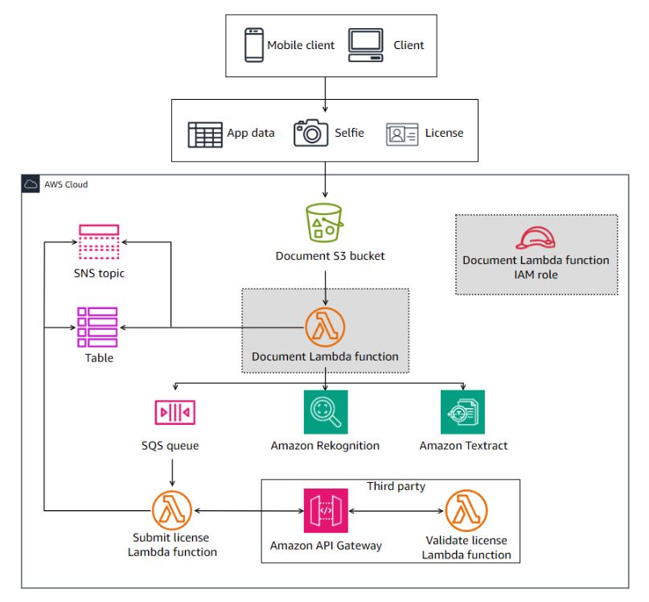

# Capstone Project: Building a Customer Onboarding App - Lab 06

```bash
aws s3 cp ./8d247914.zip s3://documentbucket-360029302288/zipped/
aws s3 cp ./9c358026.zip s3://documentbucket-360029302288/zipped/
```

## Goal: Use Amazon Textract to extract data from a driver license picture and compare it with the data in DynamoDB

## Lab overview

As a cloud developer at AnyCompany Bank, you have been assigned the task of building the new onboarding application on AWS. The application is named Know Your Customer (KYC).

This is the sixth lab of a series of labs that build the KYC application for banking services. Your goal is to build the solution over 10 labs. In each lab, you build a few components of the overall solution.

In this lab, you will add new permissions to the Lambda function role for Amazon Textract. Then, you will update the Lambda function code to perform ID document analysis using the Amazon Textract service, publish notifications to an Amazon Simple Notification Service (Amazon SNS) topic, and update an Amazon DynamoDB table based on the result of analysis performed by Amazon Textract.

This is a challenge-based lab. High-level guidance and references are provided to assist you in completing the lab tasks. Detailed solution instructions are provided in collapsible sections, which you can expand.

## Objectives

By the end of this lab, you should be able to do the following:

Configure the AWS Identity and Access Management (IAM) role to add permissions for Amazon Textract.
Develop Python code using the AWS SDK for Python (Boto3) to perform ID document analysis using the Amazon Textract service.
Develop Python code using the SDK for Python to publish to Amazon SNS.
Develop Python code using the SDK for Python to update DynamoDB table items.
Technical knowledge prerequisites
To successfully complete this lab, you should have a basic knowledge of:

Amazon SNS
Amazon Textract
AWS Cloud9
AWS Lambda
AWS Management Console
AWS Serverless Application Model (AWS SAM)
DynamoDB
IAM
Python
Icon key
 Caution: Information of special interest or importance (not so important to cause problems with the equipment or data if you miss it, but it could result in the need to repeat certain steps).
 Command: A command that you must run.
 Expected output: A sample output that you can use to verify the output of a command or edited file.
 Hint: A hint to a question or challenge.
 Learn more: Where to find more information.
 Note: A tip or important guidance.
 Task complete: A conclusion or summary point in the lab.
 Warning: An action that is irreversible and could potentially impact the failure of a command or process (including warnings about configurations that cannot be changed after they are made).
Start lab
To launch the lab, at the top of the page, choose Start Lab.

 Caution: You must wait for the provisioned AWS services to be ready before you can continue.

To open the lab, choose Open Console .

You are automatically signed in to the AWS Management Console in a new web browser tab.

 Warning: Do not change the Region unless instructed.

Common sign-in errors
Error: Choosing Start Lab has no effect
In some cases, certain pop-up or script blocker web browser extensions might prevent the Start Lab button from working as intended. If you experience an issue starting the lab:

Add the lab domain name to your pop-up or script blocker’s allow list or turn it off.
Refresh the page and try again.
Lab environment
In this lab, you will update the Document Lambda function IAM role with new permissions for Amazon Textract, and update the Document Lambda function code to interact with Amazon Textract, Amazon SNS, and Amazon DynamoDB. These resources are highlighted in the following diagram.



Image description: The diagram depicts the KYC application architectural diagram. It highlights the Document Lambda function IAM role and the Document Lambda function that you will configure in this lab.

Services used in this lab
Amazon Textract
Amazon Textract is a machine learning (ML) service that automatically extracts text, handwriting, layout elements, and data from scanned documents. It goes beyond simple optical character recognition (OCR) to identify, understand, and extract specific data from documents. Today, many companies manually extract data from scanned documents, such as PDFs, images, tables, and forms, or through simple OCR software that requires manual configuration.

AWS Cloud9
AWS Cloud9 is a cloud-based integrated development environment (IDE) that lets you write, run, and debug your code with a browser. It includes a code editor, debugger, and terminal. AWS Cloud9 comes prepackaged with essential tools for popular programming languages, including JavaScript, PHP, Python, and more, so you don’t need to install files or configure your development machine to start new projects.

AWS IAM
AWS Identity and Access Management is a web service that helps you securely control access to AWS resources. With IAM, you can centrally manage permissions that control which AWS resources users can access. You use IAM to control who is authenticated (signed in) and authorized (has permissions) to use resources.

AWS Lambda
AWS Lambda is a compute service that lets you run code without provisioning or managing servers. Lambda runs your code on a high availability compute infrastructure and performs the administration of the compute resources, including server and operating system maintenance, capacity provisioning and automatic scaling, and logging. With Lambda, all you need to do is supply your code in one of the language runtimes that Lambda supports.

AWS SAM
AWS Server Application Model consists of two parts, AWS SAM templates and the AWS SAM command line interface (CLI). AWS SAM templates provide a shorthand syntax, optimized for defining infrastructure as code (IaC) for serverless applications. An extension of AWS CloudFormation, you deploy AWS SAM templates directly to CloudFormation, benefiting from its extensive IaC support on AWS. The AWS SAM CLI is a developer tool that puts AWS SAM features at your fingertips. Use it to quickly create, develop, and deploy serverless applications.

AWS services not used in this lab
AWS service capabilities used in this lab are limited to what the lab requires. Expect errors when accessing other services or performing actions beyond those provided in this lab guide.

Task 1: Configure the Lambda function IAM role permissions
In previous labs, you created the Document Lambda function and attached it to the Document Lambda function IAM role. You also added a few permissions to the role to allow the Lambda function to do the following:

Read, write, and delete objects from the document S3 bucket.
Write and update items to a DynamoDB table.
Publish notifications to an SNS topic.
Write Lambda logs to CloudWatch Logs.
Compare faces from images using Amazon Rekognition.
The Lambda function must call the Amazon Textract service and request to analyze an ID document, which is the driver’s license image, as part of the customer’s verification.

In this task, you will update the Document Lambda function IAM role to allow the required Amazon Textract permissions.

 Note: All the permissions you previously added to the Document Lambda function IAM role are already configured as part of the lab provisioning. You only need to add the new required permissions.

Do it yourself

Create a new managed policy with a permission to analyze an ID document using the Amazon Textract service.

After you create the policy, attach it to the role named DocumentLambdaRole.

 Hint:

Ensure that you follow the principle of least privilege when configuring the new policy.
Do not use inline policy when attaching permissions to the role.
Do not use a wildcard ‘*’ in your policy for the actions.
You can use a wildcard ‘*’ in your policy for the resources.
The policy you create must have only one statement.
You only need one action to analyze an ID document on Amazon Textract.
Solution

Expand the following Detailed instructions section for the full solution.

Detailed instructions
At the top of the AWS Management Console, in the search bar, search for and choose IAM.

You will create the new permissions policy and then attach it to the role.

In the left navigation pane, in the Access management section, choose Policies.

On the Policies page, choose Create policy.

On the Specify permissions page, choose JSON.

In the Policy editor pane, replace any existing policy with the following policy snippet.

```json
{
    "Version": "2012-10-17",
    "Statement": [
                {
            "Effect": "Allow",
            "Action": [
                "textract:AnalyzeID"
            ],
            "Resource": "*"
        }
    ]
}
```

Choose Next.

In the Review and create pane, for the Policy name, enter Lab6DocumentPolicy.

Choose Create policy.

Now, attach the policy to the role.

On the Policies page, find and select the Lab6DocumentPolicy option.

 Note: You can type Lab6DocumentPolicy in the search box to find the policy.

From the Actions menu, choose Attach.

On the Attach as a permissions policy page, find and select the DocumentLambdaRole.

 Note: You can type DocumentLambdaRole in the search box to find the policy.

Choose Attach policy.

 Task complete: You successfully updated the Document Lambda function IAM role to allow the required Amazon Textract permissions.

Task 2: Update the Lambda function code
At this point, your Lambda function code can perform the following:

Download the .zip file from the zipped/ prefix in the S3 bucket.
Extract the three files (license, selfie, and details) from the archive.
Upload the three files to the unzipped/ prefix in the S3 bucket.
Extract the app_uuid, license file object key, and selfie file object key from the file names.
Write the details file’s key-value pairs into the DynamoDB table.
Compare the faces from the images on the selfie and license files, update the DynamoDB table, and then publish Amazon SNS notifications based on the results of the comparisons.
In this task, you will update the Lambda function code to submit the license file to Amazon Textract to analyze it, extract specific details, and then compare the details with corresponding information submitted by the customer (which is stored in the DynamoDB table). This is part of the bank’s validation process. Based on the result of comparison, the Lambda function must add a new key-value pair in the DynamoDB table with the result and also send an Amazon SNS notification.

 Note: The Document Lambda function that is provisioned to you during the lab build has the provided solution code from the end of the previous lab. If you want to use your own code from the previous lab, you need to replace the contents of the DocumentLambdaFunction/app.py file with your code that you saved from the previous lab. Ensure that your code uses the correct environment variables names that are configured in the Lambda function.

Do it yourself

Modify the Lambda function named DocumentLambdaFunction to do the following:

Submit the driver’s license Amazon S3 object to Amazon Textract to extract the customer information from the driver’s license image.
Compare the extracted data (see next bullet point) with the application data stored in the DynamoDB table.
You only need the following data from the license image: DOCUMENT_NUMBER, FIRST_NAME, LAST_NAME, DATE_OF_BIRTH, ADDRESS, STATE_IN_ADDRESS, CITY_IN_ADDRESS, and ZIP_CODE_IN_ADDRESS.
If the data match is true:
Update the DynamoDB table by setting the LICENSE_DETAILS_MATCH attribute to True.
If the data match is false:
Update the DynamoDB table by setting the LICENSE_DETAILS_MATCH attribute to False.
Send a failure message to the SNS topic. The message subject and body can be as simple as Data validation between the license and the .csv file FAILED.
You can optionally subscribe to the SNS topics using a valid email address that you can access to verify that the Lambda function is publishing the SNS topic if the comparison fails.
If the comparison fails, your code should stop and return a message with the outcome. This is important so the code you build in the next challenge will not be running if the license validation fails.
 Hints:

Adhere to good practices when writing your code:
Add comments so your code is easily readable and understandable.
The DocumentLambdaFunction will perform multiple tasks that you code throughout this capstone project. Write the tasks as Python functions and pass the required I/O to and from the main program to each specific function. This also helps when you need to reuse code later.
You can troubleshoot and monitor the Lambda function invocations by viewing the logs in a CloudWatch Logs group of the Lambda function using the AWS Management Console.
You can also use the AWS Cloud9 terminal to monitor the Lambda function logs using the following command.

aws logs tail /aws/lambda/DocumentLambdaFunction
 Learn more: For more information on analyzing documents with Amazon Textract, refer to Announcing support for extracting data from identity documents using Amazon Textract.

Deploy the changes using the sam build and sam deploy CLI commands. You do not need to use any options for the sam deploy command.

Solution

Expand the following Detailed instructions section for the full solution.

Detailed instructions
Update the Lambda function code

To start the AWS Cloud9 environment, locate the Cloud9Url value listed to the left of these instructions and open it in a new browser tab.

At the top of the AWS Cloud9 work area, close the Welcome tab.

In the AWS Cloud9 file explorer, expand the ~/environment directory, and then open the app.py file under the DocumentLambdaFunction directory.

Replace the existing code with the following code.

```python
"Lambda function to process .zip file"
# Environment variables:
# TABLE = CustomerMetaDataTable
# TOPIC = SNS arn
# QUEUE_URL = SQS URL

import json
import os
import csv
import zipfile
import boto3

unzipped_dir = "/tmp/unzipped/"
unzipped_s3_prefix = "unzipped/"
env_table = os.environ['TABLE']
env_topic = os.environ['TOPIC']

s3 = boto3.client('s3')
dynamodb = boto3.resource('dynamodb')
ddb_table = dynamodb.Table(env_table)
rekognition = boto3.client('rekognition')
sns = boto3.client('sns')
textract = boto3.client('textract')

def unzip_object(bucket, key):
    """Download .zip file, extract, return bucket name, object names, app_uuid,
    delete .zip file, and uploading objects to incoming"""
    zip_name = os.path.basename(key)
    zip_fullpath = f'/tmp/{zip_name}'
    s3.download_file(bucket, key, zip_fullpath)
    with zipfile.ZipFile(zip_fullpath, 'r') as zip_ref:
        zip_ref.extractall(unzipped_dir)
    os.remove(zip_fullpath)

    zipped_files = os.listdir(unzipped_dir)
    return zipped_files

def parse_csv_ddb(app_uuid, details_file):
    "Load CSV and save to dynamo"
    with open(details_file, 'r', encoding="utf-8") as file:
        reader = csv.DictReader(file)
        details_dict = next(reader)

    ddb_table.put_item(Item={**details_dict, "APP_UUID": app_uuid})

    return details_dict

def compare_faces(app_uuid, bucket, license_key, selfie_key):
    "calls rekognition to compare license and selfie"
    print("Starting face comparison")
    compare_response = rekognition.compare_faces(
        SourceImage={'S3Object': {
            'Bucket': bucket,
            'Name': license_key,
        }},
        TargetImage={'S3Object': {
            'Bucket': bucket,
            'Name': selfie_key,
        }},
        SimilarityThreshold=80
    )

    if len(compare_response['FaceMatches']) < 1:
        photo_match_result = False
    else:
        photo_match_result = compare_response['FaceMatches'][0]['Similarity'] >= 80

    # Update DDB with photo match value.
    ddb_table.update_item(
        Key={
            'APP_UUID': app_uuid
            },
        UpdateExpression='SET LICENSE_SELFIE_MATCH = :p_match',
        ExpressionAttributeValues={
            ':p_match': photo_match_result
            }
        )

    # Amazon SNS publish and Amazon S3 folder.
    if not photo_match_result:
        sns.publish(
            TopicArn= env_topic,
            Message= 'License photo validation FAILED',
            Subject='License photo validation FAILED',
            )

    print("finished compare faces")
    return photo_match_result

def textract_response(bucket, license_key):
    "Send license to textract"

    # Pass the license image to Amazon Textract to extract information.
    print("Starting license analysis")
    response = textract.analyze_id(
        DocumentPages=[{
                'S3Object': {
                'Bucket': bucket,
                'Name': license_key
            }
        }]
    )

    id_document = response['IdentityDocuments'][0]
    id_data = id_document['IdentityDocumentFields']
    id_fields = {}

    # Build a dictionary of the .csv fields and Amazon Textract values.
    csv_fields = ['DOCUMENT_NUMBER','FIRST_NAME','LAST_NAME','DATE_OF_BIRTH',
                    'ADDRESS','STATE_IN_ADDRESS','CITY_IN_ADDRESS','ZIP_CODE_IN_ADDRESS']
    id_fields = { field['Type']['Text']: field['ValueDetection']['Text'] for field in id_data
                if field['Type']['Text'] in csv_fields }
    print("finished textract")
    return id_fields

def compare_dictionaries(app_uuid, details_dict, textract_dict):
    "Compare license and csv"
    print("Comparing license and csv")

    comparison = details_dict == textract_dict

    # Update DDB with pdata match value, SNS publish, and S3 folder.
    ddb_table.update_item(
        Key={
            'APP_UUID': app_uuid
            },
        UpdateExpression='SET LICENSE_DETAILS_MATCH = :d_match',
        ExpressionAttributeValues={
            ':d_match': comparison
            }
        )

    if not comparison:
        sns.publish(
            TopicArn= env_topic,
            Message= 'Data validation between the license and the .csv file FAILED',
            Subject='Data validation between the license and the .csv file FAILED',
            )
        raise ValueError('Data comparison between App and license FAILED. Program will stop')

    return comparison

def lambda_handler(event, _):
    "Main lambda handler"
    record = event['Records'][0]
    bucket = record['s3']['bucket']['name']
    key = record['s3']['object']['key']

    # Unzip the object from the event.
    files_list = unzip_object(bucket, key)

    # Upload files to the unzipped location.
    for file in files_list:
        s3.upload_file(unzipped_dir + file, bucket, unzipped_s3_prefix + file)

    # Retrieve app_uuid from the .zip file.
    app_uuid = os.path.basename(key).replace(".zip", "")
    selfie_key = f"{unzipped_s3_prefix}{app_uuid}_selfie.png"
    license_key = f"{unzipped_s3_prefix}{app_uuid}_license.png"

    # Save the .csv file to DynamoDB.
    details_file = f"{unzipped_dir}{app_uuid}_details.csv"
    details_dict = parse_csv_ddb(app_uuid, details_file)

    # Submit license and selfie to Amazon Rekognition to compare faces.
    rekog_response = compare_faces(app_uuid, bucket, license_key, selfie_key)
    if not rekog_response:
        raise ValueError('Photo rekognition match FAILED. Program will stop')

    # Submit license to Amazon Textract to extract fields.
    textract_dict = textract_response(bucket, license_key)

    # Compare the Amazon Textract fields with the .csv file.
    compare_dictionaries(app_uuid, details_dict, textract_dict)
```

Save the app.py file.

 Command: To redeploy the application, run the following command from the AWS Cloud9 bash terminal.


sam build && sam deploy
 Expected output: Output has been truncated and might be slightly different.


******************************
******* EXAMPLE OUTPUT *******
******************************

Build Succeeded

Successfully created/updated stack - kyc-app in us-west-2
Test the function as described in the following section.

Test the Lambda function
Test use case 1 - True match

Download a correct sample .zip file 8d247914.zip or from the AWS Cloud9 file explorer. This file has a match between the license and selfie images.

Invoke your Lambda function by uploading the provided sample compressed file to the zipped/ prefix on the S3 bucket. You can retry uploading the file, as needed. Each upload will overwrite the existing object and create a new Lambda invocation event.

Verify that the DynamoDB table was updated with the LICENSE_DETAILS_MATCH key and a corresponding value of True.

Expand the following DynamoDB table verification section for detailed instructions.

DynamoDB table verification
At the top of the AWS Management Console, in the search bar, search for and choose DynamoDB.

On the Amazon DynamoDB page, in the navigation pane at the left of the page, choose Tables.

On the Tables page, choose the link for the CustomerMetadataTable table.

On the CustomerMetadataTable page, choose Explore table items.

Locate the item in the Items returned section and verify that the DynamoDB table item was updated with the correct value in the LICENSE_DETAILS_MATCH key.

Test use case 2 - False match

Download an incorrect sample .zip file 9c358026.zip or from the AWS Cloud9 file explorer. This file has a mismatch between the license and selfie images.

Invoke your Lambda function by uploading the provided sample compressed file to the zipped/ prefix in the S3 bucket. You can retry uploading the file as needed. Each upload will overwrite the existing object and create a new Lambda invocation event.

Verify that the DynamoDB table was updated with the LICENSE_DETAILS_MATCH key and a corresponding value of False.

If you optionally subscribed to the SNS topic with your email, verify that you receive an email indicating that the License details validation FAILED.

Lab files
The lab environment is ephemeral. All the lab resources are deleted when the lab time expires. If you want to keep a copy of the lab code, you can download all the lab code using the AWS Cloud9 environment.

To save the files on your local computer, in the AWS Cloud9 menu bar, choose File, and then choose Download Project.
 Task complete: You successfully updated the DocumentLambdaFunction code to submit the license file to Amazon Textract to analyze it, extract specific details, and then compare the details with corresponding information submitted by the customer.

Conclusion
You successfully completed the following:

Configured an IAM role to add permissions for Amazon Textract.
Developed Python code using the SDK for Python to perform ID document analysis using the Amazon Textract service.
Developed Python code using the SDK for Python to publish to Amazon SNS.
Developed Python code using the SDK for Python to update DynamoDB table items.
End lab
Follow these steps to close the console and end your lab.

Return to the AWS Management Console.

At the upper-right corner of the page, choose AWSLabsUser, and then choose Sign out.

Choose End Lab and then confirm that you want to end your lab.

For more information about AWS Training and Certification, see https://aws.amazon.com/training/.

Your feedback is welcome and appreciated.
If you would like to share any feedback, suggestions, or corrections, please provide the details in our AWS Training and Certification Contact Form.