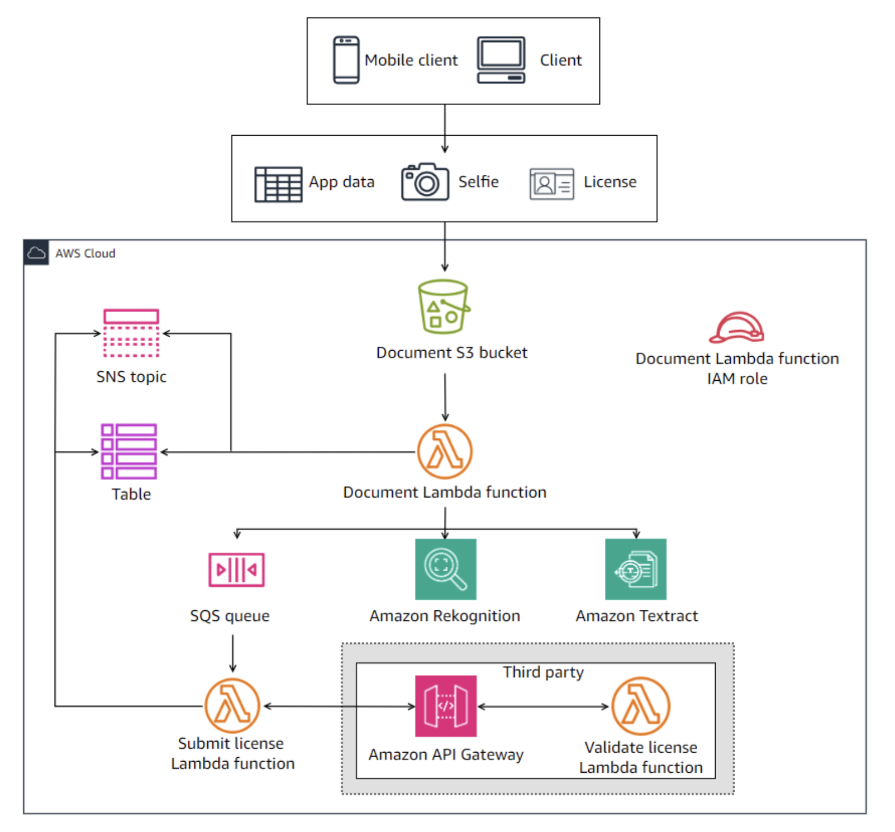

# Capstone Project: Building a Customer Onboarding App - Lab 07

## Lab overview

As a cloud developer at AnyCompany Bank, you have been assigned the task of building the new onboarding application on AWS. The application is named Know Your Customer (KYC).

This is the seventh lab of a series of labs that build the KYC application for banking services. Your goal is to build the solution over 10 labs. In each lab, you build a few components of the overall solution.

In this lab, you will create a new AWS Lambda function that mimics a third-party validation of the customer’s driver’s license. You will also create an HTTP API using Amazon API Gateway and integrate it with the Lambda function.

This is a challenge-based lab. High-level guidance and references are provided to assist you in completing the lab tasks. Detailed solution instructions are provided in collapsible sections, which you can expand.

Objectives
By the end of this lab, you should be able to do the following:

Create a new Lambda function as an API backend.
Configure an HTTP API using API Gateway.
Integrate the API with the Lambda function.
Perform testing with different payloads to test the API.
Technical knowledge prerequisites
To successfully complete this lab, you should have a basic knowledge of:

API Gateway
AWS Cloud9
AWS Lambda
AWS Management Console
AWS Serverless Application Model (AWS SAM)
Python
Icon key
 Caution: Information of special interest or importance (not so important to cause problems with the equipment or data if you miss it, but it could result in the need to repeat certain steps).
 Command: A command that you must run.
 Expected output: A sample output that you can use to verify the output of a command or edited file.
 Hint: A hint to a question or challenge.
 Note: A tip or important guidance.
 Task complete: A conclusion or summary point in the lab.
 Warning: An action that is irreversible and could potentially impact the failure of a command or process (including warnings about configurations that cannot be changed after they are made).
Start lab
To launch the lab, at the top of the page, choose Start Lab.

 Caution: You must wait for the provisioned AWS services to be ready before you can continue.

To open the lab, choose Open Console .

You are automatically signed in to the AWS Management Console in a new web browser tab.

 Warning: Do not change the Region unless instructed.

Common sign-in errors
Error: Choosing Start Lab has no effect
In some cases, certain pop-up or script blocker web browser extensions might prevent the Start Lab button from working as intended. If you experience an issue starting the lab:

Add the lab domain name to your pop-up or script blocker’s allow list or turn it off.
Refresh the page and try again.

## Lab environment

In this lab, you will create and configure the Amazon API Gateway and the Validate license Lambda function. These resources are highlighted in the following diagram.

Image description: The diagram depicts the KYC application architectural diagram. It highlights the Amazon API Gateway and the Validate license Lambda function that you will create and configure in this lab.

Services used in this lab
Amazon API Gateway
Amazon API Gateway is a fully managed service that makes it easy for developers to create, publish, maintain, monitor, and secure APIs at any scale. APIs act as the “front door” for applications to access data, business logic, or functionality from your backend services. Using API Gateway, you can create RESTful APIs and WebSocket APIs that enable real-time, two-way communication applications. API Gateway supports containerized and serverless workloads, as well as web applications.

AWS Cloud9
AWS Cloud9 is a cloud-based integrated development environment (IDE) that lets you write, run, and debug your code with a browser. It includes a code editor, debugger, and terminal. AWS Cloud9 comes prepackaged with essential tools for popular programming languages, including JavaScript, PHP, Python, and more, so you don’t need to install files or configure your development machine to start new projects.

AWS Lambda
AWS Lambda is a compute service that lets you run code without provisioning or managing servers. Lambda runs your code on a high availability compute infrastructure and performs the administration of the compute resources, including server and operating system maintenance, capacity provisioning and automatic scaling, and logging. With Lambda, all you need to do is supply your code in one of the language runtimes that Lambda supports.

AWS SAM
AWS Serverless Application Model consists of two parts, AWS SAM templates and the AWS SAM command line interface (CLI). AWS SAM templates provide a shorthand syntax, optimized for defining infrastructure as code (IaC) for serverless applications. An extension of AWS CloudFormation, you deploy AWS SAM templates directly to CloudFormation, benefiting from its extensive IaC support on AWS. The AWS SAM CLI is a developer tool that puts AWS SAM features at your fingertips. Use it to quickly create, develop, and deploy serverless applications.

AWS services not used in this lab
AWS service capabilities used in this lab are limited to what the lab requires. Expect errors when accessing other services or performing actions beyond those provided in this lab guide.

Task 1: Configure the validate license Lambda function
At this point, you have built most of the components of the solution and developed the major part of the Document Lambda function code. In this lab, you will shift your focus to a different component, which is the license validation component. A third-party service to verify the license is planned, but for now, you will write a simulation of the service that will be used in the development environment.

Recall that the customer validation has multiple tasks that currently are running synchronously, as follows:

Verify that the license and selfie images have matching photos for the customer. (You developed this with Amazon Rekognition.)
Verify that the license image’s information matches the customer details. (You developed this with Amazon Textract.)
Send the license to a third-party API to validate the license.
The last item is still missing in the solution. You will build this component in this lab and then integrate it with the rest of your solution in the next lab.

The solution has the following components:

API that you build using Amazon API Gateway that represents the frontend, which will receive the license validation request from your solution
Backend Lambda function named ValidateLicenseLambdaFunction that verifies the license and returns a response to the requester
In this task, you will create ValidateLicenseLambdaFunction and configure its code and settings.

 Note:

You will build a mock Lambda function code for validation to simulate both valid (True) and invalid (False) license use cases for testing purposes.
When you start this lab, the solution will have all the components that have been built and configured at the end of the last lab, including the full Python code of DocumentLambdaFunction.
You do not need to modify the DocumentLambdaFunction code in this lab, as you will be only working on the third-party API and Lambda function.
Do it yourself

Create a Lambda function with the following settings:

The function name must be ValidateLicenseLambdaFunction.
Runtime should be Python 3.12.
The function should assume the ValidateLicenseLambdaRole role when invoked. This role is preconfigured for you during the lab build. You do not need to modify its permissions. The role Amazon Resource Name (ARN) is listed to the left of these instructions.
Develop the function’s Python code. Consider the following when building the code:

The function will be invoked by an HTTP API that you will build in the next task.
The event that will invoke the function is in a Python dictionary format carrying a JSON string object. It has the following format.

event = {'body': '{JSON string object}'}
You need to use the json.loads method for the body of the event to convert it into a Python dictionary. Then, you can extract its required values.

Here is a sample of the event your function expects to receive.

{'body': '{"driver_license_id": "S123456579010", "validation_override": false}'}
The event body has a license ID (driver_license_id) parameter and an override (validation_override) parameter that can have a value of True or False.
If the override parameter is True, the function must return a True response to the API, indicating that the license is valid.
If the override parameter is False, the function must return a False response to the API, indicating that the license is invalid.
 Note: In real life, you should only pass the license ID to a third-party validation API. Because this is a mock validation, the solution must respond correctly to both valid and invalid license checks (True or False). This is why you are also passing an override parameter.

 Hints:

Deploy the new Lambda function by adding it as a new resource to the template.yaml file in your AWS Cloud9 environment and then redeploy the template using the AWS SAM CLI.
For the new Lambda function code, you can create a new folder in your AWS Cloud9 environment home directory named ValidateLicenseLambdaFunction and add your Python code under a new file named app.py. This will ensure that your solution is following the same file and naming convention of the existing Lambda function.
You can troubleshoot and monitor the Lambda function invocations by viewing the logs in the CloudWatch Logs group of the Lambda function using the AWS Management Console.
You can also use the AWS Cloud9 terminal to monitor the Lambda function logs by using the following command.

aws logs tail /aws/lambda/ValidateLicenseLambdaFunction
Solution

Expand the following Detailed instructions section for the full solution.

Detailed instructions
Update the template.yaml file

To start the AWS Cloud9 environment, locate the Cloud9Url value listed to the left of these instructions and open it in a new browser tab.

At the top of the AWS Cloud9 work area, close the Welcome tab.

In the AWS Cloud9 file explorer, expand the ~/environment directory, and then open the template.yaml file.

Copy the following snippet and paste it after the DocumentLambdaFunction resource.

#-----Start - Validate License Lambda function -----#
  ValidateLicenseLambdaFunction:
    Type: AWS::Serverless::Function 
    Properties:
      FunctionName: ValidateLicenseLambdaFunction
      Role: !Sub arn:aws:iam::${AWS::AccountId}:role/ValidateLicenseLambdaRole
      CodeUri: ValidateLicenseLambdaFunction/
      Handler: app.lambda_handler
      Runtime: python3.12
#-----End - Validate License Lambda function -----#
 Note: Make sure that your indentation is correct. The ValidateLicenseLambdaFunction resource must be aligned with the other resources in the template. Correct any misalignment due to the copy and paste operation.

Save the template.yaml file.

Add the Lambda function code

 Command: To create a new directory for the new Lambda function code, in the AWS Cloud9 bash terminal, while your prompt is on the ~/environment directory, run the following command.

mkdir ValidateLicenseLambdaFunction
 Command: To create a new app.py file in the ValidateLicenseLambdaFunction directory, in the AWS Cloud9 bash terminal, run the following command.

touch ValidateLicenseLambdaFunction/app.py
In the AWS Cloud9 file explorer, expand the ValidateLicenseLambdaFunction directory, and then open the app.py file.

Copy the following Python code snippet and paste it into the app.py file.

"Fake driver license API responds with the validation_override"
import json

def lambda_handler(event, context):
    "Takes API gateway event and responds with the validation_override"
    body = event['body']
    body_json = json.loads(body)
    license_id = body_json['driver_license_id']
    override_parameter = body_json['validation_override']

    response = {}
    response['statusCode'] = 200
    response['body'] = override_parameter
    return response
Save the app.py file.

 Command: To redeploy the application, run the following command from the AWS Cloud9 bash terminal.

sam build && sam deploy
 Expected output: Output has been truncated and might be slightly different.

******************************
******* EXAMPLE OUTPUT *******
******************************

Build Succeeded

Successfully created/updated stack - kyc-app in us-west-2
Test the function as described in the following section.

Test the Lambda function
Once the Lambda function is deployed, test your solution for the following use cases.

Test use case 1 - Valid license test

 Command: In the AWS Cloud9 bash terminal, run the following command (note that validation_override is set to true).

aws lambda invoke --function-name ValidateLicenseLambdaFunction \
--cli-binary-format raw-in-base64-out \
--payload '{"body": "{\"driver_license_id\": \"S123456579010\", \"validation_override\": true}"}' response.json
The output is written to a file named response.json.

In the AWS Cloud9 file explorer, open response.json. The file should contain the following output.

{"statusCode": 200, "body": true}
Test use case 2 - Invalid license test

 Command: In the AWS Cloud9 bash terminal, run the following command (note that validation_override is set to false).

aws lambda invoke --function-name ValidateLicenseLambdaFunction \
--cli-binary-format raw-in-base64-out \
--payload '{"body": "{\"driver_license_id\": \"S123456579010\", \"validation_override\": false}"}' response.json
The output is written to a file named response.json.

In the AWS Cloud9 file explorer, open response.json. The file should contain the following output.

{"statusCode": 200, "body": false}
 Task complete: You successfully created ValidateLicenseLambdaFunction and configured its code and settings.

Task 2: Create a third-party license validation API
In this task, you will use Amazon API Gateway to create and configure an HTTP API, and integrate it with ValidateLicenseLambdaFunction.

Configure an HTTP API with the following settings:

Name: ValidateLicenseApi - Use the same name and case provided here. Otherwise, the testing and validation might fail.
Protocol: HTTP
Endpoint type: Regional
Path: /license - Use the same path provided here. Otherwise, the testing and validation might fail.
Method: POST
Deployment stage: $default
When the API endpoint is called, it should invoke ValidateLicenseLambdaFunction to validate the license using the mock validation code that you developed in the previous task.
 Hints:

Deploy the HTTP API by adding it as a new resource in the template.yaml file in your AWS Cloud9 environment, and then redeploy the template using the AWS SAM CLI. For more information, refer to AWS::Serverless::HttpApi.
To configure the integration between the HTTP API and ValidateLicenseLambdaFunction, you can add an Event key to the Lambda function resource in the template.yaml file. For more information, refer to EventSource.
You can troubleshoot and monitor the Lambda function invocations by viewing the logs in the CloudWatch Logs group of the Lambda function using the AWS Management Console.
You can also use the AWS Cloud9 terminal to monitor the Lambda function logs using the following command.

aws logs tail /aws/lambda/ValidateLicenseLambdaFunction
Solution

Expand the following Detailed instructions section for the full solution.

Detailed instructions
Add the API event to the Lambda resource in the template.yaml file

In the AWS Cloud9 file explorer, expand the ~/environment directory, and then open the template.yaml file.

Copy the following snippet and paste it at the end of the ValidateLicenseLambdaFunction resource in the template.yaml file. The Events key must be aligned as one of the Lambda function Properties:

Events:
  License:
    Type: HttpApi
    Properties:
      Path: /license
      Method: post
      ApiId: !Ref HttpApi
 Note: Make sure that your indentation is correct. Correct any misalignment due to the copy and paste operation.

After pasting the Events key and its properties, the ValidateLicenseLambdaFunction resource in the template.yaml file should look similar to the following snippet.

#-----Start - Validate License Lambda function -----#
  ValidateLicenseLambdaFunction:
    Type: AWS::Serverless::Function 
    Properties:
      FunctionName: ValidateLicenseLambdaFunction
      Role: !Sub arn:aws:iam::${AWS::AccountId}:role/ValidateLicenseLambdaRole
      CodeUri: ValidateLicenseLambdaFunction/
      Handler: app.lambda_handler
      Runtime: python3.12
      Events:
        License:
          Type: HttpApi
          Properties:
            Path: /license
            Method: post
            ApiId: !Ref HttpApi
#-----End - Validate License Lambda function -----#
Add the HTTP API resource to the template.yaml file

Copy the following snippet and paste it after the ValidateLicenseLambdaFunction resource in the template.yaml file. Make sure that your indentation is correct. The HttpApi resource must be aligned with the other resources in the template. Correct any misalignment due to the copy and paste operation.

#-----Start - HTTP API-----#
  HttpApi:
    Type: AWS::Serverless::HttpApi
    Properties:
      Name: ValidateLicenseApi
      StageName: "$default"
#-----END - HTTP API-----#
Save the template.yaml file.

 Command: To redeploy the application, run the following command from the AWS Cloud9 bash terminal.

sam build && sam deploy
 Expected output: Output has been truncated and might be slightly different.

******************************
******* EXAMPLE OUTPUT *******
******************************

Build Succeeded

Successfully created/updated stack - kyc-app in us-west-2
Test your solution
Capture the API endpoint URL

Once the HTTP API is deployed and integrated with the Lambda function, you will retrieve the API endpoint URL that is used to invoke the API and save it as a variable named API_ENDPOINT_URL.

At the top of the AWS Management Console, in the search bar, search for and choose API Gateway.

In the APIs page, choose the ValidateLicenseApi link.

In the left navigation pane, in the Deploy section, choose Stages.

In the Stages section, select the $default stage if not already selected.

In the Stage details section, copy the Invoke URL link and save it in your preferred text editor.

 Note: The link should look like https://tmml7peuqd.execute-api.us-west-2.amazonaws.com with a different ID and maybe a different region.

Return to the AWS Cloud terminal browser tab.

 Command: To save the API invoke URL as a variable, in the AWS Cloud9 bash terminal, run the following command from after replacing the INSERT_INVOKE_URL with the value you copied in the previous step.

API_ENDPOINT_URL=INSERT_INVOKE_URL/license && echo $API_ENDPOINT_URL
 Expected output: Your output will have a different API ID, and maybe a different region.

******************************
******* EXAMPLE OUTPUT *******
******************************

https://tmml7peuqd.execute-api.us-west-2.amazonaws.com/license
Test use case 1 - Valid license test

 Command: To invoke the API with validation_override is set to True, in the AWS Cloud9 bash terminal, run the following command.

curl -X POST -H 'Content-Type: application/json' -d '{"driver_license_id": "S123456579010", "validation_override": "True"}' $API_ENDPOINT_URL
 Expected output:

True
Test use case 2 - Invalid license test

 Command: To invoke the API with validation_override is set to False, in the AWS Cloud9 bash terminal, run the following command.

curl -X POST -H 'Content-Type: application/json' -d '{"driver_license_id": "S123456579010", "validation_override": "False"}' $API_ENDPOINT_URL
 Expected output:

False
Lab files
The lab environment is ephemeral. All the lab resources are deleted when the lab time expires. If you want to keep a copy of the lab code, you can download all the lab code using the AWS Cloud9 environment.

To save the files on your local computer, in the AWS Cloud9 menu bar, choose File, and then choose Download Project.
 Task complete: You successfully used Amazon API Gateway to create and configure an HTTP API, and integrated it with the ValidateLicenseLambdaFunction resource.

Conclusion
You successfully completed the following:

Created a new Lambda function as an API backend.
Configured an HTTP API using API Gateway.
Integrated the API with the Lambda function.
Performed testing with different payloads to test the API.
End lab
Follow these steps to close the console and end your lab.

Return to the AWS Management Console.

At the upper-right corner of the page, choose AWSLabsUser, and then choose Sign out.

Choose End Lab and then confirm that you want to end your lab.

For more information about AWS Training and Certification, see https://aws.amazon.com/training/.

Your feedback is welcome and appreciated.
If you would like to share any feedback, suggestions, or corrections, please provide the details in our AWS Training and Certification Contact Form.