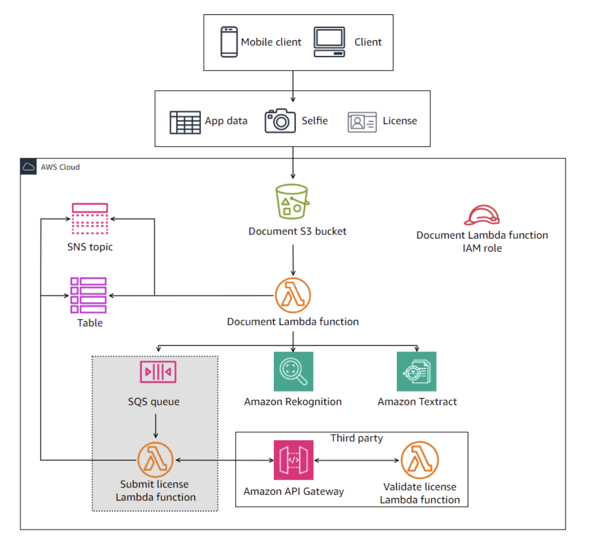

# Capstone Project: Building a Customer Onboarding App - Lab 08

## Lab overview

As a cloud developer at AnyCompany Bank, you have been assigned the task of building the new onboarding application on AWS. The application is named Know Your Customer (KYC).

This is the eighth lab of a series of labs that build the KYC application for banking services. Your goal is to build the solution over 10 labs. In each lab, you build a few components of the overall solution.

In this lab, you will create an Amazon Simple Queue Service (Amazon SQS) queue to submit the license for third-party integration, create the Lambda function to submit the license, and develop the Lambda function code.

This is a challenge-based lab. High-level guidance and references are provided to assist you in completing the lab tasks. Detailed solution instructions are provided in collapsible sections, which you can expand.

Objectives
By the end of this lab, you should be able to do the following:

Create an SQS queue and configure a dead-letter queue.
Create a new Lambda function that submits the license to a third-party API validation and develop its code.
Modify the document Lambda function permissions and code to write messages to the SQS queue.
Test the full solution.
Technical knowledge prerequisites
To successfully complete this lab, you should have a basic knowledge of:

Amazon SQS
AWS Cloud9
AWS Lambda
AWS Management Console
AWS Serverless Application Model (AWS SAM)
Python
Icon key
 Caution: Information of special interest or importance (not so important to cause problems with the equipment or data if you miss it, but it could result in the need to repeat certain steps).
 Command: A command that you must run.
 Expected output: A sample output that you can use to verify the output of a command or edited file.
 Hint: A hint to a question or challenge.
 Learn more: Where to find more information.
 Note: A tip or important guidance.
 Task complete: A conclusion or summary point in the lab.
 Warning: An action that is irreversible and could potentially impact the failure of a command or process (including warnings about configurations that cannot be changed after they are made).
Start lab
To launch the lab, at the top of the page, choose Start Lab.

 Caution: You must wait for the provisioned AWS services to be ready before you can continue.

To open the lab, choose Open Console .

You are automatically signed in to the AWS Management Console in a new web browser tab.

 Warning: Do not change the Region unless instructed.

Common sign-in errors
Error: Choosing Start Lab has no effect
In some cases, certain pop-up or script blocker web browser extensions might prevent the Start Lab button from working as intended. If you experience an issue starting the lab:

Add the lab domain name to your pop-up or script blocker’s allow list or turn it off.
Refresh the page and try again.

## Lab environment

In this lab, you will create and configure an SQS queue and the Submit license Lambda function. These resources are highlighted in the following diagram.

Image description: The diagram depicts the KYC application architectural diagram. It highlights the SQS queue and the Submit license Lambda function that you will create and configure in this lab.

In the previous lab, you created a third-party API to validate the license. In this lab, you will configure the Document Lambda function to submit the driver’s license ID to the third-party API to validate it.

Instead of making the Document Lambda function submit the driver’s license ID directly to the API, you should separate the solution components using a message queue. Here is how it works.

When the Document Lambda function needs to validate a customer’s driver’s license, it will write the license ID to an Amazon SQS queue. When a new message is in the queue (license ID), this will invoke another Lambda function, named Submit license Lambda function, that reads the messages from the queue and submits them to the third-party API.

Services used in this lab
Amazon SQS
Amazon Simple Queue Service offers a secure, durable, and available hosted queue that lets you integrate and decouple distributed software systems and components. Amazon SQS offers common constructs such as dead-letter queues and cost-allocation tags. It provides a generic web services API that you can access using any programming language that the AWS SDK supports.

AWS Cloud9
AWS Cloud9 is a cloud-based integrated development environment (IDE) that lets you write, run, and debug your code with a browser. It includes a code editor, debugger, and terminal. AWS Cloud9 comes prepackaged with essential tools for popular programming languages, including JavaScript, PHP, Python, and more, so you don’t need to install files or configure your development machine when you start new projects.

AWS Lambda
AWS Lambda is a compute service that lets you run code without provisioning or managing servers. Lambda runs your code on a high availability compute infrastructure and performs the administration of the compute resources, including server and operating system maintenance, capacity provisioning and automatic scaling, and logging. With Lambda, all you need to do is supply your code in one of the language runtimes that Lambda supports.

AWS SAM
AWS Serverless Application Model consists of two parts, AWS SAM templates and the AWS SAM command line interface (CLI). AWS SAM templates provide a shorthand syntax, optimized for defining infrastructure as code (IaC) for serverless applications. An extension of AWS CloudFormation, you deploy AWS SAM templates directly to CloudFormation, benefiting from its extensive IaC support on AWS. The AWS SAM CLI is a developer tool that puts AWS SAM features at your fingertips. Use it to quickly create, develop, and deploy serverless applications.

AWS services not used in this lab
AWS service capabilities used in this lab are limited to what the lab requires. Expect errors when accessing other services or performing actions beyond those provided in this lab guide.

Task 1: Create and configure an Amazon SQS queue
In this task, you will create an SQS queue and configure its settings.

Do it yourself

Create a standard Amazon SQS queue and name it LicenseQueue. Consider the following when creating the queue:

Use the AWS Management Console to create the queue.
If the third-party API does not respond within 5 minutes, the message in question should reappear in the queue so it can be processed again.
Create another standard SQS queue and configure it as a dead-letter queue (DLQ) for the LicenseQueue. Name the DLQ LicenseDeadLetterQueue.
If a message fails to be processed five times while in the LicenseQueue, the message must be moved to LicenseDeadLetterQueue.
 Note: A dead-letter queue is used to capture messages that fail processing after a certain threshold of failures. This is important because you have no control of the third-party API. Therefore, you should have a queue that captures failed messages, so you can handle how to process them.

Solution

Expand the following Detailed instructions section for the full solution.

Detailed instructions
Create the dead-letter queue

At the top of the AWS Management Console, in the search bar, search for and choose SQS.

On the Amazon SQS page, choose Create queue.

On the Create queue page, configure the following:

For Type, select Standard.
For Name, enter LicenseDeadLetterQueue.
Accept the default values for all other settings.

Choose Create queue.

Create the license queue

1. In the left navigation pane, choose Queues.

Choose Create queue.

On the Create queue page, configure the following:

For Type, select Standard.
For Name, enter LicenseQueue.
For Visibility timeout, enter 300.
For Dead-letter queue, select Enabled.
In the Choose queue menu, select the LicenseDeadLetterQueue.
For Maximum receives, enter 5.
Accept the default values for all other settings.

Choose Create queue.

 Task complete: You successfully created the SQS queue and configured its settings.

Task 2: Create and configure the license submit Lambda function
In this task, you will create the License submit Lambda function and configure LicenseQueue to invoke the Lambda function when there is a new message in the queue. You will also configure the Lambda function code. For this task, the Lambda function code will be a simple code to print the invocation event. You will develop the full code in a later task.

Do it yourself

Create a Lambda function with the following settings:

The function’s name must be SubmitLicenseLambdaFunction.
Runtime should be Python 3.12.
The function’s AWS Identity and Access Management (IAM) role is SubmitLicenseLambdaRole. This role is preconfigured for you during the lab build. You do not need to modify its permissions. The role Amazon Resource Name (ARN) is listed to the left of these instructions.
Configure the LicenseQueue as an event that can invoke the Lambda function when a message is written to the queue. You pass only one message to the Lambda function when invoked (BatchSize). You need to retrieve and use the LicenseQueue ARN which you created in the previous task.

 Learn more: For more information, refer to AWS SAM template for an Amazon SQS application.

Develop a simple Python code for the function where the function will print the invocation event when invoked.

 Hints:

Deploy the new Lambda function and its Amazon SQS event by adding it as a new resource to the template.yaml file in your AWS Cloud9 environment and then redeploy the template using the AWS SAM CLI.
For the new Lambda function code, you can create a new folder in your AWS Cloud9 environment home directory named SubmitLicenseLambdaFunction and add your Python code under a new file named app.py. This will ensure that your solution is following the same file and naming convention of the existing Lambda function.
When the SubmitLicenseLambdaFunction is invoked, it needs permissions to read messages from the SQS queue. All the required permissions are preconfigured and added to the existing SubmitLicenseLambdaRole. You do not need to configure any permissions.
You can troubleshoot and monitor the Lambda function invocations by viewing the logs in the CloudWatch Logs group of the Lambda function using the AWS Management Console.
You can also use the AWS Cloud9 terminal to monitor the Lambda function logs using the following command.

aws logs tail /aws/lambda/SubmitLicenseLambdaFunction
Solution

Expand the following Detailed instructions section for the full solution.

Detailed instructions
Update the template.yaml file

To start the AWS Cloud9 environment, locate the Cloud9Url value listed to the left of these instructions and open it in a new browser tab.

At the top of the AWS Cloud9 work area, close the Welcome tab.

In the AWS Cloud9 file explorer, expand the ~/environment directory, and then open the template.yaml file.

Copy the following snippet and paste it at the end of the template.yaml file.

#-----Start - SubmitLicenseLambdaFunction -----#
  SubmitLicenseLambdaFunction:
    Type: AWS::Serverless::Function 
    Properties:
      FunctionName: SubmitLicenseLambdaFunction
      Role: !Sub arn:aws:iam::${AWS::AccountId}:role/SubmitLicenseLambdaRole
      CodeUri: SubmitLicenseLambdaFunction/
      Handler: app.lambda_handler
      Runtime: python3.12
      Events:
        SQSEvent:
          Type: SQS
          Properties:
            Enabled: true
            Queue: !Sub arn:aws:sqs:${AWS::Region}:${AWS::AccountId}:LicenseQueue
            BatchSize: 1
#-----End - SubmitLicenseLambdaFunction -----#
 Note: Make sure that your indentation is correct. The SubmitLicenseLambdaFunction resource must be aligned with the other resources in the template. Correct any misalignment due to the copy and paste operation.

Save the template.yaml file.

Add the Lambda function code

 Command: In the AWS Cloud9 bash terminal, and while your prompt is on the ~/environment directory, enter the following command to create a new directory for the new Lambda function code.

mkdir SubmitLicenseLambdaFunction
 Command: In the AWS Cloud9 bash terminal, to create a new app.py in the ValidateLicenseLambdaFunction directory, enter the following command.

touch SubmitLicenseLambdaFunction/app.py
In the AWS Cloud9 file explorer, expand the SubmitLicenseLambdaFunction directory, and then open the app.py file.

Copy the following Python code snippet and paste it into the app.py file.

def lambda_handler(event, context):
    print(event)
The preceding code will only print the invocation event to CloudWatch Logs.

Save the app.py file.

 Command: To redeploy the application, run the following command from the AWS Cloud9 bash terminal.

sam build && sam deploy
 Expected output: Output has been truncated and might be slightly different.

******************************
******* EXAMPLE OUTPUT *******
******************************

Build Succeeded

Successfully created/updated stack - kyc-app in us-west-2
Test the function, as described in the following section.

Test the Lambda function
Once the Lambda function is deployed, you can test it by writing a message to the LicenseQueue. If your message is properly configured, it should print the event in CloudWatch Logs.

First, find the LicenseQueue URL.

 Command: In the AWS Cloud9 bash terminal, run the following command to retrieve the LicenseQueue URL and save it as a QueueUrl variable.

QueueUrl=$(aws sqs get-queue-url --queue-name LicenseQueue --output text)
 Command: In the AWS Cloud9 bash terminal, run the following command to verify the variable.

echo $QueueUrl
 Expected output: Output has been truncated and might be slightly different.

******************************
******* EXAMPLE OUTPUT *******
******************************

https://sqs.us-west-2.amazonaws.com/111122223333/LicenseQueue
 Command: In the AWS Cloud9 bash terminal, run the following command to test if your Lambda function can read messages from the queue.

aws sqs send-message --queue-url $QueueUrl --message-body '{"driver_license_id": "S123456579010", "validation_override": true, "uuid": "8d247914"}'
 Expected output: Your output will have a different message ID and hash value.

******************************
******* EXAMPLE OUTPUT *******
******************************

{
    "MD5OfMessageBody": "a775c4d9e8aa5d64e5f563d3dc29d969",
    "MessageId": "5a0a9200-b54a-42e7-851d-7dac34a3e851"
}
Check CloudWatch Logs to see if your Lambda function was correctly invoked and printed the message event in the logs. You can find the logs under the log group name of the SubmitLicenseLambdaFunction. Check the latest log stream. You can find the event printed under a dictionary named Records, and you can find the message body under an item named body.

 Task complete: You successfully created the License submit Lambda function and configured the LicenseQueue to invoke the Lambda function when there is a new message in the queue. You also configured the Lambda function code.

Task 3: Update the Lambda function code
In this task, you will update the LicenseSubmitLambdaFunction code. The process starts when a message (license ID) is put in the queue by the DocumentLambdaFunction, which you will configure in the next task. This invokes LicenseSubmitLambdaFunction, which needs to perform the validation tasks.

Do it yourself

Modify the LicenseSubmitLambdaFunction code to perform the following:

It reads the message from the LicenseQueue.
The message contains the driver’s license ID, an override parameter (True or False), and the APP_UUID parameter, which refers to the customer entry in the DynamoDB table.
The message from the queue is named Records, and it is in the format of a Python dictionary. It has an item named body, which contains the message body. Here is a sample of the message.
{‘Records’: [ {‘messageId’: ‘randomID’, ‘receiptHandle’: ‘random handle’, ‘body’: ‘{“driver_license_id”: “S123456579010”, “validation_override”: true, “uuid”: “8d247914”}’, ‘attributes’: {‘ApproximateReceiveCount’: ‘1’, ‘AWSTraceHeader’: ‘Root=1-652dbb31-7d5e4d70705c69373f1b8bc6;Parent=2914e63844957e86;Sampled=0;Lineage=4181fb98:0’, ‘SentTimestamp’: ‘1697495864359’, ‘SenderId’: ‘AROAWBAYBA52LKI3Y3ERT:DocumentLambdaFunction’, ‘ApproximateFirstReceiveTimestamp’: ‘1697495864368’}, ‘messageAttributes’: {}, ‘md5OfBody’: ‘a775c4d9e8aa5d64e5f563d3dc29d969’, ‘eventSource’: ‘aws:sqs’, ‘eventSourceARN’: ‘arn:aws:sqs:ap-southeast-2:111122223333:LicenseQueue’, ‘awsRegion’: ‘ap-southeast-2’} ]}

The Lambda function should extract the values from the message body, and submit the driver’s license ID and override parameter to the third-party API.

It waits for the API to return a response.

If the response is true:

Updates the DynamoDB table for the given APP_UUID by setting the LICENSE_VALIDATION attribute to True.

If the response is false:

Updates the DynamoDB table for the given APP_UUID by setting the LICENSE_VALIDATION attribute to False.

Sends a failure message to the Amazon Simple Notification Service (Amazon SNS) topic.

 Hints:

In your function code, you must reference other resource names, like the DynamoDB table name, SNS topic name, SQS queue URL, and the HTTP API invoke URL for the third-party validation. An easy way to do so is to save the names as environment variables in your code. Make use of defining these environment variables in the Lambda function resource under the AWS SAM template. For more information, refer to the Environment section on the AWS::Serverless::Function page.

Use the following names for the environment variables:

For DynamoDB table, use TABLE.
For SNS topic, use TOPIC.
For SQS queue URL, use QUEUE_URL.
For HTTP API invoke URL, use INVOKE_URL.
Add comments so your code is easily readable and understandable.

To ensure that your function code invokes the API URL, you can use the requests Python module. You import this module into your code. However, this module is not available in the default Lambda Python runtime, so you must add it to your function. A simple way to add it is to add a requirements.txt file under the SubmitLicenseLambdaFunction folder in the AWS Cloud9 environment. Add the following line in the requirements.txt file: requests >= 2.31.0. This will automatically add the module.

You can troubleshoot and monitor the Lambda function invocations by viewing the logs in the CloudWatch Logs group of the Lambda function using the AWS Management Console.

You can also use the AWS Cloud9 terminal to monitor the Lambda function logs using the following command.

aws logs tail /aws/lambda/SubmitLicenseLambdaFunction
Solution

Expand the following Detailed instructions section for the full solution.

Detailed instructions
Update the template.yaml file

In the AWS Cloud9 file explorer, expand the ~/environment directory, and then open the template.yaml file.

Copy the following snippet and paste it after the Runtime key of the SubmitLicenseLambdaFunction resource. This will add the environment variables of the function.

Environment:
  Variables:
    INVOKE_URL: !Sub https://${HttpApi}.execute-api.${AWS::Region}.${AWS::URLSuffix}/license
    TABLE:  !Ref CustomerDDBTable
    TOPIC: !GetAtt ApplicationStatusTopic.TopicArn
    QUEUE_URL: !Sub arn:aws:sqs:${AWS::Region}:${AWS::AccountId}:LicenseQueue
 Note: Make sure that your indentation is correct. The Environment key must be aligned with the other properties of the function in the template. Correct any misalignment due to the copy and paste operation.

Your SubmitLicenseLambdaFunction resource should look like the following code.

#-----Start - SubmitLicenseLambdaFunction -----#
  SubmitLicenseLambdaFunction:
    Type: AWS::Serverless::Function 
    Properties:
      FunctionName: SubmitLicenseLambdaFunction
      Role: !Sub arn:aws:iam::${AWS::AccountId}:role/SubmitLicenseLambdaRole
      CodeUri: SubmitLicenseLambdaFunction/
      Handler: app.lambda_handler
      Runtime: python3.12
      Environment:
        Variables:
          INVOKE_URL: !Sub https://${HttpApi}.execute-api.${AWS::Region}.${AWS::URLSuffix}/license
          TABLE:  !Ref CustomerDDBTable
          TOPIC: !GetAtt ApplicationStatusTopic.TopicArn
          QUEUE_URL: !Sub arn:aws:sqs:${AWS::Region}:${AWS::AccountId}:LicenseQueue
      Events:
        SQSEvent:
          Type: SQS
          Properties:
            Enabled: true
            Queue: !Sub arn:aws:sqs:${AWS::Region}:${AWS::AccountId}:LicenseQueue
            BatchSize: 1
#-----End - SubmitLicenseLambdaFunction -----#
Save the template.yaml file.

Add the requirements.txt file

 Command: In the AWS Cloud9 bash terminal, and while your prompt is on the ~/environment directory, enter the following command to create a new requirements file.

touch SubmitLicenseLambdaFunction/requirements.txt
In the AWS Cloud9 file explorer, open the requirements.txt file and add the following line.

requests >= 2.31.0
Save the requirements.txt file.

Update the Lambda function code

In the AWS Cloud9 file explorer, expand the SubmitLicenseLambdaFunction directory, and then open the app.py file. Currently, the file has a simple code to print the event from the previous task.

Replace the existing code with the following code.

"Process license validation requests"
import os
import json
import requests
import boto3

url = os.environ['INVOKE_URL']
env_table = os.environ['TABLE']
env_topic = os.environ['TOPIC']
env_queue_url = os.environ['QUEUE_URL']

dynamodb = boto3.resource('dynamodb')
ddb_table = dynamodb.Table(env_table)
sns = boto3.client('sns')
sqs = boto3.client('sqs')

def lambda_handler(event, _):
    "Process queue events: call API and update Dynamo table"

    records = event['Records']
    for record in records:
        payload = json.loads(record['body'])
        uuid = payload.pop('uuid')
        r = requests.post(url, json=payload)
        api_response = r.json()

        # Update DDB, send SNS, and move files based on license validation.
        ddb_table.update_item(
                Key={
                    'APP_UUID': uuid
                    },
                UpdateExpression='SET LICENSE_VALIDATION = :v_match',
                ExpressionAttributeValues={
                    ':v_match': api_response
                    }
                )

        if not api_response:
            sns.publish(
                TopicArn= env_topic,
                Message= 'License validation by third party FAILED',
                Subject='License validation by third party FAILED',
                )
Save the app.py file.

 Command: To redeploy the application, run the following command from the AWS Cloud9 bash terminal.

sam build && sam deploy
 Expected output: Output has been truncated and might be slightly different.

******************************
******* EXAMPLE OUTPUT *******
******************************

Build Succeeded

Successfully created/updated stack - kyc-app in us-west-2
Test the function, as described in the next section.

Test the updated Lambda function
Once the Lambda function is deployed, you can test the function by writing a message to LicenseQueue and then checking the DynamoDB table LICENSE_VALIDATION item to verify your solution.

 Note: You can also subscribe to the ApplicationNotifications SNS topic with a valid email to verify that you receive the correct response based on the test use case.

Download the sample archived file 8d247914.zip or from the AWS Cloud9 file explorer.

Upload the .zip file into the zipped/ prefix on the Amazon Simple Storage Service (Amazon S3) bucket to invoke the DocumentLambdaFunction.

Verify that the function updated the DynamoDB table with the customer details, LICENSE_SELFIE_MATCH value, and the LICENSE_DETAILS_MATCH value. Both values should be set to true as the provided sample is a valid sample.

 Hint: You can verify the DynamoDB table items by browsing CustomerMetadataTable in the DynamoDB console and then exploring the table’s items.

Now, test the SubmitLicenseLambdaFunction code.

Test use case 1 - Valid license test

 Command: In the AWS Cloud9 bash terminal, run the following command.

aws sqs send-message --queue-url $QueueUrl \
--message-body '{"driver_license_id": "S123456579010", "validation_override": true, "uuid": "8d247914"}'
 Expected output: Your output will have a different message ID and hash value.

******************************
******* EXAMPLE OUTPUT *******
******************************

{
    "MD5OfMessageBody": "c245d3b0b3e9f082a8c1ad66a214fb83",
    "MessageId": "a52b96de-b1f5-49cb-aa74-a01fe8630578"
}
Verify the DynamoDB table and check for the LICENSE_VALIDATION attribute, which should be set to true.

 Hint: You can verify the DynamoDB table items by browsing the CustomerMetadataTable in the DynamoDB console and then exploring the table’s items.

If you subscribed to the SNS topic, you should receive an email stating that the customer validation was successful, as all validation checks are completed.

Test use case 2 - Invalid license test

 Command: In the AWS Cloud9 bash terminal, run the following command.

aws sqs send-message --queue-url $QueueUrl \
--message-body '{"driver_license_id": "S123456579010", "validation_override": false, "uuid": "8d247914"}'
 Expected output: Your output will have a different message ID and hash value.

******************************
******* EXAMPLE OUTPUT *******
******************************

{
    "MD5OfMessageBody": "cbf1e1d79dd357ff430ed7e9a86dfaab",
    "MessageId": "8ea179f1-a994-494a-9818-6eaa234e8e53"
}
Verify the DynamoDB table and check for the LICENSE_VALIDATION attribute, which should be set to false.

 Task complete: You successfully updated the LicenseSubmitLambdaFunction code.

Task 4: Update the document Lambda function code
In this task, you will update the Document Lambda function code to submit the license ID and corresponding customer identifier APP_UUID to the LicenseQueue, and then test the full solution. This is the final step in integrating your solution with the third-party license validation.

To complete the integration, the Document Lambda function must have permissions to write messages to the SQS queue. These permission were added to the Document Lambda function IAM role during the lab provisioning.

 Note: The Document Lambda function that is provisioned to you during the lab build has the provided solution code from the end of the previous lab. If you want to use your own code from the previous labs, you need to replace the contents of the DocumentLambdaFunction/app.py file with your code that you saved at the end of lab 06 (The Document Lambda function code did not change in lab 07). Ensure that your code uses the correct environment variables names that are configured in the Lambda function.

Do it yourself

Modify the DocumentLambdaFunction to perform the following:

Write a message to LicenseQueue that has the driver’s license ID, customer unique identifier (APP_UUID), and an override parameter value of True for the mock third-party API.
The message written to the queue should have the following format:

{
    "driver_license_id": ADD_LICENSE_ID_VALUE_OR_VARIABLE,
    "validation_override": True,
    "uuid": ADD_APP_UUID_VALUE_OR_VARIABLE
    }
 Hints:

You should not need to change anything in your previous code. You can add the code to the end of your previous code to perform this task’s requirements.
You can troubleshoot and monitor the Lambda function invocations by viewing the logs in the CloudWatch Logs group of the Lambda function using the AWS Management Console.
You can also use the AWS Cloud9 terminal to monitor the Lambda function logs by using the following command.

aws logs tail /aws/lambda/DocumentLambdaFunction
Solution

Expand the following Detailed instructions section for the full solution.

Detailed instructions
Update the template.yaml file

In the AWS Cloud9 file explorer, expand the ~/environment directory, and then open the template.yaml file.

Copy the following snippet and paste it after the last variable under the Environment >> Variables, under the DocumentLambdaFunction resource. This will add the QUEUE_URL to the function’s existing variables.

QUEUE_URL: !Sub https://sqs.${AWS::Region}.amazonaws.com/${AWS::AccountId}/LicenseQueue
 Note: Make sure that your indentation is correct. The QUEUE_URL key must be aligned with the other environment variables of the function in the template. Correct any misalignment due to the copy and paste operation.

Save the template.yaml file.

Update the Lambda function code

In the AWS Cloud9 file explorer, expand the DocumentLambdaFunction directory, and then open the app.py file. Currently, the file has a simple code to print the event from the previous task.

Replace the current code with the following code.

"Lambda function to process license, zip and selfie zip files"
# Environment variables:
# TABLE = CustomerMetaDataTable
# TOPIC = SNS arn
# QUEUE_URL = SQS URL

import json
import os
import csv
import zipfile
import boto3

unzipped_dir = "/tmp/unzipped/"
unzipped_s3_prefix = "unzipped/"
env_table = os.environ['TABLE']
env_topic = os.environ['TOPIC']
env_queue_url = os.environ['QUEUE_URL']

s3 = boto3.client('s3')
dynamodb = boto3.resource('dynamodb')
ddb_table = dynamodb.Table(env_table)
rekognition = boto3.client('rekognition')
sns = boto3.client('sns')
textract = boto3.client('textract')
sqs = boto3.client('sqs')

def unzip_object(bucket, key):
    """Download zip file, extract, return bucket name, object names, app_uuid,
    delete zip file, and uploading objects to incoming"""
    zip_name = os.path.basename(key)
    zip_fullpath = f'/tmp/{zip_name}'
    s3.download_file(bucket, key, zip_fullpath)
    with zipfile.ZipFile(zip_fullpath, 'r') as zip_ref:
        zip_ref.extractall(unzipped_dir)
    os.remove(zip_fullpath)

    zipped_files = os.listdir(unzipped_dir)
    return zipped_files

def parse_csv_ddb(app_uuid, details_file):
    "Load CSV and save to dynamo"
    with open(details_file, 'r', encoding="utf-8") as file:
        reader = csv.DictReader(file)
        details_dict = next(reader)

    ddb_table.put_item(Item={**details_dict, "APP_UUID": app_uuid})

    return details_dict

def compare_faces(app_uuid, bucket, license_key, selfie_key):
    "calls rekognition to compare license and selfie"
    print("Starting face comparison")
    compare_response = rekognition.compare_faces(
        SourceImage={'S3Object': {
            'Bucket': bucket,
            'Name': license_key,
        }},
        TargetImage={'S3Object': {
            'Bucket': bucket,
            'Name': selfie_key,
        }},
        SimilarityThreshold=80
    )

    if len(compare_response['FaceMatches']) < 1:
        photo_match_result = False
    else:
        photo_match_result = compare_response['FaceMatches'][0]['Similarity'] >= 80

    # Update DDB with photo match value.
    ddb_table.update_item(
        Key={
            'APP_UUID': app_uuid
            },
        UpdateExpression='SET LICENSE_SELFIE_MATCH = :p_match',
        ExpressionAttributeValues={
            ':p_match': photo_match_result
            }
        )

    # SNS publish, and Amazon S3 folder.
    if not photo_match_result:
        sns.publish(
            TopicArn= env_topic,
            Message= 'License photo validation FAILED',
            Subject='License photo validation FAILED',
            )

    print("finished compare faces")
    return photo_match_result

def textract_response(bucket, license_key):
    "Send license to textract"

    # Pass the license image to Amazon Textract to extract the information.
    print("Starting license analysis")
    response = textract.analyze_id(
        DocumentPages=[{
                'S3Object': {
                'Bucket': bucket,
                'Name': license_key
            }
        }]
    )

    id_document = response['IdentityDocuments'][0]
    id_data = id_document['IdentityDocumentFields']
    id_fields = {}

    # Build a dictionary of the .csv fields and Amazon Textract values.
    csv_fields = ['DOCUMENT_NUMBER','FIRST_NAME','LAST_NAME','DATE_OF_BIRTH',
                    'ADDRESS','STATE_IN_ADDRESS','CITY_IN_ADDRESS','ZIP_CODE_IN_ADDRESS']
    id_fields = { field['Type']['Text']: field['ValueDetection']['Text'] for field in id_data
                if field['Type']['Text'] in csv_fields }
    print("finished textract")
    return id_fields

def compare_dictionaries(app_uuid, details_dict, textract_dict):
    "Compare license and csv"
    print("Comparing license and csv")

    comparison = details_dict == textract_dict

    # Update DDB with pdata match value, SNS publish, and Amazon S3 folder.
    ddb_table.update_item(
        Key={
            'APP_UUID': app_uuid
            },
        UpdateExpression='SET LICENSE_DETAILS_MATCH = :d_match',
        ExpressionAttributeValues={
            ':d_match': comparison
            }
        )

    if not comparison:
        sns.publish(
            TopicArn= env_topic,
            Message= 'Data validation between license and CSV FAILED',
            Subject='Data validation between license and CSV FAILED',
            )
        raise ValueError('Data comparison between App and license FAILED. Program will stop')

    return comparison

def lambda_handler(event, _):
    "Main lambda handler"
    record = event['Records'][0]
    bucket = record['s3']['bucket']['name']
    key = record['s3']['object']['key']

    # Unzip the object from the event.
    files_list = unzip_object(bucket, key)

    # Upload files to the unzipped location.
    for file in files_list:
        s3.upload_file(unzipped_dir + file, bucket, unzipped_s3_prefix + file)

    # Retrieve app_uuid from the .zip file.
    app_uuid = os.path.basename(key).replace(".zip", "")
    selfie_key = f"{unzipped_s3_prefix}{app_uuid}_selfie.png"
    license_key = f"{unzipped_s3_prefix}{app_uuid}_license.png"

    # Save the .csv file to DynamoDB.
    details_file = f"{unzipped_dir}{app_uuid}_details.csv"
    details_dict = parse_csv_ddb(app_uuid, details_file)

    # Submit the license and selfie to Amazon Rekognition to compare faces.
    rekog_response = compare_faces(app_uuid, bucket, license_key, selfie_key)
    if not rekog_response:
        raise ValueError('Photo rekognition match FAILED. Program will stop')

    # Submit the license to Amazon Textract to extract the fields.
    textract_dict = textract_response(bucket, license_key)

    # Compare the Amazon Textract fields with the .csv file.
    compare_dictionaries(app_uuid, details_dict, textract_dict)

    # Pass the license ID (license_id) to the Amazon SQS queue to be processed by a third party.
    license_id = details_dict['DOCUMENT_NUMBER']
    validate_message = {
        "driver_license_id": license_id,
        "validation_override": True,
        "uuid": app_uuid
    }
    sqs.send_message(
        QueueUrl=env_queue_url,
        MessageBody=json.dumps(validate_message)
    )
Save the app.py file.

 Command: To redeploy the application, run the following command from the AWS Cloud9 bash terminal.

sam build && sam deploy
 Expected output: Output has been truncated and might be slightly different.

******************************
******* EXAMPLE OUTPUT *******
******************************

Build Succeeded

Successfully created/updated stack - kyc-app in us-west-2
Test the full solution, as described in the next section.

Test the full solution
After updating the code, use the following instructions to verify your full solution. You will only test a valid license use case.

Download the sample archived file 8d247914.zip or from the AWS Cloud9 file explorer. You can use the same file you downloaded in the previous task

Reupload the 8d247914.zip file that you downloaded in the previous task into the zipped/ prefix on the S3 bucket to invoke DocumentLambdaFunction.

Verify that the function updated the DynamoDB table with the customer details, LICENSE_SELFIE_MATCH, and LICENSE_DETAILS_MATCH, and that the LICENSE_VALIDATION values are all set to true.

 Hint: You can verify the DynamoDB table items by browsing the CustomerMetadataTable in the DynamoDB console and exploring the table’s items.

Lab files
The lab environment is ephemeral. All the lab resources are deleted when the lab time expires. If you want to keep a copy of the lab code, you can download all the lab code using the AWS Cloud9 environment.

To save the files on your local computer, in the AWS Cloud9 menu bar, choose File, and then choose Download Project.
 Task complete: You successfully updated the Document Lambda function code to submit the license ID and corresponding customer identifier APP_UUID to the LicenseQueue, and tested the full solution.

Conclusion
You successfully completed the following:

Created an SQS queue and configured a dead letter-queue.
Created a new Lambda function that submits the license to a third-party API validation and developed its code.
Modified the document Lambda function permissions and code to write messages to the SQS queue.
Tested the full solution.
End lab
Follow these steps to close the console and end your lab.

Return to the AWS Management Console.

At the upper-right corner of the page, choose AWSLabsUser, and then choose Sign out.

Choose End Lab and then confirm that you want to end your lab.

For more information about AWS Training and Certification, see https://aws.amazon.com/training/.

Your feedback is welcome and appreciated.
If you would like to share any feedback, suggestions, or corrections, please provide the details in our AWS Training and Certification Contact Form.
