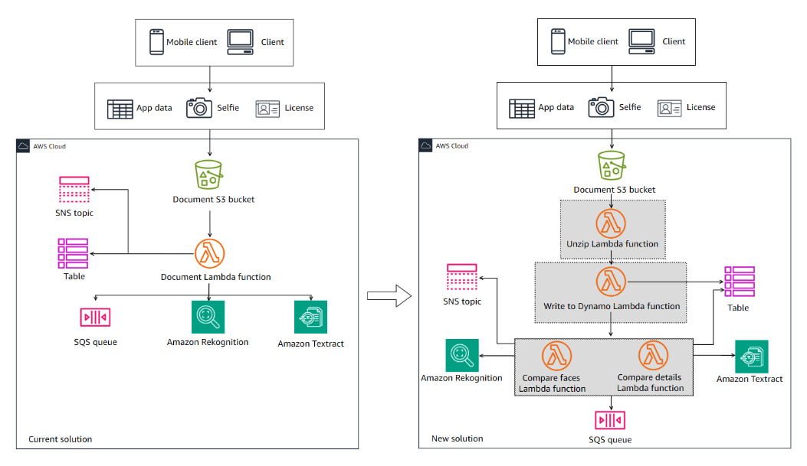

# Capstone Project: Building a Customer Onboarding App - Lab 09

## Lab overview

As a cloud developer at AnyCompany Bank, you have been assigned the task of building the new onboarding application on AWS. The application is named Know Your Customer (KYC).

This is the ninth lab of a series of labs that build the KYC application for banking services. Your goal is to build the solution over 10 labs. In each lab, you build a few components of the overall solution.

In this lab, you will prepare to refactor your document Lambda function to perform its tasks in an asynchronous flow. This involves breaking the function’s code into smaller functions that can run asynchronously.

This is a challenge-based lab. High-level guidance and references are provided to assist you in completing the lab tasks. Detailed solution instructions are provided in collapsible sections, which you can expand.

Objectives
By the end of this lab, you should be able to do the following:

Decompose an existing Lambda function into multiple functions to prepare for an AWS Step Functions workflow.
Technical knowledge prerequisites
To successfully complete this lab, you should have a basic knowledge of:

AWS Cloud9
AWS Lambda
AWS Management Console
AWS Serverless Application Model (AWS SAM)
Python
Icon key
 Caution: Information of special interest or importance (not so important to cause problems with the equipment or data if you miss it, but it could result in the need to repeat certain steps).
 Command: A command that you must run.
 Expected output: A sample output that you can use to verify the output of a command or edited file.
 Hint: A hint to a question or challenge.
 Note: A tip or important guidance.
 Task complete: A conclusion or summary point in the lab.
 Warning: An action that is irreversible and could potentially impact the failure of a command or process (including warnings about configurations that cannot be changed after they are made).
Start lab
To launch the lab, at the top of the page, choose Start Lab.

 Caution: You must wait for the provisioned AWS services to be ready before you can continue.

To open the lab, choose Open Console .

You are automatically signed in to the AWS Management Console in a new web browser tab.

 Warning: Do not change the Region unless instructed.

Common sign-in errors
Error: Choosing Start Lab has no effect
In some cases, certain pop-up or script blocker web browser extensions might prevent the Start Lab button from working as intended. If you experience an issue starting the lab:

Add the lab domain name to your pop-up or script blocker’s allow list or turn it off.
Refresh the page and try again.
Lab environment
In the previous lab, you had a fully working solution. A senior developer verified your solution. However, they noted that your document Lambda function is performing its tasks in a synchronous manner. Here is a summary of the tasks that your document Lambda function is currently performing.

Task-1

Downloads the compressed file from the zipped/ prefix in the Amazon Simple Storage Service (Amazon S3) bucket.
Extracts the individual files and uploads them to the unzipped/ prefix in the S3 bucket.
Extracts the app-uuid value from the files. This value will be used later as the Amazon DynamoDB table hash key for the customer details.
Task-2

Reads and parses the customer .csv file.
Writes the .csv file’s contents to the DynamoDB table under the customer app-uuid hash key.
Task-3

Compares the faces in the selfie and license images, using Amazon Rekognition.
Updates the DynamoDB table with an item to indicate the comparison result.
Sends a message by way of an Amazon Simple Notification Service (Amazon SNS) topic if the face comparison fails.
Task-4

Compares the details of the .csv file written into the DynamoDB table with the license details, using Amazon Textract.
Updates the DynamoDB table with an item to indicate the comparison result.
Sends a message by way of an SNS topic if the details comparison fails.
Task-5

Writes the license ID and customer app_uuid (alongside the OVERRIDE_PARAMETER for mock validation) into the Amazon Simple Queue Service (Amazon SQS) queue. This invokes the submit License Lambda function to send the license to the third-party API.
Since these tasks are performed synchronously, your code must wait for each task to be completed before it can perform the next one. In case of any failure in a task, the code will stop running and return a message indicating the failure to the user.

The senior developer suggested that you try to run these tasks in an asynchronous manner.

To do this, you must break the code of the document Lambda function into multiple tasks and have a separate Lambda function for each task. Then, you can create a state machine workflow that orchestrates all the tasks using Step Functions.

In this lab, you will prepare your solution to run asynchronously by decomposing your document Lambda Function code into smaller tasks and adding a small amount of code to each of the new Lambda functions. The following diagram illustrates your refactoring plan.



Image description: The diagram depicts the refactoring of the KYC application. It highlights the unzip Lambda function, write to dynamo Lambda function, compare faces Lambda function, and compare details Lambda function that you configure in this lab.

Each of the new four functions maps to one of the first four tasks described earlier. However, actions of Task-5 will be implemented by the Step Functions state machine workflow that you will configure in the next lab.

This lab has four tasks. In each task, you will develop the code for one of the functions. Each task’s details section describes the actions that must be performed by the function. You will also be given a sample payload to test the function with the expected response.

 Note:

Your new solution will have four new Lambda functions that replace the tasks of the previous DocumentLambdaFunction. The new functions and their AWS Identity and Access Management (IAM) roles are all preconfigured for you during the lab provisioning.
The preconfigured IAM roles have all the permissions needed for each Lambda function. Each role is already attached to its corresponding function.
The Lambda functions do not have any code configured. You can reuse specific lines of the previous DocumentLambdaFunction code with some minor modifications for each of the new Lambda functions.
A copy of the fully working code is available in the DocumentLambdaFunction folder in your AWS Cloud9 environment. You can use the provided code to build the individual functions code.
If you saved your own fully working code at the end of the previous lab, you can use it to build the new functions’ code.
All four new Lambda functions have the required environment variables added to the function resources in the template.yaml file.
Under your AWS Cloud9 environment, there is a folder with the name of each of the functions. Under each folder, there is an empty app.py file. You can add the code for each function to the corresponding app.py file, and then run the sam build && sam deploy command.
Services used in this lab
AWS Cloud9
AWS Cloud9 is a cloud-based integrated development environment (IDE) that lets you write, run, and debug your code with a browser. It includes a code editor, debugger, and terminal. AWS Cloud9 comes prepackaged with essential tools for popular programming languages, including JavaScript, PHP, Python, and more, so you don’t need to install files or configure your development machine when you start new projects.

AWS Lambda
AWS Lambda is a compute service that lets you run code without provisioning or managing servers. Lambda runs your code on a high availability compute infrastructure and performs the administration of the compute resources, including server and operating system maintenance, capacity provisioning and automatic scaling, and logging. With Lambda, all you need to do is supply your code in one of the language runtimes that Lambda supports.

AWS Serverless Application Model (AWS SAM)
AWS SAM consists of two parts, AWS SAM templates and the AWS SAM command line interface (CLI). AWS SAM templates provide a shorthand syntax, optimized for defining infrastructure as code (IaC) for serverless applications. An extension of AWS CloudFormation, you deploy AWS SAM templates directly to CloudFormation, benefiting from its extensive IaC support on AWS. The AWS SAM CLI is a developer tool that puts AWS SAM features at your fingertips. Use it to quickly create, develop, and deploy serverless applications.

AWS services not used in this lab
AWS service capabilities used in this lab are limited to what the lab requires. Expect errors when accessing other services or performing actions beyond those provided in this lab guide.

Task 1: Develop the unzip Lambda function code
In this task, you will develop the code for the first Lambda function in your workflow. This will be the unzip Lambda function.

Do it yourself

Develop the UnzipLambdaFunction code. When invoked, the function must perform the following tasks:

Download the compressed archive from the zipped/ prefix in the S3 bucket.
Extract the archive and upload the individual files to the unzipped/ prefix in the S3 bucket.
Extract the app-uuid value from the files. This value will be used later as the DynamoDB table hash key for the customer details.
Your function will expect the following sample event payload (replace the INSERT_YOUR_DOCUMENT_BUCKET placeholder with the DocumentBucketName value listed to the left of these instructions, keeping the quotes).


{
    "detail": {
        "bucket": {
            "name": "INSERT_YOUR_DOCUMENT_BUCKET"
        },
        "object": {
            "key": "zipped/8d247914.zip"
        }
    }
}
The function should generate the following sample response.


{
"app_uuid": "8d247914"
}
 Hint: You can troubleshoot and monitor the Lambda function invocations by using the AWS Management Console to view the Lambda function’s logs in CloudWatch Logs. You can also use the AWS Cloud9 terminal to monitor the Lambda function logs by using the following command.


aws logs tail /aws/lambda/UnzipLambdaFunction
Solution

Expand the following Detailed instructions section for the full solution.

Detailed instructions
To start the AWS Cloud9 environment, locate the Cloud9Url value listed to the left of these instructions and open it in a new browser tab.

At the top of the AWS Cloud9 work area, close the Welcome tab.

In the AWS Cloud9 file explorer, expand the UnzipLambdaFunction directory, and then open the app.py file.

Replace the existing code with the following code.


"Lambda function for unzipping application documents"
import os
import zipfile
import boto3

unzipped_dir = "/tmp/unzipped/"
unzipped_s3_prefix = "unzipped/"
s3 = boto3.client('s3')

def unzip_object(bucket, key):
    """Download .zip file, extract, delete the .zip archive from Lambda /tmp storage, and return individual file names"""
    zip_name = os.path.basename(key)
    zip_fullpath = f'/tmp/{zip_name}'
    s3.download_file(bucket, key, zip_fullpath)
    with zipfile.ZipFile(zip_fullpath, 'r') as zip_ref:
        zip_ref.extractall(unzipped_dir)
    os.remove(zip_fullpath)

    zipped_files = os.listdir(unzipped_dir)
    return zipped_files

def lambda_handler(event, context):
    "Unzip application documents and upload to the unzipped prefix"
    bucket = event['detail']['bucket']['name']
    key = event['detail']['object']['key']

    # Unzip the object from the event.
    files_list = unzip_object(bucket, key)

    # Retrieve app_uuid from .zip file.
    app_uuid = os.path.basename(key).replace(".zip", "")

    # Upload files to the unzipped location.
    for file in files_list:
        s3.upload_file(unzipped_dir + file, bucket, unzipped_s3_prefix + file)

    return {
        "app_uuid": app_uuid
    }
Save the app.py file.

 Command: To redeploy the application, run the following command from the AWS Cloud9 bash terminal.


sam build && sam deploy
 Expected output: Output has been truncated and might be slightly different.


******************************
******* EXAMPLE OUTPUT *******
******************************

Build Succeeded

Successfully created/updated stack - kyc-app in us-west-2
Test the function, as described in the next section.

Test the unzip Lambda function
Once the Lambda function is deployed, you can test the function by using a test payload.

 Command: In the AWS Cloud9 bash terminal, run the following command (replace the INSERT_YOUR_DOCUMENT_BUCKET placeholder with the DocumentBucketName value listed to the left of these instructions, keeping the quotes).


aws lambda invoke --function-name UnzipLambdaFunction \
--cli-binary-format raw-in-base64-out \
--payload '{"detail": {"bucket": {"name": "INSERT_YOUR_DOCUMENT_BUCKET"}, "object": {"key": "zipped/8d247914.zip"}}}' response1.json
 Expected output:


******************************
******* EXAMPLE OUTPUT *******
******************************

```json
{
    "StatusCode": 200,
    "ExecutedVersion": "$LATEST"
}
If you get a status code of 200 in the response, check the response1.json file in the AWS Cloud9 explorer. The file should have the following output.


{"app_uuid": "8d247914"}
Verify that the Lambda function uploaded all three individual files to the unzipped/ prefix in Amazon S3.

If your function is invoked successfully and returns the preceding output, and the three individual files are uploaded to the unzipped/ prefix, the function is ready to be added to the AWS Step Functions workflow in the next lab.

 Task complete: You successfully developed the code for the first Lambda function in your workflow.

Task 2: Develop the write to dynamo Lambda function code
In this task, you will develop the code for the second Lambda function in your workflow. This will be the write to dynamo Lambda function.

As described in the previous task, this function and its IAM role are already created for you, and you only need to develop its code.

Do it yourself

Develop the WriteToDynamoLambdaFunction code. When invoked, the function must perform the following tasks:

Read and parse the customer .csv file.
Write the .csv file’s contents to the DynamoDB table under the customer app-uuid hash key.
Your function will expect the following sample event payload (replace the INSERT_YOUR_DOCUMENT_BUCKET placeholder with the DocumentBucketName value listed to the left of these instructions, keeping the quotes).


{
    "detail": {
        "bucket": {
            "name": "INSERT_YOUR_DOCUMENT_BUCKET"
        },
    }
    "application": {
        "app_uuid": "8d247914"
        }
    }
The function should generate the following sample response.


{
"driver_lisence_id": csv_dict['DOCUMENT_NUMBER'],
"validation_override": true,
"app_uuid": app_uuid
}
The csv_dict[‘DOCUMENT_NUMBER’] should be equal to the value of the DOCUMENT_NUMBER key in the .csv file. The app_uuid value should be equal to the value of app_uuid.

For the sample used in this lab, the output should be similar to the following.


{
"driver_license_id": "S123456579010",
"validation_override": true,
"app_uuid": "8d247914"
}
This output will be passed to the next state of your Step Functions workflow that you will configure in the next lab.

 Hint: You can troubleshoot and monitor the Lambda function invocations by using the AWS Management Console to view the Lambda function’s logs in CloudWatch Logs. You can also use the AWS Cloud9 terminal to monitor the Lambda function logs by using the following command.


aws logs tail /aws/lambda/WriteToDynamoLambdaFunction
Solution

Expand the following Detailed instructions section for the full solution.

Detailed instructions
In the AWS Cloud9 file explorer, expand the WriteToDynamoLambdaFunction directory, and then open the app.py file.

Replace the existing code with the following code.


"Lambda function for writing application csv to DynamoDB table"
import os
import csv
import boto3

env_table = os.environ['TABLE']

s3 = boto3.client('s3')
unzipped_s3_prefix = "unzipped/"
dynamodb = boto3.resource('dynamodb')
ddb_table = dynamodb.Table(env_table)

def parse_csv_ddb(app_uuid, details_file):
    "Load CSV and save to dynamo"
    with open(details_file, 'r', encoding="utf-8") as file:
        reader = csv.DictReader(file)
        details_dict = next(reader)

    ddb_table.put_item(Item={**details_dict, "APP_UUID": app_uuid})

    return details_dict

def lambda_handler(event, context):
    "Called from step functions to load CSV to DynamoDB"
    bucket = event['detail']['bucket']['name']
    app_uuid = event['application']['app_uuid']
    details_key = f"{unzipped_s3_prefix}{app_uuid}_details.csv"
    details_file = f"/tmp/{app_uuid}_details.csv"

    s3.download_file(bucket, details_key, details_file)
    csv_dict = parse_csv_ddb(app_uuid, details_file)

    return {
        "driver_license_id": csv_dict['DOCUMENT_NUMBER'],
        "validation_override": True,
        "app_uuid": app_uuid
    }
Save the app.py file.

 Command: To redeploy the application, run the following command from the AWS Cloud9 bash terminal.


sam build && sam deploy
 Expected output: Output has been truncated and might be slightly different.


******************************
******* EXAMPLE OUTPUT *******
******************************

Build Succeeded

Successfully created/updated stack - kyc-app in us-west-2
Test the function, as described in the following section.

Test the write to dynamo Lambda function
Once the Lambda function is deployed, you can test the function by using a test payload.

 Command: In the AWS Cloud9 bash terminal, run the following command (replace the INSERT_YOUR_DOCUMENT_BUCKET placeholder with the DocumentBucketName value listed to the left of these instructions, keeping the quotes).


aws lambda invoke --function-name WriteToDynamoLambdaFunction \
--cli-binary-format raw-in-base64-out \
--payload '{"detail": {"bucket": {"name": "INSERT_YOUR_DOCUMENT_BUCKET"}}, "application": {"app_uuid": "8d247914"}}' response2.json
 Expected output:


******************************
******* EXAMPLE OUTPUT *******
******************************

```json
{
    "StatusCode": 200,
    "ExecutedVersion": "$LATEST"
}
If you get a status code of 200 in the response, check the response2.json file in the AWS Cloud9 explorer. The file should have the following output.


{"driver_license_id": "S123456579010", "validation_override": true, "app_uuid": "8d247914"}
Verify that the function wrote the customer details into the CustomerMetadataTable DynamoDB table.

 Hint: You can verify the DynamoDB table items by browsing the CustomerMetadataTable table in the DynamoDB console, and then exploring the table’s items.

If your function is invoked successfully and returns the preceding output, and the customer details are written into CustomerMetadataTable, the function is ready to be added to the Step Functions workflow in the next lab.

 Task complete: You successfully developed the code for the second Lambda function in your workflow.

Task 3: Develop the compare faces Lambda function code
In this task, you will develop the code for the third Lambda function in your workflow. This will be the compare faces Lambda function.

As described in the previous task, this function and its IAM role are already created for you, and you only need to develop its code.

Do it yourself

Develop the CompareFacesLambdaFunction code. When invoked, the function must perform the following tasks:

Submit the driver’s license and selfie Amazon S3 objects to Amazon Rekognition.
Compare the faces in the two images.
If the photo match is true:
Update the DDB table by setting the LICENSE_SELFIE_MATCH attribute to True.
If the photo match is false:
Update the DDB table by setting the LICENSE_SELFIE_MATCH attribute to False.
Send a failure message to an SNS topic. The message subject and body can be as simple as License photo validation FAILED.
For the comparison purpose, consider the photo match is True if Amazon Rekognition returns a similarity result of 80% or higher.
You can reuse the code from DocumentLambdaFunction to build the code for the preceding requirements.

Your function will expect the following sample event payload (replace the INSERT_YOUR_DOCUMENT_BUCKET placeholder with the DocumentBucketName value listed to the left of these instructions, keeping the quotes):


{
    "detail": {
        "bucket": {
            "name": "INSERT_YOUR_DOCUMENT_BUCKET"
        },
    }
    "application": {
        "app_uuid": "8d247914"
        }
    }
The function should generate the following sample response.


true
 Hint: You can troubleshoot and monitor the Lambda function invocations by using the AWS Management Console to view the Lambda function’s logs in CloudWatch Logs. You can also use the AWS Cloud9 terminal to monitor the Lambda function logs by using the following command.


aws logs tail /aws/lambda/CompareFacesLambdaFunction
Solution

Expand the following Detailed instructions section for the full solution.

Detailed instructions
In the AWS Cloud9 file explorer, expand the CompareFacesLambdaFunction directory, and then open the app.py file.

Replace the existing code with the following code.


"Compare the license and selfie photos"
import os
import boto3

env_table = os.environ['TABLE']
env_topic = os.environ['TOPIC']

s3 = boto3.client('s3')
unzipped_s3_prefix = "unzipped/"
dynamodb = boto3.resource('dynamodb')
ddb_table = dynamodb.Table(env_table)
rekognition = boto3.client('rekognition')
sns = boto3.client('sns')

def compare_faces(app_uuid, bucket, license_key, selfie_key):
    "calls rekognition to compare license and selfie"
    print("Starting face comparison")
    compare_response = rekognition.compare_faces(
        SourceImage={'S3Object': {
            'Bucket': bucket,
            'Name': license_key,
        }},
        TargetImage={'S3Object': {
            'Bucket': bucket,
            'Name': selfie_key,
        }},
        SimilarityThreshold=80
    )

    if len(compare_response['FaceMatches']) < 1:
        photo_match_result = False
    else:
        photo_match_result = compare_response['FaceMatches'][0]['Similarity'] >= 80

    # Update DDB with the photo match value.
    ddb_table.update_item(
        Key={
            'APP_UUID': app_uuid
            },
        UpdateExpression='SET LICENSE_SELFIE_MATCH = :p_match',
        ExpressionAttributeValues={
            ':p_match': photo_match_result
            }
        )

    # Amazon SNS publish and Amazon S3 folder.
    if not photo_match_result:
        sns.publish(
            TopicArn= env_topic,
            Message= 'License photo validation FAILED',
            Subject='License photo validation FAILED',
            )

    print("finished compare faces")
    return photo_match_result

def lambda_handler(event, context):
    "Build the s3 references to the selfie and license and compare with rekognition"
    bucket = event['detail']['bucket']['name']
    app_uuid = event["application"]["app_uuid"]
    selfie_key = f"{unzipped_s3_prefix}{app_uuid}_selfie.png"
    license_key = f"{unzipped_s3_prefix}{app_uuid}_license.png"

    # Submit the license and selfie to Amazon Rekognition to compare faces.
    rekog_response = compare_faces(app_uuid, bucket, license_key, selfie_key)
    if not rekog_response:
        raise ValueError('Photo rekognition match FAILED. Program will stop')

    return True
Save the app.py file.

 Command: To redeploy the application, run the following command from the AWS Cloud9 bash terminal.


sam build && sam deploy
 Expected output: Output has been truncated and might be slightly different.


******************************
******* EXAMPLE OUTPUT *******
******************************

Build Succeeded

Successfully created/updated stack - kyc-app in us-west-2
Test the function, as described in the next section.

Test the compare faces Lambda function
Once the Lambda function is deployed, you can test the function by using a test payload.

 Command: In the AWS Cloud9 bash terminal, run the following command (replace the INSERT_YOUR_DOCUMENT_BUCKET placeholder with the value the DocumentBucketName listed to the left of these instructions, keeping the quotes).


aws lambda invoke --function-name CompareFacesLambdaFunction \
--cli-binary-format raw-in-base64-out \
--payload '{"detail": {"bucket": {"name": "INSERT_YOUR_DOCUMENT_BUCKET"}}, "application": {"app_uuid": "8d247914"}}' response3.json
 Expected output:


******************************
******* EXAMPLE OUTPUT *******
******************************

```json
{
    "StatusCode": 200,
    "ExecutedVersion": "$LATEST"
}
If you get a status code of 200 in the response, check the response3.json file in the AWS Cloud9 explorer. The file should have the following output.


true
Verify that the 8d247914 item appears in CustomerMetadataTable. You should see that the item has LICENSE_SELFIE_MATCH set to true.

If your function is invoked successfully and returns the preceding output, and the item in the table is updated successfully, the function is ready to be added to the Step Functions workflow in the next lab.

 Task complete: You successfully developed the code for the third Lambda function in your workflow.

Task 4: Develop the compare details Lambda function code
In this task, you will develop the code for the fourth Lambda function in your workflow. This will be the compare details Lambda function.

As described in the previous task, this function and its IAM role are already created for you, and you only need to develop its code.

Do it yourself

Develop the CompareDetailsLambdaFunction code. When invoked, the function needs to perform the following tasks:

Submit the driver’s license Amazon S3 object to Amazon Textract to extract the customer information from the driver license image.
Compare the extracted data (see the next bullet point) with the application data stored in the DynamoDB table.
You only need the following data from the license image: DOCUMENT_NUMBER, FIRST_NAME, LAST_NAME, DATE_OF_BIRTH, ADDRESS, STATE_IN_ADDRESS, CITY_IN_ADDRESS, and ZIP_CODE_IN_ADDRESS.
If the data match is true:
Update the DDB table by setting the LICENSE_DETAILS_MATCH attribute to True.
If the data match is false:
Update the DDB table by setting the LICENSE_DETAILS_MATCH attribute to False.
Send a failure message to an SNS topic. The message subject and body can be as simple as Data validation between license and the .csv file FAILED.
You can reuse the code from DocumentLambdaFunction to build the code for the preceding requirements.

Your function will expect the following sample event payload (replace the INSERT_YOUR_DOCUMENT_BUCKET placeholder with the DocumentBucketName value listed to the left of these instructions, keeping the quotes).


{
    "detail": {
        "bucket": {
            "name": "INSERT_YOUR_DOCUMENT_BUCKET"
        },
    }
    "application": {
        "app_uuid": "8d247914"
        }
    }
The function should generate the following sample response:


true
 Hint: You can troubleshoot and monitor the Lambda function invocations by using the AWS Management Console to view the Lambda function’s logs in CloudWatch Logs. You can also use the AWS Cloud9 terminal to monitor the Lambda function logs by using the following command.


aws logs tail /aws/lambda/CompareDetailsLambdaFunction
Solution

Expand the following Detailed instructions section for the full solution.

Detailed instructions
In the AWS Cloud9 file explorer, expand the CompareDetailsLambdaFunction directory, and then open the app.py file.

Replace the existing code with the following code.


"Compare the details extracted from the license and the CSV file"
import csv
import os
import boto3

env_table = os.environ['TABLE']
env_topic = os.environ['TOPIC']

s3 = boto3.client('s3')
unzipped_s3_prefix = "unzipped/"
dynamodb = boto3.resource('dynamodb')
ddb_table = dynamodb.Table(env_table)
textract = boto3.client('textract')
sns = boto3.client('sns')


def textract_response(bucket, license_key):
    "Send license to textract"

    # Pass the license image to Amazon Textract to extract information.
    print("Starting license analysis")
    response = textract.analyze_id(
        DocumentPages=[{
                'S3Object': {
                'Bucket': bucket,
                'Name': license_key
            }
        }]
    )

    id_document = response['IdentityDocuments'][0]
    id_data = id_document['IdentityDocumentFields']
    id_fields = {}

    # Build the dictionary of the .csv file's fields and Amazon Textract values.
    csv_fields = ['DOCUMENT_NUMBER','FIRST_NAME','LAST_NAME','DATE_OF_BIRTH',
                    'ADDRESS','STATE_IN_ADDRESS','CITY_IN_ADDRESS','ZIP_CODE_IN_ADDRESS']
    id_fields = { field['Type']['Text']: field['ValueDetection']['Text'] for field in id_data
                if field['Type']['Text'] in csv_fields }
    print("finished textract")
    return id_fields


def compare_dictionaries(app_uuid, details_dict, textract_dict):
    "Compare license and csv"
    print("Comparing license and csv")

    comparison = details_dict == textract_dict

    # Update DDB with the license data match value, and SNS publish.
    ddb_table.update_item(
        Key={
            'APP_UUID': app_uuid
            },
        UpdateExpression='SET LICENSE_DETAILS_MATCH = :d_match',
        ExpressionAttributeValues={
            ':d_match': comparison
            }
        )

    if not comparison:
        sns.publish(
            TopicArn= env_topic,
            Message= 'Data validation between license and CSV FAILED',
            Subject='Data validation between license and CSV FAILED',
            )
        raise ValueError('Data comparison between App and license FAILED. Program will stop')

    return comparison

def lambda_handler(event, context):
    "Download the CSV, send the license to textract and compare"
    bucket = event['detail']['bucket']['name']
    app_uuid = event["application"]["app_uuid"]
    details_key = f"{unzipped_s3_prefix}{app_uuid}_details.csv"
    details_file = f"/tmp/{app_uuid}_details.csv"
    license_key = f"{unzipped_s3_prefix}{app_uuid}_license.png"

    s3.download_file(bucket, details_key, details_file)

    with open(details_file, 'r', encoding="utf-8") as file:
        reader = csv.DictReader(file)
        details_dict = next(reader)

    # Submit the license to Amazon Textract to extract the fields.
    textract_dict = textract_response(bucket, license_key)

    # Compare the Amazon Textract fields with the .csv file.
    compare_dictionaries(app_uuid, details_dict, textract_dict)

    return True
Save the app.py file.

 Command: To redeploy the application, run the following command from the AWS Cloud9 bash terminal.


sam build && sam deploy
 Expected output: Output has been truncated and might be slightly different.


******************************
******* EXAMPLE OUTPUT *******
******************************

Build Succeeded

Successfully created/updated stack - kyc-app in us-west-2
Test the function, as described in the following section.

Test the compare details Lambda function
Once the Lambda function is deployed, you can test the function by using a test payload.

 Command: In the AWS Cloud9 bash terminal, run the following command (replace the INSERT_YOUR_DOCUMENT_BUCKET placeholder with the DocumentBucketName value listed to the left of these instructions, keeping the quotes).


aws lambda invoke --function-name CompareDetailsLambdaFunction \
--cli-binary-format raw-in-base64-out \
--payload '{"detail": {"bucket": {"name": "INSERT_YOUR_DOCUMENT_BUCKET"}}, "application": {"app_uuid": "8d247914"}}' response4.json
 Expected output:


******************************
******* EXAMPLE OUTPUT *******
******************************

```json
{
    "StatusCode": 200,
    "ExecutedVersion": "$LATEST"
}
If you get a status code of 200 in the response, check the response4.json file in the AWS Cloud9 explorer. The file should have the following output.


true
Verify that the 8d247914 item in CustomerMetadataTable has the LICENSE_DETAILS_MATCH set to true.

If your function is invoked successfully and returns the preceding output, and the item in the table updated successfully, the function is ready to be added to the Step Functions workflow in the next lab.

Lab files
The lab environment is ephemeral. All the lab resources are deleted when the lab time expires. If you want to keep a copy of the lab code, you can download all the lab code using the AWS Cloud9 environment.

To save the files on your local computer, in the AWS Cloud9 menu bar, choose File, and then choose Download Project.
 Task complete: You successfully you developed the code of the fourth Lambda function in your workflow.

Conclusion
You successfully completed the following:

Decomposed an existing Lambda function into multiple functions to prepare for an AWS Step Functions workflow.
End lab
Follow these steps to close the console and end your lab.

Return to the AWS Management Console.

At the upper-right corner of the page, choose AWSLabsUser, and then choose Sign out.

Choose End Lab and then confirm that you want to end your lab.

For more information about AWS Training and Certification, see https://aws.amazon.com/training/.

Your feedback is welcome and appreciated.
If you would like to share any feedback, suggestions, or corrections, please provide the details in our AWS Training and Certification Contact Form.