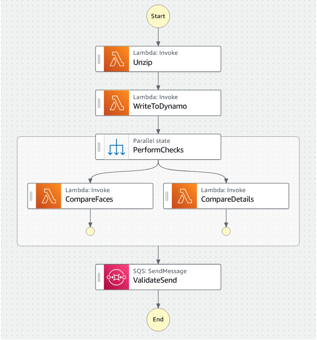

# Capstone Project: Building a Customer Onboarding App - Lab 10

```bash
aws s3 cp ./8d247914.zip s3://documentbucket-360029302288/zipped/
aws s3 cp ./9c358026.zip s3://documentbucket-360029302288/zipped/
aws s3 cp ./7a135804.zip s3://documentbucket-360029302288/zipped/
```

## Lab overview


As a cloud developer at AnyCompany Bank, you have been assigned the task of building the new onboarding application on AWS. The application is named Know Your Customer (KYC).

This is the tenth and final lab of a series of labs that build the KYC application for banking services. Your goal is to build the solution over 10 labs. In each lab, you build a few components of the overall solution.

In this lab, you will build an AWS Step Functions state machine workflow to orchestrate the running of the AWS Lambda functions that you created in the previous lab. You will also enable AWS X-Ray to help you debug your solution.

This is a challenge-based lab. High-level guidance and references are provided to assist you in completing the lab tasks. Detailed solution instructions are provided in collapsible sections, which you can expand.

Objectives
By the end of this lab, you should be able to do the following:

Configure a Step Functions workflow that controls running the application.
Configure X-Ray and use it to monitor the application.
Technical knowledge prerequisites
To successfully complete this lab, you should have a basic knowledge of:

AWS Cloud9
AWS Management Console
AWS Serverless Application Model (AWS SAM)
Step Functions
X-Ray
Icon key
 Caution: Information of special interest or importance (not so important to cause problems with the equipment or data if you miss it, but it could result in the need to repeat certain steps).
 Command: A command that you must run.
 Expected output: A sample output that you can use to verify the output of a command or edited file.
 Hint: A hint to a question or challenge.
 Learn more: Where to find more information.
 Note: A tip or important guidance.
 Task complete: A conclusion or summary point in the lab.
 Warning: An action that is irreversible and could potentially impact the failure of a command or process (including warnings about configurations that cannot be changed after they are made).
Start lab
To launch the lab, at the top of the page, choose Start Lab.

 Caution: You must wait for the provisioned AWS services to be ready before you can continue.

To open the lab, choose Open Console .

You are automatically signed in to the AWS Management Console in a new web browser tab.

 Warning: Do not change the Region unless instructed.

Common sign-in errors
Error: Choosing Start Lab has no effect
In some cases, certain pop-up or script blocker web browser extensions might prevent the Start Lab button from working as intended. If you experience an issue starting the lab:

Add the lab domain name to your pop-up or script blocker’s allow list or turn it off.
Refresh the page and try again.
Services used in this lab
AWS Cloud9
AWS Cloud9 is a cloud-based integrated development environment (IDE) that lets you write, run, and debug your code with a browser. It includes a code editor, debugger, and terminal. AWS Cloud9 comes prepackaged with essential tools for popular programming languages, including JavaScript, PHP, Python, and more, so you don’t need to install files or configure your development machine to start new projects.

AWS SAM
AWS Serverless Application Model consists of two parts, AWS SAM templates and the AWS SAM command line interface (CLI). AWS SAM templates provide a shorthand syntax, optimized for defining infrastructure as code (IaC) for serverless applications. An extension of AWS CloudFormation, you deploy AWS SAM templates directly to CloudFormation, benefiting from its extensive IaC support on AWS. The AWS SAM CLI is a developer tool that puts AWS SAM features at your fingertips. Use it to quickly create, develop, and deploy serverless applications.

AWS Step Functions
Step Functions is a visual workflow service that helps you build distributed applications, automate processes, orchestrate microservices, and create data and machine learning (ML) pipelines.

AWS X-Ray
AWS X-Ray provides trace information about any received responses and calls that an instrumented application makes, including downstream AWS resources, microservices, databases, and web APIs. It uses trace data and visualizations to gain performance insights, identify issues, and find opportunities for optimization.

AWS services not used in this lab
AWS service capabilities used in this lab are limited to what the lab requires. Expect errors when accessing other services or performing actions beyond those provided in this lab guide.

Task 1: Develop the unzip Lambda function code
In the previous lab, you decomposed the DocumentLambdaFunction into four AWS Lambda functions that will run in a workflow to complete its tasks. Here is a recap of the four Lambda functions:

Unzip Lambda function
Write to dynamo Lambda function
Compare faces Lambda function
Compare details Lambda function
You broke the DocumentLambdaFunction into four functions so you can create a state machine workflow that orchestrates how these functions are stitched together and what I/O is passed between the workflow states. In this task, you will build the state machine workflow using Step Functions.

For this lab, all the resources are provisioned for you, including the Lambda functions from the previous lab and their fully functional code. You only need to create the state machine workflow and test the solution in this task.

The following diagram illustrates the desired state machine workflow.



Image description: The diagram depicts the state machine workflow that will orchestrate the Lambda functions.

Here is an explanation of your workflow:

When a compressed file containing the customer selfie, license photo, and details is uploaded into the zipped/ prefix in the document bucket, it invokes an EventBridge rule that invokes your state machine workflow. The EventBridge rule and its permissions are already configured for you.
When the state machine workflow is invoked, it starts running the states in the workflow according to its design.
This invokes the Unzip state, which invokes its corresponding Lambda function. The function downloads the compressed file from the bucket, extracts it, and then uploads the three individual files into the unzipped/ prefix in the document bucket. Then, it passes an output to the next state.
The WriteToDynamo state is then invoked. It takes the input from the previous state and invokes the corresponding function, which writes the customer details into the Amazon DynamoDB table and passes the output to the next state.
The next state is a parallel state, which has two tasks performed in parallel (CompareFaces and CompareDetails). The output from the previous state is passed to both tasks. Each task invokes its corresponding function to validate the customer images using Amazon Rekognition and customer details using Amazon Textract. If validation is true for both tasks, the workflow passes the output to the next state.
If either of the CompareFaces or CompareDetails validations is false, the workflow fails, exits the process, and returns a message that indicates the reason for the failure.
The final state is an Amazon Simple Queue Service (Amazon SQS) SendMessage event, which takes the input from the previous state and writes an Amazon SQS message to the LicenseQueue to send it for third-party validation.
 Hint: Since this is the first state machine you create, you will be given a sample resource of the state machine workflow. You must modify this resource, add it to the template.yaml file, and then deploy it using the AWS SAM CLI.

Do it yourself

In the AWS Cloud9 file explorer, open the StateMachineSampleResource.yaml file. This file includes a sample resource with missing parameters that you must complete. The missing parameters are marked with a hash symbol (#).

Use the hints given within the comments and the following guidelines to update the sample resource:

The state machine name must be DocumentStateMachine. You must match the name’s spelling and case, as provided.
The state machine must use DocumentStateMachineRole, which is already created and configured, to gain the required permissions.
Refer to the values listed to the left of these instructions for the missing parameters that you need to add to the sample resource template.
Once the resource in your AWS Cloud9 environment is configured, copy the resource and add it at the end of the template.yaml file in your AWS Cloud9 environment.
Your indentation must be correct. The DocumentStateMachine resource must be aligned with the other resources in the template. Correct any misalignment due to copy and paste operations.
Save the template.yaml file.
Deploy the modified template using the sam build && sam deploy command.
State I/O explanation
In addition to defining the state flow and the resources involved in each state, you must also define the input and output of each state. When a state machine workflow is invoked, it receives an input in JSON format and processes it. You can then define what output the state will pass to the next state. In the case of using a Lambda resource in the state, the Lambda function must parse the input (output from previous state) correctly.

In the state machine you are building, the workflow is triggered by an Amazon Simple Storage Service (Amazon S3) PutObject event, which looks like the following snippet (this is how you developed your Lambda code in the previous lab).


{
"detail": {
    "bucket": {
    "name": "documentbucket-${AWS::AccountId}"
    },
    "object": {
    "key": "zipped/8d247914.zip"
        }
    }
}
In your state machine, you are passing this input to each state after augmenting it with the output of the previous state. The augmented output will be added under a key that you specify.

Take a look at Unzip state in the state machine resource sample, and note the ResultPath attribute. It is configured as $.application. This means that whatever output results from the Unzip state, you add it under a key named application and then add it under a new key in the original event that invoked the state machine.

You can choose other options of passing data between your states, but you will need to build the Lambda functions’ code accordingly.

Solution

Expand the following Detailed instructions section for the full solution.

Detailed instructions
To start the AWS Cloud9 environment, locate the Cloud9Url value listed to the left of these instructions and open it in a new browser tab.

At the top of the AWS Cloud9 work area, close the Welcome tab.

In the AWS Cloud9 file explorer, expand the ~/environment directory, and then open the template.yaml file.

Copy the following snippet and paste it at the end of the template.yaml file.


#----- Start state machine resource -------#
  DocumentStateMachine:
    Type: AWS::Serverless::StateMachine
    Properties:
      Name: DocumentStateMachine
      Role: !Sub arn:aws:iam::${AWS::AccountId}:role/DocumentStateMachineRole
      Definition:
        StartAt: Unzip
        States:
          Unzip:
            Type: Task
            Resource: !GetAtt UnzipLambdaFunction.Arn
            ResultPath: "$.application"
            Next: WriteToDynamo
          WriteToDynamo:
            Type: Task
            Resource: !GetAtt WriteToDynamoLambdaFunction.Arn
            ResultPath: "$.notification"
            Next: PerformChecks
          PerformChecks:
            Type: Parallel
            Branches:
            - StartAt: CompareFaces
              States:
                CompareFaces:
                  Type: Task
                  Resource: !GetAtt CompareFacesLambdaFunction.Arn
                  End: true
            - StartAt: CompareDetails
              States:
                CompareDetails:
                  Type: Task
                  Resource: !GetAtt CompareDetailsLambdaFunction.Arn
                  End: true
            ResultPath:
            Next: ValidateSend
          ValidateSend:
            Type: Task
            Resource: "arn:aws:states:::sqs:sendMessage"
            Parameters:
              QueueUrl: !GetAtt SQSQueue.QueueUrl
              MessageBody.$: $.notification
            End: true
#----- End state machine resource -------#
 Note: Make sure that your indentation is correct. The DocumentStateMachine resource must be aligned with the other resources in the template. Correct any misalignment due to the copy and paste operation.

Save the template.yaml file.

 Command: To redeploy the application, run the following command from the AWS Cloud9 bash terminal.


sam build && sam deploy
 Expected output: Output has been truncated. Your output may have a different region.


******************************
******* EXAMPLE OUTPUT *******
******************************

Build Succeeded

Successfully created/updated stack - kyc-app in us-west-2
Test the function, as described in the next section.

Test the state machine
If your AWS SAM template is deployed successfully after adding the state machine, you can check the state machine and test it.

At the top of the AWS Management Console, in the search bar, search for and choose Step Functions.

On the Step Functions page, choose State machines.

Choose DocumentStateMachine.

Open another AWS Management Console tab, and in the search bar, search for and choose S3.

From the buckets list, choose your document bucket, and then choose the zipped/ prefix.

You will test your state machine by uploading three sample compressed files into the zipped/ prefix. When uploading each of the samples, you can check the state machine execution results, and you can also check the DynamoDB table to verify the LICENSE_DETAILS_MATCH, LICENSE_SELFIE_MATCH, and LICENSE_VALIDATION attributes. You can download these compressed files from the AWS Cloud9 environment or by using the following links:

Sample-1: 8d247914.zip, which you can download 8d247914.zip
Sample-2: 9c358026.zip, which you can download 9c358026.zip
Sample-3: 7a135804.zip, which you can download 7a135804.zip
Verify your results
Sample-1 is a correct sample. The state machine execution should succeed when uploading this sample. The DynamoDB table’s LICENSE_DETAILS_MATCH, LICENSE_SELFIE_MATCH, and LICENSE_VALIDATION attributes should all be True for this sample.
Sample-2 has a mismatch in the images of the license and selfie. The state machine execution should fail at the CompareFaces state. The DynamoDB table’s LICENSE_SELFIE_MATCH attribute should be False for this sample. The LICENSE_VALIDATION attribute will not have a value, as the license is not sent to a third party due to the CompareFaces failure.
Sample-3 has a mismatch in the details of the license. The state machine execution should fail at the CompareDetails state. The DynamoDB table’s LICENSE_DETAILS_MATCH attribute should be False for this sample. The LICENSE_VALIDATION attribute will not have a value, as the license is not sent to a third party due to the CompareDetail failure.
 Hint: You can verify the DynamoDB table items by browsing CustomerMetadataTable in the DynamoDB console and exploring the table’s items.

 Task complete: You successfully built the state machine workflow using AWS Step Functions.

Task 2: Enable X-Ray tracing for the state machine workflow
After you built the full solution, a member of the monitoring team is requesting that you provide some visibility tools to observe the state machine workflow and trace all of its states. The goal is to understand the time spent in each state and whether there are any performance issues. The team member suggested enabling AWS X-Ray to provide the required visibility.

AWS X-Ray is a service that collects data about requests that your application serves, and it provides tools that you can use to view, filter, and gain insights into the data to identify issues and opportunities for optimization. For any traced request to your application, you can see detailed information about the request and response. You can also see calls that your application makes to downstream AWS resources, microservices, databases, and HTTP web APIs.

X-Ray uses service integration to receive trace data from supported services, like AWS Lambda and AWS Step Functions. You enable X-Ray tracing on the service you plan to observe.

In this task, you enable X-Ray tracing for the DocumentStateMachine state machine workflow.

Do it yourself

Enable X-Ray tracing on the DocumentStateMachine workflow. You can do this using the AWS Management Console or by updating the AWS SAM template.yaml file and redeploying it.

Since you deployed the state machine using AWS SAM CLI, use the AWS SAM template to make any updates to your solution. This is a best practice for infrastructure as a code.

 Hint: You can simply add the following attribute under the properties of the DocumentStateMachine resource.


Tracing:
  Enabled: true
Make sure that your indentation is correct. The Tracing attribute must be aligned under the properties of the DocumentStateMachine resource. Correct any misalignment due to the copy and paste operation.

Solution

Expand the following Detailed instructions section for the full solution.

Detailed instructions
In the AWS Cloud9 file explorer, expand the ~/environment directory, and then open the template.yaml file.

Copy the following snippet and paste it under the properties of the DocumentStateMachine resource.


Tracing:
  Enabled: true
 Note: Make sure that your indentation is correct. The Tracing attribute must be aligned as one of the properties of the DocumentStateMachine resource. Correct any misalignment due to the copy and paste operation.

Your state machine should look like this (this is just a partial snippet of the state machine resource). Yours will have a different account number.


DocumentStateMachine:
  Type: AWS::Serverless::StateMachine
  Properties:
    Name: DocumentStateMachine
    Role: !Sub arn:aws:iam::${AWS::AccountId}:role/DocumentStateMachineRole
    Tracing:
      Enabled: true
    Definition:
      StartAt: Unzip
    # Rest of template unchanged
 Command: To redeploy the application, run the following command from the AWS Cloud9 bash terminal.


sam build && sam deploy
 Expected output: Output has been truncated. Your output may have a different region.


******************************
******* EXAMPLE OUTPUT *******
******************************

Build Succeeded

Successfully created/updated stack - kyc-app in us-west-2
Test the function, as described in the next section.

Test your state machine tracing functionality
Once you deploy the template successfully, try reuploading any of the sample files to the zipped/ prefix. Then, view the X-Ray tracing.

At the top of the AWS Management Console, in the search bar, search for and choose CloudWatch.

On the CloudWatch page, from the left navigation pane, under X-Ray traces, choose Traces.

On the Traces page, scroll to the Traces pane. You should see a trace ID and details. Choose the link of the trace ID.

The trace is displayed in a new page. You can see the service map, which displays the state machine states and services being called. If you scroll down, you should see the trace segments timelines where you can see the full trace of all the states and the time needed to complete each state.

If the sample you choose is not a correct sample, you can see which state failed.

 Task complete: You successfully enabled X-Ray tracing for the DocumentStateMachine state machine workflow.

Task 3: Enable X-Ray tracing for the Lambda function
In the previous task, you enabled X-Ray for the state machine, which provides visibility of your workflow. However, it does not provide detailed visibility into what is happening in each state. For instance, if your Lambda function is calling multiple services when invoked, you might want to know the time it takes to call each service. This would help in determining if there are any bottlenecks that you can detect to improve the performance of your code and reduce latency.

To have visibility of a Lambda function, you can enable X-Ray for any Lambda function that you want to examine in detail. For example, if you see from the state machine trace that the WriteToDynamoLambdaFunction is taking longer than expected, you can enable X-Ray for the specific function to visualize a detailed trace of the API calls that the function is making, which might help you determine any issues.

In this task, you will enable X-Ray tracing for WriteToDynamoLambdaFunction and observe the traces when invoked.

 Note: Currently, WriteToDynamoLambdaFunction does not have any issues. We chose this function as an example to enable X-Ray.

Do it yourself

Enable X-Ray tracing for WriteToDynamoLambdaFunction. Enabling X-Ray on a Lambda function involves adding some extra lines to the Lambda code and configuring some settings.

Enabling tracing requires that the Lambda function execution role has the required X-Ray permissions. These permissions were added to the four Lambda function roles in the state machine workflow during lab provisioning.

To enable X-Ray on WriteToDynamoLambdaFunction, add the following attributes under the properties of WriteToDynamoLambdaFunction in the template.yaml file.


Tracing: Active # Enabling X-Ray tracing for the function.
Environment:  # Adding X-Ray tracing environment variable.
  Variables:  # If the function already has variables, you can just add the variable below to the list.
    POWERTOOLS_SERVICE_NAME: kyc-app
Layers: # Add this public layer for Python. You will import modules from this layer.
  - !Sub arn:aws:lambda:${AWS::Region}:017000801446:layer:AWSLambdaPowertoolsPythonV2:51
 Note: If you expect that you might need to enable X-Ray on more than one function in the same AWS SAM template, you can add the preceding attributes under the Functions attribute under the Globals section at the start of the template. This will add the attributes to all Lambda functions in the template.

 Learn more: For more information on enabling X-Ray on a Lambda function, refer to Tracer.

Solution

Expand the following Detailed instructions section for the full solution.

Detailed instructions
In the AWS Cloud9 file explorer, expand the ~/environment directory, and then open the template.yaml file.

Add the following snippet under the Globals section at the start of the template. This will add these attributes to all Lambda functions in the template.


Tracing: Active
Environment:
  Variables:
    POWERTOOLS_SERVICE_NAME: kyc-app
Layers:
  - !Sub arn:aws:lambda:${AWS::Region}:017000801446:layer:AWSLambdaPowertoolsPythonV2:51
 Note: Make sure that your indentation is correct. The preceding attribute must be aligned under the Functions attribute under the Globals section. Correct any misalignment due to the copy and paste operation.

The Globals section should look like the following snippet.


Globals:
  Function:
    Timeout: 20
    MemorySize: 128
    Tracing: Active
    Environment:
      Variables:
        POWERTOOLS_SERVICE_NAME: kyc-app
    Layers:
      - !Sub arn:aws:lambda:${AWS::Region}:017000801446:layer:AWSLambdaPowertoolsPythonV2:51
Save the template.yaml file.

In the AWS Cloud9 file explorer, open the app.py file under the WriteToDynamLambdaFunction folder, and add the following lines in the locations described in the comments on each line.


from aws_lambda_powertools import Tracer # Add this line after the last import line in your code.

tracer = Tracer() # Add this line after last environment variable in your code.

@tracer.capture_lambda_handler # Add this line before the def lambda_handler(event, context): line.
Save the app.py file.

 Command: To redeploy the application, run the following command from the AWS Cloud9 bash terminal.


sam build && sam deploy
 Expected output: Output has been truncated. Your output may have a different region.


******************************
******* EXAMPLE OUTPUT *******
******************************

Build Succeeded

Successfully created/updated stack - kyc-app in us-west-2
Test the function, as described in the next section.

Test your Lambda function tracing functionality
Once you deploy the template successfully, try reuploading any of the sample files to the zipped/ prefix. Then, view the X-Ray tracing.

At the top of the AWS Management Console, in the search bar, search for and choose CloudWatch.

On the CloudWatch page, from the left navigation pane, under the X-Ray traces, choose Traces.

On the Traces page, scroll to the Traces pane. You should see a trace ID and details. Choose the link of the trace ID.

The trace is displayed in a new page. You can see the service map, which displays the state machine states and services being called. If you scroll down, you should see the trace segments timelines where you can see the full trace of all the states and the time needed to complete each state.

Note that there are more details provided for the state of the WriteToDynamoLambdaFunction, as you can see the calls the function is doing to the DynamoDB table and S3 bucket.

Enable X-Ray for other functions and observe the traces. Try different samples to check the trace when the state fails.

Lab files
The lab environment is ephemeral. All the lab resources are deleted when the lab time expires. If you want to keep a copy of the lab code, you can download all the lab code using the AWS Cloud9 environment.

To save the files on your local computer, in the AWS Cloud9 menu bar, choose File, and then choose Download Project.
 Task complete: You successfully enabled X-Ray tracing for WriteToDynamoLambdaFunction and observed the traces when invoked.

Conclusion
You successfully completed the following:

Configured a Step Functions workflow that controls running the application.
Configured X-Ray and used it to monitor the application.
End lab
Follow these steps to close the console and end your lab.

Return to the AWS Management Console.

At the upper-right corner of the page, choose AWSLabsUser, and then choose Sign out.

Choose End Lab and then confirm that you want to end your lab.

For more information about AWS Training and Certification, see https://aws.amazon.com/training/.

Your feedback is welcome and appreciated.
If you would like to share any feedback, suggestions, or corrections, please provide the details in our AWS Training and Certification Contact Form.