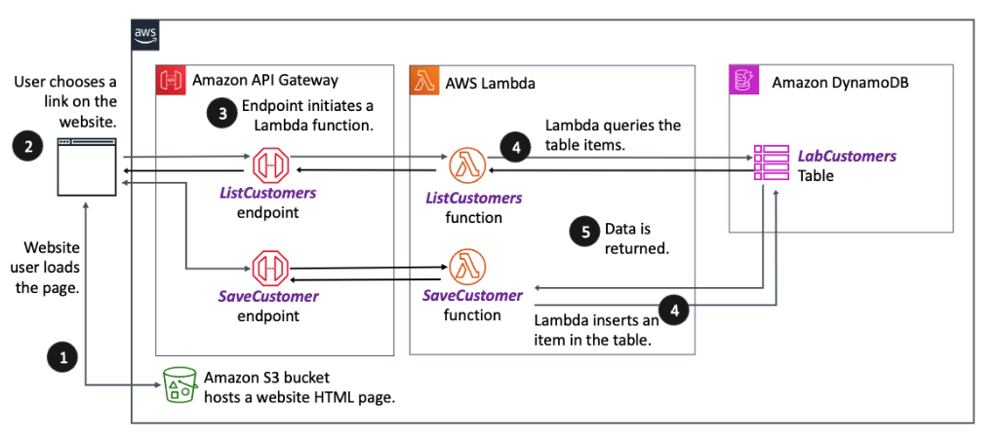
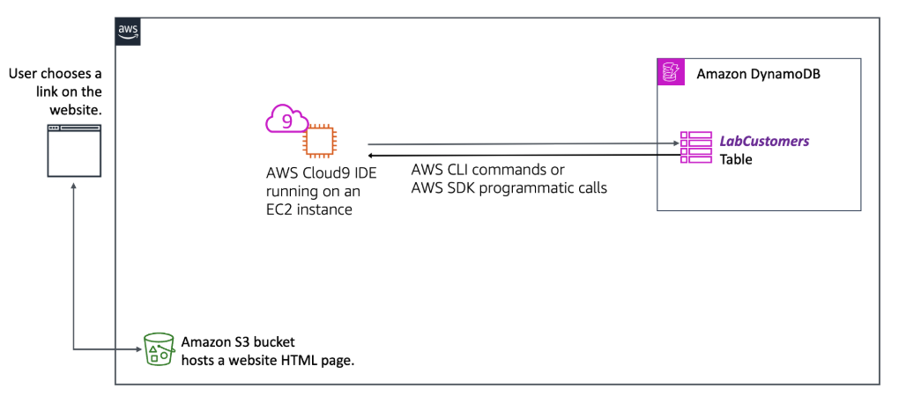

# Creating a Serverless Web App Backend with Amazon DynamoDB

## Lab overview

This is the first lab in a series of labs that have you build a serverless application by using Amazon DynamoDB, AWS Lambda, and Amazon API Gateway. The architecture that you implement uses the following:

Amazon Simple Storage Service (Amazon S3) for storage of the web frontend
DynamoDB as the database for the application.
Lambda as the compute layer to perform create, read, update, and delete (CRUD) operations involving the database.
API Gateway as the tool used to define the API that provides the endpoints that the web application connects to that start the Lambda functions.

The following diagram shows what you achieve in the lab series.

Image description: The image is a flowchart that describes a web application architecture using various Amazon Web Services (AWS) components. It outlines the process of a user interacting with a website, starting Lambda functions, and accessing data in a database. See the following for a more detailed explanation.

To review the detailed diagram description, expand this section.

### Detailed diagram description

Step 1 – Amazon S3 bucket: The process begins with an Amazon S3 bucket, which hosts the website’s HTML page. This is where the website user loads the page.
Step 2 – User interaction: The user then chooses a link on the website.
Step 3 – Amazon API Gateway: The action interacts with API Gateway. The API Gateway has two endpoints: ListCustomers and SaveCustomer.
Step 4 – AWS Lambda functions: The ListCustomers endpoint invokes a Lambda function. The ListCustomers function queries the table items in the connected Amazon DynamoDB. There is another Lambda function named SaveCustomer, which is responsible for inserting an item into the DynamoDB table.
Step 5 – Amazon DynamoDB: The DynamoDB database contains a table named LabCustomers. The ListCustomers function retrieves data from this table and returns it.
The arrows between the components indicate the direction of the data flow and interactions. The overall diagram showcases a serverless architecture where the user’s actions on a static website hosted in Amazon S3 start serverless functions through the API Gateway to interact with a NoSQL database, DynamoDB.

In this lab, you start building the solution. Specifically, you gain hands-on experience working with DynamoDB. You start by establishing the hosting infrastructure for the web frontend of your web application on Amazon S3. You then work to create the DynamoDB table that stores application data. You use various AWS Command Line Interface (AWS CLI) commands to retrieve resource information and store the information as a variable for use later using variables and create resources.

Comparison with prior labs: You might recall from the labs where you created a web application running on the Django framework, it used a model, view, template architecture. Here, you embark on creating a serverless web application. If it is helpful, you could think of DynamoDB playing a role similar to that of Django models. Lambda plays a role similar to that of Django views. And the web frontend that you create plays the role of the templates. API Gateway plays the role that was handled in Django by the URL patterns you defined that mapped GET and POST HTTP requests to Django views. When you use API Gateway to define an API, the API endpoints that you create can be used to invoke Lambda functions. If you do not recall these details or did not complete the Django labs, that’s ok, it is not necessary.

Objectives
By the end of this lab, you should be able to do the following:

Establish a web frontend hosted in an Amazon S3 bucket that you configure with a bucket policy and as a website.
Create a DynamoDB table by using the DynamoDB console.
Add items to a DynamoDB table by using the AWS CLI and AWS SDK for Python (Boto3).
Retrieve items from a DynamoDB table by using the AWS CLI and SDK for Python.
Icon key
Various icons are used throughout this lab to call attention to different types of instructions and notes. The following list explains the purpose for each icon:

 Caution: Information of special interest or importance (not so important to cause problems with the equipment or data if you miss it, but that could result in the need to repeat certain steps).
 Command: A command that you must run.
 Consider: A moment to pause to consider how you might apply a concept in your own environment or to initiate a conversation about the topic at hand.
 Expected output: A sample output that you can use to verify the output of a command or edited file.
 Note: Additional information or elaboration on a point.
 Task complete: A conclusion or summary point in the lab.
 Warning: An action that is irreversible and could potentially impact the failure of a command or process (including warnings about configurations that cannot be changed after they are made).
Start lab
To launch the lab, at the top of the page, choose Start Lab.

 Caution: You must wait for the provisioned AWS services to be ready before you can continue.

To open the lab, choose Open Console .

You are automatically signed in to the AWS Management Console in a new web browser tab.

 Warning: Do not change the Region unless instructed.

Common sign-in errors
Error: Choosing Start Lab has no effect
In some cases, certain pop-up or script blocker web browser extensions might prevent the Start Lab button from working as intended. If you experience an issue starting the lab:

Add the lab domain name to your pop-up or script blocker’s allow list or turn it off.
Refresh the page and try again.
Lab environment
The following diagram depicts the basic architecture of the lab environment. The resources depicted in the diagram already exist in your Amazon Web Services (AWS) account when you start the lab.

Website architecture from start of lab.

Image description: Image of an AWS environment with an Amazon Elastic Compute Cloud (Amazon EC2) instance that has the AWS Cloud9 integrated development environment (IDE) installed on it.

However, by the end of this lab, you should have created the following architecture:

Image description: The image shows a flowchart that represents a user’s interaction with a web application hosted on AWS and the backend AWS services involved. See the following for a detailed description.

To review the detailed diagram description, expand this section.

Detailed diagram description
On the left side of the diagram, there is a depiction of a user interface where a user chooses a link on website.
To the right of this, there is an icon for an S3 bucket, signifying that the Amazon S3 service is being used to host the website’s HTML page.
Further to the right, in the center of the diagram, are the icons for the AWS Cloud9 integrated development environment (IDE) running on an EC2 instance. The label indicates that the AWS Cloud9 IDE is running on this virtual server.
Connecting the AWS Cloud9 IDE icon to the far right of the diagram is a label that reads AWS CLI commands or AWS SDK programmatic calls. This indicates that the AWS Cloud9 IDE is interacting with another AWS service by using the command line interface (CLI) or a software development kit (SDK).
On the far right is the Amazon DynamoDB icon group box. DynamoDB is a fully managed NoSQL database service offered by AWS. Within this group box is the LabCustomers table, indicating that this is a table within the DynamoDB service.
The arrows and lines connecting these components represent the flow of data or the sequence of interactions from the user’s action on the website to the backend AWS services. The user’s action initiates backend processes through the AWS Cloud9 IDE. This in turn interacts with the DynamoDB service to retrieve or store data in the LabCustomers table.
AWS services used in this lab
The services used in this lab are as follows:

Amazon DynamoDB
Amazon Simple Storage Service (Amazon S3)
AWS Cloud9
Amazon Elastic Compute Cloud (Amazon EC2)
AWS services not used in this lab
AWS service capabilities used in this lab are limited to what the lab requires. Expect errors when accessing other services or performing actions beyond those provided in this lab.

Task 1: Configure the web application frontend to be hosted on Amazon S3
In this task, you create an S3 bucket and apply a bucket policy to it. You configure it to serve as a website, and upload an HTML file to it, which acts as your web frontend.

Task 1.1: Create an S3 bucket
In this task, you create an S3 bucket, upload the index.html file to it, test access to the website, and analyze the page source.

On the AWS Management Console, in the search box, search for and choose S3.

Choose Create bucket, and then configure the following:

For AWS Region, choose the current Region value that is specified to the left of these instructions, labeled AWSRegionCode.
For Bucket type, select General purpose.
For Bucket name, enter customerswebsite-REGION-ACCOUNT_ID, where REGION is replaced with the current value of the AWS Region code and ACCOUNT_ID is replaced with the account ID of the AWS account that you are using. You can copy both from the panel to the left of these instructions.
Clear the check box for Block all public access.
Select the check box to acknowledge that the current settings might result in this bucket and the objects within becoming public.
Scroll to the bottom of the page and choose Create bucket.

You should see a message stating the bucket was created successfully.

Task 1.2: Apply a bucket policy
With the bucket created, you now apply a bucket policy to allow public read access to the bucket.

Choose the link to the new bucket.

Choose the Permissions tab.

Scroll down to the Bucket policy section and choose Edit.

Copy and paste the following code into the Policy field. Then replace REGION with the current Region code and replace ACCOUNT_ID with the actual account ID.

{
    "Version": "2012-10-17",
    "Statement": [
        {
            "Sid": "PublicReadGetObject",
            "Effect": "Allow",
            "Principal": "*",
            "Action": "s3:GetObject",
                "Resource":"arn:aws:s3:::customerswebsite-REGION-ACCOUNT_ID/*"
        }
    ]
}
 Note: Be sure to leave the /* before the closing quote.

Choose Save changes.

You should see a message reading, “Successfully edited bucket policy.”

Task 1.3: Enable website hosting on the bucket
Enable website hosting on the bucket that you just created.

On the Properties tab, scroll to the bottom of the page and in the Static website hosting section, choose Edit and configure the following values:

For Static website hosting, select Enable.

For Hosting type, select Host a static website.

For Index document, enter index.html.

Choose Save changes.

You should see a message reading, “Successfully edited static website hosting.”

Task 1.4: Upload the web frontend and test access
Upload an object to the bucket.

To open the AWS Cloud9 environment, copy the Cloud9Environment URL value that is listed to the left of these instructions, and paste it into a new browser tab.

 Command: To change into the /environment directory, assign the website bucket name to a variable named bucket_name, and upload the index.html file to the website bucket, run the following commands:

cd ~/environment

# Creates variable to store the bucket name
bucket_name=$(aws s3 ls | grep website | awk '{print $3}' | xargs)

# Uploads the index.html file to the S3 bucket
aws s3 cp index.html s3://$bucket_name
 Expected output: (Your account ID will differ from this example.)

******************************
**** This is OUTPUT ONLY. ****
******************************

upload: ./index.html to s3://customerswebsite-us-west-2-111111111111/index.html
 Command: To retrieve the S3 static website URL, run the following code:

# Sets the current region to a variable
current_region=$(aws s3api get-bucket-location --bucket $bucket_name --output     text)

# Creates variable for S3 bucket URL
url="http://${bucket_name}.s3-website-${current_region}.amazonaws.com"

# Displays the URL for the S3 static website
echo -e "\nThe URL for the S3 static website:\n\n     $url\n"
 Expected output: (Your account ID will differ from this example.)

******************************
**** This is OUTPUT ONLY. ****
******************************

The URL for the S3 static website:

    http://customerswebsite-us-west-2-111111111111.s3-website-us-west-2.amazonaws.com
Copy the URL for the S3 static website and paste it into a new browser tab.

The webpage should open and appear as shown in the following image. This website is not functional in this lab. You build out this functionality in upcoming labs.

 Note: You might notice the warning in the address bar indicating the site is Not secure, and this can be ignored. This is because the website is set up to use HTTP, which does not use encryption. To address this, you could set up the website to use encryption using HTTPS (HTTP Secure). This is the industry standard, but is not a requirement for this lab.

Customer website screenshot.

Image description: The image is a screenshot of a simple web interface for a customer management system. The webpage has a plain white background with a form for entering customer information and buttons for saving and listing customer data. See the following for a more detailed description.

To review the detailed description, expand this section.

Detailed description
At the top of the form is a field labeled API Endpoint with placeholder text UPDATE-ME, indicating that this field is to be updated with the correct endpoint URL.

Below that, there are three more input fields arranged vertically:

Customer ID with an example entry ABC123
First Name with an example entry TestFirst
Last Name with an example entry TestLast
Below the input fields are two buttons:

The first button says Save customer & then list customers. It’s outlined and is used to submit the form data and then display a list of customers.
The second button says Only list customers. This button is used to fetch and display the list of customers without submitting new data.
Beneath the buttons is a section intended to display customer data in a tabular format with three headers: Customer ID, First Name, and Last Name. However, no actual customer data is visible in this screenshot, because the table is empty or the data has not been loaded yet.

The web browser tab is labeled Lab Example, and the URL in the address bar suggests that the webpage is hosted on AWS, because it contains customerswebsite-us-west-2, which refers to the AWS US West (Oregon) Region. The URL also contains Not Secure, because the website does not use HTTPS, and therefore the connection is not encrypted.

Task 1.5: Analyze the page source
Observe the page source (either in the AWS Cloud9 file editor or by opening the context menu on the webpage):

In the body element, observe the source code lines 77 to 99.
There are multiple input elements.
One of the input elements shows an API Gateway endpoint. The value is currently set to UPDATE-ME, because in a later lab you set a valid endpoint here. The other three input elements collected the Customer ID, First Name, and Last Name values that a web form user could enter and submit.
There are two button elements. One has id=“send” and is used to save a new customer entry. The other button has id=“get_items” and is used to retrieve customer entries.
In the head element, observe the JavaScript code in the script element.
Lines 21 to 38: The refreshTable function retrieves the API Gateway endpoint value that you saw in the body of the page, and then uses the fetch method to invoke a ListCustomers API function. It expects to receive a JSON-formatted response.
Lines 41 to 57: This JavaScript code defines an event listener for when the Save customer & then list customers button (with id value send) is selected. It gathers the current values from the input elements and invokes a SaveCustomer API function with a POST action. It then calls the refreshTable function to update the list of displayed customers.
Lines 60 to 62: This JavaScript code defines an event listener for when the Only list customers button (with id value get_items) is selected. It calls the refreshTable function to update the list of displayed customers.
 Note: The API endpoints referenced do not yet exist. There is also no database yet, and no connection between the API endpoints and the database. The key takeaway is that you want to create application logic that can both list customers and save customers. Keep that in mind as you progress through this lab and the labs that follow.

 Task complete: You created an S3 bucket, applied a bucket policy to it, configured it to serve as a website, and uploaded an HTML file to it that acts as your web frontend.

Task 2: Create a DynamoDB table and add items to it
In this task, you create a DynamoDB table that can be used to store customer data. You then add data to the table and retrieve the data.

Task 2.1: Create a DynamoDB table
To provide a storage location for the web application, create a DynamoDB table.

On the AWS Management Console, in the search box, search for and choose DynamoDB.

From the left navigation pane, choose Tables, and then choose Create table.

Configure the following options:

For Table name, enter LabCustomers.

For Partition key, enter ID and choose String for the type.

 Note: Key values are case sensitive.

Choose Create table.

 Note: It takes a moment before table status changes to Active.

If you encounter the following warning, you can close it and ignore it.

Your LabCustomers table was created with auto scaling turned off. Try turning on auto scaling from table settings.
Choose the LabCustomers table link.

Choose Explore table items .

In the Items returned panel, you see that there are no items to display yet. This is expected.

Task 2.2: Add a table item and view it using the DynamoDB console
To see how data can be added by using the console, you create a single record that way.

In the Items returned panel, choose Create item .
 Note: The top-right allows you 2 view options. Choose Form .

For ID, enter a value of ABC123.

From the Add new attribute  menu, choose String and set the following values:

For Attribute name, enter firstname.
For Value, enter Manu.
From the Add new attribute  menu, choose String and set the following values:

For Attribute name, enter lastname.
For Value, enter Kwesi.
Choose Create item.

 Expected output:

Items returned (1)

ID (string)	firstname	lastname
ABC123	Manu	Kwesi
You should now see one item returned in the Items returned section of the LabCustomers table.

 Consider: Recall that when you defined the DynamoDB table, you defined a single attribute of ID. But here, you were able to create a new item (row) in the table that contains two additional attributes (firstname and lastname).

With a traditional relational database, you need to run an ALTER TABLE command to add new columns to an existing table’s structure before you could add such data. This demonstrates one of the essential differences between NoSQL databases like DynamoDB and relational databases such as MySQL.

Task 2.3: Add a table item and return items using the AWS CLI
To see how you can also work with DynamoDB by using the AWS CLI commands, use this approach to add another record to the table.

Return to the browser tab where you have the AWS Cloud9 IDE open.

 Command: List the table name, set it to a variable to reference in upcoming commands, and then print the value to confirm that it is set correctly.

customersTable=$(aws dynamodb list-tables --query 'TableNames[0]' --output text)
echo -e "\nTable name:\n     $customersTable\n"
 Expected output:

******************************
**** This is OUTPUT ONLY. ****
******************************

Table name:
    LabCustomers
 Command: Describe the table by referencing the $customersTable variable in the command.

aws dynamodb describe-table --table-name $customersTable
 Expected output:

******************************
**** This is OUTPUT ONLY. ****
******************************

{
"Table": {
    "AttributeDefinitions": [
        {
            "AttributeName": "ID",
            "AttributeType": "S"
        }
    ],
    "TableName": "LabCustomers",
    "KeySchema": [
        {
            "AttributeName": "ID",
            "KeyType": "HASH"
        }
    ],
    "TableStatus": "ACTIVE",
    "CreationDateTime": "2024-02-28T22:20:08.986000+00:00",
    "ProvisionedThroughput": {
        "NumberOfDecreasesToday": 0,
        "ReadCapacityUnits": 5,
        "WriteCapacityUnits": 5
    },
    "TableSizeBytes": 0,
    "ItemCount": 0,
    "TableArn": "arn:aws:dynamodb:us-west-2:111111111111:table/LabCustomers",
    "TableId": "753ab06e-0935-4c21-8f67-ea741b48e757",
    "TableClassSummary": {
        "TableClass": "STANDARD"
    },
    "DeletionProtectionEnabled": false
    }
}
The result shows attribute definitions that describe the the partition key of the table. In the case of this table, the partition key is ID of attribute type S, which stands for String.

 Note: If necessary, type q to return to the command prompt.

Create a new file in the environment directory and save it as add-one-customer.json.

Add the following JSON content to the file and then save your changes.

{
    "ID": {"S": "ABD124"},
    "firstname": {"S": "Martha"},
    "lastname": {"S": "Rivera"}
}
 Command: Add the data contained in the JSON file to the DynamoDB table.

# Add data from the JSON file to the DynamoDB table.
aws dynamodb put-item --table-name $customersTable --item file://add-one-customer.json --region $current_region
 Expected output:

None, unless there is an error.

 Command: Confirm that the row was added by running this command:

aws dynamodb scan --table-name $customersTable
 Expected output:

******************************
**** This is OUTPUT ONLY. ****
******************************

{
"Items": [
    {
        "firstname": {
            "S": "Manu"
        },
        "lastname": {
            "S": "Kwesi"
        },
        "ID": {
            "S": "ABC123"
        }
    },
    {
        "firstname": {
            "S": "Martha"
        },
        "lastname": {
            "S": "Rivera"
        },
        "ID": {
            "S": "ABD124"
        }
    }
],
"Count": 2,
"ScannedCount": 2,
"ConsumedCapacity": null
}
The scan command returns both items in the table.

Task 2.4: Return DynamoDB table items using the SDK for Python
Now, see how you can use the SDK for Python to work with DynamoDB. Here, you return table data and store it in Python list format.

 Command: In the AWS Cloud9 terminal, install the SDK for Python with this command:

pip install boto3
 Expected output: (This output has been truncated and the version that you see might differ from the example given.)

******************************
**** This is OUTPUT ONLY. ****
******************************

Successfully installed boto3-1.34.52 botocore-1.34.52 s3transfer-0.10.0
 Command: Launch the interactive Python shell by entering python without any additional text.

python
 Expected output:

******************************
**** This is OUTPUT ONLY. ****
******************************

Python 3.8.16 (default, Aug 30 2023, 23:19:34) 
[GCC 7.3.1 20180712 (Red Hat 7.3.1-15)] on linux
Type "help", "copyright", "credits" or "license" for more information.
>>>
 Command: Import the SDK for Python and the JSON libraries.

import boto3, json
 Expected output:

>>>
 Command: Using boto3, create a DynamoDB client.

dynamodb = boto3.client("dynamodb")
 Expected output:

******************************
**** This is OUTPUT ONLY. ****
******************************

>>>
 Command: You know the name of the DynamoDB table that you want to use, so use the scan feature that you used a moment ago with the AWS CLI command to retrieve the table data.

# Stores scan details into the query_response Python variable
query_response = dynamodb.scan(TableName="LabCustomers")
 Note: You cannot use the terminal shell variable for the table name here because you have started the Python shell and it does not have access to the terminal shell variables.

 Expected output:

******************************
**** This is OUTPUT ONLY. ****
******************************

>>>
 Command: Figure out what data type was just returned to you.

type(query_response)
 Expected output:

******************************
**** This is OUTPUT ONLY. ****
******************************

<class 'dict'>
>>>
In Python, a class ‘dict’ is a dictionary, which is a collection of key-value pairs.

 Note: The JSON format can be challenging to read and understand the structure of the data. One way to help this is to use a process known as pretty printing. Pretty printing is the process of formatting the JSON data in a way that makes it easier to read and understand.

 Command: Pretty print the data to the console to help you make sense of the data structure.

print(json.dumps(query_response, indent=4, default=str))
 Expected output:

******************************
**** This is OUTPUT ONLY. ****
******************************

{
"Items": [
    {
        "firstname": {
            "S": "Manu"
        },
        "lastname": {
            "S": "Kwesi"
        },
        "ID": {
            "S": "ABC123"
        }
    },
    {
        "firstname": {
            "S": "Martha"
        },
        "lastname": {
            "S": "Rivera"
        },
        "ID": {
            "S": "ABD124"
        }
    }
],
"Count": 2,
"ScannedCount": 2,
"ResponseMetadata": {
    "RequestId": "ME62RI955OF6SEU5EG67QF7FU3VV4KQNSO5AEMVJF66Q9ASUAAJG",
    "HTTPStatusCode": 200,
    "HTTPHeaders": {
        "server": "Server",
        "date": "Wed, 28 Feb 2024 23:08:52 GMT",
        "content-type": "application/x-amz-json-1.0",
        "content-length": "185",
        "connection": "keep-alive",
        "x-amzn-requestid": "ME62RI955OF6SEU5EG67QF7FU3VV4KQNSO5AEMVJF66Q9ASUAAJG",
        "x-amz-crc32": "4285312890"
    },
    "RetryAttempts": 0
    }
}
>>>
 Command: Parse the Python dict into a Python list of lists.

lists = [ [item["ID"]["S"], item["firstname"]["S"], item["lastname"]["S"]] for item in query_response["Items"]]
 Expected output:

******************************
**** This is OUTPUT ONLY. ****
******************************

>>>
 Command: Confirm the data type.

type(lists)
 Expected output:

******************************
**** This is OUTPUT ONLY. ****
******************************

<class 'list'>
>>>
 Command: Print the resulting lists object.

print(lists)
 Expected output:

******************************
**** This is OUTPUT ONLY. ****
******************************

[['ABC123', 'Manu', 'Kwesi'], ['ABD124', 'Martha', 'Rivera']]
>>>
 Command: Print the first list object.

print(lists[0])
 Expected output:

******************************
**** This is OUTPUT ONLY. ****
******************************

['ABC123', 'Manu', 'Kwesi']
>>>
 Command: This format is useful, because for example, you can now perform searches like the following one:

for list in lists:
    if 'Martha' in list:
        print(list)
 Expected output:

******************************
**** This is OUTPUT ONLY. ****
******************************

['ABD124', 'Martha', 'Rivera']
>>>
 Command: Exit the interactive Python shell.

exit()
 Expected output:

None, unless there is an error.

You successfully retrieved data in the Python interactive terminal, so you should be confident that you could create a Lambda function that uses the same code to do the same thing. You do exactly that in the next lab.

 Consider: Remember how the web form must be able to do two things: list customers and save customers. You have tested Python code that retrieves and lists customers.

In the next lab, you put that code into a Lambda function and you also create a second Lambda function that can handle inserting a new customer into the DynamoDB table. Finally in the lab after that, you use API Gateway to establish the endpoints that invoke the Lambda functions so that the webpage is connected to the data store (DynamoDB table) and functions as intended.

 Task complete: You created a DynamoDB table that can be used to store customer data. Then you added data to the table and retrieved the data.

Conclusion
You have successfully done the following:

Established a web frontend hosted in an Amazon S3 bucket that you configured with a bucket policy and as a website
Created a DynamoDB table by using the DynamoDB console
Added items to a DynamoDB table by using the AWS CLI and SDK for Python
Retrieved items from a DynamoDB table by using the AWS CLI and SDK for Python
End lab
Follow these steps to close the console and end your lab.

Return to the AWS Management Console.

At the upper-right corner of the page, choose AWSLabsUser, and then choose Sign out.

Choose End Lab and then confirm that you want to end your lab.

For more information about AWS Training and Certification, see https://aws.amazon.com/training/.

Your feedback is welcome and appreciated.
If you would like to share any feedback, suggestions, or corrections, please provide the details in our AWS Training and Certification Contact Form.

Python is property of the Python Software Foundation (PSF). Reference in this lab to any specific commercial product, process, or service, or the use of any trade, firm or corporation name is provided for informational purposes, and does not constitute endorsement, recommendation, or favoring by Amazon Web Services.
