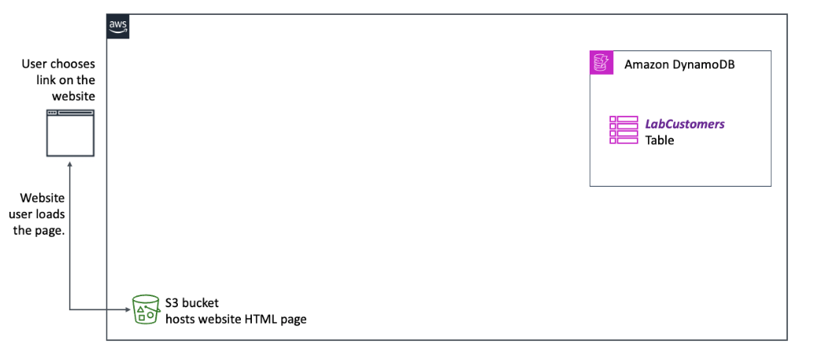
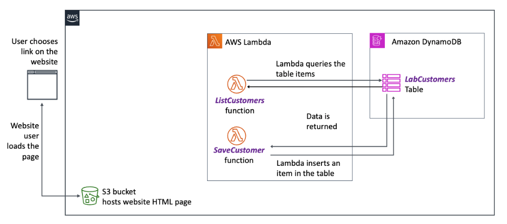
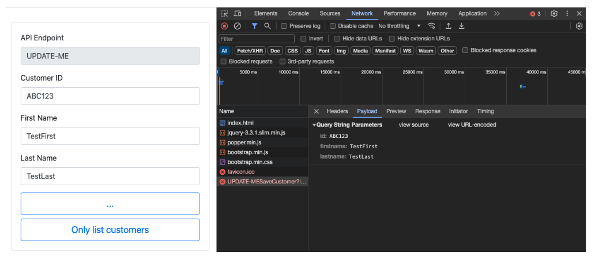

# Creating AWS Lambda Functions to List and Save Customers

## Lab overview

In this lab, you start with what you achieved in the last lab already in place. There is an Amazon DynamoDB table named LabCustomers already in place and it contains a few items of sample data. There is also an Amazon Simple Storage Service (Amazon S3) bucket configured to host a website. And it contains the web frontend for your application in the form of a single index.html page.

Objectives
By the end of this lab, you should be able to do the following:

Create an AWS Lambda function by using the AWS SDK for Python (Boto3) to retrieve items to a DynamoDB table.
Create a Lambda function that can insert an item into to a DynamoDB table.
Test a Lambda function by supplying mock test data.
Confirm that a new item was successfully inserted into the DynamoDB table by the Lambda function.
Icon key
Various icons are used throughout this lab to call attention to different types of instructions and notes. The following list explains the purpose for each icon:

 Caution: Information of special interest or importance (not so important to cause problems with the equipment or data if you miss it, but that could result in the need to repeat certain steps)
 Consider: A moment to pause to consider how you might apply a concept in your own environment or to initiate a conversation about the topic at hand
 Expected output: A sample output that you can use to verify the output of a command or edited file
 Note: Additional information or elaboration on a point
 Task complete: A conclusion or summary point in the lab
 Warning: An action that is irreversible and could potentially impact the failure of a command or process (including warnings about configurations that cannot be changed after they are made)
Start lab
To launch the lab, at the top of the page, choose Start Lab.

 Caution: You must wait for the provisioned AWS services to be ready before you can continue.

To open the lab, choose Open Console .

You are automatically signed in to the AWS Management Console in a new web browser tab.

 Warning: Do not change the Region unless instructed.

Common sign-in errors
Error: Choosing Start Lab has no effect
In some cases, certain pop-up or script blocker web browser extensions might prevent the Start Lab button from working as intended. If you experience an issue starting the lab:

Add the lab domain name to your pop-up or script blocker’s allow list or turn it off.
Refresh the page and try again.
Lab environment
The following diagram depicts the basic architecture of the lab environment. The resources depicted in the diagram already exist in your Amazon Web Services (AWS) account when you start the lab.



Image description: The diagram illustrates a web development setup on AWS. It shows a user interacting with a website, the development environment where the website is being coded, and the database where the website’s data is stored. When a user visits the website, their actions can initiate updates to the database through the development environment. See the following for a detailed description.

To review the detailed diagram description, expand this section.

Detailed diagram description
On the left side of the diagram, there are two icons. The first is a computer monitor with a user interface, representing a user visiting a website and choosing a link. The second is an Amazon S3 bucket, indicating that it is hosting the static HTML page for the website that the user is interacting with.

On the far right side of the diagram is the Amazon DynamoDB icon group box. Within this group box is the LabCustomers table, indicating that this is a table within the DynamoDB database where customer information is stored.

Arrows indicate the flow of interaction: The user’s action on the website sends information to the development environment, AWS Cloud9 IDE on Amazon Elastic Compute Cloud (Amazon EC2), which in turn communicates with the DynamoDB database to update or retrieve data as if configured.

 Note: There is no AWS Cloud9 IDE as in the previous lab. That is because, in this lab, you are able to complete the lab exercises without the use of an AWS Cloud9 IDE.

By the end of this lab, you build upon the current resources to end up with the following architecture:



Image description: The diagram presents a workflow of a user interacting with a web application that involves a static webpage, serverless functions, and a database. The user’s interaction on the webpage initiates Lambda functions that communicate with a database to retrieve and store data. See the following for a detailed description.

To review the detailed diagram description, expand this section.

Detailed diagram description
The workflow starts on the left with a depiction of a user interface, where the user chooses a link on a website and the website user loads the page.

Next, there is an Amazon S3 bucket icon, labeled as hosting the website’s HTML page. This represents the storage of the static web content that the user accesses.

In the middle of the diagram is a rectangular AWS Lambda group box. Lambda is a serverless compute service. Inside this rectangle, two Lambda functions are depicted: ListCustomers and SaveCustomer.

The ListCustomers function is connected to a line that leads to the right, labeled Lambda queries the table items, indicating the action that this function performs. The SaveCustomer function has a line leading to the right, labeled Lambda inserts an item in the table, describing its action.

On the right side, the final component is the Amazon DynamoDB database group box, indicated by its service icon. And within this is the LabCustomers table. This represents the DynamoDB table where customer data is stored.

Arrows show the flow of data. One pair of arrows moves from the ListCustomers function to the LabCustomers table in DynamoDB and back, labeled Data is returned, showing the data retrieval process. The second pair of arrows shows the flow from the SaveCustomer function to the DynamoDB table, indicating where the new data is inserted.

This diagram illustrates how the web application on AWS can use serverless functions to interact with a database based on user actions on a static webpage. The ListCustomers function retrieves data from DynamoDB, and the SaveCustomer function sends data to be stored in the database.

AWS services used in this lab
The services used in this lab are as follows:

AWS Lambda
Amazon DynamoDB
Amazon Simple Storage Service (Amazon S3)
AWS Identity and Access Management (IAM)
AWS services not used in this lab
AWS service capabilities used in this lab are limited to what the lab requires. Expect errors when accessing other services or performing actions beyond those provided in this lab.

Task 1: Create a Lambda function to list customers
By the end of the last lab, you verified that the static Amazon S3 website existed. You can verify it again from the link to the left of these instructions. Just know website still does not list or create and records to or from the DynamoDB table. Then, you successfully retrieved data from a DynamoDB table by using the Python interactive terminal on your AWS Cloud9 instance. In this lab, you create a Lambda function that uses the same SDK for Python code to accomplish the same thing. Essentially, you create the Lambda function, deploy it, and test its functionality.

Task 1.1: Create the ListCustomers Lambda function
On the AWS Management Console, in the search box, search for and choose Lambda.

From the Functions page, choose Create function and then configure the following options:

For Function name, enter ListCustomers.
For Runtime, choose Python 3.12.
For Permissions, expand Change default execution role and configure the following options:
For Execution role, select Use an existing role.
For Existing role, choose the ListCustomers role.
Choose Create function .

You should see a confirmation message that reads, “Successfully created the function ListCustomers…”

In the Code source section, on the lambda_function tab, delete the existing code and replace it with the following code snippet:


import boto3

def lambda_handler(event, context):
    dynamodb = boto3.client("<FMI>")
    query_response = dynamodb.scan(TableName="<FMI>")
    lists = [ [item["ID"]["S"], item["firstname"]["S"], item["lastname"]["S"]]
        for item in query_response["Items"]]
Challenge 1: Update the Lambda function code
In this challenge, you update the <FMI> placeholders with the correct values.

If you get stuck and need to see the solution code, expand this section:
 Solution:


import boto3

def lambda_handler(event, context):
    dynamodb = boto3.client("dynamodb")
    query_response = dynamodb.scan(TableName="LabCustomers")
    lists = [[item["ID"]["S"], item["firstname"]["S"], item["lastname"]["S"]] 
            for item in query_response["Items"]]
 Consider: Recall that you used exactly these lines of code in the previous lab when working with the interactive Python shell to query the LabCustomers DynamoDB table.

Add a final line to the lambda_handler function:


    return { "result": lists }
 Note: This line of code should tabbed over so it falls under the lambda_handler function. Otherwise, it might render an error because indentation is critical in Python.

Save the change by choosing File > Save.

To see the ListCustomers Lambda function complete solution if needed, expand this section:
 Full solution:


import boto3

def lambda_handler(event, context):
    dynamodb = boto3.client('dynamodb')
    query_response = dynamodb.scan(TableName='LabCustomers')
    lists = [[item["ID"]["S"], item["firstname"]["S"], item["lastname"]["S"]] 
            for item in query_response["Items"]]
    return {"result": lists}
Task 1.2: Deploy and test the Lambda function
Choose Deploy.

You should see a message reding, “Successfully updated the function ListCustomers.”

Choose Test |  .

This opens the Configure test event window.

Set the test Event name to Test1.

Keep the remaining settings (including the default Event JSON content, which is ignored if left unmodified), and choose Save.

You should see a message stating, “The test event Test1 was successfully saved.”

To actually run the test, choose Test |  again.

 Expected output:


Test Event Name
Test1

Response
{
    "result": [
        [
            "ABC124",
            "Martha",
            "Rivera"
        ],
        [ 
            "ABD123",
            "Manu",
            "Kwesi"
        ]
    ]
}

Function Logs
START RequestId: 04baa57e-f2f6-4dc6-ba14-2730d062149d Version: $LATEST
END RequestId: 04baa57e-f2f6-4dc6-ba14-2730d062149d
REPORT RequestId: 04baa57e-f2f6-4dc6-ba14-2730d062149d	Duration: 564.17 ms	Billed Duration: 565 ms	Memory Size: 128 MB	Max Memory Used: 77 MB

Request ID
04baa57e-f2f6-4dc6-ba14-2730d062149d
 Task complete: You successfully created, deployed, and tested the ListCustomers Lambda function.

Task 2: Create a Lambda function to save a customer
In this task, you create a Lambda function named SaveCustomer and develop code by using the put_item method to save an item into the LabCustomers table. Then you deploy and test the SaveCustomer Lambda function by using mock data.

Task 2.1: Review the payload
Open the webpage hosted on Amazon S3 in a new Chrome browser tab using the WebsiteURL value to the left of these instructions.

Open the Developer tools > Network tab in the browser where the webpage is loaded, and choose the Save customer & then list customers button.

In the Name column on the Network tab, choose the UPDATE-MESaveCustomer?.. entry and choose the Payload tab.

Notice the format of the payload Query String Parameters that are being submitted (include a screenshot - you could use the one I just attached here).



Image description: Image depicts the Chrome browser’s Developer tools Network tab after choosing the UPDATE-MESaveCustomer?.. entry, which shows the Query String Parameters.

Keep this view open so that you can refer to it when working on the SaveCustomer Lambda function.
Task 2.2: Create the function
From the existing Lambda browser tab, choose the Functions breadcrumb at the top of the page to return to the list of Lambda functions.

Choose Create function, and then configure the following options:

For Function name, enter SaveCustomer.
For Runtime, choose Python 3.12.
For Permissions, expand Change default execution role and configure the following:
Select Use an existing role.
For Existing role, choose the SaveCustomer role.
Choose Create function.

You should see a message reading, “Successfully created the function SaveCustomer…”

In the Code source section, on the lambda_function tab, delete the existing code and replace it with the following code:


import boto3

def lambda_handler(event, context):
    print(event)
    id = event["queryStringParameters"]["<FMI>"]
    firstname = event["queryStringParameters"]["<FMI>"]
    lastname = event["queryStringParameters"]["<FMI>"]

    dynamodb = boto3.client("<FMI>")
    query_response = dynamodb.scan(TableName="<FMI>")
    put_response = dynamodb.put_item(
        TableName="<FMI>",
        Item={
            "ID": {"S": id},
            "<FMI>": {"S": firstname},
            "<FMI>": {"S": lastname},
        },
    )
    return {"result": "Saved"}
Save the file.

Challenge 2: Update the Lambda function code
In this challenge, you replace the eight <FMI> placeholders in that SaveCustomer function code with the correct values.

The code should retrieve the three values contained in the query string parameters and assign them to variables. It should then create a DynamoDB boto3 client, connect to the table, and invoke the put_item DynamoDB method to insert the customer record into the database table.

 Note: If you need help, to see the solution code, expand this section.

Solution
 Full solution:


import boto3

def lambda_handler(event, context):
    print(event)
    id = event["queryStringParameters"]["id"]
    firstname = event["queryStringParameters"]["firstname"]
    lastname = event["queryStringParameters"]["lastname"]
    dynamodb = boto3.client("dynamodb")
    query_response = dynamodb.scan(TableName="LabCustomers")
    put_response = dynamodb.put_item(
        TableName="LabCustomers",
        Item={
            "ID": {"S": id},
            "firstname": {"S": firstname},
            "lastname": {"S": lastname},
        },
    )
    return {"result": "Saved"}
Save the change by choosing File > Save.
Task 2.3: Deploy and test the Lambda function with mock data
There is still no configuration in place to make it so that when a user chooses Put Item on the webpage that your new Lambda function is invoked. However, you can still test the Lambda function by supplying test input data on the Lambda console.

On the Lambda console page, choose Deploy.

You should see a message reading, “Successfully updated the function SaveCustomer.”

Choose Test |  .

This opens the Configure test event window in the browser.

Set the test Event name to Test1.

In the Event JSON section, replace the existing content with the following code:

```json
{ 
    "queryStringParameters": {
        "id": "ABE125",
        "firstname": "Pat",
        "lastname": "Candella"
    }
}
```

 Note: Observe how the format of this Event JSON matches the query string parameters that you observed in the webpage’s web development tools Network tab view when you performed a test of the Put Item button.

 Caution: If you submit a new customer record that has the same ID value as a record that is already in the DynamoDB table, a new record is not created. Instead, the existing record is updated with the new values. That is because ID is the partition key of the table, so it must be unique for any item (row) in the table.

Choose Save.

You should see a message reading, “The test event Test1 was successfully saved.”

To actually run the test, choose Test |  again.

 Expected output: If you see a response similar to the following, the test was successful.


Test Event Name
Test1

Response
{
  "result": "Saved"
}

Function Logs
START RequestId: c3f4f3c0-019e-4ba9-b2ec-a9c6724a00d5 Version: $LATEST
{'queryStringParameters': {'id': 'ABE124', 'firstname': 'Pat', 'lastname':  'Candella'}}
END RequestId: c3f4f3c0-019e-4ba9-b2ec-a9c6724a00d5
REPORT RequestId: c3f4f3c0-019e-4ba9-b2ec-a9c6724a00d5	Duration: 598.09  ms	Billed Duration: 599 ms	Memory Size: 128 MB	Max Memory Used: 77 MB

Request ID
c3f4f3c0-019e-4ba9-b2ec-a9c6724a00d5
Task 2.4: Confirm item saved in DynamoDB table
Confirm that the customer was actually saved. There are several ways that you could accomplish this. Here are two options:

Open the DynamoDB console and for the LabCustomers table, choose Explore table items again.

Or return to the Lambda console and choose the ListCustomers function. Run the test on this function again.

 Expected output:


{
  "result": [
    [
      "ABE124",
      "Martha",
      "Rivera"
    ],
    [
      "ABD123",
      "Manu",
      "Kwesi"
    ],
    [
      "ABE125",
      "Pat",
      "Candella"
    ]
  ]
}
 Task complete: You have successfully deployed the latest application updates. You also tested the application to confirm that it stores new customer details in the DynamoDB table, and that it retrieves the table items to display in the Amazon S3 hosted website.

The individual components used by the serverless application are coming together. However, one important piece is missing. You still can’t create a new customer record and list all customer records by using the frontend webpage. You build that functionality in the next lab.

Conclusion
You have successfully done the following:

Created a Lambda function by using the SDK for Python to retrieve items to a DynamoDB table
Created a Lambda function that can insert an item into to a DynamoDB table
Tested a Lambda function by supplying mock test data
Confirmed that a new item was successfully inserted into the DynamoDB table by the Lambda function
End lab
Follow these steps to close the console and end your lab.

Return to the AWS Management Console.

At the upper-right corner of the page, choose AWSLabsUser, and then choose Sign out.

Choose End Lab and then confirm that you want to end your lab.

For more information about AWS Training and Certification, see https://aws.amazon.com/training/.

Your feedback is welcome and appreciated.
If you would like to share any feedback, suggestions, or corrections, please provide the details in our AWS Training and Certification Contact Form.

Python is property of the Python Software Foundation (PSF). Reference in this lab to any specific commercial product, process, or service, or the use of any trade, firm or corporation name is provided for informational purposes, and does not constitute endorsement, recommendation, or favoring by Amazon Web Services.