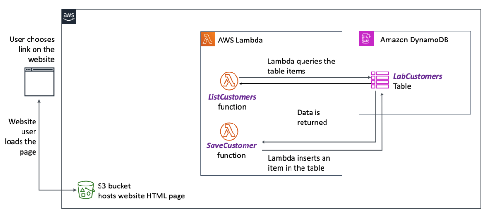
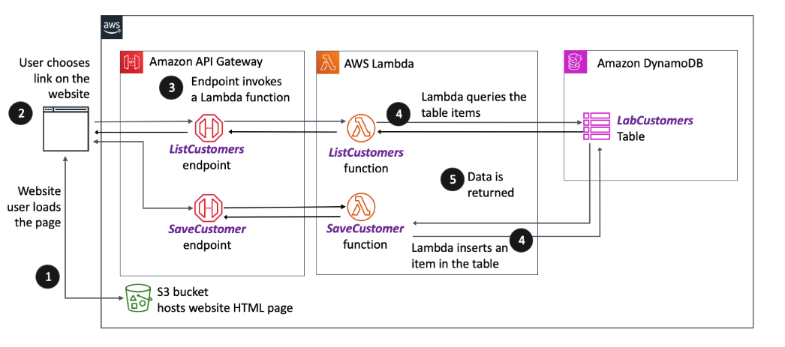

# Connecting Serverless Functions with Amazon API Gateway

## Lab overview

In the previous two labs, you hosted a static webpage on Amazon Simple Storage Service (Amazon S3) to build out functionality so that it can be used to submit new customer records and retrieve a list of all customers. You created an Amazon DynamoDBB table to act as a datastore for these records. You also created two AWS Lambda functions: one to retrieve a list of all customer records and another to save a customer record.

In this lab, you use Amazon API Gateway to define a REST API endpoint that can start the Lambda functions when the appropriate button is selected. You then update the webpage to invoke the endpoints, thereby adding the functionality that you have been working toward.

You create two endpoints:

[GET] /ListCustomers (This invokes the ListCustomers Lambda function to run a DynamoDB table scan.)
[POST] /SaveCustomer (This sends the query string parameters submitted by your web form to the SaveCustomer Lambda function, which inserts the record into the database.)
Objectives
By the end of this lab, you should be able to do the following:

Create an HTTP API by using API Gateway.
Create a GET method API endpoint and configure it to invoke a Lambda function.
Create a POST method API endpoint and configure it to invoke a Lambda function.
Confirm that the serverless web application works as intended.
Icon key
Various icons are used throughout this lab to call attention to different types of instructions and notes. The following list explains the purpose for each icon:

 Caution: Information of special interest or importance (not so important to cause problems with the equipment or data if you miss it, but it could result in the need to repeat certain steps).
 Command: A command that you must run.
 Consider: A moment to pause to consider how you might apply a concept in your own environment or to initiate a conversation about the topic at hand.
 Expected output: A sample output that you can use to verify the output of a command or edited file.
 Note: A hint, tip, or important guidance.
 Task complete: A conclusion or summary point in the lab.
 Warning: An action that is irreversible and could potentially impact the failure of a command or process (including warnings about configurations that cannot be changed after they are made).
Start lab
To launch the lab, at the top of the page, choose Start Lab.

 Caution: You must wait for the provisioned AWS services to be ready before you can continue.

To open the lab, choose Open Console .

You are automatically signed in to the AWS Management Console in a new web browser tab.

 Warning: Do not change the Region unless instructed.

Common sign-in errors
Error: Choosing Start Lab has no effect
In some cases, certain pop-up or script blocker web browser extensions might prevent the Start Lab button from working as intended. If you experience an issue starting the lab:

Add the lab domain name to your pop-up or script blocker’s allow list or turn it off.
Refresh the page and try again.

## Lab environment

The following diagram depicts the basic architecture of the lab environment when you start the lab. The resources depicted in the diagram already exist in your Amazon Web Services (AWS) account.

Image description: The diagram presents a workflow of a user interacting with a web application that involves a static webpage, serverless functions, and a database. The user’s interaction on the webpage initiates Lambda functions that communicate with a database to retrieve and store data. See the following for a detailed description.

To review the detailed diagram description, expand this section.

Detailed diagram description
The workflow starts on the left with a depiction of a user interface, where the user chooses a link on a website and the website user loads the page.

Next, there is an Amazon S3 bucket icon, labeled as hosting the website’s HTML page. This represents the storage of the static web content that the user accesses.

In the middle of the diagram is a rectangular AWS Lambda group box. Lambda is a serverless compute service. Inside this rectangle, two Lambda functions are depicted: ListCustomers and SaveCustomer.

The ListCustomers function is connected to a line that leads to the right, labeled Lambda queries the table items, indicating the action that this function performs. The SaveCustomer function has a line leading to the right, labeled Lambda inserts an item in the table, describing its action.

On the right side, the final component is the Amazon DynamoDB database group box, indicated by its service icon. And within this is the LabCustomers table. This represents the DynamoDB table where customer data is stored.

Arrows show the flow of data. One pair of arrows moves from the ListCustomers function to the LabCustomers table in DynamoDB and back, labeled Data is returned, showing the data retrieval process. The second pair of arrows shows the flow from the SaveCustomer function to the DynamoDB table, indicating where the new data is inserted.

This diagram illustrates how the web application on AWS can use serverless functions to interact with a database based on user actions on a static webpage. The ListCustomers function retrieves data from DynamoDB, and the SaveCustomer function sends data to be stored in the database.

By the end of this lab, you create the following architecture:

Image description: The diagram illustrates the AWS based web application architecture. It involves user interaction with a website, API Gateway, AWS Lambda functions, and Amazon DynamoDB. A user choosing a link on a website accesses an API Gateway endpoint, which in turn invokes one of two Lambda functions: ListCustomers and SaveCustomer. The ListCustomers function queries the LabCustomers DynamoDB table for data, which is then returned to the user. The SaveCustomer function inserts a new item into the LabCustomers table. Numbers 1 through 5 are used to indicate the flow of operations. See the following for a detailed description.

To review the detailed diagram description, expand this section.

Detailed diagram description
The image depicts a flowchart describing the components and data flow of the serverless web application using AWS services, detailed as follows:

At the far left, a numbered step 1 next to an S3 bucket icon signifies that an S3 bucket hosts the website’s HTML page.

Above, a step 2 indicates a user action where the user chooses a link on the website.

An arrow from this action points to an API Gateway endpoint icon marked with step 3, indicating that an endpoint invokes two Lambda functions. One arrow leads to ListCustomers and the other to SaveCustomer.

Near the ListCustomers function, numbered step 4 next to an arrow indicates that the function queries the table items from the LabCustomers DynamoDB table. The other step 4 near the SaveCustomer function inserts data into the LabCustomers DynamoDB table.

Step 5 shows data being returned to the function from the LabCustomers DynamoDB table.

At the SaveCustomer function, another step 4 appears next to an arrow pointing from the function to the DynamoDB table, indicating that the function inserts an item into the table.

Overall, the image uses symbols for AWS services and numbered arrows to map the user journey from interacting with the static website hosted on Amazon S3, through Amazon API Gateway, to retrieve data or store data with Lambda functions and a DynamoDB table.

AWS services used in this lab
The services used in this lab are as follows:

Amazon API Gateway
AWS Lambda
Amazon DynamoDB
Amazon Simple Storage Service (Amazon S3)
AWS Identity and Access Management (IAM)
AWS Cloud9
Amazon Elastic Compute Cloud (Amazon EC2)
AWS services not used in this lab
AWS service capabilities used in this lab are limited to what the lab requires. Expect errors when accessing other services or performing actions beyond those provided in this lab.

Task 1: Create an HTTP API with a GET method endpoint
In this task, you create a REST API called customer-app. You also create the first of two resources for the API.

The first API resource that you create is named ListCustomers. It makes a GET request so that the website can retrieve all items (rows) from the LabCustomers DynamoDB database table. You then deploy it in an API Gateway stage that’s named prod. When a user visits the website, it makes an AJAX request and returns a list of customers from API Gateway.

To complete all these tasks, you use the AWS SDK for Python (Boto3).

On the AWS Management Console, in the search box, search for and choose API Gateway.

Under Choose an API type, in the HTTP API section, choose Build .

On the Create an API page, under Integrations (0), choose Add Integration and then configure the following options:

For Integrations, choose Lambda.
For AWS Region, choose the Region that matches the AWSRegionCode value that is listed to the left of these instructions.
In the Lambda function search box, choose the ARN with text that includes ListCustomers.
For Version, choose 2.0.
For API name, enter customer-app.
Choose Next .

The Configure routes - optional page opens.

In the Configure routes section, configure the following options:

For Method, choose GET.
For Resource path, enter /ListCustomers.
For Integration target, choose ListCustomers.
Choose Review and Create .

You are taken to the Review and Create page.

Scroll down and choose Create .

You should see a message reading, “Successfully created API customer-app…”

Next, configure CORS.

From the left navigation pane, choose CORS.

The Cross-Origin Resource Sharing page opens.

Choose Configure, and then configure the following options:

For Access-Control-Allow-Origin, enter * and choose Add.

For Access-Control-Allow-Headers, enter * and choose Add.

For Access-Control-Allow-Methods, select both GET and POST.

 Note: Make sure to choose the Add button after entering each * symbol. If you fail to do this, it can lead to a CORS fetch error later in the lab.

Choose Save .

 Task complete: You created a REST API called customer-app. You also created the first of two methods for the API.

Task 2: Add a POST method to the endpoint
In this task, you add a POST method to the customer-app API and configure it to invoke the SaveCustomer Lambda function that you defined in the previous lab. This then permits you to use the webpage to add a new customer.

At the top of the page on the API Gateway console, choose the customer-app API link.

On the Routes page, in the Routes for customer-app section, choose Create.

On the Create a route page, in the first dropdown box, choose POST.

In the second dropdown box, delete the existing value and enter /SaveCustomer.

Choose Create.

Under /SaveCustomer, choose POST.

Choose Attach Integration .

Choose Create and attach an integration .

In the Integration target section, for Integration type, choose Lambda function.

For AWS Region, choose the Region that matches the AWSRegionCode value that is listed to the left of these instructions.

In the Lambda function search box, choose the ARN with text that includes SaveCustomer.

Expand the Advanced settings dropdown section.

Keep the Payload format version at 2.0.

In the Invoke permissions section, turn on Grant API Gateway permission to invoke your Lambda function.

Choose Create .

You should see a message that reads, “Successfully updated 1 routes.”

 Task complete: You successfully added the POST method to the customer-app API.

Task 3: Add the API endpoint to the webpage and test
In this task, you update the index.html webpage to use the API endpoint. You then test the serverless web application to ensure that it functions as expected to list and save customer data.

Task 3.1: Add the API endpoint to the webpage
To open the AWS Cloud9 integrated development environment (IDE), copy the Cloud9Environment URL value that is listed to the left of these instructions, and paste it into a new browser tab.

Return to the API Gateway console, and in the AWS Management Console search box, search for and choose API Gateway to open in a new browser tab.

Choose the link for customer-app.

From the left navigation menu, choose the link starting with API: customer-app… to view the API details.

Copy the Invoke URL link.

In the AWS Cloud9 IDE, open the index.html file.

In the file editor window, replace the UPDATE-WITH-API-INVOKE-URL placeholder with the API Gateway Invoke URL that you just copied with a trailing / (forward slash).

 Note: This should be line 79 or 80 in the index.html file.

To review an example, expand this section.
Before:

value="UPDATE-WITH-API-INVOKE-URL">
After:

value="https://q8vcehmof8.execute-api.us-west-2.amazonaws.com/"
 Caution: Don’t forget to include the trailing / at the end of the invoke URL.

Save the changes to the file.

The index.html file is now updated to include the API invoke URL. However, for the changes to take effect, the file must be uploaded to the S3 bucket that hosts the static website.

 Command: Upload the modified version of the index.html file to the bucket that hosts the static website.

# Changes directories to ~/environment to ensure you are in the right directory
cd ~/environment

# Obtain bucket name with website in the name and store to a variable
bucket=$(aws s3 ls | grep website | awk '{print $3}' | xargs)

# Upload index.html to the website bucket
aws s3 cp index.html s3://$bucket
 Expected output:

******************************
**** This is OUTPUT ONLY. ****
******************************

upload: ./index.html to s3://customerswebsite-us-west-2-356824981/index.html
Task 3.2: Test the ListCustomer feature from the webpage
Copy the WebsiteURL value from the panel to the left of these instructions and paste it into a new browser tab.

You should see that all the customer records from the database are listed at the bottom of the webpage.

 Consider: If you look back at the script section of the index.html page source, you see that on or around lines 61 and 63 there is a call to the refreshTable() function. On line 23 in that function, you find the following line:

fetch(`${apiEndpoint}ListCustomers`)
This invoked the GET ListCustomers method that you defined in the HTTP API. There was no need to choose the Only list customers button to retrieve the list of customers.

Task 3.3: Test the add a new customer feature
You can now test adding a new user on the webpage.

Enter new details for Customer ID, First Name, and Last Name. Then choose the Save customer & then list customers button.

You should see the new customer details populate the bottom of your webpage in a few moments.

 Task complete: You successfully updated the index.html file with the API Gateway endpoint invoke URL. You uploaded the file to the S3 bucket so that the changes would be available after a webpage refresh. Then you tested the functionality of the ListCustomer Lambda function and the SaveCustomer Lambda function by using API Gateway through the webpage.

Conclusion
You have successfully done the following:

Created an HTTP API by using API Gateway
Created a GET method API endpoint and configured it to invoke a Lambda function
Created a POST method API endpoint and configured it to invoke a Lambda function
Confirmed that the serverless web application works as intended
End lab
Follow these steps to close the console and end your lab.

Return to the AWS Management Console.

At the upper-right corner of the page, choose AWSLabsUser, and then choose Sign out.

Choose End Lab and then confirm that you want to end your lab.

For more information about AWS Training and Certification, see https://aws.amazon.com/training/.

Your feedback is welcome and appreciated.
If you would like to share any feedback, suggestions, or corrections, please provide the details in our AWS Training and Certification Contact Form.

Python is property of the Python Software Foundation (PSF). Reference in this lab to any specific commercial product, process, or service, or the use of any trade, firm or corporation name is provided for informational purposes, and does not constitute endorsement, recommendation, or favoring by Amazon Web Services.