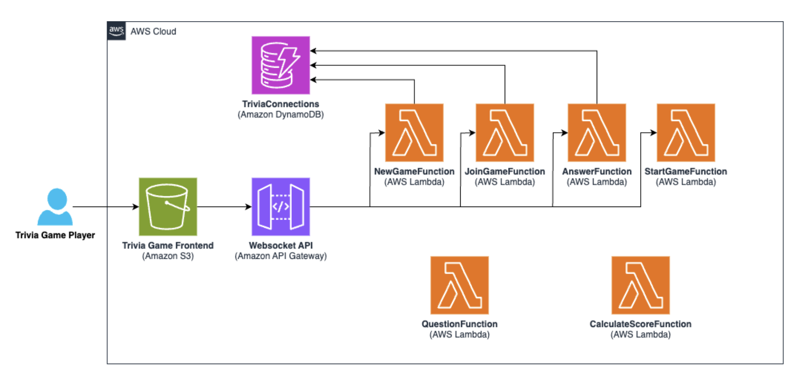
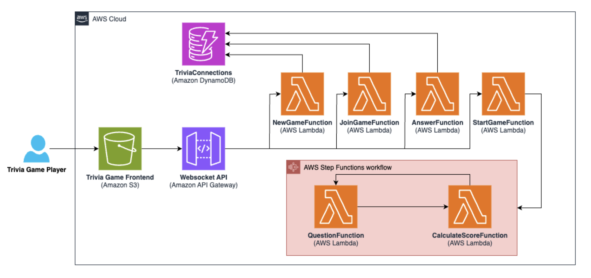
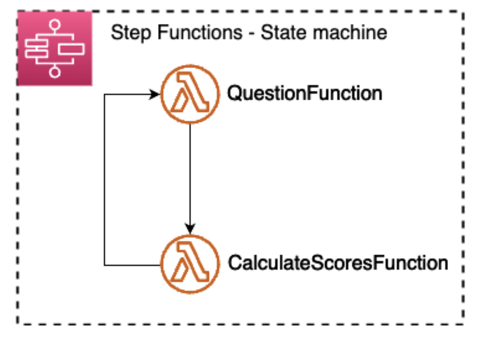
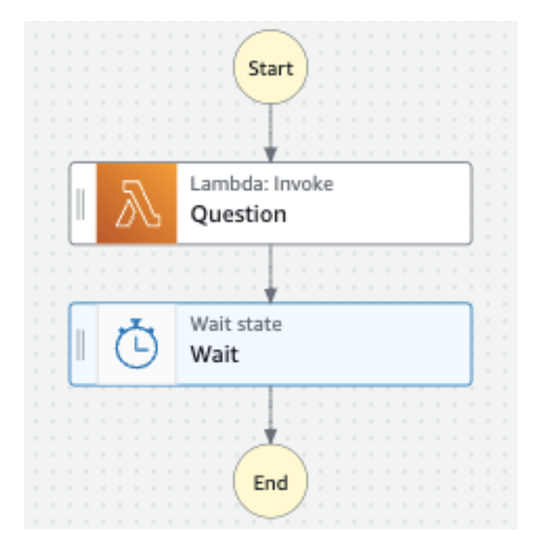
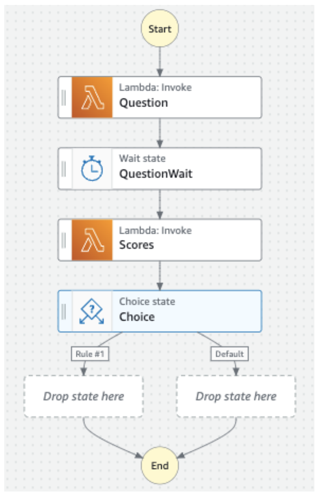
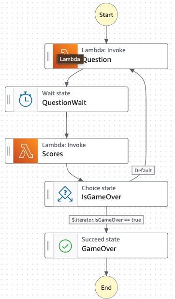

# Building Serverless Workflows with AWS Step Functions

## Lab overview

In this lab, you learn how AWS Step Functions can be used to coordinate the invocation of AWS Lambda functions to create a workflow. In this specific implementation, the Step Functions state machine that you create coordinates the actions necessary to run a trivia game.

Objectives
By the end of this lab, you should be able to do the following:

Create an AWS Step Functions state machine.
Configure AWS Lambda functions to be invoked from a Step Functions state machine.
Use wait state and choice state flow objects in the design of a Step Functions state machine.
Invoke a state machine to start when a REST API endpoint is invoked.
Icon key
Various icons are used throughout this lab to call attention to different types of instructions and notes. The following list explains the purpose for each icon:

 Caution: Information of special interest or importance (not so important to cause problems with the equipment or data if you miss it, but it could result in the need to repeat certain steps).
 Learn more: Where to find more information.
 Note: Additional information or elaboration on a point.
 Task complete: A conclusion or summary point in the lab.
 Warning: An action that is irreversible and could potentially impact the failure of a command or process (including warnings about configurations that cannot be changed after they are made).
Start lab
To launch the lab, at the top of the page, choose Start Lab.

 Caution: You must wait for the provisioned AWS services to be ready before you can continue.

To open the lab, choose Open Console .

You are automatically signed in to the AWS Management Console in a new web browser tab.

 Warning: Do not change the Region unless instructed.

Common sign-in errors
Error: Choosing Start Lab has no effect
In some cases, certain pop-up or script blocker web browser extensions might prevent the Start Lab button from working as intended. If you experience an issue starting the lab:

Add the lab domain name to your pop-up or script blocker’s allow list or turn it off.
Refresh the page and try again.

## Lab environment

The following diagram depicts the basic architecture of the lab environment. The resources depicted in the diagram already exist in your Amazon Web Services (AWS) account when you start the lab.

Image description: The image illustrates the architecture for the trivia game application, featuring a WebSocket API created with Amazon API Gateway as the central communication hub. For more information, see the following detailed description.

Detailed description
This API interacts with several AWS Lambda functions:
NewGameFunction
JoinGameFunction
AnswerFunction
StartGameFunction
Each of these functions, upon invocation, perform actions like updates or queries an Amazon DynamoDB table.
Additionally, there are other Lambda functions which manage the flow of the trivia game by handling questions and score calculations dedicated to game play:
QuestionFunction
CalculateScoresFunction

However, by the end of this lab, you are able to create the following architecture:

Image description: The image presents an updated architecture for the trivia game application with several interconnected AWS services. For more information, see the following detailed description.

Detailed description
The diagram starts with a trivia game frontend that communicates with a WebSocket API created with Amazon API Gateway.

API Gateway connects to four Lambda functions in sequence:

NewGameFunction
JoinGameFunction
StartGameFunction
AnswerFunction
These functions interact with a DynamoDB table.

A Step Functions state machine is depicted, which orchestrates the flow involving two additional Lambda functions:

QuestionFunction
CalculateScoresFunction
The state machine ensures the orderly processing of game logic, from presenting questions to calculating scores.

AWS services used in this lab
The services used in this lab are as follows:

AWS Step Functions
Amazon API Gateway
Amazon DynamoDB
AWS Lambda
Amazon S3
AWS services not used in this lab
AWS service capabilities used in this lab are limited to what the lab requires. Expect errors when accessing other services or performing actions beyond those provided in this lab.

Task 1: Analyze existing resources
In this task, you review the underlying lab resources created as part of this lab.

Task 1.1: Access the web frontend of the trivia game application
Copy the WebsiteURL value that is listed to the left of these instructions, and paste it into a new browser tab.

A web application UI opens.

 Note: This web frontend consists of an object named index.html that is hosted on Amazon Simple Storage Service (Amazon S3) in a bucket with trivia-game-website in the name. The bucket has website hosting enabled.

Leave this browser tab open. You return to it in a moment.

On the AWS Management Console, in the search box, search for and choose DynamoDB.

From the left navigation pane, choose Tables.

A table named sam-game-TriviaConnections exists.

Choose the table link.

Choose Explore table items.

In the Items returned section, you see that there are no items in the table. The table is not populated until a game is started. Leave this page open so that you can return to it in a moment.

Task 1.2: Try to start a game
On the game application browser tab, choose Create a New Game.

A Waiting for players panel appears.

A Players list also appears, with one player already there, because the browser tab that you are currently looking at counts as a player.

 Note: Observe the Share the link below with players joining the game link.

Return to the DynamoDB console browser tab and choose Run.

There is now an item in the table. Choosing to create a new game generates data that the application preserves. The following is an example:

DynamoDB items returned console view.

Image description: Image shows that the DynamoDB console Items returned section now shows an entry with a gameId, connectionId, playerName, and score.

This table item was created by a Lambda function named NewGameFunction.

You can also perform the following optional actions:

On the game application browser tab, copy the share link and load it into another browser tab.

On the new webpage, chose Join.

Return to the Waiting for players browser tab.

 Note: If you do complete this step, another row will be added to the DynamoDB table for each player in the game. These additional items in the table are created by a Lambda function named JoinGameFunction.

Choose Start Game.

A Lambda function named StartGameFunction is invoked. In the game, Let’s Play! appears. However, nothing else happens. There is only a blinking circle.

Task 1.3: Understand the work to be completed
The StartGameFunction Lambda function was unable to advance you to the next part of the game, which is meant to present you with a series of trivia questions to be answered. To make the game work, a workflow must be created, one that can continually loop as it presents you with a series of questions and records points to the database for players who correctly answer the questions.

The logic to run the game consists of six Lambda functions. Three of them were just mentioned and only have to be invoked when the game is started. However, the other three Lambda functions must be coordinated to be invoked if particular conditions are met. A state machine would be a great way to coordinate the running of these processes. The state machine could also track how many questions have already been asked, and then end the game when the last question is asked.

In the remaining part of this lab, your challenge is to build and then test this state machine.

Image description: The image illustrates a Step Functions state machine. This state machine includes a sequence of two Lambda functions: QuestionFunction and CalculateScoresFunction. The flow indicates that after the QuestionFunction is started, it moves to the CalculateScoresFunction. The state machine orchestrates a series of operations that are part of the trivia game, from presenting a question to calculating scores. The functions are encased within a dotted line box, denoting them as part of the Step Functions state machine workflow.

 Task complete: You successfully reviewed the underlying lab resources created as part of this lab, attempted to start the trivia game, and learned about the work to be completed in this lab.

Task 2: Create a Step Functions state machine
In this task, you use Step Functions to create a state machine for the trivia game. It makes use of the Lambda functions that have already been created for you. It also makes use of the API Gateway endpoints that exist in your AWS account. The web frontend is already configured to make use of these endpoints.

Task 2.1: Start creating the state machine
On the AWS Management Console, in the search box, search for and choose Step Functions.

Expand the left menu and choose State machines.

Choose Create state machine.

Keep Blank selected and choose Select.

 Note: If you are presented with a Workflow Studio updates window or other similar windows, choose Dismiss.

You are presented with the Step Functions Workflow Studio.

It consists of a States browser on the left that has three tabs: Actions, Flow, and Patterns. You can drag items from here to the Canvas area, which is where you can create a workflow graph.

 Learn more: You can read more about the interface from the AWS Documentation Interface Overview link located in the Additional resources section.

On the right-hand side in the Workflow panel, for State machine query language choose JSONPath.

From the Actions tab, drag an AWS Lambda: Invoke state to the canvas and drop it onto the placeholder labeled Drag first state here.

Configure the Lambda invoke state:

For State name, enter Question.
For Integration type, choose Optimized.
For Function name, browse to and choose sam-game-QuestionFunction.
For Payload, choose Use state input as payload.
On the Input/Output tab, configure the following values:
Select Add original input to output using ResultPath.
In the dropdown menu, choose Discard result and keep original input.
Clear the Filter output with OutputPath check box.
Save your progress:

In the top-right corner, choose Create.

In the Confirm role creation window, choose View role configuration.

You are presented with the State machine configuration page.

For State machine name, enter TriviaStateMachine.

In the Permissions section, from the Execution role dropdown menu, choose the existing role named SamGameTriviaStateMachineRole.

Keep the other default settings and choose Create.

You should see a message stating, “State machine successfully created.”

Task 2.2: Add a wait state to the state machine
Continue building the state machine by adding a Wait state.

 Note: States are listed by Most Popular and then by service name. If you do not see the state that you are looking for, use the search field to type in the state to be able to select and drag the state into the canvas.

To return to the Workflow Studio view of the state machine, choose Edit.

From the Flow tab, drag a Wait state to the canvas, and drop it between the Question state and the End icon.

The canvas should now look like this:

Image description: The image depicts a simplified flowchart for the AWS Step Functions state machine. The process starts at Start, then moves to a Lambda function task labeled Question, indicating the invocation of the Question Lambda function. Following the Lambda function, there is a Wait state represented by a clock symbol, suggesting that the process pauses for a specified duration. Finally, the flowchart concludes with an End state, indicating the process is shutdown.

Configure the Wait state as follows:

For State name, enter QuestionWait.

For Options, select Wait for a fixed interval.

For Seconds, choose Get seconds from state input.

For the SecondsPath value, enter $.waitseconds.

 Note: This value comes in from the QuestionFunction Lambda function.

Save your progress by choosing Save.

You should see a message reading, “State machine was successfully updated.”

Task 2.3: Invoke another Lambda function
Continue building the state machine by invoking another Lambda function.

From the Actions tab, drag an AWS Lambda: Invoke state to the canvas, and drop it between the QuestionWait state and the End icon.

Configure the Lambda invoke state:

For State name, enter Scores.

For Integration type, choose Optimized.

For Function name, choose sam-game-CalculateScoresFunction.

For Payload, choose Use state input as payload.

On the Input/Output tab, configure the following values:

Select Transform result with ResultSelector.

Paste the following JSONPath code into the field below this check box:

{
"questionpos.$": "$.Payload.questionpos",
"IsGameOver.$": "$.Payload.IsGameOver"
}
Select Add original input to output using ResultPath.

Choose Combine original input with result.

In the JSONPath field below this, paste in the following code:

$.iterator
Clear the Filter output with OutputPath check box.

Your selections should match the following image.

Scores state output configuration.

Image description: The image represents the options that you just configured. For more information, refer to the following detailed diagram description.

To review the detailed diagram description, expand this section.

Detailed diagram description
The image contains instructions and code snippets for manipulating the output of a task in an AWS Step Functions state machine, with options that can be applied:

Option 1: Transform result with ResultSelector - optional

This section shows a JSON object using ResultSelector to selectively transform the result of a task. It takes specific fields from the task’s output (questionpos and IsGameOver) and maps them to a new JSON structure that is passed as input to the next state.
Option 2: Add original input to output using ResultPath - optional

This describes how to use ResultPath to include the original input and the task’s result in the state’s output. This allows for the combination of the original input data with the output from the task.
Option 3: Combine original input with result

There’s a dropdown selector, possibly allowing the user to specify how to merge the original input with the result, though details are not visible in the image.
Option 4: Filter output with OutputPath - optional

The section explains the use of OutputPath to filter the output of the state. OutputPath specifies which part of the output should be passed to the next state, allowing for further reduction of the data if needed.
The code snippet provided shows that ResultSelector is being used to construct a new JSON object from parts of the task result, specifying only the necessary data fields. The comments in the image emphasize that valid JSON and JSONPath syntax must be used, and provide additional context for how to properly reference nodes in the state’s JSON input.

To save your progress, choose Save.

You should see a message reading, “State machine was successfully updated.”

Task 2.4: Add a choice state
Continue building the state machine by adding a Choice state.

From the Flow tab, drag a Choice state to the canvas, and drop it between the Scores state and the End icon.

The canvas should now look like this:

Image description: The image is a flowchart representing a state machine in AWS Step Functions. It begins with a Start node, followed by the invocation of a Lambda function named Question. After this Lambda function, there is a wait state called QuestionWait. When the wait is over, another Lambda function named Scores is started. Subsequently, a choice state called Choice appears, indicating a decision point with two unspecified paths: Rule #1 and a Default path, which suggest different flows based on certain conditions. However, specific details of these paths are not provided because they are placeholders marked Drop state here. The flowchart concludes with an End node, signifying the end of the state machine workflow.

Configure the Choice state as follows:

For State name, enter IsGameOver.

For Default rule, choose the pencil icon.

For Default state, choose Question.

 Note: In the canvas diagram, the arrow labeled Default now returns upstream so that it can invoke the Question Lambda function. This makes sense, because you want the trivia game to keep asking questions until the game is over.

Choose the Close link in the Default rule box.

For Rule #1, choose the pencil icon.

Choose Add conditions.
In the Variable input field, paste in the following code:

$.iterator.IsGameOver
For Operator, choose is equal to.
For Value, choose Boolean constant, and for the value, choose true.
Choose Save conditions.

 Note: Don’t choose Save. Instead, continue with the following steps.

Task 2.5: Add a success state
Finish building the state machine by adding a Success state.

From the Flow tab, drag a Success state to the canvas, and drop it between the IsGameOver state and the End icon.

Configure the Success state by setting the State name to GameOver.

To save the state machine, choose Save.

You should see a message reading, “State machine was successfully updated.”

Your completed state machine should look as shown here.

Image description: The depicted state machine starts with the invocation of a Lambda function named Question. Upon completion, it transitions to a wait state named QuestionWait. After the wait, another Lambda function called Scores is invoked. Following this, a choice state named IsGameOver checks a condition. If the condition $.iterator.IsGameOver equals true, the state machine moves to a succeed state called GameOver, signaling a successful end to the process. If the condition is not met, the workflow presumably loops back (though this part of the path is not visible in the image), indicating that the process is iterative until a certain condition is satisfied. The state machine finally reaches an End state.

At the top of the page, notice that you are in Design mode.

Choose the Code option to switch to Code mode.

 Learn more: To learn more about the view changes to display, refer to Amazon States Language in the Additional resources section. It captures every detail about the state machine that you just created.

To exit the Workflow Studio editor, choose the Exit link at the top of the page.

 Note: If you are asked if you are sure, choose Leave.

On the TriviaStateMachine page, in the Details section, copy the Arn of the state machine to your clipboard and save it in a text editor to refer to later.

Task 2.6: Update the StartGame Lambda function
You must ensure that the StartGameFunction Lambda function is invoked when a gamer indicates that they want to start a new game. To do this you need to provide the ARN of the Step Functions state machine that you just created as an environment variable in the Lambda function.

On the AWS Management Console, in the search box, search for and choose Lambda.

Choose the sam-game-StartGameFunction function.

On the Configuration tab, choose the Environment variables section.

Choose Edit, and then choose Add environment variable and configure the following options:

For Key, enter STATE_MACHINE.

For Value, paste in the ARN value of the state machine that you copied a moment ago.

 Note: It is in the format arn:aws:states:REGION:ACCOUNT_ID:stateMachine:TriviaStateMachine where REGION is your actual lab region and ACCOUNT_ID is your actual account ID.

Choose Save.

You should see a message reading, “Successfully updated the function sam-game-StartGameFunction…”

 Task complete: You have successfully crafted a state machine for the Trivia game using AWS Step Functions, integrating the pre-existing Lambda functions seamlessly. Additionally, you incorporated the established API Gateway endpoints in your AWS account. The web front end was already set up and now effectively interacts with these endpoints, enabling a fully functional Trivia game experience.

Task 3: Test the state machine
In this task, you test the state machine by initiating the trivia game once more now that the updates have been made and applied.

Return to the webpage where you previously tried to start the game.

To make a new connection after disconnecting due to timing out, refresh the browser tab.

Choose Create a New Game.

Optionally you can have more than one player in the game, by copying the link into a new browser tab, loading the page, and choosing Join. The Players panel displays how many players are in the game.

When all the players you want to have in the game have joined, in the original browser tab where you chose to create the game, choose Start Game.

This time, you should be presented with a series of questions. If you answer in time and you answer correctly, your score increases and appears on the webpage. Choose Restart to play the game again.

 Task complete: You have successfully tested the state machine using Step Functions to set up the trivia game to function as designed.

Conclusion
You have successfully done the following:

Created an AWS Step Functions state machine
Configured AWS Lambda functions to be invoked from a Step Functions state machine
Used wait state and choice state flow objects in the design of a Step Functions state machine
Invoked a state machine to start when a REST API endpoint is invoked
End lab
Follow these steps to close the console and end your lab.

Return to the AWS Management Console.

At the upper-right corner of the page, choose AWSLabsUser, and then choose Sign out.

Choose End Lab and then confirm that you want to end your lab.

Additional resources
Interface Overview
Amazon States Language
For more information about AWS Training and Certification, see https://aws.amazon.com/training/.

Your feedback is welcome and appreciated.
If you would like to share any feedback, suggestions, or corrections, please provide the details in our AWS Training and Certification Contact Form.