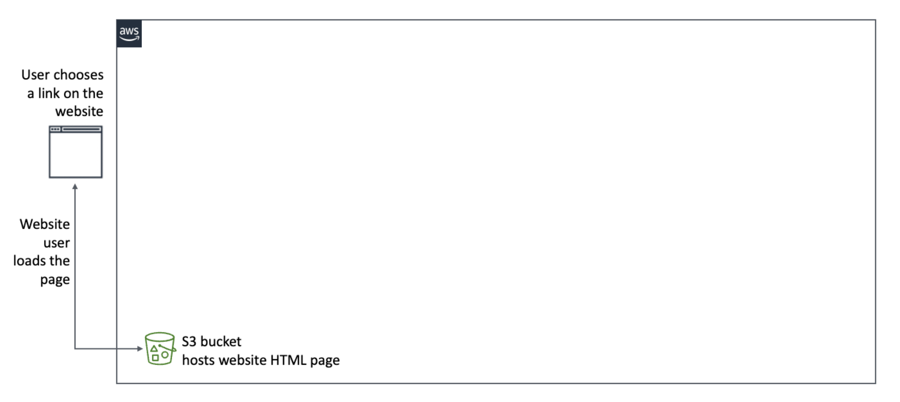
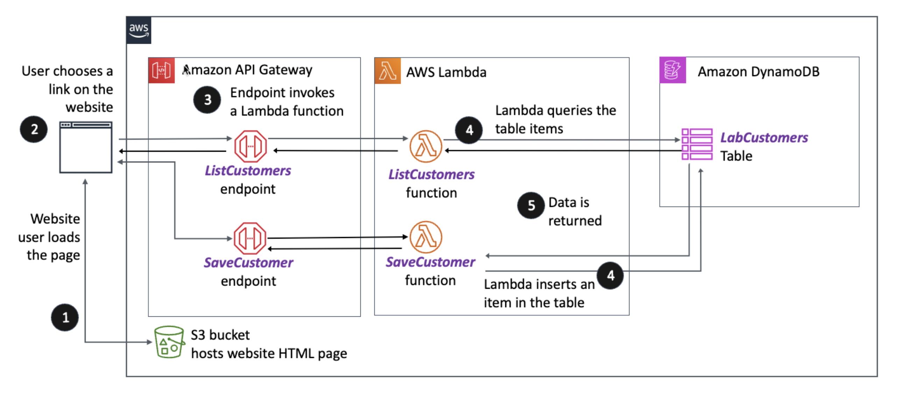

# Creating a Serverless Application with AWS SAM

## Lab overview

In the previous labs, you manually created an Amazon DynamoDB table, two AWS Lambda functions, and an HTTP API that has both GET and POST methods by using Amazon API Gateway. With this experience, you can now appreciate how the AWS Serverless Application Model (AWS SAM) service can be used to make building such solutions easier to accomplish. This lab provides hands-on experience in using AWS SAM to build and deploy a serverless application.

Objectives
By the end of this lab, you should be able to do the following:

Review the AWS SAM template.
Update the AWS SAM template.
Create the serverless application resources by using the AWS SAM template.
Update the index.html file.
Test the serverless application.
Review the differences in the AWS SAM template compared to the AWS CloudFormation template deployed.
Icon key
Various icons are used throughout this lab to call attention to different types of instructions and notes. The following list explains the purpose for each icon:

 Answer: An answer to a question or challenge.
 Caution: Information of special interest or importance (not so important to cause problems with the equipment or data if you miss it, but that could result in the need to repeat certain steps).
 Command: A command that you must run.
 Consider: A moment to pause to consider how you might apply a concept in your own environment or to initiate a conversation about the topic at hand.
 Expected output: A sample output that you can use to verify the output of a command or edited file.
 Hint: A hint to a question or challenge.
 Note: Additional information or elaboration on a point.
 Task complete: A conclusion or summary point in the lab.
 Warning: An action that is irreversible and could potentially impact the failure of a command or process (including warnings about configurations that cannot be changed after they are made).
Start lab
To launch the lab, at the top of the page, choose Start Lab.

 Caution: You must wait for the provisioned AWS services to be ready before you can continue.

To open the lab, choose Open Console .

You are automatically signed in to the AWS Management Console in a new web browser tab.

 Warning: Do not change the Region unless instructed.

Common sign-in errors
Error: Choosing Start Lab has no effect
In some cases, certain pop-up or script blocker web browser extensions might prevent the Start Lab button from working as intended. If you experience an issue starting the lab:

Add the lab domain name to your pop-up or script blocker’s allow list or turn it off.
Refresh the page and try again.

## Lab environment

The following diagram depicts the basic architecture of the lab environment. The resources depicted in the diagram already exist in your Amazon Web Services (AWS) account when you start the lab.

Image description: Image depicts the resources created at the start of the lab, including the Amazon Simple Storage Service (Amazon S3) bucket configured to host a static website.

However, by the end of this lab, you create the following architecture using AWS SAM:

Image description: The diagram illustrates the AWS based web application architecture. It involves user interaction with a website, API Gateway, AWS Lambda functions, and Amazon DynamoDB. A user choosing a link on a website accesses an API Gateway endpoint, which in turn invokes one of two Lambda functions: ListCustomers and SaveCustomer. The ListCustomers function queries the LabCustomers DynamoDB table for data, which is then returned to the user. The SaveCustomer function inserts a new item into the LabCustomers table. Numbers 1 through 5 are used to indicate the flow of operations. Expand the following for a detailed description.

Detailed diagram description
The image depicts a flowchart describing the components and data flow of the serverless web application using AWS services, detailed as follows:

At the far left, a numbered step 1 next to an S3 bucket icon signifies that an S3 bucket hosts the website’s HTML page.

Above, a step 2 indicates a user action where the user chooses a link on the website.

An arrow from this action points to an API Gateway endpoint icon marked with step 3, indicating that an endpoint invokes two Lambda functions. One arrow leads to ListCustomers and the other to SaveCustomer.

Near the ListCustomers function, numbered step 4 next to an arrow indicates that the function queries the table items from the LabCustomers DynamoDB table. The other step 4 near the SaveCustomer function inserts data into the LabCustomers DynamoDB table.

Step 5 shows data being returned to the function from the LabCustomers DynamoDB table.

At the SaveCustomer function, another step 4 appears next to an arrow pointing from the function to the DynamoDB table, indicating that the function inserts an item into the table.

Overall, the image uses symbols for AWS services and numbered arrows to map the user journey from interacting with the static website hosted on Amazon S3, through Amazon API Gateway, to retrieve data or store data with Lambda functions and a DynamoDB table.

AWS services used in this lab
The services used in this lab are as follows:

AWS Serverless Application Model (AWS SAM)
AWS CloudFormation
AWS Lambda
Amazon DynamoDB
Amazon Simple Storage Service (Amazon S3)
AWS Identity and Access Management (IAM)
AWS Cloud9
Amazon Elastic Compute Cloud (Amazon EC2)
AWS services not used in this lab
AWS service capabilities used in this lab are limited to what the lab requires. Expect errors when accessing other services or performing actions beyond those provided in this lab.

Task 1: Build and deploy the serverless application
In this task, you connect to the AWS Cloud9 integrated development environment (IDE) to explore and understand the structure and components of the AWS SAM template; a blueprint of your serverless application. This exploration is key for grasping how the AWS SAM template orchestrates the provisioning of application resources in your AWS account.

Following this, you dive into the practical aspect of serverless application development by using the AWS SAM command line interface (CLI). This CLI is a tool that transforms your AWS SAM template and application code into deployable artifacts. This process is known as building. It compiles your code, resolves dependencies, and packages everything into a format ready for deployment through the AWS SAM framework. By the end of this task, you lay the foundation for deploying your serverless application, further learning and understanding AWS serverless architecture.

Task 1.1: Connect to the AWS Cloud9 IDE
Connect to the AWS Cloud9 IDE, then explore and review the AWS SAM template. Think of this template as the blueprint for your serverless application. It outlines every component of your application that AWS provisions. By reviewing the template, you gain insights into the serverless resources that you are about to work with.

To open the AWS Cloud9 environment, copy the Cloud9Environment URL value that is listed to the left of these instructions, and paste it into a new browser tab.

 Note: You use the AWS Cloud9 IDE terminal to run commands used in this lab.

 Consider: The underlying Amazon EC2 instance operating system that the AWS Cloud9 IDE is installed on is Amazon Linux 2. By default, it comes with the AWS Command Line Interface (AWS CLI) version 2 installed. However, for this lab, you also need access to the AWS SAM CLI. As part of the bootstrapping process, the AWS SAM CLI has already been installed.

 Command: To verify that the AWS SAM CLI is already installed and ready to use, run the following command in the terminal:

sam --version
 Expected output:

SAM CLI, version 1.99.0
 Note: Your version of the AWS SAM CLI might be newer than the version shown in the example.

Task 1.2: Review the AWS SAM template
An AWS SAM template is a configuration file written in YAML or JSON that defines how to build and deploy serverless applications to AWS. It simplifies the process of writing CloudFormation templates. AWS SAM extends AWS CloudFormation to provide a simplified syntax for expressing serverless resources. The AWS SAM template outlines your application’s AWS resources, their properties, and their relationships so that AWS can provision them as needed.

To review the AWS SAM template, open the sam-backend > template.yaml file located in the IDE.

This AWS SAM template defines a serverless application with several components, including Lambda functions, a DynamoDB table, and an HTTP API gateway. This template also sets up a basic serverless application architecture for managing customer data, including the ability to save and list customers through a DynamoDB table. The application is accessible through an HTTP API, facilitating integration with your web frontend. The architecture uses AWS Lambda for business logic, DynamoDB for data storage, and an HTTP API in API Gateway for RESTful endpoint exposure. These are all defined within a streamlined AWS SAM template for convenient deployment and management.

To review the detailed description, expand this section.

Detailed description
Here’s a detailed description of what this template creates:

Resources

Lambda functions: There are two Lambda functions defined in this template:

SaveCustomer: As in previous labs, this function is responsible for saving customer information. It is started by a POST request to the SaveCustomer endpoint. It has access to write to the LabCustomers DynamoDB table, as specified by its policy. The Python code for this Lambda function is located in the sam-backend > SaveCustomer folder. When the sam build command is run, it looks in this folder for the requirements.txt file to download the dependencies listed, and the app.py file to create the Lambda function when the sam deploy command is issued.

ListCustomers: This function lists customer information and is started by a GET request to the ListCustomers endpoint. It has read access to the LabCustomers DynamoDB table. The Python code for this Lambda function is located in the sam-backend > ListCustomers folder. When the sam build command is run, it looks in this folder for the requirements.txt file to download the dependencies listed, and the app.py file to create the Lambda function when the sam deploy command is issued.

Both functions are written in Python 3.9, run on x86_64 architecture, and after the AWS SAM build are located in the SaveCustomer/ and ListCustomers/ directories, respectively.

HTTP API in API Gateway (HttpApi): This is an HTTP API that acts as a front door for the Lambda functions, allowing them to be invoked by HTTP requests. The API supports GET and POST methods and is configured with cross-origin resource sharing (CORS) to allow requests from any origin.

DynamoDB table (LabCustomers): This table is used to store customer data. It is defined with a single primary key (ID), which is a string (S). The table is configured with minimal provisioned throughput, with 1 read capacity unit and 1 write capacity unit.

Outputs

The template includes outputs for the URLs of the SaveCustomer and ListCustomers endpoints, and a general endpoint URL for the HTTP API. These outputs provide access to the endpoints for testing or integration purposes. The following is the list of outputs:

SaveCustomer: Outputs the URL for the SaveCustomer API endpoint
ListCustomers: Outputs the URL for the ListCustomers API endpoint
ApiGatewayEndpoint: Provides the base URL for the API Gateway
Challenge: Update the template.yaml file.
The template.yaml file, also known as the AWS SAM template, is mostly complete, but it does require two edits for it to be functional when called by the sam deploy command.

In this challenge, you have to identify the required updates, make those changes, and then save the file.

Review the AWS SAM template.yaml template file again, and see if you can identify what two edits must be made.
If you need some help identifying the two issues, expand the following Hint sections.

Hint 1
 Hint: Focus on the ListCustomers Lambda function and the SaveCustomer Lambda function because they are the two resources that require updating.

Hint 2
 Hint: Look at the ARN value for the Role property for each function. Do you see anything odd?

Make the updates with what you believe must be changed. Then expand the following Solution section to review the solution and ensure that you have made the appropriate updates. If not, go ahead and make those updates and save your changes.
Solution
 Answer: Each of the two Lambda functions has an UPDATE_WITH_AWS_ACCOUNT_ID placeholder in the property for the Role ARN.

Update the placeholders with the AccountID value that is listed to the left of these instructions.
Save the file after making the updates.
See the following example resource code blocks using a fictitious AWS Account ID:

Before update:

  SaveCustomer:
    Type: AWS::Serverless::Function
    Properties:
      Role: arn:aws:iam::UPDATE_WITH_AWS_ACCOUNT_ID:role/SaveCustomer
      CodeUri: SaveCustomer/
      Handler: app.lambda_handler
      Runtime: python3.9
      Architectures:
        - x86_64
      Policies:
        - DynamoDBWritePolicy:
            TableName: !Ref LabCustomers
      Events:
        Sum:
          Type: HttpApi
          Properties:
            Path: /SaveCustomer
            Method: post
            ApiId: !Ref HttpApi

  ListCustomers:
    Type: AWS::Serverless::Function
    Properties:
      Role: arn:aws:iam::UPDATE_WITH_AWS_ACCOUNT_ID:role/ListCustomers
      CodeUri: ListCustomers/
      Handler: app.lambda_handler
      Runtime: python3.9
      Architectures:
        - x86_64
      Policies:
        - DynamoDBReadPolicy:
            TableName: !Ref LabCustomers
      Events:
        Sum:
          Type: HttpApi
          Properties:
            Path: /ListCustomers
            Method: get
            ApiId: !Ref HttpApi
After update:

  SaveCustomer:
    Type: AWS::Serverless::Function
    Properties:
      Role: arn:aws:iam::111111111111:role/SaveCustomer
      CodeUri: SaveCustomer/
      Handler: app.lambda_handler
      Runtime: python3.9
      Architectures:
        - x86_64
      Policies:
        - DynamoDBWritePolicy:
            TableName: !Ref LabCustomers
      Events:
        Sum:
          Type: HttpApi
          Properties:
            Path: /SaveCustomer
            Method: post
            ApiId: !Ref HttpApi

  ListCustomers:
    Type: AWS::Serverless::Function
    Properties:
      Role: arn:aws:iam::111111111111:role/ListCustomers
      CodeUri: ListCustomers/
      Handler: app.lambda_handler
      Runtime: python3.9
      Architectures:
        - x86_64
      Policies:
        - DynamoDBReadPolicy:
            TableName: !Ref LabCustomers
      Events:
        Sum:
          Type: HttpApi
          Properties:
            Path: /ListCustomers
            Method: get
            ApiId: !Ref HttpApi
 Note: Remember to save the changes to this file after updating the placeholder with the AWS Account ID.

 Task complete: You have successfully connected to the AWS Cloud9 IDE and verified that the AWS SAM CLI is installed. Then you reviewed the AWS SAM template to gain an understanding of the serverless resources that it creates when deployed using CloudFormation. Lastly, you updated the template.yaml file to provide the AWS Account ID for the Role ARN for the two Lambda functions.

Task 2: Using AWS SAM to Build and deploy the serverless application
In this task, you use the sam build command to package the application source files for deployment. When the artifacts are built, you then run the sam deploy command to deploy the serverless application resources using CloudFormation.

Task 2.1: Using the AWS SAM CLI to prepare the application source code for deployment
Prepare the application source files for deployment by using the sam build command. The sam build command processes the source code for your Lambda functions in layers (when specified). It installs dependencies defined in the requirements.txt file (for Python, in this case), and produces deployment artifacts that can be deployed.

 Command: To create the deployment artifacts to use to deploy the serverless application, change directories into ~/environment/sam-backend and run the sam build command.

cd ~/environment/sam-backend

sam build
 Expected output:

******************************
**** EXAMPLE OUTPUT ****
******************************

Building codeuri: /home/ec2-user/environment/sam-backend/SaveCustomer runtime: python3.9 metadata: {} architecture: x86_64 functions: SaveCustomer
    Running PythonPipBuilder:ResolveDependencies
    Running PythonPipBuilder:CopySource
Building codeuri: /home/ec2-user/environment/sam-backend/ListCustomers runtime: python3.9 metadata: {} architecture: x86_64 functions: ListCustomers
    Running PythonPipBuilder:ResolveDependencies
    Running PythonPipBuilder:CopySource

Build Succeeded

Built Artifacts  : .aws-sam/build
Built Template   : .aws-sam/build/template.yaml

Commands you can use next
=========================
[*] Validate SAM template: sam validate
[*] Invoke Function: sam local invoke
[*] Test Function in the Cloud: sam sync --stack-name {{stack-name}}     --watch
[*] Deploy: sam deploy --guided

SAM CLI update available (1.112.0); (1.99.0 installed)
To download: https://docs.aws.amazon.com/serverless-application-model/    latest/developerguide/serverless-sam-cli-install.html
When you run the sam build command using the AWS SAM CLI, it compiles your code, downloads dependencies, and prepares your application resources to be deployed. The process creates several items within the .aws-sam directory, which serves as a workspace for AWS SAM to build your application.

 Note: To see the hidden directory, from the file tree, choose the gear icon and choose Show Hidden Files.

Under the sam-backend > .aws-sam > build directory, you now see the ListCustomers and SaveCustomers directories.

Here’s what gets created inside the hidden .aws-sam directory:

The build directory within .aws-sam contains the built artifacts of your application. This includes the following:

Lambda functions: Each Lambda function defined in your AWS SAM template is built and packaged with its dependencies. The output includes the function code and any resources that it depends on, organized in separate directories corresponding to each function.
Layers: If your application uses Lambda layers to share code or dependencies, AWS SAM builds these layers and stores them here. Each layer is placed in its directory with the compiled code and dependencies. (This lab is not using layers.)
Packaged template: AWS SAM generates a transformed CloudFormation template file (template.yaml) that references the built artifacts. This template is used for deploying your application.
build.toml file: This file is generated by the AWS SAM CLI when you run the sam build command. This file is part of the .aws-sam build directory structure and serves as a configuration file that contains metadata about the build process. It’s primarily used by the AWS SAM CLI to manage and validate the state of your serverless application’s build artifacts.

Expand the ListCustomers and SaveCustomer directories to see the dependencies that were downloaded as part of the build process.
Task 2.2: Deploy the application with the guided option
You use the sam deploy --guided option to deploy the serverless application. The AWS SAM CLI interactively prompts you for various deployment parameters. This includes information like the CloudFormation stack name that you want to deploy to. It also includes the AWS Region where you want to deploy the application, and any parameters defined in your AWS SAM template that require values.

 Command: Deploy the serverless application resources.

sam deploy --guided
The command launches a wizard.

When prompted, answer the following questions as directed:

Do not accept the default Stack Name (sam-app). Enter customer-app.

Only accept the default AWS Region if it matches the AWSRegionCode value listed to the left of these instructions. Otherwise, enter the AWSRegionCode value listed to the left of these instructions.

For Confirm changes before deploy, enter N.

For Allow SAM CLI IAM role creation, enter n.

At the Capabilities [[‘CAPABILITY_IAM’]]: prompt, press Enter to continue.

For Disable rollback, enter N.

For SaveCustomer has no authentication. Is this ok? enter y.

For ListCustomers has no authentication. Is this ok? enter y.

Accept the default to Save arguments to configuration file: Y.

Accept the default SAM configuration file name [samconfig.toml].

Accept the default SAM configuration environment name [default].

The AWS SAM deployment begins.

 Expected output: This output has been truncated and may display a different AWS Region value.

******************************
**** EXAMPLE OUTPUT ****
******************************

Configuring SAM deploy
======================

    Looking for config file [samconfig.toml] :  Not found

    Setting default arguments for 'sam deploy'
    =========================================
    Stack Name [sam-app]: customer-app
    AWS Region [us-west-2]: 
    #Shows you resources changes to be deployed and require a 'Y' to initiate deploy
    Confirm changes before deploy [y/N]: 
    #SAM needs permission to be able to create roles to connect to the resources in your template
    Allow SAM CLI IAM role creation [Y/n]: n
    Capabilities [['CAPABILITY_IAM']]: 
    #Preserves the state of previously provisioned resources when an operation fails
    Disable rollback [y/N]: 
    SaveCustomer has no authentication. Is this okay? [y/N]: y
    ListCustomers has no authentication. Is this okay? [y/N]: y
    Save arguments to configuration file [Y/n]: 
    SAM configuration file [samconfig.toml]: 
    SAM configuration environment [default]: 

Looking for resources needed for deployment:
Creating the required resources...
Successfully created!

Managed S3 bucket: aws-sam-cli-managed-default-samclisourcebucket-v7ykyctmrjsy
A different default S3 bucket can be set in samconfig.toml and auto resolution of buckets turned off by setting resolve_s3=False

Saved arguments to config file
Running 'sam deploy' for future deployments will use the parameters saved above.
The above parameters can be changed by modifying samconfig.toml
Learn more about samconfig.toml syntax at 
https://docs.aws.amazon.com/serverless-application-model/latest/developerguide/serverless-sam-cli-config.html

Uploading to customer-app/7cab67b0c947b50fdd689849eaf6bbba  12636176 / 12636176  (100.00%)
Uploading to customer-app/42d9fe6d8eb985c909a9e23d02d9b891  12636108 / 12636108  (100.00%)

Deploying with following values
===============================
Stack name                   : customer-app
Region                       : us-west-2
Confirm changeset            : False
Disable rollback             : False
Deployment s3 bucket         : aws-sam-cli-managed-default-samclisourcebucket-v7ykyctmrjsy
Capabilities                 : ["CAPABILITY_IAM"]
Parameter overrides          : {}
Signing Profiles             : {}

Initiating deployment
=====================

    Uploading to customer-app/6a66468cba679deb724eb704f7986b44.template  2534 / 2534  (100.00%)

    ...

CloudFormation outputs from deployed stack
-----------------------------------------------------------------------------------------------------
Outputs
-----------------------------------------------------------------------------------------------------
Key                 ListCustomers
Description         URL of your API
Value               https://jtyohqry82.execute-api.us-west-2.amazonaws.com/ListCustomers

Key                 ApiGatewayEndpoint
Description         URL for API only
Value               https://jtyohqry82.execute-api.us-west-2.amazonaws.com/

Key                 SaveCustomer
Description         URL of your API
Value               https://jtyohqry82.execute-api.us-west-2.amazonaws.com/             SaveCustomer
-----------------------------------------------------------------------------------------------------

Successfully created/updated stack - customer-app in us-west-2
The output of the sam deploy command includes the ApiGatewayEndpoint URL. Copy this URL, including the / at the end, and save it in a text editor to use in the next step.

 Consider: The AWS SAM CLI --guided deployment process asks a series of questions to customize the deployment of a serverless application. Each question pertains to specific aspects of the deployment configuration, which impact how the application is deployed and managed on AWS. To review key points and explanations of each question and the implications of the provided answers, expand the following section:

Key takeaways
Stack Name:

By default, AWS SAM suggests sam-app as the stack name. Specifying a custom name like customer-app creates a CloudFormation stack with this name, making it easier to identify the application’s resources. The stack name helps in organizing and managing AWS resources related to this specific serverless application.
AWS Region:

The Region question determines where the serverless application’s resources are deployed. Using the default Region is convenient. But you might need to deploy to a specific Region to meet data residency requirements or to minimize latency for end users. The instruction to potentially override the default Region ensures that the application is deployed in the intended geographical area.
Confirm changes before deploy:

Choosing not to confirm changes before deploy (N) streamlines the deployment process by automatically applying changes. This option is useful for automated scripts or when you’re confident in the changes being deployed. Confirming changes can provide an additional review step but is skipped here for simplicity or speed.
Allow SAM CLI IAM role creation:

Typing n indicates that SAM should not automatically create IAM roles for the Lambda functions. This requires that the template explicitly specifies an existing IAM role (arn:aws:iam::111111111111:role/ListCustomers in this example) for the Lambda functions. This approach is used for tighter security control or when organization policies restrict automatic role creation.
Capabilities [[‘CAPABILITY_IAM’]]::

Pressing Enter to accept the default capability CAPABILITY_IAM allows CloudFormation to create and manage IAM resources on your behalf. This is necessary for creating roles, policies, or other IAM resources specified in your AWS SAM template.
Disable rollback on operation fails:

Accepting the default to not disable rollback ensures that if the deployment fails, CloudFormation automatically rolls back to the previous state. This behavior is generally desirable because it prevents resources from remaining in a potentially inconsistent state after a failed deployment.
Authentication for SaveCustomer and ListCustomers:

Typing y for both functions to proceed without authentication means that the deployed API endpoints are publicly accessible without requiring users to authenticate. This setting might be appropriate for APIs meant to be publicly accessible, but it’s important to be cautious with endpoints that modify or access sensitive data.
Save arguments to configuration file:

Accepting the default [Y/n] to save the deployment configuration to a file (samconfig.toml) automates future deployments by reusing the same settings without prompting. This facilitates continuous integration and continuous delivery (CI/CD) pipelines or simplifies repeated deployments during development.
SAM configuration file name:

Accepting the default file name for the SAM configuration file keeps the deployment settings in a standard location (samconfig.toml), making it easier to manage and understand by following conventions.
SAM configuration environment name:

Accepting the default environment name (default) assigns the deployment configuration to a default namespace. This is useful for distinguishing between different deployment environments (for example, development, testing, or production) if needed in the future.
These choices collectively define how the serverless application is deployed, managed, and accessed, and reflect considerations for security, regionality, automation, and operational simplicity.

Task 2.3: Update the index.html file with the API Gateway invoke URL and upload it to Amazon S3
Now that the stack has been built successfully, in this task you update the html-frontend > index.html file for the API Gateway invoke URL placeholder with the actual value.

Open the html-frontend > index.html file in the AWS Cloud9 file editor.

Update the UPDATE-WITH-API-INVOKE-URL placeholder with the API Gateway invoke URL that you just copied, including the trailing / (forward slash).

 Note: This should be line 79 or 80 in the index.html file.

To review the example, expand this section.
Before:

value="UPDATE-WITH-API-INVOKE-URL">
After:

value="https://q8vcehmof8.execute-api.us-west-2.amazonaws.com/"
 Caution: Don’t forget to add the trailing / to the end of the invoke URL.

Save the changes to the file.

 Command: Upload the index.html file to the customerswebsite… S3 bucket.

# Retrieve the full bucket name and set to a variable
WEBSITE_BUCKET=$(aws s3api list-buckets | jq -r '.Buckets[].Name | select(. |     contains("customerswebsite"))')

# Echo the bucket name
echo -e "\nThe bucket name is: $WEBSITE_BUCKET\n"

# Copy the index.html file to the S3 bucket
aws s3 cp ~/environment/html-frontend/index.html s3://$WEBSITE_BUCKET
 Expected output: This output may display a different AWS Region value.

******************************
**** EXAMPLE OUTPUT ****
******************************

The bucket name is: customer-website-us-west-2-279261430

upload: ../html-frontend/index.html to s3://customerswebsite-us-west-2-279261430/index.html
Task 2.4: Verify that the serverless application is functional
With the serverless application resources deployed, you can now test to ensure that the application functions as expected.

Copy the WebsiteURL for the Amazon S3 hosted static website, located to the left of these instructions, and paste it into a new browser tab.

Test the application by adding a new customer.

When the SaveCustomer Lambda function adds the new customer details, the application automatically invokes the ListCustomer Lambda function to display the records in the table.

 Task complete: You have successfully built the AWS SAM artifacts to deploy the serverless application using the sam deploy --guided option. After it was deployed, you updated the index.html placeholder for the API invoke URL with the actual value and then tested the functionality of the serverless application by adding a new customer to the LabCustomers table, which launches both Lambda functions to add a new customer to the table and list the customer records in the table.

Task 3: Compare the AWS SAM template to the CloudFormation template that it generates
In this task, you compare the the AWS SAM template to the CloudFormation template that it created to fully understand the power of AWS SAM templates and how they can be used to simplify the process of writing CloudFormation templates.

The AWS SAM template provides a high-level and simplified declaration of resources, which AWS SAM then translates into the detailed and explicit resource definitions required by AWS CloudFormation. This process saves significant time and effort. Because developers can focus on the core logic and configuration of their serverless application, while AWS SAM handles the verbose CloudFormation syntax and resource relationships automatically.

If closed, use the file tree to open the AWS SAM template. It is saved as sam-backend > template.yaml.

In a new browser tab, preferably in a second monitor, open the CloudFormation console and open the link for the stack named customer-app.

Choose the Template tab.

This is the identical AWS SAM template that you have open in the AWS Cloud9 IDE.

Turn on the toggle next to View processed template.

This is the detailed CloudFormation template that the sam deploy command created based on the AWS SAM template that you provided.

Review the following examples to see how much additional effort AWS SAM saved you from having to create the CloudFormation template.

LabCustomers (AWS::DynamoDB::Table)

AWS SAM template: Defined simply with basic properties such as table name, attribute definitions, and provisioned throughput.

CloudFormation template: Directly corresponds to the AWS SAM definition, with additional metadata added by AWS SAM for tracking.

image-20240223165947895

Image description: Images highlight differences in the LabCustomers DynamoDB resource specified in the AWS SAM template compared to the processed CloudFormation template, as previously noted.

SaveCustomer (AWS::Lambda::Function)

AWS SAM template: Declares the function with properties like CodeUri, Handler, Runtime, Role, and an event of type HttpApi.
CloudFormation template: Expanded to include explicit Code properties mapping to the S3Bucket and S3Key, as well as the Tags and Architectures properties. The AWS SAM template’s simplicity is translated into a detailed CloudFormation resource definition.
SaveCustomerSumPermission (AWS::Lambda::Permission)

AWS SAM template: Implicitly created by the event source mapping under Events.

CloudFormation template: Explicitly defines the permissions for the API Gateway to invoke the SaveCustomer Lambda function, showcasing how AWS SAM automatically handles permissions.

image-20240223170006688

Image description: Images highlights differences in the SaveCustomer Lambda function resource specified in the AWS SAM template compared to the processed CloudFormation template, as previously noted.

ListCustomers (AWS::Lambda::Function)

Similar to SaveCustomer, the ListCustomers function in the AWS SAM template is expanded in the CloudFormation template to include detailed AWS Lambda configurations.
ListCustomersSumPermission (AWS::Lambda::Permission)

AWS SAM template: Implicit from the Events section.
CloudFormation template: Specifies the Lambda invocation permissions for the API Gateway, generated automatically from the AWS SAM configuration.
HttpApi (AWS::ApiGatewayV2::Api)

AWS SAM template: Defined abstractly using the AWS::Serverless::HttpApi type with minimal configuration.

CloudFormation template: Translates into a detailed API Gateway definition, including paths, methods, integration details, and cross-origin resource sharing (CORS) configuration. AWS SAM automates the creation of a comprehensive API definition from the succinct AWS SAM template.

image-20240223170023740

Image description: Images highlight differences in the HttpApi resource specified in the AWS SAM template compared to the processed CloudFormation template, as previously noted.

HttpApiApiGatewayDefaultStage (AWS::ApiGatewayV2::Stage)

AWS SAM template: Not explicitly defined, as AWS SAM assumes a default stage setup.
CloudFormation template: Represents the $default stage of the HTTP API, showing how AWS SAM automatically sets up stages and deployment processes.
Outputs

AWS SAM template and CloudFormation template: The Outputs section in both templates remains largely the same, with the CloudFormation template using the Fn::Sub function to construct the URLs dynamically.
 Task complete: You compared the the AWS SAM template to the CloudFormation template that it created to fully understand the power of AWS SAM templates and how they can be used to simplify the process of writing CloudFormation templates.

Conclusion
You have successfully done the following:

Reviewed the AWS SAM template
Updated the AWS SAM template
Created the serverless application resources by using the AWS SAM template
Updated the index.html file
Tested the serverless application
Reviewed the differences in the AWS SAM template compared to the AWS CloudFormation template deployed
End lab
Follow these steps to close the console and end your lab.

Return to the AWS Management Console.

At the upper-right corner of the page, choose AWSLabsUser, and then choose Sign out.

Choose End Lab and then confirm that you want to end your lab.

For more information about AWS Training and Certification, see https://aws.amazon.com/training/.

Your feedback is welcome and appreciated.
If you would like to share any feedback, suggestions, or corrections, please provide the details in our AWS Training and Certification Contact Form.

Python is property of the Python Software Foundation (PSF). Reference in this lab to any specific commercial product, process, or service, or the use of any trade, firm or corporation name is provided for informational purposes, and does not constitute endorsement, recommendation, or favoring by Amazon Web Services.