# Week 1: Developing on AWS

* back to AWS Cloud Institute repo's root [aci.md](../aci.md)
* back to [Developer Intermediate 2](./developer-intermediate-2.md)
* back to repo's main [README.md](../../../README.md)

## DEVELOPING ON AWS

### Agile Software Development Process

Developing software requires a disciplined approach to make sure that the resulting solution meets the project's quality, schedule, and budget requirements. Over the years, many types of software development methodologies have been introduced and used to help realize these goals. One methodology that is commonly used today to build modern applications is the agile software development methodology.

#### Agile software development

An agile software development methodology promotes building software in an iterative and incremental way. Under this approach, development teams build and deliver a small discrete piece of an application's functionality in a short period. They then collect feedback from the customer and use it to identify and address any issues before they start the next iteration. In this new iteration, the team builds and delivers another piece of the application's functionality. This cycle is repeated until the application is completely built.

Agile development emphasizes continuous feedback and collaboration between customers and development teams. This helps to make sure that the final product truly meets the customer's expectations. Agile methodology also emphasizes flexibility and adaptability, because development teams can respond to changes quickly and efficiently.

#### How agile development works

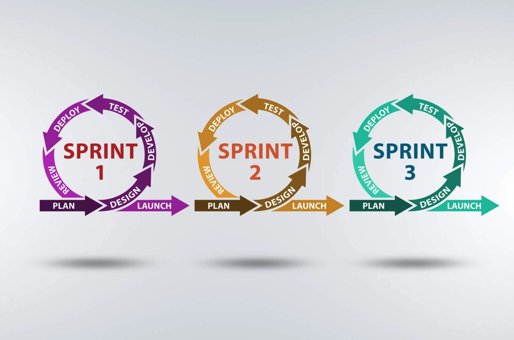

Agile development breaks down a software project into small manageable tasks that can be completed in short iterations, known as sprints. Each sprint consists of the following phases and corresponding goals:

* **Plan**: Define the requirements and scope of the sprint by identifying the task to implement. A task is often derived from a user story which describes a required application feature from the user's perspective.
* **Design**: Create a design of the solution required to implement the task.
* **Develop**: Implement the code based on the design.
* **Test**: Conduct rigorous testing to identify and fix bugs.
* **Deploy**: Release the software to the customer.
* **Review**: Collect feedback from the customer and make any necessary changes to the software.
* **Launch**: After the customer signs off on the product of the current iteration, start a new iteration at the Plan phase.

In summary, agile software development is a highly effective approach to software development. It can help an organization deliver high-quality software faster and more efficiently. It is particularly suited for projects that require a high level of flexibility, collaboration, and responsiveness. In this course, you will use an agile software development methodology to develop the case study applications.

### AWS Development Tools

In addition to following a software development methodology, a developer needs tools that will facilitate building software on the platform that they're using. The AWS Cloud provides developers with tools to build, test, and deploy applications quickly and effectively.

The main development tools provided by AWS consist of the AWS Management Console, the AWS Command Line Interface (AWS CLI), AWS SDKs, Amazon Q Developer, and AWS supported integrated development environments (IDEs).

#### AWS development tools overview

The following diagram illustrates the usage and relationship between the development tools described in this lesson.

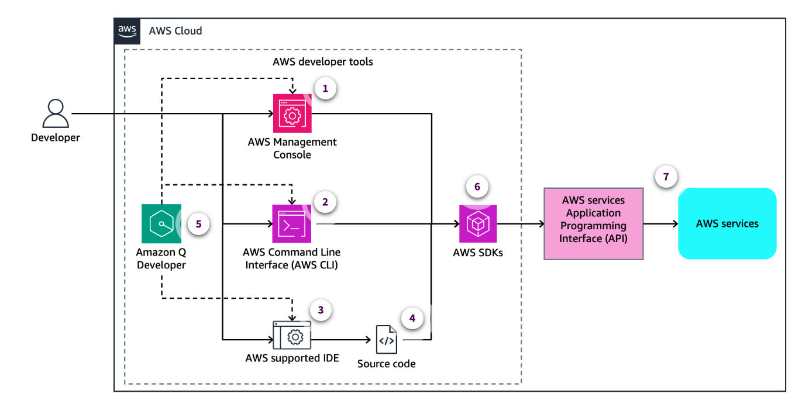

A developer connected to the AWS Management Console, the AWS CLI, and an AWS supported IDE. These tools use Amazon Q and flow into the AWS SDKs, AWS API, and AWS services.

1. **AWS Management Console**

    A developer uses the AWS Management Console to manage and interact with AWS services using a browser interface. The console provides an Artificial Intelligence (AI) assistant powered by Amazon Q to answer AWS related questions.

2. **AWS CLI**

    The developer uses the AWS CLI to manage and interact with AWS services using a command-line interface. The AWS CLI uses Amazon Q to enable command completions.

3. **AWS supported IDE**

    A developer uses an AWS supported IDE to code, test, and debug programs. They can use Amazon Q Developer in the source code to generate code suggestions.

4. **Source code**

    The developer uses prompts that are entered as comments in the source code to generate code suggestions from Amazon Q Developer.

5. **Amazon Q Developer**

    Amazon Q Developer is a generative AI assistant that helps accelerate software development. The developer can access its features through the AWS Management Console, the AWS CLI, and AWS supported IDEs.

6. **AWS SDKs**

    The AWS SDKs provide programmatic access to the AWS services' APIs. It is used by the AWS Management Console, the AWS CLI, and the programs that you develop to access AWS resources.

7. **AWS APIs and services**

    All AWS services expose their functionality through an API. It is this API that the AWS SDKs call in the programming languages that they support.

#### AWS Management Console

The AWS Management Console is a web-based user interface for managing AWS services. It provides a graphical interface that gives you the ability to create and manage AWS resources using a basic point-and-click interface. The console displays individual consoles for each AWS service and centralizes the access to the consoles. It also provides an Artificial Intelligence (AI) assistant, Amazon Q, that you can use to answer AWS related questions.

##### Use cases for the AWS Management Console

The use cases for the AWS Management Console include the following:

* You are creating a new AWS account. The console walks you through creating the account's root user. You can then create your first AWS Identity and Access Management (IAM) administrative user to avoid using the root user based on the security best practices.
* You are new to the AWS Cloud or are exploring AWS services for the first time. The console's browser-based graphical user interface facilitates learning how to use the features of a particular service. In addition, the console offers wizards and guided workflows for performing common tasks.
* You are performing a task that affects a limited number of resources or does not need to be repeated on a regular basis. For example, you want to create an Amazon DynamoDB table for testing purposes. Using the console can be quicker than using a command-line approach because you do not need to know the syntax of commands.

##### Tips for using the AWS Management Console

The following are tips and guidelines for using the AWS Management Console:

* Access the console by navigating to: [https://console.aws.amazon.com/](https://console.aws.amazon.com/)
* Use the Search box on the navigation bar to find AWS services and documentation. For example, you can use this feature to quickly navigate from one AWS service console to another.
* Use the AWS Health Dashboard to view events that might affect your AWS resources. This feature is useful when you are troubleshooting a service and want to know if a general AWS service interruption has occurred.

#### AWS CLI

The AWS CLI is a command-line tool that gives developers the ability to interact with and manage AWS services from the command line. It provides direct access to the public APIs of all of the AWS services. With the AWS CLI, you can run commands that perform the same functions as those provided by the AWS Management Console.

##### Use cases for using the AWS CLI

Typical use cases for the AWS CLI include the following:

* You want to interact with AWS services using a command-line interface. This is often the case if you are accessing services remotely from a machine that does not have a web browser installed.
* You want to automate a repetitive task or manage multiple resources at once. By combining and running AWS CLI commands in a script, you can perform tasks in a more efficient and reusable way. For example, suppose that you want to shut down the Amazon EC2 instances in your test environment at the end of each day. This action will reduce your compute costs. You can write a shell script that uses AWS CLI commands to perform this task and automatically run it at the end of each day.
* You want to debug or troubleshoot an operation on an AWS service. The AWS CLI typically provides more detailed output and error messages than the AWS Management Console when you encounter an issue. For example, suppose you have configured Amazon CloudWatch Logs to store your server logs. You can use the following AWS CLI command to tail those logs for troubleshooting purposes: `aws logs start-live-tail`. You will then see any message that is written to the server logs in near real time.

##### Tips for using the AWS CLI

The following are tips and guidelines for using the AWS CLI:

* You must install the AWS CLI for the operating system that you are using.
* You must configure security with the AWS credentials to access your AWS account. You can do so by using the `aws configure` command.
* Use the command completion feature to list the options available for a command. Press the Tab key while typing a command to do so.
* Regularly check for and apply updates. AWS continually improves and expands the AWS CLI to support the latest services and functionality.

#### AWS SDKs

The AWS SDKs provide a set of tools and libraries that enable developers to build, develop, and interact with AWS services programmatically. They provide an interface to call the APIs exposed by the AWS services in a program. The AWS SDKs are available for a variety of programming languages, including Python, JavaScript, and Java.

You use an AWS SDK when you want to interact with AWS services in a program. You can use it to develop any type of application, including web, mobile, and gaming applications.

##### Tips for using the AWS SDKs

The following are tips and guidelines for using the AWS SDKs:

* You must install the AWS SDK for your programming language in your development environment. For example, to install the AWS SDK for JavaScript, you can use the `npm install aws-sdk` command.
* Use the SDK documentation for the programming language that you are using to identify the available APIs for AWS services. The documentation contains API details and code examples that help you understand and implement API calls to AWS services.
* Implement robust error handling in your code. The AWS SDKs provide mechanisms to handle errors gracefully. This will help you identify and resolve issues in your application more effectively. For example, the AWS SDKs automatically propagate errors to the application with detailed information including an error code, error description, and request ID. You can therefore use try-catch logic or if-then statements in your code to properly handle the error.
* Stay up to date with new releases of an SDK. You can check the documentation to see if a new version has been released, and upgrade as needed.

#### AWS supported IDEs

Developers working with AWS have several IDE options to build and deploy cloud applications. Popular AWS-supported IDEs include:

* Visual Studio
* VS Code
* Eclipse
* JetBrains

AWS provides toolkits and plugins that extend these IDEs with cloud-specific features, helping developers write, test, and deploy code efficiently.

##### Tips for using AWS supported IDEs

The following are tips and guidelines for using IDEs for application development in the AWS Cloud:

* Visual Studio's unique integration with the AWS Elastic Beanstalk service includes built-in templates specifically optimized for .NET applications
* VS Code supports multiple programming languages, including Python and HTML, and allows real-time collaborative debugging of Lambda functions.
* Eclipse features strong support for Java, automatically updating all related code references when renaming or moving Java classes, methods, or variables.
* JetBrains includes a AWS CloudFormation template validation feature, with real-time error detection and auto-completion.

#### Amazon Q Developer

Amazon Q Developer is a generative AI-powered assistant that helps developers throughout the software development lifecycle when working with AWS. It can answer questions expressed in natural language about AWS services, documentation, and best practices. It can also assist in building high-quality code that is secure and conforms to AWS best practices. You can access the features of Amazon Q Developer in the AWS Management Console or in an AWS supported IDE. These features vary depending on where you are accessing them.

##### Use cases for Amazon Q Developer

Typical use cases for Amazon Q Developer include the following:

* You have a question about AWS architecture best practices or need help with using the AWS SDKs or the AWS CLI. Amazon Q Developer provides guidance in the form of information summaries or step-by-step instructions. It also includes links to its information sources. Use the AWS Management Console to access this feature.
* You need help completing or building code in an IDE. Amazon Q Developer provides single-line code completion suggestions that are tailored to the programming language that you are using and the context of the surrounding code. It can also generate full functions and code blocks based on a description that you provide.
* You need help fixing bugs or problems in your code. Amazon Q Developer suggests automated fixes for common bugs and code problems in your IDE.
* You want to verify that your code is secure and complies with best practices. Amazon Q Developer scans your code for security vulnerabilities and detects security issues such as vulnerability to SQL injection or cross-site scripting. It can also detect code quality issues such as non-conformance to AWS best practices or issues that affect performance.

##### Tips for using Amazon Q Developer

The following are tips and guidelines for using Amazon Q Developer:

* If you want to use Amazon Q Developer in an AWS supported IDE, you must first install it as an extension or plugin. Examples of IDEs where Amazon Q Developer can be installed include Visual Studio Code and a JetBrains IDE.
* Use prompts to have Amazon Q Developer write or optimize code for you. For example, use prompts like "Generate a function to upload a file to S3" or "Refactor this code to improve performance".
* To ask for a code explanation, select the code you need help with and use a command like "Explain". Amazon Q Developer summarizes the purpose and functionality of the code in natural language.

### Knowledge Check

#### A developer has multiple Amazon EC2 and database instances running in a test environment. The developer wants to stop all of the instances at the end of each week to save costs. How can the developer accomplish this in the MOST efficient way?

* Create a shell script that uses AWS CLI commands to stop the instances and run the script each week.

Wrong answers:

* Use the AWS Management Console each week to stop all the instances.
* Use a prompt like "Stop all Amazon EC2 instances and database instances in the test environment" for Amazon Q Developer and run it each week.
* Use the terminal window in an AWS supported integrated development environment (IDE) and run the individual AWS CLI commands to stop the instances each week.

##### Explanation

This approach is efficient because it combines all the required commands into one script that the developer can run in one step. Furthermore, you can schedule the script to run automatically.

The other options are incorrect for the following reasons:

* Using the console requires navigating to different service consoles to stop each resource type. This approach is not efficient because it is manual and error-prone.
* Amazon Q Developer does not support the task of stopping instances even if you provide it with a clear prompt to do so.
* Using the terminal window in an AWS supported IDE and entering individual commands is also not efficient because it is a manual approach that requires multiple steps. It can also be error-prone.

#### A developer is running a program that calls an API provided by an AWS SDK. The code that implements the API encounters an error. What information does an API code return to the calling program?

* Error code and description

Wrong answers:

* Value of the parameters associated with the call
* Elapsed time since the call was made
* Name of the user that made the call

##### Explanation

The AWS SDK returns this information so that the calling program can handle the error gracefully.

The API code in an AWS SDK does not return the information described in the other options to the calling program when it encounters an error.

#### What are the capabilities of Amazon Q Developer? (Select TWO.)

* Answering natural language questions about AWS best practices
* Generating full code functions in an integrated development environment (IDE)

Wrong answers:

* Remediating security issues found in container images
* Generating a flowchart for a program
* Deploying code to a serverless runtime

##### Explanation

Amazon Q Developer does not provide the capabilities described in the other options.

### Summary

* An agile software development methodology divides a software project into small, manageable tasks that can be completed in short iterations, known as sprints. The methodology is based on the principles of iterative and incremental development. Agile development focuses on collaboration, flexibility, and continuous improvement. It helps organizations deliver high-quality software faster and more efficiently.
* There are five main development tools that a developer uses to build applications in the AWS Cloud. These tools are the AWS Management Console, AWS CLI, AWS SDKs, AWS supported integrated development environments (IDEs), and Amazon Q Developer.
* The AWS Management Console is a web-based tool for managing AWS services and resources. Its graphical user interface, wizards, and guided workflows facilitate learning how to use the features of a particular service. It is well suited for performing common tasks and exploring AWS services, particularly if you are new to the AWS Cloud.
* The AWS CLI is a command-line tool for managing AWS services and resources. It is well suited for automation and scripting tasks. With the AWS CLI, you can write scripts and programs that perform AWS operations programmatically. The AWS CLI is also useful for performing operations on multiple resources at once.
* AWS SDKs provide programmatic access to the APIs exposed by AWS services. They are available for a variety of programming languages, including Python, JavaScript, and Java. The SDK documentation contains API details and code examples that help you understand and implement API calls to AWS services.
* An AWS supported IDE is an IDE that provides tools and AWS-specific functionality to write, run, and debug applications on AWS.
* Amazon Q Developer is a generative AI-powered assistant that helps developers answer questions expressed in natural language about AWS services, documentation, and best practices. It can also assist in building high-quality code that is secure and conforms to AWS best practices. You can access the features of Amazon Q Developer in the console or in an IDE.

### Additional Resources

* [AWS Management Console Documentation](https://docs.aws.amazon.com/awsconsolehelpdocs/)
* [AWS CLI](https://docs.aws.amazon.com/cli/)
* [Python SDK](https://docs.aws.amazon.com/pythonsdk/)
* [JavaScript SDK](https://docs.aws.amazon.com/sdk-for-javascript/)
* [Amazon Q Developer](https://docs.aws.amazon.com/amazonq/latest/qdeveloper-ug/what-is.html)

## DESIGNING A MICROSERVICES APPLICATION

### Modern Application Architecture Review

Modern applications are built with `microservices architecture patterns` and `serverless operational models`. They are deployed through an automated software delivery process. In this lesson, you will review each of these characteristics.

#### Microservices architecture

A microservices architecture is an application architectural style that divides an application into small, independent services, called microservices, that communicate with each other over APIs. Each microservice is responsible for a specific application function or capability and can be developed, deployed, and managed independently.

A microservices architecture has the following key characteristics.

* **Modular design**

    In a microservices architecture, an application is comprised of multiple microservices. Each microservice is responsible for a specific business function or capability and manages its own data.

* **Loose coupling**

    Microservices are designed to be loosely coupled so that they have minimal dependencies on each other. A microservice exposes its functions through an API, typically a RESTful API. It communicates with clients and other microservices over lightweight protocols such as HTTP. This gives the application more flexibility, scalability, and resilience.

* **Polyglot development**

    An application's microservices can be built using different programming languages, frameworks, and technologies. Each microservice is developed by a single team, and each development team can choose the best tool for the job.

* **Independent deployment**

    Each microservice can be developed and deployed independently, according to each development team's timetable. This enables faster development and deployment cycles.

* **Scalability**

    Each microservice scales independently based on its specific resource requirements and does not affect the other microservices in the application.

* **Fault tolerance**

    If one microservice fails, it does not bring down the entire application because the other microservices can continue to function independently.

The key characteristics of a microservice can be summed up in one word: `Independent`. A microservice is developed and deployed by a single team independently of other teams. It maintains its own data independently of other microservices, and it scales and fails independently of other microservices.

#### Serverless computing

The second characteristic of a modern application is that it uses a serverless computing model. Serverless computing is a cloud computing model in which the cloud provider manages the underlying infrastructure, including servers, storage, and networking. Developers can then focus on writing code and building applications without worrying about the underlying infrastructure. Serverless computing gives developers the ability to quickly build and deploy new features and applications.

In the AWS Cloud, the concept of serverless is based on the following tenets: no server management, continuous scaling, built-in fault tolerance, and pay-per-use pricing. AWS provides serverless services that you can use to implement the data store, compute, and integration requirements of a modern application.

##### Serverless Data Stores

The key AWS serverless data store services include the following:

* **Amazon Simple Storage Service (Amazon S3)** is a highly scalable, durable, and secure object storage service. You can use it to store application data as objects. Examples include pictures, videos, audio files, and large documents.
* **DynamoDB** is a fully managed NoSQL database service that provides fast and predictable performance with seamless scalability. It is a popular choice for the data tier in serverless applications.
* **Amazon Aurora Serverles**s is an on-demand, auto-scaling configuration for Amazon Aurora, a fully managed relational database service. Use it if your application needs a serverless relational database.

##### Serverless Compute

The key AWS serverless compute services include the following:

* **Lambda** is a serverless compute service that automatically scales to handle incoming requests and charges based on the compute time consumed. Lambda is well-suited for short-lived, event-driven workloads that can be executed in response to triggers like API calls, database updates, or scheduled events.
* **AWS Fargate** is a serverless compute engine for Amazon Elastic Container Service (Amazon ECS) and Amazon Elastic Kubernetes Service (Amazon EKS). It gives you the ability to run containers without managing the underlying infrastructure. Fargate is better suited for long-running, stateful workloads that require the flexibility and control of containers.

##### Serverless Integration

The key AWS serverless integration services include the following:

* **Amazon API Gateway** is a fully managed service that gives developers the ability to create, publish, maintain, monitor, secure, and scale APIs. API Gateway can act as a facade for a microservice architecture by providing a single entry point for clients to access services. It can also handle request routing, authentication, and authorization.
* **AWS Step Functions** is a serverless service that gives you the ability to build and run applications and services using a visual workflow. For example, you can combine and coordinate multiple microservices to implement a business process.
* **Amazon Simple Queue Service (Amazon SQS)** is a fully managed message queuing service that gives you the ability to decouple application components and enable asynchronous communication between them.
* **Amazon Simple Notification Service (Amazon SNS)** is a fully managed messaging service that gives you the ability to send and receive real-time messages between distributed applications. Amazon SNS provides a publish-subscribe (pub-sub) messaging model, where publishers send messages to topics, and subscribers receive those messages.

---

AWS also provides the AWS SAM tool to streamline serverless application development and deployment. With the AWS SAM framework, you can define the serverless resources in your application using a streamlined syntax and build your application. Then, you can deploy it to the AWS Cloud. You can also test and debug your Lambda functions locally and create continuous integration and continuous delivery (CI/CD) pipelines.

---

#### Automated software delivery

The third characteristic of a modern application is that it is deployed through an automated software delivery process. This refers to the use of CI/CD tools from building and testing to deploying the application.

**Continuous integration (CI)** is a software development practice where developers regularly merge their code changes into a central repository. This action causes an automated build to run followed by automated tests. A key goal of CI is to find and address bugs more quickly and improve software quality. CI also reduces the time it takes to validate and release new software updates.

**Continuous delivery (CD)** is a software development practice where code changes are automatically built, tested, and prepared for production release. It expands on continuous integration by deploying all code changes to a testing or production environment after the build stage has been completed. Developers then always have a deployment-ready build artifact that has passed through a standardized test process.

CI/CD can be pictured as a workflow or pipeline. A new code is submitted at one end, tested over a series of stages, and then published as production-ready code. CI/CD involves using several tools that perform different tasks, such as version control, build automation, testing, and deployment automation. AWS provides various services that support CI/CD tasks.

* **AWS CodeBuild**

     **AWS CodeBuild** is a fully managed continuous integration service that compiles source code, runs tests, and produces software packages ready for deployment.

* **AWS CodePipeline**

    AWS CodePipeline is a fully managed continuous delivery service that automates the release process from source code to production.

In addition, as mentioned earlier, AWS SAM simplifies the creation of CI/CD pipelines for serverless applications. It does so by providing build container images and default pipeline templates.

#### Typical modern application architecture on AWS

To recapitulate the characteristics of a modern application architecture, consider an example of a typical microservice implementation in the AWS Cloud.

The following diagram illustrates a typical serverless microservice architecture using Lambda on AWS.

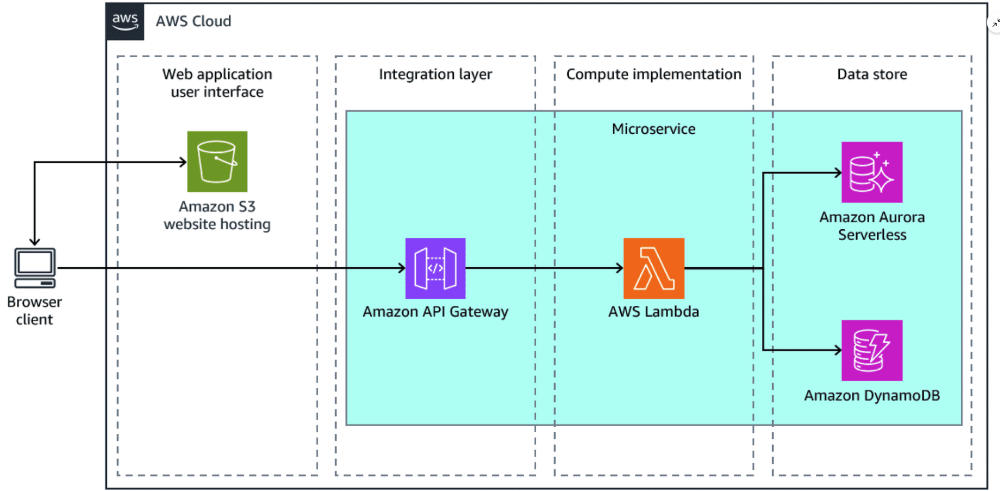

The diagram shows a microservice for a web application implemented using AWS serverless services. The microservice's data store uses a combination of Aurora Serverless and DynamoDB. Its compute layer is implemented using Lambda and integrates with the microservice's user interface using API Gateway. The user interface is a website hosted on Amazon S3 that returns one or more webpages to the browser client. These webpages make dynamic calls to the microservice's API.

#### Activity: Designing the Pet Shelter Application

You will design a microservices architecture for a **minimum viable product (MVP)** version of the Pet Shelter web application. An MVP is a solution that implements a small set of capabilities that can be demonstrated to a customer to elicit early feedback. It can also be used to validate the customer's interest in the product that you plan to build.

The requirements for the MVP application are given as user stories. Based on these user stories, you will perform the following tasks:

1. Identify the microservices needed to implement the requirements defined in the user stories.
2. Evaluate and identify the AWS services to use in the solution design.
3. Create a diagram that illustrates the microservices architecture of the application.

#### Pet Shelter MVP web application requirements

The requirements for the MVP application are defined in the user stories depicted in the following diagram.

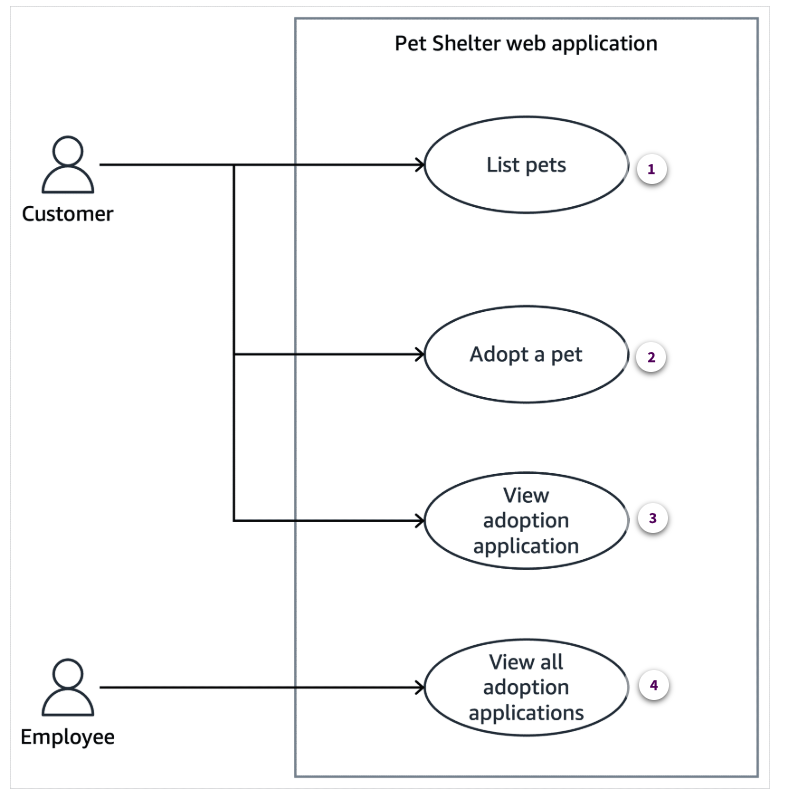

A customer connected to the `List pets`, `Adopt a pet`, and `View adoption application` user stories. An employee connected to `View all adoption applications`.

#### Identifying the microservices

The first step in the design process is to identify the microservices needed to implement the application's requirements.

A microservice represents a single business capability and maintains its own data. Review the application's user stories. Consider how you can group them based on the general functionality that they represent (capability) and the type of data that they manipulate (domain model).

When you analyze the requirements, the following two general business capabilities stand out:

* **Pets capability**: The application should give the customer the ability to view the pets in the shelter that are available for adoption. This capability relies on the application storing data related to pets.
* **Adoptions capability**: The application should give the customer the ability to submit an adoption application and subsequently view it. In addition, the application should give an employee the ability to view all the adoption applications that were submitted. This capability requires storing data related to adoptions.

These business capabilities represent the microservices for the application. You have identified a Pets microservice and an Adoptions microservice.

Based on this analysis, you can now map each user story to a microservice as follows:

* The `List pets` user story maps to the Pets microservice.
* The `Adopt a pet`, `View adoption application`, and `View all adoption applications` user stories map to the Adoptions microservice.

The following diagram illustrates this mapping.

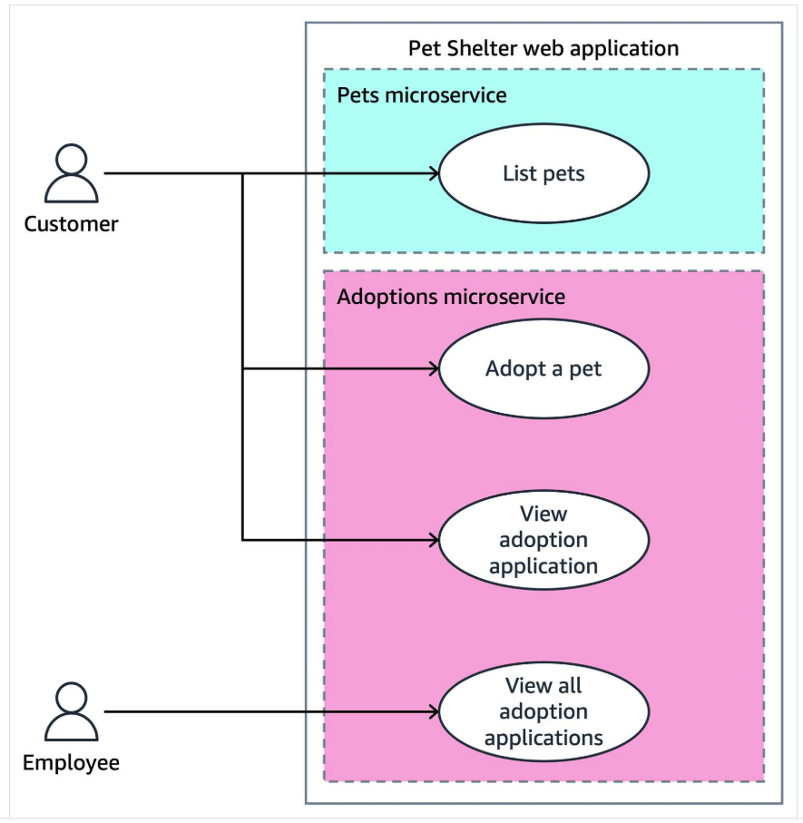

The `Pets microservice` contains the `List pets` user story. The `Adoptions microservice` contains `Adopt a pet`, `View adoption application`, and `View all adoption applications`.

#### Selecting the AWS services for the application

The next step is to evaluate and identify the AWS services that should be used in the design. Start by choosing the service to implement the application's user interface. Then, for each microservice that you have identified, you will ask and answer the following questions:

* Which database service should I use to store the microservice's data?
* Which compute service should I use to implement the microservice's business logic?
* Which integration service should I use to integrate the microservice with the application's user interface?

##### Selecting the service for the user interface

The Pets Shelter MVP application is a web application. Therefore, its user interface will be implemented using HTML, CSS, and JavaScript technology, and a runtime that can serve webpages is required. Your main choices are to use a service that requires managing servers or use a serverless web hosting solution. An example of the first approach is to provision an Amazon EC2 instance and install a web server such as an Apache HTTP server on it. For the second approach, you can use the static web hosting feature of Amazon S3. Which approach should you choose?

The Pet Shelter's business requirements state that the company does not want to manage servers and wants to keep infrastructure management tasks at a minimum. The choice is therefore obvious: Use Amazon S3 website hosting. This solution is not only serverless but also provides a highly performant and scalable infrastructure at a fraction of the cost of a traditional web server. It is a typical and efficient way to host a web application's front-end in the AWS Cloud. In addition, to help accelerate the development of the user interface, you can use a JavaScript library such as React. React facilitates building single page applications (SPAs) that make dynamic calls to a back-end.

You choose `Amazon S3 website hosting` as the service to run the Pet Shelter application's user interface.

##### Selecting the data store for the microservices

Again, because the company does not want to manage servers, you should select a serverless database service to store the microservices' data. In addition, from the functionality described in the user stories, you can recognize that the microservices do not require a specialized data store. For example, they do not require a caching, graph, or analytics database.

Among the list of serverless databases offered by AWS, Aurora Serverless and DynamoDB are good candidates to use because they are general purpose databases. Both services can run a database without managing any server instances, and both can scale capacity up or down based on the application's needs. Aurora Serverless supports a relational database model, whereas DynamoDB is a NoSQL database. Which database should you choose? An analysis of the type of data (data model) that will be stored for each microservice helps to answer this question.

For the Pets microservice, the List pets user story reveals the type of information that the microservice needs to persist. This includes a pet's name, age, species, and entry date into the shelter. These data attributes are straightforward and do not require relationships to be modeled across multiple tables. This data model is a good fit for DynamoDB because all of the information for a pet can be stored and accessed from a single table. In addition, the schema-less characteristic of DynamoDB streamlines database maintenance.

For the Adoptions microservice, the user stories require that it stores an application number, application status, and the customer's name, email address, and phone number. The data model is basic and can be implemented in a single table. For the same reasons as for the Pets microservice, DynamoDB represents the best database service choice for the Adoptions microservice.

You choose `Amazon DynamoDB` as the database service for the Pets and Adoptions microservices.

##### Selecting the compute service for the microservices

Based on the same company requirement to avoid managing servers, you decide to use a serverless compute service to implement the pet shelter microservices. The main AWS service choices are Lambda and Fargate. Fargate gives you the ability to run containers without needing to manage servers. You have to package your code as a Docker image and launch it as a container on Fargate. Lambda lets you organize your code into functions. All you need to do is supply your code, and the Lambda service runs your function when needed. Which service should you choose?

The answer should be based on the requirements of your workload. Some questions that you can ask are: Does the application require the benefit of containerization, including portability and deployment efficiency? Or is a basic code development model the priority? For this MVP application, the code to implement the Pets and Adoptions microservices is really a variation of create, retrieve, update, and delete (CRUD) operations. To streamline and accelerate development, using Lambda functions is the way to go.

You choose `AWS Lambda` as the compute service for the Pets and Adoptions microservices.

##### Selecting the integration service for the microservices

Microservices expose their operations through a RESTful API, and a client can invoke an operation directly through that API. However, as a best practice, it is recommended that you put an intermediary layer between a client and a microservice. This layer can perform common application functions such as authentication and authorization. It can also be used to throttle and monitor the traffic into a microservice.

So how can you integrate the MVP application's front-end with its microservices back-end?

The answer is by using the API Gateway service. API Gateway enables the front-end team to begin development while the back-end team builds the microservices. In addition, it provides a layer to implement security and monitoring functions.

You choose `Amazon API Gateway` as the integration service for the Pets and Adoptions microservices.

#### Creating the architecture diagram

An architecture diagram is useful for illustrating the various components of your design and the relationships between them. It is an effective tool for visualizing the design's key elements and complements the design's verbal description. The diagram can be shared with all the members of a development team to make sure that they have the same understanding of the design. Sharing it with the team can also help clarify any possible ambiguities.

Typically, an architecture diagram for an AWS solution displays the following elements:

* **Boundaries between components or layers**: For example, the diagram should clearly show which components are in the AWS Cloud and which components are not.
* **AWS services used**: These services should be placed within their appropriate boundaries. For example, a Lambda function should be placed within the boundaries of a Lambda service. In turn, the Lambda service is contained in the AWS Cloud boundary. In addition, each service used should be clearly labeled.
* **Connections between elements**: The flow of data between components should be represented by arrow connectors. These can be uni-directional or bi-directional depending on the direction of the flow. Where needed, you should add a label to a connector to describe it.
* **Actors for the application**: The different types of users for the application should be identified if their actions exercise or affect different parts of the diagram. For example, a customer type of user should be distinguished from an employee user in the MVP application. This is because each type uses the application in a different manner.

For the microservices design of the Pet Shelter MVP application, you should also identify the following in the diagram:

* Database table names
* Lambda function names
* API Gateway routes (HTTP method and resource path)

The following diagram illustrates the design decisions for the Pet Shelter MVP application that you made earlier:

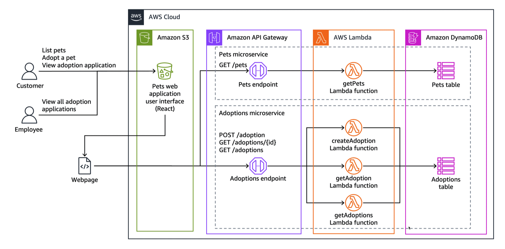

1. The diagram identifies the Pets and Adoptions microservices and the storage, compute, and integration components that implement them.
2. Each component is labeled and placed in a box that identifies the AWS service that it uses. These services are Amazon S3, API Gateway, Lambda, and DynamoDB.
3. The components are connected by arrow connectors that show the flow of data and operations through the application. For the API Gateway components, the connectors are labeled with the route of the operations that they respond to.
4. A customer actor and an employee actor are represented to illustrate the two different user types of the application. The diagram also identifies which user stories they can perform.

### Activity: Refactoring the Bicycle Parts Application

In this activity, you will refactor the existing AnyCompany Bicycle Parts application into a microservices design and create an architecture diagram that illustrates the solution. Specifically, you will decompose the monolithic design of the application into microservices. Then, you will use a drawing tool that provides standard icons for AWS services to create the architecture diagram.

#### AnyCompany Bicycle Parts monolithic application

The existing AnyCompany Bicycle Parts web application is implemented in Django. Django is a framework that facilitates building web applications in Python. It uses a Model-View-Template design pattern to structure application components. The model handles the data storage and access, the view implements the application's business logic, and the template defines the layout and structure of the user interface. Django applications are monolithic because all application components are tightly integrated and deployed in a single unit.

The following diagram illustrates the existing architecture of the Bicycle Parts application:

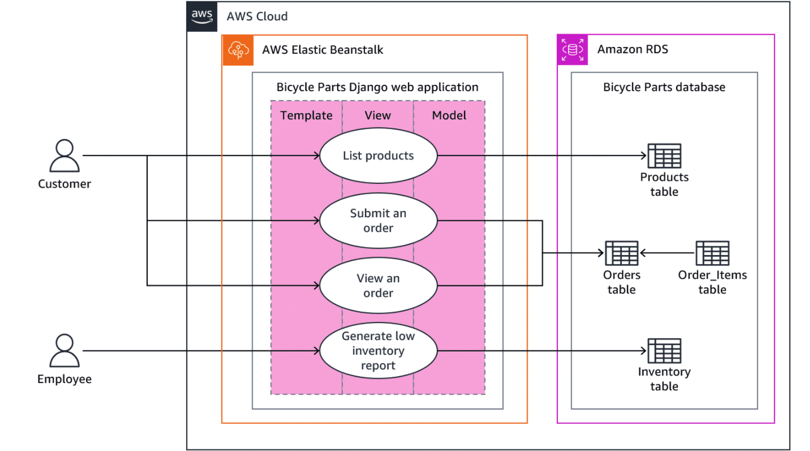

Notice the following characteristics of the monolithic design:

* The application functions support the use cases to list products, submit an order, view an order, and generate a low inventory report. The first three use cases are initiated by customers, whereas the last one is performed by employees.
* The application's data is stored in a single relational database running in Amazon Relational Database Service (Amazon RDS). The tables in the database consist of Products, Orders, Order_Items, and Inventory.
* The application is deployed in an AWS Elastic Beanstalk environment.

The Bicycle Parts company's business requirements state that they want to refactor the monolithic application so that it is more fault-tolerant, scalable, and manageable to maintain. The company's development team also has very little experience with SQL and relational database design and does not want to manage its own databases. Your task then is to split the application into microservices, select the AWS services to implement them, and document the new design.

How should you decompose the monolithic application into microservices? Which AWS services should you use in the design? These are some of the questions that you need to answer in this challenge.

#### Using a diagramming tool

To help you draw the architecture diagram, you can use the `draw.io` online diagramming tool. This tool can be used to create flowcharts, process diagrams, and many other types of drawings. You can save the diagram locally on your computer after you create it. One convenient feature of `draw.io` is that it includes the official architecture icons for the services and resources offered by AWS. This facilitates drawing architecture diagrams that use AWS services.

* [Access the open `draw.io` tool](https://app.diagrams.net/)

1. In the `Save diagrams` to dialog, choose **Device** to save your diagram to your local computer.
2. In the `Device` dialog, choose **Create New Diagram**. A new dialog opens to prompt you to specify a name and a starting template for your diagram.
3. In the `Filename` field, enter a name for your diagram. By default, the file name has an extension of .drawio, and the starting template is Blank Diagram.
4. Choose **Create**. A blank canvas opens for you to edit your drawing, and the left panel displays shapes that you can drag and drop onto the canvas.
5. To access the AWS architecture icons, choose **+ More Shapes**.
6. In the `Shapes` dialog, select the check box for AWS 2025 under the Networking section and choose **Apply**. The AWS architecture icons are now available for you to use in the left panel. They are grouped by service or resource type, and each group has a label that starts with AWS.

* [Using AWS icons in `draw.io`](https://www.drawio.com/blog/aws-diagrams)

#### Performing the activity tasks

Complete the following steps to perform this activity:

1. Analyze the existing design of the application and identify the microservices.
2. Select the AWS services to implement the application's user interface and the microservices' data store, compute, and integration components.
3. Draw the microservices architecture diagram for the refactored application.

#### Suggested solution

The following architecture diagram illustrates a suggested microservices design for the refactored Bicycle Parts web application:

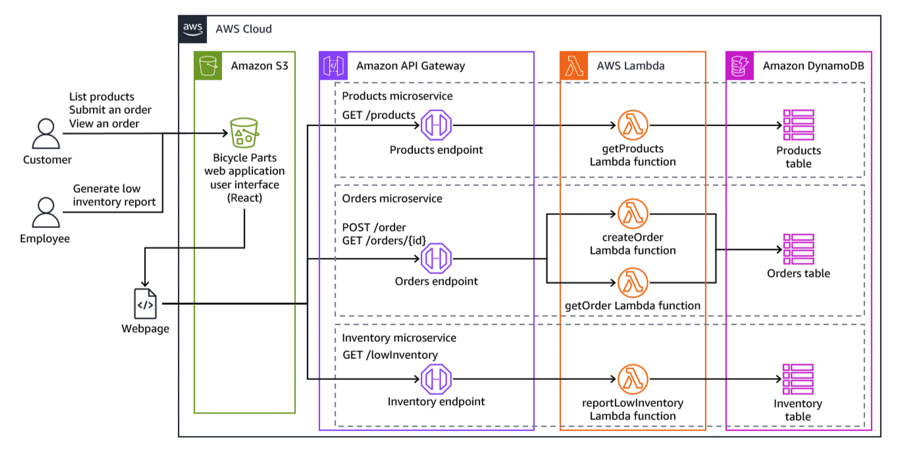

Review the architecture and reflect on the following rationale for it:

* The monolithic application was refactored into three microservices: Products, Orders, and Inventory. This decomposition was driven by grouping the use cases by business capability. It was also influenced by recognizing the type of data used by each use case and applying the rule that each microservice maintains its own data.
* The application's user interface is implemented as a web application hosted on Amazon S3. This solution benefits from being serverless, highly performant, and scalable. Choosing to use the React framework will also help accelerate the development of the application's user interface.
* The selection of AWS services to implement the microservices' database, compute, and integration components consists of DynamoDB, Lambda, and API Gateway, respectively. This combination meets the company's requirement to move to a NoSQL serverless database. By migrating to DynamoDB, the one-to-many relationship between the Orders and Order_Items table in the relational database can be captured in a single Orders table. With DynamoDB, you can define the attribute of an item as a collection of objects and use this feature to express a one-to-many relationship. The combination of DynamoDB, Lambda, and API Gateway also provides scalability at each component level and implements best practices for microservice design.

### Knowledge Check

#### A developer is building a microservices-based ecommerce application and wants to monitor how many times the application's Orders microservice is called. Which AWS service should the developer use?

* Amazon API Gateway

Wrong answers:

* AWS CodeDeploy
* Amazon Cognito
* Amazon Athena

##### Explanation

API Gateway provides a dashboard to visually monitor calls to services.

The other options are incorrect for the following reasons:

* CodeDeploy automates software deployments. It does not perform monitoring functions.
* Amazon Cognito is a service that provides secure user authentication, authorization, and data synchronization for web and mobile applications.
* Athena is a serverless, interactive query service used to analyze data from Amazon S3 using standard SQL.

#### A developer has built a stateful microservice and packaged it as a Docker image. The developer wants to deploy the microservice to a serverless runtime on AWS. Which AWS service should the developer use?

* AWS Fargate

Wrong answers:

* Amazon DynamoDB
* Amazon EC2
* Amazon Elastic Beanstalk

##### Explanation

To run a Docker image, you need a container service. Fargate is a serverless service that runs containerized applications on Amazon Elastic Container Service (Amazon ECS) or Amazon Elastic Kubernetes Service (Amazon EKS).

The other options are incorrect for the following reasons:

* DynamoDB is a database service, not a compute service.
* Amazon EC2 and Elastic Beanstalk are not serverless services.

#### A developer has created three microservices that implement the steps of a business process. These steps need to be run in a specific order. Which AWS service should the developer use to implement the business process?

* AWS Step Functions

Wrong answers:

* Amazon API Gateway
* Amazon Simple Queue Service (Amazon SQS)
* Amazon Simple Notification Service (Amazon SNS)

##### Explanation

Step Functions gives you the ability to coordinate multiple AWS services into a serverless workflow.

The other options are incorrect for the following reasons:

* API Gateway is a service to create, publish, secure, and monitor APIs.
* Amazon SQS is a message broker service.
* Amazon SNS is a publish-subscribe notification service

### Summary

* Modern applications are built with microservices architecture patterns and serverless operational models, and deployed through an automated software delivery process.
* A microservice represents a single business capability and maintains its own data.
* Microservices are developed by small, independent teams. Each team can decide the best programming language and technology stack to implement their microservice. Microservices scale and fail independently of other microservices in the same application.
* Serverless computing is a cloud computing model in which the cloud provider manages the underlying infrastructure. This means developers can focus on writing code and building applications. In the AWS Cloud, the concept of serverless is based on the following tenets: no server management, continuous scaling, built-in fault tolerance, and pay-per-use pricing.
* The key AWS serverless data store services include Amazon S3, DynamoDB, and Amazon Aurora Serverless.
* The key AWS serverless compute services include Lambda and Fargate.
* The key AWS serverless integration services include API Gateway, Step Functions, Amazon SQS, and Amazon SNS.
* You can use the AWS SAM framework to streamline serverless application development and deployment.
* CI/CD tools automate the software delivery process.
* The main AWS CI/CD services include CodeBuild and CodePipeline.

### Additional Resources

* [AWS Architecture Icons in Microsoft PowerPoint](https://aws.amazon.com/architecture/icons/)

## DEVELOPING APPLICATION FRONTENDS WITH REACT

### Overview of Popular Web Libraries and Frameworks

Software applications can be coded in many different ways. But, to avoid reinventing the wheel and writing boilerplate code, a library or a framework can help you and your team get started quickly by providing a reusable and extensible codebase, along with a set of conventions and best practices.

Each programming language comes with more or less popular libraries and frameworks. In this lesson, you will learn about the most popular ones for frontend web application development.

#### Library definition

A library is a collection of prewritten code that you can call upon when needed. It offers specific functionality or features that you can use to make your development easier. Unlike frameworks, libraries don't dictate the structure of your application.

It is important to understand the following key points.

* **Control**: You control the flow of your application. You call the library functions as and when you need them.
* **Flexibility**: A library provides specific functionality without imposing strict rules on how to structure your code.
* **Examples**:
  * **jQuery** (for simplifying JavaScript tasks)
  * **Lodash** (a utility library for JavaScript)
  * **NumPy** (a library for numerical computations in Python)
  * **Pandas** (a library for data manipulation in Python)
  * **React** (a library for building user interfaces)
* **Analogy**: Think of a library like a toolbox. The library provides tools (functions) that you can use to build something. You decide when and how to use the tools.

#### Framework definition

A framework is a collection of prewritten code that provides a structure for building applications. It defines the overall architecture and dictates the flow of control in your application. When you use a framework, you follow its rules and guidelines, and it often calls your code at specific points.

The key points to understand are listed here:

* **Inversion of control**: The framework controls the flow of your application. You write specific parts of your code, and the framework calls them when needed.
* **Structure**: A framework provides a strong structure and set of rules to follow, which can help maintain consistency and organization in your code.
* **Examples**:
  * **Angular** (a web application framework)
  * **Django** (a web framework for Python)
  * **Spring** (a framework for Java)
  * **React** (when used with its broader environment)
* **Analogy**: Think of a framework like building a house using a predefined blueprint. The framework provides the foundation, walls, roof, and structure. You are responsible for filling in the details, like painting the walls and adding furniture.

A framework provides a foundation, guidelines, libraries, and tools for building software applications. Its aim is to increase productivity, maintainability, and consistency in software development. Some frameworks are more opinionated and prescriptive, and others are more flexible and lightweight.

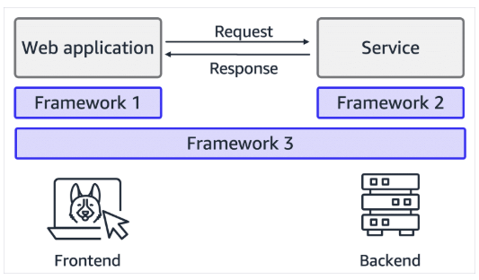

A frontend web application communicating with a backend service. They can be implemented using a different framework or the same framework.

An application is made of a `frontend` client running on your customers' devices and `backend` services deployed on Amazon Web Services (AWS) or elsewhere.

A framework might encompass the frontend code (as framework 1), the backend code (as framework 2) or both (as framework 3).

#### Backend frameworks

If you look at the most used programming languages in the backend nowadays, here are the corresponding frameworks.

* The **Node.js** framework brought the JavaScript language to backend development.
* **Django** and **Flask** are used to develop Python based services.
* **Spring** and **Java EE** (Java Enterprise Edition) are still going strong when it comes to Java-based services.
* **ASP.NET Core** creates services using .NET. It supports multiple programming languages, including C# and F#.
* **Laravel** is a popular PHP web application framework.
* **Axum**, **Actix-web** and **Rocket** can be used for building Rust applications.
* **Ruby on Rails** is very common for Ruby.

#### Frontend libraries and frameworks

Some of the listed backend frameworks can produce frontend HTML web pages as well. Django includes the Model-View-Template (MVT) pattern, ingesting dynamic data into HTML templates. Similarly, other frameworks follow the Model-View-Controller (MVC) architectural pattern. This is the case for Laravel and Ruby on Rails.

In addition, the following libraries and frameworks, like React and Angular, are purely used in the frontend to generate `single-page applications (SPAs)`. An SPA is a website loaded on a single HTML page. Instead of loading new pages, the content is dynamically loaded and rendered within the same page using JavaScript. This can be achieved through techniques like AJAX (Asynchronous JavaScript and XML) and by manipulating the Document Object Model (DOM).

##### React

Originally developed by Meta, React is a JavaScript and TypeScript library for building user interfaces. It is widely adopted for creating SPAs. It can also produce native apps for Android, iOS, and more, using the React Native library. React's component-based architecture, virtual DOM, and collection of libraries make it a popular choice among developers.

React is primarily a library for building user interfaces, providing the tools to create and manage UI components. However, when combined with other tools like React Router for routing and Redux for state management, it can offer a more structured, framework-like experience.

Although React has excellent TypeScript support and the React team encourages the use of TypeScript for larger projects, it is not a requirement. You can choose to write React applications entirely in JavaScript if you prefer.

##### Angular

Originally developed by Google, Angular is a full-fledged TypeScript-based framework for building complex web applications. It follows a modular approach, and offers robust tooling. Some think it has a steep learning curve compared to other frameworks.

Angular is rewritten in TypeScript itself and no longer supports JavaScript directly. Your Angular application code must be TypeScript.

##### Vue.js

Vue.js is a progressive JavaScript and TypeScript framework known for its flexibility. According to its community, it combines the best features of React and Angular, making it an attractive option for building SPAs and user interfaces. It is often praised for its simplicity, which makes it especially suitable in smaller projects or prototypes.

Vue is written in TypeScript itself and provides first-class TypeScript support. Similar to React, the core team actively encourages the use of TypeScript for building large-scale Vue.js applications, although JavaScript is supported.

##### Ember.js

More of niche framework, Ember.js is a full-stack JavaScript and TypeScript framework. As you have experimented with Django, Ember.js follows a template-oriented approach. It is well suited for building ambitious web applications and has a strong emphasis on convention over configuration.

You can follow a set of established best practices from the start, reducing the need for explicit configuration. The framework provides a set of sensible defaults and conventions that cover common scenarios and patterns.

##### jQuery

jQuery is a popular JavaScript library for adding interactivity to websites and enhancing user experiences. It is not used to build SPAs. But it simplifies DOM manipulation, event handling, and AJAX requests.

jQuery is widely used. You will probably encounter jQuery in your career either as a single library or in combination with another framework.

### Activity: Working with React

#### Using npm for dependencies management and more

`npm` is a `package manager` for the JavaScript programming language, similar to pip for Python. It helps manage packages, which are pieces of reusable code that can be included in your projects. These packages are also known as dependencies.

`Dependencies` are external libraries or packages that your project requires to work correctly. For example, if you’re building a React application, you will depend on the React library itself, along with other libraries for various functionalities like routing, state management, or making HTTP requests.

A React application typically has many dependencies to handle different aspects of the development process. These dependencies are listed in a file called `package.json`. This file is crucial for any `Node.js` and `React project`.

When you run `npm install`, npm reads this file and downloads all the listed packages. It downloads them into a directory called `node_modules`. This folder contains all the installed packages and their dependencies. The `node_modules` directory can get very large because it includes not only the main packages but also the packages that those main packages depend on.

You can also define useful developer command scripts. These scripts can automate tasks like starting the development server, running tests, building your project for production, or linting your code. They are accessible through `npm run <script>`.

The following graphic shows an example of a package.json file for a React application. It contains a `name` key that defines the name of the application, and a `scripts` key that defines aliases for commands that you can run. The file also declares a `dependencies` key and a `devDependencies` key to define application and development dependencies, respectively.


1. **Scripts**

    You can define useful developer command scripts in package.json. These scripts can automate tasks like starting the development server, running tests, building your project for production, or linting your code.

2. **Application dependencies**

    Application dependencies are libraries that your application requires to run, such as the following:

    * React is the core library for building user interfaces.
    * ReactDOM integrates React with the DOM.
    * Axios is a library for making HTTP requests.

3. **Development dependencies**

    Development dependencies are tools and libraries that you need for development, such as the following:

    * **ESLint**: A tool for identifying and fixing linting errors in your code
    * **React Testing Library**: A library used to render and interact with React components for testing purposes
    * **jsdom**: A JavaScript implementation of many web standards to emulate a subset of a web browser for testing

---

In a React application, the package.json file is typically located in the root directory of the project. The root directory of a React project in the following activity is named pet-shelter-client. Any time that the instructions say to go to the root directory of the React project, this is the directory that we are referring to.

---

In our pet shelter application, the data that powers the application—such as the list of pets available for adoption and the details of adoption applications—comes from the backend server. To access this data, our React application must make calls to the backend, and that's where Axios comes in.

##### Axios

Axios is a popular JavaScript library that makes it easy for the frontend to communicate with the backend.

With Axios, our React application can request all the pets from the server. It can retrieve adoption applications, submit new applications, and view detailed information about specific applications. It can even manage user authorization to ensure that only certain users have access to specific API features.

By using Axios, we ensure that the frontend and backend work together seamlessly to provide a complete and functional experience.

#### Improving the developer experience with Vite

`Vite` (French for quickly) is a local development server that helps improve the React developer experience. While you are editing the code, Vite refreshes the running application. Vite uses native ECMAScript (ES) modules and a technique called `on-demand code splitting`. This means that only the code needed for the current page is loaded during development, resulting in near-instant page reloads and hot module replacement (HMR) updates. Modify the code and see the change in the browser instantly!

But Vite can do much more. Vite can be used to scaffold a new React project using the following npm command:

```bash
npm create vite@latest
```

When you run this command, it asks you to choose between different frontend frameworks. When you select React, the command further asks you to choose between JavaScript and TypeScript. The command creates a complete project file structure and a runnable sample React application. This includes the npm's `package.json` with all the necessary dependencies and useful command scripts. You will see this in the next lab.

#### JavaScript and TypeScript programming languages

A React application can be coded in JavaScript, TypeScript, or both.

##### JavaScript concepts

You have already encountered JavaScript as a core technology of a web application, alongside HTML and CSS. Almost all the websites that you browse make use of JavaScript. The code can be interpreted and run by all browsers. It makes static web pages more dynamic. JavaScript conforms to the ECMAScript (ES) standard.

Functions and classes in JavaScript allow for code reusability and organization. Here is an example of a function. There is no type on the argument, returned value, or internal variables.

```js
function fibonacciSeriesJS(n) {
  const series = [O, 1];
  for (let i = 2; i <= n; i++) {
    const nextValue = series[i - 1] + series[i - 2];
    series. push(nextValue);
  }
  return series;
}
```

##### TypeScript concepts

TypeScript adds static typing with optional type annotations to JavaScript. Because TypeScript is a superset of JavaScript, any JavaScript code can be considered TypeScript code without the type annotations.

If you want to convert a JavaScript piece of code into TypeScript, start by changing the file extension from .js to .ts, or .jsx to .tsx in React. This is enough. But, to take advantage of TypeScript, variable types will have to be added in your code. By declaration types for variables, your integrated development environment (IDE) can uncover potential issues in the code. In addition, variable typing helps make the code completion in your editor more effective. The generative AI tools can also make better predictions.

JavaScript has three very commonly used primitive data types: `string`, `number`, and `boolean`. Each has a corresponding type in TypeScript, defined by the same names. TypeScript also has a special type, `any`, that you can use whenever you don’t want a particular value to cause type-checking errors.

Apart from primitive data types, the most common sort of type you will encounter is an object type, which refers to any JavaScript value with properties.

Here is the same function seen previously but in TypeScript. Notice on the first line that the function takes a `number` argument and returns an array of numbers, `number[]`. Internal variables are also typed with `:<type>`.

```ts
function fibonacciSeriesTS(n: number): number[] {
  const series: number [] = [0, 1];
  for (let i: number = 2; i <= n; i++) {
    const nextValue: number = series[i - 1] + series[i - 2];
    series.push(nextValue);
  }
  return series;
}
```

#### React project file structure

The following file structure applies when using Vite to scaffold a React project. The structure has small differences if you do not use Vite. The ordering has been modified to allow a logical description of the files and folders.

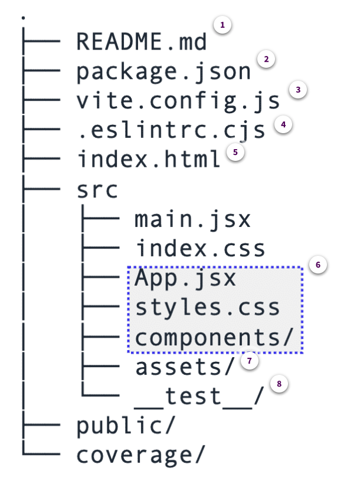

1. **README.md**

    **README.md** is a markup text file to describe your project. This is usually displayed on the version control main webpage.

2. **package.json**

    **package.json** serves as a manifest file that contains metadata about the project, including its dependencies, scripts, and other configurations.

3. **vite.config.js**

    **vite.config.js** is a configuration file for Vite to allow you to customize and extend Vite's behavior to suit your project's needs.

4. **.eslintrc.cjs**

    **.eslintrc.cjs** is a configuration file to enable and disable rules from ESlint, a static analyzer to improve code quality.

5. **index.html, main.jsx, and index.css**

    **index.html**, **main.jsx**, and **index.css** are the entry point to the frontend application. They are not often modified.

6. **App.jsx, styles.css**

    **App.jsx**, **styles.css**, and the **jsx** files under **components** are what defines your frontend. This is where you spend your time coding. In particular, components/ is a directory containing the individual React components as .jsx files (or .tsx file in TypeScript) that make up your application's UI parts. Different sections of the webpage are called *components* in React, and this is where you define and build them.

7. **assets and public folders**

    The **assets** and **public** folders hold binary files like pictures.

8. **`__test__`, coverage folders**

    The `__test__` and `coverage` folders are used to create unit tests and visualize a code coverage report from running these tests.

The `index.html` file is the main HTML file that serves as the entry point for the React application. Note that it is not under the `src/` folder. It contains the `<div id="root"></div>` element, where the React application will be rendered. It also includes the script tag that loads `main.jsx`.

The `main.jsx` (or `main.tsx` in TypeScript) is the bundled JavaScript file generated by Vite. It is the entry point for the React application. It renders the root component `App.jsx`. In some cases, it can be modified to load an application router. It is styled by index.css.

`App.jsx` (or `App.tsx` in TypeScript) is the root component and the heart of your frontend application. It defines the routes and which React components are loaded. It typically creates the main UI by importing and rendering other components. It is styled by `styles.css`.

`components/` is a directory containing the individual React components as `.jsx` files (or `.tsx` file in TypeScript) that make up your application's UI parts.

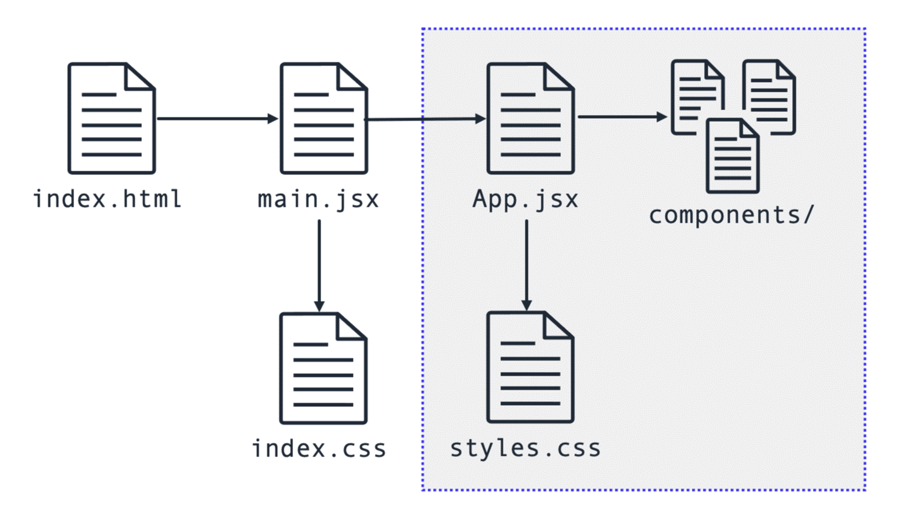

#### Activity

In this activity, you will review and install the pet shelter application's dependencies and preview the application.

1. **Locate the project folder for the pet shelter application**

    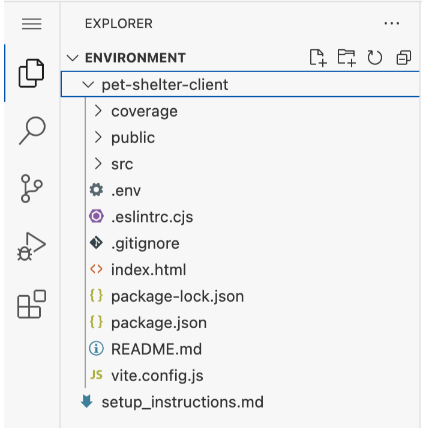

    Locate the `pet-shelter-client` folder in the left navigation pane of the AWS supported integrated development environment (IDE) in your practice environment. This folder contains the React application that has been prebuilt for you within your IDE. This application contains only the React code and does not contain the project's dependencies yet.

2. **Locate the application's dependencies file**

    

    In the IDE, open a terminal window and change the directory to the root of the React application by running the following command:

    `cd pet-shelter-client/`

    Type `ls` and press `Enter`. Notice that `package.json` is one of the files listed.

3. **Recognize dependencies**

    

    Use the following command to display the contents of the `package.json` file:

    `cat package.json`

    Notice that there are several dependencies listed: `axios`, `dotenv`, `react`, `react-dom`, and `react-router-dom`. These are external libraries that React will use for different features.

4. **Install dependencies**

    

    The `package.json` just lists the dependencies. To install the dependencies onto your version of the application, you will need to run the `npm install` command from the same directory that contains the `package.json` file.

    Type `npm install` and press Enter. You will see many messages from npm appear.

5. **Validate the dependencies installed**

    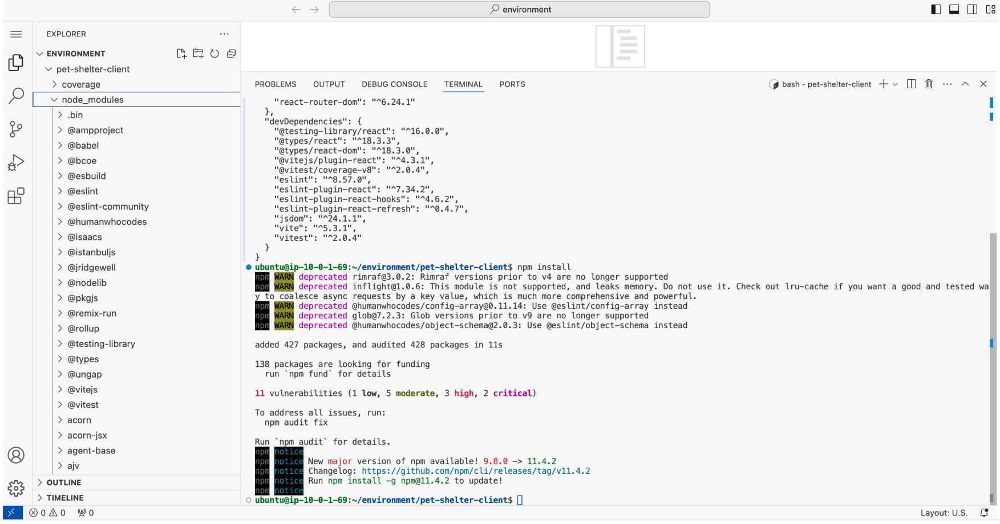

    In the navigation pane, expand `node_modules`. This directory contains the actual code for all the external dependencies that you just downloaded. Your React application will use these dependencies when the application runs.

6. **Run the React application**

    

    Look at the `package.json` file again. Notice the `"scripts"` section in line 6. This part lists the scripts that can be run. One of the scripts is `"dev"` which starts the React application in a developer environment and allows you to see the application in its current state.

    In the terminal, run the following command from the pet-shelter-client directory:

    `npm run dev`

    You should see several messages identifying the version of the application and information from the vite framework. One of the messages displays the host name and port number to access the application.

    Note: You will not be able to enter any other commands in this terminal now that the React application is running. If you need to enter commands again, you can open a new terminal by choosing the plus (+) icon.

7. **View the React application**

    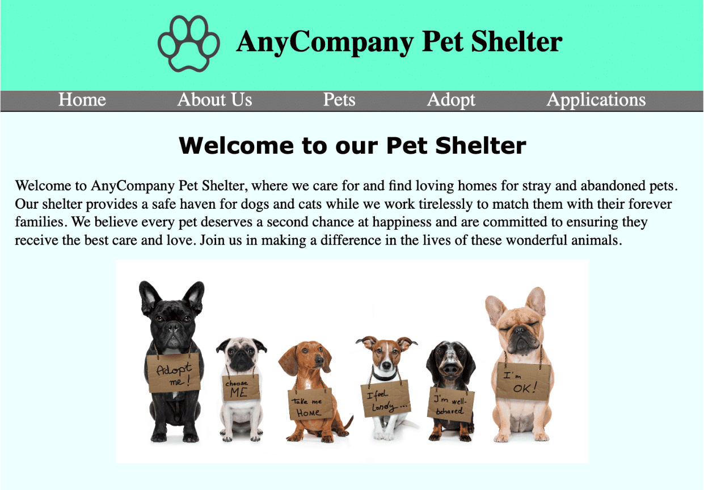

    In the terminal window, chose the `Local: http://localhost:8081/preview` link while simultaneously holding down the `Ctrl` key on PC or `Command` key on macOS.

    You will see an application webpage open up in your browser.

### Activity: Building a User Interface with React

#### JSX

**JavaScript XML (JSX)** is a syntax extension for JavaScript that you can use to write HTML-like code within your React JavaScript (.jsx) or TypeScript (.tsx) files. It is a core part of the React library and is used to describe the structure and appearance of user interfaces.

JSX provides a concise and familiar syntax for defining the structure of React components. With it, you can write markup that looks very similar to HTML, but with the full power of JavaScript. This makes it easier to create and manage complex user interfaces, because you can combine markup and logic in the same file.

Here's an example of a React component using JSX:

```jsx
import React from "react";

export default function HelloWorld {
  return ( 
    ‹div>
      <h1>Hello, World!</h1>
      ‹p»This is a React component using JSX.</p>
    ‹/div>
  );
}
```

In this example, the `return` statement inside the `HelloWorld` component function is not returning a string or HTML markup directly but JSX syntax. JSX code gets compiled into regular JavaScript by tools like Babel or the React JSX transformer. This is taken care by Vite when you run `npm run dev` or `npm run build`. For example, the previous JSX code would be compiled to something like this:

```js
React.createElement(
  "div",
  null,
  React.createElement("h1", null, "Hello, World!"),
  React.createElement("p", null, "This is a React component using JSX.")
);
```

Although this compiled code might look more verbose, JSX provides a more intuitive and readable way to structure components, especially as they become more complex.

JSX also allows you to embed JavaScript expressions within the markup by wrapping them in curly braces {}. This helps you to dynamically render content based on variables, props, or function calls. Inside the curly braces, you can type the name of a variable or any JavaScript expression. In the following example, the copyright year is dynamic and not hard coded to ease maintenance.

```jsx
<p>&copy; {new Date().getFullYear)}, AnyCompany Inc. All rights reserved.</p>
```

Similarly to Django templates, JSX simplifies the process of building user interfaces. It provides a declarative and easy-to-read syntax for defining React component structures. It bridges the gap between markup and logic, making it easier to reason about and maintain your React applications.

##### Activity

1. **Run the pet shelter application**

    If you don’t already have the application running, run the pet shelter application in your browser by running `npm run dev` from the React project’s root directory:

    * Run the `cd ~/environment/pet-shelter-client` command.
    * Run the `npm run dev` command.
    * Open the application in the browser.

2. **Modify the code**

    

    Locate one of the jsx files under `src > components` and make some modification inside the JSX part of the code. Specifically, follow these steps:

    * Choose the `Header.jsx` file. This code represents the html and JavaScript for the aquamarine-colored header in the application.
    * In the `Header.jsx` file, change the content inside the `<h1>` tags to say `AnyCompany Pets for All` and save the file. Notice that it changes the header in the preview application running in the browser.
    * Revert the content inside the `<h1>` tags to say A`nyCompany Pet Shelter`. Notice that it changes again.

#### React components

Traditionally, to produce a webpage, you need to write one HTML file like index.html. In a multi-page web interface, you will also write several other HTML files with HTML links from one to another.

As you have learned in the previous lesson, React allows you to create a single-page application (SPA) with a single HTML page and JavaScript manipulating the Document Object Model (DOM). React asks you to consider the user interface that you have in mind as many small building blocks put together. These blocks are called `components`. After all of the components in a page are coded, React will generate the final HTML and JavaScript that client browsers can download, interpret, and render.

React components can be composed together to build complete user interfaces. Smaller components can be combined to create larger, more complex components. This gives you a logical application structure, easy to understand, discuss, and rearrange. It also promotes code reuse for some smaller components seen in different tabs, for instance.

A React component must encapsulate its logic, managing its own data state and handling user events interacting with the UI elements. That way, the component is self-contained, following the principle of `separation of concerns`. It makes it easy to place the component anywhere on the UI.

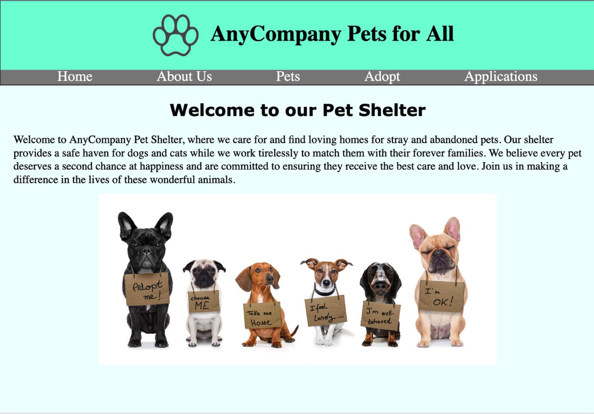

Consider the pet shelter application or any webpage out there.

For the pet shelter, if the middle part has to be replaced when choosing a tab, you can consider that part as a component that can be replaced by other components.

If the top and bottom parts are fixed, they can also be considered as two components.

The following picture illustrates the React components of the pet shelter UI.

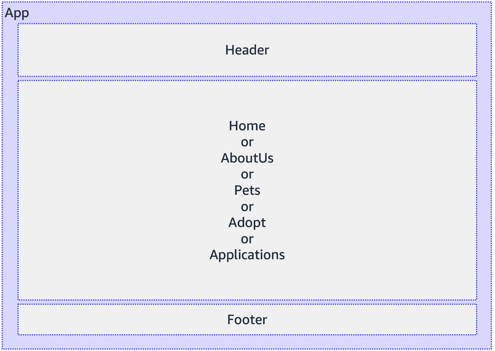

In most React applications, `App` is the root component. For the pet shelter application, it encapsulates all the components that constitute the main landing page. This page has three horizontal layers represented by the `Header`, `Home`, and `Footer` components.

The `Header` component embeds a title and a navigation bar. When you choose an option in the navigation bar, it triggers the replacement of the `Home` component with another component, such as the `Pets` or `Adopt` component. These components display a list of pets and a form to submit an adoption application, respectively.

The `Footer` component displays copyright information.

---

Here is an example of a React component, called Welcome.

The import is optional starting from React version 17. This is because React's new JSX transform can automatically inject the necessary imports for JSX code without requiring an explicit import. This is also welcome to avoid what looks like an error (an unused import) from a static analysis perspective.

```jsx
// optional since React 17
import React from "react";

export default function Welcome() {
  return <h1>Hello World</h1>;
}
```

As you see with this `Welcome(`) example, React components can be defined as functions returning a JSX element, in this case an `<h1>` element. Such component is called a `functional component`. Functional components are the modern and recommended way of creating components in React. For your information, in addition to functional components, React also supports class components.

The `export default` prefix is not specific to React but a standard JavaScript syntax. It lets you mark the function in a file so that you can later import it from other files.

##### Activity

Open your practice environment to modify the application structure with React components using the following guide.

---

A component is created and then inserted into the App.jsx to be rendered. It won't be rendered if it's just a standalone component that is not in some way connected to App.jsx.

---

1. **Create a new component**

    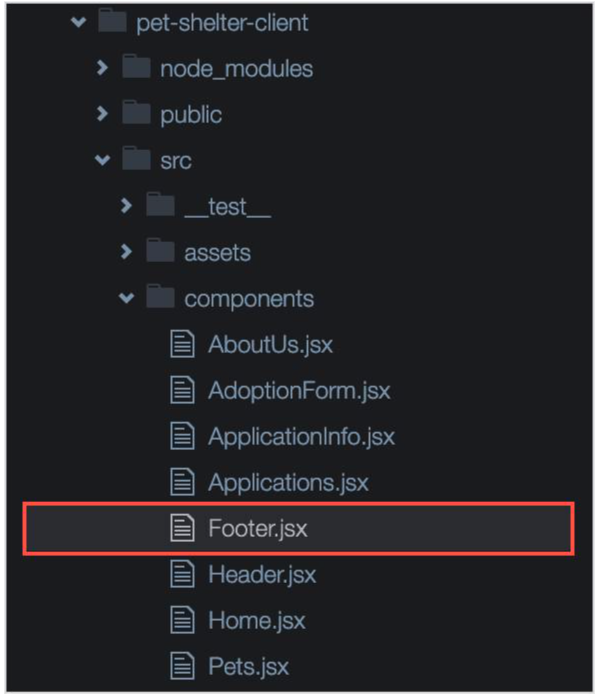

    To create a new component for a footer, create a file named `Footer.jsx` (case sensitive) in the `src > components` directory.

2. **Add the code**

    Copy and paste the following code into `Footer.jsx` file:

    ```jsx
    import React from 'react'

    const Footer = () => {
       return (
           <div className='footer'>
               <p>Official Pet Shelter site of AnyCompany Pets</p>
               <p>© 2024 AnyCompany Pet Shelter. All rights reserved.</p>
           </div>
       )
    }

    export default Footer
    ```

    Save the file.

3. **Import the footer**

    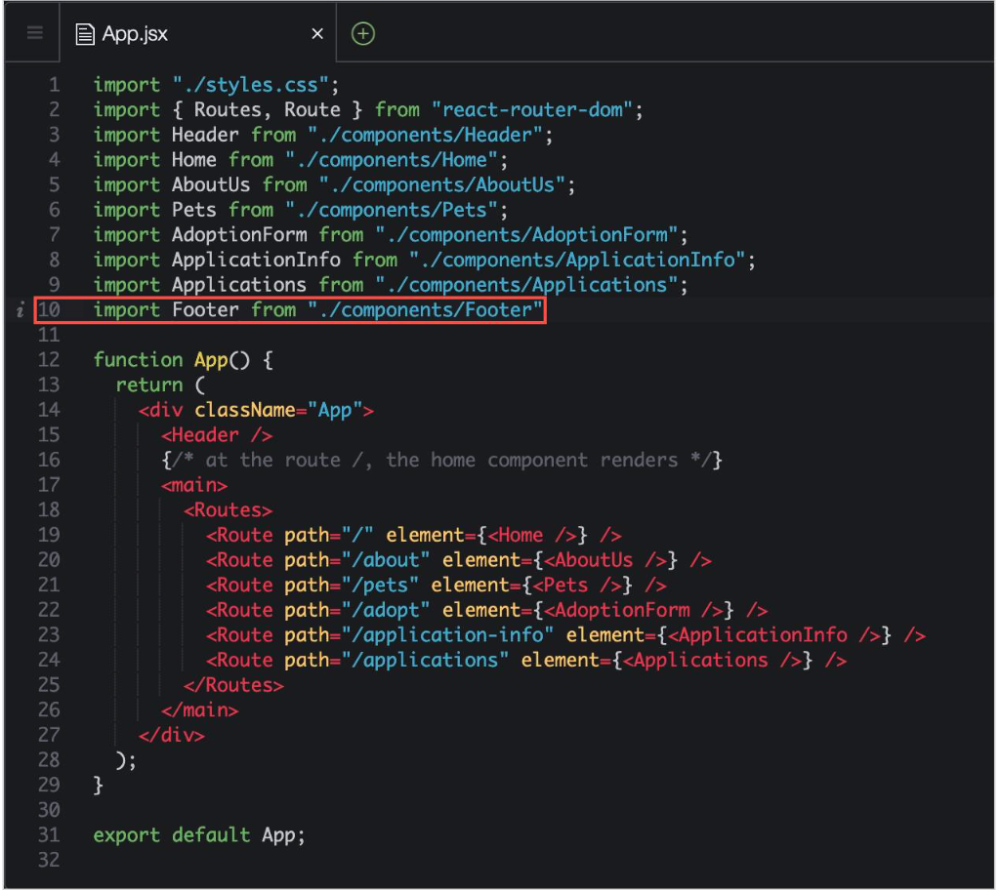

    Notice that nothing has changed in the application yet. The footer code has been created, but it still must be inserted into the React application’s page to show up. But first, it has to be imported.

    Open the `App.jsx` file in the `src` directory and insert the following line under all the import statements:

    ```jsx
              import Footer from "./components/Footer"
    ```

    This statement will import the footer component that we just created.

    Save the file.

4. **Render the footer**

    

    To display the component, it must be inserted inside the `App.jsx` file.

    Inside the `App.jsx` file, add the following code under the closing `</main>` tag:

    ```jsx
              <Footer/>
    ```

5. **Save the file**

    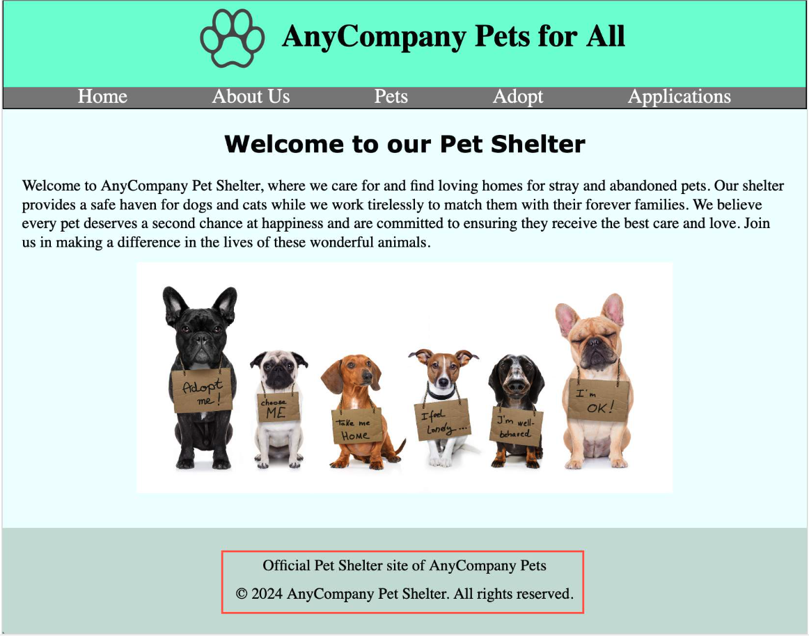

    Save the file and observe the footer in the bottom of the application.

---

#### Props

Often, you will need to pass data from a parent component to a child component. React components use `props` to communicate data with each other.

The following modified `Welcome` component takes in `props` as an argument. It uses a name in JSX to make the component more dynamic and reusable.

```jsx
export default function Welcome(props) {
  return <h1>Hello, {props.name}</h1>;
}
```

To pass data as props to a child component, see the following example. In this example, the values `Jane` and `Carlos` are passed to two separate instances of the `Welcome` component. You can pass any JavaScript value through props, including objects, arrays, and functions.

```jsx
import Welcome from "./components/Welcome";

export default function App() {
  return (
    ‹div>
      <Welcome name="Jane" />
     <Welcome name="Carlos" />
    </div>
  );
}
```

##### Activity

Open your practice environment to do some refactoring using component properties.

1. Preview the pet shelter application in your browser by running `npm run dev`.
2. Analyze the code of the `Pets` and `AdoptionForm` components. See that the code hardcoding the pets array is present twice. Duplicating code is considered an anti-pattern, and it must be fixed.
3. Move that duplicated code to the `App` root component and pass `pets` as data arguments to both `Pets` and `AdoptionForm`. As a result, the `App` component initializes a `pets` variable that is passed to two different components.
4. Check that you do not have any errors in the terminal and that the application still works in the browser.

---

#### React Hooks

Functional components can use `React Hooks`, which allow you to refresh data from the backend and store data in memory, for instance.

Here are some of the two most commonly used React Hooks:

* **useState** – This Hook is a way to store and manage data in your React components.
* **useEffect** – This Hook allows you to perform side effects in components, such as fetching data, subscribing to events, or manually changing the DOM. It runs by default after every render.

##### useState Hook

When you see a need to keep data in memory in the frontend, you can use the useState Hook. useState declares a state variable that you can update directly. Think of it as a container that holds information that can change over time, such as user input, form data, or even the results of a fetch request.

In this example, the `Counter` component uses the useState Hook to manage its state and update the count when a button is chosen. The useState Hook takes one argument, the initial value of the state variable, as in `useState(0)` for an integer. The count starts at zero. The useState Hook returns an array with two elements: the current initialized state variable, as in `count`, and a function to later update that state as in `setCount`.

```jsx
import { useState } from "react";

export default function Counter() {
  const [count, setCount] = useState(0);

  return (
    <div>
      <p>You clicked {count} times</p>
      <button onClick={() => setCount(count + 1)}>Click me</button>
    </div>
  );
}
```

The `setCount` function is used within JSX to update the count counter when the user chooses a button as in `setCount(count + 1)`.

Note that if you are using React Hooks (such as useState or useEffect) or even other React APIs (like React.memo or React.lazy) in your functional component, you always need to add explicit imports in your code, as in `import { useState } from "react"`.

##### Activity

Open your practice environment to see where `useState` is being used.

1. Open the `Pet`s component code under `src/components`.
2. Study how the `cat/dog filter` works. A `useState` Hook stores the current filter value in the `filter` variable. The value is updated with the `setFilter()` function when the user interacts with the `select` HTML element.

---

#### React Fragments

A component function must return only one single element, like a `<div>` or `<span>`. When you want to render multiple elements side by side, like `<h1>` and `<p>`, you need to wrap them in a parent element. However, sometimes adding an extra parent element can lead to unnecessary nesting and affect the layout or styling of your components.

A `React Fragment` allows you to group a list of children elements without adding an extra node to the DOM tree. The `<React.Fragment>` element acts as a virtual wrapper for grouping elements without adding an extra node. This maintains a cleaner DOM structure. You must remember that `<React.Fragment>` is provided by React. It is not a new HTML element.

In the following example, the `<h1>` and `<p>` elements are wrapped inside a `<React.Fragment>` instead of a `<div>` or another HTML element. When rendered, the browser will only see the `<h1>` and `<p>` elements without any additional wrapping element.

```jsx
export default function Hello() {
  return (
    <React.Fragment>
      <h1>Hello</h1>
      <p>This is a paragraph.</p>
    </React.Fragment>
  );
}
```

React also provides a shorthand syntax for `<React.Fragment>` using empty tags `<> </>`, as in the following code.

```jsx
export default function Hello() {
  return (
    <>
      <h1>Hello</h1>
      <p>This is a paragraph.</p>
    </>
  );
}
```

##### Activity

Open your practice environment to experiment with React Fragment following steps in the following guide.

1. **Add a JSX element**

    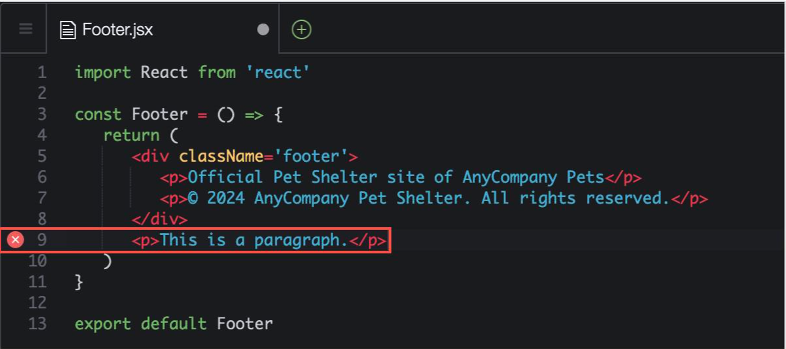

    Open the `Footer.jsx` component that you created in the previous activity.

    Add the following adjacent JSX element under the closing div element:

    ```jsx
              <p>This is a paragraph.</p>
    ```

    Notice the error indicated by a red "X" marker on the line.

    Save the file. Notice that the React application crashes.

2. **Fix the error**

    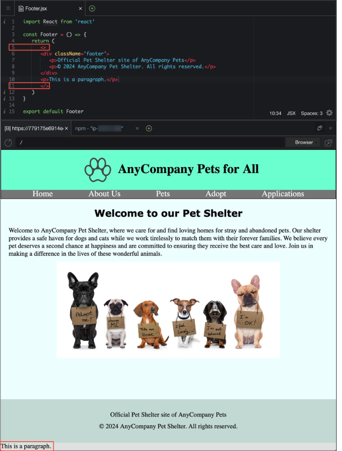

    Fix the error by wrapping the `div` and `paragraph` into a JSX fragment.

    Look at lines 5 and 11 in this screenshot. The JSX fragments `<>` and `</>` in the code are used to group multiple elements together without adding extra nodes to the DOM. In this manner, you can return adjacent elements from the `Footer` component.

    The paragraph line now appears at the bottom of the footer.

---

### Activity: Testing a React Application

While you are developing or when you have committed some changes to the code repository, automatic tests can be run. The JavaScript or TypeScript code can be statically analyzed with a linter to validate that you are coding according to best practices.

The application logic inside your functions and classes can also be tested against the business requirements. This can be achieved when you have coded some function tests.

In this lesson, you will learn about static analysis and function testing in the context of a React application.

#### Static analysis

A `linter` is a tool that crawls into your code to identify potential problems and gives you a warning or an error. These flags can appear in your code editor or in your terminal. Linters are extremely valuable for interpreted languages like Python and JavaScript because there is no compiler to detect errors during development time. JavaScript and TypeScript can be analyzed by a linter called `ESLint`. When Vite creates your React project, ESLint is preinstalled and accessible in your terminal through the command `npm run lint`.

##### Linter rules

In a project with multiple developers, ESLint can enforce obeying to standard ESLint rules, specific React rules (preinstalled by Vite), and even custom rules that your team creates. Rules can be enabled and disabled. You can also decide if a rule triggers a warning or an error. Configuring rules is done in the `.eslintrc.cjs` file of your React Vite project.

As examples, consider the following rules that you might encounter in the next activity and lab:

* **no-unused-vars** – A variable that is declared and not used anywhere in your code generates an error. The variable must be removed or commented out to avoid confusion for other programmers. Also, the same rule displays warnings for unused function arguments.
* **no-const-assign** – When you have declared a variable with the `const` keyword, you must not modify that constant. Modifying constants is flagged as error. Note that the TypeScript compiler enforces this check.
* **no-unreachable** – Any statements after `return`, `throw`, `break`, or `continue` cannot be executed. These unreachable statements are a mistake and must be removed.
* **react/no-unknown-property** – In JSX, most DOM properties and attributes should be camelCased to be consistent with standard JavaScript style. For instance, it is very common to use the `class` keyword in JSX, as in `<div class="hello">Hello</div>`. This is flagged with the following error message: `Unknown property 'class' found, use 'className' instead`.

---

##### Activity

Open your practice environment to see how the linter can increase the quality of your code.

1. Install eslint with `npm install eslint --save-dev`.
2. Run the linter with `npm run lint`. You should see several errors, at least concerning source code under `src/utils.js` and `src/components/Header.jsx`.
3. Edit the source code to fix the errors and rerun the linter until all is clear.

#### Unit testing

JavaScript developers are using `Jest` when it comes to unit testing. Jest is applicable on React projects. But if you have created your React project using Vite, an extra Vite library can be installed. `Vitest` is a Vite powered testing framework that has the advantage of being Jest compatible.

##### Testing a JavaScript function

Consider the following file called `utils.js` including a simple sum function.

```jsx
// utils.js
export function sum(a, b) {
  return a + b;
}
```

Testing this function is done in a separate file called `utils.test.js`.

```jsx
// utils.test.js
import { describe, test, expect } from 'vitest';
import { sum } from './utils';

describe("#sum", () = {
  test('adds 1 + 2 to equal 3', () => {
    expect (sum(1, 2)).toBe(3);
  });
});
```

* Using `describe()` from Vitest, you can define a new suite as a set of related tests and other nested suites. A suite lets you organize your tests. In this example code, a suite is defined for the sum function. It receives two arguments, a textual description for the suite and a function that holds the tests.
* Inside describe, one or multiple `test()` from Vitest are included. It is aliased as `it()` by some programmers. A test defines a set of related expectations. It receives two arguments, a textual description for the test and a function that holds the expectations to test.
* Typically, a test includes one or more `expect()` from Vitest. Expect is used to create assertions. Assertions are functions that can be called to assert a statement. In this example, you expect the sum of 1 and 2 to be 3.

##### Code coverage

In terms of lines of code, the previous test covers 100 percent of utils.js. Code coverage is maybe not sufficient, but it is a good indicator to understand if you have enough unit tests. Increasing code coverage will increase your confidence in committing changes to production. Vitest comes with an extra library to calculate code coverage metrics. The coverage is shown in the terminal when all unit test errors are fixed, but also in an HTML report.

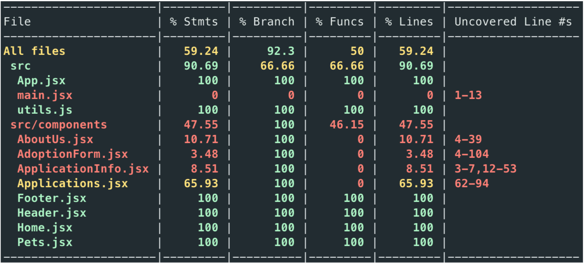

This example taken from the activity shows all the available metrics. Each line represents a source code file or directory. Under each column, you can see the code coverage percentage for the code statements, branches, functions, and lines.

For instance, 47 percent of the lines under the `src/component`s folder are covered.

Also, this report indicates the uncovered line numbers on the right-hand side. These are good candidates for your next tests.

##### Testing React components

A React component is a building block for a UI. This is often tested manually and visually by previewing the application in a browser. The graphical elements can be automatically tested. The technique to do so is called `headless browser testing`, the head in this case being the UI.

In your React project, two extra libraries must be installed with npm. First, you need the React Testing Library as a lightweight solution for testing React components. As a complement, `jsdom` emulates enough of a subset of a web browser to be useful for testing and scraping real-world web applications.

Testing a React component still involves using Vitest `describe`, `test`, and `expect`. But, additionally, you need a way to load a component or choose a button. This is provided by the React Testing Library. The following functions come handy:

* The `render()` function renders a React component into the DOM.
* The screen object supports all the queries to fetch elements from the DOM. For instance, `screen.getByRole("button")` fetches the button of the loaded component. Also, `screen.getByText("Load Greeting")` searches for all elements that have a text node matching the string.
* The `userEvent` object simulates user interactions by dispatching the events that would happen if the interaction took place in a browser.
* `toBeInTheDocument()` and `toHaveTextContent()` are custom React matchers, applicable to `expect()` inside a `test()`.

This following test example imports and loads a React component defined in Hello.jsx with `render(<Hello />)`. The test triggers a click using `userEvent.click()` on a DOM element fetched with `screen.getByText()`. The test expects as a result to see some heading to be displayed and a button to be disabled.

```jsx
// Hello.test.jsx
import { describe, test, expect } from "vitest";
import { render, screen } from "@testing-library/react";
import userEvent from "@testing-library/user-event";
import "@testing-library/jest-dom";
import Hello from "../components/hello";

test("loads and displays greeting", async () => {
  // Setup
  render(<Hello />);

  // Action
  await userEvent.click(screen.getByText("Load Greeting"));

  // Expectations
  expect(screen.getByRole("heading")).toBeInTheDocument();
  expect(screen.getByRole("heading" )).toHaveTextContent("hello there");
  expect(screen.getByRole("button" )).toBeDisabled();
});
```

##### Activity

Open your practice environment to run some tests and fix some bugs.

1. Browse through the test code under the `src/__test__` folder. Study how the `App.jsx` component is tested in `App.test.`jsx` using the React Testing Library.
2. Run the tests from the terminal with `npm run test`. You should have one passing test ("Should render the main page correctly") and one failing test ("Should show the footer with copyrights").
3. Fix the source code until all tests pass. (Hint: take a close look at the copyright year in `Footer.jsx` and compare it to the year in the test file.)
4. Rerun the tests to see the code coverage report.

---

### Importance of Using a Version Control System

#### Way of working

A `version control system (VCS)` allows multiple developers to collaborate on the same codebase simultaneously. Each developer can work on their own branch and merge their changes into a main branch when ready. It means that you can work on multiple features simultaneously on multiple branches. After the changes are tested and approved, they can be merged back into the main branch and other branches. This provides a lot of flexibility.

It takes some time to get used to such way of working though, because it can seem complicated at first. But it allows team members to perform peer reviews on pull requests and comment on changes before merging. This increases code quality because it can catch bugs early on. In a distributed VCS like Git, you can work offline and synchronize later.

Such a system keeps a complete backup and detailed history of all changes made, including who made the changes and when. It can also keep track of why the change was made if the developer supplies the reason when they save the change. This makes it possible to compare versions and revert to a previous version. Also, if you accidentally delete files, you can easily recover them. When it comes to application deployment and continuous integration and continuous delivery (CI/CD), a VCS can also play a role because it supports tagging. It makes it easier to manage releases and do some support.

As an example, imagine that a bug was found in production where version 1.2.3 is deployed. You can start by branching from tag `prod-v1.2.3`. Then you can build and run the code on a test server or in your developer environment, if possible. You can do some debugging, track down the issue, apply some fix on your branch, run some tests, create a pull request, ask for peer review, merge back on main, run all tests, apply a new tag `prod-v1.2.4`, and redeploy in production.

#### Essential Git commands

##### Configure global settings

`git config --global <name> <value>` writes Git configuration settings to the global ~/.gitconfig file. For example, you can use it to set your username and email address.

##### Create an empty Git repository

`git init` creates an empty Git repository, basically a .git directory with subdirectories. Running git init in an existing repository is safe. It will not overwrite things that are already there.

##### Create a new branch

`git switch -c <branch>` creates a new branch and switches to it.

##### Stage all modified files

`git add` adds file contents to the index. This command updates the index using the current content found in the working tree, to prepare the content staged for the next commit. The `git add` command will not add ignored files.

##### Show the working tree status

`git status` displays paths that have differences between the index file and the current HEAD commit. It also shows paths that have differences between the working tree and the index file, and paths in the working tree that are not tracked by Git. The git status command can be used to obtain a summary of which files have changes that are staged for the next commit.

##### Record changes to the repository

`git commit -m "message"` creates a new commit containing the current contents of the index (staged files) and the given log message describing the changes. The branch is updated to point to the new commit.

##### Export commits to remote branches

`git push` uploads local repository content to a remote repository. Pushing is how you transfer commits from your local branches to remote branches.

#### Git repository hosting services

A Git repository hosting service is a platform that provides remote storage for code repositories. These services offer a streamlined way for developers to work together on projects, track changes, and manage code across distributed teams using Git as the version control system. A Git repository hosting service typically provides features that include the following:

* Version control and collaboration tools
* Issue tracking and code review functionality
* Access controls and user management
* Web-based user interface for repository management
* Support for integration with CI/CD pipelines

---

### [Lab: Building a Frontend with a Code Framework](./labs/W010Lab1BuildingFrontendWithCodeFramework.md)

In this lab, you connect to the IDE, install needed software to support AWS development, and then create a web application using React, Vite, and JavaScript. You also install unit test software and author a unit test. Finally, you create a Git repository and commit the application source code to it so that it is preserved and version controlled.

This is the first in a sequence of labs in which you incrementally build a microservices-based cloud solution for an ecommerce company’s website.

---

### Knowledge Check

#### What is the primary advantage of using a single-page application (SPA) over a traditional multi-page web application?

* Smoother user experience with minimal page refreshes

Wrong answers:

* Faster initial load times
* Improved security
* Better search engine optimization

##### Explanation

When a user interacts with the user interface, the DOM gets modified directly in the browser like a native client application without any round trip to the backend.

The other options are incorrect for the following reasons:

* Faster initial load times: With an SPA, all the frontend content including scripts is initially downloaded. The application gets faster later on updates but not initially.
* Improved security: An SPA is likely exposing more code on the client side in regard to GUI logic. This is not really improving security.
* Better search engine optimization: An SPA concerns the static content. Searching data is done through an API in the backend.

#### How is a React component created in JavaScript? (Select TWO.)

* Create a function.
* Return a single JSX element.

Wrong answers:

* Create a React Fragment.
* Return HTML as a string.
* Return a React Hook.

##### Explanation

A React component can be created as a function component or a class component. Here, a functional component must return a single JSX argument. It is possible to return a React Fragment.

The other options are incorrect for the following reasons:

* Create a React Fragment: A React Fragment is used to group several JSX elements in a functional component.
* Return HTML as a string: A functional component does not return a string; it returns a JSX element.
* Return a React Hook: Hooks can be used inside a functional component but not to be returned.

#### Which React Testing Library's method is first used when testing a React component?

* render

Wrong answers:

* config
* cleanup
* screen

##### Explanation

This React Testing Library's method renders a React element into the Document Object Model (DOM). This is the first step before interacting with the component and doing some assessments.

The other options are incorrect for the following reasons:

* The config method changes global options for the React Testing Library.
* The cleanup method unmounts React trees that were mounted with render.
* The screen is not a method but an object that is used to query the DOM to get elements.

### Summary

* The React framework is used in the frontend to develop single-page applications (SPAs). An SPA is a website loaded on a single HTML page.
* npm is a package manager for the JavaScript programming language. It manages packages that are needed by your React project. Vite helps improve your developer experience with project scaffolding and hot module replacement (HMR) updates. Vite provides a familiar file structure in React projects.
* JavaScript and TypeScript can be used to code React web applications. TypeScript brings types to JavaScript. JSX is specific to React components and lets you write markup that looks very similar to HTML, but with the full power of JavaScript.
* A React application is composed of components. They are self-contained and reusable. They can be written as functions, take props as argument, and return JSX code, sometimes with the help of React Fragments. Also, React Hooks make it possible to use state and other React features without writing a class component.
* It is possible to improve the code quality by applying static analysis and unit testing. A linter is used for static analysis. ESLint is a linter for JavaScript and TypeScript. Unit testing can be achieved with Vitest and the React Testing Library. React components can be functionally tested using a headless approach.
* Git is a distributed version control system for tracking changes in source code during software development. Many organizations use Git repository hosting services to manage code across distributed teams.

### Additional Resources

* [React](https://react.dev/learn)
* [React testing library](https://testing-library.com/docs/react-testing-library/intro/)
* [npm](https://docs.npmjs.com/)
* [Vite](https://vite.dev/guide/)
* [Vitest](https://vitest.dev/guide/)
* [ESLint](https://eslint.org/docs/latest/)
* [Git](https://git-scm.com/docs)

---
