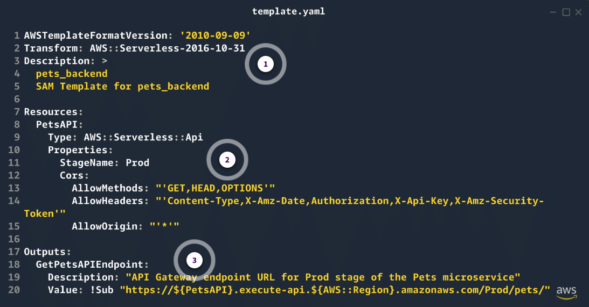

# DI2 Week 2: Building the Pets Microservice

* back to AWS Cloud Institute repo's root [aci.md](../aci.md)
* back to [Developer Intermediate 2](./developer-intermediate-2.md)
* back to repo's main [README.md](../../../README.md)

## Building the Pets Microservice

### Weekly Overview

* Using SAM teplate to create the `pets` microservice being able to pull a current list of available pets whenever a prospective adopter arrives at the shelter.
* This microservice will use API calls routed through a Lambda function to pull information from a DynamoDB table.
* Create an API Gateway to handle API requests from the frontend.
* Create a Lambda function to pull records from a DynamoDB table that stores adoptable pets.
* Use a SAM template to create a DynamoDB table with information about adoptable pets, such as name, age, species, and when they arrived at the shelter.
* Connect the Lambda function to this DynamoDB table to pull pet information.

---

## REVIEWING SERVERLESS MICROSERVICS WITH AWS SAM

### Serverless Microservices with AWS SAM

#### AWS Serverless

A key benefit of serverless is that it helps developers focus on writing code without having to manage the underlying infrastructure. One of the services that simplifies building serverless microservices on Amazon Web Services (AWS) is the AWS Serverless Application Model (AWS SAM).

AWS SAM is an open source framework that makes it possible to build serverless applications on AWS. It provides a syntax to define AWS resources in a YAML or JSON template, making it less difficult to model and provision complex application architectures. AWS SAM can be used to build a wide range of serverless applications, including microservices.

#### Key features of the AWS SAM

##### Template-driven infrastructure

AWS SAM uses a declarative syntax to define the AWS resources required for your application, including AWS Lambda functions, Amazon API Gateway endpoints, Amazon DynamoDB tables, and more. This simplifies version control for your infrastructure and deploying changes consistently.

##### Local testing and debugging

AWS SAM provides a local development environment that lets you test your microservices locally before deploying to AWS. This includes the ability to invoke Lambda functions, test API endpoints, and inspect logs.

##### Automated deployments

AWS CodeBuild and AWS CodePipeline can be used to provide continuous integration and deployment for your microservices with AWS SAM. This makes it convenient to automate the build, test, and deployment process.

##### Monitoring with Amazon CloudWatch Application Insights

SAM integrates with Amazon CloudWatch with Amazon CloudWatch Application Insights, which facilitates monitoring the health and performance of your microservices.

#### AWS SAM and AWS CloudFormation

AWS SAM might be preferred over authoring AWS CloudFormation templates directly, especially in the context of serverless applications. AWS SAM offers a higher level of abstraction, making it easier to define and manage serverless resources with fewer lines of code.

AWS SAM enhances developer productivity by providing local testing and debugging tools. It integrates seamlessly with continuous integration and continuous delivery (CI/CD) workflows for automated deployments. And it includes built-in best practices and monitoring features, all of which streamline the development and deployment of serverless architectures. In contrast, typical CloudFormation templates require more manual configuration and lack these specialized serverless-focused capabilities.

### The Pets Microservice Architecture

The Pets microservice is responsible for managing information about the pets available for adoption at the shelter.

#### Pets microservice architecture

The following diagram reviews the core components of the Pets microservice architecture.


1. **Amazon Simple Storage Service (Amazon S3) bucket**

    This bucket will store the static website assets for the Pets web application user interface.

2. **Amazon API Gateway**

    An API Gateway endpoint will be used to expose the Pets microservice's operations to the frontend application. This allows the frontend to interact with the microservice through a RESTful API.

3. **AWS Lambda function**

    The business logic for the Pets microservice will be encapsulated in a Lambda function. This function will handle retrieving the list of pets.

4. **Amazon DynamoDB table**

    The pet data will be stored in a DynamoDB table. This provides a scalable, serverless data store for the microservice.

#### AWS SAM template

Based on the architecture in the preceding architecture diagram, the template should configure the following resources:

* S3 bucket to store the static website assets for the Pets web application user interface
* API Gateway endpoint named PetsApi that exposes the Pets microservice's operations
* Lambda function named getPets that encapsulates the business logic for the Pets microservice
* DynamoDB table named Pets to store the pet data

#### IAM permissions

The template must also include the necessary AWS Identity and Access Management (IAM) permissions. Specifically, this involves creating a role and associated policy granting Lambda functions the ability to interact with DynamoDB, allowing them to retrieve and store data in the database table.

#### Deployment and usage

To deploy the Pets microservice, you can use the AWS SAM command line interface (CLI) to package and deploy the application to your AWS account. When it is deployed, a frontend application can interact with the Pets microservice through the API Gateway endpoint.

For example, to retrieve the list of pets, a frontend can make a GET request to the correct endpoint. The API Gateway will invoke the PetsFunction Lambda function, which will fetch the pet data from the DynamoDB table and return the response.

By using AWS SAM to build this microservice, you benefit from the simplified infrastructure management, local testing capabilities, and automated deployment features that the framework provides. This helps to streamline the development and operations of the Pet Shelter application's microservices.

### Knowledge Check

#### The development team at the AnyCompany Pet Shelter is implementing their Pets microservice using AWS Serverless Application Model (AWS SAM). They want to track the health and performance of their microservice. Which AWS SAM feature and AWS service combination should they use?

* Monitoring with Amazon CloudWatch

Wrong answers:

* Template-driven infrastructure with AWS CloudFormation
* Local testing and debugging with AWS X-Ray
* Automated deployments with AWS CodeDeploy

##### Explanation

WS SAM integrates with CloudWatch and Amazon CloudWatch Application Insights, which simplifies monitoring the health and performance of microservices.

The other options are incorrect for the following reasons:

* Although CloudFormation is used by AWS SAM, it is not specifically for monitoring.
* Local testing and debugging is for development, not production monitoring.
* CodeDeploy is for deployments, not ongoing monitoring.

#### The development team at AnyCompany Pet Shelter is designing their Pets microservice using AWS Serverless Application Model (AWS SAM). They need to implement an API endpoint that retrieves the list of available pets. Which components should be included in their AWS SAM template to achieve this?

* AWS Lambda function, Amazon DynamoDB table, and Amazon API Gateway endpoint

Wrong answers:

* Amazon EC2 instance, Amazon RDS database, and Application Load Balancer
* Amazon Elastic Container Service (Amazon ECS) task definition, Amazon Aurora database, and Network Load Balancer
* AWS Fargate task, Amazon Neptune database, and Application Load Balancer

##### Explanation

Based on the Pets microservice architecture described, the AWS SAM template should define an API Gateway endpoint (`PetsApi`), a Lambda function (`getPets`), and a DynamoDB table (`pets`) to implement the pet list retrieval functionality. The other options are incorrect for the following reasons:

* EC2 instance, Amazon RDS database, and Application Load Balancer components do not align with the serverless architecture described for the Pets microservice.
* Amazon ECS task definition, Aurora database, and Network Load Balancer components are serverless, but this combination does not match the specific services described in the Pets microservice architecture.
* Fargate task, Neptune database, and Application Load Balancer components involve container management and a graph database, which do not align with the described Pets microservice architecture.

#### The development team at AnyCompany Pet Shelter is implementing their Pets microservice using AWS Serverless Application Model (AWS SAM). They need to store pet data in a way that does not require complex relationships and can automatically scale. Which AWS database service should they specify in their AWS SAM template?

* Amazon DynamoDB

Wrong answers:

* Amazon RDS
* Amazon Redshift
* Amazon Neptune

##### Explanation

DynamoDB is a serverless, NoSQL database that can automatically scale to meet an application's requirements, making it suitable for the Pets microservice's data storage needs.

The other options are incorrect for the following reasons:

* Amazon RDS is a relational database that is better suited when a relational schema is required. This is in contradiction to the requirements of not requiring complex relationships.
* Amazon Redshift is a data warehousing service, which is not suitable for this use case.
* Neptune is a graph database, which is more complex than necessary for this use case.

### Summary

* **Template-driven infrastructure**: AWS SAM uses a declarative syntax to define the necessary AWS resources, including AWS Lambda functions, Amazon API Gateway endpoints, and Amazon DynamoDB tables, simplifying infrastructure management and version control.
* **Local testing and debugging**: AWS SAM provides a local development environment that allows developers to test and debug their microservices before deploying to AWS, including the ability to invoke Lambda functions, test API endpoints, and inspect logs.
* **Automated deployments**: AWS SAM integrates with continuous integration and continuous delivery (CI/CD) tools, like AWS CodeBuild and AWS CodePipeline, enabling automated build, test, and deployment workflows for the microservices.
* **Monitoring with Amazon CloudWatch**: AWS SAM integrates with Amazon CloudWatch, providing visibility into the health and performance of microservices through monitoring and alerting.
* You also reviewed the implementation of the Pets microservice for the AnyCompany Pet Shelter application using AWS SAM, which includes the following:
  * An Amazon S3 bucket to store images and the static website
  * An API Gateway endpoint
  * A Lambda function encapsulating the business logic
  * A DynamoDB table for storing pet data
* By using AWS SAM, a development team benefits from the simplified infrastructure management, local testing capabilities, and automated deployment features, helping to streamline the development and operations of the microservices.

---

## SETTING UP API GATEWAY TO HANDLE REQUESTS ROUTING

### Activity: Adding an API Gateway Endpoint to the AWS SAM Template

To get started with defining and building the Pets microservice architecture, you will perform the following steps in this activity:

1. Determine the routes for the Pets microservice.
2. Build the AWS Serverless Application Model (AWS SAM) template.
3. Validate the AWS SAM template.
4. Deploy the AWS SAM template.
5. Debug an error you will encounter during deployment.

---

#### 1. Determine your routes

The foundation of building any application starts with coming up with and building your API routes, which you will define using the AWS SAM template. The API routes are how you construct the interface to your microservice. These are its inputs and outputs.

In this case, the routing for the Pets microservice has already been defined in the microservice's architecture. Based on the application architecture, there is a single route: `GET /pets`. When this API endpoint is invoked, it should eventually return all the available pets.

The process of building your microservice with the outermost layer first—in this case, the Amazon API Gateway endpoint—can be called `outside-in development`.

You are focusing on the `interface` to your microservice first and building the deeper or lower layers as you go. This is driven by the outermost interface.

---

#### 2. Build the AWS SAM template

Your next step is to build an AWS SAM template in a `template.yaml` file to define the API Gateway endpoint with the `GET /pets` route.

You might start with a template to define an `AWS::Serverless::Ap`i` resource in your `template.yaml` file.

##### Challenge: Build the AWS SAM template

In your practice environment, create a directory called `backend` and a new `template.yaml` file in that directory.

###### Directory structure

This is what the directory structure should look like after these changes.

```text
environment/
├── backend/
│   └── template.yaml
├── pet-shelter-client/
└── setup_instructions.md
```

###### template.yaml file

The `template.yaml` file will contain the following code.



* **Lines 1–5**

    These lines specify that the `template.yaml` file is an AWS SAM template. They also specify the template format version (`AWSTemplateFormatVersion`), its `Transform`,` and the template description.

    Recall that the `Transform: AWS::Serverless-2016-10-31` key-value pair is required for an AWS SAM template. It indicates to AWS SAM that this is an AWS SAM template.

* **Lines 7–15**

    In these lines, the required `Resources` section defines the template's AWS infrastructure. In this case, there's a single resource of `Type: AWS::Serverless::Api`, which is an API Gateway configuration.

    `Properties` specifies the `StageName` and `Cors` configuration of the API Gateway.

    Remember, the `Cors` configuration is needed so requests can be made to the API Gateway across domains.

* **Lines 17–20**

    These lines specify the `Outputs` configuration.

    This optional section configures the values that will be output to the terminal at the end of a deployment, so they are easier to find. In this case, the API Gateway endpoint will be output if the deployment succeeds.

###### Outputs section

* **Accessing API Gateway**

The Outputs section provides the full URL of the API Gateway endpoint that the frontend or other services can use to interact with the backend AWS Lambda function. In this case, it points to the pets resource, which is part of the microservice.

* **Dynamic URL construction**

    The `!Sub` function dynamically constructs the URL using parameters, like the API Gateway ID (`PetsAPI`) and the AWS Region (`AWS::Region`). This ensures that the correct URL is generated based on the deployment environment.

* **Consistent references**

    By defining this output, it makes the API Gateway endpoint accessible for other parts of your infrastructure or for reference in deployment scripts, documentation, or as a return value in automation processes.

* **Visibility in Outputs**

    Outputs like this are typically visible in the AWS CloudFormation stack’s Output section. Copy the URL for testing, integration, or manual use.

* **Facilitating integrations**

    The output simplifies the process of integrating the API with frontend applications or other services by providing a clear and accessible endpoint that developers can use without needing to manually piece together the URL.

###### Review: The !Sub function

In the context of this AWS SAM template, the `!Sub` function is used to dynamically construct the `GetPetsAPIEndpoint` URL by substituting the values for `${PetsAPI}` and `${AWS::Region}`. `${PetsAPI}` is automatically replaced with the logical ID of the `PetsAPI` resource, which represents the API Gateway endpoint created in this template. `${AWS::Region}` is substituted with the Region where the stack is deployed. This makes the resulting URL specific to the environment and Region.

##### Dive deeper: API endpoint construction

The output value `https://${PetsAPI}.execute-api.${AWS::Region}.amazonaws.com/Prod/pets/` is dynamically constructed using the `!Sub` function in the AWS SAM template.

`${PetsAPI}`
This is a placeholder for the API Gateway resource that you defined in the template under the logical ID PetsAPI.

When the AWS SAM template is deployed, ${PetsAPI} is automatically replaced with the actual API Gateway ID that AWS assigns to the API Gateway endpoint. This ID is a unique identifier for the API Gateway endpoint in your AWS account.

`${AWS::Region}`
This placeholder refers to the AWS Region where the AWS SAM template is deployed (us-west-2).

`${AWS::Region}` is automatically substituted with the Region code during deployment, so the URL points to the endpoint in the correct Region for API Gateway.

`execute-api.${AWS::Region}.amazonaws.com`

This is the standard domain structure for API Gateway endpoints in AWS.

The domain is composed of the following:

`execute-api`: A fixed part of the domain that indicates this is an API Gateway endpoint.

`${AWS::Region}`: The Region where the API Gateway is hosted (us-east-1).

`amazonaws.com`: The root domain for AWS services.

`/Prod/pets/`
`/Prod`: This is the stage name specified in the PetsAPI resource (`StageName: Prod`). It indicates that the endpoint is part of the Prod stage of the API Gateway.

`/pets/`: This is the path defined in the API Gateway event associated with the Lambda function (Path: /pets). It represents the specific API endpoint that will trigger the Lambda function.

#### AWS SAM Template Anatomy

Use the following page if you forget any of the details of how to construct an AWS SAM template.

template
Numbered divider3
Validate the AWS SAM template

Before deploying the AWS SAM template that you created, use the AWS SAM command line interface (CLI) to validate the template.

Challenge: Validate the AWS SAM template

Validate the template by running the sam validate command in a terminal in the same working directory as the template.yaml file that you created.

If successful, you will see a message that looks like the following:
/home/ubuntu/environment/template.yaml is a valid AWS SAM template. This is according to basic SAM Validation, for additional validation, please run with "--lint" option

Successful validation message for the AWS SAM template, indicating it is a valid template according to basic SAM validation.

The output of the sam validate command confirms that the AWS SAM template is syntactically valid according to basic validation. This does not guarantee the template will deploy successfully, as additional validation is still required.

AWS SAM template validation only checks for syntax. It does not verify that the AWS SAM template is complete for a successful deployment.

It turns out that although the AWS SAM template is valid, it is incomplete for a successful deployment. 

How can you figure out what's missing?

Numbered divider4
Deploy the AWS SAM template

You've validated the AWS SAM template using the AWS SAM CLI sam validate command.
Validation was successful. Now, try to deploy the template to AWS using the AWS SAM CLI.

Attempting a deployment will let you know whether the template has all the needed components for a successful deployment.

It's ok and even encouraged to experiment. 

Remember, you will occasionally encounter errors that are intended. We've introduced these errors for educational purposes, so you can experience common error scenarios. 

After experiencing an error, read on to see if that error was expected and how you might resolve it.

Challenge: Deploy the AWS SAM template

Run the sam deploy --guided command in the same terminal window.

Recall from a previous week that the sam deploy command with the --guided flag deploys an application in the AWS Cloud using AWS CloudFormation. As a result, the AWS SAM CLI uses prompts to guide you through the deployment.

If you feel like you made any errors after running sam deploy or sam deploy --guided, press Ctrl+C to abort the deployment and run the command after correcting the errors.

Introduction to deploying with AWS SAM

The following page provides an introduction on deployment using the sam deploy command.

Introduction
sam deploy

The following page can be used to deepen your knowledge about sam deploy.

sam deploy
If you deploy using the template that was provided previously, you will be asked to configure the deployment with some options. Several of those options have default values, and others you need to specify. The vast majority of them have corollary command line flags that you could use at the command line when you run the sam deploy command.

The following graphic reviews the output and options of the sam deploy --guided command.

A screenshot representing SAM CLI deployment options given to the user when running sam deploy --guided.


After you specify all the configuration options, many lines of output confirming the deployment configuration to show the deployment has begun, the CloudFormation changeset to be deployed, and the errors that might come up.

You must use pets-backend for the Stack Name field because of how permissions are configured in the practice environment.

Please do not move onto the next step until the deployment completes and you're back at the user prompt.

One such error will occur if you used the previous AWS SAM template. The error will be displayed in the ResourceStatus and ResourceStatusReason columns of a table you will see in the rest of the output.

Error message during AWS SAM template deployment, indicating the REST API does not contain any methods.

The deployment failed due to the AWS SAM template not defining any API Gateway resources or HTTP methods. The template needs to include at least one method or route to successfully deploy the API Gateway endpoint.

Numbered divider5
Debug the AWS SAM deployment

When you deployed the template, you encountered an error. That's ok, the AWS SAM CLI should give you reasons for the failure. Now it's time to debug that failure.

Challenge: Debug the AWS SAM deployment

Time to debug! Under the CloudFormation events from stack operations (refresh every 5.0 seconds) notice the column named ResourceStatus and another column named ResourceStatusReason. In those columns, notice the error status and error status reasons, respectively.

ResourceStatus
CREATE_FAILED

ResourceStatusReason
Resource handler returned message: "The REST API doesn't contain any methods..."

To check your understanding about the error you encountered, answer the following question.

Why do you think the deployment resulted in the error with the ResourceStatus: CREATE_FAILED and ResourceStatusReason: Resource handler returned message: "The REST API doesn't contain any methods..."? (Select TWO.)


The AWS SAM template did not define any API Gateway resources or HTTP methods.


The AWS SAM template did not specify the correct AWS Region.


The AWS SAM template did not include the required AWS::Serverless::HttpApi resource.


The AWS SAM template did not include an AWS::Serverless::Function resource.


The AWS SAM template did not include an AWS::Lambda::Function resource.

SUBMIT


The error you're encountering happens because when you use the AWS::Serverless::Api resource in AWS SAM, it expects to have at least one method or route defined that connects the API Gateway endpoint to a backend, typically a Lambda function. Review the following categories for why this happens.


API Gateway endpoint without methods
An API Gateway endpoint without any methods or routes defined has no functionality. It's like setting up a doorway (API Gateway endpoint) without any rooms (methods or endpoints) behind it. The doorway leads nowhere, which is why the deployment fails—AWS expects you to define what should happen when a request comes through that API Gateway endpoint.


The AWS SAM purpose
AWS SAM is designed to simplify the development of serverless applications, especially by tightly coupling Lambda functions with API Gateway endpoints. AWS SAM automates many of the configurations and best practices required to set up a fully functional serverless API, but it assumes that you’re building an API with defined behavior—meaning, when an API Gateway is set up, it should be ready to handle requests by invoking a Lambda function or returning a mock response.

Review the following categories to learn why you need an HTTP method.


Defines API behavior
The method in API Gateway defines what happens when a request hits a particular route (/pets). It specifies whether the request should be forwarded to a Lambda function, return a static response, or interact with other AWS services. Without any methods, the API Gateway has no instructions on how to handle incoming requests.


AWS SAM and Lambda integration
AWS SAM is particularly focused on creating serverless applications, so it’s optimized to work with Lambda. When you define a AWS::Serverless::Function in AWS SAM, you often tie it directly to an API Gateway method. This allows AWS SAM to manage both resources together, and the API Gateway to be fully functional when deployed.

To successfully deploy an API Gateway endpoint using AWS SAM, you need to define at least one method or route in your API Gateway endpoint that specifies how the API should handle incoming requests. This could be a connection to a Lambda function or a mock integration. Without these methods, the API Gateway endpoint is essentially empty and cannot be deployed, which will result in deployment failure.


### Activity: Adding an Implicit API to the AWS SAM Template

### Knowledge Check

#### A developer is building a serverless application with an Amazon API Gateway endpoint and an AWS Lambda function. They defined the API Gateway endpoint in their AWS Serverless Application Model (AWS SAM) template. When they deploy, it returns an error stating, "The REST API doesn't contain any methods..." What is missing from the AWS SAM template?

* AWS::Serverless::Function resource

Wrong answers:

* AWS::Lambda::Function resource
* AWS::ApiGateway::Method resource
* AWS::ApiGateway::Resource resource

##### Explanation

This resource defines an implicit API, which specifies the HTTP method and path for the API Gateway endpoint. Without this, the API Gateway endpoint does not have any methods defined, leading to the error.

The other options are incorrect for the following reasons:

* AWS::Lambda::Function is an AWS CloudFormation resource, not an AWS SAM resource.
* AWS::ApiGateway::Method is a CloudFormation resource, and AWS SAM handles this implicitly with the AWS::Serverless::Function resource.
* AWS::ApiGateway::Resource is a CloudFormation resource, and AWS SAM handles this implicitly with the AWS::Serverless::Function resource.

#### A developer deployed an AWS Serverless Application Model (AWS SAM) template that includes an Amazon API Gateway endpoint and an AWS Lambda function. However, when they invoke the API Gateway endpoint, an empty response is returned instead of the expected data. What went wrong?

* The Lambda function is not returning the expected data.

Wrong answers:

* The API Gateway endpoint is not configured correctly in the AWS SAM template.
* The AWS SAM template is missing the AWS::Serverless::Function resource.
* The AWS SAM template is missing the AWS::Serverless::Api resource.

##### Explanation

When configuration and deployment are successful, an empty response often points to the Lambda function. It might not be returning data as expected.

The other options are incorrect for the following reasons:

* If the API Gateway endpoint was not configured correctly, the deployment would fail.
* The AWS::Serverless::Function resource is required for the deployment to succeed.
* The AWS::Serverless::Api resource is required for the deployment to succeed.

#### A developer deployed an AWS Serverless Application Model (AWS SAM) template that includes an Amazon API Gateway endpoint and an AWS Lambda function. However, when invoking the API Gateway endpoint, a "403 Forbidden" error is returned. Why did this cause an error?

* The API Gateway endpoint is not configured with the correct cross-origin resource sharing (CORS) settings.

Wrong answers:

* The Lambda function is not returning the expected data.
* The AWS SAM template is missing the AWS::Serverless::Function resource.
* The AWS SAM template is missing the AWS::Serverless::Api resource.

##### Explanation

If the API Gateway endpoint is not configured with the correct CORS settings, it might return a "403 Forbidden" error when invoked from a different domain or origin.

The other options are incorrect for the following reasons:

* If the Lambda function is not returning the expected data, it would not result in a "403 Forbidden" error.
* The AWS::Serverless::Function resource is required for the deployment to succeed, but its absence would not cause a "403 Forbidden" error.
* The AWS::Serverless::Api resource is required for the deployment to succeed, but its absence would not cause a "403 Forbidden" error.

### Summary

* How to add an implicit API definition to the AWS Serverless Application Model (AWS SAM) template using the `AWS::Serverless::Function` resource.
* The purpose of an implicit API and how it gets transformed into an Amazon API Gateway endpoint specification when deploying the AWS SAM template.
* The key components of the `AWS::Serverless::Function` resource, including the `CodeUri`, `Handler`, `Runtime`, `Role`, `Architecture`s, and `Events` properties.
* How to use intrinsic functions, like `!Sub`, and pseudo parameters, like `${AWS::AccountId}`, in the AWS SAM template.
* The process of revalidating and redeploying the updated AWS SAM template with the implicit API definition.
* The importance of implementing a basic AWS Lambda function handler to satisfy the requirement of returning an empty list of pets initially.
* How to test the API Gateway endpoint and Lambda function integration using a curl request.

### Additional Resources

* [AWS CloudFormation resources generated when AWS::Serverless::Function is specified](https://docs.aws.amazon.com/serverless-application-model/latest/developerguide/sam-specification-generated-resources-function.html)

---

## BUILDING AND TESTING THE MICROSERVICE LAMBDA FUNCTION

### Activity: Updating the Lambda Function Code to Call DynamoDB

```python
import boto3
import os
import json

def lambda_handler(event, context):
    # Retrieve the table name and region from environment variables
    table_name = 'PetsTable'
    region_name = os.environ['AWS_REGION']

    # Initialize a DynamoDB client
    dynamodb = boto3.resource('dynamodb', region_name=region_name)
    table = dynamodb.Table(table_name)

    try:
        response = table.scan()
        pets = response['Items']

        # Prepare a successful response containing the pets
        return {
            'statusCode': 200,
            'headers': {
                'Access-Control-Allow-Headers': 'Content-Type,X-Amz-Date,Authorization,X-Api-Key,X-Amz-Security-Token',
                'Access-Control-Allow-Origin': '*',  # Allow requests from any origin
                'Access-Control-Allow-Methods': 'GET,HEAD,OPTIONS'
            },
            'body': json.dumps({
                'pets': pets
            })
        }
    except Exception as e:
        print(e)
        # Return a server error if the scan fails
        return {
            'statusCode': 500,
            'headers': {
                'Access-Control-Allow-Headers': 'Content-Type,X-Amz-Date,Authorization,X-Api-Key,X-Amz-Security-Token',
                'Access-Control-Allow-Origin': '*',  # Allow requests from any origin
                'Access-Control-Allow-Methods': 'GET,HEAD,OPTIONS'
            },
            'body': json.dumps({
                'error': str(e)
            })
        }
```

### Knowledge Check

#### A new developer on the team made some improvements to the getPets AWS Lambda function and needs to update it in AWS. Which command should they use to deploy the updated code?

* `sam deploy —guided`

Wrong anwers:

* `aws lambda update-function-code`
* `sam build`
* `aws cloudformation update-stack`

##### Explanation

The `sam deploy —guided` command is used to deploy the updated Lambda function code and any AWS Serverless Application Model (AWS SAM) project configuration using the AWS SAM command line interface (CLI).

The other options are incorrect for the following reasons:

* Although `aws lambda update-function-code` can update Lambda function code, one would need to manually build and zip the code to include it in the CLI request.
* `sam build` only builds the AWS SAM application locally but does not deploy it.
* `aws cloudformation update-stack` updates AWS CloudFormation stacks directly, but one would need to manually author a changeset to change the code.

#### The team is planning to deploy the Pets microservice across multiple AWS Regions. Each AWS Lambda function will run in the same Region as the table that it is trying to access. After reviewing the Lambda function code, a developer notices the use of `os.environ['AWS_REGION']` to set the `region_name` in the boto3 client. What is the primary benefit of this?

* It allows the function to work in any AWS Region without code changes.

Wrong answers:

* It is required for Amazon DynamoDB authentication.
* It improves the Lambda function's performance.
* It is used to route requests to different Amazon DynamoDB tables.

##### Explanation

Using `os.environ['AWS_REGION']` retrieves the Region from the Lambda function's environment variables, which defaults to the Region where the function is running. This minimizes code changes if you deploy the service in multiple Regions.

The other options are incorrect for the following reasons:

* **It is required for Amazon DynamoDB authentication**: Although the Region is used in authentication, this specific usage is not required for authentication.
* **It improves the Lambda function's performance**: Using environment variables does not directly improve performance.
* **It is used to route requests to different Amazon DynamoDB tables**: In this scenario, the Region for the DynamoDB table is always the same as the Lambda function, and it is not used to route to different DynamoDB tables.

#### The AnyCompany Pet Shelter team deployed an AWS Lambda function that attempts to pull data from an Amazon DynamoDB table. The Lambda function is fronted by an Amazon API Gateway endpoint. The table has not yet been created. What kind of error should they expect to see if the Lambda function is invoked via curl through the API Gateway endpoint?

* `{"message":"Internal server error"}`

Wrong answers:

* `{"message":"The table does not exist"}`
* `{"message":"Access denied"}`
* `{"message":"The table is empty"}`

##### Explanation

When a Lambda function encounters an unhandled exception, such as attempting to access a nonexistent DynamoDB table, API Gateway will return a generic "Internal server error" message. This is because the error is not caught and handled within the Lambda function, causing it to fail unexpectedly.

The other options are incorrect for the following reasons:

* While `{"message":"The table does not exist"}` accurately describes the underlying issue, it's not the error message that would be returned through API Gateway. Neither Lambda nor API Gateway automatically generates this specific error message for missing DynamoDB tables.
* `{"message":"Access denied"}` would not be an error message that would be generated for a nonexistent table.
* `{"message":"The table is empty"}` is not an error message that would be generated for a nonexistent table.

### Summary

* How to review and update existing AWS Lambda function code to retrieve data from an Amazon DynamoDB table using the Boto3 client.
* How to construct a full Amazon API Gateway response, including status code, headers, and the list of pets retrieved from DynamoDB.
* Strategies for catching exceptions in the Lambda function code and returning meaningful error messages to the API Gateway.
* The importance of ensuring the required DynamoDB table exists before deploying the updated Lambda function.
* Commands for deploying the updated Lambda function code, including using the AWS Serverless Application Model (AWS SAM) command line interface (CLI).
* The benefit of using `os.environ['AWS_REGION']` to set the AWS Region for the Boto3 client, allowing the Lambda function to work in any Region without code changes.

---

## USING DYNAMODB TO STORE DATA IN A SERVERLESS APPLICATION

### Activity: Defining a DynamoDB Table Using AWS SAM

### Activity: Populating the DynamoDB Table

### Knowledge Check

### Summary

---

## INTEGRATING THE MICROSERVICE WITH REACT FRONTEND

### Activity: Updating the React Code to Fetch Data from the API

### Activity: Uploading Images to an S3 Bucket

### Knowledge Check

### Summary

---

## HANDS-ON LAB ACTIVITY

### Lab: Creating a Get Products Microservice
