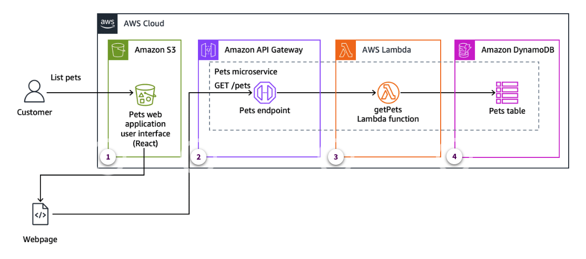

# DI2 Week 2: Building the Pets Microservice

* back to AWS Cloud Institute repo's root [aci.md](../aci.md)
* back to [Developer Intermediate 2](./developer-intermediate-2.md)
* back to repo's main [README.md](../../../README.md)

## Building the Pets Microservice

### Weekly Overview

* Using SAM teplate to create the `pets` microservice being able to pull a current list of available pets whenever a prospective adopter arrives at the shelter.
* This microservice will use API calls routed through a Lambda function to pull information from a DynamoDB table.
* Create an API Gateway to handle API requests from the frontend.
* Create a Lambda function to pull records from a DynamoDB table that stores adoptable pets.
* Use a SAM template to create a DynamoDB table with information about adoptable pets, such as name, age, species, and when they arrived at the shelter.
* Connect the Lambda function to this DynamoDB table to pull pet information.

---

## REVIEWING SERVERLESS MICROSERVICS WITH AWS SAM

### Serverless Microservices with AWS SAM

#### AWS Serverless

A key benefit of serverless is that it helps developers focus on writing code without having to manage the underlying infrastructure. One of the services that simplifies building serverless microservices on Amazon Web Services (AWS) is the AWS Serverless Application Model (AWS SAM).

AWS SAM is an open source framework that makes it possible to build serverless applications on AWS. It provides a syntax to define AWS resources in a YAML or JSON template, making it less difficult to model and provision complex application architectures. AWS SAM can be used to build a wide range of serverless applications, including microservices.

#### Key features of the AWS SAM

##### Template-driven infrastructure

AWS SAM uses a declarative syntax to define the AWS resources required for your application, including AWS Lambda functions, Amazon API Gateway endpoints, Amazon DynamoDB tables, and more. This simplifies version control for your infrastructure and deploying changes consistently.

##### Local testing and debugging

AWS SAM provides a local development environment that lets you test your microservices locally before deploying to AWS. This includes the ability to invoke Lambda functions, test API endpoints, and inspect logs.

##### Automated deployments

AWS CodeBuild and AWS CodePipeline can be used to provide continuous integration and deployment for your microservices with AWS SAM. This makes it convenient to automate the build, test, and deployment process.

##### Monitoring with Amazon CloudWatch Application Insights

SAM integrates with Amazon CloudWatch with Amazon CloudWatch Application Insights, which facilitates monitoring the health and performance of your microservices.

#### AWS SAM and AWS CloudFormation

AWS SAM might be preferred over authoring AWS CloudFormation templates directly, especially in the context of serverless applications. AWS SAM offers a higher level of abstraction, making it easier to define and manage serverless resources with fewer lines of code.

AWS SAM enhances developer productivity by providing local testing and debugging tools. It integrates seamlessly with continuous integration and continuous delivery (CI/CD) workflows for automated deployments. And it includes built-in best practices and monitoring features, all of which streamline the development and deployment of serverless architectures. In contrast, typical CloudFormation templates require more manual configuration and lack these specialized serverless-focused capabilities.

### The Pets Microservice Architecture

The Pets microservice is responsible for managing information about the pets available for adoption at the shelter.

#### Pets microservice architecture

The following diagram reviews the core components of the Pets microservice architecture.

1. **Amazon Simple Storage Service (Amazon S3) bucket**

    This bucket will store the static website assets for the Pets web application user interface.

2. **Amazon API Gateway**

    An API Gateway endpoint will be used to expose the Pets microservice's operations to the frontend application. This allows the frontend to interact with the microservice through a RESTful API.

3. **AWS Lambda function**

    The business logic for the Pets microservice will be encapsulated in a Lambda function. This function will handle retrieving the list of pets.

4. **Amazon DynamoDB table**

    The pet data will be stored in a DynamoDB table. This provides a scalable, serverless data store for the microservice.

#### AWS SAM template

Based on the architecture in the preceding architecture diagram, the template should configure the following resources:

* S3 bucket to store the static website assets for the Pets web application user interface
* API Gateway endpoint named PetsApi that exposes the Pets microservice's operations
* Lambda function named getPets that encapsulates the business logic for the Pets microservice
* DynamoDB table named Pets to store the pet data

#### IAM permissions

The template must also include the necessary AWS Identity and Access Management (IAM) permissions. Specifically, this involves creating a role and associated policy granting Lambda functions the ability to interact with DynamoDB, allowing them to retrieve and store data in the database table.

#### Deployment and usage

To deploy the Pets microservice, you can use the AWS SAM command line interface (CLI) to package and deploy the application to your AWS account. When it is deployed, a frontend application can interact with the Pets microservice through the API Gateway endpoint.

For example, to retrieve the list of pets, a frontend can make a GET request to the correct endpoint. The API Gateway will invoke the PetsFunction Lambda function, which will fetch the pet data from the DynamoDB table and return the response.

By using AWS SAM to build this microservice, you benefit from the simplified infrastructure management, local testing capabilities, and automated deployment features that the framework provides. This helps to streamline the development and operations of the Pet Shelter application's microservices.

### Knowledge Check

#### The development team at the AnyCompany Pet Shelter is implementing their Pets microservice using AWS Serverless Application Model (AWS SAM). They want to track the health and performance of their microservice. Which AWS SAM feature and AWS service combination should they use?

* Monitoring with Amazon CloudWatch

Wrong answers:

* Template-driven infrastructure with AWS CloudFormation
* Local testing and debugging with AWS X-Ray
* Automated deployments with AWS CodeDeploy

##### Explanation

WS SAM integrates with CloudWatch and Amazon CloudWatch Application Insights, which simplifies monitoring the health and performance of microservices.

The other options are incorrect for the following reasons:

* Although CloudFormation is used by AWS SAM, it is not specifically for monitoring.
* Local testing and debugging is for development, not production monitoring.
* CodeDeploy is for deployments, not ongoing monitoring.

#### The development team at AnyCompany Pet Shelter is designing their Pets microservice using AWS Serverless Application Model (AWS SAM). They need to implement an API endpoint that retrieves the list of available pets. Which components should be included in their AWS SAM template to achieve this?

* AWS Lambda function, Amazon DynamoDB table, and Amazon API Gateway endpoint

Wrong answers:

* Amazon EC2 instance, Amazon RDS database, and Application Load Balancer
* Amazon Elastic Container Service (Amazon ECS) task definition, Amazon Aurora database, and Network Load Balancer
* AWS Fargate task, Amazon Neptune database, and Application Load Balancer

##### Explanation

Based on the Pets microservice architecture described, the AWS SAM template should define an API Gateway endpoint (`PetsApi`), a Lambda function (`getPets`), and a DynamoDB table (`pets`) to implement the pet list retrieval functionality. The other options are incorrect for the following reasons:

* EC2 instance, Amazon RDS database, and Application Load Balancer components do not align with the serverless architecture described for the Pets microservice.
* Amazon ECS task definition, Aurora database, and Network Load Balancer components are serverless, but this combination does not match the specific services described in the Pets microservice architecture.
* Fargate task, Neptune database, and Application Load Balancer components involve container management and a graph database, which do not align with the described Pets microservice architecture.

#### The development team at AnyCompany Pet Shelter is implementing their Pets microservice using AWS Serverless Application Model (AWS SAM). They need to store pet data in a way that does not require complex relationships and can automatically scale. Which AWS database service should they specify in their AWS SAM template?

* Amazon DynamoDB

Wrong answers:

* Amazon RDS
* Amazon Redshift
* Amazon Neptune

##### Explanation

DynamoDB is a serverless, NoSQL database that can automatically scale to meet an application's requirements, making it suitable for the Pets microservice's data storage needs.

The other options are incorrect for the following reasons:

* Amazon RDS is a relational database that is better suited when a relational schema is required. This is in contradiction to the requirements of not requiring complex relationships.
* Amazon Redshift is a data warehousing service, which is not suitable for this use case.
* Neptune is a graph database, which is more complex than necessary for this use case.

### Summary

* **Template-driven infrastructure**: AWS SAM uses a declarative syntax to define the necessary AWS resources, including AWS Lambda functions, Amazon API Gateway endpoints, and Amazon DynamoDB tables, simplifying infrastructure management and version control.
* **Local testing and debugging**: AWS SAM provides a local development environment that allows developers to test and debug their microservices before deploying to AWS, including the ability to invoke Lambda functions, test API endpoints, and inspect logs.
* **Automated deployments**: AWS SAM integrates with continuous integration and continuous delivery (CI/CD) tools, like AWS CodeBuild and AWS CodePipeline, enabling automated build, test, and deployment workflows for the microservices.
* **Monitoring with Amazon CloudWatch**: AWS SAM integrates with Amazon CloudWatch, providing visibility into the health and performance of microservices through monitoring and alerting.
* You also reviewed the implementation of the Pets microservice for the AnyCompany Pet Shelter application using AWS SAM, which includes the following:
  * An Amazon S3 bucket to store images and the static website
  * An API Gateway endpoint
  * A Lambda function encapsulating the business logic
  * A DynamoDB table for storing pet data
* By using AWS SAM, a development team benefits from the simplified infrastructure management, local testing capabilities, and automated deployment features, helping to streamline the development and operations of the microservices.

---

## SETTING UP API GATEWAY TO HANDLE REQUESTS ROUTING

### Activity: Adding an API Gateway Endpoint to the AWS SAM Template

### Activity: Adding an Implicit API to the AWS SAM Template

### Knowledge Check

### Summary

### Additional Resources

---

## BUILDING AND TESTING THE MICROSERVICE LAMBDA FUNCTION

### Activity: Updating the Lambda Function Code to Call DynamoDB

### Knowledge Check

### Summary

---

## USING DYNAMODB TO STORE DATA IN A SERVERLESS APPLICATION

### Activity: Defining a DynamoDB Table Using AWS SAM

### Activity: Populating the DynamoDB Table

### Knowledge Check

### Summary

---

## INTEGRATING THE MICROSERVICE WITH REACT FRONTEND

### Activity: Updating the React Code to Fetch Data from the API

### Activity: Uploading Images to an S3 Bucket

### Knowledge Check

### Summary

---

## HANDS-ON LAB ACTIVITY

### Lab: Creating a Get Products Microservice
